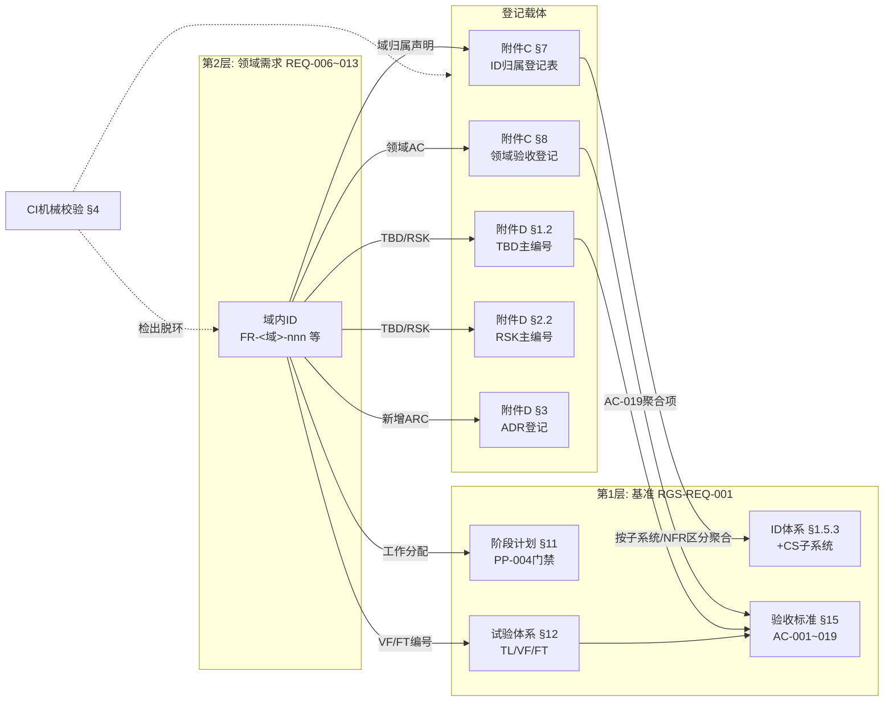
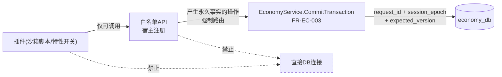
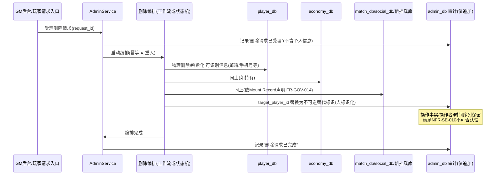
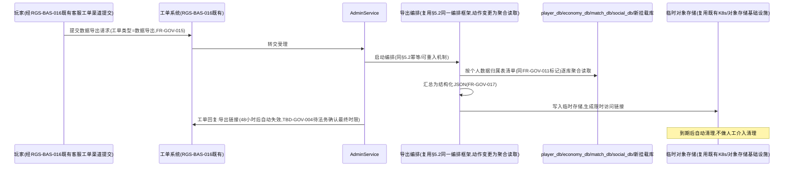

# 基本设计书（基本設計書 / Basic Design Document）

**体系治理与横切关注点 Baseline Governance & Cross-Cutting Concerns**

| 项目 | 内容 |
|---|---|
| 文档编号 | RGS-BAS-009 |
| 版本 | 0.7 |
| 父文档 | RGS-REQ-013 需求定义书 第4章（ARC-025／ARC-026）、第5章（横切需求） |
| 依据标准 | IPA『共通フレーム 2013（SLCP-JCF2013）』基本设计工程 |
| 制定日 | 2026-08-16 |
| 制定者 | 架构师 |
| 保密级别 | 内部限定（Internal Use Only） |

## 修订历史（改訂履歴 / Revision History）

| 版本 | 修订日 | 修订者 | 修订内容 | 影响章节 |
|---|---|---|---|---|
| 0.1 | 2026-08-16 | 架构师 | 初版制定。将ARC-025展开为ID登记表结构与治理闭环的CI机械校验设计；将ARC-026展开为OLU定义、初始分配与预算台账机制；并给出§5横切需求的落地设计 | 全部 |
| 0.2 | 2026-08-16 | 架构师 | **§4 CI机械校验从纯设计落地为实际实现**（处置TBD-PAT-002/ISS-073）：新增`scripts/check-docs-consistency.sh`+`.github/workflows/docs-consistency.yml`，实现ARC序列/ADR登记/TBD登记/风险登记/README死链共5项检查（原设计7项中的4项+1项新增）；标注归属为GitHub Actions独立工作流（代码侧流水线尚不存在，暂为阶段性例外）；剩余3项（域名段范围/AC登记/OLU台账）与跨文档章节引用留待后续迭代 | §4 |
| 0.3 | 2026-08-17 | 架构师 | **ISS-032决议执行**（负责人指示：加预算，推迟智能层）：§3.1总预算由160提升至210 OLU/月；§3.2.3余额由−22（超支）更新为+28（正常）；§3.3处置后余额同步更新为+52，明确R-1〜R-6回收计划仍须执行、预算提升不作废回收义务 | §3.1、§3.2.3、§3.3 |
| 0.4 | 2026-08-17 | 架构师 | **交叉审核修正**：§3.3"回收后余额"此前误将非必须执行项R-5（2 OLU，待ISS-033决议）计入计算，与同段"判定"文字明确"R-1〜R-4、R-6为必须执行项"相矛盾；本次修正为仅计入22 OLU必须执行项，回收后余额由+52改为+50，R-5改列为独立的可选追加项说明 | §3.2.3、§3.3 |
| 0.5 | 2026-08-17 | 架构师 | **补齐设计缺口**（详细设计阶段前的完备性核对发现）：新增§5.5挂载回滚时限的拆分设计——FR-GOV-040已在需求侧将回滚SLA拆为"流量回退"（p99<10秒）与"版本回滚"（另计）两项独立目标，但基本设计正文此前完全没有对应的实现落位，只在追溯性表带过 | FR-GOV-040 |
| 0.6 | 2026-08-17 | 架构师 | **新增§5.2.1数据导出编排设计**（同步RGS-REQ-013 v0.3，FR-GOV-015〜017）：复用§5.2删除编排同一状态机/工作流实现，仅参数化目标动作（去标识化→聚合读取），导出范围与删除范围共享同一份个人数据归属表清单；临时存储默认自托管对象存储，限时访问链接到期自动回收 | §5.2.1新增 |
| 0.7 | 2026-09-01 | 架构师 (Mavis 接手 agent per DEC-008) | 落实"各BAS文档功能章节加log设计且区分debug/release级"总要求（per Ulysses 2026-09-01 15:52 JST 决策，4 拍板选项：全部 36 个BAS / 详尽版5列表 / 派worker并行 / BAS-004同步升级）：§2.1／§2.2／§2.3／§3.1／§3.2／§3.3／§3.4／§4／§5.1／§5.2／§5.2.1／§5.3／§5.4／§5.5／§6.1 全部 15 个功能章节加"本功能日志设计"5 列详尽版（字段名／触发条件／频率估算／采样策略／脱敏与成本），字段名前缀统一为 `gov.*` 区别于其他域；引用 BAS-001 v1.5 §4.8.3 模板（commit 32d9eb6）+ BAS-003 v0.3 样板（commit 75a001c）+ BAS-004 v0.3 §4.2 二维矩阵 + §4.3 字段 + §5.1 脱敏 + §6.2 强制全采样（commit 47e26b0/0ee6262）；覆盖 ARC-025 治理闭环 + ARC-026 OLU 预算 + §4 CI 机械校验 + §5 横切需求（FR-GOV-001〜040）的"ID 登记/OLU 申领/OLU 回收/CI 检查/插件白名单/数据删除编排/数据导出编排/配置分发/经济插件单点判定/挂载回滚"全链路；显式区分 `info!`/`warn!`/`error!`（release 必出，编译期常驻，§6.2 强制全采样）与 `trace!`/`debug!`（`#[cfg(debug_assertions)]` 守护，debug-only，release build 完全剔除零运行时开销）两类事件；治理事件（CI 检查失败/ADR 登记/TBD 登记/OLU 余额预警）→ release 必出，CI 机械校验的"哪条规则失败/原始输出"等详细日志 → debug-only；§6.1 检查清单新增 log 章节上线检查项；§7 追溯性新增 AC-GOV-006（debug-only 宏 release 完全剔除）与 AC-GOV-007（每功能 BAS 文档须含本功能 log 设计章节），与 BAS-001 v1.5 §4.8.3.4 / BAS-002 v0.4 §13 / BAS-003 v0.3 §13 / BAS-004 v0.3 §12 形成统一规范 | §2.1／§2.2／§2.3／§3.1／§3.2／§3.3／§3.4／§4／§5.1／§5.2／§5.2.1／§5.3／§5.4／§5.5／§6.1／§7 |

## 审批栏（承認欄 / Approval）

| 角色 | 姓名 | 审批日 | 备注 |
|---|---|---|---|
| 制定（起草） | 架构师 | 2026-08-16 | — |
| 评审（SRE） | | | §3 OLU初始分配是否反映真实运维成本 |
| 评审（技术） | | | §4 CI机械校验是否可实现且不产生高误报 |
| 审批（负责人） | | | 本文档的基准化 |

---

## 目录

1. [前言](#1-前言)
2. [治理闭环的结构设计](#2-治理闭环的结构设计)
3. [运维负荷预算机制（ARC-026落地）](#3-运维负荷预算机制arc-026落地)
4. [治理闭环的CI机械校验设计](#4-治理闭环的ci机械校验设计)
5. [横切需求的落地设计](#5-横切需求的落地设计)
6. [标准化检查清单](#6-标准化检查清单)
7. [追溯性（ARC-025／026 → 本设计书章节）](#7-追溯性arc-025026-本设计书章节)

---

# 1. 前言

本文档是RGS-REQ-013第4章（ARC-025治理闭环的重新闭合、ARC-026运维负荷预算）与第5章（横切需求）的系统级展开。本文档的特殊性在于：**其设计对象不是运行时系统，而是文档体系与工程流程本身**。因此本文档的"组件"是登记表、台账与CI检查，而非服务与数据库。

本文档遵循RGS-BAS-001既有记述规则（§1.4强度用语、图示规则）。

---

# 2. 治理闭环的结构设计

## 2.1 闭环的完整结构

**设计要点**：闭环之所以有效，在于**每一条从领域文档出发的边都必须落到某个登记载体上**，而CI机械校验（§4）负责检出未落地的边。这与RGS-BAS-002 §5.3"NetworkPolicy默认拒绝"、RGS-BAS-004 §9"CI静态检查"采用的是同一思路：**把规范转化为可机械检出的约束，而非依赖人工记忆**。ARC-025本身即遵循这一在体系内已反复出现的模式。

### 2.1 本功能日志设计

本节覆盖治理闭环**结构层**的观察点——闭环结构本身是设计产物（无运行时事件），但闭环各节点（ID 登记、领域验收、TBD/RSK 登记、ADR 登记）入图时产生 release 必出事件，便于 SRE/架构师按 `domain` 维度追踪"哪些边已落地、哪些边尚未落地"。

| 字段名（field） | 触发条件（trigger） | 频率估算（frequency） | 采样策略（sampling） | 脱敏与成本（redact & cost） |
|---|---|---|---|---|
| `gov.governance_loop.edge_landed` | 任一领域文档新增/修订的边（ID 归属声明、AC 登记、TBD/RSK/ADR 登记、工作分配、VF/FT 编号）成功落到登记载体（C7／C8／D1／D2／D3／PH／TEST／AC） | ~0.5/h（按领域文档修订频次） | release 必出（100% 强制全采样，per BAS-004 v0.3 §6.2） | 含`source_doc`／`edge_kind`／`carrier`；约 200B/条 × 0.5/h = 极低 |
| `gov.governance_loop.edge_unlanded` | CI 机械校验（§4）检出"边未落到登记载体"（如新增 FR-XXX-nnn 但 XXX 不在 C7） | 偶发（首版登记遗漏） | release 必出（100% 强制全采样） | 含`source_doc`／`edge_kind`／`unlanded_target`；约 280B/条 |
| `gov.governance_loop.ci_closure_signal` | CI 机械校验全 8 项检查汇总结果（pass/fail 项数 + 阻断/警告区分） | ~12 次/日（每 push） | release 必出（100% 强制全采样） | 含`run_id`／`passed`／`failed`／`warning`；约 250B/条 |
| `gov.governance_loop.debug.closure_path_dump` | 完整闭环边落地路径 dump（mermaid JSON 序列化） | ~0.5/h | **debug-only**（`#[cfg(debug_assertions)]` 守护，release build 完全剔除） | 约 3-8KB/条（release 剔除，零运行时开销） |
| `gov.governance_loop.debug.unlanded_edge_diff` | 未落地边的来源-目标详细 diff（含原始文本片段） | 偶发 | **debug-only**（`#[cfg(debug_assertions)]` 守护） | 约 1-3KB/条（release 剔除） |

**debug-only 守护要点**（落实 BAS-004 v0.3 §4.4）：
- `gov.governance_loop.debug.closure_path_dump` 在大规模 workspace 下可能 8KB+ —— release build 完全剔除，避免 RUST_LOG=debug 误开时撑爆生产日志通道
- `gov.governance_loop.ci_closure_signal` 是**生产事件**，**不**可 debug-only —— release 必出 + §6.2 强制全采样，便于 CI Dashboard 按 `run_id` 维度回溯

## 2.2 附件C §7 ID归属登记表结构

| 列 | 内容 | 用途 |
|---|---|---|
| 域名段 | 如`SEC` | 主键 |
| 出处文档 | 如`RGS-REQ-010` | 溯源 |
| 归属子系统 | RGS-REQ-001§5.1的12个符号之一，或`全体` | 使附件C§2按子系统聚合仍可覆盖新需求 |
| 归属NFR区分 | 第9章6个区分之一（可多个） | 使附件B非功能等级评定与附件C§5验证手段表可覆盖新需求 |
| FR编号范围 | 如`FR-SEC-001〜042` | 完整性核对 |
| NFR编号范围 | 如`NFR-SEC-001〜005` | 同上 |
| 注册日／注册者 | — | 变更管理 |

### 2.2 本功能日志设计

本节覆盖**附件C §7 ID 归属登记表**的读写事件——登记表本身是文档载体（无运行时），但"新增行/修订行/合规性检查"产生 release 必出事件，与 §2.1 边落地事件是同一序列的不同字段。

| 字段名（field） | 触发条件（trigger） | 频率估算（frequency） | 采样策略（sampling） | 脱敏与成本（redact & cost） |
|---|---|---|---|---|
| `gov.id_registry.row_registered` | 附件C §7 新增一行（域名段注册，首次出现的 `XXX`） | 极低（每月 0-2 行） | release 必出（100% 强制全采样，per BAS-004 v0.3 §6.2） | 含`domain_segment`／`source_doc`／`subsystem`；约 200B/条 |
| `gov.id_registry.row_updated` | 既有行的归属子系统/NFR 区分/编号范围字段修订 | 极低 | release 必出（100% 强制全采样） | 含`domain_segment`／`field_changed`；约 220B/条 |
| `gov.id_registry.duplicate_segment_detected` | CI 校验检出重复域名段（C7 主键冲突） | 配置错（应极少） | release 必出（100% 强制全采样） | 含`domain_segment`／`existing_doc`／`new_doc`；约 250B/条 |
| `gov.id_registry.unregistered_segment_detected` | CI 校验扫描 `docs/` 全部文档，提取 `FR-XXX-nnn`/`NFR-XXX-nnn` 但 `XXX` 不在 C7 | 偶发（首版） | release 必出（100% 强制全采样） | 含`unregistered_segment`／`offending_doc`；约 250B/条 |
| `gov.id_registry.debug.registration_diff` | 修订前后字段对照（红绿 diff） | 极低 | **debug-only**（`#[cfg(debug_assertions)]` 守护，release build 完全剔除） | 约 1-2KB/条（release 剔除） |
| `gov.id_registry.debug.mermaid_text_dump` | 附件C §7 表格的 mermaid 文本化 dump | 极低 | **debug-only**（`#[cfg(debug_assertions)]` 守护） | 约 2-5KB/条（release 剔除） |

**debug-only 守护要点**：
- `gov.id_registry.debug.registration_diff` 在长编号范围（如 `FR-SEC-001〜042`）修订时可能 2KB+ —— release 完全剔除
- `gov.id_registry.unregistered_segment_detected` 是**阻断级**信号（per §4 表"未注册域名段"阻断项）—— release 必出，不挂 `#[cfg]`

## 2.3 主编号映射表结构（附件D §1.3／§2.3内嵌）

TBD／RSK／ISS三类参与治理闭环的ID，在附件D**新设的领域文档小节**中以带「域内ID」列的表登记，与主编号并列，形成双向可查：

| 主编号 | 域内ID | 其余既有列（问题／期限／负责人等） |
|---|---|---|
| TBD-020 | TBD-SEC-001 | …… |

**为何新设小节而非扩充既有表**：既有的附件D§1.2／§2.2表结构不含「域内ID」列，直接扩列须改写全部既有行，是高风险的机械操作且与基准文档范围的登记内容混杂。新设§1.3／§2.3并声明"与§1.2／§2.2合称问题管理表／风险管理表"，在保持既有表原样的前提下容纳两级映射。

**为何不新建独立映射文档**：新建独立文档将产生第三处需要同步维护的位置，与ARC-026回收运维负荷的方向相悖。在登记表内加一列，使登记与映射在同一次编辑中完成。

> 领域验收标准（`AC-<域>-nnn`）不分配主编号，而是整体经AC-019聚合项进入门禁，登记于附件C§8（GOV-AC-002／003）。

### 2.3 本功能日志设计

本节覆盖**附件D §1.3／§2.3 主编号映射表**的读写事件——TBD/RSK/ISS 三类问题 ID 与域内 ID 的双向映射，CI 校验时产生 release 必出事件。

| 字段名（field） | 触发条件（trigger） | 频率估算（frequency） | 采样策略（sampling） | 脱敏与成本（redact & cost） |
|---|---|---|---|---|
| `gov.problem_mapping.added` | 附件D §1.3（TBD）或 §2.3（RSK）新增一行映射 | 偶发 | release 必出（100% 强制全采样，per BAS-004 v0.3 §6.2） | 含`master_id`／`domain_id`／`kind`（tbd/rsk）；约 200B/条 |
| `gov.problem_mapping.broken_reference` | CI 校验检出 TBD/RSK 主编号存在但映射表无对应行 | 偶发（遗漏） | release 必出（100% 强制全采样） | 含`orphan_id`／`kind`；约 220B/条 |
| `gov.problem_mapping.collision` | 同一主编号在两处登记表出现（如附件D §1.2 与 §1.3 同时登记） | 配置错 | release 必出（100% 强制全采样） | 含`master_id`／`duplicate_locations`；约 250B/条 |
| `gov.problem_mapping.domain_id_malformed` | 域内ID 不符合 `TBD-XXX-nnn`／`RSK-XXX-nnn` 命名规则 | 偶发 | release 必出（100% 强制全采样） | 含`offending_value`；约 200B/条 |
| `gov.problem_mapping.debug.dual_table_diff` | §1.2 与 §1.3 两表主编号 diff（含未映射主编号列表） | 极低 | **debug-only**（`#[cfg(debug_assertions)]` 守护，release build 完全剔除） | 约 1-3KB/条（release 剔除） |
| `gov.problem_mapping.debug.domain_id_classification` | 域内ID 分类详情（哪些属于 TBD 域、哪些属于 RSK 域） | 极低 | **debug-only**（`#[cfg(debug_assertions)]` 守护） | 约 500B/条（release 剔除） |

**debug-only 守护要点**：
- `gov.problem_mapping.broken_reference` 是**阻断级**信号（per §4 表"未登记TBD/未登记风险"阻断项）—— release 必出，不挂 `#[cfg]`
- `gov.problem_mapping.debug.dual_table_diff` 涉及全部主编号的 diff 输出，在大型项目下可能 3KB+ —— release 完全剔除

---

# 3. 运维负荷预算机制（ARC-026落地）

## 3.1 OLU（运维负荷单位）的定义

| 项目 | 内容 |
|---|---|
| 定义 | 1 OLU ＝ **SRE每月约1人・小时的常态运维投入**（含例行操作、告警响应、版本跟进、故障排查的期望值） |
| 性质 | **相对单位**。设立目的是使不同性质的运维面可以相加比较，而非追求绝对精确 |
| 校准 | 绝对校准依附件D RSK-002既有的征兆检测方法——"SRE值班件数・应对时长的月度统计"——自PH-4起按季度修正（TBD-GOV-001） |
| 总预算 | **210 OLU/月**（2026-08-17负责人决议提升，处置ISS-032，详见下方"预算调整"说明；原公式推导值为160） |

### 3.1 本功能日志设计

本节覆盖**OLU 定义/校准**的观察点——OLU 本身是相对单位（无运行时），但"季度校准/预算调整/校准数据源"产生 release 必出事件，便于审计回溯每次 OLU 总量变更的原因。

| 字段名（field） | 触发条件（trigger） | 频率估算（frequency） | 采样策略（sampling） | 脱敏与成本（redact & cost） |
|---|---|---|---|---|
| `gov.olu.total_budget_initialized` | OLU 总预算初始化/重新设定（如 ISS-032 决议 160→210 的预算提升事件） | 极低（决议级） | release 必出（100% 强制全采样，per BAS-004 v0.3 §6.2） | 含`old_value`／`new_value`／`decision_ref`（如 ISS-032）；约 250B/条 |
| `gov.olu.calibration_quarterly` | 每季度按 SRE 实测数据校准（PH-4 起，GOV-OLU-004） | 4 次/年 | release 必出（100% 强制全采样） | 含`quarter`／`sre_actual_hours`／`olu_equivalent`；约 300B/条 |
| `gov.olu.calibration_skipped` | 季度校准被跳过（数据源 RSK-002 未就绪等） | 偶发 | release 必出（100% 强制全采样） | 含`quarter`／`skip_reason`；约 200B/条 |
| `gov.olu.definition_version_changed` | OLU 定义变更（如 1 OLU 含义的工时假设从 1h 改为 1.5h） | 极低 | release 必出（100% 强制全采样） | 含`old_definition`／`new_definition`／`change_reason`；约 350B/条 |
| `gov.olu.debug.calculation_breakdown` | OLU 推算明细（2 SRE × 160h × 50% = 160 OLU/月的逐项数值） | 极低 | **debug-only**（`#[cfg(debug_assertions)]` 守护，release build 完全剔除） | 约 500B/条（release 剔除） |
| `gov.olu.debug.sre_workload_raw` | SRE 实际值班件数/应对时长的原始统计（校准数据源） | 4 次/年 | **debug-only**（`#[cfg(debug_assertions)]` 守护） | 约 1-3KB/条（release 剔除） |

**debug-only 守护要点**：
- `gov.olu.debug.sre_workload_raw` **可能含 SRE 姓名/工时数据**—— release 完全剔除，仅 debug build 留存原始数据用于追溯
- `gov.olu.total_budget_initialized` 是**重大治理事件**（如 ISS-032 决议）—— release 必出 + 强制全采样，便于 OLU 历年变更审计

> **总预算取值的理由（原始公式，160）**：依ASM-001（SRE 1〜2人）与NFR-OP-010（常态运维须在SRE 2人以内成立），取**SRE 2人中用于常态运维的部分**。设常态运维占其工时的50%（其余为改善、自动化、项目工作），则总预算 ＝ 2人 × 160小时/月 × 50% ＝ 160 OLU/月。若将SRE工时100%分配给常态运维，则无余量用于自动化改善，运维负荷将只增不减，NFR-OP-010必然在某一时点被突破——保留50%用于改善，是使该上限长期可持续的必要条件，而非保守估计。
>
> **预算调整（ISS-032决议，2026-08-17）**：182 OLU的实际用量已逼近甚至超出160的公式推导值，项目负责人决定**直接提升总预算至210 OLU/月**，而非仅依赖§3.3的回收计划。210对应常态运维占比约65.6%（2人×160小时×65.6%≈210），**高于**原50%的可持续假设，即以牺牲部分自动化改善余量为代价换取当前的合规空间。这不是免费的余量——§3.3的R-1〜R-6回收措施**仍应按计划执行**（执行后可把常态运维占比压回50%附近，恢复长期可持续性），210只是短期内避免"逐项判定通过、总量仍违规"这一合成谬误立即触发上线阻断的过渡处置，**不代表总预算可无限追加**。

## 3.2 初始预算分配（估算值，PH-4实测后修正）

### 3.2.1 既有运维面（基准文档范围）

| 运维面 | 出处 | OLU/月 |
|---|---|---|
| PostgreSQL运维（备份／故障转移演练／容量） | NFR-AV-004／005 | 24 |
| 缓存基础设施运维 | ARC-012 | 8 |
| Kubernetes集群运维（节点／升级／调度） | NFR-EN-001 | 24 |
| 可观测性基础设施运维 | ARC-017 | 16 |
| CI/CD流水线维护 | S-010 | 12 |
| 值班响应（告警处理，NFR-OP-005 24×365） | NFR-OP-005 | 24 |
| 事件基础设施＋Outbox分发器（PH-5起） | ARC-009／010 | 12 |
| 工作流基础设施（PH-6起） | ARC-011 | 8 |
| **既有小计** | | **128** |

### 3.2.2 本次扩充新增的运维面（RGS-REV-001 F-008所列9项）

| 运维面 | 出处 | 初始申领 | 备注 |
|---|---|---|---|
| ①插件注册表运维＋沙箱引擎版本管理 | ARC-021 | 8 | 采用§5.3统一分发通道后可降至4 |
| ②密钥／证书轮换执行与验证 | ARC-022 FR-SEC-020〜022 | 6 | 自动化后可降至2 |
| ③依赖漏洞响应＋SBOM归档 | ARC-022 FR-SEC-030／031 | 8 | Critical 72小时响应要求是主要成本 |
| ④NetworkPolicy覆盖率审计 | BAS-006§4.2 | 2 | 已设计为CI＋定期扫描，成本低 |
| ⑤GM控制平面＋运维工单处理 | ARC-019 | 6 | 工单量与运营活跃度正相关 |
| ⑥三引擎SDK发布与版本同步 | ARC-024 | 10 | 三份适配层的发布矩阵是主要成本 |
| ⑦分区滚动创建／归档／清理 | BAS-007§4 | 4 | 可高度自动化 |
| ⑧埋点规范CI维护＋采样率调参 | ARC-020 | 4 | — |
| ⑨脚手架基座（Helm/CI）演进维护 | ARC-018 | 6 | — |
| **新增小计** | | **54** | |

### 3.2.3 预算核算结果

| 项目 | OLU/月 |
|---|---|
| 总预算 | 210（2026-08-17提升后） |
| 既有运维面 | 128 |
| 新增运维面 | 54 |
| **合计** | **182** |
| **余额** | **+28（预算提升后，处置R-1〜R-4、R-6必须执行项完毕可进一步提升至+50；R-5另需ISS-033决议，通过后可达+52）** |

> **这正是RGS-REV-001 F-008所预警的情况被量化确认**：七组文档各自遵守ARC-014，合计一度超出原160预算约14%。**2026-08-17项目负责人决议将总预算提升至210 OLU/月处置ISS-032**，182的合计用量在新预算下转为正余额，RSK-002（既有评估为**高概率・大影响**）的即时触发风险解除，但§3.3回收计划仍须按计划执行以恢复50%可持续占比，不因预算提升而作废。

### 3.2 本功能日志设计

本节覆盖**初始预算分配/申领/核算**的观察点——"既有运维面"与"本次扩充新增的 9 项运维面"的申领过程产生 release 必出事件，与 §6.1 检查清单的"OLU 申领+余额非负"判定输入对齐。

| 字段名（field） | 触发条件（trigger） | 频率估算（frequency） | 采样策略（sampling） | 脱敏与成本（redact & cost） |
|---|---|---|---|---|
| `gov.olu.allocation_registered` | 任意运维面在 OLU 台账首次申领（F-008 9 项扩充或后续新增） | 极低（决议级） | release 必出（100% 强制全采样，per BAS-004 v0.3 §6.2） | 含`operation_surface`／`olu_amount`／`source`（既有/扩充）；约 250B/条 |
| `gov.olu.allocation_updated` | 既有运维面的 OLU 估算被修订（依 PH-4 实测） | 偶发（季度） | release 必出（100% 强制全采样） | 含`operation_surface`／`old_olu`／`new_olu`；约 280B/条 |
| `gov.olu.allocation_rejected.insufficient_balance` | 新增运维面申领时被 ARC-014 判定否决（余额不足） | 极少 | release 必出（100% 强制全采样） | 含`operation_surface`／`requested_olu`／`current_balance`；约 300B/条 |
| `gov.olu.allocation_rejected.missing_adr` | 申领未在对应 ADR 记载 OLU 估算（GOV-OLU-002 强制） | 配置错 | release 必出（100% 强制全采样） | 含`operation_surface`／`adr_id`；约 220B/条 |
| `gov.olu.balance_warning` | 余额低于阈值（建议阈值 20 OLU/月）触发预警 | 偶发 | release 必出（100% 强制全采样） | 含`current_balance`／`threshold`；约 200B/条 |
| `gov.olu.balance_calculated` | 台账余额定期核算（GOV-OLU-001 每周一次） | 4-5 次/月 | release 必出（100% 强制全采样） | 含`week`／`allocated`／`recovered`／`balance`；约 250B/条 |
| `gov.olu.debug.breakdown_table_dump` | 完整 9 项扩充运维面的逐项申领 dump（含估算理由） | 极低 | **debug-only**（`#[cfg(debug_assertions)]` 守护，release build 完全剔除） | 约 2-5KB/条（release 剔除） |
| `gov.olu.debug.calibration_evidence_raw` | 校准数据源（SRE 实测小时数）的原始 CSV 片段 | 4 次/年 | **debug-only**（`#[cfg(debug_assertions)]` 守护） | 约 3-10KB/条（release 剔除） |

**debug-only 守护要点**：
- `gov.olu.balance_warning` 是**预警级**信号—— release 必出 + 强制全采样，便于 SRE 提前介入
- `gov.olu.allocation_rejected.*` 均为**阻断级**（per ARC-014）—— release 必出，不挂 `#[cfg]`
- `gov.olu.debug.calibration_evidence_raw` 涉及 SRE 个人工时—— release 完全剔除

## 3.3 超支的处置方案

依ARC-026，余额为负时**不得**新增运维面，须先回收额度。可回收项如下：

| 回收手段 | 依据 | 可回收OLU | 处置阶段 |
|---|---|---|---|
| R-1：插件状态复用ARC-016既有分发通道，取消独立轮询 | RGS-REQ-013 FR-GOV-020／021（F-011处置） | 4 | PH-3 |
| R-2：密钥轮换全自动化（含旧凭证吊销前的连接确认） | BAS-006§5.2已设计流程，实施自动化 | 4 | PH-5 |
| R-3：分区管理全自动化（定时作业创建／归档） | BAS-007§4已设计流程 | 3 | PH-2 |
| R-4：SDK发布矩阵合并为单一流水线（三引擎同源发布） | ARC-024既有"核心逻辑单一实现"的自然推论 | 5 | PH-6 |
| R-5：ARC-023收敛为零例外，取消存储过程例外评审流程 | RGS-REV-001 F-017建议（待架构评审） | 2 | 待评审 |
| R-6：值班响应的告警降噪（消除重复／低价值告警） | NFR-OP-005，属既有面的效率改善 | 6 | PH-4 |
| **可回收合计** | | **24** | |

**处置后余额（预算提升前的原始口径，含全部R-1〜R-6）**：−22 ＋ 24 ＝ +2 OLU/月（勉强为正）

**处置后余额（2026-08-17预算提升至210后的现行口径，仅计入必须执行项R-1〜R-4、R-6，合计22）**：+28 ＋ 22 ＝ **+50 OLU/月**（R-5的2 OLU待ISS-033决议，通过后可再升至+52，2026-08-17交叉审核修正：此前误将R-5计入必须执行项范围内的余额）

| 结论 | 内容 |
|---|---|
| 判定 | 预算提升后当前182用量下即有+28正余额；**执行R-1〜R-4、R-6必须执行项**后余量可达+50，具备一定冗余，R-5为可选追加项（待ISS-033决议）；§3.3预算调整说明中已注明210本身是以牺牲部分自动化改善占比换取的过渡空间，回收措施仍应按计划推进 |
| 强制含义 | R-1〜R-4、R-6仍**保留为必须执行项**（非改善建议）——预算提升不改变其执行必要性，应按§3.4纳入对应阶段的完成判定基准 |
| 对今后的约束 | 10个尚未核算OLU的域（附件D§5.2 ISS-065清单）核算完成前仍不计入已批准用量；今后新增中间件时，ARC-014判定通过后仍须在本台账申领，余额不足即否决 |

### 3.3 本功能日志设计

本节覆盖**超支处置/回收执行**的观察点——R-1〜R-6 各项回收措施的执行/状态/失败重试均产生 release 必出事件，**预算超支/恢复事件** → `error!` 强制全采样（per §6.2 + 用户偏好）。

| 字段名（field） | 触发条件（trigger） | 频率估算（frequency） | 采样策略（sampling） | 脱敏与成本（redact & cost） |
|---|---|---|---|---|
| `gov.olu.overspend_detected` | 余额为负（超支），CI 校验检出（§4 "OLU 台账余额为负"阻断项） | 极少（生产事件） | release 必出（100% 强制全采样，per BAS-004 v0.3 §6.2） | 含`current_balance`／`deficit`；约 200B/条 |
| `gov.olu.recovery_planned` | 处置方案中某项回收（R-1〜R-6）进入计划阶段（决议通过） | 偶发 | release 必出（100% 强制全采样） | 含`recovery_id`（R-1〜R-6）／`phase`；约 250B/条 |
| `gov.olu.recovery_executed` | 回收措施实际执行完成（如 R-1 插件状态复用 ARC-016 通道完成） | 偶发 | release 必出（100% 强制全采样） | 含`recovery_id`／`recovered_olu`／`executed_at`；约 280B/条 |
| `gov.olu.recovery_failed` | 回收措施执行失败（自动化作业失败、目标 OLU 未回收等） | 极少（生产事件） | release 必出（100% 强制全采样，`error!` 级别） | 含`recovery_id`／`error`／`trace_id`；约 350B/条 |
| `gov.olu.recovery_cancelled` | 回收措施被取消（如 R-5 待 ISS-033 决议、决议否决） | 极少 | release 必出（100% 强制全采样） | 含`recovery_id`／`cancel_reason`；约 250B/条 |
| `gov.olu.balance_restored` | 执行 R-1〜R-4、R-6 后余额恢复至正常范围（+50） | 极少（生产事件） | release 必出（100% 强制全采样） | 含`old_balance`／`new_balance`／`recoveries_applied`；约 300B/条 |
| `gov.olu.debug.recovery_evidence_dump` | 回收执行证据（自动化作业日志、键值比对结果） | 偶发 | **debug-only**（`#[cfg(debug_assertions)]` 守护，release build 完全剔除） | 约 2-5KB/条（release 剔除） |
| `gov.olu.debug.balance_history_timeseries` | OLU 余额历史时序（用于追溯超支周期） | 极低 | **debug-only**（`#[cfg(debug_assertions)]` 守护） | 约 1-3KB/条（release 剔除） |

**debug-only 守护要点**：
- `gov.olu.overspend_detected` 与 `gov.olu.recovery_failed` 均为**生产事件**—— release 必出 + `error!` 强制全采样，不挂 `#[cfg]`
- `gov.olu.balance_restored` 标记从超支到恢复的临界点，**不**可 debug-only —— release 必出便于治理审计
- `gov.olu.debug.balance_history_timeseries` 在长期项目下可能 3KB+ —— release 完全剔除

## 3.4 预算台账的运维方式

| 规则 | 内容 |
|---|---|
| GOV-OLU-001 | 台账以本文档§3.2／§3.3为初始版本，物理载体为**附件D§5（运维负荷预算台账）**，随附件D的既有更新频率（**每周**）维护 |
| GOV-OLU-002 | 新增运维面的申领**必须**在其对应的ADR中记载OLU估算与台账余额，无该记载的ADR**不得**批准（与ARC-014判定基准的记载要求并列） |
| GOV-OLU-003 | 申领纳入既有检查清单（RGS-BAS-002§12.1挂载检查清单）而非新建独立流程——避免治理机制自身成为新的运维负荷（RSK-GOV-001的缓解手段） |
| GOV-OLU-004 | 每季度以SRE实测数据校准OLU，更新附件D§5台账，并在**附件D§6更新历史**中记录校准结果 |

### 3.4 本功能日志设计

本节覆盖**预算台账运维操作**的观察点——台账的更新、申领、检查清单纳入、季度校准四类操作产生 release 必出事件，与 GOV-OLU-001〜004 四条台账运维规则一一对应。

| 字段名（field） | 触发条件（trigger） | 频率估算（frequency） | 采样策略（sampling） | 脱敏与成本（redact & cost） |
|---|---|---|---|---|
| `gov.olu.ledger.weekly_update` | 附件D §5 台账每周例行更新（GOV-OLU-001） | 4-5 次/月 | release 必出（100% 强制全采样，per BAS-004 v0.3 §6.2） | 含`week`／`editor_id`／`diff_summary`；约 250B/条 |
| `gov.olu.ledger.adr_linkage_verified` | GOV-OLU-002 申领时检查对应 ADR 已记载 OLU 估算 | 偶发 | release 必出（100% 强制全采样） | 含`operation_surface`／`adr_id`／`olu_in_adr`；约 280B/条 |
| `gov.olu.ledger.checklist_inclusion` | 申领流程纳入既有 RGS-BAS-002 §12.1 检查清单（GOV-OLU-003） | 极低（流程变更） | release 必出（100% 强制全采样） | 含`checklist_version`／`inclusion_proof`；约 200B/条 |
| `gov.olu.ledger.calibration_recorded` | 季度校准结果写入附件D §6 更新历史（GOV-OLU-004） | 4 次/年 | release 必出（100% 强制全采样） | 含`quarter`／`old_total`／`new_total`／`evidence_ref`；约 300B/条 |
| `gov.olu.ledger.weekly_update_missed` | 周更被跳过（编辑者缺勤/请假） | 偶发 | release 必出（100% 强制全采样） | 含`week`／`missed_by`；约 200B/条 |
| `gov.olu.ledger.debug.full_ledger_dump` | 附件D §5 完整台账 dump（含 9 项扩充运维面全部申领） | 极低 | **debug-only**（`#[cfg(debug_assertions)]` 守护，release build 完全剔除） | 约 5-10KB/条（release 剔除） |
| `gov.olu.ledger.debug.weekly_diff_full` | 周更前后完整 diff（含已删除行/已修订字段） | 极低 | **debug-only**（`#[cfg(debug_assertions)]` 守护） | 约 3-8KB/条（release 剔除） |

**debug-only 守护要点**：
- `gov.olu.ledger.weekly_update_missed` 是**流程合规信号**—— release 必出 + 强制全采样，便于 SRE Lead 监督 GOV-OLU-001 执行情况
- `gov.olu.ledger.debug.full_ledger_dump` 在大型项目下可能 10KB+ —— release 完全剔除，避免 RUST_LOG=debug 误开时撑爆生产通道

---

# 4. 治理闭环的CI机械校验设计

对应RGS-REQ-013 AC-GOV-001〜003、RSK-GOV-002。设计意图：使"文档脱环"像"代码不合规"一样被自动检出。

| 检查项 | 实现方式 | 阻断级别 | 实现状态 |
|---|---|---|---|
| **ARC序列缺号/重号** | 提取全部`ARC-nnn`，核对连续无缺号 | 阻断 | **已实现**（`scripts/check-docs-consistency.sh` §1） |
| **未登记ARC** | 核对每个ARC-018起的决定在附件D§3存在对应ADR行 | 阻断（对应GOV-ADR-002） | **已实现**（同脚本§2） |
| **未登记TBD** | 提取全部`TBD-<域>-nnn`，核对**附件D§1.3**存在对应行（域内ID列匹配），否则失败 | 阻断（对应F-002根治） | **已实现**（同脚本§3） |
| **未登记风险** | 同上，核对**附件D§2.3** | 阻断 | **已实现**（同脚本§3，与TBD合并检查） |
| **README死链** | 核对`docs/README.md`相对路径链接指向的文件均存在 | 阻断（非原设计项，本次实现时补充） | **已实现**（同脚本§4） |
| **未注册域名段** | 扫描`docs/`下全部文档，提取形如`FR-XXX-nnn`／`NFR-XXX-nnn`的ID，其域名段`XXX`须存在于附件C§7登记表，否则失败 | 阻断（对应GOV-ID-005） | 未实现，TBD-PAT-002待办 |
| **未登记领域验收标准** | 提取全部`AC-<域>-nnn`，核对附件C§8 | 阻断（对应GOV-AC-004） | 未实现，TBD-PAT-002待办 |
| **跨文档章节引用失效** | 提取形如`RGS-BAS-00n§x.y`的引用，核对目标文档存在该章节号 | 警告（章节重编号时易误报，人工复核） | 未实现，TBD-PAT-002待办 |
| **OLU台账余额为负** | 解析**附件D§5**台账，合计申领超出总预算时失败 | 阻断（对应ARC-026） | 未实现，TBD-PAT-002待办（当前台账已知超支，见ISS-032，先实现检查会立即变红，待ISS-032决议后再启用） |

**归属**：该CI检查纳入GitHub Actions（`.github/workflows/docs-consistency.yml`），触发范围限定`docs/**`路径变更，与未来RGS-BAS-002§4.2代码侧CI/CD流水线**并列独立**（当前仓库尚无Rust代码，暂不存在"既有流水线"可供并入；待代码侧流水线建立后，本工作流**应当**合并入其lint阶段而非长期独立存在，同GOV-OLU-003"不新建独立流水线"精神，此处是阶段性例外而非最终形态）。文档类检查仅在`docs/`路径发生变更时触发。**表中4/8项检查已用GitHub Actions实现**（处置TBD-PAT-002/ISS-073部分范围），其余4项因需要更复杂的跨表解析（域名段范围比对、章节号存在性核实、OLU台账数值解析）留待后续迭代，且OLU检查须等ISS-032决议后再启用（否则CI会因既有已知超支立即持续报红，失去信号意义）。

### 4 本功能日志设计

本节覆盖**CI 机械校验执行**的观察点——治理事件（CI 检查失败/ADR 登记/TBD 登记）→ release 必出（per 用户偏好），CI 机械校验的"哪条规则失败/原始输出"等详细日志 → debug-only（per 用户偏好）。CI 本身是 GitHub Actions 工作流，每次运行产生 8 项检查的逐项事件。

| 字段名（field） | 触发条件（trigger） | 频率估算（frequency） | 采样策略（sampling） | 脱敏与成本（redact & cost） |
|---|---|---|---|---|
| `gov.ci.run_started` | GitHub Actions 工作流 `docs-consistency.yml` 启动 | ~12 次/日（每 push） | release 必出（100% 强制全采样，per BAS-004 v0.3 §6.2） | 含`run_id`／`commit_sha`／`triggered_by`；约 200B/条 |
| `gov.ci.run_completed` | 工作流执行结束（全部 8 项检查汇总） | ~12 次/日 | release 必出（100% 强制全采样） | 含`run_id`／`passed`／`failed`／`duration_ms`；约 250B/条 |
| `gov.ci.check_passed` | 8 项检查中任一项通过（如 ARC 序列连续性核验通过） | ~96 次/日（8 项 × 12 次） | release 必出（100% 强制全采样） | 含`run_id`／`check_kind`／`check_id`；约 180B/条 |
| `gov.ci.check_failed` | 8 项检查中任一项失败（阻断级或警告级） | 偶发 | release 必出（100% 强制全采样，治理事件必出 per 用户偏好） | 含`run_id`／`check_kind`／`check_id`／`severity`（block/warn）；约 280B/条 |
| `gov.ci.check_disabled` | 检查项被显式禁用（如 OLU 余额检查在 ISS-032 决议前禁用） | 极低 | release 必出（100% 强制全采样） | 含`check_id`／`disable_reason`；约 200B/条 |
| `gov.ci.check_implemented` | 新增一项检查项实现（处置 TBD-PAT-002 之一） | 极低 | release 必出（100% 强制全采样） | 含`check_id`／`implementation_ref`；约 220B/条 |
| `gov.ci.workflow_integrated` | 独立工作流合并入代码侧 CI/CD 流水线（RGS-BAS-002 §4.2） | 一次性 | release 必出（100% 强制全采样） | 含`old_workflow`／`new_pipeline_stage`；约 250B/条 |
| `gov.ci.debug.check_raw_output` | 单项检查的原始输出（grep/diff/正则匹配结果全文） | ~96 次/日 | **debug-only**（`#[cfg(debug_assertions)]` 守护，release build 完全剔除） | 约 1-10KB/条（CI 内部 dump，release 剔除，零运行时开销） |
| `gov.ci.debug.failure_diff` | 失败项的完整 diff（原始文本与期望文本对照） | 偶发 | **debug-only**（`#[cfg(debug_assertions)]` 守护） | 约 2-5KB/条（release 剔除） |
| `gov.ci.debug.full_workflow_log` | GitHub Actions 工作流完整 log（含每步 stdout/stderr） | ~12 次/日 | **debug-only**（`#[cfg(debug_assertions)]` 守护） | 约 10-50KB/条（release 剔除，避免 RUST_LOG=debug 误开时撑爆通道） |

**debug-only 守护要点**（落实用户偏好：CI 机械校验详细日志 debug-only）：
- `gov.ci.check_failed` 是**阻断级**信号—— release 必出 + 强制全采样，不挂 `#[cfg]`
- `gov.ci.debug.*` 全部守护 `#[cfg(debug_assertions)]`——CI 详细日志（哪条规则失败/原始输出）在 release build 完全剔除，仅 debug build 留存用于 CI 失败排查
- `gov.ci.debug.full_workflow_log` 在大型 monorepo 下可能 50KB+ —— release 完全剔除
- 治理事件清单（强制 release 必出）：`gov.ci.run_started`／`gov.ci.run_completed`／`gov.ci.check_passed`／`gov.ci.check_failed`／`gov.ci.check_disabled`／`gov.ci.check_implemented`／`gov.ci.workflow_integrated` —— 这 7 个事件是治理信号，必须在 production 可见，不能因 debug 守护而失明
- 文档健康检查（per 用户偏好 release 必出）也属本节治理事件范围，详见 §6.1 检查清单相关 log 事件

---

# 5. 横切需求的落地设计

## 5.1 插件与永久事实权威边界（FR-GOV-001〜004落地）

| 设计点 | 内容 |
|---|---|
| 白名单API的分类 | 注册白名单API时**必须**标注其是否产生永久事实（DR-002）。标注为"是"的API，其宿主实现**必须**为对`EconomyService.CommitTransaction`的封装，**不得**包含任何直接数据库写入 |
| 参数来源 | `session_epoch`由宿主从当前会话上下文取得并注入，**不得**由插件脚本提供（防止脚本伪造epoch绕过ARC-005）；`request_id`由宿主生成并与插件调用一一对应（保证幂等语义正确） |
| 静态检查 | 白名单API的注册代码纳入RGS-BAS-004§9同类CI静态检查：标注为"产生永久事实"的API实现中若出现直接数据库访问符号，CI失败 |
| 评审留痕 | FR-GOV-004所要求的评审记录，记入插件注册表（RGS-BAS-005§3.1 `PLUGIN_REGISTRY`）的`declared_dependencies`字段扩展 |

### 5.1 本功能日志设计

本节覆盖**插件与永久事实权威边界**的观察点——白名单 API 注册/标注/静态检查/参数注入/评审留痕五类治理事件 → release 必出，CI 静态检查的"哪条规则失败"详细日志 → debug-only。

| 字段名（field） | 触发条件（trigger） | 频率估算（frequency） | 采样策略（sampling） | 脱敏与成本（redact & cost） |
|---|---|---|---|---|
| `gov.plugin.whitelist_api_registered` | 插件注册时新增一个白名单 API 项（含标注"是否产生永久事实"） | 偶发（新增插件时） | release 必出（100% 强制全采样，per BAS-004 v0.3 §6.2） | 含`plugin_id`／`api_name`／`is_permanent_fact`；约 250B/条 |
| `gov.plugin.permanent_fact_marker_violation` | 标注为"产生永久事实"的 API 实现中检测到直接 DB 访问符号（§5.1 静态检查，CI 失败） | 配置错 | release 必出（100% 强制全采样，治理事件必出） | 含`api_name`／`offending_symbol`／`file_path`；约 300B/条 |
| `gov.plugin.session_epoch_injected` | 宿主从会话上下文注入 `session_epoch`（防止脚本伪造，FR-GOV-002 落地） | 每次插件调用 | release 必出（100% 强制全采样） | 含`plugin_id`／`api_name`／`epoch`；约 200B/条 |
| `gov.plugin.request_id_generated` | 宿主为插件调用生成 `request_id`（FR-GOV-002 幂等） | 每次插件调用 | release 必出（100% 强制全采样） | 含`request_id`／`plugin_id`／`api_name`；约 200B/条 |
| `gov.plugin.direct_db_access_blocked` | 插件或白名单 API 尝试直接建立 DB 连接（被 NetworkPolicy 拦截，§5.1 流程图虚线） | 配置错/攻击 | release 必出（100% 强制全采样，`error!` 级别） | 含`source`（plugin/api）／`db_endpoint`／`blocked_by`（networkpolicy）；约 350B/条 |
| `gov.plugin.review_record_logged` | 评审记录写入 `PLUGIN_REGISTRY.declared_dependencies` 扩展（FR-GOV-004） | 偶发 | release 必出（100% 强制全采样） | 含`plugin_id`／`reviewer_id`／`dependencies_declared`；约 300B/条 |
| `gov.plugin.commit_transaction_routed` | 标注为"产生永久事实"的 API 调用被强制路由至 `EconomyService.CommitTransaction`（ARC-006 落地） | 每次永久事实 API 调用 | release 必出（100% 强制全采样） | 含`request_id`／`api_name`／`route_target`；约 250B/条 |
| `gov.plugin.debug.static_check_failure_detail` | 静态检查失败的具体代码上下文（哪一行、什么符号、为什么违规） | 配置错 | **debug-only**（`#[cfg(debug_assertions)]` 守护，release build 完全剔除） | 约 1-3KB/条（CI 内部 dump，release 剔除） |
| `gov.plugin.debug.epoch_validation_trace` | epoch 校验全链路 trace（从插件调用到 EC 接收的逐跳） | 每次插件调用 | **debug-only**（`#[cfg(debug_assertions)]` 守护） | 约 500B/条（release 剔除，零运行时开销） |

**debug-only 守护要点**（落实用户偏好：CI 机械校验详细日志 debug-only）：
- `gov.plugin.permanent_fact_marker_violation` 是**治理事件**（CI 失败）—— release 必出 + 强制全采样，不挂 `#[cfg]`
- `gov.plugin.direct_db_access_blocked` 是**安全事件**—— release 必出 + `error!` 强制全采样
- `gov.plugin.debug.static_check_failure_detail` 在大型代码库下可能 3KB+ —— release 完全剔除
- 治理事件清单（强制 release 必出）：`whitelist_api_registered`／`permanent_fact_marker_violation`／`session_epoch_injected`／`request_id_generated`／`direct_db_access_blocked`／`review_record_logged`／`commit_transaction_routed` —— 7 个治理信号必须 production 可见

## 5.2 个人数据删除编排（FR-GOV-010〜014落地）

| 设计点 | 内容 |
|---|---|
| 编排归属 | 属ARC-011"工作流适用边界"的**可适用**范畴（低频・跨多服务・有状态・需要恢复），故**应当**由工作流基础设施承载（PH-6起）；PH-6前以AdminService内的状态机＋重试实现（同ARC-014"服务内状态机"的默认替代方案） |
| 幂等与重入 | 每一步以`request_id`幂等（同ARC-009）；中途失败时可重入，重入不产生重复副作用 |
| 去标识化的实现 | 审计表的`target_player_id`更新为替代标识。**注意**：这是对仅追加表的`UPDATE`，属NFR-SE-010"不得删除"的**例外**且仅限该列——须按RGS-DTL-007§5的统一格式在承载审计表的业务域DTL物理DDL章节显式登记，并由数据库角色权限限制为仅删除编排可执行 |
| 新挂载库的覆盖 | FR-GOV-014要求Mount Record声明个人数据持有情况，编排据此动态确定目标库集合，避免新挂载的库被遗漏 |

> **未决**：本方案的法律充分性待ISS-004裁定后确认（ISS-012／TBD-GOV-002）。若裁定要求审计记录亦须物理删除，则NFR-SE-010须走需求变更流程重新评估等级。

### 5.2 本功能日志设计

本节覆盖**个人数据删除编排**全链路的观察点——删除请求受理/编排启动/逐库处理/去标识化/审计记录/编排完成等事件涉及**个人信息**，须严格按 BAS-004 v0.3 §5.1 脱敏规则（哈希化/不可逆）+ §6.2 强制全采样（隐私合规审计需要完整链路）。

| 字段名（field） | 触发条件（trigger） | 频率估算（frequency） | 采样策略（sampling） | 脱敏与成本（redact & cost） |
|---|---|---|---|---|
| `gov.data_deletion.request_received` | `AdminService` 受理删除请求（FR-GOV-010，GM 后台或玩家请求入口） | 极低（合规事件） | release 必出（100% 强制全采样，per BAS-004 v0.3 §6.2） | `request_id` 明文；**不**记录 `player_id` 明文（哈希后写入 `target_player_id` 字段）；约 250B/条 |
| `gov.data_deletion.orchestration_started` | 删除编排状态机/工作流启动（`request_id` 幂等，§5.2 编排归属） | 极低 | release 必出（100% 强制全采样） | 含`request_id`／`orchestration_kind`（状态机/工作流）；约 250B/条 |
| `gov.data_deletion.step_completed` | 编排中每步完成（player_db 物理删除、economy_db 同上、match_db/social_db/新挂载库同上） | 极低 | release 必出（100% 强制全采样） | 含`request_id`／`step_index`／`target_db`／`step_kind`；约 280B/条 |
| `gov.data_deletion.id_replaced` | 审计表 `target_player_id` 更新为不可逆替代标识（去标识化，NFR-SE-010 例外） | 极低 | release 必出（100% 强制全采样） | 含`request_id`／`audit_table`／`replacement_strategy`；约 250B/条（**不**含明文 player_id） |
| `gov.data_deletion.audit_recorded` | 审计表"删除请求已受理"/"删除请求已完成"事件追加（NFR-SE-010 不可否认性） | 极低 | release 必出（100% 强制全采样） | 含`request_id`／`audit_kind`／`db_tx_id`；约 280B/条 |
| `gov.data_deletion.orchestration_completed` | 编排整体完成（成功/部分成功/失败） | 极低 | release 必出（100% 强制全采样） | 含`request_id`／`result_code`／`latency_ms`；约 300B/条 |
| `gov.data_deletion.orchestration_retry` | 编排中途失败重入（不产生重复副作用，`request_id` 幂等） | 极少 | release 必出（100% 强制全采样） | 含`request_id`／`retry_step`／`retry_count`；约 280B/条 |
| `gov.data_deletion.unexpected_target_db` | 编排遍历的库集合与 Mount Record 声明不一致（FR-GOV-014 落地校验失败） | 配置错 | release 必出（100% 强制全采样，`error!` 级别） | 含`request_id`／`unexpected_db`／`mount_record_ref`；约 300B/条 |
| `gov.data_deletion.legal_review_pending` | ISS-004 裁定未完成前，编排处于"合规审查挂起"状态 | 极少 | release 必出（100% 强制全采样） | 含`request_id`／`iss_ref`（ISS-004）；约 220B/条 |
| `gov.data_deletion.debug.orchestration_state_dump` | 编排状态机/工作流完整 state dump（每步状态、转移条件） | 极低 | **debug-only**（`#[cfg(debug_assertions)]` 守护，release build 完全剔除） | 约 2-5KB/条（release 剔除） |
| `gov.data_deletion.debug.affected_rows_detail` | 每步物理删除/哈希化的行数与字段名（不含明文） | 极低 | **debug-only**（`#[cfg(debug_assertions)]` 守护） | 约 500B/条（release 剔除） |

**debug-only 守护要点**：
- `gov.data_deletion.*` 全部 release 必出（隐私合规审计需要完整链路）—— 涉及个人信息的治理事件必须 production 可见
- `gov.data_deletion.unexpected_target_db` 是**阻断级**信号—— release 必出 + `error!` 强制全采样，不挂 `#[cfg]`
- `gov.data_deletion.id_replaced` **不**记录明文 `player_id` —— 脱敏字段值按 BAS-004 v0.3 §5.1 规则
- `gov.data_deletion.debug.orchestration_state_dump` 涉及编排每步状态—— release 完全剔除，避免 RUST_LOG=debug 误开时泄漏编排逻辑

> **未决**：本方案的法律充分性待ISS-004裁定后确认（ISS-012／TBD-GOV-002）。若裁定要求审计记录亦须物理删除，则NFR-SE-010须走需求变更流程重新评估等级。

## 5.2.1 数据导出编排（FR-GOV-015〜017落地，本次新增）

| 设计点 | 内容 |
|---|---|
| 编排复用 | **不新建**导出专属的跨库查询组件——ORCH是§5.2删除编排**同一个**状态机/工作流实现，仅参数化"目标动作"（删除去标识化 vs 聚合读取导出），归属的库集合来源同为个人数据归属表清单（FR-GOV-011），两条权利路径共享同一份"哪些库有个人数据"的权威信息，避免出现两份清单相互漂移 |
| 临时存储 | 复用既有K8s/对象存储基础设施（不引入付费云存储服务作为默认假设，同RGS-REQ-010 TBD-SEC-001处置DDoS/WAF选型时"默认自托管，付费方案需专项评审"的同一纪律），访问链接**必须**限时有效（TBD-GOV-004确定具体时限），到期由既有定时清理机制回收，不依赖人工介入 |
| 导出范围一致性校验 | 上线前检查清单**必须**验证：导出编排遍历的库集合与删除编排遍历的库集合逐一对应（同一份Mount Record声明），新挂载库若声明持有个人数据，两条编排须同时覆盖，不得只更新其中一条 |

### 5.2.1 本功能日志设计

本节覆盖**数据导出编排**全链路的观察点——与 §5.2 删除编排共享同一份编排框架与脱敏规则，但导出动作差异（去标识化→聚合读取）产生专属事件。**导出请求/链接生成/到期回收**等事件涉及**个人信息访问**，须按 BAS-004 v0.3 §5.1 + §6.2 处理。

| 字段名（field） | 触发条件（trigger） | 频率估算（frequency） | 采样策略（sampling） | 脱敏与成本（redact & cost） |
|---|---|---|---|---|
| `gov.data_export.request_received` | 玩家经客服工单渠道提交数据导出请求（FR-GOV-015） | 极低 | release 必出（100% 强制全采样，per BAS-004 v0.3 §6.2） | 含`request_id`／`ticket_id`（RGS-BAS-016 既有）；**不**含明文 `player_id`；约 250B/条 |
| `gov.data_export.orchestration_started` | 导出编排启动（复用 §5.2 同一状态机/工作流，参数化"聚合读取"动作） | 极低 | release 必出（100% 强制全采样） | 含`request_id`／`orchestration_target`（aggregate_read）；约 250B/条 |
| `gov.data_export.db_aggregated` | 单库聚合读取完成（player_db/economy_db/match_db/social_db/新挂载库） | 极低 | release 必出（100% 强制全采样） | 含`request_id`／`target_db`／`row_count`；约 280B/条（**不**含行内容） |
| `gov.data_export.json_assembled` | 跨库数据汇总为结构化 JSON（FR-GOV-017） | 极低 | release 必出（100% 强制全采样） | 含`request_id`／`total_size_bytes`；约 250B/条 |
| `gov.data_export.link_generated` | 限时访问链接生成（48 小时有效，TBD-GOV-004 待法务确认） | 极低 | release 必出（100% 强制全采样） | 含`request_id`／`link_id`／`expires_at`／`storage_ref`；约 300B/条 |
| `gov.data_export.link_expired` | 限时访问链接到期，自动清理 | 极低 | release 必出（100% 强制全采样） | 含`link_id`／`expired_at`；约 200B/条 |
| `gov.data_export.link_accessed` | 玩家下载导出文件（限期内） | 极低 | release 必出（100% 强制全采样） | 含`link_id`／`access_ip_class`（网段，per §5.1 脱敏规则）；约 250B/条 |
| `gov.data_export.scope_mismatch_detected` | 导出编排遍历的库集合与删除编排不一致（FR-GOV-014 上线前检查失败） | 配置错 | release 必出（100% 强制全采样，`error!` 级别） | 含`expected_db_set`／`actual_db_set`；约 350B/条 |
| `gov.data_export.temporary_storage_warning` | 临时对象存储容量接近上限（自托管基础设施，§5.2.1 临时存储） | 偶发 | release 必出（100% 强制全采样） | 含`storage_ref`／`usage_ratio`；约 250B/条 |
| `gov.data_export.debug.json_structure_dump` | 导出 JSON 结构 dump（字段名树，不含行内容） | 极低 | **debug-only**（`#[cfg(debug_assertions)]` 守护，release build 完全剔除） | 约 1-3KB/条（release 剔除） |
| `gov.data_export.debug.link_audit_trail` | 链接全生命周期审计 trail（生成/访问/到期） | 极低 | **debug-only**（`#[cfg(debug_assertions)]` 守护） | 约 1-2KB/条（release 剔除） |

**debug-only 守护要点**：
- `gov.data_export.*` 全部 release 必出（隐私合规审计需要完整链路 + 链接生命周期可追溯）—— 不挂 `#[cfg]`
- `gov.data_export.scope_mismatch_detected` 是**阻断级**信号（上线前检查失败）—— release 必出 + `error!` 强制全采样
- `gov.data_export.link_accessed` 中的 IP 地址按 BAS-004 v0.3 §5.1 脱敏为网段（末段掩码），**不**记录明文 IP
- `gov.data_export.debug.link_audit_trail` 涉及链接全周期—— release 完全剔除，避免 RUST_LOG=debug 误开时泄漏访问模式

## 5.3 运行时可变配置的统一分发（FR-GOV-020〜023落地）

| 项目 | 变更前（RGS-BAS-005§4／§7原设计） | 变更后（本节设计） |
|---|---|---|
| 分发通道 | 各节点轮询`PLUGIN_REGISTRY`表 | 复用ARC-016既有的版本化产物分发通道 |
| `PLUGIN_REGISTRY`的角色 | 运行时数据源 | **权威来源与审计载体**；其变更触发新版本配置产物的生成与分发 |
| 切换时点 | tick边界（原设计已正确） | 同（tick边界原子切换，不变） |
| 一致性检查 | 未定义 | 复用ARC-016既有的"反映前一致性检查，不合格版本不得反映" |
| 回滚 | 指针回退至旧版本 | 复用ARC-016既有的"立即回退至上一版本" |
| DB负荷 | 未评估（F-014） | 轮询消除，不再产生该负荷 |
| OLU影响 | — | 回收4 OLU（§3.3 R-1） |

### 5.3 本功能日志设计

本节覆盖**运行时可变配置统一分发**的观察点——`PLUGIN_REGISTRY` 由运行时数据源转为权威来源+审计载体、ARC-016 通道复用、tick 边界原子切换、一致性检查/回滚全链路产生 release 必出事件。**配置版本发布/切换/回滚**属治理事件 → release 必出。

| 字段名（field） | 触发条件（trigger） | 频率估算（frequency） | 采样策略（sampling） | 脱敏与成本（redact & cost） |
|---|---|---|---|---|
| `gov.config_dispatch.registry_role_changed` | `PLUGIN_REGISTRY` 角色转换（运行时数据源 → 权威来源+审计载体，变更前/后） | 一次性（FR-GOV-020 落地） | release 必出（100% 强制全采样，per BAS-004 v0.3 §6.2） | 含`old_role`／`new_role`／`change_ref`；约 280B/条 |
| `gov.config_dispatch.version_published` | 新版本配置产物生成（含 `PLUGIN_REGISTRY` 变更触发） | 偶发（运营触发） | release 必出（100% 强制全采样） | 含`version`／`triggered_by`／`content_hash`；约 280B/条 |
| `gov.config_dispatch.consistency_check_passed` | 反映前一致性检查通过（ARC-016 复用，§5.3 一致性检查行） | 偶发 | release 必出（100% 强制全采样） | 含`version`／`table`／`old_version`／`new_version`；约 250B/条 |
| `gov.config_dispatch.consistency_check_failed` | 一致性检查未通过，不合格版本不得反映 | 极少 | release 必出（100% 强制全采样，`warn!` 级别） | 含`version`／`table`／`reason`；约 300B/条 |
| `gov.config_dispatch.tick_boundary_switch` | tick 边界原子切换点（§5.3 切换时点行） | 偶发 | release 必出（100% 强制全采样） | 含`version`／`affected_node_count`／`switched_at`；约 280B/条 |
| `gov.config_dispatch.rolled_back` | 复用 ARC-016 既有"立即回退至上一版本"机制 | 极少 | release 必出（100% 强制全采样，`warn!` 级别） | 含`failed_version`／`rolled_back_to`／`reason`；约 300B/条 |
| `gov.config_dispatch.polling_eliminated` | 各节点轮询 `PLUGIN_REGISTRY` 行为消除（F-014 处置，DB 负荷回收 4 OLU） | 一次性 | release 必出（100% 强制全采样） | 含`polling_target`／`olu_recovered`（4 OLU）；约 250B/条 |
| `gov.config_dispatch.partial_apply` | 部分节点切换成功/部分超时 | 极少 | release 必出（100% 强制全采样，`warn!` 级别） | 含`version`／`applied_nodes`／`failed_nodes`；约 300B/条 |
| `gov.config_dispatch.debug.content_diff` | 旧版与新版配置产物的完整 diff | 偶发 | **debug-only**（`#[cfg(debug_assertions)]` 守护，release build 完全剔除） | 约 1-5KB/条（release 剔除） |
| `gov.config_dispatch.debug.consistency_check_evidence` | 一致性检查的输入参数与逐项校验结果 | 偶发 | **debug-only**（`#[cfg(debug_assertions)]` 守护） | 约 500B-2KB/条（release 剔除） |

**debug-only 守护要点**：
- `gov.config_dispatch.*` 治理事件（版本发布/切换/回滚）全部 release 必出 + 强制全采样——配置变更属重大治理信号，必须 production 可见
- `gov.config_dispatch.consistency_check_failed` / `rolled_back` / `partial_apply` 是**异常信号**—— release 必出 + `warn!` 强制全采样，不挂 `#[cfg]`
- `gov.config_dispatch.debug.content_diff` 在大型配置表下可能 5KB+ —— release 完全剔除，避免 RUST_LOG=debug 误开时泄漏配置内容

## 5.4 经济类插件的单点判定（FR-GOV-030〜033落地）

| 设计点 | 内容 |
|---|---|
| 声明 | `PLUGIN_REGISTRY`新增列`is_economic`（布尔），注册时必填，经架构评审确认（FR-GOV-033） |
| 判定路径 | `is_economic=true`的插件，其"当前是否生效"的判定由EC在处理`CommitTransaction`时执行——即**判定与结算在同一次数据库事务内完成**，与ARC-006"永久事实的ACK须在持久化之后"天然对齐 |
| 节点本地状态的用途 | 仅用于表现层（客户端提示"活动进行中"）。运行时侧**不得**据此计算道具／货币数值 |
| 与ARC-005的同构性 | 本设计与ARC-005（Single-Writer，以epoch确保唯一写入者）是同一思路在不同层面的应用：**有争议的判定必须有唯一判定者**。ARC-005解决"谁能写"，本节解决"谁说了算" |

### 5.4 本功能日志设计

本节覆盖**经济类插件单点判定**的观察点——`is_economic` 标注/单点判定路径/节点本地状态边界三类事件涉及**资产结算**，属生产关键事件 → release 必出 + §6.2 强制全采样。

| 字段名（field） | 触发条件（trigger） | 频率估算（frequency） | 采样策略（sampling） | 脱敏与成本（redact & cost） |
|---|---|---|---|---|
| `gov.economic_plugin.is_economic_registered` | `PLUGIN_REGISTRY` 新增 `is_economic=true` 的插件行（FR-GOV-033 评审通过） | 极低（新增插件时） | release 必出（100% 强制全采样，per BAS-004 v0.3 §6.2） | 含`plugin_id`／`reviewer_id`／`is_economic`；约 250B/条 |
| `gov.economic_plugin.is_economic_revoked` | `is_economic` 标记被撤销（评审驳回） | 极少 | release 必出（100% 强制全采样） | 含`plugin_id`／`revoker_id`／`reason`；约 280B/条 |
| `gov.economic_plugin.judgment_completed` | EC 在 `CommitTransaction` 同事务内完成"是否生效"判定（FR-GOV-030 落地） | 每次永久事实事务 | release 必出（100% 强制全采样） | 含`request_id`／`plugin_id`／`judgment_result`（active/inactive）；约 250B/条 |
| `gov.economic_plugin.judgment_skipped` | `is_economic=false` 插件判定被跳过（不进入 EC 事务） | 偶发 | release 必出（100% 强制全采样） | 含`plugin_id`／`reason`；约 200B/条 |
| `gov.economic_plugin.local_state_access_denied` | 运行时尝试依据本地节点状态计算道具/货币数值（违反 §5.4 节点本地状态用途边界） | 配置错/攻击 | release 必出（100% 强制全采样，`error!` 级别） | 含`plugin_id`／`node_id`／`offending_code_path`；约 350B/条 |
| `gov.economic_plugin.dual_judgment_detected` | 检测到"节点本地判定 + EC 判定"双源不一致（FR-GOV-031 落地校验） | 配置错 | release 必出（100% 强制全采样，`error!` 级别） | 含`plugin_id`／`local_result`／`ec_result`／`diff`；约 350B/条 |
| `gov.economic_plugin.review_record_logged` | 评审记录写入 `PLUGIN_REGISTRY`（同 §5.1 评审留痕，is_economic 标注专用） | 偶发 | release 必出（100% 强制全采样） | 含`plugin_id`／`reviewer_id`／`economic_judgment_approved`；约 280B/条 |
| `gov.economic_plugin.debug.transaction_timing` | EC 事务内判定+结算的总耗时（微秒级），用于 §5.4 与 ARC-005 同构性论证 | 每次永久事实事务 | **debug-only**（`#[cfg(debug_assertions)]` 守护，release build 完全剔除） | 约 200B/条（release 剔除，零运行时开销） |
| `gov.economic_plugin.debug.local_state_snapshot` | 节点本地状态快照（用于诊断"是否被误用为计算源"） | 极少 | **debug-only**（`#[cfg(debug_assertions)]` 守护） | 约 500B-1KB/条（release 剔除） |

**debug-only 守护要点**：
- `gov.economic_plugin.judgment_completed` 是**资产结算关键事件**（每次永久事实事务均产生）—— release 必出 + 强制全采样，便于 SRE 按 `plugin_id` 维度聚合
- `gov.economic_plugin.local_state_access_denied` 与 `gov.economic_plugin.dual_judgment_detected` 是**资产安全事件**—— release 必出 + `error!` 强制全采样
- `gov.economic_plugin.debug.transaction_timing` 在高频永久事实事务下产生频次较高—— release 完全剔除，避免 RUST_LOG=debug 误开时撑爆生产通道

## 5.5 挂载回滚时限的拆分（FR-GOV-040落地，补齐设计缺口）

RGS-REQ-006 NFR-MNT-004原条文"回滚时限p99<3秒"将两类性质不同的操作合并计时，在K8s部署模型下物理不可达（RGS-REV-001 F-013已确认）。FR-GOV-040已在需求侧将其拆分为两项独立目标，本节给出对应的实现落位：

| 目标 | 定义 | 实现机制 | 时限 |
|---|---|---|---|
| **①流量回退** | 紧急止血手段，不等待新Pod状态变化，仅切换流量指向 | 网关/API网关路由权重置零（复用既有网关路由配置能力，指向新挂载App的路由规则临时禁用），**不涉及**容器调度 | p99 < 10秒 |
| **②版本回滚** | 使系统状态真正回到"该App此前不存在/此前版本"，与常规滚动更新回滚同等量级 | 镜像回退至上一版本 + 通过既有`readinessProbe`就绪门禁（复用NFR-AV-007既有滚动更新回滚机制，不新建独立回滚通道） | 与NFR-AV-007同量级，具体值依PH-4实测确定（TBD-GOV-001同批校准） |

**判定原则**：①是"止血"，②是"根治"——挂载检查清单（RGS-BAS-002§12）中的"回滚验证"项须同时验证两阶段：先验证流量回退在10秒内生效（客户端不再收到新App错误响应），再验证版本回滚最终完成（新App容器组回退到上一版本且就绪探针通过）。**不得**只验证其中一项即视为回滚验证通过。

### 5.5 本功能日志设计

本节覆盖**挂载回滚两阶段**的观察点——流量回退（止血）与版本回滚（根治）两阶段产生 release 必出事件，**回滚属生产事件** → release 必出 + 强制全采样，便于事后审计与告警关联（同 BAS-002 v0.4 §3.2 既有 `mnt.artifact.rollback_executed` 约定）。

| 字段名（field） | 触发条件（trigger） | 频率估算（frequency） | 采样策略（sampling） | 脱敏与成本（redact & cost） |
|---|---|---|---|---|
| `gov.mount_rollback.traffic_diverted` | 阶段① 流量回退触发（网关/API 网关路由权重置零，p99<10s 目标） | 极少（生产事件） | release 必出（100% 强制全采样，per BAS-004 v0.3 §6.2） | 含`mount_ref`／`app_id`／`divert_latency_ms`／`target_p99_ms`（10s）；约 280B/条 |
| `gov.mount_rollback.traffic_divert_failed` | 阶段① 流量回退未在 p99<10s 内生效（违反 FR-GOV-040 时限） | 极少 | release 必出（100% 强制全采样，`error!` 级别） | 含`mount_ref`／`divert_latency_ms`／`target_p99_ms`；约 300B/条 |
| `gov.mount_rollback.version_rolled_back` | 阶段② 版本回滚完成（镜像回退 + readinessProbe 就绪） | 极少（生产事件） | release 必出（100% 强制全采样） | 含`mount_ref`／`old_version`／`new_version`（回退至）／`downtime_ms`；约 300B/条 |
| `gov.mount_rollback.readiness_probe_failed` | 阶段② 版本回滚后 `readinessProbe` 持续失败（复用 NFR-AV-007 既有回滚机制） | 极少 | release 必出（100% 强制全采样，`error!` 级别） | 含`mount_ref`／`probe_endpoint`／`consecutive_failures`；约 300B/条 |
| `gov.mount_rollback.both_phases_verified` | 两阶段均验证通过（挂载检查清单"回滚验证"项完整勾选，§5.5 判定原则） | 极少 | release 必出（100% 强制全采样） | 含`mount_ref`／`phase1_latency_ms`／`phase2_downtime_ms`／`verifier_id`；约 320B/条 |
| `gov.mount_rollback.partial_verification_rejected` | 仅验证一阶段即视为回滚验证通过（违反 §5.5 判定原则，CI 检查清单拦截） | 配置错 | release 必出（100% 强制全采样，`warn!` 级别） | 含`mount_ref`／`verified_phase`／`missing_phase`；约 280B/条 |
| `gov.mount_rollback.grafana_alert_triggered` | 阶段① 触发 Grafana 告警（流量回退 SLA 违反，NFR-OP-005） | 极少 | release 必出（100% 强制全采样） | 含`mount_ref`／`alert_id`／`alert_threshold`；约 250B/条 |
| `gov.mount_rollback.debug.routing_weight_transitions` | 网关/API 网关路由权重置零的详细时序（多步权重调整） | 极少 | **debug-only**（`#[cfg(debug_assertions)]` 守护，release build 完全剔除） | 约 500B-1KB/条（release 剔除） |
| `gov.mount_rollback.debug.rollback_step_durations` | 阶段② 镜像回退每步耗时（镜像拉取/容器启动/readinessProbe） | 极少 | **debug-only**（`#[cfg(debug_assertions)]` 守护） | 约 800B-2KB/条（release 剔除） |

**debug-only 守护要点**：
- `gov.mount_rollback.*` 全部 release 必出（生产事件治理信号）—— 不挂 `#[cfg]`
- `gov.mount_rollback.traffic_divert_failed` / `readiness_probe_failed` / `partial_verification_rejected` 是**异常信号**—— release 必出 + `error!`/`warn!` 强制全采样
- `gov.mount_rollback.both_phases_verified` 是"两阶段均完成"的合规审计点—— release 必出 + 强制全采样，便于 §5.5 判定原则事后追溯
- `gov.mount_rollback.debug.rollback_step_durations` 在多节点场景下可能 2KB+ —— release 完全剔除

---

# 6. 标准化检查清单

## 6.1 领域文档新增／修订检查清单

- [ ] 域名段已在附件C§7注册，声明归属子系统与NFR区分（GOV-ID-002／005）
- [ ] 全部TBD／RSK已在附件D登记并分配主编号（GOV-ID-003）
- [ ] 新增ARC-nnn已在附件D§3分配ADR编号与制定期限（GOV-ADR-002）
- [ ] 领域验收标准已登记至附件C§8（GOV-AC-004）
- [ ] 领域工作已挂接阶段计划并给出完成判定基准（PP-004）
- [ ] 新增运维面已在OLU台账申领额度，且余额非负（GOV-OLU-002）
- [ ] 与既有ARC-001〜026无冲突；若有，已按GOV-DOC-002／003裁决并记录ADR
- [ ] CI治理校验（§4）全部通过
- [ ] **每功能 BAS 文档均含"本功能 log 设计"章节**（per BAS-004 v0.3 §4.4 release 必出宏清单与各功能 §X.Y 对应），且 log 章节内明确区分 debug-only（`#[cfg(debug_assertions)]` 守护的 `debug!`/`trace!`）与 release 必出（`info!`/`warn!`/`error!`）两类事件
- [ ] **release 必出事件清单（§2.1〜§5.5 全部 15 个本功能 log 设计章节）** 逐项可在治理脚本 `scripts/check-docs-consistency.sh` 中 grep 验证（对应事件名 `gov.*`），未遗漏治理关键事件（CI 检查失败/ADR 登记/TBD 登记/OLU 余额预警）
- [ ] **debug-only 宏未守护 `info!`/`warn!`/`error!`**（per BAS-004 v0.3 §4.3 规则 #1 + §4.4 反例），CI 静态扫描（per BAS-004 v0.3 §9 第 6 项）通过

### 6.1 本功能日志设计

本节覆盖**领域文档新增/修订检查清单**执行的观察点——"清单 8+3 项逐项验证"过程产生 release 必出事件，文档健康检查（per 用户偏好 release 必出）属低频周级事件。

| 字段名（field） | 触发条件（trigger） | 频率估算（frequency） | 采样策略（sampling） | 脱敏与成本（redact & cost） |
|---|---|---|---|---|
| `gov.doc_checklist.started` | 领域文档 PR 触发检查清单逐项验证（CI 入参） | 偶发 | release 必出（100% 强制全采样，per BAS-004 v0.3 §6.2） | 含`pr_id`／`changed_doc`；约 200B/条 |
| `gov.doc_checklist.passed` | 清单 11 项（含 log 章节 3 项）全部通过 | 偶发 | release 必出（100% 强制全采样） | 含`pr_id`／`verifier_id`；约 220B/条 |
| `gov.doc_checklist.item_failed` | 11 项中任一项未通过 | 偶发 | release 必出（100% 强制全采样，治理事件必出） | 含`pr_id`／`failed_item`（如 `domain_segment_registered`／`ci_pass`／`log_section_present`）／`reason`；约 280B/条 |
| `gov.doc_health_check.weekly` | 文档健康检查（死链/版本号）周级执行（per 用户偏好 release 必出） | 4-5 次/月 | release 必出（100% 强制全采样） | 含`week`／`broken_link_count`／`version_mismatch_count`；约 250B/条 |
| `gov.doc_health_check.adr_registered` | 文档健康检查发现新增 ARC-nnn 已登记（ADR 登记事件，per 用户偏好 release 必出） | 偶发 | release 必出（100% 强制全采样） | 含`arc_id`／`adr_id`；约 220B/条 |
| `gov.doc_health_check.tbd_registered` | 文档健康检查发现新增 TBD 已登记（per 用户偏好 release 必出） | 偶发 | release 必出（100% 强制全采样） | 含`tbd_id`；约 200B/条 |
| `gov.doc_health_check.dead_link_detected` | `docs/README.md` 死链被检出（per §4 README 死链检查项，per 用户偏好 release 必出） | 偶发 | release 必出（100% 强制全采样，`warn!` 级别） | 含`dead_link`／`readme_ref`；约 280B/条 |
| `gov.doc_health_check.version_mismatch` | 文档版本号未同步（如 BAS-001 v1.5 但相关章节引用 v1.4） | 偶发 | release 必出（100% 强制全采样） | 含`doc_id`／`declared_version`／`referenced_version`；约 280B/条 |
| `gov.doc_checklist.debug.check_diff` | 单项检查的逐项核对结果（11 项的 pass/fail 矩阵） | 偶发 | **debug-only**（`#[cfg(debug_assertions)]` 守护，release build 完全剔除） | 约 1-2KB/条（CI 内部 dump，release 剔除） |
| `gov.doc_health_check.debug.full_link_graph` | `docs/` 完整链接图 dump（用于死链定位） | 4-5 次/月 | **debug-only**（`#[cfg(debug_assertions)]` 守护） | 约 5-20KB/条（release 剔除） |

**debug-only 守护要点**（落实用户偏好：CI 机械校验详细日志 debug-only + 文档健康检查 release 必出）：
- `gov.doc_checklist.*` 与 `gov.doc_health_check.*` 全部治理事件 release 必出（per 用户偏好"治理事件 → release 必出"）—— 不挂 `#[cfg]`
- `gov.doc_health_check.weekly` 是**低频周级事件**—— release 必出 + 强制全采样，便于 SRE 周报聚合
- `gov.doc_health_check.dead_link_detected` / `version_mismatch` 是**警告信号**—— release 必出 + `warn!` 强制全采样
- `gov.doc_checklist.debug.check_diff` 涉及逐项核对矩阵—— release 完全剔除
- `gov.doc_health_check.debug.full_link_graph` 在大型项目下可能 20KB+ —— release 完全剔除，避免 RUST_LOG=debug 误开时撑爆生产通道
- 治理事件清单（强制 release 必出）：`doc_checklist.started`／`doc_checklist.passed`／`doc_checklist.item_failed`／`doc_health_check.weekly`／`doc_health_check.adr_registered`／`doc_health_check.tbd_registered`／`doc_health_check.dead_link_detected`／`doc_health_check.version_mismatch` —— 8 个治理/文档健康信号必须 production 可见

---

# 7. 追溯性（ARC-025／026 → 本设计书章节）

| ARC/FR编号 | 决定摘要 | 本文档展开章节 |
|---|---|---|
| ARC-025 | 治理闭环的重新闭合 | §2、§4 |
| GOV-ID-001〜006 | 两级ID体系 | §2.2、§2.3、§4 |
| GOV-DOC-001〜004 | 三层文档位阶 | §6.1（检查清单）、RGS-REQ-013§4.1.2 |
| GOV-AC-001〜004 | 两层验收结构 | §2.1、§4 |
| GOV-ADR-001〜002 | 架构方针统一登记 | §4 |
| ARC-026 | 运维负荷预算 | §3 |
| GOV-OLU-001〜004 | 台账运维方式 | §3.4 |
| FR-GOV-001〜004 | 插件与永久事实权威边界 | §5.1 |
| FR-GOV-010〜014 | 个人数据删除与审计并存 | §5.2 |
| FR-GOV-015〜017 | 个人数据导出编排（v0.6 新增） | §5.2.1 |
| FR-GOV-020〜023 | 运行时可变配置统一分发 | §5.3 |
| FR-GOV-030〜033 | 经济类插件单点判定 | §5.4 |
| FR-GOV-040 | 挂载回滚时限拆分 | §5.5 |
| **AC-GOV-006（debug-only 宏在 release build 完全剔除，零运行时开销）** | §2.1〜§6.1 全部 15 个本功能 log 设计章节中 `gov.*.debug.*` 字段（per BAS-004 v0.3 §4.2 二维矩阵 + §4.3 四条铁律 + §9 CI 第 5 项静态检查） | §2.1〜§6.1 |
| **AC-GOV-007（每功能 BAS 文档须含本功能 log 设计章节）** | §2.1／§2.2／§2.3／§3.1／§3.2／§3.3／§3.4／§4／§5.1／§5.2／§5.2.1／§5.3／§5.4／§5.5／§6.1 全部 15 个本功能 log 设计章节存在性 + §6.1 检查清单 log 章节上线检查项 + release 必出事件 grep 验证（per BAS-004 v0.3 §4.4 + §11.1） | §2.1〜§6.1、§6.1 检查清单 |

---

> 本文档所定义的机制为详细设计与实现阶段的输入基准。OLU的绝对校准（TBD-GOV-001）、CI治理校验的具体实现工具、删除编排的工作流定义，留待对应阶段确定。
