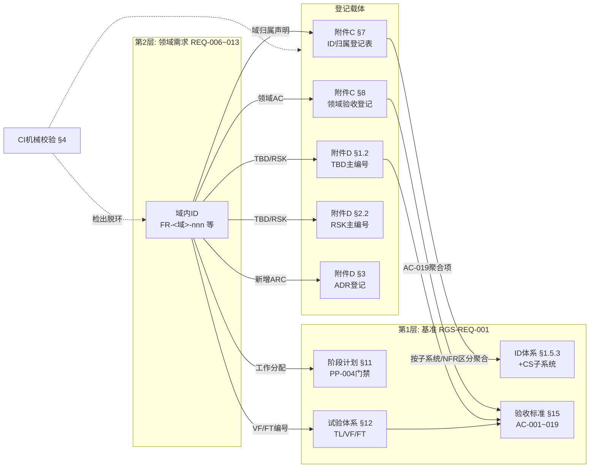
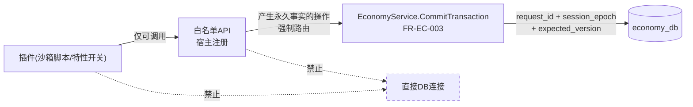
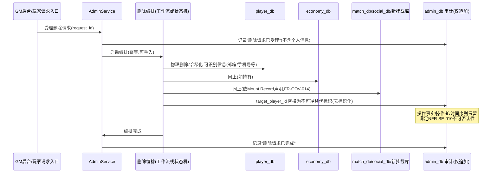

# 基本设计书（基本設計書 / Basic Design Document）

**体系治理与横切关注点 Baseline Governance & Cross-Cutting Concerns**

| 项目 | 内容 |
|---|---|
| 文档编号 | RGS-BAS-009 |
| 版本 | 0.3 |
| 父文档 | RGS-REQ-013 需求定义书 第4章（ARC-025／ARC-026）、第5章（横切需求） |
| 依据标准 | IPA『共通フレーム 2013（SLCP-JCF2013）』基本设计工程 |
| 制定日 | 2026-08-16 |
| 制定者 | 架构师 |
| 保密级别 | 内部限定（Internal Use Only） |

## 修订历史（改訂履歴 / Revision History）

| 版本 | 修订日 | 修订者 | 修订内容 | 影响章节 |
|---|---|---|---|---|
| 0.1 | 2026-08-16 | 架构师 | 初版制定。将ARC-025展开为ID登记表结构与治理闭环的CI机械校验设计；将ARC-026展开为OLU定义、初始分配与预算台账机制；并给出§5横切需求的落地设计 | 全部 |
| 0.2 | 2026-08-16 | 架构师 | **§4 CI机械校验从纯设计落地为实际实现**（处置TBD-PAT-002/ISS-073）：新增`scripts/check-docs-consistency.sh`+`.github/workflows/docs-consistency.yml`，实现ARC序列/ADR登记/TBD登记/风险登记/README死链共5项检查（原设计7项中的4项+1项新增）；标注归属为GitHub Actions独立工作流（代码侧流水线尚不存在，暂为阶段性例外）；剩余3项（域名段范围/AC登记/OLU台账）与跨文档章节引用留待后续迭代 | §4 |
| 0.3 | 2026-08-17 | 架构师 | **ISS-032决议执行**（负责人指示：加预算，推迟智能层）：§3.1总预算由160提升至210 OLU/月；§3.2.3余额由−22（超支）更新为+28（正常）；§3.3处置后余额同步更新为+52，明确R-1〜R-6回收计划仍须执行、预算提升不作废回收义务 | §3.1、§3.2.3、§3.3 |

## 审批栏（承認欄 / Approval）

| 角色 | 姓名 | 审批日 | 备注 |
|---|---|---|---|
| 制定（起草） | 架构师 | 2026-08-16 | — |
| 评审（SRE） | | | §3 OLU初始分配是否反映真实运维成本 |
| 评审（技术） | | | §4 CI机械校验是否可实现且不产生高误报 |
| 审批（负责人） | | | 本文档的基准化 |

---

## 目录

1. [前言](#1-前言)
2. [治理闭环的结构设计](#2-治理闭环的结构设计)
3. [运维负荷预算机制（ARC-026落地）](#3-运维负荷预算机制arc-026落地)
4. [治理闭环的CI机械校验设计](#4-治理闭环的ci机械校验设计)
5. [横切需求的落地设计](#5-横切需求的落地设计)
6. [标准化检查清单](#6-标准化检查清单)
7. [追溯性（ARC-025／026 → 本设计书章节）](#7-追溯性arc-025026--本设计书章节)

---

# 1. 前言

本文档是RGS-REQ-013第4章（ARC-025治理闭环的重新闭合、ARC-026运维负荷预算）与第5章（横切需求）的系统级展开。本文档的特殊性在于：**其设计对象不是运行时系统，而是文档体系与工程流程本身**。因此本文档的"组件"是登记表、台账与CI检查，而非服务与数据库。

本文档遵循RGS-BAS-001既有记述规则（§1.4强度用语、图示规则）。

---

# 2. 治理闭环的结构设计

## 2.1 闭环的完整结构

**设计要点**：闭环之所以有效，在于**每一条从领域文档出发的边都必须落到某个登记载体上**，而CI机械校验（§4）负责检出未落地的边。这与RGS-BAS-002 §5.3"NetworkPolicy默认拒绝"、RGS-BAS-004 §9"CI静态检查"采用的是同一思路：**把规范转化为可机械检出的约束，而非依赖人工记忆**。ARC-025本身即遵循这一在体系内已反复出现的模式。

## 2.2 附件C §7 ID归属登记表结构

| 列 | 内容 | 用途 |
|---|---|---|
| 域名段 | 如`SEC` | 主键 |
| 出处文档 | 如`RGS-REQ-010` | 溯源 |
| 归属子系统 | RGS-REQ-001§5.1的12个符号之一，或`全体` | 使附件C§2按子系统聚合仍可覆盖新需求 |
| 归属NFR区分 | 第9章6个区分之一（可多个） | 使附件B非功能等级评定与附件C§5验证手段表可覆盖新需求 |
| FR编号范围 | 如`FR-SEC-001〜042` | 完整性核对 |
| NFR编号范围 | 如`NFR-SEC-001〜005` | 同上 |
| 注册日／注册者 | — | 变更管理 |

## 2.3 主编号映射表结构（附件D §1.3／§2.3内嵌）

TBD／RSK／ISS三类参与治理闭环的ID，在附件D**新设的领域文档小节**中以带「域内ID」列的表登记，与主编号并列，形成双向可查：

| 主编号 | 域内ID | 其余既有列（问题／期限／负责人等） |
|---|---|---|
| TBD-020 | TBD-SEC-001 | …… |

**为何新设小节而非扩充既有表**：既有的附件D§1.2／§2.2表结构不含「域内ID」列，直接扩列须改写全部既有行，是高风险的机械操作且与基准文档范围的登记内容混杂。新设§1.3／§2.3并声明"与§1.2／§2.2合称问题管理表／风险管理表"，在保持既有表原样的前提下容纳两级映射。

**为何不新建独立映射文档**：新建独立文档将产生第三处需要同步维护的位置，与ARC-026回收运维负荷的方向相悖。在登记表内加一列，使登记与映射在同一次编辑中完成。

> 领域验收标准（`AC-<域>-nnn`）不分配主编号，而是整体经AC-019聚合项进入门禁，登记于附件C§8（GOV-AC-002／003）。

---

# 3. 运维负荷预算机制（ARC-026落地）

## 3.1 OLU（运维负荷单位）的定义

| 项目 | 内容 |
|---|---|
| 定义 | 1 OLU ＝ **SRE每月约1人・小时的常态运维投入**（含例行操作、告警响应、版本跟进、故障排查的期望值） |
| 性质 | **相对单位**。设立目的是使不同性质的运维面可以相加比较，而非追求绝对精确 |
| 校准 | 绝对校准依附件D RSK-002既有的征兆检测方法——"SRE值班件数・应对时长的月度统计"——自PH-4起按季度修正（TBD-GOV-001） |
| 总预算 | **210 OLU/月**（2026-08-17负责人决议提升，处置ISS-032，详见下方"预算调整"说明；原公式推导值为160） |

> **总预算取值的理由（原始公式，160）**：依ASM-001（SRE 1〜2人）与NFR-OP-010（常态运维须在SRE 2人以内成立），取**SRE 2人中用于常态运维的部分**。设常态运维占其工时的50%（其余为改善、自动化、项目工作），则总预算 ＝ 2人 × 160小时/月 × 50% ＝ 160 OLU/月。若将SRE工时100%分配给常态运维，则无余量用于自动化改善，运维负荷将只增不减，NFR-OP-010必然在某一时点被突破——保留50%用于改善，是使该上限长期可持续的必要条件，而非保守估计。
>
> **预算调整（ISS-032决议，2026-08-17）**：182 OLU的实际用量已逼近甚至超出160的公式推导值，项目负责人决定**直接提升总预算至210 OLU/月**，而非仅依赖§3.3的回收计划。210对应常态运维占比约65.6%（2人×160小时×65.6%≈210），**高于**原50%的可持续假设，即以牺牲部分自动化改善余量为代价换取当前的合规空间。这不是免费的余量——§3.3的R-1〜R-6回收措施**仍应按计划执行**（执行后可把常态运维占比压回50%附近，恢复长期可持续性），210只是短期内避免"逐项判定通过、总量仍违规"这一合成谬误立即触发上线阻断的过渡处置，**不代表总预算可无限追加**。

## 3.2 初始预算分配（估算值，PH-4实测后修正）

### 3.2.1 既有运维面（基准文档范围）

| 运维面 | 出处 | OLU/月 |
|---|---|---|
| PostgreSQL运维（备份／故障转移演练／容量） | NFR-AV-004／005 | 24 |
| 缓存基础设施运维 | ARC-012 | 8 |
| Kubernetes集群运维（节点／升级／调度） | NFR-EN-001 | 24 |
| 可观测性基础设施运维 | ARC-017 | 16 |
| CI/CD流水线维护 | S-010 | 12 |
| 值班响应（告警处理，NFR-OP-005 24×365） | NFR-OP-005 | 24 |
| 事件基础设施＋Outbox分发器（PH-5起） | ARC-009／010 | 12 |
| 工作流基础设施（PH-6起） | ARC-011 | 8 |
| **既有小计** | | **128** |

### 3.2.2 本次扩充新增的运维面（RGS-REV-001 F-008所列9项）

| 运维面 | 出处 | 初始申领 | 备注 |
|---|---|---|---|
| ①插件注册表运维＋沙箱引擎版本管理 | ARC-021 | 8 | 采用§5.3统一分发通道后可降至4 |
| ②密钥／证书轮换执行与验证 | ARC-022 FR-SEC-020〜022 | 6 | 自动化后可降至2 |
| ③依赖漏洞响应＋SBOM归档 | ARC-022 FR-SEC-030／031 | 8 | Critical 72小时响应要求是主要成本 |
| ④NetworkPolicy覆盖率审计 | BAS-006§4.2 | 2 | 已设计为CI＋定期扫描，成本低 |
| ⑤GM控制平面＋运维工单处理 | ARC-019 | 6 | 工单量与运营活跃度正相关 |
| ⑥三引擎SDK发布与版本同步 | ARC-024 | 10 | 三份适配层的发布矩阵是主要成本 |
| ⑦分区滚动创建／归档／清理 | BAS-007§4 | 4 | 可高度自动化 |
| ⑧埋点规范CI维护＋采样率调参 | ARC-020 | 4 | — |
| ⑨脚手架基座（Helm/CI）演进维护 | ARC-018 | 6 | — |
| **新增小计** | | **54** | |

### 3.2.3 预算核算结果

| 项目 | OLU/月 |
|---|---|
| 总预算 | 210（2026-08-17提升后） |
| 既有运维面 | 128 |
| 新增运维面 | 54 |
| **合计** | **182** |
| **余额** | **+28（预算提升后，处置R-1〜R-6执行完毕可进一步提升至+52）** |

> **这正是RGS-REV-001 F-008所预警的情况被量化确认**：七组文档各自遵守ARC-014，合计一度超出原160预算约14%。**2026-08-17项目负责人决议将总预算提升至210 OLU/月处置ISS-032**，182的合计用量在新预算下转为正余额，RSK-002（既有评估为**高概率・大影响**）的即时触发风险解除，但§3.3回收计划仍须按计划执行以恢复50%可持续占比，不因预算提升而作废。

## 3.3 超支的处置方案

依ARC-026，余额为负时**不得**新增运维面，须先回收额度。可回收项如下：

| 回收手段 | 依据 | 可回收OLU | 处置阶段 |
|---|---|---|---|
| R-1：插件状态复用ARC-016既有分发通道，取消独立轮询 | RGS-REQ-013 FR-GOV-020／021（F-011处置） | 4 | PH-3 |
| R-2：密钥轮换全自动化（含旧凭证吊销前的连接确认） | BAS-006§5.2已设计流程，实施自动化 | 4 | PH-5 |
| R-3：分区管理全自动化（定时作业创建／归档） | BAS-007§4已设计流程 | 3 | PH-2 |
| R-4：SDK发布矩阵合并为单一流水线（三引擎同源发布） | ARC-024既有"核心逻辑单一实现"的自然推论 | 5 | PH-6 |
| R-5：ARC-023收敛为零例外，取消存储过程例外评审流程 | RGS-REV-001 F-017建议（待架构评审） | 2 | 待评审 |
| R-6：值班响应的告警降噪（消除重复／低价值告警） | NFR-OP-005，属既有面的效率改善 | 6 | PH-4 |
| **可回收合计** | | **24** | |

**处置后余额（预算提升前的原始口径）**：−22 ＋ 24 ＝ +2 OLU/月（勉强为正）

**处置后余额（2026-08-17预算提升至210后的现行口径）**：+28 ＋ 24 ＝ **+52 OLU/月**

| 结论 | 内容 |
|---|---|
| 判定 | 预算提升后当前182用量下即有+28正余额；**全部执行R-1〜R-6回收措施**后余量可达+52，具备一定冗余，但§3.3预算调整说明中已注明210本身是以牺牲部分自动化改善占比换取的过渡空间，回收措施仍应按计划推进 |
| 强制含义 | R-1〜R-4、R-6仍**保留为必须执行项**（非改善建议）——预算提升不改变其执行必要性，应按§3.4纳入对应阶段的完成判定基准 |
| 对今后的约束 | 10个尚未核算OLU的域（附件D§5.2 ISS-065清单）核算完成前仍不计入已批准用量；今后新增中间件时，ARC-014判定通过后仍须在本台账申领，余额不足即否决 |

## 3.4 预算台账的运维方式

| 规则 | 内容 |
|---|---|
| GOV-OLU-001 | 台账以本文档§3.2／§3.3为初始版本，物理载体为**附件D§5（运维负荷预算台账）**，随附件D的既有更新频率（**每周**）维护 |
| GOV-OLU-002 | 新增运维面的申领**必须**在其对应的ADR中记载OLU估算与台账余额，无该记载的ADR**不得**批准（与ARC-014判定基准的记载要求并列） |
| GOV-OLU-003 | 申领纳入既有检查清单（RGS-BAS-002§12.1挂载检查清单）而非新建独立流程——避免治理机制自身成为新的运维负荷（RSK-GOV-001的缓解手段） |
| GOV-OLU-004 | 每季度以SRE实测数据校准OLU，更新附件D§5台账，并在**附件D§6更新历史**中记录校准结果 |

---

# 4. 治理闭环的CI机械校验设计

对应RGS-REQ-013 AC-GOV-001〜003、RSK-GOV-002。设计意图：使"文档脱环"像"代码不合规"一样被自动检出。

| 检查项 | 实现方式 | 阻断级别 | 实现状态 |
|---|---|---|---|
| **ARC序列缺号/重号** | 提取全部`ARC-nnn`，核对连续无缺号 | 阻断 | **已实现**（`scripts/check-docs-consistency.sh` §1） |
| **未登记ARC** | 核对每个ARC-018起的决定在附件D§3存在对应ADR行 | 阻断（对应GOV-ADR-002） | **已实现**（同脚本§2） |
| **未登记TBD** | 提取全部`TBD-<域>-nnn`，核对**附件D§1.3**存在对应行（域内ID列匹配），否则失败 | 阻断（对应F-002根治） | **已实现**（同脚本§3） |
| **未登记风险** | 同上，核对**附件D§2.3** | 阻断 | **已实现**（同脚本§3，与TBD合并检查） |
| **README死链** | 核对`docs/README.md`相对路径链接指向的文件均存在 | 阻断（非原设计项，本次实现时补充） | **已实现**（同脚本§4） |
| **未注册域名段** | 扫描`docs/`下全部文档，提取形如`FR-XXX-nnn`／`NFR-XXX-nnn`的ID，其域名段`XXX`须存在于附件C§7登记表，否则失败 | 阻断（对应GOV-ID-005） | 未实现，TBD-PAT-002待办 |
| **未登记领域验收标准** | 提取全部`AC-<域>-nnn`，核对附件C§8 | 阻断（对应GOV-AC-004） | 未实现，TBD-PAT-002待办 |
| **跨文档章节引用失效** | 提取形如`RGS-BAS-00n§x.y`的引用，核对目标文档存在该章节号 | 警告（章节重编号时易误报，人工复核） | 未实现，TBD-PAT-002待办 |
| **OLU台账余额为负** | 解析**附件D§5**台账，合计申领超出总预算时失败 | 阻断（对应ARC-026） | 未实现，TBD-PAT-002待办（当前台账已知超支，见ISS-032，先实现检查会立即变红，待ISS-032决议后再启用） |

**归属**：该CI检查纳入GitHub Actions（`.github/workflows/docs-consistency.yml`），触发范围限定`docs/**`路径变更，与未来RGS-BAS-002§4.2代码侧CI/CD流水线**并列独立**（当前仓库尚无Rust代码，暂不存在"既有流水线"可供并入；待代码侧流水线建立后，本工作流**应当**合并入其lint阶段而非长期独立存在，同GOV-OLU-003"不新建独立流水线"精神，此处是阶段性例外而非最终形态）。文档类检查仅在`docs/`路径发生变更时触发。**表中4/8项检查已用GitHub Actions实现**（处置TBD-PAT-002/ISS-073部分范围），其余4项因需要更复杂的跨表解析（域名段范围比对、章节号存在性核实、OLU台账数值解析）留待后续迭代，且OLU检查须等ISS-032决议后再启用（否则CI会因既有已知超支立即持续报红，失去信号意义）。

---

# 5. 横切需求的落地设计

## 5.1 插件与永久事实权威边界（FR-GOV-001〜004落地）

| 设计点 | 内容 |
|---|---|
| 白名单API的分类 | 注册白名单API时**必须**标注其是否产生永久事实（DR-002）。标注为"是"的API，其宿主实现**必须**为对`EconomyService.CommitTransaction`的封装，**不得**包含任何直接数据库写入 |
| 参数来源 | `session_epoch`由宿主从当前会话上下文取得并注入，**不得**由插件脚本提供（防止脚本伪造epoch绕过ARC-005）；`request_id`由宿主生成并与插件调用一一对应（保证幂等语义正确） |
| 静态检查 | 白名单API的注册代码纳入RGS-BAS-004§9同类CI静态检查：标注为"产生永久事实"的API实现中若出现直接数据库访问符号，CI失败 |
| 评审留痕 | FR-GOV-004所要求的评审记录，记入插件注册表（RGS-BAS-005§3.1 `PLUGIN_REGISTRY`）的`declared_dependencies`字段扩展 |

## 5.2 个人数据删除编排（FR-GOV-010〜014落地）

| 设计点 | 内容 |
|---|---|
| 编排归属 | 属ARC-011"工作流适用边界"的**可适用**范畴（低频・跨多服务・有状态・需要恢复），故**应当**由工作流基础设施承载（PH-6起）；PH-6前以AdminService内的状态机＋重试实现（同ARC-014"服务内状态机"的默认替代方案） |
| 幂等与重入 | 每一步以`request_id`幂等（同ARC-009）；中途失败时可重入，重入不产生重复副作用 |
| 去标识化的实现 | 审计表的`target_player_id`更新为替代标识。**注意**：这是对仅追加表的`UPDATE`，属NFR-SE-010"不得删除"的**例外**且仅限该列——须在RGS-DBS-001中显式登记为受控例外，并由数据库角色权限限制为仅删除编排可执行 |
| 新挂载库的覆盖 | FR-GOV-014要求Mount Record声明个人数据持有情况，编排据此动态确定目标库集合，避免新挂载的库被遗漏 |

> **未决**：本方案的法律充分性待ISS-004裁定后确认（ISS-012／TBD-GOV-002）。若裁定要求审计记录亦须物理删除，则NFR-SE-010须走需求变更流程重新评估等级。

## 5.3 运行时可变配置的统一分发（FR-GOV-020〜023落地）

| 项目 | 变更前（RGS-BAS-005§4／§7原设计） | 变更后（本节设计） |
|---|---|---|
| 分发通道 | 各节点轮询`PLUGIN_REGISTRY`表 | 复用ARC-016既有的版本化产物分发通道 |
| `PLUGIN_REGISTRY`的角色 | 运行时数据源 | **权威来源与审计载体**；其变更触发新版本配置产物的生成与分发 |
| 切换时点 | tick边界（原设计已正确） | 同（tick边界原子切换，不变） |
| 一致性检查 | 未定义 | 复用ARC-016既有的"反映前一致性检查，不合格版本不得反映" |
| 回滚 | 指针回退至旧版本 | 复用ARC-016既有的"立即回退至上一版本" |
| DB负荷 | 未评估（F-014） | 轮询消除，不再产生该负荷 |
| OLU影响 | — | 回收4 OLU（§3.3 R-1） |

## 5.4 经济类插件的单点判定（FR-GOV-030〜033落地）

| 设计点 | 内容 |
|---|---|
| 声明 | `PLUGIN_REGISTRY`新增列`is_economic`（布尔），注册时必填，经架构评审确认（FR-GOV-033） |
| 判定路径 | `is_economic=true`的插件，其"当前是否生效"的判定由EC在处理`CommitTransaction`时执行——即**判定与结算在同一次数据库事务内完成**，与ARC-006"永久事实的ACK须在持久化之后"天然对齐 |
| 节点本地状态的用途 | 仅用于表现层（客户端提示"活动进行中"）。运行时侧**不得**据此计算道具／货币数值 |
| 与ARC-005的同构性 | 本设计与ARC-005（Single-Writer，以epoch确保唯一写入者）是同一思路在不同层面的应用：**有争议的判定必须有唯一判定者**。ARC-005解决"谁能写"，本节解决"谁说了算" |

---

# 6. 标准化检查清单

## 6.1 领域文档新增／修订检查清单

- [ ] 域名段已在附件C§7注册，声明归属子系统与NFR区分（GOV-ID-002／005）
- [ ] 全部TBD／RSK已在附件D登记并分配主编号（GOV-ID-003）
- [ ] 新增ARC-nnn已在附件D§3分配ADR编号与制定期限（GOV-ADR-002）
- [ ] 领域验收标准已登记至附件C§8（GOV-AC-004）
- [ ] 领域工作已挂接阶段计划并给出完成判定基准（PP-004）
- [ ] 新增运维面已在OLU台账申领额度，且余额非负（GOV-OLU-002）
- [ ] 与既有ARC-001〜026无冲突；若有，已按GOV-DOC-002／003裁决并记录ADR
- [ ] CI治理校验（§4）全部通过

---

# 7. 追溯性（ARC-025／026 → 本设计书章节）

| ARC/FR编号 | 决定摘要 | 本文档展开章节 |
|---|---|---|
| ARC-025 | 治理闭环的重新闭合 | §2、§4 |
| GOV-ID-001〜006 | 两级ID体系 | §2.2、§2.3、§4 |
| GOV-DOC-001〜004 | 三层文档位阶 | §6.1（检查清单）、RGS-REQ-013§4.1.2 |
| GOV-AC-001〜004 | 两层验收结构 | §2.1、§4 |
| GOV-ADR-001〜002 | 架构方针统一登记 | §4 |
| ARC-026 | 运维负荷预算 | §3 |
| GOV-OLU-001〜004 | 台账运维方式 | §3.4 |
| FR-GOV-001〜004 | 插件与永久事实权威边界 | §5.1 |
| FR-GOV-010〜014 | 个人数据删除与审计并存 | §5.2 |
| FR-GOV-020〜023 | 运行时可变配置统一分发 | §5.3 |
| FR-GOV-030〜033 | 经济类插件单点判定 | §5.4 |

---

> 本文档所定义的机制为详细设计与实现阶段的输入基准。OLU的绝对校准（TBD-GOV-001）、CI治理校验的具体实现工具、删除编排的工作流定义，留待对应阶段确定。
