# 基本设计书（基本設計書 / Basic Design Document）

**分布式游戏服务器基础设施 RustGameServer**

| 项目 | 内容 |
|---|---|
| 文档编号 | RGS-BAS-001 |
| 版本 | 1.2 |
| 父文档 | RGS-REQ-001 需求定义书 第10章（架构设计方针） |
| 依据标准 | IPA『共通フレーム 2013（SLCP-JCF2013）』基本设计工程（日文原标准） |
| 制定日 | 2026-08-15 |
| 制定者 | 架构师 |
| 保密级别 | 内部限定（Internal Use Only） |

## 修订历史（改訂履歴 / Revision History）

| 版本 | 修订日 | 修订者 | 修订内容 | 影响章节 |
|---|---|---|---|---|
| 1.0 | 2026-08-15 | 架构师 | 初版制定。将需求定义书第10章的17条架构方针（ARC-001〜017）展开为系统方式设计、功能设计、数据设计概要、接口设计概要、非功能设计 | 全部 |
| 1.1 | 2026-08-15 | 架构师 | 第5章由概念级ER图升级为含属性的逻辑ER设计＋UML聚合类图；第6章由接口目录升级为字段级API设计（gRPC方法请求/响应字段、QUIC消息字段），并追加UML接口视图；修正`session_epoch`归属（由Account改为Character）；同步更新第10章移交事项与第11章追溯性的章节引用 | §1.1、§1.2、§1.3、§1.4、§4.4.2、§5、§6、§10、§11 |
| 1.2 | 2026-08-15 | 架构师 | 自审：修正§5.2 UML依赖箭头方向（应指向被引用方PlayerContext而非反向）；修正§6.3接口图误用的UML"实现"记号（realization）为"依赖"记号（dependency）；§4.5.1时序图遗留字段名统一为`character_id`（与§4.4.2/§5/§6.3.2一致）；简化§6.3.3/6.3.4构造型注记避免未验证语法；依用户澄清，将玩家（账号）实体的ID字段统一改为`player_id`／`playerId`，与需求定义书FR-EC-003／NFR-OP-002既有用词对齐，实体/表名`Account`本身不变 | §4.5.1、§5.2、§5.3、§5.7、§6.3 |

## 审批栏（承認欄 / Approval）

| 角色 | 姓名 | 审批日 | 备注 |
|---|---|---|---|
| 制定（起草） | 架构师 | 2026-08-15 | — |
| 评审（技术） | | | 与需求定义书第10章的一致性 |
| 评审（业务） | | | 是否遗漏业务需求相关的处理流程 |
| 审批（负责人） | | | 本文档的基准化 |

> 本文档经审批后成为**详细设计阶段（PH-1以降各阶段）的输入基准**。详细设计中的函数签名、SQL DDL（索引・约束・物理数据类型）、字节级线路格式等，不在本文档范围内。

---

## 目录

1. [前言](#1-前言)
2. [系统化方针再确认](#2-系统化方针再确认)
3. [系统方式设计](#3-系统方式设计)
4. [功能设计](#4-功能设计)
5. [数据库论理设计](#5-数据库论理设计)
6. [外部接口设计](#6-外部接口设计)
7. [非功能设计](#7-非功能设计)
8. [状态迁移详细设计](#8-状态迁移详细设计)
9. [异常・错误处理设计方针](#9-异常错误处理设计方针)
10. [详细设计移交事项一览](#10-详细设计移交事项一览)
11. [追溯性（ARC-nnn → 本设计书章节）](#11-追溯性arc-nnn--本设计书章节)

---

# 1. 前言

## 1.1 本文档的定位

依据IPA『共通フレーム 2013』的开发工程划分，系统开发经过**要件定義（需求定义）→ 基本設計（基本设计）→ 詳細設計（详细设计）→ 実装（实现）**四个阶段。三份文档的分工边界如下：

| 文档 | 回答的问题 | 粒度 | 本项目对应文档 |
|---|---|---|---|
| 需求定义书 | **系统必须做什么（WHAT）**，以及做出这个决定的架构级理由（ARC-001〜017） | 业务需求、非功能需求目标值、架构决定 | RGS-REQ-001 |
| **基本设计书（本文档）** | **系统级如何实现（系统级HOW）**：组件如何划分、组件间如何交互、逻辑数据模型（实体＋属性＋关系）如何组织、API的方法与消息字段如何定义、故障时行为如何设计 | 组件图、时序图、UML类图、逻辑ER图、API字段级目录 | **RGS-BAS-001** |
| 详细设计书 | **代码级如何实现（代码级HOW）**：函数签名、物理数据类型／索引／约束（DDL）、字节级线路格式 | 函数原型、DDL、字节布局 | RGS-IFS-001、RGS-DBS-001（另行制定） |

本文档**包含**逻辑层面的数据模型（实体、属性、关系、UML类图）与API设计（gRPC方法的请求／响应字段、QUIC消息的字段构成），这是IPA共通フレーム基本设计工程的标准产出物。本文档**不包含**：函数签名与内部算法实现、SQL DDL（物理数据类型・索引・约束）、字节级线路格式（量化精度・位打包布局）。这些内容留给详细设计阶段，理由见需求定义书PP-001（先完成可运行的垂直切片，避免过早细化）与ARC-014（不得在无证据时构建复杂性）——字段"是什么"属于系统级设计，字段"怎么在物理存储/线路上编码"才是需要工程验证的详细设计。

## 1.2 适用范围

本文档覆盖需求定义书第10章全部17条架构方针（ARC-001〜017）对应的子系统（GW／RT／SY／PL／EC／MT／GD／EV／WF／OB／AD）。

**颗粒度声明**：PH-1〜PH-4阶段（网关、场景、同步、战斗、经济、持久化、负载试验）对应的子系统（GW／RT／SY／PL／EC）给出**完整的处理时序**；PH-5以降阶段（异步基础设施、对局、社交、外部支付）对应的子系统（MT／GD／EV／WF）仅给出**模块划分与关键状态机落地**，详细时序留待该阶段开始前修订本文档补充。此颗粒度差异是**有意为之**，与需求定义书PP-001"先完成垂直切片"的方针一致——不在架构证据不足时对远期功能做过度设计。

## 1.3 关联文档

| 文档编号 | 文档名 | 与本文档的分工 |
|---|---|---|
| RGS-REQ-001〜005 | 需求定义书及附件 | 本文档的输入。全部设计决定必须可追溯至需求定义书的ARC-nnn／FR-nnn／NFR-nnn |
| RGS-DBS-001（待制定，PH-2） | 数据库设计书 | 本文档§5给出逻辑ER图（含属性）与UML类图；RGS-DBS-001给出物理DDL（数据类型・索引・约束・分区策略） |
| RGS-IFS-001（待制定，PH-1） | 外部接口规格书 | 本文档§6给出API方法与消息的字段级设计；RGS-IFS-001给出字节级线路格式（量化精度・位打包布局，含ISS-005的解决结果） |
| RGS-TST-001（待制定，PH-2） | 试验计划书 | 依据本文档的处理时序设计试验用例 |
| RGS-OPS-001（待制定，PH-4） | 运维设计书 | 依据本文档§7.1可用性设计与§7.4可观测性设计，制定具体运维手顺 |

## 1.4 记述规则

沿用需求定义书1.5.1节的强度用语（必须／应当／可以／不得）与1.5.3节的ID体系。本文档新增以下图示规则：

| 图类型 | 用途 |
|---|---|
| `flowchart` | 组件构成图、处理流程图（无时间轴的逻辑流程） |
| `sequenceDiagram` | 多组件间带时间轴的交互时序 |
| `erDiagram` | 数据实体间的关系与基数（含关键属性，不含物理数据类型） |
| `classDiagram`（UML） | 限界上下文的领域模型：聚合根／实体／值对象及其关键属性、方法、组合关系 |
| `stateDiagram-v2` | 状态机（复用需求定义书第8章的定义，补充触发来源） |

本文档**不新增独立的设计ID体系**。各节标题直接标注所展开的需求定义书ARC-nnn／FR-nnn编号，交叉引用以需求定义书的既有ID为准——这是为了避免维护两套平行的编号体系，符合需求定义书13.4节AI代理使用规律中"Simple > Abstract"的原则。

---

# 2. 系统化方针再确认

本节简要复述需求定义书第10章的核心决定，作为本文档展开设计的前提。**详细理由与否决方案请参照需求定义书原文，本节不重复论证过程。**

| ARC编号 | 决定摘要 | 本文档展开章节 |
|---|---|---|
| ARC-001 | Actor粒度＝场景，玩家为ECS实体 | §3.4、§4.2.1 |
| ARC-002 | 状态同步＋客户端预测＋服务器和解 | §4.3 |
| ARC-003 | QUIC不可靠路径（Datagram）与可靠路径（Stream）区分使用 | §3.3、§6.1 |
| ARC-004 | 高频路径采用量化＋位打包 | §6.1（细节留RGS-IFS-001） |
| ARC-005 | `session_epoch`实现Single-Writer保证 | §3.5、§4.4.2 |
| ARC-006 | 永久事实的ACK须在持久化完成后 | §4.5.1 |
| ARC-007 | 运行时不直接访问业务数据库，经gRPC确定请求 | §4.5.2 |
| ARC-008 | 道具与货币统合为单一限界上下文（EC） | §5.1 |
| ARC-009 | 禁止双写，OCC＋幂等实现Effectively Once | §4.5.1、§5.3 |
| ARC-010 | 事件传播的顺序边界与partition_key | §4.7.1 |
| ARC-011 | 工作流（Saga）仅用于跨服务长流程 | §4.7.2 |
| ARC-012 | 缓存・临时状态的适用边界 | §3.5、§7.1 |
| ARC-013 | 背压设置位置与死锁防止 | §3.3、§4.2.4、§7.2 |
| ARC-014 | 中间件导入判定基准 | §1.2颗粒度声明的依据 |
| ARC-015 | 版本管理与兼容性（Expand-Contract） | §7.4 |
| ARC-016 | 数值表・配置的热更新 | §4.2.2（tick边界原子切换点） |
| ARC-017 | 可观测性自PH-1起必须具备 | §4.8 |

---

# 3. 系统方式设计

## 3.1 部署构成概览

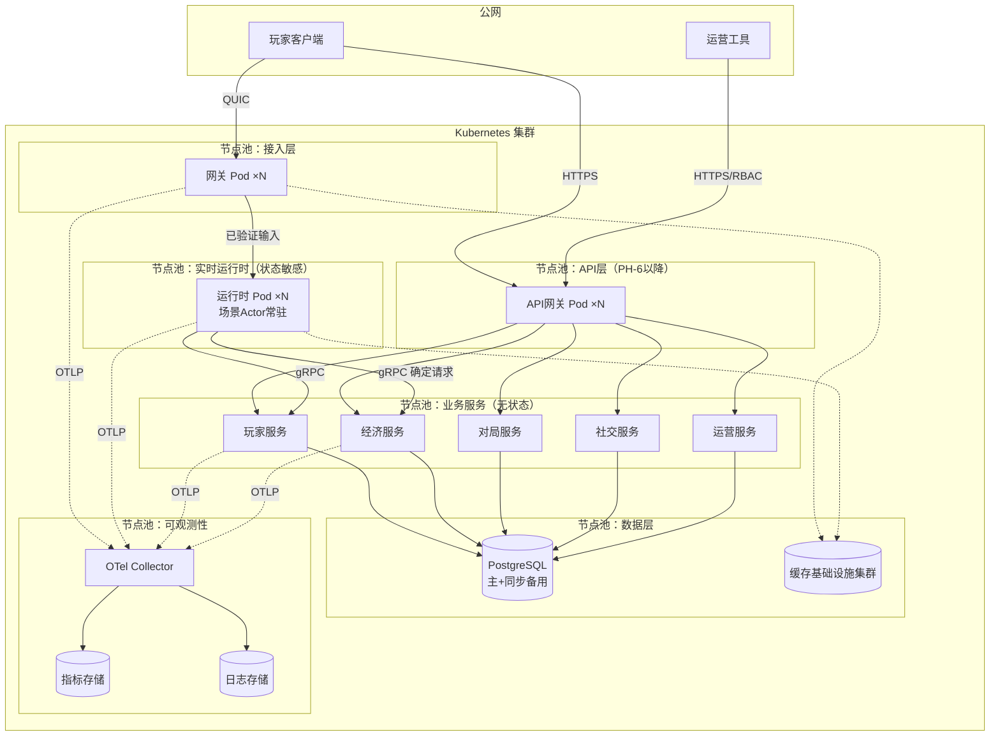
```mermaid
flowchart TB
    subgraph Internet["公网"]
        Player[玩家客户端]
        Ops[运营工具]
    end

    subgraph K8s["Kubernetes 集群"]
        subgraph PoolEdge["节点池：接入层"]
            GW1[网关 Pod ×N]
        end
        subgraph PoolAPI["节点池：API层（PH-6以降）"]
            APIGW[API网关 Pod ×N]
        end
        subgraph PoolRT["节点池：实时运行时（状态敏感）"]
            RT1[运行时 Pod ×N<br/>场景Actor常驻]
        end
        subgraph PoolBiz["节点池：业务服务（无状态）"]
            PL[玩家服务]
            EC[经济服务]
            MT[对局服务]
            GD[社交服务]
            AD[运营服务]
        end
        subgraph PoolData["节点池：数据层"]
            PGP[(PostgreSQL<br/>主+同步备用)]
            VKP[(缓存基础设施集群)]
        end
        subgraph PoolObs["节点池：可观测性"]
            OTC[OTel Collector]
            METRIC[(指标存储)]
            LOGS[(日志存储)]
        end
    end

    Player -->|QUIC| GW1
    Player -->|HTTPS| APIGW
    Ops -->|HTTPS/RBAC| APIGW
    GW1 -->|已验证输入| RT1
    APIGW --> PL & EC & MT & GD & AD
    RT1 -->|gRPC 确定请求| EC
    RT1 -->|gRPC| PL
    PL & EC & MT & GD & AD --> PGP
    GW1 -.-> VKP
    RT1 -.-> VKP
    GW1 & RT1 & PL & EC -.->|OTLP| OTC
    OTC --> METRIC & LOGS
```

## 3.2 部署单元一览

| 组件 | K8s对象类型 | 副本策略 | 状态性质 | 对应需求 |
|---|---|---|---|---|
| 网关 | Deployment | HPA（依连接数扩缩） | 无状态（会话信息在缓存基础设施） | NFR-PE-014、NFR-AV-008 |
| API网关 | Deployment | HPA | 无状态 | PH-6起导入（ARC-014判定通过） |
| 运行时 | **StatefulSet** | 手动／半自动扩容，**不做自动缩容**（场景Actor有状态且不支持迁移，ARC-001） | 有状态（场景Actor常驻内存） | NFR-PE-015、ARC-001 |
| 业务服务（PL／EC／MT／GD／AD） | Deployment | HPA | 无状态（状态在PostgreSQL） | NFR-AV-008 |
| PostgreSQL | StatefulSet（或托管服务，依CON-002判定自建） | 主1＋同步备用1以上 | 有状态 | NFR-AV-008、NFR-AV-004 |
| 缓存基础设施 | StatefulSet（集群模式） | 视PH-5后负载决定分片数 | 有状态但**可丢弃重建**（ARC-012） | DR-003 |
| 可观测性组件 | Deployment/DaemonSet | 依NFR-OP-003 | 无状态（数据落时序存储） | ARC-017 |

**运行时为何选用StatefulSet而非Deployment**：场景Actor持有的实时状态（DR-001）不可迁移（ARC-001已否决透明迁移方案），Pod的网络标识需要稳定，以便网关的场景路由（§3.5）能确定性地找到持有目标场景的Pod。这不代表场景Actor可以跨Pod重启保留内存状态——Pod重启后场景状态仍须从检查点恢复（FR-RT-009），StatefulSet仅提供**稳定标识**，不提供**状态持久化**。

## 3.3 网络区域设计

| 流量方向 | 协议 | 加密 | 端口（示例，详细设计确定） | 对应需求 |
|---|---|---|---|---|
| 玩家 → 网关（南北向） | QUIC（UDP） | TLS 1.3（QUIC内建） | UDP/7000 | IF-001、NFR-SE-002 |
| 玩家 → API网关（南北向，PH-6起） | HTTPS | TLS 1.3 | TCP/443 | IF-002 |
| 运营工具 → API网关（南北向） | HTTPS | TLS 1.3＋RBAC | TCP/443 | IF-007、NFR-SE-005 |
| 网关 ↔ 运行时（东西向） | 内部协议（tonic/gRPC或自定义） | mTLS | 集群内DNS | FR-GW-004 |
| 运行时 ↔ 业务服务（东西向） | gRPC | mTLS | 集群内DNS | IF-003、NFR-SE-003 |
| 各服务 ↔ PostgreSQL（东西向） | PostgreSQL Wire Protocol | TLS | 集群内DNS | IF-004 |
| 各服务 → OTel Collector（东西向） | OTLP/gRPC | mTLS | 集群内DNS | IF-008 |

**背压设置点（ARC-013落地）**：上表每条东西向连接**必须**在客户端侧设置连接池上限与超时；网关到运行时的路由**必须**设置每场景Actor的待处理请求数上限（对应mailbox容量，ARC-001）。具体数值属详细设计范围。

## 3.4 场景到运行时节点的分配方式（ARC-001落地）

| 设计点 | 方针 |
|---|---|
| 分配时机 | 场景创建时（首个玩家进入触发，或按数值表预先创建的常驻场景） |
| 分配策略 | PH-2〜PH-6：**固定分配＋轮询／最小负载优先**。场景一旦分配到某运行时节点，**不做透明迁移**（ARC-001否决方案，ARC-014尚未达成迁移判定基准） |
| 记录位置 | 场景ID → 节点标识的映射记录于缓存基础设施（高速查询路径），**权威记录**在PostgreSQL的场景分配表（重启后可重建缓存） |
| 容量控制 | 单场景实体数达NFR-PE-016软上限（300）时，新玩家路由至该场景的同类新实例（若数值表支持多实例场景），或进入等候（FR-RT-013） |
| 节点满载 | 单节点场景总数达到容量上限时，新场景不再分配至该节点，触发扩容告警（NFR-OP-005） |

## 3.5 会话与网关路由设计（ARC-005落地）

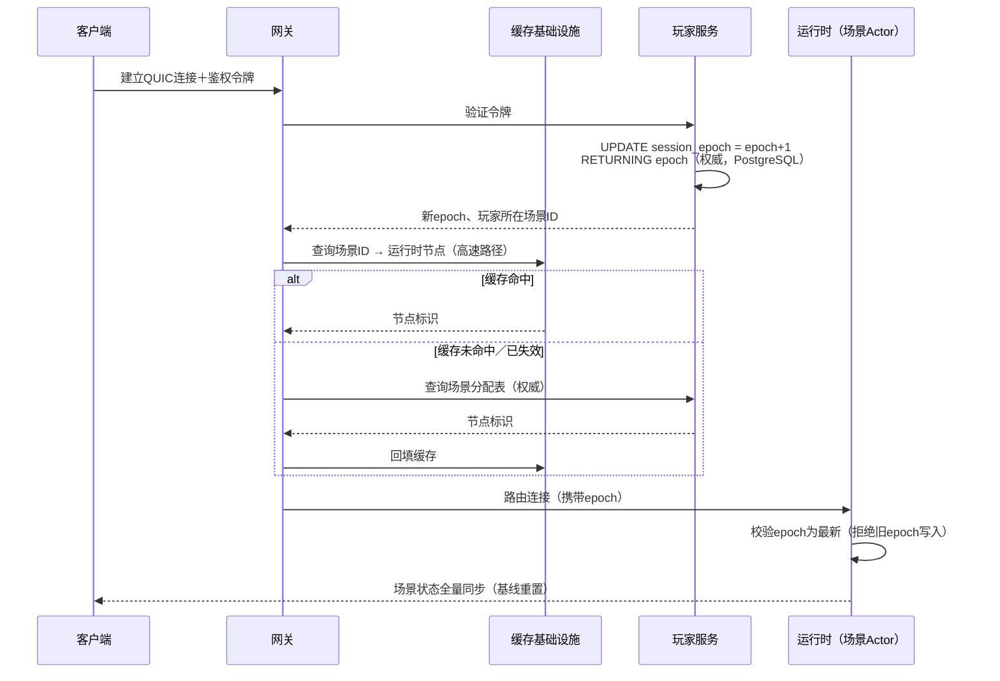
```mermaid
sequenceDiagram
    participant C as 客户端
    participant GW as 网关
    participant Cache as 缓存基础设施
    participant PL as 玩家服务
    participant RT as 运行时（场景Actor）

    C->>GW: 建立QUIC连接＋鉴权令牌
    GW->>PL: 验证令牌
    PL->>PL: UPDATE session_epoch = epoch+1<br/>RETURNING epoch（权威，PostgreSQL）
    PL-->>GW: 新epoch、玩家所在场景ID
    GW->>Cache: 查询场景ID → 运行时节点（高速路径）
    alt 缓存命中
        Cache-->>GW: 节点标识
    else 缓存未命中／已失效
        GW->>PL: 查询场景分配表（权威）
        PL-->>GW: 节点标识
        GW->>Cache: 回填缓存
    end
    GW->>RT: 路由连接（携带epoch）
    RT->>RT: 校验epoch为最新（拒绝旧epoch写入）
    RT-->>C: 场景状态全量同步（基线重置）
```

**关键点**：缓存基础设施查询只是**性能优化路径**，其数据陈旧或丢失时必须能回退到PostgreSQL的权威记录重新查询（ARC-012、DR-003）。真正保证不会发生双写的机制是epoch校验，不是缓存查询本身——这是ARC-005"缓存不得作为仲裁者"的具体体现。

---

# 4. 功能设计

## 4.1 GW：接入网关

### 4.1.1 模块构成

| 模块 | 职责 |
|---|---|
| 连接终结模块 | QUIC握手、TLS 1.3终结（FR-GW-001） |
| 鉴权模块 | 令牌验证、调用玩家服务建立会话（FR-GW-002） |
| 会话管理模块 | 会话表维护、心跳监视、超时切断（FR-GW-003） |
| 路由模块 | 依场景分配表，将输入转发至目标运行时节点（FR-GW-004） |
| 限流模块 | 每连接输入速率限制（FR-GW-006） |
| 排空控制模块 | 响应SIGTERM，停止接受新连接，等待既有连接自然结束或超时强制转移（FR-GW-009） |

### 4.1.2 连接建立与鉴权时序（FR-GW-001〜003）

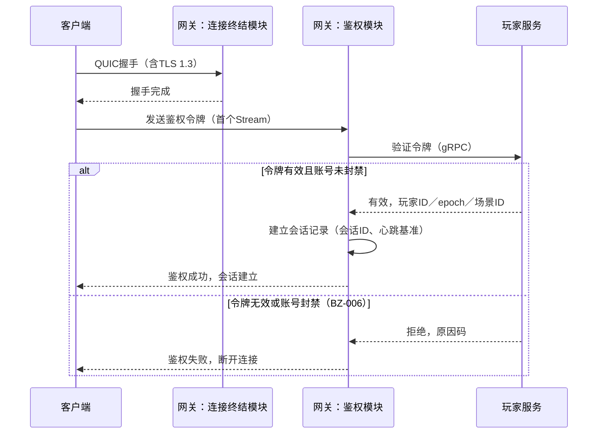
```mermaid
sequenceDiagram
    participant C as 客户端
    participant GW as 网关：连接终结模块
    participant Auth as 网关：鉴权模块
    participant PL as 玩家服务

    C->>GW: QUIC握手（含TLS 1.3）
    GW-->>C: 握手完成
    C->>Auth: 发送鉴权令牌（首个Stream）
    Auth->>PL: 验证令牌（gRPC）
    alt 令牌有效且账号未封禁
        PL-->>Auth: 有效，玩家ID／epoch／场景ID
        Auth->>Auth: 建立会话记录（会话ID、心跳基准）
        Auth-->>C: 鉴权成功，会话建立
    else 令牌无效或账号封禁（BZ-006）
        PL-->>Auth: 拒绝，原因码
        Auth-->>C: 鉴权失败，断开连接
    end
```

### 4.1.3 重连时序（FR-GW-005，ARC-005落地）

见§3.5时序图。重连与首次连接的唯一差异：`PL`侧发行的是**递增后的新epoch**（而非首次的初始epoch），且`RT`侧须**主动使旧epoch的既有连接失效**（若旧连接仍存活，例如网络抖动导致的假死连接）。

### 4.1.4 输入路由与限流处理流程

| 步骤 | 处理 | 失败时行为 |
|---|---|---|
| 1 | 接收客户端输入（Datagram或Stream） | 格式错误则丢弃并计入异常计数（FR-AD-004） |
| 2 | 速率限制检查（FR-GW-006） | 超限则丢弃当前输入，不断开连接（除非持续超限触发NFR-SE-008） |
| 3 | 依会话查场景路由目标 | 目标节点不可达则返回重连提示（不是直接断开） |
| 4 | 转发至运行时 | 运行时mailbox满（背压）则输入被拒绝，网关不重试（由客户端下次输入自然覆盖，因为高频状态具有可替代性，ARC-013） |

## 4.2 RT：实时运行时

### 4.2.1 场景Actor内部结构（ARC-001落地）

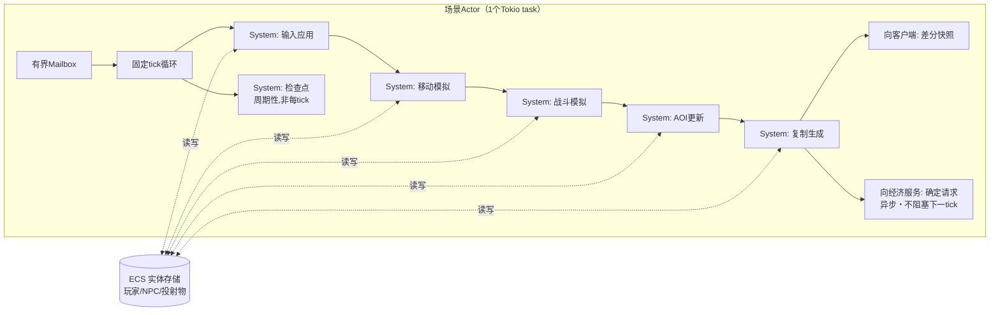
```mermaid
flowchart LR
    subgraph SceneActor["场景Actor（1个Tokio task）"]
        direction TB
        MB[有界Mailbox] --> Loop[固定tick循环]
        Loop --> S1[System: 输入应用]
        S1 --> S2[System: 移动模拟]
        S2 --> S3[System: 战斗模拟]
        S3 --> S4[System: AOI更新]
        S4 --> S5[System: 复制生成]
        S5 --> Out1[向客户端: 差分快照]
        S5 --> Out2[向经济服务: 确定请求<br/>异步・不阻塞下一tick]
        Loop --> CP[System: 检查点<br/>周期性,非每tick]
    end
    ECS[(ECS 实体存储<br/>玩家/NPC/投射物)] <-.->|读写| S1 & S2 & S3 & S4 & S5
```

**约束复述**：全部System在同一task内顺序执行，**不引入锁**（场景状态不跨task共享可变引用，ARC-001）。`Out2`（向经济服务的确定请求）为异步任务，**不得**阻塞`Loop`进入下一tick（CON-007、ARC-007）。

### 4.2.2 tick循环处理流程与耗时预算（NFR-PE-002落地）

| 阶段 | 预算上限（NFR-PE-002总预算25ms内的分配，详细设计可调整） | 依据 |
|---|---|---|
| 输入应用 | 20% | 输入量与场景实体数成正比 |
| 移动模拟 | 25% | 碰撞检测为主要开销 |
| 战斗模拟 | 25% | 判定复杂度随技能数量变化 |
| AOI更新 | 15% | 网格重算＋兴趣集合差分 |
| 复制生成（差分快照编码） | 15% | 量化＋位打包（ARC-004） |

**数值表热更新的原子切换点（ARC-016落地）**：新版本数值表**只允许在tick边界之间**切换，即某个System读取数值表时，**同一tick内所有System必须看到同一版本**。切换以"下一tick开始前替换只读引用"的方式实现，不在tick执行中途替换。

### 4.2.3 Actor监督与恢复流程（FR-RT-010）

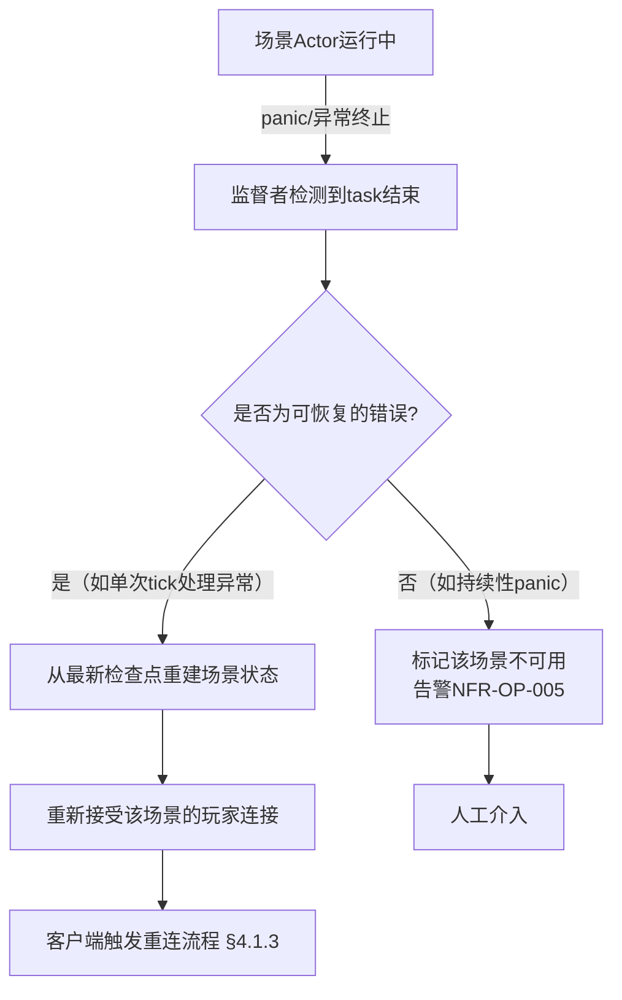
```mermaid
flowchart TD
    A[场景Actor运行中] -->|panic/异常终止| B[监督者检测到task结束]
    B --> C{是否为可恢复的错误?}
    C -->|是（如单次tick处理异常）| D[从最新检查点重建场景状态]
    C -->|否（如持续性panic）| E[标记该场景不可用<br/>告警NFR-OP-005]
    D --> F[重新接受该场景的玩家连接]
    F --> G[客户端触发重连流程 §4.1.3]
    E --> H[人工介入]
```

### 4.2.4 Actor排空流程（FR-RT-012，ARC-013落地）

| 步骤 | 处理 |
|---|---|
| 1 | 节点接收SIGTERM（K8s Pod终止信号） |
| 2 | 该节点全部场景Actor停止接受**新玩家**进入 |
| 3 | 对既有玩家：发送"节点即将维护"提示，触发检查点确定（FR-RT-009） |
| 4 | 检查点确定后，该场景标记为"待重新分配"，缓存基础设施中的场景位置记录失效 |
| 5 | 客户端因连接中断触发§4.1.3重连流程，路由至其他可用节点重建该场景 |
| 6 | 全部场景完成步骤3〜5，或达到排空超时（对应NFR-AV-007），节点终止 |

## 4.3 SY：同步・AOI

### 4.3.1 AOI计算流程（FR-SY-001，ARC-002落地）

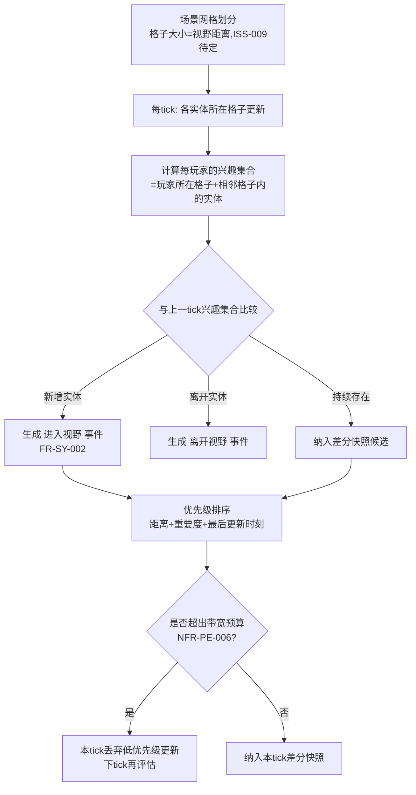
```mermaid
flowchart TD
    A[场景网格划分<br/>格子大小=视野距离,ISS-009待定] --> B[每tick: 各实体所在格子更新]
    B --> C[计算每玩家的兴趣集合<br/>=玩家所在格子+相邻格子内的实体]
    C --> D{与上一tick兴趣集合比较}
    D -->|新增实体| E[生成 进入视野 事件<br/>FR-SY-002]
    D -->|离开实体| F[生成 离开视野 事件]
    D -->|持续存在| G[纳入差分快照候选]
    E --> H[优先级排序<br/>距离+重要度+最后更新时刻]
    G --> H
    H --> I{是否超出带宽预算<br/>NFR-PE-006?}
    I -->|是| J[本tick丢弃低优先级更新<br/>下tick再评估]
    I -->|否| K[纳入本tick差分快照]
```

### 4.3.2 差分快照生成与ACK时序（FR-SY-003、004）

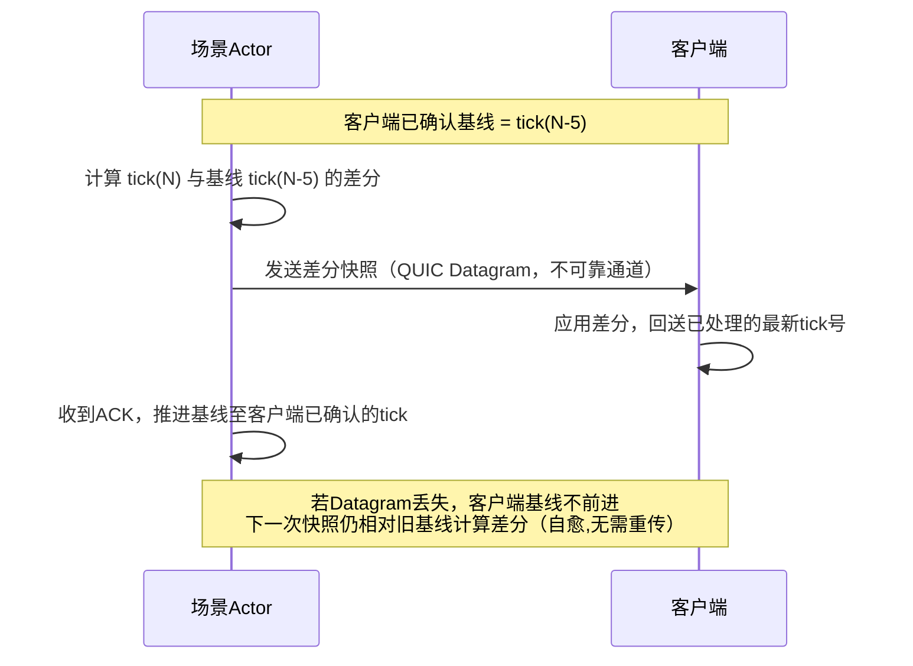
```mermaid
sequenceDiagram
    participant RT as 场景Actor
    participant C as 客户端

    Note over RT,C: 客户端已确认基线 = tick(N-5)
    RT->>RT: 计算 tick(N) 与基线 tick(N-5) 的差分
    RT->>C: 发送差分快照（QUIC Datagram，不可靠通道）
    C->>C: 应用差分，回送已处理的最新tick号
    RT->>RT: 收到ACK，推进基线至客户端已确认的tick
    Note over RT,C: 若Datagram丢失，客户端基线不前进<br/>下一次快照仍相对旧基线计算差分（自愈,无需重传）
```

### 4.3.3 预测・和解时序（FR-SY-008，ARC-002落地）

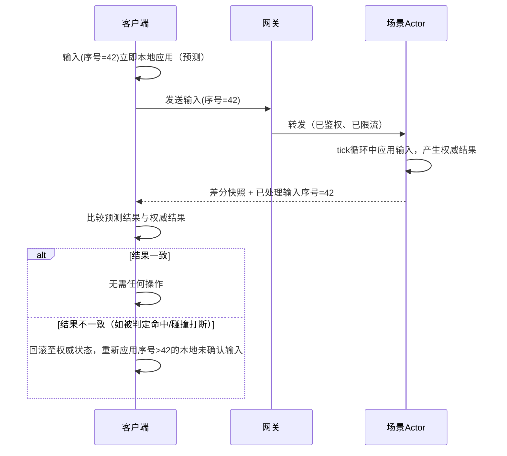
```mermaid
sequenceDiagram
    participant C as 客户端
    participant GW as 网关
    participant RT as 场景Actor

    C->>C: 输入(序号=42)立即本地应用（预测）
    C->>GW: 发送输入(序号=42)
    GW->>RT: 转发（已鉴权、已限流）
    RT->>RT: tick循环中应用输入，产生权威结果
    RT-->>C: 差分快照 + 已处理输入序号=42
    C->>C: 比较预测结果与权威结果
    alt 结果一致
        C->>C: 无需任何操作
    else 结果不一致（如被判定命中/碰撞打断）
        C->>C: 回滚至权威状态，重新应用序号>42的本地未确认输入
    end
```

## 4.4 PL：玩家・账号

### 4.4.1 登录鉴权流程（FR-PL-001、002）

复用§4.1.2时序图中`Auth → PL`的验证步骤。此处补充玩家服务内部处理：①校验凭证 ②检查BZ-006封禁状态 ③加载角色列表 ④返回鉴权结果。

### 4.4.2 会话世代（epoch）发行流程（FR-PL-003，ARC-005落地——全系统Single-Writer保证的核心机制）

**归属澄清**：`session_epoch`归属**角色（Character）**，不归属账号（Account）。理由：实时权威（场景Actor所代表的实体）与经济事务（§4.5.1的确定请求）均以`character_id`为鉴别单位，Single-Writer要保护的正是"同一角色的实时/经济写入不被旧连接抢占"，账号层面的操作（查看角色列表等）不存在此竞态。因此epoch的发行时机在**角色选择、进入场景之时**，而非账号鉴权成功的瞬间。

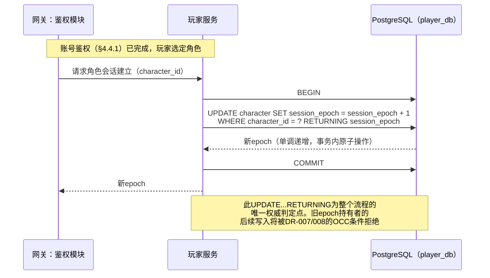
```mermaid
sequenceDiagram
    participant Auth as 网关：鉴权模块
    participant PL as 玩家服务
    participant DB as PostgreSQL（player_db）

    Note over Auth,PL: 账号鉴权（§4.4.1）已完成，玩家选定角色
    Auth->>PL: 请求角色会话建立（character_id）
    PL->>DB: BEGIN
    PL->>DB: UPDATE character SET session_epoch = session_epoch + 1<br/>WHERE character_id = ? RETURNING session_epoch
    DB-->>PL: 新epoch（单调递增，事务内原子操作）
    PL->>DB: COMMIT
    PL-->>Auth: 新epoch
    Note over PL,DB: 此UPDATE...RETURNING为整个流程的<br/>唯一权威判定点。旧epoch持有者的<br/>后续写入将被DR-007/008的OCC条件拒绝
```

**设计要点**：epoch的发行**必须**是数据库层面的原子操作（`UPDATE ... RETURNING`），不得先`SELECT`当前值再在应用层`+1`后`UPDATE`——后者在并发重连场景下会产生竞态，两次重连可能拿到相同的"新"epoch。

## 4.5 EC：玩家经济

### 4.5.1 确定请求API处理时序（FR-EC-003，ARC-006／ARC-009落地）

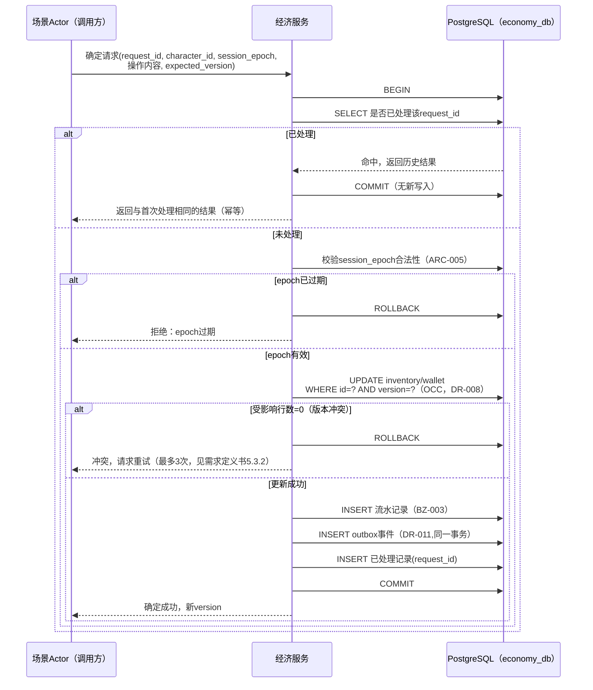
```mermaid
sequenceDiagram
    participant RT as 场景Actor（调用方）
    participant EC as 经济服务
    participant DB as PostgreSQL（economy_db）

    RT->>EC: 确定请求(request_id, character_id, session_epoch,<br/>操作内容, expected_version)
    EC->>DB: BEGIN
    EC->>DB: SELECT 是否已处理该request_id
    alt 已处理
        DB-->>EC: 命中，返回历史结果
        EC->>DB: COMMIT（无新写入）
        EC-->>RT: 返回与首次处理相同的结果（幂等）
    else 未处理
        EC->>DB: 校验session_epoch合法性（ARC-005）
        alt epoch已过期
            EC->>DB: ROLLBACK
            EC-->>RT: 拒绝：epoch过期
        else epoch有效
            EC->>DB: UPDATE inventory/wallet<br/>WHERE id=? AND version=?（OCC，DR-008）
            alt 受影响行数=0（版本冲突）
                EC->>DB: ROLLBACK
                EC-->>RT: 冲突，请求重试（最多3次，见需求定义书5.3.2）
            else 更新成功
                EC->>DB: INSERT 流水记录（BZ-003）
                EC->>DB: INSERT outbox事件（DR-011,同一事务）
                EC->>DB: INSERT 已处理记录(request_id)
                EC->>DB: COMMIT
                EC-->>RT: 确定成功，新version
            end
        end
    end
```

**此时序是ARC-006（ACK须在持久化后）与ARC-009（Effectively Once）在代码路径上的唯一交汇点**——道具/货币确定请求的全部一致性保证均在这一次数据库事务内完成，事务外不存在任何"事后补救"路径。

### 4.5.2 运行时→经济服务调用与降级处理（ARC-007落地）

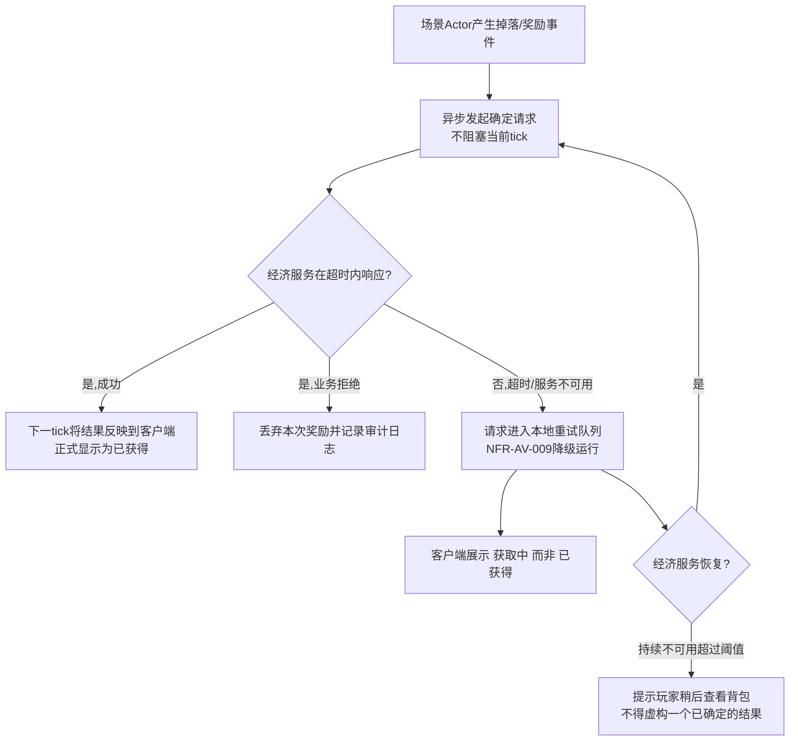
```mermaid
flowchart TD
    A[场景Actor产生掉落/奖励事件] --> B[异步发起确定请求<br/>不阻塞当前tick]
    B --> C{经济服务在超时内响应?}
    C -->|是,成功| D[下一tick将结果反映到客户端<br/>正式显示为已获得]
    C -->|是,业务拒绝| E[丢弃本次奖励并记录审计日志]
    C -->|否,超时/服务不可用| F[请求进入本地重试队列<br/>NFR-AV-009降级运行]
    F --> G[客户端展示 获取中 而非 已获得]
    F --> H{经济服务恢复?}
    H -->|是| B
    H -->|持续不可用超过阈值| I[提示玩家稍后查看背包<br/>不得虚构一个已确定的结果]
```

## 4.6 MT／GD：对局・社交（概要级，PH-5／PH-6详细化）

| 子系统 | 模块划分 | 本版详细化程度 |
|---|---|---|
| MT 对局・匹配 | 匹配队列模块、对局生命周期模块（落地需求定义书ST-002状态机）、结算模块 | 仅模块划分，处理时序留PH-5开始前补充 |
| GD 社交・公会 | 好友模块、聊天模块、公会模块 | 仅模块划分，处理时序留PH-6开始前补充 |

> 此处不展开详细时序，是§1.2颗粒度声明的具体执行，避免在PH-2〜PH-4验证垂直切片之前对远期功能做过度设计（ARC-014）。

## 4.7 EV／WF：事件・工作流基础设施（PH-5／PH-6）

### 4.7.1 Outbox分发器处理流程（ARC-009／010落地，FR-EV-001）

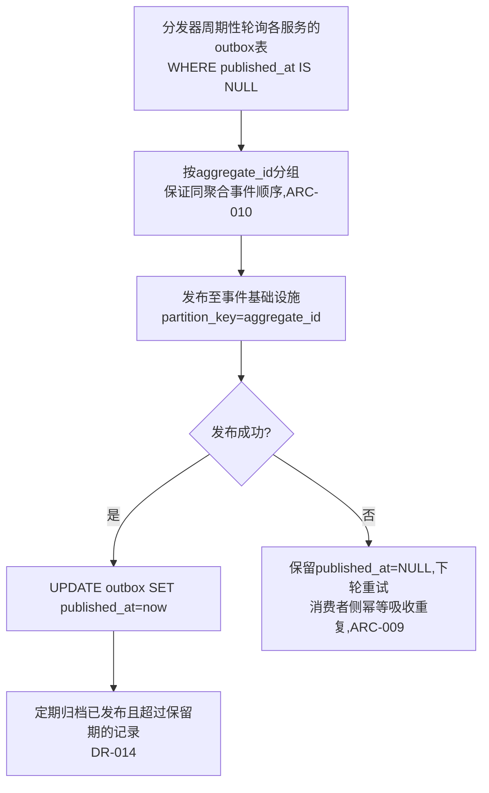
```mermaid
flowchart TD
    A[分发器周期性轮询各服务的outbox表<br/>WHERE published_at IS NULL] --> B[按aggregate_id分组<br/>保证同聚合事件顺序,ARC-010]
    B --> C[发布至事件基础设施<br/>partition_key=aggregate_id]
    C --> D{发布成功?}
    D -->|是| E[UPDATE outbox SET published_at=now]
    D -->|否| F[保留published_at=NULL,下轮重试<br/>消费者侧幂等吸收重复,ARC-009]
    E --> G[定期归档已发布且超过保留期的记录<br/>DR-014]
```

### 4.7.2 购买工作流时序（ARC-011落地，FR-WF-001、003，含补偿路径）

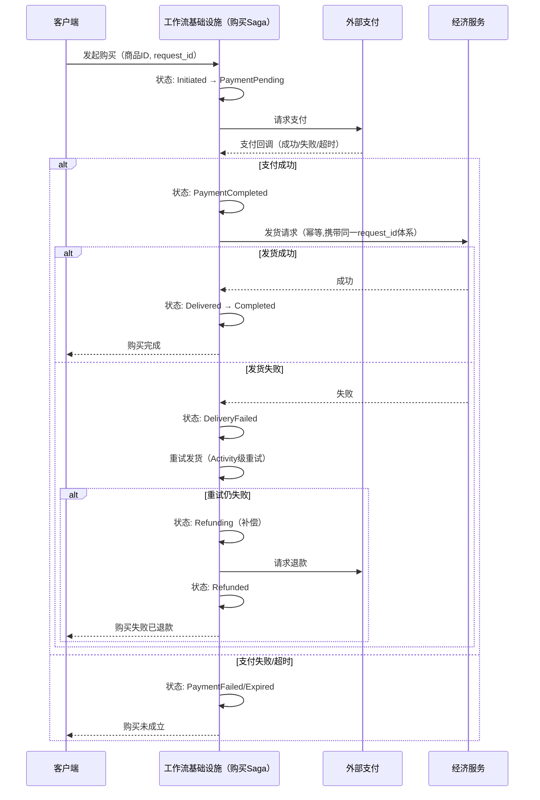
```mermaid
sequenceDiagram
    participant C as 客户端
    participant WF as 工作流基础设施（购买Saga）
    participant PAY as 外部支付
    participant EC as 经济服务

    C->>WF: 发起购买（商品ID, request_id）
    WF->>WF: 状态: Initiated → PaymentPending
    WF->>PAY: 请求支付
    PAY-->>WF: 支付回调（成功/失败/超时）
    alt 支付成功
        WF->>WF: 状态: PaymentCompleted
        WF->>EC: 发货请求（幂等,携带同一request_id体系）
        alt 发货成功
            EC-->>WF: 成功
            WF->>WF: 状态: Delivered → Completed
            WF-->>C: 购买完成
        else 发货失败
            EC-->>WF: 失败
            WF->>WF: 状态: DeliveryFailed
            WF->>WF: 重试发货（Activity级重试）
            alt 重试仍失败
                WF->>WF: 状态: Refunding（补偿）
                WF->>PAY: 请求退款
                WF->>WF: 状态: Refunded
                WF-->>C: 购买失败已退款
            end
        end
    else 支付失败/超时
        WF->>WF: 状态: PaymentFailed/Expired
        WF-->>C: 购买未成立
    end
```

## 4.8 OB／AD：可观测性・运营

### 4.8.1 Trace传播载体设计（ARC-017／NFR-OP-001、002落地）

| 路径 | trace_id等关联ID的传播载体 |
|---|---|
| 客户端 → 网关（QUIC） | 连接建立时分配`trace_id`前缀，后续消息携带短标识符（避免每Datagram重复携带完整trace_id浪费带宽，NFR-PE-006） |
| 网关 → 运行时／业务服务（gRPC内部） | 标准OpenTelemetry gRPC metadata传播（W3C Trace Context） |
| 业务服务 → PostgreSQL | `trace_id`作为outbox表列（DR-013），随事件继续传播 |
| Outbox → 事件基础设施 → 消费者 | 事件header携带`trace_id`，消费者取出后延续span |
| 事件 → 工作流 | 工作流的`workflow_id`与触发事件的`trace_id`关联记录，非同一ID但双向可查 |

### 4.8.2 指标采集拓扑

各组件通过OTLP将指标推送/暴露给OTel Collector（§3.1），Collector写入指标存储，仪表盘（FR-OB-004）从指标存储查询。日志走结构化输出→日志存储，检索时以`trace_id`／`player_id`等关联ID联表分析（NFR-OP-002）。

---

# 5. 数据库论理设计

> 本节为**逻辑（论理）级**设计：实体、属性、关系、基数、以及以UML表达的聚合边界。**不含**物理数据类型精度、索引、约束、分区策略——这些留待**RGS-DBS-001（数据库设计书，PH-2制定）**。属性的"类型"栏使用逻辑类型（字符串／整数／长整数／布尔／时刻／JSON），非PostgreSQL物理类型。

## 5.1 限界上下文与数据库映射

复用需求定义书6.2节的所有权表。本节补充：各限界上下文的数据库**物理上可以**共处同一PostgreSQL集群的不同`database`或`schema`，是否物理分离取决于PH-4负载试验后的容量判定（需求定义书DR-005）。

## 5.2 领域模型总览（UML组件视角）

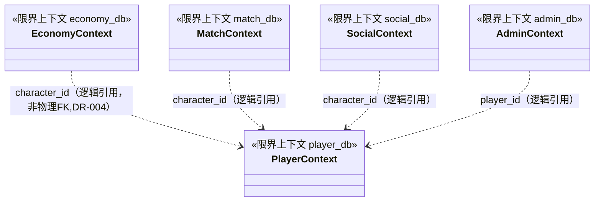
```mermaid
classDiagram
    class PlayerContext {
        <<限界上下文 player_db>>
    }
    class EconomyContext {
        <<限界上下文 economy_db>>
    }
    class MatchContext {
        <<限界上下文 match_db>>
    }
    class SocialContext {
        <<限界上下文 social_db>>
    }
    class AdminContext {
        <<限界上下文 admin_db>>
    }
    EconomyContext ..> PlayerContext : character_id（逻辑引用，非物理FK,DR-004）
    MatchContext ..> PlayerContext : character_id（逻辑引用）
    SocialContext ..> PlayerContext : character_id（逻辑引用）
    AdminContext ..> PlayerContext : player_id（逻辑引用）
```

**约定**：虚线箭头（`..>`）表示**跨限界上下文的逻辑引用**，箭头指向**被引用方**——只存ID，不建物理外键（DR-004），跨域数据获取须经API／事件／工作流（需求定义书14节ARC-008否决方案的直接推论）。全部箭头汇聚至`PlayerContext`并非偶然：账号／角色是唯一稳定的身份根，其余限界上下文都以`character_id`或`player_id`引用它，而`PlayerContext`不反向依赖任何业务上下文。

## 5.3 player_db（玩家・账号，PL）

### 5.3.1 ER图

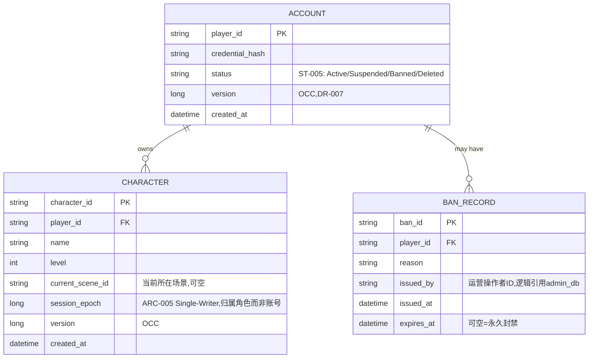
```mermaid
erDiagram
    ACCOUNT {
        string player_id PK
        string credential_hash
        string status "ST-005: Active/Suspended/Banned/Deleted"
        long version "OCC,DR-007"
        datetime created_at
    }
    CHARACTER {
        string character_id PK
        string player_id FK
        string name
        int level
        string current_scene_id "当前所在场景,可空"
        long session_epoch "ARC-005 Single-Writer,归属角色而非账号"
        long version "OCC"
        datetime created_at
    }
    BAN_RECORD {
        string ban_id PK
        string player_id FK
        string reason
        string issued_by "运营操作者ID,逻辑引用admin_db"
        datetime issued_at
        datetime expires_at "可空=永久封禁"
    }
    ACCOUNT ||--o{ CHARACTER : owns
    ACCOUNT ||--o{ BAN_RECORD : "may have"
```

### 5.3.2 UML聚合类图

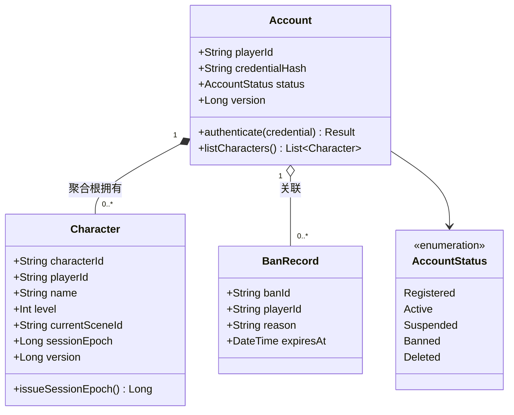
```mermaid
classDiagram
    class Account {
        +String playerId
        +String credentialHash
        +AccountStatus status
        +Long version
        +authenticate(credential) Result
        +listCharacters() List~Character~
    }
    class Character {
        +String characterId
        +String playerId
        +String name
        +Int level
        +String currentSceneId
        +Long sessionEpoch
        +Long version
        +issueSessionEpoch() Long
    }
    class BanRecord {
        +String banId
        +String playerId
        +String reason
        +DateTime expiresAt
    }
    class AccountStatus {
        <<enumeration>>
        Registered
        Active
        Suspended
        Banned
        Deleted
    }
    Account "1" *-- "0..*" Character : 聚合根拥有
    Account "1" o-- "0..*" BanRecord : 关联
    Account --> AccountStatus
```

**聚合边界说明**：`Account`是聚合根，`Character`虽有自身生命周期（可创建/删除），但账号封禁（`BanRecord`落地BZ-006）以`Account`为唯一入口——不存在"角色级封禁"，避免规则分散。`Character.sessionEpoch`的**修改权限只属于`Character`自身**（`issueSessionEpoch()`），外部不得直接赋值，这是ARC-005在对象设计层面的体现。

## 5.4 economy_db（玩家经济，EC——道具与货币统合，ARC-008）

### 5.4.1 ER图

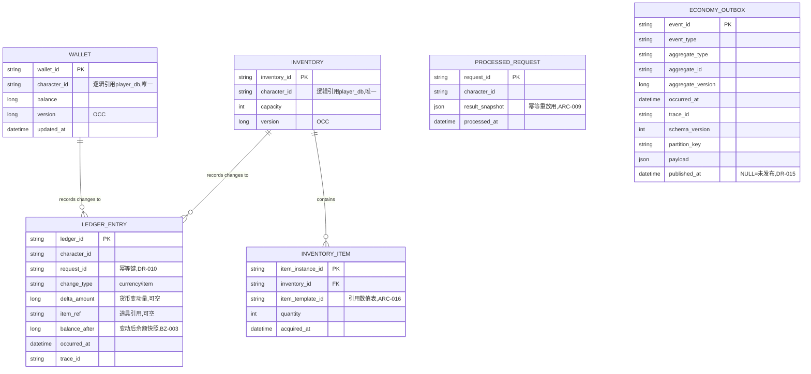
```mermaid
erDiagram
    WALLET {
        string wallet_id PK
        string character_id "逻辑引用player_db,唯一"
        long balance
        long version "OCC"
        datetime updated_at
    }
    INVENTORY {
        string inventory_id PK
        string character_id "逻辑引用player_db,唯一"
        int capacity
        long version "OCC"
    }
    INVENTORY_ITEM {
        string item_instance_id PK
        string inventory_id FK
        string item_template_id "引用数值表,ARC-016"
        int quantity
        datetime acquired_at
    }
    LEDGER_ENTRY {
        string ledger_id PK
        string character_id
        string request_id "幂等键,DR-010"
        string change_type "currency/item"
        long delta_amount "货币变动量,可空"
        string item_ref "道具引用,可空"
        long balance_after "变动后余额快照,BZ-003"
        datetime occurred_at
        string trace_id
    }
    PROCESSED_REQUEST {
        string request_id PK
        string character_id
        json result_snapshot "幂等重放用,ARC-009"
        datetime processed_at
    }
    ECONOMY_OUTBOX {
        string event_id PK
        string event_type
        string aggregate_type
        string aggregate_id
        long aggregate_version
        datetime occurred_at
        string trace_id
        int schema_version
        string partition_key
        json payload
        datetime published_at "NULL=未发布,DR-015"
    }
    INVENTORY ||--o{ INVENTORY_ITEM : contains
    WALLET ||--o{ LEDGER_ENTRY : "records changes to"
    INVENTORY ||--o{ LEDGER_ENTRY : "records changes to"
```

### 5.4.2 UML聚合类图

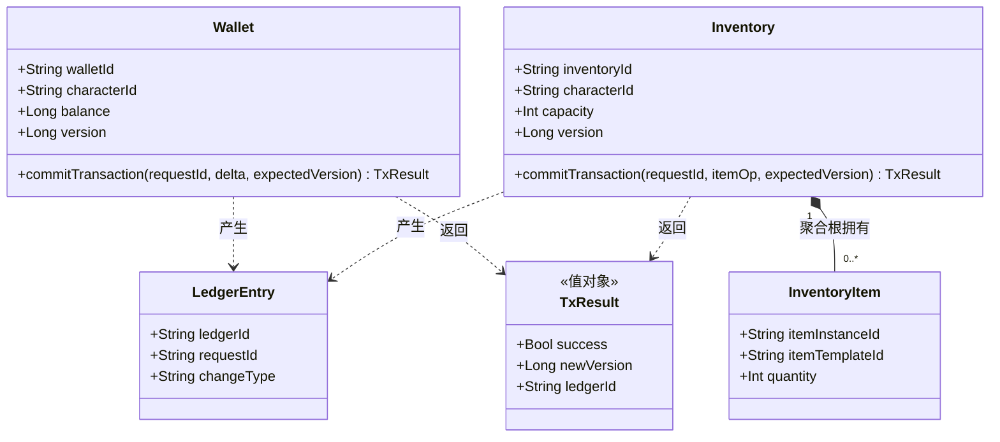
```mermaid
classDiagram
    class Wallet {
        +String walletId
        +String characterId
        +Long balance
        +Long version
        +commitTransaction(requestId, delta, expectedVersion) TxResult
    }
    class Inventory {
        +String inventoryId
        +String characterId
        +Int capacity
        +Long version
        +commitTransaction(requestId, itemOp, expectedVersion) TxResult
    }
    class InventoryItem {
        +String itemInstanceId
        +String itemTemplateId
        +Int quantity
    }
    class LedgerEntry {
        +String ledgerId
        +String requestId
        +String changeType
    }
    class TxResult {
        <<值对象>>
        +Bool success
        +Long newVersion
        +String ledgerId
    }
    Inventory "1" *-- "0..*" InventoryItem : 聚合根拥有
    Wallet ..> LedgerEntry : 产生
    Inventory ..> LedgerEntry : 产生
    Wallet ..> TxResult : 返回
    Inventory ..> TxResult : 返回
```

**聚合边界说明**：`Wallet`与`Inventory`是**两个独立聚合根**（而非合并成单一"Economy"聚合），各自持有`version`独立做OCC——同一玩家同时购买消耗货币又获得道具时，两次OCC更新各自成功或失败，不互相阻塞（避免把无关的并发更新捆绑到同一把锁上）。两者被"统合"的含义是**同属一个限界上下文（同一数据库、同一服务、同一事务边界可用）**，不是合并成一张表——这与ARC-008"消除跨库Saga"的目标一致：确定请求（§4.5.1）可以在同一数据库事务内同时更新`Wallet`和`Inventory`（例如"扣钱+发货"），因为它们物理上在同一个`economy_db`，但概念上仍是两个聚合根。

## 5.5 match_db（对局，MT，PH-5）

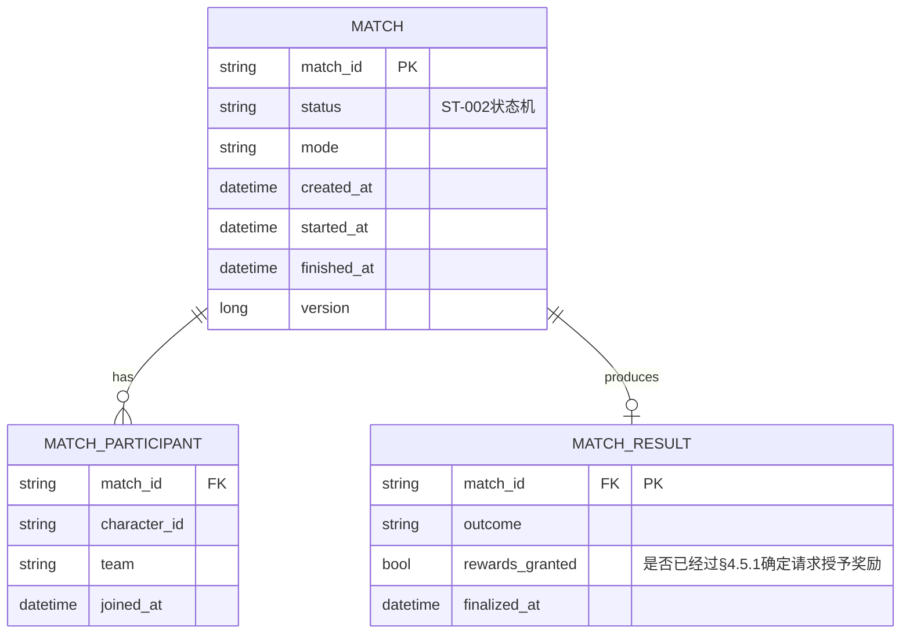
```mermaid
erDiagram
    MATCH {
        string match_id PK
        string status "ST-002状态机"
        string mode
        datetime created_at
        datetime started_at
        datetime finished_at
        long version
    }
    MATCH_PARTICIPANT {
        string match_id FK
        string character_id
        string team
        datetime joined_at
    }
    MATCH_RESULT {
        string match_id FK "PK"
        string outcome
        bool rewards_granted "是否已经过§4.5.1确定请求授予奖励"
        datetime finalized_at
    }
    MATCH ||--o{ MATCH_PARTICIPANT : has
    MATCH ||--o| MATCH_RESULT : produces
```

## 5.6 social_db（社交・公会，GD，PH-6）

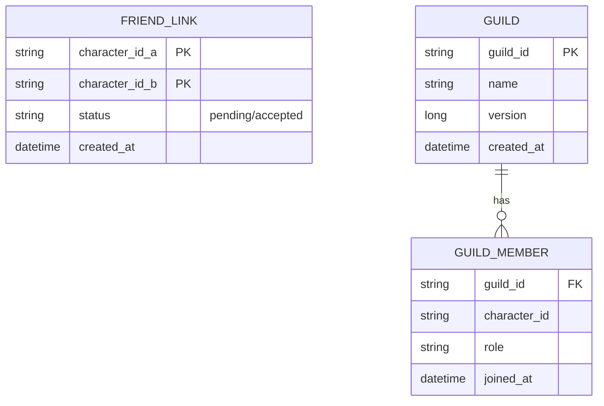
```mermaid
erDiagram
    FRIEND_LINK {
        string character_id_a PK
        string character_id_b PK
        string status "pending/accepted"
        datetime created_at
    }
    GUILD {
        string guild_id PK
        string name
        long version
        datetime created_at
    }
    GUILD_MEMBER {
        string guild_id FK
        string character_id
        string role
        datetime joined_at
    }
    GUILD ||--o{ GUILD_MEMBER : has
```

## 5.7 admin_db（运营，AD）

```mermaid
erDiagram
    OPERATION_AUDIT {
        string audit_id PK
        string operator_id
        string action_type
        string target_player_id
        json detail
        datetime occurred_at
    }
    COMPENSATION_BATCH {
        string batch_id PK
        string created_by
        string reason
        json item_grants
        string status
        datetime created_at
    }
    COMPENSATION_BATCH ||--o{ OPERATION_AUDIT : generates
```

> `OPERATION_AUDIT`**仅追加（append-only），不提供删除/更新操作**（NFR-SE-010）。这是唯一在本节被明确标注为"不可变"的表。

## 5.8 并发控制与Outbox的通用表结构范式

依据需求定义书DR-007〜015，全部承载永久事实（DR-002）且可能并发更新的表，逻辑结构须遵循以下范式（物理字段类型见RGS-DBS-001）：

| 列组 | 用途 |
|---|---|
| 主键 | 聚合根标识 |
| `version`（长整数） | 乐观并发控制（DR-007、008） |
| 业务字段 | 各表特有，见5.3〜5.7各ER图 |
| `updated_at` | 审计与调试 |

各限界上下文的`outbox`表遵循需求定义书DR-013所定义的最低限度列集合，字段级设计已在5.4.1的`ECONOMY_OUTBOX`给出范例，其余限界上下文的`outbox`表结构相同（仅`aggregate_type`取值不同），不再重复绘制。

---

# 6. 外部接口设计

> 本节为**消息／方法字段级**设计：每个API方法的请求／响应字段、每类消息的字段构成。**不含**字节级线路格式（量化精度、位打包布局、Protocol Buffers字段编号）——留待**RGS-IFS-001（外部接口规格书，PH-1制定，含ISS-005的解决结果）**。

## 6.1 API设计通用原则

| 原则 | 内容 | 依据 |
|---|---|---|
| 幂等键统一 | 凡产生永久事实变更的方法，请求**必须**携带`request_id`（UUIDv7） | ARC-009、DR-010 |
| 版本号透传 | 凡涉及OCC更新的方法，请求**必须**携带`expected_version`，响应**必须**返回`new_version` | DR-007、008 |
| 权威时钟字段 | 凡受Single-Writer保护的方法，请求**必须**携带`session_epoch` | ARC-005 |
| 追踪字段 | 全部方法的请求元数据（gRPC metadata／QUIC消息头）**必须**携带`trace_id` | NFR-OP-002、§4.8.1 |
| 错误表达 | 业务错误通过响应体的`result_code`字段表达，**不得**滥用传输层错误（gRPC status/QUIC错误帧）表达业务语义 | §9.2 |

## 6.2 IF-001：客户端 ⇔ 网关（QUIC消息字段设计）

### 6.2.1 不可靠通道（Datagram）消息

| 消息类型 | 方向 | 频度 | 字段 | 对应功能 |
|---|---|---|---|---|
| `PlayerInputMessage` | 客户端→服务器 | 每tick | `sequence_no`（整数，客户端本地递增）／`input_type`（枚举：移动／技能）／`payload`（依`input_type`变体：移动为方向向量，技能为技能ID＋目标） | FR-RT-004 |
| `StateDeltaSnapshot` | 服务器→客户端 | 10〜20Hz | `base_tick`（差分基准的tick号）／`current_tick`／`entity_updates[]`（每项含`entity_id`／`position`／`velocity`／`anim_state`）／`enter_view[]`（新进入视野的实体完整状态）／`leave_view[]`（离开视野的`entity_id`列表） | FR-SY-003、FR-SY-002 |
| `InputAck` | 服务器→客户端 | 随快照 | `last_processed_sequence`（已处理的最新`sequence_no`） | FR-SY-008 |

### 6.2.2 可靠通道（Stream）消息

| 消息类型 | 方向 | 字段 | 对应功能 |
|---|---|---|---|
| `SessionHandshake` | 双向 | 请求：`protocol_version`／`auth_token`；响应：`session_epoch`／`character_id`／`initial_scene_id`／`result_code` | FR-GW-005、§4.4.2 |
| `ItemGrantNotice` | 服务器→客户端 | `request_id`（与§4.5.1确定请求同一ID）／`item_template_id`／`quantity`／`new_inventory_version` | ARC-006、FR-EC-003 |
| `SceneTransitionCommand` | 服务器→客户端 | `target_scene_id`／`reason`（枚举：玩家发起／强制传送／节点排空） | FR-RT-008、§4.2.4 |
| `ChatMessage`（PH-6） | 双向 | `channel`（枚举：世界／公会／私聊）／`sender_character_id`／`text`／`sent_at` | FR-GD-002 |

## 6.3 IF-002／003：gRPC服务设计（UML接口视图）

```mermaid
classDiagram
    class PlayerService {
        <<interface>>
        +Authenticate(credentialToken) AuthResult
        +SelectCharacter(characterId) IssueEpochResult
        +GetCharacterList(playerId) CharacterList
    }
    class EconomyService {
        <<interface>>
        +CommitTransaction(request) TxResult
        +GetInventory(characterId) InventorySnapshot
        +GetWallet(characterId) WalletSnapshot
    }
    class MatchService {
        <<interface>>
        +EnqueueMatch(characterId, mode) QueueTicket
        +GetMatchStatus(matchId) MatchStatus
    }
    class SocialService {
        <<interface>>
        +AddFriend(fromId, toId) Result
        +JoinGuild(characterId, guildId) Result
        +SendChat(message) Result
    }
    class AdminService {
        <<interface>>
        +BanAccount(playerId, reason, expiresAt) Result
        +GrantCompensation(batch) Result
        +SetMaintenanceMode(enabled) Result
    }
    RuntimeCaller ..> EconomyService : 调用（ARC-007）
    RuntimeCaller ..> PlayerService : 调用
    GatewayCaller ..> PlayerService : 调用
    OpsToolCaller ..> AdminService : 调用（RBAC,NFR-SE-005）
```

### 6.3.1 `PlayerService`

| Method | 请求字段 | 响应字段 | 对应功能 |
|---|---|---|---|
| `Authenticate` | `credential_token` | `player_id`／`character_list`／`result_code` | FR-PL-001 |
| `SelectCharacter` | `player_id`／`character_id` | `session_epoch`（新发行）／`current_scene_id`／`result_code` | FR-PL-003、§4.4.2 |
| `GetCharacterList` | `player_id` | `characters[]`（`character_id`／`name`／`level`） | FR-PL-002 |

### 6.3.2 `EconomyService`

| Method | 请求字段 | 响应字段 | 对应功能 |
|---|---|---|---|
| `CommitTransaction` | `request_id`／`character_id`／`session_epoch`／`operation`（oneof：`grant_item`｜`consume_item`｜`grant_currency`｜`consume_currency`）／`expected_version` | `result_code`／`new_version`／`ledger_id` | FR-EC-003、§4.5.1 |
| `GetInventory` | `character_id` | `items[]`（`item_instance_id`／`item_template_id`／`quantity`）／`version` | FR-EC-001 |
| `GetWallet` | `character_id` | `balance`／`version` | FR-EC-002 |

### 6.3.3 `MatchService`（PH-5，本版仅字段占位，处理时序留§4.6开始前补充）

| Method | 请求字段 | 响应字段 |
|---|---|---|
| `EnqueueMatch` | `character_id`／`mode` | `queue_ticket_id`／`result_code` |
| `GetMatchStatus` | `match_id` | `status`（ST-002）／`participants[]` |

### 6.3.4 `AdminService`

| Method | 请求字段 | 响应字段 | 对应功能 |
|---|---|---|---|
| `BanAccount` | `player_id`／`reason`／`expires_at`（可空＝永久）／`operator_id` | `ban_id`／`result_code` | FR-AD-001 |
| `GrantCompensation` | `batch`（`character_ids[]`／`item_template_id`／`quantity`／`reason`） | `batch_id`／`result_code` | FR-AD-002 |
| `SetMaintenanceMode` | `enabled`／`message`／`operator_id` | `result_code` | FR-AD-003 |

## 6.4 IF-006：支付Webhook接口

| 项目 | 内容 |
|---|---|
| 方向 | 外部支付服务 → 工作流基础设施（Webhook接收端点） |
| 请求字段 | `provider_transaction_id`（映射至工作流`request_id`体系的幂等键）／`purchase_id`／`status`（成功／失败）／`amount`／`signature`（签名校验，防伪造回调） |
| 响应字段 | HTTP 200＋`ack_status`（确认已接收，供支付方判断是否重推） |
| 详细规格 | 签名算法、重放窗口等依赖ISS-007（区域与数据所在地方针）及具体支付服务商选型，PH-6前确定 |

## 6.5 IF-007：运营API（补充，FR-AD落地）

运营API的方法定义见§6.3.4 `AdminService`。传输层为HTTPS＋RBAC（NFR-SE-005），角色划分见§7.3。

---

# 7. 非功能设计

## 7.1 可用性设计（NFR-AV落地）

```mermaid
flowchart LR
    subgraph Primary["主可用区"]
        PGm[(PostgreSQL 主)]
        RTm[运行时节点]
    end
    subgraph Standby["备用"]
        PGs[(PostgreSQL 同步备用)]
    end
    PGm -->|同步复制,RPO=0<br/>NFR-AV-005| PGs
    PGm -.->|故障转移,RTO<30分,NFR-AV-004| PGs
    RTm -->|周期性检查点,RPO=30秒<br/>NFR-AV-006| PGm
```

| 设计点 | 方针 |
|---|---|
| PostgreSQL复制 | 同步复制（至少1个同步备用），保证永久事实RPO=0（NFR-AV-005） |
| 故障转移 | 依赖PostgreSQL标准故障转移机制（如`pg_auto_failover`或云托管服务的自动故障转移），目标RTO 30分钟以内 |
| 运行时故障恢复 | 依§4.2.3监督流程，目标RTO 5分钟以内（NFR-AV-003），代价是RPO 30秒（检查点周期，ISS-010待定具体值） |
| K8s探针 | `livenessProbe`检测进程死锁／panic；`readinessProbe`检测是否可接受新连接（排空期间`readinessProbe`失败但`livenessProbe`仍通过） |
| 降级运行 | 见§4.5.2，经济服务不可用时实时战斗继续（NFR-AV-009） |

## 7.2 性能设计（NFR-PE落地）

| 设计点 | 方针 |
|---|---|
| tick预算分配 | 见§4.2.2 |
| 连接池 | 各服务对PostgreSQL的连接池须设上限，具体数值依PH-4负载试验结果调整 |
| 背压参数 | 场景Actor mailbox容量、经济服务待处理确定请求数上限，均须可配置（便于PH-4调参），初始值由详细设计给出 |
| AOI网格参数 | 格子大小＝视野距离（ISS-009待定），初始值供PH-2开发使用，PH-2完成时依实测调整 |

## 7.3 安全设计（NFR-SE落地）

| 设计点 | 方针 |
|---|---|
| 证书体系 | 外部（客户端↔网关/API网关）使用公开CA签发证书；内部（服务间mTLS）使用集群内部CA，证书由K8s证书管理机制自动轮换 |
| RBAC角色（运营API，FR-AD） | 至少划分：只读查看／封禁操作／补偿发放／维护模式切换／数值热更新，五类角色，最小权限原则（NFR-SE-005） |
| 输入校验分层 | ①网关层：格式与速率（FR-GW-006）②运行时层：物理合法性（速度、位置边界，NFR-SE-001）③业务服务层：业务规则（BZ-001〜007） |
| 审计日志 | 运营操作与货币增减写入仅追加表（NFR-SE-010），与业务事务的outbox分离，不经过事件基础设施的常规重试/丢弃路径 |

## 7.4 迁移性设计：Expand-Contract流程（NFR-MI-002落地，ARC-015）

```mermaid
flowchart TD
    A[阶段0: 现状] --> B[阶段1 Expand:<br/>新增字段/表,旧字段并存<br/>新旧版本代码均可运行]
    B --> C[部署新版本代码<br/>读旧写新,或双写]
    C --> D[滚动更新完成<br/>确认全部Pod为新版本]
    D --> E{全部消费者/客户端<br/>已迁移完成?}
    E -->|否| D
    E -->|是| F[阶段2 Contract:<br/>删除旧字段/表]
```

**判定"全部消费者已迁移完成"的方法**：依赖NFR-OP-006所要求的版本号追踪（`schema_version`／协议版本号），运维仪表盘展示各版本的流量占比，占比归零后方可执行Contract阶段。

---

# 8. 状态迁移详细设计

本节在需求定义书第8章状态机基础上，补充**触发该迁移的具体调用来源**。状态定义本身不重复。

| 状态机 | 迁移 | 触发来源 |
|---|---|---|
| ST-001 会话 | Authenticating → Active | §4.1.2鉴权成功 |
| ST-001 会话 | Active → Disconnected | 网关心跳超时检测（FR-GW-003） |
| ST-001 会话 | Disconnected → Active | §4.1.3重连时序完成 |
| ST-002 对局 | Created → Waiting | 匹配队列受理创建请求（PH-5） |
| ST-002 对局 | Running → Finished | 场景Actor判定结束条件成立，通知对局服务 |
| ST-002 对局 | Finished → Archived | 结算与奖励确定完成（经§4.5.1同款确定请求机制） |
| ST-003 购买 | 全部迁移 | §4.7.2工作流时序图已详细给出 |
| ST-004 交易 | Draft → Offered → Accepted → Settled | PH-7详细化，本版仅确认状态机与需求定义书一致 |
| ST-005 账号 | Active → Suspended | 运营服务`BanAccount`调用（FR-AD-001），写入`admin_db`审计日志 |

---

# 9. 异常・错误处理设计方针

## 9.1 错误分类体系

| 分类 | 定义 | 处理方针 | 对应需求 |
|---|---|---|---|
| 业务错误 | 请求本身合法但业务规则拒绝（如货币不足、版本冲突） | 明确的错误码返回调用方，**不重试**（除OCC冲突的有限次重试，见需求定义书5.3.2） | BZ-001〜007 |
| 系统错误 | 组件内部异常（panic、逻辑缺陷） | 监督者隔离＋恢复（§4.2.3），记录告警 | FR-RT-010 |
| 基础设施错误 | 依赖的数据库／缓存／事件基础设施不可用 | 依ARC-013背压与降级方针处理，**不得**将基础设施错误伪装成业务错误返回客户端 | ARC-013、NFR-AV-009 |

## 9.2 错误响应格式设计方针

| 路径 | 错误传达方式 |
|---|---|
| gRPC内部调用 | 标准gRPC status code＋自定义error detail（业务错误码），不使用HTTP状态码语义 |
| QUIC协议（客户端） | 专用错误帧类型，携带错误分类＋错误码，具体字节格式属RGS-IFS-001范围 |
| 运营API（HTTPS） | 标准HTTP状态码＋JSON错误体，业务错误码在body中 |

**统一原则**：错误码须能唯一定位到需求定义书的BZ-nnn／ARC-nnn/NFR-nnn，便于运维排查时反查需求依据（呼应NFR-OP-008一次排查15分钟以内的目标）。具体错误码编号体系属详细设计范围。

---

# 10. 详细设计移交事项一览

以下事项本文档**未给出具体数值或格式**，须在对应阶段的详细设计中确定。多数已在需求定义书附件D登记为ISS/TBD，此处做二次对照，防止详细设计阶段遗漏。

| 编号 | 事项 | 本文档涉及章节 | 需求定义书对应ISS/TBD | 确定期限 |
|---|---|---|---|---|
| 1 | 高频路径字节级线路格式（量化精度、位打包布局） | §6.2 | ISS-005／TBD-005 | PH-1（RGS-IFS-001） |
| 2 | AOI格子大小与视野距离具体值 | §4.3.1、§7.2 | ISS-009 | PH-2 |
| 3 | 检查点周期具体值（暂定30秒） | §4.2.3、§7.1 | ISS-010 | PH-3 |
| 4 | tick预算各阶段具体毫秒数 | §4.2.2 | — | PH-2实测后调整 |
| 5 | 场景Actor mailbox容量、经济服务待处理请求数上限 | §7.2 | — | PH-2〜PH-4负载试验后 |
| 6 | gRPC方法的`.proto`文件化（字段编号、wire类型）——方法名与字段名已在§6.3给出，本项仅剩序列化层落地 | §6.3 | — | PH-1（RGS-IFS-001） |
| 7 | 数据库物理设计（数据类型精度、索引、约束、分区、DDL）——实体与逻辑属性已在§5给出，本项仅剩物理化 | §5 | — | PH-2（RGS-DBS-001） |
| 8 | 错误码编号体系（具体码值表） | §9.2 | — | PH-1〜PH-2 |
| 9 | 支付服务商选型与Webhook签名算法详细规格 | §6.4 | ISS-007 | PH-6 |
| 10 | MT／GD子系统详细处理时序（当前仅字段级API占位，§6.3.3） | §4.6 | — | PH-5／PH-6开始前补充本文档 |

---

# 11. 追溯性（ARC-nnn → 本设计书章节）

| ARC编号 | 需求定义书决定摘要 | 本文档展开章节 | 覆盖确认 |
|---|---|---|---|
| ARC-001 | Actor粒度＝场景 | §3.2、§3.4、§4.2.1 | ✓ |
| ARC-002 | 同步方式（状态同步＋预测和解） | §4.3.1〜4.3.3 | ✓ |
| ARC-003 | QUIC双路径 | §3.3、§6.2 | ✓ |
| ARC-004 | 量化＋位打包 | §6.2（字段级已给出，字节级移交RGS-IFS-001） | ✓（字段级） |
| ARC-005 | Single-Writer（session_epoch） | §3.5、§4.4.2、§5.3（归属澄清：epoch属Character） | ✓ |
| ARC-006 | ACK与持久化边界 | §4.5.1 | ✓ |
| ARC-007 | 运行时⇔业务服务边界 | §4.5.2 | ✓ |
| ARC-008 | 限界上下文划分（EC统合） | §5.1、§5.4 | ✓ |
| ARC-009 | 数据一致性（禁止双写、OCC、幂等） | §4.5.1、§5.8、§6.1 | ✓ |
| ARC-010 | 事件传播与顺序边界 | §4.7.1 | ✓ |
| ARC-011 | 工作流（Saga）适用边界 | §4.7.2 | ✓ |
| ARC-012 | 缓存・临时状态适用边界 | §3.5、§7.1 | ✓ |
| ARC-013 | 背压与死锁防止 | §3.3、§4.2.4、§7.2 | ✓ |
| ARC-014 | 中间件导入判定基准 | §1.2（颗粒度声明本身即遵循此方针）、§4.6 | ✓ |
| ARC-015 | 版本管理与兼容性 | §7.4 | ✓ |
| ARC-016 | 数值表热更新 | §4.2.2 | ✓ |
| ARC-017 | 可观测性 | §4.8 | ✓ |

**确认结果**：需求定义书第10章全部17条架构方针，均已在本文档中找到对应展开章节，无遗漏。

---

**以上**
