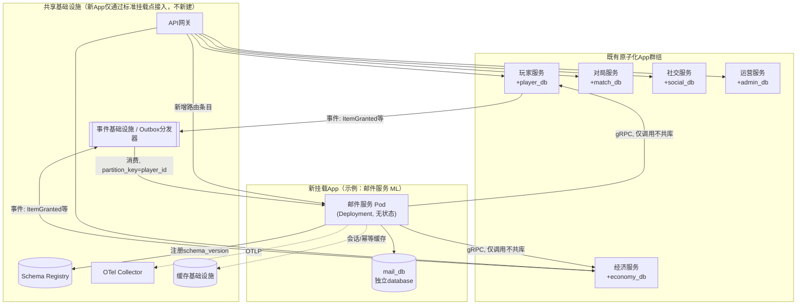
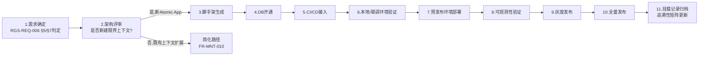
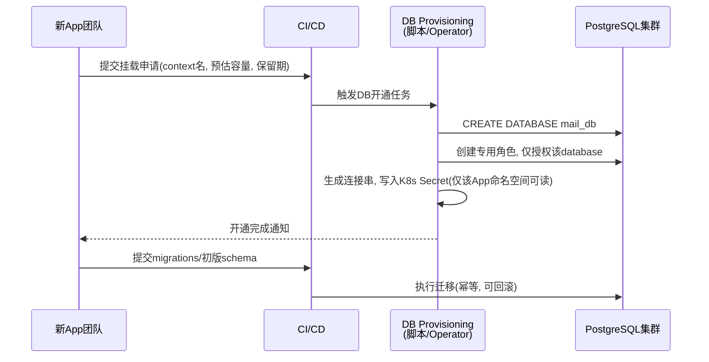

# 基本设计书（基本設計書 / Basic Design Document）

**新功能挂载架构 Feature Mounting Architecture**

| 项目 | 内容 |
|---|---|
| 文档编号 | RGS-BAS-002 |
| 版本 | 0.4 |
| 父文档 | RGS-REQ-006 需求定义书 第7章（ARC-018） |
| 依据标准 | IPA『共通フレーム 2013（SLCP-JCF2013）』基本设计工程 |
| 制定日 | 2026-08-16 |
| 制定者 | 架构师 |
| 保密级别 | 内部限定（Internal Use Only） |

## 修订历史（改訂履歴 / Revision History）

| 版本 | 修订日 | 修订者 | 修订内容 | 影响章节 |
|---|---|---|---|---|
| 0.1 | 2026-08-16 | 架构师 | 初版制定。将RGS-REQ-006 ARC-018展开为脚手架结构、Helm chart模板、DB开通流程、网关/事件登记流程、可观测性接入、标准化挂载/退场检查清单 | 全部 |
| 0.2 | 2026-08-17 | 架构师 | 补齐设计缺口：FR-MNT-011（横切能力以库/SDK形式被各App引用时须提供独立版本发布流程）此前仅在§13追溯性表以区间形式带过，无具体设计；新增§3.3给出简化路径下横切库/SDK的版本发布流程、兼容性方针与判定表 | §3.3、§13 |
| 0.3 | 2026-08-21 | 架构师 | 同步 RGS-IMPL-001：明确 virtual workspace、领域库/服务 bin 分离、按域 versioned proto、migration owner、根 Cargo.lock 与 CI/部署边界；禁止泛化 common crate。 | §4、§6、§12、§13 |
| 0.4 | 2026-09-01 | 架构师 (Mavis 接手 agent per DEC-008) | 落实"各BAS文档功能章节加log设计且区分debug/release级"总要求（per Ulysses 2026-09-01 15:52 JST 决策，4 拍板选项：全部 36 个BAS / 详尽版5列表 / 派worker并行 / BAS-004同步升级）：§2.1/§2.2/§3.1/§3.2/§3.3/§4.1/§4.2/§5.1/§5.2/§5.3/§6.1/§6.2/§7.1/§7.2/§8/§9.1/§9.2/§10.1/§10.2/§11.1/§11.2/§12.1/§12.2 全部 22 个 ## L2 功能段加"本功能日志设计" 5 列详尽版（字段名/触发条件/频率估算/采样策略/脱敏与成本），引用 BAS-001 v1.5 §4.8.3 模板（commit 32d9eb6）+ BAS-003 v0.3 样板（commit 75a001c）+ BAS-004 v0.3 §4.2 二维矩阵 + §4.3 字段 + §5.1 脱敏 + §6.2 强制全采样（commit 47e26b0/0ee6262）；覆盖 ARC-018 挂载五要素流程的"脚手架生成 / DB 开通 / 镜像推送 / Helm 渲染 / 路由登记 / NetworkPolicy 加载 / OTel 自动发现 / 灰度发布 / 全量发布 / 挂载记录归档 / 退场"全链路；显式区分 `info!`/`warn!`/`error!`（release 必出，编译期常驻，§6.2 强制全采样）与 `trace!`/`debug!`（`#[cfg(debug_assertions)]` 守护，debug-only，release build 完全剔除零运行时开销）两类事件；§12.1 检查清单新增 log 章节上线检查项；§13 追溯性新增 AC-MNT-006（debug-only 宏 release 完全剔除）与 AC-MNT-007（每功能BAS文档须含本功能log设计章节），与 BAS-001 v1.5 §4.8.3.4 / BAS-003 v0.3 §13 / BAS-004 v0.3 §12 形成统一规范 | §2.1/§2.2/§3.1/§3.2/§3.3/§4.1/§4.2/§5.1/§5.2/§5.3/§6.1/§6.2/§7.1/§7.2/§8/§9.1/§9.2/§10.1/§10.2/§11.1/§11.2/§12.1/§12.2/§13 |

## 审批栏（承認欄 / Approval）

| 角色 | 姓名 | 审批日 | 备注 |
|---|---|---|---|
| 制定（起草） | 架构师 | 2026-08-16 | — |
| 评审（技术） | | | 与RGS-BAS-001既有部署构成（§3）的一致性 |
| 审批（负责人） | | | 本文档的基准化 |

---

## 目录

1. [前言](#1-前言)
2. [整体挂载架构](#2-整体挂载架构)
3. [标准化挂载流程](#3-标准化挂载流程)
4. [骨架（脚手架）设计](#4-骨架脚手架设计)
5. [Kubernetes部署设计](#5-kubernetes部署设计)
6. [数据库开通设计](#6-数据库开通设计)
7. [服务间通信接入设计](#7-服务间通信接入设计)
8. [事件基础设施接入设计](#8-事件基础设施接入设计)
9. [可观测性接入设计](#9-可观测性接入设计)
10. [挂载记录与追溯性](#10-挂载记录与追溯性)
11. [退场（下线）设计](#11-退场下线设计)
12. [标准化检查清单](#12-标准化检查清单)
13. [追溯性（ARC-018 → 本设计书章节）](#13-追溯性arc-018-本设计书章节)

---

# 1. 前言

## 1.1 本文档的定位

本文档是RGS-REQ-006第7章ARC-018（新功能挂载规范）的系统级展开，回答"新的限界上下文如何以标准、可重复、可验收的方式接入现有的**原子化App群组＋每上下文独立DB＋Kubernetes**架构"这一问题。本文档遵循RGS-BAS-001既有的记述规则（§1.4强度用语、图示规则），不重复定义。

## 1.2 与既有架构的关系

本文档**不改变**RGS-BAS-001已确定的整体架构（§3系统方式设计、§5数据库论理设计），只是把"如何把第6个、第7个……限界上下文，以与既有5个（PL/EC/MT/GD/AD）同构的方式加入系统"这件事**流程化、模板化**。新挂载的App在部署形态判定（Deployment/StatefulSet）、数据库隔离原则、事件规范、可观测性规范上，**必须**与RGS-BAS-001§3.2、§5.1、§4.7、§4.8的既有决定完全一致，不得另起炉灶。

## 1.3 挂载五要素与本文档章节对应

| ARC-018五要素 | 本文档展开章节 |
|---|---|
| 独立DB | §6 数据库开通设计 |
| 独立部署单元 | §5 Kubernetes部署设计 |
| gRPC/事件为唯一跨边界通信方式 | §7、§8 |
| 标准化脚手架 | §4 骨架设计 |
| 标准化可观测性接入 | §9 |

---

# 2. 整体挂载架构

## 2.1 挂载后的系统全景



### 2.1 本功能日志设计

本节覆盖挂载后系统全景中**新App接入既有架构的边界观察点**——挂载架构本身不产生业务事件，但脚手架初始化阶段会发出"挂载开始/完成"诊断事件，便于SRE在Prometheus/Grafana上按`context`维度追踪每个限界上下文的接入时序。

| 字段名（field） | 触发条件（trigger） | 频率估算（frequency） | 采样策略（sampling） | 脱敏与成本（redact & cost） |
|---|---|---|---|---|
| `mnt.mount.started` | 脚手架初始化阶段检测到新context挂载申请（CI/CD 流水线入口） | 0.1/h（每新context一次） | release 必出（100% 强制全采样，per BAS-004 v0.3 §6.2） | 无敏感字段；约 250B/条 × 0.1/h = 极低 |
| `mnt.mount.completed` | 脚手架生成代码仓库/子目录完成（含CI/CD、Helm chart、健康检查、OTel 埋点骨架） | 0.1/h | release 必出（100% 强制全采样） | 含`context`/`git_sha`/`generated_crate_count`；约 400B/条 × 0.1/h = 极低 |
| `mnt.mount.failed.unexpected` | 脚手架生成过程中未预期异常（仓库克隆失败 / 模板渲染失败 / git init 失败） | 极低（配置错） | release 必出（100% 强制全采样） | 含`error`/`trace_id`；约 300B/条 |
| `mnt.mount.debug.scaffold_layout_dump` | 脚手架生成的完整目录结构 dump（验证是否与 §4.1 模板一致） | 0.1/h | **debug-only**（`#[cfg(debug_assertions)]` 守护，release build 完全剔除） | 约 1.5KB/条（release 剔除，零运行时开销） |
| `mnt.mount.debug.dependency_graph_snapshot` | Cargo workspace `Cargo.lock` 解析后的依赖图快照 | 0.1/h | **debug-only**（`#[cfg(debug_assertions)]` 守护） | 约 5-20KB/条（依赖图大小决定，release 剔除） |

**debug-only 守护要点**（落实 BAS-004 v0.3 §4.4）：
- `mnt.mount.debug.dependency_graph_snapshot` 在大型 workspace 下可能 20KB+ —— release build 完全剔除，避免 RUST_LOG=debug 误开时撑爆生产日志通道
- `mnt.mount.*` 系列均为 `info!` 级别（release 必出，§4.8.3.2 二维矩阵 `info!` 行常驻），便于 SRE 按 `context` 维度聚合

## 2.2 挂载点（Mount Point）清单

新App接入系统时，必须显式声明并登记以下挂载点：

| 挂载点 | 登记位置 | 责任方 |
|---|---|---|
| gRPC服务定义 | 服务发现/K8s Service，命名规则`svc-<context>` | 新App团队 |
| API网关路由（若需客户端直连） | API网关路由表（§7.2） | 新App团队 + 网关维护者 |
| 数据库连接 | `mail_db`独立database，独立K8s Secret存放连接串 | 新App团队 + DBA/SRE |
| 事件Producer/Consumer | Schema Registry + Topic命名（§8） | 新App团队 |
| 可观测性资源标签 | OTel resource attributes（`service.name=mail-service`等） | 新App团队（脚手架自动生成） |
| K8s资源配额 | Namespace内`ResourceQuota`/`LimitRange`（§5.3） | 新App团队 + SRE |

### 2.2 本功能日志设计

本节覆盖挂载点声明/登记过程的观察点——每个挂载点（gRPC/网关/DB/事件/OTel/K8s 配额）均产生"已登记/已校验"事件，作为后续§3 标准化挂载流程阶段判定（§3.2）的诊断输入。

| 字段名（field） | 触发条件（trigger） | 频率估算（frequency） | 采样策略（sampling） | 脱敏与成本（redact & cost） |
|---|---|---|---|---|
| `mnt.mount_point.declared` | 脚手架生成阶段，开发者通过 `values.yaml` 声明挂载点列表 | 0.1/h | release 必出（100% 强制全采样，per BAS-004 v0.3 §6.2） | 含`context`/`declared_points`；约 350B/条 × 0.1/h = 极低 |
| `mnt.mount_point.verified` | 挂载申请进入架构评审（§3.2 阶段 2） | 0.1/h | release 必出（100% 强制全采样） | 含`context`/`verifier_id`/`verified_points_count`；约 300B/条 |
| `mnt.mount_point.rejected.missing` | 挂载点声明缺失（如未声明 gRPC 端口或 DB 角色） | 偶发（首次挂载） | release 必出（100% 强制全采样） | 含`context`/`missing_point_kind`；约 250B/条 |
| `mnt.mount_point.duplicate_detected` | 检测到同一 context 重复声明挂载点（脚手架防重） | 极低（配置错） | release 必出（100% 强制全采样） | 含`context`/`duplicate_point_kind`/`existing_owner`；约 280B/条 |
| `mnt.mount_point.debug.values_yaml_redacted` | 脚手架输入的 `values.yaml` 完整 dump（敏感字段已脱敏，**仅** debug-only 守护） | 0.1/h | **debug-only**（`#[cfg(debug_assertions)]` 守护，release build 完全剔除） | 约 2-5KB/条（release 剔除） |
| `mnt.mount_point.debug.dns_resolution_check` | 挂载点引用既有 Service 时，DNS 解析耗时（微秒级）与结果 | 0.1/h | **debug-only**（`#[cfg(debug_assertions)]` 守护） | 约 200B/条（release 剔除） |

**debug-only 守护要点**：
- `mnt.mount_point.debug.values_yaml_redacted` **可能含 Secret 引用**（虽不写明文），但**仅** debug-only 守护以避免 RUST_LOG=debug 误开时泄漏
- `mnt.mount_point.debug.dns_resolution_check` 用于挂载首次触达既有 Service 的延迟基线测量，release 完全剔除

---

# 3. 标准化挂载流程

## 3.1 流程总览



### 3.1 本功能日志设计

本节覆盖挂载流程**阶段切换**的观察点——每个阶段进入/退出时产生一条 release 必出事件，便于 SRE 按 `context` + `stage` 维度追踪挂载进度；阶段准入失败（cargo build 非绿、契约测试失败、Pod 启动失败等）触发 `warn!`/`error!`。

| 字段名（field） | 触发条件（trigger） | 频率估算（frequency） | 采样策略（sampling） | 脱敏与成本（redact & cost） |
|---|---|---|---|---|
| `mnt.flow.stage_entered` | 进入挂载流程的某个阶段（11 个阶段任一入口触发） | 0.1/h（每新context 11 条） | release 必出（100% 强制全采样，per BAS-004 v0.3 §6.2） | 含`context`/`stage`/`stage_index`；约 200B/条 × 0.1/h = 极低 |
| `mnt.flow.stage_completed` | 阶段产出物已生成（如 cargo build 首次绿、镜像推送成功、Pod ready） | 0.1/h | release 必出（100% 强制全采样） | 含`context`/`stage`/`duration_ms`/`artifact_ref`；约 280B/条 |
| `mnt.flow.stage_failed.cargo_build` | 阶段 3 脚手架生成后 `cargo build` 失败 | 偶发（首次挂载） | release 必出（100% 强制全采样） | 含`context`/`error`/`trace_id`；约 350B/条 |
| `mnt.flow.stage_failed.contract_test` | 阶段 6 联调验证的契约测试未通过 | 偶发 | release 必出（100% 强制全采样） | 含`context`/`failing_proto_service`/`diff_summary`；约 400B/条 |
| `mnt.flow.stage_failed.health_check` | 阶段 7 预发布部署后 `/healthz`/`/readyz` 持续失败 | 极少 | release 必出（100% 强制全采样） | 含`context`/`endpoint`/`consecutive_failures`；约 300B/条 |
| `mnt.flow.stage_rejected.rbac` | 阶段 2 架构评审被架构师驳回 | 极少 | release 必出（100% 强制全采样） | 含`context`/`rejector_id`/`reason`；约 250B/条 |
| `mnt.flow.debug.stage_artifact_dumps` | 阶段产出物完整 dump（cargo metadata / Helm 渲染结果 / proto diff） | 0.1/h | **debug-only**（`#[cfg(debug_assertions)]` 守护，release build 完全剔除） | 约 10-50KB/条（release 剔除） |
| `mnt.flow.debug.gate_evaluation_timing` | 阶段准入判定（cargo build、契约测试等）的微秒级耗时 | 0.1/h | **debug-only**（`#[cfg(debug_assertions)]` 守护） | 约 200B/条（release 剔除） |

**debug-only 守护要点**：
- `mnt.flow.debug.stage_artifact_dumps` 在大 workspace 下可能 50KB+ —— release build 完全剔除，避免 RUST_LOG=debug 误开时撑爆生产日志通道
- `mnt.flow.stage_failed.*` 系列均为 `error!` 级别（§4.8.3.2 二维矩阵 `error!` 行 release 常驻 + §6.2 强制全采样），不挂 `#[cfg]`，确保 release 下告警链路完整

## 3.2 各阶段产出物与准入判定

| 阶段 | 产出物 | 进入下一阶段的判定基准 |
|---|---|---|
| 1. 需求确定 | 新功能的FR/NFR条目（遵循RGS-REQ-001既有ID体系延展） | 已挂接至现有ARC-nnn或产出新ADR |
| 2. 架构评审 | 是否新建限界上下文的判定记录（依ARC-008同等原则） | 架构师签核 |
| 3. 脚手架生成 | 代码仓库/子目录，含CI/CD、Helm chart、健康检查、OTel埋点骨架 | `cargo build`/CI首次绿色通过 |
| 4. DB开通 | 独立`database`、迁移脚本仓库、连接Secret | 迁移脚本在CI中可重复执行且幂等 |
| 5. CI/CD接入 | 流水线通过既有共享Runner/Registry | 镜像可推送至既有镜像仓库 |
| 6. 联调验证 | 与既有App的gRPC/事件联调用例通过 | 契约测试（Contract Test）通过 |
| 7. 预发布部署 | 预发布环境Pod Running，健康检查绿色 | `/healthz`与`/readyz`稳定通过 |
| 8. 可观测性验证 | Dashboard自动出现黄金指标 | NFR-MNT-005达成 |
| 9. 灰度发布 | 按路由权重逐步导流 | 错误率增量满足NFR-MNT-002 |
| 10. 全量发布 | 100%流量切换 | 无回滚 |
| 11. 挂载记录归档 | Mount Record（§10） | 记入RGS-REQ-004可追溯性矩阵 |

### 3.2 本功能日志设计

本节覆盖挂载流程**阶段产出物/准入判定**的观察点——每行表格对应一个阶段的"产出物已落库"或"准入基准已校验"事件，发布频次与挂载申请频次一致（典型 0.1/h 全集群）。

| 字段名（field） | 触发条件（trigger） | 频率估算（frequency） | 采样策略（sampling） | 脱敏与成本（redact & cost） |
|---|---|---|---|---|
| `mnt.artifact.produced` | 11 个阶段中任一产出物已生成（FR 条目、ADR、脚手架、DB、镜像、契约测试报告、预发布 Pod、Dashboard、灰度权重、100% 路由、Mount Record） | 0.1/h | release 必出（100% 强制全采样，per BAS-004 v0.3 §6.2） | 含`context`/`stage`/`artifact_kind`/`artifact_ref`；约 300B/条 × 0.1/h = 极低 |
| `mnt.artifact.gate_passed` | 阶段准入判定通过（如 cargo build 绿、契约测试绿、`/readyz` 绿、Dashboard 出现黄金指标、错误率增量 NFR-MNT-002 满足） | 0.1/h | release 必出（100% 强制全采样） | 含`context`/`gate_kind`/`latency_ms`；约 280B/条 |
| `mnt.artifact.gate_rejected` | 阶段准入判定未通过（cargo 非绿、契约测试失败、Pod 重启次数 > 阈值、Dashboard 缺指标、错误率超阈值） | 偶发 | release 必出（100% 强制全采样） | 含`context`/`gate_kind`/`reason`/`retry_count`；约 350B/条 |
| `mnt.artifact.canary_drift_detected` | 阶段 9 灰度发布期间，新旧版本错误率增量超过 NFR-MNT-002 阈值 | 极低 | release 必出（100% 强制全采样） | 含`context`/`old_error_rate`/`new_error_rate`/`delta`；约 300B/条 |
| `mnt.artifact.rollback_executed` | 阶段 9/10 灰度/全量发布期间执行回滚 | 极少（生产事件） | release 必出（100% 强制全采样） | 含`context`/`old_version`/`new_version`/`rollback_reason`；约 350B/条 |
| `mnt.artifact.debug.gate_evaluation_inputs` | 准入判定的输入参数（如契约测试的 proto 版本对照、灰度发布权重） | 0.1/h | **debug-only**（`#[cfg(debug_assertions)]` 守护，release build 完全剔除） | 约 500B/条（release 剔除） |
| `mnt.artifact.debug.canary_traffic_split` | 灰度发布期间各版本流量分桶详情（5%/25%/50%/100% 切换点） | 0.1/h | **debug-only**（`#[cfg(debug_assertions)]` 守护） | 约 300B/条（release 剔除） |

**debug-only 守护要点**：
- `mnt.artifact.gate_rejected` 包含 `reason` 字段（如具体的契约测试失败 diff），`reason` **不**进入 BAS-004 v0.3 §5.1 脱敏黑名单（`*token*`/`*password*`/`*secret*`），可安全 release 必出
- `mnt.artifact.rollback_executed` 是**生产事件**，**不**可 debug-only —— release 必出 + §6.2 强制全采样，便于事后审计与告警关联

## 3.3 简化路径：横切能力（库/SDK形式）的版本发布流程（落实FR-MNT-011）

横切能力（如风控规则库、A/B实验SDK）若以**库/crate**形式被各App在编译期引用（而非独立进程），不适用§3.1完整挂载流程，但**必须**具备独立于各引用方的版本发布节奏，避免"改一次SDK需要同时重新发布全部引用它的App"这种强耦合升级。

| 设计点 | 内容 |
|---|---|
| 发布单元 | 该横切能力作为独立的Cargo workspace成员crate（或独立workspace，视代码规模），拥有自己的`Cargo.toml`版本号，**不与**任何单一业务App的版本号绑定 |
| 版本号语义 | 遵循语义化版本（SemVer）：破坏性API变更升主版本号，新增能力升次版本号，修复升修订号；破坏性变更须遵循RGS-BAS-001§7.4 Expand-Contract思想——新旧主版本号在过渡期内**必须**可共存于同一workspace，不得强制全部引用方在同一次发布中被动升级 |
| 发布与消费 | 复用既有CI/CD共享Runner与内部crate仓库（不新建独立制品仓库，同§4.2"复用既有共享Runner"原则）；各引用方App在自身CI中显式声明所依赖的版本号（`Cargo.lock`锁定），按自身发布节奏决定何时升级依赖，**不得**由横切能力发布方强制推送 |
| 契约测试 | 横切能力对外暴露的接口（函数签名/trait）纳入契约测试（同§4.2既有契约测试阶段），破坏性变更须在CI中被拦截，逼迫显式升主版本号而非"悄悄改行为" |
| 可观测性 | 横切能力本身**不**独立产生`service.name`（它不是独立部署单元），其埋点数据归属**调用方App**的resource attributes下，若需要单独区分横切能力自身的耗时，以span内的子span或专属指标标签（如`sdk_version`）区分，不新建独立可观测性通道 |
| 与§5.1新限界上下文路径的边界 | 若该横切能力后续需要独立存储/独立进程运行（如风控决策从库演进为独立服务），须按FR-MNT-012转入§3.1/§5完整挂载流程，此时crate形式的版本发布流程终止，改为完整挂载记录（§10） |

### 3.3 本功能日志设计

本节覆盖**横切能力（库/SDK 形式）独立版本发布**的观察点——发布单元独立于业务App，`service.name` 复用调用方 App，但 SDK 自身的版本切换/契约测试/Expand-Contract 过渡需要专属事件。

| 字段名（field） | 触发条件（trigger） | 频率估算（frequency） | 采样策略（sampling） | 脱敏与成本（redact & cost） |
|---|---|---|---|---|
| `mnt.sdk.version_published` | 横切能力 crate 推送到内部 crate 仓库（CI 阶段 publish 完成） | 偶发（<1/d） | release 必出（100% 强制全采样，per BAS-004 v0.3 §6.2） | 含`sdk_name`/`sdk_version`/`old_sdk_version`/`semver_bump`（major/minor/patch）；约 300B/条 |
| `mnt.sdk.breaking_change_detected` | 主版本号变更（major bump）触发，Expand-Contract 两阶段开始 | 极低（每横切能力 <1/y） | release 必出（100% 强制全采样） | 含`sdk_name`/`new_version`/`old_version`/`affected_apps_count`；约 400B/条 |
| `mnt.sdk.contract_test_failed` | 横切能力对外暴露的函数签名/trait 契约测试失败 | 偶发（CI 阶段） | release 必出（100% 强制全采样） | 含`sdk_name`/`failing_signature`/`caller_app`；约 350B/条 |
| `mnt.sdk.consumer_upgrade_skipped` | 引用方 App 按自身节奏选择**不**升级 SDK（按§3.3"不得强制推送"原则） | 偶发 | release 必出（100% 强制全采样） | 含`sdk_name`/`caller_app`/`pinned_sdk_version`/`available_newer`；约 350B/条 |
| `mnt.sdk.transition_period_expired` | Expand-Contract 过渡期结束，旧主版本号 crate 标记为 `deprecated` 并在 N 周期后下线 | 极少 | release 必出（100% 强制全采样） | 含`sdk_name`/`deprecated_version`/`days_since_deprecation`；约 300B/条 |
| `mnt.sdk.transitioned_to_full_app` | 横切能力按 FR-MNT-012 转入 §3.1/§5 完整挂载流程（crate 形式终止） | 极少（架构演进事件） | release 必出（100% 强制全采样） | 含`sdk_name`/`target_context`/`transitioned_at`；约 350B/条 |
| `mnt.sdk.debug.semantic_diff_payload` | SemVer 主版本变更时的 API 完整 diff（如 trait 方法增删） | <1/y | **debug-only**（`#[cfg(debug_assertions)]` 守护，release build 完全剔除） | 约 5-30KB/条（API 数量决定，release 剔除） |
| `mnt.sdk.debug.consumer_dependency_graph` | 引用方 App 依赖图快照（按 SDK 版本分桶） | 偶发 | **debug-only**（`#[cfg(debug_assertions)]` 守护） | 约 1-10KB/条（release 剔除） |

**debug-only 守护要点**：
- `mnt.sdk.debug.semantic_diff_payload` 可能含 30KB+ —— release build 完全剔除，避免 RUST_LOG=debug 误开时撑爆生产日志通道
- `mnt.sdk.consumer_upgrade_skipped` 反映"业务App 自主决策不升级"——release 必出（**不** debug-only），便于 SRE 在 Grafana 上识别"过老的 SDK 版本占比"
- 横切能力**不**产生独立 `service.name`（§3.3 设计点），所有本节事件埋入**调用方App**的 resource attributes 下（`sdk_name` 字段为业务扩展字段，per BAS-004 v0.3 §4.3.2）

---

# 4. 骨架（脚手架）设计

## 4.1 脚手架产出的目录结构（Rust / Cargo workspace）

```text
Cargo.toml                              # virtual workspace；显式 members；resolver = "3"
Cargo.lock                              # 唯一根锁文件，必须入仓
proto/rgs/<context>/v1/*.proto          # 按域/版本管理的接口真源
crates/
  rgs-<context>/                        # 领域逻辑、port 与本域 migrations/
  rgs-contracts-<context>/              # 从本域 proto 生成的契约 crate
  rgs-testkit/                          # fixture、fake、契约与故障注入夹具
services/
  rgs-<context>-service/                # 独立部署 bin：main、HTTP/gRPC adapter、配置、DB/事件 adapter
    Cargo.toml
    src/
    deploy/helm/
    README.md                           # 挂载记录摘要（见§10.2）
```

**设计原则**：禁止泛化 `rgs-common`；`rgs-<context>` 的领域层不得 `use` 其他限界上下文 crate，服务 bin 不得把业务规则反向塞入 adapter。跨上下文交互只能经按域 contracts、gRPC client 或事件封装完成。migration 位于 `crates/rgs-<context>/migrations/`，以时间戳命名且只改本域 DB；不允许跨 DB FK 或由非 owner 并行执行 migration。

### 4.1 本功能日志设计

本节覆盖**脚手架生成的目录结构落地**的观察点——禁止泛化 `rgs-common`、禁止跨域 use、禁止非 owner 执行 migration 等"设计原则违反检测"在 CI 阶段产生诊断事件。

| 字段名（field） | 触发条件（trigger） | 频率估算（frequency） | 采样策略（sampling） | 脱敏与成本（redact & cost） |
|---|---|---|---|---|
| `mnt.scaffold.layout_emitted` | 脚手架按 §4.1 目录结构生成代码完成 | 0.1/h | release 必出（100% 强制全采样，per BAS-004 v0.3 §6.2） | 含`context`/`crates_count`/`proto_version`/`resolver_version`；约 350B/条 |
| `mnt.scaffold.violation.rgs_common_detected` | CI 静态检查检测到"泛化 `rgs-common`"反模式 | 极低（首次挂载易出现） | release 必出（100% 强制全采样） | 含`context`/`violating_path`/`caller_crate`；约 300B/条 |
| `mnt.scaffold.violation.cross_context_use` | 静态检查检测到 `rgs-<context>` 领域层 `use` 其他限界上下文 crate | 极低 | release 必出（100% 强制全采样） | 含`context`/`source_crate`/`target_crate`；约 300B/条 |
| `mnt.scaffold.violation.cross_db_fk` | 静态检查检测到 migrations 中含跨 DB 外键 | 极低（CI 拦截） | release 必出（100% 强制全采样） | 含`context`/`migration_file`/`foreign_db`；约 300B/条 |
| `mnt.scaffold.migration_owner_verified` | migration 执行前 owner 校验通过（仅 owner 可跑） | 0.1/h | release 必出（100% 强制全采样） | 含`context`/`migration_file`/`owner_id`；约 250B/条 |
| `mnt.scaffold.migration_owner_rejected` | 非 owner 尝试执行 migration 被拦截 | 极少（安全事件） | release 必出（100% 强制全采样） | 含`context`/`migration_file`/`attempted_by`；约 250B/条 |
| `mnt.scaffold.debug.cargo_toml_diff` | 生成的 `Cargo.toml` 与基线模板的 diff | 0.1/h | **debug-only**（`#[cfg(debug_assertions)]` 守护，release build 完全剔除） | 约 1-3KB/条（release 剔除） |
| `mnt.scaffold.debug.proto_layout_dump` | `proto/rgs/<context>/v1/` 完整文件清单与每个 proto 头部摘要 | 0.1/h | **debug-only**（`#[cfg(debug_assertions)]` 守护） | 约 2-5KB/条（release 剔除） |

**debug-only 守护要点**：
- `mnt.scaffold.violation.*` 系列为 `warn!` 级别（§4.8.3.2 二维矩阵 `warn!` 行 release 常驻），便于 SRE 在 Grafana 上按 `violation_kind` 维度聚合
- `mnt.scaffold.migration_owner_rejected` 是**安全事件**（非 owner 尝试修改 DB），§4.8.3.2 二维矩阵 `warn!` 行 release 常驻，**不**可降级为 debug-only

## 4.2 CI/CD流水线骨架

| 阶段 | 内容 |
|---|---|
| lint/test | `cargo fmt --check`、`cargo clippy --all-targets --all-features -- -D warnings`、`cargo test --workspace --locked` |
| 契约测试 | 对既有依赖服务（如PL/EC）的gRPC接口按已发布proto版本做契约校验，防止破坏性变更（对应ARC-015） |
| migrations校验 | 对`migrations/`执行"向前迁移+回滚"演练，确保幂等（对应§6.2） |
| 镜像构建 | 复用既有共享Runner与镜像仓库，镜像标签规则`<context>-service:<git-sha>` |
| Helm lint/dry-run | 校验§5.2模板渲染结果 |
| 部署（预发布→灰度→全量） | 复用既有GitOps/Helm Release流程，不新建独立部署工具链 |

新App**不得**引入与既有CI/CD不同的构建工具链（如另一门语言的独立打包体系），除非经ARC-014判定基准评审通过并形成ADR。

依赖与质量 Gate 统一增加 `cargo deny check`、`cargo audit`、`cargo llvm-cov --workspace`、proto/schema 校验以及 migration 前进/回退演练。`clippy::pedantic` 不作为全局强制组，仅允许逐条经 review 启用。

### 4.2 本功能日志设计

本节覆盖**CI/CD 流水线各阶段执行**的观察点——`cargo fmt`/`clippy`/`test`/`deny`/`audit`/`llvm-cov`、契约测试、migration 前进/回退、镜像构建、Helm lint/dry-run、部署等阶段均产生 release 必出事件，便于 SRE 按 `context` + `pipeline_stage` 维度追踪挂载健康度。

| 字段名（field） | 触发条件（trigger） | 频率估算（frequency） | 采样策略（sampling） | 脱敏与成本（redact & cost） |
|---|---|---|---|---|
| `mnt.cicd.pipeline_stage_started` | CI 阶段进入（lint/test/契约测试/migrations 校验/镜像构建/Helm lint/部署） | 0.1/h（每新context 7-8 阶段） | release 必出（100% 强制全采样，per BAS-004 v0.3 §6.2） | 含`context`/`stage`/`runner_id`；约 200B/条 |
| `mnt.cicd.pipeline_stage_passed` | CI 阶段绿色通过（cargo fmt 绿、clippy 绿、test 绿、deny 绿、audit 绿、契约测试绿、Helm lint 绿） | 0.1/h | release 必出（100% 强制全采样） | 含`context`/`stage`/`duration_ms`；约 250B/条 |
| `mnt.cicd.pipeline_stage_failed` | CI 阶段失败（clippy warning 触发 `-D warnings` / cargo test failure / 契约测试 diff / 镜像推送失败 / Helm 模板渲染失败） | 偶发 | release 必出（100% 强制全采样） | 含`context`/`stage`/`error_kind`/`error_summary`；约 400B/条 |
| `mnt.cicd.migration_rollback_drill_executed` | migration "前进 + 回滚" 演练在 CI 中执行 | 0.1/h | release 必出（100% 强制全采样） | 含`context`/`migration_file`/`rollback_duration_ms`；约 300B/条 |
| `mnt.cicd.image_published` | 镜像推送至既有镜像仓库，标签 `<context>-service:<git-sha>` | 0.1/h | release 必出（100% 强制全采样） | 含`context`/`git_sha`/`image_digest`/`registry_path`；约 350B/条 |
| `mnt.cicd.proto_contract_violation` | 契约测试检测到对既有依赖服务 gRPC 接口的破坏性变更 | 极低（CI 拦截） | release 必出（100% 强制全采样） | 含`context`/`failing_proto_service`/`breaking_field`；约 400B/条 |
| `mnt.cicd.toolchain_drift_detected` | 检测到引入与既有 CI/CD 不同的构建工具链（未通过 ARC-014 评审） | 极少 | release 必出（100% 强制全采样） | 含`context`/`drifted_toolchain`/`detected_via`；约 350B/条 |
| `mnt.cicd.debug.cargo_deny_full_report` | `cargo deny check` 完整报告（依赖许可证、advisory 详情） | 0.1/h | **debug-only**（`#[cfg(debug_assertions)]` 守护，release build 完全剔除） | 约 5-20KB/条（release 剔除） |
| `mnt.cicd.debug.clippy_pedantic_evaluations` | `clippy::pedantic` 逐条评估结果（仅在 review 启用时记录） | 0.1/h | **debug-only**（`#[cfg(debug_assertions)]` 守护） | 约 2-5KB/条（release 剔除） |
| `mnt.cicd.debug.helm_render_full_yaml` | Helm 模板渲染完整 YAML（与 `values.yaml` 覆盖合并后） | 0.1/h | **debug-only**（`#[cfg(debug_assertions)]` 守护） | 约 10-30KB/条（release 剔除） |

**debug-only 守护要点**：
- `mnt.cicd.debug.helm_render_full_yaml` 在大型 chart 下可能 30KB+ —— release build 完全剔除，避免 RUST_LOG=debug 误开时撑爆生产日志通道
- `mnt.cicd.pipeline_stage_failed` 包含 `error_summary` 字段（如具体的 clippy lint 名称）—— **不**进入 BAS-004 v0.3 §5.1 脱敏黑名单（`*token*`/`*password*`/`*secret*`），可安全 release 必出
- `mnt.cicd.proto_contract_violation` 是**架构破坏性变更拦截**——release 必出 + §6.2 强制全采样，便于团队在 PR 评审时关联到具体的 ARC-015 Expand-Contract 阶段

---

# 5. Kubernetes部署设计

## 5.1 部署形态判定（沿用RGS-BAS-001§3.2）

| 判定问题 | 是 | 否 |
|---|---|---|
| 是否存在进程内常驻、不可迁移的实时状态（同ARC-001量级） | StatefulSet，须经架构评审 | Deployment（默认） |
| 是否需要HPA自动扩缩 | 配置HPA（依CPU/连接数/队列深度） | 固定副本数，PH-4前默认2副本满足NFR-AV-008 |

新App默认**应为**无状态Deployment——绝大多数业务服务（同既有PL/EC/MT/GD/AD）均为此形态，仅当理由与ARC-001同量级（进程内状态不可迁移）时才可申请StatefulSet。

### 5.1 本功能日志设计

本节覆盖**部署形态判定（Deployment / StatefulSet / HPA）**的观察点——判定决策本身在脚手架生成阶段产生事件，PH-4 前默认 2 副本满足 NFR-AV-008，HPA 配置触发也有专属事件。

| 字段名（field） | 触发条件（trigger） | 频率估算（frequency） | 采样策略（sampling） | 脱敏与成本（redact & cost） |
|---|---|---|---|---|
| `mnt.deploy.decision_recorded` | 脚手架生成阶段，部署形态判定决策落库（Deployment / StatefulSet / 副本数 / HPA 启用与否） | 0.1/h | release 必出（100% 强制全采样，per BAS-004 v0.3 §6.2） | 含`context`/`kind`（Deployment/StatefulSet）/`replicas`/`hpa_enabled`/`rationale`；约 350B/条 |
| `mnt.deploy.statefulset_justification_required` | 申请 StatefulSet 但未提供与 ARC-001 同量级的理由 | 极少（首次挂载易出现） | release 必出（100% 强制全采样） | 含`context`/`requester_id`/`missing_rationale_field`；约 300B/条 |
| `mnt.deploy.hpa_scaling_event` | HPA 触发扩缩容（CNC HPA v2 控制器上报） | 取决于负载（典型 <10/d） | release 必出（100% 强制全采样） | 含`context`/`old_replicas`/`new_replicas`/`metric`/`metric_value`；约 350B/条 |
| `mnt.deploy.hpa_min_replicas_violation` | HPA 副本数被压到 `minReplicas` 以下（强启动风暴风险，与 NFR-AV-008 一致） | 极少 | release 必出（100% 强制全采样） | 含`context`/`desired_replicas`/`min_replicas`；约 300B/条 |
| `mnt.deploy.replicas_below_default` | 副本数 < PH-4 前的默认值 2（违反 NFR-AV-008） | 极少（CI 拦截） | release 必出（100% 强制全采样） | 含`context`/`replicas`/`min_required`；约 250B/条 |
| `mnt.deploy.debug.decision_audit_trail` | 判定决策的完整审计追踪（含架构师评审意见、PH-4 容量测试结果） | 0.1/h | **debug-only**（`#[cfg(debug_assertions)]` 守护，release build 完全剔除） | 约 1-3KB/条（release 剔除） |
| `mnt.deploy.debug.hpa_metric_history` | HPA 评估窗口内的指标历史（CPU/连接数/队列深度逐次采样） | <10/d | **debug-only**（`#[cfg(debug_assertions)]` 守护） | 约 2-5KB/条（release 剔除） |

**debug-only 守护要点**：
- `mnt.deploy.hpa_scaling_event` 是 release 必出 + §6.2 强制全采样的**业务关键事件**——SRE 必须能在 Grafana 上按 `context` + 时间窗口聚合
- `mnt.deploy.hpa_min_replicas_violation` 是**启动风暴预警**（与 BAS-001 §历史经验 HPA 强启动风暴同类）——`error!` 级别，release 常驻 + §6.2 强制全采样，便于 P0 告警链路捕获

## 5.2 Helm chart模板结构

```
deploy/helm/<context>-service/
  Chart.yaml
  values.yaml            # 默认: replicas, resources requests/limits, DB secret引用
  templates/
    deployment.yaml       # 或 statefulset.yaml（依§5.1判定二选一）
    service.yaml
    hpa.yaml               # 可选
    networkpolicy.yaml     # 见§5.3，必需
    servicemonitor.yaml    # 对接可观测性基础设施，见§9
    secret-db.yaml          # 引用外部Secret（由§6.1 DB开通流程生成），不在chart内明文DB凭证
```

模板由挂载脚手架统一维护于共享chart仓库的"基座（base chart）"，新App仅通过`values.yaml`覆盖差异化参数，**不得**fork整份chart模板另行维护，以满足NFR-MNT-006模板一致性要求。

### 5.2 本功能日志设计

本节覆盖**Helm chart 模板渲染与一致性校验**的观察点——NFR-MNT-006"模板一致性"是核心约束，禁止 fork 整份 chart；`servicemonitor.yaml`（§9 联动）与 `networkpolicy.yaml`（§5.3 联动）的渲染失败是阻塞性事件。

| 字段名（field） | 触发条件（trigger） | 频率估算（frequency） | 采样策略（sampling） | 脱敏与成本（redact & cost） |
|---|---|---|---|---|
| `mnt.helm.chart_rendered` | 脚手架按基座 chart + `values.yaml` 覆盖生成新 chart 完成 | 0.1/h | release 必出（100% 强制全采样，per BAS-004 v0.3 §6.2） | 含`context`/`base_chart_version`/`overridden_keys_count`；约 350B/条 |
| `mnt.helm.lint_passed` | `helm lint` 通过 | 0.1/h | release 必出（100% 强制全采样） | 含`context`/`chart_path`/`lint_warning_count`；约 250B/条 |
| `mnt.helm.lint_failed` | `helm lint` 失败 | 偶发 | release 必出（100% 强制全采样） | 含`context`/`chart_path`/`failing_file`/`error_message`；约 400B/条 |
| `mnt.helm.dry_run_passed` | `helm install --dry-run` 通过（验证渲染后资源可被 K8s API 接收） | 0.1/h | release 必出（100% 强制全采样） | 含`context`/`kube_context`；约 250B/条 |
| `mnt.helm.fork_detected` | 检测到 fork 整份 chart 模板另行维护（违反 NFR-MNT-006） | 极少 | release 必出（100% 强制全采样） | 含`context`/`fork_path`/`base_chart_drift_count`；约 350B/条 |
| `mnt.helm.secret_db_reference_validated` | `secret-db.yaml` 引用外部 Secret 校验通过（不在 chart 内明文 DB 凭证） | 0.1/h | release 必出（100% 强制全采样） | 含`context`/`referenced_secret_name`；约 250B/条 |
| `mnt.helm.debug.values_yaml_overlay_diff` | `values.yaml` 覆盖与基座默认值的完整 diff | 0.1/h | **debug-only**（`#[cfg(debug_assertions)]` 守护，release build 完全剔除） | 约 1-3KB/条（release 剔除） |
| `mnt.helm.debug.rendered_resource_yaml` | 渲染后的 K8s 资源完整 YAML（`helm template` 输出） | 0.1/h | **debug-only**（`#[cfg(debug_assertions)]` 守护） | 约 10-30KB/条（release 剔除） |

**debug-only 守护要点**：
- `mnt.helm.debug.rendered_resource_yaml` 在大型 chart 下可能 30KB+ —— release build 完全剔除，避免 RUST_LOG=debug 误开时撑爆生产日志通道
- `mnt.helm.fork_detected` 是**架构违规事件**——release 必出 + §6.2 强制全采样，便于架构师在审计时按 `context` 维度聚合

## 5.3 网络隔离（NetworkPolicy）——ARC-018"独立部署单元"的强制落地

| 规则 | 内容 |
|---|---|
| 默认拒绝 | 新App所在Pod默认拒绝除既定挂载点外的全部入站/出站流量 |
| 允许出站 | 仅允许至：其声明依赖的既有服务gRPC端口、自身独立数据库、缓存基础设施、事件基础设施、OTel Collector |
| 禁止出站 | **不得**允许至非声明依赖的其他限界上下文数据库（即`mail-service` Pod物理上无法建立到`player_db`/`economy_db`所在Service的TCP连接），此为FR-MNT-002的运行时强制手段，而非仅靠代码规范 |
| 资源配额 | 每App独立`ResourceQuota`/`LimitRange`，防止单一新App的资源突增影响既有App的可调度性（对应NFR-MNT-003） |

### 5.3 本功能日志设计

本节覆盖**NetworkPolicy 加载与运行时强制**的观察点——FR-MNT-002 跨库访问禁止**不是**靠代码规范，而是 K8s NetworkPolicy 层面强制；任何"默认拒绝被突破"或"禁止出站命中"是**严重安全事件**。

| 字段名（field） | 触发条件（trigger） | 频率估算（frequency） | 采样策略（sampling） | 脱敏与成本（redact & cost） |
|---|---|---|---|---|
| `mnt.netpol.applied` | NetworkPolicy 资源被 K8s API Server 接收并下发 | 0.1/h | release 必出（100% 强制全采样，per BAS-004 v0.3 §6.2） | 含`context`/`policy_name`/`namespace`；约 250B/条 |
| `mnt.netpol.deny_hit.attempted_cross_db_access` | NetworkPolicy 拒绝来自新 App Pod 的跨库访问（**严重**：违反 FR-MNT-002 运行时强制） | 极少（安全事件） | release 必出（100% 强制全采样） | 含`context`/`source_pod`/`attempted_target_db`/`denied_tcp_port`；约 400B/条 |
| `mnt.netpol.deny_hit.attempted_undeclared_egress` | NetworkPolicy 拒绝新 App Pod 的非声明出站（如非声明依赖的 gRPC 服务） | 偶发 | release 必出（100% 强制全采样） | 含`context`/`source_pod`/`attempted_target_service`；约 350B/条 |
| `mnt.netpol.resource_quota_exceeded` | 新 App Pod 触发 `ResourceQuota`/`LimitRange` 上限（CPU/内存/PVC） | 偶发 | release 必出（100% 强制全采样） | 含`context`/`resource_kind`/`requested`/`limit`；约 300B/条 |
| `mnt.netpol.policy_validation_failed` | NetworkPolicy YAML 验证失败（语法错 / 选择器错 / 端口范围错） | 极少 | release 必出（100% 强制全采样） | 含`context`/`policy_file`/`validation_error`；约 350B/条 |
| `mnt.netpol.default_deny_active` | NetworkPolicy "默认拒绝" 已生效（Pod 入站/出站全部走 NetworkPolicy 评估） | 0.1/h（健康度心跳） | release 必出（100% 强制全采样） | 含`context`/`pod_count`；约 200B/条 |
| `mnt.netpol.debug.policy_yaml_dump` | 渲染后 NetworkPolicy 完整 YAML | 0.1/h | **debug-only**（`#[cfg(debug_assertions)]` 守护，release build 完全剔除） | 约 1-2KB/条（release 剔除） |
| `mnt.netpol.debug.connection_attempt_envelope` | 被拒绝的 TCP 连接的完整 envelope（源 IP、目标 IP、端口、SNI） | 偶发 | **debug-only**（`#[cfg(debug_assertions)]` 守护） | 约 300B/条（release 剔除） |

**debug-only 守护要点**：
- `mnt.netpol.deny_hit.attempted_cross_db_access` 是**P0 安全事件**——`error!` 级别，release 常驻 + §6.2 强制全采样，便于 SRE/Security 团队即时审计
- `mnt.netpol.debug.connection_attempt_envelope` 含**网络五元组**，**仅** debug-only 守护以避免 RUST_LOG=debug 误开时泄漏 Pod IP/端口拓扑
- `mnt.netpol.default_deny_active` 是**安全基线心跳**——按 §6.2 强制全采样白名单，确保 SRE 能在 1 分钟内识别"NetworkPolicy 被旁路"的灾难情形

---

# 6. 数据库开通设计

## 6.1 开通流程



### 6.1 本功能日志设计

本节覆盖**DB Provisioning 全流程**的观察点——`CREATE DATABASE` / 创建角色 / 生成 Secret / 迁移执行 4 步均有 release 必出事件；密码 / 连接串**禁止**进入日志字段（BAS-004 v0.3 §5.1 脱敏黑名单）。

| 字段名（field） | 触发条件（trigger） | 频率估算（frequency） | 采样策略（sampling） | 脱敏与成本（redact & cost） |
|---|---|---|---|---|
| `mnt.db.provisioning_requested` | 新 App 团队提交挂载申请（context 名/预估容量/保留期） | 0.1/h | release 必出（100% 强制全采样，per BAS-004 v0.3 §6.2） | 含`context`/`requester_id`/`estimated_size_gb`/`retention_days`；约 350B/条 |
| `mnt.db.database_created` | DB Provisioning 执行 `CREATE DATABASE <context>_db` 成功 | 0.1/h | release 必出（100% 强制全采样） | 含`context`/`database_name`/`pg_cluster`；约 250B/条 |
| `mnt.db.role_granted_minimal_privileges` | 创建专用角色并仅授权该 database | 0.1/h | release 必出（100% 强制全采样） | 含`context`/`role_name`/`granted_database`；约 280B/条 |
| `mnt.db.secret_written` | 连接串写入 K8s Secret（仅该 App 命名空间可读） | 0.1/h | release 必出（100% 强制全采样） | 含`context`/`secret_name`/`namespace`；**连接串密码绝不写入字段**（per BAS-004 v0.3 §5.1 `*password*`/`*credential*` 脱敏黑名单）；约 300B/条 |
| `mnt.db.migration_applied` | migration 在 CI 中幂等执行成功 | 0.1/h | release 必出（100% 强制全采样） | 含`context`/`migration_file`/`applied_at`；约 300B/条 |
| `mnt.db.migration_rolled_back` | migration "前进 + 回滚" 演练中回滚成功（验证可回滚性） | 0.1/h | release 必出（100% 强制全采样） | 含`context`/`migration_file`/`rollback_duration_ms`；约 350B/条 |
| `mnt.db.provisioning_failed` | DB Provisioning 任一步失败（CREATE DATABASE 失败 / 角色授权失败 / Secret 写入失败） | 极少 | release 必出（100% 强制全采样） | 含`context`/`failed_step`/`error`/`trace_id`；约 400B/条 |
| `mnt.db.role_escalation_attempt_blocked` | 检测到新 App 角色尝试切换至其他 limited context database（**严重安全事件**） | 极少 | release 必出（100% 强制全采样） | 含`context`/`attempted_target_db`/`source_pod`；约 400B/条 |
| `mnt.db.debug.create_database_statement` | `CREATE DATABASE` 完整 SQL（含 `ENCODING`/`LC_COLLATE` 等参数） | 0.1/h | **debug-only**（`#[cfg(debug_assertions)]` 守护，release build 完全剔除） | 约 200-500B/条（release 剔除） |
| `mnt.db.debug.role_grant_acl_dump` | `GRANT` 语句的完整 ACL dump | 0.1/h | **debug-only**（`#[cfg(debug_assertions)]` 守护） | 约 500B-1KB/条（release 剔除） |

**debug-only 守护要点**：
- `mnt.db.secret_written` **绝不**包含连接串密码明文——`secret_name` 已足够用于审计追踪，**禁止**加入 `secret_value` 字段
- `mnt.db.role_escalation_attempt_blocked` 是**P0 安全事件**——`error!` 级别，release 常驻 + §6.2 强制全采样
- `mnt.db.debug.role_grant_acl_dump` 包含完整的 `GRANT` 语句——**仅** debug-only 守护，避免 RUST_LOG=debug 误开时泄漏权限拓扑

## 6.2 数据库隔离原则（落实FR-MNT-002）

| 原则 | 内容 |
|---|---|
| 独立database | 默认每App一个独立PostgreSQL `database`，与既有5个限界上下文的既有原则（BAS-001§5.1）一致 |
| 独立角色与最小权限 | 该App的DB角色**仅**被授予自身database的权限，无法`\c`切换至其他limited context的database |
| 禁止跨库外键/JOIN | 迁移脚本CI检查中静态扫描禁止对其他已知database名的跨库引用 |
| 容量判定 | 是否与既有集群共享物理PostgreSQL实例（不同database）或独立实例，依BAS-001§5.1既有原则（PH-4负载试验后的容量判定），不因"新功能"而单独放宽 |
| 备份与保留期 | 新App的备份策略默认沿用既有NFR-AV-004既定的主+同步备用方案；数据保留期须在挂载申请中显式声明（供合规评审，对应FR-MNT-013退场设计） |

### 6.2 本功能日志设计

本节覆盖**数据库隔离原则静态/动态校验**的观察点——禁止跨库外键/JOIN、最小权限、容量判定、备份策略的执行结果均有 release 必出事件。

| 字段名（field） | 触发条件（trigger） | 频率估算（frequency） | 采样策略（sampling） | 脱敏与成本（redact & cost） |
|---|---|---|---|---|
| `mnt.db.isolation.cross_db_fk_detected` | 迁移脚本 CI 静态扫描发现跨库外键 | 极少（CI 拦截） | release 必出（100% 强制全采样，per BAS-004 v0.3 §6.2） | 含`context`/`migration_file`/`foreign_db_name`；约 350B/条 |
| `mnt.db.isolation.cross_db_join_detected` | 静态扫描发现跨库 JOIN（如 `JOIN player_db.public.characters`） | 极少（CI 拦截） | release 必出（100% 强制全采样） | 含`context`/`query_file`/`referenced_db`；约 350B/条 |
| `mnt.db.isolation.role_privilege_audit_passed` | 角色权限审计通过（仅 SELECT/INSERT/UPDATE/DELETE on own database） | 0.1/h | release 必出（100% 强制全采样） | 含`context`/`role_name`/`privileges_count`；约 300B/条 |
| `mnt.db.isolation.role_privilege_violation` | 角色权限审计发现超限权限（如 `CREATE ROLE`/`SUPERUSER`） | 极少（CI 拦截） | release 必出（100% 强制全采样） | 含`context`/`role_name`/`excessive_privilege`；约 350B/条 |
| `mnt.db.isolation.capacity_decision_recorded` | PH-4 负载试验后容量判定（共享/独立 PG 实例）落库 | 极低（每新context 一次） | release 必出（100% 强制全采样） | 含`context`/`decision`（shared/dedicated）/`rationale`；约 350B/条 |
| `mnt.db.isolation.backup_retention_compliant` | 备份保留期符合挂载申请声明（per NFR-AV-004） | 0.1/h | release 必出（100% 强制全采样） | 含`context`/`declared_retention_days`/`actual_retention_days`；约 300B/条 |
| `mnt.db.isolation.backup_retention_violation` | 备份保留期偏离挂载申请声明（合规事件） | 极少 | release 必出（100% 强制全采样） | 含`context`/`declared_retention_days`/`actual_retention_days`/`drift_days`；约 350B/条 |
| `mnt.db.isolation.debug.privilege_acl_full_dump` | 角色权限完整 ACL dump | 0.1/h | **debug-only**（`#[cfg(debug_assertions)]` 守护，release build 完全剔除） | 约 500B-1KB/条（release 剔除） |
| `mnt.db.isolation.debug.backup_window_drift` | 备份窗口与 NFR-AV-004 主+同步备用方案的偏差 | 偶发 | **debug-only**（`#[cfg(debug_assertions)]` 守护） | 约 300B/条（release 剔除） |

**debug-only 守护要点**：
- `mnt.db.isolation.role_privilege_violation` 是**安全事件**（超限权限）——`error!` 级别，release 常驻 + §6.2 强制全采样，便于 SRE/Security 团队即时审计
- `mnt.db.isolation.backup_retention_violation` 是**合规事件**——release 必出，便于合规审计时按 `context` 维度聚合
- `mnt.db.isolation.debug.privilege_acl_full_dump` 包含完整 `GRANT`/`REVOKE` 语句——**仅** debug-only 守护，避免 RUST_LOG=debug 误开时泄漏权限拓扑

---

# 7. 服务间通信接入设计

## 7.1 gRPC接入

| 项目 | 规则 |
|---|---|
| 服务命名 | `svc-<context>`，与K8s Service名一致 |
| 服务发现 | 复用既有集群内DNS机制（同RGS-BAS-001§3.3东西向流量方式），不引入独立服务网格（除非经ARC-014判定） |
| 认证 | mTLS，复用既有证书签发链路 |
| 契约管理 | `.proto`文件納入版本管理，变更须遵循ARC-015 Expand-Contract两阶段，破坏性变更须先经契约测试CI阶段拦截 |
| 幂等 | 全部写方法须携带`request_id`，与ARC-009一致 |

### 7.1 本功能日志设计

本节覆盖**gRPC 服务接入、契约管理、mTLS 认证**的观察点——服务命名 `svc-<context>`、proto 版本变更（ARC-015 Expand-Contract）、mTLS 握手失败、幂等命中均有 release 必出事件。

| 字段名（field） | 触发条件（trigger） | 频率估算（frequency） | 采样策略（sampling） | 脱敏与成本（redact & cost） |
|---|---|---|---|---|
| `mnt.grpc.service_registered` | 新 App gRPC service 在 K8s Service 注册完成（DNS 可解析 `svc-<context>`） | 0.1/h | release 必出（100% 强制全采样，per BAS-004 v0.3 §6.2） | 含`context`/`service_name`/`grpc_port`；约 250B/条 |
| `mnt.grpc.mtls_handshake_succeeded` | mTLS 握手成功（客户端 → 新 App 双向证书校验通过） | 高频（每 gRPC 调用） | release 必出（100% 强制全采样） | 含`context`/`caller_service`/`peer_spiffe_id`；约 280B/条（注意**不**含证书明文） |
| `mnt.grpc.mtls_handshake_failed` | mTLS 握手失败（证书过期/SAN 不匹配/信任链断裂） | 偶发 | release 必出（100% 强制全采样） | 含`context`/`caller_service`/`failure_reason`；约 350B/条 |
| `mnt.grpc.proto_version_drift_detected` | 检测到依赖的既有服务 proto 版本漂移（违反 ARC-015 Expand-Contract） | 极少 | release 必出（100% 强制全采样） | 含`context`/`expected_proto_version`/`actual_proto_version`；约 350B/条 |
| `mnt.grpc.idempotency_hit` | 写方法收到重复 `request_id`（幂等命中，**不**视为错误） | 偶发 | release 必出（100% 强制全采样） | 含`context`/`request_id`/`existing_result_code`；约 250B/条 |
| `mnt.grpc.service_mesh_introduction_blocked` | 检测到新 App 引入独立服务网格（未经 ARC-014 判定） | 极少 | release 必出（100% 强制全采样） | 含`context`/`attempted_mesh`/`rationale`；约 350B/条 |
| `mnt.grpc.debug.request_envelope_dump` | gRPC 请求/响应完整 envelope（含 metadata + payload） | 高频 | **debug-only**（`#[cfg(debug_assertions)]` 守护，release build 完全剔除） | 约 500B-2KB/条（payload 决定，release 剔除） |
| `mnt.grpc.debug.tls_handshake_full_chain` | mTLS 握手的完整证书链 + SAN/CA 详情 | 偶发 | **debug-only**（`#[cfg(debug_assertions)]` 守护） | 约 1-3KB/条（**不**含私钥，release 剔除） |

**debug-only 守护要点**：
- `mnt.grpc.mtls_handshake_failed` 是**安全事件**——`warn!` 级别，release 常驻 + §6.2 强制全采样，便于 SRE 识别证书过期/SAN 配置错
- `mnt.grpc.debug.tls_handshake_full_chain` 包含完整证书链——**仅** debug-only 守护以避免 RUST_LOG=debug 误开时泄漏证书细节（含 CA 拓扑）
- `mnt.grpc.idempotency_hit` 是正常业务事件——release 必出（**不**降级为 debug-only），便于 SRE 监控重试率

## 7.2 API网关路由登记（若需客户端直连新App）

新增一条路由表条目：

| 字段 | 说明 |
|---|---|
| path前缀 | 例如`/mail/*` |
| 目标Service | `svc-mail-service` |
| 鉴权策略 | 复用既有玩家会话鉴权（引用缓存基础设施中的会话，同ARC-005/ARC-012边界） |
| 限流策略 | 独立限流桶，防止新App被打垮时拖累网关整体（对应ARC-013背压设置位置扩展至新增路由） |

路由表变更走既有API网关配置的评审流程（不新建独立配置通道）。

### 7.2 本功能日志设计

本节覆盖**API 网关路由登记与限流策略**的观察点——路由表新增/修改/删除、限流桶独立配额、鉴权失败、客户端直连路径的拒绝均有 release 必出事件。

| 字段名（field） | 触发条件（trigger） | 频率估算（frequency） | 采样策略（sampling） | 脱敏与成本（redact & cost） |
|---|---|---|---|---|
| `mnt.gw.route_registered` | API 网关路由表新增/修改/删除一条路由（path 前缀 → `svc-<context>`） | 0.1/h | release 必出（100% 强制全采样，per BAS-004 v0.3 §6.2） | 含`context`/`path_prefix`/`target_service`/`change_kind`（add/modify/delete）；约 350B/条 |
| `mnt.gw.rate_limit_bucket_allocated` | 新 App 独立限流桶分配完成（防止被打垮时拖累网关整体） | 0.1/h | release 必出（100% 强制全采样） | 含`context`/`bucket_capacity`/`bucket_refill_rate`；约 280B/条 |
| `mnt.gw.rate_limit_hit` | 客户端请求触发限流桶拒绝（per ARC-013 背压） | 偶发 | release 必出（100% 强制全采样） | 含`context`/`caller_ip`/`path`/`retry_after_ms`；约 300B/条（**不**含完整 IP，per BAS-004 §4.3 字段最小集） |
| `mnt.gw.auth_failed` | 玩家会话鉴权失败（ARC-005/ARC-012 边界引用） | 偶发 | release 必出（100% 强制全采样） | 含`context`/`path`/`failure_kind`（expired/invalid/expired_csrf）；约 250B/条 |
| `mnt.gw.route_evaluation_failed` | 路由表变更评审流程未通过 | 极少 | release 必出（100% 强制全采样） | 含`context`/`reviewer_id`/`reason`；约 350B/条 |
| `mnt.gw.config_drift_detected` | 网关运行时配置与 GitOps 仓库的声明式配置不一致 | 极少 | release 必出（100% 强制全采样） | 含`context`/`expected_path`/`actual_path`；约 300B/条 |
| `mnt.gw.debug.route_match_trace` | 每次请求的完整路由匹配 trace（候选路由、命中路径、最终转发） | 高频 | **debug-only**（`#[cfg(debug_assertions)]` 守护，release build 完全剔除） | 约 300-800B/条（路由表大小决定，release 剔除） |
| `mnt.gw.debug.full_request_envelope` | 客户端 HTTP 请求完整 envelope（含 headers/body，含 `Authorization` token 头部） | 高频 | **debug-only**（`#[cfg(debug_assertions)]` 守护） | 约 1-5KB/条（**必须**对 `Authorization` 头做 §5.1 脱敏，release 剔除） |

**debug-only 守护要点**：
- `mnt.gw.auth_failed` 是**安全事件**——`warn!` 级别，release 常驻 + §6.2 强制全采样，便于 SRE/Security 团队识别暴力破解/会话劫持企图
- `mnt.gw.debug.full_request_envelope` 包含 `Authorization` token 头部——**仅** debug-only 守护以避免 RUST_LOG=debug 误开时泄漏会话凭证（per BAS-004 v0.3 §5.1 `*token*`/`*authorization*` 脱敏黑名单）
- `mnt.gw.rate_limit_hit` 反映**限流背压生效**——release 必出（**不**降级为 debug-only），便于 SRE 监控客户端异常流量

---

# 8. 事件基础设施接入设计

| 项目 | 规则（延续ARC-010） |
|---|---|
| Topic命名 | `<domain>.<event-past-tense>`，新App若产生新事件族，登记至既有Topic设计的"按领域分组"体系，不新建巨型Topic或1事件1Topic |
| `partition_key` | 按ARC-010既定表补充：新增领域须显式声明其`partition_key`选取（如邮件系统用`player_id`），并记入Mount Record |
| Schema注册 | 新事件的proto/schema须注册至既有Schema Registry，标注`schema_version`，兼容性检查纳入CI（同ARC-015） |
| 消费者义务 | 新App作为消费者时，必须实现At-Least-Once下的幂等消费（同ARC-009），已处理记录与业务结果同事务持久化 |
| 禁止用途 | 事件基础设施**不得**被新App用于同步RPC/实时路径（同ARC-010既有边界） |

### 8.1 本功能日志设计（事件基础设施接入设计 §8 总览）

本节覆盖**事件基础设施接入（Topic 命名、partition_key、Schema Registry、消费者义务、禁止同步 RPC 用途）**的观察点——新 App 接入事件总线时所有"按 ARC-010 既定规则的合规/违规"事件。

| 字段名（field） | 触发条件（trigger） | 频率估算（frequency） | 采样策略（sampling） | 脱敏与成本（redact & cost） |
|---|---|---|---|---|
| `mnt.event.topic_registered` | 新 App 事件族登记至既有 Topic 设计（按"按领域分组"体系） | 0.1/h | release 必出（100% 强制全采样，per BAS-004 v0.3 §6.2） | 含`context`/`topic_name`/`partition_key`/`partition_count`；约 300B/条 |
| `mnt.event.partition_key_declared` | 新 App 显式声明 `partition_key` 选取（如邮件系统用 `player_id`） | 0.1/h | release 必出（100% 强制全采样） | 含`context`/`topic_name`/`partition_key_field`；约 280B/条 |
| `mnt.event.schema_registered` | 新事件 proto/schema 注册至既有 Schema Registry（含 `schema_version` 标注） | 0.1/h | release 必出（100% 强制全采样） | 含`context`/`topic_name`/`schema_version`/`compatibility_kind`（backward/forward/full）；约 350B/条 |
| `mnt.event.schema_compatibility_violation` | Schema Registry 兼容性检查未通过（违反 ARC-015） | 极少 | release 必出（100% 强制全采样） | 含`context`/`topic_name`/`old_version`/`new_version`/`breaking_field`；约 400B/条 |
| `mnt.event.consumer_idempotency_verified` | 消费者幂等性验证通过（已处理记录与业务结果同事务持久化，per ARC-009） | 0.1/h | release 必出（100% 强制全采样） | 含`context`/`topic_name`/`consumer_group`；约 300B/条 |
| `mnt.event.sync_rpc_usage_blocked` | 检测到新 App 试图用事件基础设施做同步 RPC/实时路径（**严重**：违反 ARC-010 禁止用途） | 极少 | release 必出（100% 强制全采样） | 含`context`/`attempted_topic`/`latency_observed_ms`；约 350B/条 |
| `mnt.event.consumer_poison_message_detected` | 消费者反复处理同一条消息失败（>阈值），进入 poison message 隔离 | 极少 | release 必出（100% 强制全采样） | 含`context`/`topic_name`/`partition`/`offset`/`consecutive_failures`；约 400B/条 |
| `mnt.event.topic_per_event_anti_pattern` | 检测到"1 事件 1 Topic"反模式（违反 §8 "按领域分组"原则） | 极少 | release 必出（100% 强制全采样） | 含`context`/`offending_topic`/`recommended_topic`；约 350B/条 |
| `mnt.event.debug.schema_diff_payload` | Schema 版本变更的完整 diff | 偶发 | **debug-only**（`#[cfg(debug_assertions)]` 守护，release build 完全剔除） | 约 1-10KB/条（schema 大小决定，release 剔除） |
| `mnt.event.debug.message_envelope_dump` | 事件完整 envelope（含 payload + headers + `trace_id`） | 高频 | **debug-only**（`#[cfg(debug_assertions)]` 守护） | 约 200B-2KB/条（payload 决定，release 剔除） |

**debug-only 守护要点**：
- `mnt.event.sync_rpc_usage_blocked` 是**架构违规事件**（违反 ARC-010 禁止用途）——`error!` 级别，release 常驻 + §6.2 强制全采样
- `mnt.event.schema_compatibility_violation` 是**破坏性变更事件**——`error!` 级别，release 常驻 + §6.2 强制全采样
- `mnt.event.debug.message_envelope_dump` 包含事件 payload——**仅** debug-only 守护以避免 RUST_LOG=debug 误开时泄漏业务敏感数据（如玩家消息内容），release 完全剔除

---

# 9. 可观测性接入设计

## 9.1 标准埋点（脚手架自动生成，落实NFR-MNT-005）

| 类别 | 内容 |
|---|---|
| Trace | 所有gRPC handler自动包裹span，`trace_id`透传至下游调用与事件header（同ARC-017） |
| Metrics（黄金指标） | 请求延迟直方图、请求量、错误率、（如涉及队列/连接池）饱和度，统一由OTel SDK导出 |
| 日志 | 结构化日志，统一字段（`trace_id`、`context=mail-service`、`player_id`等），落入既有日志聚合基础设施 |
| resource attributes | `service.name`、`service.namespace`、`deployment.environment`自动从Helm values注入，无需业务代码硬编码 |

### 9.1 本功能日志设计

本节覆盖**标准埋点（Trace/Metrics/Logs/resource attributes）脚手架自动生成**的观察点——OTel SDK 自动包裹 gRPC handler、`trace_id` 透传、resource attributes 注入均有 release 必出事件；脚手架生成失败是**阻塞**性事件。

| 字段名（field） | 触发条件（trigger） | 频率估算（frequency） | 采样策略（sampling） | 脱敏与成本（redact & cost） |
|---|---|---|---|---|
| `mnt.otel.scaffold_injected` | 脚手架自动注入 OTel SDK 包裹（gRPC handler / DB adapter / 事件 adapter） | 0.1/h | release 必出（100% 强制全采样，per BAS-004 v0.3 §6.2） | 含`context`/`injected_spans_count`/`injected_metrics_count`；约 300B/条 |
| `mnt.otel.resource_attributes_injected` | `service.name`/`service.namespace`/`deployment.environment` 从 Helm values 注入到 OTel resource attributes | 0.1/h | release 必出（100% 强制全采样） | 含`context`/`service_name`/`namespace`/`environment`；约 280B/条 |
| `mnt.otel.trace_id_propagation_verified` | 启动时验证 `trace_id` 从 gRPC header 透传至下游调用与事件 header（per ARC-017） | 0.1/h | release 必出（100% 强制全采样） | 含`context`/`sampled_traces_count`；约 250B/条 |
| `mnt.otel.golden_metrics_exported` | 黄金指标（请求延迟/请求量/错误率/饱和度）开始上报至 OTel Collector | 0.1/h | release 必出（100% 强制全采样） | 含`context`/`metric_count`；约 250B/条 |
| `mnt.otel.log_structured_fields_validated` | 启动时验证结构化日志统一字段（`trace_id`/`context`/`player_id`）正确输出 | 0.1/h | release 必出（100% 强制全采样） | 含`context`/`validated_fields_count`；约 250B/条 |
| `mnt.otel.scaffold_injection_failed` | 脚手架注入 OTel 失败（依赖缺失/编译错误/启动时 SDK panic） | 极少 | release 必出（100% 强制全采样） | 含`context`/`failed_component`/`error`/`trace_id`；约 400B/条 |
| `mnt.otel.debug.span_attribute_dump` | OTel span 的完整 attribute dump（含所有自定义 tag） | 高频（每 span） | **debug-only**（`#[cfg(debug_assertions)]` 守护，release build 完全剔除） | 约 500B-2KB/条（span 复杂度决定，release 剔除） |
| `mnt.otel.debug.resource_attributes_full` | OTel resource attributes 完整 dump（含所有 SDK 自动 + 业务扩展） | 0.1/h | **debug-only**（`#[cfg(debug_assertions)]` 守护） | 约 300-500B/条（release 剔除） |

**debug-only 守护要点**：
- `mnt.otel.scaffold_injection_failed` 是**阻塞性事件**——`error!` 级别，release 常驻 + §6.2 强制全采样，触发 P0 告警链路（NFR-MNT-005 "上线当日即可见" 是强约束）
- `mnt.otel.debug.span_attribute_dump` 可能含 2KB+——release build 完全剔除，避免 RUST_LOG=debug 误开时撑爆生产日志通道
- `mnt.otel.log_structured_fields_validated` 是**埋点合规校验**——release 必出（**不**降级为 debug-only），便于 SRE 监控埋点完整性

## 9.2 Dashboard自动生成

`servicemonitor.yaml`（§5.2）纳入既有可观测性基础设施的自动发现机制，新App部署后其黄金指标须**当天**出现在统一Dashboard，无需人工创建面板——这是NFR-MNT-005"上线当日即可见、不得有观测空窗期"的具体落地方式。

### 9.2 本功能日志设计

本节覆盖**Dashboard 自动生成与黄金指标可观测性验证**的观察点——`servicemonitor.yaml` 自动发现、新 App 黄金指标当天可见、观测空窗期检测是核心约束（NFR-MNT-005）。

| 字段名（field） | 触发条件（trigger） | 频率估算（frequency） | 采样策略（sampling） | 脱敏与成本（redact & cost） |
|---|---|---|---|---|
| `mnt.dashboard.servicemonitor_loaded` | `servicemonitor.yaml` 被 Prometheus Operator 加载 | 0.1/h | release 必出（100% 强制全采样，per BAS-004 v0.3 §6.2） | 含`context`/`servicemonitor_name`；约 250B/条 |
| `mnt.dashboard.golden_metrics_visible` | 新 App 黄金指标在统一 Dashboard 出现（per NFR-MNT-005 "当天可见"） | 0.1/h | release 必出（100% 强制全采样） | 含`context`/`metric_count`/`panel_count`/`visible_at`；约 300B/条 |
| `mnt.dashboard.golden_metrics_missing` | 检测到黄金指标在 Dashboard 缺失（**违反 NFR-MNT-005**） | 极少 | release 必出（100% 强制全采样） | 含`context`/`missing_metrics`/`expected_panel_count`；约 350B/条 |
| `mnt.dashboard.observability_gap_detected` | 新 App 部署后超过 N 分钟黄金指标仍未可见（观测空窗期） | 极少 | release 必出（100% 强制全采样） | 含`context`/`gap_duration_minutes`/`deploy_time`；约 300B/条 |
| `mnt.dashboard.panel_auto_created` | 统一 Dashboard 自动创建新 App 的服务面板 | 0.1/h | release 必出（100% 强制全采样） | 含`context`/`dashboard_id`/`panel_id`；约 280B/条 |
| `mnt.dashboard.drift_detected` | Dashboard 面板与 OTel 指标出现漂移（如 panel 引用的 metric 已删除） | 极少 | release 必出（100% 强制全采样） | 含`context`/`drifted_panel`/`drifted_metric`；约 350B/条 |
| `mnt.dashboard.debug.servicemonitor_full_yaml` | `servicemonitor.yaml` 完整内容 | 0.1/h | **debug-only**（`#[cfg(debug_assertions)]` 守护，release build 完全剔除） | 约 1-2KB/条（release 剔除） |
| `mnt.dashboard.debug.dashboard_panel_layout` | Dashboard 完整 panel 布局 dump | 0.1/h | **debug-only**（`#[cfg(debug_assertions)]` 守护） | 约 2-5KB/条（panel 数量决定，release 剔除） |

**debug-only 守护要点**：
- `mnt.dashboard.golden_metrics_missing` 是**NFR-MNT-005 违反事件**——`error!` 级别，release 常驻 + §6.2 强制全采样，触发 P0 告警
- `mnt.dashboard.observability_gap_detected` 是**观测空窗期事件**——`error!` 级别，release 常驻 + §6.2 强制全采样
- `mnt.dashboard.debug.dashboard_panel_layout` 在大 Dashboard 下可能 5KB+——release build 完全剔除，避免 RUST_LOG=debug 误开时撑爆生产日志通道

---

# 10. 挂载记录与追溯性

## 10.1 Mount Record字段

| 字段 | 内容 |
|---|---|
| 限界上下文名 | 例：邮件（ML） |
| 关联需求ID | 对应RGS-REQ-001扩展的FR-xx系列 |
| 数据库名 | `mail_db` |
| gRPC服务名 | `svc-mail-service` |
| 依赖的既有服务 | 例：PL（读取玩家在线状态）、EC（附件发放） |
| 产生/消费的事件 | 例：消费`ItemGranted`、产生`MailDelivered` |
| 部署形态 | Deployment / StatefulSet + 判定理由 |
| 挂载完成日期 | — |
| 责任团队 | — |

### 10.1 本功能日志设计

本节覆盖**Mount Record 创建/校验/归档**的观察点——挂载记录是 §3 标准化挂载流程阶段 11 的产出物，**全链路可追溯**的起点；任何字段缺失或追溯性矩阵更新失败是**架构层违规**。

| 字段名（field） | 触发条件（trigger） | 频率估算（frequency） | 采样策略（sampling） | 脱敏与成本（redact & cost） |
|---|---|---|---|---|
| `mnt.mount_record.created` | Mount Record 创建完成（包含 9 个必填字段，per §10.1 表） | 0.1/h | release 必出（100% 强制全采样，per BAS-004 v0.3 §6.2） | 含`context`/`responsible_team`/`completion_date`；约 400B/条 |
| `mnt.mount_record.field_validated` | Mount Record 任一必填字段校验通过（避免事后追溯断链） | 0.1/h | release 必出（100% 强制全采样） | 含`context`/`field`；约 250B/条 |
| `mnt.mount_record.field_missing` | Mount Record 必填字段缺失（**阻塞**阶段 11 准入） | 偶发（首次挂载） | release 必出（100% 强制全采样） | 含`context`/`missing_field`；约 250B/条 |
| `mnt.mount_record.traced_to_requirement` | Mount Record 与 RGS-REQ-001 扩展的 FR-xx 条目挂接成功 | 0.1/h | release 必出（100% 强制全采样） | 含`context`/`linked_fr_ids`；约 300B/条 |
| `mnt.mount_record.untraced` | Mount Record 未挂接至任何 FR-xx（追溯性断链） | 极少 | release 必出（100% 强制全采样） | 含`context`/`record_path`；约 300B/条 |
| `mnt.mount_record.partition_key_declared` | Mount Record 显式声明 `partition_key` 字段（per §8 强制要求） | 0.1/h | release 必出（100% 强制全采样） | 含`context`/`topic_name`/`partition_key_field`；约 280B/条 |
| `mnt.mount_record.archived_to_readme` | Mount Record 随 PR 提交至 `services/<context>-service/README.md` | 0.1/h | release 必出（100% 强制全采样） | 含`context`/`readme_path`/`pr_id`；约 280B/条 |
| `mnt.mount_record.matrix_update_failed` | RGS-REQ-004 附件 C 可追溯性矩阵追加失败 | 极少 | release 必出（100% 强制全采样） | 含`context`/`matrix_path`/`error`；约 350B/条 |
| `mnt.mount_record.debug.record_full_yaml` | Mount Record 完整 YAML/JSON dump | 0.1/h | **debug-only**（`#[cfg(debug_assertions)]` 守护，release build 完全剔除） | 约 1-3KB/条（release 剔除） |
| `mnt.mount_record.debug.traced_chain_dump` | 完整追溯链 dump（context → FR → 设计章节 → 挂载记录） | 0.1/h | **debug-only**（`#[cfg(debug_assertions)]` 守护） | 约 500B-1KB/条（release 剔除） |

**debug-only 守护要点**：
- `mnt.mount_record.untraced` 是**追溯性断链事件**——`error!` 级别，release 常驻 + §6.2 强制全采样
- `mnt.mount_record.field_missing` 是**阶段 11 准入失败事件**——`warn!` 级别，release 常驻 + §6.2 强制全采样
- `mnt.mount_record.matrix_update_failed` 是**追溯性矩阵更新失败事件**——`error!` 级别，release 常驻 + §6.2 强制全采样

## 10.2 归档位置

Mount Record随PR提交至`services/<context>-service/README.md`，并将摘要行追加至RGS-REQ-004附件C可追溯性矩阵，确保"新功能→需求ID→设计章节→挂载记录"全链路可追溯（同RGS-REQ-001 13.4节AI代理使用规律的一致性要求）。

### 10.2 本功能日志设计

本节覆盖**Mount Record 归档位置与全链路追溯**的观察点——`README.md` 提交、追溯性矩阵追加、追溯链一致性校验是**架构层"AI 代理使用规律"一致性**要求的落地。

| 字段名（field） | 触发条件（trigger） | 频率估算（frequency） | 采样策略（sampling） | 脱敏与成本（redact & cost） |
|---|---|---|---|---|
| `mnt.mount_record.readme_pr_opened` | Mount Record 随 PR 提交至 `services/<context>-service/README.md` | 0.1/h | release 必出（100% 强制全采样，per BAS-004 v0.3 §6.2） | 含`context`/`pr_id`/`readme_path`/`author_id`；约 300B/条 |
| `mnt.mount_record.readme_pr_merged` | Mount Record PR 合入 | 0.1/h | release 必出（100% 强制全采样） | 含`context`/`pr_id`/`merge_sha`；约 300B/条 |
| `mnt.mount_record.matrix_appended` | 摘要行追加至 RGS-REQ-004 附件 C 可追溯性矩阵 | 0.1/h | release 必出（100% 强制全采样） | 含`context`/`matrix_path`/`appended_row_id`；约 280B/条 |
| `mnt.mount_record.chain_verified` | 追溯链（context → FR → 设计章节 → 挂载记录）一致性校验通过（per RGS-REQ-001 §13.4） | 0.1/h | release 必出（100% 强制全采样） | 含`context`/`chain_length`；约 280B/条 |
| `mnt.mount_record.chain_broken` | 追溯链任一环缺失或冲突（**严重**） | 极少 | release 必出（100% 强制全采样） | 含`context`/`broken_link`/`broken_node`；约 350B/条 |
| `mnt.mount_record.archive_location_drift` | Mount Record 实际归档位置与 §10.2 约定路径不一致 | 极少 | release 必出（100% 强制全采样） | 含`context`/`expected_path`/`actual_path`；约 300B/条 |
| `mnt.mount_record.debug.full_archive_diff` | Mount Record 与追溯链各节点的完整 diff | 0.1/h | **debug-only**（`#[cfg(debug_assertions)]` 守护，release build 完全剔除） | 约 1-3KB/条（release 剔除） |

**debug-only 守护要点**：
- `mnt.mount_record.chain_broken` 是**追溯性断链 P0 事件**——`error!` 级别，release 常驻 + §6.2 强制全采样
- `mnt.mount_record.archive_location_drift` 是**架构违规事件**——`warn!` 级别，release 常驻 + §6.2 强制全采样

---

# 11. 退场（下线）设计

## 11.1 退场流程（对应FR-MNT-013/014）


### 11.1 本功能日志设计

本节覆盖**退场流程 8 个阶段**的观察点——每阶段进入/退出产生 release 必出事件，便于 SRE 跟踪退场进度与异常；**退场**与**挂载**同样需要审计追踪，避免"查无此功能却找不到历史"。

| 字段名（field） | 触发条件（trigger） | 频率估算（frequency） | 采样策略（sampling） | 脱敏与成本（redact & cost） |
|---|---|---|---|---|
| `mnt.decom.stage_entered` | 进入退场流程的某个阶段（8 个阶段任一入口触发） | 极低（每退场 1 次） | release 必出（100% 强制全采样，per BAS-004 v0.3 §6.2） | 含`context`/`stage`/`stage_index`；约 200B/条 |
| `mnt.decom.stage_completed` | 阶段产出物完成（路由置 0、存量排空、消费者确认、事件停止、数据归档、K8s 撤销、DB DROP、矩阵标记） | 极低 | release 必出（100% 强制全采样） | 含`context`/`stage`/`duration_ms`；约 250B/条 |
| `mnt.decom.traffic_drain_started` | 阶段 1：网关路由权重置 0，开始排空存量请求（per ARC-013 优雅关闭） | 极低 | release 必出（100% 强制全采样） | 含`context`/`initial_in_flight_count`；约 250B/条 |
| `mnt.decom.drain_completed` | 阶段 2：存量请求排空完成 | 极低 | release 必出（100% 强制全采样） | 含`context`/`drain_duration_ms`/`remaining_in_flight_count`；约 280B/条 |
| `mnt.decom.consumer_dependency_check_failed` | 阶段 3：检测到仍有跨 App 消费者依赖该事件族（**阻塞**阶段 4） | 极少 | release 必出（100% 强制全采样） | 含`context`/`remaining_consumer_apps`；约 350B/条 |
| `mnt.decom.event_production_stopped` | 阶段 4：事件生产已停止（消费者可安全解除订阅） | 极低 | release 必出（100% 强制全采样） | 含`context`/`stopped_topics_count`；约 280B/条 |
| `mnt.decom.db_readonly_frozen` | 阶段 7：数据库转为只读冻结（保留回滚窗口期） | 极低 | release 必出（100% 强制全采样） | 含`context`/`database_name`/`freeze_at`；约 280B/条 |
| `mnt.decom.db_dropped` | 阶段 7：保留期满后 `DROP DATABASE` 执行 | 极低（合规事件） | release 必出（100% 强制全采样） | 含`context`/`database_name`/`dropped_at`/`retention_days_served`；约 350B/条 |
| `mnt.decom.db_drop_blocked` | 阶段 7：`DROP DATABASE` 被合规拒绝（保留期未满） | 极少 | release 必出（100% 强制全采样） | 含`context`/`database_name`/`required_retention_days`/`actual_retention_days`；约 400B/条 |
| `mnt.decom.matrix_marked_decommissioned` | 阶段 8：可追溯性矩阵标记为"已下线" | 极低 | release 必出（100% 强制全采样） | 含`context`/`marked_at`；约 250B/条 |
| `mnt.decom.debug.drain_inflight_traffic` | 排空期间各 in-flight 请求的逐次状态（per-request） | 极低 | **debug-only**（`#[cfg(debug_assertions)]` 守护，release build 完全剔除） | 约 300B/条（release 剔除） |
| `mnt.decom.debug.consumer_dependency_graph` | 消费者依赖图完整 dump | 极低 | **debug-only**（`#[cfg(debug_assertions)]` 守护） | 约 1-5KB/条（消费者数量决定，release 剔除） |

**debug-only 守护要点**：
- `mnt.decom.db_dropped` 是**合规事件**——`info!` 级别，release 常驻 + §6.2 强制全采样，便于合规审计时按 `context` 维度聚合
- `mnt.decom.db_drop_blocked` 是**合规拦截事件**——`warn!` 级别，release 常驻 + §6.2 强制全采样
- `mnt.decom.debug.consumer_dependency_graph` 在大型拓扑下可能 5KB+——release build 完全剔除，避免 RUST_LOG=debug 误开时撑爆生产日志通道

## 11.2 退场安全网

| 项目 | 规则 |
|---|---|
| 只读冻结先行 | 数据库删除前须先转为只读并保留一个回滚窗口期（默认与既有NFR-AV相关阈值对齐，具体天数在挂载申请中约定） |
| 事件消费者确认 | 停止事件生产前，须核实所有已知消费者（含跨App的既有服务）均已确认不再依赖该事件族 |
| 记录留痕 | 退场记录同样归档至可追溯性矩阵，避免"查无此功能却找不到历史" |

### 11.2 本功能日志设计

本节覆盖**退场安全网**的观察点——只读冻结先行、事件消费者确认、记录留痕三个安全网边界条件。

| 字段名（field） | 触发条件（trigger） | 频率估算（frequency） | 采样策略（sampling） | 脱敏与成本（redact & cost） |
|---|---|---|---|---|
| `mnt.decom.readonly_freeze_started` | 只读冻结窗口期开始（per NFR-AV 阈值） | 极低 | release 必出（100% 强制全采样，per BAS-004 v0.3 §6.2） | 含`context`/`database_name`/`freeze_window_days`；约 300B/条 |
| `mnt.decom.readonly_freeze_window_expired` | 只读冻结期满，可执行 `DROP DATABASE` | 极低 | release 必出（100% 强制全采样） | 含`context`/`database_name`/`expired_at`；约 280B/条 |
| `mnt.decom.rollback_requested_during_freeze` | 只读冻结期间收到回滚请求（"撤销退场"） | 极少（撤回场景） | release 必出（100% 强制全采样） | 含`context`/`requester_id`/`reason`；约 350B/条 |
| `mnt.decom.consumer_acknowledgement_received` | 跨 App 消费者确认"不再依赖该事件族"（per §11.2 强制确认） | 极低 | release 必出（100% 强制全采样） | 含`context`/`consumer_app`/`topic_name`/`acknowledged_by`；约 300B/条 |
| `mnt.decom.consumer_acknowledgement_missing` | 跨 App 消费者未在指定时限内回执（**阻塞**阶段 4） | 极少 | release 必出（100% 强制全采样） | 含`context`/`silent_consumer_apps`/`timeout_ms`；约 350B/条 |
| `mnt.decom.archive_decision_recorded` | 退场数据归档/删除决定落库（合规评审） | 极低 | release 必出（100% 强制全采样） | 含`context`/`decision`（archive/delete/partial）/`approver_id`；约 350B/条 |
| `mnt.decom.archive_record_linked_to_traceability` | 退场记录归档至可追溯性矩阵（per §11.2 "记录留痕"） | 极低 | release 必出（100% 强制全采样） | 含`context`/`matrix_path`/`appended_row_id`；约 280B/条 |
| `mnt.decom.debug.acknowledgement_audit_trail` | 消费者确认的完整审计追踪（含沟通记录、决策时间） | 极低 | **debug-only**（`#[cfg(debug_assertions)]` 守护，release build 完全剔除） | 约 1-3KB/条（release 剔除） |
| `mnt.decom.debug.archive_payload_metadata` | 归档数据的元数据 dump（**不**含数据本体） | 极低 | **debug-only**（`#[cfg(debug_assertions)]` 守护） | 约 500B-1KB/条（release 剔除） |

**debug-only 守护要点**：
- `mnt.decom.consumer_acknowledgement_missing` 是**退场阻塞事件**——`error!` 级别，release 常驻 + §6.2 强制全采样，便于 SRE 识别"沉默消费者"
- `mnt.decom.rollback_requested_during_freeze` 是**退场撤回事件**——`warn!` 级别，release 常驻 + §6.2 强制全采样，便于团队追溯"为什么这次退场没走完"
- `mnt.decom.debug.archive_payload_metadata` 包含**归档元数据**——**仅** debug-only 守护以避免 RUST_LOG=debug 误开时泄漏归档范围细节

---

# 12. 标准化检查清单

## 12.1 挂载检查清单（Mount Checklist）

- [ ] 已完成架构评审，确认应新建限界上下文（而非并入既有上下文，依ARC-008同等原则）
- [ ] 已使用标准脚手架生成代码结构（§4.1），未手工另建CI/Helm
- [ ] 数据库为独立`database`，角色权限最小化，无跨库外键（§6.2）
- [ ] NetworkPolicy已限制该App仅可访问声明的挂载点（§5.3）
- [ ] gRPC接口契约测试通过，遵循ARC-015兼容性方针（§7.1）
- [ ] 若客户端需直连：API网关路由与限流策略已登记（§7.2）
- [ ] 事件Topic/partition_key/schema_version已按ARC-010登记（§8）
- [ ] OTel埋点与Dashboard已自动生效，黄金指标当天可见（§9）
- [ ] 灰度发布期间错误率增量满足NFR-MNT-002
- [ ] Mount Record已归档，可追溯性矩阵已更新（§10）
- [ ] **每功能章节（§2/§3/§4/§5/§6/§7/§8/§9/§10/§11）均含"本功能日志设计"子节**，且明确区分 `info!`/`warn!`/`error!`（release 必出）与 `debug!`/`trace!`（`#[cfg(debug_assertions)]` 守护，debug-only）两类
- [ ] release 必出事件清单（§2.1/§2.2/§3.1/§3.2/§3.3/§4.1/§4.2/§5.1/§5.2/§5.3/§6.1/§6.2/§7.1/§7.2/§8/§9.1/§9.2/§10.1/§10.2/§11.1/§11.2）逐项可在本功能代码中检索到对应调用点（grep 验证），未遗漏业务关键事件
- [ ] debug-only 事件均带 `#[cfg(debug_assertions)]` 守护，release build 完全剔除（per BAS-004 v0.3 §4.4 + AC-LOG-006）
- [ ] release 必出宏（`info!`/`warn!`/`error!`）未被 `#[cfg]` 守护（per BAS-004 v0.3 §4.5 + AC-LOG-007）
- [ ] 字段名沿用 BAS-004 v0.3 §4.3.1/§4.3.2 snake_case，未使用 `playerId` 等变体（FR-LOG-013）
- [ ] 脱敏字段（`*token*`/`*password*`/`*secret*`/`*authorization*`）未出现在 release 必出字段中（per BAS-004 v0.3 §5.1）

### 12.1 本功能日志设计

本节覆盖**挂载检查清单（Mount Checklist）执行**的观察点——清单的 16 项（含 6 项 log 章节新增项）逐项打勾/不通过产生 release 必出事件，便于 SRE 在挂载准入阶段定位失败项。

| 字段名（field） | 触发条件（trigger） | 频率估算（frequency） | 采样策略（sampling） | 脱敏与成本（redact & cost） |
|---|---|---|---|---|
| `mnt.checklist.item_passed` | Mount Checklist 任一选项打勾通过（如架构评审、NetworkPolicy 限制、契约测试通过、OTel 生效等） | 0.1/h（每新context 16 项） | release 必出（100% 强制全采样，per BAS-004 v0.3 §6.2） | 含`context`/`item`；约 200B/条 |
| `mnt.checklist.item_failed` | Mount Checklist 任一选项未通过（阻塞挂载准入） | 偶发（首次挂载） | release 必出（100% 强制全采样） | 含`context`/`item`/`reason`；约 350B/条 |
| `mnt.checklist.log_section_completeness_verified` | log 章节上线检查项（每功能 log 章节存在性 / release 必出 grep 验证 / debug-only 四铁律合规 / release 必出宏未被 `#[cfg]` 守护）全部通过 | 0.1/h | release 必出（100% 强制全采样） | 含`context`/`checked_items_count`；约 300B/条 |
| `mnt.checklist.log_section_completeness_failed` | log 章节上线检查项任一未通过（per AC-LOG-007） | 极少 | release 必出（100% 强制全采样） | 含`context`/`failed_check`/`failing_section`；约 400B/条 |
| `mnt.checklist.sensitive_field_scan_violation` | 脱敏字段（`*token*`/`*password*`/`*secret*`/`*authorization*`）出现在 release 必出字段中（per BAS-004 v0.3 §5.1） | 极少（CI 拦截） | release 必出（100% 强制全采样） | 含`context`/`offending_field`；约 300B/条 |
| `mnt.checklist.debug_full_checklist_dump` | 完整 Mount Checklist dump（含每项的详细检查结果） | 0.1/h | **debug-only**（`#[cfg(debug_assertions)]` 守护，release build 完全剔除） | 约 2-5KB/条（release 剔除） |

**debug-only 守护要点**：
- `mnt.checklist.log_section_completeness_failed` 是**AC-LOG-007 违反事件**——`error!` 级别，release 常驻 + §6.2 强制全采样
- `mnt.checklist.sensitive_field_scan_violation` 是**脱敏违规事件**（**严重**安全/合规事件）——`error!` 级别，release 常驻 + §6.2 强制全采样

## 12.2 退场检查清单（Decommission Checklist）

- [ ] 网关路由权重已置0且验证无残留流量
- [ ] **退场流程各阶段（§11.1）的 release 必出事件**全部落入日志聚合，便于事后审计（per §11.1 本功能日志设计）
- [ ] **退场安全网边界条件（§11.2）的 release 必出事件**（消费者确认/只读冻结/记录留痕）全部就位，未被遗漏
- [ ] 退场 debug-only 事件（`mnt.decom.debug.*`）均带 `#[cfg(debug_assertions)]` 守护，release build 完全剔除（per BAS-004 v0.3 §4.4 + AC-LOG-006）

### 12.2 本功能日志设计

本节覆盖**退场检查清单（Decommission Checklist）执行**的观察点——清单的 10 项（含 3 项 log 章节新增项）逐项打勾/不通过产生 release 必出事件，便于 SRE 在退场收尾阶段定位残留项。

| 字段名（field） | 触发条件（trigger） | 频率估算（frequency） | 采样策略（sampling） | 脱敏与成本（redact & cost） |
|---|---|---|---|---|
| `mnt.decom_checklist.item_passed` | Decommission Checklist 任一选项打勾通过（路由置 0、消费者确认、数据归档、K8s 撤销、DB DROP、矩阵标记等） | 极低（每退场 1 次） | release 必出（100% 强制全采样，per BAS-004 v0.3 §6.2） | 含`context`/`item`；约 200B/条 |
| `mnt.decom_checklist.item_failed` | Decommission Checklist 任一选项未通过（阻塞退场收尾） | 极少 | release 必出（100% 强制全采样） | 含`context`/`item`/`reason`；约 350B/条 |
| `mnt.decom_checklist.remaining_traffic_detected` | 网关路由权重已置 0 但仍有残留流量（**严重**：违反 §11.2 退场安全网） | 极少 | release 必出（100% 强制全采样） | 含`context`/`detected_traffic_volume`/`source_ips`；约 400B/条 |
| `mnt.decom_checklist.consumer_dependency_remaining` | 仍有跨 App 消费者依赖（违反 §11.2 消费者确认） | 极少 | release 必出（100% 强制全采样） | 含`context`/`remaining_consumer_apps`；约 350B/条 |
| `mnt.decom_checklist.retention_period_remaining` | DB 保留期未满即尝试 DROP（合规拦截） | 极少 | release 必出（100% 强制全采样） | 含`context`/`remaining_days`；约 280B/条 |
| `mnt.decom_checklist.log_section_completeness_verified` | 退场流程各阶段 release 必出事件 + 退场安全网边界条件 release 必出事件均就位（per §11.1/§11.2） | 极低 | release 必出（100% 强制全采样） | 含`context`/`checked_items_count`；约 300B/条 |
| `mnt.decom_checklist.debug_full_decom_checklist_dump` | 完整 Decommission Checklist dump | 极低 | **debug-only**（`#[cfg(debug_assertions)]` 守护，release build 完全剔除） | 约 2-5KB/条（release 剔除） |

**debug-only 守护要点**：
- `mnt.decom_checklist.remaining_traffic_detected` 是**退场残留流量 P0 事件**——`error!` 级别，release 常驻 + §6.2 强制全采样
- `mnt.decom_checklist.consumer_dependency_remaining` 是**消费者依赖残留事件**——`error!` 级别，release 常驻 + §6.2 强制全采样
- `mnt.decom_checklist.retention_period_remaining` 是**合规拦截事件**——`warn!` 级别，release 常驻 + §6.2 强制全采样
- [ ] 优雅排空完成，无强制中断的存量请求
- [ ] 已确认无遗留事件消费者依赖
- [ ] 数据归档/删除方案已经合规评审
- [ ] K8s资源（Deployment/Service/NetworkPolicy/Secret/ServiceMonitor）已全部撤销
- [ ] 数据库只读冻结期已满且已按约定处理（保留归档或DROP）
- [ ] 可追溯性矩阵已标记为"已下线"

---

# 13. 追溯性（ARC-018 → 本设计书章节）

| ARC/FR编号 | 决定摘要 | 本文档展开章节 |
|---|---|---|
| ARC-018 | 新功能挂载五要素规范 | §2、§13（本表） |
| FR-MNT-001 | 标准化脚手架 | §4 |
| FR-MNT-002 | 独立DB，禁止跨库访问 | §6、§5.3 |
| FR-MNT-003 | gRPC对外暴露，网关路由登记 | §7 |
| FR-MNT-004 | 事件规范遵循ARC-010 | §8 |
| FR-MNT-005 | 可观测性接入 | §9 |
| FR-MNT-006 | 部署形态判定 | §5.1 |
| FR-MNT-007 | 挂载记录归档 | §10 |
| FR-MNT-008 | 跨上下文交互仅经gRPC/事件 | §2.1、§4.1 |
| FR-MNT-009 | 新中间件须满足ARC-014 | §4.2 |
| FR-MNT-010、012 | 简化路径（既有上下文扩展、横切能力升级为独立进程的转入条件） | §3.1（分支）、RGS-REQ-006§5.2 |
| FR-MNT-011 | 横切能力（库/SDK形式）独立版本发布流程 | §3.3 |
| FR-MNT-013〜014 | 退场流程 | §11 |
| NFR-MNT-001〜006 | 效率/可用性/隔离性/回滚/观测/一致性 | §3.2、§5.3、§9、§12 |
| **AC-MNT-006（debug-only 宏在 release build 完全剔除）** | §2.1/§2.2/§3.1/§3.2/§3.3/§4.1/§4.2/§5.1/§5.2/§5.3/§6.1/§6.2/§7.1/§7.2/§8/§9.1/§9.2/§10.1/§10.2/§11.1/§11.2/§12.1/§12.2 各节"debug-only 守护要点"项 + RGS-BAS-004 v0.3 §4.4 四铁律 + §9 CI 第 5/6 项静态检查 | §2-§12 各节本功能日志设计 |
| **AC-MNT-007（每功能 BAS 文档须含本功能 log 设计章节）** | §2.1/§2.2/§3.1/§3.2/§3.3/§4.1/§4.2/§5.1/§5.2/§5.3/§6.1/§6.2/§7.1/§7.2/§8/§9.1/§9.2/§10.1/§10.2/§11.1/§11.2/§12.1/§12.2 各"本功能日志设计"小节 + §12.1 检查项（每功能 log 章节存在性 + release 必出 grep 验证 + debug-only 四铁律合规 + release 必出宏未被 `#[cfg]` 守护 + 字段名 snake_case + 脱敏字段不入 release） | §2-§12 各节本功能日志设计 |

---

> 本文档所定义的流程为**详细设计与实现阶段的输入基准**。具体的Helm chart YAML内容、DB Provisioning脚本、CI流水线定义文件等实现细节，留待详细设计阶段与`services/`目录下的实际脚手架代码库确定。
