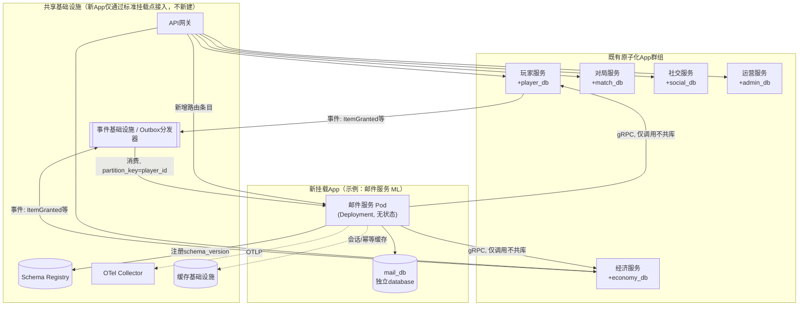
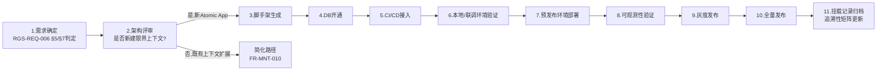
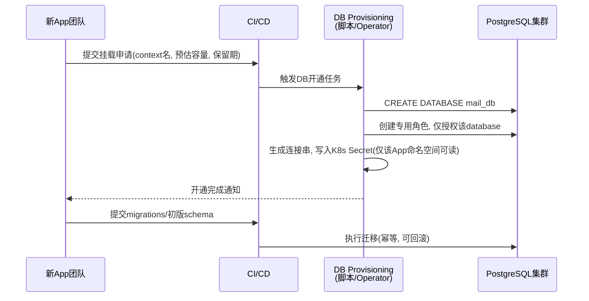

# 基本设计书（基本設計書 / Basic Design Document）

**新功能挂载架构 Feature Mounting Architecture**

| 项目 | 内容 |
|---|---|
| 文档编号 | RGS-BAS-002 |
| 版本 | 0.2 |
| 父文档 | RGS-REQ-006 需求定义书 第7章（ARC-018） |
| 依据标准 | IPA『共通フレーム 2013（SLCP-JCF2013）』基本设计工程 |
| 制定日 | 2026-08-16 |
| 制定者 | 架构师 |
| 保密级别 | 内部限定（Internal Use Only） |

## 修订历史（改訂履歴 / Revision History）

| 版本 | 修订日 | 修订者 | 修订内容 | 影响章节 |
|---|---|---|---|---|
| 0.1 | 2026-08-16 | 架构师 | 初版制定。将RGS-REQ-006 ARC-018展开为脚手架结构、Helm chart模板、DB开通流程、网关/事件登记流程、可观测性接入、标准化挂载/退场检查清单 | 全部 |
| 0.2 | 2026-08-17 | 架构师 | 补齐设计缺口：FR-MNT-011（横切能力以库/SDK形式被各App引用时须提供独立版本发布流程）此前仅在§13追溯性表以区间形式带过，无具体设计；新增§3.3给出简化路径下横切库/SDK的版本发布流程、兼容性方针与判定表 | §3.3、§13 |

## 审批栏（承認欄 / Approval）

| 角色 | 姓名 | 审批日 | 备注 |
|---|---|---|---|
| 制定（起草） | 架构师 | 2026-08-16 | — |
| 评审（技术） | | | 与RGS-BAS-001既有部署构成（§3）的一致性 |
| 审批（负责人） | | | 本文档的基准化 |

---

## 目录

1. [前言](#1-前言)
2. [整体挂载架构](#2-整体挂载架构)
3. [标准化挂载流程](#3-标准化挂载流程)
4. [骨架（脚手架）设计](#4-骨架脚手架设计)
5. [Kubernetes部署设计](#5-kubernetes部署设计)
6. [数据库开通设计](#6-数据库开通设计)
7. [服务间通信接入设计](#7-服务间通信接入设计)
8. [事件基础设施接入设计](#8-事件基础设施接入设计)
9. [可观测性接入设计](#9-可观测性接入设计)
10. [挂载记录与追溯性](#10-挂载记录与追溯性)
11. [退场（下线）设计](#11-退场下线设计)
12. [标准化检查清单](#12-标准化检查清单)
13. [追溯性（ARC-018 → 本设计书章节）](#13-追溯性arc-018-本设计书章节)

---

# 1. 前言

## 1.1 本文档的定位

本文档是RGS-REQ-006第7章ARC-018（新功能挂载规范）的系统级展开，回答"新的限界上下文如何以标准、可重复、可验收的方式接入现有的**原子化App群组＋每上下文独立DB＋Kubernetes**架构"这一问题。本文档遵循RGS-BAS-001既有的记述规则（§1.4强度用语、图示规则），不重复定义。

## 1.2 与既有架构的关系

本文档**不改变**RGS-BAS-001已确定的整体架构（§3系统方式设计、§5数据库论理设计），只是把"如何把第6个、第7个……限界上下文，以与既有5个（PL/EC/MT/GD/AD）同构的方式加入系统"这件事**流程化、模板化**。新挂载的App在部署形态判定（Deployment/StatefulSet）、数据库隔离原则、事件规范、可观测性规范上，**必须**与RGS-BAS-001§3.2、§5.1、§4.7、§4.8的既有决定完全一致，不得另起炉灶。

## 1.3 挂载五要素与本文档章节对应

| ARC-018五要素 | 本文档展开章节 |
|---|---|
| 独立DB | §6 数据库开通设计 |
| 独立部署单元 | §5 Kubernetes部署设计 |
| gRPC/事件为唯一跨边界通信方式 | §7、§8 |
| 标准化脚手架 | §4 骨架设计 |
| 标准化可观测性接入 | §9 |

---

# 2. 整体挂载架构

## 2.1 挂载后的系统全景



> **关键约束（对应FR-MNT-002/008）**：`ML`（新App）**不得**直接连接`player_db`/`economy_db`；需要玩家信息或货币操作时，**必须**经由`PL`/`EC`的gRPC接口或订阅其发布的事件获取，物理连线上新App与既有App的数据库之间**没有网络路径**（K8s NetworkPolicy层面强制，见§5.3）。

## 2.2 挂载点（Mount Point）清单

新App接入系统时，必须显式声明并登记以下挂载点：

| 挂载点 | 登记位置 | 责任方 |
|---|---|---|
| gRPC服务定义 | 服务发现/K8s Service，命名规则`svc-<context>` | 新App团队 |
| API网关路由（若需客户端直连） | API网关路由表（§7.2） | 新App团队 + 网关维护者 |
| 数据库连接 | `mail_db`独立database，独立K8s Secret存放连接串 | 新App团队 + DBA/SRE |
| 事件Producer/Consumer | Schema Registry + Topic命名（§8） | 新App团队 |
| 可观测性资源标签 | OTel resource attributes（`service.name=mail-service`等） | 新App团队（脚手架自动生成） |
| K8s资源配额 | Namespace内`ResourceQuota`/`LimitRange`（§5.3） | 新App团队 + SRE |

---

# 3. 标准化挂载流程

## 3.1 流程总览



## 3.2 各阶段产出物与准入判定

| 阶段 | 产出物 | 进入下一阶段的判定基准 |
|---|---|---|
| 1. 需求确定 | 新功能的FR/NFR条目（遵循RGS-REQ-001既有ID体系延展） | 已挂接至现有ARC-nnn或产出新ADR |
| 2. 架构评审 | 是否新建限界上下文的判定记录（依ARC-008同等原则） | 架构师签核 |
| 3. 脚手架生成 | 代码仓库/子目录，含CI/CD、Helm chart、健康检查、OTel埋点骨架 | `cargo build`/CI首次绿色通过 |
| 4. DB开通 | 独立`database`、迁移脚本仓库、连接Secret | 迁移脚本在CI中可重复执行且幂等 |
| 5. CI/CD接入 | 流水线通过既有共享Runner/Registry | 镜像可推送至既有镜像仓库 |
| 6. 联调验证 | 与既有App的gRPC/事件联调用例通过 | 契约测试（Contract Test）通过 |
| 7. 预发布部署 | 预发布环境Pod Running，健康检查绿色 | `/healthz`与`/readyz`稳定通过 |
| 8. 可观测性验证 | Dashboard自动出现黄金指标 | NFR-MNT-005达成 |
| 9. 灰度发布 | 按路由权重逐步导流 | 错误率增量满足NFR-MNT-002 |
| 10. 全量发布 | 100%流量切换 | 无回滚 |
| 11. 挂载记录归档 | Mount Record（§10） | 记入RGS-REQ-004可追溯性矩阵 |

## 3.3 简化路径：横切能力（库/SDK形式）的版本发布流程（落实FR-MNT-011）

横切能力（如风控规则库、A/B实验SDK）若以**库/crate**形式被各App在编译期引用（而非独立进程），不适用§3.1完整挂载流程，但**必须**具备独立于各引用方的版本发布节奏，避免"改一次SDK需要同时重新发布全部引用它的App"这种强耦合升级。

| 设计点 | 内容 |
|---|---|
| 发布单元 | 该横切能力作为独立的Cargo workspace成员crate（或独立workspace，视代码规模），拥有自己的`Cargo.toml`版本号，**不与**任何单一业务App的版本号绑定 |
| 版本号语义 | 遵循语义化版本（SemVer）：破坏性API变更升主版本号，新增能力升次版本号，修复升修订号；破坏性变更须遵循RGS-BAS-001§7.4 Expand-Contract思想——新旧主版本号在过渡期内**必须**可共存于同一workspace，不得强制全部引用方在同一次发布中被动升级 |
| 发布与消费 | 复用既有CI/CD共享Runner与内部crate仓库（不新建独立制品仓库，同§4.2"复用既有共享Runner"原则）；各引用方App在自身CI中显式声明所依赖的版本号（`Cargo.lock`锁定），按自身发布节奏决定何时升级依赖，**不得**由横切能力发布方强制推送 |
| 契约测试 | 横切能力对外暴露的接口（函数签名/trait）纳入契约测试（同§4.2既有契约测试阶段），破坏性变更须在CI中被拦截，逼迫显式升主版本号而非"悄悄改行为" |
| 可观测性 | 横切能力本身**不**独立产生`service.name`（它不是独立部署单元），其埋点数据归属**调用方App**的resource attributes下，若需要单独区分横切能力自身的耗时，以span内的子span或专属指标标签（如`sdk_version`）区分，不新建独立可观测性通道 |
| 与§5.1新限界上下文路径的边界 | 若该横切能力后续需要独立存储/独立进程运行（如风控决策从库演进为独立服务），须按FR-MNT-012转入§3.1/§5完整挂载流程，此时crate形式的版本发布流程终止，改为完整挂载记录（§10） |

---

# 4. 骨架（脚手架）设计

## 4.1 脚手架产出的目录结构（Rust / Cargo workspace）

```
services/
  <context>-service/           # 例: mail-service
    Cargo.toml                 # 加入根workspace members
    src/
      main.rs                  # 启动: 配置加载、OTel初始化、gRPC server bootstrap
      api/                     # gRPC handler实现，仅依赖proto生成代码
      domain/                  # 领域模型（聚合根/值对象），无框架依赖
      infra/
        db.rs                  # 数据库连接池初始化（独立DSN，来自Secret）
        events.rs               # 事件Producer/Consumer封装
      health.rs                # /healthz、/readyz
    migrations/                 # 数据库迁移脚本（独立于其他App）
    proto/                      # 本服务gRPC接口定义（.proto）
    deploy/
      helm/                     # 见§5.2
      ci/                        # 见§4.2
    README.md                   # 挂载记录摘要（见§10.2）
```

**设计原则**：`domain/`层不得`use`任何其他限界上下文的crate（workspace内以`#[deny]`静态检查强制，防止编译期意外产生跨库耦合），跨上下文交互只能经`infra/`层的gRPC client或事件封装完成——这是ARC-018"gRPC/事件为唯一跨边界通信方式"在代码结构上的落地。

## 4.2 CI/CD流水线骨架

| 阶段 | 内容 |
|---|---|
| lint/test | `cargo fmt --check`、`cargo clippy`、单元测试 |
| 契约测试 | 对既有依赖服务（如PL/EC）的gRPC接口按已发布proto版本做契约校验，防止破坏性变更（对应ARC-015） |
| migrations校验 | 对`migrations/`执行"向前迁移+回滚"演练，确保幂等（对应§6.2） |
| 镜像构建 | 复用既有共享Runner与镜像仓库，镜像标签规则`<context>-service:<git-sha>` |
| Helm lint/dry-run | 校验§5.2模板渲染结果 |
| 部署（预发布→灰度→全量） | 复用既有GitOps/Helm Release流程，不新建独立部署工具链 |

新App**不得**引入与既有CI/CD不同的构建工具链（如另一门语言的独立打包体系），除非经ARC-014判定基准评审通过并形成ADR。

---

# 5. Kubernetes部署设计

## 5.1 部署形态判定（沿用RGS-BAS-001§3.2）

| 判定问题 | 是 | 否 |
|---|---|---|
| 是否存在进程内常驻、不可迁移的实时状态（同ARC-001量级） | StatefulSet，须经架构评审 | Deployment（默认） |
| 是否需要HPA自动扩缩 | 配置HPA（依CPU/连接数/队列深度） | 固定副本数，PH-4前默认2副本满足NFR-AV-008 |

新App默认**应为**无状态Deployment——绝大多数业务服务（同既有PL/EC/MT/GD/AD）均为此形态，仅当理由与ARC-001同量级（进程内状态不可迁移）时才可申请StatefulSet。

## 5.2 Helm chart模板结构

```
deploy/helm/<context>-service/
  Chart.yaml
  values.yaml            # 默认: replicas, resources requests/limits, DB secret引用
  templates/
    deployment.yaml       # 或 statefulset.yaml（依§5.1判定二选一）
    service.yaml
    hpa.yaml               # 可选
    networkpolicy.yaml     # 见§5.3，必需
    servicemonitor.yaml    # 对接可观测性基础设施，见§9
    secret-db.yaml          # 引用外部Secret（由§6.1 DB开通流程生成），不在chart内明文DB凭证
```

模板由挂载脚手架统一维护于共享chart仓库的"基座（base chart）"，新App仅通过`values.yaml`覆盖差异化参数，**不得**fork整份chart模板另行维护，以满足NFR-MNT-006模板一致性要求。

## 5.3 网络隔离（NetworkPolicy）——ARC-018"独立部署单元"的强制落地

| 规则 | 内容 |
|---|---|
| 默认拒绝 | 新App所在Pod默认拒绝除既定挂载点外的全部入站/出站流量 |
| 允许出站 | 仅允许至：其声明依赖的既有服务gRPC端口、自身独立数据库、缓存基础设施、事件基础设施、OTel Collector |
| 禁止出站 | **不得**允许至非声明依赖的其他限界上下文数据库（即`mail-service` Pod物理上无法建立到`player_db`/`economy_db`所在Service的TCP连接），此为FR-MNT-002的运行时强制手段，而非仅靠代码规范 |
| 资源配额 | 每App独立`ResourceQuota`/`LimitRange`，防止单一新App的资源突增影响既有App的可调度性（对应NFR-MNT-003） |

---

# 6. 数据库开通设计

## 6.1 开通流程



## 6.2 数据库隔离原则（落实FR-MNT-002）

| 原则 | 内容 |
|---|---|
| 独立database | 默认每App一个独立PostgreSQL `database`，与既有5个限界上下文的既有原则（BAS-001§5.1）一致 |
| 独立角色与最小权限 | 该App的DB角色**仅**被授予自身database的权限，无法`\c`切换至其他limited context的database |
| 禁止跨库外键/JOIN | 迁移脚本CI检查中静态扫描禁止对其他已知database名的跨库引用 |
| 容量判定 | 是否与既有集群共享物理PostgreSQL实例（不同database）或独立实例，依BAS-001§5.1既有原则（PH-4负载试验后的容量判定），不因"新功能"而单独放宽 |
| 备份与保留期 | 新App的备份策略默认沿用既有NFR-AV-004既定的主+同步备用方案；数据保留期须在挂载申请中显式声明（供合规评审，对应FR-MNT-013退场设计） |

---

# 7. 服务间通信接入设计

## 7.1 gRPC接入

| 项目 | 规则 |
|---|---|
| 服务命名 | `svc-<context>`，与K8s Service名一致 |
| 服务发现 | 复用既有集群内DNS机制（同RGS-BAS-001§3.3东西向流量方式），不引入独立服务网格（除非经ARC-014判定） |
| 认证 | mTLS，复用既有证书签发链路 |
| 契约管理 | `.proto`文件納入版本管理，变更须遵循ARC-015 Expand-Contract两阶段，破坏性变更须先经契约测试CI阶段拦截 |
| 幂等 | 全部写方法须携带`request_id`，与ARC-009一致 |

## 7.2 API网关路由登记（若需客户端直连新App）

新增一条路由表条目：

| 字段 | 说明 |
|---|---|
| path前缀 | 例如`/mail/*` |
| 目标Service | `svc-mail-service` |
| 鉴权策略 | 复用既有玩家会话鉴权（引用缓存基础设施中的会话，同ARC-005/ARC-012边界） |
| 限流策略 | 独立限流桶，防止新App被打垮时拖累网关整体（对应ARC-013背压设置位置扩展至新增路由） |

路由表变更走既有API网关配置的评审流程（不新建独立配置通道）。

---

# 8. 事件基础设施接入设计

| 项目 | 规则（延续ARC-010） |
|---|---|
| Topic命名 | `<domain>.<event-past-tense>`，新App若产生新事件族，登记至既有Topic设计的"按领域分组"体系，不新建巨型Topic或1事件1Topic |
| `partition_key` | 按ARC-010既定表补充：新增领域须显式声明其`partition_key`选取（如邮件系统用`player_id`），并记入Mount Record |
| Schema注册 | 新事件的proto/schema须注册至既有Schema Registry，标注`schema_version`，兼容性检查纳入CI（同ARC-015） |
| 消费者义务 | 新App作为消费者时，必须实现At-Least-Once下的幂等消费（同ARC-009），已处理记录与业务结果同事务持久化 |
| 禁止用途 | 事件基础设施**不得**被新App用于同步RPC/实时路径（同ARC-010既有边界） |

---

# 9. 可观测性接入设计

## 9.1 标准埋点（脚手架自动生成，落实NFR-MNT-005）

| 类别 | 内容 |
|---|---|
| Trace | 所有gRPC handler自动包裹span，`trace_id`透传至下游调用与事件header（同ARC-017） |
| Metrics（黄金指标） | 请求延迟直方图、请求量、错误率、（如涉及队列/连接池）饱和度，统一由OTel SDK导出 |
| 日志 | 结构化日志，统一字段（`trace_id`、`context=mail-service`、`player_id`等），落入既有日志聚合基础设施 |
| resource attributes | `service.name`、`service.namespace`、`deployment.environment`自动从Helm values注入，无需业务代码硬编码 |

## 9.2 Dashboard自动生成

`servicemonitor.yaml`（§5.2）纳入既有可观测性基础设施的自动发现机制，新App部署后其黄金指标须**当天**出现在统一Dashboard，无需人工创建面板——这是NFR-MNT-005"上线当日即可见、不得有观测空窗期"的具体落地方式。

---

# 10. 挂载记录与追溯性

## 10.1 Mount Record字段

| 字段 | 内容 |
|---|---|
| 限界上下文名 | 例：邮件（ML） |
| 关联需求ID | 对应RGS-REQ-001扩展的FR-xx系列 |
| 数据库名 | `mail_db` |
| gRPC服务名 | `svc-mail-service` |
| 依赖的既有服务 | 例：PL（读取玩家在线状态）、EC（附件发放） |
| 产生/消费的事件 | 例：消费`ItemGranted`、产生`MailDelivered` |
| 部署形态 | Deployment / StatefulSet + 判定理由 |
| 挂载完成日期 | — |
| 责任团队 | — |

## 10.2 归档位置

Mount Record随PR提交至`services/<context>-service/README.md`，并将摘要行追加至RGS-REQ-004附件C可追溯性矩阵，确保"新功能→需求ID→设计章节→挂载记录"全链路可追溯（同RGS-REQ-001 13.4节AI代理使用规律的一致性要求）。

---

# 11. 退场（下线）设计

## 11.1 退场流程（对应FR-MNT-013/014）


## 11.2 退场安全网

| 项目 | 规则 |
|---|---|
| 只读冻结先行 | 数据库删除前须先转为只读并保留一个回滚窗口期（默认与既有NFR-AV相关阈值对齐，具体天数在挂载申请中约定） |
| 事件消费者确认 | 停止事件生产前，须核实所有已知消费者（含跨App的既有服务）均已确认不再依赖该事件族 |
| 记录留痕 | 退场记录同样归档至可追溯性矩阵，避免"查无此功能却找不到历史" |

---

# 12. 标准化检查清单

## 12.1 挂载检查清单（Mount Checklist）

- [ ] 已完成架构评审，确认应新建限界上下文（而非并入既有上下文，依ARC-008同等原则）
- [ ] 已使用标准脚手架生成代码结构（§4.1），未手工另建CI/Helm
- [ ] 数据库为独立`database`，角色权限最小化，无跨库外键（§6.2）
- [ ] NetworkPolicy已限制该App仅可访问声明的挂载点（§5.3）
- [ ] gRPC接口契约测试通过，遵循ARC-015兼容性方针（§7.1）
- [ ] 若客户端需直连：API网关路由与限流策略已登记（§7.2）
- [ ] 事件Topic/partition_key/schema_version已按ARC-010登记（§8）
- [ ] OTel埋点与Dashboard已自动生效，黄金指标当天可见（§9）
- [ ] 灰度发布期间错误率增量满足NFR-MNT-002
- [ ] Mount Record已归档，可追溯性矩阵已更新（§10）

## 12.2 退场检查清单（Decommission Checklist）

- [ ] 网关路由权重已置0且验证无残留流量
- [ ] 优雅排空完成，无强制中断的存量请求
- [ ] 已确认无遗留事件消费者依赖
- [ ] 数据归档/删除方案已经合规评审
- [ ] K8s资源（Deployment/Service/NetworkPolicy/Secret/ServiceMonitor）已全部撤销
- [ ] 数据库只读冻结期已满且已按约定处理（保留归档或DROP）
- [ ] 可追溯性矩阵已标记为"已下线"

---

# 13. 追溯性（ARC-018 → 本设计书章节）

| ARC/FR编号 | 决定摘要 | 本文档展开章节 |
|---|---|---|
| ARC-018 | 新功能挂载五要素规范 | §2、§13（本表） |
| FR-MNT-001 | 标准化脚手架 | §4 |
| FR-MNT-002 | 独立DB，禁止跨库访问 | §6、§5.3 |
| FR-MNT-003 | gRPC对外暴露，网关路由登记 | §7 |
| FR-MNT-004 | 事件规范遵循ARC-010 | §8 |
| FR-MNT-005 | 可观测性接入 | §9 |
| FR-MNT-006 | 部署形态判定 | §5.1 |
| FR-MNT-007 | 挂载记录归档 | §10 |
| FR-MNT-008 | 跨上下文交互仅经gRPC/事件 | §2.1、§4.1 |
| FR-MNT-009 | 新中间件须满足ARC-014 | §4.2 |
| FR-MNT-010、012 | 简化路径（既有上下文扩展、横切能力升级为独立进程的转入条件） | §3.1（分支）、RGS-REQ-006§5.2 |
| FR-MNT-011 | 横切能力（库/SDK形式）独立版本发布流程 | §3.3 |
| FR-MNT-013〜014 | 退场流程 | §11 |
| NFR-MNT-001〜006 | 效率/可用性/隔离性/回滚/观测/一致性 | §3.2、§5.3、§9、§12 |

---

> 本文档所定义的流程为**详细设计与实现阶段的输入基准**。具体的Helm chart YAML内容、DB Provisioning脚本、CI流水线定义文件等实现细节，留待详细设计阶段与`services/`目录下的实际脚手架代码库确定。
