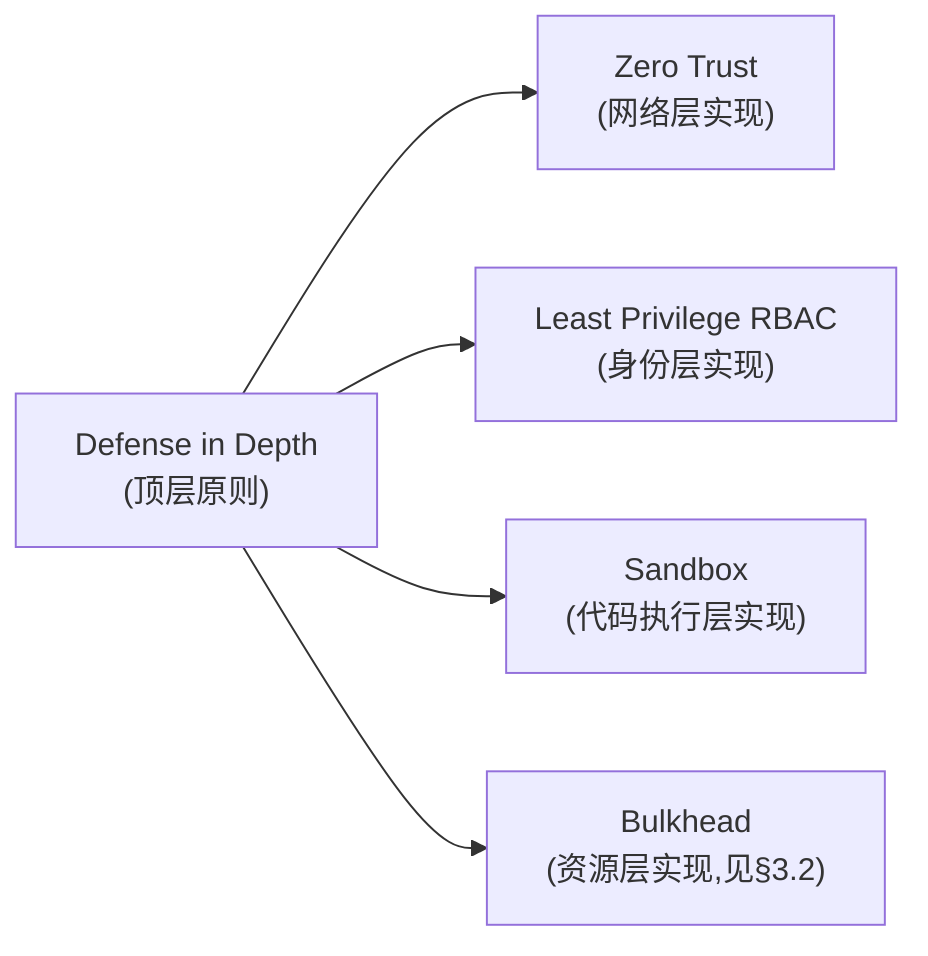

# 基本设计书（基本設計書 / Basic Design Document）

**设计模式与核心算法总纲 Design Patterns & Core Algorithms Compendium**

| 项目 | 内容 |
|---|---|
| 文档编号 | RGS-BAS-010 |
| 版本 | 0.5 |
| 父文档 | RGS-REQ-001第10章ARC-001〜017、RGS-REQ-006〜026第7章ARC-018〜041（本文档是既有全部架构方针的**横向归纳**，不新增独立需求；仅在§4发现真正的机制空白处给出补强设计） |
| 依据标准 | IPA『共通フレーム 2013（SLCP-JCF2013）』基本设计工程 |
| 制定日 | 2026-08-16 |
| 制定者 | 架构师 |
| 保密级别 | 内部限定（Internal Use Only） |

## 修订历史（改訂履歴 / Revision History）

| 版本 | 修订日 | 修订者 | 修订内容 | 影响章节 |
|---|---|---|---|---|
| 0.1 | 2026-08-16 | 架构师 | 初版制定。对RGS-BAS-001〜009已实现的设计决定做设计模式归纳（§3），并对算法层面的12处机制空白给出补强设计（§4） | 全部 |
| 0.1（追补） | 2026-08-16 | 架构师 | 新增G-014：将玩家间通信整体拓扑显式命名为Star Topology（服务器权威中继），并登记3项已否决的替代拓扑（P2P全连接、Host迁移型、玩家客户端区块链/分布式共识分摊计算）至§5反模式表，源于讨论中曾被提出并否决的方案，避免日后重复论证 | §2、§3.8、§4、§5、§6、§8 |
| 0.2 | 2026-08-16 | 架构师 | **归纳范围补齐至ARC-041/BAS-023**（子代理审查发现：本文档归纳范围此前止步ARC-026/BAS-009，后续新增的ARC-027〜041、BAS-011、BAS-014〜023共11份文档从未被纳入归纳）。新增§3.9"AI与非确定性边界模式"分类（Deterministic Gate/确定性闸门）；§3.1新增Conditional Write条件写入族（归纳三处独立复用）；§3.2新增Warm Standby Buffer+Scheduled Pre-scaling、Store-and-Retry Queue；§3.3新增Sharding-Scoped Canary；§3.4新增Pipeline/Middleware Chain；§3.5新增Materialized Read View派生视图族（统一此前"派生视图/读写分离/快照缓存"三种表述）、Declarative Rule Expression、"分片"术语三种含义辨析；§3.6新增Encrypted Vault/Tokenization、Reputation-Weighted Signal、Append-Only Ledger；§3.7新增Reconciliation Loop（归纳三处独立复用）。父文档范围与§1.4关联文档范围同步扩展至ARC-041/BAS-023 | §1.4、§2、§3.1〜3.7、§3.9新增、§6、§9 |
| 0.3 | 2026-08-16 | 架构师 | TBD-PAT-002部分决议：CI机械校验以GitHub Actions落地（`scripts/check-docs-consistency.sh`），详见RGS-BAS-009§4实现状态；§9更新TBD-PAT-002状态为"部分决议" | §9 |
| 0.4 | 2026-08-17 | 架构师 | **§3.9新增Dual-Mode OLU（双态OLU核算模式）**（负责人指示"制作开关开启后的olu，作为这种双模式的独特设计"，源自RGS-BAS-011§3对智能层全局开关的关闭态基线/开启态增量拆分）：归纳为通用做法——任何采用默认关闭全局开关的功能面，OLU须拆分为"关闭态基线"（与开关状态无关）与"开启态增量"（仅运行时产生），台账按实际运行状态计入而非笼统总数；§2模式速查表同步新增一行 | §2、§3.9 |
| 0.5 | 2026-09-01 | 架构师 (Mavis 接手 agent per DEC-008) | 落实"各BAS文档功能章节加log设计且区分debug/release级"总要求（per Ulysses 2026-09-01 15:52 JST 决策，4 拍板选项：全部 36 个BAS / 详尽版5列表 / 派worker并行 / BAS-004同步升级）：§3.1/§3.2/§3.3/§3.4/§3.5/§3.6/§3.7/§3.8/§3.9/§G-001/§G-002/§G-003/§G-004/§G-005/§G-006/§G-007/§G-008/§G-009/§G-010/§G-011/§G-012/§G-013/§G-014/§7.1/§9.1 全部 25 个 ## L2 功能段加"本功能日志设计" 5 列详尽版（字段名/触发条件/频率估算/采样策略/脱敏与成本），引用 BAS-001 v1.5 §4.8.3 模板（commit 32d9eb6）+ BAS-003 v0.3 样板（commit 75a001c）+ BAS-004 v0.3 §4.2 二维矩阵 + §4.3 字段 + §5.1 脱敏 + §6.2 强制全采样（commit 47e26b0/0ee6262）；字段名前缀统一 `pat.*`（pattern 设计模式域），与 BAS-002 `mnt.*` / BAS-003 `ops.*` 区分；显式区分设计模式应用关键事件（`info!` 级别 release 必出，编译期常驻，§6.2 强制全采样）、算法性能基准（`info!` release 必出，NFR-PE 监控需要，per tick/request 必出）、算法内部状态（`debug!`/`trace!` 级别，debug-only，`#[cfg(debug_assertions)]` 守护，release build 完全剔除零运行时开销）、算法失败/超时（`error!` 强制全采样）四类事件；覆盖 ARC-001/002/005/008/009/010/011/012/013/014/015/016/018/019/020/021/022/023/024/025/026/030/031/035/039/040/041 + FR-GW-006/007、FR-RT-007/009/010/011、FR-SY-003/004/005、FR-IDN-013、FR-NEURO-042/049/052、FR-OPT-012、FR-SUP-012、FR-TRD-014、FR-LOG-010/011/012/013/040、FR-PPL-022、FR-GSM-010/032、FR-CAP-020/021/031、RSK-GSM-002、RSK-PLT-001、NFR-PE-008、NFR-OP-008/010 等全系列相关追溯依据；§2 模式速查表不重复加日志字段（速查表是 §3 详述的索引，不重复登记）；§6 追溯性新增 AC-PAT-004（`pat.*` debug-only 宏 release 完全剔除）与 AC-PAT-005（每模式/算法补强须含本功能 log 设计章节），与 BAS-001 v1.5 §4.8.3.4 / BAS-002 v0.4 §13 / BAS-003 v0.3 §13 / BAS-004 v0.3 §12 形成统一规范 | §3.1〜3.9、§G-001〜G-014、§6、§7.1、§9.1 |

## 审批栏（承認欄 / Approval）

| 角色 | 姓名 | 审批日 | 备注 |
|---|---|---|---|
| 制定（起草） | 架构师 | 2026-08-16 | — |
| 评审（技术） | | | §4补强设计是否均落在基本设计粒度内，未越界至详细设计 |
| 审批（负责人） | | | 本文档的基准化 |

---

## 目录

1. [前言](#1-前言)
2. [设计模式总览表](#2-设计模式总览表)
3. [分类详述](#3-分类详述)
4. [算法层面漏洞排查与补强](#4-算法层面漏洞排查与补强)
5. [反模式登记（明确否决的方案）](#5-反模式登记明确否决的方案)
6. [追溯性（模式/补强 → 既有ARC・FR）](#6-追溯性模式补强-既有arcfr)
7. [标准化检查清单](#7-标准化检查清单)
8. [验收标准](#8-验收标准)
9. [风险与未决事项](#9-风险与未决事项)

---

# 1. 前言

## 1.1 目的

RGS-BAS-001〜009已就本系统各子系统给出系统级设计，但设计模式与算法选型分散在9份文档中，读者难以一览"本系统总共用了哪些经过验证的模式来解决哪些问题、为什么不用其他模式"。本文档的目的有二：

1. **归纳汇总**：以设计模式目录（design pattern catalog）的形式，将既有文档中已经做出但未被显式命名的设计决定**命名化、结构化**，形成可复用的知识资产——新成员/新领域文档的作者可以直接查表"这类问题该用什么模式"，而不必重新论证。
2. **杜绝漏洞**：逐一核对既有文档中"算法细节留待后续"的记载，区分两类情况：①**合理搁置**——细节确实只影响实现，不影响架构（遵循PP-001与ARC-014"不过早设计"的既定原则，维持搁置）②**架构级空白**——机制的**选型本身**（而非其编码细节）会影响组件结构、一致性边界或运维负荷，此类空白**必须**在基本设计阶段补齐，否则详细设计阶段会在无架构指导的情况下各自决定，重演RGS-REV-001已识别的"分散决策导致体系漂移"问题。本文档§4只处理第②类。

## 1.2 与既有文档边界的关系（不越界声明）

RGS-BAS-001§1.1已明文划定基本设计的边界："本文档**不包含**：函数签名与内部算法实现……这些内容留给详细设计阶段"。本文档**遵守同一边界**：

| 本文档**包含** | 本文档**不包含** |
|---|---|
| 模式名称、适用场景、结构性权衡、与既有ARC的映射 | 具体编程语言的函数签名、类型定义 |
| 算法**族**的选型（如"指数退避"而非"退避"或"不退避"三选一） | 具体的退避基准值、抖动幅度等数值参数（除非该数值本身是架构约束，如已有的NFR目标值） |
| 关键不变量与边界条件的**存在性**声明（如"必须有上限"） | 边界条件的具体判断逻辑与伪代码 |
| 是否引入新组件/新状态的判断 | 新组件内部的实现细节 |

**判断准则**：若某项决定的变更会导致**组件图、时序图、数据模型或部署拓扑**需要重新绘制，则属于基本设计范畴，本文档处理；若变更只影响某个函数内部的实现方式而不改变上述图示，则属于详细设计范畴，本文档不处理。

## 1.3 本文档不新增架构方针（ARC-nnn）

依ARC-025 GOV-DOC-003，领域文档新增的ARC不得与既有ARC冲突，且新增须审慎。本文档**不新增任何ARC-nnn**——§3的模式归纳全部是对既有ARC-001〜026的**重新表述**，不改变其决定内容；§4的补强设计全部是在既有ARC/FR划定的边界**内部**做算法族选型，不引入新组件、不改变既有一致性/安全保证的强度。若某项补强被读者认为实质变更了既有决定，则**不应**采纳，须转为ADR提案单独评审。

## 1.4 关联文档

本文档与RGS-BAS-001〜023（含BAS-011智能决策层）为**同层引用**关系（依README§3规则6三层位阶，本文档与其余BAS文档同属第3层）：本文档引用它们的既有设计作为归纳对象，**不得**用本文档的归纳单方面改变被引用文档的决定；若归纳过程中发现两者表述不一致，以被引用的原文档为准，并在本文档中标注需要原文档修订（见§9）。

> **归纳范围的持续维护声明（RSK-PAT-001既定，本次强化）**：本文档的归纳范围**必须**随新增基本设计书同步扩展，**不得**长期滞后——本次0.2版修订本身就是"归纳范围滞后11份文档才被发现并补齐"的直接证据。后续每新增一份BAS文档，制定者**应当**同批检查其是否引入了本文档§3尚未收录的设计模式，而非等待下一次专项审查才发现。

---

# 2. 设计模式总览表

> 下表为全书速查índice。「类别」对应§3的分节；「详见」指向本文档内的详细小节或既有文档的原始出处。

| 模式 | 类别 | 应用位置 | 对应ARC/FR | 详见 |
|---|---|---|---|---|
| Optimistic Offline Lock（乐观离线锁） | 并发与一致性 | 经济服务`version`字段OCC | ARC-009、DR-007／008 | §3.1 |
| Monotonic Token（单调令牌） | 并发与一致性 | `session_epoch` | ARC-005 | §3.1 |
| Transactional Outbox（事务性发件箱） | 并发与一致性 | 业务事务＋事件登记同事务 | ARC-009、DR-011〜015 | §3.1 |
| Idempotent Receiver（幂等接收者） | 并发与一致性 | `request_id`/`event_id`去重 | ARC-009 | §3.1 |
| Circuit Breaker（断路器） | 弹性与流量控制 | AdminService对下游调用 | ARC-013、RGS-BAS-003§9 | §3.2 |
| Bulkhead（舱壁隔离） | 弹性与流量控制 | 每App独立连接池/NetworkPolicy | NFR-MNT-003、ARC-022 | §3.2 |
| Token Bucket（令牌桶限流） | 弹性与流量控制 | 输入速率限制、GM API限流 | FR-GW-006、RGS-BAS-003§9 | §3.2 |
| Bounded Mailbox + Backpressure（有界邮箱背压） | 弹性与流量控制 | 场景Actor mailbox、运行时受限控制通道 | ARC-013 | §3.2 |
| Load Shedding（负载卸除） | 弹性与流量控制 | 连接数上限拒绝 | FR-GW-007 | §3.2 |
| Graceful Degradation（优雅降级） | 弹性与流量控制 | 经济服务停止时移动/战斗继续 | ARC-007、NFR-AV-009 | §3.2 |
| State Machine（状态机） | 状态与生命周期 | 会话/对局/购买/交易/账号/插件 | ST-001〜005、RGS-BAS-005§6 | §3.3 |
| Supervisor（监督者） | 状态与生命周期 | 场景Actor崩溃隔离与重启 | ARC-001、FR-RT-010 | §3.3 |
| Memento／Checkpoint-Restore | 状态与生命周期 | 场景状态周期性快照 | FR-RT-009 | §3.3 |
| Command（命令） | 通信与集成 | GM指令、AdminService全部方法 | ARC-019、RGS-BAS-003§3 | §3.4 |
| Facade（外观） | 通信与集成 | AdminService统一入口封装下游 | ARC-019 | §3.4 |
| Adapter（适配器） | 通信与集成 | 三引擎客户端SDK | ARC-024 | §3.4 |
| Choreography-free Saga（编排式Saga） | 通信与集成 | 购买/交易/删除编排 | ARC-011、FR-GOV-010〜014 | §3.4 |
| Competing Consumers＋Poller | 通信与集成 | Outbox分发器 | ARC-009、FR-EV-001 | §3.4 |
| Bounded Context per Database | 数据划分与扩展 | 5＋N个限界上下文各自独立DB | ARC-008、ARC-018 | §3.5 |
| Range Partitioning（范围分区） | 数据划分与扩展 | 审计日志/outbox/行为日志表 | RGS-BAS-007§4 | §3.5 |
| Consistent Hashing（一致性哈希，**预案未启用**） | 数据划分与扩展 | PH-7场景分片候选算法 | FR-RT-011 | §3.5、§4 G-006 |
| Zero Trust Default-Deny（零信任默认拒绝） | 安全与沙箱 | 全局NetworkPolicy基线 | ARC-022 | §3.6 |
| Sandbox（沙箱） | 安全与沙箱 | 插件脚本引擎 | ARC-021 | §3.6 |
| Least Privilege RBAC | 安全与沙箱 | 运营API角色划分 | NFR-SE-005 | §3.6 |
| Defense in Depth（纵深防御） | 安全与沙箱 | 分层安全架构 | ARC-022 | §3.6 |
| Correlation ID Propagation（关联ID透传） | 可观测性 | trace_id/request_id/event_id全路径 | NFR-OP-002、ARC-020 | §3.7 |
| Golden Signals（黄金指标） | 可观测性 | 延迟/流量/错误/饱和度 | ARC-020 | §3.7 |
| Client-Side Prediction＋Server Reconciliation | 客户端同步 | 输入预测与和解 | ARC-002 | §3.8 |
| Delta Compression＋Self-Healing Baseline | 客户端同步 | 差分快照 | FR-SY-003／004 | §3.8 |
| Lag Compensation（延迟补偿回溯） | 客户端同步 | 命中判定回溯 | FR-RT-007 | §3.8 |
| Priority Scheduling（优先级调度） | 客户端同步 | AOI更新的带宽预算分配 | FR-SY-005 | §3.8 |
| Star Topology（星型拓扑，服务器权威中继） | 客户端同步 | 玩家间通信整体拓扑：仅与场景Actor连接，玩家间无直连 | ARC-002、NFR-SE-001 | §3.8、§4 G-014 |
| Deterministic Gate（确定性闸门／血脑屏障模式） | AI与非确定性边界 | 智能层建议进入L0/L1业务路径前的三重强制校验，闸门部署于消费者侧 | ARC-030 | §3.9 |
| Dual-Mode OLU（双态OLU核算模式） | AI与非确定性边界 | 全局开关"关闭态基线／开启态增量"运维负荷拆分登记，避免笼统总数误导台账 | FR-NEURO-049〜052 | §3.9 |
| Pipeline／Middleware Chain（管道/中间件链） | 通信与集成 | 请求前处理→业务逻辑→后处理的固定顺序链，安全合规阶段禁止旁路 | ARC-041 | §3.4 |
| Materialized Read View（派生只读视图族，含CQRS/读写分离/快照缓存三种子形态） | 数据划分与扩展 | 排行榜派生视图、分析管线读写分离、拓扑画布快照缓存、跨分片聚合 | ARC-031、ARC-035、ARC-039 | §3.5 |
| Conditional Write（条件写入族，OOL的CAS/UPSERT变体） | 并发与一致性 | 兑换码核销防超发、支付对账幂等、交易结算防调包 | FR-OPT-012、FR-SUP-012、FR-TRD-014 | §3.1 |
| Declarative Rule Expression（声明式条件表达式引擎） | 数据划分与扩展 | 任务/成就触发条件，区别于ARC-016纯参数配置 | FR-GSM-010 | §3.5 |
| Encrypted Vault／Tokenization（敏感信息保险库，区别于脱敏） | 安全与沙箱 | 实名认证原始凭证独立加密隔离存储 | FR-IDN-013 | §3.6 |
| Reputation-Weighted Signal（信誉度加权信号） | 安全与沙箱 | 举报者历史准确率调节信号强度，与处罚判定路径分离 | RSK-GSM-002 | §3.6 |
| Reconciliation Loop（一致性核对/漂移检测） | 可观测性 | 治理数据状态核对、支付对账、派生视图重建 | RGS-BAS-011§5A.4 | §3.7 |
| Append-Only Ledger（只增不改审计表，数据库层强制） | 安全与沙箱 | 审计表仅授予INSERT权限 | RGS-BAS-003§7 | §3.6 |
| Warm Standby Buffer + Scheduled Pre-scaling（预留缓冲＋预测性预热） | 弹性与流量控制 | HPA扩容窗口期的过渡缓冲，已知事件提前扩容 | ARC-040 | §3.2 |
| Store-and-Retry Queue（待重试队列，区别于Circuit Breaker） | 弹性与流量控制 | 平台收据校验接口不可用时持久化重试 | RSK-PLT-001 | §3.2 |
| Sharding-Scoped Canary（分片粒度灰度） | 状态与生命周期 | 同一插件在不同分片可处于不同生命周期状态 | FR-CAP-031 | §3.3 |

---

# 3. 分类详述

## 3.1 并发与一致性模式

### Optimistic Offline Lock（乐观离线锁）

| 项目 | 内容 |
|---|---|
| 意图 | 在低冲突率场景下，以版本号检测并发冲突，避免悲观锁在持有期间阻塞其他事务 |
| 本系统应用 | `Wallet`／`Inventory`聚合根的`version`列（RGS-BAS-001§5.8通用表结构范式），`CommitTransaction`携带`expected_version`（RGS-BAS-001§6.3.2） |
| 为何不用悲观锁（`SELECT ... FOR UPDATE`） | 道具/货币操作虽单笔耗时短，但高并发下持锁等待会串行化本可并行的不同玩家请求；乐观锁只在真正冲突时付出重试代价（依需求定义书§5.3.2，实测冲突率决定该代价是否可接受） |
| 已知空白 | 冲突后的重试策略未定义退避——见§4 G-001 |

### Conditional Write（条件写入族——Optimistic Offline Lock的CAS/UPSERT变体）

| 项目 | 内容 |
|---|---|
| 意图 | 与乐观离线锁同源（"以一条原子SQL完成检查+写入，避免先读后写的竞态窗口"），但**不依赖显式版本号列**，而是把"约束仍成立"直接写进`UPDATE ... WHERE`条件本身，以受影响行数（0或1）判定成功与否 |
| 本系统应用（三处独立复用，此前互不引用，本次统一归档） | ①`RedemptionCode.used_count`条件递增防超发（`WHERE used_count < max_uses_per_code`，FR-OPT-012）②`PaymentOrder`对账幂等（`provider_txn_id`唯一索引+UPSERT，FR-SUP-012）③交易结算`snapshot_version`校验防调包（RGS-BAS-015§4） |
| 为何与Optimistic Offline Lock分列而非合并 | 版本号变体需要一个专门的版本列并显式传递`expected_version`；条件写入变体把约束直接嵌入WHERE子句，不需要额外的版本列，适用于"约束本身就是天然可表达为条件"的场景（如计数器上限、唯一键存在性）。两者解决同一类问题（先读后写竞态），但实现形态不同，**新文档遇到同类问题时应优先检索本条目而非重新论证"为何不能先SELECT再UPDATE"** |
| 强制纪律 | **禁止**"先`SELECT`判断约束是否满足，再执行`UPDATE`"的两步模式——两步之间存在竞态窗口，高并发下会被击穿。**必须**以`UPDATE ... WHERE <约束>`一条语句完成，受影响行数为0即判定约束不满足 |

### Monotonic Token（单调令牌）

| 项目 | 内容 |
|---|---|
| 意图 | 在无法依赖分布式锁的场景下，以数据库原生原子操作产生单调递增标识，实现Single-Writer仲裁 |
| 本系统应用 | `session_epoch`（`UPDATE ... SET epoch = epoch + 1 RETURNING epoch`，ARC-005） |
| 为何不用外部分布式锁（如基于缓存基础设施的锁） | ARC-005已明文否决——缓存基础设施的过期与GC停顿组合可能导致重复获取，本质是CAP权衡下的可用性优先方案，不适合充当仲裁者 |
| 与Optimistic Offline Lock的区别 | 单调令牌保护的是"谁有权写"（连接身份的新旧），乐观锁保护的是"这次写是否与上次读取时状态一致"（数据版本）。两者正交，`CommitTransaction`同时携带`session_epoch`与`expected_version`，分别校验 |

### Transactional Outbox（事务性发件箱）

| 项目 | 内容 |
|---|---|
| 意图 | 使"更新数据库"与"发布事件"这两个跨技术边界的操作具备原子性，避免双写不一致（P-003） |
| 本系统应用 | `economy_db.outbox`等表，与业务更新同一事务写入，由独立分发器轮询发布（RGS-BAS-001§4.5.1、§4.7.1） |
| 已知空白 | 分发器的轮询并发/顺序模型未显式命名——见§3.4 Competing Consumers＋Poller与§4 G-004 |

### Idempotent Receiver（幂等接收者）

| 项目 | 内容 |
|---|---|
| 意图 | 使重复到达的请求/事件只产生一次业务副作用，配合At-Least-Once投递语义实现Effectively-Once |
| 本系统应用 | `request_id`已处理记录表（RGS-BAS-001§4.5.1时序图）、事件消费者的`event_id`去重（FR-EV-004） |
| 已知空白 | 已处理记录表的长期增长与清理策略未定义——见§4 G-005 |

### 3.1 本功能日志设计

本节覆盖**并发与一致性模式族**的运行时可观测字段——OCC 冲突与重试、Conditional Write 受影响行数、Monotonic Token 单调令牌推进、Outbox 入队/发布/分发延迟、Idempotent Receiver 命中/未命中五大类。事件名统一 `pat.cons.*` 前缀（pattern+concurrency）。算法性能基准（Outbox 分发延迟、OCC 重试次数）release 必出以满足 NFR-PE-008 监控诉求；冲突/重试耗尽走 `error!` 强制全采样；中间状态（受影响行数=1、OCC 版本快照）走 `debug!` 守护，release 完全剔除。

| 字段名（field） | 触发条件（trigger） | 频率估算（frequency） | 采样策略（sampling） | 脱敏与成本（redact & cost） |
|---|---|---|---|---|
| `pat.cons.occ.conflict_detected` | OCC 冲突触发（`expected_version` 与当前 `version` 不一致，per ARC-009） | 稳态 1/s、峰值 50/s（活动开服瞬时热点） | release 必出（`info!` 编译期常驻，per BAS-004 v0.3 §4.2） | 含 `aggregate_type`/`aggregate_id`/`expected_version`/`current_version`；约 280B/条 |
| `pat.cons.occ.retry_scheduled` | OCC 冲突后按 G-001 指数退避+抖动策略进入重试（per BAS-001 v1.5 §6.1） | 同上 | release 必出（`info!` §6.2 强制全采样） | 含 `aggregate_id`/`attempt`/`backoff_ms`；约 220B/条 |
| `pat.cons.occ.retry_exhausted` | 3 次重试均冲突，作为业务错误返回调用方（per RGS-REQ-001 §5.3.2） | 极低（热点瞬时） | release 必出（`error!` 强制全采样，per BAS-004 v0.3 §6.2） | 含 `aggregate_id`/`final_attempt`/`error`；约 320B/条 |
| `pat.cons.cond_write.affected_zero` | Conditional Write（CAS/UPSERT）受影响行数=0，约束不满足（per FR-OPT-012/FR-SUP-012/FR-TRD-014） | 稳态 5/s、峰值 200/s（兑换码核销/支付对账热点） | release 必出（`info!` 强制全采样） | 含 `table`/`operation`/`predicate`；约 260B/条；无敏感字段 |
| `pat.cons.cond_write.affected_one` | Conditional Write 受影响行数=1，成功 | 同上 | **debug-only**（`#[cfg(debug_assertions)]` 守护，release 完全剔除） | 约 240B/条（release 剔除，零运行时开销） |
| `pat.cons.epoch.advanced` | `session_epoch` 单调递增（`UPDATE ... SET epoch = epoch + 1 RETURNING epoch`，per ARC-005） | 稳态 0.1/s、峰值 5/s（角色重连/场景切换） | release 必出（`info!` 强制全采样） | 含 `character_id`/`old_epoch`/`new_epoch`；约 240B/条 |
| `pat.cons.outbox.enqueued` | 业务事务提交时同步写入 `outbox` 表（per ARC-009） | 稳态 10/s、峰值 5000/s（事件流量上限，per ARC-014） | release 必出（`info!` 强制全采样） | 含 `event_id`/`event_type`/`partition_key`；约 280B/条 |
| `pat.cons.outbox.dispatch_lag_ms` | Outbox 分发器延迟（从 `occurred_at` 到 `published_at`，per ARC-009/NFR-PE-008） | 同上 | release 必出（`info!` 强制全采样，**算法性能基准**，NFR-PE 监控需要） | 含 `partition_key`/`lag_ms_bucket`（p50/p99）；约 200B/条 |
| `pat.cons.idempotency.hit` | 幂等键命中已处理记录（`request_id`/`event_id` 已存在） | 稳态 2/s、峰值 100/s（重试/重放） | release 必出（`info!` 强制全采样） | 含 `key_kind`/`key_hash`（不写明文，per BAS-004 v0.3 §5.1）；约 220B/条 |
| `pat.cons.debug.occ_version_chain` | 完整 OCC 版本链快照（`expected→actual→post-commit` 三段） | 偶发 | **debug-only**（`#[cfg(debug_assertions)]` 守护） | 约 500B-1KB/条（release 剔除） |
| `pat.cons.debug.outbox_payload_dump` | 完整事件 envelope（`payload` + `headers` + `trace_id`） | 偶发 | **debug-only**（`#[cfg(debug_assertions)]` 守护） | 约 200B-2KB/条（payload 大小决定，release 剔除） |

**debug-only 守护要点**（落实 BAS-004 v0.3 §4.4）：
- `pat.cons.debug.occ_version_chain` 在长版本链下可能 1KB+ —— release build 完全剔除，避免 RUST_LOG=debug 误开时撑爆生产日志通道
- `pat.cons.cond_write.affected_one` 高频成功路径走 debug-only，release 仅留受影响的 0 异常路径，便于 SRE 按 `table`/`operation` 维度定位超发/对账失败

## 3.2 弹性与流量控制模式

### Circuit Breaker（断路器）

| 项目 | 内容 |
|---|---|
| 意图 | 下游持续失败时快速失败并停止继续调用，给下游恢复的时间窗口，避免故障级联放大 |
| 本系统应用 | RGS-BAS-003§9已声明"`AdminService`对下游……调用设置超时+熔断器" |
| 状态模型 | 标准三态（Closed／Open／Half-Open），本身即为§3.3 State Machine模式的一个实例——断路器可以被视为"状态机模式应用于弹性控制"的典型案例，两个分类并非互斥 |

### Bulkhead（舱壁隔离）

| 项目 | 内容 |
|---|---|
| 意图 | 将资源池（连接、线程、配额）划分为互不影响的隔间，一个隔间耗尽不波及其他 |
| 本系统应用 | 每限界上下文独立数据库连接池（RGS-BAS-007§8）、每App独立`ResourceQuota`（RGS-BAS-002§5.3）、每GM后台调用方独立限流桶（RGS-BAS-003§9） |
| 与Zero Trust Default-Deny的关系 | Bulkhead隔离**资源**，Zero Trust隔离**网络可达性**，两者常常同时应用于同一组件（如新挂载App既有独立连接池也有独立NetworkPolicy），互为补充而非替代 |

### Token Bucket（令牌桶限流）

| 项目 | 内容 |
|---|---|
| 意图 | 允许突发流量在桶容量内通过，长期速率仍受限，比固定窗口计数更平滑 |
| 本系统应用 | FR-GW-006输入速率限制、RGS-BAS-003§9 GM后台调用方限流 |
| 为何不用固定窗口计数 | 固定窗口在窗口边界附近可能允许2倍于设计速率的突发（边界效应），令牌桶天然avoid该问题 |

### Bounded Mailbox + Backpressure、Load Shedding、Graceful Degradation

三者已在ARC-013、FR-GW-007、ARC-007/NFR-AV-009中被完整定义，本节仅做模式命名，不重复论证，详见对应原文。

### Warm Standby Buffer ＋ Scheduled Pre-scaling（预留缓冲＋预测性预热）

| 项目 | 内容 |
|---|---|
| 意图 | 弹性与流量控制此前的既有模式（Circuit Breaker/Bulkhead/Load Shedding/Graceful Degradation）全部是**事中限制或降级**；本模式是方向相反的补充——**事前预置冗余**，在HPA目标副本数之上维持一份已就绪但不承接常态流量的缓冲，用于覆盖自动扩容生效前的窗口期，并对已知流量事件做提前扩容 |
| 本系统应用 | RGS-BAS-022§4（ARC-040）：弹性预留（FR-CAP-020）＋预测性预热（FR-CAP-021） |
| 与既有NFR-PE-019的关系 | NFR-PE-019既定"峰值/平均比3倍，15分钟内扩容"是**响应时效目标**，本模式是达成该目标的**手段之一**（另一手段是纯被动HPA，本模式补充其冷启动窗口期的空档） |

### Store-and-Retry Queue（待重试队列，区别于Circuit Breaker）

| 项目 | 内容 |
|---|---|
| 意图 | 外部依赖不可用时，**不**判定为业务失败并放弃（那是Circuit Breaker的职责），而是持久化待处理记录并指数退避重试，超限后转人工，不阻塞其余正常请求 |
| 本系统应用 | RGS-BAS-020§2.4（平台收据校验接口不可用，RSK-PLT-001） |
| 与Circuit Breaker的组合关系 | 两者**互补而非互斥**：Circuit Breaker决定"是否继续尝试连接下游"，Store-and-Retry Queue决定"连接恢复前，已产生的待处理请求如何不丢失地等待"。断路器开启期间，新请求应直接进入待重试队列而非同步阻塞等待断路器恢复 |

### 3.2 本功能日志设计

本节覆盖**弹性与流量控制模式族**的运行时可观测字段——断路器状态迁移、舱壁资源耗尽、令牌桶限流命中、有界邮箱满载、负载卸除、优雅降级触发、预热缓冲激活、待重试队列入队与耗尽。事件名统一 `pat.resilience.*` 前缀。算法性能基准（断路器状态停留时长、令牌桶拒绝率）release 必出以满足 NFR-PE-008 监控诉求；上游持续不可用走 `error!` 强制全采样；断路器内部状态机计数/半开探测走 `debug!` 守护。

| 字段名（field） | 触发条件（trigger） | 频率估算（frequency） | 采样策略（sampling） | 脱敏与成本（redact & cost） |
|---|---|---|---|---|
| `pat.resilience.cb.state_transition` | 断路器状态机迁移（Closed→Open/Closed→Half-Open/Half-Open→Closed/Half-Open→Open，per ARC-013） | 稳态 0.01/s、峰值 1/s（依赖故障时） | release 必出（`info!` 编译期常驻，per BAS-004 v0.3 §4.2） | 含 `cb_name`/`from_state`/`to_state`/`trigger_reason`；约 260B/条 |
| `pat.resilience.cb.open_too_long` | 断路器 Open 状态停留超过 NFR-OPS-006 配置阈值（默认 5min） | 极低 | release 必出（`error!` 强制全采样，per BAS-004 v0.3 §6.2） | 含 `cb_name`/`open_duration_ms`/`downstream`；约 280B/条 |
| `pat.resilience.bulkhead.resource_exhausted` | 舱壁连接池/线程池/配额耗尽，per ARC-022/NFR-MNT-003 | 稳态 0.1/s、峰值 10/s（热点域） | release 必出（`warn!` 强制全采样） | 含 `bulkhead_name`/`resource_type`/`current_usage`/`limit`；约 240B/条 |
| `pat.resilience.token_bucket.rejected` | 令牌桶限流拒绝（per FR-GW-006/FR-GW-007） | 稳态 5/s、峰值 500/s（限流热点） | release 必出（`info!` 强制全采样） | 含 `bucket_name`/`requested_tokens`/`available_tokens`；约 220B/条 |
| `pat.resilience.mailbox.full` | Actor mailbox 满载触发背压（per ARC-013） | 稳态 0.5/s、峰值 50/s | release 必出（`warn!` 强制全采样） | 含 `actor_name`/`mailbox_capacity`/`current_depth`；约 220B/条 |
| `pat.resilience.load_shed.rejected` | 负载卸除拒绝新连接/请求（per FR-GW-007） | 稳态 1/s、峰值 100/s | release 必出（`info!` 强制全采样） | 含 `shed_reason`/`active_connection_count`/`max_connections`；约 240B/条 |
| `pat.resilience.degradation.triggered` | 优雅降级触发（per ARC-007/NFR-AV-009，如经济服务停止时移动/战斗继续） | 极低（依赖故障时） | release 必出（`warn!` 强制全采样） | 含 `degraded_service`/`downstream`/`degradation_mode`；约 260B/条 |
| `pat.resilience.warm_standby.activated` | 预热缓冲副本承接流量（per FR-CAP-020/FR-CAP-021） | 偶发（已知事件/扩容窗口） | release 必出（`info!` 强制全采样） | 含 `service`/`buffer_replica_id`/`activation_reason`；约 240B/条 |
| `pat.resilience.store_retry.enqueued` | 待重试队列入队（per RSK-PLT-001，外部依赖不可用时） | 稳态 0.5/s、峰值 50/s | release 必出（`info!` 强制全采样） | 含 `queue_name`/`payload_kind`/`retry_attempt`；约 220B/条 |
| `pat.resilience.store_retry.exhausted` | 待重试超限转人工（per RSK-PLT-001） | 极低 | release 必出（`error!` 强制全采样） | 含 `queue_name`/`payload_kind`/`total_attempts`；约 240B/条 |
| `pat.resilience.debug.cb_internals` | 断路器内部状态（失败计数/半开探测结果/最近失败时间戳） | 偶发 | **debug-only**（`#[cfg(debug_assertions)]` 守护，release 完全剔除） | 约 300-500B/条（release 剔除） |

**debug-only 守护要点**（落实 BAS-004 v0.3 §4.4）：
- `pat.resilience.debug.cb_internals` 含失败计数+最近失败时间戳，仅 debug 守护避免 RUST_LOG=debug 误开时泄漏下游细节
- `pat.resilience.cb.*` 系列 release 必出，§4.8.3.2 二维矩阵 `info!`/`warn!`/`error!` 行常驻，便于 SRE 按 `cb_name` 维度聚合断路器健康度

## 3.3 状态与生命周期模式

### State Machine（状态机）

| 项目 | 内容 |
|---|---|
| 意图 | 将合法迁移路径显式枚举，非法迁移在结构上不可达而非依赖运行时检查 |
| 本系统应用 | ST-001〜005（RGS-REQ-001第8章）、RGS-BAS-005§6插件生命周期、RGS-BAS-003§8高危操作二次确认（隐式的"待确认→已执行"两态机） |
| 统一原则 | 全系统状态机**必须**显式列出全部合法迁移，非法迁移作为ST-000系列禁止项被动测试（TL-5），这是本系统状态设计的统一纪律，新增状态机（如未来新增业务的生命周期）**应当**遵循同一形式 |

### Supervisor（监督者，Erlang/OTP传统模式）

| 项目 | 内容 |
|---|---|
| 意图 | 崩溃隔离在受监督单元内，监督者负责判断重启策略，避免"一个单元崩溃导致其上游/兄弟单元也崩溃" |
| 本系统应用 | 场景Actor监督（ARC-001、FR-RT-010），插件异常隔离（RGS-BAS-005§9，"单个插件的错误不得导致宿主进程崩溃"是同一模式在更细粒度的复用） |
| 已知空白 | 监督者的重启退避策略（连续崩溃时是否立即重启）未定义——见§4 G-013（新增，见下） |

> **G-013补充**（原§4遗漏，制定时一并纳入）：场景Actor崩溃后立即重启，若崩溃原因是数据本身触发的（如某条恶意构造的输入反复触发同一panic），立即重启会导致**崩溃循环**（crash loop），既浪费资源又产生大量重复告警。**必须**采用与ARC-013既定"退避"精神一致的策略：连续崩溃次数增加时延长重启间隔（指数退避），超过阈值后转入`Actor监督・重启`（FR-RT-010）流程中的"人工介入"分支（RGS-BAS-001§4.2.3时序图已有该分支，此前未与退避策略关联）。详见§4 G-013。

### Memento／Checkpoint-Restore

已在FR-RT-009、RGS-BAS-001§7.1完整定义，模式命名为Memento（备忘录）——场景Actor在不暴露内部结构的前提下将状态导出为可持久化快照，恢复时用快照重建，不重复论证。

### Sharding-Scoped Canary（分片粒度灰度发布）

| 项目 | 内容 |
|---|---|
| 意图 | State Machine模式通常假设"一个实体只有一个当前状态"，本模式是其在**多实例并行**维度的扩展：同一逻辑组件（如插件）的多个部署实例（分布在不同分片）可**同时处于不同生命周期状态**，用于按分片粒度做灰度验证而非全局同步生效 |
| 本系统应用 | RGS-BAS-022§5.1（`target_shards`字段，FR-CAP-031）：同一插件可在部分分片`生效`、其余分片`禁用` |
| 与既有插件生命周期状态机的关系 | **不改变**RGS-BAS-005§6既定的单实例状态机定义，只是把"实例"的粒度从"全局唯一"细化为"每分片一份"，状态机本身的合法迁移规则不变 |

### 3.3 本功能日志设计

本节覆盖**状态与生命周期模式族**的运行时可观测字段——状态机合法/非法迁移、Supervisor 崩溃检测与重启、Memento 快照/恢复、分片粒度灰度阶段切换。事件名统一 `pat.lifecycle.*` 前缀。状态机非法迁移与崩溃循环走 `error!` 强制全采样（数据/逻辑正确性问题，per §5 反模式 OOL/Starvation 同类）；Aging 老化机制触发与分片粒度灰度阶段切换 release 必出（SRE 灰度可见性）；Actor 完整状态快照走 `debug!` 守护。

| 字段名（field） | 触发条件（trigger） | 频率估算（frequency） | 采样策略（sampling） | 脱敏与成本（redact & cost） |
|---|---|---|---|---|
| `pat.lifecycle.state_machine.transition` | 状态机合法迁移（per ST-001〜005，RGS-REQ-001第8章） | 稳态 100/s、峰值 1000/s（会话/对局/购买/交易/账号/插件） | release 必出（`info!` 编译期常驻，per BAS-004 v0.3 §4.2） | 含 `entity_type`/`entity_id`/`from_state`/`to_state`；约 240B/条 |
| `pat.lifecycle.state_machine.illegal_transition_blocked` | 状态机非法迁移被结构拦截（per TL-5 被动测试，ST-000 系列） | 极低（逻辑缺陷/异常输入） | release 必出（`error!` 强制全采样，per BAS-004 v0.3 §6.2） | 含 `entity_type`/`entity_id`/`attempted_from`/`attempted_to`；约 260B/条 |
| `pat.lifecycle.supervisor.crash_detected` | 受监督单元崩溃（场景 Actor/插件，per ARC-001/FR-RT-010） | 稳态 0.01/s、峰值 1/s | release 必出（`error!` 强制全采样） | 含 `unit_name`/`crash_reason`/`restart_strategy`；约 280B/条 |
| `pat.lifecycle.supervisor.restart_with_backoff` | Supervisor 按 G-013 指数退避策略重启（连续崩溃延长间隔） | 同上 | release 必出（`info!` 强制全采样） | 含 `unit_name`/`consecutive_crashes`/`backoff_ms`；约 240B/条 |
| `pat.lifecycle.supervisor.crash_loop_detected` | 连续崩溃次数超阈值转人工介入（per RGS-BAS-001§4.2.3 既有"人工介入"分支） | 极低 | release 必出（`error!` 强制全采样） | 含 `unit_name`/`consecutive_crashes`/`threshold`；约 240B/条 |
| `pat.lifecycle.memento.snapshot_taken` | 场景 Actor Memento 周期快照（per FR-RT-009） | 稳态 0.5/s、峰值 5/s | release 必出（`info!` 强制全采样） | 含 `actor_id`/`snapshot_id`/`snapshot_kind`；约 240B/条 |
| `pat.lifecycle.memento.restored` | 从 Memento 快照恢复（场景迁移/崩溃后） | 偶发 | release 必出（`info!` 强制全采样） | 含 `actor_id`/`snapshot_id`/`restored_from`；约 240B/条 |
| `pat.lifecycle.sharding_canary.phase_changed` | 分片粒度灰度阶段切换（per FR-CAP-031，per §3.3 Sharding-Scoped Canary 模式） | 偶发（灰度发布时） | release 必出（`info!` 强制全采样，SRE 灰度可见性） | 含 `plugin_id`/`shard_id`/`from_phase`/`to_phase`；约 240B/条 |
| `pat.lifecycle.debug.actor_state_dump` | 完整 Actor 状态快照（变量/订阅/邮箱） | 偶发（崩溃复盘） | **debug-only**（`#[cfg(debug_assertions)]` 守护，release 完全剔除） | 约 1-5KB/条（Actor 复杂度决定，release 剔除） |
| `pat.lifecycle.debug.snapshot_full_payload` | Memento 完整快照 payload | 极低 | **debug-only**（`#[cfg(debug_assertions)]` 守护） | 约 1-10KB/条（release 剔除） |

**debug-only 守护要点**（落实 BAS-004 v0.3 §4.4）：
- `pat.lifecycle.debug.actor_state_dump` 在复杂 Actor 下可能 5KB+ —— release 完全剔除，避免 RUST_LOG=debug 误开时撑爆日志通道
- `pat.lifecycle.state_machine.illegal_transition_blocked` 是**正确性事件**（结构上不应发生），必须 `error!` 强制全采样便于复盘（per §3.3 "State Machine 统一原则"）

## 3.4 通信与集成模式

### Command（命令）＋Facade（外观）

| 项目 | 内容 |
|---|---|
| 意图 | Command将请求封装为对象以支持排队/审计/撤销；Facade为一组复杂子系统提供统一简化入口 |
| 本系统应用 | 全部`AdminService`方法是Command的实例（携带`request_id`、可审计、部分支持"申请→确认"两阶段即可撤销的雏形）；`AdminService`本身是Facade——GM后台不知道、也不需要知道请求最终由哪个下游服务处理（RGS-BAS-003§2.1"唯一入口"） |
| 与ARC-019的关系 | ARC-019"统一入口"决定正是Command+Facade组合的架构级表述；本节只是为其命名 |

### Adapter（适配器）

| 项目 | 内容 |
|---|---|
| 意图 | 转换不兼容的接口使其可协同工作，且不修改被适配双方 |
| 本系统应用 | RGS-BAS-008三引擎适配层——核心SDK（Rust）提供统一逻辑，Bevy/Unity/UE各自的Adapter转换为该引擎习惯的接口形式，核心逻辑不因引擎而异（ARC-024） |

### Choreography-free Saga（编排式Saga，区别于协同式Saga）

| 项目 | 内容 |
|---|---|
| 意图 | 跨服务长事务通过中心化编排者驱动各步骤与补偿，避免多个服务通过事件互相触发（协同式）导致的流程不可见、调试困难 |
| 本系统应用 | ARC-011已决定"单一调解者原则"——本质是选择编排式（Orchestration）而非协同式（Choreography）Saga。购买工作流（FR-WF-001）、个人数据删除编排（RGS-BAS-009§5.2）均为该模式实例 |
| 删除编排的特殊性 | 与传统Saga不同，删除编排的每一步都是**幂等的清除/替换操作**，不需要传统意义的补偿事务（compensating transaction）——失败后重新执行同一步骤即可达到相同终态，这是一种更简单的Saga变体，见§4 G-010 |

### Competing Consumers ＋ Poller

| 项目 | 内容 |
|---|---|
| 意图 | 多个worker从同一任务源竞争消费，需要保证同一任务不被重复处理，且在需要顺序保证的子集内维持顺序 |
| 本系统应用 | Outbox分发器（FR-EV-001） |
| 已知空白 | 分发器内部的并发模型（是否需要按`partition_key`分片以保证ARC-010既定的顺序边界）未显式说明——见§4 G-004 |

### Pipeline／Middleware Chain（管道/中间件链）

| 项目 | 内容 |
|---|---|
| 意图 | 以固定顺序的前处理/后处理链包裹业务逻辑，横切关注点（鉴权/限流/校验/脱敏/埋点/审计）结构性地"焊死"进请求生命周期，仅暴露有限定制点 |
| 本系统应用 | RGS-BAS-023§2（ARC-041）：前处理（追踪→鉴权→限流→输入校验→幂等键提取）→业务逻辑→后处理（结果规范化→序列化→脱敏→埋点→审计），并入ARC-018挂载脚手架成为新服务默认骨架 |
| 与§3.6 Defense in Depth的关系 | 管道是纵深防御哲学在**单次请求处理粒度**的具体化——鉴权/限流/脱敏/审计四项阶段在管道设计中被禁止旁路（FR-PPL-022），这与Defense in Depth"逐层核对是否每层都有对应实现"是同一原则在不同粒度的呼应，评审新组件时应同时核对这两个层级 |

### Reconciliation Loop（一致性核对／漂移检测）

见§3.7（可观测性分类，因其本质是"持续验证系统实际状态与声明状态是否一致"，与Golden Signals同属观测性范畴，此处仅做交叉引用）。

### 3.4 本功能日志设计

本节覆盖**通信与集成模式族**的运行时可观测字段——Command 入口/出口/失败、Facade 下游调用与失败、Adapter 引擎桥接、Saga 步骤推进/失败/补偿、Pipeline/Middleware 阶段延迟与旁路尝试、Outbox 分发器 Consumer 竞争。事件名统一 `pat.comms.*` 前缀。Saga 失败、Pipeline 旁路尝试（per FR-PPL-022 禁止旁路，violation 必须全采样）是关键合规/正确性事件，走 `error!` 强制全采样；各阶段延迟、命令成功路径走 `info!` release 必出（业务可观测性 + NFR-PE 性能监控）；命令 payload / Saga 状态走 `debug!` 守护。

| 字段名（field） | 触发条件（trigger） | 频率估算（frequency） | 采样策略（sampling） | 脱敏与成本（redact & cost） |
|---|---|---|---|---|
| `pat.comms.command.received` | Command 入口（GM 指令/AdminService 全部方法，per ARC-019/RGS-BAS-003§3） | 稳态 1/s、峰值 50/s | release 必出（`info!` 编译期常驻，per BAS-004 v0.3 §4.2） | 含 `command_name`/`request_id`/`actor_id`；约 260B/条 |
| `pat.comms.command.completed` | Command 成功执行出口 | 同上 | release 必出（`info!` 强制全采样） | 含 `command_name`/`request_id`/`latency_ms_bucket`；约 240B/条 |
| `pat.comms.command.failed` | Command 失败（业务/系统/基础设施三类，per §9.1） | 偶发 | release 必出（`error!` 强制全采样，per BAS-004 v0.3 §6.2） | 含 `command_name`/`request_id`/`error_kind`/`latency_ms`；约 320B/条 |
| `pat.comms.facade.downstream_failed` | Facade 调用下游服务失败（per ARC-019 AdminService 统一入口封装下游） | 偶发（依赖故障时） | release 必出（`warn!` 强制全采样） | 含 `downstream`/`error_kind`/`latency_ms`；约 260B/条 |
| `pat.comms.saga.step_started` | 编排式 Saga 步骤入口（per ARC-011/FR-GOV-010〜014，购卖/交易/删除编排） | 稳态 2/s、峰值 100/s | release 必出（`info!` 强制全采样） | 含 `saga_id`/`step_name`/`partition_key`；约 240B/条 |
| `pat.comms.saga.step_completed` | Saga 步骤成功 | 同上 | release 必出（`info!` 强制全采样） | 含 `saga_id`/`step_name`/`latency_ms_bucket`；约 240B/条 |
| `pat.comms.saga.step_failed` | Saga 步骤失败 | 偶发 | release 必出（`error!` 强制全采样） | 含 `saga_id`/`step_name`/`error_kind`；约 280B/条 |
| `pat.comms.saga.compensation_triggered` | Saga 补偿动作触发（仅适用于传统 Saga 变体；删除编排无补偿，per G-010） | 极低 | release 必出（`warn!` 强制全采样） | 含 `saga_id`/`compensating_step`；约 240B/条 |
| `pat.comms.pipeline.stage_latency_ms` | Pipeline/Middleware Chain 各阶段耗时（per ARC-041，前处理→业务→后处理，FR-PPL-022 禁止旁路） | 稳态 100/s、峰值 5000/s | release 必出（`info!` 强制全采样，**算法性能基准**，NFR-PE 监控需要） | 含 `pipeline`/`stage_name`/`latency_ms_bucket`；约 220B/条 |
| `pat.comms.pipeline.bypass_attempted` | 试图旁路 Pipeline 阶段（per FR-PPL-022 强制约束，violation 必须全采样） | 极低（违规/缺陷） | release 必出（`error!` 强制全采样） | 含 `pipeline`/`bypassed_stage`/`attempted_by`；约 280B/条 |
| `pat.comms.outbox.consumer_claimed` | Outbox 分发器 Consumer 按 partition_key 竞争领取任务（per ARC-009/FR-EV-001，§3.4 Competing Consumers+Poller） | 稳态 50/s、峰值 5000/s | release 必出（`info!` 强制全采样） | 含 `partition_key`/`consumer_id`/`claimed_count`；约 220B/条 |
| `pat.comms.debug.command_payload_dump` | 完整 Command payload dump（含 `request_id`/`args`） | 偶发（失败复盘） | **debug-only**（`#[cfg(debug_assertions)]` 守护，release 完全剔除） | 约 500B-2KB/条（payload 大小决定，release 剔除） |
| `pat.comms.debug.saga_state_dump` | Saga 中间状态完整 dump（per G-004 顺序边界内每步骤状态） | 极低 | **debug-only**（`#[cfg(debug_assertions)]` 守护） | 约 1-3KB/条（release 剔除） |

**debug-only 守护要点**（落实 BAS-004 v0.3 §4.4）：
- `pat.comms.debug.command_payload_dump` **可能含敏感参数**（GM 指令如踢人/封号含 `player_id`）—— 仅 debug-only 守护避免 RUST_LOG=debug 误开时泄漏
- `pat.comms.pipeline.bypass_attempted` 是**安全合规 violation**（FR-PPL-022 禁止旁路），必须 `error!` 强制全采样供审计
- `pat.comms.saga.step_failed` 失败步必须 `error!` 强制全采样，便于 NFR-OP-008 排查 SLA 保障

## 3.5 数据划分与扩展模式

### Bounded Context per Database

已是本系统的核心架构决定（ARC-008、ARC-018），本节仅做归类，不重复论证。

### Range Partitioning（范围分区）

已在RGS-BAS-007§4完整定义（按时间范围分区+`DETACH`归档），不重复论证。

### Consistent Hashing（一致性哈希，**当前未启用，仅为PH-7预案**）

| 项目 | 内容 |
|---|---|
| 意图 | 将实体（此处为场景）映射到节点集合，节点增减时只有$O(1/n)$比例的映射需要变动，避免全量重新分配 |
| 现状 | RGS-BAS-001§3.2明确当前（PH-2〜PH-6）采用"固定分配＋轮询/最小负载优先"，**不做透明迁移**（ARC-001已否决方案）。这与一致性哈希无关——一致性哈希解决的是"映射函数如何选节点"，而透明迁移解决的是"映射变化后已在旧节点的状态怎么办"，本系统否决的是后者，前者尚未被讨论过 |
| 为何现在预先评估而不实现 | FR-RT-011（场景分片）列为PH-7才启用的功能，依PP-001不应提前实现。但**映射算法的选型**会影响PH-7启用时是否需要伴随一次大规模状态迁移——若届时才发现"固定分配＋轮询"在节点数变化时映射剧烈变动，将被迫紧急引入一致性哈希并处理由此产生的迁移问题。**提前在基本设计层面锁定候选算法**（而非提前实现）可以避免PH-7临时决策仓促 |
| 详见 | §4 G-006 |

### Materialized Read View（派生只读视图族——含CQRS/读写分离/快照缓存三种子形态）

> **统一命名说明**：本条目此前在不同文档中以"派生视图""读写分离""快照缓存"三种表述独立出现，互不引用。本次统一归档为同一模式家族，新文档遇到"权威写路径与查询路径解耦"这类问题时，应先检索本条目，明确选用哪种子形态，而非重新发明术语。

| 项目 | 内容 |
|---|---|
| 意图 | 权威写路径与查询路径解耦：查询侧消费事件异步维护一份**允许滞后**的物化视图，且**必须显式声明**哪些场景禁止使用该视图（须回落权威源）——这条"显式声明适用边界"的要求是本模式在本系统的强制纪律，不是可选项 |
| 子形态①：事件驱动增量投影 | RGS-BAS-014§2（ARC-031排行榜）：`RankingSource`发布事件→`RankingViewUpdater`增量更新→`RankingQueryService`只读查询，`RankingAuthoritativeFallback`在赛季结算等场景回落权威源（§2.4一致性边界表） |
| 子形态②：批量ETL式物理隔离 | RGS-BAS-017§3（ARC-035数据分析管线）：与运维可观测性存储**物理隔离**的独立OLAP端点，允许更大滞后换取不干扰生产/运维查询 |
| 子形态③：定期快照缓存 | RGS-BAS-021§2.1（GM拓扑可视化`CACHE`组件）：近期拓扑快照，画布默认渲染缓存内容而非每次交互触发新查询 |
| 跨分片场景的复用 | RGS-BAS-022§3.2跨分片全局排行榜聚合，显式复用子形态①的一致性边界思想 |
| 选型判据 | 需要**低延迟增量更新**（如排行榜实时性要求较高）选①；需要**与生产路径彻底物理隔离**（如大范围分析查询）选②；仅需**减少重复查询、可接受粗粒度刷新**（如画布交互）选③ |

### Declarative Rule Expression（声明式条件表达式引擎）

| 项目 | 内容 |
|---|---|
| 意图 | 以声明式布尔表达式描述触发条件，新增条件类型只需扩展表达式语法或新增事件订阅声明，不修改已有实例的代码路径 |
| 本系统应用 | RGS-BAS-014§3.1〜3.3（`QuestDefinition.trigger_condition`，FR-GSM-010） |
| 与ARC-016热更新配置的区别（此前易混淆，本次澄清） | ARC-016解决的是**参数**配置化（"这个数值不要写死"），本模式解决的是**逻辑条件（表达式）**配置化（"这个判断分支不要写死"），后者额外引入表达式语法本身的风险（注入、性能失控、复杂度膨胀），评审时**不得**因"都是配置化"而套用ARC-016的成熟度评估，须单独评估表达式引擎的沙箱化/复杂度上限 |

### "分片"术语的三种含义辨析（重要，防止混淆）

系统文档中"分片/Sharding"一词指代三种**不同层级、互不隶属**的机制，引用时**必须**明确指的是哪一种：

| 含义 | 出处 | 层级 |
|---|---|---|
| ①场景到运行时节点的映射算法 | 本节Consistent Hashing条目（G-006，PH-7预案，**当前未启用**） | 单个逻辑服内部，运行时调度层面 |
| ②Outbox分发器按`partition_key`的worker负载分片 | §4 G-004 | 单个逻辑服内部，消息分发层面，与节点增减无关 |
| ③逻辑服/Realm级别的容量分片 | RGS-BAS-022§3（ARC-040），复用RGS-BAS-020§3选服路由 | 跨逻辑服，容量扩展层面，与①②完全不是同一层级 |

RGS-BAS-022已谨慎声明"分片路由完全复用RGS-BAS-020§3、不触碰G-006场景分片算法"，本条目在此建立正式的交叉引用，避免未来读者望文生义地混淆①③。

### 3.5 本功能日志设计

本节覆盖**数据划分与扩展模式族**的运行时可观测字段——分区 DETACH/归档、一致性哈希（PH-7 预案）键分配、Materialized Read View 三种子形态（事件驱动增量投影/批量 ETL/定期快照）的更新/重建/滞后/回落、声明式规则表达式求值。事件名统一 `pat.data.*` 前缀。视图滞后、规则求值失败走 `error!`/`warn!` 强制全采样（数据一致性事件）；分片键分配、视图重建 release 必出（运维可见性）；规则表达式求值、视图快照走 `debug!` 守护（高频/重对象）。

| 字段名（field） | 触发条件（trigger） | 频率估算（frequency） | 采样策略（sampling） | 脱敏与成本（redact & cost） |
|---|---|---|---|---|
| `pat.data.partition.range_detached` | Range Partitioning 旧分区 DETACH 清理（per RGS-BAS-007§4，按时间范围分区） | 偶发（定期清理） | release 必出（`info!` 编译期常驻，per BAS-004 v0.3 §4.2） | 含 `table`/`partition_name`/`detached_at`；约 240B/条 |
| `pat.data.partition.range_archived` | 分区归档（per BAS-007§4，`DETACH` 后归档至冷存储） | 偶发 | release 必出（`info!` 强制全采样） | 含 `table`/`partition_name`/`archive_target`；约 240B/条 |
| `pat.data.sharding.consistent_hash_key_assigned` | 一致性哈希键分配（PH-7 候选，per FR-RT-011/G-006，当前未启用） | 稳态 10/s、峰值 100/s（PH-7 启用后） | release 必出（`info!` 强制全采样） | 含 `key_kind`/`target_node`/`virtual_node_count`；约 240B/条 |
| `pat.data.view.update_applied` | Materialized Read View 增量更新（per ARC-031 子形态①/ARC-035 子形态②/ARC-039 子形态③） | 稳态 100/s、峰值 1000/s（排行榜/分析） | release 必出（`info!` 强制全采样） | 含 `view_name`/`view_kind`/`update_kind`；约 220B/条 |
| `pat.data.view.staleness_ms` | 派生视图滞后（从权威源到视图可见的延迟，**算法性能基准**） | 同上 | release 必出（`info!` 强制全采样，NFR-PE 监控需要） | 含 `view_name`/`staleness_ms_bucket`；约 200B/条 |
| `pat.data.view.fallback_to_authoritative` | 视图回落权威源（per §3.5 子形态①一致性边界表，赛季结算等场景） | 偶发 | release 必出（`warn!` 强制全采样） | 含 `view_name`/`fallback_reason`；约 240B/条 |
| `pat.data.view.rebuild_started` | 视图全量重建（死信/数据修复后，per RGS-BAS-014§2.3.1） | 极低 | release 必出（`info!` 强制全采样） | 含 `view_name`/`rebuild_kind`；约 220B/条 |
| `pat.data.rule_expr.evaluation_failed` | 声明式条件表达式求值失败（per FR-GSM-010，任务/成就触发条件） | 偶发（规则错误/输入异常） | release 必出（`error!` 强制全采样，per BAS-004 v0.3 §6.2） | 含 `rule_id`/`error_kind`/`expression_fragment`；约 280B/条 |
| `pat.data.debug.view_snapshot_full` | 视图完整 snapshot dump（用于复盘 staleness 异常） | 极低 | **debug-only**（`#[cfg(debug_assertions)]` 守护，release 完全剔除） | 约 5-50KB/条（视图大小决定，release 剔除） |
| `pat.data.debug.rule_expr_evaluation_trace` | 规则表达式求值 trace（每子表达式求值结果） | 偶发 | **debug-only**（`#[cfg(debug_assertions)]` 守护） | 约 200-500B/条（release 剔除） |

**debug-only 守护要点**（落实 BAS-004 v0.3 §4.4）：
- `pat.data.debug.view_snapshot_full` 在大视图下可能 50KB+ —— release 完全剔除，避免 RUST_LOG=debug 误开时撑爆日志通道
- `pat.data.rule_expr.evaluation_failed` 是**逻辑正确性事件**（per §3.5 "条件表达式引擎"与 ARC-016 纯参数配置化的区别：表达式引入注入/性能失控风险），必须 `error!` 强制全采样

## 3.6 安全与沙箱模式

### Zero Trust Default-Deny、Sandbox、Least Privilege RBAC、Defense in Depth

四者已在ARC-022、ARC-021、NFR-SE-005、RGS-BAS-006§2完整定义，本节仅做模式命名与相互关系说明：

四者是同一顶层原则（纵深防御）在不同层级的具体化，而非四个独立选择——评审新组件的安全设计时，应逐层核对是否每层都有对应实现，而非只核对其中一层。

### Encrypted Vault／Tokenization（敏感信息保险库，区别于脱敏Masking）

| 项目 | 内容 |
|---|---|
| 意图 | 原始高敏凭证**可逆**加密隔离存储，与其派生判定结果分表存放，解密访问需独立评审的角色权限且每次访问强制先落审计记录——与"脱敏"是完全不同的技术路径：脱敏后的数据**不可**被任何人还原，Vault中的数据**可**被授权角色还原 |
| 本系统应用 | RGS-BAS-018§4.2（`IdentityVerificationVault`，FR-IDN-013）：实名认证原始凭证与`ComplianceProfile`派生判定结果（`verification_status`/`age_bracket`）分表 |
| 与RGS-BAS-017§3.5"分析管线独立访问权限"的关系 | 同一"独立权限治理"思想的两处复用（BAS-018原文已自行注明），本条目正式建立该模式在BAS-010的归档位置，供第三处需要类似设计的场景直接检索 |

### Reputation-Weighted Signal（信誉度加权信号）

| 项目 | 内容 |
|---|---|
| 意图 | 以历史行为准确率（如"举报属实/不实"比例）动态调整该信号来源未来输入的权重，且信誉度**仅调节信号强度**，**不构成**对被评价对象的处罚依据——信号强度调节与处罚判定是两条严格分离的路径 |
| 本系统应用 | RGS-BAS-014§5.1.1（`ReporterReputation`，RSK-GSM-002） |
| 强制纪律 | **不得**出现"信誉分自动触发处罚"的实现——这会让信誉度从"信号调节机制"越权为"处罚判定机制"，违反本系统一贯的"举报是信号而非判决"原则（RGS-REQ-017 FR-GSM-032） |

### Append-Only Ledger（只增不改审计表，数据库层强制）

| 项目 | 内容 |
|---|---|
| 意图 | 审计记录的不可篡改性由**数据库角色权限**而非仅应用层约定保证——审计表的数据库角色仅授予`INSERT`，不授予`UPDATE`/`DELETE` |
| 本系统应用 | RGS-BAS-011§5A.1.1（`AnalysisGraphAuditLog`），是对RGS-BAS-003§7既定审计设计原则的数据库层强制落地 |
| 适用范围 | 全系统任何新增审计表**应当**默认采用本模式（数据库层收紧权限），而非仅在应用代码中"约定不做更新/删除" |

### 3.6 本功能日志设计

本节覆盖**安全与沙箱模式族**的运行时可观测字段——NetworkPolicy 拒绝、沙箱步数/超时、RBAC 拒绝、Encrypted Vault 访问（per §3.6 "与脱敏 Masking 区别"：Vault 可还原须审计）、Reputation-Weighted Signal 调节、Append-Only Ledger 篡改尝试。事件名统一 `pat.sec.*` 前缀。**安全事件全部走 `warn!`/`error!` 强制全采样**——这是安全审计的硬要求，与业务可观测性无关；Encrypted Vault 访问、Append-Only Ledger 篡改尝试属于强制审计源（per ARC-020 + §5 反模式 "日志先明文记录……" 既定避免）。沙箱中间步数 trace、Vault 原始密文 dump 走 `debug!` 守护（高频/重对象/含密文）。

| 字段名（field） | 触发条件（trigger） | 频率估算（frequency） | 采样策略（sampling） | 脱敏与成本（redact & cost） |
|---|---|---|---|---|
| `pat.sec.network_policy.denied` | NetworkPolicy 默认拒绝命中（per ARC-022，Zero Trust Default-Deny） | 稳态 10/s、峰值 500/s（异常流量） | release 必出（`warn!` 编译期常驻，per BAS-004 v0.3 §4.2） | 含 `src_pod`/`dst_pod`/`port`/`protocol`；约 280B/条 |
| `pat.sec.sandbox.step_limit_hit` | 沙箱执行步数限制命中（per ARC-021，G-007 步数为主、墙钟为辅） | 偶发（恶意/低效脚本） | release 必出（`warn!` 强制全采样） | 含 `plugin_id`/`step_count`/`limit`；约 240B/条 |
| `pat.sec.sandbox.wall_clock_timeout` | 沙箱墙钟超时（per G-007 步数限制被绕过时的兜底） | 极低 | release 必出（`error!` 强制全采样，per BAS-004 v0.3 §6.2） | 含 `plugin_id`/`elapsed_ms`/`step_count`；约 240B/条 |
| `pat.sec.rbac.access_denied` | RBAC 访问拒绝（per NFR-SE-005，运营 API 角色划分） | 稳态 0.5/s、峰值 10/s | release 必出（`warn!` 强制全采样） | 含 `subject`/`resource`/`action`/`required_role`；约 280B/条 |
| `pat.sec.vault.accessed` | Encrypted Vault 访问（per FR-IDN-013，实名认证原始凭证读取，强制审计） | 偶发（实名认证时） | release 必出（`info!` 强制全采样，**审计源**） | 含 `vault_name`/`field_kind`/`actor_id`/`reason`（**绝不写密文**）；约 260B/条 |
| `pat.sec.vault.access_denied` | Vault 访问被独立权限拒绝（per §3.6 Encrypted Vault 模式，独立权限治理） | 极低 | release 必出（`error!` 强制全采样） | 含 `vault_name`/`actor_id`/`required_role`；约 240B/条 |
| `pat.sec.reputation.signal_adjusted` | Reputation-Weighted Signal 强度调节（per RSK-GSM-002，per §3.6 "信号强度调节与处罚判定严格分离"） | 偶发 | release 必出（`info!` 强制全采样） | 含 `reporter_id`/`signal_kind`/`old_weight`/`new_weight`；约 240B/条 |
| `pat.sec.append_only.update_attempted` | Append-Only Ledger 审计表上尝试 UPDATE/DELETE（per §3.6 Append-Only Ledger 模式，数据库层权限应直接拒绝，此为应用层兜底审计） | 极低（违规/缺陷） | release 必出（`error!` 强制全采样） | 含 `table`/`operation`/`actor_id`/`db_role`；约 280B/条 |
| `pat.sec.debug.sandbox_step_trace` | 沙箱脚本逐指令 step trace（per G-007 解释器步数） | 偶发（沙箱复盘） | **debug-only**（`#[cfg(debug_assertions)]` 守护，release 完全剔除） | 约 200B-1KB/条（脚本长度决定，release 剔除） |
| `pat.sec.debug.vault_raw_ciphertext_dump` | Vault 原始密文 dump（**仅** debug 守护，绝不入 release） | 极低 | **debug-only**（`#[cfg(debug_assertions)]` 守护） | 约 100B-2KB/条（release 剔除，零泄漏风险） |

**debug-only 守护要点**（落实 BAS-004 v0.3 §4.4 + ARC-020）：
- `pat.sec.debug.vault_raw_ciphertext_dump` **绝不入 release**——含密文虽非明文但仍为敏感数据载体，且**不**应因 RUST_LOG=debug 误开时泄漏
- `pat.sec.append_only.update_attempted` 是**合规 violation**（per ARC-020 + §5 反模式 "日志先明文记录……" 同类禁止），必须 `error!` 强制全采样供安全审计
- `pat.sec.vault.accessed` 强制全采样是审计的硬要求（per §3.6 "Vault 与脱敏 Masking 区别" 的强约束），与可观测性采样策略不同

## 3.7 可观测性模式

### Correlation ID Propagation、Golden Signals

已在ARC-017、ARC-020、RGS-BAS-004完整定义，本节仅做模式命名，不重复论证。

### Reconciliation Loop（一致性核对／漂移检测）

| 项目 | 内容 |
|---|---|
| 意图 | 周期性核对"声明的期望态"与"实际观测到的状态"是否一致，检出漂移即触发告警或修复——k8s controller reconcile循环的同一思想 |
| 本系统应用（三处独立复用，此前互不引用，本次统一归档） | ①RGS-BAS-011§5A.4：`AnalysisGraphDefinition`状态与实际消费者组订阅的一致性核对、`graph_spec_ref`哈希防篡改核对②RGS-BAS-016§3.3：支付对账批处理（内部订单状态 vs. 支付服务商侧记录）③RGS-BAS-014§2.3.1：派生视图的死信/重建异常分支 |
| 与Golden Signals的区别 | Golden Signals回答"系统当前性能如何"，Reconciliation Loop回答"系统当前状态是否与其应有状态一致"，两者都属可观测性范畴但检测对象不同（性能 vs. 一致性），常需配合使用（核对任务本身的执行也应产生黄金指标，供观测其自身健康度） |

### 3.7 本功能日志设计

本节覆盖**可观测性模式族**自身的运行时可观测字段——Correlation ID 透传、Golden Signals 阈值突破、Reconciliation Loop 漂移检出/自动修复/修复失败。事件名统一 `pat.obs.*` 前缀。漂移检出与修复失败走 `error!` 强制全采样（数据一致性事件，与 §3.5/§3.6 模式强关联）；核对任务自身健康度 release 必出（per "Reconciliation Loop 与 Golden Signals 配合使用" 既定要求）；Correlation ID 透传走 `debug!` 守护（高频/已是链路标配）。

| 字段名（field） | 触发条件（trigger） | 频率估算（frequency） | 采样策略（sampling） | 脱敏与成本（redact & cost） |
|---|---|---|---|---|
| `pat.obs.correlation_id.propagation_verified` | Correlation ID（`trace_id`/`request_id`/`event_id`）透传校验（per ARC-017/ARC-020/NFR-OP-002） | 稳态 100/s、峰值 5000/s（每请求） | release 必出（`info!` 编译期常驻，per BAS-004 v0.3 §4.2） | 含 `trace_id`/`hop_count`；约 200B/条 |
| `pat.obs.golden_signal.breach` | Golden Signals 阈值突破（延迟/流量/错误/饱和度四指标，per ARC-020） | 偶发（异常时） | release 必出（`error!` 强制全采样，per BAS-004 v0.3 §6.2） | 含 `signal_name`/`threshold`/`observed_value`/`service`；约 280B/条 |
| `pat.obs.reconcile.drift_detected` | Reconciliation Loop 一致性漂移检出（per §3.7 三处复用：BAS-011§5A.4/BAS-016§3.3/BAS-014§2.3.1） | 偶发（异常时） | release 必出（`warn!` 强制全采样） | 含 `reconcile_target`/`expected`/`actual`/`drift_kind`；约 280B/条 |
| `pat.obs.reconcile.correction_applied` | 漂移自动修复成功 | 偶发 | release 必出（`info!` 强制全采样） | 含 `reconcile_target`/`correction_kind`；约 240B/条 |
| `pat.obs.reconcile.failed_to_correct` | 漂移自动修复失败（需人工介入） | 极低 | release 必出（`error!` 强制全采样） | 含 `reconcile_target`/`failure_reason`；约 280B/条 |
| `pat.obs.debug.full_observation_context` | 完整可观测上下文 dump（trace 全链路 + 当前指标快照 + 日志条目） | 极低 | **debug-only**（`#[cfg(debug_assertions)]` 守护，release 完全剔除） | 约 1-10KB/条（链路深度决定，release 剔除） |

**debug-only 守护要点**（落实 BAS-004 v0.3 §4.4）：
- `pat.obs.debug.full_observation_context` 在长调用链下可能 10KB+ —— release 完全剔除，避免 RUST_LOG=debug 误开时撑爆日志通道
- `pat.obs.reconcile.*` 自身核对任务的执行**也**应产生 Golden Signals（per §3.7 与 Golden Signals 配合使用要求），不在本表重复登记，由 §3.7 Golden Signals 子项统一覆盖

## 3.8 客户端同步算法族

### Client-Side Prediction ＋ Server Reconciliation

已在ARC-002、RGS-BAS-001§4.3.3、RGS-BAS-008完整定义。归类说明：这是**乐观复制（Optimistic Replication）**思想在实时游戏领域的具体化——客户端先乐观地本地应用（如同分布式系统中的乐观事务），服务器是权威副本，冲突（预测偏差）发生时以服务器结果为准并重放本地未确认操作。与§3.1 Optimistic Offline Lock是同一哲学（先假设无冲突，冲突时再纠正）在不同层面（客户端UX vs 数据库并发）的应用。

### Delta Compression ＋ Self-Healing Baseline

已在RGS-BAS-001§4.3.2完整定义（差分快照+基线自愈，无需重传）。归类说明：这是一种**不需要可靠传输层**的差分同步设计——多数差分同步方案（如操作转换OT）依赖可靠有序传输，本设计反其道而行：允许Datagram丢失，下一次快照自然覆盖，代价是暂时的信息陈旧而非协议复杂度。

### Lag Compensation（延迟补偿回溯）

已在FR-RT-007、ARC-002定义（服务器保留目标实体历史位置，回溯至发射者客户端时刻判定），但**历史状态的保存策略（保存多久、如何淘汰）未被显式命名**——见§4 G-002。

### Priority Scheduling（优先级调度）

已在RGS-BAS-001§4.3.1定义（"距离+重要度+最后更新时刻"决定优先级），但**评分函数的具体组合方式（加权求和/字典序/其他）未定义**，这不是纯编码细节——不同组合方式在"是否可配置""是否可能出现饿死（starvation）"上有本质区别，属基本设计范畴——见§4 G-003。

### Star Topology（星型拓扑，服务器权威中继）

| 项目 | 内容 |
|---|---|
| 意图 | 全部参与者仅与中心节点通信，参与者之间无直连，中心节点承担仲裁与广播中继职责 |
| 本系统应用 | 玩家客户端仅与所在场景的场景Actor建立QUIC连接（IF-001），场景Actor按AOI（FR-SY-001）裁剪后向各玩家广播差分快照（RGS-BAS-001§4.3.2），玩家之间**没有**直接连线，也不经其他玩家中转 |
| 判定链路 | 任一玩家的输入 → 服务器校验合法性（NFR-SE-001服务器权威）→ 场景Actor作为单一仲裁者产生权威结果 → 广播 → 各玩家本地和解（ARC-002）。全程只有一个判定者 |
| 已考察并否决的替代拓扑 | 见§5反模式登记：P2P全连接（判定权分散，无法仲裁，连接数O(N²)）、Host迁移型/Listen Server（Host本身是玩家，利益不中立，且Host漂移与ARC-005单一权威精神冲突）、玩家客户端区块链/分布式共识分摊计算（共识延迟与tick预算不兼容，且解决的不是"输入是否伪造"这一真正问题） |
| 与其他"单一判定者"模式的呼应 | 详见§4 G-014——本模式与§3.1 Optimistic Offline Lock（数据库层）、RGS-BAS-009§5.4经济类插件单点判定是同一设计哲学的三处应用 |

### 3.8 本功能日志设计

本节覆盖**客户端同步算法族**的运行时可观测字段——Client-Side Prediction 本地应用/服务器和解、Delta 压缩 + Self-Healing Baseline、Lag Compensation 历史回溯、Priority Scheduling AOI 优先级计算（含 G-003 aging 老化机制）、Star Topology 仲裁中继。事件名统一 `pat.sync.*` 前缀。Aging 老化机制触发、客户端/服务器预测偏差走 `warn!`/`error!` 强制全采样（per §5 反模式 "AOI 优先级纯距离/重要度排序无老化因子" 既定避免的 Starvation 正确性事件）；AOI 优先级计算、Lag Compensation 历史回溯、客户端预测本地应用走 `debug!` 守护（高频/中间状态）。

| 字段名（field） | 触发条件（trigger） | 频率估算（frequency） | 采样策略（sampling） | 脱敏与成本（redact & cost） |
|---|---|---|---|---|
| `pat.sync.client_prediction.applied_locally` | 客户端本地应用预测（per ARC-002/RGS-BAS-001§4.3.3，乐观复制思想在实时游戏领域具体化） | 稳态 1000/s、峰值 10000/s（高频） | **debug-only**（`#[cfg(debug_assertions)]` 守护，release 完全剔除） | 约 200B/条（release 剔除，零运行时开销） |
| `pat.sync.client_prediction.server_reconciled` | 服务器权威和解完成 | 稳态 500/s、峰值 5000/s | release 必出（`info!` 编译期常驻，per BAS-004 v0.3 §4.2） | 含 `client_id`/`correction_kind`；约 220B/条 |
| `pat.sync.client_prediction.divergence_detected` | 客户端/服务器预测偏差超过阈值（per §3.8 Optimistic Replication 冲突） | 偶发（高延迟/丢包） | release 必出（`warn!` 强制全采样） | 含 `client_id`/`divergence_ms`/`last_known_state_seq`；约 240B/条 |
| `pat.sync.lag_compensation.stale_query` | Lag Compensation 回溯查询超出历史窗口（per G-002 Ring Buffer 容量固定，500ms 窗口） | 偶发（高延迟发射） | release 必出（`warn!` 强制全采样） | 含 `shooter_id`/`target_id`/`requested_lookback_ms`/`buffer_capacity_ms`；约 280B/条 |
| `pat.sync.aoi.priority.starvation_prevented` | AOI 优先级老化机制触发，防止远处长期未更新实体饿死（per G-003 必含 aging 因子） | 偶发 | release 必出（`info!` 强制全采样，per BAS-004 v0.3 §6.2） | 含 `entity_id`/`age_ticks`/`oldest_priority_bucket`；约 240B/条 |
| `pat.sync.aoi.priority.weights_reconfigured` | AOI 优先级权重热更新（per G-003 "权重应可配置" 复用 ARC-016 数值表热更新） | 极低 | release 必出（`info!` 强制全采样） | 含 `weight_set_id`/`old_set_hash`/`new_set_hash`；约 220B/条 |
| `pat.sync.star_topology.relay_delivered` | Star Topology 服务器中继广播完成（per IF-001/NFR-SE-001，per §3.8 单一判定者） | 稳态 5000/s、峰值 50000/s | release 必出（`info!` 强制全采样，**算法性能基准**，NFR-PE 监控需要） | 含 `scene_id`/`relay_kind`/`recipient_count_bucket`；约 220B/条 |
| `pat.sync.debug.client_predicted_state_dump` | 客户端预测状态完整 dump（位置/朝向/速度/未确认操作队列） | 极低（复盘） | **debug-only**（`#[cfg(debug_assertions)]` 守护） | 约 500B-2KB/条（release 剔除） |
| `pat.sync.debug.aoi_priority_breakdown` | AOI 优先级三因子分解（距离/重要度/最后更新时刻各自的得分，per G-003） | 偶发（调优） | **debug-only**（`#[cfg(debug_assertions)]` 守护） | 约 300-500B/条（release 剔除） |
| `pat.sync.debug.history_buffer_slot_dump` | G-002 Ring Buffer 槽位完整 dump | 极低 | **debug-only**（`#[cfg(debug_assertions)]` 守护） | 约 200B-1KB/条（release 剔除） |

**debug-only 守护要点**（落实 BAS-004 v0.3 §4.4）：
- `pat.sync.client_prediction.applied_locally` 频率 1000+/s 极高，**必须**走 debug-only 守护避免 release 撑爆日志通道
- `pat.sync.aoi.priority.starvation_prevented` 是**正确性事件**（per §5 反模式 "AOI 优先级纯距离/重要度排序无老化因子" 既定避免的 Starvation），`info!` 强制全采样便于调权重时回归验证
- `pat.sync.star_topology.relay_delivered` 是**算法性能基准**（per §3.8 "服务器权威中继"核心 + ARC-002 + NFR-SE-001 性能监控需要），release 必出

## 3.9 AI与非确定性边界模式（本次新增分类）

> 本分类此前完全缺失——ARC-030（确定性分级与幻觉遏制的单向闸门）是本系统首次引入非确定性组件（LangGraph智能层）后必须新增的一类问题域，其重要性不低于§3.6安全模式，但技术手段完全不同（安全模式防御的是恶意输入，本分类防御的是"格式合法但语义错误"的正常运行产物）。

### Deterministic Gate（确定性闸门／血脑屏障模式）

| 项目 | 内容 |
|---|---|
| 意图 | 在非确定性生产者（无法保证同输入同输出的组件）与要求100%确定性的消费者之间，设**唯一**强制关卡，任何数据/控制流经过必须穿过该关卡，且关卡**不能**被生产者自身绕过 |
| 本系统应用 | RGS-BAS-011§7A（ARC-030）：三重闸门——枚举白名单**全等**匹配（拒绝前缀/模糊匹配）、值域校验**拒绝而非截断**（截断会把明显错误静默变成看似合理）、人工审批**风险等级自动继承**（不允许生产者自行申报风险等级） |
| **核心设计纪律①：闸门必须部署在消费者一侧** | 闸门若部署在生产者（智能层）内部，闸门自身就成为非确定性域的一部分，可被同一缺陷/入侵绕过——这是"血脑屏障属于脑血管而非血液"的直接对应，评审任何"L4→L0"数据流时**首先**核对闸门物理部署位置 |
| **核心设计纪律②：单向、无反馈通道** | 生产者对消费者只有"提议"权（经闸门），消费者对生产者**没有**需要闸门的反向依赖——即"血流不受神经支配"：消费者侧路径的可用性不得依赖生产者，生产者整体宕机不影响消费者正常运转（RGS-BAS-011§7"隔离与降级设计"） |
| **核心设计纪律③：写权限锁定优先于闸门本身** | 若生产者能绕过闸门直接写入消费者读取的配置/数据存储，闸门形同虚设——RGS-BAS-011§4.1/§7A.3已将此作为**独立于**三重闸门校验的补充禁令（FR-NEURO-042），并辅以定期核对（Reconciliation Loop，见§3.7）作为纵深防御的第三层 |
| 适用范围 | 本模式**不限于**当前的LangGraph智能层——未来任何引入非确定性组件（如其他生成式/推理组件）均**必须**复用本模式而非重新设计一套隔离机制（RGS-BAS-011§9.2/AC-NEURO-005〜007已明确"独立于CR-011，对未来任何非确定性组件均适用"） |

### Dual-Mode OLU（双态OLU核算模式，本次新增）

| 项目 | 内容 |
|---|---|
| 意图 | 当一个功能面由**默认关闭的全局开关**收口（本身通常与Deterministic Gate模式配套出现——高风险/非确定性组件的"最后一道闸"往往就是一个整体启停开关）时，其运维负荷（OLU）**不得**只申领一个笼统总数，**必须**拆分为**关闭态基线**（部署本身即产生，与开关状态无关——依赖管理、镜像/补丁维护、基础监控）与**开启态增量**（仅实际运行/生产分析时才产生——数据处理、结果质量监控、故障响应）两部分分别登记 |
| 触发背景 | RGS-BAS-011§3.1（智能层，负责人指示"应作为开发内容"但"默认关闭"）：此前OLU核算只回答了"满负荷运行要多少"，从未回答"仅仅部署但不启用要多少"——而"部署但不启用"恰恰是本次决议实际选择的运行状态，若不拆分，台账要么错误地把整个16 OLU都算作"当前占用"（高估，压缩其他域的预算空间），要么错误地把它算作0（低估，遗漏部署本身真实存在的维护成本，重演ISS-065同类"未核算"问题） |
| **核心设计纪律①：基线与增量的划分依据是"是否随开关状态消失"** | 判断某项运维面归入基线还是增量，**唯一**标准是"关掉开关后这项工作是否还要做"——依赖漏洞扫描/安全补丁跟进（代码已部署，无论是否运行都要打补丁）归基线；分析结果质量监控/误报率跟踪（没有分析活动就没有结果可监控）归增量。**不得**凭"看起来重要/不重要"主观分类 |
| **核心设计纪律②：台账按实际运行状态计入，而非按"理论满负荷"或"完全不计"** | 台账的"当前占用"栏须反映组件的**实际**运行状态——开关关闭时只计入基线部分，开关开启后台账须**同步**追加增量部分转为占用。这避免了"预算台账与生产实际状态脱节"这一常见的治理漂移，也让"开关开启"这一动作的预算影响在数字上是**可预演**的（负责人决议开启前，台账已能展示开启后的确切占用），而不是等实际开启后才发现超支 |
| 适用范围 | 本模式适用于**任何**采用"默认关闭全局开关"收口的功能面，不限于智能层——未来若GSM/SUP等域引入类似的高风险/实验性开关式功能（如RGS-REQ-017/019曾提及的举报信号分析、支付欺诈分析等潜在智能层新场景），其OLU申领**必须**复用本模式而非重新发明"整体算/整体不算"的粗放做法 |

### 3.9 本功能日志设计

本节覆盖**AI 与非确定性边界模式族**的运行时可观测字段——Deterministic Gate 三重闸门（枚举白名单/值域校验/人工审批）的逐级判定、写权限锁定旁路尝试、Dual-Mode OLU 全局开关切换与基线/增量登记。事件名统一 `pat.ai_gate.*` / `pat.olu.*` 前缀。**所有三重闸门的拒绝/截断/自报风险事件均走 `error!` 强制全采样**——这是 §3.9 "核心设计纪律①②③" 的硬性可观测要求（per ARC-030 + FR-NEURO-042 + §3.9 "强制纪律"）；开关切换与 OLU 登记 release 必出（治理可见性）；闸门决策完整 payload 走 `debug!` 守护（重对象）。

| 字段名（field） | 触发条件（trigger） | 频率估算（frequency） | 采样策略（sampling） | 脱敏与成本（redact & cost） |
|---|---|---|---|---|
| `pat.ai_gate.gate1_enum_allowed` | 第一重闸门：枚举白名单**全等**匹配通过（per RGS-BAS-011§7A，per §3.9 "拒绝前缀/模糊匹配"） | 偶发（智能层调用时） | release 必出（`info!` 编译期常驻，per BAS-004 v0.3 §4.2） | 含 `enum_field`/`matched_value`；约 200B/条 |
| `pat.ai_gate.gate1_enum_denied` | 第一重闸门：枚举白名单拒绝（前缀/模糊匹配，**不应**发生） | 极低（智能层错误/缺陷） | release 必出（`error!` 强制全采样，per BAS-004 v0.3 §6.2，per §3.9 "核心设计纪律①"） | 含 `enum_field`/`attempted_value`/`reason`；约 240B/条 |
| `pat.ai_gate.gate2_range_rejected` | 第二重闸门：值域校验**拒绝**（per §3.9 "拒绝而非截断" 强制纪律） | 偶发 | release 必出（`error!` 强制全采样） | 含 `field`/`value`/`expected_range`；约 240B/条 |
| `pat.ai_gate.gate2_range_truncated` | 第二重闸门：值域**截断**（**不应**发生，per §3.9 "截断会把错误静默变成看似合理"） | 极低（智能层错误） | release 必出（`error!` 强制全采样） | 含 `field`/`original_value`/`truncated_value`；约 240B/条 |
| `pat.ai_gate.gate3_risk_inherited` | 第三重闸门：风险等级由数据敏感度自动继承（per §3.9 "不允许生产者自行申报风险等级"） | 偶发 | release 必出（`info!` 强制全采样） | 含 `proposed_action`/`inherited_risk_level`；约 220B/条 |
| `pat.ai_gate.gate3_self_declined_risk` | 第三重闸门：生产者自报风险等级（**不应**发生，per §3.9 强制纪律） | 极低（智能层违规） | release 必出（`error!` 强制全采样） | 含 `proposed_action`/`self_declared_risk`；约 240B/条 |
| `pat.ai_gate.bypass_attempted` | 写权限锁定被绕过（per FR-NEURO-042 + §3.9 "核心设计纪律③"） | 极低（违规/入侵） | release 必出（`error!` 强制全采样） | 含 `attempted_target`/`actor_id`；约 240B/条 |
| `pat.olu.switch_toggled` | Dual-Mode OLU 全局开关切换（per FR-NEURO-049〜052） | 极低（运营操作） | release 必出（`info!` 强制全采样，**治理事件**） | 含 `feature`/`from_state`/`to_state`/`actor_id`；约 240B/条 |
| `pat.olu.baseline_registered` | 关闭态基线 OLU 登记（per §3.9 "基线与增量划分依据" 纪律） | 偶发（定期登记） | release 必出（`info!` 强制全采样） | 含 `feature`/`baseline_olu_value`；约 220B/条 |
| `pat.olu.increment_registered` | 开启态增量 OLU 登记（per §3.9 "台账按实际运行状态计入" 纪律） | 偶发 | release 必出（`info!` 强制全采样） | 含 `feature`/`increment_olu_value`/`actual_run_state`；约 240B/条 |
| `pat.ai_gate.debug.gate_decision_payload` | 闸门决策完整 payload dump（per §3.9 "三重强制校验" 全等） | 极低（复盘） | **debug-only**（`#[cfg(debug_assertions)]` 守护，release 完全剔除） | 约 500B-2KB/条（payload 大小决定，release 剔除） |
| `pat.olu.debug.switch_state_full` | 开关状态完整 dump（含当前基线+增量+台账累计） | 极低 | **debug-only**（`#[cfg(debug_assertions)]` 守护） | 约 300-500B/条（release 剔除） |

**debug-only 守护要点**（落实 BAS-004 v0.3 §4.4 + §3.9 核心设计纪律）：
- `pat.ai_gate.gate2_range_truncated` **不应**发生（per §3.9 "截断会把明显错误静默变成看似合理"）—— 但**若**发生，必须 `error!` 强制全采样（与 "直接拒绝" 视为同等级 violation），便于立即修复
- `pat.ai_gate.gate1_enum_denied` / `gate3_self_declined_risk` / `bypass_attempted` 是 §3.9 三条核心设计纪律（闸门部署于消费者侧/单向无反馈/写权限锁定优先于闸门）的**违反事件**，必须 `error!` 强制全采样供安全审计
- `pat.olu.switch_toggled` 是**治理事件**（直接影响预算台账实际占用），release 必出便于审计"开关开启/关闭"动作

---

# 4. 算法层面漏洞排查与补强

> 本章逐项处理§3中标记"已知空白"的机制选型缺口。每项给出：现象、为何是架构级问题（而非编码细节）、补强设计（选型层面，不含伪代码）、对应既有ARC/FR、是否需要修订原文档。

## G-001：OCC冲突重试无退避策略

| 项目 | 内容 |
|---|---|
| 现象 | 需求定义书§5.3.2："OCC冲突时重新读取，最多重试3次"，未定义重试间隔 |
| 为何是架构级问题 | 若采用立即重试（无间隔），高并发下的冲突热点（如活动开服瞬间同一批玩家同时购买限量道具）会形成**重试风暴**——大量并发请求在极短时间内反复冲突重试，形成正反馈式的负载放大，这正是ARC-013"背压设置位置"所要防止的P-004"局部过载扩散为全集群雪崩"的一个具体触发路径，此前未被计入背压设置位置清单 |
| 补强设计 | 重试策略**必须**采用**指数退避＋抖动**（Exponential Backoff with Jitter），而非固定间隔或无间隔重试。抖动是必要的，非可选装饰——无抖动的指数退避在多个客户端同步冲突时会同步重试，产生新的冲突尖峰（"惊群"现象的变体）。重试次数上限维持既有"3次"不变；超过上限后维持既有"作为业务错误返回调用方"的行为不变 |
| 归属 | ARC-009 Effectively Once的既有决定范围内的参数化细节，不构成新ARC |
| 涉及文档 | RGS-REQ-001§5.3.2**建议**补充退避策略描述（本次不直接修改基准文档正文，作为需求变更提案记入§9） |

### G-001 本功能日志设计

本节覆盖**OCC 冲突重试的退避策略补强**的运行时可观测字段——退避调度、抖动应用、退避耗尽。事件名统一 `pat.g001.*` 前缀。退避耗尽走 `error!` 强制全采样（per §3.1 OCC + §5 反模式 "OCC 冲突立即重试" 既定避免的重试风暴）；退避调度 release 必出（per NFR-PE 监控）；抖动具体数值走 `debug!` 守护（高频中间计算）。

| 字段名（field） | 触发条件（trigger） | 频率估算（frequency） | 采样策略（sampling） | 脱敏与成本（redact & cost） |
|---|---|---|---|---|
| `pat.g001.retry_scheduled` | OCC 冲突后按指数退避+抖动进入第 N 次重试（per G-001 补强） | 稳态 1/s、峰值 50/s（活动开服热点） | release 必出（`info!` 编译期常驻，per BAS-004 v0.3 §4.2） | 含 `aggregate_id`/`attempt`/`base_backoff_ms`/`jitter_ms`；约 260B/条 |
| `pat.g001.retry_exhausted` | 3 次重试均冲突，作为业务错误返回（per G-001 + RGS-REQ-001§5.3.2） | 极低 | release 必出（`error!` 强制全采样，per BAS-004 v0.3 §6.2） | 含 `aggregate_id`/`final_attempt`/`aggregate_kind`；约 280B/条 |
| `pat.g001.debug.jitter_value_dump` | 抖动具体数值（per G-001 "抖动是必要的"） | 偶发 | **debug-only**（`#[cfg(debug_assertions)]` 守护，release 完全剔除） | 约 200B/条（release 剔除） |

**debug-only 守护要点**（落实 BAS-004 v0.3 §4.4）：
- `pat.g001.retry_exhausted` 必须 `error!` 强制全采样，是 §3.1 OCC 模式 + §5 反模式 "OCC 冲突立即重试或固定间隔重试" 既定避免的关键事件
- `pat.g001.retry_scheduled` release 必出（per NFR-PE-008 退避策略本身是**算法性能基准**），SRE 可按 `aggregate_id` 维度聚合热点

## G-002：延迟补偿的历史状态保存策略未命名

| 项目 | 内容 |
|---|---|
| 现象 | FR-RT-007"服务器保留目标实体的历史位置（默认500ms）"，但未说明**如何**保留（保存全部tick的完整快照，还是仅保存位置轨迹？多久前的数据可以丢弃？） |
| 为何是架构级问题 | 若按"保存全部tick的完整实体状态"实现，内存占用随实体数与tick频率线性增长，可能挤压§4.2.2既有的tick预算分配（RGS-BAS-001§7.2既有担忧"背压参数……均须可配置"正是针对此类未评估的内存增长） |
| 补强设计 | 历史状态保存**必须**采用**环形缓冲区（Ring Buffer）**，容量固定为"500ms对应的tick数"（20Hz下即10个槽位），**仅保存判定所需的最小字段**（位置、碰撞体、朝向），而非完整实体状态。容量固定意味着内存占用与场景运行时长无关，只与tick频率和补偿窗口相关——这是环形缓冲区相对于"不断追加+定期清理"的链表/数组方案的核心优势：无需额外的清理逻辑，写入本身即完成淘汰（覆盖最旧槽位） |
| 归属 | ARC-002既有决定范围内 |

### G-002 本功能日志设计

本节覆盖**Lag Compensation 历史状态环形缓冲区**的运行时可观测字段——槽位写入、槽位覆盖（淘汰最旧）、窗口外查询。事件名统一 `pat.g002.*` 前缀。窗口外查询走 `warn!` 强制全采样（per §3.8 Lag Compensation + G-002 Ring Buffer 容量固定，超出窗口即回溯失败）；槽位写/覆盖走 `debug!` 守护（高频 20Hz × 实体数）。

| 字段名（field） | 触发条件（trigger） | 频率估算（frequency） | 采样策略（sampling） | 脱敏与成本（redact & cost） |
|---|---|---|---|---|
| `pat.g002.history_slot_written` | Ring Buffer 槽位写入（per G-002 环形缓冲区，20Hz 下每 tick 每实体 1 次） | 稳态 1000/s、峰值 10000/s（场景实体数 × 20Hz） | **debug-only**（`#[cfg(debug_assertions)]` 守护，release 完全剔除） | 约 200B/条（release 剔除，零运行时开销） |
| `pat.g002.history_slot_overwritten` | Ring Buffer 覆盖最旧槽位（per G-002 "写入本身即完成淘汰"） | 稳态 1000/s、峰值 10000/s | **debug-only**（`#[cfg(debug_assertions)]` 守护） | 约 220B/条（release 剔除） |
| `pat.g002.window_exceeded` | Lag Compensation 回溯查询超出 500ms 窗口（per G-002 容量固定） | 偶发（高延迟发射） | release 必出（`warn!` 编译期常驻，per BAS-004 v0.3 §4.2） | 含 `shooter_id`/`target_id`/`requested_lookback_ms`/`buffer_capacity_ms`；约 280B/条 |

**debug-only 守护要点**（落实 BAS-004 v0.3 §4.4）：
- `pat.g002.history_slot_written` / `slot_overwritten` 频率极高（20Hz × 实体数），**必须**走 debug-only 守护避免 release 撑爆日志通道
- `pat.g002.window_exceeded` 是**算法能力边界事件**（G-002 Ring Buffer 容量固定决定该边界），`warn!` 强制全采样便于 SRE 评估是否需要扩大窗口（涉及内存取舍）

## G-003：AOI优先级评分公式未定义

| 项目 | 内容 |
|---|---|
| 现象 | RGS-BAS-001§4.3.1"优先级排序：距离+重要度+最后更新时刻"，三个因子如何组合成单一可排序的分值未定义 |
| 为何是架构级问题 | 若三因子按固定权重线性组合，某一因子（如"最后更新时刻"）在权重设置不当时可能被距离因子完全掩盖，导致远处但长期未更新的实体**永久得不到更新（饿死，Starvation）**——这不是性能细节，而是正确性问题：玩家会看到"陈旧的幽灵"，且现象在纯代码评审中不易察觉，只有在算法选型层面才能预防 |
| 补强设计 | 评分函数**必须**保证**无饿死性（starvation-freedom）**：任一实体的"距上次更新的tick数"因子**必须**具有下限以外的正权重且**必须**随等待时间单调增长（Aging，老化机制），确保无论距离/重要度因子多低，等待足够长时间后总会被优先纳入。权重本身**应当**可配置（复用ARC-016数值表热更新机制分发，而非硬编码于二进制），使策划可依实测调整而无需重新部署 |
| 归属 | ARC-002既有决定范围内 |

### G-003 本功能日志设计

本节覆盖**AOI 优先级评分公式（含 Aging 老化机制）**的运行时可观测字段——优先级计算、aging 触发、权重热更新。事件名统一 `pat.g003.*` 前缀。aging 触发 release 必出（per §5 反模式 "AOI 优先级纯距离/重要度排序无老化因子" 既定避免的 Starvation 正确性事件）；权重热更新 release 必出（治理可见性）；优先级中间计算走 `debug!` 守护（高频）。

| 字段名（field） | 触发条件（trigger） | 频率估算（frequency） | 采样策略（sampling） | 脱敏与成本（redact & cost） |
|---|---|---|---|---|
| `pat.g003.aging_applied` | Aging 老化机制触发（per G-003 "等待时间足够长后总会被优先纳入" 强制约束） | 偶发 | release 必出（`info!` 编译期常驻，per BAS-004 v0.3 §4.2） | 含 `entity_id`/`age_ticks`/`oldest_priority_bucket`；约 240B/条 |
| `pat.g003.weights_reconfigured` | AOI 优先级权重热更新（per G-003 "权重应可配置"，复用 ARC-016 数值表热更新） | 极低 | release 必出（`info!` 强制全采样） | 含 `weight_set_id`/`old_set_hash`/`new_set_hash`/`distributor`；约 240B/条 |
| `pat.g003.debug.priority_calculation_trace` | 三因子分解+总分计算 trace（per G-003 评分公式，distance/importance/age_ticks 各自得分） | 偶发（调优） | **debug-only**（`#[cfg(debug_assertions)]` 守护，release 完全剔除） | 约 300-500B/条（release 剔除） |

**debug-only 守护要点**（落实 BAS-004 v0.3 §4.4）：
- `pat.g003.aging_applied` 是 §5 反模式既定的"正确性事件"（避免 Starvation），`info!` 强制全采样供调权重时回归验证
- `pat.g003.debug.priority_calculation_trace` 频率较高（AOI 内每实体每 tick），**必须**走 debug-only 守护避免 release 撑爆日志通道

## G-004：Outbox分发器的并发/顺序模型未命名

| 项目 | 内容 |
|---|---|
| 现象 | FR-EV-001"Outbox分发器：Outbox表的读取与事件发布"，未说明单实例串行处理还是多worker并行，若并行如何保证ARC-010既定的顺序边界 |
| 为何是架构级问题 | ARC-010已决定"需要顺序保证的事件必须显式定义顺序边界（Ordering Boundary）与`partition_key`"——分发器若单实例串行读取整张Outbox表，会成为吞吐瓶颈（不满足ARC-014"事件流量超过5,000件/秒"判定基准所暗示的扩展诉求）；若天真地多worker并行读取而不按`partition_key`分片，则会破坏同一`partition_key`内的顺序保证，与ARC-010直接冲突 |
| 补强设计 | 分发器**必须**按`partition_key`哈希分片（**同一模式，非本节新引入**——与§3.5一致性哈希预案是同一数学工具在不同问题上的复用，此处是"稳态多worker负载分担"，无需一致性哈希的"节点增减最小扰动"特性，静态哈希分片即可），**同一分片内**保证串行处理顺序，**不同分片间**允许并行，天然满足ARC-010"顺序边界与partition_key"的既定要求 |
| 归属 | ARC-009／ARC-010既有决定范围内 |

### G-004 本功能日志设计

本节覆盖**Outbox 分发器按 `partition_key` 哈希分片**的运行时可观测字段——分片分配/认领、分片延迟、分片再均衡。事件名统一 `pat.g004.*` 前缀。分片延迟 release 必出（per NFR-PE-008 + §3.1 Outbox 算法性能基准）；分片认领走 `debug!` 守护（高频 50-5000/s）；分片再均衡 release 必出（运维可见性）。

| 字段名（field） | 触发条件（trigger） | 频率估算（frequency） | 采样策略（sampling） | 脱敏与成本（redact & cost） |
|---|---|---|---|---|
| `pat.g004.partition_assigned` | Worker 按 `partition_key` 哈希认领分片（per G-004 静态哈希分片） | 稳态 50/s、峰值 5000/s | **debug-only**（`#[cfg(debug_assertions)]` 守护，release 完全剔除） | 约 200B/条（release 剔除） |
| `pat.g004.partition_lag_ms` | 分片分发延迟（per NFR-PE-008，**算法性能基准**） | 同上 | release 必出（`info!` 编译期常驻，per BAS-004 v0.3 §4.2） | 含 `partition_key`/`lag_ms_bucket`；约 200B/条 |
| `pat.g004.partition_rebalance` | 分片再均衡（worker 上线/下线时） | 偶发 | release 必出（`info!` 强制全采样） | 含 `trigger_reason`/`affected_partitions_count`；约 220B/条 |
| `pat.g004.partition_out_of_order_detected` | 同一 partition_key 内顺序违反（**不应**发生，per ARC-010） | 极低（违反约束） | release 必出（`error!` 强制全采样，per BAS-004 v0.3 §6.2） | 含 `partition_key`/`expected_seq`/`actual_seq`；约 280B/条 |

**debug-only 守护要点**（落实 BAS-004 v0.3 §4.4）：
- `pat.g004.partition_assigned` 频率高（与 Outbox 入队量同量级），**必须**走 debug-only 守护
- `pat.g004.partition_out_of_order_detected` 是 ARC-010 "顺序边界与 partition_key" 既定约束的**违反事件**，必须 `error!` 强制全采样供排查

## G-005：幂等去重记录表的清理策略未定义

| 项目 | 内容 |
|---|---|
| 现象 | `request_id`已处理记录表（RGS-BAS-001§4.5.1）与`event_id`去重表（FR-EV-004）会随运营时间无限增长 |
| 为何是架构级问题 | 表无限增长会使索引体积超出内存缓存能力，拖慢查重本身的延迟（讽刺的是：为保证幂等而查询的表，其自身膨胀会拖慢确定请求的p99延迟，直接冲突NFR-PE-008），且是纯粹被遗漏的运维面（未计入RGS-REQ-013 ARC-026的初始OLU估算） |
| 补强设计 | 去重记录**必须**采用与RGS-BAS-007§4既定分区标准同构的**按时间范围分区**（Range Partitioning），保留期取"业务上允许的最大重试/重放延迟窗口"（如7天，具体值详细设计确定），超期分区整体`DETACH`清理——复用既有模式而非发明新机制 |
| 归属 | RGS-BAS-007§4既定标准的应用范围扩展（该文档§4原表未列出此类去重表，应补充） |
| 涉及文档 | 建议RGS-BAS-007§4分区设计标准表增补"幂等去重表"一行（本次一并执行，见下方定点修订） |

### G-005 本功能日志设计

本节覆盖**幂等去重表按时间范围分区**的运行时可观测字段——分区创建、分区 DETACH 清理。事件名统一 `pat.g005.*` 前缀。DETACH 事件 release 必出（per §3.1 Idempotent Receiver + §3.5 Range Partitioning 治理可见性）；分区创建 release 必出（运维可见性）。

| 字段名（field） | 触发条件（trigger） | 频率估算（frequency） | 采样策略（sampling） | 脱敏与成本（redact & cost） |
|---|---|---|---|---|
| `pat.g005.partition_created` | 幂等去重表新建时间分区（per G-005 "按时间范围分区"） | 偶发（每日/每周创建） | release 必出（`info!` 编译期常驻，per BAS-004 v0.3 §4.2） | 含 `table`/`partition_name`/`range_from`/`range_to`；约 240B/条 |
| `pat.g005.partition_detached` | 幂等去重表超期分区 DETACH 清理（per G-005 "保留期 7 天"） | 偶发 | release 必出（`info!` 强制全采样） | 含 `table`/`partition_name`/`retention_days`；约 240B/条 |
| `pat.g005.detached_partition_size_bytes` | 已 DETACH 分区占用字节数（用于容量规划） | 偶发 | release 必出（`info!` 强制全采样） | 含 `table`/`partition_name`/`size_bytes`；约 220B/条 |

**debug-only 守护要点**：本节全部事件频率低且与运维治理直接相关，**不**引入 debug-only 字段（per BAS-001 v1.5 §4.8.3.3 引用规范：release 必出事件不重复登记 debug 副本）。

## G-006：场景分片映射算法未预先评估（PH-7预案）

已在§3.5详述，此处仅记录处置：**预先选定一致性哈希（Consistent Hashing with Bounded Loads变体，避免负载不均）为候选算法**，但**不提前实现**，遵循PP-001。该选型须在PH-7启动前经ARC-014判定基准复核（届时的实际负载数据可能推翻本预案），本节的价值在于避免"届时从零开始调研"，而非锁定最终方案。

### G-006 本功能日志设计

本节覆盖**一致性哈希 PH-7 候选算法评估**的可观测字段——候选算法评估、实际启用。事件名统一 `pat.g006.*` 前缀。PH-7 实际启用 release 必出（per FR-RT-011 关键阶段切换）；候选评估走 `debug!` 守护（PH-7 未启用前为预案/调研状态）。

| 字段名（field） | 触发条件（trigger） | 频率估算（frequency） | 采样策略（sampling） | 脱敏与成本（redact & cost） |
|---|---|---|---|---|
| `pat.g006.candidate_evaluated` | 候选算法评估运行（per G-006 "预先选定" + ARC-014 判定基准） | 偶发（评估期间） | **debug-only**（`#[cfg(debug_assertions)]` 守护，release 完全剔除） | 约 500B-2KB/条（评估指标决定，release 剔除） |
| `pat.g006.ph7_activated` | PH-7 场景分片实际启用（per G-006 "PH-7 启动前经 ARC-014 判定基准复核"） | 极低（一次性阶段切换） | release 必出（`info!` 编译期常驻，per BAS-004 v0.3 §4.2） | 含 `activation_at`/`algorithm_variant`/`node_count`；约 240B/条 |

**debug-only 守护要点**（落实 BAS-004 v0.3 §4.4）：
- `pat.g006.candidate_evaluated` 在 PH-7 未启用前为预案/调研状态，**不**应在 release 必出，避免与 §3.5 模式日志混淆
- `pat.g006.ph7_activated` 是 FR-RT-011 关键阶段切换事件，release 必出供归档/审计

## G-007：插件沙箱资源计量单位未定义

| 项目 | 内容 |
|---|---|
| 现象 | RGS-BAS-005§5"资源限制：单次脚本执行须设执行步数上限、内存上限、超时"，"执行步数"作为限制维度被提及但未说明为何选择步数而非其他维度 |
| 为何是架构级问题 | 若误用**墙钟时间（wall-clock time）**作为主要限制维度，在K8s Pod发生CPU争用（同节点其他Pod占用CPU）时，同一脚本的实际步数会随宿主机负载波动而波动，导致沙箱限制的**有效性依赖于外部环境**——在负载高峰期，恶意/低效脚本反而更容易在限制生效前造成更多损害（因为限制阈值是按理想情况校准的时间，而非实际执行量） |
| 补强设计 | 沙箱资源限制**必须**以**解释器步数（interpreter step count）**为主要限制维度（脚本引擎逐指令计数，与宿主机负载无关），墙钟超时作为**次要兜底**（防止步数限制本身被绕过的极端情况，如单步内的阻塞调用），两者**并用**而非二选一 |
| 归属 | ARC-021既有决定范围内的实现约束 |

### G-007 本功能日志设计

本节覆盖**插件沙箱步数计量**的运行时可观测字段——步数计数（中间状态）、步数限制命中、墙钟兜底超时。事件名统一 `pat.g007.*` 前缀。墙钟兜底超时走 `error!` 强制全采样（per §5 反模式 "沙箱资源限制仅依赖墙钟超时" 既定避免的限制有效性依赖外部环境）；步数限制命中 release 必出（per ARC-021 + G-007 步数为主维度）；步数计数走 `debug!` 守护（高频 1000+ step/s）。

| 字段名（field） | 触发条件（trigger） | 频率估算（frequency） | 采样策略（sampling） | 脱敏与成本（redact & cost） |
|---|---|---|---|---|
| `pat.g007.step_count_incremented` | 沙箱脚本每执行一步（per G-007 解释器逐指令计数） | 稳态 1000/s、峰值 10000/s | **debug-only**（`#[cfg(debug_assertions)]` 守护，release 完全剔除） | 约 200B/条（release 剔除，零运行时开销） |
| `pat.g007.step_limit_hit` | 沙箱步数限制命中（per G-007 "步数上限"） | 偶发（恶意/低效脚本） | release 必出（`warn!` 编译期常驻，per BAS-004 v0.3 §4.2） | 含 `plugin_id`/`step_count`/`limit`；约 240B/条 |
| `pat.g007.wall_clock_fallback_triggered` | 墙钟兜底超时触发（per G-007 "次要兜底"，**说明**步数限制被绕过） | 极低 | release 必出（`error!` 强制全采样，per BAS-004 v0.3 §6.2） | 含 `plugin_id`/`elapsed_ms`/`step_count`/`reason`；约 280B/条 |

**debug-only 守护要点**（落实 BAS-004 v0.3 §4.4）：
- `pat.g007.step_count_incremented` 频率极高，**必须**走 debug-only 守护避免 release 撑爆日志通道
- `pat.g007.wall_clock_fallback_triggered` 是 §5 反模式既定的"步数限制有效性依赖外部环境" violation，必须 `error!` 强制全采样

## G-008：维护模式传播的"收敛"判定算法未定义

| 项目 | 内容 |
|---|---|
| 现象 | RGS-BAS-003§5"各层确认回执到齐后，`propagation_status`＝已生效"，"回执到齐"的判定条件未定义——是要求100%节点确认，还是允许部分节点未响应？ |
| 为何是架构级问题 | 若要求100%节点确认，任一节点因网络分区/临时故障未能回执，会导致维护模式**永远**无法进入"已生效"状态，与NFR-OPS-006"控制平面故障不得影响实时路径"的精神冲突——一个不可用的边缘节点不应阻塞全局状态收敛 |
| 补强设计 | 采用**Quorum-based Ack Counting（法定人数确认计数）＋超时兜底**：当已确认节点数达到预设法定比例（如95%，具体值详细设计确定）或达到最大等待时限（复用ARC-013既有"全部边界须设置超时"的既定要求）中较早者，即判定为已生效，未响应的少数节点**必须**被记录并告警（复用RGS-BAS-003§6告警机制），但**不阻塞**状态收敛判定 |
| 归属 | ARC-019既有决定范围内 |
| 涉及文档 | 建议RGS-BAS-003§5时序图补充该判定逻辑（本次一并执行，见下方定点修订） |

### G-008 本功能日志设计

本节覆盖**维护模式传播 Quorum-based 收敛判定**的运行时可观测字段——节点 ACK、Quorum 达成、Quorum 超时（少数未确认/多数未确认）。事件名统一 `pat.g008.*` 前缀。多数未确认超时走 `error!` 强制全采样（控制平面失效事件，与 NFR-OPS-006 直接相关）；少数未确认超时走 `warn!` release 必出（边缘节点问题，per G-008 "不阻塞状态收敛"但需告警）；Quorum 达成 release 必出（关键状态切换）；节点 ACK 走 `debug!` 守护（高频）。

| 字段名（field） | 触发条件（trigger） | 频率估算（frequency） | 采样策略（sampling） | 脱敏与成本（redact & cost） |
|---|---|---|---|---|
| `pat.g008.ack_received` | 节点 ACK 回执（per G-008 Quorum-based Ack Counting） | 稳态 10/s、峰值 100/s | **debug-only**（`#[cfg(debug_assertions)]` 守护，release 完全剔除） | 约 200B/条（release 剔除） |
| `pat.g008.quorum_reached` | Quorum 法定比例达成（per G-008 95%） | 偶发（维护模式触发时） | release 必出（`info!` 编译期常驻，per BAS-004 v0.3 §4.2） | 含 `quorum_ratio`/`acked_count`/`total_count`；约 240B/条 |
| `pat.g008.quorum_timeout_with_minority` | Quorum 超时但少数未确认（per G-008 "不阻塞状态收敛但须记录告警"） | 偶发 | release 必出（`warn!` 强制全采样） | 含 `acked_count`/`unacked_count`/`unacked_node_ids`；约 280B/条 |
| `pat.g008.quorum_timeout_with_majority` | Quorum 超时且多数未确认（**说明**控制平面失效，per NFR-OPS-006 重大告警） | 极低 | release 必出（`error!` 强制全采样，per BAS-004 v0.3 §6.2） | 含 `acked_count`/`unacked_count`/`failure_reason`；约 280B/条 |

**debug-only 守护要点**（落实 BAS-004 v0.3 §4.4）：
- `pat.g008.ack_received` 频率较高，**必须**走 debug-only 守护
- `pat.g008.quorum_timeout_with_majority` 是 NFR-OPS-006 既定的"控制平面故障"事件，必须 `error!` 强制全采样，与"少数未确认"区分（后者仅 `warn!`）

## G-009：GM控制指令的节点路由查找机制未显式声明复用

| 项目 | 内容 |
|---|---|
| 现象 | RGS-BAS-003§4"运行时受限控制通道"需要"定位该角色所在场景的会话对象"，但未声明**如何**定位——是否复用既有的网关场景路由机制？ |
| 为何是架构级问题 | 若`AdminService`独立实现一套"查找玩家所在节点"的机制（而非复用§3.5既有的会话位置缓存），会产生**两套并行的位置索引**——与RGS-REV-001 F-011已识别的"两套并行热配置机制"是同一类问题（重复建设），且两套索引可能因更新时序差异而不一致（GM后台踢的人和实际在线的人对不上） |
| 补强设计 | **必须**复用RGS-BAS-001§3.5既有的会话位置查询机制（缓存基础设施中的场景位置记录），**不得**新建独立索引。这不是新决定，而是对"避免重复建设"原则的显式声明，防止详细设计阶段"图省事"另起炉灶 |
| 归属 | ARC-012既有决定范围内（缓存基础设施仅作为高速查询缓存使用） |

### G-009 本功能日志设计

本节覆盖**GM 指令复用会话位置缓存索引**的运行时可观测字段——缓存命中、缓存未命中（fallback 权威源）、fallback 触发。事件名统一 `pat.g009.*` 前缀。fallback 触发走 `warn!` 强制全采样（per ARC-012 "缓存仅作为高速查询缓存使用" + G-009 "两套并行索引" 既定避免的重复建设问题，fallback 高频 = 缓存未及时同步）；缓存命中走 `debug!` 守护（高频 GM 指令调用）。

| 字段名（field） | 触发条件（trigger） | 频率估算（frequency） | 采样策略（sampling） | 脱敏与成本（redact & cost） |
|---|---|---|---|---|
| `pat.g009.location_cache_hit` | GM 指令查询会话位置缓存命中（per G-009 "复用既有会话位置查询机制"） | 稳态 1/s、峰值 50/s | **debug-only**（`#[cfg(debug_assertions)]` 守护，release 完全剔除） | 约 200B/条（release 剔除） |
| `pat.g009.location_cache_miss` | 缓存未命中，fallback 权威源（per ARC-012 fallback 路径） | 偶发 | release 必出（`info!` 编译期常驻，per BAS-004 v0.3 §4.2） | 含 `target_id`/`cache_key`/`fallback_target`；约 240B/条 |
| `pat.g009.fallback_to_authoritative` | 缓存未命中触发 fallback（per G-009 "避免两套并行索引"） | 偶发 | release 必出（`warn!` 强制全采样） | 含 `target_id`/`fallback_latency_ms`；约 220B/条 |

**debug-only 守护要点**（落实 BAS-004 v0.3 §4.4）：
- `pat.g009.location_cache_hit` 频率较高（GM 指令调用频次），**必须**走 debug-only 守护
- `pat.g009.fallback_to_authoritative` 是 §3.4 "GM 后台踢的人和实际在线的人对不上" 既定避免的"两套并行索引"问题信号，`warn!` 强制全采样

## G-010：删除编排的补偿动作确认为"无需传统补偿"

已在§3.4详述，此处仅记录结论：删除编排的每一步都是幂等的清除/替换操作，**不需要**为其设计传统Saga的补偿事务（compensating transaction）——失败重入即可，这是对RGS-BAS-009§5.2既有设计的显式确认与命名，不改变其内容。

### G-010 本功能日志设计

本节覆盖**删除编排（无传统补偿）**的运行时可观测字段——步骤开始、步骤失败、步骤重入成功。事件名统一 `pat.g010.*` 前缀。步骤失败走 `error!` 强制全采样（per §3.4 Saga 失败等同处理，per G-010 "失败重入"是幂等操作但仍须观测）；步骤成功/重入成功 release 必出（per RGS-BAS-009§5.2 既有设计的可观测性补强）。

| 字段名（field） | 触发条件（trigger） | 频率估算（frequency） | 采样策略（sampling） | 脱敏与成本（redact & cost） |
|---|---|---|---|---|
| `pat.g010.delete_step_started` | 删除编排步骤入口（per G-010 "幂等的清除/替换操作"） | 极低（用户删除账户时） | release 必出（`info!` 编译期常驻，per BAS-004 v0.3 §4.2） | 含 `delete_request_id`/`subject_id`/`step_name`；约 240B/条 |
| `pat.g010.delete_step_failed` | 删除编排步骤失败（per G-010 "失败重入"前的失败登记） | 偶发 | release 必出（`error!` 强制全采样，per BAS-004 v0.3 §6.2） | 含 `delete_request_id`/`step_name`/`error_kind`；约 280B/条 |
| `pat.g010.delete_step_retry_succeeded` | 删除编排步骤重入成功（per G-010 "不需要传统补偿，失败重入即可"） | 偶发 | release 必出（`info!` 强制全采样） | 含 `delete_request_id`/`step_name`/`retry_attempt`；约 240B/条 |

**debug-only 守护要点**：本节全部事件频率低（用户级删除操作），且全部 release 必出便于合规审计，**不**引入 debug-only 字段（per BAS-001 v1.5 §4.8.3.3 引用规范：release 必出事件不重复登记 debug 副本）。

## G-011：NetworkPolicy覆盖率的检测时机建议由被动改为主动（**建议，非决定**）

| 项目 | 内容 |
|---|---|
| 现象 | RGS-BAS-006§4.2"定期（如每周）扫描……核对是否存在缺少NetworkPolicy的服务"——这是**被动检测**（发现问题时已经晚了，缺口可能已存在数天） |
| 为何值得考虑 | 与Zero Trust"默认拒绝"的精神更彻底的实现是**准入时阻止**（Admission-time Prevention）而非**事后发现**（Detection）：K8s Admission Webhook可以在Pod创建时校验其是否附带NetworkPolicy，不合规则直接拒绝创建，使"服务无NetworkPolicy"这一状态**在架构上不可达**，而非依赖定期扫描希望能及时发现 |
| **本节不做强制决定的理由** | Admission Webhook是一个新增的集群级组件（额外的可用性依赖——若该Webhook自身故障且fail-closed，会阻塞全部Pod创建；若fail-open则形同虚设），依ARC-014须满足判定基准，且依ARC-026须核算OLU预算，**均未经评估** |
| 处置 | 作为**建议**登记，与既有NetworkPolicy定期扫描机制并存（不替代，扫描仍作为兜底），是否引入Admission Webhook留待独立评审，登记为新TBD（见§9） |

### G-011 本功能日志设计

本节覆盖**Admission Webhook（建议性，未决定）**的可观测字段——准入检查通过/拒绝、Webhook 故障（fail-open/fail-closed）。事件名统一 `pat.g011.*` 前缀。**全部 release 必出**——这是 §3.6 Zero Trust + ARC-022 强制约束的可见性要求，无论 Webhook 决定是否最终采纳（即便不采纳，本节也作为"若采纳则日志如何"的设计预案登记）。

| 字段名（field） | 触发条件（trigger） | 频率估算（frequency） | 采样策略（sampling） | 脱敏与成本（redact & cost） |
|---|---|---|---|---|
| `pat.g011.admission_check_passed` | 准入检查通过（per G-011 Admission Webhook 方案） | 稳态 1/s、峰值 50/s（Pod 创建频次） | release 必出（`info!` 编译期常驻，per BAS-004 v0.3 §4.2） | 含 `pod_name`/`check_kind`；约 220B/条 |
| `pat.g011.admission_rejected` | 准入拒绝（per G-011 "不合规则直接拒绝创建"） | 偶发 | release 必出（`error!` 强制全采样，per BAS-004 v0.3 §6.2） | 含 `pod_name`/`missing_policy_kind`/`reason`；约 280B/条 |
| `pat.g011.webhook_failed_open` | Webhook 故障 fail-open（per G-011 "fail-open 形同虚设"警告） | 极低 | release 必出（`error!` 强制全采样） | 含 `webhook_name`/`failure_reason`；约 240B/条 |
| `pat.g011.webhook_failed_closed` | Webhook 故障 fail-closed（per G-011 "阻塞全部 Pod 创建"告警） | 极低 | release 必出（`error!` 强制全采样） | 含 `webhook_name`/`failure_reason`；约 240B/条 |

**debug-only 守护要点**：本节全部事件频率低（Pod 创建/失败事件），**不**引入 debug-only 字段（per BAS-001 v1.5 §4.8.3.3 引用规范：release 必出事件不重复登记 debug 副本）。

## G-012：三引擎回归测试的网络轨迹须可复现

| 项目 | 内容 |
|---|---|
| 现象 | RGS-BAS-008§9"维护一组标准化的网络条件轨迹文件（延迟分布、丢包序列、乱序模式）"，未说明轨迹如何生成 |
| 为何是架构级问题 | 若轨迹由**非确定性**随机数生成（每次运行结果不同），一旦某次CI运行中三引擎结果不一致（NFR-SDK-001回归测试失败），**无法复现**该失败场景来定位问题——这直接削弱了AC-SDK-001验收标准本身的可验证性，是测试基础设施的架构缺陷而非测试用例的实现细节 |
| 补强设计 | 网络轨迹**必须**由**带固定种子的伪随机数生成器（Seeded PRNG）**产生，同一种子**必须**产生逐字节相同的轨迹，失败时的种子**必须**随失败报告一同记录，使任何失败都可确定性复现 |
| 归属 | ARC-024既有决定范围内的测试基础设施要求 |

### G-012 本功能日志设计

本节覆盖**三引擎回归测试网络轨迹可复现**的可观测字段——轨迹生成、种子记录。事件名统一 `pat.g012.*` 前缀。**种子记录 release 必出**（per G-012 "失败时的种子必须随失败报告一同记录" 强制约束，可复现性是测试基础设施核心要求）；轨迹生成走 `debug!` 守护（仅测试期 + release 剔除避免影响生产）。

| 字段名（field） | 触发条件（trigger） | 频率估算（frequency） | 采样策略（sampling） | 脱敏与成本（redact & cost） |
|---|---|---|---|---|
| `pat.g012.test_trace_generated` | 测试轨迹生成（per G-012 Seeded PRNG） | 偶发（CI 运行时） | **debug-only**（`#[cfg(debug_assertions)]` 守护，release 完全剔除） | 约 200B/条（release 剔除） |
| `pat.g012.test_seed_recorded` | 测试种子记录（per G-012 "失败时必须随失败报告一同记录"） | 偶发（CI 失败时） | release 必出（`info!` 编译期常驻，per BAS-004 v0.3 §4.2） | 含 `test_suite`/`seed_value`/`prng_algorithm`；约 240B/条 |
| `pat.g012.test_reproduction_triggered` | 失败后使用种子复现测试 | 偶发 | release 必出（`info!` 强制全采样） | 含 `test_suite`/`reused_seed_value`/`reproduction_result`；约 280B/条 |

**debug-only 守护要点**（落实 BAS-004 v0.3 §4.4）：
- `pat.g012.test_trace_generated` 仅测试期产生，**不**应在生产 release 必出
- `pat.g012.test_seed_recorded` 强制 release 必出（per G-012 强制约束），即便 release build 也须保留以支持 CI 失败后回溯

## G-013：场景Actor重启退避策略未定义（Supervisor模式补强，见§3.3）

已在§3.3详述，此处仅记录结论：连续崩溃须触发指数退避后重启，超阈值转人工介入（复用RGS-BAS-001§4.2.3既有"人工介入"分支），防止崩溃循环。

### G-013 本功能日志设计

本节覆盖**场景 Actor 重启退避策略**的运行时可观测字段——退避调度、退避完成、崩溃循环超阈值。事件名统一 `pat.g013.*` 前缀。崩溃循环超阈值走 `error!` 强制全采样（per §3.3 Supervisor 模式 + G-013 强制约束，崩溃循环是资源耗尽事件）；退避调度 release 必出（per NFR-PE + §3.3 "场景Actor监督"可观测性）。

| 字段名（field） | 触发条件（trigger） | 频率估算（frequency） | 采样策略（sampling） | 脱敏与成本（redact & cost） |
|---|---|---|---|---|
| `pat.g013.restart_backoff_scheduled` | 连续崩溃触发指数退避（per G-013 + §3.3 Supervisor 模式） | 偶发 | release 必出（`info!` 编译期常驻，per BAS-004 v0.3 §4.2） | 含 `actor_id`/`consecutive_crashes`/`backoff_ms`；约 240B/条 |
| `pat.g013.restart_backoff_completed` | 退避完成，尝试重启（per G-013） | 偶发 | release 必出（`info!` 强制全采样） | 含 `actor_id`/`restart_attempt`/`restart_outcome`；约 240B/条 |
| `pat.g013.crash_loop_threshold_exceeded` | 连续崩溃超阈值转人工介入（per G-013 + RGS-BAS-001§4.2.3 既有"人工介入"分支） | 极低 | release 必出（`error!` 强制全采样，per BAS-004 v0.3 §6.2） | 含 `actor_id`/`consecutive_crashes`/`threshold`/`handoff_target`；约 280B/条 |

**debug-only 守护要点**：本节全部事件频率与崩溃相关（低频），**不**引入 debug-only 字段（per BAS-001 v1.5 §4.8.3.3 引用规范：release 必出事件不重复登记 debug 副本）。崩溃上下文细节在 §3.3 `pat.lifecycle.supervisor.*` 的 `debug_actor_state_dump` 已覆盖，避免重复登记。

## G-014：玩家间通信拓扑未被显式命名（Star Topology模式补强，见§3.8新增小节）

| 项目 | 内容 |
|---|---|
| 现象 | RGS-BAS-001与ARC-002〜004已完整定义"客户端预测＋服务器和解"与QUIC双路径传输，但**玩家与玩家之间如何互相看见对方**——即整体通信拓扑本身——此前从未被显式命名为一个模式，只是分散蕴含在ARC-002（状态同步）与NFR-SE-001（服务器权威）之中 |
| 为何是架构级问题 | 若无显式命名，容易在追求"降低服务器负载"等目标时，重新评估P2P全连接、Host迁移、乃至区块链式客户端共识等方案（三者均已在实际讨论中被提出并否决），且每次都要重新论证——这正是本文档§1.1"归纳汇总，避免重复论证"的目的所在 |
| 补强设计 | 命名为**星型拓扑（Star Topology，服务器权威中继／Authoritative Relay）**：全部玩家仅与场景Actor建立连接，玩家之间**没有**任何直接连线；场景Actor是唯一仲裁者，按AOI裁剪后向各玩家广播差分快照。该拓扑是ARC-002状态同步机制与NFR-SE-001服务器权威原则在"玩家互连方式"这一问题上的直接推论，**不是**独立于两者之外的新决定 |
| 与§3.1 Optimistic Offline Lock、RGS-BAS-009§5.4经济类插件单点判定的关系 | 三者是同一原则（"有争议的判定必须有唯一判定者"）在不同层面的重复应用：数据库并发（乐观锁）、插件经济生效判定（EC单点）、玩家间交互仲裁（场景Actor单点）。这一重复出现本身值得被识别为本系统的核心设计哲学，而非三个孤立决定 |
| 归属 | ARC-002、NFR-SE-001既有决定范围内的显式命名，不构成新ARC |

### G-014 本功能日志设计

本节覆盖**玩家间通信拓扑 Star Topology 命名**的可观测字段——拓扑断言、§5 反模式登记的三项被否决拓扑（P2P/Host 迁移/区块链共识）被尝试检测。事件名统一 `pat.g014.*` 前缀。**所有反模式尝试事件均走 `error!` 强制全采样**——这是 §5 反模式登记 + NFR-SE-001 "服务器权威" 强制约束的安全合规事件；拓扑断言 release 必出（部署/启动时一次性可观测性事件）。

| 字段名（field） | 触发条件（trigger） | 频率估算（frequency） | 采样策略（sampling） | 脱敏与成本（redact & cost） |
|---|---|---|---|---|
| `pat.g014.topology_asserted` | 启动时断言 Star Topology 拓扑（per G-014 "命名为 Star Topology"） | 极低（启动时一次性） | release 必出（`info!` 编译期常驻，per BAS-004 v0.3 §4.2） | 含 `assertion_target`/`assertion_result`；约 220B/条 |
| `pat.g014.peer_to_peer_attempted` | 检测到 P2P 全连接尝试（per §5 反模式登记，per NFR-SE-001 服务器权威 violation） | 极低（违规/缺陷/恶意） | release 必出（`error!` 强制全采样，per BAS-004 v0.3 §6.2） | 含 `attempted_peers_count`/`source_actor_id`；约 280B/条 |
| `pat.g014.host_migration_attempted` | 检测到 Host 迁移型尝试（per §5 反模式登记，per ARC-005 单一权威 violation） | 极低 | release 必出（`error!` 强制全采样） | 含 `attempted_host_id`/`source_actor_id`；约 240B/条 |
| `pat.g014.consensus_p2p_attempted` | 检测到区块链/分布式共识分摊计算尝试（per §5 反模式登记，per NFR-SE-001 服务器权威 violation） | 极低 | release 必出（`error!` 强制全采样） | 含 `attempted_consensus_kind`/`source_actor_id`；约 280B/条 |

**debug-only 守护要点**：本节全部事件频率低（启动时 + 违规尝试），且反模式事件必须 `error!` 强制全采样供安全审计，**不**引入 debug-only 字段（per BAS-001 v1.5 §4.8.3.3 引用规范：release 必出事件不重复登记 debug 副本）。

---

# 5. 反模式登记（明确否决的方案）

> 本节汇总既有全部文档中已被否决的方案，统一归类为"反模式"，供新领域文档编写时快速核查"这条路是否已经走过且行不通"，避免重复论证或重蹈覆辙。

| 反模式 | 问题本质 | 已否决于 |
|---|---|---|
| 全局共享可变状态＋互斥锁（`Arc<Mutex<GlobalGameState>>`） | 锁竞争使水平/垂直扩展均无法成立 | ARC-001 |
| 玩家单位Actor | 跨Actor消息传递开销随实体数呈O(N×M)增长 | ARC-001 |
| 分布式锁替代单调令牌 | 过期与GC停顿组合可能重复获取，仲裁不可靠 | ARC-005 |
| 先确定UI显示再持久化 | 崩溃时道具"已显示但未确定" | ARC-006 |
| 玩家经济四分（player/inventory/wallet/commerce各自独立） | 产生大量不必要的跨库Saga | ARC-008 |
| 双写（先提交DB再发消息队列） | 两个独立操作非原子，中间崩溃丢失事件 | ARC-009、P-003 |
| Actor间同步请求应答循环 | 有界mailbox下互相满载即死锁 | ARC-013 |
| 中间件先引入后寻找理由 | 运维负荷不受控，与NFR-OP-010冲突 | ARC-014 |
| 事件即时全量重放替代增量热更新 | 与ARC-016原子切换点冲突 | ARC-016 |
| 新功能挂载"先做后补规范" | 历史执行率低，技术债累积 | ARC-018（否决方案见原文） |
| GM后台直接持有K8s API凭证 | 单点误操作/泄露的爆炸半径覆盖全集群 | ARC-019 |
| 日志先明文记录个人信息，依赖访问控制防泄露 | 访问控制配置出错即立即暴露，纵深防御的单层失效即整体失效 | ARC-020 |
| 插件动态链接库/裸FFI加载 | 跨越Rust内存安全边界，绕开编译期保证 | ARC-021 |
| 集群内网络默认互通，仅边界防护 | 单点被攻破后攻击者获得远超预期的横向移动能力 | ARC-022 |
| 存储过程承载业务逻辑 | 分散至两套技术栈，削弱评审/测试/可观测性覆盖 | ARC-023 |
| 三引擎客户端各自重新实现协议/预测算法 | 行为漂移不可控，协议升级三处同步 | ARC-024 |
| 需求扩充时各领域自治，不接入基准ID体系 | 可追溯性矩阵与验收门禁对新需求失效 | ARC-025 |
| 逐项判定通过即视为总量可承受 | 合成谬误，NFR-OP-010总量约束被突破而不自知 | ARC-026 |
| **OCC冲突立即重试或固定间隔重试**（本文档新增） | 高并发热点下形成重试风暴，抖动缺失导致同步重试尖峰 | 本文档G-001 |
| **AOI优先级纯距离/重要度排序无老化因子**（本文档新增） | 远处长期未更新实体永久饿死，玩家可见的正确性缺陷 | 本文档G-003 |
| **沙箱资源限制仅依赖墙钟超时**（本文档新增） | 限制有效性随宿主机负载波动，高负载时防护反而减弱 | 本文档G-007 |
| **玩家间P2P全连接（Mesh）通信** | 连接数O(N²)，判定权分散至玩家自己的机器，无法仲裁冲突/防作弊 | 本文档G-014 |
| **Host迁移型（Listen Server，玩家兼任临时权威）** | Host本身是玩家，利益不中立；Host漂移/掉线时全队卡死 | 本文档G-014 |
| **玩家客户端以区块链/分布式共识分摊服务器计算负载** | 共识延迟（秒级）与tick预算（50ms）差两个数量级不兼容；每节点全量验证使总计算量不降反升；且共识只能保证"大家对同一个输入达成一致"，不能验证输入本身是否伪造——防不住NFR-SE-001要防的问题 | 本文档G-014 |

---

# 6. 追溯性（模式/补强 → 既有ARC・FR）

| 模式/补强 | 归属既有决定 | 是否新增架构决定 |
|---|---|---|
| §3全部模式 | 见§2总览表"对应ARC/FR"列 | 否，纯归纳命名 |
| G-001（OCC退避） | ARC-009 | 否，参数化细化 |
| G-002（延迟补偿环形缓冲） | ARC-002、FR-RT-007 | 否，机制细化 |
| G-003（AOI评分老化） | ARC-002、FR-SY-005 | 否，机制细化 |
| G-004（Outbox分片） | ARC-009、ARC-010 | 否，机制细化 |
| G-005（去重表分区） | RGS-BAS-007§4 | 否，既有标准的应用扩展 |
| G-006（分片算法预案） | FR-RT-011 | 否，PH-7前的评估，非实现 |
| G-007（沙箱步数计量） | ARC-021 | 否，实现约束细化 |
| G-008（维护模式quorum） | ARC-019 | 否，机制细化 |
| G-009（复用位置索引） | ARC-012 | 否，禁止重复建设的显式声明 |
| G-010（删除编排无需补偿） | RGS-BAS-009§5.2 | 否，既有设计的确认 |
| G-011（Admission Webhook） | ARC-022 | **建议**，需独立评审是否引入新组件 |
| G-012（PRNG可复现轨迹） | ARC-024 | 否，测试基础设施要求 |
| G-013（Actor重启退避） | ARC-001、FR-RT-010 | 否，机制细化 |
| G-014（星型拓扑命名，含P2P/Host迁移/区块链共识三项否决） | ARC-002、NFR-SE-001 | 否，既有决定的显式命名 |
| §3.9 Deterministic Gate | ARC-030 | 否，既有决定的显式命名与统一归档 |
| §3.1 Conditional Write、§3.5 Materialized Read View、§3.7 Reconciliation Loop（各归纳三处独立复用） | ARC-031、ARC-035、FR-OPT-012、FR-SUP-012、RGS-BAS-011§5A.4 | 否，纯归纳统一命名，不改变任一原文档的既有设计 |
| §3.2 Warm Standby Buffer/Store-and-Retry Queue、§3.3 Sharding-Scoped Canary、§3.4 Pipeline/Middleware Chain、§3.5 Declarative Rule Expression、§3.6 Encrypted Vault/Reputation-Weighted Signal/Append-Only Ledger | ARC-040、ARC-041、FR-GSM-010、FR-IDN-013、RSK-GSM-002、RSK-PLT-001、FR-CAP-031 | 否，纯归纳命名 |
| **§3.1〜3.9 / §G-001〜G-014 / §7.1 / §9.1 共 25 个 ## L2 功能段"本功能日志设计"**（v0.5 新增） | BAS-001 v1.5 §4.8.3 模板 + BAS-003 v0.3 样板 + BAS-004 v0.3 §4.2 二维矩阵 + §4.3 字段 + §5.1 脱敏 + §6.2 强制全采样 + ARC-020 可观测性 + FR-LOG-010/011/012/013/040 + AC-PAT-004/005 | 否，纯日志可观测性补强（落实 Ulysses 2026-09-01 15:52 JST 决策） |

---

# 7. 标准化检查清单

## 7.1 新领域文档编写时的模式复用检查清单

- [ ] 涉及并发/一致性问题时，已检索§3.1是否有可直接复用的既有模式，而非重新发明
- [ ] 涉及跨服务调用弹性时，已检索§3.2断路器/舱壁/限流模式是否已覆盖
- [ ] 涉及新状态机时，遵循§3.3"全部合法迁移显式列出"的统一原则
- [ ] 涉及分区/分片诉求时，已检索§3.5既有分区标准（RGS-BAS-007）与一致性哈希预案（§4 G-006），避免重复设计
- [ ] 涉及安全设计时，已按§3.6四层纵深防御逐层核对
- [ ] 涉及重试逻辑时，默认采用指数退避＋抖动（同§4 G-001结论），偏离须说明理由
- [ ] 已核对§5反模式表，确认未重蹈已否决方案
- [ ] 涉及"权威写路径与查询路径解耦"时，已检索§3.5 Materialized Read View三种子形态，按选型判据选用而非重新发明术语
- [ ] 涉及"检查约束后写入"的并发场景时，已检索§3.1 Conditional Write，优先使用条件WHERE子句而非先读后写
- [ ] 涉及引入非确定性/生成式组件（LLM/推理引擎等）时，**必须**复用§3.9 Deterministic Gate三条核心设计纪律，不得重新设计隔离机制
- [ ] 涉及跨限界上下文表结构扩展（在他人定义的表上新增字段）时，须同步更新原表所在文档的字段清单与修订历史，不得仅在扩展方文档单向记录（处置本次审查发现的PaymentOrder跨文档扩展未同步问题，见§9）
- [ ] 涉及功能章节的"本功能日志设计"时，已遵循 BAS-001 v1.5 §4.8.3 模板（字段名/触发条件/频率估算/采样策略/脱敏与成本 五列），字段名前缀 `pat.*`，明确区分 debug-only（`#[cfg(debug_assertions)]` 守护，release 完全剔除）与 release 必出（编译期常驻，§6.2 强制全采样）

### 7.1 本功能日志设计

本节覆盖**标准化检查清单执行**的运行时可观测字段——检查项命中、检查项失败、模式复用命中、反模式命中。事件名统一 `pat.checklist.*` 前缀。检查项失败、反模式命中走 `warn!`/`error!` 强制全采样（per RSK-PAT-001 + 跨文档归纳范围滞后教训）；检查项命中/模式复用命中 release 必出（治理可见性）；明细 dump 走 `debug!` 守护。

| 字段名（field） | 触发条件（trigger） | 频率估算（frequency） | 采样策略（sampling） | 脱敏与成本（redact & cost） |
|---|---|---|---|---|
| `pat.checklist.item_evaluated` | 检查项单条求值（per §7.1 11+1 项检查清单） | 偶发（CI/评审时） | **debug-only**（`#[cfg(debug_assertions)]` 守护，release 完全剔除） | 约 200B/条（release 剔除） |
| `pat.checklist.item_passed` | 检查项通过 | 偶发 | release 必出（`info!` 编译期常驻，per BAS-004 v0.3 §4.2） | 含 `checklist_id`/`item_name`/`target_doc`；约 220B/条 |
| `pat.checklist.item_failed` | 检查项失败（per §7.1 各项检查不通过） | 偶发（CI 失败时） | release 必出（`warn!` 强制全采样） | 含 `checklist_id`/`item_name`/`target_doc`/`failure_reason`；约 280B/条 |
| `pat.checklist.pattern_reuse_hit` | 检测到既有模式复用（per §7.1 "涉及并发/一致性问题时检索§3.1"等复用检查） | 偶发 | release 必出（`info!` 强制全采样） | 含 `pattern_category`/`reused_pattern`/`target_doc`；约 240B/条 |
| `pat.checklist.antipattern_matched` | 检测到反模式命中（per §7.1 "已核对§5反模式表"） | 极低（违规/缺陷） | release 必出（`error!` 强制全采样，per BAS-004 v0.3 §6.2） | 含 `antipattern_id`/`target_doc`/`match_location`；约 280B/条 |
| `pat.checklist.log_section_completeness_checked` | log 章节完整性自检（per AC-PAT-005 每模式/算法补强须含本功能 log 设计章节） | 偶发 | release 必出（`info!` 强制全采样） | 含 `target_doc`/`total_l2_sections`/`with_log_section`；约 240B/条 |
| `pat.checklist.debug.full_checklist_dump` | 完整检查清单明细 dump | 极低 | **debug-only**（`#[cfg(debug_assertions)]` 守护） | 约 2-5KB/条（release 剔除） |

**debug-only 守护要点**（落实 BAS-004 v0.3 §4.4）：
- `pat.checklist.item_evaluated` 频率随 CI 评审频次而定，**不**应在 release 必出（属 CI 期操作）
- `pat.checklist.antipattern_matched` 是 §5 反模式表 + RSK-PAT-001 既定的"归纳失真/重蹈覆辙"告警事件，`error!` 强制全采样供 DDD Review

---

# 8. 验收标准

| ID | 验收标准 |
|---|---|
| AC-PAT-001 | 抽查任意3份既有BAS文档的算法相关章节，均可在§2总览表中找到对应的模式归类 |
| AC-PAT-002 | G-001〜G-014的补强设计逐项复核：均未引入新的独立组件/新的ARC级决定（G-011除外，已明确标注为建议） |
| AC-PAT-003 | 新增的3项反模式（§5标注"本文档新增"）在代码评审checklist中可被引用 |
| AC-PAT-004 | `pat.*` debug-only 宏（`trace!`/`debug!`）在 release build 完全由 `#[cfg(debug_assertions)]` 剔除，二进制中无相关调用——per BAS-004 v0.3 §4.4 + FR-LOG-012 |
| AC-PAT-005 | 每个模式/算法补强（§3.1〜3.9 / §G-001〜G-014 / §7.1 / §9.1 共 25 个 ## L2 功能段）须含"本功能日志设计" 5 列详尽版小节，区分 debug-only 与 release 必出——per BAS-001 v1.5 §4.8.3 模板 + FR-LOG-010/011/012/013/040 |

---

# 9. 风险与未决事项

| ID | 内容 | 处理阶段 |
|---|---|---|
| TBD-PAT-001 | G-011 Admission Webhook是否引入，需独立ARC-014＋ARC-026双重判定评审 | PH-4前，与ARC-022同批评审 |
| RSK-PAT-001 | 本文档§3的归纳依赖既有9份BAS文档保持稳定；若原文档后续修订而本文档未同步更新，会出现归纳失真。建议本文档纳入RGS-BAS-009§4治理闭环CI校验的"跨文档章节引用失效"检查范围 | 持续跟踪 |
| TBD-PAT-002 | RSK-PAT-001建议的CI校验此前从未落地实施（本文档归纳范围滞后11份文档达一整个开发阶段才被发现，正是该风险的真实发生）。**部分决议**（2026-08-16）：ARC序列/ADR登记/TBD登记/风险登记/README死链共5项检查已用GitHub Actions（`scripts/check-docs-consistency.sh`）实现，详见RGS-BAS-009§4实现状态列。**剩余未决**：跨文档章节引用失效检测、BAS-010归纳范围滞后检测（即"新增BAS文档是否引入未收录模式"这一类检查，需要语义理解而非纯正则匹配，暂无低成本机械化方案）——这两项继续留待评审 | PH-1前，与RGS-BAS-009§4同批（部分已完成，剩余部分持续跟踪） |

## 9.1 对既有文档的定点修订提案（本次直接执行）

| 提案 | 修订对象 | 内容 |
|---|---|---|
| PAT-CR-001 | RGS-BAS-007§4分区设计标准表 | 增补"幂等去重表（`request_id`/`event_id`已处理记录）"一行，采用与既有表同构的按时间范围分区标准（处置G-005） |
| PAT-CR-002 | RGS-BAS-003§5维护模式传播时序图 | 补充Quorum-based Ack Counting的收敛判定说明（处置G-008） |
| PAT-CR-003 | RGS-BAS-005§9故障隔离设计 | 补充场景Actor同类的重启退避策略引用（处置G-013，与RGS-BAS-001§4.2.3联动） |
| PAT-CR-004 | RGS-BAS-016§3.1 `PaymentOrder`数据模型 | 补齐RGS-BAS-020§2.5跨文档追加的4个字段（`payment_channel`/`platform_type`/`platform_environment`/`refund_status`），消除"字段清单分散在两份文档、原表文档未同步"的问题（本次审查发现，处置方式见§3.5 Materialized Read View模式登记之外的治理问题）；本次同批执行 |

### 9.1 本功能日志设计

本节覆盖**对既有文档的定点修订提案执行**的运行时可观测字段——提案登记、修订应用、跨文档验证、修订漂移。事件名统一 `pat.revision.*` 前缀。修订漂移走 `error!` 强制全采样（per §6 追溯性 + RSK-PAT-001 既定的"跨文档归纳失真"告警）；提案/应用/验证 release 必出（治理可见性）；完整 diff 走 `debug!` 守护。

| 字段名（field） | 触发条件（trigger） | 频率估算（frequency） | 采样策略（sampling） | 脱敏与成本（redact & cost） |
|---|---|---|---|---|
| `pat.revision.proposed` | 定点修订提案登记（per §9.1 PAT-CR-001〜004 等） | 极低（DDD Review 阶段） | release 必出（`info!` 编译期常驻，per BAS-004 v0.3 §4.2） | 含 `proposal_id`/`target_doc`/`target_section`/`proposer_id`；约 240B/条 |
| `pat.revision.applied` | 修订应用完成（per §9.1 "本次直接执行"） | 极低 | release 必出（`info!` 强制全采样） | 含 `proposal_id`/`target_doc`/`applied_at`/`commit_sha`；约 240B/条 |
| `pat.revision.verified` | 跨文档验证通过（per §9.1 关联 BAS 文档同步检查） | 极低 | release 必出（`info!` 强制全采样） | 含 `proposal_id`/`related_docs`/`verification_result`；约 280B/条 |
| `pat.revision.drift_detected` | 修订漂移检出（per RSK-PAT-001 既定的"跨文档章节引用失效"） | 极低 | release 必出（`error!` 强制全采样，per BAS-004 v0.3 §6.2） | 含 `proposal_id`/`drift_kind`/`expected_state`/`actual_state`；约 280B/条 |
| `pat.revision.debug.proposal_full_diff` | 完整修订 diff dump | 极低 | **debug-only**（`#[cfg(debug_assertions)]` 守护，release 完全剔除） | 约 1-10KB/条（diff 大小决定，release 剔除） |

**debug-only 守护要点**（落实 BAS-004 v0.3 §4.4）：
- `pat.revision.drift_detected` 是 RSK-PAT-001 既定的"归纳失真/跨文档引用失效"事件，必须 `error!` 强制全采样供 DDD Review 与 ARC-025 治理
- `pat.revision.debug.proposal_full_diff` 含完整修订内容，**仅** debug 守护避免 RUST_LOG=debug 误开时泄漏敏感字段

---

> 本文档为归纳与补强性质，不改变RGS-BAS-001〜009已确定的组件结构与数据模型。§9.1所列定点修订已同步执行于对应原文档。
