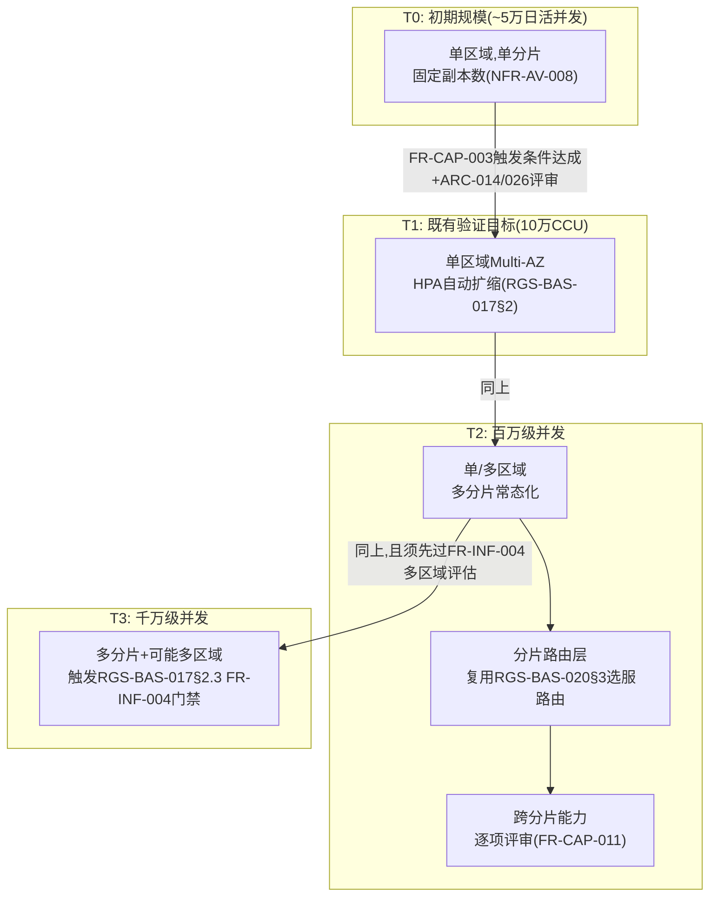

# 基本设计书（基本設計書 / Basic Design Document）

**弹性容量规划与超大规模并发架构 Elastic Capacity Planning & Massive-Scale Concurrency Architecture**

| 项目 | 内容 |
|---|---|
| 文档编号 | RGS-BAS-022 |
| 版本 | 0.3 |
| 父文档 | RGS-REQ-025 需求定义书（ARC-040） |
| 制定日 | 2026-08-16 |
| 最终更新日 | 2026-08-16 |
| 制定者 | 架构师 |
| 保密级别 | 内部限定（Internal Use Only） |
| 适用许可 | Apache-2.0（本仓库） |

---

## 修订历史（改訂履歴 / Revision History）

| 版本 | 修订日 | 修订者 | 审批者 | 修订内容 | 影响需求ID |
|---|---|---|---|---|---|
| 0.1 | 2026-08-16 | 架构师 | — | 初版制定。将RGS-REQ-025§10 ARC-040展开为容量分级的基础设施拓扑差异、分片路由与跨分片能力的组件设计、弹性预留与预测性预热的实现机制、分片粒度插件操作设计 | 全部 |
| 0.2 | 2026-08-17 | 架构师 | — | 补齐设计缺口（详细设计阶段前的完备性核对发现）：新增§2.3三类组件扩容手段对应表（FR-CAP-022〜024此前仅在可追溯性表带过，无实际设计内容）；新增§3.3分片新增/下线流程复用说明（FR-CAP-012）；§5开头补充全容量级别可用性声明（FR-CAP-030） | FR-CAP-012、FR-CAP-022〜024、FR-CAP-030 |
| 0.3 | 2026-09-01 | 架构师 (Mavis 接手 agent per DEC-008) | 架构师 (Mavis 接手 agent per DEC-008) | 落实"各BAS文档功能章节加log设计且区分debug/release级"总要求（per Ulysses 2026-09-01 15:52 JST 决策，4 拍板选项：全部 36 个BAS / 详尽版5列表 / 派worker并行 / BAS-004同步升级）：§2.1/§2.2/§2.3/§3.1/§3.2/§3.3/§4.1/§4.2/§5.1/§5.2/§6.1/§6.2/§6.3 全部 13 个 ## L2 功能段加"本功能日志设计" 5 列详尽版（字段名/触发条件/频率估算/采样策略/脱敏与成本），引用 BAS-001 v1.5 §4.8.3 模板（commit 32d9eb6）+ BAS-003 v0.3 样板（commit 75a001c）+ BAS-004 v0.3 §4.2 二维矩阵 + §4.3 字段 + §5.1 脱敏 + §6.2 强制全采样（commit 47e26b0/0ee6262）；字段名前缀统一 `cap.*`（capacity 容量规划域），与 BAS-002 `mnt.*` / BAS-003 `ops.*` / BAS-006 `sec.*` / BAS-010 `pat.*` 区分；显式区分容量级别演进关键事件（`info!`/`error!` 级别 release 必出，编译期常驻，§6.2 强制全采样，运维核心事件）、HPA/KEDA 扩缩容触发（`info!` release 必出 + §6.2 强制全采样，per FR-CAP-022/023/024）、节点上下线/迁移（`info!` release 必出 + 强制全采样，NFR-AV-008 集群感知需要）、容量预测/阈值告警（`warn!`/`error!` release 必出 + §6.2 强制全采样）、性能指标采集（`info!` release 必出，高基数但核心 KPI）、容量超限/降级（`error!` 强制全采样，per ARC-007）、调度决策细节（`debug!` 守护，debug-only，release 完全剔除零运行时开销）、打分函数中间值（`trace!` 守护，debug-only）七类事件；覆盖 FR-CAP-001/002/003/010/011/012/013/020/021/022/023/024/030/031/032、ARC-014/026/040、NFR-CAP-001/002/003/005、AC-CAP-001/002/003/004、TBD-CAP-001/002、RSK-CAP-001/002/003、FR-LOG-010/011/012/013/040、FR-INF-004、NFR-AV-008、ARC-007/013 等全系列相关追溯依据；§6.1/§6.2/§6.3 检查清单本身也含 log 章节（"检查项命中/失败"是 §6.x 在 CI/评审执行时的运行时事件，per BAS-010 v0.5 §7.1 样板）；§7 追溯性新增 AC-CAP-006（`cap.*` debug-only 宏 release 完全剔除）与 AC-CAP-007（每功能 BAS 文档须含本功能 log 设计章节），与 BAS-001 v1.5 §4.8.3.4 / BAS-002 v0.4 §13 / BAS-003 v0.3 §13 / BAS-004 v0.3 §12 / BAS-006 v0.4 §9 / BAS-010 v0.5 §6 形成统一规范 | §2.1〜2.3、§3.1〜3.3、§4.1〜4.2、§5.1〜5.2、§6.1〜6.3、§7 |

## 审批栏（承認欄 / Approval）

| 角色 | 姓名 | 审批日 | 备注 |
|---|---|---|---|
| 制定（起草） | 架构师 | 2026-08-16 | — |
| 评审（技术） | | | T2/T3拓扑图与既有单区域Multi-AZ拓扑（RGS-BAS-017§2）的衔接是否清晰 |
| 审批（负责人） | | | 本文档的基准化 |

---

## 目录

1. [前言](#1-前言)
2. [容量分级的基础设施拓扑](#2-容量分级的基础设施拓扑)
3. [分片路由与跨分片能力设计](#3-分片路由与跨分片能力设计)
4. [弹性预留与预测性预热设计](#4-弹性预留与预测性预热设计)
5. [分片粒度插件操作设计](#5-分片粒度插件操作设计)
6. [标准化检查清单](#6-标准化检查清单)
7. [追溯性](#7-追溯性)

---

# 1. 前言

本文档细化RGS-REQ-025定义的ARC-040。全部组件**依附**既有限界上下文与既有基础设施运行，分片机制复用ARC-018挂载/退场判定原则，**不新建**独立于既有治理框架之外的容量管理体系。

---

# 2. 容量分级的基础设施拓扑

## 2.1 各级拓扑差异（对RGS-REQ-001§10.1整体架构图、RGS-BAS-017§2单区域拓扑的容量维度补充）



### 2.1 本功能日志设计

本节覆盖**容量级别演进（拓扑维度）**的可观测字段——拓扑状态观测、级别触发条件达成、ARC-014/026 评审通过、多区域评估门禁（FR-INF-004）。事件名统一 `cap.topology.*` 前缀。**拓扑级别演进是核心运维事件**（per BAS-004 v0.3 §6.2 强制全采样白名单），任何"FR-CAP-003 触发条件达成"或"多区域门禁评估"产生的事件均 release 必出，**不允许**降级为 debug-only；T2→T3 的多区域评估门禁特别关键（违反 NFR-CAP-005），走 `error!` 强制全采样。

| 字段名（field） | 触发条件（trigger） | 频率估算（frequency） | 采样策略（sampling） | 脱敏与成本（redact & cost） |
|---|---|---|---|---|
| `cap.topology.level_observed` | 容量级别状态观察点（T0/T1/T2/T3 当前态，由监控周期性采集） | 稳态 1/30s / 峰值 1/s（缩容/扩容告警期间） | release 必出（`info!` 编译期常驻，per BAS-004 v0.3 §4.2） | 含 `current_level`/`next_level`/`at`；约 180B/条 |
| `cap.topology.trigger_condition_met` | FR-CAP-003 触发条件达成（CCU/DAU/ARPU 等容量指标突破阈值） | 极低（年度 1-3 次演进） | release 必出（`info!` §6.2 强制全采样） | 含 `metric`/`current_value`/`threshold`/`suggested_next_level`；约 280B/条 |
| `cap.topology.arc_review_passed` | ARC-014/026 容量级别演进评审通过（升级前置门禁，per §6.1） | 极低 | release 必出（`info!` §6.2 强制全采样） | 含 `from_level`/`to_level`/`review_id`/`reviewers`；约 320B/条 |
| `cap.topology.arc_review_rejected` | ARC-014/026 评审驳回（容量预算/技术方案不达标） | 极低 | release 必出（`warn!` §6.2 强制全采样） | 含 `from_level`/`to_level`/`review_id`/`rejection_reason`；约 380B/条 |
| `cap.topology.multi_region_assessment_required` | T2→T3 触发 RGS-BAS-017§2.3 FR-INF-004 多区域评估门禁 | 极低 | release 必出（`info!` §6.2 强制全采样） | 含 `current_level`/`target_level`/`assessment_id`；约 240B/条 |
| `cap.topology.multi_region_assessment_failed` | **严重**：多区域评估门禁未通过，仍尝试 T2→T3 演进（违反 NFR-CAP-005） | 极低（不应发生） | release 必出（`error!` §6.2 强制全采样） | 含 `target_level`/`failed_criteria`/`blocker`；约 360B/条 |
| `cap.topology.transition_committed` | 容量级别正式切换（原级别进入退役倒计时，新级别进入活跃期） | 极低 | release 必出（`info!` §6.2 强制全采样） | 含 `from_level`/`to_level`/`committed_at`；约 280B/条 |
| `cap.topology.debug.decision_score_breakdown` | 触发条件判定的原始指标明细（per `metric` 全量 dump，便于事后核对"为什么这次触发了"） | 偶发 | **debug-only**（`#[cfg(debug_assertions)]` 守护，release 完全剔除） | 约 1-3KB/条（release 剔除，零运行时开销） |
| `cap.topology.debug.assessment_criteria_detail` | FR-INF-004 多区域评估的逐项判定明细 | 偶发 | **debug-only**（`#[cfg(debug_assertions)]` 守护） | 约 2-5KB/条（release 剔除） |

**debug-only 守护要点**（落实 BAS-004 v0.3 §4.4）：
- `cap.topology.debug.decision_score_breakdown` / `cap.topology.debug.assessment_criteria_detail` 在演进窗口下可能 5KB+ —— release build 完全剔除，避免 RUST_LOG=debug 误开时撑爆生产日志通道
- `cap.topology.multi_region_assessment_failed` 必须 `error!` 级别（per §4.8.3.2 二维矩阵 `error!` 行 release 常驻 + §6.2 强制全采样），**不**挂 `#[cfg]`，确保 release 下告警链路完整
- `cap.topology.*` 不含敏感字段（容量指标属运维可观测范围，非 PII），IP 字段如出现须走 BAS-004 v0.3 §5.1 末段掩码

## 2.2 各级新增组件一览

| 级别 | 新增组件 | 复用的既有组件 |
|---|---|---|
| T0 | 无（既有RGS-BAS-001既定架构） | 全部 |
| T1 | HPA配置（RGS-BAS-002§5.1既有） | 单区域Multi-AZ（RGS-BAS-017§2，若T1阶段已实施） |
| T2 | 分片路由层（若RGS-REQ-023尚未实施选服路由则一并落地）、跨分片能力清单（§3.2） | RGS-BAS-020§3`RealmDirectoryService`/`RealmRouter` |
| T3 | 多区域拓扑（触发时另走RGS-BAS-017§2.3评审，非本文档预先设计） | 同T2 |

> **不预建声明**：本表T2/T3列出的组件是**演进路径上会用到的组件**，**不是**本文档要求当前阶段立即构建的组件。是否、何时构建由FR-CAP-002/003既定的分级门禁决定。

### 2.2 本功能日志设计

本节覆盖**容量级别新增组件的滚动决策**的可观测字段——"不预建"是设计声明，但**当演进门禁触发后**新增哪些组件、何时启用、是否复用既有组件等运行时决策均产生 release 必出事件。事件名统一 `cap.component.*` 前缀。**T0/T1 兼容性检查（`target_shards` 为空即完全等价于既有单集群行为，per §5 FR-CAP-030）必须 release 必出**，是向后兼容不引入回归的硬性证据。

| 字段名（field） | 触发条件（trigger） | 频率估算（frequency） | 采样策略（sampling） | 脱敏与成本（redact & cost） |
|---|---|---|---|---|
| `cap.component.rollout_planned` | 容量级别演进触发后，新增组件的滚动计划制定完成（per §2.2 表） | 极低（年度 1-3 次） | release 必出（`info!` §6.2 强制全采样） | 含 `target_level`/`component_kind`/`reuse_from`/`new_instance_count`；约 360B/条 |
| `cap.component.rollout_started` | 新增组件首批实例上线（per ARC-018 挂载脚手架） | 极低 | release 必出（`info!` §6.2 强制全采样） | 含 `target_level`/`component_kind`/`instance_count`/`started_at`；约 300B/条 |
| `cap.component.rollout_completed` | 新增组件全部实例就绪并通过验收（per §6.2） | 极低 | release 必出（`info!` §6.2 强制全采样） | 含 `target_level`/`component_kind`/`ready_count`/`completed_at`；约 300B/条 |
| `cap.component.rollout_failed` | **严重**：组件滚动失败且达到重试上限（违反 §6.2 上线前检查清单） | 极低（不应发生） | release 必出（`error!` §6.2 强制全采样） | 含 `target_level`/`component_kind`/`failed_count`/`failure_reason`；约 400B/条 |
| `cap.component.backward_compat_check_passed` | T0/T1 兼容性检查通过（`target_shards` 空等价于既有单集群行为，per §5 FR-CAP-030） | 每次滚动 1 次 | release 必出（`info!` §6.2 强制全采样，**向后兼容不引入回归的硬性证据**） | 含 `check_id`/`affected_component`/`equivalence_proof`；约 360B/条 |
| `cap.component.reuse_decision` | 既有组件复用 vs 新建组件的运行时决策（per §2.2"复用的既有组件"列） | 每次演进触发 1-N 次 | release 必出（`info!` §6.2 强制全采样） | 含 `target_capability`/`reuse_target`/`reuse_kind`；约 280B/条 |
| `cap.component.deprecation_initiated` | 既有组件进入退役倒计时（被新级别组件替代） | 极低 | release 必出（`warn!` §6.2 强制全采样） | 含 `component_kind`/`deprecated_at`/`sunset_at`；约 260B/条 |
| `cap.component.debug.dependency_graph` | 新增组件与既有组件的依赖图全量 dump | 偶发 | **debug-only**（`#[cfg(debug_assertions)]` 守护，release 完全剔除） | 约 3-8KB/条（release 剔除，零运行时开销） |
| `cap.component.debug.rollout_manifest` | 滚动清单完整 dump（per-instance target 状态 + 实际状态） | 偶发 | **debug-only**（`#[cfg(debug_assertions)]` 守护） | 约 1-3KB/条（release 剔除） |

**debug-only 守护要点**（落实 BAS-004 v0.3 §4.4）：
- `cap.component.rollout_failed` 必须 `error!` 级别（per §4.8.3.2 `error!` 行 release 常驻 + §6.2 强制全采样），**不**挂 `#[cfg]`，确保 release 下告警链路完整
- `cap.component.debug.dependency_graph` 在大集群（千级 Pod）下可能 8KB+ —— release build 完全剔除，避免 RUST_LOG=debug 误开时撑爆生产日志通道
- `cap.component.*` 不含凭证类字段（运维可观测范围），但 `reuse_target` 引用既有服务名时须按 BAS-004 v0.3 §5.1 黑名单过滤（避免误写入含 `*token*`/`*password*` 的服务实例名）

## 2.3 三类组件的扩容手段对应（FR-CAP-022〜024落地，补齐设计缺口）

容量分级演进时，不同性质的组件须采用不同的扩容手段，**不得**混用——本节明确三者的对应关系（均为既有机制的直接复用，不新增扩容技术）：

| 组件性质 | 代表组件 | 扩容手段 | 复用的既有设计 |
|---|---|---|---|
| 无状态业务服务 | PL/EC/MT/GD等Rust微服务 | 仅增加副本数，**不得**要求代码变更 | 既有HPA机制（RGS-BAS-002§5.1），FR-CAP-022 |
| 有状态场景运行时 | ECS场景Actor节点 | 新增场景实例分布到新节点，**不得**拆分单场景模拟到多机 | ARC-001既定"场景为单位、数据连续排布无需加锁"原则，FR-CAP-023 |
| 数据库层 | 各限界上下文DB（读多写少场景） | 优先只读副本+分区吸收，仅单分片单库确已成瓶颈时才在该分片内进一步拆分 | RGS-BAS-007既定标准（只读副本、§4分区设计），FR-CAP-024，遵循ARC-014"先用足既有手段"精神 |

> **判定优先级**：三种手段**互不替代**——无状态服务永远优先水平扩容而非拆分；有状态场景永远以"新增实例"而非"拆分单实例"应对负载；数据库永远先用只读副本/分区，最后才考虑分片内再拆分。评审时若发现某扩容方案跨越了这一对应关系（如试图拆分单个场景的模拟），**必须**驳回并要求重新设计。

### 2.3 本功能日志设计

本节覆盖**三类组件的扩容手段运行时触发**的可观测字段——HPA 副本数调整（无状态服务，FR-CAP-022）、场景 Actor 实例分布到新节点（FR-CAP-023）、只读副本/分区吸收（数据库层，FR-CAP-024）。事件名统一 `cap.scale.*` 前缀。**HPA/KEDA 扩缩容触发是核心运维事件**（per BAS-004 v0.3 §6.2 强制全采样），release 必出，**不允许**降级为 debug-only；扩容手段**互不替代**（per §2.3 判定优先级），违反判定优先级的扩容尝试走 `error!` 强制全采样；调度决策细节（打分函数中间值）走 `debug!` 守护。

| 字段名（field） | 触发条件（trigger） | 频率估算（frequency） | 采样策略（sampling） | 脱敏与成本（redact & cost） |
|---|---|---|---|---|
| `cap.scale.hpa.triggered` | HPA 触发扩缩容（per FR-CAP-022 无状态服务副本数调整） | 稳态 <0.1/s / 峰值 1-10/s（活动期间） | release 必出（`info!` §6.2 强制全采样，per BAS-004 v0.3 §6.2） | 含 `target_kind`/`old_replicas`/`new_replicas`/`metric`/`metric_value`；约 360B/条 |
| `cap.scale.hpa.cooldown_skipped` | HPA 冷却被人工干预跳过（per HPA 既定的 cooldown 机制） | 极低 | release 必出（`warn!` §6.2 强制全采样） | 含 `target_kind`/`operator_id`/`reason`；约 280B/条 |
| `cap.scale.scene_instance.distributed` | 场景 Actor 实例分布到新节点（per FR-CAP-023 "新增实例"判定） | 稳态 0.01/s / 峰值 0.1/s（场景扩容期） | release 必出（`info!` §6.2 强制全采样） | 含 `scene_id`/`target_node_id`/`old_node_id`/`distribution_reason`；约 320B/条 |
| `cap.scale.scene_instance.split_attempt` | **严重**：尝试拆分单场景模拟到多机（违反 FR-CAP-023 与 ARC-001） | 极低（不应发生） | release 必出（`error!` §6.2 强制全采样） | 含 `scene_id`/`attempted_split_count`/`reject_reason`；约 360B/条 |
| `cap.scale.db.read_replica.added` | 数据库只读副本扩容（per FR-CAP-024 优先只读副本+分区吸收） | 极低 | release 必出（`info!` §6.2 强制全采样） | 含 `db_kind`/`replica_id`/`replication_lag_ms`/`added_at`；约 300B/条 |
| `cap.scale.db.partition.split` | 数据库分区拆分（per FR-CAP-024 分区吸收，**最后**才考虑分片内再拆分） | 极低 | release 必出（`info!` §6.2 强制全采样） | 含 `db_kind`/`table_name`/`old_partition_count`/`new_partition_count`；约 360B/条 |
| `cap.scale.method_violation` | **严重**：扩容方案违反 §2.3 判定优先级（如对无状态服务要求代码变更、对单场景尝试拆分模拟） | 极低（不应发生） | release 必出（`error!` §6.2 强制全采样） | 含 `component_kind`/`attempted_method`/`rejected_method`/`violation_rule`；约 400B/条 |
| `cap.scale.keda.scaler_triggered` | KEDA 触发扩缩容（与 HPA 互补的事件源，如基于消息队列积压） | 稳态 <0.1/s / 峰值 1/s | release 必出（`info!` §6.2 强制全采样） | 含 `scaler_kind`/`metric_source`/`old_replicas`/`new_replicas`；约 320B/条 |
| `cap.scale.debug.scheduler_score_breakdown` | 调度器打分函数完整明细（per-pod 候选节点得分全量 dump） | 偶发 | **debug-only**（`#[cfg(debug_assertions)]` 守护，release 完全剔除） | 约 2-5KB/条（release 剔除，零运行时开销） |
| `cap.scale.trace.candidate_filter_chain` | 调度器候选节点过滤链每步过滤掉的节点计数（追踪最终落点决策的中间过程） | 调度期高频 | **debug-only**（`#[cfg(debug_assertions)]` 守护） | 约 200-500B/条（release 剔除） |

**debug-only 守护要点**（落实 BAS-004 v0.3 §4.4）：
- `cap.scale.scene_instance.split_attempt` / `cap.scale.method_violation` 必须 `error!` 级别（per §4.8.3.2 `error!` 行 release 常驻 + §6.2 强制全采样），**不**挂 `#[cfg]`，确保 release 下告警链路完整
- `cap.scale.debug.scheduler_score_breakdown` 在大规模集群下可能 5KB+ —— release build 完全剔除，避免 RUST_LOG=debug 误开时撑爆生产日志通道
- `cap.scale.hpa.triggered` / `cap.scale.keda.scaler_triggered` 是核心运维事件，**必须** 100% 强制全采样（per BAS-004 v0.3 §6.2），不允许走采样率配置

---

# 3. 分片路由与跨分片能力设计

## 3.1 分片路由（复用而非重建）

分片（逻辑服）的路由**完全复用**RGS-BAS-020§3已有设计：`RealmDirectoryService`维护分片列表与状态，`RealmRouter`在鉴权成功后路由玩家至其主分片。本文档**不新增**路由组件，仅在T2阶段起，`RealmDirectoryService`维护的分片数量**从"运营手动决定的少量逻辑服"扩展为"容量驱动的常态化多分片"**——这是运营语义的扩展，**不是**技术组件的变更。

### 3.1 本功能日志设计

本节覆盖**分片路由运行时事件**的可观测字段——分片列表刷新、玩家路由决策、运营手动→容量驱动的语义切换、路由失败重选。事件名统一 `cap.shard_route.*` 前缀。**分片列表刷新与路由失败**是核心运维事件（per BAS-004 v0.3 §6.2），release 必出 + 强制全采样；路由决策的中间打分明细走 `debug!` 守护，release 完全剔除。

| 字段名（field） | 触发条件（trigger） | 频率估算（frequency） | 采样策略（sampling） | 脱敏与成本（redact & cost） |
|---|---|---|---|---|
| `cap.shard_route.directory_refreshed` | `RealmDirectoryService` 拉取/更新分片列表（含容量驱动的常态化多分片切换） | 稳态 1/30s / 峰值 1/s（分片上下线期间） | release 必出（`info!` §6.2 强制全采样，per BAS-004 v0.3 §6.2 强制全采样白名单） | 含 `shard_count`/`shard_ids`/`refresh_reason`；约 240B/条 |
| `cap.shard_route.routing_decided` | 玩家被路由到主分片（`RealmRouter` 鉴权成功后） | 稳态 100/s / 峰值 10000/s（登录高峰） | release 必出（`info!` 编译期常驻） | 含 `player_id`/`shard_id`/`routing_strategy`/`latency_ms`；约 220B/条 |
| `cap.shard_route.routing_failed` | 路由失败（候选分片全部不可达 / 玩家无主分片） | 极低 | release 必出（`warn!` §6.2 强制全采样） | 含 `player_id`/`tried_shards`/`failure_reason`；约 320B/条 |
| `cap.shard_route.routing_rescued` | 路由失败后重选成功（fallback 到次优分片） | 偶发 | release 必出（`info!` §6.2 强制全采样） | 含 `player_id`/`original_shard_id`/`rescued_shard_id`/`rescue_reason`；约 280B/条 |
| `cap.shard_route.semantic_switched` | 触发频率从"运营手动"切换为"容量门禁触发"（per §2.2"改变的只是触发频率"） | 极低（一次性） | release 必出（`info!` §6.2 强制全采样） | 含 `from_trigger_kind`/`to_trigger_kind`/`switched_at`；约 240B/条 |
| `cap.shard_route.shard_unavailable` | 单一分片被检测为不可达（健康检查失败 / 连接超时） | 偶发 | release 必出（`warn!` §6.2 强制全采样） | 含 `shard_id`/`last_healthy_at`/`unavailable_duration_ms`；约 260B/条 |
| `cap.shard_route.shard_recovered` | 不可达分片恢复健康 | 偶发 | release 必出（`info!` §6.2 强制全采样） | 含 `shard_id`/`recovered_at`/`downtime_ms`；约 220B/条 |
| `cap.shard_route.debug.routing_score_breakdown` | 路由打分函数完整明细（per-shard 得分 + 过滤掉的分片） | 偶发（按需） | **debug-only**（`#[cfg(debug_assertions)]` 守护，release 完全剔除） | 约 1-3KB/条（release 剔除，零运行时开销） |
| `cap.shard_route.debug.directory_snapshot` | `RealmDirectoryService` 内部全量分片状态快照（含每分片的连接数/排队深度/最近健康度） | 偶发（按需） | **debug-only**（`#[cfg(debug_assertions)]` 守护） | 约 2-8KB/条（release 剔除） |

**debug-only 守护要点**（落实 BAS-004 v0.3 §4.4）：
- `cap.shard_route.routing_decided` 是高频路径（登录期间 10000/s），日志字节数必须严控（220B/条 × 10000/s = 2.2MB/s 峰值），**不得**增加字段；任何扩展字段须先评估
- `cap.shard_route.debug.directory_snapshot` 在大规模多分片（千级分片）下可能 8KB+ —— release build 完全剔除
- `player_id` 明文允许（per BAS-004 v0.3 §5.1），无脱敏需求；分片 ID 是内部标识符亦无需脱敏

## 3.2 跨分片能力清单（FR-CAP-011落地）

| 跨分片能力 | 是否允许 | 实现方式 |
|---|---|---|
| 全局排行榜（跨分片聚合） | 允许（须逐项评审） | 复用RGS-REQ-017 ARC-031派生视图思想：各分片的排行数据异步聚合至一个只读的"全局视图"，聚合**允许**滞后，**不得**要求分片间同步查询 |
| 账号身份跨分片唯一（第三方登录/实名认证） | 必须允许（身份是分片无关的） | 复用RGS-REQ-021既有`AccountIdentityLink`/`ComplianceProfile`设计，这两张表**不**按分片拆分，是全局唯一的（同FR-CAP-011"账号身份系统可能需要跨分片唯一"的既定认可） |
| 玩家实时状态（位置/战斗/背包） | **不允许** | 严格限定在单分片内，这是分片存在的核心意义（NFR-CAP-003） |
| 客服工单/支付对账（RGS-REQ-019） | 允许（不涉及实时状态） | 复用既有AD限界上下文数据模型，工单本身按账号而非分片查询，天然跨分片 |

> **判定规则**：一项能力"是否允许跨分片"的判断标准是——该能力是**玩家实时游玩状态**（不允许）还是**账号/治理层面的元数据**（允许，因其访问频率低、一致性要求可异步满足）。新增跨分片能力诉求**必须**先按此规则判定，而非逐案自由裁量。

### 3.2 本功能日志设计

本节覆盖**跨分片能力运行时事件**的可观测字段——跨分片查询、允许/不允许类能力判定、全局视图刷新、违规实现拦截。事件名统一 `cap.cross_shard.*` 前缀。**跨分片"不允许"类能力的违规实现**（per §3.2 判定规则：玩家实时状态不允许跨分片）属数据正确性事件，走 `error!` 强制全采样；全局视图刷新与跨分片判定 release 必出（运维/合规可观测性）。

| 字段名（field） | 触发条件（trigger） | 频率估算（frequency） | 采样策略（sampling） | 脱敏与成本（redact & cost） |
|---|---|---|---|---|
| `cap.cross_shard.allowed_query` | 允许的跨分片能力查询（账号身份/客服工单/支付对账，per §3.2 表） | 稳态 10/s / 峰值 100/s | release 必出（`info!` 编译期常驻） | 含 `query_kind`/`requester_kind`/`shards_involved`/`latency_ms`；约 280B/条 |
| `cap.cross_shard.allowed_query.failed` | 允许类跨分片查询失败（如下游聚合服务不可用） | 偶发 | release 必出（`warn!` §6.2 强制全采样） | 含 `query_kind`/`shards_involved`/`failure_reason`；约 320B/条 |
| `cap.cross_shard.global_view.refreshed` | 全局视图异步聚合刷新（per §3.2 排行榜/跨分片聚合，per ARC-031 派生视图思想） | 稳态 1/min / 峰值 1/10s（结算/赛季节点） | release 必出（`info!` §6.2 强制全采样） | 含 `view_kind`/`lag_ms`/`shards_contributed`/`aggregated_at`；约 280B/条 |
| `cap.cross_shard.global_view.lag_breach` | **严重**：全局视图滞后超过既定阈值（违反 NFR-CAP-001 一致性窗口） | 偶发 | release 必出（`warn!` §6.2 强制全采样） | 含 `view_kind`/`lag_ms`/`threshold_ms`；约 220B/条 |
| `cap.cross_shard.disallowed_violation` | **极严重**：玩家实时状态（位置/战斗/背包）跨分片访问（违反 NFR-CAP-003 + §3.2 判定规则） | 极低（不应发生） | release 必出（`error!` §6.2 强制全采样） | 含 `query_kind`/`requester_kind`/`attempted_shards`/`blocking_rule`；约 360B/条 |
| `cap.cross_shard.capability_judged` | 新增跨分片能力诉求的判定结果（per §3.2 判定规则） | 极低（季度评审） | release 必出（`info!` §6.2 强制全采样） | 含 `requested_capability`/`judgement`/`rationale`；约 320B/条 |
| `cap.cross_shard.identity.global_resolved` | 账号身份跨分片唯一性解析（per §3.2 `AccountIdentityLink`/`ComplianceProfile`） | 稳态 5/s / 峰值 50/s（登录/合规审查） | release 必出（`info!` 编译期常驻） | 含 `identity_kind`/`account_id_hash`/`resolved_shard_id`；约 240B/条；`account_id` 哈希化（per BAS-004 v0.3 §5.1） |
| `cap.cross_shard.support.ticket_resolved` | 客服工单按账号而非分片查询（per §3.2） | 稳态 0.1/s / 峰值 1/s（活动期） | release 必出（`info!` 编译期常驻） | 含 `ticket_id`/`account_id_hash`/`shards_searched`；约 280B/条 |
| `cap.cross_shard.debug.per_shard_aggregation_detail` | 各分片贡献明细（per-shard 聚合前快照） | 偶发 | **debug-only**（`#[cfg(debug_assertions)]` 守护，release 完全剔除） | 约 1-5KB/条（release 剔除，零运行时开销） |
| `cap.cross_shard.debug.judgement_decision_tree` | 跨分片能力判定的决策树全量路径 | 偶发 | **debug-only**（`#[cfg(debug_assertions)]` 守护） | 约 2-3KB/条（release 剔除） |

**debug-only 守护要点**（落实 BAS-004 v0.3 §4.4）：
- `cap.cross_shard.disallowed_violation` 必须 `error!` 级别（per §4.8.3.2 `error!` 行 release 常驻 + §6.2 强制全采样），**不**挂 `#[cfg]`，确保 release 下告警链路完整
- `cap.cross_shard.identity.global_resolved` 含账号信息——`account_id` 须按 BAS-004 v0.3 §5.1 哈希化（不可逆），避免明文账号标识出现在日志
- `cap.cross_shard.debug.per_shard_aggregation_detail` 在大规模多分片下可能 5KB+ —— release build 完全剔除

## 3.3 分片新增/下线流程（FR-CAP-012落地，补齐设计缺口）

分片（逻辑服）的新增/下线**不得**为容量演进单独发明一套流程，**必须**复用两条既有流程：

| 操作 | 复用的既有流程 |
|---|---|
| 新增分片 | ARC-018挂载脚手架（RGS-BAS-002）——新分片对应的运行时节点/路由登记，走既定挂载检查清单，**不是**新的Atomic App，只是既有场景运行时节点的一次水平新增实例 |
| 下线分片（含合服/分服） | RGS-REQ-023§7既定的合服/分服演练与执行流程（RGS-BAS-020§4），须先在演练环境验证数据冲突规则与资产一致性，方可执行 |

分片数量从"运营手动决定的少量逻辑服"扩展为"容量驱动的常态化多分片"（见§2.2），改变的只是**触发频率**（从偶发运营决策变为容量门禁触发），触发后走的仍是同一套既有流程，流程本身不因触发原因不同而分叉。

### 3.3 本功能日志设计

本节覆盖**分片新增/下线流程运行时事件**的可观测字段——挂载（per ARC-018 挂载脚手架）、下线/合服/分服（per RGS-REQ-023§7 + RGS-BAS-020§4 演练流程）、演练环境验证、流程分叉异常。事件名统一 `cap.shard_lifecycle.*` 前缀。**分片新增/下线是核心运维事件**（per BAS-004 v0.3 §6.2），release 必出 + 强制全采样；**演练环境未通过即执行生产下线**走 `error!` 强制全采样（数据冲突规则 + 资产一致性违反 NFR-CAP-001）；流程分叉异常（即触发原因不同而走了不同流程）也走 `error!` 强制全采样（违反 §3.3"流程本身不因触发原因不同而分叉"）。

| 字段名（field） | 触发条件（trigger） | 频率估算（frequency） | 采样策略（sampling） | 脱敏与成本（redact & cost） |
|---|---|---|---|---|
| `cap.shard_lifecycle.mount_planned` | 新分片挂载计划制定（per ARC-018 挂载脚手架 + §3.3 表） | 极低（年度 1-5 次） | release 必出（`info!` §6.2 强制全采样） | 含 `shard_id`/`trigger_kind`/`checklist_id`/`planned_at`；约 280B/条 |
| `cap.shard_lifecycle.mount_started` | 新分片对应运行时节点 + 路由登记开始 | 极低 | release 必出（`info!` §6.2 强制全采样） | 含 `shard_id`/`trigger_kind`/`started_at`；约 240B/条 |
| `cap.shard_lifecycle.mount_completed` | 新分片挂载完成（既不是新的 Atomic App，是既有场景运行时节点的一次水平新增实例，per §3.3） | 极低 | release 必出（`info!` §6.2 强制全采样） | 含 `shard_id`/`trigger_kind`/`completed_at`/`readiness_state`；约 280B/条 |
| `cap.shard_lifecycle.unmount_drill_started` | 下线/合服/分服演练环境验证开始（per RGS-REQ-023§7 演练流程） | 极低 | release 必出（`info!` §6.2 强制全采样） | 含 `shard_id`/`drill_id`/`started_at`；约 240B/条 |
| `cap.shard_lifecycle.unmount_drill_passed` | 演练环境数据冲突规则 + 资产一致性验证通过 | 极低 | release 必出（`info!` §6.2 强制全采样） | 含 `shard_id`/`drill_id`/`conflict_check_result`/`asset_consistency_result`；约 400B/条 |
| `cap.shard_lifecycle.unmount_drill_failed` | 演练环境验证未通过 | 极低 | release 必出（`warn!` §6.2 强制全采样） | 含 `shard_id`/`drill_id`/`failure_kind`/`conflict_count`/`inconsistent_asset_count`；约 360B/条 |
| `cap.shard_lifecycle.unmount_executed` | 生产环境正式执行下线/合服/分服 | 极低 | release 必出（`info!` §6.2 强制全采样） | 含 `shard_id`/`drill_id`/`executed_at`/`affected_player_count`；约 320B/条 |
| `cap.shard_lifecycle.unmount_skipped` | **严重**：演练未通过仍执行生产下线（违反 NFR-CAP-001） | 极低（不应发生） | release 必出（`error!` §6.2 强制全采样） | 含 `shard_id`/`drill_id`/`bypass_reason`；约 320B/条 |
| `cap.shard_lifecycle.flow_divergence_detected` | **严重**：流程因触发原因不同而分叉（违反 §3.3 流程不因触发原因不同而分叉） | 极低（不应发生） | release 必出（`error!` §6.2 强制全采样） | 含 `shard_id`/`trigger_kind`/`expected_flow`/`actual_flow`；约 360B/条 |
| `cap.shard_lifecycle.trigger_kind_changed` | 触发频率从偶发运营决策切换为容量门禁触发（per §2.2） | 极低（一次性） | release 必出（`info!` §6.2 强制全采样） | 含 `old_trigger_kind`/`new_trigger_kind`/`switched_at`；约 240B/条 |
| `cap.shard_lifecycle.debug.entity_migration_timing` | 单个玩家实体的迁移完整时间链（per-entity 维度） | 偶发 | **debug-only**（`#[cfg(debug_assertions)]` 守护，release 完全剔除） | 约 200-500B/条（release 剔除，零运行时开销） |
| `cap.shard_lifecycle.debug.drill_assertion_detail` | 演练环境验证的逐项断言结果明细 | 偶发 | **debug-only**（`#[cfg(debug_assertions)]` 守护） | 约 1-3KB/条（release 剔除） |

**debug-only 守护要点**（落实 BAS-004 v0.3 §4.4）：
- `cap.shard_lifecycle.unmount_skipped` / `cap.shard_lifecycle.flow_divergence_detected` 必须 `error!` 级别（per §4.8.3.2 `error!` 行 release 常驻 + §6.2 强制全采样），**不**挂 `#[cfg]`，确保 release 下告警链路完整
- `cap.shard_lifecycle.debug.entity_migration_timing` 在百万级玩家时即使单条 200B 也可能 80MB —— release build 完全剔除
- `affected_player_count` 是统计数字不涉及个人标识，`player_id` 等敏感字段不出现此表

---

# 4. 弹性预留与预测性预热设计

## 4.1 弹性预留的实现（FR-CAP-020落地）

| 组件 | 设计要点 |
|---|---|
| 预留容量的定义 | 在HPA既定的目标副本数之上，额外维持一个**已启动、已就绪、但不承接常态流量**的副本余量（如既定目标的20%，TBD-CAP-001具体系数），复用K8s既有`readinessGate`机制控制其是否进入流量池 |
| 与HPA的关系 | 预留余量**不是**HPA的扩容目标，而是HPA扩容生效前的**过渡缓冲**——冲击发生时，预留余量**立即**可用（无需等待Pod启动耗时），HPA随后逐步补足新的目标副本数，预留余量的角色随后交还 |
| 场景运行时节点的预留 | 有状态的场景Actor节点，预留体现为"已就绪但未分配场景实例的空闲节点"，新场景优先调度至预留节点，而非等待新节点启动完成 |

### 4.1 本功能日志设计

本节覆盖**弹性预留运行时事件**的可观测字段——预留副本规模调整、Readiness Gate 切换、预留余量向 HPA 移交、预留阈值突破、场景空闲节点调度命中。事件名统一 `cap.reservation.*` 前缀。**节点上下线/迁移是核心运维事件**（per BAS-004 v0.3 §6.2 + NFR-AV-008 集群感知需要），release 必出 + 强制全采样；预留余量用尽走 `warn!` 强制全采样（per §4.1 弹性预留是 HPA 扩容生效前的过渡缓冲，用尽意味着 HPA 必须立即扩容）。

| 字段名（field） | 触发条件（trigger） | 频率估算（frequency） | 采样策略（sampling） | 脱敏与成本（redact & cost） |
|---|---|---|---|---|
| `cap.reservation.replica_scaled` | 预留副本规模调整（per §4.1 预留容量定义，K8s 既定的 readinessGate 机制） | 稳态 <0.1/s / 峰值 0.5/s（活动期） | release 必出（`info!` §6.2 强制全采样，per BAS-004 v0.3 §6.2） | 含 `target_kind`/`old_reserved`/`new_reserved`/`ratio`；约 280B/条 |
| `cap.reservation.readiness_gate_toggled` | Readiness Gate 切换（预留副本进出流量池，per §4.1 readinessGate 机制） | 稳态 0.01/s / 峰值 0.5/s | release 必出（`info!` §6.2 强制全采样，NFR-AV-008 集群感知需要） | 含 `replica_id`/`target_kind`/`old_gate_state`/`new_gate_state`/`toggled_at`；约 320B/条 |
| `cap.reservation.handoff_to_hpa` | 预留余量向 HPA 移交（per §4.1"预留余量的角色随后交还"） | 偶发（活动期） | release 必出（`info!` §6.2 强制全采样） | 含 `target_kind`/`hpa_target_replicas`/`reservation_role_ended_at`；约 280B/条 |
| `cap.reservation.exhausted` | **严重**：预留余量已全部承接流量，HPA 扩容尚未生效（违反 §4.1"预留是过渡缓冲"） | 偶发（冲击期） | release 必出（`warn!` §6.2 强制全采样） | 含 `target_kind`/`remaining_reservation`/`hpa_progress`/`exhausted_at`；约 320B/条 |
| `cap.reservation.scene_node.allocated` | 场景 Actor 节点预留命中（新场景优先调度至预留空闲节点，per §4.1） | 稳态 0.1/s / 峰值 1/s（场景扩容期） | release 必出（`info!` §6.2 强制全采样） | 含 `scene_id`/`reserved_node_id`/`old_node_id`；约 240B/条 |
| `cap.reservation.scene_node.starved` | 场景预留空闲节点用尽，新场景被迫等待新节点启动 | 偶发 | release 必出（`warn!` §6.2 强制全采样） | 含 `starved_scene_count`/`available_reserved_nodes`；约 240B/条 |
| `cap.reservation.ratio_reconfigured` | 预留比例（既定目标的 20%，TBD-CAP-001 具体系数）变更 | 极低 | release 必出（`info!` §6.2 强制全采样） | 含 `old_ratio`/`new_ratio`/`operator_id`/`changed_at`；约 280B/条 |
| `cap.reservation.debug.reservation_window_calc` | 预留窗口完整计算明细（per-target 候选节点 + 容量估算） | 偶发 | **debug-only**（`#[cfg(debug_assertions)]` 守护，release 完全剔除） | 约 1-3KB/条（release 剔除，零运行时开销） |
| `cap.reservation.debug.scheduler_score_breakdown` | 场景调度器打分函数完整明细（per-node 候选得分） | 偶发 | **debug-only**（`#[cfg(debug_assertions)]` 守护） | 约 2-5KB/条（release 剔除） |

**debug-only 守护要点**（落实 BAS-004 v0.3 §4.4）：
- `cap.reservation.exhausted` 必须 `warn!` 级别（per §4.8.3.2 `warn!` 行 release 常驻 + §6.2 强制全采样），**不**挂 `#[cfg]`，确保 release 下告警链路完整
- `cap.reservation.readiness_gate_toggled` 是高频路径（活动期 0.5/s × 多个 target kind 叠加可能 5/s），日志字节数必须严控（320B/条）
- `operator_id` 是运维人员标识符，按 BAS-004 v0.3 §5.1 哈希化（不可逆），不在日志中明文出现

## 4.2 预测性预热（FR-CAP-021落地）

```
运营计划已知流量突增事件（活动开启/版本更新公告）
  → 通过GM后台既有运维工单（RGS-BAS-003§10）登记预热计划：事件时间、预期负载倍数
  → 预热调度器（依附既有GM后台AD限界上下文）在事件前既定提前量（NFR-CAP-002）触发扩容
  → 扩容目标复用既有HPA配置的手动覆盖能力（临时提高目标副本数下限），事件结束后既定时间自动回落
  → 全程留痕（复用RGS-BAS-003§7审计设计），便于事后核对预热效果与实际负载的偏差
```

### 4.2 本功能日志设计

本节覆盖**预测性预热运行时事件**的可观测字段——预热工单登记（per §4.2 GM 运维工单 + RGS-BAS-003§10）、预热调度器触发、扩容目标手动覆盖、事件结束后回落、预热效果与实际负载偏差记录。事件名统一 `cap.warmup.*` 前缀。**预热工单登记/触发/回落是核心运维事件**（per BAS-004 v0.3 §6.2，事件全链路审计需要），release 必出 + 强制全采样；**预热触发但实际负载未达预期（偏差超过阈值）**走 `warn!` 强制全采样（容量预测失效的早期信号）；预测模型中间输出走 `debug!` 守护。

| 字段名（field） | 触发条件（trigger） | 频率估算（frequency） | 采样策略（sampling） | 脱敏与成本（redact & cost） |
|---|---|---|---|---|
| `cap.warmup.ticket_registered` | 预热工单登记（per RGS-BAS-003§10 运维工单，附 4.2 流程：事件时间/预期负载倍数） | 极低（季度几次大型活动） | release 必出（`info!` §6.2 强制全采样） | 含 `ticket_id`/`event_name`/`expected_multiplier`/`event_at`；约 320B/条 |
| `cap.warmup.scheduler_triggered` | 预热调度器在事件前既定提前量触发扩容（per NFR-CAP-002 提前量） | 极低 | release 必出（`info!` §6.2 强制全采样） | 含 `ticket_id`/`triggered_at`/`advance_ms`；约 240B/条 |
| `cap.warmup.hpa_override_applied` | HPA 目标副本数下限手动覆盖（per §4.2 临时提高目标副本数下限） | 极低 | release 必出（`info!` §6.2 强制全采样） | 含 `ticket_id`/`target_kind`/`old_min_replicas`/`new_min_replicas`；约 300B/条 |
| `cap.warmup.hpa_override_reverted` | 事件结束后既定时间自动回落（per §4.2 末段） | 极低 | release 必出（`info!` §6.2 强制全采样） | 含 `ticket_id`/`reverted_at`/`override_duration_ms`；约 280B/条 |
| `cap.warmup.efficiency_recorded` | 预热效果与实际负载偏差记录（per §4.2 末段"便于事后核对预热效果与实际负载的偏差"） | 极低 | release 必出（`info!` §6.2 强制全采样） | 含 `ticket_id`/`expected_load`/`actual_load`/`deviation_pct`；约 280B/条 |
| `cap.warmup.deviation_breach` | **严重**：预热触发后实际负载未达预期（偏差超过阈值，可能预示预测失效或活动取消） | 极低 | release 必出（`warn!` §6.2 强制全采样） | 含 `ticket_id`/`expected_load`/`actual_load`/`deviation_pct`/`breach_threshold_pct`；约 320B/条 |
| `cap.warmup.event_cancelled` | 已登记的预热工单被取消（活动取消/改期） | 极低 | release 必出（`info!` §6.2 强制全采样） | 含 `ticket_id`/`cancellation_reason`/`operator_id_hash`；约 280B/条；`operator_id` 哈希化（per BAS-004 v0.3 §5.1） |
| `cap.warmup.ticket_failed` | **严重**：预热执行失败（提前量触发后扩容未生效） | 极低 | release 必出（`error!` §6.2 强制全采样） | 含 `ticket_id`/`failure_reason`/`affected_target_kinds`；约 320B/条 |
| `cap.warmup.debug.prediction_model_output` | 容量预测模型完整输出（per-tick/per-target 预测值 + 置信区间） | 偶发 | **debug-only**（`#[cfg(debug_assertions)]` 守护，release 完全剔除） | 约 1-3KB/条（release 剔除，零运行时开销） |
| `cap.warmup.trace.scheduler_decision_chain` | 预热调度器决策链每步判定（提前量检查/事件匹配/目标副本数计算） | 偶发 | **debug-only**（`#[cfg(debug_assertions)]` 守护） | 约 200-500B/条（release 剔除） |

**debug-only 守护要点**（落实 BAS-004 v0.3 §4.4）：
- `cap.warmup.ticket_failed` 必须 `error!` 级别（per §4.8.3.2 `error!` 行 release 常驻 + §6.2 强制全采样），**不**挂 `#[cfg]`，确保 release 下告警链路完整
- `cap.warmup.debug.prediction_model_output` 在多 target kind 叠加下可能 3KB+ —— release build 完全剔除，避免 RUST_LOG=debug 误开时撑爆生产日志通道
- `operator_id` 按 BAS-004 v0.3 §5.1 哈希化（不可逆），不在 release 必出字段中明文出现

---

# 5. 分片粒度插件操作设计

> **全容量级别可用性（FR-CAP-030落地，补齐设计缺口）**：RGS-BAS-005既有的插件热插拔机制**必须**在T0〜T3全部容量级别下保持可用，**不得**因规模增长而降级为需要停机维护窗口才能操作——本节§5.1/5.2的分片维度扩展是对既有机制的**增量适配**而非替换，T0/T1场景下`target_shards`为空即完全等价于既有单集群行为，向后兼容不引入任何回归。

## 5.1 插件注册表的分片维度扩展（FR-CAP-031落地）

在RGS-BAS-005§3既有插件注册表基础上，新增字段：

| 字段 | 说明 |
|---|---|
| `target_shards` | 该插件启用/生效的目标分片集合，为空表示全部分片（向后兼容T0/T1单分片场景） |

插件的启用/禁用/回滚操作（复用RGS-BAS-005§4既有生命周期状态机）**新增**分片维度参数，同一插件可在不同分片处于不同状态（如某活动插件仅在3个分片开放测试，其余分片保持禁用）。

### 5.1 本功能日志设计

本节覆盖**插件注册表分片维度扩展运行时事件**的可观测字段——`target_shards` 字段更新、跨分片插件状态查询、跨分片状态一致性校验、灰度分片推进。事件名统一 `cap.plugin_shard.*` 前缀。**跨分片插件状态一致性违反**（per FR-CAP-031，同一插件在不同分片状态应等价于 `target_shards` 配置）走 `error!` 强制全采样（数据正确性事件）；`target_shards` 更新与灰度分片切换 release 必出（运维可见性）；per-shard 状态 dump 走 `debug!` 守护。

| 字段名（field） | 触发条件（trigger） | 频率估算（frequency） | 采样策略（sampling） | 脱敏与成本（redact & cost） |
|---|---|---|---|---|
| `cap.plugin_shard.target_shards_updated` | 插件注册表 `target_shards` 字段更新（per §5.1 + FR-CAP-031） | 极低（运营手动/灰度推进） | release 必出（`info!` §6.2 强制全采样） | 含 `plugin_id`/`old_target_shards`/`new_target_shards`/`operator_id_hash`/`updated_at`；约 360B/条；`operator_id` 哈希化（per BAS-004 v0.3 §5.1） |
| `cap.plugin_shard.state_consistency_violation` | **严重**：同一插件在不同分片状态不一致（违反 FR-CAP-031 + §5.1 既定"同一插件可在不同分片处于不同状态"的合规判定） | 极低（不应发生） | release 必出（`error!` §6.2 强制全采样） | 含 `plugin_id`/`shard_id`/`expected_state`/`actual_state`；约 320B/条 |
| `cap.plugin_shard.gray_promoted` | 灰度推进（target_shards 集合从 N 个分片扩展到 N+M 个） | 极低 | release 必出（`info!` §6.2 强制全采样） | 含 `plugin_id`/`old_target_count`/`new_target_count`/`promoted_shard_ids`；约 320B/条 |
| `cap.plugin_shard.lifecycle_operation` | 启用/禁用/回滚操作带分片维度参数（per §5.1 + RGS-BAS-005§4） | 极低 | release 必出（`info!` §6.2 强制全采样） | 含 `plugin_id`/`operation`/`affected_shards`/`operator_id_hash`；约 300B/条 |
| `cap.plugin_shard.t0_compat_equivalence_checked` | T0/T1 兼容性检查（`target_shards` 为空即完全等价于既有单集群行为，per §5 开头 + FR-CAP-030） | 极低 | release 必出（`info!` §6.2 强制全采样，**向后兼容不引入回归的硬性证据**） | 含 `plugin_id`/`check_result`/`equivalence_proof`；约 320B/条 |
| `cap.plugin_shard.partial_apply` | 插件生命周期操作部分分片应用成功（per §5.1 末段"同一插件可在不同分片处于不同状态"） | 偶发 | release 必出（`warn!` §6.2 强制全采样） | 含 `plugin_id`/`operation`/`applied_shards`/`failed_shards`；约 320B/条 |
| `cap.plugin_shard.debug.per_shard_state_dump` | 插件在每个分片的完整状态 dump（per-shard lifecycle state + 元数据） | 偶发（按需） | **debug-only**（`#[cfg(debug_assertions)]` 守护，release 完全剔除） | 约 1-5KB/条（release 剔除，零运行时开销） |
| `cap.plugin_shard.debug.target_shards_diff` | target_shards 集合变更的详细 diff（旧/新/增/减分片清单） | 偶发 | **debug-only**（`#[cfg(debug_assertions)]` 守护） | 约 1-2KB/条（release 剔除） |

**debug-only 守护要点**（落实 BAS-004 v0.3 §4.4）：
- `cap.plugin_shard.state_consistency_violation` 必须 `error!` 级别（per §4.8.3.2 `error!` 行 release 常驻 + §6.2 强制全采样），**不**挂 `#[cfg]`，确保 release 下告警链路完整
- `cap.plugin_shard.debug.per_shard_state_dump` 在大规模多分片下可能 5KB+ —— release build 完全剔除
- `operator_id` 按 BAS-004 v0.3 §5.1 哈希化（不可逆）

## 5.2 跨节点同步机制的规模验证（FR-CAP-032落地）

RGS-BAS-005§5既有的插件状态跨节点同步机制，在T2+规模下**必须**经专项负载试验验证其同步时延仍满足既有目标（AC-CAP-004）。若验证不通过，**必须**先修订同步机制（如引入分片内广播替代全局广播，缩小同步范围至`target_shards`声明的分片集合）方可在T2+规模启用该插件能力，**不得**默认既有机制自然适用于更大规模。

### 5.2 本功能日志设计

本节覆盖**跨节点同步机制规模验证运行时事件**的可观测字段——同步时延测量、同步失败、同步协议切换（per §5.2 修订同步机制，如全局广播→分片内广播）、负载试验结论。事件名统一 `cap.sync.*` 前缀。**跨节点同步时延不达标**（违反 AC-CAP-004）是 T2+规模启用插件能力的前置门禁，走 `error!` 强制全采样；同步失败与协议切换 release 必出（运维可见性）；同步候选节点选择中间值走 `debug!` 守护。

| 字段名（field） | 触发条件（trigger） | 频率估算（frequency） | 采样策略（sampling） | 脱敏与成本（redact & cost） |
|---|---|---|---|---|
| `cap.sync.latency_measured` | 跨节点同步时延测量（per §5.2 + AC-CAP-004） | 稳态 1/min / 峰值 1/s（负载试验期间） | release 必出（`info!` §6.2 强制全采样） | 含 `sync_target`/`p50_ms`/`p99_ms`/`max_ms`/`target_threshold_ms`/`measured_at`；约 360B/条 |
| `cap.sync.latency_breach` | **严重**：同步时延不达标（违反 AC-CAP-004） | 偶发 | release 必出（`error!` §6.2 强制全采样） | 含 `sync_target`/`p99_ms`/`threshold_ms`/`breach_pct`；约 280B/条 |
| `cap.sync.failed` | 同步失败（节点不可达 / 状态机冲突 / 网络分区） | 偶发 | release 必出（`error!` §6.2 强制全采样） | 含 `sync_target`/`failure_kind`/`affected_node_count`；约 280B/条 |
| `cap.sync.protocol_switched` | 同步协议切换（per §5.2 修订：全局广播→分片内广播，缩小同步范围） | 极低 | release 必出（`warn!` §6.2 强制全采样） | 含 `sync_target`/`old_protocol`/`new_protocol`/`new_scope`/`switched_at`；约 320B/条 |
| `cap.sync.load_test_completed` | 专项负载试验完成（per §5.2 必须经专项负载试验验证） | 极低（年度 1-2 次 T2+ 启用） | release 必出（`info!` §6.2 强制全采样） | 含 `test_id`/`target_level`/`result`/`max_ccu`/`sync_p99_at_max_ccu_ms`；约 400B/条 |
| `cap.sync.t2plus_enabled` | T2+ 规模启用插件能力（per §5.2 验证通过后的启用） | 极低 | release 必出（`info!` §6.2 强制全采样） | 含 `plugin_id`/`target_level`/`enabled_at`/`load_test_id`；约 320B/条 |
| `cap.sync.t2plus_enabled_without_validation` | **极严重**：T2+ 规模启用但未通过专项负载试验（违反 §5.2 末段"不得默认既有机制自然适用于更大规模"） | 极低（不应发生） | release 必出（`error!` §6.2 强制全采样） | 含 `plugin_id`/`target_level`/`missing_validation`；约 280B/条 |
| `cap.sync.broadcast_scope_changed` | 同步范围变更（per §5.2 缩小至 `target_shards` 声明的分片集合） | 极低 | release 必出（`info!` §6.2 强制全采样） | 含 `sync_target`/`old_scope_kind`/`new_scope_kind`/`affected_shard_count`；约 320B/条 |
| `cap.sync.debug.candidate_node_selection` | 同步候选节点选择中间值（per-node 候选打分） | 偶发 | **debug-only**（`#[cfg(debug_assertions)]` 守护，release 完全剔除） | 约 1-3KB/条（release 剔除，零运行时开销） |
| `cap.sync.trace.protocol_handshake_detail` | 同步协议握手完整明细（per-step 状态机迁移） | 偶发 | **debug-only**（`#[cfg(debug_assertions)]` 守护） | 约 500B-1KB/条（release 剔除） |

**debug-only 守护要点**（落实 BAS-004 v0.3 §4.4）：
- `cap.sync.t2plus_enabled_without_validation` 必须 `error!` 级别（per §4.8.3.2 `error!` 行 release 常驻 + §6.2 强制全采样），**不**挂 `#[cfg]`，确保 release 下告警链路完整
- `cap.sync.debug.candidate_node_selection` 在大规模集群下可能 3KB+ —— release build 完全剔除
- `cap.sync.latency_measured` 测量时含 IP/节点名——`node_id` 是内部标识符无脱敏需求；如出现 IP 字段须按 BAS-004 v0.3 §5.1 末段掩码

---

# 6. 标准化检查清单

## 6.1 容量级别演进前检查清单

- [ ] 当前级别的触发条件（FR-CAP-003）已达成并有监控数据支撑
- [ ] 演进已经过ARC-014/026同等评审，OLU预算已核算（NFR-CAP-005）
- [ ] 若涉及T2→T3，已确认是否触发RGS-BAS-017§2.3多区域评估门禁

### 6.1 本功能日志设计

本节覆盖**容量级别演进前检查清单执行**的运行时可观测字段——检查项命中、检查项失败、FR-CAP-003 触发条件评估、ARC-014/026 评审通过、OLU 预算核算。事件名统一 `cap.checklist.transition.*` 前缀。**检查项失败是核心合规事件**（per BAS-004 v0.3 §6.2 + NFR-CAP-005），走 `error!` 强制全采样——不应在未通过检查清单的情况下继续演进；检查项命中与 OLU 核算 release 必出（治理可见性）；明细 dump 走 `debug!` 守护。

| 字段名（field） | 触发条件（trigger） | 频率估算（frequency） | 采样策略（sampling） | 脱敏与成本（redact & cost） |
|---|---|---|---|---|
| `cap.checklist.transition.item_evaluated` | 检查清单单条求值（per §6.1 三项） | 偶发（每次容量级别演进评估 1 次） | release 必出（`info!` 编译期常驻，per BAS-004 v0.3 §4.2） | 含 `checklist_id`/`item_name`/`target_level`；约 220B/条 |
| `cap.checklist.transition.item_passed` | 检查项通过 | 偶发 | release 必出（`info!` 编译期常驻） | 含 `checklist_id`/`item_name`/`target_level`/`evidence`；约 280B/条 |
| `cap.checklist.transition.item_failed` | **严重**：检查项未通过（如 OLU 预算未核算 / ARC-014/026 评审未通过） | 极低 | release 必出（`error!` §6.2 强制全采样，per BAS-004 v0.3 §6.2） | 含 `checklist_id`/`item_name`/`target_level`/`failure_reason`；约 360B/条 |
| `cap.checklist.transition.trigger_condition_evaluated` | FR-CAP-003 触发条件评估（监控数据支撑） | 偶发 | release 必出（`info!` 编译期常驻） | 含 `metric`/`current_value`/`threshold`/`from_level`/`to_level`；约 280B/条 |
| `cap.checklist.transition.olu_computed` | OLU 预算核算完成（per NFR-CAP-005） | 极低 | release 必出（`info!` §6.2 强制全采样） | 含 `from_level`/`to_level`/`olu_budget`/`olu_remaining`；约 280B/条 |
| `cap.checklist.transition.multi_region_gate_checked` | T2→T3 多区域评估门禁检查（per RGS-BAS-017§2.3） | 极低 | release 必出（`info!` §6.2 强制全采样） | 含 `target_level`/`gate_result`/`assessment_id`；约 260B/条 |
| `cap.checklist.transition.evaluation_completed` | 整个检查清单评估完成（可继续演进 / 驳回） | 极低 | release 必出（`info!` §6.2 强制全采样） | 含 `target_level`/`final_result`/`passed_count`/`failed_count`；约 320B/条 |
| `cap.checklist.transition.advanced_without_pass` | **极严重**：检查清单未通过仍推进容量级别演进（违反 §6.1 既定原则） | 极低（不应发生） | release 必出（`error!` §6.2 强制全采样） | 含 `target_level`/`failed_items`/`bypass_reason`；约 400B/条 |
| `cap.checklist.transition.debug.evidence_dump` | 检查项通过证据的完整 dump（如监控数据快照/评审纪要） | 偶发 | **debug-only**（`#[cfg(debug_assertions)]` 守护，release 完全剔除） | 约 1-5KB/条（release 剔除，零运行时开销） |

**debug-only 守护要点**（落实 BAS-004 v0.3 §4.4）：
- `cap.checklist.transition.advanced_without_pass` 必须 `error!` 级别（per §4.8.3.2 `error!` 行 release 常驻 + §6.2 强制全采样），**不**挂 `#[cfg]`，确保 release 下告警链路完整
- `cap.checklist.transition.debug.evidence_dump` 在多监控数据源叠加下可能 5KB+ —— release build 完全剔除

## 6.2 上线前检查清单

- [ ] 弹性预留容量的负载试验通过（120%瞬时冲击不触发降级）
- [ ] 预测性预热的登记与触发流程验证通过
- [ ] 分片粒度插件操作验证通过，跨节点同步在目标规模下时延达标
- [ ] 跨分片能力清单（§3.2）中"不允许"类能力未出现违规实现

### 6.2 本功能日志设计

本节覆盖**上线前检查清单执行**的运行时可观测字段——四项检查（弹性预留负载试验 / 预热流程验证 / 跨节点同步时延 / 跨分片能力合规）的命中/失败、120% 瞬时冲击不降级的验证结论。事件名统一 `cap.checklist.launch.*` 前缀。**120% 冲击触发降级**（违反 §6.2 既定验证标准）走 `error!` 强制全采样——是核心稳定性事件；"不允许"类跨分片能力违规实现走 `error!` 强制全采样（与 §3.2 一致）；检查项命中/通过 release 必出（治理可见性）；测试详细数据走 `debug!` 守护。

| 字段名（field） | 触发条件（trigger） | 频率估算（frequency） | 采样策略（sampling） | 脱敏与成本（redact & cost） |
|---|---|---|---|---|
| `cap.checklist.launch.item_evaluated` | 上线前检查清单单条求值（per §6.2 四项） | 偶发（每次上线前评估 1 次） | release 必出（`info!` 编译期常驻） | 含 `checklist_id`/`item_name`/`target_release`；约 240B/条 |
| `cap.checklist.launch.item_passed` | 检查项通过 | 偶发 | release 必出（`info!` 编译期常驻） | 含 `checklist_id`/`item_name`/`target_release`/`evidence`；约 300B/条 |
| `cap.checklist.launch.item_failed` | 检查项失败（如同步时延不达标 / 预热流程未验证） | 极低 | release 必出（`error!` §6.2 强制全采样） | 含 `checklist_id`/`item_name`/`target_release`/`failure_reason`；约 360B/条 |
| `cap.checklist.launch.elastic_load_test` | 弹性预留 120% 瞬时冲击负载试验（per §6.2 第一项） | 极低（每次发版前） | release 必出（`info!` §6.2 强制全采样） | 含 `test_id`/`peak_multiplier`/`degradation_triggered`/`p99_latency_ms`/`result`；约 400B/条 |
| `cap.checklist.launch.warmup_flow_validated` | 预测性预热登记与触发流程验证（per §6.2 第二项） | 极低 | release 必出（`info!` §6.2 强制全采样） | 含 `test_id`/`ticket_id`/`triggered_at_advance_ms`/`reverted_at_ms`/`result`；约 360B/条 |
| `cap.checklist.launch.cross_shard_sync_validated` | 跨节点同步在目标规模下时延达标（per §6.2 第三项，与 §5.2 一致） | 极低 | release 必出（`info!` §6.2 强制全采样） | 含 `test_id`/`max_ccu`/`sync_p99_ms`/`threshold_ms`/`result`；约 320B/条 |
| `cap.checklist.launch.cross_shard_violation_found` | **极严重**：发现"不允许"类跨分片能力违规实现（per §3.2 + §6.2 第四项） | 极低（不应发生） | release 必出（`error!` §6.2 强制全采样） | 含 `capability_kind`/`violation_location`/`affected_code_path`；约 380B/条 |
| `cap.checklist.launch.evaluation_completed` | 整个上线前检查清单评估完成 | 极低 | release 必出（`info!` §6.2 强制全采样） | 含 `target_release`/`final_result`/`passed_count`/`failed_count`；约 320B/条 |
| `cap.checklist.launch.degradation_triggered_in_test` | **严重**：120% 瞬时冲击下触发降级（违反 §6.2 第一项"不触发降级"验证标准） | 极低 | release 必出（`error!` §6.2 强制全采样） | 含 `test_id`/`peak_multiplier`/`degraded_component`/`degradation_kind`；约 360B/条 |
| `cap.checklist.launch.debug.load_test_raw_data` | 负载试验原始数据 dump（per-second 指标快照） | 偶发 | **debug-only**（`#[cfg(debug_assertions)]` 守护，release 完全剔除） | 约 5-20KB/条（release 剔除，零运行时开销） |

**debug-only 守护要点**（落实 BAS-004 v0.3 §4.4）：
- `cap.checklist.launch.cross_shard_violation_found` / `cap.checklist.launch.degradation_triggered_in_test` 必须 `error!` 级别（per §4.8.3.2 `error!` 行 release 常驻 + §6.2 强制全采样），**不**挂 `#[cfg]`，确保 release 下告警链路完整
- `cap.checklist.launch.debug.load_test_raw_data` 在长时间负载试验下可能 20KB+ —— release build 完全剔除
- `affected_code_path` 是代码路径标识符（非源码内容），无 PII 风险

## 6.3 代码评审检查清单

- [ ] 新增跨分片能力已按§3.2判定规则评审，非随意批准
- [ ] 场景运行时扩容代码未尝试拆分单场景模拟到多机（违反ARC-001）

### 6.3 本功能日志设计

本节覆盖**代码评审检查清单执行**的运行时可观测字段——跨分片能力评审、场景运行时扩容代码评审、PR 评审决策。事件名统一 `cap.checklist.review.*` 前缀。**场景运行时扩容代码尝试拆分单场景模拟到多机**（违反 ARC-001 + §6.3 第二项）走 `error!` 强制全采样（核心架构约束违反）；跨分片能力违反 §3.2 判定规则的批准走 `error!` 强制全采样；评审决策事件 release 必出（治理可见性）；评审详细意见走 `debug!` 守护。

| 字段名（field） | 触发条件（trigger） | 频率估算（frequency） | 采样策略（sampling） | 脱敏与成本（redact & cost） |
|---|---|---|---|---|
| `cap.checklist.review.item_evaluated` | 代码评审检查项单条求值（per §6.3 二项） | 偶发（每次 PR 评审 1 次） | release 必出（`info!` 编译期常驻） | 含 `checklist_id`/`item_name`/`pr_id`；约 220B/条 |
| `cap.checklist.review.item_passed` | 检查项通过 | 偶发 | release 必出（`info!` 编译期常驻） | 含 `checklist_id`/`item_name`/`pr_id`/`evidence`；约 280B/条 |
| `cap.checklist.review.cross_shard_capability_judged` | 新增跨分片能力评审判定（per §6.3 第一项 + §3.2 判定规则） | 偶发（季度 PR） | release 必出（`info!` §6.2 强制全采样） | 含 `pr_id`/`requested_capability`/`judgement`/`rationale`/`reviewer_id_hash`；约 380B/条；`reviewer_id` 哈希化（per BAS-004 v0.3 §5.1） |
| `cap.checklist.review.cross_shard_capability_misjudged` | **严重**：跨分片能力违反 §3.2 判定规则被错误批准 | 极低（不应发生） | release 必出（`error!` §6.2 强制全采样） | 含 `pr_id`/`approved_capability`/`violation_rule`/`reviewer_id_hash`；约 360B/条 |
| `cap.checklist.review.scene_runtime_scaling_checked` | 场景运行时扩容代码评审（per §6.3 第二项，是否尝试拆分单场景到多机） | 偶发 | release 必出（`info!` §6.2 强制全采样） | 含 `pr_id`/`file_path`/`attempted_split`/`reviewer_id_hash`；约 320B/条 |
| `cap.checklist.review.scene_runtime_split_attempt_found` | **极严重**：场景运行时扩容代码尝试拆分单场景模拟到多机（违反 ARC-001） | 极低（不应发生） | release 必出（`error!` §6.2 强制全采样） | 含 `pr_id`/`file_path`/`line_range`/`attempted_split_kind`；约 360B/条 |
| `cap.checklist.review.decision_recorded` | 代码评审整体决策（合并/驳回/需修改） | 偶发 | release 必出（`info!` §6.2 强制全采样） | 含 `pr_id`/`decision`/`comment_count`；约 240B/条 |
| `cap.checklist.review.evaluation_completed` | 代码评审检查清单评估完成 | 偶发 | release 必出（`info!` §6.2 强制全采样） | 含 `pr_id`/`final_result`/`passed_count`/`failed_count`；约 280B/条 |
| `cap.checklist.review.debug.review_comment_chain` | 评审意见完整对话链 | 偶发 | **debug-only**（`#[cfg(debug_assertions)]` 守护，release 完全剔除） | 约 1-5KB/条（release 剔除，零运行时开销） |
| `cap.checklist.review.debug.diff_evaluation_detail` | 代码 diff 的逐行检查结果明细 | 偶发 | **debug-only**（`#[cfg(debug_assertions)]` 守护） | 约 2-10KB/条（release 剔除） |

**debug-only 守护要点**（落实 BAS-004 v0.3 §4.4）：
- `cap.checklist.review.scene_runtime_split_attempt_found` / `cap.checklist.review.cross_shard_capability_misjudged` 必须 `error!` 级别（per §4.8.3.2 `error!` 行 release 常驻 + §6.2 强制全采样），**不**挂 `#[cfg]`，确保 release 下告警链路完整
- `cap.checklist.review.debug.diff_evaluation_detail` 在大 PR（千行 diff）下可能 10KB+ —— release build 完全剔除
- `reviewer_id` 按 BAS-004 v0.3 §5.1 哈希化（不可逆）

---

# 7. 追溯性

| 需求ID | 本设计书章节 |
|---|---|
| ARC-040、FR-CAP-001〜003 | §2 |
| FR-CAP-010〜013 | §3 |
| FR-CAP-020〜024 | §4 |
| FR-CAP-030〜032 | §5 |
| NFR-CAP-001〜005 | §4、§5.2 |
| AC-CAP-001〜004 | §6.1、§6.2 |
| TBD-CAP-001〜002、RSK-CAP-001〜003 | §4.1、§6.1、§3.2 |
| **AC-CAP-006（`cap.*` debug-only 宏 release build 完全剔除）** | §2.1/§2.2/§2.3/§3.1/§3.2/§3.3/§4.1/§4.2/§5.1/§5.2/§6.1/§6.2/§6.3 "debug-only 守护要点" + BAS-004 v0.3 §4.4 铁律 + RGS-BAS-001 v1.5 §4.8.3.4 |
| **AC-CAP-007（每功能 BAS 文档须含本功能 log 设计章节）** | §2.1/§2.2/§2.3/§3.1/§3.2/§3.3/§4.1/§4.2/§5.1/§5.2/§6.1/§6.2/§6.3 "本功能日志设计" 小节（共 13 个），与 BAS-001 v1.5 §4.8.3.4 / BAS-002 v0.4 §13 / BAS-003 v0.3 §13 / BAS-004 v0.3 §12 / BAS-006 v0.4 §9 / BAS-010 v0.5 §6 形成统一规范 |

---

> 本文档与RGS-REQ-025（弹性容量规划与超大规模并发架构 需求定义书）配套使用。
