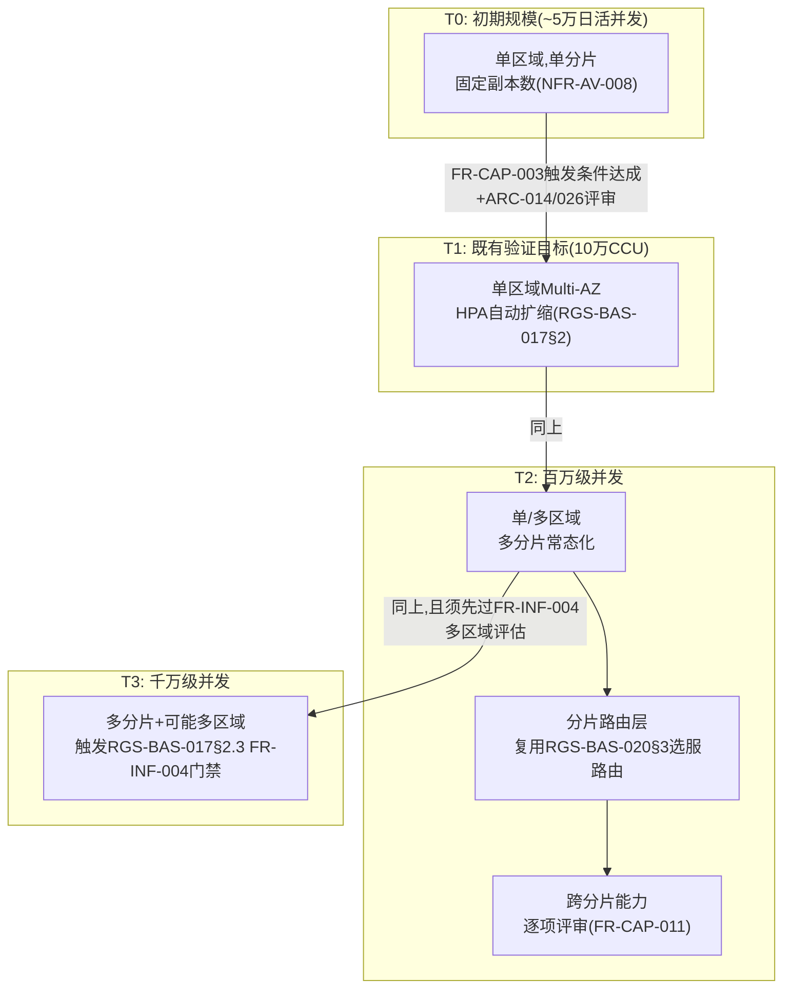

# 基本设计书（基本設計書 / Basic Design Document）

**弹性容量规划与超大规模并发架构 Elastic Capacity Planning & Massive-Scale Concurrency Architecture**

| 项目 | 内容 |
|---|---|
| 文档编号 | RGS-BAS-022 |
| 版本 | 0.1 |
| 父文档 | RGS-REQ-025 需求定义书（ARC-040） |
| 制定日 | 2026-08-16 |
| 最终更新日 | 2026-08-16 |
| 制定者 | 架构师 |
| 保密级别 | 内部限定（Internal Use Only） |
| 适用许可 | Apache-2.0（本仓库） |

---

## 修订历史（改訂履歴 / Revision History）

| 版本 | 修订日 | 修订者 | 审批者 | 修订内容 | 影响需求ID |
|---|---|---|---|---|---|
| 0.1 | 2026-08-16 | 架构师 | — | 初版制定。将RGS-REQ-025§10 ARC-040展开为容量分级的基础设施拓扑差异、分片路由与跨分片能力的组件设计、弹性预留与预测性预热的实现机制、分片粒度插件操作设计 | 全部 |

## 审批栏（承認欄 / Approval）

| 角色 | 姓名 | 审批日 | 备注 |
|---|---|---|---|
| 制定（起草） | 架构师 | 2026-08-16 | — |
| 评审（技术） | | | T2/T3拓扑图与既有单区域Multi-AZ拓扑（RGS-BAS-017§2）的衔接是否清晰 |
| 审批（负责人） | | | 本文档的基准化 |

---

## 目录

1. [前言](#1-前言)
2. [容量分级的基础设施拓扑](#2-容量分级的基础设施拓扑)
3. [分片路由与跨分片能力设计](#3-分片路由与跨分片能力设计)
4. [弹性预留与预测性预热设计](#4-弹性预留与预测性预热设计)
5. [分片粒度插件操作设计](#5-分片粒度插件操作设计)
6. [标准化检查清单](#6-标准化检查清单)
7. [追溯性](#7-追溯性)

---

# 1. 前言

本文档细化RGS-REQ-025定义的ARC-040。全部组件**依附**既有限界上下文与既有基础设施运行，分片机制复用ARC-018挂载/退场判定原则，**不新建**独立于既有治理框架之外的容量管理体系。

---

# 2. 容量分级的基础设施拓扑

## 2.1 各级拓扑差异（对RGS-REQ-001§10.1整体架构图、RGS-BAS-017§2单区域拓扑的容量维度补充）



## 2.2 各级新增组件一览

| 级别 | 新增组件 | 复用的既有组件 |
|---|---|---|
| T0 | 无（既有RGS-BAS-001既定架构） | 全部 |
| T1 | HPA配置（RGS-BAS-002§2.2.2既有） | 单区域Multi-AZ（RGS-BAS-017§2，若T1阶段已实施） |
| T2 | 分片路由层（若RGS-REQ-023尚未实施选服路由则一并落地）、跨分片能力清单（§3.2） | RGS-BAS-020§3`RealmDirectoryService`/`RealmRouter` |
| T3 | 多区域拓扑（触发时另走RGS-BAS-017§2.3评审，非本文档预先设计） | 同T2 |

> **不预建声明**：本表T2/T3列出的组件是**演进路径上会用到的组件**，**不是**本文档要求当前阶段立即构建的组件。是否、何时构建由FR-CAP-002/003既定的分级门禁决定。

---

# 3. 分片路由与跨分片能力设计

## 3.1 分片路由（复用而非重建）

分片（逻辑服）的路由**完全复用**RGS-BAS-020§3已有设计：`RealmDirectoryService`维护分片列表与状态，`RealmRouter`在鉴权成功后路由玩家至其主分片。本文档**不新增**路由组件，仅在T2阶段起，`RealmDirectoryService`维护的分片数量**从"运营手动决定的少量逻辑服"扩展为"容量驱动的常态化多分片"**——这是运营语义的扩展，**不是**技术组件的变更。

## 3.2 跨分片能力清单（FR-CAP-011落地）

| 跨分片能力 | 是否允许 | 实现方式 |
|---|---|---|
| 全局排行榜（跨分片聚合） | 允许（须逐项评审） | 复用RGS-REQ-017 ARC-031派生视图思想：各分片的排行数据异步聚合至一个只读的"全局视图"，聚合**允许**滞后，**不得**要求分片间同步查询 |
| 账号身份跨分片唯一（第三方登录/实名认证） | 必须允许（身份是分片无关的） | 复用RGS-REQ-021既有`AccountIdentityLink`/`ComplianceProfile`设计，这两张表**不**按分片拆分，是全局唯一的（同FR-CAP-011"账号身份系统可能需要跨分片唯一"的既定认可） |
| 玩家实时状态（位置/战斗/背包） | **不允许** | 严格限定在单分片内，这是分片存在的核心意义（NFR-CAP-003） |
| 客服工单/支付对账（RGS-REQ-019） | 允许（不涉及实时状态） | 复用既有AD限界上下文数据模型，工单本身按账号而非分片查询，天然跨分片 |

> **判定规则**：一项能力"是否允许跨分片"的判断标准是——该能力是**玩家实时游玩状态**（不允许）还是**账号/治理层面的元数据**（允许，因其访问频率低、一致性要求可异步满足）。新增跨分片能力诉求**必须**先按此规则判定，而非逐案自由裁量。

---

# 4. 弹性预留与预测性预热设计

## 4.1 弹性预留的实现（FR-CAP-020落地）

| 组件 | 设计要点 |
|---|---|
| 预留容量的定义 | 在HPA既定的目标副本数之上，额外维持一个**已启动、已就绪、但不承接常态流量**的副本余量（如既定目标的20%，TBD-CAP-001具体系数），复用K8s既有`readinessGate`机制控制其是否进入流量池 |
| 与HPA的关系 | 预留余量**不是**HPA的扩容目标，而是HPA扩容生效前的**过渡缓冲**——冲击发生时，预留余量**立即**可用（无需等待Pod启动耗时），HPA随后逐步补足新的目标副本数，预留余量的角色随后交还 |
| 场景运行时节点的预留 | 有状态的场景Actor节点，预留体现为"已就绪但未分配场景实例的空闲节点"，新场景优先调度至预留节点，而非等待新节点启动完成 |

## 4.2 预测性预热（FR-CAP-021落地）

```
运营计划已知流量突增事件（活动开启/版本更新公告）
  → 通过GM后台既有运维工单（RGS-BAS-003§10）登记预热计划：事件时间、预期负载倍数
  → 预热调度器（依附既有GM后台AD限界上下文）在事件前既定提前量（NFR-CAP-002）触发扩容
  → 扩容目标复用既有HPA配置的手动覆盖能力（临时提高目标副本数下限），事件结束后既定时间自动回落
  → 全程留痕（复用RGS-BAS-003§7审计设计），便于事后核对预热效果与实际负载的偏差
```

---

# 5. 分片粒度插件操作设计

## 5.1 插件注册表的分片维度扩展（FR-CAP-031落地）

在RGS-BAS-005§3既有插件注册表基础上，新增字段：

| 字段 | 说明 |
|---|---|
| `target_shards` | 该插件启用/生效的目标分片集合，为空表示全部分片（向后兼容T0/T1单分片场景） |

插件的启用/禁用/回滚操作（复用RGS-BAS-005§4既有生命周期状态机）**新增**分片维度参数，同一插件可在不同分片处于不同状态（如某活动插件仅在3个分片开放测试，其余分片保持禁用）。

## 5.2 跨节点同步机制的规模验证（FR-CAP-032落地）

RGS-BAS-005§5既有的插件状态跨节点同步机制，在T2+规模下**必须**经专项负载试验验证其同步时延仍满足既有目标（AC-CAP-004）。若验证不通过，**必须**先修订同步机制（如引入分片内广播替代全局广播，缩小同步范围至`target_shards`声明的分片集合）方可在T2+规模启用该插件能力，**不得**默认既有机制自然适用于更大规模。

---

# 6. 标准化检查清单

## 6.1 容量级别演进前检查清单

- [ ] 当前级别的触发条件（FR-CAP-003）已达成并有监控数据支撑
- [ ] 演进已经过ARC-014/026同等评审，OLU预算已核算（NFR-CAP-005）
- [ ] 若涉及T2→T3，已确认是否触发RGS-BAS-017§2.3多区域评估门禁

## 6.2 上线前检查清单

- [ ] 弹性预留容量的负载试验通过（120%瞬时冲击不触发降级）
- [ ] 预测性预热的登记与触发流程验证通过
- [ ] 分片粒度插件操作验证通过，跨节点同步在目标规模下时延达标
- [ ] 跨分片能力清单（§3.2）中"不允许"类能力未出现违规实现

## 6.3 代码评审检查清单

- [ ] 新增跨分片能力已按§3.2判定规则评审，非随意批准
- [ ] 场景运行时扩容代码未尝试拆分单场景模拟到多机（违反ARC-001）

---

# 7. 追溯性

| 需求ID | 本设计书章节 |
|---|---|
| ARC-040、FR-CAP-001〜003 | §2 |
| FR-CAP-010〜013 | §3 |
| FR-CAP-020〜024 | §4 |
| FR-CAP-030〜032 | §5 |
| NFR-CAP-001〜005 | §4、§5.2 |
| AC-CAP-001〜004 | §6.1、§6.2 |
| TBD-CAP-001〜002、RSK-CAP-001〜003 | §4.1、§6.1、§3.2 |

---

> 本文档与RGS-REQ-025（弹性容量规划与超大规模并发架构 需求定义书）配套使用。
