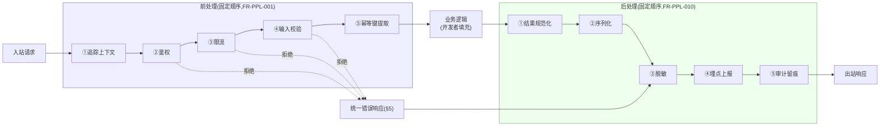

# 基本设计书（基本設計書 / Basic Design Document）

**请求处理链标准化——前处理/后处理管道 Standardized Request Processing Pipeline: Pre/Post-processing**

| 项目 | 内容 |
|---|---|
| 文档编号 | RGS-BAS-023 |
| 版本 | 0.1 |
| 父文档 | RGS-REQ-026 需求定义书（ARC-041） |
| 制定日 | 2026-08-16 |
| 最终更新日 | 2026-08-16 |
| 制定者 | 架构师 |
| 保密级别 | 内部限定（Internal Use Only） |
| 适用许可 | Apache-2.0（本仓库） |

---

## 修订历史（改訂履歴 / Revision History）

| 版本 | 修订日 | 修订者 | 审批者 | 修订内容 | 影响需求ID |
|---|---|---|---|---|---|
| 0.1 | 2026-08-16 | 架构师 | — | 初版制定。将RGS-REQ-026§9 ARC-041展开为管道分层组件设计、各阶段字段级规范、脚手架集成方式、统一错误响应结构 | 全部 |

## 审批栏（承認欄 / Approval）

| 角色 | 姓名 | 审批日 | 备注 |
|---|---|---|---|
| 制定（起草） | 架构师 | 2026-08-16 | — |
| 评审（技术） | | | 管道实现是否与既有Rust服务框架（如`tower`生态）自然契合，而非另起一套机制 |
| 审批（负责人） | | | 本文档的基准化 |

---

## 目录

1. [前言](#1-前言)
2. [管道分层设计](#2-管道分层设计)
3. [前处理各阶段字段级规范](#3-前处理各阶段字段级规范)
4. [后处理各阶段字段级规范](#4-后处理各阶段字段级规范)
5. [统一错误响应结构](#5-统一错误响应结构)
6. [脚手架集成](#6-脚手架集成)
7. [标准化检查清单](#7-标准化检查清单)
8. [追溯性](#8-追溯性)

---

# 1. 前言

本文档细化RGS-REQ-026定义的ARC-041。管道以既有Rust服务框架的中间件/拦截器机制（如`tower::Service`/`Layer`组合模式）实现，**不新建**独立的网关层或代理组件——管道运行在**服务进程内**，是业务逻辑前后的函数调用链，而非新的网络跳数。

---

# 2. 管道分层设计

## 2.1 管道结构图

> 前处理任一阶段拒绝时（FR-PPL-003短路），直接进入后处理的脱敏/埋点/审计（错误也须脱敏、埋点、必要时审计），**不**执行业务逻辑。

## 2.2 各阶段职责与复用对象

| 阶段 | 组件职责 | 复用的既有能力 |
|---|---|---|
| 前处理①追踪上下文 | 提取/生成`trace_id`，绑定至请求上下文 | RGS-BAS-004既定Span命名与`trace_id`规范 |
| 前处理②鉴权 | 验证令牌，解析出`account_id`/`session_epoch` | FR-GW-002既有令牌验证 |
| 前处理③限流 | 按连接/账号/IP多层限流 | NFR-SEC-008既有速率限制标准 |
| 前处理④输入校验 | 反序列化+结构化Schema校验 | 复用IDL/协议既有字段定义，附加校验注解（§3.2） |
| 前处理⑤幂等键提取 | 若为确定请求路径，提取幂等键 | FR-EC-003既有幂等语义 |
| 后处理①结果规范化 | 业务返回值/异常统一映射为内部结果类型 | 无新依赖，纯管道内部转换 |
| 后处理②序列化 | 按协议既定格式序列化响应体 | RGS-REQ-012/BAS-008既有协议编解码层 |
| 后处理③脱敏 | 对日志/埋点数据脱敏（**不影响**实际返回给客户端的响应体，脱敏仅作用于留存的日志/指标） | RGS-BAS-004§5既定脱敏规则 |
| 后处理④埋点上报 | 上报黄金指标 | RGS-BAS-004§3既定指标目录 |
| 后处理⑤审计留痕 | 依操作性质判定是否留痕 | RGS-BAS-003§7既定审计设计、§8高危操作判定 |

---

# 3. 前处理各阶段字段级规范

## 3.1 请求上下文结构（贯穿管道全程）

`RequestContext`（逻辑字段，管道各阶段读写）：

| 字段 | 写入阶段 | 说明 |
|---|---|---|
| `trace_id` / `span_id` | ①追踪上下文 | 复用RGS-BAS-004既定字段 |
| `account_id` / `session_epoch` | ②鉴权 | 鉴权失败则后续字段为空，`RequestContext`标记`authenticated=false` |
| `rate_limit_decision` | ③限流 | 记录限流判定依据（供后处理④埋点分析限流触发率） |
| `idempotency_key` | ⑤幂等键提取 | 仅确定请求路径方法填充，非确定请求路径此字段为空且**不**阻塞管道 |

## 3.2 输入校验规则的声明式定义（FR-PPL-002落地）

校验规则**附加**在既有协议IDL字段定义之上（如`.proto`字段的自定义`option`扩展，或既有Schema定义的注解），示例校验维度：

| 校验维度 | 示例 |
|---|---|
| 必填性 | 字段是否允许缺省 |
| 值域 | 数值范围、字符串长度、枚举取值集合 |
| 格式 | 正则模式（如复用既有日志脱敏模式库的字段格式定义，避免重复定义） |

校验失败时，管道**必须**在④阶段短路，生成的错误响应（§5）**必须**指明具体是哪个字段、哪条规则未通过，供客户端开发调试。

---

# 4. 后处理各阶段字段级规范

## 4.1 脱敏与序列化的顺序（FR-PPL-012落地的具体化）

**顺序不可颠倒**：②序列化（面向客户端的响应体，**不**脱敏，客户端本就有权查看自己请求的完整合法数据）先于③脱敏（面向日志/埋点的留存数据，**须**脱敏）执行，二者是**并行的两条支线**而非串行依赖——序列化产出返回给客户端的响应，脱敏产出写入日志/指标系统的记录，两者共享同一份业务结果但**目的地不同、处理规则不同**，实现上**不得**将脱敏后的数据误用作返回给客户端的响应体（那会导致客户端收到脱敏后的错误数据）。

## 4.2 审计留痕的判定表（FR-PPL-013落地）

| 判定输入 | 判定结果 |
|---|---|
| 操作方法属RGS-BAS-003§8既定高危操作分类 | 强制留痕，且走既定二次确认流程（若适用） |
| 操作方法属确定请求路径（FR-EC-003类） | 强制留痕（价值发放类操作） |
| 其余（如普通只读查询） | 不留痕（避免审计数据无谓膨胀，同RGS-BAS-004采样精神） |

判定逻辑**集中**在管道后处理⑤阶段的一个判定组件，**不得**由各业务方法自行决定是否调用审计接口——同ARC-036"合规判定集中化"的同类思想在审计场景的应用。

---

# 5. 统一错误响应结构

`StandardErrorResponse`（逻辑字段，FR-PPL-011落地）：

| 字段 | 类型 | 说明 |
|---|---|---|
| `error_code` | string，枚举 | 机器可读错误类别（如`AUTH_FAILED`／`RATE_LIMITED`／`VALIDATION_FAILED`／`INTERNAL_ERROR`） |
| `message` | string | 面向人类的描述，**不得**包含未脱敏的敏感信息 |
| `field_errors` | 可选，数组 | 输入校验失败时，逐字段的具体错误（§3.2产出） |
| `trace_id` | string | 供客户端上报问题时关联具体请求，供GM后台/开发者按`trace_id`检索完整链路 |

三引擎客户端SDK（RGS-REQ-012/BAS-008）**应当**基于此统一结构实现通用错误处理逻辑，而非各自解析不同服务的不同错误格式。

---

# 6. 脚手架集成

## 6.1 挂载脚手架生成内容扩展（FR-PPL-020落地，扩展RGS-BAS-002既有脚手架）

新增服务通过既有挂载脚手架（RGS-BAS-002）生成时，**额外**生成：

| 生成物 | 内容 |
|---|---|
| 管道骨架代码 | §2结构图对应的中间件/拦截器链默认配置，前处理⑤阶段与后处理⑤阶段默认接线完成 |
| 校验规则模板 | 依所选协议IDL自动生成§3.2校验注解的模板占位 |
| 统一错误响应类型 | 直接引用§5既定结构，**不得**由开发者重新定义 |

## 6.2 定制点（FR-PPL-021落地）

**仅**允许在以下位置定制，其余管道阶段代码**不对开发者暴露修改入口**（脚手架生成的骨架代码位置固定）：

| 可定制点 | 定制方式 |
|---|---|
| 业务逻辑本体 | 开发者填充的唯一必需部分 |
| ④输入校验规则 | 按方法定义具体校验规则（不可关闭校验本身，只能定义规则内容） |
| ⑤幂等键提取（是否适用） | 声明该方法是否属确定请求路径 |
| 限流策略参数 | 可配置具体阈值，**不可**关闭限流阶段本身（FR-PPL-022） |

---

# 7. 标准化检查清单

## 7.1 上线前检查清单

- [ ] 脚手架生成的新服务骨架包含完整前处理/后处理管道，业务逻辑之外无需手动接入横切代码
- [ ] 鉴权/限流/脱敏/审计四项阶段的代码路径经静态分析确认无旁路
- [ ] 统一错误响应结构在新增服务中100%符合规范
- [ ] 管道自身开销负载试验测量，符合既定阈值（TBD-PPL-001确定后回填）

## 7.2 代码评审检查清单

- [ ] 定制点（§6.2）之外的管道代码未被修改
- [ ] 新增校验规则/限流参数定制未误触及关闭鉴权/脱敏/审计阶段本身

---

# 8. 追溯性

| 需求ID | 本设计书章节 |
|---|---|
| ARC-041、FR-PPL-001〜004 | §2、§3 |
| FR-PPL-010〜013 | §2、§4、§5 |
| FR-PPL-020〜023 | §6 |
| NFR-PPL-001〜004 | §2.1、§6.2 |
| AC-PPL-001〜004 | §7.1 |
| TBD-PPL-001〜002、RSK-PPL-001〜002 | §7.1、§6.2 |

---

> 本文档与RGS-REQ-026（请求处理链标准化——前处理/后处理管道 需求定义书）配套使用。
