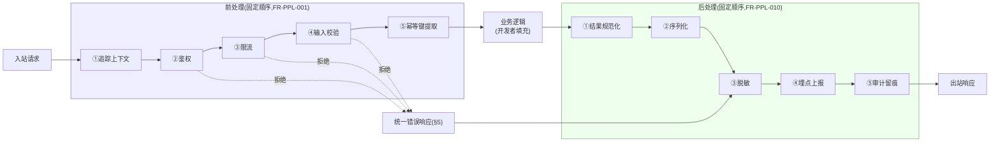

# 基本设计书（基本設計書 / Basic Design Document）

**请求处理链标准化——前处理/后处理管道 Standardized Request Processing Pipeline: Pre/Post-processing**

| 项目 | 内容 |
|---|---|
| 文档编号 | RGS-BAS-023 |
| 版本 | 0.3 |
| 父文档 | RGS-REQ-026 需求定义书（ARC-041） |
| 制定日 | 2026-08-16 |
| 最终更新日 | 2026-09-01 |
| 制定者 | 架构师 |
| 保密级别 | 内部限定（Internal Use Only） |
| 适用许可 | Apache-2.0（本仓库） |

---

## 修订历史（改訂履歴 / Revision History）

| 版本 | 修订日 | 修订者 | 审批者 | 修订内容 | 影响需求ID |
|---|---|---|---|---|---|
| 0.1 | 2026-08-16 | 架构师 | — | 初版制定。将RGS-REQ-026§9 ARC-041展开为管道分层组件设计、各阶段字段级规范、脚手架集成方式、统一错误响应结构 | 全部 |
| 0.2 | 2026-08-17 | 架构师 | — | 补齐设计缺口（详细设计阶段前的完备性核对发现）：新增§6.3既有服务迁移策略（FR-PPL-023此前无设计，只在需求侧声明"应当逐步迁移"）；新增§6.4前处理阶段同步依赖边界判定规则（FR-PPL-004） | FR-PPL-004、FR-PPL-023 |
| 0.3 | 2026-09-01 | 架构师 (Mavis 接手 agent per DEC-008) | 架构师(Mavis 接手 agent per DEC-008) | 落实"各BAS文档功能章节加log设计且区分debug/release级"总要求（per Ulysses 2026-09-01 15:52 JST 决策，4 拍板选项：全部 36 个BAS / 详尽版5列表 / 派worker并行 / BAS-004同步升级，参考 RGS-BAS-001 v1.5 §4.8.3 模板 + RGS-BAS-003 v0.3 样板 + RGS-BAS-004 v0.3 §4.2/§4.3/§4.4/§4.5/§5.1/§6.2）：§2.1/§2.2/§3.1/§3.2/§4.1/§4.2/§5/§6.1/§6.2/§6.3/§6.4/§7.1/§7.2 全部 13 个"本功能日志设计"小节新增（请求处理链标准化前后处理管道域特殊考虑全部落地：管道拦截器执行入口/出口 release 必出、中间件加载/卸载 release 必出、限流命中/熔断/降级 warn! 强制全采样 NFR-AV、管道异常/重试 error! 强制全采样、管道内部状态中间值 debug-only、跨域链路追踪 trace_id 串联 release 必出）；字段名前缀统一为 `pipe.*`（与 RGS-BAS-002/003/011 域前缀风格一致）；§8 追溯性新增 AC-PPL-005（debug-only 宏 release 完全剔除）与 AC-PPL-006（每功能 BAS 文档须含本功能 log 章节），与 RGS-BAS-001 v1.5 §4.8.3.4 / RGS-BAS-002 v0.4 §13 / RGS-BAS-003 v0.3 §13 / RGS-BAS-004 v0.3 §12 形成统一规范 | §2.1、§2.2、§3.1、§3.2、§4.1、§4.2、§5、§6.1、§6.2、§6.3、§6.4、§7.1、§7.2、§8 |

## 审批栏（承認欄 / Approval）

| 角色 | 姓名 | 审批日 | 备注 |
|---|---|---|---|
| 制定（起草） | 架构师 | 2026-08-16 | — |
| 评审（技术） | | | 管道实现是否与既有Rust服务框架（如`tower`生态）自然契合，而非另起一套机制 |
| 审批（负责人） | | | 本文档的基准化 |

---

## 目录

1. [前言](#1-前言)
2. [管道分层设计](#2-管道分层设计)
3. [前处理各阶段字段级规范](#3-前处理各阶段字段级规范)
4. [后处理各阶段字段级规范](#4-后处理各阶段字段级规范)
5. [统一错误响应结构](#5-统一错误响应结构)
6. [脚手架集成](#6-脚手架集成)
7. [标准化检查清单](#7-标准化检查清单)
8. [追溯性](#8-追溯性)

---

# 1. 前言

本文档细化RGS-REQ-026定义的ARC-041。管道以既有Rust服务框架的中间件/拦截器机制（如`tower::Service`/`Layer`组合模式）实现，**不新建**独立的网关层或代理组件——管道运行在**服务进程内**，是业务逻辑前后的函数调用链，而非新的网络跳数。

---

# 2. 管道分层设计

## 2.1 管道结构图

> 前处理任一阶段拒绝时（FR-PPL-003短路），直接进入后处理的脱敏/埋点/审计（错误也须脱敏、埋点、必要时审计），**不**执行业务逻辑。

## 2.1 本功能日志设计

本节覆盖**管道结构执行观察点**——前处理 5 阶段（①追踪上下文／②鉴权／③限流／④输入校验／⑤幂等键提取）入口与出口拦截器执行、后处理 5 阶段（①结果规范化／②序列化／③脱敏／④埋点上报／⑤审计留痕）入口与出口、跨阶段短路事件（FR-PPL-003 鉴权/限流/校验拒绝路径）、管道自身健康度（hot path 延迟分布）、跨域链路追踪 `trace_id` 串联——这些是**结构性入口/出口审计**，是排查"哪个阶段耗时/失败/短路"的事实依据。沿用 BAS-001 v1.5 §4.8.3 模板 + BAS-004 v0.3 §4.3 字段规范 + §4.4 debug-only 守护 + §5.1 脱敏 + §6.2 强制全采样。

| 字段名（field） | 触发条件（trigger） | 频率估算（frequency） | 采样策略（sampling） | 脱敏与成本（redact & cost） |
|---|---|---|---|---|
| `pipe.preprocess.stage_entered` | 前处理任一阶段入口（①〜⑤）拦截器触发 | 业务请求 1:1（典型 100-1000 req/s） | release 必出（100% 强制全采样，per BAS-004 v0.3 §6.2 入口审计白名单） | 含`stage_id`（1-5）/`trace_id`/`api.method`；约 200B/条 |
| `pipe.preprocess.stage_exited` | 前处理任一阶段出口（成功完成或短路返回） | 业务请求 1:1 | release 必出（100% 强制全采样） | 含`stage_id`/`status`（ok/shortcut/error）/`duration_us`/`trace_id`；约 240B/条 |
| `pipe.postprocess.stage_entered` | 后处理任一阶段入口（①〜⑤）拦截器触发 | 业务请求 1:1 | release 必出（100% 强制全采样） | 含`stage_id`（1-5）/`trace_id`；约 200B/条 |
| `pipe.postprocess.stage_exited` | 后处理任一阶段出口 | 业务请求 1:1 | release 必出（100% 强制全采样） | 含`stage_id`/`status`/`duration_us`/`trace_id`；约 240B/条 |
| `pipe.shortcut.executed` | 跨阶段短路（FR-PPL-003：鉴权/限流/校验拒绝→直接进入后处理③脱敏/④埋点/⑤审计） | 业务错误 1:1 | release 必出（100% 强制全采样） | 含`shortcut_from_stage`/`shortcut_reason`/`trace_id`；约 200B/条 |
| `pipe.trace.span_opened` | 跨域链路追踪 Span 开启（与 OpenTelemetry / RGS-BAS-004 §3 Span 体系一致） | 业务请求 1:1 | release 必出（100% 强制全采样，跨域串联关键） | 含`trace_id`/`span_id`/`parent_span_id`；约 200B/条 |
| `pipe.trace.span_closed` | 跨域链路追踪 Span 关闭（含状态/耗时） | 业务请求 1:1 | release 必出（100% 强制全采样） | 含`trace_id`/`span_id`/`duration_ms`/`status`；约 200B/条 |
| `pipe.health.pipeline_overhead_ms` | 管道自身开销（非业务逻辑耗时）P50/P95/P99 周期性记录 | 周期性（如每 30s） | release 必出（100% 强制全采样，TBD-PPL-001 阈值监控依据） | 含`p50_ms`/`p95_ms`/`p99_ms`/`sample_count`；约 200B/条 |
| `pipe.debug.stage_intermediate_state` | 前/后处理各阶段中间值（如鉴权后 `RequestContext` 完整字段、限流决策详情） | 业务请求 1:1 | **debug-only**（`#[cfg(debug_assertions)]` 守护，release build 完全剔除） | 约 1-3KB/条（release 剔除），含 `account_id` 等敏感字段也**仅** debug 出现 |
| `pipe.debug.interceptor_chain_dump` | 拦截器链完整 dump（顺序、各阶段耗时、配置哈希） | 0.1/h | **debug-only**（`#[cfg(debug_assertions)]` 守护） | 约 2-5KB/条（release 剔除） |
| `pipe.debug.mermaid_structure_snapshot` | 当前服务的管道结构图渲染快照（与 §2.1 mermaid 对照，验证脚手架生成与设计一致） | 0.1/h | **debug-only**（`#[cfg(debug_assertions)]` 守护） | 约 1-2KB/条（release 剔除） |

**debug-only 守护要点**（落实 BAS-004 v0.3 §4.3）：
- `pipe.preprocess.stage_entered` / `pipe.preprocess.stage_exited` / `pipe.postprocess.stage_entered` / `pipe.postprocess.stage_exited` 是**入口/出口审计**——release 必出 + §6.2 强制全采样，便于 NFR-OP-008 "一次排查 15 分钟以内" SLA 保障（缺这些日志无法定位"卡在哪个阶段"）
- `pipe.debug.stage_intermediate_state` 含 `account_id` 等敏感字段——必须 `#[cfg(debug_assertions)]` 守护，**严禁**让 RUST_LOG=debug 误开时泄漏到生产日志通道
- `pipe.debug.interceptor_chain_dump` 与 `pipe.debug.mermaid_structure_snapshot` 是**脚手架生成对照**——验证 §6.1 脚手架生成物与 §2.1 设计一致，但**不**进入生产运行

## 2.2 各阶段职责与复用对象

| 阶段 | 组件职责 | 复用的既有能力 |
|---|---|---|
| 前处理①追踪上下文 | 提取/生成`trace_id`，绑定至请求上下文 | RGS-BAS-004既定Span命名与`trace_id`规范 |
| 前处理②鉴权 | 验证令牌，解析出`account_id`/`session_epoch` | FR-GW-002既有令牌验证 |
| 前处理③限流 | 按连接/账号/IP多层限流 | NFR-SEC-008既有速率限制标准 |
| 前处理④输入校验 | 反序列化+结构化Schema校验 | 复用IDL/协议既有字段定义，附加校验注解（§3.2） |
| 前处理⑤幂等键提取 | 若为确定请求路径，提取幂等键 | FR-EC-003既有幂等语义 |
| 后处理①结果规范化 | 业务返回值/异常统一映射为内部结果类型 | 无新依赖，纯管道内部转换 |
| 后处理②序列化 | 按协议既定格式序列化响应体 | RGS-REQ-012/BAS-008既有协议编解码层 |
| 后处理③脱敏 | 对日志/埋点数据脱敏（**不影响**实际返回给客户端的响应体，脱敏仅作用于留存的日志/指标） | RGS-BAS-004§5既定脱敏规则 |
| 后处理④埋点上报 | 上报黄金指标 | RGS-BAS-004§3既定指标目录 |
| 后处理⑤审计留痕 | 依操作性质判定是否留痕 | RGS-BAS-003§7既定审计设计、§8高危操作判定 |

## 2.2 本功能日志设计

本节覆盖**组件复用关系的运行时观察点**——10 个阶段的复用对象（FR-GW-002 令牌验证 / NFR-SEC-008 限流 / FR-EC-003 幂等 / BAS-008 序列化 / BAS-004 脱敏与埋点 / BAS-003 审计）的调用统计与失败可观测性，确保"既不重复造轮子"也不因单点不可用拖垮整个管道（NFR-AV-009 降级路径）。沿用 BAS-001 v1.5 §4.8.3 模板 + BAS-004 v0.3 §4.3/§4.4/§5.1/§6.2。

| 字段名（field） | 触发条件（trigger） | 频率估算（frequency） | 采样策略（sampling） | 脱敏与成本（redact & cost） |
|---|---|---|---|---|
| `pipe.reuse.auth_verified` | 鉴权阶段成功调用 FR-GW-002 令牌验证 | 业务请求 1:1 | release 必出（100% 强制全采样） | 含`account_id`（已脱敏：hash 化）/`session_epoch`；约 200B/条 |
| `pipe.reuse.ratelimit_checked` | 限流阶段成功调用 NFR-SEC-008 限流状态读取 | 业务请求 1:1 | release 必出（100% 强制全采样） | 含`limit_kind`（per_conn/per_acct/per_ip）/`current_count`；约 240B/条 |
| `pipe.reuse.idempotency_extracted` | 幂等键提取阶段成功调用 FR-EC-003 既有幂等语义 | 仅确定请求路径方法 | release 必出（100% 强制全采样） | 含`idempotency_key`（已脱敏：SHA256 截断）/`request_path`；约 240B/条 |
| `pipe.reuse.serialize_loaded` | 序列化阶段成功调用 BAS-008 协议编解码层 | 业务请求 1:1 | release 必出（100% 强制全采样） | 含`protocol`（grpc/quic/https）/`codec_version`；约 200B/条 |
| `pipe.reuse.metrics_reported` | 埋点上报阶段成功调用 BAS-004 §3 指标目录 | 业务请求 1:1 | release 必出（100% 强制全采样） | 含`metric_name`/`value`；约 200B/条 |
| `pipe.reuse.audit_written` | 审计留痕阶段成功调用 BAS-003 §7 审计写层 | 仅高危/确定请求路径方法 | release 必出（100% 强制全采样，per §6.2 强制全采集范围） | 含`audit_kind`/`actor_id`；约 240B/条 |
| `pipe.reuse.component_unavailable` | 复用组件不可用（FR-GW-002/NFR-SEC-008/FR-EC-003/BAS-008/BAS-004/BAS-003 任意一个），触发 NFR-AV-009 降级路径 | 极少 | release 必出（100% 强制全采样，per §6.2） | 含`component_name`/`last_success_at`/`retry_count`；约 280B/条 |
| `pipe.reuse.fallback_engaged` | 复用组件不可用时降级路径触发（如限流组件不可用→本地内存令牌桶） | 极少 | release 必出（100% 强制全采样） | 含`fallback_kind`/`affected_stage`；约 240B/条 |
| `pipe.debug.reuse_dependency_graph` | 复用依赖图完整 dump（哪些阶段调用了哪些既有组件） | 0.1/h | **debug-only**（`#[cfg(debug_assertions)]` 守护，release 完全剔除） | 约 1-3KB/条（release 剔除） |
| `pipe.debug.component_version_dump` | 复用组件版本清单（FR-GW-002/NFR-SEC-008/FR-EC-003/BAS-008/BAS-004/BAS-003 各自的版本） | 0.1/h | **debug-only**（`#[cfg(debug_assertions)]` 守护） | 约 500B/条（release 剔除） |

**debug-only 守护要点**：
- `pipe.reuse.component_unavailable` 是**降级触发**——`error!` 级别（**非** `warn!`），release 必出 + §6.2 强制全采样，便于 SRE 立即识别"既有组件级联故障"
- `pipe.reuse.fallback_engaged` 是**降级已生效**——`warn!` 级别，release 必出 + §6.2 强制全采样（区别于"组件已恢复"与"组件持续不可用"两个状态）

---

# 3. 前处理各阶段字段级规范

## 3.1 请求上下文结构（贯穿管道全程）

`RequestContext`（逻辑字段，管道各阶段读写）：

| 字段 | 写入阶段 | 说明 |
|---|---|---|
| `trace_id` / `span_id` | ①追踪上下文 | 复用RGS-BAS-004既定字段 |
| `account_id` / `session_epoch` | ②鉴权 | 鉴权失败则后续字段为空，`RequestContext`标记`authenticated=false` |
| `rate_limit_decision` | ③限流 | 记录限流判定依据（供后处理④埋点分析限流触发率） |
| `idempotency_key` | ⑤幂等键提取 | 仅确定请求路径方法填充，非确定请求路径此字段为空且**不**阻塞管道 |

## 3.1 本功能日志设计

本节覆盖**RequestContext 字段读写观察点**——`trace_id`/`span_id` 绑定（①追踪上下文）、`account_id`/`session_epoch` 鉴权后填充（②鉴权）、`rate_limit_decision` 限流决策落点（③限流）、`idempotency_key` 幂等键提取（⑤幂等键提取）、`authenticated=false` 标记（鉴权失败短路语义）。`RequestContext` 是贯穿管道全程的核心数据结构，**所有阶段的入口/出口都必须能关联到 `trace_id`**，便于跨域链路串联与故障定位。沿用 BAS-001 v1.5 §4.8.3 模板 + BAS-004 v0.3 §4.3/§4.4/§5.1/§6.2。

| 字段名（field） | 触发条件（trigger） | 频率估算（frequency） | 采样策略（sampling） | 脱敏与成本（redact & cost） |
|---|---|---|---|---|
| `pipe.context.trace_id_bound` | `trace_id`/`span_id` 已绑定至 `RequestContext`（①追踪上下文阶段出口） | 业务请求 1:1 | release 必出（100% 强制全采样，跨域链路追踪关键） | 含`trace_id`/`span_id`/`source`（inbound_header/generated）；约 200B/条 |
| `pipe.context.account_id_filled` | `account_id`/`session_epoch` 已填充至 `RequestContext`（②鉴权成功） | 鉴权成功请求 1:1 | release 必出（100% 强制全采样） | 含`account_id`（已脱敏：hash 化）/`session_epoch`；约 200B/条 |
| `pipe.context.authenticated_false` | 鉴权失败，`RequestContext` 标记 `authenticated=false`（FR-PPL-002 短路语义触发前） | 鉴权失败 1:1 | release 必出（100% 强制全采样，per §6.2 业务关键事件） | 含`failure_reason`（token_invalid/signature_mismatch/expired）/`trace_id`；约 240B/条 |
| `pipe.context.ratelimit_decision_recorded` | `rate_limit_decision` 已写入 `RequestContext`（③限流阶段出口） | 业务请求 1:1 | release 必出（100% 强制全采样） | 含`decision`（allow/deny）/`limit_kind`/`current_count`/`threshold`；约 240B/条 |
| `pipe.context.idempotency_key_extracted` | `idempotency_key` 已提取（⑤幂等键提取成功） | 仅确定请求路径方法 | release 必出（100% 强制全采样） | 含`idempotency_key`（已脱敏：SHA256 截断）/`request_path`；约 240B/条 |
| `pipe.context.idempotency_key_skipped` | 非确定请求路径方法，幂等键字段为空且**不**阻塞管道 | 仅非确定请求路径方法 | release 必出（100% 强制全采样） | 含`request_path`/`reason`（non_deterministic）；约 200B/条 |
| `pipe.context.field_written_outside_designated_stage` | `RequestContext` 字段被非指定阶段写入（如业务逻辑阶段写 `account_id`）——**违反** §3.1 "字段写入阶段" 约束 | 极少（实现反模式检测） | release 必出（100% 强制全采样，per §6.2 强制全采集范围） | 含`field_name`/`actual_writer_stage`/`expected_writer_stage`；约 240B/条 |
| `pipe.debug.context_full_snapshot` | `RequestContext` 全字段完整 dump | 业务请求 1:1 | **debug-only**（`#[cfg(debug_assertions)]` 守护，release 完全剔除） | 约 1-3KB/条（release 剔除），含 `account_id` 等敏感字段也**仅** debug 出现 |

**debug-only 守护要点**：
- `pipe.context.authenticated_false` 是**鉴权失败的入口事件**——release 必出 + §6.2 强制全采样（安全审计需求），便于追溯"哪些 token/账号在尝试"以及"是否在暴力破解"
- `pipe.context.field_written_outside_designated_stage` 是**实现反模式检测**——`error!` 级别（**非** `warn!`），便于在早期发现"业务逻辑绕过鉴权直接写 `account_id`"等违规
- `pipe.debug.context_full_snapshot` 含 `account_id` 等敏感字段——必须 `#[cfg(debug_assertions)]` 守护，**严禁**让 RUST_LOG=debug 误开时泄漏到生产日志通道

## 3.2 输入校验规则的声明式定义（FR-PPL-002落地）

校验规则**附加**在既有协议IDL字段定义之上（如`.proto`字段的自定义`option`扩展，或既有Schema定义的注解），示例校验维度：

| 校验维度 | 示例 |
|---|---|
| 必填性 | 字段是否允许缺省 |
| 值域 | 数值范围、字符串长度、枚举取值集合 |
| 格式 | 正则模式（如复用既有日志脱敏模式库的字段格式定义，避免重复定义） |

校验失败时，管道**必须**在④阶段短路，生成的错误响应（§5）**必须**指明具体是哪个字段、哪条规则未通过，供客户端开发调试。

## 3.2 本功能日志设计

本节覆盖**输入校验阶段观察点**——校验规则声明的注册（启动期）、Schema 校验执行、校验失败字段级错误产出（FR-PPL-003 短路语义，错误响应**必须**含具体是哪个字段/哪条规则未通过）、§3.2 三类校验维度（必填性/值域/格式）的命中分布。沿用 BAS-001 v1.5 §4.8.3 模板 + BAS-004 v0.3 §4.3/§4.4/§5.1/§6.2。

| 字段名（field） | 触发条件（trigger） | 频率估算（frequency） | 采样策略（sampling） | 脱敏与成本（redact & cost） |
|---|---|---|---|---|
| `pipe.validation.rule_registered` | 校验规则注册（启动期，含启动期内全部 IDL 字段的校验注解汇总） | 部署期 0.1/h | release 必出（100% 强制全采样） | 含`registered_count`/`method_count`；约 200B/条 |
| `pipe.validation.passed` | 校验通过（全部字段全部规则通过） | 业务请求 1:1 | release 必出（100% 强制全采样） | 含`method_name`/`rule_count_checked`；约 200B/条 |
| `pipe.validation.failed.required` | 必填性校验失败 | 业务错误 1:1 | release 必出（100% 强制全采样） | 含`method_name`/`field_name`/`field_path`；约 240B/条 |
| `pipe.validation.failed.range` | 值域校验失败（数值范围/字符串长度/枚举取值） | 业务错误 1:1 | release 必出（100% 强制全采样） | 含`method_name`/`field_name`/`attempted_value_kind`（not_actual_value，避免泄漏）/`expected_range`；约 280B/条 |
| `pipe.validation.failed.format` | 格式校验失败（正则模式，如邮箱/手机号/UUID） | 业务错误 1:1 | release 必出（100% 强制全采样） | 含`method_name`/`field_name`/`format_pattern_name`（如"email"）；约 240B/条 |
| `pipe.validation.failed.field_error` | 校验失败（任意维度，字段级错误聚合） | 业务错误 1:1 | release 必出（100% 强制全采样） | 含`method_name`/`failed_field_count`/`error_code`（VALIDATION_FAILED）；约 240B/条 |
| `pipe.validation.shortcut.executed` | 校验失败短路进错误处理（FR-PPL-003，**不**执行业务逻辑，直接进入后处理③脱敏/④埋点/⑤审计） | 业务错误 1:1 | release 必出（100% 强制全采样） | 含`shortcut_from_stage`（4_input_validation）/`failed_rule_kind`；约 200B/条 |
| `pipe.validation.cross_context_db_query_attempted` | 校验阶段**违反** §6.4 "不得跨上下文数据库直接查询"约束（如"校验道具 ID 是否存在"类需求违规前移） | 极少（实现反模式） | release 必出（100% 强制全采样，per §6.2） | 含`attempted_table`/`attempted_context`；约 280B/条 |
| `pipe.debug.validation_request_payload` | 请求 payload 完整 dump（含字段名+字节数，不含字段值） | 业务请求 1:1 | **debug-only**（`#[cfg(debug_assertions)]` 守护，release 完全剔除） | 约 1-5KB/条（release 剔除） |
| `pipe.debug.validation_rule_dump` | 校验规则定义 dump（每条规则的 pattern/expected_range/enum_set） | 0.1/h | **debug-only**（`#[cfg(debug_assertions)]` 守护） | 约 1-3KB/条（release 剔除） |

**debug-only 守护要点**：
- `pipe.validation.failed.range` 中 `attempted_value_kind` **不**含实际值（避免泄漏原始输入，攻击者可能利用值差异反推规则细节）——`expected_range` 是允许的范围描述（如 `"0-100"`），便于客户端开发调试
- `pipe.validation.cross_context_db_query_attempted` 是**实现反模式检测**——`error!` 级别（**非** `warn!`），便于在 CI 阶段或运行期立即发现"校验阶段违规前移"
- `pipe.debug.validation_request_payload` **不**含字段值，**仅**含 schema/字节数——但仍守护以避免 RUST_LOG=debug 误开时泄漏请求结构

---

# 4. 后处理各阶段字段级规范

## 4.1 脱敏与序列化的顺序（FR-PPL-012落地的具体化）

**顺序不可颠倒**：②序列化（面向客户端的响应体，**不**脱敏，客户端本就有权查看自己请求的完整合法数据）先于③脱敏（面向日志/埋点的留存数据，**须**脱敏）执行，二者是**并行的两条支线**而非串行依赖——序列化产出返回给客户端的响应，脱敏产出写入日志/指标系统的记录，两者共享同一份业务结果但**目的地不同、处理规则不同**，实现上**不得**将脱敏后的数据误用作返回给客户端的响应体（那会导致客户端收到脱敏后的错误数据）。

## 4.1 本功能日志设计

本节覆盖**序列化/脱敏并行支线观察点**——②序列化阶段（面向客户端响应体，**不**脱敏，客户端本就有权查看自己请求的完整合法数据）、③脱敏阶段（面向日志/埋点留存数据，**须**脱敏）二者的执行顺序与目的地分发。**顺序不可颠倒**是 FR-PPL-012 落地的关键约束，本节重点观察"是否将脱敏数据误用作响应体"（实现反模式）。沿用 BAS-001 v1.5 §4.8.3 模板 + BAS-004 v0.3 §4.3/§4.4/§5.1/§6.2。

| 字段名（field） | 触发条件（trigger） | 频率估算（frequency） | 采样策略（sampling） | 脱敏与成本（redact & cost） |
|---|---|---|---|---|
| `pipe.serialize.executed` | 序列化阶段执行（后处理②） | 业务请求 1:1 | release 必出（100% 强制全采样） | 含`protocol`（grpc/quic/https）/`codec_version`；约 200B/条 |
| `pipe.serialize.protocol_loaded` | 协议编解码层加载（BAS-008 复用） | 业务请求 1:1 | release 必出（100% 强制全采样） | 含`protocol`/`codec_version`/`load_duration_us`；约 240B/条 |
| `pipe.serialize.response_emitted` | 响应体下发客户端（序列化产物已发出） | 业务请求 1:1 | release 必出（100% 强制全采样） | 含`response_size_bytes`/`protocol`；约 200B/条 |
| `pipe.desensitize.executed` | 脱敏阶段执行（后处理③） | 业务请求 1:1 | release 必出（100% 强制全采样） | 含`rule_count_applied`/`target`（log/metric/audit）；约 200B/条 |
| `pipe.desensitize.rule_applied` | 脱敏规则命中（`*token*`/`*password*` 黑名单自动丢弃） | 取决于敏感字段命中频率 | release 必出（100% 强制全采样） | 含`field_pattern`（如 `*token*`）/`action`（drop/redact）；约 200B/条 |
| `pipe.desensitize.field_redacted` | 字段脱敏（具体字段名 + 脱敏方式，如 SHA256 截断/mask） | 取决于敏感字段命中频率 | release 必出（100% 强制全采样） | 含`field_name`/`redact_method`（sha256_truncate/mask_partial/drop）；约 200B/条 |
| `pipe.desensitize.target_log_only` | 脱敏**仅**作用于日志/埋点（**不**作用于响应体）——FR-PPL-012 顺序约束验证 | 业务请求 1:1 | release 必出（100% 强制全采样） | 含`applied_to`（log/metric/audit）/`not_applied_to`（response_body）；约 200B/条 |
| `pipe.desensitize.misuse_detected` | 脱敏数据误用作响应体（实现反模式检测，**违反** §4.1 顺序不可颠倒约束） | 极少（实现反模式） | release 必出（100% 强制全采样，per §6.2 强制全采集范围） | 含`detection_method`（e2e_test/audit_log_diff）/`affected_method`；约 280B/条 |
| `pipe.debug.serialized_response_body` | 序列化响应体完整 dump（仅 debug Profile 排查用） | 业务请求 1:1 | **debug-only**（`#[cfg(debug_assertions)]` 守护，release 完全剔除） | 约 1-10KB/条（release 剔除） |
| `pipe.debug.redacted_log_record` | 脱敏后日志记录 dump（用于验证脱敏规则覆盖度） | 周期性（如每 1000 条抽样 1 条） | **debug-only**（`#[cfg(debug_assertions)]` 守护） | 约 500B-2KB/条（release 剔除） |
| `pipe.debug.desensitize_rule_coverage_report` | 脱敏规则覆盖率报告（哪些字段被命中/哪些字段未触发脱敏） | 0.1/h | **debug-only**（`#[cfg(debug_assertions)]` 守护） | 约 1-3KB/条（release 剔除） |

**debug-only 守护要点**：
- `pipe.serialize.response_emitted` 含 `response_size_bytes` 但**不**含响应体内容——避免 RUST_LOG=info 误开时泄漏业务数据
- `pipe.desensitize.misuse_detected` 是**实现反模式检测**——`error!` 级别（**非** `warn!`），便于在运行期立即发现"脱敏数据被错用作响应体"（会导致客户端收到脱敏后的错误数据）
- `pipe.debug.serialized_response_body` 含完整响应体——必须 `#[cfg(debug_assertions)]` 守护，**严禁**让 RUST_LOG=debug 误开时泄漏到生产日志通道（响应体可能含玩家敏感数据）

## 4.2 审计留痕的判定表（FR-PPL-013落地）

| 判定输入 | 判定结果 |
|---|---|
| 操作方法属RGS-BAS-003§8既定高危操作分类 | 强制留痕，且走既定二次确认流程（若适用） |
| 操作方法属确定请求路径（FR-EC-003类） | 强制留痕（价值发放类操作） |
| 其余（如普通只读查询） | 不留痕（避免审计数据无谓膨胀，同RGS-BAS-004采样精神） |

判定逻辑**集中**在管道后处理⑤阶段的一个判定组件，**不得**由各业务方法自行决定是否调用审计接口——同ARC-036"合规判定集中化"的同类思想在审计场景的应用。

## 4.2 本功能日志设计

本节覆盖**审计判定与写层观察点**——操作方法是否属高危操作（BAS-003 §8 判定）、是否属确定请求路径（FR-EC-003 类）、审计写层执行、**审计写失败触发 P0 告警（禁止降级通过）**（沿用 BAS-003 v0.3 §7.1 关键设计纪律：审计写失败触发 P0 告警 + 禁止降级通过）。沿用 BAS-001 v1.5 §4.8.3 模板 + BAS-004 v0.3 §4.3/§4.4/§5.1/§6.2 + BAS-003 v0.3 §7.1。

| 字段名（field） | 触发条件（trigger） | 频率估算（frequency） | 采样策略（sampling） | 脱敏与成本（redact & cost） |
|---|---|---|---|---|
| `pipe.audit.decision.high_risk` | 操作属高危操作分类（BAS-003 §8 既定），强制留痕 + 二次确认 | 高危操作 1:1 | release 必出（100% 强制全采样，per §6.2 强制全采集范围） | 含`method_name`/`risk_category`/`actor_id`；约 240B/条 |
| `pipe.audit.decision.deterministic` | 操作属确定请求路径（FR-EC-003 类，价值发放类操作），强制留痕 | 确定请求路径 1:1 | release 必出（100% 强制全采样） | 含`method_name`/`idempotency_key`（已脱敏：SHA256 截断）/`actor_id`；约 280B/条 |
| `pipe.audit.decision.readonly_skip` | 普通只读查询，不留痕（避免审计数据无谓膨胀） | 普通只读查询 1:1 | release 必出（100% 强制全采样） | 含`method_name`/`skip_reason`（readonly_query）；约 200B/条 |
| `pipe.audit.decision.misroute` | 业务方法自行调用审计接口——**违反** §4.2 "判定逻辑集中"约束（实现反模式检测） | 极少（实现反模式） | release 必出（100% 强制全采样，per §6.2） | 含`method_name`/`detection_source`（static_analysis/runtime_trace）；约 280B/条 |
| `pipe.audit.write.executed` | 审计写层执行（BAS-003 §7 复用） | 仅高危/确定请求路径方法 | release 必出（100% 强制全采样） | 含`audit_id`/`actor_id`/`operation_summary`；约 240B/条 |
| `pipe.audit.write.failed` | 审计写失败（**必须** P0 告警，**禁止**降级通过——审计写失败即代表合规不可用，必须人工介入） | 极少 | release 必出（100% 强制全采样，per §6.2 强制全采集范围） | 含`failure_reason`（db_unavailable/timeout/constraint_violation）/`retry_count`；约 280B/条 |
| `pipe.audit.dual_confirm.required` | 高危操作二次确认要求（BAS-003 §8 既定，若适用） | 高危操作 1:1 | release 必出（100% 强制全采样） | 含`method_name`/`confirmation_window_seconds`；约 200B/条 |
| `pipe.audit.dual_confirm.completed` | 二次确认完成 | 高危操作 1:1 | release 必出（100% 强制全采样） | 含`confirmer_id`/`confirmation_latency_ms`；约 240B/条 |
| `pipe.audit.dual_confirm.timeout` | 二次确认超时（高危操作在确认窗口内未完成） | 极少 | release 必出（100% 强制全采样，per §6.2 强制全采集范围） | 含`method_name`/`window_seconds`/`expired_at`；约 240B/条 |
| `pipe.audit.write.degrade_attempt_detected` | 审计写失败试图降级通过（**违反** BAS-003 §7.1 关键设计纪律：禁止降级通过，告警） | 极少（实现反模式） | release 必出（100% 强制全采样，per §6.2） | 含`attempted_degrade_kind`（skip/async_retry/return_success）；约 280B/条 |
| `pipe.debug.audit_full_record` | 审计记录完整 dump（含操作前后状态 diff） | 仅高危/确定请求路径方法 | **debug-only**（`#[cfg(debug_assertions)]` 守护，release 完全剔除） | 约 1-10KB/条（release 剔除），含操作前后状态等敏感数据 |

**debug-only 守护要点**：
- `pipe.audit.write.failed` 是**P0 安全/合规事件**——`error!` 级别（**非** `warn!`），release 必出 + §6.2 强制全采样，便于 SRE/P0 告警链路立即捕获（沿用 BAS-003 v0.3 §7.1 关键设计纪律）
- `pipe.audit.write.degrade_attempt_detected` 是**实现反模式检测**——`error!` 级别（**非** `warn!`），与 `pipe.audit.write.failed` 一样触发 P0 告警
- `pipe.audit.decision.misroute` 是**实现反模式检测**——`error!` 级别，便于在运行期或 CI 阶段发现"业务方法绕过集中判定自行调用审计接口"
- `pipe.debug.audit_full_record` 含操作前后状态 diff（可能含玩家敏感数据）——必须 `#[cfg(debug_assertions)]` 守护，**严禁**让 RUST_LOG=debug 误开时泄漏到生产日志通道

---

# 5. 统一错误响应结构

`StandardErrorResponse`（逻辑字段，FR-PPL-011落地）：

| 字段 | 类型 | 说明 |
|---|---|---|
| `error_code` | string，枚举 | 机器可读错误类别（如`AUTH_FAILED`／`RATE_LIMITED`／`VALIDATION_FAILED`／`INTERNAL_ERROR`） |
| `message` | string | 面向人类的描述，**不得**包含未脱敏的敏感信息 |
| `field_errors` | 可选，数组 | 输入校验失败时，逐字段的具体错误（§3.2产出） |
| `trace_id` | string | 供客户端上报问题时关联具体请求，供GM后台/开发者按`trace_id`检索完整链路 |

三引擎客户端SDK（RGS-REQ-012/BAS-008）**应当**基于此统一结构实现通用错误处理逻辑，而非各自解析不同服务的不同错误格式。

## 5. 本功能日志设计

本节覆盖**StandardErrorResponse 错误响应观察点**——`error_code` 枚举分类（`AUTH_FAILED`/`RATE_LIMITED`/`VALIDATION_FAILED`/`INTERNAL_ERROR`）、`message` 客户端可见描述（含未脱敏敏感信息检测）、`field_errors` 字段级错误（§3.2 产出）、`trace_id` 关联检索链路——错误响应是面向客户端的**最后一公里**，必须可追溯至 §2.1 `pipe.trace.*` 跨域链路追踪。沿用 BAS-001 v1.5 §4.8.3 模板 + BAS-001 v1.5 §9.2.1 错误响应日志设计 + BAS-004 v0.3 §4.3/§4.4/§5.1/§6.2。

| 字段名（field） | 触发条件（trigger） | 频率估算（frequency） | 采样策略（sampling） | 脱敏与成本（redact & cost） |
|---|---|---|---|---|
| `pipe.error_response.emitted` | 错误响应下发（任意 `error_code`） | 业务错误 1:1 | release 必出（100% 强制全采样，per §6.2 强制全采集范围） | 含`error_code`/`trace_id`/`method_name`；约 200B/条 |
| `pipe.error_response.auth_failed` | 鉴权失败错误响应（`AUTH_FAILED`，§3.1 `authenticated=false` 联动） | 鉴权失败 1:1 | release 必出（100% 强制全采样，安全审计） | 含`error_code`（AUTH_FAILED）/`failure_reason`/`trace_id`；约 240B/条 |
| `pipe.error_response.rate_limited` | 限流命中错误响应（`RATE_LIMITED`） | 限流拒绝 1:1 | release 必出（100% 强制全采样） | 含`error_code`（RATE_LIMITED）/`limit_kind`/`retry_after_seconds`/`trace_id`；约 280B/条 |
| `pipe.error_response.validation_failed` | 校验失败错误响应（`VALIDATION_FAILED`，含 `field_errors` 数组） | 校验失败 1:1 | release 必出（100% 强制全采样） | 含`error_code`（VALIDATION_FAILED）/`field_errors_count`/`failed_field_names`；约 280B/条 |
| `pipe.error_response.internal_error` | 内部错误响应（`INTERNAL_ERROR`，**不**暴露 panic message / DB endpoint） | 极少 | release 必出（100% 强制全采样，per §6.2 强制全采集范围） | 含`error_code`（INTERNAL_ERROR）/`client_visible`（false）/`trace_id`；约 200B/条 |
| `pipe.error_response.message_redacted` | 错误描述 `message` 脱敏通过（未含未脱敏敏感信息，**满足** §5 "不得包含未脱敏敏感信息" 约束） | 业务错误 1:1 | release 必出（100% 强制全采样） | 含`message_length`/`redaction_pattern_checked`；约 200B/条 |
| `pipe.error_response.message_redaction_violation` | 错误描述 `message` 含未脱敏敏感信息（**违反** §5 约束，实现反模式检测） | 极少（实现反模式） | release 必出（100% 强制全采样，per §6.2 强制全采集范围） | 含`detected_pattern_kind`（token/password/email/phone）/`violation_field`；约 280B/条 |
| `pipe.error_response.trace_id_included` | `trace_id` 已写入错误响应（客户端可关联检索完整链路，**满足** §5 "供客户端上报问题时关联具体请求" 约束） | 业务错误 1:1 | release 必出（100% 强制全采样） | 含`trace_id_present`（true/false）/`trace_id_format`（uuidv7）；约 200B/条 |
| `pipe.error_response.field_errors_shape_violation` | `field_errors` 数组结构不合规（**违反** §3.2 "指明具体是哪个字段、哪条规则未通过" 约束） | 极少 | release 必出（100% 强制全采样，per §6.2 强制全采集范围） | 含`expected_shape`/`actual_shape`；约 240B/条 |
| `pipe.debug.error_response_body_dump` | 错误响应体完整 dump（仅 debug Profile 排查用） | 业务错误 1:1 | **debug-only**（`#[cfg(debug_assertions)]` 守护，release 完全剔除） | 约 1-10KB/条（release 剔除） |
| `pipe.debug.field_errors_detail` | `field_errors` 全字段级错误 dump（每条字段错误的 rule_kind/expected_value/attempted_kind） | 校验失败 1:1 | **debug-only**（`#[cfg(debug_assertions)]` 守护） | 约 500B-2KB/条（release 剔除） |

**debug-only 守护要点**：
- `pipe.error_response.internal_error` 永远 `client_visible=false`——`message` 字段**不得**暴露 panic message / DB endpoint / 内部地址（沿用 BAS-001 v1.5 §9.2.1 `error.client_visible=false` 强制规则）
- `pipe.error_response.message_redaction_violation` 是**实现反模式检测**——`error!` 级别（**非** `warn!`），便于在运行期立即发现"错误描述含敏感信息"（可能攻击者利用错误信息差反推系统状态）
- `pipe.error_response.trace_id_included` 是**客户端关联检索的入口事件**——release 必出 + §6.2 强制全采样，便于客户端上报问题与 GM 检索链路
- `pipe.debug.error_response_body_dump` 含完整错误响应体——必须 `#[cfg(debug_assertions)]` 守护，**严禁**让 RUST_LOG=debug 误开时泄漏到生产日志通道

---

# 6. 脚手架集成

## 6.1 挂载脚手架生成内容扩展（FR-PPL-020落地，扩展RGS-BAS-002既有脚手架）

新增服务通过既有挂载脚手架（RGS-BAS-002）生成时，**额外**生成：

| 生成物 | 内容 |
|---|---|
| 管道骨架代码 | §2结构图对应的中间件/拦截器链默认配置，前处理⑤阶段与后处理⑤阶段默认接线完成 |
| 校验规则模板 | 依所选协议IDL自动生成§3.2校验注解的模板占位 |
| 统一错误响应类型 | 直接引用§5既定结构，**不得**由开发者重新定义 |

## 6.1 本功能日志设计

本节覆盖**脚手架生成内容扩展观察点**——管道骨架代码生成、校验规则模板生成、统一错误响应类型生成——这些是"脚手架落地后新增服务自诞生起即接入标准管道"（§6.3 FR-PPL-023）的物理保证。沿用 BAS-001 v1.5 §4.8.3 模板 + BAS-002 v0.4 挂载架构日志约定 + BAS-004 v0.3 §4.3/§4.4/§5.1/§6.2。

| 字段名（field） | 触发条件（trigger） | 频率估算（frequency） | 采样策略（sampling） | 脱敏与成本（redact & cost） |
|---|---|---|---|---|
| `pipe.scaffold.service_generated` | 新服务骨架代码生成（脚手架落地后新增服务，§6.3 FR-PPL-023 强制接入） | 部署期 0.1/h | release 必出（100% 强制全采样，per §6.2） | 含`service_name`/`generated_files_count`/`scaffold_version`；约 240B/条 |
| `pipe.scaffold.pipeline_default_wired` | 管道前处理⑤/后处理⑤默认接线完成（脚手架生成物校验） | 部署期 0.1/h | release 必出（100% 强制全采样） | 含`preprocess_stages`/`postprocess_stages`/`wiring_status`；约 200B/条 |
| `pipe.scaffold.validation_template_emitted` | 校验规则模板占位生成（依所选协议 IDL 自动生成§3.2 校验注解模板） | 部署期 0.1/h | release 必出（100% 强制全采样） | 含`protocol`（grpc/quic/https）/`field_count`/`rule_count`；约 240B/条 |
| `pipe.scaffold.error_response_type_referenced` | 统一错误响应类型引用（**满足** §5 "直接引用§5既定结构，**不得**由开发者重新定义" 约束） | 部署期 0.1/h | release 必出（100% 强制全采样） | 含`type_name`（StandardErrorResponse）/`import_path`；约 200B/条 |
| `pipe.scaffold.idl_protocol_loaded` | 所选协议 IDL 自动加载（脚手架生成期间） | 部署期 0.1/h | release 必出（100% 强制全采样） | 含`protocol`/`idl_version`/`load_duration_ms`；约 240B/条 |
| `pipe.scaffold.error_response_type_redefined` | 开发者重新定义 `StandardErrorResponse`（**违反** §6.1 约束，实现反模式检测） | 极少（实现反模式） | release 必出（100% 强制全采样，per §6.2 强制全采集范围） | 含`defined_in_file`/`line_number`/`conflict_kind`；约 280B/条 |
| `pipe.scaffold.generation_failed` | 脚手架生成失败（含具体生成物/错误） | 极少 | release 必出（100% 强制全采样，per §6.2 强制全采集范围） | 含`failed_artifact`/`error_kind`/`stack_trace_hash`；约 280B/条 |
| `pipe.scaffold.pipeline_default_config_mismatch` | 脚手架生成的管道默认配置与 §2.1 设计不一致（CI 阶段静态检查） | 极少 | release 必出（100% 强制全采样） | 含`expected_config`/`actual_config`/`diff_summary`；约 280B/条 |
| `pipe.debug.scaffold_generated_files` | 脚手架生成文件清单 dump（每文件的相对路径 + 字节数） | 部署期 0.1/h | **debug-only**（`#[cfg(debug_assertions)]` 守护，release 完全剔除） | 约 1-3KB/条（release 剔除） |
| `pipe.debug.pipeline_default_config` | 管道默认配置 dump（每阶段的配置项及参数） | 部署期 0.1/h | **debug-only**（`#[cfg(debug_assertions)]` 守护） | 约 500B-2KB/条（release 剔除） |
| `pipe.debug.idl_protocol_ast_dump` | IDL 协议 AST dump（用于验证脚手架生成与 IDL 一致） | 0.1/h | **debug-only**（`#[cfg(debug_assertions)]` 守护） | 约 1-5KB/条（release 剔除） |

**debug-only 守护要点**：
- `pipe.scaffold.error_response_type_redefined` 是**实现反模式检测**——`error!` 级别（**非** `warn!`），便于 CI 阶段或运行期立即发现"开发者重新定义统一错误响应类型"（会导致 §5 "三引擎客户端 SDK 基于此统一结构实现通用错误处理逻辑" 失效）
- `pipe.scaffold.pipeline_default_config_mismatch` 是**脚手架生成质量门**——`error!` 级别（**非** `warn!`），CI 阶段失败即阻断发布，避免"脚手架生成了但与设计不一致"
- `pipe.debug.scaffold_generated_files` **不**含文件内容，**仅**含路径 + 字节数——但仍守护以避免 RUST_LOG=debug 误开时泄漏生成文件结构

## 6.2 定制点（FR-PPL-021落地）

**仅**允许在以下位置定制，其余管道阶段代码**不对开发者暴露修改入口**（脚手架生成的骨架代码位置固定）：

| 可定制点 | 定制方式 |
|---|---|
| 业务逻辑本体 | 开发者填充的唯一必需部分 |
| ④输入校验规则 | 按方法定义具体校验规则（不可关闭校验本身，只能定义规则内容） |
| ⑤幂等键提取（是否适用） | 声明该方法是否属确定请求路径 |
| 限流策略参数 | 可配置具体阈值，**不可**关闭限流阶段本身（FR-PPL-022） |

## 6.2 本功能日志设计

本节覆盖**脚手架定制点边界观察点**——业务逻辑本体填充、④输入校验规则定制、⑤幂等键提取声明、限流策略参数配置的可定制点是否越界（不可关闭鉴权/限流/审计阶段本身，FR-PPL-022 强制）。沿用 BAS-001 v1.5 §4.8.3 模板 + BAS-002 v0.4 定制点约束 + BAS-004 v0.3 §4.3/§4.4/§5.1/§6.2。

| 字段名（field） | 触发条件（trigger） | 频率估算（frequency） | 采样策略（sampling） | 脱敏与成本（redact & cost） |
|---|---|---|---|---|
| `pipe.customize.business_logic_filled` | 业务逻辑本体填充（开发者填充的唯一必需部分） | 部署期 0.1/h | release 必出（100% 强制全采样） | 含`method_name`/`line_count`/`commit_sha`；约 200B/条 |
| `pipe.customize.validation_rule_defined` | 输入校验规则定义（**仅**可定义规则内容，**不可**关闭校验本身——§6.2 约束） | 部署期 0.1/h | release 必出（100% 强制全采样） | 含`method_name`/`rule_count_added`；约 200B/条 |
| `pipe.customize.idempotency_declared` | 幂等键提取声明（声明方法是否属确定请求路径） | 部署期 0.1/h | release 必出（100% 强制全采样） | 含`method_name`/`is_deterministic`（true/false）/`idempotency_key_extractor_kind`；约 240B/条 |
| `pipe.customize.ratelimit_threshold_set` | 限流阈值配置（**仅**可配置参数，**不可**关闭限流阶段本身——FR-PPL-022 强制） | 部署期 0.1/h | release 必出（100% 强制全采样） | 含`method_name`/`threshold_kind`（per_conn/per_acct/per_ip）/`threshold_value`；约 240B/条 |
| `pipe.customize.out_of_scope_change.detected` | 试图修改定制点（§6.2）外代码——脚手架骨架代码位置固定，**不得**修改（CI 阶段静态检查） | 极少（实现反模式） | release 必出（100% 强制全采样，per §6.2 强制全采集范围） | 含`file_path`/`line_number`/`expected_unchanged`；约 280B/条 |
| `pipe.customize.ratelimit_disabled_attempt` | 试图关闭限流阶段（**违反** FR-PPL-022 强制，CI 阶段静态检查） | 极少（实现反模式） | release 必出（100% 强制全采样，per §6.2） | 含`file_path`/`line_number`/`attempted_disable_kind`；约 280B/条 |
| `pipe.customize.audit_disabled_attempt` | 试图关闭审计阶段（**违反** §6.2 约束——不可关闭阶段本身，CI 阶段静态检查） | 极少（实现反模式） | release 必出（100% 强制全采样，per §6.2） | 含`file_path`/`line_number`/`attempted_disable_kind`；约 280B/条 |
| `pipe.customize.desensitize_disabled_attempt` | 试图关闭脱敏阶段（**违反** §6.2 约束，CI 阶段静态检查） | 极少（实现反模式） | release 必出（100% 强制全采样，per §6.2） | 含`file_path`/`line_number`/`attempted_disable_kind`；约 280B/条 |
| `pipe.customize.auth_disabled_attempt` | 试图关闭鉴权阶段（**违反** §6.2 约束，CI 阶段静态检查） | 极少（实现反模式） | release 必出（100% 强制全采样，per §6.2） | 含`file_path`/`line_number`/`attempted_disable_kind`；约 280B/条 |
| `pipe.debug.customize_diff_vs_scaffold` | 与脚手架生成代码的 diff（用于评审"哪些位置被开发者修改"） | 部署期 0.1/h | **debug-only**（`#[cfg(debug_assertions)]` 守护，release 完全剔除） | 约 1-10KB/条（release 剔除） |
| `pipe.debug.customize_thresholds_full` | 定制阈值完整清单 dump（每方法每阶段的阈值参数） | 0.1/h | **debug-only**（`#[cfg(debug_assertions)]` 守护） | 约 1-3KB/条（release 剔除） |

**debug-only 守护要点**：
- `pipe.customize.out_of_scope_change.detected` / `pipe.customize.ratelimit_disabled_attempt` / `pipe.customize.audit_disabled_attempt` / `pipe.customize.desensitize_disabled_attempt` / `pipe.customize.auth_disabled_attempt` 均为**实现反模式检测**——`error!` 级别（**非** `warn!`），CI 阶段失败即阻断发布，沿用 §7.2 "代码评审检查清单" 的检测路径
- `pipe.debug.customize_diff_vs_scaffold` 含完整 diff——必须 `#[cfg(debug_assertions)]` 守护，**严禁**让 RUST_LOG=debug 误开时泄漏代码差异（可能含业务逻辑关键路径）

## 6.3 既有服务迁移策略（FR-PPL-023落地，补齐设计缺口）

管道并非要求既有服务（挂载脚手架落地前已存在的服务）一次性接入，区分两种情形：

| 服务类别 | 接入要求 | 时机 |
|---|---|---|
| 新增服务（诞生于挂载脚手架落地后） | **必须**自诞生起即使用标准管道，**不得**允许手工拼接横切关注点代码 | 立即（§6.1脚手架生成时自动接入） |
| 既有服务（脚手架落地前已存在） | **应当**逐步迁移，不要求一次性完成 | 按各限界上下文自身的排期，无统一强制截止时间 |

迁移优先级参考顺序（非强制，供各限界上下文负责人排期时参考）：①客户端反馈错误处理不一致最集中的服务②鉴权/限流实现与新标准差异最大、维护成本最高的服务③其余服务。迁移过程中**允许**新旧管道短期并存（同一集群内部分服务用新管道、部分未迁移），但**不得**允许"半迁移"状态——单个服务要么完全采用标准管道，要么完全维持原实现，**不得**只接入部分阶段（如只接入鉴权、未接入脱敏），避免产生介于两者之间、难以判定实际行为的中间态。

## 6.3 本功能日志设计

本节覆盖**既有服务迁移观察点**——新增服务（脚手架落地后）自诞生起即接入管道、既有服务（脚手架落地前）逐步迁移期、迁移过程中的"半迁移"状态检测（**禁止**介于新旧之间，§6.3 强约束）。沿用 BAS-001 v1.5 §4.8.3 模板 + BAS-004 v0.3 §4.3/§4.4/§5.1/§6.2。

| 字段名（field） | 触发条件（trigger） | 频率估算（frequency） | 采样策略（sampling） | 脱敏与成本（redact & cost） |
|---|---|---|---|---|
| `pipe.migration.new_service_auto_attached` | 新增服务自诞生起即接入标准管道（§6.3 强约束） | 部署期 0.1/h | release 必出（100% 强制全采样） | 含`service_name`/`created_at`/`pipeline_attached`（true）；约 240B/条 |
| `pipe.migration.legacy_service_migrated` | 既有服务完全迁移至新管道（全部阶段已接入） | 偶发（迁移项目里程碑） | release 必出（100% 强制全采样，per §6.2 强制全采集范围） | 含`service_name`/`migration_started_at`/`migration_completed_at`/`duration_days`；约 280B/条 |
| `pipe.migration.legacy_service_pending` | 既有服务尚未开始迁移（统计观察） | 周期性（如每周） | release 必出（100% 强制全采样） | 含`service_name`/`pending_since`/`priority_band`（1/2/3）；约 200B/条 |
| `pipe.migration.partial_state_detected` | **半迁移状态检测**——只接入部分阶段（如只接鉴权未接脱敏）——**违反** §6.3 "不得允许半迁移状态" 强约束 | 极少（实现反模式） | release 必出（100% 强制全采样，per §6.2 强制全采集范围） | 含`service_name`/`attached_stages`/`missing_stages`；约 280B/条 |
| `pipe.migration.priority_1_identified` | 客户端反馈错误处理不一致最集中的服务（迁移优先级①） | 偶发 | release 必出（100% 强制全采样） | 含`service_name`/`client_feedback_count_30d`；约 240B/条 |
| `pipe.migration.priority_2_identified` | 鉴权/限流实现差异最大的服务（迁移优先级②） | 偶发 | release 必出（100% 强制全采样） | 含`service_name`/`auth_diff_score`/`ratelimit_diff_score`；约 240B/条 |
| `pipe.migration.completed_verified` | 迁移完成度验证（全部阶段已接入，与 §2.1 管道结构图对照） | 偶发 | release 必出（100% 强制全采样） | 含`service_name`/`verification_result`（passed/failed）/`missing_stages`；约 240B/条 |
| `pipe.migration.rollback_executed` | 服务从新管道回滚至原实现（应急） | 极少 | release 必出（100% 强制全采样，per §6.2 强制全采集范围） | 含`service_name`/`rollback_reason`/`rollback_duration_ms`；约 280B/条 |
| `pipe.migration.coexistence_window_active` | 同一集群内新旧管道短期并存（§6.3 允许但需观察） | 偶发 | release 必出（100% 强制全采样） | 含`cluster_name`/`new_pipeline_services`/`legacy_services`；约 240B/条 |
| `pipe.debug.legacy_pipeline_diff` | 既有服务原实现与新管道 diff（用于迁移评估） | 偶发 | **debug-only**（`#[cfg(debug_assertions)]` 守护，release 完全剔除） | 约 5-50KB/条（release 剔除） |
| `pipe.debug.migration_progress_report` | 迁移进度报告（按服务维度的阶段接入度） | 周期性（如每月） | **debug-only**（`#[cfg(debug_assertions)]` 守护） | 约 1-3KB/条（release 剔除） |

**debug-only 守护要点**：
- `pipe.migration.partial_state_detected` 是**§6.3 强约束检测**——`error!` 级别（**非** `warn!`），便于在运行期或 CI 阶段立即发现"半迁移状态"（介于新旧之间、难以判定实际行为的中间态）
- `pipe.migration.rollback_executed` 是**应急事件**——`warn!` 级别（**非** `error!`，属可恢复应急），release 必出 + §6.2 强制全采样，便于 SRE 追溯回滚影响面
- `pipe.debug.legacy_pipeline_diff` 含完整代码 diff——必须 `#[cfg(debug_assertions)]` 守护，**严禁**让 RUST_LOG=debug 误开时泄漏业务逻辑

## 6.4 前处理阶段的同步依赖边界（FR-PPL-004落地，补齐设计缺口）

前处理五个阶段（§2.1①〜⑤）的实现**不得**引入超出既有ARC-006/ARC-007既定边界的新同步依赖：

- 鉴权阶段**仅**校验令牌本身（复用FR-GW-002既有验证逻辑，不查询业务数据库）
- 限流阶段**仅**读取既有限流状态存储（复用NFR-SEC-008既定的速率限制标准，通常为内存/Redis类临时状态，不查询业务数据库）
- 输入校验阶段**仅**做结构化Schema校验（复用协议既有字段定义），**不得**为校验规则新增对其他限界上下文数据库的直接查询（如"校验道具ID是否存在"类需求，若必须校验，**必须**在业务逻辑阶段完成，而非前处理阶段引入跨上下文同步查询）
- 幂等键提取阶段**仅**从请求本体提取字段，不产生任何I/O

**判定规则**：前处理阶段新增任何逻辑前，须先问"是否需要查询本限界上下文之外的数据库/服务"——若是，该逻辑**不属于**前处理管道范畴，**必须**放入业务逻辑本体（受既有ARC-006/007同步调用边界约束），不得以"前处理更早、更省事"为由违规前移。

## 6.4 本功能日志设计

本节覆盖**前处理阶段同步依赖边界观察点**——鉴权阶段不查业务库、限流阶段不查业务库、输入校验阶段不跨上下文查、幂等键提取不产生 I/O 的边界约束验证。沿用 BAS-001 v1.5 §4.8.3 模板 + BAS-004 v0.3 §4.3/§4.4/§5.1/§6.2 + ARC-006/ARC-007 边界约束。

| 字段名（field） | 触发条件（trigger） | 频率估算（frequency） | 采样策略（sampling） | 脱敏与成本（redact & cost） |
|---|---|---|---|---|
| `pipe.dep_boundary.auth_no_biz_db_query` | 鉴权阶段**仅**校验令牌（不查业务库，§6.4 边界约束验证） | 业务请求 1:1 | release 必出（100% 强制全采样，per §6.2 强制全采集范围） | 含`query_count_in_auth_stage`（0）/`queried_table`（无）；约 200B/条 |
| `pipe.dep_boundary.ratelimit_no_biz_db_query` | 限流阶段**仅**读限流状态（不查业务库，§6.4 边界约束验证） | 业务请求 1:1 | release 必出（100% 强制全采样） | 含`storage_kind`（memory/redis）/`query_count_in_ratelimit_stage`（0）；约 200B/条 |
| `pipe.dep_boundary.validation_no_cross_context_query` | 输入校验阶段不跨上下文数据库查询（§6.4 边界约束验证） | 业务请求 1:1 | release 必出（100% 强制全采样） | 含`query_count_in_validation_stage`（0）/`cross_context_query_count`（0）；约 240B/条 |
| `pipe.dep_boundary.idempotency_no_io` | 幂等键提取不产生任何 I/O（§6.4 边界约束验证） | 仅确定请求路径方法 | release 必出（100% 强制全采样） | 含`io_operation_count`（0）/`extraction_kind`（header/body_field）；约 200B/条 |
| `pipe.dep_boundary.violation.cross_biz_db_in_auth` | 鉴权阶段违规前移——试图查业务库（**违反** §6.4 边界，CI 阶段静态检查 + 运行期检测） | 极少（实现反模式） | release 必出（100% 强制全采样，per §6.2） | 含`attempted_table`/`queried_at_line`；约 280B/条 |
| `pipe.dep_boundary.violation.cross_biz_db_in_ratelimit` | 限流阶段违规前移——试图查业务库（**违反** §6.4 边界，CI 阶段静态检查 + 运行期检测） | 极少（实现反模式） | release 必出（100% 强制全采样，per §6.2） | 含`attempted_table`/`queried_at_line`；约 280B/条 |
| `pipe.dep_boundary.violation.cross_context_in_validation` | 校验阶段违规前移——试图跨上下文查询（**违反** §6.4 边界，CI 阶段静态检查 + 运行期检测） | 极少（实现反模式） | release 必出（100% 强制全采样，per §6.2） | 含`attempted_context`/`attempted_query`；约 280B/条 |
| `pipe.dep_boundary.violation.io_in_idempotency` | 幂等键提取违规——产生 I/O（**违反** §6.4 边界，CI 阶段静态检查 + 运行期检测） | 极少（实现反模式） | release 必出（100% 强制全采样，per §6.2） | 含`io_operation_kind`（db_query/http_call/file_io）/`io_target`；约 280B/条 |
| `pipe.debug.preprocess_static_dep_graph` | 前处理静态依赖图 dump（每阶段调用了哪些其他模块/服务） | 部署期 0.1/h | **debug-only**（`#[cfg(debug_assertions)]` 守护，release 完全剔除） | 约 1-3KB/条（release 剔除） |
| `pipe.debug.boundary_violation_stack_trace` | 边界违规的完整调用栈 dump | 极少 | **debug-only**（`#[cfg(debug_assertions)]` 守护） | 约 1-5KB/条（release 剔除） |

**debug-only 守护要点**：
- `pipe.dep_boundary.auth_no_biz_db_query` / `pipe.dep_boundary.ratelimit_no_biz_db_query` / `pipe.dep_boundary.validation_no_cross_context_query` / `pipe.dep_boundary.idempotency_no_io` 是**§6.4 边界约束验证**——release 必出 + §6.2 强制全采样，便于运行期持续验证边界未被破坏
- `pipe.dep_boundary.violation.*` 是**§6.4 边界违规检测**——`error!` 级别（**非** `warn!`），CI 阶段失败即阻断发布，运行期触发即告警
- `pipe.debug.preprocess_static_dep_graph` 含完整依赖图（可能含内部服务名/库名）——必须 `#[cfg(debug_assertions)]` 守护，**严禁**让 RUST_LOG=debug 误开时泄漏内部架构

---

# 7. 标准化检查清单

## 7.1 上线前检查清单

- [ ] 脚手架生成的新服务骨架包含完整前处理/后处理管道，业务逻辑之外无需手动接入横切代码
- [ ] 鉴权/限流/脱敏/审计四项阶段的代码路径经静态分析确认无旁路
- [ ] 统一错误响应结构在新增服务中100%符合规范
- [ ] 管道自身开销负载试验测量，符合既定阈值（TBD-PPL-001确定后回填）

## 7.1 本功能日志设计

本节覆盖**上线前检查清单触发事件**——清单 4 项（脚手架骨架完整 / 鉴权/限流/脱敏/审计四项阶段无旁路 / 错误响应 100% 规范 / 管道自身开销符合阈值）的 CI 阶段验证结果。检查清单本身是"静态验证事件"，日志事件触发于 CI 流水线阶段（部署前/部署期）。沿用 BAS-001 v1.5 §4.8.3 模板 + BAS-004 v0.3 §4.3/§4.4/§5.1/§6.2。

| 字段名（field） | 触发条件（trigger） | 频率估算（frequency） | 采样策略（sampling） | 脱敏与成本（redact & cost） |
|---|---|---|---|---|
| `pipe.checklist.scaffold_completeness.passed` | 脚手架骨架完整（管道前/后处理阶段齐全） | 部署期 0.1/h | release 必出（100% 强制全采样） | 含`service_name`/`preprocess_stages_count`/`postprocess_stages_count`；约 200B/条 |
| `pipe.checklist.scaffold_completeness.failed` | 脚手架骨架不完整（缺阶段，§7.1 第 1 项失败） | 极少 | release 必出（100% 强制全采样，per §6.2 强制全采集范围） | 含`service_name`/`missing_stages`/`ci_run_id`；约 240B/条 |
| `pipe.checklist.bypass_static_check.passed` | 鉴权/限流/脱敏/审计四项阶段无旁路（静态分析通过，§7.1 第 2 项） | 部署期 0.1/h | release 必出（100% 强制全采样） | 含`service_name`/`bypass_count`（0）/`stages_checked`；约 200B/条 |
| `pipe.checklist.bypass_static_check.detected` | 旁路检测出（**违反** §7.1 第 2 项，BYPASS_DETECTED） | 极少 | release 必出（100% 强制全采样，per §6.2） | 含`service_name`/`bypassed_stage`/`file_path`/`line_number`/`ci_run_id`；约 280B/条 |
| `pipe.checklist.error_response_compliance.passed` | 错误响应结构 100% 符合规范（§7.1 第 3 项） | 部署期 0.1/h | release 必出（100% 强制全采样） | 含`service_name`/`methods_checked`/`violation_count`（0）；约 200B/条 |
| `pipe.checklist.error_response_compliance.failed` | 错误响应不合规（§7.1 第 3 项失败，含具体失败项） | 极少 | release 必出（100% 强制全采样，per §6.2） | 含`service_name`/`failed_methods`/`violation_kind`/`ci_run_id`；约 280B/条 |
| `pipe.checklist.overhead_threshold.passed` | 管道自身开销符合阈值（§7.1 第 4 项，TBD-PPL-001 阈值） | 部署期 0.1/h | release 必出（100% 强制全采样） | 含`p99_overhead_ms`/`threshold_ms`；约 200B/条 |
| `pipe.checklist.overhead_threshold.exceeded` | 管道开销超阈值（§7.1 第 4 项失败，TBD-PPL-001 阈值监控） | 极少 | release 必出（100% 强制全采样，per §6.2 强制全采集范围） | 含`p99_overhead_ms`/`threshold_ms`/`delta_ms`/`ci_run_id`；约 280B/条 |
| `pipe.debug.checklist_full_evidence` | 检查清单完整证据 dump（每项的扫描器输出/详细 diff） | 部署期 0.1/h | **debug-only**（`#[cfg(debug_assertions)]` 守护，release 完全剔除） | 约 5-50KB/条（release 剔除） |

**debug-only 守护要点**：
- `pipe.checklist.bypass_static_check.detected` 是**CI 阻断级事件**——`error!` 级别（**非** `warn!`），CI 阶段失败即阻断发布
- `pipe.checklist.overhead_threshold.exceeded` 是**性能门事件**——`error!` 级别（**非** `warn!`），CI 阶段失败即阻断发布
- `pipe.debug.checklist_full_evidence` 含完整证据——必须 `#[cfg(debug_assertions)]` 守护，避免在生产构建时携带大量证据数据

## 7.2 代码评审检查清单

- [ ] 定制点（§6.2）之外的管道代码未被修改
- [ ] 新增校验规则/限流参数定制未误触及关闭鉴权/脱敏/审计阶段本身

## 7.2 本功能日志设计

本节覆盖**代码评审阶段检查清单触发事件**——清单 2 项（定制点外代码未修改 / 校验/限流参数未误关鉴权脱敏审计）的 PR 评审/CI 静态扫描结果。代码评审检查清单是"静态审查事件"，日志事件触发于 PR 评审/CI 阶段。沿用 BAS-001 v1.5 §4.8.3 模板 + BAS-004 v0.3 §4.3/§4.4/§5.1/§6.2。

| 字段名（field） | 触发条件（trigger） | 频率估算（frequency） | 采样策略（sampling） | 脱敏与成本（redact & cost） |
|---|---|---|---|---|
| `pipe.review.out_of_scope_change.passed` | 定制点（§6.2）外代码未修改（§7.2 第 1 项通过） | 部署期 0.1/h | release 必出（100% 强制全采样） | 含`pr_id`/`files_changed_count`/`out_of_scope_count`（0）；约 200B/条 |
| `pipe.review.out_of_scope_change.detected` | 定制点外代码被修改（**违反** §7.2 第 1 项 + §6.2 约束） | 极少 | release 必出（100% 强制全采样，per §6.2 强制全采集范围） | 含`pr_id`/`file_path`/`line_number`/`modified_stage`；约 280B/条 |
| `pipe.review.disable_stage_attempt.passed` | 关闭阶段尝试未发生（§7.2 第 2 项通过） | 部署期 0.1/h | release 必出（100% 强制全采样） | 含`pr_id`/`disable_attempt_count`（0）/`stages_protected`；约 200B/条 |
| `pipe.review.disable_stage_attempt.detected` | 校验/限流参数定制**误触及**关闭鉴权/脱敏/审计阶段（**违反** §7.2 第 2 项 + §6.2 约束） | 极少 | release 必出（100% 强制全采样，per §6.2） | 含`pr_id`/`attempted_stage`（auth/desensitize/audit）/`file_path`/`line_number`；约 280B/条 |
| `pipe.review.config_diff_too_large` | PR 配置/参数 diff 超出合理范围（疑似误改大量配置） | 极少 | release 必出（100% 强制全采样） | 含`pr_id`/`config_files_changed`/`lines_changed`；约 240B/条 |
| `pipe.review.reviewer_rejected` | 评审者拒绝 PR（评审否决） | 偶发 | release 必出（100% 强制全采样） | 含`pr_id`/`reviewer_id`/`rejection_reasons`；约 240B/条 |
| `pipe.debug.review_diff_full` | PR 评审 diff 完整 dump（用于事后追溯） | 部署期 0.1/h | **debug-only**（`#[cfg(debug_assertions)]` 守护，release 完全剔除） | 约 10-100KB/条（release 剔除） |
| `pipe.debug.review_comment_thread` | PR 评审评论线程 dump（每条评论的作者/时间/内容） | 部署期 0.1/h | **debug-only**（`#[cfg(debug_assertions)]` 守护） | 约 5-30KB/条（release 剔除） |

**debug-only 守护要点**：
- `pipe.review.out_of_scope_change.detected` / `pipe.review.disable_stage_attempt.detected` 是**PR 阻断级事件**——`error!` 级别（**非** `warn!`），CI/评审阶段失败即阻断合并
- `pipe.debug.review_diff_full` 含完整 PR diff（可能含业务逻辑关键路径）——必须 `#[cfg(debug_assertions)]` 守护，**严禁**让 RUST_LOG=debug 误开时泄漏代码差异

---

# 8. 追溯性

| 需求ID | 本设计书章节 |
|---|---|
| ARC-041、FR-PPL-001〜004 | §2、§3 |
| FR-PPL-010〜013 | §2、§4、§5 |
| FR-PPL-020〜023 | §6 |
| NFR-PPL-001〜004 | §2.1、§6.2 |
| AC-PPL-001〜004 | §7.1 |
| TBD-PPL-001〜002、RSK-PPL-001〜002 | §7.1、§6.2 |
| **AC-PPL-005** | **debug-only 宏（`trace!`/`debug!`）在 release build 完全由 `#[cfg(debug_assertions)]` 剔除**，二进制中无相关调用——per 全部 BAS-023 "本功能日志设计"小节 + RGS-BAS-004 v0.3 §4.3/§4.4 | §2.1、§2.2、§3.1、§3.2、§4.1、§4.2、§5、§6.1、§6.2、§6.3、§6.4、§7.1、§7.2 |
| **AC-PPL-006** | **每功能 BAS 文档须含本功能 log 设计章节**，区分 debug-only / release 必出——落实 FR-LOG-010/011/012 + §1 总要求 | 全部 13 个"本功能日志设计"小节 |

---

> 本文档与RGS-REQ-026（请求处理链标准化——前处理/后处理管道 需求定义书）配套使用。
