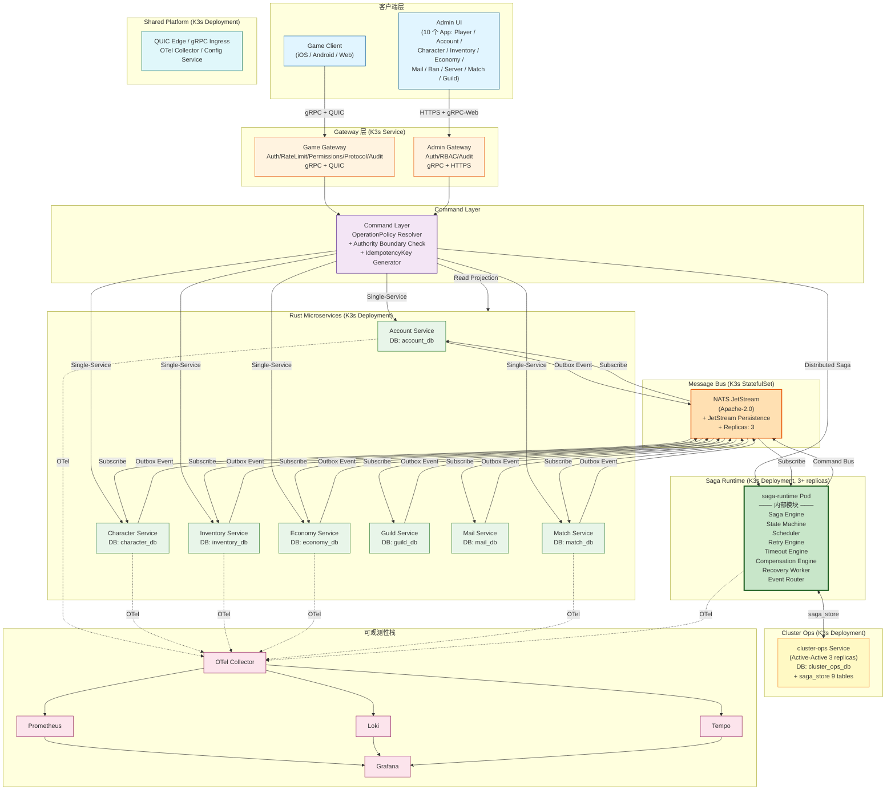
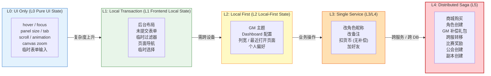
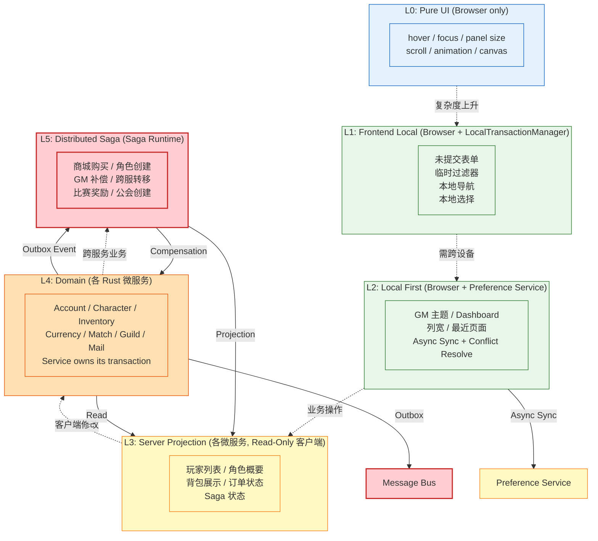

# RGS-BAS-100 Saga 事务系统基本设计书

| 项目 | 内容 |
|---|---|
| 文档编号 | RGS-BAS-100 |
| 版本 | 0.1（初版） |
| 制定日 | 2026-08-21 |
| 最终更新日 | 2026-08-21 |
| 制定者 | 架构师（Ulysses 兼，per DEC-008 一人公司） |
| 保密级别 | 内部限定（Internal Use Only） |
| 适用许可 | Apache-2.0（本仓库） |
| 关联文档 | RGS-REQ-100（需求定义书）/ RGS-DTL-100~102（详细设计书 3 份）/ RGS-OPS-100（K3s 部署）/ RGS-GOBS-100（可观测性）/ RGS-SEC-100（安全审计） |
| 配套标准 | IPA 共通フレーム 2013（SLCP-JCF2013）+ 150 工程日本 SI 业界标准；V 模型映射：IT ↔ BAS（本基本设计书） |

---

## 修订历史

| 版本 | 修订日 | 修订者 | 修订内容 |
|---|---|---|---|
| 0.1 | 2026-08-21 | 架构师（Ulysses）| 初版。覆盖 Overall K3s Architecture / Frontend Operation Classification / 消息总线选型 / 状态分层总览 / 微服务职责 / Authority Map / Saga Runtime 容器化 / K3s Service Discovery / 部署 profile。 |

---

## 0. 文档目的

基于 RGS-REQ-100 需求，定义 Saga 事务系统的**基本架构**：

1. 整体 K3s 架构（含 Game Client / Admin UI / Gateway / Command Layer / Saga Runtime / Message Bus / 5 域微服务）
2. Frontend Operation Classification（5 级决策层级 + UI 触发器）
3. Authority Map（每个领域的权威归属）
4. Saga Runtime 内部模块（Engine / State Machine / Scheduler / Retry / Timeout / Compensation / Recovery / Event Router）
5. 消息总线选型（NATS JetStream 推荐 / Redpanda / Kafka 评估）
6. K3s Service Discovery（logical participant id）
7. 3 种部署 profile（Minimal / Standard / HA）

---

## 1. Overall K3s Architecture



**架构要点**：

- **Gateway 层分离**：Game Gateway（玩家）和 Admin Gateway（GM）独立 Auth / RateLimit / Permissions / Audit，但底层共享 Command Bus + Saga Runtime + Domain Services
- **Command Layer 强制 OperationPolicy 决策**：每个命令先过 OperationPolicy Resolver + Authority Boundary Check，**避免 Single-Service 操作被错误升级为 Saga**
- **Saga Runtime 独立 K3s Deployment**：containerized + stateless compute + persistent saga state (cluster_ops_db.saga_store) + horizontal scalable (3+ replicas)
- **消息总线 NATS JetStream**：Apache-2.0，资源占用低，K3s 友好，subject-based routing 适合游戏事件
- **微服务独立 DB**：Database per Service（FR-100 强约束），实际部署允许 shared cluster + separate schema
- **Outbox Event**：每个微服务本地 ACID 事务包含业务 + 事件，一次 COMMIT，Outbox Worker 异步发布
- **可观测性统一**：OTel 全链路 trace_id + saga_id + step_id + command_id + event_id

---

## 2. Frontend Operation Classification（5 级决策）



**关键决策点**（每个后台操作前必须确认）：

| 决策点 | 问题 | 答案 |
|---|---|---|
| 1. 是否纯 UI | 改变不持久化、不影响他人？ | → L0 |
| 2. 是否本地事务 | 不需要服务器？ | → L1 |
| 3. 是否 Local First | 离线可用 + 异步同步？ | → L2 |
| 4. 是否单服务 | 只涉及 1 个微服务 + 1 DB + 1 ACID？ | → L3 |
| 5. 是否跨服务 | 满足 BR-102 任意 1 条件？ | → L4 (Saga) |

**反例警示**：

- ❌ 改角色昵称 → 升 Saga（应继续 L3）
- ❌ 单次扣货币 → 升 Saga（应继续 L3）
- ❌ 玩家登录 → 升 Saga（应继续 L3）
- ❌ 加好友 → 升 Saga（应继续 L3）

---

## 3. Authority Map

| 领域 | 权威归属 | L 层级 | 备注 |
|---|---|---|---|
| Frontend Layout (L0/L1) | 浏览器 | L0/L1 | 无服务器通信 |
| Admin Preferences (L2) | Preference Service | L2 | Local-First，OPERATION_POLICY 走 LOCAL_FIRST |
| Account | Account Service | L3/L4 | account_db |
| Character | Character Service | L3/L4 | character_db |
| Inventory | Inventory Service | L3/L4 | inventory_db + RESERVED/COMMITTED 状态机 |
| Currency | Economy Service | L3/L4 | economy_db + Reservation 模式 + 幂等 |
| Match | Match Service | L3/L4 | match_db（实时状态不进 Saga） |
| Guild | Guild Service | L3/L4 | guild_db |
| Mail | Mail Service | L3/L4 | mail_db |
| Saga State | Saga Runtime (cluster-ops) | L5 | cluster_ops_db.saga_store 9 表 |
| Event Schema Registry | cluster-ops | — | ARC-042 CEM |
| PFAU + Active-Active | cluster-ops | — | ARC-018 + ADR-0052 |
| Audit Log (GM) | cluster-ops | — | 高风险操作不可篡改审计 |

**原则**：

- Service owns its transaction
- 禁止其他服务直接写其数据库
- Saga Runtime owns saga_instance（其他服务只能通过 Command/Event 接口）

---

## 4. Saga Runtime 内部模块

| 模块 | 职责 | 关键实现 |
|---|---|---|
| Saga Engine | Saga 定义解析 / 状态机驱动 | Rust trait + DSL（YAML/JSON 定义 Saga）|
| State Machine | SagaInstance 状态机 | `PENDING → RUNNING → WAITING → COMPENSATING → COMPLETED/FAILED` |
| Scheduler | 步骤调度 + 重试 | `tokio` + `priority queue` |
| Retry Engine | 退避策略 + 指数退避 + jitter | `1s → 2s → 4s → ...` max 5 次 |
| Timeout Engine | 步骤超时 + Saga 总超时 | step: 30s, saga: 30min |
| Compensation Engine | 补偿步骤执行 | 顺序补偿 + 并发补偿（无依赖）|
| Recovery Worker | Pod crash 恢复 | startup scan `state IN (RUNNING, WAITING, RETRYING, COMPENSATING)` |
| Event Router | 事件路由到 Saga | NATS JetStream consumer + Inbox 表幂等 |

**多副本避免重复驱动**：

- `SELECT ... FOR UPDATE SKIP LOCKED` 抢占 `saga_instance` 行
- Fencing Token 单调递增（PostgreSQL sequence `saga_fence_token_seq`）
- 抢占时 `UPDATE ... SET fence_token = nextval(...)` + `WHERE state IN (RUNNING, WAITING)`
- 写入时 `WHERE fence_token = ?` 校验，过期 Leader 写入 0 rows affected
- **不依赖 distributed Redis lock**（避免引入新组件）

**K3s Service Discovery**：

```yaml
# Saga Definition 示例（不含 pod IP）
saga_type: PurchaseFlow
version: 1
participants:
  - id: economy-service
    service: economy-service.default.svc.cluster.local:50051
  - id: inventory-service
    service: inventory-service.default.svc.cluster.local:50051
  - id: shop-service
    service: shop-service.default.svc.cluster.local:50051
steps:
  - id: reserve-currency
    participant: economy-service
    command: ReserveCurrency
    timeout: 5s
    compensation: ReleaseCurrencyReserve
  - id: reserve-inventory
    participant: inventory-service
    command: ReserveInventorySlot
    timeout: 5s
    compensation: ReleaseInventoryReserve
  - id: validate-purchase
    participant: shop-service
    command: ValidatePurchase
    timeout: 3s
  - id: commit-currency
    participant: economy-service
    command: CommitCurrency
    timeout: 5s
    compensation: RefundCurrency
  - id: grant-item
    participant: inventory-service
    command: GrantItem
    timeout: 5s
    compensation: RevokeItem
```

---

## 5. 消息总线选型

| 候选 | 许可证 | 延迟 | 吞吐 | 内存 | K3s 适合度 | 持久化 | 顺序 | HA | 评价 |
|---|---|---|---|---|---|---|---|---|---|
| **NATS JetStream** | Apache-2.0 | < 1ms | 高 | 低 (~10MB) | ★★★★★ | 内置 (file/SSD) | per-subject | 内置集群 | **推荐**：轻量 + 资源友好 + 适合 K3s |
| Redpanda | Apache-2.0 (新版 BSL 评估中) | ~5ms | 极高 | 中 | ★★★ | 内置 | per-partition | KRaft 内置 | 备选：Kafka 兼容 API，高吞吐 |
| Apache Kafka | Apache-2.0 | ~5ms | 极高 | 高 (JVM) | ★★ | 需 ZK/KRaft | per-partition | 多 broker | 不推荐：JVM 资源重，K3s 压力大 |
| RabbitMQ | Apache-2.0 / MPL-1.1 | < 5ms | 中 | 中 | ★★★ | 可选 | per-queue | 镜像队列 | 备选：成熟但游戏场景不优 |

**选择 NATS JetStream 理由**：

1. **轻量**：单二进制，~10MB 内存，K3s Pod 资源压力小
2. **Apache-2.0**：纯开源可商用
3. **Subject-based routing**：游戏事件天然按 player_id / match_id / topic 路由
4. **持久化**：JetStream 内置 file/SSD 持久化
5. **顺序保证**：per-subject 顺序保证（避免 MQ 乱序问题）
6. **HA**：内置集群 + Raft 共识
7. **K3s 友好**：单 binary 部署，资源占用远低于 Kafka

**关键配置**：

- `jetstream` enabled
- 3 replicas（per ADR-0052 Active-Active）
- Stream per subject prefix：`SAGA.*` / `EVENT.*` / `COMMAND.*`
- Consumer with `ack_wait` 30s + `max_deliver` 5 + `backoff` 1s/2s/4s/8s/16s

**MQ 重复与乱序处理**：

- **重复**：Inbox 表 + `event_id` PRIMARY KEY（per FR-105）
- **乱序**：NATS JetStream per-subject 顺序保证；跨 subject 乱序由 Saga 状态机处理（步骤序号）

---

## 6. 状态分层总览



---

## 7. 微服务职责

| 微服务 | 业务边界 | DB | 关键表 | 关键 Command | 关键 Event | 备注 |
|---|---|---|---|---|---|---|
| Account Service | 账号 + 角色 + 登录 | account_db | accounts / sessions / oauth_tokens | CreateAccount / Login / BanAccount | AccountCreated / AccountBanned | RBAC 5 域统一 |
| Character Service | 角色属性 + 昵称 + 等级 | character_db | characters / character_stats | UpdateNickname / LevelUp | CharacterCreated / CharacterUpdated | 单服务事务 |
| Inventory Service | 物品 + 装备 + 容量 | inventory_db | items / reservations / lineage | ReserveSlot / GrantItem / RevokeItem | ItemGranted / ItemRevoked | RESERVED/COMMITTED 状态机 |
| Economy Service | 货币 + 流水 + 余额 | economy_db | balances / reservations / transactions / inbox | ReserveCurrency / CommitCurrency / RefundCurrency | CurrencyReserved / CurrencyCommitted / CurrencyRefunded | Reservation 模式 + 幂等 |
| Match Service | 房间 + 匹配 + 比赛 | match_db | match_rooms / match_players / match_results | CreateRoom / JoinRoom / FinishMatch | MatchFinished / MatchStarted | 实时状态不进 Saga |
| Guild Service | 公会 + 成员 + 仓库 | guild_db | guilds / members / warehouses | CreateGuild / JoinGuild / PromoteMember | GuildCreated / MemberJoined | |
| Mail Service | 邮件 + 通知 + 附件 | mail_db | mails / attachments / inbox | SendMail / AttachItem / ReadMail | MailSent / MailRead | Saga 终态常用 |
| cluster-ops Service | 集群协调 + Saga Store + COC + PFAU | cluster_ops_db | saga_store 9 表 + cluster_nodes + pfa_operations | — | — | ADR-0052 Active-Active + all-reachable |
| Saga Runtime (stateless) | 协调分布式 Saga | (uses cluster_ops_db) | (read/write saga_store) | — | SagaStarted / SagaCompleted / SagaFailed | 3+ replicas |
| Preference Service | Admin UI 偏好同步 | preference_db | preferences | SyncPreference / LoadPreference | PreferenceUpdated | Local-First sync |
| Game Gateway | 玩家 Auth + 路由 | (stateless) | — | — | — | mTLS + JWT |
| Admin Gateway | GM Auth + RBAC + 审计 | (uses cluster_ops_db for audit) | audit_log | — | — | 高风险操作二次校验 |

---

## 8. 部署 Profile

| Profile | 适用场景 | 资源需求 | Saga Runtime | NATS | PostgreSQL | 监控 |
|---|---|---|---|---|---|---|
| **Minimal** | 本地 dev / 1 人公司 | 4 CPU / 8GB | 1 replica | 1 node | 1 instance + backup | Prometheus + Grafana lite |
| **Standard** | staging / 小规模生产 | 16 CPU / 32GB | 3 replicas | 3 nodes (Raft) | 1 primary + 1 replica (streaming) | Prometheus + Grafana + Loki + Tempo |
| **High Availability** | 正式生产 | 32+ CPU / 64+GB | 5+ replicas | 3 nodes (Raft) | 1 primary + 2 replicas + WAL-G | 完整可观测性栈 + AlertManager + PagerDuty |

**Minimal profile（Ulysses 一人公司当前目标）**：

- WSL2 + k3s native（per DEC-010）
- 1 Saga Runtime pod（dev 起步）
- 1 NATS JetStream pod
- 1 PostgreSQL pod（per `01-k8s-manifests/23-postgres-statefulset.yaml`）
- 5 域 + cluster_ops + shared-platform 各 1 pod
- 总 ~12 pods，资源 ~4 CPU / 8GB 足够

**升级路径**：Standard → HA 通过 `helm upgrade` + HPA，无缝切换。

---

## 9. 关联文档

- **需求**：`RGS-REQ-100` Saga 事务系统需求定义书 v0.1
- **详细设计**：
  - `RGS-DTL-100` Saga 业务模式设计 v0.1
  - `RGS-DTL-101` OperationPolicy 与 AuthorityBoundary 设计 v0.1
  - `RGS-DTL-102` Saga 故障恢复设计 v0.1
- **K3s 部署**：`RGS-OPS-100` Saga 系统 K3s 部署设计 v0.1
- **可观测性**：`RGS-GOBS-100` Saga 可观测性设计 v0.1
- **安全审计**：`RGS-SEC-100` GM 审计与 Saga 安全设计 v0.1

---

## 10. 修订历史

| 版本 | 修订日 | 修订者 | 修订内容 |
|---|---|---|---|
| 0.1 | 2026-08-21 | 架构师（Ulysses）| 初版。Overall K3s Architecture / Frontend Operation Classification / Authority Map / Saga Runtime 模块 / 消息总线选型 / 状态分层总览 / 微服务职责 / 部署 Profile。 |
