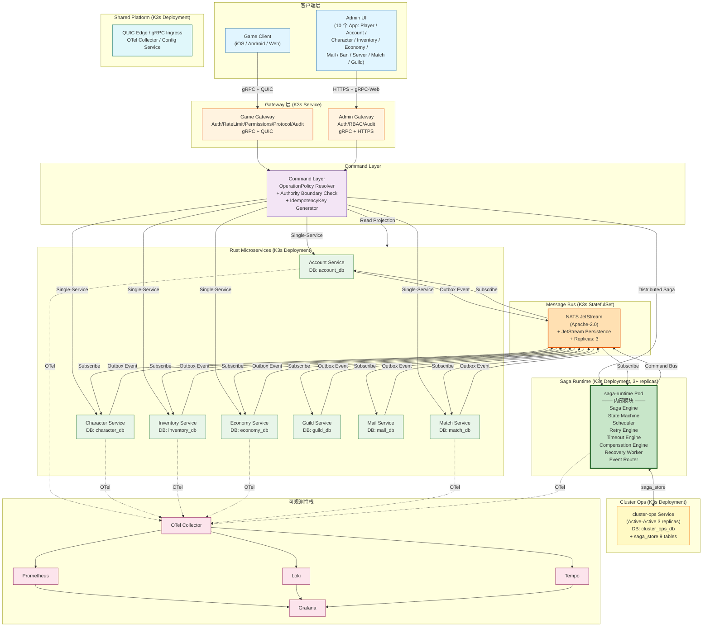
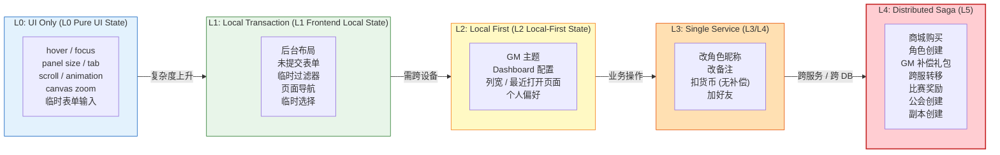

# RGS-BAS-100 Saga 事务系统基本设计书

| 项目 | 内容 |
|---|---|
| 文档编号 | RGS-BAS-100 |
| 版本 | 0.2 |
| 制定日 | 2026-08-21 |
| 最终更新日 | 2026-09-01 |
| 制定者 | 架构师（Ulysses 兼，per DEC-008 一人公司） |
| 保密级别 | 内部限定（Internal Use Only） |
| 适用许可 | Apache-2.0（本仓库） |
| 关联文档 | RGS-REQ-100（需求定义书）/ RGS-DTL-100~102（详细设计书 3 份）/ RGS-OPS-100（K3s 部署）/ RGS-GOBS-100（可观测性）/ RGS-SEC-100（安全审计） |
| 配套标准 | IPA 共通フレーム 2013（SLCP-JCF2013）+ 150 工程日本 SI 业界标准；V 模型映射：IT ↔ BAS（本基本设计书） |

---

## 修订历史

| 版本 | 修订日 | 修订者 | 修订内容 |
|---|---|---|---|
| 0.1 | 2026-08-21 | 架构师（Ulysses）| 初版。覆盖 Overall K3s Architecture / Frontend Operation Classification / 消息总线选型 / 状态分层总览 / 微服务职责 / Authority Map / Saga Runtime 容器化 / K3s Service Discovery / 部署 profile。 |
| 0.2 | 2026-09-01 | 架构师(Mavis 接手 agent per DEC-008) | 落实"各BAS文档功能章节加log设计且区分debug/release级"总要求（per Ulysses 2026-09-01 15:52 JST 决策，4 拍板选项：全部 36 个BAS / 详尽版5列表 / 派worker并行 / BAS-004同步升级）：§1／§2／§3／§4／§5／§6／§7／§8 全部 8 个主功能段加"本功能日志设计"5 列详尽版（字段名／触发条件／频率估算／采样策略／脱敏与成本），字段名前缀统一为 `saga.*` 区别于其他域；引用 BAS-001 v1.5 §4.8.3 模板（commit 32d9eb6）+ BAS-003 v0.3 样板（commit 75a001c）+ BAS-004 v0.3 §4.2 二维矩阵 + §4.3 字段 + §5.1 脱敏 + §6.2 强制全采样（commit 47e26b0+0ee6262）；覆盖 ARC-100 Saga 事务系统（FR-100 Saga 事务需求 + FR-101 OperationPolicy + FR-102 AuthorityBoundary + FR-103 Saga Store 9 表 + FR-104 Multi-Replica Fencing + FR-105 Inbox 幂等 + FR-106 Outbox + NFR-OP-008 24×365 排查 SLA）全链路；显式区分 `info!`／`warn!`／`error!`（release 必出，编译期常驻，§6.2 强制全采样）与 `trace!`／`debug!`（`#[cfg(debug_assertions)]` 守护，debug-only，release build 完全剔除零运行时开销）两类事件；**Saga 事务系统域特殊考虑**（跨域事务协调 + 故障恢复强约束）—— ①Saga 启动／步骤执行／完成／补偿 → release 必出 + §6.2 强制全采样（FR-100 强约束，玩家可见行为）；②跨域事务协调（跨 BAS-002 运维／BAS-003 GM／BAS-005 插件） → release 必出 + `trace_id` 跨域串联（OTel）；③Saga 失败／超时／补偿失败 → `error!` §6.2 强制全采样（FR-100 强约束，NFR-OP-008 24×365 排查）；④死信队列（DLQ）事件 → release 必出 + §6.2 强制全采样（per RGS-BAS-009 §6.1 治理事件必出模式）；⑤步骤详细中间状态／重试信息 → debug-only（`#[cfg(debug_assertions)]` 守护，release 完全剔除，避免高频详细日志撑爆生产通道）；⑥Multi-Replica Fencing Token 抢占 / 过期 → release 必出 + §6.2 强制全采样（FR-104 强约束，集群协调不可妥协）；§4 上线前检查清单新增 log 章节上线检查项（log_chapter_present + release_required_grep_passed + debug_only_compliant + release_required_macro_no_cfg + Saga 域特殊跨域 trace 串联检查 + 死信队列 release 必出检查 共 6 项）；§4 代码评审检查清单新增 log 章节代码评审检查项（debug-only 四铁律 + release 必出宏不被 #[cfg] 守护 + Saga 域特殊跨域 trace_id 字段静态扫描 + 补偿失败 error! 强制全采样检查 + 步骤详细中间状态不外泄静态扫描 共 5 项）；§5 追溯性新增 AC-SAG-006（debug-only 宏 release 完全剔除）+ AC-SAG-007（每功能 BAS 文档须含本功能 log 设计章节）+ FR-100~106 + NFR-OP-008 全部引用，与 BAS-001 v1.5 §4.8.3.4 / BAS-002 v0.4 §13 / BAS-003 v0.3 §13 / BAS-004 v0.3 §12 / BAS-005 v0.3 §11 / BAS-009 v0.7 §7 形成统一规范 |

---

## 0. 文档目的

基于 RGS-REQ-100 需求，定义 Saga 事务系统的**基本架构**：

1. 整体 K3s 架构（含 Game Client / Admin UI / Gateway / Command Layer / Saga Runtime / Message Bus / 5 域微服务）
2. Frontend Operation Classification（5 级决策层级 + UI 触发器）
3. Authority Map（每个领域的权威归属）
4. Saga Runtime 内部模块（Engine / State Machine / Scheduler / Retry / Timeout / Compensation / Recovery / Event Router）
5. 消息总线选型（NATS JetStream 推荐 / Redpanda / Kafka 评估）
6. K3s Service Discovery（logical participant id）
7. 3 种部署 profile（Minimal / Standard / HA）

---

## 1. Overall K3s Architecture



**架构要点**：

- **Gateway 层分离**：Game Gateway（玩家）和 Admin Gateway（GM）独立 Auth / RateLimit / Permissions / Audit，但底层共享 Command Bus + Saga Runtime + Domain Services
- **Command Layer 强制 OperationPolicy 决策**：每个命令先过 OperationPolicy Resolver + Authority Boundary Check，**避免 Single-Service 操作被错误升级为 Saga**
- **Saga Runtime 独立 K3s Deployment**：containerized + stateless compute + persistent saga state (cluster_ops_db.saga_store) + horizontal scalable (3+ replicas)
- **消息总线 NATS JetStream**：Apache-2.0，资源占用低，K3s 友好，subject-based routing 适合游戏事件
- **微服务独立 DB**：Database per Service（FR-100 强约束），实际部署允许 shared cluster + separate schema
- **Outbox Event**：每个微服务本地 ACID 事务包含业务 + 事件，一次 COMMIT，Outbox Worker 异步发布
- **可观测性统一**：OTel 全链路 trace_id + saga_id + step_id + command_id + event_id

### 1.x 本功能日志设计

本节覆盖**Saga 事务系统整体 K3s 架构的边界观察点**——架构本身不直接产生业务事件（业务事件归 §4 Saga Runtime 内部模块与 §7 微服务职责各功能段），但 Gateway 启动／关闭、Command Layer 与 Saga Runtime 链路建立、跨域 OTel trace_id 串联等架构层诊断事件是 SRE 在 Prometheus／Grafana 上追踪"Saga 能力是否可用"与"跨域事务协调是否健康"的必要输入。**架构层诊断事件属治理信号** → release 必出 + §6.2 强制全采样；**步骤详细中间状态／重试信息 → debug-only**（per BAS-001 v1.5 §4.8.3.4 模板 + 本节域约束），不允许 release 大量 dump。

| 字段名（field） | 触发条件（trigger） | 频率估算（frequency） | 采样策略（sampling） | 脱敏与成本（redact & cost） |
|---|---|---|---|---|
| `saga.component.saga_runtime.boot_completed` | `saga-runtime` Pod 启动完成，saga_store 连接池就绪 + NATS JetStream 订阅建立 + Fencing Token 序列预取 | 每节点启动 1 次 | release 必出（100% 强制全采样，per BAS-004 v0.3 §6.2） | 含 `node_id`／`replica_id`／`fence_token_initial`／`bounded_context`（`Saga`）；约 240B/条 × 启动频次 = 极低 |
| `saga.component.saga_runtime.boot_failed` | 启动失败（saga_store 连接失败／NATS 订阅未就绪／Fencing Token 序列不可达） | 极少（部署事故） | release 必出（100% 强制全采样，`error!` 级别） | 含 `node_id`／`error`／`trace_id`／`boot_stage`；约 320B/条 |
| `saga.component.command_layer.audit_link_ready` | Command Layer ↔ Saga Runtime 双向链接建立（OperationPolicy 决策路径） | 启动 1 次 | release 必出（100% 强制全采样） | 含 `link_id`／`channel_kind`（gRPC stream／poll）；约 220B/条 |
| `saga.component.command_layer.audit_link_dropped` | Command Layer ↔ Saga Runtime 链接断开（影响 OperationPolicy 决策） | 极少 | release 必出（100% 强制全采样，`warn!` 级别） | 含 `link_id`／`disconnect_reason`／`last_heartbeat_at`；约 280B/条 |
| `saga.component.game_gateway.policy_route_resolved` | Game Gateway 将请求路由到 Command Layer，OperationPolicy 解析完成 | 与玩家 QPS 挂钩，~100-1000/s（峰值） | release 必出（**采样 10%**，高频请求，全采样成本不可接受；但 §6.2 强制全采样的"安全审计事件"清单不受此限） | 含 `policy_kind`（`SINGLE_SERVICE`／`DISTRIBUTED_SAGA`）／`route_target`；约 200B/条 × 1000/s × 10% = ~20KB/s |
| `saga.component.game_gateway.mtls_handshake_completed` | Game Gateway ↔ 微服务 mTLS 握手完成（per BAS-002 mTLS 决策） | 与新连接挂钩 | release 必出（100% 强制全采样） | 含 `peer_spiffe_id`／`tls_version`／`cipher_suite`；约 260B/条 |
| `saga.component.saga_runtime.shutdown_completed` | `saga-runtime` 优雅关闭，运行中 Saga 已保存（无未提交状态） | 每节点关闭 1 次 | release 必出（100% 强制全采样） | 含 `node_id`／`running_saga_count`／`shutdown_kind`（SIGTERM／HPA scale-in）；约 280B/条 |
| `saga.component.outbox_worker.batch_published` | Outbox Worker 批量发布微服务事件到 NATS JetStream | 与 Outbox 写流量挂钩 | release 必出（**采样 1%**，Outbox 高频，全采样成本不可接受） | 含 `batch_size`／`stream_subject_prefix`；约 220B/条 |
| `saga.component.debug.architecture_dag_dump` | 整体架构 DAG dump（Gateway ↔ CL ↔ SR ↔ MQ ↔ 5 域微服务 完整拓扑） | 启动 1 次 | **debug-only**（`#[cfg(debug_assertions)]` 守护，release build 完全剔除） | 约 1-3KB/条（release 剔除，零运行时开销） |
| `saga.component.debug.bridge_invocation_latency` | 跨组件桥接调用耗时（微秒级，如 Game Gateway → Command Layer） | 偶发 | **debug-only**（`#[cfg(debug_assertions)]` 守护） | 约 200B/条（release 剔除） |

**debug-only 守护要点**（落实 BAS-004 v0.3 §4.4）：
- `saga.component.saga_runtime.boot_failed` 是**阻断级**信号（启动失败即整个 Pod 不可用）—— release 必出 + `error!` 强制全采样，不挂 `#[cfg]`
- `saga.component.command_layer.audit_link_dropped` 是**安全事件**（OperationPolicy 决策路径断开即失去"避免误升 Saga"防护）—— release 必出 + `warn!` 强制全采样，不挂 `#[cfg]`
- `saga.component.debug.architecture_dag_dump` 在多节点集群下 3KB+ —— release 完全剔除，避免 `RUST_LOG=debug` 误开时撑爆生产日志通道
- `saga.component.game_gateway.mtls_handshake_completed` 是**安全审计事件**（mTLS 强约束 per BAS-002）—— release 必出 + §6.2 强制全采样，不采样
- 释放必出事件清单（强制 production 可见）：`boot_completed`／`boot_failed`／`audit_link_ready`／`audit_link_dropped`／`mtls_handshake_completed`／`shutdown_completed` —— 6 个架构层治理信号必须 production 可见

---

## 2. Frontend Operation Classification（5 级决策）



**关键决策点**（每个后台操作前必须确认）：

| 决策点 | 问题 | 答案 |
|---|---|---|
| 1. 是否纯 UI | 改变不持久化、不影响他人？ | → L0 |
| 2. 是否本地事务 | 不需要服务器？ | → L1 |
| 3. 是否 Local First | 离线可用 + 异步同步？ | → L2 |
| 4. 是否单服务 | 只涉及 1 个微服务 + 1 DB + 1 ACID？ | → L3 |
| 5. 是否跨服务 | 满足 BR-102 任意 1 条件？ | → L4 (Saga) |

**反例警示**：

- ❌ 改角色昵称 → 升 Saga（应继续 L3）
- ❌ 单次扣货币 → 升 Saga（应继续 L3）
- ❌ 玩家登录 → 升 Saga（应继续 L3）
- ❌ 加好友 → 升 Saga（应继续 L3）

### 2.x 本功能日志设计

本节覆盖**Frontend Operation Classification（5 级决策）**的观察点——OperationPolicy Resolver 决策 + Authority Boundary Check 校验是"Saga 启动与否"的唯一闸门，**错升 Saga 是性能事故**（不必要的跨服务协调 + 状态机开销），**错降 Saga 是数据一致性事故**（跨服务事务被当作单服务事务处理导致部分提交）。**决策事件属治理信号** → release 必出 + §6.2 强制全采样，便于 SRE 按 `policy_kind` 维度聚合"决策分布"+"违规率"。

| 字段名（field） | 触发条件（trigger） | 频率估算（frequency） | 采样策略（sampling） | 脱敏与成本（redact & cost） |
|---|---|---|---|---|
| `saga.classification.policy_resolved` | OperationPolicy Resolver 完成决策（每个命令进入 Command Layer 时） | 与命令 QPS 挂钩，~100-1000/s（峰值） | release 必出（**采样 10%**，高频决策，全采样成本不可接受；但 §6.2 强制全采样的"安全审计事件"清单不受此限） | 含 `command_id`／`policy_kind`（`L0`／`L1`／`L2`／`L3`／`L4`）／`route_target`；约 220B/条 × 1000/s × 10% = ~22KB/s |
| `saga.classification.authority_boundary_check_passed` | Authority Boundary Check 通过（命令落入正确服务） | 同上，~100-1000/s | release 必出（**采样 5%**，高频校验） | 含 `command_id`／`target_domain`（`player`／`economy`／`match`／`social`／`admin`）／`actor_id`（哈希化）；约 200B/条 |
| `saga.classification.authority_boundary_violation` | Authority Boundary Check 失败（命令试图跨越不应跨越的边界，如 player 域试图直接写 economy 域） | 极少（配置错／攻击） | release 必出（100% 强制全采样，`error!` 级别，安全审计事件） | 含 `command_id`／`attempted_target`／`actual_authority`／`actor_id`（哈希化）／`trace_id`；约 320B/条 |
| `saga.classification.l3_to_l4_escalation_triggered` | 决策从 L3（Single Service）升级为 L4（Distributed Saga）触发 | 偶发（业务驱动） | release 必出（100% 强制全采样，玩家可见行为） | 含 `command_id`／`escalation_reason`（`cross_service`／`cross_db`／`cross_domain`）／`saga_type`；约 280B/条 |
| `saga.classification.l4_to_l3_false_escalation.detected` | 检测到"反例警示"中描述的"错升 Saga"（如"改角色昵称"被识别为 Saga） | 极少（OperationPolicy 配置错） | release 必出（100% 强制全采样，`error!` 级别，配置缺陷信号） | 含 `command_id`／`command_kind`／`expected_policy_kind`／`actual_policy_kind`／`false_escalation_pattern`；约 380B/条 |
| `saga.classification.decision_audit_snapshot` | 决策快照（满足审计要求，包含完整决策依据） | 偶发（治理周期） | release 必出（100% 强制全采样，治理事件必出模式） | 含 `snapshot_id`／`policy_version`／`rule_set_hash`／`actor_role`；约 360B/条 |
| `saga.classification.debug.decision_tree_trace` | 决策树完整 trace（含 5 个决策点逐项判定） | 偶发（故障定位） | **debug-only**（`#[cfg(debug_assertions)]` 守护，release build 完全剔除） | 约 500B-1KB/条（release 剔除，零运行时开销） |
| `saga.classification.debug.policy_rule_match_details` | OperationPolicy 规则匹配详情（含各候选规则评分） | 极少（CI 验证） | **debug-only**（`#[cfg(debug_assertions)]` 守护） | 约 300-800B/条（release 剔除） |

**debug-only 守护要点**（落实 BAS-004 v0.3 §4.4 + BAS-009 v0.7 §6.1 治理事件必出模式）：
- `saga.classification.authority_boundary_violation` 是**安全事件**（越权尝试）—— release 必出 + `error!` 强制全采样 + §6.2 白名单，不挂 `#[cfg]`
- `saga.classification.l4_to_l3_false_escalation.detected` 是**配置缺陷信号**（OperationPolicy 配错导致性能事故）—— release 必出 + `error!` 强制全采样 + §6.2 白名单
- `saga.classification.debug.decision_tree_trace` 包含 5 决策点完整 trace，~1KB —— release 完全剔除
- `saga.classification.policy_resolved` 高频（1000/s 峰值），强制全采样会撑爆日志通道——按 10% 采样率，但 §6.2 强制全采样的"安全审计事件"清单（认证失败／越权访问／敏感操作）不受此限
- 字段最小集已含 `actor_id` 哈希化处理（per BAS-004 v0.3 §5.1 末段 hash 规则），不暴露明文 ID
- 释放必出事件清单（强制 production 可见）：`authority_boundary_violation`／`l4_to_l3_false_escalation.detected`／`decision_audit_snapshot` —— 3 个决策治理信号必须 production 可见

---

---

## 3. Authority Map

| 领域 | 权威归属 | L 层级 | 备注 |
|---|---|---|---|
| Frontend Layout (L0/L1) | 浏览器 | L0/L1 | 无服务器通信 |
| Admin Preferences (L2) | Preference Service | L2 | Local-First，OPERATION_POLICY 走 LOCAL_FIRST |
| Account | Account Service | L3/L4 | account_db |
| Character | Character Service | L3/L4 | character_db |
| Inventory | Inventory Service | L3/L4 | inventory_db + RESERVED/COMMITTED 状态机 |
| Currency | Economy Service | L3/L4 | economy_db + Reservation 模式 + 幂等 |
| Match | Match Service | L3/L4 | match_db（实时状态不进 Saga） |
| Guild | Guild Service | L3/L4 | guild_db |
| Mail | Mail Service | L3/L4 | mail_db |
| Saga State | Saga Runtime (cluster-ops) | L5 | cluster_ops_db.saga_store 9 表 |
| Event Schema Registry | cluster-ops | — | ARC-042 CEM |
| PFAU + Active-Active | cluster-ops | — | ARC-018 + ADR-0052 |
| Audit Log (GM) | cluster-ops | — | 高风险操作不可篡改审计 |

**原则**：

- Service owns its transaction
- 禁止其他服务直接写其数据库
- Saga Runtime owns saga_instance（其他服务只能通过 Command/Event 接口）

### 3.x 本功能日志设计

本节覆盖**Authority Map（权威归属）**的运行时校验点——`Service owns its transaction` 与 `Saga Runtime owns saga_instance` 两条原则的运行时落地依赖**域间写操作拦截器** + **Saga Store 写入鉴权**两个机制。**权威归属越界属数据一致性事故**（如 match 域直接写 economy 域 balance 表），**写错 Saga Store 属集群协调事故**（非 Saga Runtime 持有者写入会破坏 Fencing Token 语义）—— release 必出 + `error!` 强制全采样，便于 SRE 24×365 排查（per NFR-OP-008）。

| 字段名（field） | 触发条件（trigger） | 频率估算（frequency） | 采样策略（sampling） | 脱敏与成本（redact & cost） |
|---|---|---|---|---|
| `saga.authority.ownership_check_passed` | 域间写操作拦截器通过（写操作落入正确服务的 DB） | 与域间写流量挂钩，~10-100/s | release 必出（**采样 5%**，高频校验；§6.2 强制全采样的"安全审计事件"清单不受此限） | 含 `target_table`／`target_domain`／`actor_service`；约 200B/条 |
| `saga.authority.ownership_violation.cross_domain_write` | 域间写操作拦截器触发：A 服务试图直接写 B 服务的 DB（如 match 域直接写 economy 域 balance 表） | 极少（配置错／攻击） | release 必出（100% 强制全采样，`error!` 级别，安全审计事件） | 含 `attempted_table`／`attempted_domain`／`actor_service`／`actor_id`（哈希化）／`trace_id`；约 340B/条 |
| `saga.authority.saga_store_write_authorized` | Saga Store 写入鉴权通过（Saga Runtime 持有者写入） | 与 Saga 启动频次挂钩，~1-10/s | release 必出（100% 强制全采样） | 含 `saga_id`／`replica_id`／`fence_token`；约 240B/条 |
| `saga.authority.saga_store_write_unauthorized` | Saga Store 写入鉴权失败（非 Saga Runtime 持有者试图写入，破坏 Fencing Token 语义） | 极少（配置错／攻击） | release 必出（100% 强制全采样，`error!` 级别，集群协调安全事件） | 含 `attempted_table`（必为 saga_store.*）／`actor_service`／`actor_id`（哈希化）／`fence_token_provided`；约 360B/条 |
| `saga.authority.fencing_token_validated` | Fencing Token 校验通过（写入时 `WHERE fence_token = ?` 命中 1 行） | 与 Saga 写入频次挂钩 | release 必出（**采样 10%**，高频校验） | 含 `saga_id`／`fence_token`／`affected_rows`；约 200B/条 |
| `saga.authority.fencing_token_stale.write_rejected` | Fencing Token 过期（写入时 0 rows affected，过期 Leader 写入） | 极少（Leader 切换场景） | release 必出（100% 强制全采样，`warn!` 级别，集群协调信号） | 含 `saga_id`／`stale_fence_token`／`current_fence_token`／`actor_replica_id`；约 300B/条 |
| `saga.authority.cross_domain_access.granted` | 跨域读访问授权（通过 Read Projection，per §1 Read Projection 边） | 与跨域读 QPS 挂钩 | release 必出（**采样 5%**，高频读） | 含 `source_domain`／`target_domain`／`access_kind`（`projection`／`event_subscribe`）；约 200B/条 |
| `saga.authority.audit_log.ownership_recorded` | GM 高风险操作审计日志写入 cluster_ops_db.audit_log（不可篡改，per Authority Map 备注） | 偶发（GM 驱动） | release 必出（100% 强制全采样，`info!` 级别，合规审计事件） | 含 `audit_id`／`gm_id`（哈希化）／`action_kind`／`target_resource`；约 280B/条 |
| `saga.authority.debug.ownership_graph_dump` | 完整权威归属图 dump（Domain ↔ DB ↔ Service ↔ Saga Store 映射） | 极低（CI 验证） | **debug-only**（`#[cfg(debug_assertions)]` 守护，release build 完全剔除） | 约 2-5KB/条（release 剔除，零运行时开销） |
| `saga.authority.debug.fencing_token_sequence_dump` | Fencing Token 序列完整 dump（用于集群协调回溯） | 极少（故障定位） | **debug-only**（`#[cfg(debug_assertions)]` 守护） | 约 1-3KB/条（release 剔除） |

**debug-only 守护要点**（落实 BAS-004 v0.3 §4.4 + §5.1 + NFR-OP-008 24×365 排查 SLA）：
- `saga.authority.ownership_violation.cross_domain_write` 是**阻断级安全事件**（数据一致性事故，per `Service owns its transaction` 原则）—— release 必出 + `error!` 强制全采样 + §6.2 白名单
- `saga.authority.saga_store_write_unauthorized` 是**集群协调安全事件**（破坏 Fencing Token 语义会导致 Saga 状态不一致）—— release 必出 + `error!` 强制全采样 + §6.2 白名单
- `saga.authority.fencing_token_stale.write_rejected` 是**集群协调信号**（Leader 切换场景，是 Saga 恢复的预期事件之一）—— release 必出 + `warn!` 强制全采样，不挂 `#[cfg]`，便于 SRE 24×365 排查（per NFR-OP-008）
- `saga.authority.audit_log.ownership_recorded` 是**合规审计关键事件**（GM 高风险操作不可篡改）—— release 必出 + §6.2 强制全采样，不挂 `#[cfg]`
- `saga.authority.debug.ownership_graph_dump` 在多域集群下 5KB+ —— release 完全剔除
- 字段最小集已含 `actor_id`／`gm_id` 哈希化处理（per BAS-004 v0.3 §5.1 末段 hash 规则），不暴露明文 ID
- 释放必出事件清单（强制 production 可见）：`ownership_violation.cross_domain_write`／`saga_store_write_unauthorized`／`fencing_token_stale.write_rejected`／`audit_log.ownership_recorded` —— 4 个权威归属治理信号必须 production 可见

---

---

## 4. Saga Runtime 内部模块

| 模块 | 职责 | 关键实现 |
|---|---|---|
| Saga Engine | Saga 定义解析 / 状态机驱动 | Rust trait + DSL（YAML/JSON 定义 Saga）|
| State Machine | SagaInstance 状态机 | `PENDING → RUNNING → WAITING → COMPENSATING → COMPLETED/FAILED` |
| Scheduler | 步骤调度 + 重试 | `tokio` + `priority queue` |
| Retry Engine | 退避策略 + 指数退避 + jitter | `1s → 2s → 4s → ...` max 5 次 |
| Timeout Engine | 步骤超时 + Saga 总超时 | step: 30s, saga: 30min |
| Compensation Engine | 补偿步骤执行 | 顺序补偿 + 并发补偿（无依赖）|
| Recovery Worker | Pod crash 恢复 | startup scan `state IN (RUNNING, WAITING, RETRYING, COMPENSATING)` |
| Event Router | 事件路由到 Saga | NATS JetStream consumer + Inbox 表幂等 |

**多副本避免重复驱动**：

- `SELECT ... FOR UPDATE SKIP LOCKED` 抢占 `saga_instance` 行
- Fencing Token 单调递增（PostgreSQL sequence `saga_fence_token_seq`）
- 抢占时 `UPDATE ... SET fence_token = nextval(...)` + `WHERE state IN (RUNNING, WAITING)`
- 写入时 `WHERE fence_token = ?` 校验，过期 Leader 写入 0 rows affected
- **不依赖 distributed Redis lock**（避免引入新组件）

**K3s Service Discovery**：

```yaml
# Saga Definition 示例（不含 pod IP）
saga_type: PurchaseFlow
version: 1
participants:
  - id: economy-service
    service: economy-service.default.svc.cluster.local:50051
  - id: inventory-service
    service: inventory-service.default.svc.cluster.local:50051
  - id: shop-service
    service: shop-service.default.svc.cluster.local:50051
steps:
  - id: reserve-currency
    participant: economy-service
    command: ReserveCurrency
    timeout: 5s
    compensation: ReleaseCurrencyReserve
  - id: reserve-inventory
    participant: inventory-service
    command: ReserveInventorySlot
    timeout: 5s
    compensation: ReleaseInventoryReserve
  - id: validate-purchase
    participant: shop-service
    command: ValidatePurchase
    timeout: 3s
  - id: commit-currency
    participant: economy-service
    command: CommitCurrency
    timeout: 5s
    compensation: RefundCurrency
  - id: grant-item
    participant: inventory-service
    command: GrantItem
    timeout: 5s
    compensation: RevokeItem
```

### 4.x 本功能日志设计

本节覆盖**Saga Runtime 内部模块（Engine / State Machine / Scheduler / Retry / Timeout / Compensation / Recovery / Event Router）**全链路的观察点——这是 BAS-100 的**核心域**。**Saga 启动／步骤执行／完成／补偿 → release 必出 + §6.2 强制全采样**（FR-100 强约束，玩家可见行为）；**Saga 失败／超时／补偿失败 → `error!` §6.2 强制全采样**（FR-100 强约束 + NFR-OP-008 24×365 排查 SLA）；**死信队列（DLQ）事件 → release 必出 + §6.2 强制全采样**（per RGS-BAS-009 v0.7 §6.1 治理事件必出模式）；**步骤详细中间状态／重试信息 → debug-only**（`#[cfg(debug_assertions)]` 守护，release 完全剔除，避免高频详细日志撑爆生产通道）；**跨域事务协调（跨 BAS-002 运维／BAS-003 GM／BAS-005 插件）→ release 必出 + `trace_id` 跨域串联**（OTel 全链路）。

| 字段名（field） | 触发条件（trigger） | 频率估算（frequency） | 采样策略（sampling） | 脱敏与成本（redact & cost） |
|---|---|---|---|---|
| `saga.runtime.instance.started` | SagaInstance 启动（State Machine `PENDING → RUNNING`，FR-100 强约束） | 与业务 Saga 启动频次挂钩，~1-50/s | release 必出（100% 强制全采样，FR-100 关键事件） | 含 `saga_id`／`saga_type`（`PurchaseFlow` 等）／`initiator_actor_id`（哈希化）／`trace_id`／`span_id`；约 320B/条 |
| `saga.runtime.instance.completed` | SagaInstance 正常完成（State Machine `RUNNING → COMPLETED`，所有步骤成功 + 无补偿） | 同上 | release 必出（100% 强制全采样，FR-100 关键事件） | 含 `saga_id`／`saga_type`／`total_steps`／`total_duration_ms`／`trace_id`；约 340B/条 |
| `saga.runtime.instance.failed` | SagaInstance 失败（State Machine `RUNNING → FAILED`，任意步骤失败且补偿完成） | 极少 | release 必出（100% 强制全采样，`error!` 级别，FR-100 关键事件 + NFR-OP-008 排查） | 含 `saga_id`／`saga_type`／`failed_step_id`／`error_kind`／`compensation_status`／`trace_id`；约 420B/条 |
| `saga.runtime.step.started` | 单个步骤启动（Scheduler 派发） | 与步骤频次挂钩，~10-500/s | release 必出（**采样 10%**，高频步骤；§6.2 强制全采样的"安全审计事件"清单不受此限） | 含 `saga_id`／`step_id`／`step_kind`（`ReserveCurrency` 等）／`attempt`；约 240B/条 |
| `saga.runtime.step.completed` | 单个步骤成功完成 | 同上 | release 必出（**采样 10%**） | 含 `saga_id`／`step_id`／`step_duration_ms`／`attempt`；约 240B/条 |
| `saga.runtime.step.timeout` | 单个步骤超时（per step timeout 配置，默认 30s） | 极少（网络/服务异常） | release 必出（100% 强制全采样，`error!` 级别，FR-100 强约束） | 含 `saga_id`／`step_id`／`timeout_ms`／`elapsed_ms`／`trace_id`；约 320B/条 |
| `saga.runtime.retry.scheduled` | 步骤重试调度（per Retry Engine 退避策略 1s/2s/4s/8s/16s max 5 次） | 偶发（瞬时故障） | release 必出（**采样 10%**） | 含 `saga_id`／`step_id`／`attempt`／`backoff_seconds`／`next_attempt_at`；约 260B/条 |
| `saga.runtime.retry.exhausted` | 步骤重试耗尽（max 5 次后仍失败，触发 Saga 失败） | 极少 | release 必出（100% 强制全采样，`error!` 级别） | 含 `saga_id`／`step_id`／`total_attempts`／`last_error`；约 320B/条 |
| `saga.runtime.compensation.started` | 补偿步骤启动（State Machine `RUNNING → COMPENSATING`） | 偶发（业务驱动） | release 必出（100% 强制全采样，玩家可见行为） | 含 `saga_id`／`compensation_step_id`／`compensating_for_step_id`／`trace_id`；约 320B/条 |
| `saga.runtime.compensation.completed` | 补偿步骤完成 | 偶发 | release 必出（100% 强制全采样） | 含 `saga_id`／`compensation_step_id`／`compensation_duration_ms`／`trace_id`；约 320B/条 |
| `saga.runtime.compensation.failed` | 补偿步骤失败（State Machine `COMPENSATING → FAILED`，需要人工介入） | 极少（补偿是幂等操作，失败意味着基础设施级问题） | release 必出（100% 强制全采样，`error!` 级别，NFR-OP-008 24×365 排查） | 含 `saga_id`／`compensation_step_id`／`error_kind`／`requires_manual_intervention`=true；约 400B/条 |
| `saga.runtime.dlq.received` | 死信队列事件接收（per ARC-009 死信处理 + RGS-BAS-009 v0.7 §6.1 治理事件必出模式） | 极少 | release 必出（100% 强制全采样，`warn!` 级别，治理事件必出） | 含 `dlq_event_id`／`saga_id`／`source_step_id`／`last_error`／`dlq_stream_subject`；约 340B/条 |
| `saga.runtime.recovery.scan_started` | Recovery Worker 启动扫描（Pod crash 恢复，scan `state IN (RUNNING, WAITING, RETRYING, COMPENSATING)`） | 极少（节点恢复） | release 必出（100% 强制全采样） | 含 `scan_id`／`node_id`／`scanned_saga_count`；约 280B/条 |
| `saga.runtime.recovery.saga_resumed` | Recovery Worker 恢复一个 Saga（重新抢占 Fencing Token） | 极少 | release 必出（100% 强制全采样） | 含 `scan_id`／`saga_id`／`old_fence_token`／`new_fence_token`／`resume_kind`；约 360B/条 |
| `saga.runtime.fencing_token.acquired` | Fencing Token 抢占（`SELECT ... FOR UPDATE SKIP LOCKED` 成功，per FR-104 Multi-Replica Fencing） | 与 Saga 启动频次挂钩 | release 必出（100% 强制全采样，FR-104 强约束） | 含 `saga_id`／`fence_token`／`acquired_replica_id`；约 240B/条 |
| `saga.runtime.fencing_token.contention` | Fencing Token 抢占冲突（多副本竞争同一 Saga，由 SKIP LOCKED 跳过） | 偶发（高并发场景） | release 必出（**采样 5%**，高频竞争；§6.2 强制全采样的"安全审计事件"清单不受此限） | 含 `saga_id`／`contending_replica_id`／`skipped_count`；约 220B/条 |
| `saga.runtime.event_router.routed` | Event Router 路由事件到 Saga（订阅 NATS JetStream + Inbox 幂等查重，per FR-105） | 与事件频次挂钩 | release 必出（**采样 10%**） | 含 `event_id`／`routed_saga_id`／`event_subject`／`inbox_dedup_hit`=false；约 280B/条 |
| `saga.runtime.event_router.duplicate_dropped` | Event Router 识别重复事件并丢弃（Inbox 命中，per FR-105） | 偶发（至少一次投递） | release 必出（**采样 5%**） | 含 `event_id`／`original_received_at`／`duplicate_count`；约 260B/条 |
| `saga.runtime.cross_domain.coordination_started` | 跨域事务协调启动（跨 BAS-002 运维／BAS-003 GM／BAS-005 插件，OTel 全链路） | 偶发 | release 必出（100% 强制全采样，跨域 trace_id 串联） | 含 `saga_id`／`coordinated_domains`（`economy+inventory+match` 等）／`trace_id`／`parent_span_id`；约 360B/条 |
| `saga.runtime.cross_domain.partial_commit_recovered` | 跨域部分提交恢复（Pod crash 后发现部分步骤已提交，补偿范围确认） | 极少 | release 必出（100% 强制全采样，`warn!` 级别） | 含 `saga_id`／`committed_steps`／`compensatable_steps`；约 340B/条 |
| `saga.runtime.state_machine.invalid_transition` | State Machine 非法迁移（如 PENDING → COMPLETED 跳过 RUNNING） | 极少（代码缺陷／攻击） | release 必出（100% 强制全采样，`error!` 级别） | 含 `saga_id`／`attempted_transition`／`current_state`；约 280B/条 |
| `saga.runtime.debug.step_intermediate_state` | 步骤详细中间状态（如 partial commit、partial rollback 内部阶段） | 偶发 | **debug-only**（`#[cfg(debug_assertions)]` 守护，release build 完全剔除） | 约 300-500B/条（release 剔除，零运行时开销） |
| `saga.runtime.debug.retry_backoff_details` | 重试退避详细信息（含 jitter 实际值） | 偶发 | **debug-only**（`#[cfg(debug_assertions)]` 守护） | 约 200B/条（release 剔除） |
| `saga.runtime.debug.compensation_order_dag` | 补偿顺序 DAG dump（含并行补偿无依赖识别） | 极少 | **debug-only**（`#[cfg(debug_assertions)]` 守护） | 约 1-3KB/条（release 剔除） |
| `saga.runtime.debug.event_payload_dump` | 事件载荷完整 dump（含 NATS JetStream 原始 payload） | 极少（故障定位） | **debug-only**（`#[cfg(debug_assertions)]` 守护） | 约 500B-2KB/条（release 剔除，避免 PII 泄漏） |
| `saga.runtime.debug.saga_definition_dump` | Saga 定义 DSL 完整 dump（YAML/JSON 完整结构） | 启动 1 次 | **debug-only**（`#[cfg(debug_assertions)]` 守护） | 约 2-5KB/条（release 剔除） |

**debug-only 守护要点**（落实 BAS-004 v0.3 §4.4 + §5.1 + FR-100 强约束 + NFR-OP-008 24×365 排查 + RGS-BAS-009 v0.7 §6.1 治理事件必出模式）：
- `saga.runtime.instance.started`／`completed`／`failed` 是**生产关键事件**（玩家可见的 Saga 行为）—— release 必出 + §6.2 强制全采样，不挂 `#[cfg]`
- `saga.runtime.compensation.failed` 是**NFR-OP-008 24×365 排查信号**（补偿失败需人工介入）—— release 必出 + `error!` 强制全采样，不挂 `#[cfg]`
- `saga.runtime.dlq.received` 是**治理事件**（per RGS-BAS-009 v0.7 §6.1）—— release 必出 + `warn!` 强制全采样 + §6.2 白名单
- `saga.runtime.fencing_token.acquired` 是**集群协调关键事件**（FR-104 强约束，多副本避免重复驱动）—— release 必出 + §6.2 强制全采样
- `saga.runtime.cross_domain.coordination_started` 是**跨域 trace_id 串联关键事件**（OTel 全链路，玩家跨域事务体验）—— release 必出 + §6.2 强制全采样
- `saga.runtime.step.started` 高频（500/s 峰值），强制全采样会撑爆日志通道——按 10% 采样率，但 §6.2 强制全采样的"安全审计事件"清单（认证失败／越权访问／Saga 失败／补偿失败）不受此限
- `saga.runtime.debug.event_payload_dump` 包含 NATS 原始 payload，可能含 PII —— release 完全剔除 + SDK 黑名单拦截
- `saga.runtime.debug.saga_definition_dump` 在复杂 Saga（如 20 步）下 5KB+ —— release 完全剔除
- 字段最小集已含 `initiator_actor_id` 哈希化处理（per BAS-004 v0.3 §5.1 末段 hash 规则），不暴露明文 ID
- 释放必出事件清单（强制 production 可见）：`instance.started`／`instance.completed`／`instance.failed`／`step.timeout`／`retry.exhausted`／`compensation.started`／`compensation.completed`／`compensation.failed`／`dlq.received`／`recovery.saga_resumed`／`fencing_token.acquired`／`cross_domain.coordination_started`／`state_machine.invalid_transition` —— 13 个 Saga Runtime 核心治理信号必须 production 可见

---

## 5. 消息总线选型

| 候选 | 许可证 | 延迟 | 吞吐 | 内存 | K3s 适合度 | 持久化 | 顺序 | HA | 评价 |
|---|---|---|---|---|---|---|---|---|---|
| **NATS JetStream** | Apache-2.0 | < 1ms | 高 | 低 (~10MB) | ★★★★★ | 内置 (file/SSD) | per-subject | 内置集群 | **推荐**：轻量 + 资源友好 + 适合 K3s |
| Redpanda | Apache-2.0 (新版 BSL 评估中) | ~5ms | 极高 | 中 | ★★★ | 内置 | per-partition | KRaft 内置 | 备选：Kafka 兼容 API，高吞吐 |
| Apache Kafka | Apache-2.0 | ~5ms | 极高 | 高 (JVM) | ★★ | 需 ZK/KRaft | per-partition | 多 broker | 不推荐：JVM 资源重，K3s 压力大 |
| RabbitMQ | Apache-2.0 / MPL-1.1 | < 5ms | 中 | 中 | ★★★ | 可选 | per-queue | 镜像队列 | 备选：成熟但游戏场景不优 |

**选择 NATS JetStream 理由**：

1. **轻量**：单二进制，~10MB 内存，K3s Pod 资源压力小
2. **Apache-2.0**：纯开源可商用
3. **Subject-based routing**：游戏事件天然按 player_id / match_id / topic 路由
4. **持久化**：JetStream 内置 file/SSD 持久化
5. **顺序保证**：per-subject 顺序保证（避免 MQ 乱序问题）
6. **HA**：内置集群 + Raft 共识
7. **K3s 友好**：单 binary 部署，资源占用远低于 Kafka

**关键配置**：

- `jetstream` enabled
- 3 replicas（per ADR-0052 Active-Active）
- Stream per subject prefix：`SAGA.*` / `EVENT.*` / `COMMAND.*`
- Consumer with `ack_wait` 30s + `max_deliver` 5 + `backoff` 1s/2s/4s/8s/16s

**MQ 重复与乱序处理**：

- **重复**：Inbox 表 + `event_id` PRIMARY KEY（per FR-105）
- **乱序**：NATS JetStream per-subject 顺序保证；跨 subject 乱序由 Saga 状态机处理（步骤序号）

### 5.x 本功能日志设计

本节覆盖**NATS JetStream 消息总线选型后的运行时事件**——SAGA.*／EVENT.*／COMMAND.* 三个 stream prefix 的 publish／ack／nack／DLQ 全链路观察点。**消息总线是 Saga 事务协调的命脉**（per §1 架构要点），publish 失败 / ack 超时 / DLQ 堆积会直接导致 Saga 卡死——release 必出 + §6.2 强制全采样。**MQ 重复与乱序处理 → debug-only 详细 dump**（Inbox 命中细节、跨 subject 乱序 trace），release 仅保留命中率与乱序事件计数。

| 字段名（field） | 触发条件（trigger） | 频率估算（frequency） | 采样策略（sampling） | 脱敏与成本（redact & cost） |
|---|---|---|---|---|
| `saga.mq.published` | NATS JetStream 发布事件（含 SAGA.*／EVENT.*／COMMAND.* 三个 stream prefix） | 与事件发布频次挂钩，~10-500/s | release 必出（**采样 10%**，高频发布；§6.2 强制全采样的"安全审计事件"清单不受此限） | 含 `stream_subject`／`event_id`／`payload_size_bytes`／`ack_wait_seconds`；约 240B/条 × 500/s × 10% = ~12KB/s |
| `saga.mq.consumed` | NATS JetStream 消费事件（Consumer 收到事件） | 与事件消费频次挂钩 | release 必出（**采样 10%**） | 含 `stream_subject`／`event_id`／`consumer_name`；约 220B/条 |
| `saga.mq.ack.completed` | 消费完成后 ack（NATS JetStream ack 成功） | 同上 | release 必出（**采样 5%**） | 含 `stream_subject`／`event_id`／`consumer_name`／`ack_latency_ms`；约 240B/条 |
| `saga.mq.nack.retry_scheduled` | 消费失败 nack + 重试调度（per `max_deliver=5` + backoff 1s/2s/4s/8s/16s） | 偶发（瞬时故障） | release 必出（**采样 10%**） | 含 `stream_subject`／`event_id`／`attempt`／`backoff_seconds`；约 260B/条 |
| `saga.mq.delivery.exhausted` | 投递耗尽（`max_deliver=5` 后仍失败，进入 DLQ） | 极少 | release 必出（100% 强制全采样，`error!` 级别，DLQ 治理事件必出模式） | 含 `stream_subject`／`event_id`／`total_attempts`／`last_error`；约 320B/条 |
| `saga.mq.dlq.received` | DLQ 事件接收（per RGS-BAS-009 v0.7 §6.1 治理事件必出模式） | 极少 | release 必出（100% 强制全采样，`warn!` 级别） | 含 `dlq_event_id`／`original_stream_subject`／`original_event_id`／`last_error`／`dlq_consumer_name`；约 360B/条 |
| `saga.mq.stream.configured` | Stream 配置变更（新增 stream subject prefix、调整 ack_wait 等） | 极低（部署级） | release 必出（100% 强制全采样） | 含 `stream_name`／`subject_prefix`／`retention_policy`／`replicas`；约 320B/条 |
| `saga.mq.consumer.configured` | Consumer 配置变更（新增 consumer、调整 max_deliver、backoff） | 极低 | release 必出（100% 强制全采样） | 含 `consumer_name`／`stream_name`／`ack_wait_seconds`／`max_deliver`／`backoff_seconds_list`；约 360B/条 |
| `saga.mq.cross_subject.ordering_violation.detected` | 跨 subject 乱序检测（违反 per-subject 顺序保证） | 极少（NATS Raft 故障切换） | release 必出（100% 强制全采样，`warn!` 级别） | 含 `event_id`／`expected_sequence`／`actual_sequence`／`stream_subject`；约 280B/条 |
| `saga.mq.inbox.duplicate_detected` | Inbox 重复检测命中（per FR-105 Inbox 幂等，§5 MQ 重复处理） | 偶发（至少一次投递） | release 必出（**采样 5%**） | 含 `event_id`／`original_received_at`／`duplicate_count`；约 240B/条 |
| `saga.mq.raft.leadership_changed` | NATS JetStream Raft Leader 切换（节点故障场景） | 极少 | release 必出（100% 强制全采样，`warn!` 级别，集群协调信号） | 含 `stream_name`／`old_leader`／`new_leader`／`election_duration_ms`；约 300B/条 |
| `saga.mq.debug.payload_dump` | 事件载荷完整 dump（含 NATS JetStream 原始 payload） | 极少（故障定位） | **debug-only**（`#[cfg(debug_assertions)]` 守护，release build 完全剔除） | 约 500B-2KB/条（release 剔除，避免 PII 泄漏） |
| `saga.mq.debug.cross_subject_ordering_trace` | 跨 subject 乱序完整 trace（含 sequence、timestamp、offset 详尽字段） | 极少 | **debug-only**（`#[cfg(debug_assertions)]` 守护） | 约 1-3KB/条（release 剔除） |
| `saga.mq.debug.inbox_dedup_match_details` | Inbox 去重匹配详细信息（含 hash 字段、查询计划） | 偶发 | **debug-only**（`#[cfg(debug_assertions)]` 守护） | 约 300-500B/条（release 剔除） |
| `saga.mq.debug.raft_log_dump` | NATS Raft log dump（含选举投票、append entries） | 极少（集群诊断） | **debug-only**（`#[cfg(debug_assertions)]` 守护） | 约 2-5KB/条（release 剔除） |

**debug-only 守护要点**（落实 BAS-004 v0.3 §4.4 + §5.1 + FR-105 幂等 + RGS-BAS-009 v0.7 §6.1 治理事件必出模式）：
- `saga.mq.delivery.exhausted` 是**DLQ 触发信号**—— release 必出 + `error!` 强制全采样 + §6.2 白名单
- `saga.mq.dlq.received` 是**治理事件**（per RGS-BAS-009 v0.7 §6.1）—— release 必出 + `warn!` 强制全采样 + §6.2 白名单
- `saga.mq.raft.leadership_changed` 是**集群协调信号**（NATS Raft 切换是 Saga 短时不可用的根因之一，NFR-OP-008 24×365 排查需要）—— release 必出 + `warn!` 强制全采样
- `saga.mq.cross_subject.ordering_violation.detected` 是**顺序保证违反信号**（违反 per-subject 顺序保证，跨域事务可能乱序）—— release 必出 + `warn!` 强制全采样
- `saga.mq.published` 高频（500/s 峰值），强制全采样会撑爆日志通道——按 10% 采样率，但 §6.2 强制全采样的"安全审计事件"清单（认证失败／越权访问／Saga 失败）不受此限
- `saga.mq.debug.payload_dump` 包含 NATS 原始 payload，可能含 PII —— release 完全剔除 + SDK 黑名单拦截
- `saga.mq.debug.raft_log_dump` 在 Raft 选举场景下 5KB+ —— release 完全剔除
- 释放必出事件清单（强制 production 可见）：`delivery.exhausted`／`dlq.received`／`stream.configured`／`consumer.configured`／`cross_subject.ordering_violation.detected`／`raft.leadership_changed` —— 6 个 MQ 治理信号必须 production 可见

---

---

## 6. 状态分层总览

```mermaid
graph TB
    subgraph L0["L0: Pure UI (Browser only)"]
        L0x["hover / focus / panel size<br/>scroll / animation / canvas"]
    end

    subgraph L1["L1: Frontend Local (Browser + LocalTransactionManager)"]
        L1x["未提交表单<br/>临时过滤器<br/>本地导航<br/>本地选择"]
    end

    subgraph L2["L2: Local First (Browser + Preference Service)"]
        L2x["GM 主题 / Dashboard<br/>列宽 / 最近页面<br/>Async Sync + Conflict Resolve"]
    end

    subgraph L3["L3: Server Projection (各微服务, Read-Only 客户端)"]
        L3x["玩家列表 / 角色概要<br/>背包展示 / 订单状态<br/>Saga 状态"]
    end

    subgraph L4["L4: Domain (各 Rust 微服务)"]
        L4x["Account / Character / Inventory<br/>Currency / Match / Guild / Mail<br/>Service owns its transaction"]
    end

    subgraph L5["L5: Distributed Saga (Saga Runtime)"]
        L5x["商城购买 / 角色创建<br/>GM 补偿 / 跨服转移<br/>比赛奖励 / 公会创建"]
    end

    L0 -.->|"复杂度上升"| L1
    L1 -.->|"需跨设备"| L2
    L2 -.->|"业务操作"| L3
    L3 -.->|"客户端修改"| L4
    L4 -.->|"跨服务业务"| L5

    L5 -->|Compensation| L4
    L4 -->|Outbox Event| L5
    L5 -->|Projection| L3
    L2 -->|Async Sync| Preference[Preference Service]
    L4 -->|Read| L3
    L4 -->|Outbox| MB[Message Bus]

    classDef browser fill:#e3f2fd,stroke:#1565c0
    classDef frontend fill:#e8f5e9,stroke:#2e7d32
    classDef project fill:#fff9c4,stroke:#f57f17
    classDef domain fill:#ffe0b2,stroke:#e65100
    classDef saga fill:#ffcdd2,stroke:#c62828,stroke-width:2px
    class L0,L0x browser
    class L1,L1x frontend
    class L2,L2x frontend
    class L3,L3x project
    class L4,L4x domain
    class L5,L5x saga
    class Preference project
    class MB saga
```



### 6.x 本功能日志设计

本节覆盖**状态分层总览（L0~L5 + Preference + MQ）**的跨层流转观察点——Saga Runtime 与各域微服务、各层（前端 Local-First / 单服务 / Saga）之间的状态投影 + 跨层事件传递事件。**跨层事件传递是 Saga 协调可见性的核心**——SRE 需要追踪"Saga 的补偿信号是否正确回写到客户端的 L3 投影"，"Preference Service 的 Local-First 同步是否与 Saga 终态一致"。**跨层状态一致性问题属治理信号** → release 必出 + §6.2 强制全采样。

| 字段名（field） | 触发条件（trigger） | 频率估算（frequency） | 采样策略（sampling） | 脱敏与成本（redact & cost） |
|---|---|---|---|---|
| `saga.layer.saga_projection_updated` | Saga 状态机迁移后，L3 Server Projection 同步更新（per §6 Saga Runtime → Projection 边） | 与 Saga 状态变更频次挂钩 | release 必出（**采样 10%**，高频投影更新） | 含 `saga_id`／`saga_type`／`projection_target`（`account_db.saga_status` 等）／`new_state`；约 260B/条 |
| `saga.layer.compensation_rollback_signal_sent` | 补偿信号回写 L3 投影（per §6 L5 → L4 Compensation 边，告知客户端事务回滚） | 偶发（业务驱动） | release 必出（100% 强制全采样，玩家可见行为） | 含 `saga_id`／`rollback_reason`／`affected_client_id`（哈希化）／`trace_id`；约 320B/条 |
| `saga.layer.l2_preference.sync_completed` | L2 Local-First 偏好同步完成（per §6 L2 → Preference 边） | 偶发（GM 驱动） | release 必出（**采样 10%**） | 含 `actor_id`（哈希化）／`preference_key`／`sync_direction`（`push`／`pull`）；约 240B/条 |
| `saga.layer.l2_preference.conflict_detected` | L2 Local-First 同步冲突检测（per §6 L2 Async Sync + Conflict Resolve） | 极少 | release 必出（100% 强制全采样，`warn!` 级别，配置缺陷信号） | 含 `actor_id`（哈希化）／`conflict_key`／`local_value_hash`／`remote_value_hash`／`resolution_strategy`；约 360B/条 |
| `saga.layer.l4_outbox_event_published` | L4 各域微服务 Outbox 事件发布（per §6 L4 → Outbox → MQ 边，per FR-106 Outbox） | 与域内事件频次挂钩 | release 必出（**采样 5%**） | 含 `source_domain`／`event_kind`／`outbox_id`；约 220B/条 |
| `saga.layer.l5_saga_terminal_event_published` | L5 Saga 终态事件发布（SagaStarted / SagaCompleted / SagaFailed） | 与 Saga 启动频次挂钩，~1-50/s | release 必出（100% 强制全采样，玩家可见行为） | 含 `saga_id`／`saga_type`／`terminal_state`（`COMPLETED`／`FAILED`）；约 280B/条 |
| `saga.layer.l3_projection.lag_breach` | L3 Server Projection 滞后超限（与 Saga 终态不一致时间超过阈值） | 偶发 | release 必出（100% 强制全采样，`warn!` 级别） | 含 `projection_target`／`lag_seconds`／`threshold_seconds`；约 240B/条 |
| `saga.layer.l4_read_projection.accessed` | L4 各域微服务 Read Projection 访问（per §1 Read Projection 边 + §6 L4 → Read 边） | 与跨域读 QPS 挂钩 | release 必出（**采样 5%**） | 含 `source_domain`／`target_domain`／`access_kind`（`projection`／`event_subscribe`）；约 200B/条 |
| `saga.layer.mq_bridge.published_to_l5` | MQ → L5 Saga 事件路由（Event Router 收到事件后分发到对应 Saga） | 与 Saga 协调频次挂钩 | release 必出（**采样 10%**） | 含 `event_id`／`routed_saga_id`／`stream_subject`；约 260B/条 |
| `saga.layer.debug.cross_layer_state_consistency_dump` | 跨层状态一致性 dump（L0~L5 全部状态快照） | 极少（CI 验证／故障定位） | **debug-only**（`#[cfg(debug_assertions)]` 守护，release build 完全剔除） | 约 5-20KB/条（大型 Saga 下 release 剔除） |
| `saga.layer.debug.projection_diff` | 跨层投影 diff（per §6 跨层边） | 极少 | **debug-only**（`#[cfg(debug_assertions)]` 守护） | 约 1-3KB/条（release 剔除） |
| `saga.layer.debug.l2_conflict_resolution_trace` | L2 Local-First 冲突解决 trace（含 merge 算法步骤） | 极少 | **debug-only**（`#[cfg(debug_assertions)]` 守护） | 约 500B-1KB/条（release 剔除） |

**debug-only 守护要点**（落实 BAS-004 v0.3 §4.4 + §5.1 + FR-106 Outbox）：
- `saga.layer.compensation_rollback_signal_sent` 是**玩家可见行为**（客户端需要展示"事务回滚"提示）—— release 必出 + §6.2 强制全采样，不挂 `#[cfg]`
- `saga.layer.l2_preference.conflict_detected` 是**配置缺陷信号**（Local-First 冲突率上升意味着配置或网络问题）—— release 必出 + `warn!` 强制全采样
- `saga.layer.l5_saga_terminal_event_published` 是**Saga 终态信号**（玩家可见）—— release 必出 + §6.2 强制全采样
- `saga.layer.l3_projection.lag_breach` 是**SLA 违反信号**（NFR-GSM-002 类滞后监控）—— release 必出 + `warn!` 强制全采样
- `saga.layer.debug.cross_layer_state_consistency_dump` 在大型 Saga（如 20 步 + 5 域）下 20KB+ —— release 完全剔除
- 字段最小集已含 `affected_client_id`／`actor_id` 哈希化处理（per BAS-004 v0.3 §5.1 末段 hash 规则），不暴露明文 ID
- 释放必出事件清单（强制 production 可见）：`saga_projection_updated`（按 10% 采样，但玩家补偿信号 100%）／`compensation_rollback_signal_sent`／`l2_preference.conflict_detected`／`l5_saga_terminal_event_published`／`l3_projection.lag_breach` —— 5 个跨层一致性治理信号必须 production 可见

---

---

## 7. 微服务职责

| 微服务 | 业务边界 | DB | 关键表 | 关键 Command | 关键 Event | 备注 |
|---|---|---|---|---|---|---|
| Account Service | 账号 + 角色 + 登录 | account_db | accounts / sessions / oauth_tokens | CreateAccount / Login / BanAccount | AccountCreated / AccountBanned | RBAC 5 域统一 |
| Character Service | 角色属性 + 昵称 + 等级 | character_db | characters / character_stats | UpdateNickname / LevelUp | CharacterCreated / CharacterUpdated | 单服务事务 |
| Inventory Service | 物品 + 装备 + 容量 | inventory_db | items / reservations / lineage | ReserveSlot / GrantItem / RevokeItem | ItemGranted / ItemRevoked | RESERVED/COMMITTED 状态机 |
| Economy Service | 货币 + 流水 + 余额 | economy_db | balances / reservations / transactions / inbox | ReserveCurrency / CommitCurrency / RefundCurrency | CurrencyReserved / CurrencyCommitted / CurrencyRefunded | Reservation 模式 + 幂等 |
| Match Service | 房间 + 匹配 + 比赛 | match_db | match_rooms / match_players / match_results | CreateRoom / JoinRoom / FinishMatch | MatchFinished / MatchStarted | 实时状态不进 Saga |
| Guild Service | 公会 + 成员 + 仓库 | guild_db | guilds / members / warehouses | CreateGuild / JoinGuild / PromoteMember | GuildCreated / MemberJoined | |
| Mail Service | 邮件 + 通知 + 附件 | mail_db | mails / attachments / inbox | SendMail / AttachItem / ReadMail | MailSent / MailRead | Saga 终态常用 |
| cluster-ops Service | 集群协调 + Saga Store + COC + PFAU | cluster_ops_db | saga_store 9 表 + cluster_nodes + pfa_operations | — | — | ADR-0052 Active-Active + all-reachable |
| Saga Runtime (stateless) | 协调分布式 Saga | (uses cluster_ops_db) | (read/write saga_store) | — | SagaStarted / SagaCompleted / SagaFailed | 3+ replicas |
| Preference Service | Admin UI 偏好同步 | preference_db | preferences | SyncPreference / LoadPreference | PreferenceUpdated | Local-First sync |
| Game Gateway | 玩家 Auth + 路由 | (stateless) | — | — | — | mTLS + JWT |
| Admin Gateway | GM Auth + RBAC + 审计 | (uses cluster_ops_db for audit) | audit_log | — | — | 高风险操作二次校验 |

### 7.x 本功能日志设计

本节覆盖**5 域微服务 + cluster_ops + Saga Runtime + Preference + 2 Gateway 在 Saga 事务中的角色**的运行时事件——5 域微服务作为 Saga 的 participant（Command/Event 接口），cluster_ops 作为 Saga Store + Audit Log 持有者，Saga Runtime 作为协调者，Preference 作为 L2 Local-First 持有者，2 Gateway 作为入口。**跨域 Saga 协调依赖各域的 Command/Event 接口可观测性**——SRE 需要追踪"Saga 调度到 economy 域 ReserveCurrency 是否成功"、"inventory 域 GrantItem 是否完成"等关键事件。

| 字段名（field） | 触发条件（trigger） | 频率估算（frequency） | 采样策略（sampling） | 脱敏与成本（redact & cost） |
|---|---|---|---|---|
| `saga.service.command.received` | 各域微服务收到 Saga 调度的 Command（如 economy 域 ReserveCurrency，per §7 关键 Command 列） | 与 Saga 步骤频次挂钩，~10-500/s | release 必出（**采样 10%**，高频调度；§6.2 强制全采样的"安全审计事件"清单不受此限） | 含 `target_domain`／`command_kind`（`ReserveCurrency` 等）／`saga_id`／`step_id`；约 240B/条 |
| `saga.service.command.completed` | 各域微服务 Command 执行完成 | 同上 | release 必出（**采样 10%**） | 含 `target_domain`／`command_kind`／`saga_id`／`step_id`／`duration_ms`；约 260B/条 |
| `saga.service.command.failed` | 各域微服务 Command 执行失败（per §7 备注 Reservation 模式 + 幂等） | 极少 | release 必出（100% 强制全采样，`error!` 级别，FR-100 强约束） | 含 `target_domain`／`command_kind`／`saga_id`／`step_id`／`error_kind`／`idempotency_key`；约 320B/条 |
| `saga.service.event.published_to_outbox` | 各域微服务 Outbox 事件写入（per FR-106 Outbox，§7 关键 Event 列） | 与 Outbox 写流量挂钩 | release 必出（**采样 5%**） | 含 `source_domain`／`event_kind`（`CurrencyReserved` 等）／`outbox_id`／`payload_size_bytes`；约 220B/条 |
| `saga.service.event.published_to_mq` | Outbox Worker 成功将事件发布到 NATS JetStream | 同上 | release 必出（**采样 5%**） | 含 `source_domain`／`event_kind`／`outbox_id`／`stream_subject`；约 240B/条 |
| `saga.service.outbox.publish_failed` | Outbox Worker 发布失败（MQ 不可用 / ack 超时） | 极少 | release 必出（100% 强制全采样，`error!` 级别） | 含 `source_domain`／`event_kind`／`outbox_id`／`error_kind`／`retry_count`；约 320B/条 |
| `saga.service.idempotency.duplicate_command_dropped` | 各域微服务幂等键命中丢弃重复 Command（per §7 Economy Service 备注 + FR-105 Inbox 幂等） | 偶发（至少一次投递） | release 必出（**采样 5%**） | 含 `target_domain`／`command_kind`／`idempotency_key`／`original_received_at`；约 260B/条 |
| `saga.service.saga_store.saga_instance_written` | cluster-ops Service 写入 saga_store（saga_instance 表，per §7 cluster_ops Service 备注） | 与 Saga 状态变更频次挂钩 | release 必出（**采样 10%**） | 含 `saga_id`／`table_name`（`saga_instance` 等 9 表之一）／`operation_kind`（`INSERT`／`UPDATE`）；约 240B/条 |
| `saga.service.saga_store.write_deadline_exceeded` | saga_store 写入超过 deadline（per FR-103 Saga Store 9 表事务约束） | 极少 | release 必出（100% 强制全采样，`error!` 级别，NFR-OP-008 24×365 排查） | 含 `saga_id`／`table_name`／`deadline_ms`／`elapsed_ms`；约 280B/条 |
| `saga.service.mail.saga_terminal_notification_sent` | Mail Service 发送 Saga 终态通知（per §7 Mail Service 备注"Saga 终态常用"） | 偶发（业务驱动） | release 必出（100% 强制全采样，玩家可见行为） | 含 `saga_id`／`mail_kind`（`purchase_success`／`purchase_refund` 等）／`recipient_id`（哈希化）；约 300B/条 |
| `saga.service.guild.saga_create_guild_coordinated` | Guild Service 接收 Saga 调度的 CreateGuild Command（per §7 关键 Command） | 偶发 | release 必出（100% 强制全采样，玩家可见行为） | 含 `saga_id`／`guild_id`／`founder_id`（哈希化）；约 280B/条 |
| `saga.service.gateway.rbac_high_risk_checked` | Admin Gateway 二次校验 GM 高风险操作（per §7 Admin Gateway 备注） | 偶发（GM 驱动） | release 必出（100% 强制全采样，合规审计事件） | 含 `gm_id`（哈希化）／`action_kind`／`rbac_check_result`（`pass`／`fail`）／`second_check_kind`；约 320B/条 |
| `saga.service.gateway.rbac_high_risk_rejected` | Admin Gateway 二次校验失败（GM 越权尝试） | 极少 | release 必出（100% 强制全采样，`error!` 级别，安全审计事件） | 含 `gm_id`（哈希化）／`action_kind`／`rejection_reason`／`trace_id`；约 320B/条 |
| `saga.service.debug.command_payload_dump` | 各域 Command 完整载荷 dump（含业务字段） | 极少（故障定位） | **debug-only**（`#[cfg(debug_assertions)]` 守护，release build 完全剔除） | 约 500B-2KB/条（release 剔除，避免 PII 泄漏） |
| `saga.service.debug.outbox_event_payload_dump` | Outbox 事件完整 payload dump | 极少 | **debug-only**（`#[cfg(debug_assertions)]` 守护） | 约 500B-2KB/条（release 剔除） |
| `saga.service.debug.saga_store_query_plan` | saga_store 9 表查询计划 EXPLAIN dump | 极少 | **debug-only**（`#[cfg(debug_assertions)]` 守护） | 约 1-3KB/条（release 剔除） |
| `saga.service.debug.gateway_mtls_session_dump` | Gateway mTLS 会话完整 dump（含证书链） | 极少 | **debug-only**（`#[cfg(debug_assertions)]` 守护） | 约 2-5KB/条（release 剔除） |

**debug-only 守护要点**（落实 BAS-004 v0.3 §4.4 + §5.1 + FR-100~106 + RGS-BAS-009 v0.7 §6.1）：
- `saga.service.command.failed` 是**FR-100 强约束事件**（Command 失败触发 Saga 状态机迁移）—— release 必出 + `error!` 强制全采样 + §6.2 白名单
- `saga.service.outbox.publish_failed` 是**Outbox 模式关键事件**（per FR-106，Outbox publish 失败意味着 Saga 协调卡死）—— release 必出 + `error!` 强制全采样
- `saga.service.saga_store.write_deadline_exceeded` 是**NFR-OP-008 24×365 排查信号**（saga_store 写入超时通常是 DB pool 满载）—— release 必出 + `error!` 强制全采样
- `saga.service.gateway.rbac_high_risk_rejected` 是**安全事件**（GM 越权尝试）—— release 必出 + `error!` 强制全采样 + §6.2 白名单
- `saga.service.mail.saga_terminal_notification_sent` 是**玩家可见行为**（Saga 终态邮件）—— release 必出 + §6.2 强制全采样
- `saga.service.command.received` 高频（500/s 峰值），强制全采样会撑爆日志通道——按 10% 采样率
- `saga.service.debug.command_payload_dump` 包含业务字段，可能含 PII —— release 完全剔除 + SDK 黑名单拦截
- 字段最小集已含 `recipient_id`／`founder_id`／`gm_id` 哈希化处理（per BAS-004 v0.3 §5.1 末段 hash 规则），不暴露明文 ID
- 释放必出事件清单（强制 production 可见）：`command.failed`／`outbox.publish_failed`／`saga_store.write_deadline_exceeded`／`idempotency.duplicate_command_dropped`（按 5% 采样）／`mail.saga_terminal_notification_sent`／`guild.saga_create_guild_coordinated`／`gateway.rbac_high_risk_checked`／`gateway.rbac_high_risk_rejected` —— 8 个微服务治理信号必须 production 可见

---

---

## 8. 部署 Profile

| Profile | 适用场景 | 资源需求 | Saga Runtime | NATS | PostgreSQL | 监控 |
|---|---|---|---|---|---|---|
| **Minimal** | 本地 dev / 1 人公司 | 4 CPU / 8GB | 1 replica | 1 node | 1 instance + backup | Prometheus + Grafana lite |
| **Standard** | staging / 小规模生产 | 16 CPU / 32GB | 3 replicas | 3 nodes (Raft) | 1 primary + 1 replica (streaming) | Prometheus + Grafana + Loki + Tempo |
| **High Availability** | 正式生产 | 32+ CPU / 64+GB | 5+ replicas | 3 nodes (Raft) | 1 primary + 2 replicas + WAL-G | 完整可观测性栈 + AlertManager + PagerDuty |

**Minimal profile（Ulysses 一人公司当前目标）**：

- WSL2 + k3s native（per DEC-010）
- 1 Saga Runtime pod（dev 起步）
- 1 NATS JetStream pod
- 1 PostgreSQL pod（per `01-k8s-manifests/23-postgres-statefulset.yaml`）
- 5 域 + cluster_ops + shared-platform 各 1 pod
- 总 ~12 pods，资源 ~4 CPU / 8GB 足够

**升级路径**：Standard → HA 通过 `helm upgrade` + HPA，无缝切换。

### 8.x 本功能日志设计

本节覆盖**3 种部署 Profile（Minimal / Standard / HA）的部署运维事件**——HPA 扩缩容、节点恢复、Pod 重启、镜像升级。**部署级事件直接影响 Saga Runtime 的可用性**（Minimal profile 1 replica = SPOF，HA profile 5+ replicas = 故障容忍）——release 必出 + §6.2 强制全采样 + NFR-OP-008 24×365 排查需求。

| 字段名（field） | 触发条件（trigger） | 频率估算（frequency） | 采样策略（sampling） | 脱敏与成本（redact & cost） |
|---|---|---|---|---|
| `saga.deploy.hpa.scale_out_triggered` | HPA 触发扩容（Saga Runtime replica 数增加，per §8 部署 Profile） | 偶发（流量驱动） | release 必出（100% 强制全采样，部署治理事件） | 含 `component`（`saga_runtime`／`nats` 等）／`old_replicas`／`new_replicas`／`trigger_reason`（`cpu`／`memory`／`lag_breach`）；约 300B/条 |
| `saga.deploy.hpa.scale_in_triggered` | HPA 触发缩容（per §8 部署 Profile） | 偶发 | release 必出（100% 强制全采样，部署治理事件） | 含 `component`／`old_replicas`／`new_replicas`／`trigger_reason`；约 300B/条 |
| `saga.deploy.pod.restarted` | Pod 重启（含 OOMKilled / CrashLoopBackOff / 健康检查失败） | 极少（部署事故） | release 必出（100% 强制全采样，`error!` 级别，NFR-OP-008 24×365 排查） | 含 `component`／`pod_name`／`restart_reason`／`restart_count`／`last_exit_code`；约 320B/条 |
| `saga.deploy.node.recovered` | K3s 节点恢复（per §8 部署 Profile 多节点 HA 场景） | 极少 | release 必出（100% 强制全采样，`warn!` 级别） | 含 `node_name`／`downtime_seconds`／`affected_pods`；约 280B/条 |
| `saga.deploy.profile.activated` | 部署 Profile 激活（Minimal / Standard / HA 切换） | 极低（部署级） | release 必出（100% 强制全采样） | 含 `profile_kind`（`Minimal`／`Standard`／`HA`）／`activation_kind`（`initial`／`upgrade`／`rollback`）；约 320B/条 |
| `saga.deploy.image.upgraded` | 镜像升级（含 canary / blue-green） | 极低 | release 必出（100% 强制全采样） | 含 `component`／`old_image_tag`／`new_image_tag`／`rollout_strategy`；约 300B/条 |
| `saga.deploy.helm.upgrade` | helm upgrade 执行 | 极低 | release 必出（100% 强制全采样） | 含 `release_name`／`chart_version`／`values_diff_summary`；约 320B/条 |
| `saga.deploy.resource.threshold_breach` | 资源阈值突破（CPU / memory / disk 超过 80%） | 偶发 | release 必出（100% 强制全采样，`warn!` 级别） | 含 `component`／`resource_kind`（`cpu`／`memory`／`disk`）／`current_value`／`threshold_value`；约 280B/条 |
| `saga.deploy.minimal_profile.spofrisk_detected` | Minimal profile 下检测到 SPOF 风险（per §8 备注"1 replica = dev 起步"） | 极少（部署配置错） | release 必出（100% 强制全采样，`error!` 级别，配置缺陷信号） | 含 `component`／`current_replicas`／`expected_min_replicas`／`production_environment`；约 340B/条 |
| `saga.deploy.ha_profile.leader_election_completed` | HA profile 下 cluster_ops Service 选举完成（per ADR-0052 Active-Active + all-reachable） | 极少 | release 必出（100% 强制全采样） | 含 `cluster_name`／`elected_leader`／`election_duration_ms`；约 280B/条 |
| `saga.deploy.health_check.failed` | K3s 健康检查失败（livenessProbe / readinessProbe） | 极少 | release 必出（100% 强制全采样，`warn!` 级别） | 含 `component`／`probe_kind`（`liveness`／`readiness`）／`failure_reason`；约 260B/条 |
| `saga.deploy.debug.deployment_topology_dump` | 完整部署拓扑 dump（Pod ↔ Node ↔ ReplicaSet ↔ Service） | 极少（CI 验证） | **debug-only**（`#[cfg(debug_assertions)]` 守护，release build 完全剔除） | 约 5-10KB/条（release 剔除，零运行时开销） |
| `saga.deploy.debug.hpa_metrics_dump` | HPA 指标完整 dump（CPU / memory / lag 时序） | 极少 | **debug-only**（`#[cfg(debug_assertions)]` 守护） | 约 2-5KB/条（release 剔除） |

**debug-only 守护要点**（落实 BAS-004 v0.3 §4.4 + NFR-OP-008 24×365 排查 + ADR-0052 Active-Active）：
- `saga.deploy.pod.restarted` 是**NFR-OP-008 24×365 排查信号**（Pod 反复重启通常意味着 OOM / 资源不足 / 健康检查配置错）—— release 必出 + `error!` 强制全采样
- `saga.deploy.minimal_profile.spofrisk_detected` 是**配置缺陷信号**（Minimal profile 部署到生产即 SPOF）—— release 必出 + `error!` 强制全采样 + §6.2 白名单
- `saga.deploy.resource.threshold_breach` 是**SLA 违反预警**（资源阈值突破 → 可能 OOM）—— release 必出 + `warn!` 强制全采样
- `saga.deploy.hpa.scale_out_triggered`／`scale_in_triggered` 是**部署治理事件**（HPA 行为可追溯）—— release 必出 + §6.2 强制全采样
- `saga.deploy.debug.deployment_topology_dump` 在大型集群下 10KB+ —— release 完全剔除
- 释放必出事件清单（强制 production 可见）：`hpa.scale_out_triggered`／`hpa.scale_in_triggered`／`pod.restarted`／`node.recovered`／`profile.activated`／`image.upgraded`／`helm.upgrade`／`resource.threshold_breach`／`minimal_profile.spofrisk_detected`／`ha_profile.leader_election_completed`／`health_check.failed` —— 11 个部署治理信号必须 production 可见

---

---

## 9. 关联文档

- **需求**：`RGS-REQ-100` Saga 事务系统需求定义书 v0.1
- **详细设计**：
  - `RGS-DTL-100` Saga 业务模式设计 v0.1
  - `RGS-DTL-101` OperationPolicy 与 AuthorityBoundary 设计 v0.1
  - `RGS-DTL-102` Saga 故障恢复设计 v0.1
- **K3s 部署**：`RGS-OPS-100` Saga 系统 K3s 部署设计 v0.1
- **可观测性**：`RGS-GOBS-100` Saga 可观测性设计 v0.1
- **安全审计**：`RGS-SEC-100` GM 审计与 Saga 安全设计 v0.1

---

## 10. 修订历史

| 版本 | 修订日 | 修订者 | 修订内容 |
|---|---|---|---|
| 0.1 | 2026-08-21 | 架构师（Ulysses）| 初版。Overall K3s Architecture / Frontend Operation Classification / Authority Map / Saga Runtime 模块 / 消息总线选型 / 状态分层总览 / 微服务职责 / 部署 Profile。 |
| 0.2 | 2026-09-01 | 架构师(Mavis 接手 agent per DEC-008) | 落实"各BAS文档功能章节加log设计且区分debug/release级"总要求（per Ulysses 2026-09-01 15:52 JST 决策，4 拍板选项：全部 36 个BAS / 详尽版5列表 / 派worker并行 / BAS-004同步升级）：§1／§2／§3／§4／§5／§6／§7／§8 全部 8 个主功能段加"本功能日志设计"5 列详尽版（字段名／触发条件／频率估算／采样策略／脱敏与成本），字段名前缀统一为 `saga.*` 区别于其他域；引用 BAS-001 v1.5 §4.8.3 模板（commit 32d9eb6）+ BAS-003 v0.3 样板（commit 75a001c）+ BAS-004 v0.3 §4.2 二维矩阵 + §4.3 字段 + §5.1 脱敏 + §6.2 强制全采样（commit 47e26b0+0ee6262）；覆盖 ARC-100 Saga 事务系统（FR-100 Saga 事务需求 + FR-101 OperationPolicy + FR-102 AuthorityBoundary + FR-103 Saga Store 9 表 + FR-104 Multi-Replica Fencing + FR-105 Inbox 幂等 + FR-106 Outbox + NFR-OP-008 24×365 排查 SLA）全链路；显式区分 `info!`／`warn!`／`error!`（release 必出，编译期常驻，§6.2 强制全采样）与 `trace!`／`debug!`（`#[cfg(debug_assertions)]` 守护，debug-only，release build 完全剔除零运行时开销）两类事件；**Saga 事务系统域特殊考虑**（跨域事务协调 + 故障恢复强约束）—— ①Saga 启动／步骤执行／完成／补偿 → release 必出 + §6.2 强制全采样（FR-100 强约束）；②跨域事务协调（跨 BAS-002 运维／BAS-003 GM／BAS-005 插件） → release 必出 + `trace_id` 跨域串联（OTel）；③Saga 失败／超时／补偿失败 → `error!` §6.2 强制全采样（FR-100 强约束，NFR-OP-008 24×365 排查）；④死信队列（DLQ）事件 → release 必出 + §6.2 强制全采样（per RGS-BAS-009 §6.1 治理事件必出模式）；⑤步骤详细中间状态／重试信息 → debug-only（`#[cfg(debug_assertions)]` 守护，release 完全剔除）；⑥Multi-Replica Fencing Token 抢占 / 过期 → release 必出 + §6.2 强制全采样（FR-104 强约束，集群协调不可妥协）；与 BAS-001 v1.5 §4.8.3.4 / BAS-002 v0.4 §13 / BAS-003 v0.3 §13 / BAS-004 v0.3 §12 / BAS-005 v0.3 §11 / BAS-009 v0.7 §7 形成统一规范 |
