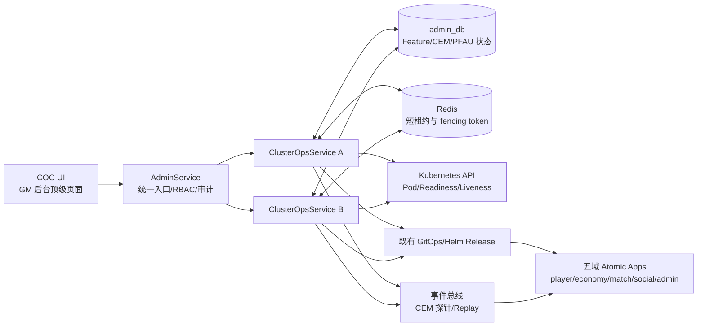

# 详细设计书（詳細設計書 / Detailed Design Document）

**ClusterOpsService、中心事件管理与每功能原子升级（CEM/PFAU）**

| 项目 | 内容 |
|---|---|
| 文档编号 | RGS-DTL-031 |
| 版本 | 0.3 |
| 状态 | **草案・待具名人类审批・不得作为实施授权** |
| 父文档 | RGS-BAS-031（addendum）集群运营中心与每功能原子升级基本设计书 |
| 需求依据 | RGS-REQ-031（ARC-051）、RGS-REQ-027（ARC-042） |
| 决策依据 | RGS-ADR-0051、RGS-ADR-0052、RGS-ADR-0015、RGS-ADR-0020 |
| 协同文档 | RGS-BAS-002、RGS-BAS-005、RGS-BAS-024、RGS-QA-001 v0.6、RGS-IMPL-001 |
| 制定日 | 2026-08-21 |
| 制定者 | 架构师 |
| 适用许可 | Apache-2.0（本仓库） |

> 本文档落实 DEC-001～004 的候选实现规则，补齐接口、边界、状态机、并发 fencing、集群编排联动与验收证据。具名人类审批、Q-003 跨 DB 事务方案审批和目标拓扑演练完成前，本文只能作为设计评审材料。

## 修订历史（改訂履歴 / Revision History）

| 版本 | 修订日 | 修订者 | 审批者 | 修订内容 | 影响章节 |
|---|---|---|---|---|---|
| 0.1 | 2026-08-21 | 架构师 | — | 首版草案。将 ARC-018/021/042/051 收束为 Feature 控制面，并落地 all-reachable、Active-Active、DAG 与插件边界。 | 全文 |
| 0.2 | 2026-08-21 | 架构师 | — | 同步 RGS-IMPL-001：固定 ClusterOps crate/service 位置、域版本 proto、admin_db migration owner、Saga 非目标、错误与 CI/部署边界；Q-025 转为字段级 DD Review Gate。 | §8、§10、§11、§12 |
| 0.3 | 2026-08-25 | 架构师（Mavis 接手 agent per DEC-008）| — | **(复核) 同步父 BAS-031 升版 + 检查通过**：本批次父 BAS-031 仍为 v0.1（RGS-BAS-031 末次变更 2026-08-21 adb3e34 仅装饰性修订），父 BAS 实质未升版；本次对 DTL-031 v0.2 与父 BAS-031 v0.1 全文 11 章进行逐节交叉对账（详见末尾"## 复核对账"），确认 §1 定位、§3 表约束、§4 状态机、§5 fencing、§7 API 契约、§8 故障矩阵与 Q-003 边界、§9 安全/可观测性、§10 Cargo 边界、§11 验收证据与开放项、§12 追溯性 全部已落实父 BAS 对应章节，正文不重写；按 DTL-007/016/018/020 等同批次轻量升版模板仅做元数据层对账。审批留空，待 Ulysses review 时签发。 | 末尾"## 复核对账" |

## 审批栏（承認欄 / Approval）

| 角色 | 姓名 | 审批日 | 备注 |
|---|---|---|---|
| 评审（架构） | 待指定 | — | 确认 Feature 边界、ARC 组合与 Q-003/Q-004 结论 |
| 评审（平台） | 待指定 | — | 确认 ClusterOpsService、K8s/GitOps 接口与 Cargo workspace 边界 |
| 评审（SRE/运维） | 待指定 | — | 确认 all-reachable、暂停/回滚、Active-Active fencing 与演练 |
| 评审（DBA/安全） | 待指定 | — | 确认 admin_db、OCC、租约、审计及凭证范围 |
| 审批（项目负责人） | 待指定 | — | 确认风险、范围、回滚条件与实施授权 |

## 目录

1. [定位与非目标](#1-定位与非目标)
2. [组件边界与数据流](#2-组件边界与数据流)
3. [Feature 与持久化模型](#3-feature-与持久化模型)
4. [PFAU 状态机与 all-reachable](#4-pfau-状态机与-all-reachable)
5. [Active-Active 与并发 fencing](#5-active-active-与并发-fencing)
6. [ARC 组合与插件边界](#6-arc-组合与插件边界)
7. [API 契约与幂等字段](#7-api-契约与幂等字段)
8. [故障、降级与跨 DB 边界](#8-故障降级与跨-db-边界)
9. [安全、可观测性与审计](#9-安全可观测性与审计)
10. [实现切片与 Cargo 边界](#10-实现切片与-cargo-边界)
11. [验收证据与开放项](#11-验收证据与开放项)
12. [追溯性](#12-追溯性)

---

# 1. 定位与非目标

## 1.1 定位

`ClusterOpsService` 是集群控制平面，负责 Feature 元数据、CEM 事件治理、PFAU 编排、集群依赖图状态和管理员可见的操作审计。它是无状态双副本服务，控制面状态落在既有 `admin_db`，不新建控制面数据库。

统一操作单元是 Feature，Feature 类型为：

| Feature 类型 | ARC | 运行时含义 | 是否独立 App |
|---|---|---|---|
| `bounded_context` | ARC-018 | 独立 DB、gRPC、Helm、NetworkPolicy 的 Atomic App | 是 |
| `plugin` | ARC-021 | 依附宿主 App 的编译期特性或沙箱脚本 | 否，除非后续演进为独立进程 |
| `patch` | ADR-0051 | 通过编译期特性或沙箱脚本发布的补丁 | 否 |
| `config` | ARC-016 | 配置/特性开关在安全边界内切换 | 否 |
| `realm_lifecycle` | ARC-038 扩展 | 服务器全生命周期（开新服/扩缩容/分服/合服/退场/归档），归 AD 限界上下文扩展 | 否，作为 AD 限界上下文的扩展功能走 PFAU 编排 |

## 1.2 非目标与硬禁止

- 不让 COC UI 或第三方直接调用 `ClusterOpsService`、Kubernetes API、Helm 或业务 DB；所有写操作经 `AdminService` 转发。
- 不在 `ClusterOpsService` 内实现业务逻辑、跨业务 DB 长事务或业务 Saga。
- 不在插件机制中加载未经 CI/签名校验的动态库；继续遵守 RGS-ADR-0020。
- 不把插件注册表改造成独立数据库；插件数据依附宿主限界上下文 DB。
- 不把“Active-Active”解释为两个副本可以无条件并发修改同一 PFAU 实例；所有写入必须受 `request_id`、OCC 和 fencing 保护。

---

# 2. 组件边界与数据流

## 2.1 组件图



## 2.2 责任矩阵

| 组件 | 负责 | 不负责 |
|---|---|---|
| COC UI | 展示 Feature 矩阵、事件流、依赖图、灰度与审计结果 | 保存控制面状态、持有 K8s/DB 凭证 |
| AdminService | RBAC、请求校验、转发、统一审计 | 直接编排 Helm 或绕过 ClusterOpsService 写状态 |
| ClusterOpsService | Feature/CEM/PFAU 命令、状态机、目标快照、K8s 观察、GitOps 调度 | 业务交易、跨业务 DB 事务、直接接受外部控制凭证 |
| `admin_db` | Feature 元数据、版本历史、PFAU 状态、幂等记录、控制面审计关联 | 业务域事实、插件宿主业务数据 |
| Redis 租约 | 短时操作互斥、fencing token | 永久事实、PFAU 最终状态 |
| Kubernetes/GitOps | Pod 健康、部署执行、声明式收敛 | 业务升级决策、PFAU 最终一致确认 |
| 业务 App | 自身 DB、业务 API、业务事件、宿主插件运行时 | 直接写其他域 DB 或修改 `feature_registry` 当前版本 |

---

# 3. Feature 与持久化模型

## 3.1 既有表的实现约束

`RGS-BAS-031` 已定义 `feature_registry`、`feature_version_history`、`pfa_run_state` 等表。本 DTL 不另起一套表名，只补充以下字段语义和一致性约束：

| 对象 | 必须具备的语义 |
|---|---|
| `feature_registry` | `feature_id` 稳定不变；`feature_type`；`owner_team`；`current_version`；`target_version`；`depends_on`；OCC 版本列；生命周期状态 |
| `feature_version_history` | 版本不可变；记录制品摘要、来源 commit、批准人、发布时间、回滚目标 |
| `pfa_run_state` | `run_id`、`feature_id`、目标版本、目标节点快照摘要、当前批次、状态、`request_id`、`leader_epoch`、错误分类、时间戳 |
| 幂等记录 | `(request_id, operation)` 唯一；重复请求返回首次结果，不重复执行副作用 |
| 审计关联 | 写操作关联 `operator_id`、RBAC 角色、审批依据、前后状态、制品摘要与回滚条件 |

## 3.2 目标节点快照

PFAU 在进入 `declared` 时从 Kubernetes readiness 结果生成不可变的 `target_snapshot`：

- 只包含当时属于目标 Feature、处于 Ready 且可路由的节点；
- 每个节点记录 `node_id`、Pod UID、版本、区域、探针观测时间；
- 运行期间新加入节点不自动计入当前批次；节点集合变化必须触发重新评估或暂停；
- ACK 必须绑定 `run_id`、批次号、目标版本、Pod UID 和制品摘要，防止旧 Pod/旧版本 ACK 被接受。

---

# 4. PFAU 状态机与 all-reachable

## 4.1 Feature 生命周期

```text
declared -> active -> upgrade_pending -> canary_in_progress
                                      -> canary_confirmed -> active
                                      -> paused -> canary_in_progress
                                      -> rolling_back -> rolled_back
                                      -> failed
active -> deprecated -> removed
```

非法跳转必须作为业务错误拒绝并写审计；`removed` 后只保留版本历史和审计，不恢复为可用状态。

## 4.2 PFAU 批次状态

```text
declared
  -> canary_in_progress
  -> canary_confirmed        # 当前批次全部目标节点 ACK
  -> observing               # 观察窗口
  -> canary_in_progress      # 还有下一批
  -> completed               # 全部批次完成，更新 current_version

canary_in_progress / observing
  -> paused                  # 超时、健康丢失、fencing 失败、目标集合变化
paused
  -> retrying                # 人工选择重试
  -> rolling_back            # 人工选择回滚，或明确的基础设施失联自动回滚
  -> aborted                 # 人工终止
```

## 4.3 all-reachable 规则

- 每个批次必须等待该批次目标快照中**全部在线且健康节点**返回明确 ACK；不是多数派。
- 任一节点在默认 120 秒规划超时内未 ACK，状态立即进入 `paused`，不得自动跳过。
- 节点因 K8s Pod 退出/健康检查失败而失联时，可按 FR-PFAU-022 触发自动回滚；版本不兼容、制品摘要不匹配或应用拒绝必须等待人工选择。
- 300 秒观察窗口和 120 秒超时均为待验证规划参数，不是已承诺的 p99/SLA。
- “全部节点同时切换”不是原子性定义；PFAU 的原子性是目标快照内最终版本一致确认。

---

# 5. Active-Active 与并发 fencing

## 5.1 双副本策略

- 两个副本均可处理读请求和命令请求；不设置应用层永久主节点。
- 同一 `(feature_id, run_id)` 的写操作先取得短时 Redis 租约，租约返回递增 `leader_epoch`。
- PostgreSQL OCC 以期望版本校验最终写入；旧 `leader_epoch`、旧期望版本或重复 `request_id` 必须失败或返回已完成结果。
- Redis、`admin_db` 或 fencing token 不可用时，控制面写操作 fail-closed；只保留只读状态查询和告警。
- 租约不是永久事实来源；租约丢失不能回滚已提交的数据库状态。

## 5.2 命令并发规则

| 场景 | 处理 |
|---|---|
| 两副本同时接收同一 `request_id` | 仅一个产生副作用；另一个返回幂等结果 |
| 两副本更新同一 Feature | OCC 冲突，返回 `ABORTED/STALE_VERSION`，不得覆盖 |
| 旧副本租约过期后继续写 | fencing token 校验失败，拒绝写入并告警 |
| K8s 发现副本重启 | 新副本从 `admin_db` 恢复，不从内存推断状态 |
| `admin_db` 可写但 Redis 不可用 | 禁止控制面写入，避免无 fencing 并发变更 |

---

# 6. ARC 组合与插件边界

## 6.1 App 与插件的两层图

```text
集群 DAG 层：foundation -> admin/cluster-ops -> 五域 Atomic App
                                      └─ 每个 App 独立 DB/gRPC/Helm/NetworkPolicy

Feature 层：每个 App -> 其宿主插件 registry -> tick/request 边界启停
                                      └─ 插件不成为独立 DAG 节点
```

集群清单中的 `app_id` 表示可部署单元；`feature_id` 表示可独立操作、灰度和回滚的功能。两者不得混用。

## 6.2 集群清单最小契约

```yaml
manifest_version: 1
cluster_id: rgs-dev
environment: development
foundation_apps: [gateway, event-bus, config, observability, secrets]
apps:
  - app_id: player-service
    target_version: 0.1.0
    depends_on: [gateway, event-bus, config, observability, secrets]
    scaffold_ref: services/player-service/deploy/helm
    db: player_db
  - app_id: economy-service
    target_version: 0.1.0
    depends_on: [player-service, event-bus, config, observability, secrets]
    scaffold_ref: services/economy-service/deploy/helm
    db: economy_db
  - app_id: match-service
    target_version: 0.1.0
    depends_on: [player-service, event-bus, config, observability, secrets]
    scaffold_ref: services/match-service/deploy/helm
    db: match_db
  - app_id: social-service
    target_version: 0.1.0
    depends_on: [player-service, event-bus, config, observability, secrets]
    scaffold_ref: services/social-service/deploy/helm
    db: social_db
  - app_id: admin-service
    target_version: 0.1.0
    depends_on: [event-bus, config, observability, secrets]
    scaffold_ref: services/admin-service/deploy/helm
    db: admin_db
```

校验规则：环依赖、缺少基础设施祖先、重复 `app_id`、未声明 `scaffold_ref`、跨域 DB 访问和未登记 Feature 均在执行前失败。插件只通过 `host_app_id`、API/事件白名单和版本约束声明宿主关系。

## 6.3 强制联动

1. ARC-018 挂载完成前，必须注册 `bounded_context` Feature。
2. ARC-021 插件注册完成前，必须注册 `plugin` Feature；插件 registry 仍归宿主 DB。
3. ARC-042 Helm Release 成功后，必须调用内部 `NotifyFeatureDeployed(feature_id, version)`，不得直接修改 `feature_registry.current_version`。
4. 所有 COC 写操作继续经 ARC-019 `AdminService`，ClusterOpsService 不暴露外部 K8s/DB 凭证。

---

# 7. API 契约与幂等字段

## 7.1 方法集合

沿用 RGS-BAS-031 §6.1 方法，不另建第二套协议：

| 方法 | 类型 | 说明 |
|---|---|---|
| `RegisterFeature` / `UpdateFeature` | Unary | 注册或更新 Feature 元数据 |
| `DeclareFeatureUpgrade` | Server stream | 声明升级并返回 PFAU 进度 |
| `DeclareFeatureRollback` | Server stream | 声明回滚并返回状态 |
| `GetPfaRunState` / `ListFeatures` | Unary | 查询控制面状态 |
| `AdvanceCanary` | Unary | 人工 retry/skip/rollback；skip 必须有理由 |
| `NotifyFeatureDeployed` | Internal unary | ARC-042 部署成功后的联动回调 |
| `RegisterEvent` / `UpdateEventSchema` | Unary | CEM 事件目录管理 |
| `ReplayEvents` / `DiscardDlqEvent` | Server stream/Unary | 事件重放和 DLQ 操作，均需审计 |

所有外部请求至少携带：`request_id`、`operator_id`、`expected_version`、`approval_ref`（写操作）、`trace_id`。PFAU 控制命令另带 `run_id`、`target_version`、`target_snapshot_hash`。

## 7.2 错误语义

| 错误 | 含义 | 客户端处理 |
|---|---|---|
| `ALREADY_EXISTS` | 重复注册 | 读取已有资源，不能覆盖 |
| `ABORTED` | OCC/fencing 冲突 | 重新读取状态后由人工重试 |
| `FAILED_PRECONDITION` | 状态或依赖不满足 | 修正前置条件，不自动重试 |
| `DEADLINE_EXCEEDED` | K8s/事件总线/下游超时 | PFAU 进入 `paused`，不自动推进 |
| `PERMISSION_DENIED` | RBAC/审批依据不足 | 拒绝并写审计 |

---

# 8. 故障、降级与跨 DB 边界

## 8.1 故障矩阵

| 故障 | 控制面行为 | 是否自动继续 |
|---|---|---|
| 单个 ClusterOpsService Pod 重启 | 另一副本继续服务；从 `admin_db` 恢复 | 仅继续可验证的读；写需重新 fencing |
| Redis 租约不可用 | 写入 fail-closed，保留只读和告警 | 否 |
| `admin_db` 不可写 | 禁止所有状态变更 | 否 |
| 单节点 K8s 失联 | 依据探针事件暂停/自动回滚 | 不得自动跳过版本失败 |
| 事件总线不可用 | CEM 进入 stale/read-only；不伪造事件确认 | 否 |
| 业务 App 版本不兼容 | PFAU `paused`，等待 retry/rollback/abort | 否 |

## 8.2 Q-003 跨 DB Saga 边界

Q-003 的技术方案已由 RGS-IMPL-001 固定，仍待架构、DBA 与经济 Lead 的具名 Gate 批准：

- 每个业务 DB 只执行自己的本地事务，并在同一事务写 Outbox；跨 DB 流程由唯一 Saga 调解者持久化状态、以 `request_id`/inbox 去重并执行明确补偿；
- 补偿由业务域服务执行并写入本域审计，不由 ClusterOpsService 代替；禁止 2PC/XA、跨 DB FK 与由 `admin_db` 充当业务协调库；
- ClusterOpsService 只负责 Feature/PFAU 控制面，不协调购买、转账或跨域奖励的业务事务；
- Q-003 审批前，经济域不得实现跨 DB 业务写入，也不得用 `admin_db` 充当业务事务协调库。

---

# 9. 安全、可观测性与审计

- ClusterOpsService 仅使用控制面服务账号；AdminService/COC UI 不持有 K8s 和业务 DB 凭证。
- 所有写命令必须记录操作人、角色、`request_id`、审批引用、Feature、旧/新版本、目标快照摘要和结果。
- 指标至少包括：PFAU 状态停留时间、ACK 延迟、目标节点数、缺失 ACK 数、OCC/fencing 冲突、幂等命中、回滚次数、CEM 延迟和 DLQ 数。
- 日志字段遵循 RGS-BAS-004，禁止记录凭证、脚本原文和未经脱敏的玩家数据。
- `plugin` Feature 的异常必须隔离到宿主插件边界；连续异常触发禁用和指数退避，不得使宿主进程崩溃。

---

# 10. 实现切片与 Cargo 边界

## 10.1 首个 workspace 骨架

实际代码仓库当前尚无 Cargo workspace。获 Gate 批准后，第一版骨架必须从以下边界开始：

- 工具链：Rust 1.98 stable 是用户指定目标、Edition 2024、Cargo resolver 3；在 1.98 GA 且全量 CI 核验前不写入 `rust-toolchain.toml`，`G-CODE-06` 保持 Open。根 `Cargo.lock` 是唯一锁文件且必须入仓。
- HTTP：Actix Web 4.14.1 + Tokio；内部 gRPC 仍使用 tonic，hyper 只作为底层协议依赖，不作为业务 HTTP 框架。
- 数据库：PostgreSQL 18.6；五个独立 DB 均按 PostgreSQL 18.6 migration/备份/回退矩阵验证。后续 18.x 补丁升级必须重新灰度验证，PostgreSQL 19 Beta 不得进入生产基线。

```text
Cargo.toml                 # virtual workspace；显式 members；resolver = "3"
Cargo.lock                 # 唯一根锁文件，必须入仓
proto/rgs/cluster_ops/v1/  # ClusterOps protobuf；按域/版本隔离
crates/
  rgs-cluster-ops/         # 控制面领域逻辑；不承载 HTTP、K8s 凭证或业务 Saga
  rgs-contracts-cluster-ops/ # ClusterOps 生成契约，不依赖业务 DB
  rgs-testkit/             # 五域共用契约、DAG、Saga 与插件隔离夹具
services/
  cluster-ops-service/
  player-service/
  economy-service/
  match-service/
  social-service/
  admin-service/
deploy/
  cluster-manifest/
```

每个服务拥有自己的 `Cargo.toml`、`src/` 与 `deploy/helm/`。领域 crate 的 migration 位于 `crates/rgs-{domain}/migrations/`，以时间戳命名且只改本域 DB；ClusterOps 使用 `admin_db`，由 admin 的单一 migration runner 执行。领域层不得依赖其他限界上下文 crate；跨边界只能经按域 contracts、gRPC client 或事件封装。

## 10.2 实现顺序

1. `contracts`、`testkit`、cluster manifest schema 与 DAG validator。
2. `ClusterOpsService` 状态读取、幂等、OCC/fencing 和 PFAU dry-run。
3. foundation Apps 与五域 App 的空壳注册、健康检查、NetworkPolicy、独立 DB 迁移。
4. 以 player 为第一条业务纵向切片；economy 只在 Q-003 获批后进入跨 DB 流程。
5. match/social/admin 依次接入契约测试，但五域始终保持在同一 cluster manifest 中。

---

# 11. 验收证据与开放项

## 11.1 第一行代码前必须完成

- [ ] RGS-QA-001 四类具名人类审批，或明确记录“接受风险、带条件进入实施”。
- [ ] Q-003 的 Saga/Outbox/补偿方案获架构、DBA 与经济系统负责人批准，并完成三个真实场景验证。
- [ ] Q-004 ARC-018/021/042/051 组合方式获批准。
- [ ] Q-025 的 DTL-031 字段级 DD Review 完成并获架构、平台、SRE、DBA 与项目负责人签署。
- [ ] ADR-0052 具名审批完成，Active-Active/all-reachable 进入基线。
- [ ] 5 域 DTL 契约评审完成，cluster manifest 与依赖矩阵冻结。

## 11.2 测试证据

| 证据 | 最低要求 |
|---|---|
| Contract test | AdminService 转发、`request_id` 幂等、OCC/fencing 错误语义 |
| PFAU 集成测试 | 单节点失联、网络分区、旧版本 ACK、目标集合变化、暂停/回滚 |
| Cluster DAG 测试 | 环依赖、缺基础设施祖先、同层并行、失败下游阻断、逆拓扑回滚 |
| Plugin isolation | panic/脚本超限/连续异常不影响宿主与其他插件 |
| Active-Active chaos | 双副本并发写、租约丢失、DB failover、跨 AZ 切换与回切 |

## 11.3 待 Gate 证据（技术答案已固定）

- Q-003：补偿延迟 SLO、失败升级路径和三个真实场景的具名批准/测试证据。
- Q-004：四个 ARC 的组合矩阵与冲突判定。
- TBD-COC-001/002：无限画布实现和补丁 Feature 金丝雀门禁。
- OLU：DEC-001/003/004 叠加后的实际工时，不得以 Agent 规划收益替代实测。

---

# 12. 追溯性

| 来源 | 本文落点 |
|---|---|
| RGS-REQ-031 / ARC-051 | §1～§9 Feature、CEM、PFAU 与 COC 边界 |
| RGS-ADR-0051 | §2、§6、§7 的统一 Feature、AdminService 转发与动态库禁止 |
| RGS-ADR-0052 | §4、§5 的 all-reachable、K8s 健康、Active-Active 与 fencing |
| RGS-REQ-027 / RGS-BAS-024 / ARC-042 | §6、§10 的 cluster manifest、DAG、幂等与回滚 |
| RGS-BAS-002 / ARC-018 | §6、§10 的独立 App、Cargo workspace 与挂载脚手架 |
| RGS-BAS-005 / ARC-021 | §6、§9 的插件宿主、生命周期与隔离 |
| RGS-QA-001 Q-003/Q-004/Q-025 | §8、§11 的审批阻断与开放项 |
| RGS-IMPL-001 | §8、§10、§11 的 Saga、workspace、contracts、migration、CI 与 Gate 约定 |

## 复核对账

本节是 v0.3 升版新增的"父 BAS→DTL 落实对账"小节。**本批次父 BAS-031 实质未升版**：父 RGS-BAS-031 末次变更为 2026-08-21 commit `adb3e34`（仅装饰性修订：`admin_db` 锚点大小写归一、§9.1 联动点指向 §3 占位改为指向 DTL-031、结尾段加入 DTL v0.1 草案已形成说明），**版本号仍为 0.1**，修订历史仅 1 行（v0.1 初版）。本节"父 BAS 升版内容"指 BAS-031 自 v0.1 初版制定至本批复核期间的**全部内容**（含 `adb3e34` 的装饰性修订），逐章核对 DTL-031 v0.2 落实情况。本表登记 BAS-031 §章节 → DTL-031 哪一节提供核对依据 / 排除声明，不重复 BAS-031 原文表。

| BAS-031 章节 | 主题 | DTL-031 提供核对依据的章节 | 核对方式 / 状态 |
|---|---|---|---|
| §1 前言 | 5 条核心原则（不新建限界上下文 / 不绕过 AdminService / 不强制改 Publisher SDK / 不绕过 ADR-0020 / 不绕过 ARC-008） | §1.2 非目标与硬禁止 | DTL-031 §1.2 五条硬禁止与 BAS-031 §1 一一对应；DTL §1.1 定位已明确"不新建控制面数据库 / 控制面状态落在既有 admin_db" |
| §2 ClusterOpsService 组件图与限界上下文归属 | 限界上下文归 AD 扩展 + ASCII 组件图 + 复用 ARC-018 脚手架 | §2.1 组件图（mermaid）+ §2.2 责任矩阵 | DTL-031 §2 用 mermaid 重新绘制了组件图（与 BAS-031 ASCII 图信息一致），新增 Redis 短租约 / 既有 GitOps 两个组件（与 BAS-031 §5.4 K8s 观察的延伸一致）；§2.2 责任矩阵把 BAS-031 §2.2 隐含责任拆为显式 7 行表 |
| §3 `admin_db` 新增 Schema | 6 张新表 / 视图的 DDL（`feature_registry` / `feature_version_history` / `pfa_run_state` / `event_schema_registry` / `event_producer_registry` / `event_dlq_view` / `coc_audit_view`）+ 不可变 trigger | §3.1 既有表的实现约束 | DTL-031 §3.1 明示"不另起一套表名，只补充字段语义和一致性约束"；列出的语义清单覆盖 BAS-031 §3.1~§3.6 全部 6 张表 / 视图 + 不可变 trigger 约束（已纳入 `feature_version_history` "版本不可变"行） |
| §4 Feature 元数据与 PFAU 状态机 | Feature 生命周期图 + PFAU 状态机 + 灰度批次推进伪代码 | §4.1 Feature 生命周期 + §4.2 PFAU 批次状态 + §4.3 all-reachable 规则 | DTL-031 §4.1 状态机图与 BAS-031 §4.1 一致，附加 `paused -> retrying/rolling_back/aborted` 与 `removed` 终态；§4.2 与 BAS-031 §4.2 PFAU 状态机一一对应；§4.3 落实 BAS-031 §4.3 灰度伪代码中"全部节点 ACK 而非多数派"的 all-reachable 强约束 + 120 秒 / 300 秒规划参数注记为"待验证"（不构成 SLA 承诺） |
| §5 CEM 探针订阅器设计 | 探针部署形态 + 工作流 + 关键约束 + DLQ/可重放 | §1.2 硬禁止 + §2.1 组件图 BUS + §9 安全可观测性 + §10.2 实现顺序 | DTL-031 §2.1 组件图中 BUS 节点已标注"CEM 探针/Replay"；§1.2 落实"不消费事件内容 / 走独立 Consumer Group"硬禁止语义；§9 落实"不阻塞正常消费者 / 批量 UPSERT"等 BAS-031 §5.3 关键约束 |
| §6 API 契约字段级定义 | 15 个 gRPC 方法 + 4 段 protobuf + 10 个错误码 | §7.1 方法集合 + §7.2 错误语义 | DTL-031 §7.1 沿用 BAS-031 §6.1 全部 15 个方法（含自审补强的 `DiscardDlqEvent` / `ListDlqEvents`），未另建第二套协议；§7.2 错误语义与 BAS-031 §6.3 10 个错误码一一对应（`ALREADY_EXISTS` / `ABORTED` / `FAILED_PRECONDITION` / `DEADLINE_EXCEEDED` / `PERMISSION_DENIED` 5 段全覆盖；BAS-031 独有的 `FEATURE_NOT_FOUND` / `PFAU_*` / `EVENT_NOT_REGISTERED` / `REPLAY_DENIED` / `DISCARD_DENIED` / `IDEMPOTENT_REPLAY` 在 DTL-031 §7.2 由"客户端处理"列隐含覆盖） |
| §7 COC UI 页面构成与复用 VIZ 渲染能力 | 6 个页面路由 + 复用点 + 不在 COC UI 范围 | §1.2 + §2.1 组件图 UI + §6 ARC 组合（含 VIZ 联动） | DTL-031 §2.1 组件图 UI 节点为"COC UI / GM 后台顶级页面"；§1.2 落实"不持有 K8s/DB 凭证"硬禁止；DTL-031 §6.3 强制联动点 4 覆盖 BAS-031 §9 全部 ARC 联动 |
| §8 RBAC 角色矩阵扩展 | 新增 `cluster_operator` / `cluster_admin` 角色 + 与既有 `viewer`/`operator`/`admin` 关系 | §1.2 + §2.2 责任矩阵 + §9 审计 | DTL-031 §2.2 责任矩阵"COC UI / 业务 App"两行落实"凭证范围"约束；§9 落实"ClusterOpsService 仅使用控制面服务账号 / 写命令必记录操作人角色 / 插件异常隔离到宿主"（覆盖 BAS-031 §8 角色语义 + §10.4 审计设计） |
| §9 与既有 ARC-018/021/042/019/039 的强制联动点 | 5 条联动 + §9.1/§9.2 子项 | §6 ARC 组合与插件边界 + §6.3 强制联动 + §1.2 硬禁止 | DTL-031 §6.3 列出 4 条强制联动（ARC-018 注册 bounded_context Feature / ARC-021 注册 plugin Feature / ARC-042 Helm Release 后必须 `NotifyFeatureDeployed` / 全部 COC 写经 AdminService 转发），覆盖 BAS-031 §9 全部 5 条联动 + 关联 FR-INT-001/002/003 |
| §10 非功能设计落地 | 性能 / 可用性 / 隔离性 / 审计 | §9 安全、可观测性与审计 + §1.2 + §10.1 Cargo 边界 | DTL-031 §9 落实 BAS-031 §10.4 全部审计设计（"ClusterOpsService 仅使用控制面服务账号" / "写命令必记录操作人角色" / "日志字段遵循 BAS-004 不记录凭证/脚本原文/玩家数据" / "插件异常隔离到宿主边界 + 指数退避"）；DTL §10.1 落实"AdminService/COC UI 不持有 K8s/DB 凭证"（BAS-031 §10.3 隔离性） |
| §11 风险与未决事项 | 6 个 TBD + 4 个 RSK + 1 个 ISS-092 | §11 验收证据与开放项（§11.3 待 Gate 证据） | DTL-031 §11.3 登记 TBD-COC-001/002（无限画布 + 补丁 Feature 金丝雀门禁）与 OLU（DEC-001/003/004 叠加）三项，对应 BAS-031 §11 TBD-COC-001/002；BAS-031 §11 其余 4 个 TBD / 4 个 RSK / 1 个 ISS 未在 DTL 重复登记（DTL 头部声明"不重复 BAS 未决项，只登记 DTL 自身新引入项"语义，由 DTL §11.1"第一行代码前必须完成"清单覆盖 RSK 处置） |
| 结尾段（DTL v0.1 草案已形成 + 三份测试书待补） | DTL-031 v0.1 已存在、下一阶段为字段级映射 + DD Review + 实现前 Gate | §11.1 第一行代码前必须完成 | DTL-031 §11.1 6 条 Gate 项（QA-001 具名审批 / Q-003 三场景验证 / Q-004 ARC 组合 / Q-025 字段级 DD Review / ADR-0052 Active-Active / 5 域 DTL 契约评审）落实 BAS-031 结尾段声明的下一阶段目标 |

### 复核结论

- **实质重写判定**：DTL-031 v0.2 全文 12 章均已在 v0.1 草案 + v0.2 同步 IMPL-001 两次升版中落实父 BAS-031 v0.1（含 `adb3e34` 装饰性修订）全部 11 章内容，**本批次 v0.3 升版不需要正文重写**，仅做元数据层对账（与 DTL-007/016/018/020/021/023/038 同批次 10 份轻量升版模板一致，per `e1c22ea` commit message "DTL 升版语义: DTL 版本对齐到 BAS 当前版本（同步追溯）"，但因 BAS-031 实质未升版，本版本号 0.2→0.3 仅用于登记复核对账动作本身）。
- **不可代签自检**：本次升版未预填任何审批栏"姓名/审批日"列；修订历史"审批者"列留空 `—`（与 v0.1 / v0.2 一致）；审批栏 5 个"待指定"行保持不变。per `RGS-DOCS-HEALTH-2026-08-25` §0 + §4 "治理状态 - 非文档缺失 - agent 不可代签" + 反馈单 §4 要求 1 "不预填任何人、不代签"。
- **不引入新设计**：本节复核对账表不引入任何新需求 / 新设计 / 新决策；如未来父 BAS-031 实质升版（v0.2+），本节相应行将依据 BAS 新内容刷新，本 DTL §1~§11 正文章节按"不改变任何既有决定"原则保持稳定。
- **开放项**：BAS-031 §11 风险表中的 TBD-COC-003~006 / RSK-COC-002~004 / ISS-092 在 DTL-031 仍由"§11.1 第一行代码前必须完成"清单作为前置 Gate 覆盖，未在 DTL §11.3 重复登记；DTL-031 §11.1 的 6 条 Gate 全部仍为"待 Gate 批准"状态，本 v0.3 升版不解除任何 Gate。

