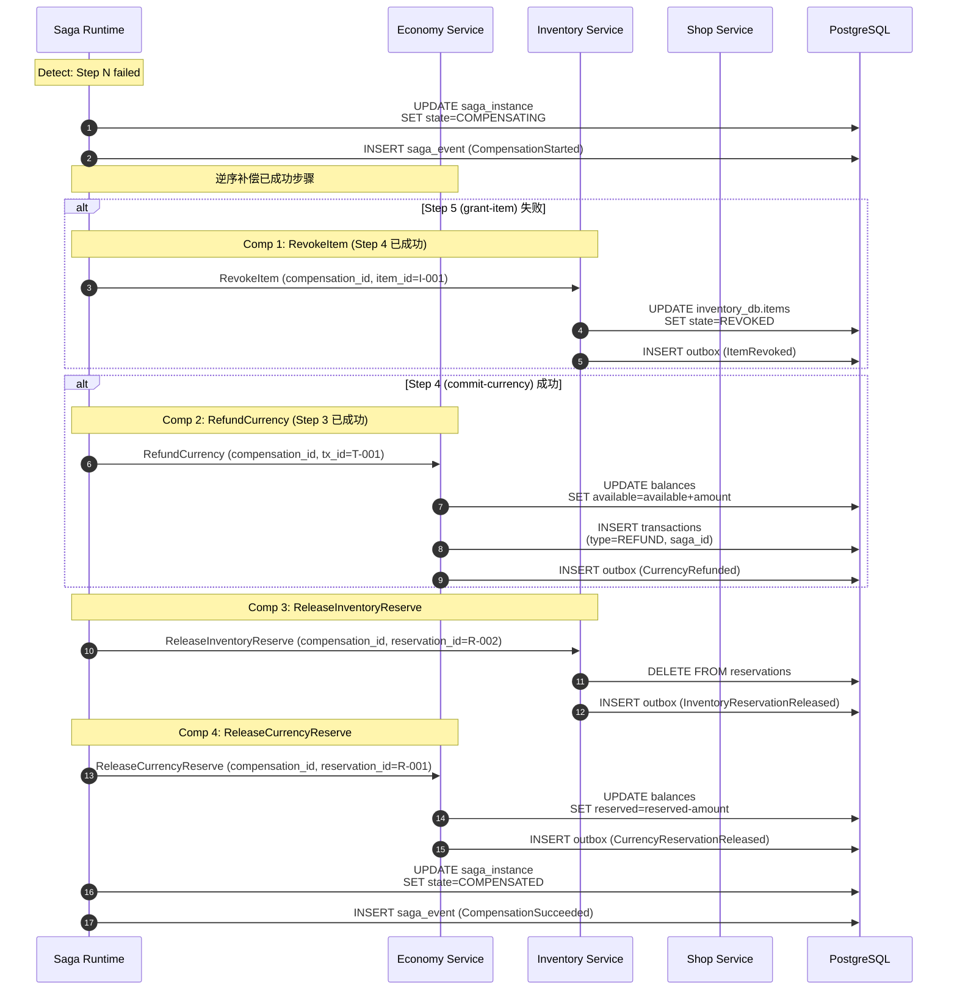
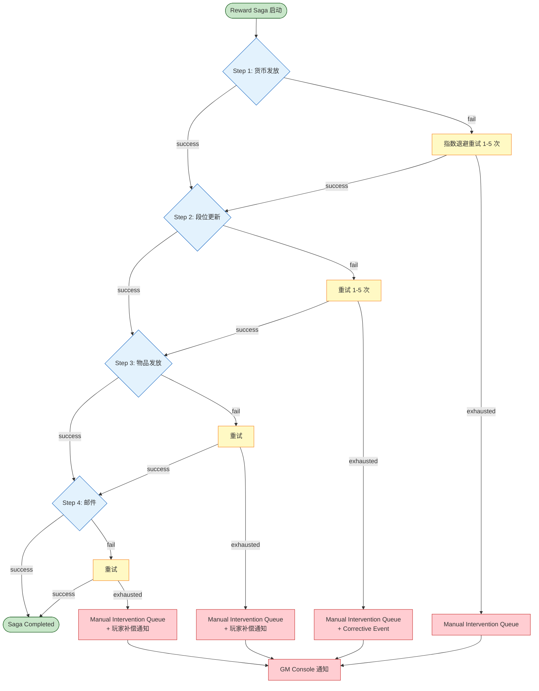
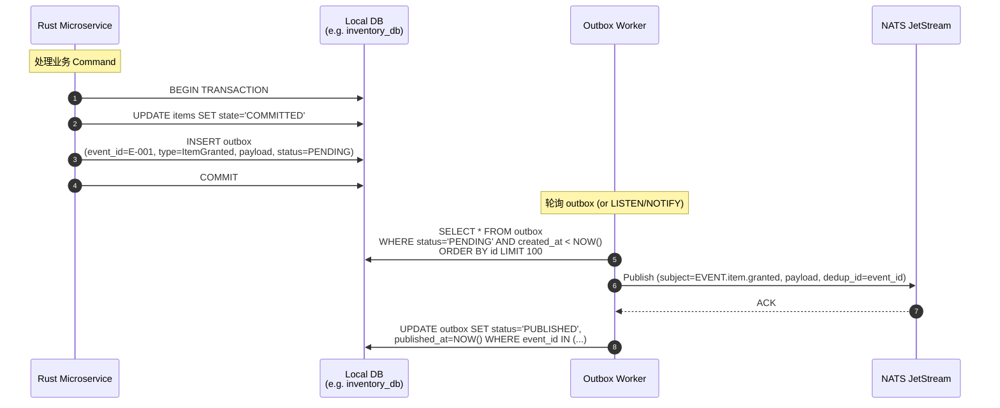
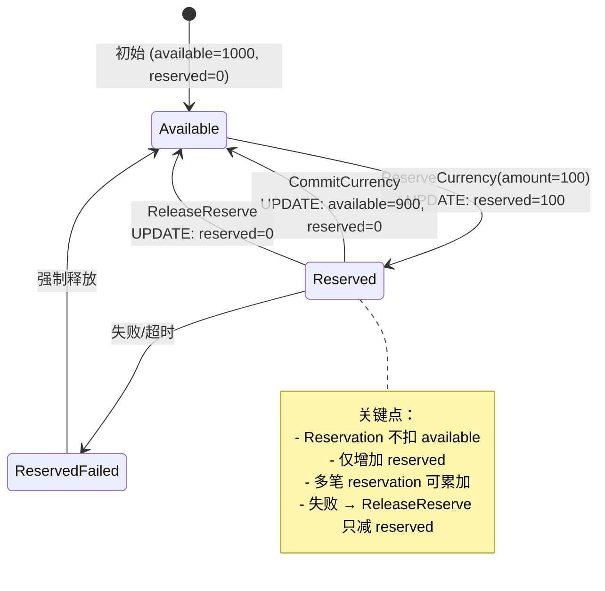

# RGS-DTL-100 Saga 业务模式设计

| 项目 | 内容 |
|---|---|
| 文档编号 | RGS-DTL-100 |
| 版本 | 0.2 |
| 制定日 | 2026-08-21 |
| 最终更新日 | 2026-08-25 |
| 制定者 | 架构师（Ulysses 兼，per DEC-008 一人公司） |
| 保密级别 | 内部限定（Internal Use Only） |
| 适用许可 | Apache-2.0（本仓库） |
| 关联文档 | RGS-REQ-100（需求）/ RGS-BAS-100（基本）/ RGS-DTL-101~102（同侪）/ RGS-OPS-100（部署）/ RGS-SPEC-CROSS-001~007（横向规范） |
| 配套标准 | IPA 共通フレーム 2013（SLCP-JCF2013）+ 150 工程日本 SI 业界标准；V 模型映射：UT ↔ DTL（本详细设计书） |

---

## 修订历史

| 版本 | 修订日 | 修订者 | 修订内容 |
|---|---|---|---|
| 0.1 | 2026-08-21 | 架构师（Ulysses）| 初版。Purchase Saga / Character Creation Saga / Reward Saga / Compensation Flow / Outbox+Inbox 详细时序 + 状态机 + Schema + Reservation 流程。 |
| 0.2 | 2026-08-25 | 架构师（Ulysses）| 反映RGS-ADR-0057（Accepted）§2.3：§3.3末尾补充交叉引用，确认Reward Saga既有设计语义等价于Outbox+幂等消费者；不改变本节设计本身，不改变Purchase/Character Creation Saga补偿编排，不触发RGS-SPEC-DTL-100/101/102重新版本化（per RGS-ADR-0057§3.3） |

---

## 0. 文档目的

定义 4 大典型 Saga 业务模式的**详细时序**：

1. **Purchase Saga**（商城购买）— 经典 Reserve → Commit 流程
2. **Character Creation Saga**（角色创建）— 多步顺序编排
3. **Reward Saga**（比赛奖励）— 不可逆事件处理
4. **Compensation Flow**（补偿流）— 失败处理模式

外加 Outbox + Inbox Pattern 详细实现。

---

## 1. Purchase Saga（商城购买）

### 1.1 业务场景

玩家在商城购买物品：扣 Currency + 发 Item + 记录订单 + 发邮件通知。

### 1.2 正常流（Happy Path）

```mermaid
sequenceDiagram
    autonumber
    actor Player
    participant Client as Game Client
    participant GG as Game Gateway
    participant SR as Saga Runtime
    participant ES as Economy Service
    participant IS as Inventory Service
    participant SH as Shop Service
    participant MS as Mail Service
    participant DB as PostgreSQL

    Player->>Client: 点击购买 (item_id=X, qty=N)
    Client->>Client: L1 Local: 临时表单 + L0 UI 反馈
    Client->>GG: SendBusinessCommand (PurchaseItem)
    Note over GG: OperationPolicy → DISTRIBUTED_SAGA
    GG->>SR: StartSaga (PurchaseFlow v1, payload)
    activate SR
    SR->>DB: INSERT saga_instance (state=RUNNING, fence_token)
    SR->>DB: INSERT saga_event (SagaStarted)
    SR-->>GG: saga_id=S-001
    GG-->>Client: saga_id=S-001 (Project 状态)

    Note over SR,ES: Step 1: reserve-currency
    SR->>ES: ReserveCurrency (saga_id=S-001, command_id=C-001,<br/>idempotency_key=S-001:C-001, amount, player_id)
    activate ES
    ES->>DB: BEGIN; UPDATE economy_db.balances<br/>SET reserved=reserved+amount<br/>WHERE player_id=? AND available>=amount
    alt success
        ES->>DB: INSERT outbox (CurrencyReserved event)
        ES->>DB: INSERT inbox (idempotency_key)
        ES->>DB: COMMIT
        ES-->>SR: OK (reservation_id=R-001)
    else insufficient
        ES-->>SR: FAIL (insufficient_funds)
    end
    deactivate ES

    alt ReserveCurrency success
        Note over SR,IS: Step 2: reserve-inventory
        SR->>IS: ReserveInventorySlot (saga_id, command_id=C-002,<br/>idempotency_key, item_id, qty)
        activate IS
        IS->>DB: BEGIN; INSERT inventory_db.reservations<br/>(state=RESERVED, saga_id, item_id, qty)
        IS->>DB: INSERT outbox (InventoryReserved)
        IS->>DB: INSERT inbox (idempotency_key)
        IS->>DB: COMMIT
        IS-->>SR: OK (reservation_id=R-002)
        deactivate IS

        alt ReserveInventorySlot success
            Note over SR,SH: Step 3: validate-purchase
            SR->>SH: ValidatePurchase (saga_id, item_id, qty, player_id)
            activate SH
            SH->>DB: SELECT FROM shop_db.items<br/>WHERE id=? AND available=true
            SH-->>SR: OK (price, valid=true)
            deactivate SH

            alt ValidatePurchase success
                Note over SR,ES: Step 4: commit-currency
                SR->>ES: CommitCurrency (saga_id, command_id=C-003,<br/>idempotency_key, reservation_id=R-001)
                activate ES
                ES->>DB: BEGIN; UPDATE balances<br/>SET available=available-amount,<br/>reserved=reserved-amount
                ES->>DB: INSERT economy_db.transactions<br/>(type=PURCHASE, amount, saga_id)
                ES->>DB: INSERT outbox (CurrencyCommitted)
                ES->>DB: COMMIT
                ES-->>SR: OK (tx_id=T-001)
                deactivate ES

                Note over SR,IS: Step 5: grant-item
                SR->>IS: GrantItem (saga_id, command_id=C-004,<br/>idempotency_key, reservation_id=R-002, item_id, qty)
                activate IS
                IS->>DB: BEGIN; UPDATE reservations<br/>SET state=COMMITTED
                IS->>DB: INSERT inventory_db.items (item_lineage,<br/>item_tx_id, saga_id, state=COMMITTED)
                IS->>DB: INSERT outbox (ItemGranted)
                IS->>DB: COMMIT
                IS-->>SR: OK (item_id=I-001)
                deactivate IS

                Note over SR,MS: Step 6: send-mail (final)
                SR->>MS: SendMail (saga_id, command_id=C-005,<br/>idempotency_key, player_id, subject, attach=item_id)
                activate MS
                MS->>DB: BEGIN; INSERT mail_db.mails<br/>(saga_id, attach_item_id, sent_at)
                MS->>DB: INSERT outbox (MailSent)
                MS->>DB: COMMIT
                MS-->>SR: OK (mail_id=M-001)
                deactivate MS

                SR->>DB: UPDATE saga_instance<br/>SET state=COMPLETED
                SR->>DB: INSERT saga_event (SagaCompleted)
            else ValidatePurchase fail
                Note over SR,ES,IS: 触发补偿
            end
        else ReserveInventorySlot fail
            Note over SR,ES: 触发 ReleaseCurrencyReserve
        end
    else ReserveCurrency fail
        Note over SR: SagaFailed (insufficient_funds)
        SR->>DB: UPDATE saga_instance<br/>SET state=FAILED
        SR->>DB: INSERT saga_event (SagaFailed)
    end

    deactivate SR
    SR-->>GG: SagaCompleted (saga_id=S-001)
    GG-->>Client: Projection update (订单完成, 物品到账, 邮件发送)
    Client->>Client: L0 UI 反馈 (订单列表更新)
```

### 1.3 失败补偿流



**关键点**：

- **逆序补偿**：从失败步骤反向补偿
- **幂等**：每个 Command 携带 idempotency_key，重复执行不重复扣钱
- **Outbox 事件**：每次状态变更都附带事件，Async 通知其他服务
- **Saga Store 持久化**：每步成功都 UPDATE saga_step.state + INSERT saga_event

---

## 2. Character Creation Saga（角色创建）

### 2.1 业务场景

新玩家创建第一个角色，触发：

1. Character Service：写角色记录 + 初始属性
2. Inventory Service：发初始装备
3. Economy Service：发初始货币
4. Mail Service：发欢迎邮件

### 2.2 时序图

```mermaid
sequenceDiagram
    autonumber
    actor Player
    participant Client as Game Client
    participant GG as Game Gateway
    participant SR as Saga Runtime
    participant AS as Account Service
    participant CS as Character Service
    participant IS as Inventory Service
    participant ES as Economy Service
    participant MS as Mail Service

    Player->>Client: 输入角色名 + 选择职业
    Client->>Client: L1 Local: 临时表单
    Client->>GG: SendBusinessCommand (CreateCharacterWithStarterPack)
    GG->>SR: StartSaga (CharacterCreationFlow v1)

    Note over SR: 步骤 1: validate-account
    SR->>AS: ValidateAccount (player_id, account_active)
    AS-->>SR: OK

    Note over SR,CS: 步骤 2: create-character-record
    SR->>CS: CreateCharacter (saga_id, command_id, idempotency_key,<br/>account_id, name, class, initial_stats)
    CS->>CS: BEGIN; INSERT character_db.characters
    CS->>CS: INSERT outbox (CharacterCreated)
    CS-->>SR: OK (character_id=CH-001)

    Note over SR,IS: 步骤 3: grant-starter-equipment
    SR->>IS: GrantItem (saga_id, command_id, idempotency_key,<br/>items=[weapon_x1, armor_x1, potion_x3], character_id)
    IS->>IS: BEGIN; INSERT inventory_db.items
    IS->>IS: INSERT outbox (ItemGranted)
    IS-->>SR: OK (item_ids=[I-001, I-002, I-003])

    Note over SR,ES: 步骤 4: grant-starter-currency
    SR->>ES: GrantCurrency (saga_id, command_id, idempotency_key,<br/>account_id, currency_type=GOLD, amount=1000)
    ES->>ES: BEGIN; UPDATE economy_db.balances
    ES->>ES: INSERT outbox (CurrencyGranted)
    ES-->>SR: OK (tx_id=T-001)

    Note over SR,MS: 步骤 5: send-welcome-mail
    SR->>MS: SendMail (saga_id, command_id, idempotency_key,<br/>account_id, subject="欢迎来到游戏", body, attach=[item_ids])
    MS->>MS: BEGIN; INSERT mail_db.mails
    MS->>MS: INSERT outbox (MailSent)
    MS-->>SR: OK (mail_id=M-001)

    Note over SR: Saga Completed
    SR->>SR: saga_instance.state=COMPLETED
    SR->>SR: saga_event (SagaCompleted)

    SR-->>GG: Projection (角色已创建 + 初始装备/货币/邮件)
    GG-->>Client: 角色创建完成
    Client->>Client: L0 UI: 跳转主城
```

**失败补偿**（任一步骤失败，逆序回滚）：

| 失败步骤 | 补偿 |
|---|---|
| 5 (send-mail) | 4 refund-currency → 3 revoke-items → 2 delete-character → 1 mark-account-flag |
| 4 (grant-currency) | 3 revoke-items → 2 delete-character |
| 3 (grant-items) | 2 delete-character |
| 2 (create-character) | 1 mark-account-flag（account 已存在但 character 失败，需手动 reconcile）|

---

## 3. Reward Saga（比赛奖励，MatchFinished 之后）

### 3.1 业务场景

比赛结束 → 触发 Reward Saga → 发货币 + 段位更新 + 邮件通知。

**关键点**：比赛已结束**不可回滚**（spec 31），如果奖励发放失败必须**人工介入**或**延迟重试**。

### 3.2 时序图

```mermaid
sequenceDiagram
    autonumber
    participant MS as Match Service
    participant SR as Saga Runtime
    participant ES as Economy Service
    participant RS as Rank Service
    participant IS as Inventory Service
    participant MAS as Mail Service
    participant GM as GM Console

    Note over MS: MatchFinished event (玩家 A/B 比赛结束)
    MS->>MS: BEGIN; UPDATE match_db.match_results
    MS->>MS: INSERT outbox (MatchFinished event)
    MS->>MS: COMMIT

    Note over MS,SR: Outbox Worker → NATS JetStream
    MS->>SR: MatchFinished event (match_id, players, results)
    activate SR
    SR->>SR: INSERT saga_instance (RewardFlow v1, state=RUNNING)
    SR->>SR: INSERT saga_event (SagaStarted)

    Note over SR,ES: Step 1: grant-reward-currency
    SR->>ES: GrantCurrency (saga_id, command_id,<br/>idempotency_key, player_id, amount=100,<br/>reason=MATCH_REWARD, match_id)
    ES->>ES: BEGIN; UPDATE balances
    ES->>ES: INSERT outbox (CurrencyGranted)
    ES->>ES: COMMIT
    ES-->>SR: OK

    Note over SR,RS: Step 2: update-rank
    SR->>RS: UpdateRank (saga_id, command_id, idempotency_key,<br/>player_id, new_rank, match_id)
    RS->>RS: BEGIN; UPDATE rank_db.ranks
    RS->>RS: INSERT outbox (RankUpdated)
    RS-->>SR: OK

    Note over SR,IS: Step 3: grant-reward-items
    SR->>IS: GrantItem (saga_id, command_id, idempotency_key,<br/>player_id, items=[trophy_x1])
    IS->>IS: BEGIN; INSERT items
    IS->>IS: INSERT outbox (ItemGranted)
    IS-->>SR: OK

    Note over SR,MAS: Step 4: send-reward-mail
    SR->>MAS: SendMail (saga_id, command_id, idempotency_key,<br/>player_id, subject="比赛奖励", attach=[trophy])
    MAS->>MAS: BEGIN; INSERT mails
    MAS->>MAS: INSERT outbox (MailSent)
    MAS-->>SR: OK

    SR->>SR: saga_instance.state=COMPLETED
    SR->>SR: saga_event (SagaCompleted)
    deactivate SR
```

### 3.3 失败处理（不可逆事件）



**关键规则**（per spec 31）：

- 比赛已结束 **不能回滚**（即不能撤销 Match Service 的 match_results）
- 失败的 Step 进入 Manual Intervention Queue
- GM 通过 Saga Console 介入
- 必要时发 **Corrective Event**（如手工补发货币 + 通知玩家）
- 不要发 "CancelReward" 类事件

Reward Saga 语义等价于 Outbox + 幂等消费者（无补偿状态机，仅保证至少一次投递 + 去重），per RGS-ADR-0057 §2.3。该等价关系为**确认既有设计**，不改变本节设计本身，也不改变 Purchase Saga（§1.3）与 Character Creation Saga（§2）的补偿编排。

---

## 4. Outbox + Inbox Pattern

### 4.1 Outbox 模式（生产端）



**关键设计**：

- 本地 DB 事务包含 `domain_update` + `outbox event`，**一次 COMMIT**
- Outbox Worker 异步发布到 NATS JetStream
- 事件 `event_id` = 全局唯一（UUID v7）= dedup_id
- Worker crash 后重启，从 PENDING 继续
- 定期清理 PUBLISHED 且超过保留期的行

**Outbox 表 schema（每个服务 DB 内）**：

```sql
CREATE TABLE outbox (
    event_id UUID PRIMARY KEY,           -- 唯一事件 ID
    aggregate_type VARCHAR(64) NOT NULL, -- e.g. 'inventory'
    aggregate_id VARCHAR(128) NOT NULL,  -- e.g. item_id
    event_type VARCHAR(128) NOT NULL,    -- e.g. 'ItemGranted'
    payload JSONB NOT NULL,
    status VARCHAR(16) NOT NULL DEFAULT 'PENDING', -- PENDING/PUBLISHED/FAILED
    created_at TIMESTAMPTZ NOT NULL DEFAULT NOW(),
    published_at TIMESTAMPTZ,
    retry_count INT NOT NULL DEFAULT 0,
    last_error TEXT
);
CREATE INDEX idx_outbox_pending ON outbox (id) WHERE status = 'PENDING';
```

### 4.2 Inbox 模式（消费端）

```mermaid
sequenceDiagram
    autonumber
    participant MB as NATS JetStream
    participant Cons as Consumer (Rust)
    participant Inbox as Inbox Table
    participant DB as Local DB
    participant Handler as Business Handler

    MB->>Cons: Deliver message (event_id=E-001, payload)
    Cons->>Inbox: SELECT 1 FROM inbox WHERE event_id=E-001
    alt not seen
        Cons->>Inbox: BEGIN; INSERT inbox (event_id, type, payload, processed_at)
        Cons->>Handler: Handle (payload)
        Handler->>DB: Apply business logic (idempotent via inbox)
        Handler-->>Cons: OK
        Cons->>Inbox: UPDATE inbox SET status=DONE
        Cons->>Inbox: COMMIT
        Cons->>MB: ACK
    else already processed
        Cons->>MB: ACK (skip duplicate)
    end
```

**Inbox 表 schema**：

```sql
CREATE TABLE inbox (
    event_id UUID PRIMARY KEY,
    consumer VARCHAR(64) NOT NULL,       -- e.g. 'saga-runtime' or 'inventory-service'
    event_type VARCHAR(128) NOT NULL,
    received_at TIMESTAMPTZ NOT NULL DEFAULT NOW(),
    processed_at TIMESTAMPTZ,
    status VARCHAR(16) NOT NULL DEFAULT 'PENDING', -- PENDING/DONE/FAILED
    retry_count INT NOT NULL DEFAULT 0,
    last_error TEXT
);
CREATE INDEX idx_inbox_pending ON inbox (received_at) WHERE status = 'PENDING';
```

**关键设计**：

- `event_id` PRIMARY KEY → 自动去重
- 业务 Handler 内部仍要 idempotent（inbox 是 dedup 第一层，handler 内部要应对 retry）
- 失败 retry → 走 JetStream backoff
- 定期清理已 DONE 且超过保留期的行

---

## 5. Reservation 流程（以 Currency 为例）



**Inventory Reservation 类似**：

- 状态：`RESERVED → COMMITTED / RELEASED`
- `RESERVED`：插入 `inventory_db.reservations` 表
- `COMMITTED`：UPDATE `state=COMMITTED` + INSERT 真实 items
- `RELEASED`：DELETE FROM reservations
- 补偿：RevokeItem 处理已 COMMITTED 但需回滚（per BR-106 Item Lineage）

---

## 6. 跨服务调用契约

### 6.1 同步调用（gRPC）

- 单服务事务（Single-Service ACID）走 gRPC
- Saga 步骤失败补偿（同步路径）走 gRPC
- **Saga 主流程不走同步 RPC 链**（避免级联超时）

### 6.2 异步事件（NATS JetStream）

- Outbox 发布的事件
- Saga 启动 / 步骤完成 / Saga 完成 / 失败
- MatchFinished 触发 Reward Saga
- Subject 命名规范（per RGS-SPEC-CROSS-003）：
  - `SAGA.*`（Saga 事件）
  - `EVENT.{domain}.{action}`（域事件）
  - `COMMAND.{service}.{action}`（命令）

### 6.3 命令 vs 事件

| 类型 | 含义 | 接受方 | 失败处理 |
|---|---|---|---|
| **Command** | 意图（带 idempotency_key）| 1 个目标服务 | retry / DLQ |
| **Event** | 不可变事实（past tense）| 0..N 订阅者 | retry / inbox dedup |

---

## 7. Saga Store Schema（cluster_ops_db）

```sql
-- 1. Saga 定义
CREATE TABLE saga_definition (
    definition_id VARCHAR(128) PRIMARY KEY,
    saga_type VARCHAR(64) NOT NULL,
    version INT NOT NULL,
    definition_json JSONB NOT NULL,    -- participants + steps + compensations
    created_at TIMESTAMPTZ NOT NULL DEFAULT NOW(),
    deprecated BOOLEAN NOT NULL DEFAULT FALSE,
    UNIQUE (saga_type, version)
);

-- 2. Saga 实例（核心表）
CREATE TABLE saga_instance (
    saga_id UUID PRIMARY KEY,
    definition_id VARCHAR(128) NOT NULL REFERENCES saga_definition(definition_id),
    state VARCHAR(32) NOT NULL,         -- PENDING/RUNNING/WAITING/RETRYING/COMPENSATING/COMPLETED/FAILED/COMPENSATED
    current_step INT NOT NULL DEFAULT 0,
    payload JSONB NOT NULL,             -- 业务入参
    result JSONB,                        -- 最终结果
    owner_pod VARCHAR(128),             -- 当前持有者
    fence_token BIGINT NOT NULL DEFAULT 0,  -- 单调递增，防过期 Leader
    created_at TIMESTAMPTZ NOT NULL DEFAULT NOW(),
    updated_at TIMESTAMPTZ NOT NULL DEFAULT NOW(),
    expires_at TIMESTAMPTZ NOT NULL,    -- Saga 总超时
    initiator VARCHAR(128),             -- operator_id / player_id / system
    correlation_id UUID
);
CREATE INDEX idx_saga_instance_state ON saga_instance (state) WHERE state IN ('RUNNING', 'WAITING', 'RETRYING', 'COMPENSATING');
CREATE INDEX idx_saga_instance_expires ON saga_instance (expires_at) WHERE state NOT IN ('COMPLETED', 'FAILED', 'COMPENSATED');

-- 3. Saga 步骤
CREATE TABLE saga_step (
    step_id UUID PRIMARY KEY,
    saga_id UUID NOT NULL REFERENCES saga_instance(saga_id) ON DELETE CASCADE,
    step_index INT NOT NULL,             -- 0-based
    participant VARCHAR(64) NOT NULL,    -- logical service id
    action VARCHAR(128) NOT NULL,        -- command name
    state VARCHAR(32) NOT NULL,          -- PENDING/RUNNING/SUCCESS/FAILED/SKIPPED
    input JSONB,
    output JSONB,
    started_at TIMESTAMPTZ,
    completed_at TIMESTAMPTZ,
    retry_count INT NOT NULL DEFAULT 0,
    UNIQUE (saga_id, step_index)
);
CREATE INDEX idx_saga_step_state ON saga_step (saga_id, state);

-- 4. Saga 事件（append-only journal）
CREATE TABLE saga_event (
    event_id BIGSERIAL PRIMARY KEY,
    saga_id UUID NOT NULL REFERENCES saga_instance(saga_id) ON DELETE CASCADE,
    event_type VARCHAR(64) NOT NULL,     -- SagaStarted/StepSucceeded/SagaFailed/...
    step_id UUID REFERENCES saga_step(step_id),
    payload JSONB,
    created_at TIMESTAMPTZ NOT NULL DEFAULT NOW()
);
CREATE INDEX idx_saga_event_saga ON saga_event (saga_id, created_at);

-- 5. Saga 命令
CREATE TABLE saga_command (
    command_id UUID PRIMARY KEY,
    saga_id UUID NOT NULL,
    step_id UUID,
    idempotency_key VARCHAR(256) NOT NULL UNIQUE,  -- {saga_id}:{step_index}
    state VARCHAR(32) NOT NULL,          -- SENT/ACK/TIMEOUT/FAILED
    sent_at TIMESTAMPTZ NOT NULL DEFAULT NOW(),
    response JSONB,
    response_at TIMESTAMPTZ
);

-- 6. Saga 补偿
CREATE TABLE saga_compensation (
    compensation_id UUID PRIMARY KEY,
    saga_id UUID NOT NULL,
    original_step_id UUID,
    compensation_type VARCHAR(64) NOT NULL,
    state VARCHAR(32) NOT NULL,          -- PENDING/RUNNING/SUCCESS/FAILED/SKIPPED
    started_at TIMESTAMPTZ,
    completed_at TIMESTAMPTZ,
    retry_count INT NOT NULL DEFAULT 0,
    error TEXT
);

-- 7. Saga 快照（用于快速恢复）
CREATE TABLE saga_snapshot (
    saga_id UUID PRIMARY KEY REFERENCES saga_instance(saga_id) ON DELETE CASCADE,
    snapshot JSONB NOT NULL,
    last_event_id BIGINT NOT NULL,
    taken_at TIMESTAMPTZ NOT NULL DEFAULT NOW()
);

-- 8. Saga 失败记录
CREATE TABLE saga_failure (
    failure_id UUID PRIMARY KEY,
    saga_id UUID NOT NULL,
    step_id UUID,
    error_type VARCHAR(64),
    error_message TEXT,
    retry_count INT NOT NULL DEFAULT 0,
    next_retry_at TIMESTAMPTZ,
    requires_manual BOOLEAN NOT NULL DEFAULT FALSE,
    created_at TIMESTAMPTZ NOT NULL DEFAULT NOW()
);

-- 9. Saga 审计（高风险操作）
CREATE TABLE saga_audit (
    audit_id BIGSERIAL PRIMARY KEY,
    saga_id UUID NOT NULL,
    operator VARCHAR(128) NOT NULL,
    reason TEXT,
    before_state JSONB,
    after_state JSONB,
    created_at TIMESTAMPTZ NOT NULL DEFAULT NOW()
);
CREATE INDEX idx_saga_audit_operator ON saga_audit (operator, created_at);
```

---

## 8. 关联文档

- **基础**：`RGS-REQ-100` / `RGS-BAS-100`
- **同侪**：
  - `RGS-DTL-101` OperationPolicy 与 AuthorityBoundary 设计
  - `RGS-DTL-102` Saga 故障恢复设计
- **部署**：`RGS-OPS-100`
- **可观测性**：`RGS-GOBS-100`
- **安全**：`RGS-SEC-100`
- **横向规范**：`RGS-SPEC-CROSS-001` 错误码 / `CROSS-002` gRPC / `CROSS-003` 跨域事件 / `CROSS-004` DTO / `CROSS-005` DB / `CROSS-006` trace_id / `CROSS-007` RBAC

---

## 9. 修订历史

| 版本 | 修订日 | 修订者 | 修订内容 |
|---|---|---|---|
| 0.1 | 2026-08-21 | 架构师（Ulysses）| 初版。Purchase Saga (Happy + 失败补偿) / Character Creation Saga / Reward Saga (含不可逆事件处理) / Outbox + Inbox 模式 / Reservation 流程 / Saga Store Schema (9 表)。 |
