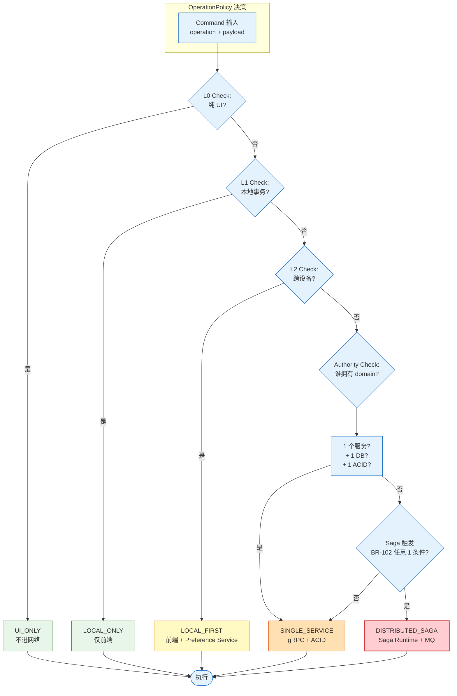

# RGS-DTL-101 Operation Policy 与 Authority Boundary 设计

| 项目 | 内容 |
|---|---|
| 文档编号 | RGS-DTL-101 |
| 版本 | 0.1（初版） |
| 制定日 | 2026-08-21 |
| 最终更新日 | 2026-08-21 |
| 制定者 | 架构师（Ulysses 兼，per DEC-008 一人公司） |
| 保密级别 | 内部限定（Internal Use Only） |
| 适用许可 | Apache-2.0（本仓库） |
| 关联文档 | RGS-REQ-100（需求）/ RGS-BAS-100（基本）/ RGS-DTL-100（同侪 Saga 业务模式）/ RGS-DTL-102（同侪 故障恢复） |
| 配套标准 | IPA 共通フレーム 2013（SLCP-JCF2013）+ 150 工程日本 SI 业界标准；V 模型映射：UT ↔ DTL |

---

## 修订历史

| 版本 | 修订日 | 修订者 | 修订内容 |
|---|---|---|---|
| 0.1 | 2026-08-21 | 架构师（Ulysses）| 初版。OperationPolicyRegistry / TransactionScope enum / OperationPolicy 决策算法 / AuthorityBoundary 检查 / 完整 Operation Policy 矩阵（30+ 操作）。 |

---

## 0. 文档目的

定义 Saga 系统的**操作决策层**：

1. **OperationPolicyRegistry**：每个后台操作预注册策略
2. **TransactionScope 枚举**：5 级决策（UI_ONLY / LOCAL_ONLY / LOCAL_FIRST / SINGLE_SERVICE / DISTRIBUTED_SAGA）
3. **AuthorityBoundary 检查**：每个操作必须先确认权威归属
4. **决策算法**：Command Layer 强制走 OperationPolicy 解析

这是**防止单服务事务被错误升级为 Saga**、**防止纯 UI 操作进入服务器**、**防止跨服务操作没有 Saga** 的核心机制。

---

## 1. 状态分层与决策层级



**核心原则**：

- **最低成本优先**：能用 L0 不用 L1，能用 L3 不用 L4
- **强制决策**：每个 Command 必须经过 Decision 算法
- **白名单驱动**：Saga 触发条件白名单（BR-102 任意 1 条件）

---

## 2. TransactionScope 枚举

```rust
// 共享类型：所有服务 import
#[derive(Debug, Clone, Copy, PartialEq, Eq, Hash, Serialize, Deserialize)]
pub enum TransactionScope {
    /// L0 纯 UI：浏览器内，不发任何网络
    UiOnly,
    /// L1 前端本地事务：LocalTransactionManager
    LocalOnly,
    /// L2 Local First：本地 + 异步同步 Preference Service
    LocalFirst,
    /// L3 单服务 ACID：一个 Rust 微服务 + 一个 DB + 一个本地事务
    SingleService,
    /// L4/L5 分布式 Saga：Saga Runtime + MQ
    DistributedSaga,
}

impl TransactionScope {
    /// 是否需要服务器
    pub fn requires_server(&self) -> bool {
        !matches!(self, Self::UiOnly | Self::LocalOnly)
    }

    /// 是否需要消息总线
    pub fn requires_message_bus(&self) -> bool {
        matches!(self, Self::DistributedSaga | Self::LocalFirst)
    }

    /// 是否需要 Saga Runtime
    pub fn requires_saga_runtime(&self) -> bool {
        matches!(self, Self::DistributedSaga)
    }

    /// 是否需要审计
    pub fn requires_audit(&self) -> bool {
        matches!(self, Self::DistributedSaga | Self::SingleService)
            // 注：SINGLE_SERVICE 也审计（高风险 GM 操作）
    }
}
```

---

## 3. OperationPolicy 数据结构

```rust
#[derive(Debug, Clone, Serialize, Deserialize)]
pub struct OperationPolicy {
    pub operation: String,                 // 全局唯一 operation id (e.g. "shop.purchase")
    pub scope: TransactionScope,
    pub authority: AuthorityBoundary,       // 谁拥有 domain truth
    pub participants: Vec<String>,          // 涉及的 logical service id（仅 DistributedSaga）
    pub timeout: Duration,                  // Saga / Step timeout
    pub retry_policy: RetryPolicy,
    pub requires_audit: bool,
    pub requires_reason: bool,              // GM 操作要求 reason
    pub requires_2fa: bool,                // 高风险要求二次校验
    pub description: String,
}

#[derive(Debug, Clone, Serialize, Deserialize)]
pub enum AuthorityBoundary {
    Browser,
    PreferenceService,
    AccountService,
    CharacterService,
    InventoryService,
    EconomyService,
    MatchService,
    GuildService,
    MailService,
    SagaRuntime,
    ClusterOps,  // 含 saga_store / COC / PFAU
}

#[derive(Debug, Clone, Serialize, Deserialize)]
pub struct RetryPolicy {
    pub max_retries: u32,
    pub initial_backoff: Duration,
    pub backoff_multiplier: f64,
    pub max_backoff: Duration,
}

impl Default for RetryPolicy {
    fn default() -> Self {
        Self {
            max_retries: 5,
            initial_backoff: Duration::from_secs(1),
            backoff_multiplier: 2.0,
            max_backoff: Duration::from_secs(60),
        }
    }
}
```

---

## 4. AuthorityBoundary 完整定义

| 领域 | Authority | DB | 操作类型 |
|---|---|---|---|
| Frontend Layout (L0/L1) | Browser | — | UI_ONLY / LOCAL_ONLY |
| Admin Preferences (L2) | Preference Service | preference_db | LOCAL_FIRST |
| Account | Account Service | account_db | SINGLE_SERVICE / SAGA 启动点 |
| Character | Character Service | character_db | SINGLE_SERVICE / SAGA 参与方 |
| Inventory | Inventory Service | inventory_db | SINGLE_SERVICE / SAGA 参与方 |
| Currency | Economy Service | economy_db | SINGLE_SERVICE / SAGA 参与方（幂等 + Reservation）|
| Match State (实时) | Match Service | match_db | SINGLE_SERVICE（**不进 Saga**）|
| Match Result (持久) | Match Service | match_db | SAGA 启动点（MatchFinished → Reward Saga）|
| Guild | Guild Service | guild_db | SINGLE_SERVICE / SAGA 参与方 |
| Mail | Mail Service | mail_db | SINGLE_SERVICE / SAGA 参与方 |
| Saga State | Saga Runtime (cluster-ops) | cluster_ops_db.saga_store | SAGA 内部（不可被其他服务直接写）|
| Event Schema Registry | cluster-ops | cluster_ops_db | 管理面 |
| PFAU / Active-Active | cluster-ops | cluster_ops_db | 管理面 |
| Audit Log (GM) | cluster-ops | cluster_ops_db | 只追加 / 不可篡改 |

---

## 5. Operation Policy 完整矩阵

### 5.1 后台 App 操作（per FR-102）

| Operation | Scope | Authority | Participants | Timeout | 审计 | Reason | 2FA | 描述 |
|---|---|---|---|---|---|---|---|---|
| `player.ban` | DISTRIBUTED_SAGA | Saga Runtime | account + match + social + mail | 30s | ✅ | ✅ | ✅ | 封禁玩家（多服务影响）|
| `player.view` | READ_ONLY (L3) | Account Service | — | — | — | — | — | 查看玩家（只读投影）|
| `player.edit_note` | SINGLE_SERVICE | Character Service | character-service | 5s | ✅ | ✅ | — | 编辑 GM 备注（单 DB）|
| `account.create` | SINGLE_SERVICE | Account Service | account-service | 5s | ✅ | — | — | 创建账号（单服务）|
| `account.ban` | DISTRIBUTED_SAGA | Saga Runtime | account + match + social | 30s | ✅ | ✅ | ✅ | 封禁账号 |
| `character.create_with_starter` | DISTRIBUTED_SAGA | Saga Runtime | character + inventory + economy + mail | 30s | ✅ | — | — | 角色创建 + 初始装备/货币/邮件 |
| `character.delete` | DISTRIBUTED_SAGA | Saga Runtime | character + inventory + economy + mail + guild | 60s | ✅ | ✅ | ✅ | 删号（多服务深度清理）|
| `character.update_nickname` | SINGLE_SERVICE | Character Service | character-service | 3s | — | — | — | 改昵称（单服务）|
| `inventory.grant_item` | SINGLE_SERVICE | Inventory Service | inventory-service | 3s | ✅ | ✅ | — | 发道具（GM 工具）|
| `inventory.bulk_grant` | DISTRIBUTED_SAGA | Saga Runtime | inventory + mail | 30s | ✅ | ✅ | — | 批量发道具 + 邮件通知 |
| `economy.grant_currency` | SINGLE_SERVICE | Economy Service | economy-service | 3s | ✅ | ✅ | — | GM 加金币（单服务，幂等）|
| `economy.deduct_currency` | SINGLE_SERVICE | Economy Service | economy-service | 3s | ✅ | ✅ | — | GM 扣金币（单服务，幂等）|
| `mail.send` | SINGLE_SERVICE | Mail Service | mail-service | 3s | ✅ | — | — | 发邮件（单服务）|
| `mail.send_with_attachment` | DISTRIBUTED_SAGA | Saga Runtime | mail + inventory | 10s | ✅ | — | — | 发带附件的邮件（mail + inventory）|
| `match.create_room` | SINGLE_SERVICE | Match Service | match-service | 3s | — | — | — | 创建房间（单服务）|
| `match.distribute_reward` | DISTRIBUTED_SAGA | Saga Runtime | match + economy + rank + inventory + mail | 60s | ✅ | — | — | 比赛奖励（多服务，不可逆）|
| `guild.create` | DISTRIBUTED_SAGA | Saga Runtime | guild + mail + economy | 30s | ✅ | — | — | 公会创建（多服务）|
| `guild.dissolve` | DISTRIBUTED_SAGA | Saga Runtime | guild + mail + economy + inventory | 60s | ✅ | ✅ | ✅ | 解散公会（多服务，深度清理）|
| `server.migrate_player` | DISTRIBUTED_SAGA | Saga Runtime | account + character + inventory + economy + guild + mail | 120s | ✅ | ✅ | ✅ | 跨服转移（**最复杂 Saga**）|
| `server.shutdown` | SINGLE_SERVICE | Match Service | match-service | 30s | ✅ | ✅ | ✅ | 关闭服务器（单服务）|
| `server.compensation_pack` | DISTRIBUTED_SAGA | Saga Runtime | economy + inventory + mail | 30s | ✅ | ✅ | — | GM 补偿礼包 |
| `ui.resize_panel` | UI_ONLY | Browser | — | — | — | — | — | 后台面板布局（纯 UI）|
| `ui.change_theme` | LOCAL_FIRST | Preference Service | preference-service | 1s | — | — | — | GM 主题（Local First）|
| `preference.dashboard_config` | LOCAL_FIRST | Preference Service | preference-service | 1s | — | — | — | Dashboard 配置（Local First）|
| `preference.recent_pages` | LOCAL_FIRST | Preference Service | preference-service | 1s | — | — | — | 最近打开页面（Local First）|
| `view.player_list` | READ_ONLY (L3) | Account Service | — | — | — | — | — | 查看玩家列表（只读）|
| `view.saga_status` | READ_ONLY (L3) | Saga Runtime | — | — | — | — | — | 查看 Saga 状态（只读，per GM Saga Console）|

### 5.2 客户端操作（Game Client）

| Operation | Scope | Authority | 描述 |
|---|---|---|---|
| `shop.purchase` | DISTRIBUTED_SAGA | Saga Runtime | 玩家购买商城物品 |
| `character.create` | DISTRIBUTED_SAGA | Saga Runtime | 玩家创建角色 + 初始装备/货币/邮件 |
| `inventory.use_item` | SINGLE_SERVICE | Inventory Service | 使用道具（单服务）|
| `inventory.trade` | DISTRIBUTED_SAGA | Saga Runtime | 玩家间交易（双方 inventory + economy）|
| `match.join` | SINGLE_SERVICE | Match Service | 加入匹配（单服务）|
| `match.leave` | SINGLE_SERVICE | Match Service | 离开匹配（单服务）|
| `guild.join` | DISTRIBUTED_SAGA | Saga Runtime | 加入公会（guild + mail 通知）|
| `guild.leave` | DISTRIBUTED_SAGA | Saga Runtime | 离开公会（guild + economy 退会费 + mail 通知）|
| `mail.read` | SINGLE_SERVICE | Mail Service | 读邮件（单服务）|
| `mail.claim_attachment` | DISTRIBUTED_SAGA | Saga Runtime | 领取附件（mail + inventory）|
| `ui.inventory_filter` | UI_ONLY | Browser | 背包筛选（纯 UI）|
| `ui.equipment_compare` | LOCAL_ONLY | Browser | 装备对比（本地）|

### 5.3 反例（**禁止**升级为 Saga）

| 操作 | ❌ 错误 | ✅ 正确 |
|---|---|---|
| 改角色昵称 | DISTRIBUTED_SAGA | SINGLE_SERVICE (Character Service) |
| 单次扣货币 | DISTRIBUTED_SAGA | SINGLE_SERVICE (Economy Service, 幂等) |
| 玩家登录 | DISTRIBUTED_SAGA | SINGLE_SERVICE (Account Service) |
| 加好友 | DISTRIBUTED_SAGA | SINGLE_SERVICE (Social Service) |
| 单条消息发送 | DISTRIBUTED_SAGA | SINGLE_SERVICE (Mail Service) |
| 玩家改密码 | DISTRIBUTED_SAGA | SINGLE_SERVICE (Account Service) |

---

## 6. OperationPolicy 决策算法

```rust
// 在 Command Layer 强制执行
pub struct CommandRequest {
    pub operation: String,
    pub actor: Actor,           // user / gm / system
    pub payload: serde_json::Value,
    pub reason: Option<String>,
    pub auth_2fa_token: Option<String>,
}

pub struct CommandDecision {
    pub scope: TransactionScope,
    pub authority: AuthorityBoundary,
    pub target: CommandTarget,
    pub requires_audit: bool,
}

pub enum CommandTarget {
    /// 直接处理（不发送网络）
    Local,
    /// 同步 gRPC
    Grpc { service: String, method: String },
    /// 启动 Saga
    Saga { saga_type: String, version: u32 },
}

pub fn decide_command(req: &CommandRequest) -> Result<CommandDecision, CommandError> {
    let policy = OPERATION_REGISTRY.get(&req.operation)
        .ok_or(CommandError::UnknownOperation(req.operation.clone()))?;

    // 1. Reason check
    if policy.requires_reason && req.reason.is_none() {
        return Err(CommandError::ReasonRequired);
    }

    // 2. 2FA check
    if policy.requires_2fa && !verify_2fa(&req.actor, &req.auth_2fa_token) {
        return Err(CommandError::TwoFactorRequired);
    }

    // 3. 决策目标
    let target = match policy.scope {
        TransactionScope::UiOnly | TransactionScope::LocalOnly => CommandTarget::Local,
        TransactionScope::LocalFirst => CommandTarget::Grpc {
            service: "preference-service".into(),
            method: "SyncPreference".into(),
        },
        TransactionScope::SingleService => CommandTarget::Grpc {
            service: authority_to_service(&policy.authority).into(),
            method: req.operation.clone(),
        },
        TransactionScope::DistributedSaga => CommandTarget::Saga {
            saga_type: derive_saga_type(&req.operation),
            version: latest_version(&derive_saga_type(&req.operation)),
        },
    };

    Ok(CommandDecision {
        scope: policy.scope,
        authority: policy.authority.clone(),
        target,
        requires_audit: policy.requires_audit,
    })
}
```

---

## 7. AuthorityBoundary 检查

```rust
pub struct AuthorityCheck {
    pub operation: String,
    pub operation_authority: AuthorityBoundary,
    pub payload_aggregate: String,    // e.g. "account" / "character"
    pub payload_aggregate_id: String,
}

pub fn check_authority_boundary(
    check: &AuthorityCheck,
    actor: &Actor,
) -> Result<(), AuthorityError> {
    // 1. 操作的 AuthorityBoundary 必须与 payload 的领域一致
    let expected_authority = match check.payload_aggregate.as_str() {
        "account" => AuthorityBoundary::AccountService,
        "character" => AuthorityBoundary::CharacterService,
        "inventory" => AuthorityBoundary::InventoryService,
        "economy" | "currency" | "balance" => AuthorityBoundary::EconomyService,
        "match" | "match_room" => AuthorityBoundary::MatchService,
        "guild" => AuthorityBoundary::GuildService,
        "mail" => AuthorityBoundary::MailService,
        "saga" => AuthorityBoundary::SagaRuntime,
        _ => return Err(AuthorityError::UnknownAggregate(check.payload_aggregate.clone())),
    };

    if check.operation_authority != expected_authority {
        return Err(AuthorityError::AuthorityMismatch {
            operation: check.operation_authority.clone(),
            expected: expected_authority,
        });
    }

    // 2. Saga Runtime 的写操作只有 Saga Runtime 自身可执行
    if matches!(check.operation_authority, AuthorityBoundary::SagaRuntime) {
        if !matches!(actor, Actor::System { .. }) {
            return Err(AuthorityError::SagaStateWriteForbidden);
        }
    }

    // 3. Account / Character 等单服务写操作只有该服务可执行
    //    （通过 gRPC Auth + mTLS 保证）

    Ok(())
}
```

---

## 8. 反 Saga 升级的反模式

| 反模式 | 现象 | 修正 |
|---|---|---|
| **Saga 滥用** | 单服务操作也走 Saga | 强制走 SINGLE_SERVICE；OperationPolicy 显式声明 |
| **隐式分布式** | 通过 Service 互相调用形成"伪 Saga" | 禁止 service-to-service 同步调用形成业务事务链；必须走 Saga |
| **回滚恐慌** | 能 Reserve 的却用 Execute + Undo | 优先 Reserve/Commit；不能才 Compensate |
| **UI 强制成功** | 客户端假定 Saga 一定成功 | UI 显示 PENDING/RUNNING/COMPLETED/FAILED/COMPENSATING 状态 |
| **浏览器即 Coordinator** | Admin UI 协调多个 GM 操作 | Admin Gateway 是 Coordinator；UI 只是 Initiator |
| **跨服不隔离** | Saga 跨服引用 pod IP | 引用 logical participant id（K8s Service DNS）|

---

## 9. 关联文档

- **基础**：`RGS-REQ-100` / `RGS-BAS-100`
- **同侪**：
  - `RGS-DTL-100` Saga 业务模式设计
  - `RGS-DTL-102` Saga 故障恢复设计
- **部署**：`RGS-OPS-100`
- **可观测性**：`RGS-GOBS-100`
- **安全**：`RGS-SEC-100`

---

## 10. 修订历史

| 版本 | 修订日 | 修订者 | 修订内容 |
|---|---|---|---|
| 0.1 | 2026-08-21 | 架构师（Ulysses）| 初版。TransactionScope 枚举 / OperationPolicy 数据结构 / AuthorityBoundary 完整定义 / 30+ 操作完整矩阵（含反 Saga 升级反模式）。 |
