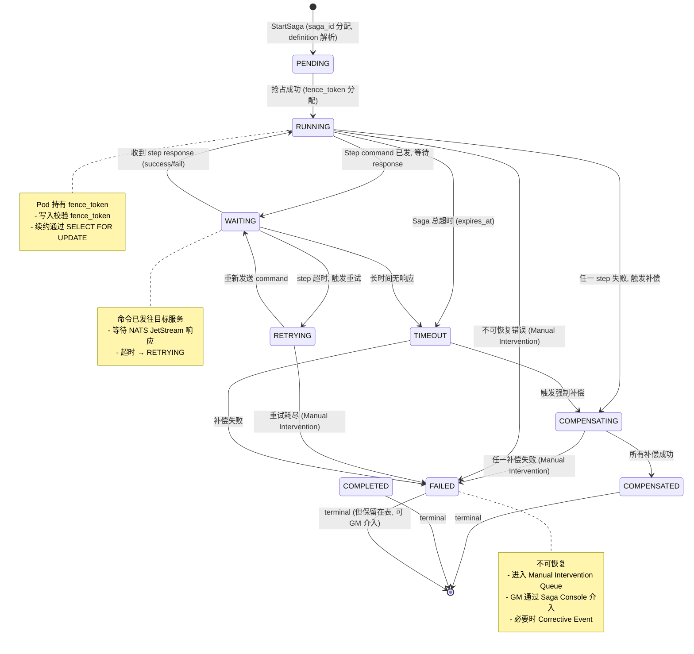
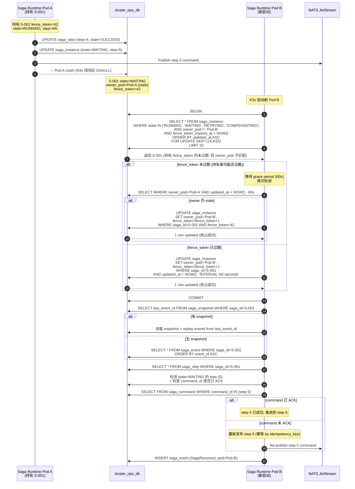
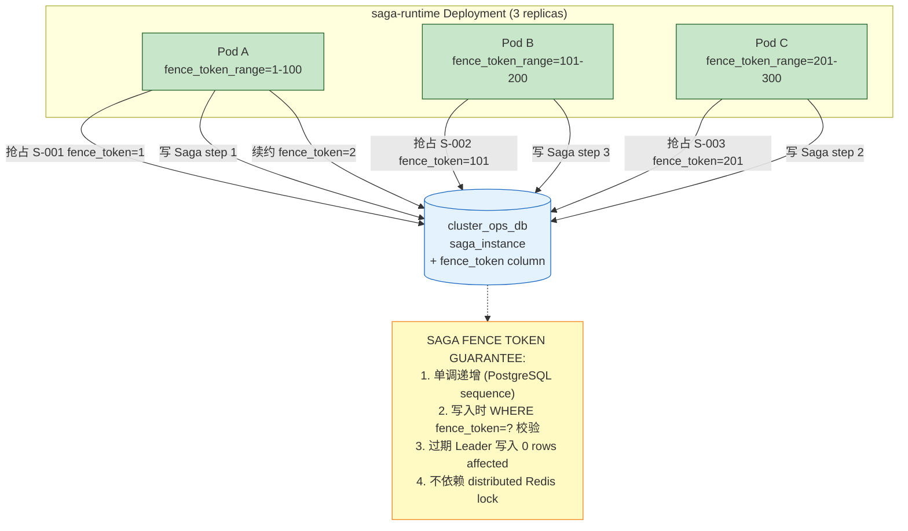
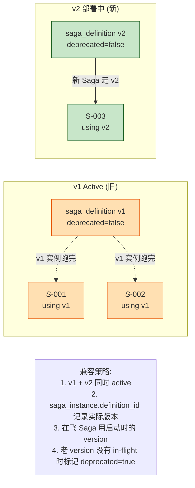
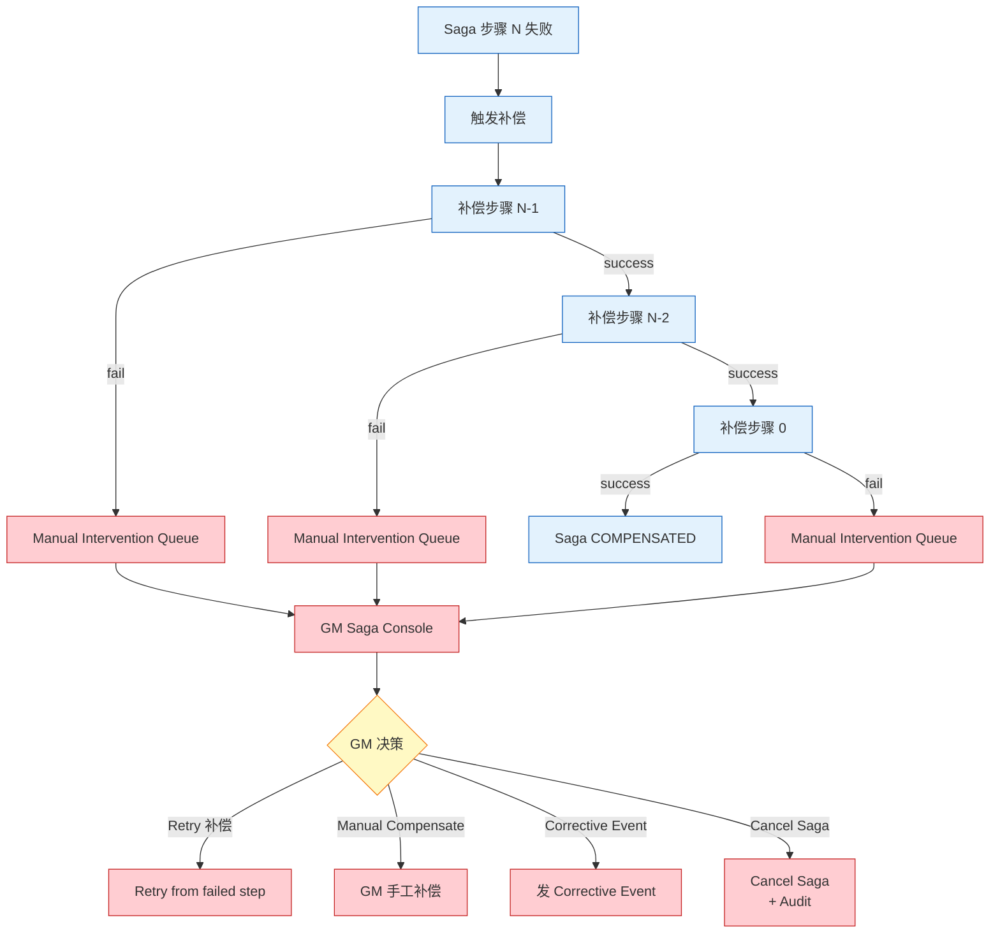

# RGS-DTL-102 Saga 故障恢复设计

| 项目 | 内容 |
|---|---|
| 文档编号 | RGS-DTL-102 |
| 版本 | 0.1（初版） |
| 制定日 | 2026-08-21 |
| 最终更新日 | 2026-08-21 |
| 制定者 | 架构师（Ulysses 兼，per DEC-008 一人公司） |
| 保密级别 | 内部限定（Internal Use Only） |
| 适用许可 | Apache-2.0（本仓库） |
| 关联文档 | RGS-REQ-100 / RGS-BAS-100 / RGS-DTL-100（同侪 Saga 业务模式）/ RGS-DTL-101（同侪 OperationPolicy） |
| 配套标准 | IPA 共通フレーム 2013 + 150 工程日本 SI 业界标准；V 模型映射：UT ↔ DTL |

---

## 修订历史

| 版本 | 修订日 | 修订者 | 修订内容 |
|---|---|---|---|
| 0.1 | 2026-08-21 | 架构师（Ulysses）| 初版。Saga Instance 状态机 / K3s Pod Crash Recovery / Saga Runtime HA 多副本 OCC / 微服务 Pod 重启兼容 / 升级兼容性 / 故障自检表。 |

---

## 0. 文档目的

定义 Saga 系统的**故障恢复**机制：

1. Saga Instance 状态机（11 个状态）
2. K3s Saga Runtime Pod Crash Recovery
3. Saga Runtime HA（多副本 OCC 抢占）
4. 微服务 Pod 重启时 Saga 不立即失败
5. Saga Definition 升级兼容性（旧实例跑完）
6. Compensation 自身不可恢复处理
7. 故障自检表

---

## 1. Saga Instance 状态机



**11 个状态**：

| 状态 | 含义 | 终态 | 备注 |
|---|---|---|---|
| PENDING | 已分配 saga_id，definition 已解析，但还未被任何 Pod 抢占 | ❌ | 极短状态（毫秒）|
| RUNNING | Pod 持有 fence_token，正在执行 | ❌ | 持有者写 fence_token |
| WAITING | Step command 已发，等目标服务响应 | ❌ | NATS JetStream consumer 监听 |
| RETRYING | Step 超时 / 失败，等待指数退避 | ❌ | backoff 1s/2s/4s/8s/16s |
| COMPENSATING | 触发补偿流 | ❌ | 逆序执行补偿步骤 |
| COMPENSATED | 补偿完成 | ✅ | Saga 终态 |
| COMPLETED | 正常完成 | ✅ | Saga 终态 |
| FAILED | 不可恢复失败 | ✅ | Manual Intervention |
| TIMEOUT | Saga 总超时（默认 30 分钟）| — | 触发强制补偿 |
| CANCELED | GM 主动取消 | ✅ | Saga Console 操作 |
| EXPIRED | expires_at 已过 + 无法续约 | — | Reaper Worker 处理 |

---

## 2. K3s Pod Crash Recovery



**关键设计点**：

1. **新 Pod 启动时扫描 in-flight Saga**：
   ```sql
   SELECT * FROM saga_instance
   WHERE state IN ('RUNNING', 'WAITING', 'RETRYING', 'COMPENSATING')
     AND updated_at < NOW() - INTERVAL '60 seconds'  -- 60s grace period
   FOR UPDATE SKIP LOCKED
   LIMIT 100;
   ```

2. **抢占**：使用 `SELECT FOR UPDATE SKIP LOCKED` 避免多 Pod 同时抢占同一 Saga

3. **fence_token 续约**：
   - 抢占时 `fence_token = fence_token + 1`
   - 续约时 `fence_token = fence_token + 1, updated_at = NOW()`
   - 写 Saga 表时 `WHERE fence_token = ?` 校验

4. **Snapshot + Journal Replay**：
   - 定期（每 N 步）保存 snapshot
   - 恢复时加载最新 snapshot + 重放后续 event
   - 比完整 replay 快 100x

5. **Command 幂等性**：
   - 每个 command 携带 `idempotency_key = {saga_id}:{step_index}`
   - 重发时目标服务通过 Inbox 表去重

---

## 3. Saga Runtime HA（多副本）



**OCC 多副本设计**：

1. **Fence Token 序列**：
   ```sql
   CREATE SEQUENCE saga_fence_token_seq START 1 INCREMENT 1;
   ```

2. **抢占（Pod A 启动 / 发现 in-flight Saga）**：
   ```sql
   BEGIN;
   -- 抢占
   UPDATE saga_instance
   SET owner_pod = 'pod-a-uuid',
       fence_token = nextval('saga_fence_token_seq'),
       updated_at = NOW()
   WHERE saga_id = ?
     AND state IN ('RUNNING', 'WAITING', 'RETRYING', 'COMPENSATING')
     AND (owner_pod = 'pod-a-uuid' OR updated_at < NOW() - INTERVAL '60 seconds');
   -- 0 rows = 抢占失败（被其他 Pod 持有且未超时）
   COMMIT;
   ```

3. **续约（每 30s 一次）**：
   ```sql
   UPDATE saga_instance
   SET fence_token = nextval('saga_fence_token_seq'),
       updated_at = NOW()
   WHERE saga_id = ? AND owner_pod = 'pod-a-uuid'
   RETURNING fence_token;
   ```

4. **写入校验（任何 Saga step 写入）**：
   ```sql
   -- 写入 saga_step
   UPDATE saga_step
   SET state = 'SUCCESS', output = ?
   WHERE step_id = ? AND saga_id = ?
     AND fence_token = ?;  -- 必须匹配当前 Pod 持有的 token
   ```

5. **过期 Pod 写入**：`UPDATE ... WHERE fence_token = ?` 会返回 0 rows affected，应用层检测后重抢。

**为什么不用 Redis distributed lock**：

- Redis 是新组件（per BR-111 纯开源 + 不绑新依赖）
- PostgreSQL 已经存在且 ACID 强一致
- Fence Token 在 PostgreSQL 单调递增 + 事务性，比 Redis lock 更可靠
- 减少 K3s 资源（Minimal profile 不需要 Redis）

---

## 4. 微服务 Pod 重启兼容

**场景**：Saga 步骤已发送给 Inventory Service，Inventory Pod 重启，命令丢失 / 重复。

```mermaid
sequenceDiagram
    autonumber
    participant SR as Saga Runtime
    participant MB as NATS JetStream
    participant ISP as Inventory Service Pod (旧)
    participant ISN as Inventory Service Pod (新)
    participant DB as inventory_db

    SR->>MB: Publish ReserveInventorySlot<br/>(command_id=C-002, idempotency_key=S-001:C-002)
    MB->>ISP: Deliver
    activate ISP
    ISP->>DB: BEGIN
    ISP->>DB: INSERT reservations
    ISP->>DB: INSERT inbox (idempotency_key)
    ISP--xDB: 💥 ISP 崩溃 (K8s 杀进程)

    Note over DB: reservations 已 commit<br/>但 inbox 状态未完成 (PENDING)

    Note over MB: ack 未送达 (consumer 中断)
    MB->>ISN: Re-deliver (max 5 次 backoff)
    activate ISN
    ISN->>DB: SELECT FROM inbox WHERE event_id=...
    alt 已 INSERT 但 PENDING
        ISN->>DB: 检测到 idempotency_key 存在
        ISN->>DB: 应用业务（INSERT reservations）→ 因 UNIQUE constraint 失败
        ISN->>DB: 视为已处理, 标记 inbox.status=DONE
        ISN->>MB: ACK
    else 不存在
        ISN->>DB: BEGIN; INSERT reservations; INSERT inbox; COMMIT
        ISN->>MB: ACK
    end
    deactivate ISN

    Note over SR: 通过 Inbox DONE 状态 + idempotency_key<br/>保证不重复执行
```

**关键机制**：

1. **Inbox 表去重**：`idempotency_key` PRIMARY KEY / UNIQUE
2. **幂等命令**：即使重复执行，副作用可忽略
3. **Saga Runtime 超时重试**：默认 5s 步超时 + 5 次重试（指数退避）
4. **Pod 重启不立即失败**：Saga Runtime 检测到 command 超时后**不立即判定失败**，而是再重试 1-2 次，给目标服务恢复时间

**Saga Runtime 重试策略**：

| 重试次数 | 退避 | 触发条件 |
|---|---|---|
| 1 | 0s（立即） | 目标服务返回 5xx |
| 2 | 1s | 目标服务返回 5xx |
| 3 | 2s | 目标服务返回 5xx |
| 4 | 4s | 目标服务返回 5xx |
| 5 | 8s | 目标服务返回 5xx |
| Exceeded | — | SagaFailed + 触发 Manual Intervention |

---

## 5. Saga Definition 升级兼容



**升级流程**：

1. 部署 v2 Saga Runtime（含 v2 definition）
2. 旧 v1 Pod 仍运行，处理 in-flight v1 Saga
3. 新 Saga 走 v2（GRPC router 决定）
4. 旧 v1 Saga 跑完后，v1 Pod 缩容到 0
5. v1 definition `deprecated=true`

**关键约束**：

- Saga Definition schema 必须**向后兼容**（v1 step 字段不能删，只能加 optional 字段）
- 在飞 v1 Saga 即使 v2 已部署，**继续按 v1 跑完**（不能中途切到 v2）
- Pod 升级使用 **Rolling Update**（maxUnavailable=0, maxSurge=1）

---

## 6. Compensation 自身不可恢复



**不可恢复 Compensation 处理**：

| 场景 | 处理 |
|---|---|
| RefundCurrency 失败（玩家账号已冻结）| Manual Compensate（GM 手工打款）|
| RevokeItem 失败（物品已交易）| Corrective Event（通知原 + 新玩家协调）|
| SendMail 失败（无外部副作用）| Retry（最多 5 次）|
| 数据库写失败 | SagaFailed + Manual Intervention |

**GM 介入工具**（per RGS-SEC-100）：

- Saga Console 显示 in-flight + failed Saga
- 二次权限校验（2FA）
- Audit Log 记录所有操作
- Pause / Resume / Retry / Manual Compensate / Cancel

---

## 7. 故障自检表（per spec 59）

| 检查项 | 状态 | 证据 |
|---|---|---|
| K3s Pod crash 后丢 Saga？ | ✅ 不丢 | §2 Crash Recovery + snapshot + journal replay |
| Saga Runtime 多副本重复驱动？ | ✅ 不重复 | §3 Fence Token + SELECT FOR UPDATE SKIP LOCKED |
| MQ 重复消息？ | ✅ 不重复处理 | §4 Inbox 表 + event_id PRIMARY KEY |
| MQ 乱序？ | ✅ 顺序保证 | NATS JetStream per-subject 顺序 |
| 微服务升级中在飞 Saga？ | ✅ 兼容 | §5 v1+v2 双版本并行 + 旧 instance 跑完 |
| Compensation 自身失败？ | ✅ Manual Intervention | §6 GM Saga Console |
| 浏览器关闭影响 Saga？ | ✅ 不影响 | spec 20 浏览器非 Coordinator |
| Saga 进入实时游戏 Tick？ | ✅ 不进 | DTL-100 spec 53 明确禁止 |
| 跨服务操作没有 Saga？ | ✅ 强制 | DTL-101 OperationPolicy |
| 经济操作缺幂等？ | ✅ 强制 | DTL-100 §1.2 idempotency_key |
| 纯 UI 操作进服务器？ | ✅ 不进 | DTL-101 L0 UiOnly |
| 跨域无 Compensation？ | ✅ 全部定义 | DTL-100 §1.3 |
| 服务直访其他服务 DB？ | ✅ 禁止 | RGS-BAS-100 §7 Database per Service |
| 依赖闭源组件？ | ✅ 全开源 | RGS-BAS-100 §5 NATS JetStream Apache-2.0 |

---

## 8. Recovery Worker 实现

```rust
// saga-runtime/recovery.rs
pub struct RecoveryWorker {
    db: PgPool,
    pod_id: String,
    grace_period: Duration,         // 默认 60s
    scan_interval: Duration,        // 默认 5s
    snapshot_interval: Duration,    // 默认 30s
}

impl RecoveryWorker {
    /// Pod 启动时调用一次
    pub async fn startup_scan(&self) -> Result<usize> {
        // 1. 扫描 in-flight Saga
        let candidates = sqlx::query!(
            r#"
            SELECT saga_id, state, owner_pod, fence_token, definition_id
            FROM saga_instance
            WHERE state IN ('RUNNING', 'WAITING', 'RETRYING', 'COMPENSATING')
              AND updated_at < NOW() - $1::interval
            ORDER BY updated_at ASC
            LIMIT 100
            "#,
            format!("{} seconds", self.grace_period.as_secs())
        )
        .fetch_all(&self.db)
        .await?;

        let mut recovered = 0;
        for c in candidates {
            // 2. 抢占
            let new_token: i64 = sqlx::query_scalar!(
                r#"
                UPDATE saga_instance
                SET owner_pod = $1, fence_token = nextval('saga_fence_token_seq'),
                    updated_at = NOW()
                WHERE saga_id = $2
                  AND (owner_pod = $1 OR updated_at < NOW() - $3::interval)
                RETURNING fence_token
                "#,
                self.pod_id,
                c.saga_id,
                format!("{} seconds", self.grace_period.as_secs())
            )
            .fetch_optional(&self.db)
            .await?;

            if let Some(t) = new_token {
                // 3. 恢复 Saga state machine
                self.resume_saga(c.saga_id, t).await?;
                recovered += 1;
            }
        }
        Ok(recovered)
    }

    /// 持续运行：定期续约 in-flight Saga
    pub async fn heartbeat_loop(&self) {
        let mut ticker = tokio::time::interval(self.scan_interval);
        loop {
            ticker.tick().await;
            // 更新自己的 Saga 持有者
            sqlx::query!(
                r#"
                UPDATE saga_instance
                SET fence_token = nextval('saga_fence_token_seq'),
                    updated_at = NOW()
                WHERE owner_pod = $1
                  AND state IN ('RUNNING', 'WAITING', 'RETRYING', 'COMPENSATING')
                "#,
                self.pod_id
            )
            .execute(&self.db)
            .await.ok();
        }
    }

    /// Reaper: 清理超期 Saga
    pub async fn reaper_loop(&self) {
        let mut ticker = tokio::time::interval(Duration::from_secs(60));
        loop {
            ticker.tick().await;
            // 标记超期 Saga 为 FAILED
            sqlx::query!(
                r#"
                UPDATE saga_instance
                SET state = 'EXPIRED', updated_at = NOW()
                WHERE expires_at < NOW()
                  AND state IN ('RUNNING', 'WAITING', 'RETRYING')
                "#
            )
            .execute(&self.db)
            .await.ok();
        }
    }
}
```

---

## 9. 关联文档

- **基础**：`RGS-REQ-100` / `RGS-BAS-100`
- **同侪**：
  - `RGS-DTL-100` Saga 业务模式设计
  - `RGS-DTL-101` OperationPolicy 与 AuthorityBoundary 设计
- **部署**：`RGS-OPS-100`
- **可观测性**：`RGS-GOBS-100`
- **安全**：`RGS-SEC-100`

---

## 10. 修订历史

| 版本 | 修订日 | 修订者 | 修订内容 |
|---|---|---|---|
| 0.1 | 2026-08-21 | 架构师（Ulysses）| 初版。Saga Instance 状态机 (11 状态) / K3s Pod Crash Recovery (snapshot + journal replay + fence_token) / Saga Runtime HA (Fence Token + SELECT FOR UPDATE SKIP LOCKED) / 微服务重启兼容 (Inbox + 重试) / Definition 升级兼容 (v1+v2 双版本) / Compensation 不可恢复 (GM 介入) / Recovery Worker Rust 实现。 |
