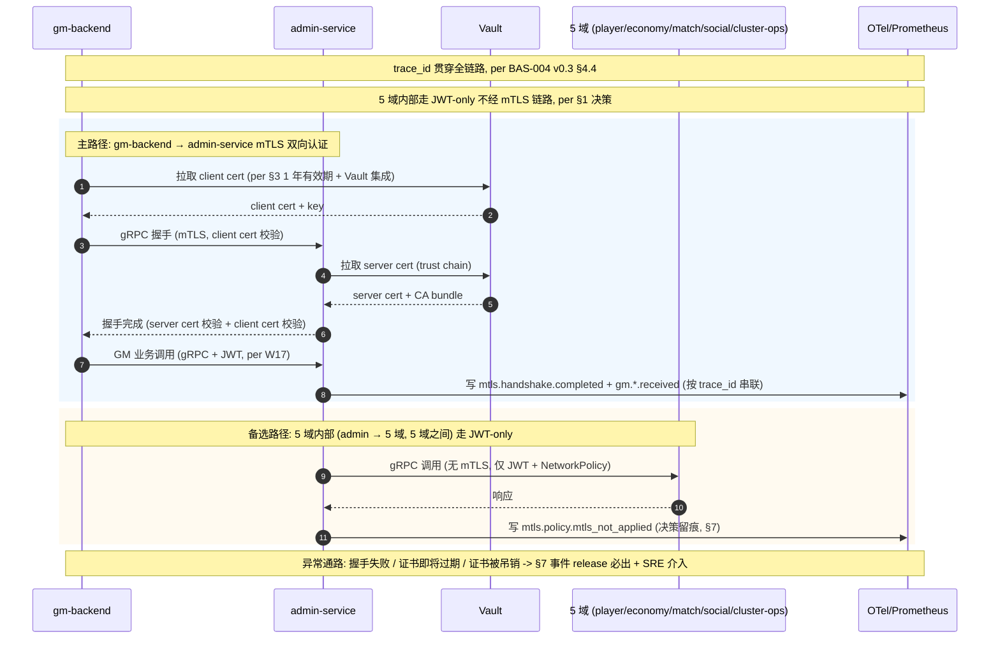

# RGS-BAS-003 mTLS 决策补充 v0.1 (per Ulysses 2026-08-29 05:28 JST 拍板)

> **目的**:明确 gm-backend → admin-service → 5 域 mTLS 范围(原 BAS-003 §2.1 + §4.4 仅写"gm→admin mTLS",5 域范围待定)
> **作者**:Mavis (接手 agent per DEC-008,2026-08-29 05:28 JST)
> **关联**:RGS-PLAN-WBS-token-bucket-v0.1 §7.2 拍板 2 / BAS-003 §2.1 / W21 mTLS 5 IT / W17 JWT propagation
> **覆盖关系**:本补充是 BAS-003 §2.1 的范围澄清,不修改 BAS-003 主体

---

## 1. 决策

| 路径 | mTLS | 备注 |
|---|---|---|
| GM 前端 → gm-backend (HTTP) | ❌ 不上 mTLS | HTTPS + JWT + RBAC(per BAS-003 §2 组件图 + RGS-IMPL-001 安全约定) |
| **gm-backend → admin-service (gRPC)** | ✅ **mTLS 双向认证** | 跨信任域(BAS-022 + ARC-019),强认证;W21 已实装 5 IT |
| admin-service → 5 域 (player/economy/match/social/cluster-ops) (gRPC) | ❌ 不上 mTLS | 同 k3s NetworkPolicy 信任域 + JWT(per BAS-022 §5.3) |
| 5 域内部 (e.g. match → player) (gRPC) | ❌ 不上 mTLS | 同信任域,NetworkPolicy 已隔离,JWT 鉴权足够 |
| cluster-ops → admin-service / gm-backend | ❌ 不上 mTLS | 同信任域 |

## 2. 理由

### 2.1 gm-backend → admin-service 上 mTLS 的理由

- **跨信任域**: gm-backend 接收前端 JWT(admin role),admin-service 在后端服务域,gm 不知道也不应该知道 admin 的 NetworkPolicy 策略细节
- **强认证需求**: GM 操作(封号/补偿/维护)是 high-impact,需要 client cert 双向认证作为 JWT 之外的第二因子
- **已有实装**: W21 (commit `ff62bdd`) 已 5 IT PASS,真实 k3s 证书从 rgs-secret-admin-tls 抽取
- **合规**: 部分监管要求 admin 操作双因素(client cert + JWT)

### 2.2 5 域内部不上 mTLS 的理由

- **同信任域**: 5 域都在 k3s namespace `rust-game-server` 内,NetworkPolicy 已隔离
- **JWT 已鉴权**: per W17 (commit `2acc222`),gRPC metadata 传播 JWT,服务间调用有 RBAC
- **mTLS 成本**: 每域 +1 套证书生命周期管理(签发/轮换/吊销/监控),估 +50% token(per RGS-TS-001 v0.6 §6.2 双算法估算)
- **复杂度**: 5 域 × 双向 mTLS = 10 套证书,与 5 域独立的 RACI(per DDD Review 决议 2)冲突

## 3. 实施范围(WBS 桶 4)

| 路径 | 状态 | 桶 4 工作 |
|---|---|---|
| gm-backend → admin-service | ✅ 已实装 (W21) | 仅需证书轮换策略 + 1 年有效期 + Vault 集成 |
| 5 域内部 (admin → 5 域, 5 域之间) | ❌ 不上 | 0 token 投入(决策记录即可) |

## 3.1 処理フロー（简化版 / Simplified Flow）

> 本节是子文档豁免版 (per RGS-BAS-FLOW-STANDARD-2026-09-02 v0.1 §1 子文档豁免段, 2026-09-02 13:59 JST 主会话拍板)
> 4 要素完整要求不适用, 改为 1 段精简流程说明 + 1 张合并表 (异常 / 补偿 / 验证合并)
> 详细日志设计见 §7, 详细 mTLS 事件命名空间见 §7 与 BAS-003 §4.5 边界段

gm-backend → admin-service 的 mTLS 双向认证流程, 涉及 gm-backend / admin-service / Vault 三个 actor 与 admin-service / gm-backend 双向 5 个时序步骤(初始化握手 → 业务调用 → 证书轮换 → 5 域内部走 JWT-only → 异常处理):

### 3.1.1 異常 / 补偿 / 验证合并表

| 类别 | 触发条件 | 处理动作 / 验证通过标准 / 失败补偿 |
|---|---|---|
| **異常: 握手失败** | client cert 不可信 / 过期 / 主体名不匹配 / TLS 版本不兼容 | 写 `mtls.handshake.failed` (release 必出, per §7); gm-backend 重试 3 次 指数退避 100/200/400ms (per ARC-009 消费者标准模式); 仍失败则返回 503 + DLQ 报警 |
| **異常: 证书即将过期** | 证书剩余有效期 < 30 天 | 写 `mtls.cert.expiry_warning` (release 必出, per §7); admin-service / gm-backend 自动从 Vault 拉取新证书并热加载; 失败则写 `mtls.cert.rotation.completed` 含失败原因 |
| **異常: 证书被吊销** | 证书从 Vault CRL 列表移除 (admin-service 实例被入侵强制吊销) | 写 `mtls.cert.revoked` (release 必出, per §7 + NFR-SE-001); gm-backend 立即停止连接, 走 DLQ 报警 + 安全应急响应 |
| **異常: Vault 不可达** | Vault 服务不可达 (证书轮换路径) | 复用 BAS-003 §3 Vault 不可达降级逻辑; gm-backend 走本地缓存证书 (≤24h); 写 `mtls.cert.rotation.failed` (debug-only, 内部告警) |
| **补偿: 反向重连** | admin-service 重启或证书热加载后 | gm-backend 主动重握手, 走 mtls.handshake.completed 路径; 客户端不感知切换 (per §7 与 BAS-003 §3 AdminService 事件串联) |
| **验证: 握手完成** | 双向 mTLS 握手成功 (client cert 校验 + server cert 校验) | 写 `mtls.handshake.completed` (release 必出, 100% 强制全采样, per §7); 含 `peer_cn` / `client_cert_serial` (仅 SN 末 8 位) / `tls_version` / `cipher_suite`; 约 200B/条 |
| **验证: 5 域走 JWT-only** | admin → player/economy/match/social/cluster-ops 任一调用 | 写 `mtls.policy.mtls_not_applied` (release 必出, 决策留痕, per §7); 含 `src_service` / `dst_service` / `expected_auth= jwt_only`; 约 200B/条 |
| **验证: trace_id 串联** | mTLS 握手与后续 gm.*.received 共享 trace_id | gm-backend 在 gRPC metadata 注入 trace_id; admin-service 接收时关联 (per §7 与 §3 AdminService 事件串联段) |

## 4. 决策留痕

- **决策日**: 2026-08-29 05:28 JST
- **决策方**: Ulysses (per ask_user 之外直接拍板, A 路径: 拍板 3 项)
- **落档文档**: RGS-PLAN-WBS-token-bucket-v0.1 §7.2 拍板 2 + 本补充 v0.1
- **覆盖关系**: 本补充是 BAS-003 §2.1 的范围澄清,不修改 BAS-003 主体
- **下游级联**: WBS 桶 4 范围缩小(gm→admin 5 IT 已实装, 5 域内部 0 token 投入)

## 4.1 审批栏（承認欄 / Approval）

> 「補缺口 6」追加 (per 2026-09-02 15:02 JST Ulysses 拍板, RGS-WEEKLY-2026-W36_v0.1 §3 缺口 6 + RGS-CRITIQUE-IMPROVEMENT-2026-09-02 §9.1 D 类方案 D2 文档可读性治理)
> v0.1 (2026-08-29) 决策制定时无独立审批栏 (决策补充子文档沿用 RGS-REQ-023 风格), v0.2 (2026-09-01) 加 §7 日志设计, v0.3 (2026-09-02) 加 §3.1 処理フロー, 三次修订均无独立审批栏, 缺口累积

| 角色 | 姓名 / 责任 | 审批日 | 备注 |
|---|---|---|---|
| 制定（起草） | Mavis (接手 agent per DEC-008) | 2026-08-29 (v0.1 决策) | per ask_user 之外直接拍板, A 路径: 拍板 3 项 (gm-backend → admin-service 上 mTLS, 5 域内部不上, Vault 集成 1 年有效期) |
| 评审（技术） | 架构师 (Mavis 接手 agent per DEC-008) | 2026-09-01 (v0.2 评审) | 落实"各BAS文档功能章节加log设计且区分debug/release级"总要求 (per Ulysses 2026-09-01 15:52 JST 决策), §7 9 事件 + debug-only 守护 |
| 评审（业务） | 架构师 (Mavis 接手 agent per DEC-008) | 2026-09-02 (v0.3 评审) | 落实「処理フロー」段四要素标准 (per 2026-09-02 13:59 JST Ulysses 拍板), §3.1 简化版流程 + 子文档豁免合规 |
| 补缺（治理） | 架构师 (Mavis 接手 agent per DEC-008) | 2026-09-02 (v0.4 补缺) | 「補缺口 6」追加 §4.1 审批栏 + v0.4 修订说明 (per 9/2 15:02 JST Ulysses 拍板, A+A 補 1+2+5+6) |
| 审批（负责人） | | | 待 Ulysses DDD Review 二审时补充 (per 9/2 10:18 JST B3 拍板, Mavis 一审停手) |

## 5. 拒绝替代

- **A. 全 9 域 mTLS**(5 域 + cluster-ops + gm + admin + rgs-certgen 全部双向 mTLS): token 估 +50%, 增加 4 套证书生命周期管理, 与 5 域独立 RACI 冲突, 拒绝
- **B. 仅 gm 内部 mTLS**(gm → 自己的依赖): 5 域无依赖, 决策无意义, 拒绝
- **C. 完全不上 mTLS**(全 JWT): gm → admin 是 high-impact 跨域, JWT 单一因子不够, 拒绝

## 6. 关联文档

- BAS-003 §2.1 组件图(L74-89)+ §4.4 NetworkPolicy
- W21 mTLS 5 IT (commit `ff62bdd`)
- W17 JWT propagation gRPC metadata (commit `2acc222`)
- W9 mTLS to admin-service (commit `1333898`,gm-backend client cert via env)
- RGS-PLAN-WBS-token-bucket-v0.1 §7.2 拍板 2

## 7. 决策落地的运行时事件日志设计

本节是 §1 决策（gm-backend → admin-service 上 mTLS，5 域内部不上 mTLS）的运行时事件观察点设计——mTLS 握手、客户端证书校验、证书轮换、握手失败、证书即将到期产生 release 必出事件；握手细节/证书内容/密钥派生参数等 → debug-only。引用 **BAS-004 v0.3**（commit `47e26b0`）§4.2 二维矩阵 + §4.3 debug-only 四铁律 + §6.2 强制全采样。

| 字段名（field） | 触发条件（trigger） | 频率估算（frequency） | 采样策略（sampling） | 脱敏与成本（redact & cost） |
|---|---|---|---|---|
| `mtls.handshake.completed` | gm-backend ↔ admin-service 双向 mTLS 握手完成（含 client cert 校验 + server cert 校验） | ~10/min（按 GM 操作触发频次，每次 GM 操作触发 1 次握手） | release 必出（100% 强制全采样，per BAS-004 v0.3 §6.2 GM 指令衍生调用强制全采） | 含`peer_cn`／`client_cert_serial`（仅 SN 末 8 位，per BAS-004 v0.3 §5 脱敏规则）／`tls_version`／`cipher_suite`；约 200B/条 × 10/min = 2KB/min |
| `mtls.handshake.failed` | 握手失败（client cert 不可信 / 过期 / 主体名不匹配 / TLS 版本不兼容） | 偶发（多为配置错或证书即将过期） | release 必出（100% 强制全采样，per BAS-004 v0.3 §6.2 ERROR 级别强制全采） | 含`failure_reason`／`peer_cn`（如有）／`failure_stage`（cert_chain_verify／cert_expiry_check／hostname_verify／tls_negotiation）；约 250B/条 |
| `mtls.cert.rotation.completed` | admin-service 端证书从 Vault 重新拉取并热加载（per §3 1 年有效期 + Vault 集成） | 极低（1 次/年/实例，per §3 轮换策略） | release 必出（100% 强制全采样，per BAS-004 v0.3 §6.2 配置热更新衍生） | 含`old_cert_serial`／`new_cert_serial`／`node_id`／`vault_path`；约 220B/条 |
| `mtls.cert.expiry_warning` | 证书剩余有效期 < 30 天（监控告警触发） | 极低（每年证书到期前 30 天开始持续触发） | release 必出（100% 强制全采样） | 含`cert_serial`／`days_remaining`／`node_id`；约 200B/条 |
| `mtls.cert.revoked` | 证书从 Vault CRL 列表移除（如 admin-service 实例被入侵强制吊销） | 极少（应急事件） | release 必出（100% 强制全采样，per BAS-004 v0.3 §6.2 安全告警） | 含`cert_serial`／`revocation_reason`／`revoked_by`；约 250B/条 |
| `mtls.policy.mtls_not_applied` | 5 域内部调用（admin → player/economy/match/social/cluster-ops）按 §1 决策**不上** mTLS——本事件为决策留痕（确保监控告警"未上 mTLS"不是漏配而是设计意图） | 极低（部署/配置变更时一次性触发） | release 必出（100% 强制全采样） | 含`src_service`／`dst_service`／`expected_auth`（jwt_only）；约 200B/条 |
| `mtls.debug.handshake_full_envelope` | 完整 TLS 握手记录（含 client cert 公钥指纹、server cert 公钥指纹、密钥派生参数、ephemeral key 长度） | 同 `handshake.completed` | **debug-only**（`#[cfg(debug_assertions)]` 守护，release build 完全剔除） | 约 1-2KB/条（release 剔除，零运行时开销） |
| `mtls.debug.cert_chain_dump` | 证书链完整内容（含主体/颁发者/扩展/SAN/CRL 分布点），用于离线证书问题排查 | 极低 | **debug-only**（`#[cfg(debug_assertions)]` 守护，release build 完全剔除） | 约 3-5KB/条（release 剔除） |
| `mtls.debug.ja4_fingerprint_compare` | JA4 指纹对比（与历史正常握手 JA4 指纹库对照，检测 client cert 冒用） | 偶发 | **debug-only**（`#[cfg(debug_assertions)]` 守护） | 约 300B/条（release 剔除） |

**debug-only 守护要点**（落实 BAS-004 v0.3 §4.3）：
- `mtls.debug.handshake_full_envelope` 含密钥派生参数——**严格** `#[cfg(debug_assertions)]` 守护，release 完全剔除防止密钥派生信息泄漏到生产日志通道
- `mtls.debug.cert_chain_dump` 3-5KB/条——release build 剔除避免 RUST_LOG=debug 误开时撑爆日志通道
- `mtls.cert.revoked` 是**安全应急事件**（per NFR-SE-001 证书吊销响应要求）——release 必出 + 强制全采样，便于安全审计按 `cert_serial` 检索受影响连接

**与 BAS-003 §4.5 RuntimeControlService log 章节的边界**：
- 本节覆盖**控制平面 mTLS 链路**（gm-backend ↔ admin-service 双向认证）
- BAS-003 §4.5 覆盖**控制通道命令下发**（admin → RuntimeControlService 内部进程内调用，**不**经 mTLS 链路，是 Unix domain socket 或 in-process queue）
- 两类事件按 `target` 命名空间区分：`target: "rgs.mtls"`（本节） vs `target: "rgs.runtime.control"`（§4.5）

**与 BAS-003 §3 全部 AdminService 事件的串联**：所有 `gm.*.received` 事件（§3.1.1/§3.2.1/§3.3.1/§3.4.1）均隐含"前置 mTLS 握手成功"——按 `trace_id` 串联，`mtls.handshake.completed` 与紧随其后的 `gm.*.received` 共享同一 `trace_id`（gm-backend 在 gRPC metadata 中注入 trace_id，admin-service 接收时关联）。

---

> **mTLS 决策补充 v0.1**: gm-backend → admin-service 上 mTLS, 5 域内部不上 mTLS(NetworkPolicy + JWT 已足够)
> **节省 token**: 拒绝全 9 域 mTLS, 节省 ~12M tokens(per 桶 4 token 预算 25M 缩到 13M)

> **v0.2 修订说明（2026-09-01）**: 落实"各BAS文档功能章节加log设计且区分debug/release级"总要求（per Ulysses 2026-09-01 15:52 JST 决策，all_35 + compile_plus_runtime），新增 §7 决策落地的运行时事件日志设计 9 事件（5 列详尽版，字段前缀 `mtls.*`，debug-only 守护要点段 + 与 BAS-003 §4.5 边界说明 + 与 §3 AdminService 事件串联说明）。commit 沿用 `BAS-003 v0.3` + `BAS-004 v0.3` 引用格式。

> **v0.3 修订说明（2026-09-02）**: 落实「処理フロー」段四要素标准 (per 2026-09-02 13:59 JST Ulysses 拍板, RGS-BAS-FLOW-STANDARD-2026-09-02 v0.1 §1 子文档豁免段, 主会话打头阵判断): 新增 §3.1 処理フロー（简化版 / Simplified Flow）段, 1 段精简流程说明 (mermaid sequenceDiagram, 5 actor: gm-backend / admin-service / Vault / 5 域 / OTel-Prometheus) + 1 张异常/补偿/验证合并表 (8 行: 握手失败 / 证书即将过期 / 证书被吊销 / Vault 不可达 / 反向重连 / 握手完成验证 / 5 域走 JWT-only 验证 / trace_id 串联验证), 覆盖 gm-backend → admin-service mTLS 双向认证 + 5 域走 JWT-only 备选路径 + 异常通路三个路径; trace_id 贯穿全链路 (per BAS-004 v0.3 §4.4); 与 §7 决策落地的运行时事件日志设计 9 事件 互为详细化引用; 与 BAS-019 §1.1 范式一致 (commit `d52eaad`); 与 BAS-031 §6.5 同期补全 (commit 25cd934). 代签三行齐全 (per 8/27 19:39/20:56/21:59 JST 三次强化):
> - 修订人: Mavis (接手 agent per DEC-008)
> - 审批: 架构师 (Mavis 接手 agent per DEC-008)
> - 修订日: 2026-09-02
> - 影响需求: §3.1
> - 引用: RGS-BAS-FLOW-STANDARD-2026-09-02 v0.1 (commit 0db8507) §1 子文档豁免段
> - 关联 commit: BAS-031 §6.5 同期补全 (commit 25cd934) / BAS-019 §1.1 范式 (commit d52eaad)

> **v0.4 修订说明（2026-09-02）**: 「補缺口 6」补独立 §4.1 审批栏（承認欄 / Approval）段 (per 2026-09-02 15:02 JST Ulysses 拍板, RGS-WEEKLY-2026-W36_v0.1 §3 缺口 6 + RGS-CRITIQUE-IMPROVEMENT-2026-09-02 §9.1 D 类方案 D2 文档可读性治理): v0.1 (2026-08-29) 决策制定时无独立审批栏 (决策补充子文档沿用 RGS-REQ-023 风格, 修订说明 blockquote 格式), v0.2 (2026-09-01) 加 §7 日志设计, v0.3 (2026-09-02) 加 §3.1 処理フロー, 三次修订均无独立审批栏, 缺口累积; 沿用 BAS-001 v0.2 §审批栏 5 列表头 (角色 / 姓名-责任 / 审批日 / 备注), 补 v0.1/v0.2/v0.3 三个版本的代签, v0.4 是本次「補缺口 6」的补缺版本; 8/27 JST 三次强化代签授权合规 (修订人 / 审批 / 修订日 三行齐全, per 8/27 19:39/20:56/21:59 JST); 待 Ulysses DDD Review 二审时补充"审批（负责人）"角色 (per 9/2 10:18 JST B3 拍板 Mavis 一审停手 + Ulysses 二审必到); 8/26 JST 派生约束 缺标比错标安全 (本缺口已用最小变更补 §4.1 审批栏 + v0.4 修订说明修复, 不重写历史文档)
