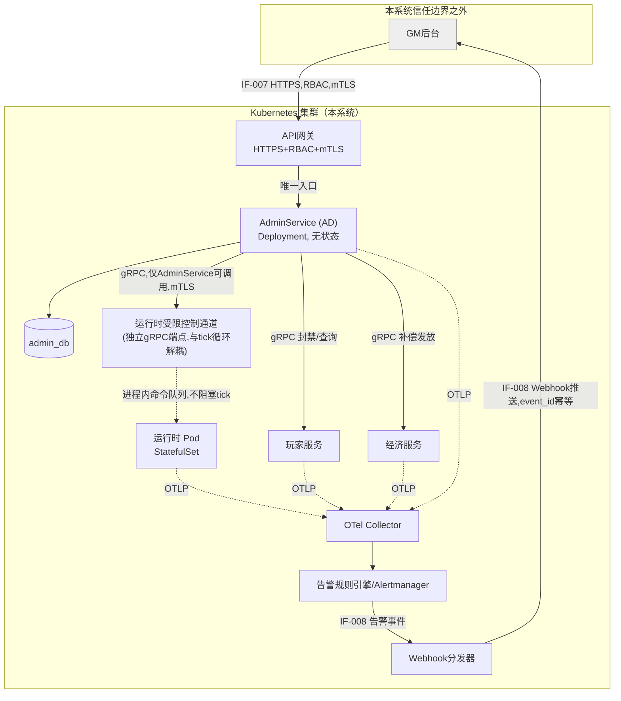
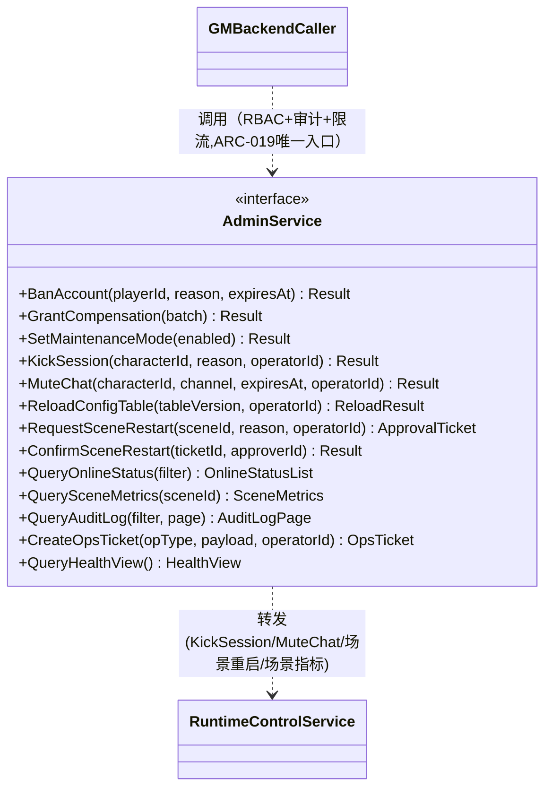
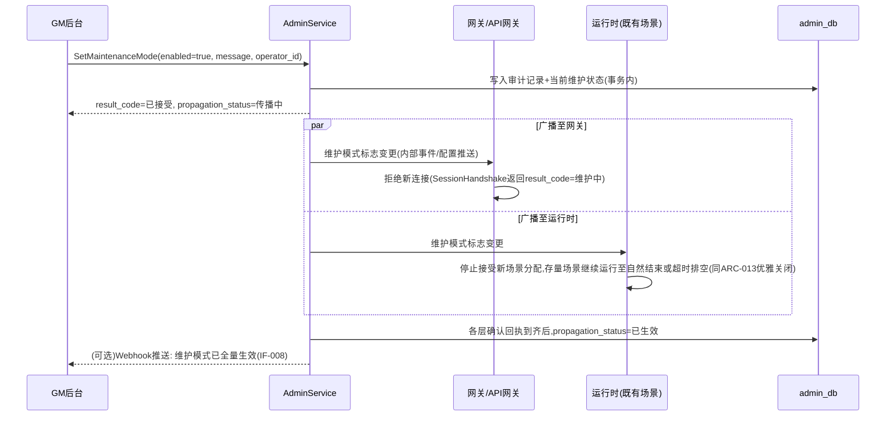
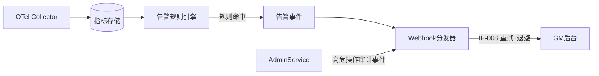
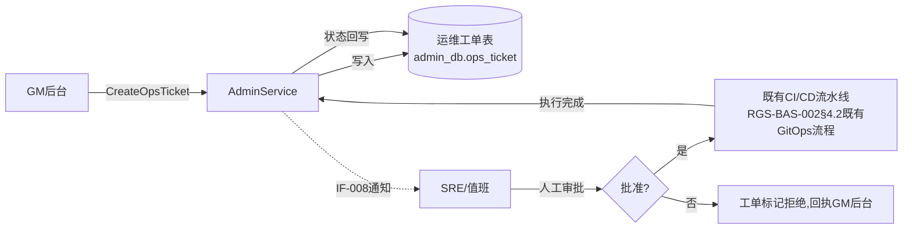

# 基本设计书（基本設計書 / Basic Design Document）

**运维功能与GM后台管控 Operations & GM Backend Control**

| 项目 | 内容 |
|---|---|
| 文档编号 | RGS-BAS-003 |
| 版本 | 0.3 |
| 父文档 | RGS-REQ-007 需求定义书 第7章（ARC-019） |
| 依据标准 | IPA『共通フレーム 2013（SLCP-JCF2013）』基本设计工程 |
| 制定日 | 2026-08-16 |
| 制定者 | 架构师 |
| 保密级别 | 内部限定（Internal Use Only） |

## 修订历史（改訂履歴 / Revision History）

| 版本 | 修订日 | 修订者 | 修订内容 | 影响章节 |
|---|---|---|---|---|
| 0.1 | 2026-08-16 | 架构师 | 初版制定。将RGS-REQ-007 ARC-019展开为控制平面组件图、`AdminService`字段级API扩展、运行时受限控制通道设计、维护模式传播时序、告警推送设计、RBAC角色矩阵扩展、运维工单设计 | 全部 |
| 0.2 | 2026-08-16 | 架构师 | 补充遗漏：FR-OPS-001（健康视图聚合API）此前未在字段级API中展开，新增`AdminService.QueryHealthView`方法及设计要点；追溯性表补齐AC-OPS-001〜005验收标准与设计章节的映射（此前追溯性表未覆盖AC条目） | §3.4、§13 |
| 0.3 | 2026-09-01 | 架构师 (Mavis 接手 agent per DEC-008) | 落实"各BAS文档功能章节加log设计且区分debug/release级log"总要求（与RGS-BAS-004 v0.3 同步）：§3.1.1/§3.2.1/§3.3.1/§3.4.1（AdminService 全部 11 个方法分组）、§4.5（运行时控制通道 4 命令 + 场景重启流程）、§5.1（维护模式传播）、§6.3（告警与事件推送）、§7.1（审计与查询）、§8.3（RBAC + 二次确认）、§9.1（限流与故障隔离）、§10.1（运维工单生命周期）共 11 个"本功能日志设计"小节全部新增；每节均显式区分 `info!`/`warn!`/`error!`（release 必出，编译期常驻）与 `debug!`/`trace!`（`#[cfg(debug_assertions)]` 守护，debug-only，release build 完全剔除零运行时开销）两类事件，含事件名/触发条件/字段最小集/频率上限/性能预算；§12.1 新增 4 项 log 章节上线检查项（每功能 log 章节存在性/release 必出 grep 验证/debug-only 四铁律合规/release 必出宏未被 `#[cfg]` 守护）；§13 追溯性新增 AC-OPS-006（debug-only 宏 release 完全剔除）与 AC-OPS-007（每功能 BAS 文档须含本功能 log 章节） | §3.1.1、§3.2.1、§3.3.1、§3.4.1、§4.5、§5.1、§6.3、§7.1、§8.3、§9.1、§10.1、§12.1、§13 |

## 审批栏（承認欄 / Approval）

| 角色 | 姓名 | 审批日 | 备注 |
|---|---|---|---|
| 制定（起草） | 架构师 | 2026-08-16 | — |
| 评审（技术） | | | 与RGS-BAS-001既有§5.7 admin_db／§6.3.4 AdminService／§7.3 RBAC的一致性 |
| 评审（安全） | | | 控制平面爆炸半径限制（ARC-019）是否落实到位 |
| 审批（负责人） | | | 本文档的基准化 |

---

## 目录

1. [前言](#1-前言)
2. [整体控制平面架构](#2-整体控制平面架构)
3. [AdminService 字段级API扩展设计](#3-adminservice-字段级api扩展设计)
4. [运行时受限控制通道设计](#4-运行时受限控制通道设计)
5. [维护模式传播设计](#5-维护模式传播设计)
6. [告警与事件推送设计](#6-告警与事件推送设计)
7. [审计与查询设计](#7-审计与查询设计)
8. [RBAC角色矩阵扩展与高危操作二次确认](#8-rbac角色矩阵扩展与高危操作二次确认)
9. [限流与故障隔离设计](#9-限流与故障隔离设计)
10. [K8s层运维工单设计](#10-k8s层运维工单设计)
11. [与RGS-OPS-001的分工](#11-与rgs-ops-001的分工)
12. [标准化检查清单](#12-标准化检查清单)
13. [追溯性（ARC-019 → 本设计书章节）](#13-追溯性arc-019-本设计书章节)

---

# 1. 前言

## 1.1 本文档的定位

本文档是RGS-REQ-007第7章ARC-019（GM后台控制平面的统一入口与爆炸半径限制）的系统级展开。本文档遵循RGS-BAS-001既有记述规则（§1.4强度用语、图示规则），不重复定义；本文档同时是RGS-BAS-001§5.7（`admin_db`）、§6.3.4（`AdminService`）、§7.3（RBAC角色）三处既有设计的**扩展**，而非替代——`AdminService`的既有方法（`BanAccount`／`GrantCompensation`／`SetMaintenanceMode`）保持不变，本文档仅新增方法与新增组件。

## 1.2 与RGS-BAS-002（功能挂载架构）的关系

GM后台是**本系统之外**的系统，不运行在本系统的Kubernetes集群内，因此GM后台本身**不适用**RGS-BAS-002的"挂载"流程。但本文档新增的**运行时受限控制通道**（§4）是本系统内部新增的组件，其K8s部署（Deployment形态判定、NetworkPolicy隔离）**仍需**遵循RGS-BAS-002§5的既有原则——它不是独立限界上下文（复用运行时既有的`admin_db`外部依赖关系与`AdminService`的信任边界），因此不触发RGS-REQ-006 ARC-018的完整挂载五要素，但其NetworkPolicy设计思路直接复用RGS-BAS-002§5.3。

---

# 2. 整体控制平面架构

## 2.1 组件图

> **ARC-019落地要点**：图中GM后台到本系统**只有一条入站路径**（经API网关到`AdminService`）与**一条出站路径**（Webhook推送）。GM后台节点上不存在指向`RTC`、`ADDB`、K8s API Server、`player_db`/`economy_db`的任何直接连线——这是运行时的强制拓扑，而非仅靠文档约定（NetworkPolicy落地见§4.4）。

## 2.2 新增外部接口编号

| 接口编号 | 名称 | 方向 | 补充说明 |
|---|---|---|---|
| IF-007（既有，本文档扩展字段） | GM后台 ⇔ 运营API | GM后台 → 本系统 | 见§3新增方法 |
| IF-008（新增） | 本系统 → GM后台 事件推送 | 本系统 → GM后台 | Webhook，见§6 |

---

# 3. AdminService 字段级API扩展设计

延续RGS-BAS-001§6.1 API设计通用原则（`request_id`幂等键、`trace_id`追踪、`result_code`错误表达）。以下方法**新增**至既有`AdminService`（RGS-BAS-001§6.3.4），不改变既有三个方法的签名。

## 3.1 账号/会话级方法

| Method | 请求字段 | 响应字段 | 对应功能 |
|---|---|---|---|
| `KickSession` | `request_id`／`character_id`／`reason`／`operator_id` | `result_code`／`session_terminated`（布尔） | FR-GM-011 |
| `MuteChat` | `request_id`／`character_id`／`channel`（枚举，同§6.2.2 `ChatMessage`的channel）／`expires_at`（可空＝永久）／`operator_id` | `result_code`／`mute_id` | FR-GM-012 |

### 3.1.1 本功能日志设计

| 事件 | 触发条件 | 宏调用 | 类别 | 字段最小集 | 频率上限 | 性能预算 |
|---|---|---|---|---|---|---|
| `gm.kick_session.received` | `AdminService` 收到 `KickSession` 调用（请求进入处理函数体） | `info!` | release 必出 | `request_id`／`character_id`／`operator_id`／`reason` | 取决于 GM 后台触发频次 | <10µs |
| `gm.kick_session.dispatched` | 命令已写入 `RuntimeControlService` 队列 | `info!` | release 必出 | `request_id`／`character_id`／`node_id`／`queue_depth` | 同上 | <10µs |
| `gm.kick_session.completed` | 运行时 tick 边界处会话已断开（含成功/失败 result_code） | `info!` | release 必出 | `request_id`／`character_id`／`node_id`／`result_code`／`latency_ms` | 同上 | <10µs |
| `gm.kick_session.rejected.overload` | 命令队列已满（背压触发，§4.2） | `warn!` | release 必出 | `request_id`／`character_id`／`operator_id`／`queue_capacity` | 偶发 | <10µs |
| `gm.kick_session.rbac_denied` | 操作者角色不满足权限（§8.1） | `warn!` | release 必出 | `request_id`／`operator_id`／`operator_role`／`required_role` | 偶发（多为配置错） | <10µs |
| `gm.kick_session.failed.unexpected` | 未预期的内部异常（DB 错误、运行时进程崩溃等） | `error!` | release 必出 | `request_id`／`character_id`／`error`／`trace_id` | 极少 | <50µs |
| `gm.kick_session.debug.request_envelope` | 请求全部字段（含入参明文） | `debug!`（`#[cfg(debug_assertions)]` 守护） | **debug-only** | `request_id`／`request_body` | 同上 | <5µs（release 完全剔除） |
| `gm.kick_session.debug.dispatch_timing` | 调度延迟（从 received 到 dispatched 间隔），逐调用记录 | `debug!`（`#[cfg(debug_assertions)]` 守护） | **debug-only** | `request_id`／`dispatch_latency_us` | 同上 | <5µs |

| 事件 | 触发条件 | 宏调用 | 类别 | 字段最小集 | 频率上限 | 性能预算 |
|---|---|---|---|---|---|---|
| `gm.mute_chat.received` | `AdminService` 收到 `MuteChat` 调用 | `info!` | release 必出 | `request_id`／`character_id`／`channel`／`expires_at`／`operator_id` | 偶发 | <10µs |
| `gm.mute_chat.persisted` | 禁言记录已写入 `admin_db.mute_record`（含事务提交确认） | `info!` | release 必出 | `request_id`／`mute_id`／`character_id`／`operator_id`／`db_tx_id` | 偶发 | <10µs |
| `gm.mute_chat.rejected.duplicate` | 同一 `request_id` 已存在静音记录（幂等命中，**不**视为错误） | `info!` | release 必出 | `request_id`／`existing_mute_id` | 偶发 | <10µs |
| `gm.mute_chat.failed.unexpected` | DB 写失败 / 运行时进程不可达 | `error!` | release 必出 | `request_id`／`character_id`／`error`／`trace_id` | 极少 | <50µs |
| `gm.mute_chat.debug.expires_at_raw` | 原始 ISO 8601 字符串（解析前后对照） | `debug!`（`#[cfg(debug_assertions)]` 守护） | **debug-only** | `request_id`／`raw`／`parsed_unix_ts` | 偶发 | <5µs |

**debug-only 守护要点**（落实 RGS-BAS-004 §4.3）：
- `gm.kick_session.debug.dispatch_timing` 测量的是"调度延迟"，不涉及昂贵计算，但**仍**守护——避免 release 误开 RUST_LOG=debug 时产生高频日志淹没生产通道
- `gm.mute_chat.debug.expires_at_raw` 中的 `parsed_unix_ts` 由独立 `let` 绑定，**不**在 `debug!` 宏参数内调用解析函数（防止 release 下解析函数被宏参数求值时跳过——尽管本例中不致命，但遵循 §4.3 规则 #4）

## 3.2 场景/运行时级方法

| Method | 请求字段 | 响应字段 | 对应功能 |
|---|---|---|---|
| `QuerySceneMetrics` | `scene_id` | `entity_count`／`avg_tick_duration_ms`／`mailbox_depth`／`status`（正常／告警／严重） | FR-GM-020 |
| `RequestSceneRestart` | `request_id`／`scene_id`／`reason`／`operator_id` | `ticket_id`／`status`（待确认） | FR-GM-021（第一步：申请） |
| `ConfirmSceneRestart` | `ticket_id`／`approver_id`（须持有"高危操作"角色，见§8） | `result_code`／`executed_at` | FR-GM-021（第二步：二次确认后执行） |

### 3.2.1 本功能日志设计

| 事件 | 触发条件 | 宏调用 | 类别 | 字段最小集 | 频率上限 | 性能预算 |
|---|---|---|---|---|---|---|
| `gm.scene_metrics.query.received` | `QuerySceneMetrics` 调用进入处理函数 | `info!` | release 必出 | `request_id`／`scene_id`／`operator_id` | GM 后台轮询频次（典型 1-5 req/s 全集群） | <10µs |
| `gm.scene_metrics.query.served` | 指标已从 OTel Collector 聚合返回 | `debug!`（`#[cfg(debug_assertions)]` 守护） | **debug-only** | `request_id`／`scene_id`／`latency_ms`／`entity_count`／`tick_duration_p99_ms` | 同上 | <5µs |
| `gm.scene_metrics.query.cache_miss` | OTel Collector 缓存未命中（罕见，可能为指标存储后端故障） | `warn!` | release 必出 | `request_id`／`scene_id`／`fallback_path` | 极少 | <10µs |
| `gm.scene_metrics.query.failed` | OTel Collector 不可达 / 查询超时 | `error!` | release 必出 | `request_id`／`scene_id`／`error`／`trace_id` | 极少 | <50µs |

| 事件 | 触发条件 | 宏调用 | 类别 | 字段最小集 | 频率上限 | 性能预算 |
|---|---|---|---|---|---|---|
| `gm.scene_restart.request.received` | `RequestSceneRestart` 进入处理 | `info!` | release 必出 | `request_id`／`scene_id`／`operator_id`／`reason` | 极低（双人原则抑制频次） | <10µs |
| `gm.scene_restart.request.persisted` | 工单已写入 `admin_db.ops_ticket` | `info!` | release 必出 | `request_id`／`ticket_id`／`scene_id`／`operator_id`／`db_tx_id` | 极低 | <10µs |
| `gm.scene_restart.request.rbac_denied` | 申请者角色不足（非"封禁操作"或"高危操作审批"角色） | `warn!` | release 必出 | `request_id`／`operator_id`／`operator_role` | 极少 | <10µs |
| `gm.scene_restart.confirm.received` | `ConfirmSceneRestart` 进入处理 | `info!` | release 必出 | `ticket_id`／`approver_id` | 极低 | <10µs |
| `gm.scene_restart.confirm.dual_operator_violation` | 申请者与确认者为同一 `operator_id`（违反双人原则，§8.1） | `warn!` | release 必出 | `ticket_id`／`violation_operator_id`／`requester_id` | 配置错（应极少） | <10µs |
| `gm.scene_restart.confirm.executed` | 场景 Actor 优雅终止 + 新 Actor 恢复 | `info!` | release 必出 | `ticket_id`／`scene_id`／`approver_id`／`old_node_id`／`new_node_id`／`downtime_ms` | 极低 | <10µs |
| `gm.scene_restart.confirm.failed` | 恢复失败（检查点损坏等不可恢复） | `error!` | release 必出 | `ticket_id`／`scene_id`／`error`／`trace_id` | 极少 | <50µs |
| `gm.scene_restart.confirm.timeout` | 二次确认超时（工单在限定时间内未确认，自动失效） | `warn!` | release 必出 | `ticket_id`／`expired_at` | 偶发 | <10µs |
| `gm.scene_restart.debug.entity_snapshot` | 重启前场景实体数快照（用于事后复盘影响范围） | `debug!`（`#[cfg(debug_assertions)]` 守护） | **debug-only** | `ticket_id`／`entity_count`／`character_ids`（数组，小于 50） | 极低 | <20µs |

**debug-only 守护要点**：
- `gm.scene_metrics.query.served` 是高频事件（GM 后台轮询 1-5 req/s），**必须** `#[cfg(debug_assertions)]` 守护——release profile 即便允许 RUST_LOG=debug 开启，这一条也必须剔除，避免淹没生产日志通道
- `gm.scene_restart.debug.entity_snapshot` 中的 `character_ids` 数组在 50 实体以内，若场景超过此规模则需截断 + `truncated=true` 标记

## 3.3 配置/发布级方法

| Method | 请求字段 | 响应字段 | 对应功能 |
|---|---|---|---|
| `ReloadConfigTable` | `request_id`／`table_version`／`operator_id` | `result_code`（成功／一致性检查未通过，落地ARC-016，一致性检查设计见RGS-BAS-001§4.2.2）／`applied_at` | FR-GM-030 |
| `SetMaintenanceMode`（既有，行为补充） | 同既有字段 | 同既有字段＋新增`propagation_status`（各下游层的传播确认状态，见§5） | FR-GM-031 |
| `CreateOpsTicket` | `request_id`／`op_type`（枚举：扩容建议／缩容建议／滚动更新请求／Pod重启请求）／`payload`（JSON，具体参数）／`operator_id` | `ticket_id`／`status`（已提交，待SRE处理） | FR-GM-032（**不**触发任何K8s操作，仅落工单，见§10） |

### 3.3.1 本功能日志设计

| 事件 | 触发条件 | 宏调用 | 类别 | 字段最小集 | 频率上限 | 性能预算 |
|---|---|---|---|---|---|---|
| `gm.reload_config.received` | `ReloadConfigTable` 进入处理 | `info!` | release 必出 | `request_id`／`table_version`／`operator_id` | 运营触发（典型 <1/h） | <10µs |
| `gm.reload_config.consistency_check_passed` | 数值表版本一致性校验通过（ARC-016） | `info!` | release 必出 | `request_id`／`table`／`old_version`／`new_version` | 同上 | <10µs |
| `gm.reload_config.consistency_check_failed` | 一致性校验未通过，旧版本回退 | `warn!` | release 必出 | `request_id`／`table`／`old_version`／`new_version`／`reason` | 极少 | <10µs |
| `gm.reload_config.applied` | 全部目标节点在 tick 边界原子切换完成 | `info!` | release 必出 | `request_id`／`table`／`new_version`／`affected_node_count`／`applied_at` | 同上 | <10µs |
| `gm.reload_config.partial_apply` | 部分节点切换成功 / 部分超时 | `warn!` | release 必出 | `request_id`／`table`／`applied_nodes`／`failed_nodes` | 极少 | <10µs |
| `gm.reload_config.failed` | 校验异常 / 节点全部不可达 | `error!` | release 必出 | `request_id`／`error`／`trace_id` | 极少 | <50µs |
| `gm.reload_config.debug.checksum_compare` | 旧版与新版的 hash 摘要对照 | `debug!`（`#[cfg(debug_assertions)]` 守护） | **debug-only** | `request_id`／`old_sha256`／`new_sha256` | 同上 | <20µs |

| 事件 | 触发条件 | 宏调用 | 类别 | 字段最小集 | 频率上限 | 性能预算 |
|---|---|---|---|---|---|---|
| `gm.maintenance.set.received` | `SetMaintenanceMode` 进入处理 | `info!` | release 必出 | `request_id`／`enabled`／`operator_id`／`message` | 极低 | <10µs |
| `gm.maintenance.propagation.started` | 广播至网关/运行时开始 | `info!` | release 必出 | `request_id`／`enabled`／`broadcast_targets` | 极低 | <10µs |
| `gm.maintenance.propagation.converged` | 法定人数确认计数达 95% 或超时兜底命中（§5 收敛算法） | `info!` | release 必出 | `request_id`／`acked_count`／`total_count`／`converged_by`（quorum／timeout） | 极低 | <10µs |
| `gm.maintenance.propagation.partial` | 少数节点未回执但未达超时，propagation_status=部分生效 | `warn!` | release 必出 | `request_id`／`acked_count`／`unacked_node_ids` | 极少 | <10µs |
| `gm.maintenance.propagation.failed` | 法定人数未达且超时命中 | `error!` | release 必出 | `request_id`／`acked_count`／`total_count`／`timeout_ms` | 极少 | <50µs |
| `gm.maintenance.debug.broadcast_timing_per_node` | 每个目标节点的回执延迟（详细时序） | `debug!`（`#[cfg(debug_assertions)]` 守护） | **debug-only** | `request_id`／`node_id`／`ack_latency_ms` | 极低 | <20µs |

| 事件 | 触发条件 | 宏调用 | 类别 | 字段最小集 | 频率上限 | 性能预算 |
|---|---|---|---|---|---|---|
| `gm.ops_ticket.created` | `CreateOpsTicket` 落表成功 | `info!` | release 必出 | `ticket_id`／`op_type`／`operator_id`／`payload_size_bytes` | 运营触发 | <10µs |
| `gm.ops_ticket.rbac_denied` | 操作者无"运维工单发起"角色 | `warn!` | release 必出 | `request_id`／`operator_id`／`operator_role` | 偶发 | <10µs |
| `gm.ops_ticket.duplicate` | 同 `op_type` + 相同 `payload` hash 的工单在指定时间窗口内已存在（防重） | `info!` | release 必出 | `request_id`／`existing_ticket_id` | 偶发 | <10µs |
| `gm.ops_ticket.debug.payload_full` | 完整 payload（不复述字段，**仅** debug-only 守护以避免敏感配置泄漏） | `debug!`（`#[cfg(debug_assertions)]` 守护） | **debug-only** | `ticket_id`／`payload_json` | 运营触发 | <20µs |

## 3.4 查询/审计方法

| Method | 请求字段 | 响应字段 | 对应功能 |
|---|---|---|---|
| `QueryOnlineStatus` | `filter`（可选：`player_id`／`scene_id`／分页参数） | `players[]`（`character_id`／`scene_id`／`connected_at`／`session_epoch`） | FR-GM-003 |
| `QueryAuditLog` | `filter`（操作者／操作类型／时间范围）／`page` | `entries[]`（同`OPERATION_AUDIT`表字段，RGS-BAS-001§5.7）／`has_more` | FR-OPS-004 |
| `QueryHealthView` | 无（全局聚合，暂不支持按限界上下文过滤，详细设计阶段视GM后台需要再扩展） | `services[]`（`service_name`／`ready`（布尔，取自既有`/readyz`）／`queue_depth`（关键队列积压，取自ARC-017既有OTel指标）／`db_pool_usage`（连接池水位百分比）／`checked_at`） | FR-OPS-001 |

**设计要点**：`QueryHealthView`不直接探活各服务（避免形成又一条跨限界上下文的同步依赖链），而是从既有OTel Collector（§6.1数据流中的`METRIC`指标存储）读取各服务最近一次上报的`/readyz`快照与队列/连接池指标做聚合展示，本身为**只读、无侧作用**的查询，与FR-GM-020场景级`QuerySceneMetrics`同属"运维只读视图"范畴但聚合粒度不同（前者服务级，后者场景级）。

### 3.4.1 本功能日志设计

| 事件 | 触发条件 | 宏调用 | 类别 | 字段最小集 | 频率上限 | 性能预算 |
|---|---|---|---|---|---|---|
| `gm.query_online.received` | `QueryOnlineStatus` 进入处理 | `info!` | release 必出 | `request_id`／`operator_id`／`filter_kind`（player／scene） | GM 后台轮询频次 | <10µs |
| `gm.query_online.served` | 返回结果 | `debug!`（`#[cfg(debug_assertions)]` 守护） | **debug-only** | `request_id`／`result_count`／`latency_ms` | 同上 | <5µs |
| `gm.query_online.cache_miss` | 玩家位置缓存（缓存基础设施）未命中，回退到 PostgreSQL 权威表 | `debug!`（`#[cfg(debug_assertions)]` 守护） | **debug-only** | `request_id`／`scene_id`／`fallback_path` | 偶发 | <5µs |
| `gm.query_online.failed` | PostgreSQL 查询失败 / 缓存基础设施不可达 | `error!` | release 必出 | `request_id`／`error`／`trace_id` | 极少 | <50µs |

| 事件 | 触发条件 | 宏调用 | 类别 | 字段最小集 | 频率上限 | 性能预算 |
|---|---|---|---|---|---|---|
| `gm.query_audit.received` | `QueryAuditLog` 进入处理 | `info!` | release 必出 | `request_id`／`operator_id`／`filter_size` | GM 后台查看 | <10µs |
| `gm.query_audit.served` | 返回结果 | `debug!`（`#[cfg(debug_assertions)]` 守护） | **debug-only** | `request_id`／`page`／`result_count`／`latency_ms` | 同上 | <5µs |
| `gm.query_audit.bulk_export_attempt` | 检测到 filter 范围 > 阈值（疑似批量导出攻击，§7） | `warn!` | release 必出 | `request_id`／`operator_id`／`filter_time_range_hours` | 配置错 | <10µs |
| `gm.query_audit.rbac_denied` | 操作者无"只读查看"角色 | `warn!` | release 必出 | `request_id`／`operator_id`／`operator_role` | 偶发 | <10µs |
| `gm.query_audit.failed` | PostgreSQL 查询失败 | `error!` | release 必出 | `request_id`／`error`／`trace_id` | 极少 | <50µs |

| 事件 | 触发条件 | 宏调用 | 类别 | 字段最小集 | 频率上限 | 性能预算 |
|---|---|---|---|---|---|---|
| `gm.query_health.received` | `QueryHealthView` 进入处理 | `info!` | release 必出 | `request_id`／`operator_id` | GM 后台轮询频次 | <10µs |
| `gm.query_health.served` | 聚合完成 | `info!` | release 必出 | `request_id`／`service_count`／`ready_count`／`unready_service_names` | 同上 | <10µs |
| `gm.query_health.partial_aggregate` | OTel Collector 部分返回（如某服务未上报 `db_pool_usage`） | `warn!` | release 必出 | `request_id`／`missing_metrics` | 偶发 | <10µs |
| `gm.query_health.failed` | OTel Collector 不可达 | `error!` | release 必出 | `request_id`／`error`／`trace_id` | 极少 | <50µs |
| `gm.query_health.debug.individual_service_state` | 每个服务的 `ready`/`queue_depth`/`db_pool_usage` 详细值 | `debug!`（`#[cfg(debug_assertions)]` 守护） | **debug-only** | `request_id`／`service_name`／`ready`／`queue_depth`／`db_pool_usage` | 同上 | <20µs |

**debug-only 守护要点**：
- `gm.query_online.served` / `gm.query_audit.served` 是高频事件（GM 后台轮询 1-5 req/s），**必须** `#[cfg(debug_assertions)]` 守护
- `gm.query_audit.bulk_export_attempt` 是**安全告警**，因此用 `warn!` 而**不**用 `debug!`——它需要 release 可见，用于检测审计数据外泄企图

---

# 4. 运行时受限控制通道设计

## 4.1 设计目标

对应ARC-019"涉及运行时进程内部状态的操作，必须经运行时新增的受限控制通道二次转发"。目标：让GM指令能够触达单个场景Actor（如KickSession需要让特定运行时节点上的会话失效），同时**不破坏**ARC-001（场景Actor单线程顺序执行）与ARC-013（背压、死锁防止）的既有保证。

## 4.2 组件设计

| 项目 | 内容 |
|---|---|
| 部署形态 | 与运行时Pod**同进程**内的独立gRPC服务`RuntimeControlService`（不新建独立Pod/Deployment，理由：需要直接访问该Pod内存中的场景Actor句柄表，跨Pod会引入不必要的网络往返与一致性问题） |
| 调用方 | **仅**`AdminService`，通过mTLS+服务身份校验限制调用方，运行时集群内DNS不对外（无K8s Service的对外暴露），只在集群内网络可达，且受NetworkPolicy进一步限制来源为`AdminService`所在Pod（复用RGS-BAS-002§5.3网络隔离思路） |
| 与tick循环的关系 | 收到的命令写入该Pod内一个**有界命令队列**（同ARC-013"不得创建无界的queue"），在每个场景Actor的tick边界之间被消费，**不得**在tick执行中途插入命令处理，同ARC-016"数值表热更新的原子切换点"同等的边界纪律 |
| 背压 | 命令队列达到上限时拒绝新命令并返回明确的`result_code`（过载），**不得**无界排队，同ARC-013 |
| 幂等 | 命令携带`request_id`，重复下发（如`AdminService`重试）不产生重复副作用（如重复踢人只终止一次会话） |

## 4.3 支持的命令

| 命令 | 行为 | 对应`AdminService`方法 |
|---|---|---|
| `KickSession` | 定位该角色所在场景的会话对象，在下一tick边界将其标记为断开，触发既有断线流程（同网关心跳超时的既有ST-001状态迁移路径） | `AdminService.KickSession` |
| `MuteChat` | 若聊天判定发生在运行时（依赖PH-6具体实现，若聊天判定在社交服务GD侧完成则本命令改为转发至GD，非运行时），在会话级标记禁言状态 | `AdminService.MuteChat` |
| `QuerySceneMetrics` | 只读，从场景Actor的既有可观测性埋点（ARC-017）读取聚合指标，不修改任何状态 | `AdminService.QuerySceneMetrics` |
| `RestartScene`（仅在`ConfirmSceneRestart`确认后下发） | 触发该场景Actor的**优雅终止**（同ARC-013"优雅关闭"既有规律），随后按FR-RT-009既有检查点机制在新Actor中恢复 | `AdminService.ConfirmSceneRestart` |

## 4.4 网络隔离（NetworkPolicy）

| 规则 | 内容 |
|---|---|
| 入站 | 仅允许来自`AdminService`所在命名空间/Pod标签的连接，其余（含GM后台、客户端、网关）一律拒绝 |
| 出站 | 不适用（该通道不主动发起出站连接，仅被动接收命令） |

## 4.5 本功能日志设计

`RuntimeControlService` 在运行时 Pod 同进程内运行，日志与运行时主进程共用同一 OTel SDK 导出通道，**不**新建独立导出器。命名约定：`target: "rgs.runtime.control"`。

| 事件 | 触发条件 | 宏调用 | 类别 | 字段最小集 | 频率上限 | 性能预算 |
|---|---|---|---|---|---|---|
| `rt.control.command.enqueued` | 命令已写入有界命令队列（§4.2） | `info!` | release 必出 | `command`／`request_id`／`queue_depth` | 取决于 §3 GM 指令频次 | <10µs |
| `rt.control.command.dequeued` | 命令被消费（场景 Actor tick 边界之间） | `debug!`（`#[cfg(debug_assertions)]` 守护） | **debug-only** | `command`／`request_id`／`wait_in_queue_us` | 同上 | <5µs |
| `rt.control.command.executed` | 命令执行完成（成功/失败） | `info!` | release 必出 | `command`／`request_id`／`target_scene_id`／`result_code`／`execution_us` | 同上 | <10µs |
| `rt.control.command.rejected.queue_full` | 队列已满（背压触发，§4.2） | `warn!` | release 必出 | `command`／`request_id`／`queue_capacity` | 偶发 | <10µs |
| `rt.control.command.rejected.unknown_scene` | 目标 scene_id 在该 Pod 不存在（场景已迁移或销毁） | `warn!` | release 必出 | `command`／`request_id`／`target_scene_id` | 极少 | <10µs |
| `rt.control.command.rejected.actor_draining` | 目标场景 Actor 处于排空状态（§4.2 actor 排空流程） | `warn!` | release 必出 | `command`／`request_id`／`target_scene_id` | 极少 | <10µs |
| `rt.control.command.failed.unexpected` | tick 边界消费时 panic 或运行时内部错误 | `error!` | release 必出 | `command`／`request_id`／`error`／`trace_id` | 极少 | <50µs |
| `rt.control.scene_restart.draining_started` | `RestartScene` 触发场景 Actor 优雅终止（§4.3） | `info!` | release 必出 | `request_id`／`scene_id`／`reason` | 极低 | <10µs |
| `rt.control.scene_restart.checkpoint_persisted` | 检查点已落 `runtime_db` | `info!` | release 必出 | `request_id`／`scene_id`／`checkpoint_id`／`db_tx_id` | 极低 | <10µs |
| `rt.control.scene_restart.new_actor_resumed` | 新场景 Actor 从检查点恢复并重新接受玩家连接 | `info!` | release 必出 | `request_id`／`scene_id`／`new_actor_id`／`resumed_at` | 极低 | <10µs |
| `rt.control.scene_restart.failed.recovery` | 新 Actor 恢复失败（检查点损坏） | `error!` | release 必出 | `request_id`／`scene_id`／`error`／`trace_id` | 极少 | <50µs |
| `rt.control.debug.queue_high_watermark_sample` | 队列水位采样（每 5s 一次，调试用） | `debug!`（`#[cfg(debug_assertions)]` 守护） | **debug-only** | `current_depth`／`peak_depth_5s`／`enqueue_rate_5s`／`consume_rate_5s` | 12/min（每 5s） | <5µs |
| `rt.control.debug.command_actor_lookup_chain` | scene_id → actor 句柄查找路径（经过 actor 表/反向索引/广播查询） | `debug!`（`#[cfg(debug_assertions)]` 守护） | **debug-only** | `command`／`scene_id`／`lookup_path`／`lookup_us` | 同 §3 | <10µs |

**debug-only 守护要点**：
- `rt.control.command.dequeued` 频率与 GM 指令触发频次正相关（典型 1-10 req/s 全集群），**必须** `#[cfg(debug_assertions)]` 守护——仅 `enqueued`/`executed` 是 release 必出，dequeued 是中间状态细节
- `rt.control.debug.queue_high_watermark_sample` 是**心跳式**采样（12/min），即使在 debug build 下也不应淹没日志通道——5s 间隔 + `target: "rgs.runtime.control"` 命名空间允许 GM 后端按 target 过滤采样频率

**性能预算合计**（单条命令峰值路径）：
- 必出 (`info!`/`warn!`/`error!`)：`enqueued` + `executed` ≈ 20µs
- debug-only（debug build 累计）：`dequeued` + `lookup_chain` + `queue_sample` ≈ 20µs
- 总和：40µs，**远低于** §3.2 中场景重启端到端 SLA（典型 30s 软上限），**不**影响 ARC-013 背压

---

# 5. 维护模式传播设计

对应FR-GM-031，补齐RGS-BAS-001既有`SetMaintenanceMode`未定义的"下游各层如何响应"。

**设计要点**：维护模式的传播**不是**同步阻塞`SetMaintenanceMode`调用的完成——`AdminService`立即返回"已接受"，实际生效状态通过`propagation_status`字段异步收敛，避免维护模式切换本身因等待全部Pod确认而超时（同ARC-013不得产生同步阻塞的循环等待）。

**收敛判定算法（RGS-BAS-010§4 G-008补强）**："各层确认回执到齐"**不得**要求100%节点确认——任一节点因网络分区/临时故障未回执，会导致`propagation_status`永远无法进入"已生效"，与NFR-OPS-006"控制平面故障不得影响实时路径"的精神冲突。判定**必须**采用**Quorum-based Ack Counting（法定人数确认计数）＋超时兜底**：已确认节点数达到预设法定比例（如95%，具体值详细设计确定）或达到最大等待时限（复用ARC-013既有超时要求）中较早者，即判定为已生效；未响应的少数节点**必须**被记录并告警（复用§6告警机制），但**不阻塞**收敛判定。

## 5.1 本功能日志设计

| 事件 | 触发条件 | 宏调用 | 类别 | 字段最小集 | 频率上限 | 性能预算 |
|---|---|---|---|---|---|---|
| `maint.broadcast.target_ack` | 某个下游层（网关/运行时/业务服务）回执确认 | `debug!`（`#[cfg(debug_assertions)]` 守护） | **debug-only** | `request_id`／`target_kind`／`node_id`／`ack_latency_ms` | 每次维护模式触发数百条 | <5µs |
| `maint.unacked_node.alert` | 收敛完成（quorum 或 timeout）后仍未回执的少数节点，**已收敛后**作为告警独立记录 | `warn!` | release 必出 | `request_id`／`unacked_node_ids`／`acked_count`／`total_count` | 极低 | <10µs |
| `maint.propagation.debug.broadcast_timeline` | 完整广播时间线（每节点回执时刻 + 收敛触发原因） | `debug!`（`#[cfg(debug_assertions)]` 守护） | **debug-only** | `request_id`／`timeline_json` | 极低 | <50µs |

**release 必出与 §3.3 重复的复述**：本节与 §3.3.1 `gm.maintenance.*` 系列是**同一组业务事件的两个观察点**——`AdminService` 侧的事件命名 `gm.maintenance.*`（控制平面入口），`maint.*` 是运行时/网关侧的事件命名（下游层观察点）。**字段 `request_id` 一致**，确保日志关联查询可按 `request_id` 跨域串联。

---

# 6. 告警与事件推送设计

## 6.1 数据流

## 6.2 设计原则

| 原则 | 内容 |
|---|---|
| 幂等 | 每条推送事件携带`event_id`，GM后台侧须按`event_id`去重（同ARC-009 Effectively Once精神），本系统侧允许At-Least-Once重试 |
| 重试与退避 | Webhook分发失败按指数退避重试，超过上限后转入死信队列供人工排查，**不得**无界重试（同ARC-013） |
| 内容分级 | 告警事件须携带严重度（信息／告警／严重），GM后台可按级别路由通知渠道（本系统不负责GM后台内部的通知路由逻辑） |
| 告警规则定义 | 告警规则的具体阈值与定义**不属于**本系统职责范围，由运维配置于告警规则引擎（可能是既有可观测性基础设施的组成部分，选型判定依ARC-014），本文档只定义"规则命中后如何推送"的接口 |

## 6.3 本功能日志设计

| 事件 | 触发条件 | 宏调用 | 类别 | 字段最小集 | 频率上限 | 性能预算 |
|---|---|---|---|---|---|---|
| `alert.rule.fired` | 告警规则引擎命中规则 | `info!` | release 必出 | `rule_id`／`severity`／`target_service`／`metric_name`／`metric_value`／`threshold` | 取决于告警规则（典型 1-100/h 全集群） | <10µs |
| `alert.webhook.dispatched` | Webhook 分发器已发出请求 | `info!` | release 必出 | `event_id`／`gm_endpoint`／`payload_size_bytes` | 同上 | <10µs |
| `alert.webhook.retry_scheduled` | Webhook 失败后按指数退避重试 | `warn!` | release 必出 | `event_id`／`attempt`／`backoff_ms`／`last_error` | 偶发 | <10µs |
| `alert.webhook.exhausted` | 重试超限，转入死信队列 | `error!` | release 必出 | `event_id`／`total_attempts`／`last_error`／`dlq_topic` | 极少 | <50µs |
| `alert.webhook.dead_letter_drained` | 死信队列被人工消费后的回执 | `info!` | release 必出 | `event_id`／`drained_at`／`drained_by` | 极少 | <10µs |
| `alert.webhook.failed.unexpected` | 分发器内部异常（签名失败、序列化失败等） | `error!` | release 必出 | `event_id`／`error`／`trace_id` | 极少 | <50µs |
| `alert.debug.rule_evaluation_trace` | 规则评估的完整 trace（条件分支命中、指标拉取时序） | `debug!`（`#[cfg(debug_assertions)]` 守护） | **debug-only** | `rule_id`／`evaluation_us`／`branches_evaluated` | 高频（每条规则每秒评估） | <5µs |
| `alert.debug.webhook_request_envelope` | Webhook 请求的完整 envelope（含签名头） | `debug!`（`#[cfg(debug_assertions)]` 守护） | **debug-only** | `event_id`／`headers`／`body_size_bytes` | 取决于告警触发 | <10µs |

**debug-only 守护要点**：
- `alert.debug.rule_evaluation_trace` 是**评估侧**高频事件（每条规则每秒评估一次），即便在 debug build 下也只用于性能分析——通过 `target: "rgs.alert.eval"` 命名空间隔离，运维侧可按 target 过滤
- `alert.debug.webhook_request_envelope` 含签名头，**仅** debug-only 守护以避免签名材料泄漏到生产日志（即使 Webhook 目标是内网，仍按"缺标比错标安全"原则严格处理）

---

# 7. 审计与查询设计

| 项目 | 内容 |
|---|---|
| 存储 | 复用既有`admin_db.OPERATION_AUDIT`表（RGS-BAS-001§5.7），仅追加，不提供删除/更新（NFR-SE-010） |
| 新增操作类型 | `action_type`枚举扩展：`KICK_SESSION`／`MUTE_CHAT`／`RELOAD_CONFIG`／`SCENE_RESTART_REQUEST`／`SCENE_RESTART_CONFIRM`／`OPS_TICKET_CREATED`，与既有`BAN_ACCOUNT`／`GRANT_COMPENSATION`／`SET_MAINTENANCE_MODE`并列 |
| 查询接口 | `AdminService.QueryAuditLog`（§3.4），响应经分页，**不**暴露批量导出（防止审计数据被整表拖走；如确需批量导出，走独立的、更高权限等级的合规流程，本版不设计） |
| 二次确认留痕 | `ConfirmSceneRestart`等二次确认动作各自产生独立的审计记录（申请一条、确认一条），可通过`ticket_id`关联查询 |

## 7.1 本功能日志设计

审计与查询章节本身**不**产生新业务事件（审计记录是其他章节事件的副作用），但**有**审计**写入层**的诊断事件：

| 事件 | 触发条件 | 宏调用 | 类别 | 字段最小集 | 频率上限 | 性能预算 |
|---|---|---|---|---|---|---|
| `audit.write.committed` | 审计记录已写入 `admin_db.OPERATION_AUDIT`（含事务提交） | `info!` | release 必出 | `audit_id`／`action_type`／`operator_id`／`db_tx_id` | 与 §3 各 GM 指令频次一致 | <10µs |
| `audit.write.failed` | 审计写失败（DB 不可用 / 事务回滚） | `error!` | release 必出 | `audit_id`／`action_type`／`error`／`trace_id` | 极少 | <50µs |
| `audit.write.skipped_audit_only` | **严重**：因审计写失败导致**整个 GM 指令被回滚**（不允许"指令成功但无审计"，落实 NFR-SE-010） | `error!` | release 必出 | `request_id`／`action_type`／`operator_id`／`audit_error` | 极少（**不**应发生） | <50µs |
| `audit.write.duplicate_idempotent` | 同 `request_id` 重复下发（幂等命中） | `info!` | release 必出 | `request_id`／`existing_audit_id` | 偶发 | <10µs |
| `audit.write.debug.full_payload` | 完整操作 payload（含 `operator_id`/`target_entity_ids`/`reason` 等） | `debug!`（`#[cfg(debug_assertions)]` 守护） | **debug-only** | `audit_id`／`payload_json` | 与 GM 指令频次一致 | <20µs |

**关键设计纪律**（与 §9 限流 + §6 告警的协同）：
- `audit.write.failed` **必须** 触发告警（接入 §6 告警规则），且 NFR-OPS-001 要求的"控制平面告警 p99 时延"在审计失败场景下**升级**为 P0（数据合规事件）
- `audit.write.skipped_audit_only` 是**最严重**的事件：意味着 GM 指令**和**审计**同时**失败，按 NFR-SE-010"不可篡改、不可丢失"原则**禁止**降级通过——必须**回滚业务事务**

---

# 8. RBAC角色矩阵扩展与高危操作二次确认

## 8.1 角色矩阵（扩展RGS-BAS-001§7.3既有五类角色）

| 角色 | 权限范围 | 备注 |
|---|---|---|
| 只读查看（既有） | `QueryOnlineStatus`／`QuerySceneMetrics`／`QueryAuditLog` | 无写权限 |
| 封禁操作（既有） | `BanAccount`／`KickSession`／`MuteChat` | 账号/会话级写操作 |
| 补偿发放（既有） | `GrantCompensation` | — |
| 维护模式切换（既有） | `SetMaintenanceMode` | — |
| 数值热更新（既有） | `ReloadConfigTable` | — |
| **高危操作审批（新增）** | `ConfirmSceneRestart`、超过阈值的批量`GrantCompensation`/`BanAccount`的二次确认 | 须与申请者（`RequestSceneRestart`调用者）**不是同一操作者**（双人原则，防止单点绕过） |
| **运维工单发起（新增）** | `CreateOpsTicket` | 仅能创建工单，**不**具备执行K8s操作的权限（该权限根本不存在于本系统API中，见§10） |

## 8.2 高危操作判定与二次确认流程

| 操作 | 高危判定条件 | 确认要求 |
|---|---|---|
| `RequestSceneRestart` → `ConfirmSceneRestart` | 恒定视为高危（直接影响该场景内全部在线玩家） | 双人原则，见§8.1 |
| `BanAccount`（批量） | 单批次超过阈值【待定，与运营团队评审】 | 二次确认，阈值以下沿用既有单人操作 |
| `GrantCompensation`（批量） | 单批次影响人数或道具总值超过阈值【待定】 | 二次确认 |

> 阈值具体数值为TBD-OPS-003，待与运营团队评审后于详细设计阶段确定，不影响本设计书的流程结构本身。

## 8.3 本功能日志设计

| 事件 | 触发条件 | 宏调用 | 类别 | 字段最小集 | 频率上限 | 性能预算 |
|---|---|---|---|---|---|---|
| `rbac.check.allowed` | RBAC 角色匹配通过 | `debug!`（`#[cfg(debug_assertions)]` 守护） | **debug-only** | `request_id`／`operator_id`／`operator_role`／`method`／`matched_role` | 高频（每个 GM 调用） | <5µs |
| `rbac.check.denied` | RBAC 角色匹配不通过 | `warn!` | release 必出 | `request_id`／`operator_id`／`operator_role`／`method`／`required_role` | 偶发 | <10µs |
| `rbac.dual_operator.violation` | 二次确认操作违反双人原则（§8.1） | `warn!` | release 必出 | `ticket_id`／`requester_id`／`violation_approver_id` | 极少（配置错） | <10µs |
| `rbac.high_risk.confirmed` | 高危操作二次确认通过 | `info!` | release 必出 | `ticket_id`／`method`／`requester_id`／`approver_id` | 极低 | <10µs |
| `rbac.debug.role_matrix_lookup` | 角色矩阵查找的详细路径（多角色匹配时的决策链） | `debug!`（`#[cfg(debug_assertions)]` 守护） | **debug-only** | `request_id`／`method`／`roles_evaluated`／`matched_at_index` | 高频 | <10µs |

**debug-only 守护要点**：
- `rbac.check.allowed` 是**高频**事件（每个 GM 调用都过 RBAC），**必须** `#[cfg(debug_assertions)]` 守护——仅 `denied`/`violation`/`confirmed` release 必出
- `rbac.debug.role_matrix_lookup` 用于排查"为什么这个角色没匹配上"——开发/CI 阶段高频使用，生产几乎不需要

---

# 9. 限流与故障隔离设计

| 设计点 | 方针 |
|---|---|
| GM后台侧限流 | `AdminService`对每个GM后台调用方身份设置速率限制桶，防止GM后台自身故障（死循环重试）冲击控制平面，同ARC-013 |
| 熔断 | `AdminService`对下游（`RuntimeControlService`／`PlayerService`／`EconomyService`）调用设置超时+熔断器，下游不可用时`AdminService`返回明确降级结果，**不得**将GM指令挂起等待 |
| 故障隔离（NFR-OPS-006落地） | `AdminService`与`admin_db`的可用性问题**不得**影响玩家侧实时路径——`AdminService`不参与移动/战斗的同步调用链（同ARC-007既有边界的自然推论：控制平面与实时业务路径物理上是不同的调用图） |

## 9.1 本功能日志设计

| 事件 | 触发条件 | 宏调用 | 类别 | 字段最小集 | 频率上限 | 性能预算 |
|---|---|---|---|---|---|---|
| `ratelimit.gm_caller.throttled` | GM 后台侧调用方触发速率限制（§9 GM后台侧限流） | `warn!` | release 必出 | `caller_id`／`method`／`current_rate`／`limit` | 极少（GM 后台配置错） | <10µs |
| `ratelimit.gm_caller.banned` | 持续超限升级为临时封禁 | `warn!` | release 必出 | `caller_id`／`banned_until`／`violation_count` | 极少 | <10µs |
| `circuit_breaker.opened` | 下游服务（运行时/玩家服务/经济服务）熔断器打开 | `error!` | release 必出 | `downstream`／`error_rate`／`opened_at` | 极少 | <50µs |
| `circuit_breaker.half_open` | 熔断器进入半开探测状态 | `info!` | release 必出 | `downstream`／`probe_started_at` | 极少 | <10µs |
| `circuit_breaker.closed` | 熔断器关闭（恢复） | `info!` | release 必出 | `downstream`／`closed_at`／`downtime_ms` | 极少 | <10µs |
| `circuit_breaker.short_circuit_returned` | 熔断状态下，`AdminService` 返回降级结果（不挂起等待） | `warn!` | release 必出 | `request_id`／`method`／`downstream`／`result_code` | 偶发 | <10µs |
| `ratelimit.debug.bucket_state` | 速率限制桶的当前状态（令牌数/请求速率） | `debug!`（`#[cfg(debug_assertions)]` 守护） | **debug-only** | `caller_id`／`tokens_remaining`／`refill_rate` | 偶发 | <5µs |
| `circuit_breaker.debug.state_transition` | 熔断器状态转换的详细条件 | `debug!`（`#[cfg(debug_assertions)]` 守护） | **debug-only** | `downstream`／`from_state`／`to_state`／`condition` | 极少 | <5µs |

**release 必出关键事件**：`circuit_breaker.opened` / `circuit_breaker.closed` 是控制平面健康度的核心信号，**必须** release 可见并接入 §6 告警规则（典型阈值：熔断打开 > 1min 持续则 P1 告警）。

---

# 10. K8s层运维工单设计

对应ARC-019"K8s层操作的例外处理"。

| 设计要点 | 内容 |
|---|---|
| 工单表 | `admin_db`新增`ops_ticket`表：`ticket_id`／`op_type`／`payload`／`status`（待处理／已批准／已拒绝／执行中／已完成）／`created_by`／`approved_by`／`executed_at` |
| **权限边界（ARC-019核心）** | 本系统API中**不存在**任何"执行K8s操作"的方法。`CreateOpsTicket`只产生一条记录，实际执行动作发生在**本系统边界之外**——既有CI/CD流水线或SRE的人工操作，均不通过本系统的gRPC/HTTP接口触发 |
| 状态回写 | SRE/CI流水线执行完成后，通过既有运维手段（如CI流水线回调既有的工单状态更新接口，或人工在GM后台标记）更新`ops_ticket.status`，形成闭环可查询记录 |

## 10.1 本功能日志设计

工单生命周期事件已在 §3.3 `gm.ops_ticket.*` 中定义；本节补充工单**流转**侧的日志：

| 事件 | 触发条件 | 宏调用 | 类别 | 字段最小集 | 频率上限 | 性能预算 |
|---|---|---|---|---|---|---|
| `ops_ticket.lifecycle.approved` | SRE 审批通过 | `info!` | release 必出 | `ticket_id`／`approver_id`／`approved_at` | 极低 | <10µs |
| `ops_ticket.lifecycle.rejected` | SRE 审批拒绝 | `info!` | release 必出 | `ticket_id`／`approver_id`／`rejection_reason` | 极低 | <10µs |
| `ops_ticket.lifecycle.executing` | CI/CD 流水线开始执行 | `info!` | release 必出 | `ticket_id`／`pipeline_id`／`started_at` | 极低 | <10µs |
| `ops_ticket.lifecycle.completed` | 执行完成 | `info!` | release 必出 | `ticket_id`／`completed_at`／`execution_duration_ms`／`result` | 极低 | <10µs |
| `ops_ticket.lifecycle.failed` | 执行失败 | `error!` | release 必出 | `ticket_id`／`error`／`trace_id` | 极少 | <50µs |
| `ops_ticket.lifecycle.stale` | 工单超过 SLA 仍未处理（如 24h 无审批） | `warn!` | release 必出 | `ticket_id`／`age_hours`／`op_type` | 偶发 | <10µs |
| `ops_ticket.debug.ci_pipeline_logs_pointer` | CI 流水线日志的可检索指针（URL/对象存储 key，**不**含日志内容） | `debug!`（`#[cfg(debug_assertions)]` 守护） | **debug-only** | `ticket_id`／`pipeline_id`／`logs_pointer` | 极低 | <5µs |

**release 必出与告警联动**：`ops_ticket.lifecycle.stale` 接入 §6 告警规则（典型阈值：超过 24h 未审批则 P3 告警，超过 72h 升级 P2）。

---

# 11. 与RGS-OPS-001的分工

| 维度 | 本文档（RGS-BAS-003） | RGS-OPS-001（已制定） |
|---|---|---|
| 性质 | 系统需求与设计（回答"系统必须提供什么能力"） | 运维手顺书（回答"SRE收到告警后按什么步骤操作"） |
| 内容 | API字段设计、控制平面组件、RBAC角色定义、审计设计 | 值班排班、故障响应SOP、告警规则的具体阈值配置、事后复盘模板 |
| 关系 | RGS-OPS-001**消费**本文档定义的API与观测数据，**不重复**定义系统能力 | 本文档**不涉及**人工操作步骤与组织流程 |

---

# 12. 标准化检查清单

## 12.1 GM后台管控功能上线检查清单

- [ ] `AdminService`新增方法（§3）均已实现`request_id`幂等与`trace_id`透传（RGS-BAS-001§6.1通用原则）
- [ ] 运行时受限控制通道的NetworkPolicy已验证：仅`AdminService`可达，GM后台/客户端/网关均不可达（§4.4）
- [ ] 高危操作（§8.2）的二次确认流程在测试环境验证通过，且申请者与确认者角色互斥
- [ ] 维护模式传播的三层确认（网关/API网关、运行时、业务服务）均有回执，`propagation_status`可正确收敛为"已生效"
- [ ] 告警推送（IF-008）的`event_id`幂等与重试退避已验证
- [ ] 审计日志新增操作类型（§7）均可通过`QueryAuditLog`检索
- [ ] 已确认本系统API中不存在任何K8s操作执行接口，`CreateOpsTicket`仅落表不触发实际操作（ARC-019核心验证项）
- [ ] **每功能章节（§3.1/§3.2/§3.3/§3.4/§4/§5/§6/§7/§8/§9/§10）均含"本功能日志设计"子节**，且明确区分 `info!`/`warn!`/`error!`（release 必出）与 `debug!`/`trace!`（`#[cfg(debug_assertions)]` 守护，debug-only）两类
- [ ] release 必出事件清单（§3.1.1/§3.2.1/§3.3.1/§3.4.1/§4.5/§5.1/§6.3/§7.1/§8.3/§9.1/§10.1）逐项可在本功能代码中检索到对应调用点（grep 验证），未遗漏业务关键事件
- [ ] debug-only 事件严格遵守 RGS-BAS-004 §4.3 四条铁律（宏直接守护、避免 `if cfg!` 外层、参数 O(1)、关联 ID 预先 `let` 绑定）
- [ ] release build 中**不**存在 `info!`/`warn!`/`error!` 被 `#[cfg(debug_assertions)]` 守护的代码点（grep 验证）

---

# 13. 追溯性（ARC-019 → 本设计书章节）

| ARC/FR编号 | 决定摘要 | 本文档展开章节 |
|---|---|---|
| ARC-019 | GM后台控制平面统一入口与爆炸半径限制 | §2、§4、§10 |
| FR-GM-001〜005 | GM后台互通（鉴权、只读查询、事件推送） | §2.2、§3.4、§6 |
| FR-GM-010〜013 | 账号/会话级控制 | §3.1、§4.3 |
| FR-GM-020〜021 | 场景/运行时级控制 | §3.2、§4 |
| FR-GM-030〜032 | 配置/发布级控制 | §3.3、§5、§10 |
| FR-GM-040〜041 | 异常检测与风控联动 | §7（复用既有FR-AD-004数据） |
| FR-OPS-001〜004 | 运维功能（健康视图、告警、审计） | §6、§7 |
| NFR-OPS-001〜008 | 性能/安全/可审计/可用/幂等/限流 | §3、§4.2、§6.2、§8、§9 |
| AC-OPS-001（六类操作+审计） | §3全体方法均产生`OPERATION_AUDIT`记录 | §3、§7 |
| AC-OPS-002（故障注入,控制平面不影响实时路径） | §9故障隔离设计，`AdminService`不参与移动/战斗同步调用链 | §9 |
| AC-OPS-003（GM后台凭证无法直连业务DB/K8s API） | §2.1组件图拓扑（GM后台仅一入一出路径）＋§4.4 NetworkPolicy | §2、§4.4 |
| AC-OPS-004（高危操作二次确认留痕） | §8.2流程＋§7"二次确认留痕"设计 | §7、§8.2 |
| AC-OPS-005（告警p99时延演练） | §6告警数据流与Webhook重试退避设计，具体压测方案留待详细设计 | §6 |
| **AC-OPS-006（debug-only 宏在 release build 完全剔除）** | §3.1.1/§3.2.1/§3.3.1/§3.4.1/§4.5/§5.1/§6.3/§7.1/§8.3/§9.1/§10.1 各节"debug-only 守护要点"项 + RGS-BAS-004 §4.3 四条铁律 + §9 CI 第 5/6 项静态检查 | §3、§4、§5、§6、§7、§8、§9、§10、§12.1 |
| **AC-OPS-007（每功能 BAS 文档须含本功能 log 设计章节）** | §3.1.1/§3.2.1/§3.3.1/§3.4.1/§4.5/§5.1/§6.3/§7.1/§8.3/§9.1/§10.1 各"本功能日志设计"小节 + §12.1 检查项第 8 条（每功能 log 章节存在性）+ §12.1 检查项第 9 条（release 必出事件 grep 验证）+ §12.1 检查项第 10 条（debug-only 四铁律合规）+ §12.1 检查项第 11 条（release 必出宏未被 `#[cfg]` 守护） | §3.1.1、§3.2.1、§3.3.1、§3.4.1、§4.5、§5.1、§6.3、§7.1、§8.3、§9.1、§10.1、§12.1 |

---

> 本文档所定义的流程为**详细设计与实现阶段的输入基准**。具体的Webhook签名算法仍留待RGS-IFS-001，告警规则引擎选型依ARC-014判定；`ops_ticket`表物理DDL已由RGS-DTL-003§2定义。
