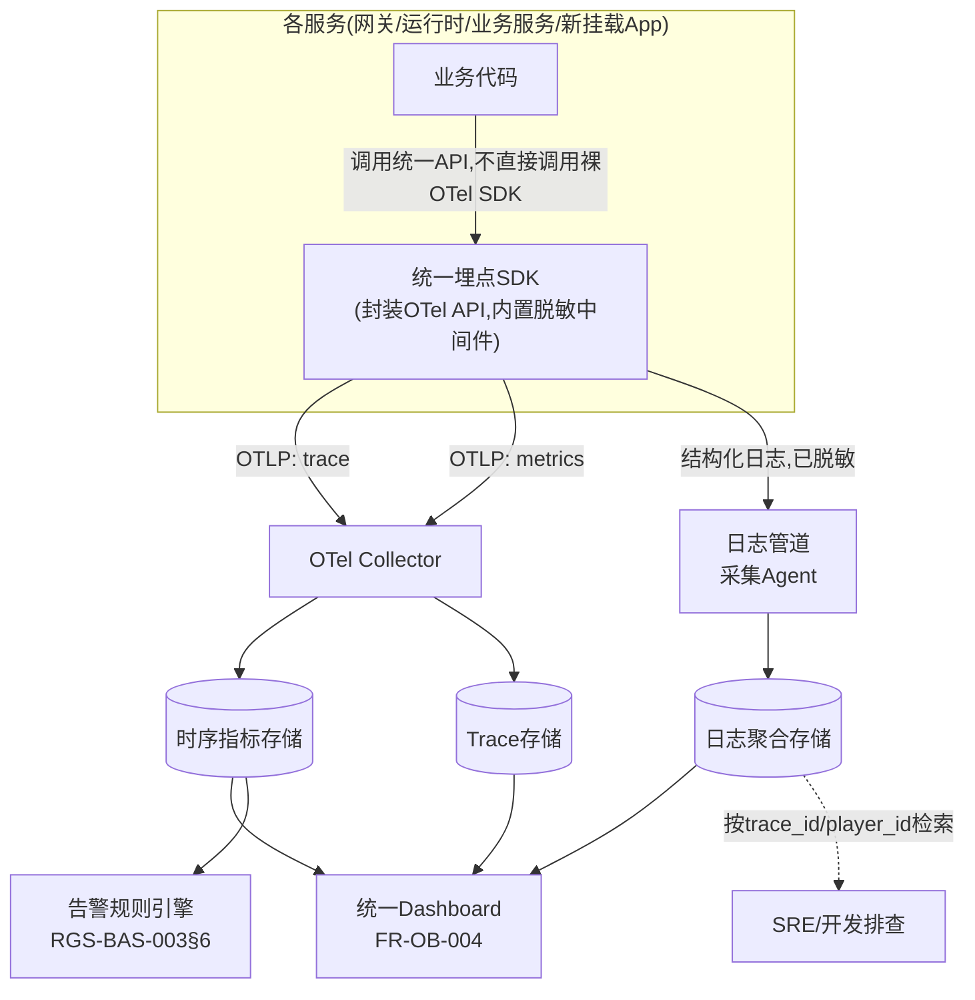

# 基本设计书（基本設計書 / Basic Design Document）

**埋点与日志规范 Instrumentation & Logging Standard**

| 项目 | 内容 |
|---|---|
| 文档编号 | RGS-BAS-004 |
| 版本 | 0.1 |
| 父文档 | RGS-REQ-008 需求定义书 第7章（ARC-020） |
| 依据标准 | IPA『共通フレーム 2013（SLCP-JCF2013）』基本设计工程 |
| 制定日 | 2026-08-16 |
| 制定者 | 架构师 |
| 保密级别 | 内部限定（Internal Use Only） |

## 修订历史（改訂履歴 / Revision History）

| 版本 | 修订日 | 修订者 | 修订内容 | 影响章节 |
|---|---|---|---|---|
| 0.1 | 2026-08-16 | 架构师 | 初版制定。将RGS-REQ-008 ARC-020展开为指标目录、span命名规范、日志字段规范、脱敏实现设计、采样设计、高频路径可观测性设计、CI静态检查设计 | 全部 |

## 审批栏（承認欄 / Approval）

| 角色 | 姓名 | 审批日 | 备注 |
|---|---|---|---|
| 制定（起草） | 架构师 | 2026-08-16 | — |
| 评审（技术） | | | 与RGS-BAS-001§4.8既有trace传播载体/指标采集拓扑的一致性 |
| 评审（安全/合规） | | | 脱敏规则（§5）是否满足NFR-SE-012及RGS-REQ-008 FR-LOG-020〜022 |
| 审批（负责人） | | | 本文档的基准化 |

---

## 目录

1. [前言](#1-前言)
2. [整体埋点与日志数据流](#2-整体埋点与日志数据流)
3. [指标目录（黄金指标）](#3-指标目录黄金指标)
4. [命名与字段规范](#4-命名与字段规范)
5. [脱敏设计](#5-脱敏设计)
6. [采样设计](#6-采样设计)
7. [高频路径（tick）可观测性设计](#7-高频路径tick可观测性设计)
8. [标准化脚手架集成](#8-标准化脚手架集成)
9. [CI静态检查设计](#9-ci静态检查设计)
10. [与审计日志・告警推送的关系](#10-与审计日志告警推送的关系)
11. [标准化检查清单](#11-标准化检查清单)
12. [追溯性（ARC-020 → 本设计书章节）](#12-追溯性arc-020--本设计书章节)

---

# 1. 前言

## 1.1 本文档的定位

本文档是RGS-REQ-008第7章ARC-020（埋点与日志的统一规范）的系统级展开，在RGS-BAS-001§4.8已确定的trace传播载体（§4.8.1）与指标采集拓扑（§4.8.2）**之上**，补充**字段级/命名级**的具体规范，使ARC-017"可观测性自PH-1起必须具备"具备可执行、可检查的落地标准。本文档遵循RGS-BAS-001既有记述规则（§1.4强度用语、图示规则），不重复定义，也**不改变**§4.8已确定的拓扑结构。

## 1.2 与其他基本设计书的关系

| 文档 | 关系 |
|---|---|
| RGS-BAS-001§4.8 | 既有的trace传播载体与指标采集拓扑，本文档在其基础上补充字段规范，不重新设计拓扑 |
| RGS-BAS-002（功能挂载架构）§9 | 新挂载App的"标准埋点"由脚手架自动生成，脚手架生成内容须符合本文档§4规范；本文档§8说明脚手架与本规范的集成方式 |
| RGS-BAS-003（运维与GM后台管控）§6/§7 | 告警推送（IF-008）消费本文档§3定义的指标；审计日志（`OPERATION_AUDIT`）与本文档定义的结构化事件日志是两套独立数据，关系见本文档§10 |

---

# 2. 整体埋点与日志数据流

**设计要点**：业务代码**不得**直接调用裸OpenTelemetry SDK或日志库（`tracing`/`log`等）的原始API，**必须**通过本系统提供的统一埋点SDK封装层调用——这是ARC-020"命名规范必须强制落地"与"脱敏优先于清洗"两条决定在代码层面的唯一入口点（同ARC-019"统一入口"同类思路的复用：凡是需要强制规范的横切关注点，都通过唯一封装层收口，而非依赖多处散落的手工实现）。

---

# 3. 指标目录（黄金指标）

延续RGS-BAS-001§4.8.2的指标采集拓扑，本节给出**具体应采集哪些指标**。

## 3.1 通用指标（全部对外接口，落实FR-LOG-004）

| 指标名 | 类型 | 维度标签 | 说明 |
|---|---|---|---|
| `rgs_request_duration_ms` | 直方图 | `service`／`method`／`result`（成功／业务错误／系统错误） | 延迟（Latency） |
| `rgs_request_total` | 计数器 | `service`／`method`／`result` | 流量（Traffic） |
| `rgs_request_errors_total` | 计数器 | `service`／`method`／`error_type` | 错误（Errors） |
| `rgs_dependency_pool_saturation_ratio` | 仪表 | `service`／`dependency`（如`postgres`／`cache`／`grpc_client`） | 饱和度（连接池/队列占用率） |

## 3.2 场景/运行时专属指标（落实FR-LOG-005、ARC-020"高频路径不产生span"）

| 指标名 | 类型 | 维度标签 | 说明 |
|---|---|---|---|
| `rgs_scene_tick_duration_ms` | 直方图 | `scene_id`（或分桶后的场景类型，避免高基数问题——见下方注记） | 对应RGS-BAS-003§3.2 `QuerySceneMetrics`的数据来源 |
| `rgs_scene_entity_count` | 仪表 | `scene_id` | — |
| `rgs_scene_mailbox_depth` | 仪表 | `scene_id` | 对应ARC-013背压监控 |

## 3.3 控制平面专属指标（落实RGS-REQ-007 NFR-OPS-*）

| 指标名 | 类型 | 维度标签 | 说明 |
|---|---|---|---|
| `rgs_gm_command_duration_ms` | 直方图 | `command`（如`KickSession`） | 对应NFR-OPS-001端到端延迟目标 |
| `rgs_gm_command_total` | 计数器 | `command`／`result` | — |
| `rgs_webhook_delivery_duration_ms` | 直方图 | `event_type` | 对应NFR-OPS-002告警推送时延目标 |

> **高基数（High Cardinality）注记**：`scene_id`／`character_id`等唯一标识符**不得**直接作为指标标签（会导致时序数据库基数爆炸，与NFR-OP-010运维负荷上限冲突）。§3.2表中`scene_id`标签**必须**在详细设计阶段替换为分桶策略（如场景类型、区域分片ID等有限基数维度），此处保留`scene_id`仅为示意，具体分桶方案留待详细设计（RGS-REQ-008§9 TBD-LOG-004）。**逐实体/逐玩家的维度分析**应通过日志/trace的关联ID检索实现，而非通过指标标签。

---

# 4. 命名与字段规范

## 4.1 Span命名规范（落实FR-LOG-001/002）

| 规则 | 内容 | 示例 |
|---|---|---|
| 格式 | `<限界上下文缩写>.<动词短语>` | `ec.commit_transaction`、`pl.select_character`、`ad.kick_session` |
| 限界上下文缩写 | 复用RGS-REQ-001既有缩写（PL／EC／MT／GD／AD／GW／RT），新挂载App使用其Mount Record（RGS-BAS-002§10）登记的缩写 | `ml.deliver_mail`（邮件服务示例） |
| 子span | 跨限界上下文调用产生的子span，命名规则同上，通过父子关系（而非命名前缀）体现调用链，不得在span名称中拼接调用方信息 | — |
| 高频路径 | 场景tick循环**不得**产生span（同ARC-020否决方案），仅用§3.2指标 | — |

## 4.2 日志级别使用场景定义（落实FR-LOG-012）

| 级别 | 使用场景 | 是否默认输出到生产环境 |
|---|---|---|
| `TRACE` | 逐步调试用的极细粒度信息（如单次数值计算过程） | 否，仅开发/预发布环境按需开启 |
| `DEBUG` | 有助于问题定位但非日常需要的信息 | 否，默认关闭，故障排查时临时提升级别 |
| `INFO` | 正常业务事件（会话建立、场景切换、GM指令执行成功等） | 是 |
| `WARN` | 非预期但已被系统正确处理的情况（降级触发、重试成功、背压拒绝） | 是 |
| `ERROR` | 需要人工关注的失败（未被正确处理的异常、下游依赖不可用导致的请求失败） | 是，**必须**同时触发§6.2强制全量采集 |

## 4.3 日志字段规范（落实FR-LOG-010/011/013）

### 4.3.1 基础字段（全部日志条目必须包含，可得性允许时）

| 字段名 | 类型 | 说明 |
|---|---|---|
| `timestamp` | ISO 8601时刻 | — |
| `level` | 枚举 | 同§4.2五级 |
| `service.name` | 字符串 | 与OTel resource attributes一致（复用RGS-BAS-002§9.1既有约定） |
| `trace_id`／`span_id` | 字符串 | 当前上下文可得时必须携带 |
| `message` | 字符串 | 人类可读的简述，**不得**将结构化数据拼接进`message`（应作为独立字段） |

### 4.3.2 业务扩展字段（按上下文可得性附加）

| 字段名 | 类型 | 说明 |
|---|---|---|
| `player_id`／`character_id` | 字符串 | 复用RGS-BAS-001既有实体ID字段命名（不得使用`playerId`等变体，落实FR-LOG-013） |
| `request_id`／`event_id`／`workflow_id` | 字符串 | 复用NFR-OP-002既定关联ID体系 |
| `scene_id`／`match_id`／`guild_id` | 字符串 | 依上下文 |
| `operator_id` | 字符串 | GM/运营操作日志专属，复用RGS-BAS-003既有字段命名 |

**命名规则**：全部字段名**必须**为`snake_case`，且与RGS-BAS-001既有API字段设计（§6.1〜6.5）、RGS-BAS-003§3 API字段设计中出现的同名概念保持完全一致的拼写——这是FR-LOG-013"同一概念全系统统一字段名"的具体落地依据，新字段命名前**应当**先检索既有API字段设计表避免重复定义近义词。

---

# 5. 脱敏设计

## 5.1 脱敏规则表（落实FR-LOG-020/021）

| 数据类别 | 处理方式 | 示例字段 |
|---|---|---|
| 账号凭证/密码/Token | **禁止记录**，埋点SDK层面拦截（属性名匹配`*token*`／`*password*`／`*credential*`等敏感词直接丢弃并告警提示开发者误用） | `credential_token`（复用RGS-BAS-001既有字段名，SDK内置黑名单） |
| 支付卡信息 | **禁止记录** | — |
| IP地址 | 保留网段，末段掩码（如`203.0.113.0/24`），精确到位数留待TBD-LOG-002（合规裁定后确定） | — |
| 精确地理位置 | **禁止记录**精确坐标，可记录粗粒度区域（国家/大区） | — |
| 邮箱/手机号 | 哈希化（不可逆），若业务确需模糊匹配（如客服查重），采用可配置的确定性哈希 | — |
| `player_id`／`character_id` | 明文允许 | 复用既有字段 |

## 5.2 实现方式

| 层级 | 实现 |
|---|---|
| SDK内置黑名单 | 统一埋点SDK（§2）内置字段名黑名单正则，命中即拒绝写入该字段值（替换为`[REDACTED]`），**不依赖**开发者主动调用脱敏函数 |
| 字段级标注 | 对于黑名单无法穷举的业务专属敏感字段，提供显式标注机制（如结构体字段属性宏），标注后的字段在日志/trace属性序列化时自动应用§5.1对应规则 |
| 双重防线（纵深防御，非替代） | 日志聚合存储侧仍配置RBAC访问控制（复用RGS-BAS-003 RBAC思路），作为SDK脱敏失效时的**第二道**防线，但**不作为**主要防线（ARC-020否决方案2已明确） |

---

# 6. 采样设计

## 6.1 配置项（落实FR-LOG-040）

| 配置项 | 说明 | 默认值（初始，PH-4前可调） |
|---|---|---|
| `trace_sample_ratio` | 正常成功路径的trace采样率 | 待PH-4负载试验确定（TBD-LOG-001），PH-1〜PH-3阶段默认100%（流量小，成本可控） |
| 强制全采样白名单 | 见§6.2 | 固定，不随采样率配置变化 |

## 6.2 强制全量采集范围（落实FR-LOG-041，不受采样率影响）

| 类别 | 判定依据 |
|---|---|
| `ERROR`级别日志与对应span | §4.2 |
| 全部GM指令（`AdminService`全部方法调用） | RGS-REQ-007全部FR-GM-* |
| 高危操作（含二次确认流程） | RGS-BAS-003§8高危操作定义 |
| 降级/背压拒绝路径 | ARC-007降级、ARC-013背压拒绝 |

**实现方式**：埋点SDK在span/日志产生时检查是否命中强制全量采集条件（按错误标记、方法名白名单、日志级别判断），命中则忽略当前采样率配置强制上报，未命中则按`trace_sample_ratio`概率采样——采样判定逻辑内置于SDK层，业务代码无需感知。

---

# 7. 高频路径（tick）可观测性设计

对应ARC-020"高频路径不产生span"决定与FR-LOG-005。

| 设计点 | 内容 |
|---|---|
| 常态可观测性 | 仅通过§3.2指标（`rgs_scene_tick_duration_ms`等）以固定周期（如每秒一次）聚合上报，不逐tick产生数据点 |
| 慢tick诊断快照（按需） | 当单次tick耗时超过阈值（依NFR-PE-*系列tick预算，具体阈值留详细设计），触发一次性的诊断快照捕获（该场景当前实体数、mailbox深度、最近N次tick耗时分布），以`WARN`级别结构化日志记录，**该条日志本身属于§6.2强制全量采集范围**（因其为异常信号） |
| 与ARC-016热更新原子切换的关系 | 数值表热更新的tick边界原子切换点（RGS-BAS-001§4.2.2）**可以**产生一条`INFO`级别的切换完成日志（低频事件，非逐tick），不受本节"高频路径不产生span"约束 |

---

# 8. 标准化脚手架集成

对应ARC-020"通过标准化脚手架自动生成埋点骨架强制落地"与RGS-BAS-002§4.1骨架目录结构中的`health.rs`/`main.rs`。

| 脚手架产出 | 内容 |
|---|---|
| `main.rs`中的SDK初始化 | 自动生成本文档§2统一埋点SDK的初始化代码（读取`trace_sample_ratio`等配置），业务代码无需手写初始化样板 |
| `api/`层的自动埋点 | gRPC handler的入口/出口span（FR-LOG-001）由脚手架生成的中间件/拦截器自动产生，业务代码只需实现业务逻辑本身，无需手动`start_span` |
| 基础字段自动注入 | §4.3.1基础字段（`service.name`／`trace_id`等）由脚手架生成的日志封装自动注入，业务代码调用日志API时只需传入业务扩展字段（§4.3.2）与`message` |
| RGS-BAS-002§9.1的关系 | 本节是RGS-BAS-002§9.1"标准埋点（脚手架自动生成）"表格的**字段级细化**，两者描述同一套脚手架产出物，未产生新的独立机制 |

---

# 9. CI静态检查设计

对应RGS-REQ-008 RSK-LOG-001（防止规范随时间推移逐渐劣化）。

| 检查项 | 实现方式 | 阻断级别 |
|---|---|---|
| 禁止直接调用裸OTel/日志库API | 静态扫描（如自定义lint规则或`cargo clippy`自定义lint），检测业务代码模块中出现的裸SDK调用 | CI失败，阻断合并 |
| 字段命名规范 | 扫描日志/span属性字面量，检测非`snake_case`或与既有API字段设计表（BAS-001/BAS-003）拼写不一致的高相似度命名（如检测到`playerId`提示应为`player_id`） | CI警告，人工复核后可合并（避免误报阻断） |
| 脱敏黑名单绕过检测 | 扫描是否存在将黑名单敏感字段值先做字符串拼接再输出以规避正则匹配的可疑模式 | CI失败，阻断合并 |
| span命名格式 | 校验是否符合§4.1 `<限界上下文缩写>.<动词短语>`格式 | CI警告 |

该CI检查纳入RGS-BAS-002§4.2既有CI/CD流水线骨架的"lint/test"阶段，不新建独立检查流水线。

---

# 10. 与审计日志・告警推送的关系

| 关系 | 说明 |
|---|---|
| 与审计日志（RGS-BAS-003§7） | 结构化事件日志（本文档）与审计日志（`OPERATION_AUDIT`）是两套独立存储与生命周期管理的数据（落实FR-LOG-030）。GM指令**同时**产生：①审计记录（写入`admin_db`，不可变，3年保留）②本文档定义的结构化日志（可采样*，可轮换，用于排查GM指令执行过程中的技术细节如下游调用耗时）。*注：GM指令本身强制全量采集（§6.2），"可采样"特性适用于其触发的下游非GM指令调用 |
| 与告警推送（RGS-BAS-003§6） | 告警规则引擎消费本文档§3定义的指标数据，规则命中后经RGS-BAS-003§6既定的Webhook（IF-008）推送至GM后台。本文档不重复定义推送机制 |

---

# 11. 标准化检查清单

## 11.1 新服务埋点接入检查清单（与RGS-BAS-002§12.1挂载检查清单配合使用）

- [ ] 已使用标准化脚手架生成埋点骨架（§8），未绕过SDK直接调用裸OTel/日志库
- [ ] 全部对外接口的入口/出口span已自动生成，跨上下文调用已正确嵌套为子span（§4.1）
- [ ] 日志基础字段（§4.3.1）自动注入验证通过，业务扩展字段命名经过既有API字段表核对（§4.3.2）
- [ ] 脱敏规则（§5）在测试环境注入敏感字段样本值验证已生效
- [ ] 错误路径与高危操作的强制全量采集（§6.2）已验证不受采样率配置影响
- [ ] 高频路径（如有tick循环）未产生逐次span，仅通过指标观测（§7）
- [ ] CI静态检查（§9）全部通过

---

# 12. 追溯性（ARC-020 → 本设计书章节）

| ARC/FR编号 | 决定摘要 | 本文档展开章节 |
|---|---|---|
| ARC-020 | 埋点与日志的统一规范 | §2、§8、§9 |
| FR-LOG-001〜005 | 埋点覆盖范围 | §3、§4.1、§7 |
| FR-LOG-010〜013 | 日志字段规范 | §4.2、§4.3 |
| FR-LOG-020〜022 | 脱敏与个人信息保护 | §5 |
| FR-LOG-030 | 与审计日志的关系 | §10 |
| FR-LOG-040〜041 | 采样 | §6 |
| NFR-LOG-001〜006 | 一致性/性能/成本/合规/可检索性/保留期 | §4、§5、§6、§9 |

---

> 本文档所定义的规范为**详细设计与实现阶段的输入基准**。统一埋点SDK的具体API签名、日志聚合基础设施的物理选型与索引策略、`scene_id`高基数问题的具体分桶方案（TBD-LOG-004），留待详细设计阶段确定。
