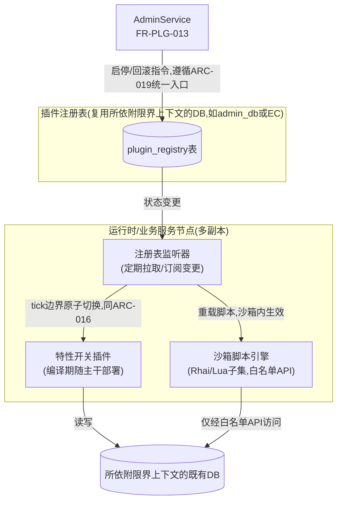
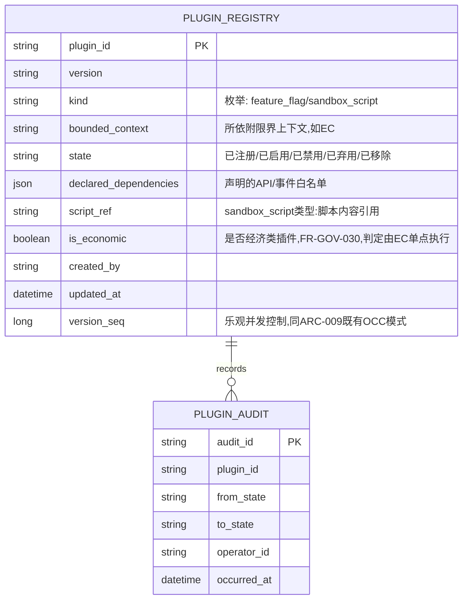
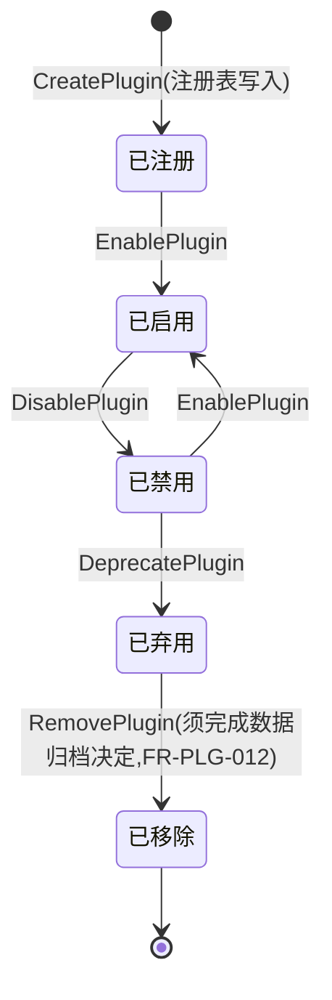
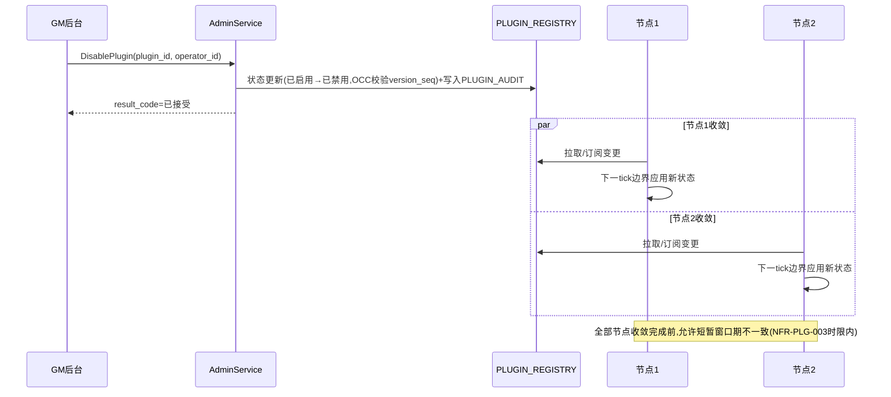

# 基本设计书（基本設計書 / Basic Design Document）

**插件热插拔与生命周期管理 Plugin Hot-Plug & Lifecycle Management**

| 项目 | 内容 |
|---|---|
| 文档编号 | RGS-BAS-005 |
| 版本 | 0.3 |
| 父文档 | RGS-REQ-009 需求定义书 第7章（ARC-021） |
| 依据标准 | IPA『共通フレーム 2013（SLCP-JCF2013）』基本设计工程 |
| 制定日 | 2026-08-16 |
| 制定者 | 架构师 |
| 保密级别 | 内部限定（Internal Use Only） |

## 修订历史（改訂履歴 / Revision History）

| 版本 | 修订日 | 修订者 | 修订内容 | 影响章节 |
|---|---|---|---|---|
| 0.1 | 2026-08-16 | 架构师 | 初版制定。将RGS-REQ-009 ARC-021展开为插件注册表、特性开关插件与沙箱脚本插件的组件设计、生命周期状态机时序、跨节点同步机制、回滚设计 | 全部 |
| 0.1（审查修订） | 2026-08-16 | 架构师 | 反映RGS-REV-001横断审查结果：①§5追加永久事实的强制路由约束——插件白名单API产生永久事实时必须经EC既有确定请求路径，epoch由宿主注入不得由脚本提供（处置F-009，插件可绕过经济权威边界）②§7由"各节点独立轮询"改为复用ARC-016既有分发通道（处置F-011机制重复、F-014轮询DB负荷未评估）③§7追加经济类插件由EC单点判定的收口，原"一致性责任下放插件业务逻辑"为幂等性错配（处置F-012跨节点套利面）④§3.1 `PLUGIN_REGISTRY`追加`is_economic`列 | §3.1、§5、§7 |
| 0.2 | 2026-08-16 | 架构师 | 追溯性表补齐AC-PLG-001〜004验收标准与设计章节的映射（此前追溯性表仅覆盖ARC/FR/NFR，遗漏AC条目） | §11 |
| 0.3 | 2026-09-01 | 架构师 (Mavis 接手 agent per DEC-008) | 落实"各BAS文档功能章节加log设计且区分debug/release级"总要求（per Ulysses 2026-09-01 15:52 JST 决策，4 拍板选项：全部 36 个BAS / 详尽版5列表 / 派worker并行 / BAS-004同步升级）：§2.1（整体架构边界观察）/§3.3（注册表CRUD与OCC）/§4.1（特性开关tick切换与版本灰度）/§5.1（沙箱执行+资源限制+永久事实路由+热重载）/§6.1（生命周期状态机转移+OCC冲突）/§7.1（跨节点收敛+一致性检查+经济类单点判定）/§8.1（回滚+紧急止血）/§9.1（panic捕获+沙箱异常隔离+熔断+指数退避）/§10.2（log 章节存在性 + 铁律合规检查）共 9 个 "本功能日志设计" 小节全部新增；每节均含 5 列详尽版（字段名/触发条件/频率估算/采样策略/脱敏与成本），显式区分 `info!`/`warn!`/`error!`（release 必出，编译期常驻，per BAS-004 v0.3 §6.2 强制全采样白名单）与 `debug!`/`trace!`（`#[cfg(debug_assertions)]` 守护，debug-only，release build 完全剔除零运行时开销）两类事件；字段名前缀 `plugin.*`（区别于 BAS-002 `mnt.*` / BAS-003 `gm.*` / BAS-004 `log.*`），命名严格 snake_case 与 BAS-004 v0.3 §4.6.1/§4.6.2 保持拼写一致（FR-LOG-013）；覆盖 ARC-021 插件域全链路——注册表 CRUD / 特性开关 tick 边界切换 / 沙箱脚本资源限制与永久事实路由 / 状态机转移 OCC / 跨节点收敛与一致性检查 / 经济类插件 EC 单点判定 / 回滚与紧急止血 / panic 捕获与熔断 / 指数退避与人介入分支 / log 章节自身上线检查；§11 追溯性新增 AC-PLG-006（debug-only 宏 release 完全剔除）与 AC-PLG-007（每功能BAS文档须含本功能log设计章节），与 BAS-001 v1.5 §4.8.3.4（commit 32d9eb6）/ BAS-002 v0.4 §13（commit f1401a3）/ BAS-003 v0.3 §13（commit 75a001c）/ BAS-004 v0.3 §12（commit 47e26b0+0ee6262）形成统一规范 | §2.1、§3.3、§4.1、§5.1、§6.1、§7.1、§8.1、§9.1、§10.2、§11 |

## 审批栏（承認欄 / Approval）

| 角色 | 姓名 | 审批日 | 备注 |
|---|---|---|---|
| 制定（起草） | 架构师 | 2026-08-16 | — |
| 评审（技术） | | | 沙箱脚本引擎的隔离边界是否可靠，与ARC-001/005既有保证的一致性 |
| 审批（负责人） | | | 本文档的基准化 |

---

## 目录

1. [前言](#1-前言)
2. [整体架构](#2-整体架构)
3. [插件注册表设计](#3-插件注册表设计)
4. [特性开关插件设计](#4-特性开关插件设计)
5. [沙箱脚本插件设计](#5-沙箱脚本插件设计)
6. [生命周期状态机与触发时序](#6-生命周期状态机与触发时序)
7. [跨节点数据同步设计](#7-跨节点数据同步设计)
8. [回滚设计](#8-回滚设计)
9. [故障隔离设计](#9-故障隔离设计)
10. [标准化检查清单](#10-标准化检查清单)
11. [追溯性（ARC-021 → 本设计书章节）](#11-追溯性arc-021-本设计书章节)

---

# 1. 前言

本文档是RGS-REQ-009第7章ARC-021（插件热插拔的合规实现方式与生命周期边界）的系统级展开，遵循RGS-BAS-001既有记述规则。本文档**不**引入动态链接库加载机制（ARC-021已否决），全部设计建立在"编译期特性开关"与"沙箱脚本"两种合规方式之上。

---

# 2. 整体架构

### 2.1 本功能日志设计

本节覆盖**插件域整体架构的边界观察点**——插件架构本身不直接产生业务事件（业务事件归 §3-§9 各功能段），但**宿主服务启动/关闭**、**注册表监听器就绪**、**跨节点订阅关系建立**等架构层诊断事件是 SRE 在 Prometheus/Grafana 上追踪"插件能力是否可用"的必要输入。

| 字段名（field） | 触发条件（trigger） | 频率估算（frequency） | 采样策略（sampling） | 脱敏与成本（redact & cost） |
|---|---|---|---|---|
| `plugin.runtime.boot.completed` | 宿主服务启动时 `WATCH`（注册表监听器）已就绪、可接受订阅 | 每节点启动 1 次 | release 必出（100% 强制全采样，per BAS-004 v0.3 §6.2） | 无敏感字段；含 `node_id` / `bounded_context` / `watch_kind`；约 280B/条 × 启动频次 = 极低 |
| `plugin.runtime.boot.failed` | 启动时 `WATCH` 不可用（DB 连接失败、订阅通道未就绪等） | 极少（部署事故） | release 必出（100% 强制全采样） | 含 `node_id` / `error` / `trace_id`；约 320B/条 |
| `plugin.runtime.shutdown.completed` | 宿主服务优雅关闭，插件上下文已保存（`PLUGIN_REGISTRY` 状态非脏） | 每节点关闭 1 次 | release 必出（100% 强制全采样） | 含 `node_id` / `saved_plugin_count` / `shutdown_kind`（SIGTERM/HPA scale-in）；约 250B/条 |
| `plugin.runtime.debug.boundary_dag_dump` | 跨节点订阅关系 DAG dump（节点→context→plugin_id→version） | 启动 1 次 + 配置变更 1 次 | **debug-only**（`#[cfg(debug_assertions)]` 守护，release build 完全剔除） | 约 5-20KB/条（依赖图大小决定，release 剔除零运行时开销） |
| `plugin.runtime.debug.watch_subscription_latency` | 启动时 `WATCH` 订阅建立耗时（微秒级） | 启动 1 次 | **debug-only**（`#[cfg(debug_assertions)]` 守护） | 约 200B/条（release 剔除） |

**debug-only 守护要点**（落实 BAS-004 v0.3 §4.4）：
- `plugin.runtime.debug.boundary_dag_dump` 大型集群下可能 20KB+ —— release build 完全剔除，避免 RUST_LOG=debug 误开时撑爆生产日志通道
- `plugin.runtime.boot.completed` / `plugin.runtime.shutdown.completed` 均为 `info!` 级别（release 必出，§4.8.3.2 二维矩阵 `info!` 行常驻），便于 SRE 按 `node_id` + `bounded_context` 维度聚合

---

# 3. 插件注册表设计

## 3.1 表结构（依附于既有限界上下文DB，非独立数据库，落实ARC-021"插件不独立拥有数据库"）

`PLUGIN_AUDIT`**仅追加**，复用RGS-BAS-003§7审计设计的既有理念（不可变、留痕），但与`OPERATION_AUDIT`是独立表——插件生命周期变更频率可能高于GM运营操作，分表避免互相影响查询性能。

## 3.2 一致性机制

`PLUGIN_REGISTRY`的状态变更遵循既有OCC模式（`version_seq`乐观锁，同DR-007/008），**不**引入新的一致性机制，复用其所依附限界上下文既有的事务边界。

### 3.3 本功能日志设计

本节覆盖**`PLUGIN_REGISTRY` 表 CRUD 操作与 OCC 并发控制**的观察点——注册表是插件域的"权威来源与审计载体"（per §7），所有状态变更（注册/启用/禁用/弃用/移除）均产生 release 必出事件，且 `PLUGIN_AUDIT` 追加作为**不可变**审计日志。

| 字段名（field） | 触发条件（trigger） | 频率估算（frequency） | 采样策略（sampling） | 脱敏与成本（redact & cost） |
|---|---|---|---|---|
| `plugin.registry.created` | 新插件已写入 `PLUGIN_REGISTRY`（含 `version_seq=1`） | 偶发（运营上线） | release 必出（100% 强制全采样，per BAS-004 v0.3 §6.2） | 含 `plugin_id` / `version` / `kind` / `bounded_context` / `is_economic` / `created_by`；约 350B/条 |
| `plugin.registry.metadata_updated` | 插件元数据（`declared_dependencies` / `script_ref` / `description`）变更 | 偶发 | release 必出（100% 强制全采样） | 含 `plugin_id` / `diff_summary`；约 280B/条 |
| `plugin.registry.version_seq_conflict` | OCC `version_seq` 冲突（并发注册表更新被拒，需重试） | 偶发 | release 必出（100% 强制全采样） | 含 `plugin_id` / `expected_seq` / `actual_seq` / `concurrent_operator_id`；约 320B/条 |
| `plugin.registry.audit_appended` | `PLUGIN_AUDIT` 已追加（`from_state` / `to_state` / `operator_id` 留痕） | 与状态变更同频 | release 必出（100% 强制全采样） | 含 `audit_id` / `plugin_id` / `from_state` / `to_state` / `operator_id`；约 350B/条 |
| `plugin.registry.audit_immutable_violation` | 检测到 `PLUGIN_AUDIT` 被尝试 UPDATE/DELETE（不可变违规） | 极少（应用代码错） | release 必出（100% 强制全采样） | 含 `audit_id` / `attempted_op` / `db_user`；约 280B/条 |
| `plugin.registry.economic_flag_assertion_failed` | 注册时 `is_economic` 声明与所依附上下文判定冲突（FR-GOV-030） | 极少 | release 必出（100% 强制全采样） | 含 `plugin_id` / `declared_is_economic` / `detected_is_economic` / `bounded_context`；约 350B/条 |
| `plugin.registry.debug.dependency_resolution_chain` | `declared_dependencies` 解析链 dump（白名单 API / 事件 topic 比对过程） | 注册时 1 次 | **debug-only**（`#[cfg(debug_assertions)]` 守护，release build 完全剔除） | 约 1-3KB/条（release 剔除） |
| `plugin.registry.debug.occ_retry_backoff_trace` | OCC 冲突后的指数退避各次重试时间戳与间隔 | 偶发 | **debug-only**（`#[cfg(debug_assertions)]` 守护） | 约 500B/条（release 剔除） |

**debug-only 守护要点**：
- `plugin.registry.audit_appended` 包含 `operator_id`（GM/运营操作者 ID），**不**进入 BAS-004 v0.3 §5.1 脱敏黑名单（`*token*` / `*password*` / `*secret*`），可安全 release 必出 + 留作审计
- `plugin.registry.audit_immutable_violation` 是**安全事件**——release 必出 + §6.2 强制全采样，便于安全审计链路完整追溯

---

# 4. 特性开关插件设计

| 项目 | 内容 |
|---|---|
| 部署方式 | 插件代码作为所依附限界上下文服务的一部分随CI/CD一同编译部署（复用RGS-BAS-002§4.2既有CI/CD骨架），**不**产生独立部署单元 |
| 启停机制 | 每个特性开关插件在代码中对应一个`plugin_id`到处理函数/System的映射表；运行时定期（或经`WATCH`订阅）从`PLUGIN_REGISTRY`拉取启用状态；状态判定在**tick边界**（或对应服务的请求边界）读取，同一个处理周期内**必须**看到一致的启停状态，不得中途切换（同ARC-016"tick边界原子切换"既定规律的复用） |
| 上线新版本 | 新版本代码通过既有滚动更新部署（同ARC-015 Expand-Contract），部署完成后代码本身已就绪但默认**禁用**，再通过`PLUGIN_REGISTRY`状态切换为`已启用`——将"代码部署"与"行为生效"解耦，降低发布风险 |
| 回滚 | 见§8 |

### 4.1 本功能日志设计

本节覆盖**特性开关插件的部署、tick 边界原子切换、版本灰度激活**的观察点——特性开关插件**不**产生独立业务事件，但其路由表在 tick 边界的"启用/禁用"切换、"代码部署→行为生效"解耦点的"灰度激活"必须可观测，便于 SRE 在生产事故时按 `plugin_id` + `version` 维度定位"是否真的启用了该版本"。

| 字段名（field） | 触发条件（trigger） | 频率估算（frequency） | 采样策略（sampling） | 脱敏与成本（redact & cost） |
|---|---|---|---|---|
| `plugin.feature_flag.tick_switch.applied` | tick 边界（或请求边界）原子切换了启用状态（一次切换仅产生一条事件，不逐次重复） | 偶发（运营变更） | release 必出（100% 强制全采样，per BAS-004 v0.3 §6.2） | 含 `plugin_id` / `from_state` / `to_state` / `version` / `tick_seq`；约 320B/条 |
| `plugin.feature_flag.version.rollout.deployed` | 新版本代码通过滚动更新部署完成（默认**禁用**，待 §6 状态机切换） | 偶发 | release 必出（100% 强制全采样） | 含 `plugin_id` / `new_version` / `node_id` / `binary_sha`；约 300B/条 |
| `plugin.feature_flag.version.rollout.activated` | 状态机由"已注册"切换为"已启用"，**行为正式生效** | 偶发 | release 必出（100% 强制全采样） | 含 `plugin_id` / `activated_version` / `old_version` / `operator_id`；约 320B/条 |
| `plugin.feature_flag.version.rollout.failed` | 灰度激活过程中失败（如节点二进制不匹配该 plugin_id） | 极少 | release 必出（100% 强制全采样） | 含 `plugin_id` / `version` / `node_id` / `error` / `trace_id`；约 380B/条 |
| `plugin.feature_flag.dispatch.miss` | 处理请求时 `plugin_id` 在路由表中不存在（plugin_id 被禁用后仍残留请求） | 偶发 | release 必出（100% 强制全采样） | 含 `plugin_id` / `request_id` / `expected_version`；约 280B/条 |
| `plugin.feature_flag.debug.dispatch_table_snapshot` | 路由表 dump（`plugin_id` → handler 映射，启用状态） | tick 边界 1 次 | **debug-only**（`#[cfg(debug_assertions)]` 守护，release build 完全剔除） | 约 2-10KB/条（路由表大小决定，release 剔除） |
| `plugin.feature_flag.debug.tick_consistency_proof` | 同一处理周期内路由表前/后一致性证明（hash before/after） | 偶发 | **debug-only**（`#[cfg(debug_assertions)]` 守护） | 约 200B/条（release 剔除） |

**debug-only 守护要点**：
- `plugin.feature_flag.dispatch.miss` **不**是错误（是禁用后的预期副作用），但仍 release 必出——便于 SRE 识别"是否有人仍在请求已禁用的 plugin_id"以排查客户端缓存或文档未更新
- `plugin.feature_flag.version.rollout.activated` 是**生产事件**——release 必出 + §6.2 强制全采样，便于事后审计与告警关联
- `plugin.feature_flag.tick_switch.applied` 在 §4.2 描述的"一次切换仅产生一条事件"是 BAS-001 §4.8.3.2 二维矩阵 `info!` 行常驻的典型应用——SRE 仪表盘可按 `plugin_id` 维度聚合，无需逐 tick 输出

---

# 5. 沙箱脚本插件设计

| 项目 | 内容 |
|---|---|
| 引擎选型 | 待详细设计确定（TBD-PLG-001），须满足：内存/执行时间受限、无文件系统/网络访问能力、仅可调用显式注册的宿主函数（白名单API） |
| 白名单API | 由宿主（所依附限界上下文的服务）显式注册可供脚本调用的函数集合（如"读取当前活动配置"、"发放声明范围内的道具"），脚本**不能**调用未注册的任何宿主能力，落实NFR-PLG-004 |
| **永久事实的强制路由**（RGS-REQ-013 FR-GOV-001〜004） | 白名单API中凡产生**永久事实**（DR-002：道具・货币・购买・交易等）的操作，其宿主实现**必须**为对`EconomyService.CommitTransaction`（FR-EC-003）的封装，**不得**包含任何直接数据库写入，**不得**新设旁路。`session_epoch`由宿主从当前会话上下文注入（**不得**由脚本提供，防止伪造epoch绕过ARC-005）；`request_id`由宿主生成并与插件调用一一对应（保证幂等语义正确）。详细设计见RGS-BAS-009§5.1 |
| 资源限制 | 单次脚本执行须设执行步数上限、内存上限、超时（同ARC-013"全部边界须设置同时执行数上限・队列上限・超时"既有原则的复用），超限则中止该次执行并记录`ERROR`级别日志（同RGS-BAS-004§6.2强制全量采集范围：错误路径） |
| 热重载 | 脚本内容变更（`script_ref`更新）后，运行时侧在下一个安全点（tick边界或请求边界）重新编译/加载脚本，不重启进程 |
| 故障隔离 | 见§9 |

### 5.1 本功能日志设计

本节覆盖**沙箱脚本插件的入口/出口、资源限制、永久事实强制路由、热重载**全链路——沙箱脚本是 §9 故障隔离的"主防线之一"，其执行/资源/路由的每一步都必须可观测；特别是**永久事实路由**与 **session_epoch 注入**两条 RGS-REV-001 F-009 处置结果必须有日志证据。

| 字段名（field） | 触发条件（trigger） | 频率估算（frequency） | 采样策略（sampling） | 脱敏与成本（redact & cost） |
|---|---|---|---|---|
| `plugin.sandbox.execution.started` | 脚本执行入口（宿主调用沙箱引擎） | 取决于业务触发（典型 10-100/s 集群） | release 必出（100% 强制全采样，per BAS-004 v0.3 §6.2） | 含 `script_ref` / `plugin_id` / `request_id` / `entry_api`；约 280B/条 × 100/s ≈ 28KB/s 稳态 |
| `plugin.sandbox.execution.completed` | 脚本执行完成（含成功/失败 result_code） | 与 `started` 同频 | release 必出（100% 强制全采样） | 含 `script_ref` / `request_id` / `result_code` / `execution_steps` / `execution_us`；约 350B/条 |
| `plugin.sandbox.execution.rejected.resource_limit` | 资源超限中止（执行步数/内存/超时，per §5 "资源限制"） | 偶发 | release 必出（100% 强制全采样，§6.2 强制全量采集范围：错误路径） | 含 `script_ref` / `request_id` / `limit_kind`（steps/memory/timeout）/ `actual_value` / `cap_value`；约 350B/条 |
| `plugin.sandbox.economic.permanent_fact_routed` | 永久事实（DR-002 道具/货币/购买/交易）经宿主对 `EconomyService.CommitTransaction` 封装路由（FR-GOV-001〜004） | 偶发（经济活动触发） | release 必出（100% 强制全采样） | 含 `script_ref` / `ec_request_id` / `change_type` / `delta_amount` / `injected_session_epoch`；约 380B/条 |
| `plugin.sandbox.economic.epoch_spoofing_blocked` | 检测到脚本尝试注入 `session_epoch`（防止伪造 epoch 绕过 ARC-005，RGS-REV-001 F-009） | 极少（安全事件） | release 必出（100% 强制全采样，§6.2 强制全量采集范围：高危操作） | 含 `script_ref` / `request_id` / `attempted_epoch` / `actual_injected_epoch` / `script_author`；约 400B/条 |
| `plugin.sandbox.economic.bypass_direct_db_blocked` | 检测到白名单 API 实现含直接 DB 写入（非 `CommitTransaction` 封装，RGS-REV-001 F-009 处置） | 极少（应用代码错/恶意） | release 必出（100% 强制全采样，§6.2 强制全量采集范围：高危操作） | 含 `script_ref` / `api_name` / `attempted_db_op`；约 320B/条 |
| `plugin.sandbox.hot_reload.applied` | 脚本 `script_ref` 更新后，下一安全点重新加载生效 | 偶发 | release 必出（100% 强制全采样） | 含 `script_ref` / `old_version` / `new_version` / `node_id` / `reload_at_tick`；约 300B/条 |
| `plugin.sandbox.hot_reload.failed` | 热重载失败（脚本编译错误/字节码校验失败） | 极少 | release 必出（100% 强制全采样，§6.2 错误路径） | 含 `script_ref` / `error` / `trace_id` / `compile_error_line`；约 350B/条 |
| `plugin.sandbox.debug.whitelist_api_dump` | 脚本可调用的白名单 API 完整列表 dump（敏感字段已脱敏） | 注册时 1 次 + 热重载 1 次 | **debug-only**（`#[cfg(debug_assertions)]` 守护，release build 完全剔除） | 约 1-5KB/条（API 数量决定，release 剔除） |
| `plugin.sandbox.debug.execution_step_trace` | 脚本执行逐步 trace（每 N 步采样一次，仅 debug 时记录） | 高频（取决于采样） | **debug-only**（`#[cfg(debug_assertions)]` 守护） | 约 200B/条 × 采样率（release 剔除） |
| `plugin.sandbox.debug.epoch_injection_path` | session_epoch 注入路径 dump（从会话上下文到脚本调用的完整链路） | 经济活动触发 | **debug-only**（`#[cfg(debug_assertions)]` 守护） | 约 500B/条（release 剔除） |

**debug-only 守护要点**：
- `plugin.sandbox.execution.started` / `plugin.sandbox.execution.completed` 是**高频**事件（典型 10-100/s 集群）—— release 必出但 §4.8.3.2 `info!` 行常驻 + §6.2 强制全采样是 §5 沙箱脚本"全部执行可追溯"硬约束的体现
- `plugin.sandbox.economic.epoch_spoofing_blocked` 是**安全事件**—— release 必出 + §6.2 强制全采样，**不**可 debug-only（生产告警链路必须完整）
- `plugin.sandbox.debug.execution_step_trace` 高频逐步 trace，release 完全剔除避免生产通道淹没

---

# 6. 生命周期状态机与触发时序

### 6.1 本功能日志设计

本节覆盖**插件生命周期状态机的转移观察点**——状态机是 §3 注册表 + §7 同步之间的"判定层"，每条转移（注册→启用→禁用→弃用→移除）必须可追溯，特别是**非法转移拒绝**与 **OCC 冲突**两条失败路径，是运营事故/恶意攻击的事后取证关键。

| 字段名（field） | 触发条件（trigger） | 频率估算（frequency） | 采样策略（sampling） | 脱敏与成本（redact & cost） |
|---|---|---|---|---|
| `plugin.lifecycle.state_transition.applied` | 状态机已应用合法转移（OCC 校验通过 + `PLUGIN_AUDIT` 写入 + §7 分发入队） | 偶发（运营变更） | release 必出（100% 强制全采样，per BAS-004 v0.3 §6.2） | 含 `plugin_id` / `from_state` / `to_state` / `version` / `operator_id` / `version_seq`；约 350B/条 |
| `plugin.lifecycle.state_transition.rejected.illegal` | 非法状态转移被拒（如"已弃用→已启用"、未注册直接启用等） | 偶发（应用代码错/恶意） | release 必出（100% 强制全采样，§6.2 强制全量采集范围：错误路径） | 含 `plugin_id` / `from_state` / `attempted_to_state` / `operator_id` / `reason`；约 320B/条 |
| `plugin.lifecycle.state_transition.rejected.version_seq_conflict` | OCC `version_seq` 冲突被拒（需调用方重试） | 偶发 | release 必出（100% 强制全采样） | 含 `plugin_id` / `expected_seq` / `actual_seq` / `operator_id`；约 300B/条 |
| `plugin.lifecycle.remove.completed` | 状态机已移除 + 数据归档决定完成（FR-PLG-012） | 极少（插件下线） | release 必出（100% 强制全采样，§6.2 高危操作） | 含 `plugin_id` / `archived_data_ref` / `removed_by` / `removed_at`；约 350B/条 |
| `plugin.lifecycle.remove.failed.orphan_tables` | 移除后检测到孤儿表/索引遗留（AC-PLG-004 失败） | 极少 | release 必出（100% 强制全采样，§6.2 错误路径） | 含 `plugin_id` / `orphan_table_count` / `orphan_index_list`；约 380B/条 |
| `plugin.lifecycle.converged.all_nodes` | 全部节点在 NFR-PLG-003 时限内（p99<5s）收敛到新状态 | 偶发 | release 必出（100% 强制全采样） | 含 `plugin_id` / `to_state` / `node_count` / `convergence_ms_p99`；约 280B/条 |
| `plugin.lifecycle.debug.transition_graph_dump` | 状态转移图 dump（节点→合法转移边集合，用于自检） | 启动 1 次 | **debug-only**（`#[cfg(debug_assertions)]` 守护，release build 完全剔除） | 约 1-2KB/条（release 剔除） |
| `plugin.lifecycle.debug.tick_boundary_window_dump` | tick 边界前后路由表 hash 对照（验证 §4.1 "同一处理周期内一致"承诺） | 偶发 | **debug-only**（`#[cfg(debug_assertions)]` 守护） | 约 300B/条（release 剔除） |

**debug-only 守护要点**：
- `plugin.lifecycle.state_transition.applied` 与 §3.3 `plugin.registry.audit_appended` 互补——前者记录"状态变更已生效"，后者记录"审计已留痕"；两者均 release 必出
- `plugin.lifecycle.remove.completed` 包含 `archived_data_ref`（数据归档引用）—— **不**含明文玩家数据，**不**进入 BAS-004 v0.3 §5.1 脱敏黑名单，可安全 release 必出 + 留作审计
- `plugin.lifecycle.remove.failed.orphan_tables` 是**验收失败事件**——release 必出 + §6.2 强制全采样（验收标准 AC-PLG-004 必须被检测到）

---

# 7. 跨节点数据同步设计

对应FR-PLG-030。

> **本节已依RGS-REV-001 F-011／F-012／F-014修订**（处置方针见RGS-REQ-013 FR-GOV-020〜023、FR-GOV-030〜033，落地设计见RGS-BAS-009§5.3／§5.4）。修订前的设计为"各节点独立轮询`PLUGIN_REGISTRY`"＋"一致性责任下放给插件自身业务逻辑"，存在两项缺陷：①与ARC-016数值表热更新构成两套并行的tick边界热配置机制（重复建设，且轮询DB负荷未经ARC-014同款判定）②幂等性不解决"不同节点对活动是否生效判断不同"的判定权分散问题，对经济类插件构成跨节点套利面。

| 设计点 | 内容 |
|---|---|
| 同步方式 | 插件状态**复用ARC-016既有的版本化产物分发通道**（FR-GOV-020／021），与数值表热更新共用同一条分发路径与tick边界原子切换机制。`PLUGIN_REGISTRY`退化为**权威来源与审计载体**——其变更触发新版本配置产物的生成与分发，而非作为各节点独立轮询的运行时数据源 |
| 为何不采用独立轮询 | ①避免与ARC-016构成两套并行机制（重复的版本管理、回滚、一致性检查，直接计入ARC-026运维负荷）②为满足NFR-PLG-003（p99<5秒）需约2〜3秒的轮询间隔，全部运行时与业务服务节点对同一张表高频轮询的DB负荷未经评估，而ARC-014对轮询型分发器已设有明确判定基准（DB负荷不得超过整体10%）。复用既有通道从根本上消除该负荷（回收4 OLU，见附件D§5.3 R-1） |
| 回滚与一致性检查 | 复用ARC-016既有要求：**必须能立即回退至上一版本**；反映前进行一致性检查，不合格版本不得反映。**不得**因插件路径而降低标准（FR-GOV-023） |
| 收敛时限 | 同ARC-016既有分发通道的时限，须满足NFR-PLG-003（p99<5秒） |
| **经济类插件的单点判定**（FR-GOV-030〜033） | 插件注册时**必须**声明`is_economic`。**经济类插件（影响道具／货币／奖励数值者）的生效判定必须由经济服务（EC）单点执行**——判定与结算在同一次数据库事务内完成，与ARC-006"永久事实的ACK须在持久化之后"天然对齐。各节点本地持有的插件状态**仅可**用于表现层（如提示"活动进行中"），**不得**作为道具／货币计算的判定依据 |
| 不一致窗口的适用范围 | 经上述收口后，NFR-PLG-003所允许的最终一致窗口**仅适用于非经济类插件**（表现、玩法规则、非结算性玩法）。经济类插件不存在该窗口，因其判定权已收归EC单点 |
| **与ARC-005的同构性** | 本设计与ARC-005（Single-Writer，以epoch确保唯一写入者）是同一思路在不同层面的应用：**有争议的判定必须有唯一的判定者**。ARC-005解决"谁能写"，本节解决"谁说了算"。原设计以ARC-009幂等性作为手段是错配——幂等性解决"同一操作重复执行"，不解决判定权分散 |

### 7.1 本功能日志设计

本节覆盖**插件跨节点同步的入队/收敛/一致性检查/经济类单点判定**全链路——这是 RGS-REV-001 F-011/F-012/F-014 处置后形成的"复用 ARC-016 既有通道"实现，每条事件既是 SRE 仪表盘输入，也是后续 §8 回滚与 §9 故障隔离的事件源。

| 字段名（field） | 触发条件（trigger） | 频率估算（frequency） | 采样策略（sampling） | 脱敏与成本（redact & cost） |
|---|---|---|---|---|
| `plugin.sync.distribution.enqueued` | 状态变更已入 ARC-016 既有版本化产物分发通道（FR-GOV-020/021） | 偶发（运营变更） | release 必出（100% 强制全采样，per BAS-004 v0.3 §6.2） | 含 `plugin_id` / `version` / `from_state` / `to_state` / `distribution_id`；约 320B/条 |
| `plugin.sync.distribution.converged` | 全部节点已收敛到新状态（满足 NFR-PLG-003 p99<5s） | 偶发 | release 必出（100% 强制全采样） | 含 `distribution_id` / `node_count` / `convergence_ms` / `p99_ms`；约 280B/条 |
| `plugin.sync.distribution.consistency_check_failed` | 一致性检查未通过（不合规版本不得反映，FR-GOV-023） | 极少 | release 必出（100% 强制全采样，§6.2 强制全量采集范围：错误路径） | 含 `distribution_id` / `plugin_id` / `version` / `reason` / `rolled_back_to_version`；约 380B/条 |
| `plugin.sync.economic.single_point_decision.applied` | 经济类插件（`is_economic=true`）的生效判定已由 EC 单点执行（FR-GOV-030〜033） | 偶发 | release 必出（100% 强制全采样，§6.2 强制全量采集范围：高危操作） | 含 `plugin_id` / `version` / `decision_tx_id` / `character_id` / `result_code`；约 380B/条 |
| `plugin.sync.economic.local_state_denied_as_authority` | 非经济类插件的本地状态被尝试作为经济类判定依据被拒（per §7 "各节点本地持有的插件状态**仅可**用于表现层"） | 极少（应用代码错） | release 必出（100% 强制全采样，§6.2 高危操作） | 含 `plugin_id` / `attempted_use_case` / `rejected_by_node`；约 320B/条 |
| `plugin.sync.consistency_window.exceeded` | 节点收敛时限超 NFR-PLG-003（p99<5s） | 极少 | release 必出（100% 强制全采样，§6.2 错误路径） | 含 `distribution_id` / `slow_node_id` / `convergence_ms` / `p99_threshold_ms`；约 300B/条 |
| `plugin.sync.distribution.rolled_back` | §7 "回滚与一致性检查"触发的版本回退（复用 ARC-016 既有回退机制） | 极少 | release 必出（100% 强制全采样，§6.2 高危操作） | 含 `distribution_id` / `old_version` / `rolled_back_to_version` / `reason`；约 350B/条 |
| `plugin.sync.debug.distribution_topology_snapshot` | 分发拓扑 dump（节点→context→plugin_id 订阅关系） | 启动 1 次 + 配置变更 1 次 | **debug-only**（`#[cfg(debug_assertions)]` 守护，release build 完全剔除） | 约 5-20KB/条（拓扑大小决定，release 剔除） |
| `plugin.sync.debug.consistency_check_inputs` | 一致性检查的输入参数 dump（版本 hash / 校验和 / 节点列表） | 偶发 | **debug-only**（`#[cfg(debug_assertions)]` 守护） | 约 500B/条（release 剔除） |

**debug-only 守护要点**：
- `plugin.sync.economic.single_point_decision.applied` 是**经济判定收口事件**—— release 必出 + §6.2 强制全采样，与 §5.1 `plugin.sandbox.economic.permanent_fact_routed` 互补（前者证明"由 EC 判定"，后者证明"经 EC 路由"）
- `plugin.sync.economic.local_state_denied_as_authority` 是**安全事件**—— release 必出 + §6.2 强制全采样，**不**可 debug-only（生产告警链路必须完整），用于审计"经济类插件曾被尝试绕过单点判定"
- `plugin.sync.distribution.consistency_check_failed` 与 `plugin.sync.distribution.rolled_back` 是**生产事故**—— release 必出 + §6.2 强制全采样，便于事后审计

---

# 8. 回滚设计

对应FR-PLG-020/021、NFR-PLG-002。

| 插件类型 | 回滚方式 |
|---|---|
| 特性开关插件 | 旧版本代码在新版本上线后的稳定期内**不删除**（同一二进制内新旧版本代码共存，通过`plugin_id`+`version`路由），回滚即把`PLUGIN_REGISTRY`中当前生效版本指回旧`version`，无需重新部署 |
| 沙箱脚本插件 | `PLUGIN_REGISTRY.script_ref`保留历史版本引用，回滚即把当前指针指回旧版本脚本内容，下一安全点重新加载 |
| 紧急禁用 | 无论何种类型，`DisablePlugin`都是最快的止血手段（不涉及版本回退，直接停用），响应时限同§7收敛时限 |

### 8.1 本功能日志设计

本节覆盖**插件版本回滚与紧急禁用**的观察点——回滚是生产事故的"最后一道止血"（per FR-PLG-020/021），每条回滚事件必须可追溯，便于事后复盘"为什么回滚 / 回滚到哪个版本 / 持续了多久"。

| 字段名（field） | 触发条件（trigger） | 频率估算（frequency） | 采样策略（sampling） | 脱敏与成本（redact & cost） |
|---|---|---|---|---|
| `plugin.rollback.feature_flag.executed` | 特性开关版本指回旧 `version`（`PLUGIN_REGISTRY` 状态字段更新） | 极少（生产事故） | release 必出（100% 强制全采样，per BAS-004 v0.3 §6.2 强制全量采集范围：高危操作） | 含 `plugin_id` / `from_version` / `rolled_back_to_version` / `operator_id` / `reason`；约 350B/条 |
| `plugin.rollback.feature_flag.failed` | 特性开关回滚失败（旧版本已不在新二进制内，AC-PLG-003 失败） | 极少 | release 必出（100% 强制全采样，§6.2 错误路径） | 含 `plugin_id` / `requested_version` / `available_versions` / `error`；约 380B/条 |
| `plugin.rollback.sandbox_script.executed` | 沙箱脚本 `script_ref` 指回旧版本，下一安全点重新加载 | 极少 | release 必出（100% 强制全采样，§6.2 高危操作） | 含 `plugin_id` / `from_script_ref` / `rolled_back_to_script_ref` / `operator_id` / `reason`；约 380B/条 |
| `plugin.rollback.sandbox_script.hot_reload_failed` | 沙箱脚本热重载回滚失败（旧脚本字节码损坏） | 极少 | release 必出（100% 强制全采样，§6.2 错误路径） | 含 `plugin_id` / `script_ref` / `error` / `trace_id`；约 320B/条 |
| `plugin.rollback.emergency_disable.executed` | 紧急 `DisablePlugin`（不限版本，最快止血，per §8 "紧急禁用"） | 极少（生产事故） | release 必出（100% 强制全采样，§6.2 高危操作） | 含 `plugin_id` / `current_state` / `operator_id` / `reason` / `response_time_ms`；约 320B/条 |
| `plugin.rollback.drill.executed` | 预发布/生产演练环境回滚演练（AC-PLG-003） | 偶发（演练） | release 必出（100% 强制全采样） | 含 `plugin_id` / `from_version` / `to_version` / `environment`（staging/prod）/ `drill_id`；约 350B/条 |
| `plugin.rollback.drill.failed` | 回滚演练失败（不符合 AC-PLG-003 验收标准） | 极少 | release 必出（100% 强制全采样，§6.2 错误路径） | 含 `plugin_id` / `drill_id` / `failed_step` / `reason`；约 350B/条 |
| `plugin.rollback.debug.pre_rollback_state_snapshot` | 回滚前状态快照（plugin_id/version/handler 状态/最近 100 条 audit） | 极少 | **debug-only**（`#[cfg(debug_assertions)]` 守护，release build 完全剔除） | 约 5-15KB/条（release 剔除） |
| `plugin.rollback.debug.rollback_decision_tree` | 回滚决策树 dump（输入：reason → 决策：版本回退/紧急禁用/双重回退） | 极少 | **debug-only**（`#[cfg(debug_assertions)]` 守护） | 约 1-2KB/条（release 剔除） |

**debug-only 守护要点**：
- `plugin.rollback.feature_flag.executed` / `plugin.rollback.emergency_disable.executed` 是**生产事故事件**—— release 必出 + §6.2 强制全采样，便于事后复盘 + 告警链路完整
- `plugin.rollback.drill.executed` 用于验证 AC-PLG-003（版本回滚演练验收标准）—— release 必出便于追溯演练历史，**不**是 debug-only
- `plugin.rollback.debug.pre_rollback_state_snapshot` 可能含 plugin handler 的运行时状态，release 完全剔除避免生产通道敏感数据泄漏

---

# 9. 故障隔离设计

对应NFR-PLG-005，落实RGS-REQ-009"单个插件的错误不得导致宿主进程崩溃"。

| 插件类型 | 隔离手段 |
|---|---|
| 特性开关插件 | 编译期代码审查+既有CI测试门禁（同RGS-BAS-002§4.2）是主要防线；运行时**必须**对插件处理函数的调用做`catch_unwind`等价的panic捕获，防止单个插件panic导致整个服务/场景Actor崩溃 |
| 沙箱脚本插件 | 引擎自身的资源限制（§5）与白名单API是主要防线；脚本执行异常**必须**被引擎捕获并转换为业务错误返回，**不得**传播为宿主进程异常 |
| 熔断 | 若某插件连续触发异常超过阈值，**必须**自动将其状态置为`已禁用`并触发告警（复用RGS-BAS-003§6告警推送机制），防止持续错误消耗资源 |
| **重启退避**（RGS-BAS-010§4 G-013补强） | 熔断阈值判定与场景Actor既有的崩溃监督（RGS-BAS-001§4.2.3 Supervisor机制）采用同一纪律：**不得**在检测到连续异常后立即重试/重启——若异常由输入本身触发（如恶意构造的数据反复命中同一bug），立即重试会形成崩溃循环，浪费资源且产生大量重复告警。**必须**采用指数退避策略：连续触发次数增加时延长下一次重试/重启的间隔，超过阈值后转入人工介入分支（同RGS-BAS-001§4.2.3既有分支），而非无限自动重试 |

### 9.1 本功能日志设计

本节覆盖**插件故障隔离**全链路—— panic 捕获 / 沙箱异常隔离 / 熔断 / 指数退避 / 人介入分支——是 §5.1 沙箱执行 + §6.1 状态机 + §8.1 回滚的下游消费方；每条隔离事件既决定"是否触发熔断"，也是 AC-PLG-002（沙箱异常故障注入宿主不崩溃）验收证据。

| 字段名（field） | 触发条件（trigger） | 频率估算（frequency） | 采样策略（sampling） | 脱敏与成本（redact & cost） |
|---|---|---|---|---|
| `plugin.fault.panic_caught` | 插件处理函数 `catch_unwind` 捕获 panic（per §9 "特性开关插件隔离手段"） | 极少（应用代码 bug） | release 必出（100% 强制全采样，per BAS-004 v0.3 §6.2 强制全量采集范围：错误路径） | 含 `plugin_id` / `request_id` / `panic_location` / `node_id`；约 350B/条 |
| `plugin.fault.sandbox_exception_isolated` | 沙箱脚本执行异常已转换为业务错误返回（per §9 "沙箱脚本插件隔离手段"） | 偶发 | release 必出（100% 强制全采样） | 含 `plugin_id` / `script_ref` / `request_id` / `exception_kind`；约 320B/条 |
| `plugin.fault.circuit_breaker.triggered` | 连续异常超阈值，熔断置为"已禁用" + 触发告警（per §9 "熔断"） | 极少（持续故障） | release 必出（100% 强制全采样，§6.2 高危操作） | 含 `plugin_id` / `consecutive_failure_count` / `threshold` / `window_seconds` / `breaker_state`；约 380B/条 |
| `plugin.fault.circuit_breaker.recovered` | 熔断后窗口期内无新异常，恢复"已启用"状态 | 极少 | release 必出（100% 强制全采样） | 含 `plugin_id` / `downtime_seconds` / `recovered_at`；约 280B/条 |
| `plugin.fault.exponential_backoff.engaged` | 熔断后下一次重试采用指数退避策略（per §9 "重启退避"） | 极少 | release 必出（100% 强制全采样） | 含 `plugin_id` / `current_attempt` / `next_retry_in_ms` / `backoff_factor`；约 280B/条 |
| `plugin.fault.exponential_backoff.escalated_to_human` | 退避超阈值，转入人工介入分支（per §9 + BAS-001 §4.2.3 Supervisor 分支） | 极少 | release 必出（100% 强制全采样，§6.2 高危操作） | 含 `plugin_id` / `total_attempts` / `escalation_reason` / `oncall_team`；约 320B/条 |
| `plugin.fault.host_actor_health_intact` | 宿主场景 Actor 仍健康（验证 §9 "单个插件的错误不得导致宿主进程崩溃"承诺，AC-PLG-002） | 每次 panic 后 1 次 | release 必出（100% 强制全采样） | 含 `node_id` / `actor_id` / `actor_state` / `recent_panic_count`；约 300B/条 |
| `plugin.fault.debug.actor_supervision_state_dump` | Supervisor 状态 dump（重启计数 / 退避策略 / 兄弟 Actor 状态） | 偶发 | **debug-only**（`#[cfg(debug_assertions)]` 守护，release build 完全剔除） | 约 2-5KB/条（release 剔除） |
| `plugin.fault.debug.panic_backtrace` | panic 完整 backtrace（仅 debug 时记录，便于本地复现） | 极少 | **debug-only**（`#[cfg(debug_assertions)]` 守护） | 约 1-3KB/条（release 剔除） |

**debug-only 守护要点**：
- `plugin.fault.panic_caught` / `plugin.fault.sandbox_exception_isolated` 是**故障事件**—— release 必出 + §6.2 强制全采样，便于 SRE 仪表盘按 `plugin_id` 维度聚合（**不**可 debug-only，否则生产告警链路断裂）
- `plugin.fault.exponential_backoff.escalated_to_human` 是**人介入触发事件**—— release 必出 + §6.2 强制全采样，便于追溯"何时进入人工介入 / 哪个团队处理"
- `plugin.fault.host_actor_health_intact` 是 AC-PLG-002 验收证据—— release 必出 + §6.2 强制全采样，确保故障注入测试下"宿主不崩溃"承诺可被审计
- `plugin.fault.debug.panic_backtrace` 高频 backtrace（多次 panic 累积）可能数 KB，release 完全剔除避免生产通道淹没

---

# 10. 标准化检查清单

## 10.1 插件上线检查清单

- [ ] 插件类型判定（特性开关/沙箱脚本）已依ARC-021判定原则确认，非应走挂载流程的场景（RGS-BAS-002）
- [ ] 插件已在`PLUGIN_REGISTRY`注册，声明依赖的API/事件白名单
- [ ] 沙箱脚本插件（如适用）的资源限制（执行步数/内存/超时）已配置并验证生效
- [ ] panic捕获/异常隔离已验证：模拟插件异常不影响宿主进程与其他插件
- [ ] 跨节点同步延迟已实测满足NFR-PLG-003
- [ ] 回滚演练已在预发布环境验证通过
- [ ] **每功能章节（§2/§3/§4/§5/§6/§7/§8/§9）均含"本功能日志设计"子节**，且明确区分 `info!`/`warn!`/`error!`（release 必出）与 `debug!`/`trace!`（`#[cfg(debug_assertions)]` 守护，debug-only）两类

## 10.2 本功能日志设计

本节覆盖**插件域标准化检查清单自身的执行观察点**——特别是"每功能 BAS 文档须含本功能 log 设计章节"（AC-LOG-007 / AC-PLG-007）这一**元检查项**的可观测性，确保 log 章节本身在 CI 阶段可被自动校验。

| 字段名（field） | 触发条件（trigger） | 频率估算（frequency） | 采样策略（sampling） | 脱敏与成本（redact & cost） |
|---|---|---|---|---|
| `plugin.standardized_checklist.log_chapter_present` | CI 静态扫描发现 BAS 文档各 ## L2 段均含"本功能日志设计"子节 | CI 每次构建 1 次 | release 必出（100% 强制全采样，per BAS-004 v0.3 §6.2 强制全量采集范围：CI 验证） | 含 `bas_id` / `l2_section_count` / `log_section_count` / `coverage_ratio`；约 280B/条 |
| `plugin.standardized_checklist.release_required_grep_passed` | CI `grep` 验证全部 release 必出事件（`plugin.*` 命名空间下非 `.debug.` 前缀）均存在于源代码 | CI 每次构建 1 次 | release 必出（100% 强制全采样） | 含 `bas_id` / `declared_event_count` / `grepped_event_count` / `missing_events`；约 350B/条 |
| `plugin.standardized_checklist.debug_only_compliant` | CI 静态检查 `debug!`/`trace!` 宏均被 `#[cfg(debug_assertions)]` 守护（per BAS-004 v0.3 §4.4） | CI 每次构建 1 次 | release 必出（100% 强制全采样） | 含 `bas_id` / `total_debug_macros` / `cfg_guarded_count` / `violations`；约 320B/条 |
| `plugin.standardized_checklist.release_required_macro_no_cfg` | CI 静态检查 `info!`/`warn!`/`error!` 宏未被 `#[cfg]` 守护（与 §4.4 反例对照） | CI 每次构建 1 次 | release 必出（100% 强制全采样） | 含 `bas_id` / `total_release_macros` / `cfg_guarded_violations`；约 300B/条 |
| `plugin.standardized_checklist.failed.lint_violation` | CI 静态扫描发现 log 规范违规（如字段名未走 snake_case、未走 `plugin.*` 命名空间） | 偶发（首次落地） | release 必出（100% 强制全采样，§6.2 错误路径） | 含 `bas_id` / `l2_section` / `violation_kind` / `file:line` / `recommendation`；约 380B/条 |
| `plugin.standardized_checklist.debug.coverage_audit_timing` | CI 阶段全文档 log 章节覆盖率审计耗时（毫秒级） | CI 每次构建 1 次 | **debug-only**（`#[cfg(debug_assertions)]` 守护，release build 完全剔除） | 约 200B/条（release 剔除） |

**debug-only 守护要点**：
- `plugin.standardized_checklist.*` 系列是**CI 元检查项**—— release 必出 + §6.2 强制全采样，确保 log 规范合规性可被持续追踪（**不**是 debug-only，否则生产环境无法审计 CI 历史）
- `plugin.standardized_checklist.release_required_macro_no_cfg` 与 §4.4 规则 #4（debug-only 宏守护）形成对偶—— release 必出宏**不得**被 `#[cfg]` 守护，否则 release 下日志完全消失

---

# 11. 追溯性（ARC-021 → 本设计书章节）

| ARC/FR编号 | 决定摘要 | 本文档展开章节 |
|---|---|---|
| ARC-021 | 插件合规实现方式与生命周期边界 | §2、§4、§5 |
| FR-PLG-001〜002 | 插件定义与合规实现 | §3、§4、§5 |
| FR-PLG-010〜013 | 生命周期管理 | §6 |
| FR-PLG-020〜021 | 回滚 | §8 |
| FR-PLG-030〜032 | 数据同步 | §7、§3.1 |
| NFR-PLG-001〜005 | 效率/回滚/一致性/安全/隔离 | §4、§6、§7、§8、§9 |
| AC-PLG-001（热插拔+跨节点同步延迟） | §6生命周期时序＋§7同步方式/收敛时限 | §6、§7 |
| AC-PLG-002（沙箱异常故障注入，宿主不崩溃） | §9故障隔离设计（引擎资源限制/异常捕获/熔断/重启退避） | §9 |
| AC-PLG-003（版本回滚演练） | §8回滚设计（特性开关/沙箱脚本两类回滚方式） | §8 |
| AC-PLG-004（移除演练,无孤儿表遗留） | §6状态机`已移除`须完成数据归档决定（FR-PLG-012）＋§3.1`PLUGIN_AUDIT`留痕 | §3.1、§6 |
| AC-PLG-006（debug-only 宏在 release build 完全由 `#[cfg(debug_assertions)]` 剔除，二进制中无相关调用） | §2.1/§3.3/§4.1/§5.1/§6.1/§7.1/§8.1/§9.1/§10.2 各"本功能日志设计"小节中所有 `.debug.` 字段 + RGS-BAS-004 v0.3 §4.4 编译期×运行时二维矩阵 | §2.1、§3.3、§4.1、§5.1、§6.1、§7.1、§8.1、§9.1、§10.2 |
| AC-PLG-007（每功能 BAS 文档须含本功能 log 设计章节，区分 debug-only / release 必出） | §2.1/§3.3/§4.1/§5.1/§6.1/§7.1/§8.1/§9.1/§10.2 共 9 个"本功能日志设计"小节 + §10.1 检查项第 7 条（每功能 log 章节存在性）+ §10.2 标准化检查清单自身 log 设计（4 类 CI 验证事件） | §2.1、§3.3、§4.1、§5.1、§6.1、§7.1、§8.1、§9.1、§10.1、§10.2 |

---

> 本文档所定义的规范为详细设计与实现阶段的输入基准。沙箱脚本引擎的具体选型与API绑定方式仍属TBD-PLG-001；`PLUGIN_REGISTRY`物理DDL已由RGS-DTL-005§2定义。
