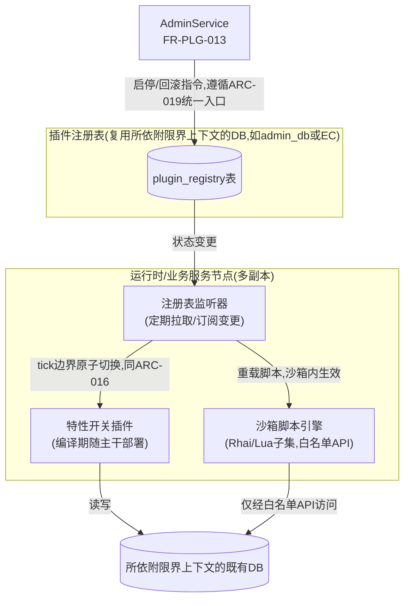
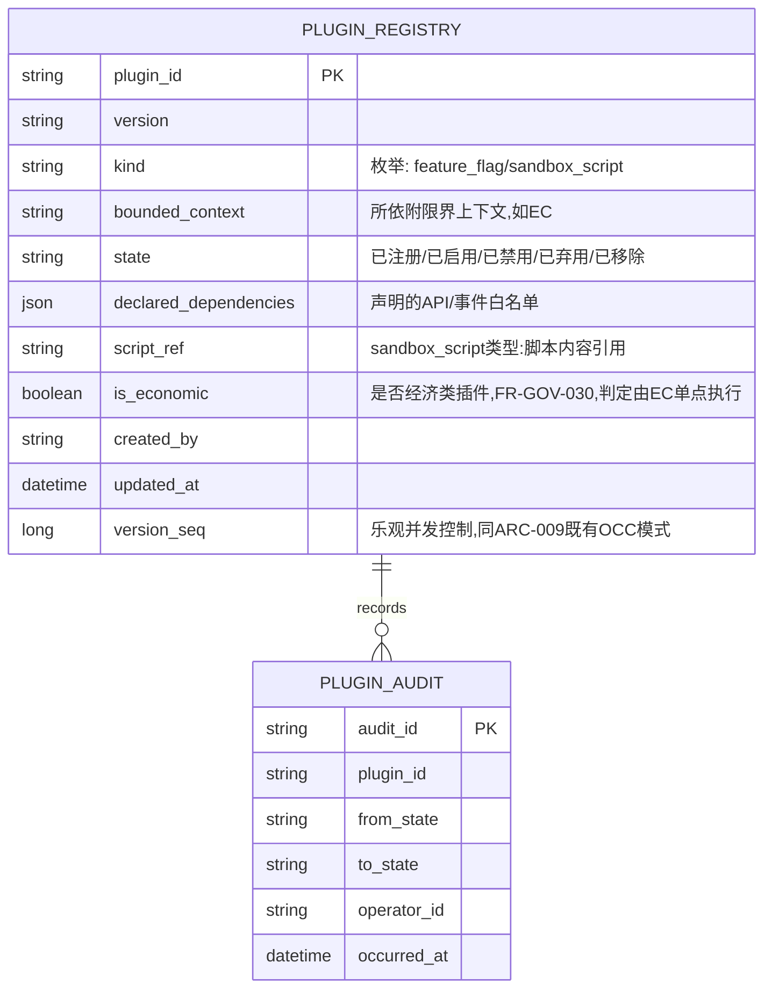
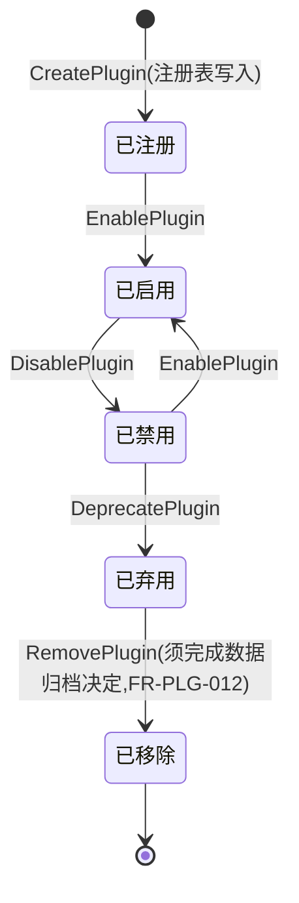
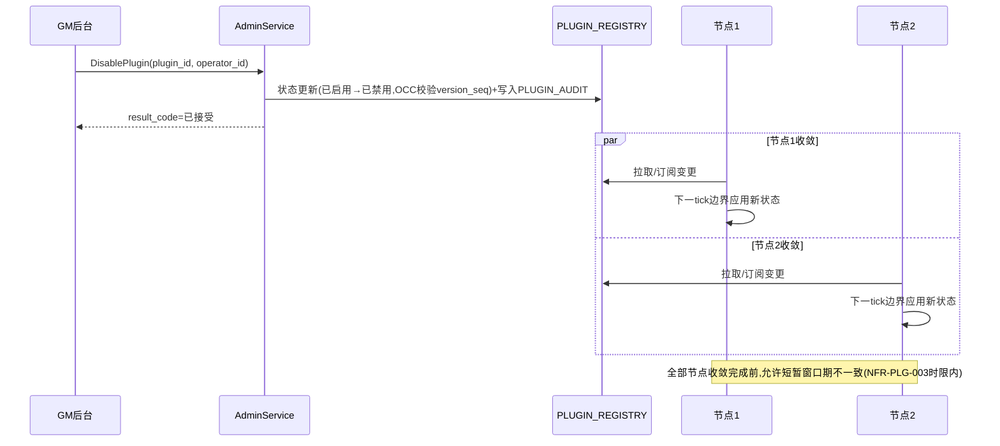

# 基本设计书（基本設計書 / Basic Design Document）

**插件热插拔与生命周期管理 Plugin Hot-Plug & Lifecycle Management**

| 项目 | 内容 |
|---|---|
| 文档编号 | RGS-BAS-005 |
| 版本 | 0.2 |
| 父文档 | RGS-REQ-009 需求定义书 第7章（ARC-021） |
| 依据标准 | IPA『共通フレーム 2013（SLCP-JCF2013）』基本设计工程 |
| 制定日 | 2026-08-16 |
| 制定者 | 架构师 |
| 保密级别 | 内部限定（Internal Use Only） |

## 修订历史（改訂履歴 / Revision History）

| 版本 | 修订日 | 修订者 | 修订内容 | 影响章节 |
|---|---|---|---|---|
| 0.1 | 2026-08-16 | 架构师 | 初版制定。将RGS-REQ-009 ARC-021展开为插件注册表、特性开关插件与沙箱脚本插件的组件设计、生命周期状态机时序、跨节点同步机制、回滚设计 | 全部 |
| 0.1（审查修订） | 2026-08-16 | 架构师 | 反映RGS-REV-001横断审查结果：①§5追加永久事实的强制路由约束——插件白名单API产生永久事实时必须经EC既有确定请求路径，epoch由宿主注入不得由脚本提供（处置F-009，插件可绕过经济权威边界）②§7由"各节点独立轮询"改为复用ARC-016既有分发通道（处置F-011机制重复、F-014轮询DB负荷未评估）③§7追加经济类插件由EC单点判定的收口，原"一致性责任下放插件业务逻辑"为幂等性错配（处置F-012跨节点套利面）④§3.1 `PLUGIN_REGISTRY`追加`is_economic`列 | §3.1、§5、§7 |
| 0.2 | 2026-08-16 | 架构师 | 追溯性表补齐AC-PLG-001〜004验收标准与设计章节的映射（此前追溯性表仅覆盖ARC/FR/NFR，遗漏AC条目） | §11 |

## 审批栏（承認欄 / Approval）

| 角色 | 姓名 | 审批日 | 备注 |
|---|---|---|---|
| 制定（起草） | 架构师 | 2026-08-16 | — |
| 评审（技术） | | | 沙箱脚本引擎的隔离边界是否可靠，与ARC-001/005既有保证的一致性 |
| 审批（负责人） | | | 本文档的基准化 |

---

## 目录

1. [前言](#1-前言)
2. [整体架构](#2-整体架构)
3. [插件注册表设计](#3-插件注册表设计)
4. [特性开关插件设计](#4-特性开关插件设计)
5. [沙箱脚本插件设计](#5-沙箱脚本插件设计)
6. [生命周期状态机与触发时序](#6-生命周期状态机与触发时序)
7. [跨节点数据同步设计](#7-跨节点数据同步设计)
8. [回滚设计](#8-回滚设计)
9. [故障隔离设计](#9-故障隔离设计)
10. [标准化检查清单](#10-标准化检查清单)
11. [追溯性（ARC-021 → 本设计书章节）](#11-追溯性arc-021-本设计书章节)

---

# 1. 前言

本文档是RGS-REQ-009第7章ARC-021（插件热插拔的合规实现方式与生命周期边界）的系统级展开，遵循RGS-BAS-001既有记述规则。本文档**不**引入动态链接库加载机制（ARC-021已否决），全部设计建立在"编译期特性开关"与"沙箱脚本"两种合规方式之上。

---

# 2. 整体架构

---

# 3. 插件注册表设计

## 3.1 表结构（依附于既有限界上下文DB，非独立数据库，落实ARC-021"插件不独立拥有数据库"）

`PLUGIN_AUDIT`**仅追加**，复用RGS-BAS-003§7审计设计的既有理念（不可变、留痕），但与`OPERATION_AUDIT`是独立表——插件生命周期变更频率可能高于GM运营操作，分表避免互相影响查询性能。

## 3.2 一致性机制

`PLUGIN_REGISTRY`的状态变更遵循既有OCC模式（`version_seq`乐观锁，同DR-007/008），**不**引入新的一致性机制，复用其所依附限界上下文既有的事务边界。

---

# 4. 特性开关插件设计

| 项目 | 内容 |
|---|---|
| 部署方式 | 插件代码作为所依附限界上下文服务的一部分随CI/CD一同编译部署（复用RGS-BAS-002§4.2既有CI/CD骨架），**不**产生独立部署单元 |
| 启停机制 | 每个特性开关插件在代码中对应一个`plugin_id`到处理函数/System的映射表；运行时定期（或经`WATCH`订阅）从`PLUGIN_REGISTRY`拉取启用状态；状态判定在**tick边界**（或对应服务的请求边界）读取，同一个处理周期内**必须**看到一致的启停状态，不得中途切换（同ARC-016"tick边界原子切换"既定规律的复用） |
| 上线新版本 | 新版本代码通过既有滚动更新部署（同ARC-015 Expand-Contract），部署完成后代码本身已就绪但默认**禁用**，再通过`PLUGIN_REGISTRY`状态切换为`已启用`——将"代码部署"与"行为生效"解耦，降低发布风险 |
| 回滚 | 见§8 |

---

# 5. 沙箱脚本插件设计

| 项目 | 内容 |
|---|---|
| 引擎选型 | 待详细设计确定（TBD-PLG-001），须满足：内存/执行时间受限、无文件系统/网络访问能力、仅可调用显式注册的宿主函数（白名单API） |
| 白名单API | 由宿主（所依附限界上下文的服务）显式注册可供脚本调用的函数集合（如"读取当前活动配置"、"发放声明范围内的道具"），脚本**不能**调用未注册的任何宿主能力，落实NFR-PLG-004 |
| **永久事实的强制路由**（RGS-REQ-013 FR-GOV-001〜004） | 白名单API中凡产生**永久事实**（DR-002：道具・货币・购买・交易等）的操作，其宿主实现**必须**为对`EconomyService.CommitTransaction`（FR-EC-003）的封装，**不得**包含任何直接数据库写入，**不得**新设旁路。`session_epoch`由宿主从当前会话上下文注入（**不得**由脚本提供，防止伪造epoch绕过ARC-005）；`request_id`由宿主生成并与插件调用一一对应（保证幂等语义正确）。详细设计见RGS-BAS-009§5.1 |
| 资源限制 | 单次脚本执行须设执行步数上限、内存上限、超时（同ARC-013"全部边界须设置同时执行数上限・队列上限・超时"既有原则的复用），超限则中止该次执行并记录`ERROR`级别日志（同RGS-BAS-004§6.2强制全量采集范围：错误路径） |
| 热重载 | 脚本内容变更（`script_ref`更新）后，运行时侧在下一个安全点（tick边界或请求边界）重新编译/加载脚本，不重启进程 |
| 故障隔离 | 见§9 |

---

# 6. 生命周期状态机与触发时序

---

# 7. 跨节点数据同步设计

对应FR-PLG-030。

> **本节已依RGS-REV-001 F-011／F-012／F-014修订**（处置方针见RGS-REQ-013 FR-GOV-020〜023、FR-GOV-030〜033，落地设计见RGS-BAS-009§5.3／§5.4）。修订前的设计为"各节点独立轮询`PLUGIN_REGISTRY`"＋"一致性责任下放给插件自身业务逻辑"，存在两项缺陷：①与ARC-016数值表热更新构成两套并行的tick边界热配置机制（重复建设，且轮询DB负荷未经ARC-014同款判定）②幂等性不解决"不同节点对活动是否生效判断不同"的判定权分散问题，对经济类插件构成跨节点套利面。

| 设计点 | 内容 |
|---|---|
| 同步方式 | 插件状态**复用ARC-016既有的版本化产物分发通道**（FR-GOV-020／021），与数值表热更新共用同一条分发路径与tick边界原子切换机制。`PLUGIN_REGISTRY`退化为**权威来源与审计载体**——其变更触发新版本配置产物的生成与分发，而非作为各节点独立轮询的运行时数据源 |
| 为何不采用独立轮询 | ①避免与ARC-016构成两套并行机制（重复的版本管理、回滚、一致性检查，直接计入ARC-026运维负荷）②为满足NFR-PLG-003（p99<5秒）需约2〜3秒的轮询间隔，全部运行时与业务服务节点对同一张表高频轮询的DB负荷未经评估，而ARC-014对轮询型分发器已设有明确判定基准（DB负荷不得超过整体10%）。复用既有通道从根本上消除该负荷（回收4 OLU，见附件D§5.3 R-1） |
| 回滚与一致性检查 | 复用ARC-016既有要求：**必须能立即回退至上一版本**；反映前进行一致性检查，不合格版本不得反映。**不得**因插件路径而降低标准（FR-GOV-023） |
| 收敛时限 | 同ARC-016既有分发通道的时限，须满足NFR-PLG-003（p99<5秒） |
| **经济类插件的单点判定**（FR-GOV-030〜033） | 插件注册时**必须**声明`is_economic`。**经济类插件（影响道具／货币／奖励数值者）的生效判定必须由经济服务（EC）单点执行**——判定与结算在同一次数据库事务内完成，与ARC-006"永久事实的ACK须在持久化之后"天然对齐。各节点本地持有的插件状态**仅可**用于表现层（如提示"活动进行中"），**不得**作为道具／货币计算的判定依据 |
| 不一致窗口的适用范围 | 经上述收口后，NFR-PLG-003所允许的最终一致窗口**仅适用于非经济类插件**（表现、玩法规则、非结算性玩法）。经济类插件不存在该窗口，因其判定权已收归EC单点 |
| **与ARC-005的同构性** | 本设计与ARC-005（Single-Writer，以epoch确保唯一写入者）是同一思路在不同层面的应用：**有争议的判定必须有唯一的判定者**。ARC-005解决"谁能写"，本节解决"谁说了算"。原设计以ARC-009幂等性作为手段是错配——幂等性解决"同一操作重复执行"，不解决判定权分散 |

---

# 8. 回滚设计

对应FR-PLG-020/021、NFR-PLG-002。

| 插件类型 | 回滚方式 |
|---|---|
| 特性开关插件 | 旧版本代码在新版本上线后的稳定期内**不删除**（同一二进制内新旧版本代码共存，通过`plugin_id`+`version`路由），回滚即把`PLUGIN_REGISTRY`中当前生效版本指回旧`version`，无需重新部署 |
| 沙箱脚本插件 | `PLUGIN_REGISTRY.script_ref`保留历史版本引用，回滚即把当前指针指回旧版本脚本内容，下一安全点重新加载 |
| 紧急禁用 | 无论何种类型，`DisablePlugin`都是最快的止血手段（不涉及版本回退，直接停用），响应时限同§7收敛时限 |

---

# 9. 故障隔离设计

对应NFR-PLG-005，落实RGS-REQ-009"单个插件的错误不得导致宿主进程崩溃"。

| 插件类型 | 隔离手段 |
|---|---|
| 特性开关插件 | 编译期代码审查+既有CI测试门禁（同RGS-BAS-002§4.2）是主要防线；运行时**必须**对插件处理函数的调用做`catch_unwind`等价的panic捕获，防止单个插件panic导致整个服务/场景Actor崩溃 |
| 沙箱脚本插件 | 引擎自身的资源限制（§5）与白名单API是主要防线；脚本执行异常**必须**被引擎捕获并转换为业务错误返回，**不得**传播为宿主进程异常 |
| 熔断 | 若某插件连续触发异常超过阈值，**必须**自动将其状态置为`已禁用`并触发告警（复用RGS-BAS-003§6告警推送机制），防止持续错误消耗资源 |
| **重启退避**（RGS-BAS-010§4 G-013补强） | 熔断阈值判定与场景Actor既有的崩溃监督（RGS-BAS-001§4.2.3 Supervisor机制）采用同一纪律：**不得**在检测到连续异常后立即重试/重启——若异常由输入本身触发（如恶意构造的数据反复命中同一bug），立即重试会形成崩溃循环，浪费资源且产生大量重复告警。**必须**采用指数退避策略：连续触发次数增加时延长下一次重试/重启的间隔，超过阈值后转入人工介入分支（同RGS-BAS-001§4.2.3既有分支），而非无限自动重试 |

---

# 10. 标准化检查清单

## 10.1 插件上线检查清单

- [ ] 插件类型判定（特性开关/沙箱脚本）已依ARC-021判定原则确认，非应走挂载流程的场景（RGS-BAS-002）
- [ ] 插件已在`PLUGIN_REGISTRY`注册，声明依赖的API/事件白名单
- [ ] 沙箱脚本插件（如适用）的资源限制（执行步数/内存/超时）已配置并验证生效
- [ ] panic捕获/异常隔离已验证：模拟插件异常不影响宿主进程与其他插件
- [ ] 跨节点同步延迟已实测满足NFR-PLG-003
- [ ] 回滚演练已在预发布环境验证通过

---

# 11. 追溯性（ARC-021 → 本设计书章节）

| ARC/FR编号 | 决定摘要 | 本文档展开章节 |
|---|---|---|
| ARC-021 | 插件合规实现方式与生命周期边界 | §2、§4、§5 |
| FR-PLG-001〜002 | 插件定义与合规实现 | §3、§4、§5 |
| FR-PLG-010〜013 | 生命周期管理 | §6 |
| FR-PLG-020〜021 | 回滚 | §8 |
| FR-PLG-030〜032 | 数据同步 | §7、§3.1 |
| NFR-PLG-001〜005 | 效率/回滚/一致性/安全/隔离 | §4、§6、§7、§8、§9 |
| AC-PLG-001（热插拔+跨节点同步延迟） | §6生命周期时序＋§7同步方式/收敛时限 | §6、§7 |
| AC-PLG-002（沙箱异常故障注入，宿主不崩溃） | §9故障隔离设计（引擎资源限制/异常捕获/熔断/重启退避） | §9 |
| AC-PLG-003（版本回滚演练） | §8回滚设计（特性开关/沙箱脚本两类回滚方式） | §8 |
| AC-PLG-004（移除演练,无孤儿表遗留） | §6状态机`已移除`须完成数据归档决定（FR-PLG-012）＋§3.1`PLUGIN_AUDIT`留痕 | §3.1、§6 |

---

> 本文档所定义的规范为详细设计与实现阶段的输入基准。沙箱脚本引擎的具体选型与API绑定方式仍属TBD-PLG-001；`PLUGIN_REGISTRY`物理DDL已由RGS-DTL-005§2定义。
