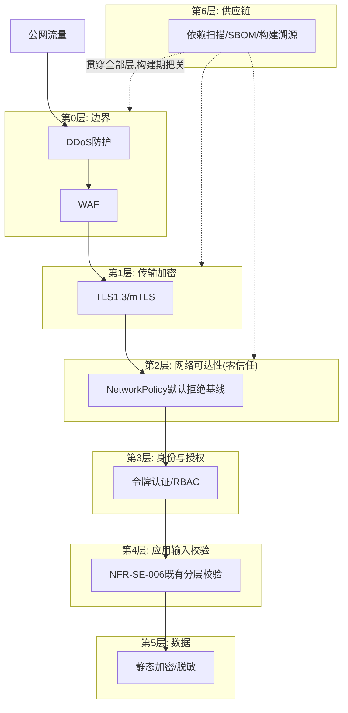
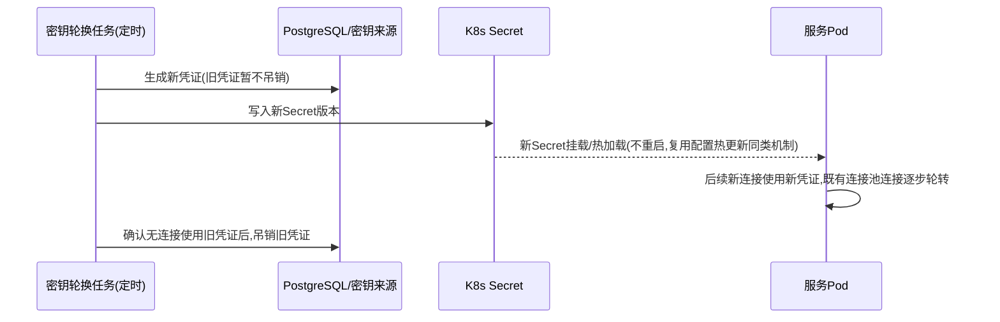
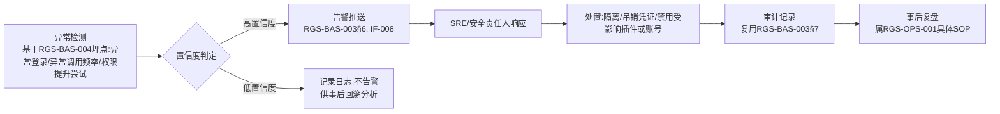
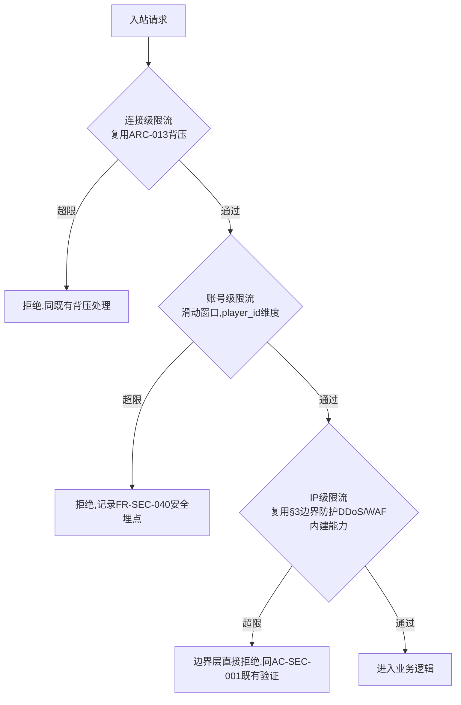

# 基本设计书（基本設計書 / Basic Design Document）

**网络安全 Network & Infrastructure Security**

| 项目 | 内容 |
|---|---|
| 文档编号 | RGS-BAS-006 |
| 版本 | 0.3 |
| 父文档 | RGS-REQ-010 需求定义书 第7章（ARC-022） |
| 依据标准 | IPA『共通フレーム 2013（SLCP-JCF2013）』基本设计工程 |
| 制定日 | 2026-08-16 |
| 制定者 | 架构师 |
| 保密级别 | 内部限定（Internal Use Only） |

## 修订历史（改訂履歴 / Revision History）

| 版本 | 修订日 | 修订者 | 修订内容 | 影响章节 |
|---|---|---|---|---|
| 0.1 | 2026-08-16 | 架构师 | 初版制定。将RGS-REQ-010 ARC-022展开为网络拓扑分层、NetworkPolicy基线模板、密钥轮换机制、供应链安全流水线、安全事件响应流程骨架 | 全部 |
| 0.2 | 2026-08-16 | 架构师 | 追溯性表补齐AC-SEC-001〜005验收标准与设计章节的映射（此前追溯性表仅覆盖ARC/FR/NFR，遗漏AC条目） | §9 |
| 0.3 | 2026-08-17 | 架构师 | **新增§7A认证后滥用与崩溃防护设计**（同步RGS-REQ-010 v0.2，FR-SEC-050〜054）：未信任输入解析安全（禁止操作清单+CI强制lint+模糊测试）、多层速率限制（连接/账号/IP三层，账号级按API类别独立计数）、游戏内资源配额（寄生于既有确定请求路径/单一写入者模型实现O(1)校验）、QUIC地址验证（复用协议自身Retry机制）、崩溃循环退避场景确认 | §7A新增、§8、§9 |

## 审批栏（承認欄 / Approval）

| 角色 | 姓名 | 审批日 | 备注 |
|---|---|---|---|
| 制定（起草） | 架构师 | 2026-08-16 | — |
| 评审（安全） | | | NetworkPolicy基线是否真正做到默认拒绝、无遗漏 |
| 审批（负责人） | | | 本文档的基准化 |

---

## 目录

1. [前言](#1-前言)
2. [分层安全架构总览](#2-分层安全架构总览)
3. [边界防护设计](#3-边界防护设计)
4. [NetworkPolicy基线模板](#4-networkpolicy基线模板)
5. [密钥与证书轮换设计](#5-密钥与证书轮换设计)
6. [供应链安全流水线设计](#6-供应链安全流水线设计)
7. [安全事件响应流程骨架](#7-安全事件响应流程骨架)
8. [标准化检查清单](#8-标准化检查清单)
9. [追溯性（ARC-022 → 本设计书章节）](#9-追溯性arc-022-本设计书章节)

---

# 1. 前言

本文档是RGS-REQ-010第7章ARC-022（零信任内部网络与纵深防御体系）的系统级展开。本文档将RGS-BAS-002§5.3、RGS-BAS-003§4.4已针对个案给出的NetworkPolicy设计**泛化为全局基线模板**，两处既有设计视为本文档基线模板的既有实例，不重新设计。

---

# 2. 分层安全架构总览

**设计要点**：任意单层被突破，下一层仍须独立生效——例如即便攻击者绕过WAF，零信任NetworkPolicy仍阻止其访问未声明依赖的服务；即便某Pod被攻破，mTLS仍阻止其伪装成其他服务身份。这是ARC-022"纵深防御，单层失效不直接导致整体失陷"的直接体现。

---

# 3. 边界防护设计

| 项目 | 内容 |
|---|---|
| DDoS防护范围 | 网关QUIC端口（UDP）、API网关HTTPS端口（TCP） |
| 实现层级 | L3/L4（网络层/传输层流量清洗），具体选型（云服务商边缘防护/自建限速+黑名单）依TBD-SEC-001 |
| WAF覆盖范围 | 仅API网关HTTPS路径（游戏客户端QUIC路径的应用层校验已由NFR-SE-006既有分层校验+ARC-013背压承担，WAF主要针对Web/HTTP形态的攻击模式，如GM后台/运营工具的HTTP接入面） |
| 与既有限流的关系 | ARC-013既有的背压/限流设置位置（客户端连接、网关、gRPC等）在应用层生效；本节DDoS/WAF在其之前的网络/传输层生效，两者不重复，是纵深防御的不同层级 |

---

# 4. NetworkPolicy基线模板

## 4.1 基线原则（落实FR-SEC-010，全局默认，非个案）

| 规则 | 内容 |
|---|---|
| 默认拒绝 | 每个Namespace的默认NetworkPolicy拒绝全部入站/出站流量，**必须**在Namespace创建时同步生效（由脚手架自动生成，同RGS-BAS-002§4.1骨架产出） |
| 显式声明 | 每个服务的Helm chart（复用RGS-BAS-002§5.2模板结构）**必须**包含其自身的`networkpolicy.yaml`，声明允许的入站来源（通常是其上游调用方）与出站目标（其声明依赖的下游服务/数据库/缓存/事件基础设施/OTel Collector） |
| 已有实例 | RGS-BAS-002§5.3（新挂载App）、RGS-BAS-003§4.4（运行时受限控制通道）均为本基线模板的具体应用实例 |
| 跨Namespace | 若采用多Namespace划分（按限界上下文/环境），跨Namespace流量同样遵循默认拒绝，显式允许的规则须同时匹配源Namespace标签与目标端口 |

## 4.2 覆盖率审计（落实NFR-SEC-004）

| 设计点 | 内容 |
|---|---|
| CI检查 | 新服务上线前，CI流水线（复用RGS-BAS-002§4.2骨架）**必须**校验其`networkpolicy.yaml`存在且非空（防止"暂缓补充"绕过） |
| 定期审计 | 定期（如每周）扫描集群内全部Namespace/Pod，核对是否存在缺少NetworkPolicy的服务，纳入RGS-BAS-004§9同类CI/定期检查体系，结果经RGS-BAS-003§6告警通道上报异常 |

---

# 5. 密钥与证书轮换设计

## 5.1 mTLS证书（落实FR-SEC-020）

| 项目 | 内容 |
|---|---|
| 机制 | 复用RGS-BAS-001§7.3既有"证书由K8s证书管理机制自动轮换"决定，本节确认其覆盖全部服务间通信证书，轮换周期满足NFR-SEC-002（≤90天） |
| 过渡窗口 | 轮换过程中新旧证书**必须**有重叠有效期，避免因证书切换时序差异导致服务间连接短暂失败（同ARC-015 Expand-Contract思想的复用） |

## 5.2 数据库凭证与第三方API密钥（落实FR-SEC-021/022）

**设计要点**：吊销旧凭证前须确认无存量连接仍在使用（"确认全部消费者已迁移完成"同ARC-015既定判定方法的复用），避免轮换过程中产生连接中断。

---

# 6. 供应链安全流水线设计

对应FR-SEC-030/031/032，纳入RGS-BAS-002§4.2既有CI/CD骨架，不新建独立流水线。

| 阶段（复用RGS-BAS-002§4.2骨架，新增内容加粗） | 内容 |
|---|---|
| lint/test | 既有 |
| **依赖漏洞扫描** | 对`Cargo.lock`做已知漏洞比对（如`cargo-audit`/`cargo-deny`等OSI许可工具，符合CON-001），High以上14天/Critical 72小时内须处理（NFR-SEC-003），扫描结果计入CI状态 |
| **SBOM生成** | 构建产物同步生成SBOM，随镜像一同归档 |
| **构建溯源签名** | 镜像构建完成后附加来源证明（构建流水线ID、源码commit、构建时间），部署前校验该证明存在且来自可信流水线，未经证明的镜像**不得**部署至生产环境命名空间（由准入控制机制拦截，具体实现留详细设计） |
| 镜像构建 | 既有 |
| Helm lint/dry-run | 既有 |
| 部署 | 既有，新增：生产环境部署前的构建溯源校验 |

---

# 7. 安全事件响应流程骨架

对应FR-SEC-040/041/042，复用RGS-BAS-004埋点体系与RGS-BAS-003§6告警推送机制，不重复定义底层机制。

**分工声明**：本流程骨架定义"系统必须提供的检测与响应能力接口"（检测埋点、告警通道、处置所需的既有API如`KickSession`/`BanAccount`/插件`DisablePlugin`、审计记录），具体的人工判断标准、升级路径、值班责任人安排属RGS-OPS-001（运维手顺书），本文档不重复。

---

# 7A. 认证后滥用与崩溃防护设计（落实FR-SEC-050〜054，本次新增）

## 7A.1 未信任输入解析安全（FR-SEC-050落地）

**设计原则**：解析未信任输入（客户端QUIC消息、API网关HTTP请求体）的代码路径**必须**以`Result<T, ParseError>`为唯一出口，禁止在该路径内使用以下操作：

| 禁止操作 | 替代方式 |
|---|---|
| `.unwrap()` / `.expect()` | `?`操作符向上传播为`ParseError`，或`match`显式处理 |
| 数组/切片裸索引`arr[i]` | `.get(i)`返回`Option`后显式处理越界情况 |
| 未检查的整数运算（可能溢出/下溢） | `checked_add`/`checked_sub`等检查版本，溢出即判定为畸形输入并拒绝 |
| 递归深度不受限的解析（可能栈溢出） | 显式深度计数器，超过既定上限即拒绝（防止构造深层嵌套结构触发栈溢出） |

**强制手段**（对应RSK-SEC-003"依赖开发者纪律"的缓解）：解析模块**必须**在CI中启用`#![deny(clippy::unwrap_used, clippy::expect_used, clippy::indexing_slicing)]`等价的静态检查（复用既有RGS-BAS-002§4.2 CI测试门禁基础设施，新增lint规则而非新建检查工具），违反即构建失败，**不依赖**代码评审人工发现。

**验证手段**（对应NFR-SEC-006/AC-SEC-006）：解析模块**必须**接入模糊测试（Fuzzing，如`cargo-fuzz`），CI中定期（**不要求**每次提交，可按既定周期，具体值详细设计确定）以随机/变异输入运行既定时长，任何panic产生均视为构建失败级别的缺陷，**不得**降级为"已知问题延后修复"。

## 7A.2 多层速率限制设计（FR-SEC-051/NFR-SEC-008落地）

**账号级限流的存储设计**：滑动窗口计数**依附**既有Redis类临时状态存储（复用ARC-012既定缓存基础设施，不新建独立存储），key为`ratelimit:{player_id}:{api_category}`，值为既定窗口内的请求计数，TTL与窗口大小一致（窗口滑动由存储TTL自然实现，不引入额外的定时清理任务）。**API类别（`api_category`）粒度**而非全局单一计数——聊天、交易、组队邀请等不同类别的正常频率差异巨大，共用一个计数器会使高频类别（如移动指令，已由连接级限流覆盖）与低频类别（如交易请求）互相干扰阈值设定，故账号级限流按API类别独立计数（具体类别划分与阈值TBD-SEC-003确定）。

## 7A.3 游戏内资源配额设计（FR-SEC-052落地）

配额校验**必须**在既有服务器权威写入路径内完成，作为该路径既有校验链条的**追加一步**，而非独立的旁路检查（避免产生TOCTOU竞态——检查配额与执行创建之间若非同一原子操作，攻击者可利用并发请求绕过配额）：

- 经济类资源（道具/货币数量）：复用EC限界上下文既有的`CommitTransaction`确定请求路径（FR-EC-003），配额上限校验作为该事务内的一个前置条件，与既有`expected_version`乐观并发控制在同一事务内完成，天然无竞态
- 场景内资源（实体生成）：复用RT场景Actor既有的单一写入者特性（ARC-005），配额计数是该场景Actor内存状态的一部分，校验与生成在同一tick内的同一同步代码路径完成，无需额外并发控制

**设计要点**：配额校验之所以能做到O(1)（NFR-SEC-009），是因为它**寄生**于既有确定请求路径与场景Actor单一写入者模型之上，未引入任何新的分布式协调机制。

## 7A.4 QUIC地址验证设计（FR-SEC-053落地）

网关QUIC端口**必须**启用QUIC协议标准定义的Address Validation（Retry包机制）：客户端首次握手时，服务器返回一个Retry包要求客户端证明其能够接收到该地址的响应（而非直接分配连接状态并开始处理），验证通过后才进入正常握手流程。该机制**复用QUIC协议自身能力**，**不需要**自定义实现，仅需在网关QUIC库（依技术选型确定具体实现库）的配置中启用该选项。

## 7A.5 崩溃循环退避确认（FR-SEC-054落地）

不新增设计，确认RGS-BAS-010§4 G-013既有的"连续崩溃次数增加时延长重启间隔（指数退避）"机制，其触发条件**不区分**崩溃原因（随机故障/恶意构造输入），故天然覆盖本节场景，无需额外适配。

---

# 8. 标准化检查清单

## 8.1 新服务安全接入检查清单（与RGS-BAS-002§12.1、RGS-BAS-004§11.1配合使用）

- [ ] `networkpolicy.yaml`已生成且非空，默认拒绝+显式声明的入站/出站规则已验证（§4）
- [ ] 服务间通信复用既有mTLS，未绕过零信任网络策略直接放通全部流量
- [ ] 数据库凭证/第三方密钥经K8s Secret管理，未硬编码，轮换机制已接入（§5）
- [ ] CI流水线的依赖漏洞扫描、SBOM生成、构建溯源签名均已生效（§6）
- [ ] 安全相关埋点（异常登录/调用频率/权限提升尝试）已按RGS-BAS-004规范接入（§7）
- [ ] 未信任输入解析路径的`unwrap`/`expect`/裸索引类lint检查已在CI启用且当前无违规（§7A.1）
- [ ] 模糊测试套件已接入CI，最近一次运行无panic产生（§7A.1）
- [ ] 账号级速率限制已按API类别接入，未与连接级/IP级限流混淆或替代（§7A.2）
- [ ] 涉及玩家可触发资源创建的写入路径均有服务器侧配额校验，且校验与执行在同一原子操作内完成（§7A.3）

---

# 9. 追溯性（ARC-022 → 本设计书章节）

| ARC/FR编号 | 决定摘要 | 本文档展开章节 |
|---|---|---|
| ARC-022 | 零信任内部网络与纵深防御体系 | §2、§4 |
| FR-SEC-001〜003 | 边界防护 | §3 |
| FR-SEC-010〜012 | 内部零信任网络 | §4 |
| FR-SEC-020〜022 | 密钥与证书管理 | §5 |
| FR-SEC-030〜032 | 供应链安全 | §6 |
| FR-SEC-040〜042 | 安全事件响应 | §7 |
| NFR-SEC-001〜005 | 可用性/轮换周期/漏洞响应/覆盖率/事件响应时间 | §3、§4.2、§5、§6 |
| AC-SEC-001（DDoS注入试验,正常流量可用性影响） | §3边界防护设计（DDoS防护范围/实现层级） | §3 |
| AC-SEC-002（NetworkPolicy覆盖率100%审计） | §4.2覆盖率审计（CI检查+定期审计） | §4.2 |
| AC-SEC-003（mTLS证书不停机轮换演练） | §5.1证书轮换机制与过渡窗口设计 | §5.1 |
| AC-SEC-004（CI拦截已知漏洞依赖,Critical 72h响应） | §6供应链安全流水线（依赖漏洞扫描阶段） | §6 |
| AC-SEC-005（安全事件模拟演练,告警时延） | §7安全事件响应流程骨架（异常检测→高置信度告警） | §7 |
| FR-SEC-050〜054 | 认证后滥用与崩溃防护 | §7A |
| NFR-SEC-006〜009 | 崩溃安全/账号级限流误杀率/多层限流标准/配额校验开销 | §7A.1、§7A.2、§7A.3 |
| AC-SEC-006（模糊测试无panic） | §7A.1解析安全设计（禁止操作清单+CI强制lint+模糊测试） | §7A.1 |
| AC-SEC-007（账号级限流生效且不误伤其他账号） | §7A.2多层速率限制设计（按API类别独立计数） | §7A.2 |
| AC-SEC-008（服务器侧资源配额上限生效） | §7A.3游戏内资源配额设计（寄生于既有确定请求路径/单一写入者模型） | §7A.3 |

---

> 本文档所定义的规范为详细设计与实现阶段的输入基准。DDoS/WAF具体选型（TBD-SEC-001）、密钥管理中间件选型（TBD-SEC-002）、构建溯源签名的具体技术方案、账号级限流具体阈值（TBD-SEC-003），留待详细设计阶段确定。
