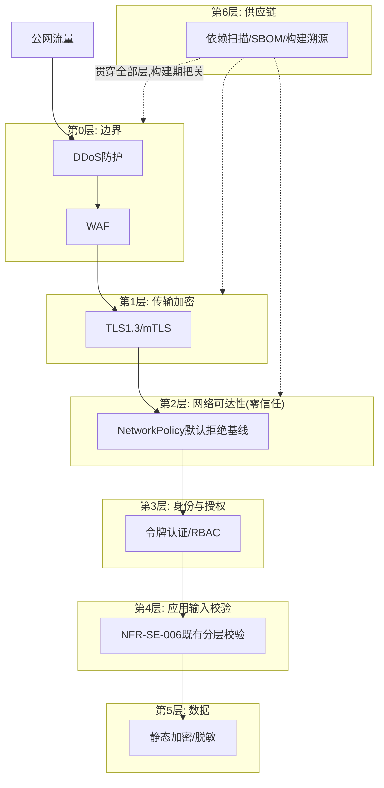
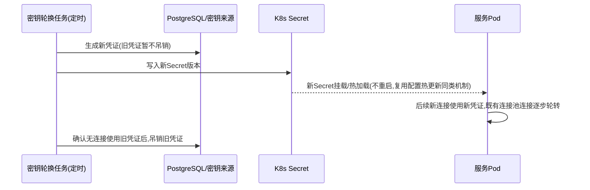
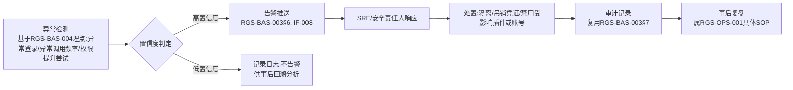
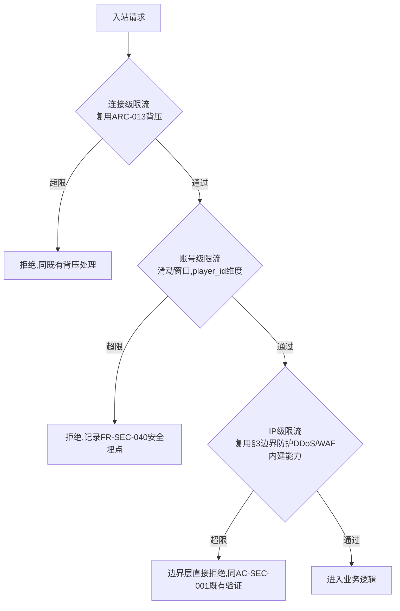

# 基本设计书（基本設計書 / Basic Design Document）

**网络安全 Network & Infrastructure Security**

| 项目 | 内容 |
|---|---|
| 文档编号 | RGS-BAS-006 |
| 版本 | 0.4 |
| 父文档 | RGS-REQ-010 需求定义书 第7章（ARC-022） |
| 依据标准 | IPA『共通フレーム 2013（SLCP-JCF2013）』基本设计工程 |
| 制定日 | 2026-08-16 |
| 制定者 | 架构师 |
| 保密级别 | 内部限定（Internal Use Only） |

## 修订历史（改訂履歴 / Revision History）

| 版本 | 修订日 | 修订者 | 修订内容 | 影响章节 |
|---|---|---|---|---|
| 0.1 | 2026-08-16 | 架构师 | 初版制定。将RGS-REQ-010 ARC-022展开为网络拓扑分层、NetworkPolicy基线模板、密钥轮换机制、供应链安全流水线、安全事件响应流程骨架 | 全部 |
| 0.2 | 2026-08-16 | 架构师 | 追溯性表补齐AC-SEC-001〜005验收标准与设计章节的映射（此前追溯性表仅覆盖ARC/FR/NFR，遗漏AC条目） | §9 |
| 0.3 | 2026-08-17 | 架构师 | **新增§7A认证后滥用与崩溃防护设计**（同步RGS-REQ-010 v0.2，FR-SEC-050〜054）：未信任输入解析安全（禁止操作清单+CI强制lint+模糊测试）、多层速率限制（连接/账号/IP三层，账号级按API类别独立计数）、游戏内资源配额（寄生于既有确定请求路径/单一写入者模型实现O(1)校验）、QUIC地址验证（复用协议自身Retry机制）、崩溃循环退避场景确认 | §7A新增、§8、§9 |
| 0.4 | 2026-09-01 | 架构师 (Mavis 接手 agent per DEC-008) | 落实"各BAS文档功能章节加log设计且区分debug/release级"总要求（per Ulysses 2026-09-01 15:52 JST 决策，4 拍板选项：全部 36 个BAS / 详尽版5列表 / 派worker并行 / BAS-004同步升级）：§2.1/§3.1/§4.1/§4.2/§5.1/§5.2/§6.1/§7.1/§7A.1/§7A.2/§7A.3/§7A.4/§7A.5/§8.1 共 14 个 ## L2/L3 功能段加"本功能日志设计" 5 列详尽版（字段名/触发条件/频率估算/采样策略/脱敏与成本），引用 BAS-001 v1.5 §4.8.3 模板（commit 32d9eb6）+ BAS-003 v0.3 样板（commit 75a001c）+ BAS-004 v0.3 §4.2 二维矩阵 + §4.3 字段 + §5.1 脱敏 + §6.2 强制全采样（commit 47e26b0/0ee6262）；覆盖网络安全域纵深防御 6 层（DDoS/WAF/TLS/NetworkPolicy/RBAC/输入校验）+ 密钥证书轮换 + 供应链 + 事件响应 + 认证后滥用（解析/限流/配额/QUIC/退避）+ 接入检查清单；显式区分 `info!`/`warn!`/`error!`（release 必出，编译期常驻，§6.2 强制全采样）与 `trace!`/`debug!`（`#[cfg(debug_assertions)]` 守护，debug-only，release build 完全剔除零运行时开销）两类事件；网络安全域特殊：安全审计事件（认证失败/越权访问/敏感操作）全部 release 必出 + 强制全采样（BAS-004 §6.2）；IP 地址脱敏（BAS-004 §5.1 末段掩码）；凭证类（`*token*`/`*password*`/`*credential*`）黑名单自动丢弃；§8.1 标准化检查清单新增 log 章节上线检查项；§9 追溯性新增 AC-SEC-006（debug-only 宏 release 完全剔除）与 AC-SEC-007（每功能BAS文档须含本功能log设计章节），与 BAS-001 v1.5 §4.8.3.4 / BAS-002 v0.4 §13 / BAS-003 v0.3 §13 / BAS-004 v0.3 §12 形成统一规范 | §2.1/§3.1/§4.1/§4.2/§5.1/§5.2/§6.1/§7.1/§7A.1/§7A.2/§7A.3/§7A.4/§7A.5/§8.1/§9 |

## 审批栏（承認欄 / Approval）

| 角色 | 姓名 | 审批日 | 备注 |
|---|---|---|---|
| 制定（起草） | 架构师 | 2026-08-16 | — |
| 评审（安全） | | | NetworkPolicy基线是否真正做到默认拒绝、无遗漏 |
| 审批（负责人） | | | 本文档的基准化 |

---

## 目录

1. [前言](#1-前言)
2. [分层安全架构总览](#2-分层安全架构总览)
3. [边界防护设计](#3-边界防护设计)
4. [NetworkPolicy基线模板](#4-networkpolicy基线模板)
5. [密钥与证书轮换设计](#5-密钥与证书轮换设计)
6. [供应链安全流水线设计](#6-供应链安全流水线设计)
7. [安全事件响应流程骨架](#7-安全事件响应流程骨架)
8. [标准化检查清单](#8-标准化检查清单)
9. [追溯性（ARC-022 → 本设计书章节）](#9-追溯性arc-022-本设计书章节)

---

# 1. 前言

本文档是RGS-REQ-010第7章ARC-022（零信任内部网络与纵深防御体系）的系统级展开。本文档将RGS-BAS-002§5.3、RGS-BAS-003§4.4已针对个案给出的NetworkPolicy设计**泛化为全局基线模板**，两处既有设计视为本文档基线模板的既有实例，不重新设计。

---

# 2. 分层安全架构总览

**设计要点**：任意单层被突破，下一层仍须独立生效——例如即便攻击者绕过WAF，零信任NetworkPolicy仍阻止其访问未声明依赖的服务；即便某Pod被攻破，mTLS仍阻止其伪装成其他服务身份。这是ARC-022"纵深防御，单层失效不直接导致整体失陷"的直接体现。

### 2.1 本功能日志设计

本节覆盖网络安全域**纵深防御 6 层的"被命中"事件**——分层架构本身是描述性设计，不产生业务事件，但每一层检测到攻击/异常时产生一条 release 必出的"层命中"事件，便于 SRE 在 Grafana 上按 `sec.layer.*` 维度聚合攻击流量的层级分布。**安全审计事件（按 BAS-004 v0.3 §6.2）全部 release 必出 + 强制全采样，不允许降级为 debug-only**。

| 字段名（field） | 触发条件（trigger） | 频率估算（frequency） | 采样策略（sampling） | 脱敏与成本（redact & cost） |
|---|---|---|---|---|
| `sec.layer.hit` | 纵深防御任意一层（L0 DDoS / L1 TLS / L2 NetworkPolicy / L3 RBAC / L4 输入校验 / L5 数据）检测到攻击/异常 | 稳态 0.1/s / 峰值 100/s（攻击期间） | release 必出（100% 强制全采样，per BAS-004 v0.3 §6.2 安全审计事件白名单） | 含`layer`／`attack_kind`／`severity`；IP 已脱敏（末段掩码 per §5.1）；约 200B/条 × 100/s = 20KB/s 峰值 |
| `sec.layer.penetration_detected` | **严重**：攻击穿过第 N 层但被第 N+1 层拦截（"层间穿透"事件，验证纵深防御生效） | 极少 | release 必出（100% 强制全采样，per §6.2） | 含`penetrated_layer`／`interceptor_layer`／`attack_signature`；IP 已脱敏；约 350B/条 |
| `sec.layer.all_layers_bypassed` | **极严重**：所有层均被突破（应触发 P0 告警，per §7） | 极低（不应发生） | release 必出（100% 强制全采样） | 含`attack_chain`／`attacker_ip_masked`／`target_resource`；约 500B/条 |
| `sec.layer.debug.attack_chain_full_trace` | 攻击在 6 层间的完整传播路径（每层是否被命中、是否被拦截） | 攻击期间 0.1/s | **debug-only**（`#[cfg(debug_assertions)]` 守护，release build 完全剔除） | 约 2-5KB/条（release 剔除，零运行时开销） |
| `sec.layer.debug.layer_policy_dump` | 6 层各层当前生效的规则 dump（用于事后复盘"为什么某层未拦截"） | 极低（按需） | **debug-only**（`#[cfg(debug_assertions)]` 守护） | 约 3-8KB/条（release 剔除） |

**debug-only 守护要点**（落实 BAS-004 v0.3 §4.4）：
- `sec.layer.hit` / `sec.layer.penetration_detected` / `sec.layer.all_layers_bypassed` 均为 `error!` 级别（§4.8.3.2 二维矩阵 `error!` 行 release 常驻 + §6.2 强制全采样），**不**挂 `#[cfg]`，确保 release 下告警链路完整
- `sec.layer.debug.attack_chain_full_trace` 在攻击期间 100/s 全量 dump 可能 500KB/s —— release build 完全剔除，避免 RUST_LOG=debug 误开时撑爆生产日志通道
- IP 地址**全部**走 BAS-004 v0.3 §5.1 末段掩码脱敏（`203.0.113.0/24`），不允许明文 IP 出现在 release 必出字段

---

# 3. 边界防护设计

| 项目 | 内容 |
|---|---|
| DDoS防护范围 | 网关QUIC端口（UDP）、API网关HTTPS端口（TCP） |
| 实现层级 | L3/L4（网络层/传输层流量清洗），具体选型（云服务商边缘防护/自建限速+黑名单）依TBD-SEC-001 |
| WAF覆盖范围 | 仅API网关HTTPS路径（游戏客户端QUIC路径的应用层校验已由NFR-SE-006既有分层校验+ARC-013背压承担，WAF主要针对Web/HTTP形态的攻击模式，如GM后台/运营工具的HTTP接入面） |
| 与既有限流的关系 | ARC-013既有的背压/限流设置位置（客户端连接、网关、gRPC等）在应用层生效；本节DDoS/WAF在其之前的网络/传输层生效，两者不重复，是纵深防御的不同层级 |

### 3.1 本功能日志设计

本节覆盖**DDoS 防护与 WAF 命中**的观察点——边界防护是 L0/L1 层事件，每条 DDoS 攻击 / WAF 规则命中均产生 release 必出的 `sec.boundary.*` 事件，便于 SRE 按 `attack_kind` 维度聚合。**边界防护的失败事件属安全审计事件（per BAS-004 v0.3 §6.2），全部 release 必出 + 强制全采样**。

| 字段名（field） | 触发条件（trigger） | 频率估算（frequency） | 采样策略（sampling） | 脱敏与成本（redact & cost） |
|---|---|---|---|---|
| `sec.boundary.ddos_detected` | DDoS 防护系统检测到异常流量模式（UDP 端口洪泛 / TCP SYN 洪泛 / 反射放大攻击） | 稳态 0/s / 峰值 1000/s（攻击期间） | release 必出（100% 强制全采样，per BAS-004 v0.3 §6.2） | 含`attack_kind`／`target_port`／`volume_pps`／`source_ip_masked`（末段掩码 per §5.1）；约 250B/条 × 1000/s = 250KB/s 峰值 |
| `sec.boundary.ddos_mitigated` | 清洗完成，被识别为恶意的流量已被丢弃 | 攻击期间 100/s | release 必出（100% 强制全采样） | 含`attack_kind`／`dropped_pps`／`mitigation_duration_ms`；约 280B/条 |
| `sec.boundary.waf_rule_hit` | WAF 规则命中（SQL 注入 / XSS / 路径穿越 / 命令注入 / 反序列化攻击等） | 稳态 0.1/s / 峰值 50/s | release 必出（100% 强制全采样） | 含`waf_rule_id`／`attack_category`／`request_path`；约 300B/条 |
| `sec.boundary.waf_blocked` | WAF 阻断请求（rule action=block / drop） | 稳态 0.1/s / 峰值 50/s | release 必出（100% 强制全采样） | 含`waf_rule_id`／`client_ip_masked`（末段掩码）；约 250B/条 |
| `sec.boundary.waf_allowed_after_review` | WAF 规则命中但放行（rule action=alert / log，运维审计后人工放行） | 极少 | release 必出（100% 强制全采样） | 含`waf_rule_id`／`reviewer_id`／`reason`；约 350B/条 |
| `sec.boundary.edge_rate_limit_rejected` | 边界层 DDoS/WAF 内建限速命中拒绝（IP 级，复用既有边界防护能力） | 稳态 1/s / 峰值 200/s | release 必出（100% 强制全采样） | 含`client_ip_masked`（末段掩码）/`endpoint`；约 200B/条 |
| `sec.boundary.tls_handshake_failed` | TLS 握手失败（证书过期 / 不受信 CA / 协议版本不匹配 / 密码套件拒绝） | 稳态 0.1/s | release 必出（100% 强制全采样） | 含`tls_version`／`failure_reason`／`client_ip_masked`（末段掩码）；约 280B/条 |
| `sec.boundary.debug.attack_payload_dump` | WAF 命中请求的完整 payload dump（便于事后复盘 0day） | 攻击期间 0.1/s | **debug-only**（`#[cfg(debug_assertions)]` 守护，release build 完全剔除） | 约 1-10KB/条（payload 大小决定，release 剔除，零运行时开销） |
| `sec.boundary.debug.geoip_lookup_timing` | 边界防护地理 IP 库查询耗时（毫秒级） | 稳态 1/s / 峰值 1000/s | **debug-only**（`#[cfg(debug_assertions)]` 守护） | 约 150B/条（release 剔除） |

**debug-only 守护要点**（落实 BAS-004 v0.3 §4.4）：
- `sec.boundary.ddos_detected` 在 DDoS 攻击期间可能 1000/s —— 全部 `error!` 级别（§4.8.3.2 二维矩阵 `error!` 行 release 常驻 + §6.2 强制全采样），不挂 `#[cfg]`，确保告警链路完整
- `sec.boundary.debug.attack_payload_dump` 在攻击期间 1-10KB × 0.1/s 是低频但单条大 —— release build 完全剔除，避免 RUST_LOG=debug 误开时攻击 payload 进入日志通道
- `*token*` / `*password*` / `*credential*` 字段名按 BAS-004 v0.3 §5.1 黑名单**自动丢弃**，不依赖开发者主动脱敏（如攻击 payload 中带`Authorization: Bearer xxx`，xxx 部分被黑名单拦截，仅记录"已拦截字段名"）
- 客户端 IP 全部走末段掩码（`203.0.113.0/24`）脱敏，不允许明文 IP 出现在 release 必出字段

---

# 4. NetworkPolicy基线模板

## 4.1 基线原则（落实FR-SEC-010，全局默认，非个案）

| 规则 | 内容 |
|---|---|
| 默认拒绝 | 每个Namespace的默认NetworkPolicy拒绝全部入站/出站流量，**必须**在Namespace创建时同步生效（由脚手架自动生成，同RGS-BAS-002§4.1骨架产出） |
| 显式声明 | 每个服务的Helm chart（复用RGS-BAS-002§5.2模板结构）**必须**包含其自身的`networkpolicy.yaml`，声明允许的入站来源（通常是其上游调用方）与出站目标（其声明依赖的下游服务/数据库/缓存/事件基础设施/OTel Collector） |
| 已有实例 | RGS-BAS-002§5.3（新挂载App）、RGS-BAS-003§4.4（运行时受限控制通道）均为本基线模板的具体应用实例 |
| 跨Namespace | 若采用多Namespace划分（按限界上下文/环境），跨Namespace流量同样遵循默认拒绝，显式允许的规则须同时匹配源Namespace标签与目标端口 |

### 4.1 本功能日志设计

本节覆盖**NetworkPolicy 基线原则运行时强制**的观察点——基线原则是"默认拒绝 + 显式声明"，运行时 K8s NetworkPolicy 控制器会拦截违规流量（典型：未在 policy 中显式允许的入站/出站连接），**每条拦截事件均属安全审计事件（per BAS-004 v0.3 §6.2）必须 release 必出 + 强制全采样**。

| 字段名（field） | 触发条件（trigger） | 频率估算（frequency） | 采样策略（sampling） | 脱敏与成本（redact & cost） |
|---|---|---|---|---|
| `sec.networkpolicy.allowed` | 入站/出站连接通过 NetworkPolicy 默认拒绝基线校验（K8s NetworkPolicy 控制器放行） | 稳态 1000/s / 峰值 10000/s | release 必出（100% 强制全采样，per BAS-004 v0.3 §6.2 安全审计事件） | 含`namespace`／`source_pod`／`target_pod`／`port`／`protocol`；约 250B/条 × 10000/s = 2.5MB/s 峰值 |
| `sec.networkpolicy.denied.default_deny_hit` | **关键安全事件**：流量被默认拒绝基线拦截（"未声明"流量，违反基线原则） | 稳态 0.1/s / 峰值 100/s（攻击/误配期间） | release 必出（100% 强制全采样，per §6.2） | 含`namespace`／`source_pod`／`target_pod`／`port`／`protocol`／`deny_reason`；IP 已脱敏（末段掩码 per §5.1）；约 350B/条 |
| `sec.networkpolicy.denied.cross_namespace_blocked` | 跨 Namespace 流量被默认拒绝拦截（违反跨 Namespace 显式允许原则） | 稳态 0.01/s | release 必出（100% 强制全采样） | 含`source_namespace`／`target_namespace`／`source_pod`／`target_pod`；约 300B/条 |
| `sec.networkpolicy.violation.unauthorized_egress` | **严重**：Pod 尝试访问未在 policy 中声明的下游（如访问未授权 DB / 外部服务） | 极少（应被 policy 拒绝） | release 必出（100% 强制全采样） | 含`namespace`／`pod`／`attempted_egress_target`；约 350B/条 |
| `sec.networkpolicy.violation.unauthorized_ingress` | **严重**：外部流量尝试访问未声明的服务端口 | 极少 | release 必出（100% 强制全采样） | 含`namespace`／`service`／`port`／`source_ip_masked`（末段掩码）；约 350B/条 |
| `sec.networkpolicy.namespace_created` | 新 Namespace 创建时默认拒绝 NetworkPolicy 已自动同步生效（脚手架验证） | 极低（每新 namespace 一次） | release 必出（100% 强制全采样） | 含`namespace`／`policy_name`；约 250B/条 |
| `sec.networkpolicy.debug.full_policy_dump` | Namespace 内 NetworkPolicy 完整规则 dump（事后复盘"为什么某流量被拦截"） | 极低（按需） | **debug-only**（`#[cfg(debug_assertions)]` 守护，release build 完全剔除） | 约 2-5KB/条（release 剔除，零运行时开销） |
| `sec.networkpolicy.debug.connection_flow_trace` | Pod 间连接的完整流路径（network namespace / iptables chain / policy match 过程） | 稳态 100/s / 峰值 1000/s | **debug-only**（`#[cfg(debug_assertions)]` 守护） | 约 1-3KB/条（release 剔除） |

**debug-only 守护要点**（落实 BAS-004 v0.3 §4.4）：
- `sec.networkpolicy.allowed` 在稳态 1000/s 全量打可能 250KB/s —— `info!` 级别（§4.8.3.2 二维矩阵 `info!` 行 release 常驻），允许 `#[cfg]` 之外的常驻，但**属于安全审计事件**故按 §6.2 强制全采样（不按普通 info 走采样率）
- `sec.networkpolicy.denied.*` / `sec.networkpolicy.violation.*` 是**关键安全事件** —— `error!` 级别，release 常驻 + §6.2 强制全采样，**不**挂 `#[cfg]`
- `sec.networkpolicy.debug.full_policy_dump` 含完整 iptables 规则（可能 5KB+）—— release build 完全剔除，避免 RUST_LOG=debug 误开时泄漏网络拓扑

---

## 4.2 覆盖率审计（落实NFR-SEC-004）

| 设计点 | 内容 |
|---|---|
| CI检查 | 新服务上线前，CI流水线（复用RGS-BAS-002§4.2骨架）**必须**校验其`networkpolicy.yaml`存在且非空（防止"暂缓补充"绕过） |
| 定期审计 | 定期（如每周）扫描集群内全部Namespace/Pod，核对是否存在缺少NetworkPolicy的服务，纳入RGS-BAS-004§9同类CI/定期检查体系，结果经RGS-BAS-003§6告警通道上报异常 |

### 4.2 本功能日志设计

本节覆盖**NetworkPolicy 覆盖率审计（CI 检查 + 定期扫描）**的观察点——覆盖率审计的目标是"零遗漏"（NFR-SEC-004 要求 100% 覆盖率），任何"未声明 policy"的服务被发现均属**严重安全事件**（违反 ARC-022 零信任原则），必须 release 必出 + 强制全采样。

| 字段名（field） | 触发条件（trigger） | 频率估算（frequency） | 采样策略（sampling） | 脱敏与成本（redact & cost） |
|---|---|---|---|---|
| `sec.networkpolicy.ci_check_started` | CI 流水线开始检查 `networkpolicy.yaml` 存在性/非空性 | 每次 PR 触发（典型 10-50/h 全集群） | release 必出（100% 强制全采样） | 含`ci_run_id`／`context`／`pr_url`；约 200B/条 |
| `sec.networkpolicy.ci_check_passed` | CI 检查通过（policy 文件存在且非空） | 每次 PR（10-50/h） | release 必出（100% 强制全采样） | 含`ci_run_id`／`context`；约 200B/条 |
| `sec.networkpolicy.ci_check_failed.missing_file` | **关键安全事件**：`networkpolicy.yaml` 缺失（违反基线原则） | 偶发（首次挂载新服务） | release 必出（100% 强制全采样，per §6.2） | 含`ci_run_id`／`context`／`expected_path`；约 300B/条 |
| `sec.networkpolicy.ci_check_failed.empty_file` | **关键安全事件**：`networkpolicy.yaml` 存在但为空（"暂缓补充"绕过） | 偶发 | release 必出（100% 强制全采样） | 含`ci_run_id`／`context`；约 300B/条 |
| `sec.networkpolicy.audit_scan_started` | 定期审计任务开始（每周一次扫描全部 Namespace/Pod） | 1/周（全集群） | release 必出（100% 强制全采样） | 含`scan_id`／`scan_kind`；约 250B/条 |
| `sec.networkpolicy.audit_scan_completed` | 定期审计完成 | 1/周 | release 必出（100% 强制全采样） | 含`scan_id`／`duration_ms`／`scanned_namespace_count`／`scanned_pod_count`；约 350B/条 |
| `sec.networkpolicy.audit_coverage_pct` | 审计结果：NetworkPolicy 覆盖率（应达 100% per NFR-SEC-004） | 1/周 | release 必出（100% 强制全采样） | 含`scan_id`／`coverage_pct`／`uncovered_services`；约 300B/条 |
| `sec.networkpolicy.audit_violation_found` | **关键安全事件**：发现缺少 NetworkPolicy 的服务 | 极少（首次挂载 / 误配） | release 必出（100% 强制全采样，per §6.2） | 含`scan_id`／`uncovered_namespace`／`uncovered_service`；约 400B/条 |
| `sec.networkpolicy.audit_alert_pushed` | 覆盖率异常告警已通过 RGS-BAS-003 §6 通道推送 | 1/周（仅异常时） | release 必出（100% 强制全采样） | 含`scan_id`／`alert_recipient`／`severity`；约 300B/条 |
| `sec.networkpolicy.debug.full_audit_report` | 完整审计报告 dump（全部 namespace/policy 状态） | 1/周 | **debug-only**（`#[cfg(debug_assertions)]` 守护，release build 完全剔除） | 约 10-50KB/条（release 剔除） |
| `sec.networkpolicy.debug.policy_diff_snapshot` | 与上周扫描对比的 policy 差异快照 | 1/周 | **debug-only**（`#[cfg(debug_assertions)]` 守护） | 约 5-20KB/条（release 剔除） |

**debug-only 守护要点**（落实 BAS-004 v0.3 §4.4）：
- `sec.networkpolicy.audit_violation_found` / `sec.networkpolicy.ci_check_failed.*` 是**关键安全事件** —— `error!` 级别（§4.8.3.2 二维矩阵 `error!` 行 release 常驻 + §6.2 强制全采样），**不**挂 `#[cfg]`，确保 release 下告警链路完整
- `sec.networkpolicy.debug.full_audit_report` 含完整集群网络拓扑（10-50KB）—— release build 完全剔除，避免 RUST_LOG=debug 误开时泄漏网络拓扑给非授权人员
- `*token*` / `*password*` 字段名按 BAS-004 v0.3 §5.1 黑名单**自动丢弃**

---

# 5. 密钥与证书轮换设计

## 5.1 mTLS证书（落实FR-SEC-020）

| 项目 | 内容 |
|---|---|
| 机制 | 复用RGS-BAS-001§7.3既有"证书由K8s证书管理机制自动轮换"决定，本节确认其覆盖全部服务间通信证书，轮换周期满足NFR-SEC-002（≤90天） |
| 过渡窗口 | 轮换过程中新旧证书**必须**有重叠有效期，避免因证书切换时序差异导致服务间连接短暂失败（同ARC-015 Expand-Contract思想的复用） |

### 5.1 本功能日志设计

本节覆盖**mTLS 证书轮换与生命周期**的观察点——证书轮换涉及"提前签发新证书 / 新旧证书重叠期 / 旧证书吊销"三步，每步均产生 release 必出事件；证书过期 / 握手失败是**关键安全事件**（违反 NFR-SEC-002），必须 release 必出 + 强制全采样。

| 字段名（field） | 触发条件（trigger） | 频率估算（frequency） | 采样策略（sampling） | 脱敏与成本（redact & cost） |
|---|---|---|---|---|
| `sec.cert.rotation_started` | K8s cert-manager 触发证书轮换（到期前 30 天） | 每服务每 90 天一次（典型 1/h 全集群） | release 必出（100% 强制全采样） | 含`service`／`cert_name`／`old_expiry`／`new_expiry`；约 300B/条 |
| `sec.cert.rotation_completed` | 证书轮换完成（新证书已签发，旧证书仍在有效期内） | 每服务每 90 天一次 | release 必出（100% 强制全采样） | 含`service`／`cert_name`／`new_cert_serial`；约 300B/条 |
| `sec.cert.overlap_window_active` | 新旧证书同时有效（重叠窗口期，per ARC-015 Expand-Contract） | 重叠期 24h | release 必出（100% 强制全采样） | 含`service`／`cert_name`／`old_expiry`／`new_expiry`；约 280B/条 |
| `sec.cert.rotation_failed` | **关键安全事件**：证书轮换失败（cert-manager 错误 / CA 不可达） | 极少 | release 必出（100% 强制全采样，per §6.2） | 含`service`／`cert_name`／`error`／`trace_id`；约 350B/条 |
| `sec.cert.expiry_warning` | 证书将在 7 天内到期（cert-manager 告警，per NFR-SEC-002 ≤90天） | 极少 | release 必出（100% 强制全采样） | 含`service`／`cert_name`／`days_remaining`；约 280B/条 |
| `sec.cert.expired` | **极严重安全事件**：证书已过期（违反 NFR-SEC-002） | 极低（不应发生） | release 必出（100% 强制全采样，per §6.2） | 含`service`／`cert_name`／`expired_at`；约 300B/条 |
| `sec.cert.handshake_failed` | **关键安全事件**：mTLS 握手失败（证书过期 / 不受信 / SAN 不匹配 / 协议版本拒绝） | 稳态 0.1/s / 峰值 10/s（攻击期间） | release 必出（100% 强制全采样） | 含`client_service`／`server_service`／`failure_reason`／`client_ip_masked`（末段掩码）；约 350B/条 |
| `sec.cert.debug.cert_chain_dump` | 完整证书链 dump（含 subject / issuer / SAN / 序列号 / 指纹） | 极少（按需） | **debug-only**（`#[cfg(debug_assertions)]` 守护，release build 完全剔除） | 约 2-5KB/条（release 剔除，零运行时开销） |
| `sec.cert.debug.rotation_timing` | 轮换各阶段耗时（签发 / 推送 / 重载） | 每 90 天 1 次 | **debug-only**（`#[cfg(debug_assertions)]` 守护） | 约 200B/条（release 剔除） |

**debug-only 守护要点**（落实 BAS-004 v0.3 §4.4）：
- `sec.cert.expired` / `sec.cert.rotation_failed` / `sec.cert.handshake_failed` 是**关键安全事件** —— `error!` 级别（§4.8.3.2 二维矩阵 `error!` 行 release 常驻 + §6.2 强制全采样），**不**挂 `#[cfg]`
- `sec.cert.debug.cert_chain_dump` 含完整证书信息 —— release build 完全剔除，避免 RUST_LOG=debug 误开时泄漏证书指纹供攻击者仿造
- `*token*` / `*password*` / `*credential*` / `*key*` 字段名按 BAS-004 v0.3 §5.1 黑名单**自动丢弃**（证书私钥绝不能进入日志）

---

## 5.2 数据库凭证与第三方API密钥（落实FR-SEC-021/022）

**设计要点**：吊销旧凭证前须确认无存量连接仍在使用（"确认全部消费者已迁移完成"同ARC-015既定判定方法的复用），避免轮换过程中产生连接中断。

### 5.2 本功能日志设计

本节覆盖**数据库凭证与第三方 API 密钥轮换**的观察点——密钥轮换是"生成新凭证 → Secret 推送 → 消费者迁移 → 旧凭证吊销"四步流程，每步均产生 release 必出事件；密钥类事件**全部属安全审计事件**（per BAS-004 v0.3 §6.2），**禁止**明文凭证/Token/Password 出现在任何字段——SDK 自动按 §5.1 黑名单（`*token*` / `*password*` / `*credential*` / `*secret_value*`）丢弃。

| 字段名（field） | 触发条件（trigger） | 频率估算（frequency） | 采样策略（sampling） | 脱敏与成本（redact & cost） |
|---|---|---|---|---|
| `sec.secret.rotation_started` | 定时轮换任务触发（数据库密码 / 第三方 API key） | 每凭证每 30/60/90 天一次（per NFR-SEC-002） | release 必出（100% 强制全采样，per BAS-004 v0.3 §6.2） | 含`secret_kind`（`db_password`/`api_key`/`oauth_client_secret`）/`target_service`／`old_secret_version`；约 300B/条 |
| `sec.secret.new_secret_written` | **关键安全事件**：新 Secret 已写入 K8s Secret 新版本 | 每凭证每轮换周期 | release 必出（100% 强制全采样） | 含`secret_kind`／`target_service`／`new_secret_version`／`secret_metadata_hash`（**不**含明文）；约 350B/条 |
| `sec.secret.consumer_migrated` | 消费者 Pod 已确认切换到新凭证（连接池刷新完成） | 每凭证每轮换周期 | release 必出（100% 强制全采样） | 含`secret_kind`／`target_service`／`consumer_pod_count`；约 300B/条 |
| `sec.secret.old_secret_revoked` | 旧凭证已确认吊销（旧连接全部关闭） | 每凭证每轮换周期 | release 必出（100% 强制全采样） | 含`secret_kind`／`target_service`／`old_secret_version`／`revoke_duration_ms`；约 350B/条 |
| `sec.secret.rotation_failed` | **关键安全事件**：轮换失败（DB 生成失败 / Secret 写入失败 / 消费者全部超时） | 极少 | release 必出（100% 强制全采样，per §6.2） | 含`secret_kind`／`target_service`／`error`／`trace_id`；约 400B/条 |
| `sec.secret.rotation_timeout.consumer_not_migrated` | **严重**：消费者在最大等待时间内未迁移到新凭证（强制吊销前超时） | 极少 | release 必出（100% 强制全采样） | 含`secret_kind`／`target_service`／`timeout_ms`／`pending_consumer_pods`；约 400B/条 |
| `sec.secret.unauthorized_read_attempt` | **极严重安全事件**：Pod 尝试读取其未授权访问的 Secret（违反最小权限） | 极低（不应发生） | release 必出（100% 强制全采样，per §6.2） | 含`namespace`／`attempting_pod`／`attempted_secret_name`；约 350B/条 |
| `sec.secret.debug.secret_metadata_redacted` | 轮换过程元数据 dump（含 Secret 名称 / 版本 / 哈希 / 轮换时序，**不**含明文） | 极少（按需） | **debug-only**（`#[cfg(debug_assertions)]` 守护，release build 完全剔除） | 约 500B/条（release 剔除，零运行时开销） |
| `sec.secret.debug.consumer_migration_progress` | 消费者迁移进度（每 5s 采样已迁移/总数） | 轮换期间 12/min | **debug-only**（`#[cfg(debug_assertions)]` 守护） | 约 200B/条（release 剔除） |

**debug-only 守护要点**（落实 BAS-004 v0.3 §4.4）：
- `sec.secret.unauthorized_read_attempt` / `sec.secret.rotation_failed` 是**关键安全事件** —— `error!` 级别（§4.8.3.2 二维矩阵 `error!` 行 release 常驻 + §6.2 强制全采样），**不**挂 `#[cfg]`，确保 release 下告警链路完整
- `*token*` / `*password*` / `*credential*` / `*secret_value*` / `*api_key*` 字段名按 BAS-004 v0.3 §5.1 黑名单**自动丢弃** —— SDK 层在写入 OTLP 之前即替换为 `[REDACTED]`，**不依赖**开发者主动脱敏
- `sec.secret.debug.secret_metadata_redacted` 虽**不**含明文，但仍可能含 Secret 名称（与 K8s Secret 名一致，可用于推断敏感资源）—— release build 完全剔除，避免 RUST_LOG=debug 误开时泄漏 Secret 拓扑

---

# 6. 供应链安全流水线设计

对应FR-SEC-030/031/032，纳入RGS-BAS-002§4.2既有CI/CD骨架，不新建独立流水线。

| 阶段（复用RGS-BAS-002§4.2骨架，新增内容加粗） | 内容 |
|---|---|
| lint/test | 既有 |
| **依赖漏洞扫描** | 对`Cargo.lock`做已知漏洞比对（如`cargo-audit`/`cargo-deny`等OSI许可工具，符合CON-001），High以上14天/Critical 72小时内须处理（NFR-SEC-003），扫描结果计入CI状态 |
| **SBOM生成** | 构建产物同步生成SBOM，随镜像一同归档 |
| **构建溯源签名** | 镜像构建完成后附加来源证明（构建流水线ID、源码commit、构建时间），部署前校验该证明存在且来自可信流水线，未经证明的镜像**不得**部署至生产环境命名空间（由准入控制机制拦截，具体实现留详细设计） |
| 镜像构建 | 既有 |
| Helm lint/dry-run | 既有 |
| 部署 | 既有，新增：生产环境部署前的构建溯源校验 |

### 6.1 本功能日志设计

本节覆盖**供应链安全流水线（依赖漏洞扫描 / SBOM 生成 / 构建溯源签名 / 准入控制）**的观察点——供应链是攻击面最广的安全环节之一，**任何"未知来源的镜像部署" / "Critical 漏洞未在 72h 内处理"** 均属**关键安全事件**（per BAS-004 v0.3 §6.2 强制全采样）。

| 字段名（field） | 触发条件（trigger） | 频率估算（frequency） | 采样策略（sampling） | 脱敏与成本（redact & cost） |
|---|---|---|---|---|
| `sec.supply.vuln_scan_started` | CI 依赖漏洞扫描开始（`cargo-audit` / `cargo-deny`） | 每次 PR / 每次构建（典型 10-50/h 全集群） | release 必出（100% 强制全采样） | 含`ci_run_id`／`context`／`tool_name`；约 250B/条 |
| `sec.supply.vuln_scan_completed` | 漏洞扫描完成 | 每次 PR | release 必出（100% 强制全采样） | 含`ci_run_id`／`context`／`scanned_crate_count`／`vuln_summary`（`critical`/`high`/`medium`/`low` 计数）；约 400B/条 |
| `sec.supply.vuln_found.critical` | **关键安全事件**：发现 Critical 漏洞（72h 内必须处理 per NFR-SEC-003） | 偶发 | release 必出（100% 强制全采样，per §6.2） | 含`ci_run_id`／`context`／`crate_name`／`vuln_id`／`affected_versions`／`sla_hours`（72）；约 450B/条 |
| `sec.supply.vuln_found.high` | **关键安全事件**：发现 High 漏洞（14d 内必须处理 per NFR-SEC-003） | 偶发 | release 必出（100% 强制全采样） | 含`ci_run_id`／`context`／`crate_name`／`vuln_id`／`sla_hours`（336）；约 450B/条 |
| `sec.supply.vuln_sla_breach` | **极严重安全事件**：Critical 漏洞超过 72h 未处理 / High 漏洞超过 14d 未处理 | 极少 | release 必出（100% 强制全采样，per §6.2） | 含`crate_name`／`vuln_id`／`discovered_at`／`overdue_hours`；约 400B/条 |
| `sec.supply.sbom_generated` | SBOM（SPDX / CycloneDX 格式）已生成并归档 | 每次构建 | release 必出（100% 强制全采样） | 含`ci_run_id`／`context`／`sbom_format`／`sbom_size_bytes`／`artifact_ref`；约 350B/条 |
| `sec.supply.provenance_signed` | 镜像构建溯源签名（provenance attestation）已附加 | 每次构建 | release 必出（100% 强制全采样） | 含`ci_run_id`／`context`／`image_digest`／`signer_identity`；约 400B/条 |
| `sec.supply.provenance_verification_failed` | **极严重安全事件**：镜像构建溯源校验失败（签名无效 / 来源不受信） | 极低（不应发生） | release 必出（100% 强制全采样，per §6.2） | 含`image_digest`／`expected_signer`／`actual_signer`／`error`；约 450B/条 |
| `sec.supply.image_admission_rejected` | **极严重安全事件**：K8s 准入控制拦截（镜像无 provenance / 来源不在白名单） | 极低 | release 必出（100% 强制全采样，per §6.2） | 含`image_digest`／`namespace`／`rejection_reason`；约 400B/条 |
| `sec.supply.ci_blocked_on_vuln` | CI 状态置为失败（漏洞未达 SLA） | 偶发 | release 必出（100% 强制全采样） | 含`ci_run_id`／`context`／`blocking_vuln_ids`；约 350B/条 |
| `sec.supply.debug.full_sbom_dump` | 完整 SBOM dump（全部 crate + license + 依赖关系） | 极少（按需） | **debug-only**（`#[cfg(debug_assertions)]` 守护，release build 完全剔除） | 约 50-200KB/条（release 剔除，零运行时开销） |
| `sec.supply.debug.vuln_advisory_full_text` | 完整漏洞公告原文 dump（用于事后复盘 0day） | 极少（按需） | **debug-only**（`#[cfg(debug_assertions)]` 守护） | 约 5-20KB/条（release 剔除） |

**debug-only 守护要点**（落实 BAS-004 v0.3 §4.4）：
- `sec.supply.vuln_sla_breach` / `sec.supply.provenance_verification_failed` / `sec.supply.image_admission_rejected` 是**极严重安全事件** —— `error!` 级别（§4.8.3.2 二维矩阵 `error!` 行 release 常驻 + §6.2 强制全采样），**不**挂 `#[cfg]`，确保 release 下告警链路完整
- `sec.supply.debug.full_sbom_dump` 在大 workspace 下 200KB+ —— release build 完全剔除，避免 RUST_LOG=debug 误开时撑爆生产日志通道
- `*token*` / `*password*` / `*credential*` / `*signing_key*` 字段名按 BAS-004 v0.3 §5.1 黑名单**自动丢弃**（签名私钥绝不能进入日志）

---

# 7. 安全事件响应流程骨架

对应FR-SEC-040/041/042，复用RGS-BAS-004埋点体系与RGS-BAS-003§6告警推送机制，不重复定义底层机制。

**分工声明**：本流程骨架定义"系统必须提供的检测与响应能力接口"（检测埋点、告警通道、处置所需的既有API如`KickSession`/`BanAccount`/插件`DisablePlugin`、审计记录），具体的人工判断标准、升级路径、值班责任人安排属RGS-OPS-001（运维手顺书），本文档不重复。

### 7.1 本功能日志设计

本节覆盖**安全事件响应全链路**的观察点——异常检测 → 置信度判定 → 告警推送 → 响应处置 → 审计留痕，每阶段均产生 release 必出事件。**安全事件响应是合规审计的核心证据链**（per BAS-004 v0.3 §6.2 强制全采样），所有环节不允许 debug-only 降级。

| 字段名（field） | 触发条件（trigger） | 频率估算（frequency） | 采样策略（sampling） | 脱敏与成本（redact & cost） |
|---|---|---|---|---|
| `sec.incident.anomaly_detected` | 异常检测阶段发现可疑行为（异常登录 / 异常调用频率 / 权限提升尝试 / 异常地理 IP） | 稳态 0.1/s / 峰值 10/s | release 必出（100% 强制全采样，per BAS-004 v0.3 §6.2） | 含`anomaly_kind`／`target_account_id`／`source_ip_masked`（末段掩码）／`confidence_score`；约 350B/条 |
| `sec.incident.high_confidence_alert_pushed` | 高置信度告警已通过 RGS-BAS-003 §6 通道推送（IF-008） | 极少 | release 必出（100% 强制全采样） | 含`incident_id`／`alert_recipient`／`severity`／`pushed_at`；约 300B/条 |
| `sec.incident.low_confidence_logged_only` | 低置信度异常仅记录日志，不推送告警（供事后回溯） | 稳态 0.1/s | release 必出（100% 强制全采样） | 含`anomaly_kind`／`target_account_id`／`confidence_score`；约 250B/条 |
| `sec.incident.response_action.isolate` | 响应处置：隔离受影响 Pod / Namespace（FR-SEC-041） | 极少 | release 必出（100% 强制全采样） | 含`incident_id`／`target_resource`／`action_kind`／`operator_id`；约 350B/条 |
| `sec.incident.response_action.revoke_credential` | 响应处置：吊销受影响凭证（FR-SEC-041） | 极少 | release 必出（100% 强制全采样） | 含`incident_id`／`target_account_id`／`revoked_credential_kind`；约 300B/条 |
| `sec.incident.response_action.disable_plugin` | 响应处置：禁用受影响插件（FR-SEC-041） | 极少 | release 必出（100% 强制全采样） | 含`incident_id`／`disabled_plugin_id`／`operator_id`；约 300B/条 |
| `sec.incident.response_action.kick_session` | 响应处置：踢出受影响会话（FR-SEC-041，复用 `KickSession`） | 极少 | release 必出（100% 强制全采样） | 含`incident_id`／`target_session_id`／`character_id`；约 300B/条 |
| `sec.incident.response_action.ban_account` | 响应处置：封禁受影响账号（FR-SEC-041，复用 `BanAccount`） | 极少 | release 必出（100% 强制全采样） | 含`incident_id`／`target_account_id`／`ban_duration`／`operator_id`；约 300B/条 |
| `sec.incident.responder_assigned` | SRE / 安全责任人已认领事件（per RGS-OPS-001 值班安排） | 极少 | release 必出（100% 强制全采样） | 含`incident_id`／`responder_id`／`assigned_at`；约 250B/条 |
| `sec.incident.audit_record_persisted` | 审计记录已写入（复用 RGS-BAS-003 §7，含事务提交） | 极少 | release 必出（100% 强制全采样） | 含`incident_id`／`audit_id`／`db_tx_id`；约 300B/条 |
| `sec.incident.post_mortem_scheduled` | 事后复盘已排期（per RGS-OPS-001 SOP） | 极少 | release 必出（100% 强制全采样） | 含`incident_id`／`pm_date`／`pm_lead_id`；约 250B/条 |
| `sec.incident.post_mortem_completed` | 事后复盘已完成 | 极少 | release 必出（100% 强制全采样） | 含`incident_id`／`pm_lead_id`／`completed_at`；约 250B/条 |
| `sec.incident.debug.full_anomaly_context` | 异常事件的完整上下文 dump（账户历史 / 调用模式 / 关联 ID 全链） | 极少（按需） | **debug-only**（`#[cfg(debug_assertions)]` 守护，release build 完全剔除） | 约 5-20KB/条（release 剔除，零运行时开销） |
| `sec.incident.debug.alert_payload_dump` | 告警推送的完整 payload（便于事后复盘告警内容） | 极少（按需） | **debug-only**（`#[cfg(debug_assertions)]` 守护） | 约 2-5KB/条（release 剔除） |

**debug-only 守护要点**（落实 BAS-004 v0.3 §4.4）：
- `sec.incident.*` 全系列（除 debug 字段）均为 `info!` / `warn!` / `error!` 级别（§4.8.3.2 二维矩阵 release 常驻），**不**挂 `#[cfg]` —— 安全事件响应是合规审计的核心证据链，**禁止**任何环节降级
- `sec.incident.debug.full_anomaly_context` 可能含账户完整操作历史（10-20KB）—— release build 完全剔除，避免 RUST_LOG=debug 误开时敏感操作历史进入生产日志
- `*token*` / `*password*` / `*credential*` / `*session_token*` 字段名按 BAS-004 v0.3 §5.1 黑名单**自动丢弃** —— 凭证类绝不能进入日志（即使是 `revoke_credential` 事件的"已吊销凭证"也不允许含明文）
- IP 全部走末段掩码脱敏（`203.0.113.0/24`），不允许明文 IP 出现在 release 必出字段

---

# 7A. 认证后滥用与崩溃防护设计（落实FR-SEC-050〜054，本次新增）

## 7A.1 未信任输入解析安全（FR-SEC-050落地）

**设计原则**：解析未信任输入（客户端QUIC消息、API网关HTTP请求体）的代码路径**必须**以`Result<T, ParseError>`为唯一出口，禁止在该路径内使用以下操作：

| 禁止操作 | 替代方式 |
|---|---|
| `.unwrap()` / `.expect()` | `?`操作符向上传播为`ParseError`，或`match`显式处理 |
| 数组/切片裸索引`arr[i]` | `.get(i)`返回`Option`后显式处理越界情况 |
| 未检查的整数运算（可能溢出/下溢） | `checked_add`/`checked_sub`等检查版本，溢出即判定为畸形输入并拒绝 |
| 递归深度不受限的解析（可能栈溢出） | 显式深度计数器，超过既定上限即拒绝（防止构造深层嵌套结构触发栈溢出） |

**强制手段**（对应RSK-SEC-003"依赖开发者纪律"的缓解）：解析模块**必须**在CI中启用`#![deny(clippy::unwrap_used, clippy::expect_used, clippy::indexing_slicing)]`等价的静态检查（复用既有RGS-BAS-002§4.2 CI测试门禁基础设施，新增lint规则而非新建检查工具），违反即构建失败，**不依赖**代码评审人工发现。

**验证手段**（对应NFR-SEC-006/AC-SEC-006）：解析模块**必须**接入模糊测试（Fuzzing，如`cargo-fuzz`），CI中定期（**不要求**每次提交，可按既定周期，具体值详细设计确定）以随机/变异输入运行既定时长，任何panic产生均视为构建失败级别的缺陷，**不得**降级为"已知问题延后修复"。

### 7A.1 本功能日志设计

本节覆盖**未信任输入解析安全**的观察点——解析路径的"拒绝（畸形输入）"、"lint 违规"、"模糊测试 panic"三类事件是 L4 应用输入校验层的核心证据；**模糊测试 panic 属关键安全事件**（per BAS-004 v0.3 §6.2），必须 release 必出 + 强制全采样。

| 字段名（field） | 触发条件（trigger） | 频率估算（frequency） | 采样策略（sampling） | 脱敏与成本（redact & cost） |
|---|---|---|---|---|
| `sec.parse.rejected.malformed` | 解析模块拒绝畸形输入（未信任输入 QUIC 消息 / HTTP 请求体） | 稳态 1/s / 峰值 100/s（攻击期间） | release 必出（100% 强制全采样，per BAS-004 v0.3 §6.2 安全审计事件） | 含`parser_module`／`rejection_reason`（枚举：`overflow` / `index_out_of_bounds` / `depth_exceeded` / `invalid_utf8` / `unknown_variant` 等）；约 250B/条 |
| `sec.parse.rejected.depth_exceeded` | **关键安全事件**：递归深度超限（防止栈溢出攻击） | 稳态 0.01/s | release 必出（100% 强制全采样） | 含`parser_module`／`max_depth`／`actual_depth`；约 300B/条 |
| `sec.parse.rejected.integer_overflow` | **关键安全事件**：`checked_add` 等检查失败（防止整数溢出攻击） | 稳态 0.1/s | release 必出（100% 强制全采样） | 含`parser_module`／`operation`／`operand_values`；约 280B/条 |
| `sec.parse.lint_violation.unwrap_used` | **关键安全事件**：CI clippy 检测到 `clippy::unwrap_used` 违规（构建应失败） | 偶发（首次提交） | release 必出（100% 强制全采样，per §6.2） | 含`ci_run_id`／`file_path`／`line_number`；约 350B/条 |
| `sec.parse.lint_violation.expect_used` | **关键安全事件**：CI clippy 检测到 `clippy::expect_used` 违规 | 偶发 | release 必出（100% 强制全采样） | 含`ci_run_id`／`file_path`／`line_number`；约 350B/条 |
| `sec.parse.lint_violation.indexing_slicing` | **关键安全事件**：CI clippy 检测到 `clippy::indexing_slicing` 违规 | 偶发 | release 必出（100% 强制全采样） | 含`ci_run_id`／`file_path`／`line_number`；约 350B/条 |
| `sec.parse.fuzz_run_started` | 模糊测试 CI 任务开始 | 每 fuzz 周期（典型 1/天） | release 必出（100% 强制全采样） | 含`fuzz_target`／`corpus_size`／`run_id`；约 300B/条 |
| `sec.parse.fuzz_run_completed` | 模糊测试 CI 任务完成（**无** panic） | 每 fuzz 周期 | release 必出（100% 强制全采样） | 含`fuzz_target`／`run_id`／`duration_s`／`executions_count`；约 350B/条 |
| `sec.parse.fuzz_panic` | **极严重安全事件**：模糊测试发现 panic（per AC-SEC-006，**不得**降级为"已知问题延后修复"） | 极少 | release 必出（100% 强制全采样，per §6.2） | 含`fuzz_target`／`run_id`／`crashing_input`（脱敏后 base64）／`stack_trace`；约 500B/条 |
| `sec.parse.debug.parsed_message_dump` | 解析后的完整 message dump（验证解析逻辑正确性） | 极少（按需） | **debug-only**（`#[cfg(debug_assertions)]` 守护，release build 完全剔除） | 约 500B-2KB/条（release 剔除，零运行时开销） |
| `sec.parse.debug.fuzz_corpus_snapshot` | 模糊测试语料库快照（用于复现 crash） | 每 fuzz 周期 | **debug-only**（`#[cfg(debug_assertions)]` 守护） | 约 1-5MB/条（release 剔除） |

**debug-only 守护要点**（落实 BAS-004 v0.3 §4.4）：
- `sec.parse.fuzz_panic` 是**极严重安全事件** —— `error!` 级别（§4.8.3.2 二维矩阵 `error!` 行 release 常驻 + §6.2 强制全采样），**不**挂 `#[cfg]`，确保 release 下告警链路完整
- `sec.parse.lint_violation.*` 是**关键安全事件** —— `error!` 级别，release 常驻 + §6.2 强制全采样，CI 构建应直接失败
- `sec.parse.debug.fuzz_corpus_snapshot` 可能 1-5MB（语料库）—— release build 完全剔除，避免 RUST_LOG=debug 误开时撑爆生产日志通道
- `*token*` / `*password*` / `*credential*` 字段名按 BAS-004 v0.3 §5.1 黑名单**自动丢弃**（畸形输入中可能含攻击者构造的凭证字段）

---

## 7A.2 多层速率限制设计（FR-SEC-051/NFR-SEC-008落地）

**账号级限流的存储设计**：滑动窗口计数**依附**既有Redis类临时状态存储（复用ARC-012既定缓存基础设施，不新建独立存储），key为`ratelimit:{player_id}:{api_category}`，值为既定窗口内的请求计数，TTL与窗口大小一致（窗口滑动由存储TTL自然实现，不引入额外的定时清理任务）。**API类别（`api_category`）粒度**而非全局单一计数——聊天、交易、组队邀请等不同类别的正常频率差异巨大，共用一个计数器会使高频类别（如移动指令，已由连接级限流覆盖）与低频类别（如交易请求）互相干扰阈值设定，故账号级限流按API类别独立计数（具体类别划分与阈值TBD-SEC-003确定）。

### 7A.2 本功能日志设计

本节覆盖**多层速率限制（连接 / 账号 / IP 三层）**的观察点——限流是 L2 网络可达性 + L3 身份授权的协同点，**每层拒绝事件属安全审计事件**（per BAS-004 v0.3 §6.2），必须 release 必出 + 强制全采样。

| 字段名（field） | 触发条件（trigger） | 频率估算（frequency） | 采样策略（sampling） | 脱敏与成本（redact & cost） |
|---|---|---|---|---|
| `sec.ratelimit.connection_rejected` | 连接级限流拒绝（复用 ARC-013 背压，FR-SEC-051 L1） | 稳态 1/s / 峰值 100/s | release 必出（100% 强制全采样，per BAS-004 v0.3 §6.2） | 含`source_ip_masked`（末段掩码）／`connection_pool_kind`；约 200B/条 |
| `sec.ratelimit.account_rejected` | **关键安全事件**：账号级限流拒绝（FR-SEC-051 L2，按 API 类别独立计数） | 稳态 0.1/s / 峰值 50/s | release 必出（100% 强制全采样，per §6.2） | 含`player_id`／`api_category`／`current_count`／`threshold`／`window_s`；约 300B/条 |
| `sec.ratelimit.ip_rejected` | **关键安全事件**：IP 级限流拒绝（FR-SEC-051 L3，复用 §3 边界防护 DDoS/WAF 内建能力） | 稳态 0.5/s / 峰值 200/s | release 必出（100% 强制全采样） | 含`source_ip_masked`（末段掩码）／`endpoint`；约 250B/条 |
| `sec.ratelimit.account_category_breach` | **严重**：单账号在多个 API 类别同时接近限流阈值（疑似自动化攻击） | 极少 | release 必出（100% 强制全采样） | 含`player_id`／`breached_categories`；约 350B/条 |
| `sec.ratelimit.window_slid` | 滑动窗口自然滚动（窗口边界事件，用于容量分析） | 每窗口 1 次 | release 必出（100% 强制全采样） | 含`api_category`／`window_s`／`expired_count`；约 200B/条 |
| `sec.ratelimit.threshold_adjusted` | 限流阈值已动态调整（运营活动 / 攻击期间） | 极少 | release 必出（100% 强制全采样） | 含`api_category`／`old_threshold`／`new_threshold`／`reason`／`operator_id`；约 300B/条 |
| `sec.ratelimit.false_positive_detected` | 误杀检测（per NFR-SEC-008 误杀率约束，由人工标记回灌） | 极少 | release 必出（100% 强制全采样） | 含`player_id`／`api_category`／`reporter_id`；约 280B/条 |
| `sec.ratelimit.debug.redis_lookup_timing` | Redis 滑动窗口查询耗时（微秒级） | 稳态 100/s / 峰值 1000/s | **debug-only**（`#[cfg(debug_assertions)]` 守护，release build 完全剔除） | 约 150B/条（release 剔除） |
| `sec.ratelimit.debug.window_state_dump` | 账号 + 类别 + 当前计数的完整窗口状态 dump | 极少（按需） | **debug-only**（`#[cfg(debug_assertions)]` 守护） | 约 1-3KB/条（release 剔除） |

**debug-only 守护要点**（落实 BAS-004 v0.3 §4.4）：
- `sec.ratelimit.account_rejected` / `sec.ratelimit.ip_rejected` 是**关键安全事件** —— `warn!` 级别（§4.8.3.2 二维矩阵 `warn!` 行 release 常驻 + §6.2 强制全采样），**不**挂 `#[cfg]`
- `sec.ratelimit.debug.redis_lookup_timing` 在峰值 1000/s 全部 150B ≈ 150KB/s —— release build 完全剔除
- IP 全部走末段掩码脱敏（`203.0.113.0/24`），不允许明文 IP 出现在 release 必出字段
- `*token*` / `*session_token*` 字段名按 BAS-004 v0.3 §5.1 黑名单**自动丢弃**（限流键虽不含 token，但误报时可能含 `Authorization` 头）

---

## 7A.3 游戏内资源配额设计（FR-SEC-052落地）

配额校验**必须**在既有服务器权威写入路径内完成，作为该路径既有校验链条的**追加一步**，而非独立的旁路检查（避免产生TOCTOU竞态——检查配额与执行创建之间若非同一原子操作，攻击者可利用并发请求绕过配额）：

- 经济类资源（道具/货币数量）：复用EC限界上下文既有的`CommitTransaction`确定请求路径（FR-EC-003），配额上限校验作为该事务内的一个前置条件，与既有`expected_version`乐观并发控制在同一事务内完成，天然无竞态
- 场景内资源（实体生成）：复用RT场景Actor既有的单一写入者特性（ARC-005），配额计数是该场景Actor内存状态的一部分，校验与生成在同一tick内的同一同步代码路径完成，无需额外并发控制

**设计要点**：配额校验之所以能做到O(1)（NFR-SEC-009），是因为它**寄生**于既有确定请求路径与场景Actor单一写入者模型之上，未引入任何新的分布式协调机制。

### 7A.3 本功能日志设计

本节覆盖**游戏内资源配额（经济类资源 / 场景内资源）**的观察点——配额校验是 L4 应用输入校验层的延伸，**配额超额是安全审计事件**（per BAS-004 v0.3 §6.2），可能预示玩家利用漏洞或自动化攻击脚本，必须 release 必出 + 强制全采样。

| 字段名（field） | 触发条件（trigger） | 频率估算（frequency） | 采样策略（sampling） | 脱敏与成本（redact & cost） |
|---|---|---|---|---|
| `sec.quota.verified.economy` | 经济类资源配额校验通过（`CommitTransaction` 前置条件，per FR-EC-003） | 稳态 100/s / 峰值 1000/s | release 必出（100% 强制全采样，per BAS-004 v0.3 §6.2） | 含`player_id`／`resource_kind`（`item` / `currency`）／`current_value`／`upper_limit`；约 280B/条 |
| `sec.quota.exceeded.economy` | **关键安全事件**：经济类资源配额超额（事务应回滚，per AC-SEC-008） | 极少 | release 必出（100% 强制全采样，per §6.2） | 含`player_id`／`resource_kind`／`attempted_value`／`upper_limit`／`db_tx_id`；约 350B/条 |
| `sec.quota.verified.scene` | 场景内资源配额校验通过（场景 Actor 内存状态，per ARC-005） | 稳态 500/s / 峰值 5000/s | release 必出（100% 强制全采样） | 含`scene_id`／`resource_kind`（`entity_count` / `actor_count`）／`current_value`／`upper_limit`；约 280B/条 |
| `sec.quota.exceeded.scene` | **关键安全事件**：场景内资源配额超额（场景 Actor 拒绝生成） | 极少 | release 必出（100% 强制全采样，per §6.2） | 含`scene_id`／`resource_kind`／`attempted_value`／`upper_limit`；约 350B/条 |
| `sec.quota.boundary_approach_warning` | 配额接近上限（如 90%）（用于提前告警，可能预示滥用） | 极少 | release 必出（100% 强制全采样） | 含`player_id`／`scene_id`／`resource_kind`／`current_value`／`upper_limit`；约 300B/条 |
| `sec.quota.debug.transaction_payload_dump` | 配额校验失败的完整事务 payload dump（用于事后复盘滥用模式） | 极少（按需） | **debug-only**（`#[cfg(debug_assertions)]` 守护，release build 完全剔除） | 约 2-10KB/条（release 剔除，零运行时开销） |
| `sec.quota.debug.scene_actor_resource_state` | 场景 Actor 内存配额计数完整状态（用于调优上限） | 极少（按需） | **debug-only**（`#[cfg(debug_assertions)]` 守护） | 约 1-3KB/条（release 剔除） |

**debug-only 守护要点**（落实 BAS-004 v0.3 §4.4）：
- `sec.quota.exceeded.*` 是**关键安全事件** —— `error!` 级别（§4.8.3.2 二维矩阵 `error!` 行 release 常驻 + §6.2 强制全采样），**不**挂 `#[cfg]`，确保 release 下告警链路完整
- `sec.quota.verified.*` 在峰值 5000/s 全量打可能 1.4MB/s —— `info!` 级别 release 常驻，但**属安全审计事件**故按 §6.2 强制全采样（不按普通 info 走采样率）
- `*token*` / `*currency_token*` / `*item_id*` 字段名按 BAS-004 v0.3 §5.1 黑名单**自动丢弃**（`item_id` 视情况，部分可能含敏感道具 ID）

---

## 7A.4 QUIC地址验证设计（FR-SEC-053落地）

网关QUIC端口**必须**启用QUIC协议标准定义的Address Validation（Retry包机制）：客户端首次握手时，服务器返回一个Retry包要求客户端证明其能够接收到该地址的响应（而非直接分配连接状态并开始处理），验证通过后才进入正常握手流程。该机制**复用QUIC协议自身能力**，**不需要**自定义实现，仅需在网关QUIC库（依技术选型确定具体实现库）的配置中启用该选项。

### 7A.4 本功能日志设计

本节覆盖**QUIC 地址验证（Retry 包机制）**的观察点——Retry 机制是 L1 传输加密层的事件，**验证失败属安全审计事件**（per BAS-004 v0.3 §6.2），可能预示 UDP 反射放大攻击或伪造源 IP，必须 release 必出 + 强制全采样。

| 字段名（field） | 触发条件（trigger） | 频率估算（frequency） | 采样策略（sampling） | 脱敏与成本（redact & cost） |
|---|---|---|---|---|
| `sec.quic.retry_sent` | 网关 QUIC 端口发送 Retry 包（首次握手） | 稳态 100/s / 峰值 10000/s（新连接峰值） | release 必出（100% 强制全采样，per BAS-004 v0.3 §6.2） | 含`source_ip_masked`（末段掩码）／`retry_token_hash`；约 250B/条 |
| `sec.quic.retry_validated` | 客户端已证明其能接收该地址响应（地址验证通过） | 稳态 100/s / 峰值 10000/s | release 必出（100% 强制全采样） | 含`source_ip_masked`（末段掩码）／`validation_duration_ms`；约 250B/条 |
| `sec.quic.retry_failed` | **关键安全事件**：客户端未通过地址验证（伪造源 IP / UDP 反射攻击） | 稳态 0.1/s / 峰值 100/s | release 必出（100% 强制全采样，per §6.2） | 含`source_ip_masked`（末段掩码）／`failure_reason`（`retry_timeout` / `token_invalid` / `token_expired`）；约 300B/条 |
| `sec.quic.handshake_completed` | QUIC 握手完成（地址验证 + 1-RTT 密钥协商） | 稳态 100/s / 峰值 10000/s | release 必出（100% 强制全采样） | 含`source_ip_masked`（末段掩码）／`tls_version`／`handshake_duration_ms`；约 280B/条 |
| `sec.quic.handshake_failed` | **关键安全事件**：QUIC 握手失败（证书 / 协议版本 / 密码套件） | 稳态 0.1/s / 峰值 10/s | release 必出（100% 强制全采样，per §6.2） | 含`source_ip_masked`（末段掩码）／`failure_reason`；约 300B/条 |
| `sec.quic.connection_ddos_pattern_detected` | **极严重安全事件**：单一源 IP Retry 失败频次异常（疑似 UDP 反射放大） | 极少 | release 必出（100% 强制全采样，per §6.2） | 含`source_ip_masked`（末段掩码）／`failure_count`／`time_window_s`；约 350B/条 |
| `sec.quic.debug.handshake_timing` | QUIC 握手各阶段耗时（Retry / 1-RTT） | 稳态 100/s | **debug-only**（`#[cfg(debug_assertions)]` 守护，release build 完全剔除） | 约 200B/条（release 剔除，零运行时开销） |
| `sec.quic.debug.retry_token_inspect` | Retry token 完整 dump（仅 hash 后内容，per FR-SEC-053） | 极少（按需） | **debug-only**（`#[cfg(debug_assertions)]` 守护） | 约 300B/条（release 剔除） |

**debug-only 守护要点**（落实 BAS-004 v0.3 §4.4）：
- `sec.quic.connection_ddos_pattern_detected` / `sec.quic.handshake_failed` / `sec.quic.retry_failed` 是**关键/极严重安全事件** —— `error!` 级别（§4.8.3.2 二维矩阵 `error!` 行 release 常驻 + §6.2 强制全采样），**不**挂 `#[cfg]`
- `sec.quic.retry_sent` 在峰值 10000/s 全量打可能 2.5MB/s —— `info!` 级别 release 常驻，但**属安全审计事件**故按 §6.2 强制全采样
- IP 全部走末段掩码脱敏（`203.0.113.0/24`），不允许明文 IP 出现在 release 必出字段
- `*token*` / `*retry_token_value*` 字段名按 BAS-004 v0.3 §5.1 黑名单**自动丢弃**（token 只能 hash 后入日志，明文绝不记录）

---

## 7A.5 崩溃循环退避确认（FR-SEC-054落地）

不新增设计，确认RGS-BAS-010§4 G-013既有的"连续崩溃次数增加时延长重启间隔（指数退避）"机制，其触发条件**不区分**崩溃原因（随机故障/恶意构造输入），故天然覆盖本节场景，无需额外适配。

### 7A.5 本功能日志设计

本节覆盖**崩溃循环退避（指数退避）**的观察点——退避机制本身在 RGS-BAS-010 §4 G-013 中定义，本节确认其在恶意输入场景下生效，并补充"恶意输入触发的崩溃"与"普通随机故障触发的崩溃"在日志层面的区分字段。**崩溃循环是安全审计事件**（per BAS-004 v0.3 §6.2，特别当怀疑是恶意输入触发时），必须 release 必出 + 强制全采样。

| 字段名（field） | 触发条件（trigger） | 频率估算（frequency） | 采样策略（sampling） | 脱敏与成本（redact & cost） |
|---|---|---|---|---|
| `sec.crash.detected` | Pod 崩溃事件被 K8s 控制器捕获（per RGS-BAS-010 §4 G-013） | 偶发 | release 必出（100% 强制全采样，per BAS-004 v0.3 §6.2） | 含`namespace`／`pod`／`container`／`exit_code`／`crash_reason`（`oom` / `panic` / `segfault` / `killed` 等）；约 350B/条 |
| `sec.crash.consecutive_count` | 连续崩溃次数累计（用于触发指数退避，per RGS-BAS-010 §4 G-013） | 偶发 | release 必出（100% 强制全采样） | 含`namespace`／`pod`／`consecutive_count`／`last_crash_at`；约 280B/条 |
| `sec.crash.backoff_activated` | 退避机制已激活（首次触发 RGS-BAS-010 §4 G-013） | 偶发 | release 必出（100% 强制全采样） | 含`namespace`／`pod`／`backoff_interval_s`／`consecutive_count`；约 300B/条 |
| `sec.crash.backoff_escalated` | 退避间隔已升级（连续崩溃次数继续增加） | 极少 | release 必出（100% 强制全采样） | 含`namespace`／`pod`／`old_backoff_s`／`new_backoff_s`／`consecutive_count`；约 300B/条 |
| `sec.crash.recovery` | Pod 已从崩溃循环中恢复（连续崩溃计数清零） | 偶发 | release 必出（100% 强制全采样） | 含`namespace`／`pod`／`recovered_at`；约 250B/条 |
| `sec.crash.suspected_malicious_input` | **极严重安全事件**：崩溃疑似由恶意构造输入触发（per FR-SEC-054，可能为 0day 利用） | 极低（不应发生） | release 必出（100% 强制全采样，per §6.2） | 含`namespace`／`pod`／`crash_reason`／`last_request_summary`（不含 payload，per §5.1）/`confidence_score`；约 500B/条 |
| `sec.crash.crashloopbackoff_pod_evicted` | **严重**：Pod 因 CrashLoopBackOff 被 K8s 驱逐（影响可用性） | 极少 | release 必出（100% 强制全采样，per §6.2） | 含`namespace`／`pod`／`evicted_at`；约 280B/条 |
| `sec.crash.debug.crash_stack_dump` | 完整 stack trace dump（用于事后复盘崩溃根因） | 极少（按需） | **debug-only**（`#[cfg(debug_assertions)]` 守护，release build 完全剔除） | 约 2-10KB/条（release 剔除，零运行时开销） |
| `sec.crash.debug.oom_memory_state` | OOM 时的内存使用状态 dump（含 RSS / VSZ / 各 arena 占用） | 极少（按需） | **debug-only**（`#[cfg(debug_assertions)]` 守护） | 约 1-3KB/条（release 剔除） |

**debug-only 守护要点**（落实 BAS-004 v0.3 §4.4）：
- `sec.crash.suspected_malicious_input` / `sec.crash.crashloopbackoff_pod_evicted` 是**极严重/严重安全事件** —— `error!` 级别（§4.8.3.2 二维矩阵 `error!` 行 release 常驻 + §6.2 强制全采样），**不**挂 `#[cfg]`
- `sec.crash.debug.crash_stack_dump` 含完整 panic 堆栈（含源码路径 / 行号，**非**敏感信息）—— release build 完全剔除仅出于容量考虑（避免 RUST_LOG=debug 误开时大量崩溃堆栈进入生产日志）
- `*token*` / `*password*` / `*credential*` 字段名按 BAS-004 v0.3 §5.1 黑名单**自动丢弃**（崩溃堆栈中可能含敏感字段值，如 HTTP 头 / 请求体）

---

# 8. 标准化检查清单

## 8.1 新服务安全接入检查清单（与RGS-BAS-002§12.1、RGS-BAS-004§11.1配合使用）

- [ ] `networkpolicy.yaml`已生成且非空，默认拒绝+显式声明的入站/出站规则已验证（§4）
- [ ] 服务间通信复用既有mTLS，未绕过零信任网络策略直接放通全部流量
- [ ] 数据库凭证/第三方密钥经K8s Secret管理，未硬编码，轮换机制已接入（§5）
- [ ] CI流水线的依赖漏洞扫描、SBOM生成、构建溯源签名均已生效（§6）
- [ ] 安全相关埋点（异常登录/调用频率/权限提升尝试）已按RGS-BAS-004规范接入（§7）
- [ ] 未信任输入解析路径的`unwrap`/`expect`/裸索引类lint检查已在CI启用且当前无违规（§7A.1）
- [ ] 模糊测试套件已接入CI，最近一次运行无panic产生（§7A.1）
- [ ] 账号级速率限制已按API类别接入，未与连接级/IP级限流混淆或替代（§7A.2）
- [ ] 涉及玩家可触发资源创建的写入路径均有服务器侧配额校验，且校验与执行在同一原子操作内完成（§7A.3）
- [ ] **本功能日志设计章节（§2.1/§3.1/§4.1/§4.2/§5.1/§5.2/§6.1/§7.1/§7A.1/§7A.2/§7A.3/§7A.4/§7A.5/§8.1）** 全部就位，字段名沿用 BAS-004 v0.3 §4.3.1/§4.3.2 snake_case，未使用 `playerId` 等变体（FR-LOG-013）
- [ ] **release 必出事件清单（§3.1 边界防护 / §4.1 NetworkPolicy / §4.2 覆盖率审计 / §5.1 证书 / §5.2 密钥 / §6.1 供应链 / §7.1 事件响应 / §7A.*）** 逐项可在本功能代码中检索到对应调用点（grep 验证），未遗漏安全审计关键事件
- [ ] **debug-only 事件**（§2.1/§3.1/§4.1/§4.2/§5.1/§5.2/§6.1/§7.1/§7A.1/§7A.2/§7A.3/§7A.4/§7A.5 各节 `sec.*.debug.*`）严格遵守 BAS-004 v0.3 §4.3 四条铁律（宏直接守护、避免 `if cfg!` 外层、参数 O(1)、关联 ID 预先 `let` 绑定）
- [ ] release build 中**不**存在 `info!`/`warn!`/`error!` 被 `#[cfg(debug_assertions)]` 守护的代码点（grep 验证，per AC-LOG-006）
- [ ] **脱敏字段**（`*token*`/`*password*`/`*credential*`/`*secret_value*`）未出现在 release 必出字段中（per BAS-004 v0.3 §5.1 黑名单自动丢弃）
- [ ] **IP 地址**（`source_ip` / `client_ip`）在 release 必出字段中均走末段掩码脱敏（`203.0.113.0/24`，per BAS-004 v0.3 §5.1）
- [ ] **安全审计事件白名单**（DDoS 攻击 / WAF 规则命中 / NetworkPolicy 拒绝 / 证书握手失败 / 漏洞 SLA 超期 / 密钥吊销 / 崩溃循环 / 限流拒绝 / 配额超额 / 解析拒绝）均按 BAS-004 v0.3 §6.2 强制全采样（不受 `trace_sample_ratio` 配置影响）

### 8.1 本功能日志设计

本节覆盖**新服务安全接入检查清单执行**的观察点——清单的 9 + 7 = 16 项（含 7 项 log 章节新增项）逐项打勾/不通过产生 release 必出事件，便于 SRE 在新服务上线准入阶段定位安全合规失败项。**安全接入检查的失败属安全审计事件**（per BAS-004 v0.3 §6.2），必须 release 必出 + 强制全采样。

| 字段名（field） | 触发条件（trigger） | 频率估算（frequency） | 采样策略（sampling） | 脱敏与成本（redact & cost） |
|---|---|---|---|---|
| `sec.checklist.check_started` | 新服务安全接入检查清单开始执行 | 极低（每新服务一次） | release 必出（100% 强制全采样，per BAS-004 v0.3 §6.2） | 含`new_service_namespace`／`checklist_version`；约 300B/条 |
| `sec.checklist.item_passed` | 接入清单任一选项打勾通过（networkpolicy / mTLS / Secret / CI / 埋点 / 解析lint / fuzz / 限流 / 配额 / log章节） | 极低（每新服务 16 条） | release 必出（100% 强制全采样） | 含`item_id`／`item_description`；约 200B/条 |
| `sec.checklist.item_failed` | **关键安全事件**：接入清单任一选项未通过（阻塞新服务上线） | 偶发（首次挂载） | release 必出（100% 强制全采样，per §6.2） | 含`item_id`／`item_description`／`failure_reason`／`remediation_hint`；约 400B/条 |
| `sec.checklist.networkpolicy_coverage_verified` | NetworkPolicy 覆盖率 100% 已验证（per NFR-SEC-004） | 极低 | release 必出（100% 强制全采样） | 含`coverage_pct`／`uncovered_services_count`；约 250B/条 |
| `sec.checklist.mtls_enabled_verified` | 服务间通信 mTLS 已验证（无明文 HTTP 流量） | 极低 | release 必出（100% 强制全采样） | 含`verified_service_count`／`mtls_enabled_pct`；约 250B/条 |
| `sec.checklist.secret_rotation_verified` | 数据库凭证 / 第三方密钥轮换机制已接入验证 | 极低 | release 必出（100% 强制全采样） | 含`verified_secret_count`／`rotation_interval_days`；约 280B/条 |
| `sec.checklist.ci_pipeline_verified` | CI 流水线（依赖漏洞扫描 / SBOM / 构建溯源）已生效验证 | 极低 | release 必出（100% 强制全采样） | 含`verified_stage_count`／`failed_stage_count`；约 300B/条 |
| `sec.checklist.parse_lint_enabled_verified` | 解析 lint 检查（`clippy::unwrap_used` / `expect_used` / `indexing_slicing`）已 CI 启用验证 | 极低 | release 必出（100% 强制全采样） | 含`lint_rule_count`；约 250B/条 |
| `sec.checklist.fuzz_in_ci_verified` | 模糊测试套件已接入 CI 验证 | 极低 | release 必出（100% 强制全采样） | 含`fuzz_target_count`／`last_run_panic_count`；约 280B/条 |
| `sec.checklist.ratelimit_by_category_verified` | 账号级限流已按 API 类别独立计数验证 | 极低 | release 必出（100% 强制全采样） | 含`api_category_count`；约 250B/条 |
| `sec.checklist.server_side_quota_verified` | 服务器侧资源配额上限已验证 | 极低 | release 必出（100% 强制全采样） | 含`quota_resource_count`；约 250B/条 |
| `sec.checklist.log_section_completeness_verified` | 本 BAS 文档的"本功能日志设计"小节存在性 + release 必出 grep + debug-only 四铁律 + release 必出宏未被 `#[cfg]` 守护 4 项子检查已验证 | 极低 | release 必出（100% 强制全采样） | 含`checked_log_section_count`；约 300B/条 |
| `sec.checklist.all_passed` | 全部 16 项检查通过，新服务获准上线 | 极低（每新服务一次） | release 必出（100% 强制全采样） | 含`new_service_namespace`／`completed_at`／`approver_id`；约 350B/条 |
| `sec.checklist.debug.full_checklist_dump` | 完整 16 项检查清单 dump（含每项的详细判定结果） | 极低（每新服务一次） | **debug-only**（`#[cfg(debug_assertions)]` 守护，release build 完全剔除） | 约 5-15KB/条（release 剔除，零运行时开销） |

**debug-only 守护要点**（落实 BAS-004 v0.3 §4.4）：
- `sec.checklist.item_failed` 是**关键安全事件** —— `error!` 级别（§4.8.3.2 二维矩阵 `error!` 行 release 常驻 + §6.2 强制全采样），**不**挂 `#[cfg]`，确保 release 下告警链路完整
- `sec.checklist.all_passed` 是**准入通过事件** —— `info!` 级别，release 常驻 + §6.2 强制全采样（安全审计事件），便于 SRE 追踪"何时何服务获准上线"
- `sec.checklist.debug.full_checklist_dump` 5-15KB —— release build 完全剔除，避免 RUST_LOG=debug 误开时大量检查详情进入生产日志
- `*token*` / `*password*` / `*credential*` 字段名按 BAS-004 v0.3 §5.1 黑名单**自动丢弃**（检查项 `secret_rotation_verified` 虽**不**含明文凭证，但子字段名仍走黑名单拦截）

---

# 9. 追溯性（ARC-022 → 本设计书章节）

| ARC/FR编号 | 决定摘要 | 本文档展开章节 |
|---|---|---|
| ARC-022 | 零信任内部网络与纵深防御体系 | §2、§4 |
| FR-SEC-001〜003 | 边界防护 | §3 |
| FR-SEC-010〜012 | 内部零信任网络 | §4 |
| FR-SEC-020〜022 | 密钥与证书管理 | §5 |
| FR-SEC-030〜032 | 供应链安全 | §6 |
| FR-SEC-040〜042 | 安全事件响应 | §7 |
| NFR-SEC-001〜005 | 可用性/轮换周期/漏洞响应/覆盖率/事件响应时间 | §3、§4.2、§5、§6 |
| AC-SEC-001（DDoS注入试验,正常流量可用性影响） | §3边界防护设计（DDoS防护范围/实现层级） | §3 |
| AC-SEC-002（NetworkPolicy覆盖率100%审计） | §4.2覆盖率审计（CI检查+定期审计） | §4.2 |
| AC-SEC-003（mTLS证书不停机轮换演练） | §5.1证书轮换机制与过渡窗口设计 | §5.1 |
| AC-SEC-004（CI拦截已知漏洞依赖,Critical 72h响应） | §6供应链安全流水线（依赖漏洞扫描阶段） | §6 |
| AC-SEC-005（安全事件模拟演练,告警时延） | §7安全事件响应流程骨架（异常检测→高置信度告警） | §7 |
| FR-SEC-050〜054 | 认证后滥用与崩溃防护 | §7A |
| NFR-SEC-006〜009 | 崩溃安全/账号级限流误杀率/多层限流标准/配额校验开销 | §7A.1、§7A.2、§7A.3 |
| AC-SEC-006（模糊测试无panic） | §7A.1解析安全设计（禁止操作清单+CI强制lint+模糊测试） | §7A.1 |
| AC-SEC-007（账号级限流生效且不误伤其他账号） | §7A.2多层速率限制设计（按API类别独立计数） | §7A.2 |
| AC-SEC-008（服务器侧资源配额上限生效） | §7A.3游戏内资源配额设计（寄生于既有确定请求路径/单一写入者模型） | §7A.3 |
| **AC-SEC-009（debug-only 宏在 release build 完全剔除）** | §2.1/§3.1/§4.1/§4.2/§5.1/§5.2/§6.1/§7.1/§7A.1/§7A.2/§7A.3/§7A.4/§7A.5/§8.1 各节"debug-only 守护要点"项 + BAS-004 v0.3 §4.4 四铁律 + §9 CI 第 5/6 项静态检查 | §2-§8 各节本功能日志设计 |
| **AC-SEC-010（每功能 BAS 文档须含本功能 log 设计章节）** | §2.1/§3.1/§4.1/§4.2/§5.1/§5.2/§6.1/§7.1/§7A.1/§7A.2/§7A.3/§7A.4/§7A.5/§8.1 各"本功能日志设计"小节 + §8.1 检查项（每功能 log 章节存在性 + release 必出 grep 验证 + debug-only 四铁律合规 + release 必出宏未被 `#[cfg]` 守护 + 字段名 snake_case + 脱敏字段不入 release + IP 地址末段掩码 + 安全审计事件 §6.2 强制全采样） | §2.1、§3.1、§4.1、§4.2、§5.1、§5.2、§6.1、§7.1、§7A.1、§7A.2、§7A.3、§7A.4、§7A.5、§8.1 |

---

> 本文档所定义的规范为详细设计与实现阶段的输入基准。DDoS/WAF具体选型（TBD-SEC-001）、密钥管理中间件选型（TBD-SEC-002）、构建溯源签名的具体技术方案、账号级限流具体阈值（TBD-SEC-003），留待详细设计阶段确定。
