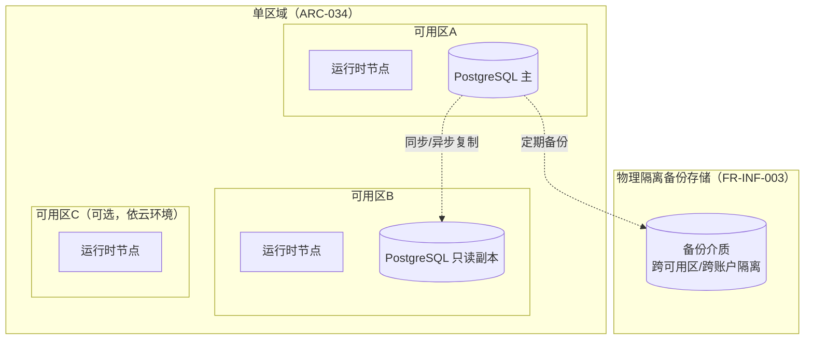

# 基本设计书（基本設計書 / Basic Design Document）

**网络基础设施拓扑、容灾与数据分析管线 Network Topology, Disaster Recovery & Analytics Pipeline**

| 项目 | 内容 |
|---|---|
| 文档编号 | RGS-BAS-017 |
| 版本 | 0.2 |
| 父文档 | RGS-REQ-020 需求定义书（ARC-034／ARC-035） |
| 制定日 | 2026-08-16 |
| 最终更新日 | 2026-08-16 |
| 制定者 | 架构师 |
| 保密级别 | 内部限定（Internal Use Only） |
| 适用许可 | Apache-2.0（本仓库） |

---

## 修订历史（改訂履歴 / Revision History）

| 版本 | 修订日 | 修订者 | 审批者 | 修订内容 | 影响需求ID |
|---|---|---|---|---|---|
| 0.1 | 2026-08-16 | 架构师 | — | 初版制定。展开ARC-034单区域拓扑的Multi-AZ落地设计、ARC-035分析管线组件设计 | 全部 |
| 0.2 | 2026-08-16 | 架构师 | — | 补强字段级细节：①补充脱敏字段清单（FR-INF-014）②补充分析查询资源隔离的具体强制手段（NFR-INF-003）③补充分析管线独立访问权限（RBAC）设计（RSK-INF-002）④补充AnalyticsEventConsumer消费失败/游标回退异常分支 | FR-INF-014、NFR-INF-003、RSK-INF-002 |

## 审批栏（承認欄 / Approval）

| 角色 | 姓名 | 审批日 | 备注 |
|---|---|---|---|
| 制定（起草） | 架构师 | 2026-08-16 | — |
| 评审（技术） | | | 分析管线存储选型是否满足OLU预算约束 |
| 审批（负责人） | | | 本文档的基准化 |

---

## 目录

1. [前言](#1-前言)
2. [单区域Multi-AZ拓扑设计](#2-单区域multi-az拓扑设计)
3. [数据分析管线组件设计](#3-数据分析管线组件设计)
4. [标准化检查清单](#4-标准化检查清单)
5. [追溯性](#5-追溯性)

---

# 1. 前言

本文档细化RGS-REQ-020定义的ARC-034（单区域优先）与ARC-035（分析管线读写分离）。

---

# 2. 单区域Multi-AZ拓扑设计

## 2.1 拓扑图（对RGS-REQ-001§10.1整体架构图的区域维度补充）



## 2.2 故障切换规则

| 故障范围 | 处置 |
|---|---|
| 单可用区不可用 | 流量自动路由至健康可用区的运行时节点；数据库主节点若位于故障可用区，触发只读副本提升为主（复用云环境原生能力，不自建复杂选主逻辑） |
| 整个区域不可用 | **不承诺**自动恢复（ARC-034已明确决议范围为单区域），需人工介入从备份介质恢复至新区域，RTO以FR-INF-003既定备份恢复标准为准，不承诺业务连续性 |

## 2.3 触发多区域评估的门禁（FR-INF-004落地）

新增运维面申领流程（复用ARC-026 GOV-OLU-002既有机制）中新增检查项："本次申领是否涉及跨区域常驻基础设施"——若是，**必须**先完成TBD-INF-001阈值评审+OLU预算核算，方可提交ADR。

---

# 3. 数据分析管线组件设计

## 3.1 组件划分

| 组件 | 归属 | 职责 |
|---|---|---|
| `AnalyticsEventConsumer` | 依附既有事件基础设施（不新建限界上下文） | 订阅ARC-010事件流，脱敏后写入分析专用存储（与可观测性存储物理隔离，ARC-035） |
| `AnalyticsStore` | 独立存储实例（复用开源OLAP方案，选型见TBD-INF-002） | 承载大范围扫描/聚合查询，与运维可观测性存储解耦 |
| `AnalyticsQueryUI` | 复用开源BI工具 | 运营/策划自助查询入口 |

## 3.2 数据流时序

```
业务事件产生（复用ARC-010既有事件流，不新增采集路径）
  → AnalyticsEventConsumer消费（与可观测性的消费者相互独立，各自的消费组/游标）
  → 脱敏处理（复用RGS-BAS-004既有脱敏实现，剔除个人可识别信息）
  → 写入AnalyticsStore（允许滞后，NFR-INF-006）
  → 运营/策划通过AnalyticsQueryUI自助查询，不触达生产事务库
```

### 3.2.1 消费异常分支

```
AnalyticsEventConsumer消费失败（分析存储写入异常/脱敏处理异常）
  → 独立于可观测性消费组的游标不前移，按ARC-009标准重试策略重试
  → 仍失败 → 记录告警（不影响可观测性消费组，两者消费者组相互独立，故障不传导），暂停该分区消费并保留游标位置
  → 修复后从暂停位置继续消费（不重放全部历史，避免与AnalyticsStore已有数据产生重复聚合口径偏差）；若游标已丢失，须走全量重建路径（从ARC-010事件流可重放窗口内重新消费，超出窗口的历史数据视为不可恢复缺口并在分析报表中标注）
```

### 3.3 脱敏字段清单（FR-INF-014落地）

`AnalyticsEventConsumer`在写入`AnalyticsStore`前，对以下字段类别执行脱敏（复用RGS-BAS-004既有脱敏实现，具体算法不在本文档重复）：

| 字段类别 | 处理方式 |
|---|---|
| 玩家账号标识（邮箱/手机号/第三方登录唯一ID，若事件载荷中携带） | 剔除，仅保留内部`player_id`（不视为PII，同RGS-BAS-004既有口径） |
| IP地址 | 截断保留至网段粒度或直接剔除，视分析用途是否需要地理粒度 |
| 支付相关明细（卡号/交易凭证号等，若事件载荷携带） | 全量剔除，分析管线不承载支付明细分析用途，此类分析留在RGS-BAS-016对账链路内处理 |
| 聊天/文本类自由输入内容 | 全量剔除或替换为哈希摘要，仅保留统计所需的元数据（如消息长度、发送频次） |

`AnalyticsEventConsumer`的脱敏规则以配置形式维护（按事件类型声明需剔除/替换的字段路径），新增事件类型接入分析管线时须先完成脱敏规则配置评审，未配置脱敏规则的事件类型**不得**默认接入。

### 3.4 资源隔离的强制手段（NFR-INF-003落地）

`AnalyticsStore`与运维可观测性存储**不共享**同一计算/存储实例（ARC-035既定物理隔离），并在以下层面进一步强制隔离，防止"物理隔离"仅停留在部署层面而在网络/连接层被绕过：
- 网络层：`AnalyticsStore`与可观测性存储位于不同的NetworkPolicy分组（复用RGS-REQ-010零信任NetworkPolicy机制），运维查询组件无权限连接`AnalyticsStore`，反之亦然
- 连接配额：`AnalyticsQueryUI`对`AnalyticsStore`的并发查询数与单查询超时时间设硬性上限（具体数值详细设计确定），防止某次大范围扫描查询耗尽存储实例资源影响其他分析用户
- 监控：`AnalyticsStore`资源使用率纳入RGS-BAS-004黄金指标监控，独立于可观测性存储的监控视图，避免告警噪音混淆两套系统的运维责任边界

### 3.5 分析管线独立访问权限（RSK-INF-002落地）

`AnalyticsQueryUI`的访问权限**独立**评审与分配，**不**与运维可观测性权限或既有GM后台RBAC（RGS-BAS-003）复用同一角色定义——运营/策划获得分析管线访问权限**不**意味着同时获得运维日志/追踪数据的访问权限，反之亦然。权限模型：

| 角色 | 可访问范围 |
|---|---|
| 分析只读用户（运营/策划） | 仅`AnalyticsStore`中已脱敏的聚合/明细数据，无权访问原始未脱敏事件流 |
| 分析管理员（工程团队指定） | 额外可管理脱敏规则配置（§3.3）、BI工具数据源配置 |

权限分配与变更须留痕（复用RGS-BAS-003§7审计设计同类存储原则）。

---

# 4. 标准化检查清单

## 4.1 上线前检查清单

- [ ] 单可用区故障演练已通过（AC-INF-001）
- [ ] 备份恢复演练已通过，备份介质物理隔离已验证（AC-INF-002）
- [ ] 分析管线存储与可观测性存储确认为独立实例
- [ ] 分析数据脱敏抽样检查通过，无明文个人可识别信息
- [ ] 触发多区域评估的门禁检查项已接入ARC-026申领流程
- [ ] 脱敏字段清单（§3.3）已针对每种接入分析管线的事件类型完成配置评审
- [ ] `AnalyticsStore`网络层隔离与连接配额（§3.4）已配置并验证运维组件无法直连
- [ ] 分析管线独立访问权限（§3.5）已完成角色分配，未复用运维/GM后台既有RBAC角色
- [ ] 注：分析管线消费组、脱敏规则维护为新增常态运维面，OLU运维负荷未核算，见ISS-065

## 4.2 代码评审检查清单

- [ ] 未出现为分析目的新增的专属埋点采集代码（应复用既有事件流）
- [ ] 分析查询代码未直接连接生产事务库实例

---

# 5. 追溯性

| 需求ID | 本设计书章节 |
|---|---|
| ARC-034、FR-INF-001〜005 | §2 |
| ARC-035、FR-INF-010〜014 | §3、§3.3（脱敏字段清单） |
| NFR-INF-001〜006 | §2.2、§3.2、§3.4（资源隔离强制手段） |
| AC-INF-001〜004 | §4.1 |
| TBD-INF-001〜003、RSK-INF-001〜002 | §4.1、§2.3、§3.5（独立访问权限） |

---

> 本文档与RGS-REQ-020（网络拓扑、容灾与数据分析管线 需求定义书）配套使用。
