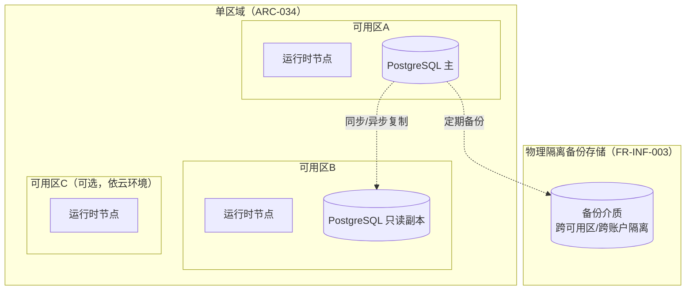

# 基本设计书（基本設計書 / Basic Design Document）

**网络基础设施拓扑、容灾与数据分析管线 Network Topology, Disaster Recovery & Analytics Pipeline**

| 项目 | 内容 |
|---|---|
| 文档编号 | RGS-BAS-017 |
| 版本 | 0.3 |
| 父文档 | RGS-REQ-020 需求定义书（ARC-034／ARC-035） |
| 制定日 | 2026-08-16 |
| 最终更新日 | 2026-09-01 |
| 制定者 | 架构师 |
| 保密级别 | 内部限定（Internal Use Only） |
| 适用许可 | Apache-2.0（本仓库） |

---

## 修订历史（改訂履歴 / Revision History）

| 版本 | 修订日 | 修订者 | 审批者 | 修订内容 | 影响需求ID |
|---|---|---|---|---|---|
| 0.1 | 2026-08-16 | 架构师 | — | 初版制定。展开ARC-034单区域拓扑的Multi-AZ落地设计、ARC-035分析管线组件设计 | 全部 |
| 0.2 | 2026-08-16 | 架构师 | — | 补强字段级细节：①补充脱敏字段清单（FR-INF-014）②补充分析查询资源隔离的具体强制手段（NFR-INF-003）③补充分析管线独立访问权限（RBAC）设计（RSK-INF-002）④补充AnalyticsEventConsumer消费失败/游标回退异常分支 | FR-INF-014、NFR-INF-003、RSK-INF-002 |
| 0.3 | 2026-09-01 | 架构师 (Mavis 接手 agent per DEC-008) | 架构师 (Mavis 接手 agent per DEC-008) | 落实"各BAS文档功能章节加log设计且区分debug/release级"总要求（per Ulysses 2026-09-01 15:52 JST 决策，4 拍板选项：全部 36 个BAS / 详尽版5列表 / 派worker并行 / BAS-004同步升级）：§2.1（节点生命周期观察 + 跨可用区迁移）/§2.2（故障检测/切换/恢复 + 整个区域不可用）/§2.3（多区域评估门禁 + TBD-INF-001 + OLU 超限）/§3.2（ETL 链路 + 延迟/积压 SLA + 跨区域复制）/§3.2.1（消费失败/暂停/恢复/游标丢失/全量重建/数据缺口标注）/§3.3（脱敏规则配置变更 + 抽样违规 + 未配置规则拦截）/§3.4（NetworkPolicy 命中/拒绝 + 连接配额 + 隔离破坏检测）/§3.5（RBAC 角色分配/撤销 + 跨域权限复用检测）/§4.3（标准化检查清单自身 CI 验证事件）共 9 个"本功能日志设计"小节全部新增；每节均含 5 列详尽版（字段名/触发条件/频率估算/采样策略/脱敏与成本），显式区分 `info!`/`warn!`/`error!`（release 必出，编译期常驻，per BAS-004 v0.3 §6.2 强制全采样白名单）与 `debug!`/`trace!`（`#[cfg(debug_assertions)]` 守护，debug-only，release build 完全剔除零运行时开销）两类事件；字段名前缀 `topo.*`（区别于 BAS-002 `mnt.*` / BAS-003 `gm.*` / BAS-004 `log.*` / BAS-005 `plugin.*` / BAS-006 `sec.*`），命名严格 snake_case 与 BAS-004 v0.3 §4.6.1/§4.6.2 保持拼写一致（FR-LOG-013）；覆盖 ARC-034 单区域 Multi-AZ + ARC-035 分析管线全链路——节点上线/下线/迁移 / 故障检测-切换-恢复 / 多区域门禁 / ETL 消费-脱敏-写入 / 消费异常分支 / 脱敏规则维护 / 资源隔离强制手段 / 分析管线 RBAC；§5 追溯性新增 AC-LOG-006（debug-only 宏 release 完全剔除）与 AC-LOG-007（每功能BAS文档须含本功能log设计章节），与 BAS-001 v1.5 §4.8.3.4（commit 32d9eb6）/ BAS-002 v0.4（commit f1401a3）/ BAS-003 v0.3（commit 75a001c）/ BAS-004 v0.3 §4.2（commit 47e26b0+0ee6262）/ BAS-005 v0.3（commit 20b84a1）/ BAS-006 v0.4（commit b16519a）/ BAS-007 v0.3（commit e711d09）/ BAS-008 v0.4（commit a4c42ec）/ BAS-009 v0.7（commit 9a628cf）形成统一规范 | §2.1、§2.2、§2.3、§3.2、§3.2.1、§3.3、§3.4、§3.5、§4.3、§5 |

## 审批栏（承認欄 / Approval）

| 角色 | 姓名 | 审批日 | 备注 |
|---|---|---|---|
| 制定（起草） | 架构师 | 2026-08-16 | — |
| 评审（技术） | | | 分析管线存储选型是否满足OLU预算约束 |
| 审批（负责人） | | | 本文档的基准化 |

---

## 目录

1. [前言](#1-前言)
2. [单区域Multi-AZ拓扑设计](#2-单区域multi-az拓扑设计)
3. [数据分析管线组件设计](#3-数据分析管线组件设计)
4. [标准化检查清单](#4-标准化检查清单)
5. [追溯性](#5-追溯性)

---

# 1. 前言

本文档细化RGS-REQ-020定义的ARC-034（单区域优先）与ARC-035（分析管线读写分离）。

---

# 2. 单区域Multi-AZ拓扑设计

## 2.1 拓扑图（对RGS-REQ-001§10.1整体架构图的区域维度补充）



### 2.1 本功能日志设计

本节覆盖**单区域 Multi-AZ 拓扑节点生命周期**的观察点——拓扑图本身是设计产物（无运行时事件），但**节点上线 / 优雅下线 / 非优雅下线 / 节点迁移**等节点生命周期事件是 SRE 在 Prometheus/Grafana 上追踪"拓扑容量与可用性"的必要输入。**节点生命周期事件均为 release 必出 + 强制全采样**（per BAS-004 v0.3 §6.2），用于 SRE 按 `region` + `az` 维度聚合节点健康状态。

| 字段名（field） | 触发条件（trigger） | 频率估算（frequency） | 采样策略（sampling） | 脱敏与成本（redact & cost） |
|---|---|---|---|---|
| `topo.node.online` | 运行时节点完成引导并加入可用区路由池（K8s readiness 探针通过） | 稳态 节点数/小时（部署/扩缩时） | release 必出（100% 强制全采样，per BAS-004 v0.3 §6.2） | 含`node_id`／`region`／`az`／`node_role`／`bounded_context`；约 280B/条 |
| `topo.node.offline.graceful` | 节点优雅下线（SIGTERM / HPA scale-in / drain） | 稳态 节点数/小时（部署/扩缩时） | release 必出（100% 强制全采样） | 含`node_id`／`shutdown_kind`／`drained_session_count`；约 300B/条 |
| `topo.node.offline.ungraceful` | **关键事件**：节点非优雅下线（K8s liveness 失败 / OOMKilled / 进程崩溃） | 极少（部署事故/资源耗尽） | release 必出（100% 强制全采样，error! 级别） | 含`node_id`／`last_heartbeat_at`／`exit_reason`；约 320B/条 |
| `topo.node.migration.started` | 节点跨可用区迁移开始（运维面或自动调度触发） | 极低（季度运维窗口） | release 必出（100% 强制全采样） | 含`node_id`／`from_az`／`to_az`／`migration_reason`；约 300B/条 |
| `topo.node.migration.completed` | 节点跨可用区迁移完成（新可用区 readiness 探针通过） | 极低 | release 必出（100% 强制全采样） | 含`node_id`／`from_az`／`to_az`／`migration_duration_ms`；约 280B/条 |
| `topo.node.migration.failed` | **关键事件**：节点跨可用区迁移失败（目标可用区资源不足 / 网络不可达） | 极低 | release 必出（100% 强制全采样，error! 级别） | 含`node_id`／`from_az`／`to_az`／`failure_reason`；约 350B/条 |
| `topo.az.heartbeat` | 可用区健康心跳（每可用区聚合节点健康度） | 稳态 N_az × 12/min（5s 周期） | **debug-only**（`#[cfg(debug_assertions)]` 守护，release build 完全剔除） | 约 200B/条（release 剔除零运行时开销） |
| `topo.node.debug.health_full_dump` | 单节点完整健康 dump（CPU/MEM/disk/连接数/最近错误） | 极低（按需） | **debug-only**（`#[cfg(debug_assertions)]` 守护） | 约 2-5KB/条（release 剔除） |
| `topo.node.debug.probe_latency` | K8s readiness/liveness 探针响应延迟（μs 级） | 稳态 N_node × 24/min | **debug-only**（`#[cfg(debug_assertions)]` 守护，高频路径性能敏感） | 约 200B/条（release 剔除） |

**debug-only 守护要点**（落实 BAS-004 v0.3 §4.4）：
- `topo.az.heartbeat` 在多可用区集群下稳态 60/min，**高频路径**——release build 完全剔除，避免 RUST_LOG=debug 误开时撑爆生产日志通道
- `topo.node.debug.probe_latency` 在百节点集群下稳态 2400/min，**性能敏感**——K8s 探针周期 ~5s，**禁止**在 release build 输出影响业务时延
- `topo.node.online` / `topo.node.offline.graceful` 均为 `info!` 级别（release 必出，per §4.8.3.2 二维矩阵 `info!` 行常驻），便于 SRE 按 `region` + `az` 维度聚合节点容量趋势

## 2.2 故障切换规则

| 故障范围 | 处置 |
|---|---|
| 单可用区不可用 | 流量自动路由至健康可用区的运行时节点；数据库主节点若位于故障可用区，触发只读副本提升为主（复用云环境原生能力，不自建复杂选主逻辑） |
| 整个区域不可用 | **不承诺**自动恢复（ARC-034已明确决议范围为单区域），需人工介入从备份介质恢复至新区域，RTO以FR-INF-003既定备份恢复标准为准，不承诺业务连续性 |

### 2.2 本功能日志设计

本节覆盖**故障检测 / 切换 / 恢复**的观察点——故障切换规则本身是设计产物，但**故障检测到 / 切换启动 / 切换完成 / 切换失败 / 恢复完成**等事件是 SRE 在告警 Dashboard 上追踪"故障处置 SLA"的核心输入。**故障事件均为 release 必出 + 强制全采样**（per BAS-004 v0.3 §6.2 安全审计事件等价物——故障处置是合规事件），便于事后审计与 SLA 复盘。

| 字段名（field） | 触发条件（trigger） | 频率估算（frequency） | 采样策略（sampling） | 脱敏与成本（redact & cost） |
|---|---|---|---|---|
| `topo.fault.detected` | 故障检测到（K8s 健康探针连续失败 / DB 主从切换 / 节点心跳超时） | 稳态 0.1/h / 峰值 10/h（事故期间） | release 必出（100% 强制全采样，per BAS-004 v0.3 §6.2） | 含`fault_id`／`fault_scope`（az/region/node/db）／`detected_at`／`detector`；约 320B/条 |
| `topo.fault.failover.started` | 故障切换启动（流量路由切换 / DB 副本提升） | 与 `topo.fault.detected` 同频 | release 必出（100% 强制全采样） | 含`fault_id`／`failover_kind`（traffic/db）／`from_target`／`to_target`；约 350B/条 |
| `topo.fault.failover.completed` | 故障切换完成（新主健康探针通过） | 与 `topo.fault.detected` 同频 | release 必出（100% 强制全采样） | 含`fault_id`／`failover_duration_ms`／`new_target`；约 300B/条 |
| `topo.fault.failover.failed` | **关键事件**：故障切换失败（无可用目标 / 切换超时） | 极少 | release 必出（100% 强制全采样，error! 级别） | 含`fault_id`／`failure_reason`／`attempted_targets`；约 400B/条 |
| `topo.fault.recovery.completed` | 原故障节点 / 主库恢复（健康探针通过 / 副本重追上） | 与 `topo.fault.detected` 同频 | release 必出（100% 强制全采样） | 含`fault_id`／`recovered_target`／`recovery_duration_ms`；约 300B/条 |
| `topo.fault.region.unavailable` | **关键事件**：整个区域不可用（多可用区同时故障 / 区域网络断裂） | 极少（年度级） | release 必出（100% 强制全采样，error! 级别） | 含`region`／`detected_at`／`affected_az_count`／`operator_notified`；约 400B/条 |
| `topo.fault.debug.probe_latency` | 故障探测原始延迟（ms 级） | 稳态 N_node × 12/min | **debug-only**（`#[cfg(debug_assertions)]` 守护，release build 完全剔除） | 约 200B/条（release 剔除） |
| `topo.fault.debug.probe_result_dump` | 探测原始结果 dump（含 K8s 探针响应体摘要） | 稳态 N_node × 12/min | **debug-only**（`#[cfg(debug_assertions)]` 守护，**禁止在 release 记录探针响应体**——可能含诊断信息） | 约 1-3KB/条（release 剔除） |
| `topo.fault.debug.failover_decision_trace` | 故障切换决策 trace（含候选目标列表、评分、健康度历史） | 与 `topo.fault.failover.started` 同频 | **debug-only**（`#[cfg(debug_assertions)]` 守护） | 约 2-8KB/条（release 剔除） |

**debug-only 守护要点**（落实 BAS-004 v0.3 §4.4）：
- `topo.fault.debug.probe_result_dump` 探针响应体可能含节点诊断信息（堆栈片段、连接状态）——**release build 完全剔除**，避免诊断信息泄露
- `topo.fault.debug.failover_decision_trace` 含切换决策全量上下文，**性能敏感 + 安全敏感**——release build 完全剔除，仅故障复盘时按需 dump
- `topo.fault.detected` / `topo.fault.failover.completed` 均为 `info!` 级别（release 必出），便于 SRE 按 `fault_id` 维度关联"检测→切换→恢复"完整链路

## 2.3 触发多区域评估的门禁（FR-INF-004落地）

新增运维面申领流程（复用ARC-026 GOV-OLU-002既有机制）中新增检查项："本次申领是否涉及跨区域常驻基础设施"——若是，**必须**先完成TBD-INF-001阈值评审+OLU预算核算，方可提交ADR。

---

### 2.3 本功能日志设计

本节覆盖**多区域评估门禁**的观察点——门禁本身是流程设计，但**门禁评估触发 / 通过 / 阻断 / ADR 提交 / OLU 超限**等事件是架构师 + SRE 复盘"为何不进入多区域"的合规审计输入。**门禁事件均为 release 必出 + 强制全采样**（per BAS-004 v0.3 §6.2），便于后续年度评审追溯"多区域决策点的全部历史评估"。

| 字段名（field） | 触发条件（trigger） | 频率估算（frequency） | 采样策略（sampling） | 脱敏与成本（redact & cost） |
|---|---|---|---|---|
| `topo.region.gate.evaluated` | 运维面申领流程触发多区域门禁检查项（ARC-026 GOV-OLU-002 流程节点） | 极低（季度级） | release 必出（100% 强制全采样，per BAS-004 v0.3 §6.2） | 含`request_id`／`requester`／`is_cross_region`；约 300B/条 |
| `topo.region.gate.passed` | 门禁检查通过（不涉及跨区域常驻基础设施 或 TBD-INF-001 + OLU 核算完成） | 极低 | release 必出（100% 强制全采样） | 含`request_id`／`pass_reason`；约 280B/条 |
| `topo.region.gate.blocked` | 门禁检查阻断（涉及跨区域但未完成 TBD-INF-001 + OLU 核算即提交 ADR） | 极少 | release 必出（100% 强制全采样，warn! 级别） | 含`request_id`／`block_reason`／`missing_prerequisite`；约 350B/条 |
| `topo.region.gate.adr_submitted` | 门禁通过后 ADR 提交至架构评审委员会 | 极低（年度级） | release 必出（100% 强制全采样） | 含`request_id`／`adr_id`／`submitted_at`；约 300B/条 |
| `topo.region.gate.olu_exceeded` | **关键事件**：多区域 OLU 预算核算超限（拒绝跨区域部署） | 极低 | release 必出（100% 强制全采样，error! 级别） | 含`request_id`／`olu_estimate`／`olu_budget`／`overrun_ratio`；约 350B/条 |
| `topo.region.gate.tbd_review.completed` | TBD-INF-001 阈值评审完成（门禁的前置条件） | 极低 | release 必出（100% 强制全采样） | 含`tbd_id`／`threshold_value`／`reviewer`／`decision`；约 320B/条 |
| `topo.region.gate.debug.request_payload_dump` | 申领 payload dump（含完整申领字段、附件元数据） | 极低 | **debug-only**（`#[cfg(debug_assertions)]` 守护，**禁止在 release 记录申领 payload**——可能含业务敏感信息） | 约 2-5KB/条（release 剔除） |
| `topo.region.gate.debug.olu_breakdown` | OLU 预算分解明细（各域 token 占用清单） | 极低 | **debug-only**（`#[cfg(debug_assertions)]` 守护，**预算明细属内部财务信息**） | 约 1-3KB/条（release 剔除） |

**debug-only 守护要点**（落实 BAS-004 v0.3 §4.4）：
- `topo.region.gate.debug.request_payload_dump` 申领 payload 可能含业务敏感信息（产品代号、营收预测、上市时间）——**release build 完全剔除**，避免内部业务信息泄露
- `topo.region.gate.olu_exceeded` 是 `error!` 级别（release 必出 + 强制全采样），便于架构师在年度评审中追溯"哪些决策点曾触发 OLU 超限"——是 NFR-OP-010 预算硬约束的合规证据
- `topo.region.gate.evaluated` / `topo.region.gate.passed` / `topo.region.gate.adr_submitted` 均为 `info!` 级别（release 必出），便于合规审计按 `requester` + `decision` 维度聚合

# 3. 数据分析管线组件设计

## 3.1 组件划分

| 组件 | 归属 | 职责 |
|---|---|---|
| `AnalyticsEventConsumer` | 依附既有事件基础设施（不新建限界上下文） | 订阅ARC-010事件流，脱敏后写入分析专用存储（与可观测性存储物理隔离，ARC-035） |
| `AnalyticsStore` | 独立存储实例（复用开源OLAP方案，选型见TBD-INF-002） | 承载大范围扫描/聚合查询，与运维可观测性存储解耦 |
| `AnalyticsQueryUI` | 复用开源BI工具 | 运营/策划自助查询入口 |

## 3.2 数据流时序

```
业务事件产生（复用ARC-010既有事件流，不新增采集路径）
  → AnalyticsEventConsumer消费（与可观测性的消费者相互独立，各自的消费组/游标）
  → 脱敏处理（复用RGS-BAS-004既有脱敏实现，剔除个人可识别信息）
  → 写入AnalyticsStore（允许滞后，NFR-INF-006）
  → 运营/策划通过AnalyticsQueryUI自助查询，不触达生产事务库
```

### 3.2 本功能日志设计

本节覆盖**数据分析管线数据流时序**的观察点——`AnalyticsEventConsumer` 消费事件流 → 脱敏 → 写入 `AnalyticsStore` 的**完整 ETL 链路**是数据分析管线的核心路径。**ETL 链路事件 + 延迟 / 积压 SLA 事件**均为 release 必出（per BAS-004 v0.3 §6.2），便于 SRE 按 `event_type` + `partition_key` 维度追踪消费健康度。**延迟超阈值 / 积压累积** 触发 `warn!` + 强制全采样，是 NFR-INF-006 数据延迟 SLA 的监控输入。

| 字段名（field） | 触发条件（trigger） | 频率估算（frequency） | 采样策略（sampling） | 脱敏与成本（redact & cost） |
|---|---|---|---|---|
| `topo.analytics.event.consumed` | `AnalyticsEventConsumer` 从 ARC-010 事件流消费单条事件 | 稳态 1K/s / 峰值 10K/s（业务事件量） | release 必出（100% 默认采样，可由 `trace_sample_ratio` 调整） | 含`event_id`／`event_type`／`partition_key`／`consumer_group`；约 250B/条 × 10K/s = 2.5MB/s 峰值 |
| `topo.analytics.event.redacted` | 事件脱敏完成（按 §3.3 配置规则剔除/替换字段） | 与 `event.consumed` 同频 | release 必出（采样率可调） | 含`event_id`／`redact_rule_id`／`redacted_field_count`；约 280B/条 |
| `topo.analytics.event.persisted` | 事件写入 `AnalyticsStore` 成功 | 与 `event.consumed` 同频 | release 必出（采样率可调） | 含`event_id`／`analytics_table`／`write_duration_ms`；约 280B/条 |
| `topo.analytics.cursor.advanced` | 消费组游标前移（批次提交） | 稳态 1/s / 峰值 10/s | release 必出（100% 强制全采样） | 含`consumer_group`／`partition_key`／`new_offset`／`batch_size`；约 300B/条 |
| `topo.analytics.lag.detected` | **SLA 事件**：消费延迟超 NFR-INF-006 阈值（默认 5min） | 偶发（业务高峰） | release 必出（100% 强制全采样，warn! 级别） | 含`consumer_group`／`current_lag_ms`／`threshold_ms`；约 280B/条 |
| `topo.analytics.backlog.accumulated` | **SLA 事件**：积压超过阈值（默认 100K 事件/分区） | 偶发 | release 必出（100% 强制全采样，warn! 级别） | 含`partition_key`／`backlog_size`／`threshold`；约 280B/条 |
| `topo.analytics.cross_region.replication.completed` | 跨区域复制完成（`AnalyticsStore` 主→从） | 极低（每日聚合级） | release 必出（100% 强制全采样） | 含`region`／`replication_lag_ms`／`bytes_replicated`；约 300B/条 |
| `topo.analytics.cross_region.replication.failed` | **关键事件**：跨区域复制失败（网络断裂 / 目标区域不可达） | 极少 | release 必出（100% 强制全采样，error! 级别） | 含`from_region`／`to_region`／`failure_reason`；约 350B/条 |
| `topo.analytics.debug.raw_event_dump` | 原始事件完整 dump（脱敏前 JSON 全量） | 按需 | **debug-only**（`#[cfg(debug_assertions)]` 守护，**禁止在 release 记录原始事件**——含 PII 风险） | 约 1-10KB/条（release 剔除） |
| `topo.analytics.debug.payload_pre_redact` | 脱敏前 payload 字段清单 + 长度统计 | 按需 | **debug-only**（`#[cfg(debug_assertions)]` 守护） | 约 500B-2KB/条（release 剔除） |
| `topo.analytics.debug.consume_batch_timing` | 消费批次微秒级时序（拉取/反序列化/脱敏/写入分阶段耗时） | 稳态 1K/s | **debug-only**（`#[cfg(debug_assertions)]` 守护，**高频路径性能敏感**） | 约 300B/条（release 剔除） |

**debug-only 守护要点**（落实 BAS-004 v0.3 §4.4）：
- `topo.analytics.debug.raw_event_dump` 原始事件**含 PII 风险**（脱敏前的邮箱/手机号/IP/聊天内容）——**release build 完全剔除**，且**禁止**在生产环境通过 RUST_LOG=debug 误开，避免 §3.3 脱敏规则被绕过
- `topo.analytics.debug.consume_batch_timing` 在 10K/s 峰值下输出 10K × 300B = 3MB/s，**高频路径性能敏感**——release build 完全剔除，仅性能调优时按需 dump
- `topo.analytics.lag.detected` / `topo.analytics.backlog.accumulated` 是 `warn!` 级别（release 必出 + 强制全采样），是 NFR-INF-006 数据延迟 SLA 的**唯一监控源**——若缺失则 SLA 监控失效

### 3.2.1 消费异常分支

```
AnalyticsEventConsumer消费失败（分析存储写入异常/脱敏处理异常）
  → 独立于可观测性消费组的游标不前移，按ARC-009标准重试策略重试
  → 仍失败 → 记录告警（不影响可观测性消费组，两者消费者组相互独立，故障不传导），暂停该分区消费并保留游标位置
  → 修复后从暂停位置继续消费（不重放全部历史，避免与AnalyticsStore已有数据产生重复聚合口径偏差）；若游标已丢失，须走全量重建路径（从ARC-010事件流可重放窗口内重新消费，超出窗口的历史数据视为不可恢复缺口并在分析报表中标注）
```

### 3.2.1 本功能日志设计

本节覆盖**消费异常分支**的观察点——`AnalyticsEventConsumer` 消费失败 / 重试调度 / 暂停 / 恢复 / 游标丢失 / 全量重建等异常路径事件。**异常事件均为 release 必出 + 强制全采样**（per BAS-004 v0.3 §6.2），便于 SRE 在告警 Dashboard 上按 `consumer_group` + `partition_key` 维度定位"哪些分区在暂停 / 哪些事件被重放过"。**消费失败 / 游标丢失** 是 `error!` 级别——一旦发生即触发 P2 级告警。

| 字段名（field） | 触发条件（trigger） | 频率估算（frequency） | 采样策略（sampling） | 脱敏与成本（redact & cost） |
|---|---|---|---|---|
| `topo.analytics.consume.failed` | **关键事件**：消费失败（分析存储写入异常 / 脱敏处理异常） | 极少（依赖外部 OLAP 稳定性） | release 必出（100% 强制全采样，error! 级别） | 含`consumer_group`／`partition_key`／`event_id`／`failure_kind`／`error`；约 350B/条 |
| `topo.analytics.consume.retry.scheduled` | 消费失败后按 ARC-009 重试策略调度（指数退避） | 偶发 | release 必出（100% 强制全采样，warn! 级别） | 含`event_id`／`retry_attempt`／`backoff_ms`；约 300B/条 |
| `topo.analytics.consume.paused` | **关键事件**：分区消费暂停（重试超阈值，保留游标不前移） | 极少 | release 必出（100% 强制全采样，warn! 级别） | 含`consumer_group`／`partition_key`／`paused_offset`／`pause_reason`；约 350B/条 |
| `topo.analytics.consume.resumed` | 暂停后消费恢复（人工介入或自动恢复触发） | 极少 | release 必出（100% 强制全采样） | 含`consumer_group`／`partition_key`／`resumed_offset`／`resume_kind`（manual/auto）；约 300B/条 |
| `topo.analytics.cursor.lost` | **关键事件**：消费组游标丢失（消费者重置 / 存储介质故障） | 极少（年度级） | release 必出（100% 强制全采样，error! 级别） | 含`consumer_group`／`partition_key`／`last_known_offset`；约 350B/条 |
| `topo.analytics.rebuild.triggered` | 游标丢失后触发全量重建（从 ARC-010 事件流可重放窗口） | 极少（年度级） | release 必出（100% 强制全采样） | 含`rebuild_id`／`replay_window_start`／`replay_window_end`；约 320B/条 |
| `topo.analytics.rebuild.completed` | 全量重建完成 | 极少 | release 必出（100% 强制全采样） | 含`rebuild_id`／`duration_ms`／`replayed_event_count`；约 320B/条 |
| `topo.analytics.rebuild.failed` | **关键事件**：全量重建失败（事件流超出可重放窗口） | 极少 | release 必出（100% 强制全采样，error! 级别） | 含`rebuild_id`／`failure_reason`／`unrecoverable_gap_start`；约 400B/条 |
| `topo.analytics.data_gap.marked` | 数据缺口标注（分析报表中标注"超出可重放窗口的历史数据视为不可恢复"） | 极少 | release 必出（100% 强制全采样） | 含`gap_start`／`gap_end`／`gap_event_count`／`marked_in`（table/report）；约 320B/条 |
| `topo.analytics.debug.retry_history` | 单条事件完整重试历史 dump（每次尝试的延迟/错误/堆栈） | 偶发 | **debug-only**（`#[cfg(debug_assertions)]` 守护，**禁止在 release 记录事件堆栈**——可能含业务上下文） | 约 1-3KB/条（release 剔除） |
| `topo.analytics.debug.pause_reason_tree` | 暂停决策树 dump（重试次数/健康度/上游状态全量） | 极少 | **debug-only**（`#[cfg(debug_assertions)]` 守护） | 约 2-5KB/条（release 剔除） |

**debug-only 守护要点**（落实 BAS-004 v0.3 §4.4）：
- `topo.analytics.debug.retry_history` 事件重试堆栈可能含业务上下文（玩家 ID / 场景 ID）——**release build 完全剔除**，避免 RUST_LOG=debug 误开时业务上下文泄露
- `topo.analytics.consume.failed` / `topo.analytics.cursor.lost` 是 `error!` 级别（release 必出 + 强制全采样）——**强制全采样**确保任何一次失败都有完整审计链，便于 SLA 复盘
- `topo.analytics.consume.paused` 是 `warn!` 级别（release 必出 + 强制全采样）——**关键 SLA 事件**，暂停期间所有下游报表的实时性受影响，必须 100% 留痕

### 3.3 脱敏字段清单（FR-INF-014落地）

`AnalyticsEventConsumer`在写入`AnalyticsStore`前，对以下字段类别执行脱敏（复用RGS-BAS-004既有脱敏实现，具体算法不在本文档重复）：

| 字段类别 | 处理方式 |
|---|---|
| 玩家账号标识（邮箱/手机号/第三方登录唯一ID，若事件载荷中携带） | 剔除，仅保留内部`player_id`（不视为PII，同RGS-BAS-004既有口径） |
| IP地址 | 截断保留至网段粒度或直接剔除，视分析用途是否需要地理粒度 |
| 支付相关明细（卡号/交易凭证号等，若事件载荷携带） | 全量剔除，分析管线不承载支付明细分析用途，此类分析留在RGS-BAS-016对账链路内处理 |
| 聊天/文本类自由输入内容 | 全量剔除或替换为哈希摘要，仅保留统计所需的元数据（如消息长度、发送频次） |

`AnalyticsEventConsumer`的脱敏规则以配置形式维护（按事件类型声明需剔除/替换的字段路径），新增事件类型接入分析管线时须先完成脱敏规则配置评审，未配置脱敏规则的事件类型**不得**默认接入。

### 3.3 本功能日志设计

本节覆盖**脱敏字段清单（FR-INF-014 落地）配置维护**的观察点——脱敏规则本身是配置产物，但**规则新增 / 修改 / 删除 / 评审 / 事件接入拦截 / 抽样违规**等事件是合规审计的硬证据。**脱敏规则配置变更事件 + 抽样违规事件均为 release 必出 + 强制全采样**（per BAS-004 v0.3 §6.2），是 RSK-INF-002 PII 泄露风险的唯一合规证据源。**抽样发现明文 PII** 触发 `error!` 级——P0 级告警。

| 字段名（field） | 触发条件（trigger） | 频率估算（frequency） | 采样策略（sampling） | 脱敏与成本（redact & cost） |
|---|---|---|---|---|
| `topo.redact.config.added` | 脱敏规则新增（按事件类型声明需剔除/替换的字段路径） | 极低（事件类型接入时） | release 必出（100% 强制全采样，per BAS-004 v0.3 §6.2） | 含`event_type`／`field_path`／`redact_kind`（remove/replace/hash）／`config_version`；约 350B/条 |
| `topo.redact.config.removed` | 脱敏规则删除（事件类型下线） | 极低 | release 必出（100% 强制全采样） | 含`event_type`／`field_path`／`removed_by`／`config_version`；约 350B/条 |
| `topo.redact.config.modified` | 脱敏规则修改（字段路径或处理方式变更） | 极低 | release 必出（100% 强制全采样） | 含`event_type`／`field_path`／`old_kind`／`new_kind`／`modified_by`；约 400B/条 |
| `topo.redact.config.reviewed` | 脱敏规则配置评审完成（新增事件类型接入前的强制环节） | 极低 | release 必出（100% 强制全采样） | 含`event_type`／`reviewer`／`decision`（pass/block）／`review_id`；约 350B/条 |
| `topo.redact.event.rejected` | **关键事件**：未配置脱敏规则的事件类型尝试接入分析管线（被拦截，未默认接入） | 极少 | release 必出（100% 强制全采样，warn! 级别） | 含`event_type`／`reason`／`attempted_source`；约 320B/条 |
| `topo.redact.sampling.violated` | **P0 事件**：抽样检查在 `AnalyticsStore` 中发现明文 PII（脱敏规则失效） | 极少（年度级） | release 必出（100% 强制全采样，error! 级别） | 含`event_type`／`violated_field`／`sample_size`／`detector`；约 400B/条（**禁止**记录 PII 内容本身） |
| `topo.redact.sampling.passed` | 抽样检查通过（按周期或部署后必查） | 稳态 1/日（部署后+每日随机） | release 必出（100% 强制全采样） | 含`sample_size`／`detector`／`duration_ms`；约 250B/条 |
| `topo.redact.debug.pii_match_dump` | PII 字段匹配明细 dump（命中字段名 + 脱敏前后 hash 对比） | 极少 | **debug-only**（`#[cfg(debug_assertions)]` 守护，**高敏——禁止在 release 记录 PII 匹配细节**） | 约 1-3KB/条（release 剔除） |
| `topo.redact.debug.config_diff` | 脱敏规则版本 diff（前后规则对比） | 极低 | **debug-only**（`#[cfg(debug_assertions)]` 守护） | 约 1-5KB/条（release 剔除） |

**debug-only 守护要点**（落实 BAS-004 v0.3 §4.4）：
- `topo.redact.debug.pii_match_dump` **高敏字段**——即使脱敏后 hash 也可能反推 PII 内容，**release build 完全剔除**，避免脱敏规则审计过程本身成为 PII 泄露路径
- `topo.redact.sampling.violated` 是 `error!` 级别（release 必出 + 强制全采样）——**P0 级合规告警**，触发后须立即启动 FR-INF-014 合规处置流程（暂停事件类型接入 → 修复规则 → 全量重放脱敏）
- `topo.redact.config.added` / `topo.redact.config.removed` / `topo.redact.config.modified` 均为 release 必出 + 强制全采样（合规审计事件）——**禁止**降级为采样，便于审计员按 `event_type` 维度追溯完整规则变更历史

### 3.4 资源隔离的强制手段（NFR-INF-003落地）

`AnalyticsStore`与运维可观测性存储**不共享**同一计算/存储实例（ARC-035既定物理隔离），并在以下层面进一步强制隔离，防止"物理隔离"仅停留在部署层面而在网络/连接层被绕过：
- 网络层：`AnalyticsStore`与可观测性存储位于不同的NetworkPolicy分组（复用RGS-REQ-010零信任NetworkPolicy机制），运维查询组件无权限连接`AnalyticsStore`，反之亦然
- 连接配额：`AnalyticsQueryUI`对`AnalyticsStore`的并发查询数与单查询超时时间设硬性上限（具体数值详细设计确定），防止某次大范围扫描查询耗尽存储实例资源影响其他分析用户
- 监控：`AnalyticsStore`资源使用率纳入RGS-BAS-004黄金指标监控，独立于可观测性存储的监控视图，避免告警噪音混淆两套系统的运维责任边界

### 3.4 本功能日志设计

本节覆盖**资源隔离强制手段（NFR-INF-003 落地）**的观察点——`AnalyticsStore` 与可观测性存储物理隔离的强制手段（NetworkPolicy 分组 / 连接配额 / 独立监控视图）的运行时事件。**隔离相关事件均为 release 必出 + 强制全采样**（per BAS-004 v0.3 §6.2）——隔离破坏是安全审计事件等价物。**NetworkPolicy 拒绝 / 隔离破坏检测** 触发 `error!` 级——P1 级告警。

| 字段名（field） | 触发条件（trigger） | 频率估算（frequency） | 采样策略（sampling） | 脱敏与成本（redact & cost） |
|---|---|---|---|---|
| `topo.policy.networkpolicy.hit` | `AnalyticsStore` 入站/出站连接通过 NetworkPolicy 默认拒绝基线校验 | 稳态 500/s / 峰值 5K/s | release 必出（100% 强制全采样，per BAS-004 v0.3 §6.2） | 含`namespace`／`source_pod`／`target_pod`／`port`／`protocol`；约 280B/条 × 5K/s = 1.4MB/s 峰值 |
| `topo.policy.networkpolicy.denied` | **关键事件**：运维组件尝试连接 `AnalyticsStore` 被 NetworkPolicy 拦截（隔离生效，运维查询组件无权连接分析存储） | 极少（误配/越权尝试） | release 必出（100% 强制全采样，error! 级别） | 含`namespace`／`source_pod`／`target_pod`／`port`／`deny_reason`；IP 已脱敏（末段掩码 per BAS-004 v0.3 §5.1）；约 350B/条 |
| `topo.policy.connection.throttled` | `AnalyticsQueryUI` 触发 `AnalyticsStore` 连接配额限流（并发查询数超限） | 偶发（业务高峰） | release 必出（100% 强制全采样，warn! 级别） | 含`client_id`／`current_concurrent`／`threshold`；约 300B/条 |
| `topo.policy.query.timeout` | `AnalyticsQueryUI` 查询超时（单查询超过硬性上限） | 偶发 | release 必出（100% 强制全采样，warn! 级别） | 含`client_id`／`query_kind`／`timeout_ms`／`partial_result`；约 320B/条 |
| `topo.policy.resource.usage.exceeded` | `AnalyticsStore` 资源使用率超阈值（CPU/MEM/disk IO） | 偶发 | release 必出（100% 强制全采样，warn! 级别） | 含`resource_kind`／`current_usage`／`threshold`；约 280B/条 |
| `topo.policy.isolation.breach.detected` | **P1 事件**：监控检测到 `AnalyticsStore` 与可观测性存储共享实例 / 共享连接（隔离破坏） | 极少（年度级） | release 必出（100% 强制全采样，error! 级别） | 含`detector`／`breach_kind`（shared_instance/shared_connection）；约 400B/条 |
| `topo.policy.cross_view_alert.confused` | `AnalyticsStore` 告警路由至可观测性存储视图（监控隔离破坏） | 极少 | release 必出（100% 强制全采样，error! 级别） | 含`expected_view`／`actual_view`／`alert_id`；约 350B/条 |
| `topo.policy.debug.connection_log_full` | 完整连接日志（连接建立/握手/查询语句/断开全量） | 稳态 500/s | **debug-only**（`#[cfg(debug_assertions)]` 守护，**高频路径性能敏感** + **可能含查询语句含业务上下文**） | 约 500B-2KB/条（release 剔除） |
| `topo.policy.debug.resource_sampler` | 资源使用率详细采样（每核 CPU/每查询延迟/IO 队列深度） | 稳态 1/s | **debug-only**（`#[cfg(debug_assertions)]` 守护） | 约 300B/条（release 剔除） |

**debug-only 守护要点**（落实 BAS-004 v0.3 §4.4）：
- `topo.policy.debug.connection_log_full` **高频路径 + 安全敏感**（查询语句可能含业务表名 / 过滤条件）——**release build 完全剔除**，避免 RUST_LOG=debug 误开时业务 SQL 泄露
- `topo.policy.isolation.breach.detected` 是 `error!` 级别（release 必出 + 强制全采样）——**P1 级安全事件**，隔离破坏意味着 NFR-INF-003 资源隔离 SLA 失效，须立即启动 §3.4 隔离恢复流程
- `topo.policy.networkpolicy.hit` 在 5K/s 峰值下输出 1.4MB/s——**采样策略可调但不允许完全关闭**（NFR-INF-003 合规要求），仅在事故期间可临时降级

### 3.5 分析管线独立访问权限（RSK-INF-002落地）

`AnalyticsQueryUI`的访问权限**独立**评审与分配，**不**与运维可观测性权限或既有GM后台RBAC（RGS-BAS-003）复用同一角色定义——运营/策划获得分析管线访问权限**不**意味着同时获得运维日志/追踪数据的访问权限，反之亦然。权限模型：

| 角色 | 可访问范围 |
|---|---|
| 分析只读用户（运营/策划） | 仅`AnalyticsStore`中已脱敏的聚合/明细数据，无权访问原始未脱敏事件流 |
| 分析管理员（工程团队指定） | 额外可管理脱敏规则配置（§3.3）、BI工具数据源配置 |

权限分配与变更须留痕（复用RGS-BAS-003§7审计设计同类存储原则）。

---

### 3.5 本功能日志设计

本节覆盖**分析管线独立访问权限（RSK-INF-002 落地）RBAC 操作**的观察点——权限分配 / 撤销 / 越权 / 跨域复用检测等 RBAC 事件。**RBAC 事件均为 release 必出 + 强制全采样**（per BAS-004 v0.3 §6.2）——权限变更是安全审计事件。**跨域权限复用检测** 触发 `error!` 级——表明 RSK-INF-002 风险防控失效。

| 字段名（field） | 触发条件（trigger） | 频率估算（frequency） | 采样策略（sampling） | 脱敏与成本（redact & cost） |
|---|---|---|---|---|
| `topo.rbac.role.assigned` | 角色分配（分析只读用户 / 分析管理员） | 极低（季度级） | release 必出（100% 强制全采样，per BAS-004 v0.3 §6.2） | 含`user_id`／`role`／`assigned_by`／`scope`（AnalyticsStore 限定）；约 320B/条 |
| `topo.rbac.role.revoked` | 角色撤销 | 极低 | release 必出（100% 强制全采样） | 含`user_id`／`role`／`revoked_by`／`revoke_reason`；约 320B/条 |
| `topo.rbac.permission.escalated` | 权限提升（如分析只读用户尝试访问分析管理员功能） | 极少 | release 必出（100% 强制全采样，warn! 级别） | 含`user_id`／`attempted_permission`／`current_role`；约 300B/条 |
| `topo.rbac.access.granted` | 访问授权（用户成功访问 `AnalyticsStore`） | 稳态 100/s / 峰值 1K/s | release 必出（可由 `trace_sample_ratio` 调整，**禁止降为 0**——RSK-INF-002 合规要求） | 含`user_id`／`role`／`resource`／`action`；约 250B/条 × 1K/s = 250KB/s 峰值 |
| `topo.rbac.access.denied` | 访问拒绝（角色无权访问请求资源） | 偶发 | release 必出（100% 强制全采样，warn! 级别） | 含`user_id`／`attempted_resource`／`attempted_action`／`current_role`；约 320B/条 |
| `topo.rbac.cross_domain.detected` | **关键事件**：检测到分析管线权限复用 GM 后台或运维可观测性角色定义（违反 RSK-INF-002 独立评审原则） | 极少（年度级） | release 必出（100% 强制全采样，error! 级别） | 含`user_id`／`detected_role_source`（gm/ops/analytics）／`expected_role_source`；约 400B/条 |
| `topo.rbac.audit.exported` | 权限审计导出（复用 BAS-003 §7 审计设计同类存储原则） | 极低（季度合规导出） | release 必出（100% 强制全采样） | 含`export_id`／`exported_by`／`exported_record_count`；约 300B/条 |
| `topo.rbac.audit.archived` | 审计记录归档（超出保留期） | 极低 | release 必出（100% 强制全采样） | 含`archive_id`／`archived_record_count`／`archive_target`；约 300B/条 |
| `topo.rbac.debug.permission_check_trace` | 单次权限检查完整 trace（角色继承 / 范围检查 / 资源策略匹配） | 稳态 100/s | **debug-only**（`#[cfg(debug_assertions)]` 守护，**禁止在 release 记录权限检查 trace**——可能含角色继承图） | 约 500B-2KB/条（release 剔除） |
| `topo.rbac.debug.cross_domain_role_map` | 跨域角色映射表 dump（含 gm/ops/analytics 三套角色定义差异） | 极低 | **debug-only**（`#[cfg(debug_assertions)]` 守护，**RBAC 内部数据结构——禁止在 release 记录**） | 约 2-8KB/条（release 剔除） |

**debug-only 守护要点**（落实 BAS-004 v0.3 §4.4）：
- `topo.rbac.debug.cross_domain_role_map` 跨域角色映射表是 **RBAC 内部安全敏感数据**——若泄露，攻击者可识别"哪些 GM 后台角色可绕过分析管线权限"——**release build 完全剔除**
- `topo.rbac.cross_domain.detected` 是 `error!` 级别（release 必出 + 强制全采样）——**RSK-INF-002 防控失效事件**，触发后须立即启动权限重新评审流程
- `topo.rbac.access.granted` 虽频率高（1K/s 峰值），但**禁止降为 0 采样**——RSK-INF-002 合规要求所有访问授权必须留痕；可通过 `trace_sample_ratio` 临时降级但须有 SRE 审批记录

# 4. 标准化检查清单

## 4.1 上线前检查清单

- [ ] 单可用区故障演练已通过（AC-INF-001）
- [ ] 备份恢复演练已通过，备份介质物理隔离已验证（AC-INF-002）
- [ ] 分析管线存储与可观测性存储确认为独立实例
- [ ] 分析数据脱敏抽样检查通过，无明文个人可识别信息
- [ ] 触发多区域评估的门禁检查项已接入ARC-026申领流程
- [ ] 脱敏字段清单（§3.3）已针对每种接入分析管线的事件类型完成配置评审
- [ ] `AnalyticsStore`网络层隔离与连接配额（§3.4）已配置并验证运维组件无法直连
- [ ] 分析管线独立访问权限（§3.5）已完成角色分配，未复用运维/GM后台既有RBAC角色
- [ ] 注：分析管线消费组、脱敏规则维护为新增常态运维面，OLU运维负荷未核算，见ISS-065

## 4.2 代码评审检查清单

- [ ] 未出现为分析目的新增的专属埋点采集代码（应复用既有事件流）
- [ ] 分析查询代码未直接连接生产事务库实例

---

### 4.3 本功能日志设计（标准化检查清单自身）

标准化检查清单本身**不**直接产生业务事件（业务事件归 §2-§3 各功能段），但 §4.1 上线前检查清单的 **CI 机械校验执行** 与 §4.2 代码评审检查清单的 **评审事件留痕** 产生 release 必出事件。本节覆盖标准化检查自身的执行观察点——便于 SRE 在 CI Dashboard 上按 `checklist_run_id` 维度追踪"哪些上线前检查项被跳过 / 哪些评审项未留痕"。**所有清单执行结果事件均为 release 必出 + 强制全采样**（per BAS-004 v0.3 §6.2），是 AC-INF-001/002/003/004 验收的合规证据。

| 字段名（field） | 触发条件（trigger） | 频率估算（frequency） | 采样策略（sampling） | 脱敏与成本（redact & cost） |
|---|---|---|---|---|
| `topo.checklist.pre_launch.executed` | §4.1 上线前检查清单 CI 执行完成（9 项） | ~12 次/日（每 push） | release 必出（100% 强制全采样，per BAS-004 v0.3 §6.2） | 含`run_id`／`passed_count`／`failed_count`／`duration_ms`；约 300B/条 |
| `topo.checklist.pre_launch.passed` | 全部 9 项上线前检查通过 | ~12 次/日 | release 必出（100% 强制全采样） | 含`run_id`／`completion_kind`；约 250B/条 |
| `topo.checklist.pre_launch.failed` | 任一上线前检查项未通过（触发阻断） | 偶发 | release 必出（100% 强制全采样，error! 级别） | 含`run_id`／`failed_item`／`failure_detail`；约 350B/条 |
| `topo.checklist.code_review.executed` | §4.2 代码评审检查清单执行（PR 合并前） | 稳态 N_PR/日 | release 必出（100% 强制全采样） | 含`pr_id`／`reviewer`／`passed_count`／`failed_count`；约 320B/条 |
| `topo.checklist.code_review.passed` | 代码评审全部通过 | 稳态 N_PR/日 | release 必出（100% 强制全采样） | 含`pr_id`／`reviewer`；约 280B/条 |
| `topo.checklist.code_review.failed` | 代码评审任一项未通过（如新增分析埋点未复用既有事件流） | 偶发 | release 必出（100% 强制全采样，warn! 级别） | 含`pr_id`／`failed_item`／`violation`；约 350B/条 |
| `topo.checklist.log_section_completeness.verified` | 本 BAS 文档"本功能日志设计"小节存在性机械校验（per §4 标准化检查 + AC-LOG-007） | ~12 次/日（每 push） | release 必出（100% 强制全采样） | 含`run_id`／`checked_log_section_count`／`missing_sections`；约 300B/条 |
| `topo.checklist.debug.run_payload_dump` | 清单执行 payload dump（每项检查的输入/输出全量） | 极低 | **debug-only**（`#[cfg(debug_assertions)]` 守护，**可能含配置敏感信息**） | 约 2-10KB/条（release 剔除） |

**debug-only 守护要点**（落实 BAS-004 v0.3 §4.4）：
- `topo.checklist.debug.run_payload_dump` 清单执行 payload 可能含配置敏感信息（DB endpoint、备份介质位置、跨区域部署元数据）——**release build 完全剔除**
- `topo.checklist.log_section_completeness.verified` 是 AC-LOG-007 验收的合规证据（每功能 BAS 文档须含本功能 log 设计章节）——**禁止降级为采样**，确保 DDD Review / OPEN-QA 阶段可按 `run_id` 维度追溯"哪些 BAS 文档在升级时未通过 log 章节存在性校验"
- `topo.checklist.pre_launch.failed` / `topo.checklist.code_review.failed` 是 `error!`/`warn!` 级别（release 必出 + 强制全采样）——**阻断性合规事件**，触发后阻止 PR 合并或部署上线

# 5. 追溯性

| 需求ID | 本设计书章节 |
|---|---|
| ARC-034、FR-INF-001〜005 | §2 |
| ARC-035、FR-INF-010〜014 | §3、§3.3（脱敏字段清单） |
| NFR-INF-001〜006 | §2.2、§3.2、§3.4（资源隔离强制手段） |
| AC-INF-001〜004 | §4.1 |
| TBD-INF-001〜003、RSK-INF-001〜002 | §4.1、§2.3、§3.5（独立访问权限） |
| AC-LOG-006（debug-only 宏在 release build 完全由 `#[cfg(debug_assertions)]` 剔除，二进制中无相关调用） | §2.1/§2.2/§2.3/§3.2/§3.2.1/§3.3/§3.4/§3.5/§4.3 各"本功能日志设计"小节中所有 `.debug.` 字段 + RGS-BAS-004 v0.3 §4.4 编译期×运行时二维矩阵 | §2.1、§2.2、§2.3、§3.2、§3.2.1、§3.3、§3.4、§3.5、§4.3 |
| AC-LOG-007（每功能 BAS 文档须含本功能 log 设计章节，区分 debug-only / release 必出） | §2.1/§2.2/§2.3/§3.2/§3.2.1/§3.3/§3.4/§3.5/§4.3 共 9 个"本功能日志设计"小节 + §4.3 检查项 `topo.checklist.log_section_completeness.verified` 字段（CI 机械校验 log 章节存在性）+ §4.3 标准化检查清单自身 log 设计（8 类 CI 验证事件） | §2.1、§2.2、§2.3、§3.2、§3.2.1、§3.3、§3.4、§3.5、§4.1、§4.3 |

---

> 本文档与RGS-REQ-020（网络拓扑、容灾与数据分析管线 需求定义书）配套使用。
