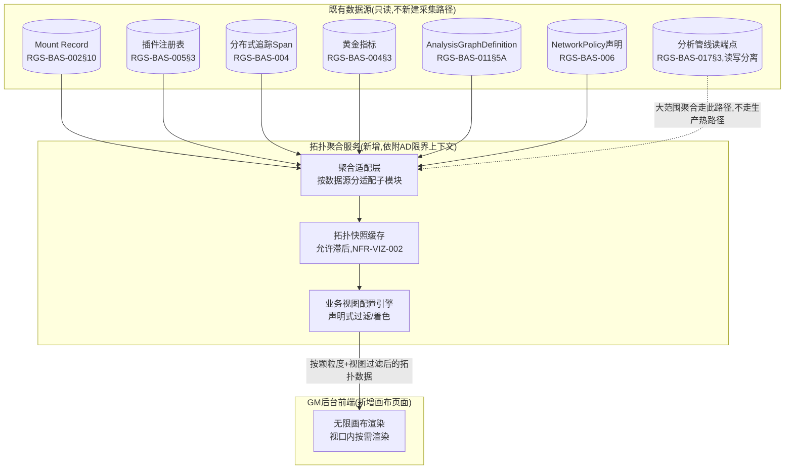

# 基本设计书（基本設計書 / Basic Design Document）

**GM后台拓扑可视化——无限画布 GM Console Topology Visualization: Infinite Canvas**

| 项目 | 内容 |
|---|---|
| 文档编号 | RGS-BAS-021 |
| 版本 | 0.1 |
| 父文档 | RGS-REQ-024 需求定义书（ARC-039） |
| 制定日 | 2026-08-16 |
| 最终更新日 | 2026-08-16 |
| 制定者 | 架构师 |
| 保密级别 | 内部限定（Internal Use Only） |
| 适用许可 | Apache-2.0（本仓库） |

---

## 修订历史（改訂履歴 / Revision History）

| 版本 | 修订日 | 修订者 | 审批者 | 修订内容 | 影响需求ID |
|---|---|---|---|---|---|
| 0.1 | 2026-08-16 | 架构师 | — | 初版制定。将RGS-REQ-024§9 ARC-039展开为拓扑聚合服务组件设计、三级颗粒度数据映射、LangGraph可视化设计、业务视图声明式配置、画布前端渲染要点 | 全部 |

## 审批栏（承認欄 / Approval）

| 角色 | 姓名 | 审批日 | 备注 |
|---|---|---|---|
| 制定（起草） | 架构师 | 2026-08-16 | — |
| 评审（技术） | | | 拓扑聚合服务的查询模式是否切实不触达生产事务路径 |
| 审批（负责人） | | | 本文档的基准化 |

---

## 目录

1. [前言](#1-前言)
2. [整体架构](#2-整体架构)
3. [三级颗粒度的数据映射](#3-三级颗粒度的数据映射)
4. [数据流/控制流边的构造](#4-数据流控制流边的构造)
5. [LangGraph可视化设计](#5-langgraph可视化设计)
6. [业务视图的声明式配置](#6-业务视图的声明式配置)
7. [画布前端设计要点](#7-画布前端设计要点)
8. [标准化检查清单](#8-标准化检查清单)
9. [追溯性](#9-追溯性)

---

# 1. 前言

本文档细化RGS-REQ-024定义的ARC-039。拓扑聚合服务**依附**既有GM后台（AD限界上下文）运行，**不新建**独立限界上下文；全部数据经既有只读路径聚合，不新增采集面。

---

# 2. 整体架构

## 2.1 组件图

## 2.2 查询模式（ARC-039①②落地）

| 项目 | 内容 |
|---|---|
| 聚合适配层的只读性 | `COLLECT`的每个数据源子模块**仅**具备对应数据源的只读查询权限，**不具备**任何写权限（同RGS-BAS-011§4.1智能层订阅权限设计的同类模式） |
| 读优化路径 | 大范围/跨App的拓扑聚合查询**必须**优先走RGS-BAS-017§3既有分析管线读端点，**不得**直接查询各限界上下文的生产事务数据库；仅当画布下钻至单个具体节点的详情（低频、小范围）时，**可以**直接查询对应只读副本 |
| 快照缓存 | `CACHE`持有近期拓扑快照，画布默认渲染缓存内容，**不得**每次用户平移/缩放都触发新的聚合查询（避免高频交互放大后端负载，NFR-VIZ-003） |

---

# 3. 三级颗粒度的数据映射

| 颗粒度 | 节点数据源 | 边数据源 | 下钻目标 |
|---|---|---|---|
| App级 | Mount Record（RGS-BAS-002§10，节点＝限界上下文/Atomic App） | 追踪Span聚合出的App间调用关系＋事件基础设施的发布/订阅关系（ARC-010 Topic归属） | 选中某App节点 → 插件级（若该App有插件）或直接方法级 |
| 插件级 | 插件注册表（RGS-BAS-005§3，节点＝插件实例） | 插件与其依附App的归属边；插件间依赖（若插件注册表登记此关系） | 选中某插件节点 → 该插件相关方法的方法级 |
| 方法级 | 分布式追踪Span（RGS-BAS-004，节点＝具体RPC方法/函数） | Span的父子调用关系（控制流）；Outbox/事件消费关系（数据流，跨Span关联依`partition_key`/`trace_id`同RGS-BAS-004既定字段规范） | 无更细颗粒度，画布展示调用链详情（可复用既有Trace详情页组件） |

> **颗粒度切换的视角保持**（FR-VIZ-003落地）：下钻操作携带"来源节点"上下文，`CANVAS`渲染新颗粒度数据时以来源节点的画布坐标为锚点做平滑过渡动画，而非重新布局整个画布。

---

# 4. 数据流/控制流边的构造

## 4.1 边的分类与视觉规范

| 边类型 | 判定依据 | 视觉样式（示例，详细设计确定具体色值） |
|---|---|---|
| 控制流（同步） | 追踪Span的父子关系（gRPC同步调用） | 实线箭头 |
| 数据流（异步） | Outbox分发/事件订阅关系（ARC-009/010） | 虚线箭头 |
| LangGraph建议提交 | `Recommendation`提交至`AdminService`的调用（RGS-BAS-011§6.2） | 特殊样式，**必须**叠加"经过闸门"标注（FR-VIZ-012） |

## 4.2 动态状态叠加（FR-VIZ-013/014落地）

边的粗细/高亮**必须**由聚合服务周期性（复用NFR-VIZ-002既定滞后阈值）从RGS-BAS-004黄金指标（如QPS、错误率、p99延迟）计算得出，**不得**由前端画布直接连接指标系统做逐请求订阅。异常判定复用既有告警阈值定义（RGS-BAS-003§6），画布**不得**另定一套阈值——若画布判定的"异常"与既有告警系统不一致，会产生"画布说正常但已经在告警"的信任问题。

---

# 5. LangGraph可视化设计

## 5.1 节点/边到画布元素的映射

| RGS-BAS-011§5A概念 | 画布呈现 |
|---|---|
| `AnalysisGraphDefinition`（`status=生效`） | 一个可展开的子图容器节点，标注`feature_domain`（复用§5A.3初始功能场景目录） |
| `graph_spec_ref`内的节点/边 | 展开容器后呈现的内部节点/边（分析步骤/条件转移，同RGS-BAS-011§5"图的构成"） |
| 确定性分级 | 节点着色区分L4（智能层内部）与L0/L1（AdminService侧），**不同**颜色域之间的边即为闸门位置 |
| 闸门（RGS-BAS-011§7A.2三重闸门） | 显式的"闸门"图标节点插入在L4→L0/L1的边中间，**不得**省略为一条直连的边（否则误导性呈现"智能层直接连接业务节点"，违反FR-VIZ-012） |

## 5.2 版本与新鲜度标注（RSK-VIZ-002落地）

画布呈现的LangGraph视图**必须**在界面上显式标注其读取的`AnalysisGraphDefinition.version`与`CACHE`快照的生成时间，供安全评审人员判断当前所见是否为最新生效版本（同RGS-BAS-011§5A.4可核对性设计在呈现层的延伸——可核对性不仅是后端定期任务的事，画布作为人工审查的入口也须让"数据新鲜度"可见）。

---

# 6. 业务视图的声明式配置

## 6.1 视图配置结构（FR-VIZ-020〜022落地）

`ViewPreset`（配置，复用ARC-016热更新思想，与画布渲染代码分离）：

| 字段 | 说明 |
|---|---|
| `view_id` | 视图标识 |
| `display_name` | 展示名称（如"架构总览视图"） |
| `default_granularity` | 打开该视图时默认颗粒度 |
| `node_filter` | 节点过滤条件（如仅`feature_domain=NEURO`） |
| `edge_filter` | 边过滤条件（如仅控制流/仅NetworkPolicy允许的边） |
| `color_scheme` | 着色规则（如按错误率分级着色、按`feature_domain`着色） |
| `default_visible_roles` | 默认可见的RBAC角色（NFR-VIZ-005，复用RGS-BAS-003§8角色矩阵） |

## 6.2 初始视图目录（FR-VIZ-020落地）

| `view_id` | 面向角色 | `node_filter`/`edge_filter`要点 |
|---|---|---|
| `arch_overview` | 架构师 | App级为主，边含全部控制流+数据流，突出ARC-018挂载边界 |
| `ops_health` | SRE | 叠加§4.2异常高亮，默认聚焦近期告警涉及的节点 |
| `security_boundary` | 安全负责人 | 仅NetworkPolicy允许的边为默认可见，追踪数据中出现的非允许路径高亮为异常（复用RGS-BAS-006既有策略数据） |
| `economy_flow` | 经济/数值策划 | 边过滤为EC限界上下文相关的数据流 |
| `neuro_governance` | 智能层负责人／安全负责人 | 聚焦§5 LangGraph可视化 |

新增视图**仅**需追加`ViewPreset`配置条目，**不得**要求修改`CANVAS`渲染代码（NFR-VIZ-004）。

---

# 7. 画布前端设计要点

| 设计点 | 内容 |
|---|---|
| 渲染技术选型 | 须为OSI认可开源许可的开源图可视化库（TBD-VIZ-001，依CON-001评审，纳入附件D§4 OSS许可盘点表） |
| 视口内按需渲染 | "无限画布"体验通过视口裁剪+虚拟化渲染实现（仅渲染当前可见区域节点），**不要求**一次性加载全部拓扑数据到前端 |
| 节点数量过多的应对 | App级颗粒度节点数随系统增长可能较多，留待详细设计阶段确定自动分组/聚类交互（TBD-VIZ-002），本文档不预先约定具体聚类算法 |
| 搜索与定位 | 前端维护节点名称索引（App名/插件名/方法名/LangGraph节点名），支持FR-VIZ-005搜索跳转 |

---

# 8. 标准化检查清单

## 8.1 上线前检查清单

- [ ] 三级颗粒度切换验证：数据与Mount Record/插件注册表/追踪数据源一致，下钻视角平滑过渡
- [ ] LangGraph可视化验证：闸门位置显式标注，版本与数据新鲜度可见
- [ ] 至少5种初始业务视图（§6.2）验证节点/边过滤与着色符合定义
- [ ] 性能隔离验证：画布高频交互期间生产路径与既有运维查询延迟无劣化
- [ ] 渲染库许可核实（TBD-VIZ-001）已纳入附件D§4 OSS许可盘点

## 8.2 代码评审检查清单

- [ ] 聚合适配层未出现对生产事务数据库的直接查询（大范围场景），仅节点详情查询可直连只读副本
- [ ] 新增业务视图未修改画布渲染核心代码，仅新增`ViewPreset`配置

---

# 9. 追溯性

| 需求ID | 本设计书章节 |
|---|---|
| ARC-039、FR-VIZ-001〜005 | §2、§3 |
| FR-VIZ-010〜014 | §4、§5 |
| FR-VIZ-020〜022 | §6 |
| NFR-VIZ-001〜005 | §2.2、§7 |
| AC-VIZ-001〜004 | §8.1 |
| TBD-VIZ-001〜002、RSK-VIZ-001〜002 | §7、§8.1、§5.2 |

---

> 本文档与RGS-REQ-024（GM后台拓扑可视化——无限画布 需求定义书）配套使用。
