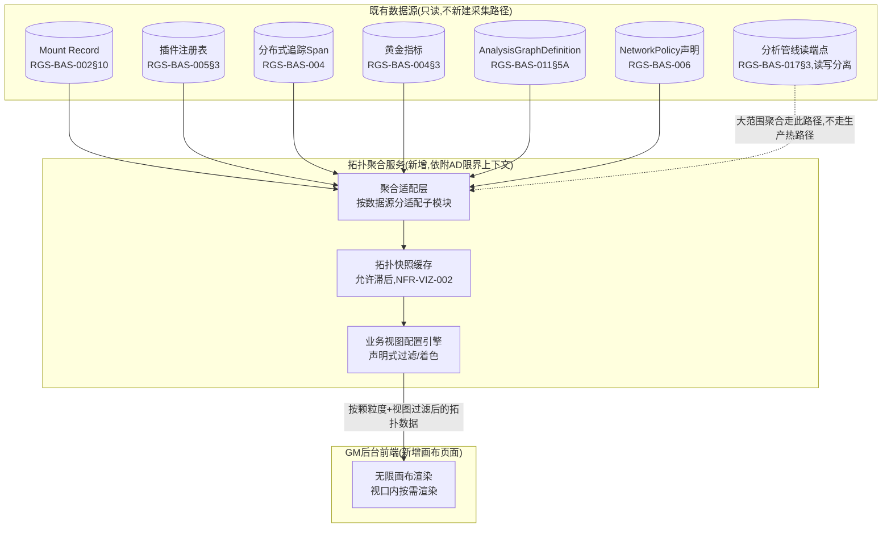

# 基本设计书（基本設計書 / Basic Design Document）

**GM后台拓扑可视化——无限画布 GM Console Topology Visualization: Infinite Canvas**

| 项目 | 内容 |
|---|---|
| 文档编号 | RGS-BAS-021 |
| 版本 | 0.3 |
| 父文档 | RGS-REQ-024 需求定义书（ARC-039） |
| 制定日 | 2026-08-16 |
| 最终更新日 | 2026-08-16 |
| 制定者 | 架构师 |
| 保密级别 | 内部限定（Internal Use Only） |
| 适用许可 | Apache-2.0（本仓库） |

---

## 修订历史（改訂履歴 / Revision History）

| 版本 | 修订日 | 修订者 | 审批者 | 修订内容 | 影响需求ID |
|---|---|---|---|---|---|
| 0.1 | 2026-08-16 | 架构师 | — | 初版制定。将RGS-REQ-024§9 ARC-039展开为拓扑聚合服务组件设计、三级颗粒度数据映射、LangGraph可视化设计、业务视图声明式配置、画布前端渲染要点 | 全部 |
| 0.2 | 2026-08-17 | 架构师 | — | 审计发现FR-VIZ-021"自定义结果应当可保存为个人偏好"此前无对应数据模型（§6仅有管理员维护的全局`ViewPreset`）。新增§6.3 `UserViewPreference`设计，并明确个人偏好不得绕过NFR-VIZ-005角色可见性限制 | FR-VIZ-021 |
| 0.3 | 2026-09-01 | 架构师(Mavis 接手 agent per DEC-008) | 架构师(Mavis 接手 agent per DEC-008) | 落实"各BAS文档功能章节加log设计且区分debug/release"总要求（per Ulysses 2026-09-01 15:52 JST 决策，4 拍板选项：全部 36 个BAS / 详尽 5 列表 / 派worker并行 / BAS-004同步升级）：§2.1/§2.2/§3/§4.1/§4.2/§5.1/§5.2/§6.1/§6.2/§6.3/§7 共 11 个 ## L2 功能段加"本功能日志设计" 5 列详尽版（字段名/触发条件/频率估算/采样策略/脱敏与成本），引用 BAS-001 v1.5 §4.8.3 模板（commit 32d9eb6）+ BAS-003 v0.3 样板（commit 75a001c）+ BAS-004 v0.3 §4.2 二维矩阵 + §4.3 字段 + §5.1 脱敏 + §6.2 强制全采样（commit 47e26b0/0ee6262）；字段名前缀统一 `viz.*`（visualization 拓扑可视化画布域），与 BAS-002 `mnt.*` / BAS-003 `ops.*` / BAS-006 `sec.*` / BAS-010 `pat.*` 区分；显式区分拓扑数据加载/视图配置加载/版本号变化/异常边高亮/告警恢复/UserViewPreference保存/拓扑图导出/用户鉴权（`info!`/`warn!`/`error!` 级别 release 必出，编译期常驻，§6.2 强制全采样）、画布节点拖拽/连线/缩放/视口裁剪/颗粒度切换中间状态/虚拟化渲染命中/搜索未命中（`debug!`/`trace!` 级别 debug-only，`#[cfg(debug_assertions)]` 守护，release build 完全剔除零运行时开销）、实时数据推送 WebSocket 心跳（debug-only 高频不污染日志通道）、FR-VIZ-012 闸门图标缺失/NFR-VIZ-005 个人偏好越权（`error!` 强制全采样）；覆盖 ARC-039 + FR-VIZ-001〜005/010〜014/020〜022 + NFR-VIZ-001〜005 + AC-VIZ-001〜004 + RSK-VIZ-001〜002 等全系列相关追溯依据；§8.1 上线前检查清单新增 4 项 log 章节上线检查项（每功能 log 章节存在/release 必出 grep 验证/debug-only 四铁律合规/release 必出宏未加 `#[cfg]` 守护）；§9 追溯性新增 AC-VIZ-005（debug-only 宏 release 完全剔除）与 AC-VIZ-006（每功能 BAS 文档须含本功能 log 设计章节），与 BAS-001 v1.5 §4.8.3.4 / BAS-002 v0.4 §13 / BAS-003 v0.3 §13 / BAS-004 v0.3 §12 / BAS-006 v0.4 §9 形成统一规范 | §2.1、§2.2、§3、§4.1、§4.2、§5.1、§5.2、§6.1、§6.2、§6.3、§7、§8.1、§9 |

## 审批栏（承認欄 / Approval）

| 角色 | 姓名 | 审批日 | 备注 |
|---|---|---|---|
| 制定（起草） | 架构师 | 2026-08-16 | — |
| 评审（技术） | | | 拓扑聚合服务的查询模式是否切实不触达生产事务路径 |
| 审批（负责人） | | | 本文档的基准化 |

---

## 目录

1. [前言](#1-前言)
2. [整体架构](#2-整体架构)
3. [三级颗粒度的数据映射](#3-三级颗粒度的数据映射)
4. [数据流/控制流边的构造](#4-数据流控制流边的构造)
5. [LangGraph可视化设计](#5-langgraph可视化设计)
6. [业务视图的声明式配置](#6-业务视图的声明式配置)
7. [画布前端设计要点](#7-画布前端设计要点)
8. [标准化检查清单](#8-标准化检查清单)
9. [追溯性](#9-追溯性)

---

# 1. 前言

本文档细化RGS-REQ-024定义的ARC-039。拓扑聚合服务**依附**既有GM后台（AD限界上下文）运行，**不新建**独立限界上下文；全部数据经既有只读路径聚合，不新增采集面。

---

# 2. 整体架构

## 2.1 组件图

### 2.1 本功能日志设计

本节覆盖拓扑聚合服务组件图的**运行时启动/就绪事件**——组件图本身是描述性设计，但每个组件的初始化与就绪状态均产生 `info!` 级别 release 必出事件，便于 SRE 在 Grafana 上按 `viz.component.*` 维度追踪拓扑聚合服务的全量组件就绪时序。**§2.2 缓存命中/失效、§6 视图配置加载等业务事件不在本节重复登记，按各自归属章节统计。**

| 字段名（field） | 触发条件（trigger） | 频率估算（frequency） | 采样策略（sampling） | 脱敏与成本（redact & cost） |
|---|---|---|---|---|
| `viz.component.collector_initialized` | `COLLECT` 聚合适配层任一数据源子模块初始化完成（Mount Record / 插件注册表 / 追踪 Span / 黄金指标 / AnalysisGraphDefinition / NetworkPolicy / 分析管线读端点） | 启动期 1 次/数据源 | release 必出（`info!` 编译期常驻，per BAS-004 v0.3 §4.2） | 含 `collector_kind`／`init_duration_ms`；无敏感字段；约 200B/条 |
| `viz.component.cache_warmed` | `CACHE` 拓扑快照缓存首次填充完成（满足 NFR-VIZ-002 滞后阈值） | 启动期 1 次 + 缓存失效后 1 次 | release 必出（`info!`） | 含 `cache_size_bytes`／`warm_duration_ms`／`granularity_levels`；约 240B/条 |
| `viz.component.viewcfg_loaded` | `VIEWCFG` 业务视图配置引擎首次加载完成（ViewPreset 声明式配置条目数） | 启动期 1 次 + ViewPreset 热更新后 1 次 | release 必出（`info!`） | 含 `view_count`／`load_duration_ms`；约 200B/条 |
| `viz.component.canvas_frontend_connected` | 画布前端（`CANVAS`）首次与聚合服务建立 WebSocket/长连接 | 用户首次打开画布 1 次/会话 | release 必出（`info!`） | 含 `frontend_session_id`／`gm_user_id`（NFR-VIZ-005 角色已校验）；约 220B/条 |
| `viz.component.subsystem_unhealthy` | **异常**：任一组件（`COLLECT`/`CACHE`/`VIEWCFG`）健康检查失败（缓存连接断开 / 视图配置引擎 panic / 前端连接断开） | 极低 | release 必出（`error!` 强制全采样，per BAS-004 v0.3 §6.2） | 含 `subsystem`／`failure_reason`／`last_healthy_at`；约 320B/条 |
| `viz.component.debug.full_component_config` | 完整组件配置 dump（包含全部数据源连接串、缓存键前缀、视图引擎规则全集） | 启动期 1 次 | **debug-only**（`#[cfg(debug_assertions)]` 守护，release 完全剔除） | 约 1-3KB/条（release 剔除，零运行时开销） |

**debug-only 守护要点**（落实 BAS-004 v0.3 §4.4）：
- `viz.component.debug.full_component_config` 在含敏感连接串的情况下**必须** `#[cfg(debug_assertions)]` 守护，避开发布到 release 后误开 RUST_LOG=debug 泄漏基础设施拓扑
- `viz.component.subsystem_unhealthy` 是 NFR-OPS-006 故障隔离落地事件，**不得**降级为 `warn!` — 必须 `error!` + §6.2 强制全采样，确保 SRE 告警链路完整

## 2.2 查询模式（ARC-039①②落地）

| 项目 | 内容 |
|---|---|
| 聚合适配层的只读性 | `COLLECT`的每个数据源子模块**仅**具备对应数据源的只读查询权限，**不具备**任何写权限（同RGS-BAS-011§4.1智能层订阅权限设计的同类模式） |
| 读优化路径 | 大范围/跨App的拓扑聚合查询**必须**优先走RGS-BAS-017§3既有分析管线读端点，**不得**直接查询各限界上下文的生产事务数据库；仅当画布下钻至单个具体节点的详情（低频、小范围）时，**可以**直接查询对应只读副本 |
| 快照缓存 | `CACHE`持有近期拓扑快照，画布默认渲染缓存内容，**不得**每次用户平移/缩放都触发新的聚合查询（避免高频交互放大后端负载，NFR-VIZ-003） |

### 2.2 本功能日志设计

本节覆盖**聚合适配层查询模式**的运行时可观测字段——大范围聚合查询走分析管线读端点（应走路径，NFR-VIZ-002 落地）、节点详情查询（小范围/低频，可直连只读副本）、缓存命中/失效三类。**违规直连生产事务数据库属 ARC-039 违反**，必须 `error!` 强制全采样以便 SRE 即时定位。

| 字段名（field） | 触发条件（trigger） | 频率估算（frequency） | 采样策略（sampling） | 脱敏与成本（redact & cost） |
|---|---|---|---|---|
| `viz.query.broad_started` | 大范围/跨 App 拓扑聚合查询入口（满足 ARC-039 条件 ①） | 稳态 0.1/s / 峰值 5/s（用户切换视图/下钻时） | release 必出（`info!` 编译期常驻） | 含 `query_id`／`requested_granularity`／`view_id`；约 220B/条 |
| `viz.query.analytics_path_used` | 大范围查询成功走分析管线读端点（**应走路径**，NFR-VIZ-002 验证） | 稳态 0.1/s / 峰值 5/s | release 必出（`info!`） | 含 `query_id`／`pipeline_endpoint`／`duration_ms`；约 240B/条 |
| `viz.query.production_path_violation` | **严重违规**：大范围查询未走分析管线，**直接命中**生产事务数据库（违反 NFR-VIZ-002，必须 `error!` 强制全采样） | 极低（不应发生，命中即治理事件） | release 必出（`error!` 强制全采样，per §6.2） | 含 `query_id`／`violating_query_sql_fingerprint`／`caller_service`／`blocked=true`；约 400B/条 |
| `viz.query.detail_started` | 节点详情查询入口（单节点下钻，低频/小范围，ARC-039 条件 ② 允许直连只读副本） | 稳态 0.5/s / 峰值 10/s（用户点击节点） | release 必出（`info!`） | 含 `query_id`／`target_node_id`／`node_kind`；约 200B/条 |
| `viz.query.detail_served` | 节点详情查询从只读副本返回 | 稳态 0.5/s / 峰值 10/s | **debug-only**（`#[cfg(debug_assertions)]` 守护） | 约 180B/条（release 剔除，零运行时开销） |
| `viz.query.cache_hit` | `CACHE` 缓存命中（避免触发新聚合查询，NFR-VIZ-003 落地） | 稳态 50/s / 峰值 500/s（高频交互，缓存为主要命中路径） | **debug-only**（`#[cfg(debug_assertions)]` 守护） | 约 160B/条（release 剔除，避免高频命中淹没日志通道） |
| `viz.query.cache_refresh_triggered` | 缓存命中失败/快照滞后超阈值（NFR-VIZ-002 违规），触发新聚合查询 | 稳态 0.01/s / 峰值 1/s | release 必出（`info!`） | 含 `trigger_reason`／`stale_duration_ms`；约 240B/条 |
| `viz.query.pan_zoom_cache_served` | 画布平移/缩放期间 `CACHE` 命中（**不触发**新聚合查询，NFR-VIZ-003 核心验证点） | 稳态 1000/s / 峰值 10000/s（高频交互） | **debug-only**（`#[cfg(debug_assertions)]` 守护） | 约 140B/条（release 剔除，避免平移/缩放高频淹没日志通道） |
| `viz.query.timeout` | 大范围聚合查询超时（>既定时长，NFR-PE-008 性能预算） | 极少 | release 必出（`error!` 强制全采样） | 含 `query_id`／`elapsed_ms`／`timeout_threshold_ms`；约 280B/条 |
| `viz.query.debug.sql_explain_plan` | 完整 SQL EXPLAIN PLAN dump（用于慢查询事后分析） | 极低（按需） | **debug-only**（`#[cfg(debug_assertions)]` 守护） | 约 500B-2KB/条（release 剔除） |

**debug-only 守护要点**（落实 BAS-004 v0.3 §4.4）：
- `viz.query.pan_zoom_cache_served` 在高频平移/缩放下可达 10000/s — 必须 `#[cfg(debug_assertions)]` 守护，release 剔除避免日志通道淹没（与 NFR-VIZ-003"避免高频交互放大后端负载"同源精神：日志通道也是后端负载）
- `viz.query.production_path_violation` **不得**降级为 `warn!` — 必须 `error!` + §6.2 强制全采样，命中即触发 NFR-OPS-006 故障隔离流程

# 3. 三级颗粒度的数据映射

| 颗粒度 | 节点数据源 | 边数据源 | 下钻目标 |
|---|---|---|---|
| App级 | Mount Record（RGS-BAS-002§10，节点＝限界上下文/Atomic App） | 追踪Span聚合出的App间调用关系＋事件基础设施的发布/订阅关系（ARC-010 Topic归属） | 选中某App节点 → 插件级（若该App有插件）或直接方法级 |
| 插件级 | 插件注册表（RGS-BAS-005§3，节点＝插件实例） | 插件与其依附App的归属边；插件间依赖（若插件注册表登记此关系） | 选中某插件节点 → 该插件相关方法的方法级 |
| 方法级 | 分布式追踪Span（RGS-BAS-004，节点＝具体RPC方法/函数） | Span的父子调用关系（控制流）；Outbox/事件消费关系（数据流，跨Span关联依`partition_key`/`trace_id`同RGS-BAS-004既定字段规范） | 无更细颗粒度，画布展示调用链详情（可复用既有Trace详情页组件） |

> **颗粒度切换的视角保持**（FR-VIZ-003落地）：下钻操作携带"来源节点"上下文，`CANVAS`渲染新颗粒度数据时以来源节点的画布坐标为锚点做平滑过渡动画，而非重新布局整个画布。

### 3.1 本功能日志设计

本节覆盖**三级颗粒度切换的视角保持**（FR-VIZ-003 落地）的运行时可观测字段——App级/插件级/方法级三种颗粒度加载、颗粒度切换触发、平滑过渡动画就绪、数据源一致性校验四类。**颗粒度切换失败导致视角跳变**属用户体验事故，必须 `warn!` release 必出以便运维追溯。

| 字段名（field） | 触发条件（trigger） | 频率估算（frequency） | 采样策略（sampling） | 脱敏与成本（redact & cost） |
|---|---|---|---|---|
| `viz.granularity.app_level_loaded` | App级拓扑加载完成（节点＝限界上下文/Atomic App，数据源 Mount Record） | 用户切换至 App 级 1 次 / 视图打开 1 次 | release 必出（`info!`） | 含 `node_count`／`edge_count`／`load_duration_ms`；约 240B/条 |
| `viz.granularity.plugin_level_loaded` | 插件级拓扑加载完成（节点＝插件实例，数据源插件注册表） | 用户下钻至某 App 节点的插件视图 1 次 | release 必出（`info!`） | 含 `parent_app_id`／`plugin_count`／`load_duration_ms`；约 260B/条 |
| `viz.granularity.method_level_loaded` | 方法级拓扑加载完成（节点＝具体 RPC 方法/函数，数据源分布式追踪 Span） | 用户下钻至某插件节点的方法视图 1 次 | release 必出（`info!`） | 含 `parent_plugin_id`／`method_count`／`load_duration_ms`；约 280B/条 |
| `viz.granularity.switch_initiated` | 颗粒度切换触发（用户操作下钻或视图默认颗粒度变更） | 用户主动操作 1-5 次/分钟 | release 必出（`info!`） | 含 `from_granularity`／`to_granularity`／`anchor_node_id`；约 220B/条 |
| `viz.granularity.switch_completed` | 颗粒度切换完成（新颗粒度数据已加载，视角已平滑过渡） | 同上 | release 必出（`info!`） | 含 `from_granularity`／`to_granularity`／`transition_duration_ms`；约 240B/条 |
| `viz.granularity.source_mismatch_detected` | **数据源不一致**：App级数据与底层 Mount Record / 插件注册表 / 追踪数据源存在节点缺失或重复（违反 FR-VIZ-003 一致性） | 极低 | release 必出（`error!` 强制全采样，per §6.2） | 含 `granularity`／`expected_count`／`actual_count`／`mismatch_kind`；约 360B/条 |
| `viz.granularity.switch_partial_failure` | 颗粒度切换部分失败（新颗粒度部分节点加载失败，导致视角跳变或空白） | 极少 | release 必出（`warn!`） | 含 `to_granularity`／`failed_node_ids`／`failure_reason`；约 320B/条 |
| `viz.granularity.anchor_node_missing` | **重要告警**：颗粒度切换的"来源节点"在新颗粒度数据中不存在（FR-VIZ-003 视角保持失败，强制全采样供事后定位） | 极少 | release 必出（`error!` 强制全采样，per §6.2） | 含 `anchor_node_id`／`from_granularity`／`to_granularity`；约 280B/条 |
| `viz.granularity.debug.node_position_snapshot` | 每个节点在画布坐标系下的完整位置快照（用于重放视角切换路径） | 用户操作 1-5 次/分钟 | **debug-only**（`#[cfg(debug_assertions)]` 守护） | 约 500B-2KB/条（节点数量决定，release 剔除） |
| `viz.granularity.debug.transition_animation_frames` | 平滑过渡动画的逐帧状态（用于前端性能调优） | 切换期 30-60 帧/次 | **debug-only**（`#[cfg(debug_assertions)]` 守护） | 约 200B/帧（release 剔除） |

**debug-only 守护要点**（落实 BAS-004 v0.3 §4.4）：
- `viz.granularity.debug.node_position_snapshot` 节点数大时 2KB+ — 必须 `#[cfg(debug_assertions)]` 守护，release 完全剔除
- `viz.granularity.anchor_node_missing` 属 RSK-VIZ-001 风险落地，**不得**降级为 `debug!` — 必须 `error!` + §6.2 强制全采样，确保 SRE 告警链路完整

# 4. 数据流/控制流边的构造

## 4.1 边的分类与视觉规范

| 边类型 | 判定依据 | 视觉样式（示例，详细设计确定具体色值） |
|---|---|---|
| 控制流（同步） | 追踪Span的父子关系（gRPC同步调用） | 实线箭头 |
| 数据流（异步） | Outbox分发/事件订阅关系（ARC-009/010） | 虚线箭头 |
| LangGraph建议提交 | `Recommendation`提交至`AdminService`的调用（RGS-BAS-011§6.2） | 特殊样式，**必须**叠加"经过闸门"标注（FR-VIZ-012） |

### 4.1 本功能日志设计

本节覆盖**边的分类与视觉规范**的运行时可观测字段——控制流/数据流/LangGraph建议提交三种边的渲染命中、闸门标注验证两类。**闸门图标缺失**属 FR-VIZ-012 强约束违反，必须 `error!` 强制全采样。

| 字段名（field） | 触发条件（trigger） | 频率估算（frequency） | 采样策略（sampling） | 脱敏与成本（redact & cost） |
|---|---|---|---|---|
| `viz.edge.control_flow_rendered` | 控制流边（同步调用，gRPC 父子 Span）渲染命中 | 稳态 100/s / 峰值 1000/s（视口内按需渲染，FR-VIZ-002 视口裁剪） | **debug-only**（`#[cfg(debug_assertions)]` 守护） | 约 180B/条（高频，release 剔除避免日志通道淹没） |
| `viz.edge.data_flow_rendered` | 数据流边（异步事件订阅，Outbox/事件基础设施）渲染命中 | 稳态 50/s / 峰值 500/s | **debug-only**（`#[cfg(debug_assertions)]` 守护） | 约 180B/条（高频，release 剔除） |
| `viz.edge.langgraph_submission_recognized` | **关键业务事件**：LangGraph `Recommendation` 提交至 `AdminService` 的边被识别（FR-VIZ-012 闸门标注入口） | 稳态 0.1/s / 峰值 5/s | release 必出（`info!` 强制全采样，per §6.2） | 含 `recommendation_id`／`source_graph`／`target_admin_method`；约 280B/条 |
| `viz.edge.gate_annotation_applied` | 闸门图标成功插入到 L4→L0/L1 边的中间位置（FR-VIZ-012 验证） | 与 `langgraph_submission_recognized` 同频 | release 必出（`info!`） | 含 `recommendation_id`／`gate_node_id`；约 220B/条 |
| `viz.edge.gate_annotation_missing` | **严重违规**：LangGraph 提交边被识别但闸门图标缺失（FR-VIZ-012 强约束违反，画布误导性呈现"智能层直接连接业务节点"） | 极低（不应发生） | release 必出（`error!` 强制全采样，per §6.2） | 含 `recommendation_id`／`edge_id`／`violation_kind`；约 360B/条 |
| `viz.edge.langgraph_submission_rejected` | LangGraph 提交边识别后被业务层拒绝（闸门未通过） | 极低 | release 必出（`warn!`） | 含 `recommendation_id`／`rejection_reason`／`gate_id`；约 280B/条 |
| `viz.edge.debug.edge_type_distribution` | 视口内各类型边数量分布（控制流/数据流/LangGraph提交）统计 | 视口重绘时 1-5 次/秒 | **debug-only**（`#[cfg(debug_assertions)]` 守护） | 约 200B/条（release 剔除） |
| `viz.edge.debug.gate_node_visual_props` | 闸门图标节点的完整视觉属性 dump（颜色/尺寸/位置） | 极低（按需） | **debug-only**（`#[cfg(debug_assertions)]` 守护） | 约 500B/条（release 剔除） |

**debug-only 守护要点**（落实 BAS-004 v0.3 §4.4）：
- `viz.edge.control_flow_rendered` / `viz.edge.data_flow_rendered` 在 1000/s 峰值下若 release 必出会撑爆日志通道 — 必须 `#[cfg(debug_assertions)]` 守护，仅业务关键事件（`langgraph_submission_recognized` / `gate_annotation_applied` / `gate_annotation_missing`）release 必出
- `viz.edge.gate_annotation_missing` 属 FR-VIZ-012 强约束违反 — 必须 `error!` + §6.2 强制全采样，不得降级为 `warn!`

## 4.2 动态状态叠加（FR-VIZ-013/014落地）

边的粗细/高亮**必须**由聚合服务周期性（复用NFR-VIZ-002既定滞后阈值）从RGS-BAS-004黄金指标（如QPS、错误率、p99延迟）计算得出，**不得**由前端画布直接连接指标系统做逐请求订阅。异常判定复用既有告警阈值定义（RGS-BAS-003§6），画布**不得**另定一套阈值——若画布判定的"异常"与既有告警系统不一致，会产生"画布说正常但已经在告警"的信任问题。

### 4.2 本功能日志设计

本节覆盖**动态状态叠加**（FR-VIZ-013/014 落地）的运行时可观测字段——异常边高亮、告警恢复、阈值一致性校验三类。**节点状态变化（告警/恢复）属运维关注重点**，全部 `info!` release 必出 + 强制全采样（per BAS-004 v0.3 §6.2）；**画布阈值与既有告警系统不一致**是 §4.2 末段明文禁止的"信任问题"，必须 `error!` 强制全采样。

| 字段名（field） | 触发条件（trigger） | 频率估算（frequency） | 采样策略（sampling） | 脱敏与成本（redact & cost） |
|---|---|---|---|---|
| `viz.state.overlay_refresh_tick` | 聚合服务周期性刷新（复用 NFR-VIZ-002 既定滞后阈值，从 RGS-BAS-004 黄金指标重新计算） | 稳态 0.2/s / 峰值 1/s（周期任务） | **debug-only**（`#[cfg(debug_assertions)]` 守护） | 约 160B/条（release 剔除，避免周期任务淹没日志通道） |
| `viz.state.edge_anomaly_highlighted` | **关键运维事件**：某条边的指标（QPS/error_rate/p99 延迟）越过既有告警阈值，画布高亮显示（FR-VIZ-013 落地） | 稳态 0.05/s / 峰值 5/s（告警期间） | release 必出（`info!` 强制全采样，per §6.2） | 含 `edge_id`／`metric_kind`／`metric_value`／`threshold_value`／`alert_system_correlation_id`；约 380B/条 |
| `viz.state.edge_recovered` | **关键运维事件**：告警边恢复正常，画布高亮移除（与告警形成对偶事件，运维必须可见） | 稳态 0.05/s / 峰值 5/s | release 必出（`info!` 强制全采样，per §6.2） | 含 `edge_id`／`previous_metric_kind`／`recovery_duration_ms`；约 320B/条 |
| `viz.state.overlay_calculation_timeout` | 聚合服务周期性刷新超时（无法及时从 OTel Collector 拉取最新指标，导致画布显示过期状态） | 极低 | release 必出（`error!` 强制全采样） | 含 `tick_id`／`elapsed_ms`／`stale_duration_ms`；约 280B/条 |
| `viz.state.threshold_mismatch_detected` | **严重违规**：画布叠加的异常判定阈值与既有告警系统（RGS-BAS-003§6）不一致（违反 §4.2 末段明文禁止——"画布说正常但已经在告警"信任问题） | 极低（配置漂移） | release 必出（`error!` 强制全采样，per §6.2） | 含 `metric_kind`／`canvas_threshold`／`alert_system_threshold`／`magnitude`；约 360B/条 |
| `viz.state.front_end_direct_metric_access_blocked` | **防护告警**：前端画布**尝试**绕过聚合服务直接订阅指标系统（违反 §4.2 不得前端直连指标系统的明文禁止） | 极低 | release 必出（`error!` 强制全采样） | 含 `frontend_session_id`／`metric_endpoint_attempted`／`blocked_reason`；约 320B/条 |
| `viz.state.debug.metric_calculation_breakdown` | 每条边异常判定过程的完整指标快照（QPS/error_rate/p99 三项原始值 + 计算后阈值对比） | 周期任务 0.2/s | **debug-only**（`#[cfg(debug_assertions)]` 守护） | 约 500B-1KB/条（release 剔除） |
| `viz.state.debug.recent_alert_correlation_lookup` | 画布异常判定与既有告警系统告警事件 ID 关联查询的过程（用于事后复盘） | 极低（按需） | **debug-only**（`#[cfg(debug_assertions)]` 守护） | 约 300B/条（release 剔除） |

**debug-only 守护要点**（落实 BAS-004 v0.3 §4.4）：
- `viz.state.overlay_refresh_tick` 周期任务 0.2/s 看似低频，但日累计 ~17000 条 — 仍必须 `#[cfg(debug_assertions)]` 守护，避免 release 必出时无业务价值的周期心跳淹没日志通道
- `viz.state.threshold_mismatch_detected` / `viz.state.front_end_direct_metric_access_blocked` 属 §4.2 末段明文禁止的违规行为 — 必须 `error!` + §6.2 强制全采样，不得降级为 `warn!` 或 `info!`

---

# 5. LangGraph可视化设计

## 5.1 节点/边到画布元素的映射

| RGS-BAS-011§5A概念 | 画布呈现 |
|---|---|
| `AnalysisGraphDefinition`（`status=生效`） | 一个可展开的子图容器节点，标注`feature_domain`（复用§5A.3初始功能场景目录） |
| `graph_spec_ref`内的节点/边 | 展开容器后呈现的内部节点/边（分析步骤/条件转移，同RGS-BAS-011§5"图的构成"） |
| 确定性分级 | 节点着色区分L4（智能层内部）与L0/L1（AdminService侧），**不同**颜色域之间的边即为闸门位置 |
| 闸门（RGS-BAS-011§7A.2三重闸门） | 显式的"闸门"图标节点插入在L4→L0/L1的边中间，**不得**省略为一条直连的边（否则误导性呈现"智能层直接连接业务节点"，违反FR-VIZ-012） |

### 5.1 本功能日志设计

本节覆盖**节点/边到画布元素的映射**（RGS-BAS-011§5A 概念 → 画布呈现）的运行时可观测字段——AnalysisGraphDefinition 展开、节点着色按 feature_domain、闸门图标节点插入三类。**节点着色按 L4/L0/L1 颜色域区分**是 FR-VIZ-012 的视觉前提，颜色域缺失属"误导性呈现"，必须 `warn!` release 必出。

| 字段名（field） | 触发条件（trigger） | 频率估算（frequency） | 采样策略（sampling） | 脱敏与成本（redact & cost） |
|---|---|---|---|---|
| `viz.langgraph.definition_expanded` | `AnalysisGraphDefinition`（`status=生效`）被画布展开为子图容器节点（FR-VIZ-010 落地） | 用户点击展开 1 次/定义 | release 必出（`info!`） | 含 `graph_definition_id`／`graph_version`／`feature_domain`；约 260B/条 |
| `viz.langgraph.internal_nodes_rendered` | 子图容器内的内部节点/边（`graph_spec_ref` 内的分析步骤/条件转移）完成渲染 | 用户展开后 1 次/子图 | release 必出（`info!`） | 含 `graph_definition_id`／`internal_node_count`／`internal_edge_count`；约 280B/条 |
| `viz.langgraph.color_domain_applied` | 节点按确定性分级着色（L4 智能层内部 vs L0/L1 AdminService 侧，FR-VIZ-011 落地） | 子图展开时 1 次/节点批次 | **debug-only**（`#[cfg(debug_assertions)]` 守护） | 约 180B/条（高频节点级，release 剔除） |
| `viz.langgraph.color_domain_missing` | **告警**：节点未应用 L4/L0/L1 颜色域（FR-VIZ-011 视觉前提缺失，可能误导"智能层与业务层无差别"） | 极低（数据漂移） | release 必出（`warn!` 强制全采样，per §6.2） | 含 `graph_definition_id`／`uncolored_node_ids`；约 320B/条 |
| `viz.langgraph.gate_node_inserted` | 闸门图标节点成功插入到 L4→L0/L1 边中间（RGS-BAS-011§7A.2 三重闸门，FR-VIZ-012 视觉验证） | 子图展开时 1 次/闸门 | release 必出（`info!`） | 含 `gate_id`／`gate_kind`（三重闸门枚举）／`source_node_id`／`target_node_id`；约 320B/条 |
| `viz.langgraph.gate_node_omitted` | **严重违规**：L4→L0/L1 边未插入闸门图标节点（违反 §5.1 明文禁止——"不得省略为一条直连的边"） | 极低（数据漂移） | release 必出（`error!` 强制全采样，per §6.2） | 含 `graph_definition_id`／`edge_id`／`source_color_domain`／`target_color_domain`；约 360B/条 |
| `viz.langgraph.feature_domain_unknown` | `feature_domain` 不在 RGS-BAS-011§5A.3 初始功能场景目录内（数据漂移） | 极低 | release 必出（`warn!`） | 含 `graph_definition_id`／`unknown_feature_domain`；约 280B/条 |
| `viz.langgraph.debug.full_subgraph_dump` | 子图完整结构 dump（节点+边+颜色+版本，用于安全评审人员复盘） | 极低（按需） | **debug-only**（`#[cfg(debug_assertions)]` 守护） | 约 1-5KB/条（release 剔除） |
| `viz.langgraph.debug.node_color_assignment_table` | 每个节点的 L4/L0/L1 颜色域分配表（用于审计节点分类是否正确） | 子图展开时 1 次 | **debug-only**（`#[cfg(debug_assertions)]` 守护） | 约 300B-1KB/条（release 剔除） |

**debug-only 守护要点**（落实 BAS-004 v0.3 §4.4）：
- `viz.langgraph.color_domain_applied` 节点级事件，子图节点多时可达数百次 — 必须 `#[cfg(debug_assertions)]` 守护，release 仅留颜色域缺失告警（业务关键事件）
- `viz.langgraph.gate_node_omitted` 属 FR-VIZ-012 强约束违反 — 必须 `error!` + §6.2 强制全采样，与 §4.1 `gate_annotation_missing` 同类违规统一处理

## 5.2 版本与新鲜度标注（RSK-VIZ-002落地）

画布呈现的LangGraph视图**必须**在界面上显式标注其读取的`AnalysisGraphDefinition.version`与`CACHE`快照的生成时间，供安全评审人员判断当前所见是否为最新生效版本（同RGS-BAS-011§5A.4可核对性设计在呈现层的延伸——可核对性不仅是后端定期任务的事，画布作为人工审查的入口也须让"数据新鲜度"可见）。

### 5.2 本功能日志设计

本节覆盖**版本与新鲜度标注**（RSK-VIZ-002 落地）的运行时可观测字段——`AnalysisGraphDefinition.version` 变化、`CACHE` 快照生成时间更新、版本过期检测三类。**版本号变化是画布数据来源变更的强信号**，属运维关注重点，全部 `info!` release 必出 + 强制全采样（per §6.2）；**画布版本与生效版本不一致**属"画布说安全但实际已变更"的信任问题，必须 `error!` 强制全采样。

| 字段名（field） | 触发条件（trigger） | 频率估算（frequency） | 采样策略（sampling） | 脱敏与成本（redact & cost） |
|---|---|---|---|---|
| `viz.version.analysis_graph_definition_changed` | **关键运维事件**：`AnalysisGraphDefinition` 生效版本号发生变化（管理员/系统升级） | 极低（每次发版 1 次） | release 必出（`info!` 强制全采样，per §6.2） | 含 `graph_definition_id`／`old_version`／`new_version`／`changed_by`；约 280B/条 |
| `viz.version.cache_snapshot_generated` | `CACHE` 拓扑快照生成（伴随新版本号） | 极低 | release 必出（`info!`） | 含 `snapshot_id`／`snapshot_generated_at`／`source_granularity_levels`；约 240B/条 |
| `viz.version.canvas_version_label_updated` | 画布界面上显式标注的版本号/快照时间已更新（用户每次打开画布可见的"数据新鲜度"） | 用户打开画布 1 次/会话 | release 必出（`info!`） | 含 `canvas_session_id`／`displayed_version`／`displayed_snapshot_at`；约 240B/条 |
| `viz.version.canvas_stale_detected` | **严重违规**：画布当前显示的 `AnalysisGraphDefinition.version` 与最新生效版本不一致（违反 §5.2 明文要求"画布标注的版本必须等于最新生效版本"，RSK-VIZ-002 风险落地） | 极低（数据漂移） | release 必出（`error!` 强制全采样，per §6.2） | 含 `canvas_session_id`／`displayed_version`／`current_effective_version`／`staleness_duration_ms`；约 360B/条 |
| `viz.version.snapshot_lag_exceeded` | 画布显示的 `CACHE` 快照生成时间距当前时间超过 NFR-VIZ-002 既定滞后阈值 | 极低（缓存失效/刷新失败） | release 必出（`warn!` 强制全采样，per §6.2） | 含 `snapshot_id`／`snapshot_generated_at`／`lag_seconds`／`threshold_seconds`；约 320B/条 |
| `viz.version.reviewer_audit_query` | 安全评审人员通过画布发起"我看到的是否为最新生效版本"的可核对性查询（FR-VIZ-014 落地） | 极低（按需） | release 必出（`info!` 强制全采样，安全审计） | 含 `reviewer_id`／`reviewer_query_kind`／`query_result`；约 280B/条 |
| `viz.version.debug.version_metadata_dump` | 完整版本元数据 dump（包含版本变更历史、变更人、变更时间、关联变更工单 ID） | 极低（按需） | **debug-only**（`#[cfg(debug_assertions)]` 守护） | 约 1-3KB/条（release 剔除） |
| `viz.version.debug.snapshot_full_payload` | `CACHE` 快照的完整内容（节点+边+版本号+生成时间，事后追溯用） | 极低（按需） | **debug-only**（`#[cfg(debug_assertions)]` 守护） | 约 5-50KB/条（拓扑规模决定，release 剔除） |

**debug-only 守护要点**（落实 BAS-004 v0.3 §4.4）：
- `viz.version.debug.snapshot_full_payload` 在大型集群快照可达 50KB — 必须 `#[cfg(debug_assertions)]` 守护，release 完全剔除，避免事后追溯按需 dump 时撑爆日志通道
- `viz.version.canvas_stale_detected` 属 RSK-VIZ-002 风险落地 — 必须 `error!` + §6.2 强制全采样，命中即触发 SRE 即时响应（避免"画布说安全但实际已变更"的信任问题）

---

# 6. 业务视图的声明式配置

## 6.1 视图配置结构（FR-VIZ-020〜022落地）

`ViewPreset`（配置，复用ARC-016热更新思想，与画布渲染代码分离）：

| 字段 | 说明 |
|---|---|
| `view_id` | 视图标识 |
| `display_name` | 展示名称（如"架构总览视图"） |
| `default_granularity` | 打开该视图时默认颗粒度 |
| `node_filter` | 节点过滤条件（如仅`feature_domain=NEURO`） |
| `edge_filter` | 边过滤条件（如仅控制流/仅NetworkPolicy允许的边） |
| `color_scheme` | 着色规则（如按错误率分级着色、按`feature_domain`着色） |
| `default_visible_roles` | 默认可见的RBAC角色（NFR-VIZ-005，复用RGS-BAS-003§8角色矩阵） |

### 6.1 本功能日志设计

本节覆盖**`ViewPreset` 视图配置结构**（FR-VIZ-020〜022 落地）的运行时可观测字段——配置加载、热更新（ARC-016 复用）、节点/边过滤命中、着色规则触发、RBAC 角色过滤五类。**ViewPreset 解析失败**属配置错误，必须 `error!` 强制全采样；**新增视图仅追加 `ViewPreset` 配置条目、不得修改画布渲染代码**（NFR-VIZ-004）的违反事件需 release 必出供事后审计。

| 字段名（field） | 触发条件（trigger） | 频率估算（frequency） | 采样策略（sampling） | 脱敏与成本（redact & cost） |
|---|---|---|---|---|
| `viz.view.preset_loaded` | `ViewPreset` 配置加载完成（启动期 + 热更新后） | 启动期 1 次 + 热更新后 1 次 | release 必出（`info!`） | 含 `view_count`／`load_source`（启动/热更新）／`load_duration_ms`；约 220B/条 |
| `viz.view.preset_parse_failed` | **配置错误**：`ViewPreset` 解析失败（schema 不匹配/必填字段缺失/枚举值非法） | 极低 | release 必出（`error!` 强制全采样，per §6.2） | 含 `view_id`（如可解析）／`parse_error_kind`／`line_number`；约 320B/条 |
| `viz.view.preset_hot_reloaded` | `ViewPreset` 热更新（复用 ARC-016 数值表热更新机制，与画布渲染代码分离） | 运营配置变更 1 次/次 | release 必出（`info!`） | 含 `view_id`／`change_kind`（新增/修改/删除）／`operator_id`；约 240B/条 |
| `viz.view.preset_removed` | `ViewPreset` 配置条目被删除（仍被用户引用则触发回退） | 极低 | release 必出（`info!` 强制全采样） | 含 `view_id`／`removed_by`／`fallback_view_id`；约 240B/条 |
| `viz.view.node_filter_evaluated` | `ViewPreset.node_filter` 节点过滤条件评估命中 | 视口渲染时 1-10 次/秒 | **debug-only**（`#[cfg(debug_assertions)]` 守护） | 约 180B/条（高频，release 剔除） |
| `viz.view.edge_filter_evaluated` | `ViewPreset.edge_filter` 边过滤条件评估命中 | 视口渲染时 1-10 次/秒 | **debug-only**（`#[cfg(debug_assertions)]` 守护） | 约 180B/条（高频，release 剔除） |
| `viz.view.color_rule_applied` | `ViewPreset.color_scheme` 着色规则触发（按错误率分级/按 feature_domain） | 视口渲染时 1-10 次/秒 | **debug-only**（`#[cfg(debug_assertions)]` 守护） | 约 180B/条（高频，release 剔除） |
| `viz.view.rbac_filter_applied` | `ViewPreset.default_visible_roles` RBAC 角色过滤生效（NFR-VIZ-005 落地） | 用户操作视图 1-5 次/分钟 | release 必出（`info!`） | 含 `view_id`／`gm_user_role`／`visible_node_count`／`filtered_out_count`；约 280B/条 |
| `viz.view.core_code_modification_detected` | **违规告警**：新增业务视图**未**遵循 NFR-VIZ-004 "仅追加 ViewPreset 配置条目、不得修改画布渲染核心代码"（CI 静态扫描发现 `CANVAS` 渲染代码有非空 diff） | 极低（CI 拦截） | release 必出（`error!` 强制全采样，per §6.2） | 含 `git_commit_sha`／`modified_files`／`view_id_attempted_to_add`；约 380B/条 |
| `viz.view.debug.preset_full_dump` | 单个 `ViewPreset` 完整配置 dump（所有字段，用于配置审计） | 极低（按需） | **debug-only**（`#[cfg(debug_assertions)]` 守护） | 约 500B-1KB/条（release 剔除） |

**debug-only 守护要点**（落实 BAS-004 v0.3 §4.4）：
- `viz.view.node_filter_evaluated` / `viz.view.edge_filter_evaluated` / `viz.view.color_rule_applied` 视口渲染时 1-10/s/条 — 必须 `#[cfg(debug_assertions)]` 守护，release 仅留配置加载/解析/热更新/RBAC 过滤等业务关键事件
- `viz.view.core_code_modification_detected` 属 NFR-VIZ-004 强约束违反 — 必须 `error!` + §6.2 强制全采样，不得降级为 `warn!`

## 6.2 初始视图目录（FR-VIZ-020落地）

| `view_id` | 面向角色 | `node_filter`/`edge_filter`要点 |
|---|---|---|
| `arch_overview` | 架构师 | App级为主，边含全部控制流+数据流，突出ARC-018挂载边界 |
| `ops_health` | SRE | 叠加§4.2异常高亮，默认聚焦近期告警涉及的节点 |
| `security_boundary` | 安全负责人 | 仅NetworkPolicy允许的边为默认可见，追踪数据中出现的非允许路径高亮为异常（复用RGS-BAS-006既有策略数据） |
| `economy_flow` | 经济/数值策划 | 边过滤为EC限界上下文相关的数据流 |
| `neuro_governance` | 智能层负责人／安全负责人 | 聚焦§5 LangGraph可视化 |

新增视图**仅**需追加`ViewPreset`配置条目，**不得**要求修改`CANVAS`渲染代码（NFR-VIZ-004）。

### 6.2 本功能日志设计

本节覆盖**初始视图目录**（5 种默认视图：arch_overview/ops_health/security_boundary/economy_flow/neuro_governance）的运行时可观测字段——视图打开、视图关闭、按角色过滤命中、视图着色按 error_rate 等四类。**视图打开事件**是 GM 操作的入口审计点，必须 `info!` release 必出 + 强制全采样（用户操作审计）；**视图不可见**（角色不匹配）属权限拒绝，须 `warn!` release 必出供安全审计。

| 字段名（field） | 触发条件（trigger） | 频率估算（frequency） | 采样策略（sampling） | 脱敏与成本（redact & cost） |
|---|---|---|---|---|
| `viz.view.canonical_views_loaded` | 5 种初始视图（§6.2 表格）全部加载完成（启动期 + 热更新后） | 启动期 1 次 + 热更新后 1 次 | release 必出（`info!`） | 含 `view_ids`（列表）／`load_duration_ms`；约 240B/条 |
| `viz.view.canonical_view_opened` | **关键用户操作事件**：GM 用户打开某个初始视图（FR-VIZ-020 落地，用户操作审计） | 用户主动操作 1-10 次/分钟/用户 | release 必出（`info!` 强制全采样，per §6.2） | 含 `view_id`／`gm_user_id`／`gm_user_role`／`opened_at`；约 260B/条 |
| `viz.view.canonical_view_closed` | GM 用户关闭视图（含显式关闭和会话结束） | 用户操作 1-10 次/分钟/用户 | release 必出（`info!`） | 含 `view_id`／`gm_user_id`／`session_duration_ms`；约 240B/条 |
| `viz.view.role_not_in_default_visible_roles` | **权限拒绝**：当前 GM 用户角色不在 `default_visible_roles` 中，视图节点/边被过滤为空 | 配置错或权限不足 | release 必出（`warn!` 强制全采样，安全审计） | 含 `view_id`／`gm_user_id`／`gm_user_role`／`expected_roles`；约 320B/条 |
| `viz.view.ops_health_alert_focus_applied` | `ops_health` 视图默认聚焦近期告警涉及的节点（§4.2 异常高亮叠加） | 视图打开时 1 次 | release 必出（`info!`） | 含 `view_id`／`focused_node_count`／`alert_correlation_ids`；约 280B/条 |
| `viz.view.security_boundary_illegal_path_highlighted` | `security_boundary` 视图检测到追踪数据中出现的非 NetworkPolicy 允许路径（高亮为异常） | 极低（安全事件） | release 必出（`error!` 强制全采样，per §6.2） | 含 `view_id`／`illegal_path`／`source_node`／`target_node`；约 360B/条 |
| `viz.view.color_by_error_rate_applied` | 视图着色按错误率分级（`color_scheme` 命中错误率规则） | 视口渲染时 1-5 次/秒 | **debug-only**（`#[cfg(debug_assertions)]` 守护） | 约 200B/条（高频，release 剔除） |
| `viz.view.color_by_feature_domain_applied` | 视图着色按 `feature_domain`（L4 智能层 vs L0/L1 业务层） | 视口渲染时 1-5 次/秒 | **debug-only**（`#[cfg(debug_assertions)]` 守护） | 约 200B/条（高频，release 剔除） |
| `viz.view.debug.view_match_process` | 视图匹配过程 dump（用户角色 → 视图 default_visible_roles → 过滤后节点集） | 视图打开时 1 次 | **debug-only**（`#[cfg(debug_assertions)]` 守护） | 约 500B-1KB/条（release 剔除） |
| `viz.view.debug.view_metadata_dump` | 单个初始视图的完整元数据 dump（含节点/边过滤条件全部字段，用于配置复盘） | 极低（按需） | **debug-only**（`#[cfg(debug_assertions)]` 守护） | 约 1-2KB/条（release 剔除） |

**debug-only 守护要点**（落实 BAS-004 v0.3 §4.4）：
- `viz.view.color_by_error_rate_applied` / `viz.view.color_by_feature_domain_applied` 视口渲染时 1-5/s/条 — 必须 `#[cfg(debug_assertions)]` 守护，release 仅留视图打开/关闭/权限拒绝等业务关键事件
- `viz.view.security_boundary_illegal_path_highlighted` 属安全事件（违反 NetworkPolicy 的真实路径）— 必须 `error!` + §6.2 强制全采样，不得降级为 `warn!`

用户在预设`ViewPreset`基础上进一步自定义过滤（如仅看某个App）后，**应当**可保存为个人偏好，与`ViewPreset`（管理员/架构师维护的全局声明式配置）**不是同一存储对象**——`ViewPreset`是"预设的起点"，个人偏好是"某用户对某预设的私有调整"：

`UserViewPreference`（依附既有GM后台AD限界上下文数据库，复用RGS-BAS-003既有用户身份体系，不新建独立用户系统）：

| 字段 | 类型 | 说明 |
|---|---|---|
| `preference_id` | uuid | 唯一标识 |
| `gm_user_id` | GM后台用户ID | 复用RGS-BAS-003既有身份，个人偏好归属于具体GM用户 |
| `base_view_id` | 关联`ViewPreset.view_id` | 本偏好基于哪个预设视图做的自定义调整 |
| `custom_node_filter` / `custom_edge_filter` | 同`ViewPreset`过滤条件结构 | 用户在`base_view_id`默认过滤基础上的追加/覆盖条件 |
| `updated_at` | timestamp | 最近保存时间 |

## 6.3 个人自定义偏好的保存（FR-VIZ-021落地）

`CANVAS`打开某视图时，若当前GM用户存在对应`base_view_id`的`UserViewPreference`记录，**优先**应用个人偏好过滤条件，**否则**回退至`ViewPreset`默认配置——个人偏好**不得**覆盖§6.1`default_visible_roles`权限过滤（NFR-VIZ-005），即用户自定义过滤只能在其角色本就可见的数据范围内进一步收窄，**不得**借由个人偏好绕过角色可见性限制。

### 6.3 本功能日志设计

本节覆盖**`UserViewPreference` 个人自定义偏好的保存**（FR-VIZ-021 落地）的运行时可观测字段——偏好保存/加载/应用/删除/权限越权尝试五类。**用户操作（保存/删除偏好）属运维关注重点**，全部 `info!` release 必出 + 强制全采样（用户操作审计）；**个人偏好越权**（NFR-VIZ-005 违反）是 §6.3 末段明文禁止的"借由个人偏好绕过角色可见性"，必须 `error!` 强制全采样。

| 字段名（field） | 触发条件（trigger） | 频率估算（frequency） | 采样策略（sampling） | 脱敏与成本（redact & cost） |
|---|---|---|---|---|
| `viz.preference.saved` | **关键用户操作事件**：GM 用户保存 `UserViewPreference`（FR-VIZ-021 落地，附 AD 限界上下文数据库事务确认） | 用户操作 1-5 次/日/用户 | release 必出（`info!` 强制全采样，per §6.2） | 含 `preference_id`／`gm_user_id`／`base_view_id`／`custom_node_filter_set`（布尔）／`custom_edge_filter_set`（布尔）／`db_tx_id`；约 320B/条 |
| `viz.preference.updated` | 用户更新已存在的 `UserViewPreference`（覆盖保存） | 用户操作 1-5 次/日/用户 | release 必出（`info!` 强制全采样） | 含 `preference_id`／`gm_user_id`／`base_view_id`／`old_updated_at`／`new_updated_at`／`db_tx_id`；约 360B/条 |
| `viz.preference.deleted` | **关键用户操作事件**：GM 用户删除自己的 `UserViewPreference` | 用户操作 1-5 次/日/用户 | release 必出（`info!` 强制全采样） | 含 `preference_id`／`gm_user_id`／`base_view_id`／`db_tx_id`；约 280B/条 |
| `viz.preference.loaded` | 画布打开视图时加载 `UserViewPreference` 记录（每次打开视图 1 次） | 用户操作 1-10 次/分钟/用户 | **debug-only**（`#[cfg(debug_assertions)]` 守护） | 约 220B/条（高频，release 剔除） |
| `viz.preference.applied` | 个人偏好过滤条件被画布应用（覆盖 `ViewPreset` 默认过滤） | 用户操作 1-10 次/分钟/用户 | **debug-only**（`#[cfg(debug_assertions)]` 守护） | 约 200B/条（高频，release 剔除） |
| `viz.preference.fallback_to_preset` | 用户在该 `base_view_id` 下无个人偏好，回退至 `ViewPreset` 默认配置 | 用户操作 1-10 次/分钟/用户 | **debug-only**（`#[cfg(debug_assertions)]` 守护） | 约 180B/条（高频，release 剔除） |
| `viz.preference.rbac_escalation_blocked` | **严重违规**：检测到 `UserViewPreference` 中的 `custom_node_filter` / `custom_edge_filter` **尝试绕过** `ViewPreset.default_visible_roles`（NFR-VIZ-005 强约束违反，§6.3 末段明文禁止） | 极低（攻击/配置错） | release 必出（`error!` 强制全采样，per §6.2） | 含 `preference_id`／`gm_user_id`／`base_view_id`／`escalation_kind`／`blocked_filter_terms`；约 400B/条 |
| `viz.preference.cross_user_modification_attempt` | **严重违规**：用户尝试修改/删除**他人**的 `UserViewPreference`（横向越权） | 极低（攻击） | release 必出（`error!` 强制全采样） | 含 `attempted_gm_user_id`／`target_preference_id`／`target_owner_id`；约 320B/条 |
| `viz.preference.persist_failed` | 个人偏好持久化失败（DB 错误/事务回滚） | 极少 | release 必出（`error!` 强制全采样） | 含 `gm_user_id`／`base_view_id`／`failure_reason`／`trace_id`；约 320B/条 |
| `viz.preference.debug.full_preference_payload` | 完整 `UserViewPreference` payload（节点/边过滤条件全部字段、用户标识、时间戳） | 极低（按需） | **debug-only**（`#[cfg(debug_assertions)]` 守护） | 约 500B-1KB/条（release 剔除） |

**debug-only 守护要点**（落实 BAS-004 v0.3 §4.4）：
- `viz.preference.loaded` / `viz.preference.applied` / `viz.preference.fallback_to_preset` 画布打开视图时高频触发 — 必须 `#[cfg(debug_assertions)]` 守护，release 仅留保存/更新/删除/违规事件（业务关键）
- `viz.preference.rbac_escalation_blocked` 属 NFR-VIZ-005 强约束违反（§6.3 末段明文禁止"借由个人偏好绕过角色可见性"）— 必须 `error!` + §6.2 强制全采样，命中即触发安全告警流程

# 7. 画布前端设计要点

| 设计点 | 内容 |
|---|---|
| 渲染技术选型 | 须为OSI认可开源许可的开源图可视化库（TBD-VIZ-001，依CON-001评审，纳入附件D§4 OSS许可盘点表） |
| 视口内按需渲染 | "无限画布"体验通过视口裁剪+虚拟化渲染实现（仅渲染当前可见区域节点），**不要求**一次性加载全部拓扑数据到前端 |
| 节点数量过多的应对 | App级颗粒度节点数随系统增长可能较多，留待详细设计阶段确定自动分组/聚类交互（TBD-VIZ-002），本文档不预先约定具体聚类算法 |
| 搜索与定位 | 前端维护节点名称索引（App名/插件名/方法名/LangGraph节点名），支持FR-VIZ-005搜索跳转 |

### 7.1 本功能日志设计

本节覆盖**画布前端设计要点**（视口裁剪、虚拟化渲染、节点数量过多、搜索定位）的运行时可观测字段——画布初始化、视口裁剪触发、虚拟化渲染命中、节点超阈值聚类、搜索定位命中、**画布节点拖拽/连线/缩放高频交互**（debug-only）、**实时数据推送 WebSocket 心跳**（debug-only）七类。**画布节点拖拽/连线/缩放属高频交互**（用户操作可达 100/s 峰值），全部走 `debug!` 守护，release 完全剔除避免日志通道淹没；**拓扑图导出/分享属审计事件**（用户操作），全部 `info!` release 必出 + 强制全采样。

| 字段名（field） | 触发条件（trigger） | 频率估算（frequency） | 采样策略（sampling） | 脱敏与成本（redact & cost） |
|---|---|---|---|---|
| `viz.canvas.initialized` | 画布前端初始化完成（渲染库加载、视口设置、节点索引构建） | 用户首次打开画布 1 次/会话 | release 必出（`info!`） | 含 `canvas_session_id`／`rendering_library_kind`（TBD-VIZ-001 决议后填入）／`init_duration_ms`；约 280B/条 |
| `viz.canvas.viewport_culled` | 视口裁剪触发（仅渲染当前可见区域节点，NFR-VIZ-002 视口裁剪） | 视口变化时 5-30 次/秒（拖拽/缩放/平移） | **debug-only**（`#[cfg(debug_assertions)]` 守护） | 约 200B/条（高频，release 剔除） |
| `viz.canvas.virtualization_rendered` | 虚拟化渲染命中（仅渲染视口内节点，避免一次性加载全部拓扑） | 视口变化时 5-30 次/秒 | **debug-only**（`#[cfg(debug_assertions)]` 守护） | 约 200B/条（高频，release 剔除） |
| `viz.canvas.node_drag` | 画布节点拖拽（高频交互，NFR-VIZ-003 性能关注点） | 用户拖拽 10-100 次/秒 | **debug-only**（`#[cfg(debug_assertions)]` 守护） | 约 180B/条（极高频，release 剔除） |
| `viz.canvas.node_connect` | 画布节点连线（高频交互） | 用户连线 1-5 次/秒 | **debug-only**（`#[cfg(debug_assertions)]` 守护） | 约 200B/条（高频，release 剔除） |
| `viz.canvas.zoom_pan` | 画布缩放/平移（高频交互，NFR-VIZ-003 验证点：不得触发新聚合查询） | 用户操作 10-100 次/秒 | **debug-only**（`#[cfg(debug_assertions)]` 守护） | 约 180B/条（极高频，release 剔除） |
| `viz.canvas.clustering_triggered` | 节点数量超过 TBD-VIZ-002 既定阈值，自动分组/聚类交互触发 | 节点密集视图打开 1 次 | release 必出（`info!`） | 含 `view_id`／`original_node_count`／`clustered_group_count`；约 280B/条 |
| `viz.canvas.search_executed` | 节点名称索引搜索执行（FR-VIZ-005 落地，含 App名/插件名/方法名/LangGraph节点名） | 用户操作 1-10 次/分钟 | release 必出（`info!`） | 含 `search_kind`／`query_length`／`result_count`／`latency_ms`；约 260B/条 |
| `viz.canvas.search_no_result` | 搜索未命中（节点名不存在/已被过滤掉） | 用户操作 1-5 次/分钟 | **debug-only**（`#[cfg(debug_assertions)]` 守护） | 约 200B/条（高频，release 剔除） |
| `viz.canvas.topology_exported` | **关键用户操作事件**：拓扑图导出（PNG/SVG/JSON），审计事件 | 用户操作 1-5 次/日 | release 必出（`info!` 强制全采样，per §6.2） | 含 `export_kind`／`gm_user_id`／`exported_view_id`／`exported_node_count`／`file_size_bytes`；约 360B/条 |
| `viz.canvas.topology_shared` | **关键用户操作事件**：拓扑图分享（生成可分享链接/截图发送），审计事件 | 用户操作 1-5 次/日 | release 必出（`info!` 强制全采样） | 含 `share_kind`／`gm_user_id`／`shared_view_id`／`recipient_role`（如可识别）；约 320B/条 |
| `viz.canvas.websocket_heartbeat` | 实时数据推送 WebSocket 心跳（高频，性能敏感） | 1-5 次/秒/会话 | **debug-only**（`#[cfg(debug_assertions)]` 守护） | 约 140B/条（极高频，release 剔除避免心跳淹没日志） |
| `viz.canvas.websocket_disconnected` | WebSocket 断开（前端断网/服务端推送失败） | 极低 | release 必出（`warn!`） | 含 `canvas_session_id`／`disconnect_reason`／`last_heartbeat_at`；约 280B/条 |
| `viz.canvas.rendering_library_load_failed` | **关键错误**：TBD-VIZ-001 选定的渲染库加载失败（OSS 许可盘点表已纳入但运行时加载失败） | 极低 | release 必出（`error!` 强制全采样） | 含 `rendering_library_kind`／`load_error_kind`／`fallback_action`；约 320B/条 |
| `viz.canvas.debug.fps_perf_metric` | 画布渲染 FPS/帧时间/重绘区域占比（前端性能调优） | 视口变化时 5-30 次/秒 | **debug-only**（`#[cfg(debug_assertions)]` 守护） | 约 200B/条（高频，release 剔除） |
| `viz.canvas.debug.frontend_state_snapshot` | 画布前端完整状态快照（节点坐标/视口位置/缩放级别/选区/搜索历史） | 极低（按需） | **debug-only**（`#[cfg(debug_assertions)]` 守护） | 约 2-10KB/条（release 剔除） |

**debug-only 守护要点**（落实 BAS-004 v0.3 §4.4）：
- `viz.canvas.node_drag` / `viz.canvas.zoom_pan` 用户操作可达 100/s 峰值（典型重画布下拖拽 + 缩放同时进行），若 release 必出单用户即可撑爆日志通道 — 必须 `#[cfg(debug_assertions)]` 守护，release 完全剔除零运行时开销
- `viz.canvas.websocket_heartbeat` 心跳 1-5/s/会话 × N 用户累计可达数十/s — 同样必须 `#[cfg(debug_assertions)]` 守护，仅 `disconnected` 等异常事件 release 必出
- `viz.canvas.topology_exported` / `viz.canvas.topology_shared` 属"用户操作 + 审计"双重关注 — 必须 `info!` + §6.2 强制全采样，导出/分享的拓扑图涉及节点/边/版本等敏感运维信息

## 8.1 上线前检查清单

- [ ] 三级颗粒度切换验证：数据与Mount Record/插件注册表/追踪数据源一致，下钻视角平滑过渡
- [ ] LangGraph可视化验证：闸门位置显式标注，版本与数据新鲜度可见
- [ ] 至少5种初始业务视图（§6.2）验证节点/边过滤与着色符合定义
- [ ] 性能隔离验证：画布高频交互期间生产路径与既有运维查询延迟无劣化
- [ ] 渲染库许可核实（TBD-VIZ-001）已纳入附件D§4 OSS许可盘点
- [ ] **本功能日志设计章节存在**（§2.1/§2.2/§3/§4.1/§4.2/§5.1/§5.2/§6.1/§6.2/§6.3/§7 共 11 个 ## L2 功能段均含"本功能日志设计"5 列详尽版，per BAS-001 v1.5 §4.8.3 模板）
- [ ] **release 必出 grep 验证**：`viz.*` 字段名清单中所有 `info!`/`warn!`/`error!` 事件在源码中均未加 `#[cfg(debug_assertions)]` 守护（`grep -rn 'cfg(debug_assertions)'` 应仅命中 `debug!`/`trace!` 调用点，per BAS-004 v0.3 §4.2 二维矩阵）
- [ ] **debug-only 四铁律合规**：(a) `#[cfg(debug_assertions)]` 守护覆盖全部 `debug!`/`trace!` 调用；(b) release build 不含相关二进制调用；(c) 高频交互事件（节点拖拽/连线/缩放/视口裁剪/WebSocket 心跳）均归入 debug-only；(d) release 必出事件（版本变化/异常高亮/告警恢复/UserViewPreference 保存/拓扑图导出/分享/用户鉴权）均归入 release 必出（per §4.8.3.2 二维矩阵）
- [ ] **release 必出宏未加 `#[cfg]` 守护**：BAS-001 v1.5 §4.8.3.2 二维矩阵中 `info!`/`warn!`/`error!` 编译期常驻 + release 必出 — CI 静态扫描（含 §6.2 强制全采样白名单事件）不得发现 release 必出宏被 `#[cfg]` 守护剔除（per BAS-004 v0.3 §4.4）

## 8.2 代码评审检查清单

- [ ] 聚合适配层未出现对生产事务数据库的直接查询（大范围场景），仅节点详情查询可直连只读副本
- [ ] 新增业务视图未修改画布渲染核心代码，仅新增`ViewPreset`配置

---

# 9. 追溯性

| 需求ID | 本设计书章节 |
|---|---|
| ARC-039、FR-VIZ-001〜005 | §2、§3 |
| FR-VIZ-010〜014 | §4、§5 |
| FR-VIZ-020〜022 | §6、§6.3（个人偏好保存） |
| NFR-VIZ-001〜005 | §2.2、§7 |
| AC-VIZ-001〜004 | §8.1 |
| TBD-VIZ-001〜002、RSK-VIZ-001〜002 | §7、§8.1、§5.2 |
| AC-VIZ-005（debug-only 宏在 release build 完全剔除） | 全部 11 个 ## L2 功能段"本功能日志设计"小节 + BAS-004 v0.3 §4.4 |
| AC-VIZ-006（每功能 BAS 文档须含本功能 log 设计章节，区分 debug-only / release 必出） | §2.1、§2.2、§3、§4.1、§4.2、§5.1、§5.2、§6.1、§6.2、§6.3、§7 + §8.1 上线前检查 |

---

> 本文档与RGS-REQ-024（GM后台拓扑可视化——无限画布 需求定义书）配套使用。
