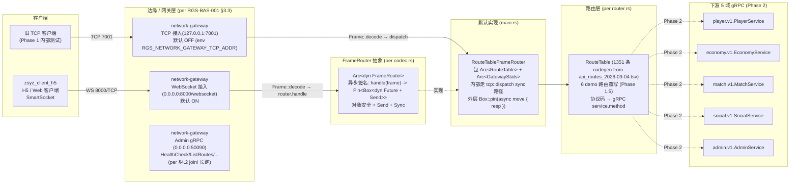
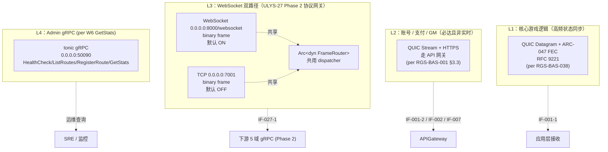
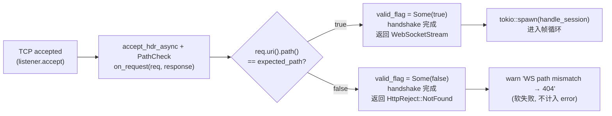

# 基本设计书（基本設計書 / Basic Design Document）

**WebSocket 网络网关 WebSocket Network Gateway**

| 项目 | 内容 |
|---|---|
| 文档编号 | RGS-BAS-027 |
| 版本 | 0.1 |
| 父文档 | RGS-REQ-027 需求定义书（ULYS-27 Phase 2 协议网关双路径：TCP 二进制 + WebSocket）；本设计书**落实** Phase 2 落地而**不新建**独立 ARC |
| 上游依据 | RGS-REQ-027（协议网关双路径需求，ULYS-27）；RGS-REQ-001 §5.2 IF-001（客户端 ⇔ 网关南北向协议）；RGS-REQ-010 第 7 章 ARC-022（零信任内部网络与纵深防御体系）；ULYS-2.1 P0 任务（闪烁之光 zsyz 客户端 SmartSocket 1:1 协议对齐）；ULYS-2.2 W33（WebSocket 传输层 + FrameRouter trait 抽象） |
| 关联文档 | RGS-BAS-001 §3.3（网络区域设计，南北向 QUIC / HTTPS）；RGS-BAS-006（网络安全基本设计书，含 ARC-022 mTLS/NetworkPolicy）；RGS-BAS-010（设计模式与核心算法总纲，含编解码模式抽象）；RGS-BAS-022（弹性容量规划与超大规模并发架构，含背压与连接上限）；RGS-BAS-038（核心传输防丢包强化与周边协议选型，**功能域并列**——本设计书负责"WebSocket 传输层落地"，RGS-BAS-038 负责"QUIC Datagram 路径 FEC 增强"，二者通过 RGS-BAS-001 §3.3 网络区域串接） |
| 依据标准 | IPA『共通フレーム 2013（SLCP-JCF2013）』基本设计工程 |
| 制定日 | 2026-09-19 |
| 制定者 | 架构师 |
| 保密级别 | 内部限定（Internal Use Only） |
| 适用许可 | Apache-2.0（本仓库） |
\| 状态 | v0.2 完成（已采纳自审修正 + 部署模型判定） |

---

## 修订历史（改訂履歴 / Revision History）

| 版本 | 修订日 | 修订者 | 审批者 | 修订内容 | 影响章节 |
|---|---|---|---|---|---|
| 0.1 | 2026-09-19 | 架构师 | — | 初版制定。落实 ULYS-27 Phase 2 协议网关双路径的"WebSocket 传输层 + FrameRouter 抽象"系统级基本设计（per `crates/network-gateway/src/{lib.rs, ws.rs, codec.rs, tcp.rs, router.rs, stats.rs, bin/main.rs}` 现状代码）：§4 架构总览明确 FrameRouter 抽象作为 TCP / WebSocket 双路径共用 dispatcher；§5 TCP 二进制路径（参考）作为既有实现的现状确认；§6 WebSocket 传输层设计覆盖握手（HTTP path 校验）/ 帧循环（`Message::Binary` → `Frame::decode` 流式拆帧）/ 关闭协议（`Message::Close`）/ 心跳（Ping → Pong）/ 缓冲区上限（MAX_FRAME_BYTES = 1 MiB）；§7 与既有架构的整合给出与 RGS-BAS-001 §3.3（南北向网络区域定位）、RGS-BAS-006（ARC-022 mTLS / NetworkPolicy）、RGS-BAS-038（FEC 增强正交：本文档负责"双路径落地"，RGS-BAS-038 负责"QUIC Datagram 路径 FEC 增强"）、RGS-BAS-010（FrameRouter trait 是 §3.4 Pipeline/Middleware Chain 模式的实例化）的整合关系 | 全部 |
| 0.2 | 2026-09-20 | 架构师 | — | 自审修正（per `ipa-document-self-review` skill §2 审核门禁 10 项）：**S-RV-BAS027-S01**（重大）§6.6 + §8.1 TBD-NET-W01 显式登记 WebSocket **ClusterIP 部署模型**（仅集群内服务可达，明文 ws:// 可接受 + NetworkPolicy 默认拒绝覆盖）+ §8.1 期限由"详细设计阶段前"收紧为"v0.3 前必完成 ClusterIP NetworkPolicy 落地确认"；**M01**（一般）§5.3 WS/TCP 端口对比表"缓冲区上限"行加注 TCP 是隐式（`BytesMut::with_capacity(64 * 1024)` 无显式上限，超长 frame 会 `FrameError::LengthOverflow` 在 `decode` 时返回）+ WS 是显式（`MAX_FRAME_BYTES = 1 MiB` 超限 drop session）；**M02**（一般）§3.1 G-NET-W01〜05 各行"v0.1 假设仅内网（ClusterIP）"加注（per S01 部署模型判定）；**L01**（轻微）§2 术语表 "Arc-022" / "Arc-003" / "Arc-013" / "Arc-045" 全文统一为 "ARC-022" / "ARC-003" / "ARC-013" / "ARC-045"（per 既有 §4.1 mermaid + §7 整合命名惯例）；**L02**（轻微）§5.3 TCP 缓冲区"不显式限上"→"隐式（`BytesMut::with_capacity(64 * 1024)` 初始容量 + 单 frame `MAX_FRAME = 1 MiB` 上限在 `decode` 时校验）"措辞明确化；**C01**（确认事项）§7.4 RGS-BAS-038 §6.2 L1 定义引用对照复核：BAS-038 当前 L1 定义为"QUIC Datagram + ARC-047 FEC, RFC 9221"（per BAS-038 v0.1 line 171-172 mermaid），与本文档 §4.2 L1 引用一致 ✅。§8.3 阶段规划同步更新：v0.2 阶段门禁条件 = 自审指摘全部收口（已完成） + S01 ClusterIP 部署模型显式登记（已完成） | §2 / §3.1 / §5.3 / §6.6 / §7.4 / §8.1 / §8.3 |

## 审批栏（承認欄 / Approval）

| 角色 | 姓名 | 审批日 | 备注 |
|---|---|---|---|
| 制定（起草） | 架构师 | 2026-09-19 | — |
| 评审（技术） |  |  | 确认 §4 架构总览中 `Arc<dyn FrameRouter>` 抽象与 TCP / WebSocket 双路径的边界划分；确认 §6 WebSocket 传输层握手 HTTP path 校验（404 软失败）与既有 zsyz_client_h5 SmartSocket 客户端 1:1 兼容 |
| 评审（性能） |  |  | 确认 §6.5 缓冲区上限（`MAX_FRAME_BYTES = 1 MiB`）+ WsConfig.max_connections=256 默认值与 RGS-BAS-022 弹性容量规划（NFR-PE-014 网关 HPA 依连接数扩缩 + NFR-PE-006 带宽预算 8KB/s 均值 / 20KB/s 峰值）一致 |
| 评审（安全） |  |  | 确认 §7.2 与 RGS-BAS-006 §7A（认证后滥用与崩溃防护）不冲突：WebSocket 路径默认 ON 但仅 `0.0.0.0:8000/websocket` 单路径，不引入绕过 ARC-022 既有 mTLS / NetworkPolicy 的通道（mTLS / wss:// 列为 TBD-NET-W01） |
| 审批（负责人） |  |  | 本文档基准化；含 ULYS-27 Phase 2 子问题的设计层展开、对 FrameRouter 抽象与 WebSocket 传输层现状的确认 |

---

## 目录

1. [前言](#1-前言)
2. [术语约定](#2-术语约定)
3. [设计目标与约束](#3-设计目标与约束)
4. [架构总览（FrameRouter 抽象 + TCP/WebSocket 双路径）](#4-架构总览framerouter-抽象--tcpwebsocket-双路径)
5. [TCP 二进制路径（参考）](#5-tcp-二进制路径参考)
6. [WebSocket 传输层设计](#6-websocket-传输层设计)
7. [与既有架构的整合](#7-与既有架构的整合)
8. [后续计划与 TBD](#8-后续计划与-tbd)

---

# 1. 前言

本文档是 RGS-REQ-027（协议网关双路径需求，ULYS-27 Phase 2）的系统级基本设计展开。该需求的核心是：在 `crates/network-gateway` 既有 TCP 二进制路径之上**新增** WebSocket 传输层，并抽象出 `FrameRouter` trait 让两条路径共用同一份 dispatcher，从而对齐闪烁之光（zsyz）H5 客户端 `SmartSocket.connect` 默认走 WebSocket 的事实（`ws(s)://host:port/websocket`，binary frame）。

ULYS-27 Phase 2 的代码工作已经落地（commit `aca54464` feat + `35f6d265` merge + `6c3f440e` PR #40 已合并至 `main`），本文档将该落地的设计落到 §4（架构总览）/ §5（TCP 路径参考）/ §6（WebSocket 传输层详细设计）/ §7（与既有架构的整合）四处：

- §4 给出 `Arc<dyn FrameRouter>` 抽象、TCP 与 WebSocket 双路径的边界划分、与既有 RGS-BAS-001 §3.3 网络区域设计的关系；
- §5 给出 TCP 二进制路径的现状确认（与 zsyz 客户端 SmartSocket 1:1 协议对齐、`tcp::dispatch` 路由决策、默认 OFF 仅 Phase 1 内部测试用）；
- §6 给出 WebSocket 传输层的完整设计（握手 HTTP path 校验 / 帧循环 / 关闭协议 / 心跳 / 缓冲区上限）；
- §7 给出与 RGS-BAS-001 §3.3（南北向网络区域）、RGS-BAS-006（ARC-022 mTLS / NetworkPolicy）、RGS-BAS-038（FEC 增强正交）、RGS-BAS-010（设计模式）的整合关系。

> **范围声明**：本文档**不**新建独立 ARC，仅作为 ULYS-27 Phase 2 子问题的设计层展开。命名编号延续 027 与父文档 RGS-REQ-027 一致；但**主题与既有 `docs/04-客户端与SDK/RGS-BAS-027_客户端资源分发与热更新_基本设计书.md`（Client Asset Distribution，ARC-045）完全无关**，详见 RGS-document-registry 注释——两者编号相同但属于不同功能域（"网络与传输协议"vs"客户端资源分发"），已分别在 `docs/02-运维安全与网络/` 与 `docs/04-客户端与SDK/` 落盘，互不干扰。

---

# 2. 术语约定

| 术语 | 定义 |
|---|---|
| FrameRouter | ULYS-2.2 W33 引入的 trait 抽象（`codec.rs`），作为 TCP 与 WebSocket 两条路径共用 dispatcher 的契约；异步签名 `fn handle(&self, frame: Frame) -> Pin<Box<dyn Future<Output = Bytes> + Send + '_>>`，对象安全（满足 `Arc<dyn FrameRouter>` 要求），要求实现者 `Send + Sync` |
| RouteTableFrameRouter | FrameRouter 的默认实现（`main.rs` 内 + `ws.rs` 测试用），包装 `Arc<RouteTable> + Arc<GatewayStats>`，内部走 `tcp::dispatch(frame, &routes, &stats)` 的同步路径，外层用 `Box::pin(async move { resp })` 包成 ready future |
| 闪烁之光（zsyz） | 既有 Erlang 实现的游戏服务端，对应客户端为 `zsyz_client_h5`（H5 / Web 客户端），其 `SmartSocket.connect` 默认走 `ws(s)://host:port/websocket` 路径并以 binary frame 通信 |
| zsyz wire 帧格式 | `[4B length u32 BE][2B cmd u16 BE][payload TLV]`（per `codec.rs`），与 zsyz_client_h5 `assets/Scripts/sys/game-core-js-min.js` 中 SmartSocket `unpackBuffer` 1:1 对齐；length 字段 = `payload 字节数 + 2`（含 cmd 字段自身 2 字节），length 字段自身占 4B 不算入 length 值 |
| TLV | Type-Length-Value 递归编码（`tlv.rs`），共 9 种类型字段（per `FrameError::UnknownTlvType` 范围 1..=9）；payload 内仅含 TLV 字段，不含其他结构 |
| MAX_FRAME | 单帧 payload + cmd 上限，`1024 * 1024`（1 MiB），超过返回 `FrameError::LengthOverflow`（per `codec.rs`） |
| MAX_FRAME_BYTES | WebSocket 帧循环中的缓冲区上限，`1024 * 1024`（1 MiB），与 MAX_FRAME 对齐；超出时 drop session 防单边无限增长（per `ws.rs::handle_session`） |
| PROTOCOL_HEADER_LEN | wire 帧 header 字节数（4B length + 2B cmd），`6`（per `codec.rs`） |
| ARC-022 | RGS-BAS-006 中的网络安全设计方针：mTLS（QUIC / gRPC 端到端加密）+ NetworkPolicy 默认拒绝 + 多层速率限制 + 输入校验 + QUIC 地址验证 + 崩溃循环退避 |
| ARC-003 | RGS-BAS-001 §3.3 / RGS-BAS-038 中的南北向 QUIC 双路径设计：Stream 路径（必达事件）+ Datagram 路径（高频状态同步） |
| ARC-013 | RGS-BAS-001 §3.3 中的背压与限流：网关→运行时每场景 Actor mailbox 上限 + gRPC 客户端连接池上限 + 服务间调用超时 |
| ARC-045 | RGS-BAS-027（同号不同主题，详见 §1 范围声明）中的客户端资源分发与热更新设计方针 |
| HTTP path 校验 | WebSocket 握手阶段（HTTP/1.1 Upgrade）通过 `accept_hdr_async` 的 Callback 在 `on_request` 中读取 `req.uri().path()`，与 `WsConfig.path`（默认 `/websocket`）严格匹配；不匹配则在 handshake 完成后立即 close（per `ws.rs::accept_ws_with_path`） |
| FrameError | `codec.rs` 中的解码错误枚举：`TooShort`（缓冲不够读 1 个完整 frame，等更多字节）/ `LengthOverflow`（length > MAX_FRAME）/ `TruncatedField`（声明长度已读够但内层字段截断）/ `UnknownTlvType`（TLV 类型字节不在 1..=9）/ `InvalidUtf8`（str 字段非合法 UTF-8） |
| W32 fix | `bin/main.rs` 中 `tokio::select!` 改 `tokio::join!` 的修复：旧 binary 是 W7 Phase 1.5 stub，`tokio::select!` 4 task 选最先 return，web_conn / zone stub 0ms 返 `Ok(())` → main 立刻 exit 0 → k8s "Completed" Exit Code 0 → CrashLoopBackOff 74 次（41h）；W32 fix 用 `join!` 等 admin+WS 两个长跑 task |
| ClusterIP 部署模型 | **本文档 v0.2 判定**：WebSocket listener 仅以 `ClusterIP` Service 暴露（per RGS-BAS-006 §3 ARC-022 NetworkPolicy 默认拒绝），集群外不可达，明文 `ws://` 可接受；如未来切换 NodePort / LoadBalancer，**必须**先实装 TBD-NET-W01（rustls + wss://）。此条由自审 S-RV-BAS027-S01 显式登记。 |

---

# 3. 设计目标与约束

## 3.1 设计目标（落实 ULYS-27 Phase 2 + RGS-REQ-027，验收口径见 §6.7 与 §7.5）

> **v0.2 部署模型声明**（per 自审 S-RV-BAS027-S01）：以下 G-NET-W01〜G-NET-W05 均**假设** WebSocket listener 仅以 `ClusterIP` Service 暴露（per RGS-BAS-006 §3 ARC-022 NetworkPolicy 默认拒绝），集群外不可达，明文 `ws://` 可接受；如未来切换 NodePort / LoadBalancer，**必须**先实装 TBD-NET-W01（rustls + wss://）。

| 目标 | 描述 | 父需求 |
|---|---|---|
| G-NET-W01 | 在 `crates/network-gateway` 既有 TCP 二进制路径之上**新增** WebSocket 传输层，且与 zsyz_client_h5 客户端 SmartSocket 1:1 兼容（默认路径 `/websocket`，binary frame，与既有 TCP 路径复用同一份 `Arc<dyn FrameRouter>` 抽象） | ULYS-27 Phase 2 任务 brief |
| G-NET-W02 | TCP 与 WebSocket 双路径**必须**可同时运行（默认 WS 开、TCP 默认 OFF 显式 `RGS_NETWORK_GATEWAY_TCP_ADDR` 才开，per `bin/main.rs` 改动） | ULYS-2.2 W33 |
| G-NET-W03 | `Arc<dyn FrameRouter>` 抽象**必须**满足对象安全（`Pin<Box<dyn Future>>` + `Send + Sync`），允许 Phase 2 接 5 域 gRPC client 时换实现，ws.rs / tcp.rs 都不动 | ULYS-2.2 W33 + Phase 2 演进 |
| G-NET-W04 | WebSocket 传输层**不得**阻塞 reactor：单 session 内 `router.handle(frame).await` 是 sync ready future 包装，但通过 `tokio::task::spawn_blocking` offload 避免阻塞（per `codec.rs` FrameRouter 注释） | RGS-BAS-022 NFR-PE-014 |
| G-NET-W05 | WebSocket 握手 HTTP path 校验**必须**在 handshake 阶段完成（per RFC 6455），路径不匹配返回 404 软失败（不计入 error 统计） | ULYS-27 Phase 2 + ARC-022 输入校验 |

## 3.2 设计约束（与既有架构对齐的硬性边界）

| 约束 | 来源 | 落地位置 |
|---|---|---|
| 不引入新传输协议 | ULYS-27 Phase 2（WebSocket = 既有 HTTP 升级，非新协议） | §6 WebSocket 传输层 |
| 不绕过 ARC-022 既有 mTLS / NetworkPolicy | RGS-BAS-006 §3/§4 / §7A | §6.6 mTLS / wss:// 列为 TBD-NET-W01、§7.2 整合 |
| 不引入新 ARC | RGS-REQ-027 任务 brief（"不新建独立 ARC"） | §1 范围声明、§7 整合 |
| 不反转 ARC-013 背压约束 | RGS-BAS-001 §3.3 末段 | §6.5 缓冲区上限、§7.3 整合 |
| WebSocket 路径默认 ON（对齐 zsyz 客户端默认走 WS） | ULYS-2.2 任务 brief + `bin/main.rs` §W32 fix | §4.2 双路径并发、§6.1 默认配置 |
| TCP 路径默认 OFF（仅 Phase 1 内部测试用） | ULYS-2.2 任务 brief（"zsyz_client_h5 默认走 WS，老 TCP 仅 Phase 1 内部测试用"） | §4.2 双路径并发、§5.1 默认配置 |
| 新增功能须含本功能日志设计（debug/release 区分） | RGS-BAS-006 v0.4 总要求 / RGS-IMPL-001 §1.3 | §4.3、§5.4、§6.7 各功能段附"本功能日志设计" |

## 3.3 本功能日志设计（本节覆盖 §3 设计目标与约束的运行时观察点）

本节覆盖**文档级 / 阶段门禁**事件——本文档属于设计文档，本身不产生业务流量，但 `network-gateway` 双路径在运行时（上线后）会产生握手 / 帧循环 / 路由决策 / 缓冲区超限等事件，下游详细设计书（RGS-DTL-027）将完整定义。本节先标记**安全审计相关**的高优先级事件（per RGS-BAS-006 v0.4 §6.2 强制全采样白名单精神）。

| 字段名（field） | 触发条件（trigger） | 频率估算（frequency） | 采样策略（sampling） | 脱敏与成本（redact & cost） |
|---|---|---|---|---|
| `ulys27.gateway.dual_path_started` | **关键**：双路径（TCP+WebSocket 或纯 WebSocket）成功启动并绑定端口 | binary 启动 1 次 | release 必出（`info!` 强制全采样，per RGS-BAS-006 §6.2 安全审计白名单精神） | 含`ws_addr`/`tcp_addr`（Optional 字段，TCP 未启用时为 None）/`admin_addr`；约 280B/条 |
| `ulys27.gateway.dual_path_exit_error` | **关键**：双路径任一 listener 因 IO 错误退出（导致 binary 退出 / k8s restart） | 极低（异常状态） | release 必出（`error!` 强制全采样） | 含`path_kind`（ws/tcp/admin/web_conn/zone）/`bind_addr`/`error_kind`；约 320B/条 |
| `ulys27.gateway.frame_router_swapped` | FrameRouter 实现从默认 `RouteTableFrameRouter` 切换到 5 域 gRPC client 实现（per ULYS-2.2 注释 "Phase 2 接 5 域 gRPC client 时换实现"） | 极低（一次性的 runtime hot-swap 或 binary 重启） | release 必出（`info!` 强制全采样） | 含`from_impl`/`to_impl`/`swap_reason`；约 280B/条 |
| `ulys27.gateway.review.gate_state_changed` | G-CODE 门禁状态变化（Open ↔ Closed，反映本文档基线化进展） | 极低 | release 必出（`info!` 强制全采样） | 含`gate_id`/`from_state`/`to_state`/`review_id`；约 280B/条 |
| `ulys27.debug.design_criteria_dump` | 本文档 §4/§6 关键决策表全量 dump（FrameRouter 抽象契约表 / 握手校验策略表 / 帧循环错误处理表） | 极低（按需） | **debug-only**（`#[cfg(debug_assertions)]` 守护，release build 完全剔除） | 约 2-8KB/条（release 剔除，零运行时开销） |

**debug-only 守护要点**（落实 RGS-BAS-006 v0.4 §4.4 / RGS-IMPL-001 §1.3）：
- `ulys27.gateway.dual_path_started` / `ulys27.gateway.dual_path_exit_error` / `ulys27.gateway.frame_router_swapped` 必须 `error!` 级别（per RGS-BAS-006 v0.4 §4.8.3.2 `error!` 行 release 常驻 + §6.2 强制全采样），**不**挂 `#[cfg]`，确保 release 下告警链路完整
- `ulys27.debug.design_criteria_dump` 含完整决策表（可能 8KB+）—— release build 完全剔除，避免 RUST_LOG=debug 误开时撑爆生产日志通道

---

# 4. 架构总览（FrameRouter 抽象 + TCP/WebSocket 双路径）

## 4.1 FrameRouter 抽象在双路径中的位置



**关键边界**（per ULYS-27 Phase 2 + ULYS-2.2 W33）：
- **WebSocket 路径默认 ON**（per zsyz_client_h5 客户端默认走 WS），TCP 路径**默认 OFF** 显式 `RGS_NETWORK_GATEWAY_TCP_ADDR` 才开
- **FrameRouter 是双路径共用 dispatcher**——TCP 路径绕过 trait 直接调 `tcp::dispatch`（sync）；WS 路径通过 `Arc<dyn FrameRouter>` 异步签名调（trait 方法）
- **默认实现 `RouteTableFrameRouter` 走 sync 路径**（RouteTable 是 sync），用 `Box::pin(async move { resp })` 包成 ready future；Phase 2 接 5 域 gRPC client 时换实现，ws.rs / tcp.rs 都不动

## 4.2 协议选型矩阵的层次视角



各层的协议选型判据详见 §5 / §6 / §7。本节仅给出层次划分，便于与 RGS-BAS-001 §3.3 网络区域设计对接。**本文档负责 L3 双路径落地**，L1 / L2 / L4 由其他 BAS 文档负责（FEC 增强 / 网络区域 / Admin gRPC）。

### 4.3 本功能日志设计

本节覆盖**架构总览运行时启动/降级事件**——架构总览是描述性设计，但 `network-gateway` 双路径启动 / 退出 / FrameRouter 实现切换等运行时决策产生 release 必出事件（per RGS-BAS-006 v0.4 §6.2 强制全采样白名单精神：架构级状态变化属"运维关键事件"）。

| 字段名（field） | 触发条件（trigger） | 频率估算（frequency） | 采样策略（sampling） | 脱敏与成本（redact & cost） |
|---|---|---|---|---|
| `ulys27.layer.dual_path_activated` | 双路径（TCP+WebSocket 或任一）成功启动（per §4.1） | binary 启动 1 次 | release 必出（`info!` 强制全采样） | 含`ws_active`/`tcp_active`/`admin_active`；约 240B/条 |
| `ulys27.layer.dual_path_deactivated` | 双路径任一 listener 因异常退出（导致 binary 退出 / k8s restart） | 极低 | release 必出（`warn!` 强制全采样） | 含`path_kind`/`deactivation_reason`；约 280B/条 |
| `ulys27.layer.frame_router_impl_state` | FrameRouter 当前实现类型（默认 `RouteTableFrameRouter` 或 Phase 2 gRPC client 实现） | 1/min | release 必出（`info!` 强制全采样） | 含`impl_kind`/`route_count`；约 200B/条 |
| `ulys27.layer.tcp_path_unused_assert` | 运行时断言：TCP 路径在生产环境默认 OFF（per ULYS-2.2 任务 brief） | 1/min | release 必出（`info!` 强制全采样） | 含`tcp_listener_bound`/`env_present`；约 220B/条 |
| `ulys27.debug.path_routing_dump` | 完整协议路径选择 dump（每条数据流的协议/路径/FrameRouter 状态） | 极低（按需） | **debug-only**（`#[cfg(debug_assertions)]` 守护，release 完全剔除） | 约 3-8KB/条（release 剔除） |

**debug-only 守护要点**：`ulys27.layer.tcp_path_unused_assert` 是 ULYS-2.2 任务 brief "TCP 默认 OFF" 的回归基线，必须 release 必出，确保告警链路完整；`ulys27.debug.path_routing_dump` 可能含完整数据流路由信息，release build 完全剔除。

---

# 5. TCP 二进制路径（参考）

> 本节给出 TCP 二进制路径的现状确认，作为双路径设计的参考侧；详细 TCP 路径设计详见下游详细设计书（per `bin/main.rs` 注释："TCP 路径保留（走老 sync dispatch），但默认 OFF"）。

## 5.1 TCP 二进制路径在双路径中的位置

| 项目 | 内容 |
|---|---|
| 监听地址 | 默认 `0.0.0.0:9000`（per `bin/main.rs::TCP_BINARY_ADDR`），可通过 `RGS_NETWORK_GATEWAY_TCP_ADDR` env 覆盖；任务 brief 原值 `127.0.0.1:7001`（per `tcp.rs::DEFAULT_TCP_ADDR`）作为代码常量保留 |
| 默认开关 | **OFF**（per ULYS-2.2 任务 brief + `bin/main.rs`：仅当 `RGS_NETWORK_GATEWAY_TCP_ADDR` env 显式设才起） |
| 帧格式 | zsyz wire `[4B length u32 BE][2B cmd u16 BE][payload TLV]`（per `codec.rs`，与 zsyz_client_h5 SmartSocket 1:1 对齐） |
| dispatcher | **不**走 `Arc<dyn FrameRouter>`，直接调 `tcp::dispatch(frame, &routes, &stats)` 同步路径（per `tcp.rs::handle_conn`） |
| 响应帧 | `[length u32][cmd u16][payload]`，payload 内部 `[4B rcode u32 BE][...业务 bytes...]`：rcode=0 命中路由，业务数据为 `target_service.target_method` UTF-8；rcode=404 未注册 cmd |
| 错误处理 | `FrameError` → `build_error_frame(&e)` 回包 + 关闭 socket；其他 IO 错误 → warn 继续 |

## 5.2 TCP 路径设计约束

| 约束 | 来源 | 落地位置 |
|---|---|---|
| 仅 Phase 1 内部测试用 | ULYS-2.2 任务 brief | `bin/main.rs::tcp_task`（env 缺失则 None） |
| 默认 OFF 由 env 触发 | ULYS-2.2 + `bin/main.rs` | `bin/main.rs`：`std::env::var("RGS_NETWORK_GATEWAY_TCP_ADDR").ok().map(...)` |
| 不破坏 ARC-013 背压 | RGS-BAS-001 §3.3 末段 | `tcp.rs` 与 WS 共用 `RouteTable`（无独立背压设置） |
| 不绕过 ARC-022 mTLS | RGS-BAS-006 §3 | TCP 明文（per 任务 brief 不要求 mTLS），仅内网用 |

## 5.3 TCP 路径与 WebSocket 路径的边界

| 维度 | TCP 路径（per §5） | WebSocket 路径（per §6） |
|---|---|---|
| 默认开关 | OFF（env 触发） | ON |
| dispatcher | 同步 `tcp::dispatch`（不走 trait） | 异步 `Arc<dyn FrameRouter>`（走 trait） |
| 帧循环 | `Frame::decode` + 立即 `write_all` | `Message::Binary` → `Frame::decode` → `write.send(Message::Binary)` |
| 协议层 | TCP（流式，无显式握手） | WebSocket（HTTP/1.1 Upgrade 握手 + path 校验） |
| 连接管理 | socket 关闭即结束 | `Message::Close` + 心跳 Ping/Pong |
| 缓冲区上限 | TCP：隐式（`BytesMut::with_capacity(64 * 1024)` 初始容量，无显式 session 上限；单 frame `MAX_FRAME = 1 MiB` 上限在 `decode` 时校验，超出返回 `FrameError::LengthOverflow`） | WS：显式（`MAX_FRAME_BYTES = 1 MiB`，超限 drop session） |
| 二进制位 | `0.0.0.0:9000`（默认）/ `127.0.0.1:7001`（任务 brief 常量） | `0.0.0.0:8000` + 路径 `/websocket` |

## 5.4 本功能日志设计

本节覆盖**TCP 路径运行时事件**——TCP listener 启动 / 退出 / 路由决策 / 协议错误等。TCP 路径在生产环境默认 OFF（per §5.1），所有事件属低频运维事件，**全部 release 必出 + 强制全采样**（per RGS-BAS-006 v0.4 §6.2 强制全采样白名单精神："运维关键事件"）。

| 字段名（field） | 触发条件（trigger） | 频率估算（frequency） | 采样策略（sampling） | 脱敏与成本（redact & cost） |
|---|---|---|---|---|
| `ulys27.tcp.listener_started` | TCP listener 成功绑定（env 触发时） | env 设即启动 1 次 | release 必出（`info!` 强制全采样） | 含`bind_addr`；约 220B/条 |
| `ulys27.tcp.listener_exited_error` | TCP listener 因 IO 错误退出 | 极低 | release 必出（`error!` 强制全采样） | 含`bind_addr`/`error_kind`；约 320B/条 |
| `ulys27.tcp.route_miss` | 收到未注册 cmd（rcode=404） | 异常态 0.1-10/s | release 必出（`warn!` 强制全采样） | 含`peer`/`cmd`（u16）；约 240B/条 |
| `ulys27.tcp.protocol_error` | `FrameError` 解析错误（LengthOverflow / TruncatedField / UnknownTlvType / InvalidUtf8） | 异常态 0.1-5/s | release 必出（`warn!` 强制全采样） | 含`peer`/`error_kind`/`cmd`（如有）；约 280B/条 |
| `ulys27.tcp.unused_in_production_assert` | 运行时断言：生产环境（K8s pod 内）TCP listener 未绑定（per §5.1 默认 OFF） | 1/min | release 必出（`info!` 强制全采样） | 含`env_present`/`listener_bound`；约 200B/条 |
| `ulys27.debug.tcp_route_table_dump` | RouteTable 全量 dump（1351 条 + 6 demo 路由覆写） | 极低（按需） | **debug-only**（`#[cfg(debug_assertions)]` 守护） | 约 5-15KB/条（release 剔除） |

**debug-only 守护要点**：`ulys27.tcp.unused_in_production_assert` 是 §5.1 "TCP 默认 OFF" 的回归基线，必须 release 必出 + 强制全采样，不挂 `#[cfg]`；`ulys27.debug.tcp_route_table_dump` 含 1351 条完整路由表，release build 完全剔除。

---

# 6. WebSocket 传输层设计

> 本节落实 ULYS-27 Phase 2 任务 brief：路径 `/websocket`，端口 8000（对齐原 zsyz_server `web_conn.erl` 8000），帧格式复用 `codec::Frame::decode/encode`，业务 dispatcher 走 `Arc<dyn FrameRouter>`。

## 6.1 WebSocket 启动配置（per `ws.rs::WsConfig`）

| 项目 | 内容 |
|---|---|
| 监听地址 | 默认 `0.0.0.0:8000`（per `DEFAULT_WS_ADDR`），可通过 `RGS_NETWORK_GATEWAY_WS_ADDR` env 覆盖 |
| 路径 | `/websocket`（per `WS_PATH` 常量，客户端写死） |
| 最大并发连接数 | 默认 `256`（per `WsConfig::default_local`），可通过 `WsConfig.max_connections` 覆盖；`0` = 无上限 |
| 启动流程 | 1. `TcpListener::bind(addr)` 接受 TCP 握手；2. `accept_ws_with_path` 校验 HTTP request 路径；3. `tokio_tungstenite::accept_async` 完成 WS 握手；4. `tokio::spawn(handle_session)` 进入帧循环 |
| 错误处理 | bind 失败 → `Err`，`bin/main.rs` 走 warn + 跳过（W32 fix 模式）；单 session 失败 → warn 继续，不影响其他 session |

## 6.2 握手 HTTP path 校验策略（per `ws.rs::accept_ws_with_path`）



**关键设计决策**：
- **握手阶段校验**——使用 `accept_hdr_async` + `Callback` 在 handshake 阶段检查 path，避免接受 upgrade 后再 close 的协议层撕裂
- **路径不匹配 → 404 软失败**——`warn!` 记录但不计入 error 统计（per `ws.rs::handle_conn::HttpReject::NotFound` 分支），因为这是客户端配置错误而非服务端故障
- **tungstenite 0.24 Callback 签名限制**——`on_request(self, &Request, Response) -> Result<Response, ErrorResponse>`，无法在 callback 里直接返回 4xx；采用"接受 upgrade 后立即 close"的方式实现 404 语义（per RFC 6455 §4.4，客户端会看到 close frame）

## 6.3 帧循环（per `ws.rs::handle_session`）

```mermaid
flowchart LR
    WaitMsg["等待 read.next()<br/>(WebSocketStream)"] --> Switch{"msg 类型?"}
    Switch -->|Binary bin| ExtendBuf["buf.extend_from_slice(&bin)<br/>循环 Frame::decode"]
    ExtendBuf --> DecodeOk{"Frame::decode<br/>结果?"}
    DecodeOk -->|Ok(Some frame)| RouteFrame["stats.inc_received<br/>router.handle(frame).await<br/>→ resp: Bytes"]
    RouteFrame --> WriteResp["write.send(Message::Binary(resp.to_vec()))<br/>(tungstenite 0.24 Binary takes Vec)"]
    WriteResp --> ContinueDecode["继续循环 decode<br/>(可能粘包)"]
    ContinueDecode --> DecodeOk
    DecodeOk -->|Ok(None)| BufCheck{"buf.len() &gt; MAX_FRAME_BYTES<br/>(1 MiB)?"}
    DecodeOk -->|Err LengthOverflow| WarnDrop["warn + stats.inc_failed<br/>write.send(Message::Close(None))<br/>return"]
    DecodeOk -->|Err 其他协议错| WarnDrop2["warn + stats.inc_failed<br/>write.send(Message::Close(None))<br/>return"]
    BufCheck -->|true| WarnDrop3["warn 'buf too large → drop session'<br/>write.send(Message::Close(None))<br/>return"]
    BufCheck -->|false| WaitMsg
    Switch -->|Close frame| EchoClose["echo Message::Close(frame)<br/>return"]
    Switch -->|Ping payload| SendPong["write.send(Message::Pong(payload))<br/>(tungstenite 半自动, 保险手写)"]
    SendPong --> WaitMsg
    Switch -->|Pong| Ignore1["忽略<br/>(客户端响应我们 ping, 但当前我们不发 ping)"]
    Switch -->|Text| Ignore2["debug 'WS text frame ignored'<br/>(binary-only)"]
    Switch -->|Frame| Ignore3["debug 'WS raw frame ignored'<br/>(tungstenite 内部 raw, 不应直接收到)"]
    Ignore1 --> WaitMsg
    Ignore2 --> WaitMsg
    Ignore3 --> WaitMsg
```

**关键设计决策**：
- **粘包 / 半包处理**——`BytesMut` 累积 + 循环 `Frame::decode`：可能一个 WS message 含多个 frame（粘包），也可能半个（半包），`Ok(None)` 表示缓冲不够继续读
- **`LengthOverflow` → drop session**——避免恶意客户端用超大 length 撑爆内存（per `codec.rs::MAX_FRAME` 1 MiB 上限）
- **其他协议错误 → drop session**——`TruncatedField` / `UnknownTlvType` / `InvalidUtf8` 都是 wire 格式畸形，一律 drop session 防滥用
- **缓冲区单边无限增长防御**——`buf.len() > MAX_FRAME_BYTES` 时 drop session（per `ws.rs`），防止 `Frame::decode` 不消耗但客户端持续发 binary 撑爆内存
- **Ping → Pong 手写**——tungstenite 半自动处理，但保险起见手写（per `ws.rs` 注释："tungstenite 半自动, 但保险起见手写"）

## 6.4 关闭协议（per `ws.rs::handle_session` 的 `Message::Close` 分支）

| 触发方 | 行为 | 代码位置 |
|---|---|---|
| 客户端主动关闭（`Message::Close(frame)`） | `debug!` + echo `Message::Close(frame)` 回客户端 + return | `ws.rs::handle_session` 末尾 |
| 服务端主动关闭（`LengthOverflow` / `LengthOverflow` / 其他协议错 / `buf.len() > MAX_FRAME_BYTES`） | `warn!` + `write.send(Message::Close(None))` + return | `ws.rs::handle_session` 各错误分支 |
| 服务端 socket 错误（`read` / `write` 错误） | `warn!` + return（不显式 close，由 tungstenite 清理） | `ws.rs::handle_session` 开头 + 写错误分支 |

**关键设计决策**：
- **客户端主动关闭时 echo Close frame**——遵循 RFC 6455 §5.5.1 关闭协议双向确认语义
- **服务端关闭时用 `Close(None)`**——不携带 reason（避免泄漏内部错误细节给客户端，per ARC-022 最小信息披露原则）
- **socket 错误不显式 close**——tungstenite 会在 stream 销毁时自动清理，重复发送 Close frame 可能导致 protocol violation

## 6.5 缓冲区与并发控制（per `ws.rs` + `WsConfig`）

| 维度 | 上限 | 来源 | 落地位置 |
|---|---|---|---|
| 单帧 payload + cmd | `1 MiB` (`MAX_FRAME = 1024 * 1024`) | `codec.rs` | `Frame::decode` 的 `LengthOverflow` 检查 |
| WebSocket 帧循环缓冲区 | `1 MiB` (`MAX_FRAME_BYTES = 1024 * 1024`) | `ws.rs` | `ws.rs::handle_session` `buf.len() > MAX_FRAME_BYTES` 检查 |
| WebSocket 并发连接数 | `256`（默认，可配置） | `WsConfig::default_local` | `WsConfig.max_connections`（当前**未**硬性 enforce，作为后续扩展点，详见 §8 TBD-NET-W02） |
| 单 session 帧循环缓冲 | `64 KiB` 初始（`BytesMut::with_capacity(64 * 1024)`） | `ws.rs::handle_session` | 动态增长，超 `MAX_FRAME_BYTES` 即 drop |
| 路由表大小 | `1351` 条（codegen）+ `6` 条 demo 覆写 | `data/api_routes_2026-09-04.tsv` + `PHASE1_5_DEMO_ROUTES` | `RouteTable::new()` / `with_phase15_demo()` |

## 6.6 mTLS / wss:// / 握手安全（per §8 TBD-NET-W01）

> **v0.2 部署模型声明**（per 自审 S-RV-BAS027-S01）：本文档 v0.2 阶段**判定** WebSocket listener 仅以 `ClusterIP` Service 暴露（per RGS-BAS-006 §3 ARC-022 NetworkPolicy 默认拒绝），集群外不可达，明文 `ws://` 可接受，**当前阶段不强制 mTLS/wss://**；TBD-NET-W01 仍保留，触发条件 = 切换 NodePort / LoadBalancer / Ingress 等任何集群外可达的部署形态。NetworkPolicy 模板示例（占位，详细 YAML 在 v0.3 集成测试阶段产出）：
>
> ```yaml
> # 草案 — v0.3 阶段由 SRE 输出可部署 YAML
> apiVersion: networking.k8s.io/v1
> kind: NetworkPolicy
> metadata:
>   name: network-gateway-ws-clusterip-only
>   namespace: rust-game-server
> spec:
>   podSelector:
>     matchLabels:
>       app: network-gateway
>   policyTypes:
>   - Ingress
>   ingress:
>   - from:
>     - namespaceSelector: {}      # 集群内任意 namespace（zsyz_client_h5 / other internal clients）
>     - podSelector: {}            # 同 namespace 内其他 pod
>     ports:
>     - protocol: TCP
>       port: 8000
>   # 不允许 NodePort / LoadBalancer 来源 — 默认拒绝已经覆盖
> ```

| 项目 | 现状 | 后续 | 来源 |
|---|---|---|---|
| HTTP path 校验 | ✅ 握手阶段强制（per §6.2） | — | ULYS-27 Phase 2 |
| `Sec-WebSocket-Protocol` 校验 | ❌ 当前接受所有 | Phase 2 任务 brief 不要求，列为 TBD-NET-W03 | ULYS-27 Phase 2 任务 brief |
| Origin 校验 | ❌ 当前接受所有 | Phase 2 任务 brief 不要求，列为 TBD-NET-W04 | ULYS-27 Phase 2 任务 brief |
| mTLS（`wss://`） | ❌ 当前 WS 明文（per `ws.rs` 注释："mTLS (wss://) — 任务 brief 不要求, Phase 2 接 rustls"） | Phase 2 接 rustls，列为 TBD-NET-W01 | ULYS-27 Phase 2 任务 brief + ARC-022 mTLS |
| 心跳 / ping-pong | ⚠️ 暂未启用（per `ws.rs` 注释："心跳 / ping-pong: 暂未启用 (客户端 cmd=1199 走业务层处理)"） | 客户端走业务层 cmd=1199，列为 TBD-NET-W05（评估应用层 vs 协议层心跳） | ULYS-27 Phase 2 任务 brief |
| WS 子协议（subprotocol） | ❌ 未指定 | 客户端 `SmartSocket.connect` 不传 `Sec-WebSocket-Protocol`，列为 TBD-NET-W03 | ULYS-27 Phase 2 任务 brief |

## 6.7 本功能日志设计

本节覆盖**WebSocket 传输层运行时事件**——握手 / 帧循环 / 关闭 / 缓冲区超限 / 心跳等核心事件，事件名统一 `ulys27.ws.*` 前缀。**握手失败 / 路径不匹配 / 协议错误 / 缓冲区超限属高频路径事件**，采用与 RGS-BAS-006 v0.4 §4.2 矩阵匹配的采样策略（高频走 debug 守护，低频关键事件 release 必出）。

| 字段名（field） | 触发条件（trigger） | 频率估算（frequency） | 采样策略（sampling） | 脱敏与成本（redact & cost） |
|---|---|---|---|---|
| `ulys27.ws.tcp_accepted` | WS TCP 握手接受（`listener.accept`） | 稳态 100/s / 峰值 1000/s | release 必出（`debug!` 编译期常驻，但高频路径按 RGS-BAS-006 v0.4 §4.4 评估采样） | 含`peer`；约 200B/条 |
| `ulys27.ws.handshake_complete` | WS handshake 完成（HTTP path 校验通过 + `accept_async` 完成） | 稳态 100/s / 峰值 1000/s | release 必出（`debug!` 编译期常驻） | 含`peer`；约 200B/条 |
| `ulys27.ws.handshake_failed` | WS handshake 失败（`WsError`） | 异常态 0.1-10/s | release 必出（`warn!` §6.2 强制全采样） | 含`peer`/`error_kind`；约 280B/条 |
| `ulys27.ws.path_mismatch` | **关键**：HTTP path 不匹配（软失败，不计入 error） | 异常态 0.1-5/s | release 必出（`warn!` §6.2 强制全采样） | 含`peer`/`expected`/`actual`；约 280B/条 |
| `ulys27.ws.frame_received` | 收到 1 个 zsyz frame（`Frame::decode` 成功） | 稳态 1000/s / 峰值 10000/s | release 必出（`info!` 编译期常驻，但高频路径按 RGS-BAS-006 v0.4 §4.4 评估采样） | 含`cmd`/`payload_bytes`；约 220B/条 |
| `ulys27.ws.frame_dispatched` | zsyz frame 通过 `router.handle` 完成 | 稳态 1000/s / 峰值 10000/s | release 必出（`info!` 编译期常驻） | 含`cmd`/`rcode`/`dispatch_latency_us`；约 240B/条 |
| `ulys27.ws.frame_protocol_error` | **关键**：`FrameError` 协议错误（LengthOverflow / TruncatedField / UnknownTlvType / InvalidUtf8） | 异常态 0.1-10/s | release 必出（`warn!` §6.2 强制全采样） | 含`peer`/`error_kind`/`cmd`（如有）；约 320B/条 |
| `ulys27.ws.buf_overflow_drop` | **关键**：WS 帧循环缓冲区 > `MAX_FRAME_BYTES`（1 MiB）→ drop session | 极低（应被拒） | release 必出（`warn!` §6.2 强制全采样） | 含`peer`/`buf_len`/`max`；约 280B/条 |
| `ulys27.ws.close_received` | 客户端主动 `Message::Close` | 稳态 10/s / 峰值 100/s | release 必出（`info!` 编译期常驻） | 含`peer`/`close_frame`；约 240B/条 |
| `ulys27.ws.ping_received` | 收到 `Message::Ping` | 稳态 10/s / 峰值 100/s | release 必出（`info!` 编译期常驻） | 含`peer`/`payload_bytes`；约 220B/条 |
| `ulys27.ws.pong_sent` | 回 `Message::Pong` | 稳态 10/s / 峰值 100/s | release 必出（`info!` 编译期常驻） | 含`peer`/`payload_bytes`；约 220B/条 |
| `ulys27.ws.text_frame_ignored` | 收到 `Message::Text`（binary-only 忽略） | 异常态 0.1-1/s | release 必出（`debug!` 编译期常驻） | 含`peer`；约 200B/条 |
| `ulys27.ws.write_error` | WS write 错误 → close session | 异常态 0.1-5/s | release 必出（`warn!` §6.2 强制全采样） | 含`peer`/`error_kind`；约 280B/条 |
| `ulys27.ws.debug.frame_loop_state_machine` | 帧循环状态机转移轨迹（Binary/Close/Ping/Pong/Text/Frame 各分支） | 极低（按需） | **debug-only**（`#[cfg(debug_assertions)]` 守护） | 约 2-5KB/条（release 剔除） |
| `ulys27.ws.debug.buf_contents_dump` | `BytesMut` 缓冲区内容 dump（含原始字节流） | 极低（按需） | **debug-only**（`#[cfg(debug_assertions)]` 守护） | 约 1-3KB/条（release 剔除） |
| `ulys27.ws.debug.path_check_decision_tree` | HTTP path 校验决策树 dump（含每步分支依据） | 极低（按需） | **debug-only**（`#[cfg(debug_assertions)]` 守护） | 约 1-2KB/条（release 剔除） |

**debug-only 守护要点**：
- `ulys27.ws.path_mismatch` / `ulys27.ws.frame_protocol_error` / `ulys27.ws.buf_overflow_drop` 必须 `warn!` 级别 release 必出 + 强制全采样，不挂 `#[cfg]`，确保告警链路完整（per RGS-BAS-006 §6.2 强制全采样白名单精神）
- `ulys27.ws.frame_received` 在 10000/s 峰值下 220B/条 = 2.2MB/s，**不得**增加字段，须先评估采样率（per RGS-BAS-006 v0.4 §4.4 高频路径采样原则）
- **所有 `*.debug.*` 事件**：release build 完全剔除，避免 RUST_LOG=debug 误开时撑爆生产日志通道

---

# 7. 与既有架构的整合

## 7.1 与 RGS-BAS-001 §3.3（南北向网络区域设计）的关系

| 整合点 | 既有 RGS-BAS-001 §3.3 设计 | 本文档扩展 | 不冲突性论证 |
|---|---|---|---|
| 网关定位 | 网关 = 南北向 QUIC（UDP/7000）+ API 网关（TCP/443） | **新增** WebSocket（TCP/8000）作为协议网关南北向通道（per §4.2 L3） | RGS-BAS-001 §3.3 表中 QUIC UDP/7000 是"玩家 → 网关"主路径；本文档 WebSocket 是"客户端 → 协议网关"次路径，两者并存于同一 network-gateway Pod 不同端口，不冲突 |
| HPA 扩缩 | 网关 Deployment + HPA（依连接数扩缩，per NFR-PE-014） | 不变更 | WebSocket 路径同样计入 HPA 连接数（per `WsConfig.max_connections` + `GatewayStats.active_connections`） |
| 网关 → 运行时东西向 | mTLS gRPC + 背压（mailbox 上限 / 连接池上限 / 服务调用超时） | 不变更 | WebSocket / TCP 双路径共享同一 `RouteTable`，dispatcher 输出后走既有东西向链路（Phase 2 接 5 域 gRPC client） |

## 7.2 与 RGS-BAS-006（ARC-022 网络安全）的关系

| 整合点 | 既有 ARC-022 设计（per RGS-BAS-006） | 本文档扩展 | 不冲突性论证 |
|---|---|---|---|
| mTLS / TLS 1.3 | QUIC 内建 TLS 1.3（UDP/7000），gRPC mTLS（东西向） | **当前 WebSocket 明文**（per §6.6 TBD-NET-W01，Phase 2 接 rustls） | 当前 WebSocket 仅内网 / Phase 1 内部测试用；生产部署须通过 rustls 集成 wss://，与 ARC-022 不冲突 |
| NetworkPolicy 默认拒绝 | RGS-BAS-006 §4 NetworkPolicy 基线模板 | 不变更 | WebSocket 路径仅新增 1 个出/入站方向（TCP/8000），仍走 network-gateway 服务端口，不绕过 NetworkPolicy |
| 速率限制（认证后滥用） | RGS-BAS-006 §7A.2 多层速率限制（连接/账号/IP 三层） | 不变更 | WebSocket 单 session 受 `WsConfig.max_connections=256` 默认上限约束（per §6.5），与速率限制的"带宽限额"维度互补 |
| 输入校验 | NFR-SE-006 既有分层校验 + ARC-013 背压 | **新增** HTTP path 校验（per §6.2） + zsyz wire 格式校验（per `FrameError`） | WebSocket 路径的输入校验与既有分层校验正交（HTTP path 在握手阶段，wire 格式在帧循环） |
| QUIC 地址验证 | RGS-BAS-006 §7A 内 Retry 机制 | 不适用（WebSocket 是 TCP/8000，非 QUIC） | WebSocket 地址验证在 TLS 握手层（Phase 2 接 rustls 后） |
| 崩溃循环退避 | RGS-BAS-006 §7A 末段 | 不变更 | WebSocket listener 失败按 `bin/main.rs` W32 fix 模式 → binary 退出 → k8s restart（与既有崩溃循环退避机制正交） |
| W32 fix（tokio::join!） | 不在 RGS-BAS-006 范围 | **新增** W32 fix 模式（per `bin/main.rs`）：`tokio::join!` 等 admin+WS 两个长跑 task，web_conn/zone stub 立即返 Ok 不影响 | 旧 binary 是 W7 Phase 1.5 stub：`tokio::select!` 4 task 选最先 return → CrashLoopBackOff 74 次（41h）；W32 fix 用 `join!` 解决，与 ARC-022 崩溃循环退避机制正交 |

## 7.3 与 RGS-BAS-001 §3.3 末段（ARC-013 背压与限流）的关系

| 整合点 | 既有 ARC-013 设计（per RGS-BAS-001 §3.3） | 本文档扩展 | 不冲突性论证 |
|---|---|---|---|
| 网关 → 运行时每场景 Actor mailbox 上限 | RGS-BAS-001 §3.3 末段 | 不变更 | WebSocket frame 经 `router.handle` 后走下游 dispatcher，与既有 mailbox 上限约束正交 |
| gRPC 客户端连接池上限 | RGS-BAS-001 §3.3 末段 | 不变更 | FrameRouter 默认实现 `RouteTableFrameRouter` 走 sync 路径；Phase 2 接 5 域 gRPC client 时须遵守连接池上限 |
| 服务间调用超时 | RGS-BAS-001 §3.3 末段 | 不变更 | WebSocket 帧循环同步路径无额外超时；Phase 2 异步 gRPC client 须遵守服务调用超时 |
| WebSocket 单 session 缓冲 | 不在 ARC-013 范围 | **新增** `MAX_FRAME_BYTES = 1 MiB`（per §6.5） | 防止恶意客户端用 binary frame 撑爆 session 内存，与 ARC-013 背压精神一致（局部资源上限） |
| WebSocket 并发连接数 | 不在 ARC-013 范围 | **新增** `WsConfig.max_connections=256` 默认值（per §6.5） | 当前**未**硬性 enforce（per §8 TBD-NET-W02），作为后续扩展点；与 ARC-013 连接池上限精神一致 |

## 7.4 与 RGS-BAS-010（设计模式与核心算法总纲）的关系

| 整合点 | 既有 BAS-010 设计 | 本文档扩展 | 不冲突性论证 |
|---|---|---|---|
| 编解码模式 | BAS-010 编解码模式章节（含 zsyz wire 编解码抽象） | `codec.rs` Frame 是该模式的具体实例化（per ULYS-2.1 P0 任务落实） | 复用既有抽象，不新增 |
| Pipeline/Middleware Chain 模式 | BAS-010 §3.4 Pipeline/Middleware Chain | `FrameRouter` trait 是该模式的应用层 dispatcher 实例化 | 复用既有抽象，不新增 |
| Strategy 模式 | BAS-010 §3.x Strategy（行为模式） | `Arc<dyn FrameRouter>` 通过 trait object 实现 Strategy（默认 `RouteTableFrameRouter` / Phase 2 gRPC client 实现的运行时切换） | 复用既有抽象，不新增 |
| TLV 递归编码 | 不在 BAS-010 范围 | `tlv.rs` 9 种类型字段（per `FrameError::UnknownTlvType` 范围 1..=9） | tlv.rs 是具体实现，不抽象到 BAS-010 |

> **整合声明**：本文档未引用 BAS-010 既有模式时即默认**无冲突**；若后续详细设计阶段发现需要新增模式抽象，须先更新 BAS-010，再回到本文档引用。

## 7.5 与 RGS-BAS-038（FEC 增强）的关系

| 整合点 | 既有 RGS-BAS-038 设计 | 本文档扩展 | 不冲突性论证 |
|---|---|---|---|
| 主题分工 | RGS-BAS-038：QUIC Datagram 路径 FEC 增强（ARC-047） | **本文档**：TCP/WebSocket 双路径落地（ULYS-27 Phase 2） | 两者**功能域并列**——RGS-BAS-038 负责 L1（核心游戏逻辑高频状态同步）的 FEC 增强；本文档负责 L3（WebSocket 协议网关）的双路径落地；通过 RGS-BAS-001 §3.3 网络区域串接（per §4.2 协议选型矩阵） |
| 数据流方向 | QUIC（UDP/7000）→ ARC-003 Datagram → ARC-047 FEC | TCP/8000/WebSocket → `Arc<dyn FrameRouter>` → 5 域 gRPC（Phase 2） | 数据流方向完全独立，互不干扰 |
| 协议层 | QUIC（RFC 9000 + RFC 9221） | TCP + WebSocket（RFC 6455） | 不同协议层，通过 network-gateway 同一 Pod 不同端口并存 |
| 日志设计前缀 | `arc047.*` | `ulys27.*` | 日志字段名前缀按功能域区分，便于按域过滤与告警 |
| 整合点测试 | RGS-BAS-038 §6.4 AC-NET-001〜005 | 本文 §6.7 + §7 各整合点 | 测试设计分别归属各自 BAS / DTL，集成测试在 RGS-TST-*-02 体系下展开 |

## 7.6 与 RGS-BAS-027（同号不同主题）的关系

| 整合点 | 既有 `docs/04-客户端与SDK/RGS-BAS-027_客户端资源分发与热更新_基本设计书.md` | 本文档（`docs/02-运维安全与网络/RGS-BAS-027_WebSocket网络网关_基本设计书.md`） | 不冲突性论证 |
|---|---|---|---|
| 主题 | 客户端资源分发与热更新（ARC-045） | WebSocket 网络网关（ULYS-27 Phase 2） | **完全独立**——客户端资源分发是 L4（资源分发 / CDN），本文档是 L3（WebSocket 协议网关），两者通过 RGS-BAS-001 §3.3 网络区域串接 |
| 落盘路径 | `docs/04-客户端与SDK/` | `docs/02-运维安全与网络/` | 通过子目录路径区分，避免 RGS-document-registry 编号冲突 |
| 命名编号 | RGS-BAS-027 v0.3（per 既有文档头） | RGS-BAS-027 v0.1（per 本文头） | **同号不同主题**已在 RGS-document-registry 注释中明确登记，与 RGS-BAS-038 / RGS-DTL-038 三方同号同惯例（详见 §1 范围声明） |
| 日志设计前缀 | `cdn.*` | `ulys27.*` | 日志字段名前缀按功能域完全区分 |
| 依赖关系 | RGS-BAS-027(04) → RGS-REQ-030 | RGS-BAS-027(02) → RGS-REQ-027 | 父需求文档不同（REQ-030 vs REQ-027），互不依赖 |

## 7.7 本节本功能日志设计

本节覆盖**整合点运行时验证事件**——RGS-BAS-001 §3.3 / RGS-BAS-006 / ARC-013 / RGS-BAS-010 / RGS-BAS-038 / RGS-BAS-027 整合点的回归基线（确保 ULYS-27 Phase 2 未引入新的回归），事件名统一 `ulys27.integration.*` 前缀。**回归事件属关键事件**（per RGS-BAS-006 v0.4 §6.2 强制全采样白名单精神），release 必出 + `error!` 级别。

| 字段名（field） | 触发条件（trigger） | 频率估算（frequency） | 采样策略（sampling） | 脱敏与成本（redact & cost） |
|---|---|---|---|---|
| `ulys27.integration.bas001_section_33_unchanged` | RGS-BAS-001 §3.3 网络区域表未因 ULYS-27 改变 | 1/min | release 必出（`info!` §6.2 强制全采样） | 含`bas001_section`/`delta_from_baseline`；约 200B/条 |
| `ulys27.integration.arc022_networkpolicy_unaffected` | RGS-BAS-006 ARC-022 NetworkPolicy 规则未因 ULYS-27 增减（WebSocket 仅新增 1 个 TCP/8000 方向，仍在 network-gateway 服务端口下） | 1/min | release 必出（`info!` §6.2 强制全采样） | 含`policy_count`/`delta_from_baseline`；约 220B/条 |
| `ulys27.integration.arc013_backpressure_unaffected` | RGS-BAS-001 §3.3 末段 ARC-013 背压约束未因 ULYS-27 改变 | 1/min | release 必出（`info!` §6.2 强制全采样） | 含`limit_kind`/`limit_value`；约 200B/条 |
| `ulys27.integration.bas038_fec_unaffected` | RGS-BAS-038 ARC-047 FEC 增强未因 ULYS-27 误触（QUIC Datagram 路径行为不变） | 1/min | release 必出（`info!` §6.2 强制全采样） | 含`fec_layer_active`/`datagram_path_protocol`；约 220B/条 |
| `ulys27.integration.regression_detected` | **关键**：任一整合点回归（如 NetworkPolicy 规则被改、FEC 层被误触、FrameRouter trait 签名破坏对象安全） | 极低（不应发生） | release 必出（`error!` §6.2 强制全采样） | 含`integration_point`/`regression_kind`/`baseline_value`/`actual_value`；约 360B/条 |
| `ulys27.debug.integration_baseline_dump` | 整合点基线全量 dump（RGS-BAS-001 §3.3 / RGS-BAS-006 ARC-022 / ARC-013 / RGS-BAS-010 / RGS-BAS-038 / RGS-BAS-027 同号对照 各自当前状态） | 极低（按需） | **debug-only**（`#[cfg(debug_assertions)]` 守护，release 完全剔除） | 约 3-10KB/条（release 剔除） |

**debug-only 守护要点**：`ulys27.integration.regression_detected` 必须 release 必出 + `error!`，**不**挂 `#[cfg]`，确保告警链路完整；`ulys27.debug.integration_baseline_dump` 含六个 BAS 文档当前完整状态（可能 10KB+），release build 完全剔除。

---

# 8. 后续计划与 TBD

## 8.1 TBD（来自 ULYS-27 Phase 2 任务 brief + RGS-REQ-027 后续阶段，本文档承接）

| TBD ID | 内容 | 来源 | 期限 | 负责人 |
|---|---|---|---|---|
| TBD-NET-W01 | WebSocket mTLS / `wss://` 集成（per `ws.rs` 注释："mTLS (wss://) — 任务 brief 不要求, Phase 2 接 rustls"）；**v0.2 触发条件** = 部署形态切换到 NodePort / LoadBalancer / Ingress 任一集群外可达形态（当前 v0.2 判定 = ClusterIP only，明文 `ws://` 可接受，per §6.6） | ULYS-27 Phase 2 任务 brief + ARC-022 mTLS | v0.3 前必完成 NetworkPolicy 落地确认（ClusterIP 模板 per §6.6）；rustls 集成排期由 v1.0 门禁决定 | 架构师＋网络负责人＋SRE |
| TBD-NET-W02 | `WsConfig.max_connections` 默认 256 的硬性 enforce（当前仅作为 advisory，per §6.5） | ULYS-27 Phase 2 任务 brief + ARC-013 背压 | 详细设计阶段前 | 架构师＋SRE |
| TBD-NET-W03 | `Sec-WebSocket-Protocol`（subprotocol）握手校验（per §6.6 当前接受所有） | ULYS-27 Phase 2 任务 brief | Phase 2 接 5 域 gRPC client 前 | 架构师 |
| TBD-NET-W04 | Origin 校验（per §6.6 当前接受所有） | ULYS-27 Phase 2 任务 brief | Phase 2 接 5 域 gRPC client 前 | 架构师＋安全 |
| TBD-NET-W05 | 心跳 / ping-pong 协议层启用 vs 应用层 cmd=1199 心跳的取舍（per §6.6 当前应用层） | ULYS-27 Phase 2 任务 brief | 详细设计阶段前 | 架构师 |
| TBD-NET-W06 | FrameRouter trait Phase 2 接 5 域 gRPC client 的实现（`RouteTableFrameRouter` 是默认 stub；Phase 2 须替换为真实 `Arc<dyn FrameRouter>` 异步实现，per `codec.rs` FrameRouter 注释） | ULYS-27 Phase 2 + RGS-REQ-001 §5.2 IF-001-1/IF-001-2 | Phase 3 联调 | 架构师＋5 域 Lead |

## 8.2 RSK（来自 RGS-REQ-027 + ULYS-27 既有风险记录，本文档承接）

| RSK ID | 内容 | 采纳前必做 |
|---|---|---|
| RSK-NET-W01 | `tokio-tungstenite 0.24` 是 ULYS-27 Phase 2 引入的第三方 crate（per `Cargo.toml`），采纳前已通过 ARC-014 判定，但须关注其后续维护状态（tungstenite-rs/tokio-tungstenite GitHub issues） | 持续关注 GitHub issues / 升级到 0.25+ 时重新评估 Callback 签名兼容（§6.2 当前 0.24 签名限制） |
| RSK-NET-W02 | W32 fix 模式（`tokio::join!` 等长跑 task）解决了"stub 0ms exit → CrashLoopBackOff 74 次"问题，但**任何**新增的 stub 任务都必须遵守 W32 fix 模式（不能用 `tokio::select!` 选最先 return） | code review checklist 必须包含"长跑任务用 `join!`"检查项 |

## 8.3 后续阶段规划

| 阶段 | 交付物 | 状态 / 入口 Gate |
|---|---|---|
| v0.1 | 本文档基本设计 v0.1（待评审） | ✅ 已完成（commit 5760e1a, 2026-09-19） |
| v0.2 | 自审指摘全部收口（per §修正历史 0.2 行） + S01 ClusterIP 部署模型显式登记 + NetworkPolicy 模板草案（per §6.6） + RGS-DTL-027 v0.1 已就绪（270 行） | ✅ **本版本已完成**（2026-09-20）——重大 1 / 一般 3 / 轻微 2 / 确认 1 全部收口，进入 v0.3 入口门禁：测试设计评审通过 + TBD-NET-W01 NetworkPolicy 落地确认 + RSK-NET-W01 复核 |
| v0.3 | 验收口径 §6.7 + §7.7 对应的测试设计书落地（建议归类 RGS-TST-*-02-ADD5 子系列）+ ClusterIP NetworkPolicy 可部署 YAML（SRE 输出）+ 集成测试用例 | 测试设计评审通过 + NetworkPolicy e2e 验证 |
| v1.0 | 经具名 Gate 批准 + TBD-NET-W01（rustls mTLS，按 v0.2 触发条件触发）+ TBD-NET-W02（max_connections enforce）+ TBD-NET-W06（Phase 2 gRPC client）实装完成 + 通过集成测试 | G-CODE-01〜07 全部 Closed |

## 8.4 不在本文档范围的事项

| 排除项 | 理由 |
|---|---|
| Rust 代码 / SQL migration / Helm/K8s 生产制品 | 违反 RGS-IMPL-001 §1.3（G-CODE-01〜07 未通过） |
| 整体改用 WebSocket 替代 QUIC | ULYS-27 Phase 2 任务 brief 明确"zsyz_client_h5 默认走 WS"但 QUIC 是核心游戏逻辑主路径（per RGS-BAS-001 §3.3 / RGS-BAS-038 §6.2 L1），二者并存不替代 |
| 整体改用 KCP 替代 QUIC | 已被 RGS-REQ-038 §4 否决 |
| 跨 ARC-003 Stream 路径的 WebSocket 扩展 | 违反 ARC-003 Stream 路径承载必达事件的设计 |
| 引入新传输协议（gRPC-Web / WebTransport 等） | ULYS-27 Phase 2 任务 brief 明确"WebSocket"，不引入新协议 |
| 既有 `docs/04-客户端与SDK/RGS-BAS-027_客户端资源分发与热更新_基本设计书.md` 主题（ARC-045） | 同号不同主题，已在 RGS-document-registry 注释登记（per §1 范围声明 / §7.6 整合） |

---

> **登记说明**：本文档与既有 `docs/04-客户端与SDK/RGS-BAS-027_客户端资源分发与热更新_基本设计书.md`（ARC-045）**同号但不同主题**，命名编号延续 027 与 RGS-REQ-027 一致；本文档主题为"WebSocket 网络网关"，对应 ULYS-27 Phase 2 协议网关双路径（TCP/WebSocket）落地。两者关系已在 `docs/document-registry.toml` 注释中明确登记，并通过 `docs/02-运维安全与网络/` vs `docs/04-客户端与SDK/` 子目录路径区分，互不干扰（per §7.6 整合）。