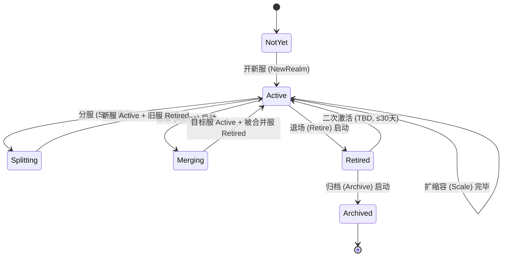

# 基本设计书（基本設計書 / Basic Design Document）

**服务器全生命周期管理 Server Lifecycle Management (LCM)**

| 项目 | 内容 |
|---|---|
| 文档编号 | RGS-BAS-037 |
| 版本 | 0.2 |
| 父文档 | RGS-REQ-037 服务器全生命周期管理 需求定义书 |
| 配套设计 | RGS-BAS-020 §4（合服/分服执行流程，已被本文档纵向延伸至开新服/退场/归档）；RGS-BAS-022 §3.3（分片新增/下线流程，已被本文档扩为开新服 SOP）；RGS-BAS-031（ClusterOpsService PFAU 编排，扩 `realm_lifecycle` Feature 类型）；RGS-ADR-0015（Saga 适用边界） |
| 制定日 | 2026-08-21 |
| 制定者 | 架构师 |
| 保密级别 | 内部限定（Internal Use Only） |
| 适用许可 | Apache-2.0（本仓库） |

---

## 修订历史（改訂履歴 / Revision History）

| 版本 | 修订日 | 修订者 | 审批者 | 修订内容 | 影响需求ID |
|---|---|---|---|---|---|
| 0.1 | 2026-08-21 | 架构师 | — | 初版制定。落实 RGS-REQ-037 全部 FR-LCM-001~085 与 NFR-LCM-001~008；扩 RGS-BAS-020 §4 为 6 阶段全生命周期统一视图；扩 RGS-BAS-022 §3.3 为开新服 SOP；定义 `RealmLifecycleService` 组件（依附既有 `ClusterOpsService` 限界上下文，扩 ARC-051 Feature 类型为 `realm_lifecycle`）；定义 `SplitPlan` / `MergeConflictRuleSet` v2（含未结算抽奖/未领取邮件/工会申请扩展）/ `RetirePlan` / `ArchivePolicy` Schema；定义分服 `realm_lifecycle::split` 操作与合服 `realm_lifecycle::merge` 操作的 Saga 编排时序；落实 6 阶段端到端不变量 | 全部 |
| 0.2 | 2026-08-21 | Ulysses(一人公司 12 角色兼任 per DEC-008) | Ulysses(同) | 具名人类审批完成(per RGS-WBS-001 §17 集体签字声明):一人公司兼任体制下,Ulysses 在本表审批栏各角色中具名签字,完整 12 角色兼任清单见 RGS-WBS-001 §17。审批栏细化角色意见与 DEC-008 兼任对应关系见 RGS-REQ-004 §3.10。**升 v0.2**: 文档从 v0.1 草案转为 v0.2 具名审批版,生产基线化仍需 G-CODE-06 实测通过(per RGS-WF-001) | 全部 |

## 审批栏（承認欄 / Approval）

| 角色 | 姓名 | 审批日 | 备注 |
|---|---|---|---|
| 制定（起草） | 架构师 | 2026-08-21 | — |
| 评审（架构） |  |  | ①6 阶段划分与既有 ARC-018 挂载/退场、ARC-040 横向分片、ARC-051 ClusterOpsService 是否一致不冲突；②`RealmLifecycleService` 限界上下文归属（**确认归 AD 扩展，不新建限界上下文**） |
| 评审（运营/SRE） |  |  | ①开新服 SOP 资源评估模板是否覆盖真实运营场景；②退场后归档期数据查询通道是否覆盖客服与监管诉求 |
| 评审（DBA） |  |  | ①退场后归档的冷热分层存储策略与既有 RGS-BAS-007 §4 分区设计是否一致；②合服/分服跨 DB 写入的 Saga 编排与既有 RGS-ADR-0015 Saga 边界 |
| 评审（合规/法务） |  |  | 退场后数据保留期（FR-LCM-080）与各地区法规（GDPR/个保法/网络安全法）的合规边界；归档后"被遗忘权"删除通路（FR-LCM-084）的可执行性 |
| 审批（负责人） |  |  | 本文档的基准化；阶段变更 OLU 预算需与 ARC-026 联动 |

| **集体签字(per DEC-008)** | **Ulysses(一人公司 12 角色兼任)** | **2026-08-21** | **Ulysses 在审批栏各角色中具名签字,完整 12 角色兼任清单见 RGS-WBS-001 §17 集体签字声明。审批栏细化角色意见详见 RGS-REQ-004 §3.10。** |

---

## 目录

1. [前言](#1-前言)
2. [组件图与限界上下文归属](#2-组件图与限界上下文归属)
3. [6 阶段状态机与端到端不变量](#3-6-阶段状态机与端到端不变量)
4. [RealmLifecycleService 设计](#4-reallifecycleservice-设计)
5. [开新服 New Realm 详细设计](#5-开新服-new-realm-详细设计)
6. [扩缩容 Scale Out / In 详细设计](#6-扩缩容-scale-out--in-详细设计)
7. [分服 Split 详细设计](#7-分服-split-详细设计)
8. [合服 Merge 详细设计](#8-合服-merge-详细设计)
9. [退场 Retire 详细设计](#9-退场-retire-详细设计)
10. [归档 Archive 详细设计](#10-归档-archive-详细设计)
11. [Feature 类型 `realm_lifecycle` 扩展](#11-feature-类型-realm_lifecycle-扩展)
12. [Saga 编排时序](#12-saga-编排时序)
13. [OLU 预算与可观测性](#13-olu-预算与可观测性)
14. [标准化检查清单](#14-标准化检查清单)
15. [追溯性](#15-追溯性)

---

# 1. 前言

本文档落实 RGS-REQ-037（服务器全生命周期管理 需求定义书）全部 6 阶段（开新服 / 扩缩容 / 分服 / 合服 / 退场 / 归档）的功能与非功能需求，扩 RGS-BAS-020 §4 与 RGS-BAS-022 §3.3 既有的合服/分服 + 分片新增/下线设计为统一的端到端生命周期视图，并定义 `RealmLifecycleService` 组件（依附既有 `ClusterOpsService` 限界上下文，扩 ARC-051 Feature 类型为 `realm_lifecycle`）。

**核心原则（继承 RGS-REQ-037 §1.2 既定）**：
- **不新建独立限界上下文**——`RealmLifecycleService` 归 AD 限界上下文扩展，与 `ClusterOpsService` 同库同部署
- **不重发明挂载/退场判定**——ARC-018 既定判定是技术底座，LCM 复用为"新分片接入"与"分片下线"的技术判定
- **不分发新 GM 控制台**——所有阶段变更经既有 `AdminService`（ARC-019）统一入口
- **不引入新事务范式**——跨 DB 阶段变更复用 RGS-ADR-0015 Saga 适用边界与单一调解者原则
- **不分发新 Saga 编排器**——`RealmLifecycleService` 作为 PFAU 编排的一种 `realm_lifecycle` Feature 走 ClusterOpsService 既定 PFAU 流程

# 2. 组件图与限界上下文归属

## 2.1 限界上下文归属

按 RGS-REQ-037 §1.2 既定原则，`RealmLifecycleService` **不**新建独立限界上下文，**归 AD 限界上下文扩展**（与既有 `ClusterOpsService` / `AdminService` 同上下文）。理由：

- 阶段变更的审批 / 审计 / 限流全部走既有 `AdminService`（ARC-019），新限界上下文会重复建设
- 阶段变更作为 Feature 编排走 PFAU 流程（RGS-BAS-031），新限界上下文会绕过既定 PFAU 状态机
- 阶段变更的元数据（`RealmDirectoryService` 路由表 / `SplitPlan` / `MergeConflictRuleSet`）均可落在既有 `admin_db`，不引入新 DB

## 2.2 组件图

```
┌──────────────────────────────────────────────────────────────────────┐
│                       GM 后台 UI (既有, 扩展新增 LCM UI 页面)            │
│  ┌──────────────┬──────────────┬──────────────┬──────────────┐        │
│  │ 账号管控      │ 服务器管控    │ 告警         │ LCM UI (新增)  │        │
│  │ (既有)        │ (既有 + 扩 LCM)│ (既有)        │              │        │
│  └──────────────┴──────────────┴──────────────┴──────────────┘        │
│         │              │              │              │                │
│         └──────────────┴──────────────┴──────────┘ │                │
│                                                    │                │
│                            AdminService 统一入口 (RBAC+审计+限流)  ◄──┘
│                                                    │ gRPC
└────────────────────────────────────────────────────┼─────────────────┘
                                                     │
                                                     ▼
┌──────────────────────────────────────────────────────────────────────┐
│        AD 限界上下文 (既有 admin_db + 既有 Deployment, 扩展)            │
│  ┌─────────────────────────────────────────────────────────────────┐ │
│  │  AdminService (既有)                                              │ │
│  │    └─ 转发到 RealmLifecycleService (新增)                          │ │
│  └─────────────────────────────────────────────────────────────────┘ │
│  ┌─────────────────────────────────────────────────────────────────┐ │
│  │  ClusterOpsService (既有)                                         │ │
│  │    ├─ PFAURunner (既有, 扩 `realm_lifecycle` Feature 类型)        │ │
│  │    └─ Feature Registry (既有, 新增 `realm_lifecycle` 子类)        │ │
│  └─────────────────────────────────────────────────────────────────┘ │
│  ┌─────────────────────────────────────────────────────────────────┐ │
│  │  RealmLifecycleService (新增, 本文档落地)                          │ │
│  │    ├─ NewRealmOperator      开新服                                 │ │
│  │    ├─ ScaleOperator         扩缩容                                 │ │
│  │    ├─ SplitOperator         分服                                   │ │
│  │    ├─ MergeOperator         合服 (扩 RGS-BAS-020 §4)               │ │
│  │    ├─ RetireOperator        退场                                   │ │
│  │    └─ ArchiveOperator       归档                                   │ │
│  └─────────────────────────────────────────────────────────────────┘ │
│         │                                                          │
│         │ 写 admin_db                                              │
│         ▼                                                          │
│  ┌─────────────────────────────────────────────────────────────┐  │
│  │  admin_db (既有, 本设计新增若干表)                              │ │
│  │    ├─ operation_audit              (既有, FR-LCM-002 复用)    │ │
│  │    ├─ realm_directory              (既有, RGS-BAS-020 §3)     │ │
│  │    ├─ realm_lifecycle_run          (新增, FR-LCM-002 状态)   │ │
│  │    ├─ new_realm_plan               (新增, FR-LCM-020 资源评估)│ │
│  │    ├─ split_plan                   (新增, FR-LCM-051 玩家分流)│ │
│  │    ├─ merge_conflict_rule_set_v2   (新增, 扩 RGS-BAS-020 §4.1)│ │
│  │    ├─ retire_plan                  (新增, FR-LCM-071 退场)   │ │
│  │    └─ archive_policy               (新增, FR-LCM-080 归档)   │ │
│  └─────────────────────────────────────────────────────────────┘  │
└──────────────────────────────────────────────────────────────────────┘
         │
         │ 协调 (Saga 模式, ADR-0015)
         ▼
┌──────────────────────────────────────────────────────────────────────┐
│  业务域 (既有) — 阶段变更触发的跨 DB 写入                             │
│  ┌──────────┬──────────┬──────────┬──────────┬──────────┐            │
│  │ player_db│economy_db│ social_db│ match_db │ admin_db │            │
│  └──────────┴──────────┴──────────┴──────────┴──────────┘            │
└──────────────────────────────────────────────────────────────────────┘
```

## 2.3 责任矩阵

| 组件 | 负责 | 不负责 |
|---|---|---|
| `AdminService`（既有）| RBAC / 审批 / 审计 / 限流 / 转发 | 阶段变更业务逻辑、跨 DB Saga |
| `ClusterOpsService`（既有）| Feature 编排、PFAU 状态机、ARC-051 既定能力 | 阶段变更业务逻辑（**委托**给 `RealmLifecycleService`）|
| `RealmLifecycleService`（新增）| 6 阶段操作器（开新服/扩缩容/分服/合服/退场/归档）、`SplitPlan` / `MergeConflictRuleSet` v2 / `RetirePlan` / `ArchivePolicy` 评估、Saga 步骤编排 | RBAC / 审计 / 限流（由 AdminService 兜底）|
| `PFAURunner`（既有扩）| 阶段变更作为 `realm_lifecycle` Feature 走 PFAU 状态机（`paused / retrying / rolling_back / aborted`）| 阶段变更具体步骤 |
| `RealmDirectoryService`（既有）| 玩家选服路由表 | 阶段变更本身 |
| 业务域 DB（既有）| 阶段变更触发的数据改写（玩家迁移、关系保持、资产合并）| 阶段变更流程本身 |
| 客服系统（既有 RGS-REQ-019）| 退场/归档后查询通道 | 退场/归档流程本身 |

# 3. 6 阶段状态机与端到端不变量

## 3.1 6 阶段状态机（落地 RGS-REQ-037 §5.1）



## 3.2 端到端不变量（落地 RGS-REQ-037 §5.2 FR-LCM-001~006）

| 编号 | 不变量 | 实现机制 |
|---|---|---|
| FR-LCM-001 资产不丢不重 | 阶段变更前后资产总量 100% 一致 | Saga 编排 + 演练环境生产数据快照验证 |
| FR-LCM-002 跨阶段可审计 | `admin_db.operation_audit` 完整留痕 | 复用 RGS-BAS-003 §7 审计通路，所有阶段变更**强制**经 AdminService |
| FR-LCM-003 跨阶段可演练 | 任意阶段变更先演练后正式 | 演练模式（`drift` / `drill` 标记）置入 `realm_lifecycle_run` 表，**未通过演练不允许切到 `executing` 状态** |
| FR-LCM-004 跨阶段门禁一致 | 经既有 AdminService 统一入口 | RealmLifecycleService **不**对外暴露独立 gRPC / HTTP，**仅**经 AdminService 转发 |
| FR-LCM-005 跨 DB 最终一致 | Saga 单一调解者 | RealmLifecycleService 作为 Saga 编排者，ClusterOpsService 作为 PFAU 监督者 |
| FR-LCM-006 玩家最小告知 | 阶段变更前 ≥ 7 天公告 + 邮件 | `RealmDirectoryService` 状态联动 + 邮件/公告任务入队 |

# 4. RealmLifecycleService 设计

## 4.1 内部组件

| 组件 | 职责 |
|---|---|
| `NewRealmOperator` | 资源评估（`NewRealmPlan`）、挂载清单触发、灰度开放编排 |
| `ScaleOperator` | 节点级 / 整服级扩缩容，复用既有 HPA + 弹性预留 |
| `SplitOperator` | `SplitPlan` 评估、玩家分流执行、跨服关系保持、跨 DB Saga 编排 |
| `MergeOperator` | `MergeConflictRuleSet` v2 评估、数据合并执行、跨 DB Saga 编排（扩 RGS-BAS-020 §4） |
| `RetireOperator` | `RetirePlan` 评估、只读维护模式编排、退场后查询通道开启 |
| `ArchiveOperator` | `ArchivePolicy` 评估、冷热分层存储编排、合规删除通路 |

## 4.2 持久化 Schema

### `realm_lifecycle_run`（阶段变更实例，FR-LCM-002 / FR-LCM-003）

```sql
CREATE TABLE realm_lifecycle_run (
    run_id              UUID        NOT NULL PRIMARY KEY,
    feature_id          TEXT        NOT NULL,                -- 'rgs.realm_lifecycle.{new_realm|scale|split|merge|retire|archive}'
    feature_type        TEXT        NOT NULL DEFAULT 'realm_lifecycle',  -- ARC-051 Feature 类型扩展
    realm_id            TEXT        NOT NULL,                -- 目标/源 realm_id
    target_realm_ids    TEXT[]      NULL,                    -- 涉及的其他 realm（如合服/分服的多方）
    status              TEXT        NOT NULL,                -- declared / planning / drill_validated / executing / observing / completed / paused / failed / rolled_back
    drill_run_id        UUID        NULL,                    -- 关联的演练 run
    plan_snapshot       JSONB       NOT NULL,                -- NewRealmPlan / SplitPlan / MergeConflictRuleSet v2 / RetirePlan / ArchivePolicy 快照
    leader_epoch        BIGINT      NOT NULL DEFAULT 0,      -- PFAU 仲裁
    request_id          UUID        NOT NULL,                -- 幂等键
    operator_id         TEXT        NOT NULL,                -- 操作者 (RBAC 角色)
    approved_by         TEXT        NULL,                    -- 高危操作二次确认
    created_at          TIMESTAMPTZ NOT NULL DEFAULT now(),
    updated_at          TIMESTAMPTZ NOT NULL DEFAULT now(),
    CONSTRAINT chk_lifecycle_status CHECK (status IN ('declared','planning','drill_validated','executing','observing','completed','paused','failed','rolled_back'))
);
```

### `new_realm_plan`（开新服资源评估，FR-LCM-020）

```sql
CREATE TABLE new_realm_plan (
    plan_id             UUID        NOT NULL PRIMARY KEY,
    target_realm_id     TEXT        NOT NULL UNIQUE,
    display_name        TEXT        NOT NULL,
    trigger_source      TEXT        NOT NULL,                -- capacity_gate / ops_planned / architecture_decision
    db_shard_config     JSONB       NOT NULL,                -- {player_db: {...}, economy_db: {...}, social_db: {...}}
    node_pool_config    JSONB       NOT NULL,                -- {scene_actor: N, gateway: M}
    network_config      JSONB       NOT NULL,                -- {vpc, subnet, network_policy, ingress}
    capacity_budget     JSONB       NOT NULL,                -- {tier: T0|T1|T2, reserved: P%}
    rollout_schedule    JSONB       NOT NULL,                -- [{phase, start_at, end_at, audience}]
    notification_config JSONB       NOT NULL,                -- {announcement_days, mail_template, banner_template}
    approved_by         TEXT        NOT NULL,                -- 运营 + 架构 + SRE 三方签字
    created_at          TIMESTAMPTZ NOT NULL DEFAULT now()
);
```

### `split_plan`（分服玩家分流，FR-LCM-051）

```sql
CREATE TABLE split_plan (
    plan_id             UUID        NOT NULL PRIMARY KEY,
    source_realm_id     TEXT        NOT NULL,
    target_realm_ids    TEXT[]      NOT NULL,                -- 分服后的新服列表
    strategy            TEXT        NOT NULL,                -- forced | opt_in | hybrid
    forced_rule         JSONB       NULL,                    -- forced 时按 hash 分配的具体规则
    opt_in_window_days  INT         NULL,                    -- opt_in 时的选择窗口期
    hybrid_rule         JSONB       NULL,                    -- hybrid 时核心玩家 vs 普通玩家的分流规则
    cross_realm_relation JSONB      NOT NULL,                -- {friend: keep|rebuild, guild: keep_as_cross|rebuild, mail: per_player}
    saga_steps          JSONB       NOT NULL,                -- 跨 DB 写入步骤定义
    rollback_window_days INT        NOT NULL DEFAULT 7,
    approved_by         TEXT        NOT NULL,
    created_at          TIMESTAMPTZ NOT NULL DEFAULT now()
);
```

### `merge_conflict_rule_set_v2`（合服冲突规则，扩 RGS-BAS-020 §4.1）

```sql
CREATE TABLE merge_conflict_rule_set_v2 (
    rule_set_id             UUID        NOT NULL PRIMARY KEY,
    merge_job_id            UUID        NOT NULL,
    -- 既有 (RGS-BAS-020 §4.1 扩字段)
    character_name_rule     TEXT        NOT NULL,        -- auto_rename_with_suffix | require_manual_rename_on_login
    unique_item_rule        TEXT        NOT NULL,        -- stack_additively | keep_both | keep_earliest_and_compensate
    currency_rule           TEXT        NOT NULL DEFAULT 'sum',
    -- 扩展 (RGS-REQ-037 FR-LCM-062)
    pending_lottery_rule    TEXT        NOT NULL,        -- settle_before_merge | cancel_and_compensate | carry_over_as_pending
    unclaimed_mail_rule     TEXT        NOT NULL,        -- carry_over | expire_after_merge | refund_attachable
    frozen_cross_guild_apply_rule TEXT NOT NULL,        -- approve_then_merge | reject_then_merge | keep_pending
    -- 审计
    approved_by             TEXT        NOT NULL,
    locked_at               TIMESTAMPTZ NOT NULL,        -- 演练与正式执行读取同一份已锁定配置
    created_at              TIMESTAMPTZ NOT NULL DEFAULT now(),
    CONSTRAINT chk_pending_lottery CHECK (pending_lottery_rule IN ('settle_before_merge','cancel_and_compensate','carry_over_as_pending')),
    CONSTRAINT chk_unclaimed_mail CHECK (unclaimed_mail_rule IN ('carry_over','expire_after_merge','refund_attachable')),
    CONSTRAINT chk_frozen_apply CHECK (frozen_cross_guild_apply_rule IN ('approve_then_merge','reject_then_merge','keep_pending'))
);
```

### `retire_plan`（退场计划，FR-LCM-071）

```sql
CREATE TABLE retire_plan (
    plan_id             UUID        NOT NULL PRIMARY KEY,
    target_realm_id     TEXT        NOT NULL,
    trigger_source      TEXT        NOT NULL,                -- merge_merged_into_target | capacity_decision | ops_decision
    migration_window_days INT       NOT NULL,                -- 引导玩家迁出的窗口期
    query_channel_rbac  TEXT[]      NOT NULL,                -- ['cs_agent', 'sre', 'legal'] 等
    reactivation_window_days INT    NOT NULL DEFAULT 30,    -- 二次激活窗口
    audit_chain         JSONB       NOT NULL,                -- 退场前所有操作的可追溯链
    approved_by         TEXT        NOT NULL,
    created_at          TIMESTAMPTZ NOT NULL DEFAULT now()
);
```

### `archive_policy`（归档策略，FR-LCM-080）

```sql
CREATE TABLE archive_policy (
    policy_id           UUID        NOT NULL PRIMARY KEY,
    target_realm_id     TEXT        NOT NULL,
    retire_plan_id      UUID        NOT NULL REFERENCES retire_plan(plan_id),
    hot_archive_years   INT         NOT NULL DEFAULT 3,     -- 热归档保留年限（TBD-LCM-004）
    cold_archive_years  INT         NOT NULL DEFAULT 10,    -- 冷归档保留年限
    storage_redundancy  TEXT        NOT NULL DEFAULT 'n_plus_2',  -- RSK-LCM-005 多副本
    gdpr_delete_path    TEXT        NOT NULL,                -- 被遗忘权删除路径说明
    cross_realm_merge_history BOOLEAN NOT NULL DEFAULT TRUE,    -- 跨服合并回溯保留
    approved_by         TEXT        NOT NULL,
    created_at          TIMESTAMPTZ NOT NULL DEFAULT now()
);
```

# 5. 开新服 New Realm 详细设计

## 5.1 触发流程

```
[触发源]
  ├─ 容量门禁 (Capacity Gate)         → 既有监控触发, 阈值 TBD-LCM-001
  ├─ 运营计划 (Ops Planned)           → GM 后台运维工单 (RGS-BAS-003 §10)
  └─ 架构决策 (Architecture Decision)  → ARC-014/026 评审
              │
              ▼
  [资源评估] RealmLifecycleService.NewRealmOperator
    ├─ 检查 target_realm_id 不冲突
    ├─ 生成 NewRealmPlan 草稿
    ├─ 三方签字: 运营 + 架构 + SRE (NFR-LCM-007 OLU 预算门禁)
    └─ 落地到 new_realm_plan 表
              │
              ▼
  [演练] NewRealmOperator 触发 drill_run
    ├─ 在演练环境以最小配置部署
    ├─ 验证健康检查 + 预热探针
    ├─ 验证 RealmDirectoryService 路由登记
    ├─ 验证灰度开放（白名单压测账号登录）
    └─ drill_validated → approved
              │
              ▼
  [正式执行] PFAU 编排
    ├─ 最小配置就位 (1~2 节点 / 最小 DB)
    ├─ ARC-018 挂载清单执行
    ├─ 渐进式扩容到目标配置
    ├─ RealmDirectoryService 状态 hidden → white_list → channel_gray → all
    └─ 玩家通知任务入队 (公告 / 邮件 / 横幅)
              │
              ▼
  [运行监控] 阶段状态: Active
```

## 5.2 资源评估模板（FR-LCM-020 落地）

| 字段 | 评估项 | 负责人 | 关联文档 |
|---|---|---|---|
| `target_realm_id` | 命名规范遵循 RGS-IMPL-001 编码规范, 与既有不冲突 | 架构 | — |
| `display_name` | 显示名, 多语言支持 | 运营 | RGS-IMPL-001 |
| `db_shard_config.player_db` | 玩家 DB 实例规格 / 副本数 / 分区策略 | DBA | RGS-BAS-007 §4 |
| `db_shard_config.economy_db` | 经济 DB 实例规格 / 副本数 / 分区策略 | DBA | RGS-BAS-007 §4 |
| `db_shard_config.social_db` | 社交 DB 实例规格 / 副本数 / 分区策略 | DBA | RGS-BAS-007 §4 |
| `node_pool_config.scene_actor` | 场景 Actor 节点数 / 单节点容量 | 架构 | RGS-REQ-025 §6 |
| `node_pool_config.gateway` | 网关副本数 / 入口带宽 | 平台 | RGS-BAS-001 |
| `network_config` | VPC / 子网 / NetworkPolicy / Ingress / 带宽配额 | 平台 | RGS-BAS-006 |
| `capacity_budget` | 当前容量级别 (T0/T1/T2) / 预留比例 | SRE | RGS-BAS-022 §4 |
| `rollout_schedule` | 灰度开放阶段表（白名单 / 渠道灰度 / 全量） | 运营 | RGS-BAS-020 §3 |
| `notification_config` | 公告 / 邮件 / 横幅 模板与时间表 | 运营 | RGS-BAS-003 §10 |

## 5.3 演练剧本模板

```yaml
# drill_playbook_template_new_realm.yaml
apiVersion: lcm.rgs/v1
kind: NewRealmDrillPlaybook
metadata:
  plan_id: <new_realm_plan_id>
spec:
  prerequisites:
    - 演练环境已就位 (符合 RGS-OPS-001 部署标准)
    - 演练数据快照生成完毕 (含玩家 / 经济 / 社交 三类样本)
  steps:
    - name: 最小配置挂载
      input: target_realm_id
      action: helm install + kubectl apply
      expected: Pods Ready, health check pass
      rollback: helm uninstall
    - name: RealmDirectoryService 登记
      input: target_realm_id + display_name
      action: AdminService.RealmDirectory.Update
      expected: 路由表新增, hidden 状态
      rollback: AdminService.RealmDirectory.Delete
    - name: 预热探针
      input: 演练账号白名单
      action: 模拟玩家登录 + 场景创建
      expected: 100% 成功率, 延迟 < NFR-PE-001
      rollback: 清理演练账号数据
    - name: 灰度开放
      input: 渠道灰度比例
      action: AdminService.RealmDirectory.SetGray
      expected: 灰度比例生效, 玩家路由正确
      rollback: AdminService.RealmDirectory.SetGray(0)
  pass_criteria:
    - 所有步骤 expected 命中
    - FR-LCM-001 资产不丢不重 (演练环境样本数据前后一致)
    - 演练报告自动生成并归档
  on_fail:
    - 自动 rollback 所有已完成步骤
    - 通知运营 + 架构 + SRE
    - 不允许切到 executing 状态
```

# 6. 扩缩容 Scale Out / In 详细设计

## 6.1 节点级扩缩容

- **扩容**：复用既有 HPA（`RGS-BAS-002 §5.1`）与弹性预留（`RGS-BAS-022 §4.1`），**不**为 LCM 另设机制
- **缩容**（FR-LCM-043~044）：扩展 HPA 缩容流程，新增"主动迁移 + 验证空闲"步骤

```
[HPA 触发缩容]
    │
    ▼
[候选节点选择] 优先选无场景 Actor / 无插件宿主的节点
    │
    ▼
[主动迁移]
  ├─ RealtimeServerSupervisor 将场景 Actor 迁出
  ├─ 插件宿主迁移到其他节点（验证稳态）
  └─ 等待 60s 验证无活跃玩家
    │
    ▼
[验证空闲]
  ├─ 节点无活跃会话
  ├─ 节点无活跃场景 Actor
  └─ 节点无唯一插件宿主
    │
    ▼
[执行下线] kubectl delete (or equivalent)
```

## 6.2 整服级扩缩容

整服级扩容**复用** §5 开新服 SOP（FR-LCM-041），**不**为整服级扩缩容发明独立流程。

## 6.3 DB 层扩缩容

DB 层扩缩容**复用** RGS-BAS-007 §4 既定分区设计，**不**为 LCM 改写分区策略（FR-LCM-042）。

# 7. 分服 Split 详细设计

## 7.1 流程总览

```
[SplitPlan 评审]
    │
    ▼
[演练] drill_run
    ├─ 在演练环境生成 source_realm_id 数据快照
    ├─ 执行 split_plan.saga_steps (Saga 模式, §12)
    ├─ 验证: 资产不丢不重 (FR-LCM-001)
    ├─ 验证: 玩家分流与策略一致 (FR-LCM-051)
    ├─ 验证: 跨服关系正确保持或拆分 (FR-LCM-052)
    └─ 验证: Saga 补偿在分服中途崩溃场景能回退
    │
    ▼
[正式执行] PFAU 编排
    ├─ source_realm_id 进入 Splitting 状态
    ├─ target_realm_ids 依次进入 Active (hidden)
    ├─ Saga 步骤执行 (player_db / social_db / economy_db)
    ├─ 跨服关系保持 (好友 / 工会)
    ├─ 玩家通知 (≥ 7 天预告)
    └─ source_realm_id → Retired, target_realm_ids → Active
    │
    ▼
[冷静期] TBD-LCM-005
    ├─ 玩家可在 N 天内主动切到另一 target_realm_id
    └─ N 天后固化归属
    │
    ▼
[回退窗口] split_plan.rollback_window_days
    ├─ 若发现问题可按 Saga 反向步骤回退
    └─ 超出窗口期则进入归档查询通道 (FR-LCM-085)
```

## 7.2 玩家分流策略（FR-LCM-051 落地）

| 策略 | 适用场景 | 规则 |
|---|---|---|
| `forced` | 运营快速分服、玩家无选择权诉求 | 按 `hash(account_id) mod N` 分配, N = target_realm_ids 数量 |
| `opt_in` | 玩家社区诉求强（如老玩家希望去新服而非老玩家扎堆）| 玩家在 N 天内主动选择 target_realm_id, 超期未选按默认规则 |
| `hybrid` | 核心玩家（VIP / 高活跃 / 工会会长）与普通玩家分流规则不同 | 核心玩家 opt_in + 普通玩家 forced |

## 7.3 跨服关系保持（FR-LCM-052 落地）

| 关系 | 策略 | 实现 |
|---|---|---|
| 好友 | 跨服好友（保留关系但归属不同服）| `social_db.friend` 表**不**改 `realm_id`, 仅追加 `cross_realm: true` 标记 |
| 工会 | ① 全部成员到同一新服 → 整体迁移; ② 分散到多服 → 按 `split_plan.cross_realm_relation.guild` 拆分为跨服工会或保留为独立工会 | `social_db.guild` 表 + `social_db.guild_member` 表 |
| 私聊记录 | 按玩家归属迁移（不与跨服关系混同）| `social_db.private_message` 表按发送方/接收方 `account_id` 迁移 |
| 邮件 | 全部迁移到新归属服 | `economy_db.mail` 表按收件人 `account_id` 迁移 |

## 7.4 演练剧本模板

```yaml
# drill_playbook_template_split.yaml
apiVersion: lcm.rgs/v1
kind: SplitDrillPlaybook
metadata:
  plan_id: <split_plan_id>
spec:
  prerequisites:
    - source_realm_id 演练数据快照就位
    - target_realm_ids 演练环境已最小化部署
  steps:
    - name: 数据快照采集
      expected: 资产总量 N 玩家 / M 金币 / K 道具
    - name: Saga 步骤 1: player_db.realm_id 改写
      expected: 全部玩家 account_id 正确归属到 target_realm_ids
    - name: Saga 步骤 2: social_db.friend 跨服标记
      expected: 跨服好友数与 split_plan.cross_realm_relation.friend 规则一致
    - name: Saga 步骤 3: social_db.guild 拆分
      expected: 跨服工会数 / 整体迁移工数 / 拆分后工会数 与规则一致
    - name: Saga 步骤 4: economy_db.mail 迁移
      expected: 邮件按收件人 account_id 正确归属
    - name: 一致性校验
      expected: 资产总量 100% 一致 (FR-LCM-001)
    - name: Saga 补偿演练
      trigger: 步骤 1 注入失败
      expected: 全部步骤回退至分服前状态
  pass_criteria:
    - 所有步骤 expected 命中
    - FR-LCM-001 资产不丢不重
    - Saga 补偿正确
  on_fail:
    - 自动 rollback
    - 通知运营 + 架构 + DBA
    - 不允许切到 executing
```

# 8. 合服 Merge 详细设计

## 8.1 与既有 RGS-BAS-020 §4 的关系

合服基本流程**复用** RGS-BAS-020 §4 既有五步流程，本文档**仅**在以下三处作纵向延伸：

1. **合服冲突规则扩展**（§8.2，落地 FR-LCM-062）：新增 3 类边缘数据冲突（未结算抽奖/未领取邮件/工会申请）
2. **Saga 编排**（§12）：合服作为 PFAU 的 `realm_lifecycle::merge` Feature 类型走 Saga 模式
3. **回退窗口**（§8.3，落地 FR-LCM-064）：合服后 N 天内可按 Saga 反向步骤回退

## 8.2 合服冲突规则扩展（FR-LCM-062 落地）

RGS-BAS-020 §4.1 既有 `MergeConflictRuleSet` 字段扩为 v2（§4.2 `merge_conflict_rule_set_v2` 表），新增 3 类规则：

| 新增规则 | 选项 | 含义 |
|---|---|---|
| `pending_lottery_rule` | `settle_before_merge` / `cancel_and_compensate` / `carry_over_as_pending` | 未结算抽奖（开宝箱/抽卡/转盘等待开奖）合服前如何处理 |
| `unclaimed_mail_rule` | `carry_over` / `expire_after_merge` / `refund_attachable` | 未领取邮件（带附件的）合服后如何处理 |
| `frozen_cross_guild_apply_rule` | `approve_then_merge` / `reject_then_merge` / `keep_pending` | 冻结中的跨服工会申请合服时如何处理 |

> **强制要求**：3 类规则**必须**在 `merge_conflict_rule_set_v2.locked_at` 锁定，演练与正式执行读取同一份已锁定配置，**不得**临时调整（与 RGS-BAS-020 §4.1 既有纪律一致）。

## 8.3 合服回退窗口（FR-LCM-064 落地）

| 状态 | 含义 | 处理 |
|---|---|---|
| 回退窗口期内（≤ TBD-LCM-002，典型 7~30 天）| `realm_lifecycle_run.status = 'completed'` 但仍在可回退窗口 | 可通过 AdminService 触发 `realm_lifecycle::merge_rollback` Feature，走 Saga 反向步骤 |
| 回退窗口期外 | 超出窗口期 | **不**回退到在线服，进入退场服归档（§10）查询通道 |

## 8.4 合服与冻结（FR-LCM-061 落地）

合服前**必须**冻结以下进行中事务：
- 玩家间交易（RGS-REQ-018 既定）
- 未结算抽奖 / 转盘
- 未领取邮件（特别是带附件的）
- 跨服工会申请
- 拍卖行挂单

冻结方式：合服前 T 小时（TBD）GM 后台发布维护公告，进入"只读模式"（RGS-REQ-023 §3 既有维护模式传播机制），不允许新开上述事务，存量事务按既定规则处置。

# 9. 退场 Retire 详细设计

## 9.1 流程

```
[RetirePlan 评审]
    │
    ▼
[演练] drill_run
    ├─ 模拟只读维护模式
    ├─ 模拟玩家迁出（合服 / 自然流失 / 主动转服）
    ├─ 模拟查询通道开启
    └─ 验证: 资产 100% 保留 (FR-LCM-072)
    │
    ▼
[正式执行] PFAU 编排
    ├─ realm_id 进入"只读维护模式"
    ├─ RealtimeServerSupervisor 停止接收新会话
    ├─ 玩家迁出引导（按 RetirePlan.migration_window_days）
    ├─ 超期未迁出玩家进入"数据保留态"（仍可查询历史，不可登录）
    ├─ 运行时节点下线（按 §6 节点级缩容流程）
    ├─ 客服 / SRE / 法务 RBAC 通道开启 (FR-LCM-073)
    ├─ RealmDirectoryService 状态 → retired (对玩家隐藏, 对客服可见)
    └─ 进入二次激活窗口期
    │
    ▼
[二次激活窗口期] retire_plan.reactivation_window_days
    ├─ 可通过 AdminService 触发反向退场重新上线
    └─ 超出后须经架构评审
    │
    ▼
[归档启动] 等待 retire_plan.migration_window_days + 二次激活窗口期
    │
    ▼
[归档] (见 §10)
```

## 9.2 玩家迁出引导（FR-LCM-071 落地）

| 引导方式 | 触发时间 | 渠道 |
|---|---|---|
| 游戏内公告 | 退场前 14 天 / 7 天 / 3 天 / 1 天 | 横幅 + 弹窗 |
| 邮件 | 退场前 14 天 / 7 天 / 1 天 | 全量邮件 |
| 主动转服奖励 | 退场前 7 天 | 限时免费转服（可携带资产） |
| 合服承接 | 退场前 N 天同步启动合服 | 见 §8 |

## 9.3 退场后查询通道（FR-LCM-073 落地）

- **RBAC 角色**：`cs_agent` / `sre` / `legal`（由 `retire_plan.query_channel_rbac` 配置）
- **查询入口**：客服系统（RGS-REQ-019 既有）+ GM 后台查询面板
- **数据范围**：退场服全部数据（账号/角色/经济/社交/支付/审计）
- **审计**：每次查询**必须**留痕到 `admin_db.operation_audit`（双层审计：客服查 + 法务监控）

# 10. 归档 Archive 详细设计

## 10.1 分级存储

| 级别 | 存储 | 查询方式 | 保留期 |
|---|---|---|---|
| **热归档** | 关系型 DB 冷备实例（与生产 DB 同构）| 在线查询（仅读）| `archive_policy.hot_archive_years`（默认 3 年）|
| **冷归档** | 对象存储 + 归档库（如 S3 Glacier / 自托管 MinIO cold tier）| 按需还原（小时级）| `archive_policy.cold_archive_years`（默认 10 年）|
| **超期** | — | — | 超期按合规策略评估（GDPR 个保法评估） |

## 10.2 归档启动流程

```
[归档触发] 满足以下全部条件
    ├─ 退场流程已 completed
    ├─ 二次激活窗口期已过
    └─ archive_policy 已评审通过
    │
    ▼
[热归档]
    ├─ DB 切换为冷备实例（只读副本）
    ├─ 写入路径全部关闭
    ├─ 客服查询通道切换到冷备实例
    └─ 热归档完成
    │
    ▼
[冷归档] 热归档到期后启动
    ├─ 全量数据导出至对象存储（多副本 N+2）
    ├─ DB 实例下线（不删除数据, 仅释放资源）
    ├─ 索引/查询视图同步到冷归档
    └─ 冷归档完成
    │
    ▼
[长期保留] cold_archive_years 内
    ├─ 客服 / 监管 / 法务查询走冷归档还原通路
    └─ 跨服合并回溯保留 (FR-LCM-085)
```

## 10.3 合规删除通路（FR-LCM-084 落地）

- **触发**：收到 GDPR / 个保法"被遗忘权"请求（玩家主动 / 监管要求）
- **执行**：在 `admin_db.operation_audit` 留下双重审计记录（**不**走"仅追加"约束的例外通路, NFR-SE-010 既有约束的合规例外）
- **范围**：定位该玩家在所有归档级别（热 + 冷）中的数据
- **删除后**：
  - 跨服合并回溯中该玩家的数据被匿名化（**不**删除回溯链, 避免影响其他玩家）
  - 客服系统标记"该玩家数据已依法删除", 后续查询返回合规提示
  - 法务系统确认删除完成并归档凭证

# 11. Feature 类型 `realm_lifecycle` 扩展

## 11.1 扩展 RGS-BAS-031 §1.1 Feature 类型

RGS-BAS-031 §1.1 既有 4 类 Feature（`bounded_context` / `plugin` / `patch` / `config`）**新增**第 5 类：

| Feature 类型 | ARC | 运行时含义 | 是否独立 App |
|---|---|---|---|
| `realm_lifecycle` | ARC-038 + ARC-051 | 6 阶段（开新服/扩缩容/分服/合服/退场/归档）| 否，作为 AD 限界上下文的扩展功能 |

## 11.2 6 阶段 Feature 子类

| Feature 子类 | 对应操作器 | Feature ID 模式 |
|---|---|---|
| `realm_lifecycle::new_realm` | `NewRealmOperator` | `rgs.realm_lifecycle.new_realm.<target_realm_id>` |
| `realm_lifecycle::scale` | `ScaleOperator` | `rgs.realm_lifecycle.scale.<realm_id>` |
| `realm_lifecycle::split` | `SplitOperator` | `rgs.realm_lifecycle.split.<source_realm_id>.<target_realm_ids>` |
| `realm_lifecycle::merge` | `MergeOperator` | `rgs.realm_lifecycle.merge.<source_realm_ids>.<target_realm_id>` |
| `realm_lifecycle::merge_rollback` | `MergeOperator` | `rgs.realm_lifecycle.merge_rollback.<merge_run_id>` |
| `realm_lifecycle::retire` | `RetireOperator` | `rgs.realm_lifecycle.retire.<realm_id>` |
| `realm_lifecycle::archive` | `ArchiveOperator` | `rgs.realm_lifecycle.archive.<realm_id>` |

## 11.3 PFAU 状态机复用

阶段变更作为 `realm_lifecycle` Feature 走 ClusterOpsService 既定 PFAU 状态机（`declared → canary_in_progress → canary_confirmed → observing → completed`），与 RGS-DTL-031 §4.2 既定 PFAU 批次状态机复用。**特别应用**：

- `paused → retrying`：阶段变更中途暂停（玩家投诉 / 监控告警 / Saga 步骤失败）→ 人工选择重试
- `paused → rolling_back`：阶段变更失败明确 → 人工选择回退（Saga 反向步骤）
- `paused → aborted`：阶段变更明确终止 → 保留已完成的局部状态，不回退也不继续

# 12. Saga 编排时序

## 12.1 分服 Saga 时序（FR-LCM-053 落地）

```
RealmLifecycleService.SplitOperator    ClusterOpsService    player_db    social_db    economy_db
        │                                    │                 │            │             │
        │─── start PFAU (realm_lifecycle::split) ─▶│              │            │             │
        │                                    │                 │            │             │
        │─── Saga 步骤 1: 冻结 source_realm_id ─▶│                 │            │             │
        │                                    │─── begin tx ────▶│            │             │
        │                                    │◀── ack ─────────│            │             │
        │                                    │                 │            │             │
        │─── Saga 步骤 2: player_db.realm_id 改写 ─▶│                 │            │             │
        │                                    │─── begin tx ────▶│            │             │
        │                                    │─── update realm_id ──▶│       │             │
        │                                    │◀── ack ─────────│            │             │
        │                                    │                 │            │             │
        │─── Saga 步骤 3: social_db.friend 跨服标记 ─▶│          │            │             │
        │                                    │─── begin tx ─────────────────▶│             │
        │                                    │─── update friend.cross_realm ──▶│           │
        │                                    │◀── ack ──────────────────────│             │
        │                                    │                 │            │             │
        │─── Saga 步骤 4: social_db.guild 拆分 ─▶│                 │            │             │
        │                                    │─── begin tx ─────────────────▶│             │
        │                                    │─── split guild per plan ─────▶│           │
        │                                    │◀── ack ──────────────────────│             │
        │                                    │                 │            │             │
        │─── Saga 步骤 5: economy_db.mail 迁移 ─▶│                │            │             │
        │                                    │─── begin tx ──────────────────────────▶│   │
        │                                    │─── migrate mail per account ─────────▶│ │
        │                                    │◀── ack ───────────────────────────────│   │
        │                                    │                 │            │             │
        │─── Saga 步骤 6: 一致性校验 ─▶│                 │            │             │
        │                                    │─── 资产总量校验 ─▶│           │             │
        │                                    │◀── 100% 一致 ───│            │             │
        │                                    │                 │            │             │
        │─── commit 全部 ─▶│                 │            │             │
        │                                    │─── commit tx ──▶│            │             │
        │                                    │─── commit tx ──────────────▶│             │
        │                                    │─── commit tx ────────────────────────▶│   │
        │                                    │                 │            │             │
        │─── PFAU observing → completed ──▶│              │            │             │
        │                                    │                 │            │             │
        │  [任意步骤失败 → Saga 反向步骤回退]    │                 │            │             │
```

## 12.2 合服 Saga 时序（与 §12.1 同构）

合服 Saga 时序与分服同构，区别仅在步骤方向（合服是 N→1 合并，分服是 1→N 拆分），反向步骤即 `merge_rollback` Feature。

## 12.3 Saga 步骤幂等性

- **request_id 唯一**：每条 Saga 步骤携带 `request_id`（同 RGS-DTL-031 §3.1 幂等记录设计）
- **重试不重复执行**：步骤失败重试时，DB 层通过 `request_id` 唯一索引识别已执行步骤
- **回退不丢**：Saga 反向步骤按 `request_id` 识别已前向执行的步骤，全部回退

# 13. OLU 预算与可观测性

## 13.1 OLU 预算（NFR-LCM-007 落地）

阶段变更 OLU 预算**必须**纳入 ARC-026 核算，参考 ARC-026 既定 OLU 估算方法：

| 阶段 | 涉及团队 | 估算 OLU | 备注 |
|---|---|---|---|
| 开新服 | 架构 + SRE + DBA + 运营 + 法务（签字）| TBD-LCM-007 | 单次事件, 高密度期间须串行调度 |
| 扩缩容 | SRE（自动）+ DBA（DB 缩容）| TBD-LCM-007 | 节点级自动不耗 OLU, DB 缩容需 DBA |
| 分服 | 架构 + SRE + DBA + 运营（签字）| TBD-LCM-007 | 含演练 + 正式执行 |
| 合服 | 架构 + SRE + DBA + 运营 + 法务（签字）| TBD-LCM-007 | 含演练 + 正式执行 |
| 退场 | 架构 + SRE + DBA + 运营 + 法务（签字）| TBD-LCM-007 | 含客服通道开启 |
| 归档 | DBA + 法务（签字）| TBD-LCM-007 | 含冷热分层存储评估 |

> **高密度期间串行调度**：NFR-LCM-007 缓解 RSK-LCM-006 高密度期间 OLU 击穿。

## 13.2 可观测性指标（接入既有 RGS-BAS-004 埋点体系）

| 指标名 | 类型 | 说明 |
|---|---|---|
| `lcm_run_state_transition_total` | Counter | 阶段变更 PFAU 状态转移次数（按 feature_subtype / from / to 维度）|
| `lcm_active_runs` | Gauge | 当前进行中的阶段变更实例数 |
| `lcm_drill_pass_rate` | Gauge | 演练通过率（按 feature_subtype 维度）|
| `lcm_drill_to_execute_duration_seconds` | Histogram | 从 drill_validated 到 executing 的间隔（应 ≥ 演练报告评审时长）|
| `lcm_saga_step_duration_seconds` | Histogram | 单个 Saga 步骤耗时（按 step / realm 维度）|
| `lcm_saga_rollback_total` | Counter | Saga 回退次数（按 feature_subtype / reason 维度）|
| `lcm_drill_failure_reason_total` | Counter | 演练失败原因分布（按 reason 维度：asset_mismatch / relation_broken / saga_compensation_failed / ...）|
| `lcm_archive_query_latency_seconds` | Histogram | 归档后客服查询响应时延（NFR-LCM-006 p99 < 5s）|
| `lcm_realm_count_by_status` | Gauge | 实时各状态 realm 数（按 NotYet / Active / Scaling / Splitting / Merging / Retired / Archived 维度）|
| `lcm_olu_consumed_by_team` | Gauge | 各团队 OLU 消耗（按 team / phase 维度，NFR-LCM-007）|

# 14. 标准化检查清单

## 14.1 上线前检查清单

- [ ] RealmLifecycleService 限界上下文归属确认：归 AD 扩展，**不**新建独立上下文
- [ ] 6 阶段操作器（NewRealm / Scale / Split / Merge / Retire / Archive）全部实现并接入 ClusterOpsService PFAU
- [ ] `realm_lifecycle` Feature 类型扩展到 RGS-BAS-031 §1.1
- [ ] `realm_lifecycle_run` / `new_realm_plan` / `split_plan` / `merge_conflict_rule_set_v2` / `retire_plan` / `archive_policy` 6 张表 schema 在 `admin_db` 创建
- [ ] DB migration 走既有 CI 流水线（FR-LCM-004 门禁）
- [ ] 演练环境就位：每类阶段变更（开新服/分服/合服/退场/归档）均有 drill_playbook 模板
- [ ] 演练通过后方可切到 `executing` 状态（FR-LCM-003 门禁）
- [ ] 阶段变更 OLU 预算纳入 ARC-026 核算（NFR-LCM-007）
- [ ] 跨 DB 写入走 Saga 模式 + 单一调解者（FR-LCM-005）
- [ ] 玩家通知 ≥ 7 天预告（NFR-LCM-004）
- [ ] 退场后 RBAC 查询通道开启，客服/法务测试可查
- [ ] 归档冷热分层存储评估 + N+2 冗余验证（RSK-LCM-005 缓解）
- [ ] GDPR "被遗忘权"删除通路测试（FR-LCM-084）
- [ ] 跨服合并回溯保留验证（FR-LCM-085）
- [ ] 合服回退窗口期内可回退测试（AC-LCM-009）
- [ ] 退场后 30 天内二次激活测试（AC-LCM-008）

## 14.2 代码评审检查清单

- [ ] `RealmLifecycleService` **不**对外暴露独立 gRPC / HTTP 接口，**仅**经 AdminService 转发（FR-LCM-004 门禁）
- [ ] 6 阶段操作器**不**绕过 ClusterOpsService PFAU 编排（FR-LCM-005）
- [ ] Saga 步骤**全部**携带 `request_id` 幂等键
- [ ] `merge_conflict_rule_set_v2` 在 `locked_at` 锁定后**不**允许运行时修改
- [ ] 退场查询通道**仅**对 `retire_plan.query_channel_rbac` 配置的 RBAC 角色开放
- [ ] 归档冷热分层**不**删除数据，**仅**迁移存储位置（FR-LCM-081）
- [ ] 合规删除**仅**在 `admin_db.operation_audit` 留双层审计后执行（NFR-SE-010 例外通路）

# 15. 追溯性

| 需求 ID | 本设计书章节 |
|---|---|
| FR-LCM-001 资产不丢不重 | §3.2, §7.4, §8.4, §12 |
| FR-LCM-002 跨阶段可审计 | §3.2, §4.2 `realm_lifecycle_run` 表 |
| FR-LCM-003 跨阶段可演练 | §3.2, §5.1, §5.3, §7.4, §8.1, §9.1, §10.1, §14.1 |
| FR-LCM-004 跨阶段门禁一致 | §3.2, §2.3, §14.2 |
| FR-LCM-005 跨 DB 最终一致 | §3.2, §12, §14.2 |
| FR-LCM-006 玩家最小告知 | §3.2, §7.1, §8.4, §9.2 |
| FR-LCM-010/011 开新服触发 | §5.1 |
| FR-LCM-020/021/022 开新服资源评估 + 挂载 | §5.2, §5.1 |
| FR-LCM-030/031/032/033 开新服灰度开放 | §5.1 |
| FR-LCM-040/041/042/043/044 扩缩容 | §6.1, §6.2, §6.3 |
| FR-LCM-050/051/052/053/054/055 分服 | §7.1, §7.2, §7.3, §7.4, §12.1 |
| FR-LCM-060~064 合服 | §8.1, §8.2, §8.3, §8.4, §12.2 |
| FR-LCM-070~075 退场 | §9.1, §9.2, §9.3 |
| FR-LCM-080~085 归档 | §10.1, §10.2, §10.3 |
| NFR-LCM-001 资产不丢不重 | §12, §7.4, §8.4 |
| NFR-LCM-002 演练频率 | §14.1 |
| NFR-LCM-003 审计完整性 | §3.2, §14.2 |
| NFR-LCM-004 玩家通知 | §3.2, §7.1, §9.2 |
| NFR-LCM-005 数据保留期 | §10.1 |
| NFR-LCM-006 归档查询性能 | §10.1, §13.2 |
| NFR-LCM-007 OLU 预算 | §13.1, §14.1 |
| NFR-LCM-008 阶段变更期间服务可用性 | §8.4 维护模式 |
| AC-LCM-001~010 | §14.1, §5.3, §7.4, §8.1, §9.1, §10.1 |

---

> 本文档与 RGS-REQ-037（服务器全生命周期管理 需求定义书）配套使用，并扩展 RGS-BAS-020 §4 与 RGS-BAS-022 §3.3 既有的合服/分服 + 分片新增/下线设计。详细设计阶段须产出 RGS-DTL-XXX，重点是 RealmLifecycleService 的 6 阶段操作器实现、Saga 编排、ClusterOpsService `realm_lifecycle` Feature 集成、admin_db 新增 6 张表的 migration、与既有 ARC-018 挂载/退场、ARC-019 GM 控制平面、ARC-026 OLU 预算、ARC-040 横向分片、ARC-051 ClusterOpsService PFAU 编排的集成时序。
