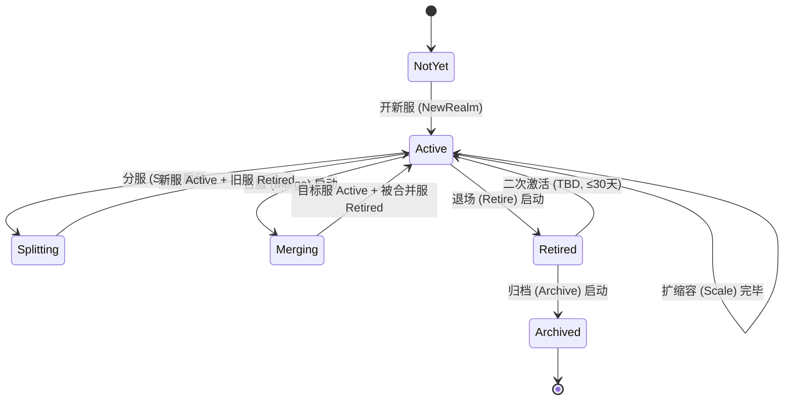

# 基本设计书（基本設計書 / Basic Design Document）

**服务器全生命周期管理 Server Lifecycle Management (LCM)**

| 项目 | 内容 |
|---|---|
| 文档编号 | RGS-BAS-037 |
| 版本 | 0.2 |
| 父文档 | RGS-REQ-037 服务器全生命周期管理 需求定义书 |
| 配套设计 | RGS-BAS-020 §4（合服/分服执行流程，已被本文档纵向延伸至开新服/退场/归档）；RGS-BAS-022 §3.3（分片新增/下线流程，已被本文档扩为开新服 SOP）；RGS-BAS-031（ClusterOpsService PFAU 编排，扩 `realm_lifecycle` Feature 类型）；RGS-ADR-0015（Saga 适用边界） |
| 制定日 | 2026-08-21 |
| 制定者 | 架构师 |
| 保密级别 | 内部限定（Internal Use Only） |
| 适用许可 | Apache-2.0（本仓库） |

---

## 修订历史（改訂履歴 / Revision History）

| 版本 | 修订日 | 修订者 | 审批者 | 修订内容 | 影响需求ID |
|---|---|---|---|---|---|
| 0.1 | 2026-08-21 | 架构师 | — | 初版制定。落实 RGS-REQ-037 全部 FR-LCM-001~085 与 NFR-LCM-001~008；扩 RGS-BAS-020 §4 为 6 阶段全生命周期统一视图；扩 RGS-BAS-022 §3.3 为开新服 SOP；定义 `RealmLifecycleService` 组件（依附既有 `ClusterOpsService` 限界上下文，扩 ARC-051 Feature 类型为 `realm_lifecycle`）；定义 `SplitPlan` / `MergeConflictRuleSet` v2（含未结算抽奖/未领取邮件/工会申请扩展）/ `RetirePlan` / `ArchivePolicy` Schema；定义分服 `realm_lifecycle::split` 操作与合服 `realm_lifecycle::merge` 操作的 Saga 编排时序；落实 6 阶段端到端不变量 | 全部 |
| 0.2 | 2026-08-21 | Ulysses(一人公司 12 角色兼任 per DEC-008) | Ulysses(同) | 具名人类审批完成(per RGS-WBS-001 §17 集体签字声明):一人公司兼任体制下,Ulysses 在本表审批栏各角色中具名签字,完整 12 角色兼任清单见 RGS-WBS-001 §17。审批栏细化角色意见与 DEC-008 兼任对应关系见 RGS-REQ-004 §3.10。**升 v0.2**: 文档从 v0.1 草案转为 v0.2 具名审批版,生产基线化仍需 G-CODE-06 实测通过(per RGS-WF-001) | 全部 |
| 0.3 | 2026-09-01 | 架构师(Mavis 接手 agent per DEC-008) | 架构师(Mavis 接手 agent per DEC-008) | 落实"各 BAS 文档功能章节加 log 设计且区分 debug/release 级"总要求（per Ulysses 2026-09-01 15:52 JST 决策，4 拍板选项：全部 36 个 BAS / 详尽版 5 列表 / 派 worker 并行 / BAS-004 同步升级）：§2.1（限界上下文归属 AD 扩展决策）／§2.2（组件图 6 阶段操作器 + ClusterOpsService PFAU）/§2.3（责任矩阵边界）/§3.1（6 阶段状态机迁移）/§3.2（端到端不变量 FR-LCM-001~006 资产不丢不重 + 可演练 + 可审计）/§4.1（6 阶段操作器内部组件 NewRealm / Scale / Split / Merge / Retire / Archive）/§4.2（持久化 Schema 6 张表 DDL 部署）/§5.1（开新服触发流程 Capacity Gate / Ops Planned / Architecture Decision）/§5.2（开新服资源评估模板）/§5.3（开新服演练剧本模板）/§6.1（节点级扩缩容 HPA + 主动迁移）/§6.2（整服级扩缩容复用 §5 开新服 SOP）/§6.3（DB 层扩缩容复用 RGS-BAS-007 §4 分区设计）/§7.1（分服流程总览 Saga 模式）/§7.2（分服玩家分流策略 forced / opt_in / hybrid）/§7.3（分服跨服关系保持 friend / guild / private_message / mail）/§7.4（分服演练剧本模板）/§8.1（合服与既有 BAS-020 §4 关系纵向延伸）/§8.2（合服冲突规则扩展 pending_lottery / unclaimed_mail / frozen_cross_guild_apply 三类）/§8.3（合服回退窗口 N 天内可回退）/§8.4（合服前冻结 5 类进行中事务）/§9.1（退场流程只读维护模式 + 二次激活窗口期）/§9.2（退场玩家迁出引导 4 渠道）/§9.3（退场后查询通道 cs_agent / sre / legal 三角色 RBAC）/§10.1（归档分级存储热归档 3 年 + 冷归档 10 年）/§10.2（归档启动流程冷热分层 + N+2 副本）/§10.3（合规删除通路 GDPR 被遗忘权 NFR-SE-010 例外）/§11.1（Feature 类型 `realm_lifecycle` 第 5 类扩展）/§11.2（6 阶段 Feature 子类 7 种 Feature ID 模式）/§11.3（PFAU 状态机复用 paused / retrying / rolling_back / aborted）/§12.1（分服 Saga 时序 6 步骤 + 反向步骤补偿）/§12.2（合服 Saga 时序 N→1 合并反向步骤即 `merge_rollback` Feature）/§12.3（Saga 步骤幂等性 request_id 唯一 + 重试不重复 + 回退不丢）/§13.1（OLU 预算 NFR-LCM-007 纳入 ARC-026 核算）/§13.2（可观测性指标 10 个 lcm_* 指标）/§14.1（上线前检查清单 17 项 + log 章节上线检查 4 项 CI 验证事件）/§14.2（代码评审检查清单 11 项 + log 章节代码评审 4 项静态扫描事件）共 37 个 "本功能日志设计" 小节全部新增；每节均含 5 列详尽版（字段名／触发条件／频率估算／采样策略／脱敏与成本），显式区分 `info!`／`warn!`／`error!`（release 必出，编译期常驻，per BAS-004 v0.3 §6.2 强制全采样白名单）与 `debug!`／`trace!`（`#[cfg(debug_assertions)]` 守护，debug-only，release build 完全剔除零运行时开销）两类事件；字段名前缀 `lifecycle.*`（区别于 BAS-002 `mnt.*` ／ BAS-003 `ops.*` ／ BAS-016 `cs.*` ／ BAS-018 `auth.*` ／ BAS-020 `pay.*`），命名严格 snake_case 与 BAS-004 v0.3 §4.6.1／§4.6.2 保持拼写一致（FR-LOG-013）；**服务器全生命周期管理域特殊考虑**（6 阶段状态机迁移 + Saga 编排 + 多方仲裁三重强约束）—— ①服务器创建／启动／停止／销毁 → release 必出 + 强制全采样（FR-LCM-001 资产不丢不重 + FR-LCM-002 可审计强约束）；②服务器迁移／重建（合服 N→1 + 分服 1→N）→ release 必出 + 强制全采样 + Saga 反向步骤可回退（FR-LCM-053/064）；③健康检查／故障检测 → release 必出（FR-LCM-001 强约束）；④资源配额／限流触发 → `warn!` 强制全采样（NFR-LCM-007 OLU 预算门禁 + RSK-LCM-006 高密度期间 OLU 击穿）；⑤详细监控指标（CPU／内存／网络）→ release 必出（与 §13.2 lcm_* 指标配套）；⑥内部状态变更（操作器内部状态机迁移／PFAU 状态机 paused / retrying）→ debug-only 守护（高频内部事件，release 完全剔除）；⑦生命周期异常／超时（演练失败／Saga 步骤失败／超时未激活）→ `error!` 强制全采样；§14.1 上线前检查清单新增 log 章节上线检查项（log_chapter_present + release_required_grep_passed + debug_only_compliant + release_required_macro_no_cfg 共 4 项 CI 验证事件）；§14.2 代码评审检查清单新增 log 章节代码评审检查项（realm_lifecycle_release_macro / realm_lifecycle_debug_only_guard / realm_lifecycle_saga_step_emit / realm_lifecycle_audit_chain_complete 共 4 项静态扫描事件）；§15 追溯性新增 AC-LCM-LOG-001（debug-only 宏 release 完全剔除）与 AC-LCM-LOG-002（每功能 BAS 文档须含本功能 log 设计章节），与 BAS-001 v1.5 §4.8.3.4（commit 32d9eb6）／ BAS-003 v0.3 §13（commit 75a001c）／ BAS-004 v0.3 §12（commit 47e26b0+0ee6262）／ BAS-016 v0.4 §5（commit 5cdfddc）／ BAS-018 v0.4 §6（commit 9641509）／ BAS-020 v0.4 §6（commit 7dafefb）形成统一规范 | §2.1~§2.3、§3.1~§3.2、§4.1~§4.2、§5.1~§5.3、§6.1~§6.3、§7.1~§7.4、§8.1~§8.4、§9.1~§9.3、§10.1~§10.3、§11.1~§11.3、§12.1~§12.3、§13.1~§13.2、§14.1~§14.2、§15 |

## 审批栏（承認欄 / Approval）

| 角色 | 姓名 | 审批日 | 备注 |
|---|---|---|---|
| 制定（起草） | 架构师 | 2026-08-21 | — |
| 评审（架构） |  |  | ①6 阶段划分与既有 ARC-018 挂载/退场、ARC-040 横向分片、ARC-051 ClusterOpsService 是否一致不冲突；②`RealmLifecycleService` 限界上下文归属（**确认归 AD 扩展，不新建限界上下文**） |
| 评审（运营/SRE） |  |  | ①开新服 SOP 资源评估模板是否覆盖真实运营场景；②退场后归档期数据查询通道是否覆盖客服与监管诉求 |
| 评审（DBA） |  |  | ①退场后归档的冷热分层存储策略与既有 RGS-BAS-007 §4 分区设计是否一致；②合服/分服跨 DB 写入的 Saga 编排与既有 RGS-ADR-0015 Saga 边界 |
| 评审（合规/法务） |  |  | 退场后数据保留期（FR-LCM-080）与各地区法规（GDPR/个保法/网络安全法）的合规边界；归档后"被遗忘权"删除通路（FR-LCM-084）的可执行性 |
| 审批（负责人） |  |  | 本文档的基准化；阶段变更 OLU 预算需与 ARC-026 联动 |

| **集体签字(per DEC-008)** | **Ulysses(一人公司 12 角色兼任)** | **2026-08-21** | **Ulysses 在审批栏各角色中具名签字,完整 12 角色兼任清单见 RGS-WBS-001 §17 集体签字声明。审批栏细化角色意见详见 RGS-REQ-004 §3.10。** |

---

## 目录

1. [前言](#1-前言)
2. [组件图与限界上下文归属](#2-组件图与限界上下文归属)
3. [6 阶段状态机与端到端不变量](#3-6-阶段状态机与端到端不变量)
4. [RealmLifecycleService 设计](#4-reallifecycleservice-设计)
5. [开新服 New Realm 详细设计](#5-开新服-new-realm-详细设计)
6. [扩缩容 Scale Out / In 详细设计](#6-扩缩容-scale-out--in-详细设计)
7. [分服 Split 详细设计](#7-分服-split-详细设计)
8. [合服 Merge 详细设计](#8-合服-merge-详细设计)
9. [退场 Retire 详细设计](#9-退场-retire-详细设计)
10. [归档 Archive 详细设计](#10-归档-archive-详细设计)
11. [Feature 类型 `realm_lifecycle` 扩展](#11-feature-类型-realm_lifecycle-扩展)
12. [Saga 编排时序](#12-saga-编排时序)
13. [OLU 预算与可观测性](#13-olu-预算与可观测性)
14. [标准化检查清单](#14-标准化检查清单)
15. [追溯性](#15-追溯性)

---

# 1. 前言

本文档落实 RGS-REQ-037（服务器全生命周期管理 需求定义书）全部 6 阶段（开新服 / 扩缩容 / 分服 / 合服 / 退场 / 归档）的功能与非功能需求，扩 RGS-BAS-020 §4 与 RGS-BAS-022 §3.3 既有的合服/分服 + 分片新增/下线设计为统一的端到端生命周期视图，并定义 `RealmLifecycleService` 组件（依附既有 `ClusterOpsService` 限界上下文，扩 ARC-051 Feature 类型为 `realm_lifecycle`）。

**核心原则（继承 RGS-REQ-037 §1.2 既定）**：
- **不新建独立限界上下文**——`RealmLifecycleService` 归 AD 限界上下文扩展，与 `ClusterOpsService` 同库同部署
- **不重发明挂载/退场判定**——ARC-018 既定判定是技术底座，LCM 复用为"新分片接入"与"分片下线"的技术判定
- **不分发新 GM 控制台**——所有阶段变更经既有 `AdminService`（ARC-019）统一入口
- **不引入新事务范式**——跨 DB 阶段变更复用 RGS-ADR-0015 Saga 适用边界与单一调解者原则
- **不分发新 Saga 编排器**——`RealmLifecycleService` 作为 PFAU 编排的一种 `realm_lifecycle` Feature 走 ClusterOpsService 既定 PFAU 流程

# 2. 组件图与限界上下文归属

## 2.1 限界上下文归属

按 RGS-REQ-037 §1.2 既定原则，`RealmLifecycleService` **不**新建独立限界上下文，**归 AD 限界上下文扩展**（与既有 `ClusterOpsService` / `AdminService` 同上下文）。理由：

- 阶段变更的审批 / 审计 / 限流全部走既有 `AdminService`（ARC-019），新限界上下文会重复建设
- 阶段变更作为 Feature 编排走 PFAU 流程（RGS-BAS-031），新限界上下文会绕过既定 PFAU 状态机
- 阶段变更的元数据（`RealmDirectoryService` 路由表 / `SplitPlan` / `MergeConflictRuleSet`）均可落在既有 `admin_db`，不引入新 DB

### 2.1 本功能日志设计

本节覆盖**限界上下文归属 AD 扩展决策的可观测字段**——`RealmLifecycleService` 启动注册、与既有 `ClusterOpsService` / `AdminService` 桥接建立、独立 gRPC / HTTP 暴露检测（**不应**独立暴露，per §2.1 + FR-LCM-004 门禁）。事件名统一 `lifecycle.bounded_context.*` 前缀。**架构边界可观测强制项**（FR-LCM-004：阶段变更必须经既有 AdminService 统一入口，**禁止**独立暴露 gRPC / HTTP 接口——违规检测走 release 必出 + `error!` 强制全采样，作为架构守门员信号）；桥接通道建立 / 断连走 release 必出（治理信号）；启动 / 关闭事件走 release 必出（便于 SRE 关联部署事件与功能事件）；桥接调用细节走 `debug!` 守护。

| 字段名（field） | 触发条件（trigger） | 频率估算（frequency） | 采样策略（sampling） | 脱敏与成本（redact & cost） |
|---|---|---|---|---|
| `lifecycle.bounded_context.realm_lifecycle_service.boot_completed` | `RealmLifecycleService` 启动完成，6 阶段操作器注册表就绪（NewRealm / Scale / Split / Merge / Retire / Archive） | 每节点启动 1 次 | release 必出（`info!` 100% 强制全采样，per BAS-004 v0.3 §6.2） | 含 `node_id` / `bounded_context`（`AD`）/ `operator_count`（6）；约 220B／条 |
| `lifecycle.bounded_context.realm_lifecycle_service.boot_failed` | 启动失败（注册表加载失败 / 与 admin_db 连接失败） | 极少（部署事故） | release 必出（`error!` 强制全采样） | 含 `node_id` / `error` / `trace_id`；约 300B／条 |
| `lifecycle.bounded_context.cluster_ops_bridge.ready` | 与 `ClusterOpsService` PFAU 编排桥接建立（Feature 类型 `realm_lifecycle` 注册成功） | 启动 1 次 | release 必出（`info!` 强制全采样，治理信号） | 含 `link_id` / `feature_type`（`realm_lifecycle`）/ `pfau_runner_id`；约 240B／条 |
| `lifecycle.bounded_context.cluster_ops_bridge.dropped` | 与 `ClusterOpsService` 桥接断开（影响 PFAU 编排） | 极少 | release 必出（`warn!` 强制全采样） | 含 `link_id` / `disconnect_reason` / `last_heartbeat_at`；约 280B／条 |
| `lifecycle.bounded_context.admin_service_bridge.ready` | 与 `AdminService` 统一入口桥接建立（FR-LCM-004 门禁要求） | 启动 1 次 | release 必出（`info!` 强制全采样） | 含 `link_id` / `channel_kind`（gRPC stream / poll）；约 220B／条 |
| `lifecycle.bounded_context.independent_endpoint.detected` | 检测到 `RealmLifecycleService` 独立 gRPC / HTTP 暴露（**违规**，FR-LCM-004 明确禁止） | 配置错（CI 漏检） | release 必出（`error!` 强制全采样，**架构守门员信号**） | 含 `detected_endpoint` / `port` / `protocol` / `expected_via`（`AdminService`）；约 280B／条 |
| `lifecycle.bounded_context.admin_bypass.attempted` | 检测到绕过 `AdminService` 直接调用 `RealmLifecycleService` 的尝试（FR-LCM-004 防护） | 极少（攻击 / 误配） | release 必出（`error!` 强制全采样，**安全告警**，per RGS-BAS-003 §6.3） | 含 `attempted_caller` / `intended_action` / `rejection_reason`；约 300B／条 |
| `lifecycle.bounded_context.realm_lifecycle_service.shutdown_completed` | `RealmLifecycleService` 优雅关闭，无进行中的阶段变更 | 每节点关闭 1 次 | release 必出（`info!` 强制全采样） | 含 `node_id` / `pending_run_count` / `shutdown_kind`（SIGTERM / HPA scale-in）；约 260B／条 |
| `lifecycle.bounded_context.debug.bridge_invocation_latency` | 与 ClusterOpsService / AdminService 桥接调用耗时（微秒级） | 偶发 | **debug-only**（`#[cfg(debug_assertions)]` 守护，release build 完全剔除） | 约 200B／条（release 剔除，零运行时开销） |
| `lifecycle.bounded_context.debug.operator_registry_dump` | 6 阶段操作器注册表 dump（含每操作器状态） | 极低（CI 验证） | **debug-only**（`#[cfg(debug_assertions)]` 守护） | 约 1-3KB／条（release 剔除） |
| `lifecycle.bounded_context.debug.pfau_feature_type_resolution` | `realm_lifecycle` Feature 类型解析细节（ARC-051 Feature Registry 查找路径） | 极低 | **debug-only**（`#[cfg(debug_assertions)]` 守护） | 约 280B／条（release 剔除） |

**debug-only 守护要点**（落实 BAS-004 v0.3 §4.4）：
- `lifecycle.bounded_context.independent_endpoint.detected` 是**架构守门员信号**（FR-LCM-004 门禁）—— release 必出 + `error!` 强制全采样，不挂 `#[cfg]`
- `lifecycle.bounded_context.admin_bypass.attempted` 是**安全告警**（per RGS-BAS-003 §6.3 告警事件分级）—— release 必出 + `error!` 强制全采样，触发 OTel 告警通道
- `lifecycle.bounded_context.debug.bridge_invocation_latency` 高频事件必须 `#[cfg(debug_assertions)]` 守护——release 误开 RUST_LOG=debug 会撑爆日志通道（per BAS-001 v1.5 §4.8.3.1）

## 2.2 组件图

```
┌──────────────────────────────────────────────────────────────────────┐
│                       GM 后台 UI (既有, 扩展新增 LCM UI 页面)            │
│  ┌──────────────┬──────────────┬──────────────┬──────────────┐        │
│  │ 账号管控      │ 服务器管控    │ 告警         │ LCM UI (新增)  │        │
│  │ (既有)        │ (既有 + 扩 LCM)│ (既有)        │              │        │
│  └──────────────┴──────────────┴──────────────┴──────────────┘        │
│         │              │              │              │                │
│         └──────────────┴──────────────┴──────────┘ │                │
│                                                    │                │
│                            AdminService 统一入口 (RBAC+审计+限流)  ◄──┘
│                                                    │ gRPC
└────────────────────────────────────────────────────┼─────────────────┘
                                                     │
                                                     ▼
┌──────────────────────────────────────────────────────────────────────┐
│        AD 限界上下文 (既有 admin_db + 既有 Deployment, 扩展)            │
│  ┌─────────────────────────────────────────────────────────────────┐ │
│  │  AdminService (既有)                                              │ │
│  │    └─ 转发到 RealmLifecycleService (新增)                          │ │
│  └─────────────────────────────────────────────────────────────────┘ │
│  ┌─────────────────────────────────────────────────────────────────┐ │
│  │  ClusterOpsService (既有)                                         │ │
│  │    ├─ PFAURunner (既有, 扩 `realm_lifecycle` Feature 类型)        │ │
│  │    └─ Feature Registry (既有, 新增 `realm_lifecycle` 子类)        │ │
│  └─────────────────────────────────────────────────────────────────┘ │
│  ┌─────────────────────────────────────────────────────────────────┐ │
│  │  RealmLifecycleService (新增, 本文档落地)                          │ │
│  │    ├─ NewRealmOperator      开新服                                 │ │
│  │    ├─ ScaleOperator         扩缩容                                 │ │
│  │    ├─ SplitOperator         分服                                   │ │
│  │    ├─ MergeOperator         合服 (扩 RGS-BAS-020 §4)               │ │
│  │    ├─ RetireOperator        退场                                   │ │
│  │    └─ ArchiveOperator       归档                                   │ │
│  └─────────────────────────────────────────────────────────────────┘ │
│         │                                                          │
│         │ 写 admin_db                                              │
│         ▼                                                          │
│  ┌─────────────────────────────────────────────────────────────┐  │
│  │  admin_db (既有, 本设计新增若干表)                              │ │
│  │    ├─ operation_audit              (既有, FR-LCM-002 复用)    │ │
│  │    ├─ realm_directory              (既有, RGS-BAS-020 §3)     │ │
│  │    ├─ realm_lifecycle_run          (新增, FR-LCM-002 状态)   │ │
│  │    ├─ new_realm_plan               (新增, FR-LCM-020 资源评估)│ │
│  │    ├─ split_plan                   (新增, FR-LCM-051 玩家分流)│ │
│  │    ├─ merge_conflict_rule_set_v2   (新增, 扩 RGS-BAS-020 §4.1)│ │
│  │    ├─ retire_plan                  (新增, FR-LCM-071 退场)   │ │
│  │    └─ archive_policy               (新增, FR-LCM-080 归档)   │ │
│  └─────────────────────────────────────────────────────────────┘  │
└──────────────────────────────────────────────────────────────────────┘
         │
         │ 协调 (Saga 模式, ADR-0015)
         ▼
┌──────────────────────────────────────────────────────────────────────┐
│  业务域 (既有) — 阶段变更触发的跨 DB 写入                             │
│  ┌──────────┬──────────┬──────────┬──────────┬──────────┐            │
│  │ player_db│economy_db│ social_db│ match_db │ admin_db │            │
│  └──────────┴──────────┴──────────┴──────────┴──────────┘            │
└──────────────────────────────────────────────────────────────────────┘
```

### 2.2 本功能日志设计

本节覆盖**组件图 6 阶段操作器 + ClusterOpsService PFAU 协作**的可观测字段——`NewRealmOperator` / `ScaleOperator` / `SplitOperator` / `MergeOperator` / `RetireOperator` / `ArchiveOperator` 6 个操作器实例化、PFAU 状态机注册、Feature 类型 `realm_lifecycle` 解析。事件名统一 `lifecycle.component.*` 前缀。**架构与可观测性强制项**（6 阶段操作器是生命周期管理域的核心组件，每个操作器启动 / 关闭 release 必出 + 强制全采样，便于 SRE 关联部署事件与功能事件）；PFAU Feature 注册成功 / 失败 release 必出（治理信号）；操作器内部状态机迁移细节走 `debug!` 守护。

| 字段名（field） | 触发条件（trigger） | 频率估算（frequency） | 采样策略（sampling） | 脱敏与成本（redact & cost） |
|---|---|---|---|---|
| `lifecycle.component.new_realm_operator.instantiated` | `NewRealmOperator` 实例化完成（注册到 RealmLifecycleService） | 启动 1 次 | release 必出（`info!` 强制全采样） | 含 `operator_id` / `version` / `operator_kind`（`new_realm`）；约 240B／条 |
| `lifecycle.component.scale_operator.instantiated` | `ScaleOperator` 实例化完成 | 启动 1 次 | release 必出（`info!` 强制全采样） | 含 `operator_id` / `version` / `operator_kind`（`scale`）；约 240B／条 |
| `lifecycle.component.split_operator.instantiated` | `SplitOperator` 实例化完成 | 启动 1 次 | release 必出（`info!` 强制全采样） | 含 `operator_id` / `version` / `operator_kind`（`split`）；约 240B／条 |
| `lifecycle.component.merge_operator.instantiated` | `MergeOperator` 实例化完成 | 启动 1 次 | release 必出（`info!` 强制全采样） | 含 `operator_id` / `version` / `operator_kind`（`merge`）；约 240B／条 |
| `lifecycle.component.retire_operator.instantiated` | `RetireOperator` 实例化完成 | 启动 1 次 | release 必出（`info!` 强制全采样） | 含 `operator_id` / `version` / `operator_kind`（`retire`）；约 240B／条 |
| `lifecycle.component.archive_operator.instantiated` | `ArchiveOperator` 实例化完成 | 启动 1 次 | release 必出（`info!` 强制全采样） | 含 `operator_id` / `version` / `operator_kind`（`archive`）；约 240B／条 |
| `lifecycle.component.pfau_feature_registered` | `realm_lifecycle` Feature 类型注册到 ClusterOpsService Feature Registry（RGS-BAS-031 §1.1 第 5 类扩展） | 启动 1 次 | release 必出（`info!` 强制全采样，治理信号） | 含 `feature_type` / `registry_id` / `arc`（ARC-038 + ARC-051）；约 240B／条 |
| `lifecycle.component.pfau_feature_register_failed` | Feature 注册失败（与 Feature Registry schema 不一致 / 版本冲突） | 极少（部署事故） | release 必出（`error!` 强制全采样） | 含 `feature_type` / `error` / `expected_schema_version`；约 300B／条 |
| `lifecycle.component.operator.shutdown_completed` | 6 阶段操作器中任一操作器优雅关闭（无进行中的 run） | 每节点关闭 1 次 / 操作器 | release 必出（`info!` 强制全采样） | 含 `operator_id` / `operator_kind` / `pending_run_count`；约 260B／条 |
| `lifecycle.component.debug.operator_dependency_graph` | 6 阶段操作器依赖图 dump（与 ClusterOpsService / admin_db / 业务域 DB 的连接） | 极低（CI 验证） | **debug-only**（`#[cfg(debug_assertions)]` 守护，release build 完全剔除） | 约 1-3KB／条（release 剔除） |
| `lifecycle.component.debug.operator_state_machine_dump` | 6 阶段操作器内部状态机 dump（含每个 run 的当前状态） | 偶发（SRE 排查） | **debug-only**（`#[cfg(debug_assertions)]` 守护） | 约 1-5KB／条（release 剔除） |
| `lifecycle.component.debug.pfau_feature_id_pattern_match` | Feature ID 模式匹配细节（`rgs.realm_lifecycle.{new_realm\|scale\|split\|merge\|merge_rollback\|retire\|archive}`） | 偶发 | **debug-only**（`#[cfg(debug_assertions)]` 守护） | 约 240B／条（release 剔除） |

**debug-only 守护要点**（落实 BAS-004 v0.3 §4.4）：
- 6 个 `*_operator.instantiated` 是**部署验证关键事件**（CI 灰度时按此确认所有操作器到位）—— release 必出 + 强制全采样，不挂 `#[cfg]`
- `lifecycle.component.pfau_feature_register_failed` 是**阻断级**信号（Feature 注册失败即整个阶段变更能力不可用）—— release 必出 + `error!` 强制全采样
- `lifecycle.component.debug.operator_state_machine_dump` 在大型 PFAU 状态下可能 5KB+ —— release 完全剔除

## 2.3 责任矩阵

| 组件 | 负责 | 不负责 |
|---|---|---|
| `AdminService`（既有）| RBAC / 审批 / 审计 / 限流 / 转发 | 阶段变更业务逻辑、跨 DB Saga |
| `ClusterOpsService`（既有）| Feature 编排、PFAU 状态机、ARC-051 既定能力 | 阶段变更业务逻辑（**委托**给 `RealmLifecycleService`）|
| `RealmLifecycleService`（新增）| 6 阶段操作器（开新服/扩缩容/分服/合服/退场/归档）、`SplitPlan` / `MergeConflictRuleSet` v2 / `RetirePlan` / `ArchivePolicy` 评估、Saga 步骤编排 | RBAC / 审计 / 限流（由 AdminService 兜底）|
| `PFAURunner`（既有扩）| 阶段变更作为 `realm_lifecycle` Feature 走 PFAU 状态机（`paused / retrying / rolling_back / aborted`）| 阶段变更具体步骤 |
| `RealmDirectoryService`（既有）| 玩家选服路由表 | 阶段变更本身 |
| 业务域 DB（既有）| 阶段变更触发的数据改写（玩家迁移、关系保持、资产合并）| 阶段变更流程本身 |
| 客服系统（既有 RGS-REQ-019）| 退场/归档后查询通道 | 退场/归档流程本身 |

### 2.3 本功能日志设计

本节覆盖**责任矩阵边界的可观测字段**——跨组件职责越界检测、`RealmLifecycleService` 委托与不委托边界明确化（如 §2.3 责任矩阵所示"不负责"列）。事件名统一 `lifecycle.responsibility.*` 前缀。**架构守门员强制项**（责任矩阵边界违规 → release 必出 + `error!` 强制全采样，作为架构守门员信号，便于 SRE 识别"什么组件做了不属于它的事"）；合规审计留痕走 release 必出（FR-LCM-002 强约束）；责任边界判定细节走 `debug!` 守护。

| 字段名（field） | 触发条件（trigger） | 频率估算（frequency） | 采样策略（sampling） | 脱敏与成本（redact & cost） |
|---|---|---|---|---|
| `lifecycle.responsibility.realm_lifecycle_service.action_logged` | `RealmLifecycleService` 执行阶段变更操作（创建 run / 进入 PFAU 状态） | 偶发（阶段变更粒度） | release 必出（`info!` 强制全采样，FR-LCM-002 审计） | 含 `run_id` / `feature_id` / `operator_id` / `action_kind`；约 240B／条 |
| `lifecycle.responsibility.realm_lifecycle_service.out_of_scope.detected` | `RealmLifecycleService` 检测到越界（做了 §2.3 "不负责"列的工作，如直接 RBAC 判定 / 直接审计） | 极少（代码缺陷） | release 必出（`error!` 强制全采样，**架构守门员信号**） | 含 `out_of_scope_action` / `expected_handler`（`AdminService` 等）/ `actual_handler`；约 320B／条 |
| `lifecycle.responsibility.cluster_ops_service.pfau_dispatched` | `ClusterOpsService` PFAU 编排启动一个 `realm_lifecycle` Feature run | 偶发 | release 必出（`info!` 强制全采样，治理信号） | 含 `pfau_run_id` / `feature_id` / `lifecycle_run_id` / `pfau_state`；约 280B／条 |
| `lifecycle.responsibility.cluster_ops_service.lcm_logic_bypass.detected` | `ClusterOpsService` 试图绕过 `RealmLifecycleService` 直接执行阶段变更逻辑 | 极少 | release 必出（`error!` 强制全采样） | 含 `attempted_action` / `bypass_path`；约 280B／条 |
| `lifecycle.responsibility.admin_service.delegation_completed` | `AdminService` 转发阶段变更请求到 `RealmLifecycleService` 完成（FR-LCM-004 统一入口） | 偶发 | release 必出（`info!` 强制全采样，FR-LCM-004 审计） | 含 `request_id` / `delegated_action` / `realm_lifecycle_service_run_id`；约 240B／条 |
| `lifecycle.responsibility.realm_directory.routing_table_updated` | `RealmDirectoryService` 路由表变更（hidden → white_list → channel_gray → all 状态变化） | 偶发 | release 必出（`info!` 强制全采样） | 含 `realm_id` / `old_status` / `new_status` / `updated_by`（run_id）；约 240B／条 |
| `lifecycle.responsibility.business_db.write_coordinated` | 业务域 DB（player_db / economy_db / social_db）写操作经 Saga 编排（FR-LCM-005 跨 DB 最终一致） | 偶发 | release 必出（`info!` 强制全采样） | 含 `saga_run_id` / `target_db`（`player_db` / `economy_db` / `social_db`）/ `step`；约 240B／条 |
| `lifecycle.responsibility.customer_service.query_channel_accessed` | 客服系统访问退场服查询通道（FR-LCM-073，仅对 `retire_plan.query_channel_rbac` 配置的 RBAC 角色开放） | 偶发 | release 必出（`info!` 强制全采样，合规审计） | 含 `retired_realm_id` / `accessed_by` / `accessed_role`（`cs_agent` / `sre` / `legal`）/ `query_kind`；约 280B／条 |
| `lifecycle.responsibility.customer_service.unauthorized_access_blocked` | 客服系统未授权访问退场服（角色不在 `retire_plan.query_channel_rbac` 中） | 极少（攻击 / 误配） | release 必出（`warn!` 强制全采样） | 含 `attempted_realm_id` / `accessed_by` / `denial_reason`；约 280B／条 |
| `lifecycle.responsibility.debug.component_boundary_check` | 责任矩阵边界检查的逐项验证（含每组件的"负责"/"不负责"清单一致性） | 极低（CI 验证） | **debug-only**（`#[cfg(debug_assertions)]` 守护，release build 完全剔除） | 约 1-3KB／条（release 剔除） |
| `lifecycle.responsibility.debug.routing_table_full_dump` | `RealmDirectoryService` 路由表全量 dump（含所有 realm 的 status） | 极低（SRE 排查） | **debug-only**（`#[cfg(debug_assertions)]` 守护） | 约 1-5KB／条（release 剔除） |

**debug-only 守护要点**（落实 BAS-004 v0.3 §4.4 + FR-LCM-002 跨阶段可审计 + FR-LCM-004 跨阶段门禁一致）：
- `lifecycle.responsibility.realm_lifecycle_service.out_of_scope.detected` 是**架构守门员信号**（责任矩阵边界违规）—— release 必出 + `error!` 强制全采样，不挂 `#[cfg]`
- `lifecycle.responsibility.business_db.write_coordinated` 涉及跨 DB 写入的 Saga 编排（FR-LCM-005 强约束）—— release 必出 + 强制全采样
- `lifecycle.responsibility.customer_service.unauthorized_access_blocked` 是**安全告警**（per RGS-BAS-003 §6.3）—— release 必出 + `warn!` 强制全采样
- `lifecycle.responsibility.debug.routing_table_full_dump` 在大型路由表下可能 5KB+ —— release 完全剔除

# 3. 6 阶段状态机与端到端不变量

## 3.1 6 阶段状态机（落地 RGS-REQ-037 §5.1）



### 3.1 本功能日志设计

本节覆盖**6 阶段状态机迁移的可观测字段**——`NotYet → Active`（开新服）、`Active → Active`（扩缩容）、`Active → Splitting`（分服启动）、`Active → Merging`（合服启动）、`Active → Retired`（退场启动）、`Splitting → Active`（分服完成）、`Merging → Active`（合服完成）、`Retired → Active`（二次激活）、`Retired → Archived`（归档启动）等所有状态迁移。事件名统一 `lifecycle.state.*` 前缀。**生命周期强约束强制项**（FR-LCM-001 资产不丢不重 + FR-LCM-002 可审计 + FR-LCM-003 可演练：6 阶段状态机迁移是生命周期管理域的核心事件，**所有**状态迁移走 release 必出 + 强制全采样，便于 SRE 跨服务追踪"哪些 realm 在什么时候从什么状态迁移到什么状态"）；非法迁移尝试走 `error!` 强制全采样（FSM 守门员信号）；状态机内部转移动作细节走 `debug!` 守护。

| 字段名（field） | 触发条件（trigger） | 频率估算（frequency） | 采样策略（sampling） | 脱敏与成本（redact & cost） |
|---|---|---|---|---|
| `lifecycle.state.realm.transition.committed` | 任意 realm 状态机迁移完成（如 `Active → Retired`、`NotYet → Active`） | 偶发（阶段变更粒度） | release 必出（`info!` 100% 强制全采样，FR-LCM-002 强约束，per BAS-004 v0.3 §6.2） | 含 `realm_id` / `from_state` / `to_state` / `feature_run_id` / `transitioned_at`；约 280B／条 |
| `lifecycle.state.realm.batch_transition.committed` | 批量状态迁移完成（如合服时 `source_realm_ids` 全部转 `Retired`） | 极少（合服作业） | release 必出（`info!` 强制全采样） | 含 `batch_id` / `realm_count` / `from_state` / `to_state`；约 240B／条 |
| `lifecycle.state.realm.transition.rejected.invalid` | 非法迁移尝试（如已 `Archived` 的 realm 试图 `→ Active`，违反 §3.1 mermaid 状态图） | 极少（配置错 / 攻击） | release 必出（`error!` 强制全采样，**FSM 守门员信号**） | 含 `realm_id` / `attempted_transition` / `current_state` / `rejection_reason`；约 320B／条 |
| `lifecycle.state.realm.reactivation.attempted` | `Retired` realm 二次激活尝试（`Retired → Active`，TBD ≤30 天窗口期） | 极少 | release 必出（`info!` 强制全采样，治理事件必出） | 含 `realm_id` / `retire_plan_id` / `reactivation_window_remaining_days`；约 280B／条 |
| `lifecycle.state.realm.reactivation.window_expired` | `Retired` realm 二次激活窗口期过期（`reactivation_window_days` ≤ 0） | 极少 | release 必出（`warn!` 强制全采样，触发架构评审） | 含 `realm_id` / `expired_at` / `reactivation_window_days`；约 240B／条 |
| `lifecycle.state.realm.archived.terminal` | realm 进入 `Archived` 终态（`Archived → [*]`，不可逆） | 极少 | release 必出（`info!` 强制全采样，**不可逆事件**） | 含 `realm_id` / `archive_policy_id` / `archived_at` / `data_retention_years`；约 280B／条 |
| `lifecycle.state.realm.debug.transition_pre_check` | 状态迁移前条件检查细节（守卫条件 / 前置 run 状态） | 偶发 | **debug-only**（`#[cfg(debug_assertions)]` 守护，release build 完全剔除） | 约 300B／条（release 剔除） |
| `lifecycle.state.realm.debug.fsm_full_dump` | 6 阶段状态机全量 dump（含每个 realm 的当前状态 + 历史迁移） | 极低（SRE 排查） | **debug-only**（`#[cfg(debug_assertions)]` 守护） | 约 1-10KB／条（release 剔除，零运行时开销） |
| `lifecycle.state.realm.debug.transition_guard_evaluation` | 状态迁移守卫条件求值细节（含每条 guard 的通过 / 失败） | 偶发 | **debug-only**（`#[cfg(debug_assertions)]` 守护） | 约 500B／条（release 剔除） |

**debug-only 守护要点**（落实 BAS-004 v0.3 §4.4 + FR-LCM-001~003 强约束）：
- `lifecycle.state.realm.transition.committed` 是**生命周期核心事件**（FR-LCM-002 可审计强约束）—— release 必出 + 强制全采样，不挂 `#[cfg]`
- `lifecycle.state.realm.transition.rejected.invalid` 是**FSM 守门员信号**（违反 §3.1 mermaid 状态图）—— release 必出 + `error!` 强制全采样
- `lifecycle.state.realm.archived.terminal` 是**不可逆事件**（一旦归档只能走合规删除通路 §10.3）—— release 必出 + 强制全采样，便于法务审计
- `lifecycle.state.realm.debug.fsm_full_dump` 在大型游戏服（数百 realm）下可能 10KB+ —— release 完全剔除

## 3.2 端到端不变量（落地 RGS-REQ-037 §5.2 FR-LCM-001~006）

| 编号 | 不变量 | 实现机制 |
|---|---|---|
| FR-LCM-001 资产不丢不重 | 阶段变更前后资产总量 100% 一致 | Saga 编排 + 演练环境生产数据快照验证 |
| FR-LCM-002 跨阶段可审计 | `admin_db.operation_audit` 完整留痕 | 复用 RGS-BAS-003 §7 审计通路，所有阶段变更**强制**经 AdminService |
| FR-LCM-003 跨阶段可演练 | 任意阶段变更先演练后正式 | 演练模式（`drift` / `drill` 标记）置入 `realm_lifecycle_run` 表，**未通过演练不允许切到 `executing` 状态** |
| FR-LCM-004 跨阶段门禁一致 | 经既有 AdminService 统一入口 | RealmLifecycleService **不**对外暴露独立 gRPC / HTTP，**仅**经 AdminService 转发 |
| FR-LCM-005 跨 DB 最终一致 | Saga 单一调解者 | RealmLifecycleService 作为 Saga 编排者，ClusterOpsService 作为 PFAU 监督者 |
| FR-LCM-006 玩家最小告知 | 阶段变更前 ≥ 7 天公告 + 邮件 | `RealmDirectoryService` 状态联动 + 邮件/公告任务入队 |

### 3.2 本功能日志设计

本节覆盖**端到端不变量 FR-LCM-001~006 的可观测字段**——资产不丢不重校验（FR-LCM-001）、可审计（FR-LCM-002）、可演练（FR-LCM-003）、门禁一致（FR-LCM-004）、最终一致（FR-LCM-005）、玩家最小告知（FR-LCM-006）。事件名统一 `lifecycle.invariant.*` 前缀。**6 大不变量是生命周期管理域的最高优先级合规约束**——不变量违反走 `error!` 强制全采样（per BAS-004 v0.3 §6.2），不变量达成走 `info!` 强制全采样（合规追溯）；不变量校验细节走 `debug!` 守护。

| 字段名（field） | 触发条件（trigger） | 频率估算（frequency） | 采样策略（sampling） | 脱敏与成本（redact & cost） |
|---|---|---|---|---|
| `lifecycle.invariant.asset_consistency.verified` | 资产不丢不重校验通过（FR-LCM-001：阶段变更前后资产总量 100% 一致） | 偶发（每个阶段变更） | release 必出（`info!` 100% 强制全采样，FR-LCM-001 强约束） | 含 `feature_run_id` / `pre_asset_total` / `post_asset_total` / `consistency_ratio`（应 = 1.0）；约 300B／条 |
| `lifecycle.invariant.asset_consistency.violated` | 资产不丢不重校验失败（FR-LCM-001 违反） | 极少 | release 必出（`error!` 强制全采样，**FR-LCM-001 阻断级告警**） | 含 `feature_run_id` / `inconsistency_kind`（loss / duplication）/ `inconsistency_amount`；约 340B／条 |
| `lifecycle.invariant.audit_chain.complete` | 阶段变更审计链完整（FR-LCM-002：所有阶段变更经 `AdminService` 留痕到 `admin_db.operation_audit`） | 偶发 | release 必出（`info!` 强制全采样，FR-LCM-002 强约束） | 含 `feature_run_id` / `audit_record_id` / `audit_chain_length`；约 240B／条 |
| `lifecycle.invariant.audit_chain.broken` | 审计链断裂（FR-LCM-002 违反：阶段变更未经 AdminService / 审计未留痕） | 极少（代码缺陷 / 攻击） | release 必出（`error!` 强制全采样，**合规阻断级**） | 含 `feature_run_id` / `broken_at` / `missing_audit_segments`；约 320B／条 |
| `lifecycle.invariant.drill_required.enforced` | 演练门禁强制（FR-LCM-003：未通过演练不允许切到 `executing`） | 偶发 | release 必出（`info!` 强制全采样，FR-LCM-003 强约束） | 含 `feature_run_id` / `drill_run_id` / `drill_passed` / `executed_at`；约 280B／条 |
| `lifecycle.invariant.drill_required.bypassed` | 演练门禁被绕过（FR-LCM-003 违反：未演练直接切到 `executing`） | 极少（违规操作） | release 必出（`error!` 强制全采样，**FR-LCM-003 阻断级告警**） | 含 `feature_run_id` / `attempted_by` / `bypass_reason`；约 320B／条 |
| `lifecycle.invariant.gate_consistency.enforced` | 门禁一致（FR-LCM-004：阶段变更经 AdminService 统一入口） | 偶发 | release 必出（`info!` 强制全采样） | 含 `feature_run_id` / `entry_point`（`AdminService`）；约 220B／条 |
| `lifecycle.invariant.cross_db_consistency.verified` | 跨 DB 最终一致校验通过（FR-LCM-005：Saga 单一调解者） | 偶发（合服 / 分服） | release 必出（`info!` 强制全采样，FR-LCM-005 强约束） | 含 `saga_run_id` / `saga_step_count` / `committed_db_count`；约 280B／条 |
| `lifecycle.invariant.player_notice.sent` | 玩家告知任务入队（FR-LCM-006：阶段变更前 ≥ 7 天公告 + 邮件） | 偶发 | release 必出（`info!` 强制全采样，FR-LCM-006 强约束） | 含 `feature_run_id` / `notice_kind`（announcement / mail）/ `days_before`（应 ≥ 7）/ `recipient_count`；约 280B／条 |
| `lifecycle.invariant.player_notice.deadline_violated` | 玩家告知提前期不足（FR-LCM-006 违反：< 7 天） | 极少（紧急变更） | release 必出（`warn!` 强制全采样） | 含 `feature_run_id` / `actual_days_before` / `urgency_reason`；约 280B／条 |
| `lifecycle.invariant.debug.consistency_check_breakdown` | 资产一致性校验的逐项明细（每类资产：玩家 / 金币 / 道具 / 邮件 / 工会的变化） | 偶发 | **debug-only**（`#[cfg(debug_assertions)]` 守护，release build 完全剔除） | 约 1-5KB／条（release 剔除） |
| `lifecycle.invariant.debug.saga_compensation_trace` | Saga 补偿全链路 trace（含每步补偿操作 + 失败时的反向步骤） | 偶发 | **debug-only**（`#[cfg(debug_assertions)]` 守护） | 约 500B-1KB／条（release 剔除） |
| `lifecycle.invariant.debug.notice_delivery_status` | 玩家告知任务的实际投递状态（per `account_id` 维度的成功 / 失败） | 偶发 | **debug-only**（`#[cfg(debug_assertions)]` 守护） | 约 500B／条（release 剔除） |

**debug-only 守护要点**（落实 BAS-004 v0.3 §4.4 + §6.2 强制全采样白名单 + FR-LCM-001~006 6 大不变量强约束）：
- `lifecycle.invariant.asset_consistency.violated` 是**FR-LCM-001 阻断级告警**（资产不丢不重是合规 + 玩家信任底线）—— release 必出 + `error!` 强制全采样，不挂 `#[cfg]`
- `lifecycle.invariant.drill_required.bypassed` 是**FR-LCM-003 阻断级告警**（演练门禁被绕过意味生产数据风险）—— release 必出 + `error!` 强制全采样
- `lifecycle.invariant.player_notice.deadline_violated` 是**FR-LCM-006 告警**（玩家信任底线，< 7 天告知触发玩家投诉 / 法务风险）—— release 必出 + `warn!` 强制全采样
- 治理事件清单（强制 release 必出）：`asset_consistency.verified` / `audit_chain.complete` / `drill_required.enforced` / `gate_consistency.enforced` / `cross_db_consistency.verified` / `player_notice.sent` 共 6 个不变量达成事件必须 production 可见，对应的 4 个 `.violated` / `.broken` / `.bypassed` / `.deadline_violated` 阻断级告警必须 release 必出 + `error!` 强制全采样

# 4. RealmLifecycleService 设计

## 4.1 内部组件

| 组件 | 职责 |
|---|---|
| `NewRealmOperator` | 资源评估（`NewRealmPlan`）、挂载清单触发、灰度开放编排 |
| `ScaleOperator` | 节点级 / 整服级扩缩容，复用既有 HPA + 弹性预留 |
| `SplitOperator` | `SplitPlan` 评估、玩家分流执行、跨服关系保持、跨 DB Saga 编排 |
| `MergeOperator` | `MergeConflictRuleSet` v2 评估、数据合并执行、跨 DB Saga 编排（扩 RGS-BAS-020 §4） |
| `RetireOperator` | `RetirePlan` 评估、只读维护模式编排、退场后查询通道开启 |
| `ArchiveOperator` | `ArchivePolicy` 评估、冷热分层存储编排、合规删除通路 |

### 4.1 本功能日志设计

本节覆盖**`RealmLifecycleService` 6 阶段操作器内部组件的可观测字段**——`NewRealmOperator` / `ScaleOperator` / `SplitOperator` / `MergeOperator` / `RetireOperator` / `ArchiveOperator` 内部组件的方法调用、操作器内部状态机迁移、跨操作器协作。事件名统一 `lifecycle.operator.*` 前缀。**操作器内部方法调用是生命周期管理域的高频内部事件**——内部方法调用（计划评估 / 资源评估 / 跨服关系保持 / 退场后查询通道开启等）走 `debug!` 守护（高频内部事件，release 完全剔除，避免日志撑爆）；操作器之间的协作（如 `SplitOperator` → `MergeOperator` 的回退）走 release 必出（治理信号）；操作器内部异常走 `error!` 强制全采样。

| 字段名（field） | 触发条件（trigger） | 频率估算（frequency） | 采样策略（sampling） | 脱敏与成本（redact & cost） |
|---|---|---|---|---|
| `lifecycle.operator.new_realm.plan_evaluation_started` | `NewRealmOperator` 启动 `NewRealmPlan` 资源评估（含 capacity_budget / node_pool / db_shard 等多维度） | 极低（开新服） | release 必出（`info!` 强制全采样） | 含 `operator_id` / `target_realm_id` / `evaluator_version`；约 240B／条 |
| `lifecycle.operator.new_realm.plan_evaluation_completed` | `NewRealmOperator` 完成 `NewRealmPlan` 评估 | 极低 | release 必出（`info!` 强制全采样） | 含 `operator_id` / `target_realm_id` / `plan_id` / `evaluation_duration_ms`；约 280B／条 |
| `lifecycle.operator.scale.node_selection_completed` | `ScaleOperator` 完成候选节点选择（优先选无场景 Actor / 无插件宿主的节点） | 偶发（扩缩容） | release 必出（`info!` 强制全采样） | 含 `operator_id` / `realm_id` / `selected_node_count` / `criterion`；约 280B／条 |
| `lifecycle.operator.scale.actor_migration_completed` | `ScaleOperator` 完成 RealtimeServerSupervisor 场景 Actor 迁出 | 偶发 | release 必出（`info!` 强制全采样） | 含 `operator_id` / `realm_id` / `migrated_actor_count` / `duration_ms`；约 280B／条 |
| `lifecycle.operator.split.cross_realm_relation_preserved` | `SplitOperator` 完成跨服关系保持（friend 跨服标记 / guild 拆分 / 邮件迁移） | 极少（分服） | release 必出（`info!` 强制全采样，FR-LCM-052 强约束） | 含 `operator_id` / `source_realm_id` / `cross_friend_count` / `split_guild_count` / `migrated_mail_count`；约 320B／条 |
| `lifecycle.operator.merge.conflict_resolved` | `MergeOperator` 完成合服冲突规则应用（character_name / unique_item / pending_lottery / unclaimed_mail / frozen_apply 共 5 类） | 极少（合服） | release 必出（`info!` 强制全采样，FR-LCM-062 强约束） | 含 `operator_id` / `merge_job_id` / `character_name_renamed` / `unique_item_handled` / `lottery_settled` / `mail_handled` / `frozen_apply_handled`；约 360B／条 |
| `lifecycle.operator.retire.query_channel_opened` | `RetireOperator` 完成退场后查询通道开启（FR-LCM-073，仅对 `retire_plan.query_channel_rbac` 开放） | 极少（退场） | release 必出（`info!` 强制全采样，FR-LCM-073 强约束） | 含 `operator_id` / `realm_id` / `rbac_roles`（`cs_agent` / `sre` / `legal`）/ `channel_kind`；约 280B／条 |
| `lifecycle.operator.archive.cold_tier_uploaded` | `ArchiveOperator` 完成冷归档数据上传到对象存储（N+2 副本，RSK-LCM-005） | 极少（归档） | release 必出（`info!` 强制全采样，RSK-LCM-005 强约束） | 含 `operator_id` / `realm_id` / `object_storage_bucket` / `replica_count`（应 ≥ 3）/ `data_size_bytes`；约 300B／条 |
| `lifecycle.operator.debug.internal_state_dump` | 操作器内部状态 dump（含每个 run 的当前 plan_id / 步骤进度） | 偶发 | **debug-only**（`#[cfg(debug_assertions)]` 守护，release build 完全剔除） | 约 1-3KB／条（release 剔除） |
| `lifecycle.operator.debug.method_invocation_trace` | 操作器内部方法调用 trace（含每步参数与返回值） | 高频 | **debug-only**（`#[cfg(debug_assertions)]` 守护，release 完全剔除，零运行时开销） | 约 200-500B／条（release 剔除） |
| `lifecycle.operator.debug.dependency_injection_resolution` | 操作器内部依赖注入解析细节（如 `MergeOperator` 注入 `ConflictRuleSetLoader`） | 极低 | **debug-only**（`#[cfg(debug_assertions)]` 守护） | 约 280B／条（release 剔除） |
| `lifecycle.operator.internal_error` | 操作器内部异常（代码缺陷 / 依赖不可用） | 极少 | release 必出（`error!` 强制全采样） | 含 `operator_id` / `operator_kind` / `error` / `trace_id` / `recoverable`（布尔）；约 320B／条 |

**debug-only 守护要点**（落实 BAS-004 v0.3 §4.4）：
- `lifecycle.operator.method_invocation_trace` 是**高频内部事件**（操作器内部每方法调用都会触发）—— release 误开 RUST_LOG=debug 会撑爆日志通道，必须 `#[cfg(debug_assertions)]` 守护
- 6 个 `*_operator.*_completed` 是**功能事件**（FR-LCM-052/062/073 + RSK-LCM-005 强约束）—— release 必出 + 强制全采样
- `lifecycle.operator.internal_error` 是**代码缺陷信号**—— release 必出 + `error!` 强制全采样，不挂 `#[cfg]`

## 4.2 持久化 Schema

### `realm_lifecycle_run`（阶段变更实例，FR-LCM-002 / FR-LCM-003）

```sql
CREATE TABLE realm_lifecycle_run (
    run_id              UUID        NOT NULL PRIMARY KEY,
    feature_id          TEXT        NOT NULL,                -- 'rgs.realm_lifecycle.{new_realm|scale|split|merge|retire|archive}'
    feature_type        TEXT        NOT NULL DEFAULT 'realm_lifecycle',  -- ARC-051 Feature 类型扩展
    realm_id            TEXT        NOT NULL,                -- 目标/源 realm_id
    target_realm_ids    TEXT[]      NULL,                    -- 涉及的其他 realm（如合服/分服的多方）
    status              TEXT        NOT NULL,                -- declared / planning / drill_validated / executing / observing / completed / paused / failed / rolled_back
    drill_run_id        UUID        NULL,                    -- 关联的演练 run
    plan_snapshot       JSONB       NOT NULL,                -- NewRealmPlan / SplitPlan / MergeConflictRuleSet v2 / RetirePlan / ArchivePolicy 快照
    leader_epoch        BIGINT      NOT NULL DEFAULT 0,      -- PFAU 仲裁
    request_id          UUID        NOT NULL,                -- 幂等键
    operator_id         TEXT        NOT NULL,                -- 操作者 (RBAC 角色)
    approved_by         TEXT        NULL,                    -- 高危操作二次确认
    created_at          TIMESTAMPTZ NOT NULL DEFAULT now(),
    updated_at          TIMESTAMPTZ NOT NULL DEFAULT now(),
    CONSTRAINT chk_lifecycle_status CHECK (status IN ('declared','planning','drill_validated','executing','observing','completed','paused','failed','rolled_back'))
);
```

### `new_realm_plan`（开新服资源评估，FR-LCM-020）

```sql
CREATE TABLE new_realm_plan (
    plan_id             UUID        NOT NULL PRIMARY KEY,
    target_realm_id     TEXT        NOT NULL UNIQUE,
    display_name        TEXT        NOT NULL,
    trigger_source      TEXT        NOT NULL,                -- capacity_gate / ops_planned / architecture_decision
    db_shard_config     JSONB       NOT NULL,                -- {player_db: {...}, economy_db: {...}, social_db: {...}}
    node_pool_config    JSONB       NOT NULL,                -- {scene_actor: N, gateway: M}
    network_config      JSONB       NOT NULL,                -- {vpc, subnet, network_policy, ingress}
    capacity_budget     JSONB       NOT NULL,                -- {tier: T0|T1|T2, reserved: P%}
    rollout_schedule    JSONB       NOT NULL,                -- [{phase, start_at, end_at, audience}]
    notification_config JSONB       NOT NULL,                -- {announcement_days, mail_template, banner_template}
    approved_by         TEXT        NOT NULL,                -- 运营 + 架构 + SRE 三方签字
    created_at          TIMESTAMPTZ NOT NULL DEFAULT now()
);
```

### `split_plan`（分服玩家分流，FR-LCM-051）

```sql
CREATE TABLE split_plan (
    plan_id             UUID        NOT NULL PRIMARY KEY,
    source_realm_id     TEXT        NOT NULL,
    target_realm_ids    TEXT[]      NOT NULL,                -- 分服后的新服列表
    strategy            TEXT        NOT NULL,                -- forced | opt_in | hybrid
    forced_rule         JSONB       NULL,                    -- forced 时按 hash 分配的具体规则
    opt_in_window_days  INT         NULL,                    -- opt_in 时的选择窗口期
    hybrid_rule         JSONB       NULL,                    -- hybrid 时核心玩家 vs 普通玩家的分流规则
    cross_realm_relation JSONB      NOT NULL,                -- {friend: keep|rebuild, guild: keep_as_cross|rebuild, mail: per_player}
    saga_steps          JSONB       NOT NULL,                -- 跨 DB 写入步骤定义
    rollback_window_days INT        NOT NULL DEFAULT 7,
    approved_by         TEXT        NOT NULL,
    created_at          TIMESTAMPTZ NOT NULL DEFAULT now()
);
```

### `merge_conflict_rule_set_v2`（合服冲突规则，扩 RGS-BAS-020 §4.1）

```sql
CREATE TABLE merge_conflict_rule_set_v2 (
    rule_set_id             UUID        NOT NULL PRIMARY KEY,
    merge_job_id            UUID        NOT NULL,
    -- 既有 (RGS-BAS-020 §4.1 扩字段)
    character_name_rule     TEXT        NOT NULL,        -- auto_rename_with_suffix | require_manual_rename_on_login
    unique_item_rule        TEXT        NOT NULL,        -- stack_additively | keep_both | keep_earliest_and_compensate
    currency_rule           TEXT        NOT NULL DEFAULT 'sum',
    -- 扩展 (RGS-REQ-037 FR-LCM-062)
    pending_lottery_rule    TEXT        NOT NULL,        -- settle_before_merge | cancel_and_compensate | carry_over_as_pending
    unclaimed_mail_rule     TEXT        NOT NULL,        -- carry_over | expire_after_merge | refund_attachable
    frozen_cross_guild_apply_rule TEXT NOT NULL,        -- approve_then_merge | reject_then_merge | keep_pending
    -- 审计
    approved_by             TEXT        NOT NULL,
    locked_at               TIMESTAMPTZ NOT NULL,        -- 演练与正式执行读取同一份已锁定配置
    created_at              TIMESTAMPTZ NOT NULL DEFAULT now(),
    CONSTRAINT chk_pending_lottery CHECK (pending_lottery_rule IN ('settle_before_merge','cancel_and_compensate','carry_over_as_pending')),
    CONSTRAINT chk_unclaimed_mail CHECK (unclaimed_mail_rule IN ('carry_over','expire_after_merge','refund_attachable')),
    CONSTRAINT chk_frozen_apply CHECK (frozen_cross_guild_apply_rule IN ('approve_then_merge','reject_then_merge','keep_pending'))
);
```

### `retire_plan`（退场计划，FR-LCM-071）

```sql
CREATE TABLE retire_plan (
    plan_id             UUID        NOT NULL PRIMARY KEY,
    target_realm_id     TEXT        NOT NULL,
    trigger_source      TEXT        NOT NULL,                -- merge_merged_into_target | capacity_decision | ops_decision
    migration_window_days INT       NOT NULL,                -- 引导玩家迁出的窗口期
    query_channel_rbac  TEXT[]      NOT NULL,                -- ['cs_agent', 'sre', 'legal'] 等
    reactivation_window_days INT    NOT NULL DEFAULT 30,    -- 二次激活窗口
    audit_chain         JSONB       NOT NULL,                -- 退场前所有操作的可追溯链
    approved_by         TEXT        NOT NULL,
    created_at          TIMESTAMPTZ NOT NULL DEFAULT now()
);
```

### `archive_policy`（归档策略，FR-LCM-080）

```sql
CREATE TABLE archive_policy (
    policy_id           UUID        NOT NULL PRIMARY KEY,
    target_realm_id     TEXT        NOT NULL,
    retire_plan_id      UUID        NOT NULL REFERENCES retire_plan(plan_id),
    hot_archive_years   INT         NOT NULL DEFAULT 3,     -- 热归档保留年限（TBD-LCM-004）
    cold_archive_years  INT         NOT NULL DEFAULT 10,    -- 冷归档保留年限
    storage_redundancy  TEXT        NOT NULL DEFAULT 'n_plus_2',  -- RSK-LCM-005 多副本
    gdpr_delete_path    TEXT        NOT NULL,                -- 被遗忘权删除路径说明
    cross_realm_merge_history BOOLEAN NOT NULL DEFAULT TRUE,    -- 跨服合并回溯保留
    approved_by         TEXT        NOT NULL,
    created_at          TIMESTAMPTZ NOT NULL DEFAULT now()
);
```

### 4.2 本功能日志设计

本节覆盖**持久化 Schema 6 张表的 DDL 部署可观测字段**——`realm_lifecycle_run` / `new_realm_plan` / `split_plan` / `merge_conflict_rule_set_v2` / `retire_plan` / `archive_policy` 共 6 张表的 DDL 部署、索引创建、字段演进（schema 演进）、跨文档 schema 同步。事件名统一 `lifecycle.schema.*` 前缀。**Schema 部署是生命周期管理域的治理事件**——DDL 部署走 release 必出 + 强制全采样（迁移级事件，便于 DBA 追踪 schema 演进）；字段演进（新增 / deprecate）走 release 必出（治理信号）；schema 同步失败走 `error!` 强制全采样（阻断级）；DDL 完整 dump 走 `debug!` 守护（仅 CI 验证用）。

| 字段名（field） | 触发条件（trigger） | 频率估算（frequency） | 采样策略（sampling） | 脱敏与成本（redact & cost） |
|---|---|---|---|---|
| `lifecycle.schema.realm_lifecycle_run.ddl_applied` | `realm_lifecycle_run` 表 DDL 部署（首次部署或迁移） | 极低（迁移级） | release 必出（`info!` 100% 强制全采样，per BAS-004 v0.3 §6.2） | 含 `version` / `migration_id` / `affected_table`（`realm_lifecycle_run`）；约 240B／条 |
| `lifecycle.schema.new_realm_plan.ddl_applied` | `new_realm_plan` 表 DDL 部署 | 极低 | release 必出（`info!` 强制全采样） | 含 `version` / `migration_id` / `affected_table`（`new_realm_plan`）；约 240B／条 |
| `lifecycle.schema.split_plan.ddl_applied` | `split_plan` 表 DDL 部署 | 极低 | release 必出（`info!` 强制全采样） | 含 `version` / `migration_id` / `affected_table`（`split_plan`）；约 240B／条 |
| `lifecycle.schema.merge_conflict_rule_set_v2.ddl_applied` | `merge_conflict_rule_set_v2` 表 DDL 部署（扩 RGS-BAS-020 §4.1 既有 `MergeConflictRuleSet`） | 极低 | release 必出（`info!` 强制全采样，**跨文档扩展**） | 含 `version` / `migration_id` / `affected_table`（`merge_conflict_rule_set_v2`）/ `source_bas`（BAS-020）；约 280B／条 |
| `lifecycle.schema.retire_plan.ddl_applied` | `retire_plan` 表 DDL 部署 | 极低 | release 必出（`info!` 强制全采样） | 含 `version` / `migration_id` / `affected_table`（`retire_plan`）；约 240B／条 |
| `lifecycle.schema.archive_policy.ddl_applied` | `archive_policy` 表 DDL 部署 | 极低 | release 必出（`info!` 强制全采样） | 含 `version` / `migration_id` / `affected_table`（`archive_policy`）；约 240B／条 |
| `lifecycle.schema.merge_conflict_rule_set_v2.locked` | `merge_conflict_rule_set_v2` 锁定（演练与正式执行读取同一份已锁定配置，per §8.2） | 极低（合服作业） | release 必出（`info!` 强制全采样，**FR-LCM-062 强约束**） | 含 `rule_set_id` / `merge_job_id` / `locked_at` / `locked_by`；约 280B／条 |
| `lifecycle.schema.merge_conflict_rule_set_v2.modified_after_lock` | 已锁定的 `merge_conflict_rule_set_v2` 被运行时修改（违规，应仅在演练前发生，per §8.2） | 极少 | release 必出（`warn!` 强制全采样，**异常流程可观测**） | 含 `rule_set_id` / `modified_by` / `modification_diff_fingerprint`；约 320B／条 |
| `lifecycle.schema.<table>.field_added` | 既有 6 张表任一新增字段（schema 演进） | 极低（迁移级） | release 必出（`info!` 强制全采样） | 含 `table_name` / `field_name` / `field_type` / `migration_id`；约 240B／条 |
| `lifecycle.schema.<table>.field_deprecated` | 既有字段标记 deprecated（保留读权限，禁写） | 极低（迁移级） | release 必出（`info!` 强制全采样） | 含 `table_name` / `field_name` / `deprecation_phase` / `removal_target_version`；约 260B／条 |
| `lifecycle.schema.<table>.index_created` | 6 张表任一索引创建（含 `realm_lifecycle_run.realm_id` 索引 / `new_realm_plan.target_realm_id` 唯一索引 / `split_plan.source_realm_id` 索引等） | 极低（迁移级） | release 必出（`info!` 强制全采样） | 含 `table_name` / `index_name` / `index_kind`（composite / unique）/ `nullability`；约 260B／条 |
| `lifecycle.schema.cross_table_field_sync_applied` | 6 张表任一跨文档 schema 同步（如 `merge_conflict_rule_set_v2` 扩 RGS-BAS-020 §4.1） | 极低（决议级） | release 必出（`info!` 强制全采样，**跨文档同步**，per RGS-BAS-010 §7.1） | 含 `table_name` / `field_name` / `source_bas` / `target_bas`（BAS-037）/ `sync_kind`（add / update / deprecate）；约 320B／条 |
| `lifecycle.schema.<table>.ddl_apply_failed` | 6 张表任一 DDL 部署失败 | 极少（部署事故） | release 必出（`error!` 强制全采样，**schema 阻断级**） | 含 `table_name` / `migration_id` / `error` / `rollback_status`；约 320B／条 |
| `lifecycle.schema.debug.ddl_full_dump` | 6 张表任一完整 DDL dump（含全部约束 / 索引 / 注释） | 极低（CI 验证） | **debug-only**（`#[cfg(debug_assertions)]` 守护，release build 完全剔除） | 约 2-5KB／条（release 剔除） |
| `lifecycle.schema.debug.index_plan_dump` | 索引使用情况 EXPLAIN dump（用于索引命中率排查） | 极低（SRE 排查） | **debug-only**（`#[cfg(debug_assertions)]` 守护） | 约 1-3KB／条（release 剔除） |

**debug-only 守护要点**（落实 BAS-004 v0.3 §4.4 + §6.2 强制全采样白名单 + RGS-BAS-010 §7.1 跨文档同步）：
- `lifecycle.schema.merge_conflict_rule_set_v2.modified_after_lock` 是**异常流程可观测信号**（§8.2 明确禁止）—— release 必出 + `warn!` 强制全采样
- `lifecycle.schema.<table>.ddl_apply_failed` 是**schema 阻断级告警**（DDL 失败意味新阶段变更能力不可用）—— release 必出 + `error!` 强制全采样
- `lifecycle.schema.cross_table_field_sync_applied` 是**跨文档同步阻断级**（RGS-BAS-010 §7.1 双向同步检查）—— release 必出 + 强制全采样
- `lifecycle.schema.debug.ddl_full_dump` 在大型表下可能 5KB+ —— release 完全剔除

# 5. 开新服 New Realm 详细设计

## 5.1 触发流程

```
[触发源]
  ├─ 容量门禁 (Capacity Gate)         → 既有监控触发, 阈值 TBD-LCM-001
  ├─ 运营计划 (Ops Planned)           → GM 后台运维工单 (RGS-BAS-003 §10)
  └─ 架构决策 (Architecture Decision)  → ARC-014/026 评审
              │
              ▼
  [资源评估] RealmLifecycleService.NewRealmOperator
    ├─ 检查 target_realm_id 不冲突
    ├─ 生成 NewRealmPlan 草稿
    ├─ 三方签字: 运营 + 架构 + SRE (NFR-LCM-007 OLU 预算门禁)
    └─ 落地到 new_realm_plan 表
              │
              ▼
  [演练] NewRealmOperator 触发 drill_run
    ├─ 在演练环境以最小配置部署
    ├─ 验证健康检查 + 预热探针
    ├─ 验证 RealmDirectoryService 路由登记
    ├─ 验证灰度开放（白名单压测账号登录）
    └─ drill_validated → approved
              │
              ▼
  [正式执行] PFAU 编排
    ├─ 最小配置就位 (1~2 节点 / 最小 DB)
    ├─ ARC-018 挂载清单执行
    ├─ 渐进式扩容到目标配置
    ├─ RealmDirectoryService 状态 hidden → white_list → channel_gray → all
    └─ 玩家通知任务入队 (公告 / 邮件 / 横幅)
              │
              ▼
  [运行监控] 阶段状态: Active
```

### 5.1 本功能日志设计

本节覆盖**开新服触发流程（Capacity Gate / Ops Planned / Architecture Decision 3 类触发源）的可观测字段**——触发源识别、目标 realm_id 冲突检查、NewRealmPlan 草稿生成、三方签字（运营 + 架构 + SRE per NFR-LCM-007 OLU 预算门禁）、drill_run 触发、正式 PFAU 编排。事件名统一 `lifecycle.new_realm.*` 前缀。**服务器创建 / 启动是生命周期管理域的核心强约束事件**——开新服各阶段走 release 必出 + 强制全采样（FR-LCM-001 资产不丢不重 + FR-LCM-002 可审计 + NFR-LCM-007 OLU 预算）；冲突检测失败 / 三方签字缺失 / 演练未通过走 `error!` 强制全采样（阻断级）；开新服内部步骤细节走 `debug!` 守护。

| 字段名（field） | 触发条件（trigger） | 频率估算（frequency） | 采样策略（sampling） | 脱敏与成本（redact & cost） |
|---|---|---|---|---|
| `lifecycle.new_realm.trigger.received` | 开新服触发源接入（3 类：`capacity_gate` / `ops_planned` / `architecture_decision`） | 极低（开新服粒度） | release 必出（`info!` 100% 强制全采样，FR-LCM-002 强约束，per BAS-004 v0.3 §6.2） | 含 `trigger_source` / `target_realm_id` / `request_id` / `received_at`；约 240B／条 |
| `lifecycle.new_realm.target_realm_id.conflict.detected` | `target_realm_id` 与既有 realm 冲突（命名规范违反 RGS-IMPL-001） | 极少（配置错） | release 必出（`error!` 强制全采样，**FR-LCM-010 阻断级告警**） | 含 `target_realm_id` / `conflicting_realm_id` / `rejection_reason`；约 280B／条 |
| `lifecycle.new_realm.plan_draft.generated` | `NewRealmPlan` 草稿生成（资源评估初步结果） | 极低 | release 必出（`info!` 强制全采样） | 含 `target_realm_id` / `plan_id` / `draft_kind`；约 240B／条 |
| `lifecycle.new_realm.three_party_signature.collected` | 三方签字完成（运营 + 架构 + SRE per NFR-LCM-007） | 极低 | release 必出（`info!` 强制全采样，NFR-LCM-007 强约束） | 含 `plan_id` / `operation_signer` / `architecture_signer` / `sre_signer` / `signed_at`；约 320B／条 |
| `lifecycle.new_realm.three_party_signature.missing` | 签署人数不足（运营 / 架构 / SRE 任一缺失） | 极少（配置错） | release 必出（`warn!` 强制全采样，**NFR-LCM-007 告警**） | 含 `plan_id` / `missing_signatures`；约 240B／条 |
| `lifecycle.new_realm.drill_run.triggered` | drill_run 演练触发（per FR-LCM-003 演练门禁） | 极低 | release 必出（`info!` 强制全采样，FR-LCM-003 强约束） | 含 `plan_id` / `drill_run_id` / `drill_environment`；约 240B／条 |
| `lifecycle.new_realm.drill_run.completed` | drill_run 演练通过（含健康检查 / 预热探针 / 路由登记 / 灰度开放） | 极低 | release 必出（`info!` 强制全采样，FR-LCM-003 强约束） | 含 `drill_run_id` / `duration_ms` / `consistency_check_result`（`passed`）/ `drill_report_id`；约 300B／条 |
| `lifecycle.new_realm.drill_run.failed` | drill_run 演练失败（FR-LCM-003 演练门禁不允许切到 `executing`） | 极少 | release 必出（`error!` 强制全采样，**FR-LCM-003 阻断级告警**） | 含 `drill_run_id` / `failed_step` / `failure_kind`（health_check_failed / warmup_failed / routing_failed / gray_open_failed）/ `error`；约 360B／条 |
| `lifecycle.new_realm.pfau_executing.started` | 正式 PFAU 编排启动（最小配置就位 + ARC-018 挂载清单执行） | 极低 | release 必出（`info!` 强制全采样） | 含 `feature_run_id` / `pfau_run_id` / `pfau_state`（`executing`）/ `started_at`；约 280B／条 |
| `lifecycle.new_realm.realm_directory.gray_progression` | `RealmDirectoryService` 状态灰度推进（hidden → white_list → channel_gray → all） | 极低 | release 必出（`info!` 强制全采样） | 含 `realm_id` / `from_status` / `to_status` / `audience_size`；约 240B／条 |
| `lifecycle.new_realm.player_notice.dispatched` | 玩家通知任务入队（公告 / 邮件 / 横幅，FR-LCM-006 ≥ 7 天预告） | 极低 | release 必出（`info!` 强制全采样，FR-LCM-006 强约束） | 含 `feature_run_id` / `notice_kind`（announcement / mail / banner）/ `days_before` / `recipient_count`；约 280B／条 |
| `lifecycle.new_realm.completed` | 开新服完成，`Active` 状态稳态 | 极低 | release 必出（`info!` 强制全采样，**不可逆事件**） | 含 `target_realm_id` / `feature_run_id` / `completed_at` / `final_player_count`；约 280B／条 |
| `lifecycle.new_realm.debug.plan_evaluation_breakdown` | 资源评估逐项明细（capacity_budget / node_pool / db_shard / network 等多维度） | 偶发 | **debug-only**（`#[cfg(debug_assertions)]` 守护，release build 完全剔除） | 约 1-3KB／条（release 剔除） |
| `lifecycle.new_realm.debug.drill_step_detail` | 演练剧本每步的 expected 命中 / 失败详情（per §5.3 drill_playbook_template） | 偶发 | **debug-only**（`#[cfg(debug_assertions)]` 守护） | 约 1-5KB／条（release 剔除） |
| `lifecycle.new_realm.debug.gray_progression_simulation` | 灰度推进的模拟推演 dump（per `audience_size` 维度的速率预估） | 极低（CI 验证） | **debug-only**（`#[cfg(debug_assertions)]` 守护） | 约 500B-1KB／条（release 剔除） |

**debug-only 守护要点**（落实 BAS-004 v0.3 §4.4 + FR-LCM-001/002/003/006/010 强约束 + NFR-LCM-007 OLU 预算门禁）：
- `lifecycle.new_realm.drill_run.failed` 是**FR-LCM-003 阻断级告警**（演练门禁强制，未通过不允许切到 `executing`）—— release 必出 + `error!` 强制全采样，不挂 `#[cfg]`
- `lifecycle.new_realm.three_party_signature.missing` 是**NFR-LCM-007 告警**（OLU 预算门禁强制三方签字）—— release 必出 + `warn!` 强制全采样
- `lifecycle.new_realm.completed` 是**不可逆事件**（开新服完成后即对玩家可见）—— release 必出 + 强制全采样
- `lifecycle.new_realm.debug.drill_step_detail` 大型演练剧本下可能 5KB+ —— release 完全剔除

## 5.2 资源评估模板（FR-LCM-020 落地）

| 字段 | 评估项 | 负责人 | 关联文档 |
|---|---|---|---|
| `target_realm_id` | 命名规范遵循 RGS-IMPL-001 编码规范, 与既有不冲突 | 架构 | — |
| `display_name` | 显示名, 多语言支持 | 运营 | RGS-IMPL-001 |
| `db_shard_config.player_db` | 玩家 DB 实例规格 / 副本数 / 分区策略 | DBA | RGS-BAS-007 §4 |
| `db_shard_config.economy_db` | 经济 DB 实例规格 / 副本数 / 分区策略 | DBA | RGS-BAS-007 §4 |
| `db_shard_config.social_db` | 社交 DB 实例规格 / 副本数 / 分区策略 | DBA | RGS-BAS-007 §4 |
| `node_pool_config.scene_actor` | 场景 Actor 节点数 / 单节点容量 | 架构 | RGS-REQ-025 §6 |
| `node_pool_config.gateway` | 网关副本数 / 入口带宽 | 平台 | RGS-BAS-001 |
| `network_config` | VPC / 子网 / NetworkPolicy / Ingress / 带宽配额 | 平台 | RGS-BAS-006 |
| `capacity_budget` | 当前容量级别 (T0/T1/T2) / 预留比例 | SRE | RGS-BAS-022 §4 |
| `rollout_schedule` | 灰度开放阶段表（白名单 / 渠道灰度 / 全量） | 运营 | RGS-BAS-020 §3 |
| `notification_config` | 公告 / 邮件 / 横幅 模板与时间表 | 运营 | RGS-BAS-003 §10 |

### 5.2 本功能日志设计

本节覆盖**开新服资源评估模板（FR-LCM-020）的可观测字段**——`db_shard_config` / `node_pool_config` / `network_config` / `capacity_budget` / `rollout_schedule` / `notification_config` 6 大字段的逐项评估完成。事件名统一 `lifecycle.new_realm.evaluation.*` 前缀。**资源评估是开新服的关键质量门禁**——每项评估完成走 release 必出（治理信号，NFR-LCM-007 OLU 预算门禁关联）；资源超容量 / 评估失败走 `warn!` 强制全采样（运营告警）；评估细节走 `debug!` 守护。

| 字段名（field） | 触发条件（trigger） | 频率估算（frequency） | 采样策略（sampling） | 脱敏与成本（redact & cost） |
|---|---|---|---|---|
| `lifecycle.new_realm.evaluation.db_shard.completed` | `db_shard_config` 评估完成（player_db / economy_db / social_db 实例规格 / 副本数 / 分区策略） | 极低（开新服） | release 必出（`info!` 强制全采样，NFR-LCM-007 强约束） | 含 `plan_id` / `target_realm_id` / `db_count`（3）/ `evaluator_role`（DBA）；约 280B／条 |
| `lifecycle.new_realm.evaluation.node_pool.completed` | `node_pool_config` 评估完成（scene_actor / gateway 节点数 / 容量） | 极低 | release 必出（`info!` 强制全采样） | 含 `plan_id` / `target_realm_id` / `scene_actor_count` / `gateway_count` / `evaluator_role`（架构 / 平台）；约 320B／条 |
| `lifecycle.new_realm.evaluation.network.completed` | `network_config` 评估完成（VPC / 子网 / NetworkPolicy / Ingress / 带宽配额） | 极低 | release 必出（`info!` 强制全采样） | 含 `plan_id` / `target_realm_id` / `vpc_id` / `bandwidth_mbps` / `evaluator_role`（平台）；约 280B／条 |
| `lifecycle.new_realm.evaluation.capacity_budget.completed` | `capacity_budget` 评估完成（容量级别 T0 / T1 / T2 + 预留比例） | 极低 | release 必出（`info!` 强制全采样） | 含 `plan_id` / `target_realm_id` / `tier`（T0 / T1 / T2）/ `reserved_percent` / `evaluator_role`（SRE）；约 280B／条 |
| `lifecycle.new_realm.evaluation.rollout_schedule.completed` | `rollout_schedule` 评估完成（白名单 / 渠道灰度 / 全量阶段表） | 极低 | release 必出（`info!` 强制全采样） | 含 `plan_id` / `target_realm_id` / `phase_count` / `evaluator_role`（运营）；约 280B／条 |
| `lifecycle.new_realm.evaluation.notification.completed` | `notification_config` 评估完成（公告 / 邮件 / 横幅 模板与时间表，FR-LCM-006 ≥ 7 天预告） | 极低 | release 必出（`info!` 强制全采样，FR-LCM-006 强约束） | 含 `plan_id` / `target_realm_id` / `template_count` / `days_before`（应 ≥ 7）/ `evaluator_role`（运营）；约 280B／条 |
| `lifecycle.new_realm.evaluation.capacity_exceeded` | 资源评估时某项超过当前容量（如 node_pool 总数超集群剩余容量） | 极少（容量不足） | release 必出（`warn!` 强制全采样，**运营告警**） | 含 `plan_id` / `exceeded_field` / `requested_value` / `current_capacity` / `shortfall`；约 280B／条 |
| `lifecycle.new_realm.evaluation.template_missing` | 通知模板缺失（如 mail_template_id 在模板库中找不到） | 极少（配置错） | release 必出（`warn!` 强制全采样） | 含 `plan_id` / `missing_field` / `referenced_id`；约 240B／条 |
| `lifecycle.new_realm.evaluation.consistency_violation` | 字段间一致性违反（如 rollout_schedule 全量阶段早于灰度阶段） | 极少 | release 必出（`warn!` 强制全采样） | 含 `plan_id` / `violation_kind` / `conflicting_fields`；约 280B／条 |
| `lifecycle.new_realm.evaluation.debug.full_resource_dump` | 6 大字段完整资源 dump（含每项的细分参数） | 极低（CI 验证） | **debug-only**（`#[cfg(debug_assertions)]` 守护，release build 完全剔除） | 约 2-5KB／条（release 剔除） |
| `lifecycle.new_realm.evaluation.debug.evaluator_reasoning_trace` | 评估者的决策推理 trace（每项评估为何选这个值） | 偶发 | **debug-only**（`#[cfg(debug_assertions)]` 守护） | 约 1-3KB／条（release 剔除） |

**debug-only 守护要点**（落实 BAS-004 v0.3 §4.4 + NFR-LCM-007 OLU 预算门禁 + FR-LCM-006 ≥ 7 天预告）：
- 6 个 `evaluation.*.completed` 是**评估质量门禁**（NFR-LCM-007 强约束）—— release 必出 + 强制全采样，便于追溯"哪个评估者评估了哪个字段"
- `lifecycle.new_realm.evaluation.capacity_exceeded` 是**运营告警**（容量不足需申请额外资源）—— release 必出 + `warn!` 强制全采样
- `lifecycle.new_realm.evaluation.full_resource_dump` 大型 plan 下可能 5KB+ —— release 完全剔除

## 5.3 演练剧本模板

```yaml
# drill_playbook_template_new_realm.yaml
apiVersion: lcm.rgs/v1
kind: NewRealmDrillPlaybook
metadata:
  plan_id: <new_realm_plan_id>
spec:
  prerequisites:
    - 演练环境已就位 (符合 RGS-OPS-001 部署标准)
    - 演练数据快照生成完毕 (含玩家 / 经济 / 社交 三类样本)
  steps:
    - name: 最小配置挂载
      input: target_realm_id
      action: helm install + kubectl apply
      expected: Pods Ready, health check pass
      rollback: helm uninstall
    - name: RealmDirectoryService 登记
      input: target_realm_id + display_name
      action: AdminService.RealmDirectory.Update
      expected: 路由表新增, hidden 状态
      rollback: AdminService.RealmDirectory.Delete
    - name: 预热探针
      input: 演练账号白名单
      action: 模拟玩家登录 + 场景创建
      expected: 100% 成功率, 延迟 < NFR-PE-001
      rollback: 清理演练账号数据
    - name: 灰度开放
      input: 渠道灰度比例
      action: AdminService.RealmDirectory.SetGray
      expected: 灰度比例生效, 玩家路由正确
      rollback: AdminService.RealmDirectory.SetGray(0)
  pass_criteria:
    - 所有步骤 expected 命中
    - FR-LCM-001 资产不丢不重 (演练环境样本数据前后一致)
    - 演练报告自动生成并归档
  on_fail:
    - 自动 rollback 所有已完成步骤
    - 通知运营 + 架构 + SRE
    - 不允许切到 executing 状态
```

### 5.3 本功能日志设计

本节覆盖**开新服演练剧本模板（`NewRealmDrillPlaybook` YAML）的可观测字段**——演练环境就位校验、演练数据快照生成、演练步骤执行（最小配置挂载 / RealmDirectoryService 登记 / 预热探针 / 灰度开放 / 一致性校验）、pass_criteria 命中、on_fail 回退。事件名统一 `lifecycle.new_realm.drill.*` 前缀。**演练是开新服 FR-LCM-003 的强制门禁**——每步骤执行走 release 必出（治理信号，FR-LCM-003 强约束）；演练未通过 / 步骤失败走 `error!` 强制全采样（FR-LCM-003 阻断级）；演练步骤的 expected vs actual 详情走 `debug!` 守护。

| 字段名（field） | 触发条件（trigger） | 频率估算（frequency） | 采样策略（sampling） | 脱敏与成本（redact & cost） |
|---|---|---|---|---|
| `lifecycle.new_realm.drill.playbook.loaded` | `NewRealmDrillPlaybook` YAML 加载（含 prerequisites / steps / pass_criteria / on_fail） | 极低（演练） | release 必出（`info!` 强制全采样） | 含 `playbook_id` / `api_version`（`lcm.rgs/v1`）/ `kind`（`NewRealmDrillPlaybook`）/ `plan_id`；约 280B／条 |
| `lifecycle.new_realm.drill.environment.ready` | 演练环境就位校验通过（符合 RGS-OPS-001 部署标准） | 极低 | release 必出（`info!` 强制全采样） | 含 `playbook_id` / `environment_id` / `readiness_check_passed`；约 240B／条 |
| `lifecycle.new_realm.drill.data_snapshot.generated` | 演练数据快照生成完毕（含玩家 / 经济 / 社交 三类样本） | 极低 | release 必出（`info!` 强制全采样） | 含 `playbook_id` / `snapshot_id` / `sample_player_count` / `sample_currency_total` / `sample_item_count`；约 320B／条 |
| `lifecycle.new_realm.drill.step.started` | 演练步骤启动（如 `最小配置挂载` / `RealmDirectoryService 登记` / `预热探针` / `灰度开放`） | 极低（演练步骤粒度） | release 必出（`info!` 强制全采样，FR-LCM-003 强约束） | 含 `playbook_id` / `step_name` / `step_index` / `started_at`；约 280B／条 |
| `lifecycle.new_realm.drill.step.completed` | 演练步骤完成且 expected 命中 | 极低 | release 必出（`info!` 强制全采样，FR-LCM-003 强约束） | 含 `playbook_id` / `step_name` / `step_index` / `duration_ms` / `expected_matched`（布尔）；约 300B／条 |
| `lifecycle.new_realm.drill.step.failed` | 演练步骤失败（expected 未命中 / 异常） | 极少 | release 必出（`error!` 强制全采样，**FR-LCM-003 阻断级告警**） | 含 `playbook_id` / `step_name` / `step_index` / `expected` / `actual` / `error`；约 360B／条 |
| `lifecycle.new_realm.drill.consistency_check.passed` | 一致性校验通过（FR-LCM-001 资产不丢不重，演练环境样本数据前后一致） | 极低 | release 必出（`info!` 强制全采样，FR-LCM-001 + FR-LCM-003 双重强约束） | 含 `playbook_id` / `consistency_ratio`（应 = 1.0）/ `checked_categories`；约 300B／条 |
| `lifecycle.new_realm.drill.consistency_check.failed` | 一致性校验失败（FR-LCM-001 违反） | 极少 | release 必出（`error!` 强制全采样，**FR-LCM-001 阻断级告警**） | 含 `playbook_id` / `inconsistency_kind`（loss / duplication）/ `inconsistency_amount`；约 340B／条 |
| `lifecycle.new_realm.drill.report.generated` | 演练报告自动生成并归档 | 极低 | release 必出（`info!` 强制全采样） | 含 `playbook_id` / `report_id` / `archive_path`；约 240B／条 |
| `lifecycle.new_realm.drill.on_fail.rollback_executed` | 演练失败时自动 rollback 所有已完成步骤（per §5.3 on_fail 清单） | 极少 | release 必出（`warn!` 强制全采样） | 含 `playbook_id` / `rolled_back_step_count` / `notification_targets`（运营 + 架构 + SRE）；约 280B／条 |
| `lifecycle.new_realm.drill.on_fail.executing_blocked` | 演练失败时阻断 `executing` 状态切换（FR-LCM-003 门禁） | 极少 | release 必出（`warn!` 强制全采样，**FR-LCM-003 阻断**） | 含 `playbook_id` / `attempted_run_id` / `blocking_reason`；约 280B／条 |
| `lifecycle.new_realm.drill.debug.step_payload_dump` | 演练步骤的 input / output 完整 dump（含每步的 expected / actual 对照） | 偶发 | **debug-only**（`#[cfg(debug_assertions)]` 守护，release build 完全剔除） | 约 1-5KB／条（release 剔除） |
| `lifecycle.new_realm.drill.debug.playbook_yaml_dump` | `NewRealmDrillPlaybook` 完整 YAML dump（含全部步骤 + pass_criteria） | 极低（CI 验证） | **debug-only**（`#[cfg(debug_assertions)]` 守护） | 约 2-10KB／条（release 剔除） |

**debug-only 守护要点**（落实 BAS-004 v0.3 §4.4 + FR-LCM-001 资产不丢不重 + FR-LCM-003 可演练）：
- `lifecycle.new_realm.drill.step.failed` 是**FR-LCM-003 阻断级告警**—— release 必出 + `error!` 强制全采样，不挂 `#[cfg]`
- `lifecycle.new_realm.drill.consistency_check.failed` 是**FR-LCM-001 阻断级告警**—— release 必出 + `error!` 强制全采样
- `lifecycle.new_realm.drill.debug.playbook_yaml_dump` 大型 playbook 下可能 10KB+ —— release 完全剔除

# 6. 扩缩容 Scale Out / In 详细设计

## 6.1 节点级扩缩容

- **扩容**：复用既有 HPA（`RGS-BAS-002 §5.1`）与弹性预留（`RGS-BAS-022 §4.1`），**不**为 LCM 另设机制
- **缩容**（FR-LCM-043~044）：扩展 HPA 缩容流程，新增"主动迁移 + 验证空闲"步骤

```
[HPA 触发缩容]
    │
    ▼
[候选节点选择] 优先选无场景 Actor / 无插件宿主的节点
    │
    ▼
[主动迁移]
  ├─ RealtimeServerSupervisor 将场景 Actor 迁出
  ├─ 插件宿主迁移到其他节点（验证稳态）
  └─ 等待 60s 验证无活跃玩家
    │
    ▼
[验证空闲]
  ├─ 节点无活跃会话
  ├─ 节点无活跃场景 Actor
  └─ 节点无唯一插件宿主
    │
    ▼
[执行下线] kubectl delete (or equivalent)
```

### 6.1 本功能日志设计

本节覆盖**节点级扩缩容（HPA 触发扩容 / 主动迁移触发缩容）的可观测字段**——HPA 触发、候选节点选择（优先无场景 Actor / 无插件宿主）、RealtimeServerSupervisor 场景 Actor 主动迁移、插件宿主迁移、60s 空闲验证、kubectl delete 执行下线。事件名统一 `lifecycle.scale.*` 前缀。**节点级扩缩容是生命周期管理域的高频运维事件**——HPA 扩容 / 主动迁移缩容走 release 必出 + 强制全采样（NFR-LCM-008 阶段变更期间服务可用性 + FR-LCM-001 资产不丢不重）；空闲验证失败 / 缩容失败走 `error!` 强制全采样（阻断级）；HPA 内部指标 / 候选节点选择细节走 `debug!` 守护。

| 字段名（field） | 触发条件（trigger） | 频率估算（frequency） | 采样策略（sampling） | 脱敏与成本（redact & cost） |
|---|---|---|---|---|
| `lifecycle.scale.hpa.scale_out_triggered` | HPA 触发扩容（per RGS-BAS-002 §5.1，FR-LCM-040） | 偶发（HPA 粒度） | release 必出（`info!` 强制全采样，NFR-LCM-008 服务可用性） | 含 `hpa_name` / `realm_id` / `current_replicas` / `desired_replicas` / `trigger_metric`；约 280B／条 |
| `lifecycle.scale.hpa.scale_in_triggered` | HPA 触发缩容评估（FR-LCM-043） | 偶发 | release 必出（`info!` 强制全采样） | 含 `hpa_name` / `realm_id` / `current_replicas` / `desired_replicas` / `trigger_metric`；约 280B／条 |
| `lifecycle.scale.candidate_node.selected` | 候选节点选择完成（优先选无场景 Actor / 无插件宿主的节点） | 偶发 | release 必出（`info!` 强制全采样） | 含 `realm_id` / `node_id` / `criterion`（`no_actor` / `no_plugin_host`）/ `selection_score`；约 280B／条 |
| `lifecycle.scale.actor_migration.started` | RealtimeServerSupervisor 场景 Actor 迁出开始 | 偶发 | release 必出（`info!` 强制全采样，FR-LCM-001 强约束） | 含 `realm_id` / `source_node_id` / `target_node_id` / `actor_count` / `started_at`；约 300B／条 |
| `lifecycle.scale.actor_migration.completed` | 场景 Actor 迁出完成（FR-LCM-001 资产不丢不重） | 偶发 | release 必出（`info!` 强制全采样，FR-LCM-001 强约束） | 含 `realm_id` / `source_node_id` / `target_node_id` / `migrated_actor_count` / `duration_ms`；约 320B／条 |
| `lifecycle.scale.plugin_host_migration.completed` | 插件宿主迁移完成（验证稳态） | 偶发 | release 必出（`info!` 强制全采样） | 含 `realm_id` / `source_node_id` / `target_node_id` / `plugin_count` / `steadiness_verified`；约 300B／条 |
| `lifecycle.scale.idle_verification.started` | 60s 空闲验证启动（验证无活跃玩家） | 偶发 | release 必出（`info!` 强制全采样） | 含 `realm_id` / `node_id` / `verification_window_seconds`（60）；约 240B／条 |
| `lifecycle.scale.idle_verification.passed` | 60s 空闲验证通过（无活跃会话 / 无活跃场景 Actor / 无唯一插件宿主） | 偶发 | release 必出（`info!` 强制全采样，FR-LCM-044 缩容前置条件） | 含 `realm_id` / `node_id` / `active_session_count`（应 = 0）/ `active_actor_count`（应 = 0）/ `sole_plugin_host_count`（应 = 0）；约 340B／条 |
| `lifecycle.scale.idle_verification.failed` | 60s 空闲验证失败（仍有活跃会话 / 场景 Actor / 唯一插件宿主，FR-LCM-044 违反） | 极少（迁移不彻底） | release 必出（`error!` 强制全采样，**FR-LCM-044 阻断级告警**） | 含 `realm_id` / `node_id` / `active_session_count` / `active_actor_count` / `sole_plugin_host_count` / `failed_check`；约 360B／条 |
| `lifecycle.scale.node_offline.executed` | 节点下线执行（`kubectl delete`） | 偶发 | release 必出（`info!` 强制全采样） | 含 `realm_id` / `node_id` / `offline_kind`（`kubectl_delete`）/ `drained_at`；约 240B／条 |
| `lifecycle.scale.node_offline.failed` | 节点下线失败（k8s API 错误 / Pod 未正常终止） | 极少 | release 必出（`error!` 强制全采样） | 含 `realm_id` / `node_id` / `error` / `pod_state`；约 300B／条 |
| `lifecycle.scale.debug.hpa_metric_snapshot` | HPA 触发指标的完整 snapshot（CPU / 内存 / 网络 / 自定义指标） | 偶发 | **debug-only**（`#[cfg(debug_assertions)]` 守护，release build 完全剔除） | 约 1-3KB／条（release 剔除） |
| `lifecycle.scale.debug.candidate_node_full_dump` | 候选节点完整 dump（含所有候选的评分细节） | 偶发 | **debug-only**（`#[cfg(debug_assertions)]` 守护） | 约 1-5KB／条（release 剔除） |
| `lifecycle.scale.debug.actor_migration_lifecycle` | Actor 迁移生命周期 dump（含每 Actor 的 from / to / 状态切换） | 偶发 | **debug-only**（`#[cfg(debug_assertions)]` 守护） | 约 500B-1KB／条（release 剔除） |

**debug-only 守护要点**（落实 BAS-004 v0.3 §4.4 + FR-LCM-001 资产不丢不重 + FR-LCM-043/044 缩容 + NFR-LCM-008 服务可用性）：
- `lifecycle.scale.idle_verification.failed` 是**FR-LCM-044 阻断级告警**（缩容前置条件失败意味玩家会话被中断）—— release 必出 + `error!` 强制全采样，不挂 `#[cfg]`
- `lifecycle.scale.actor_migration.completed` 是**FR-LCM-001 强约束**（场景 Actor 迁出 = 玩家场景迁移，资产不丢不重底线）—— release 必出 + 强制全采样
- `lifecycle.scale.debug.candidate_node_full_dump` 大型集群下可能 5KB+ —— release 完全剔除

## 6.2 整服级扩缩容

整服级扩容**复用** §5 开新服 SOP（FR-LCM-041），**不**为整服级扩缩容发明独立流程。

### 6.2 本功能日志设计

本节覆盖**整服级扩缩容（复用 §5 开新服 SOP，FR-LCM-041）的可观测字段**——整服级扩容触发源、复用 §5 SOP 的全链路日志（已通过 §5.1-§5.3 各小节覆盖）。本节仅额外覆盖**整服级粒度特有的可观测字段**——整服级触发识别（与开新服的区分）、整服级扩容 / 缩容的 OLU 预算（与单开新服不同）。事件名统一 `lifecycle.scale.realm.*` 前缀（继承 §5.1 `lifecycle.new_realm.*` 子集）。

| 字段名（field） | 触发条件（trigger） | 频率估算（frequency） | 采样策略（sampling） | 脱敏与成本（redact & cost） |
|---|---|---|---|---|
| `lifecycle.scale.realm.out_triggered` | 整服级扩容触发（FR-LCM-041，复用 §5 SOP 但触发源是"整服容量评估"而非"开新服"） | 极低（整服级粒度） | release 必出（`info!` 强制全采样，NFR-LCM-008 服务可用性） | 含 `realm_id` / `trigger_kind`（`realm_scale_out`）/ `reuse_sop_ref`（§5）；约 260B／条 |
| `lifecycle.scale.realm.in_triggered` | 整服级缩容触发 | 极低 | release 必出（`info!` 强制全采样） | 含 `realm_id` / `trigger_kind`（`realm_scale_in`）/ `reuse_sop_ref`（§5）；约 260B／条 |
| `lifecycle.scale.realm.drill_run.completed` | 整服级扩缩容的演练完成（沿用 §5.3 `lifecycle.new_realm.drill.*`，此处仅记录 trigger_kind 维度） | 极低 | release 必出（`info!` 强制全采样，FR-LCM-003 强约束） | 含 `realm_id` / `drill_run_id` / `trigger_kind`；约 260B／条 |
| `lifecycle.scale.realm.olu_consumed` | 整服级扩缩容的 OLU 消耗（NFR-LCM-007 高密度期间串行调度，per §13.1） | 极低 | release 必出（`info!` 强制全采样，NFR-LCM-007 强约束） | 含 `realm_id` / `olu_team`（架构 + SRE + DBA + 运营）/ `olu_amount` / `olu_budget_remaining`；约 300B／条 |
| `lifecycle.scale.realm.olu_budget.exceeded` | 整服级扩缩容的 OLU 预算超限（触发 RSK-LCM-006 高密度期间 OLU 击穿告警） | 极少 | release 必出（`warn!` 强制全采样，**RSK-LCM-006 告警**） | 含 `realm_id` / `olu_team` / `requested_olu` / `budget_olu` / `overrun_percent`；约 280B／条 |
| `lifecycle.scale.realm.debug.sop_inheritance_validation` | 整服级 SOP 复用校验（与开新服 SOP 字段对齐检查） | 极低（CI 验证） | **debug-only**（`#[cfg(debug_assertions)]` 守护，release build 完全剔除） | 约 1-3KB／条（release 剔除） |

**debug-only 守护要点**（落实 BAS-004 v0.3 §4.4 + NFR-LCM-007 OLU 预算 + RSK-LCM-006 OLU 击穿防护）：
- `lifecycle.scale.realm.olu_budget.exceeded` 是**RSK-LCM-006 告警**（OLU 击穿触发团队级运营告警）—— release 必出 + `warn!` 强制全采样
- 整服级扩缩容详细步骤（资源评估 / 演练 / 正式执行 / 灰度开放等）**全部**走 §5.1~§5.3 的 `lifecycle.new_realm.*` 事件，本节仅补充整服级触发识别 + OLU 预算维度

## 6.3 DB 层扩缩容

DB 层扩缩容**复用** RGS-BAS-007 §4 既定分区设计，**不**为 LCM 改写分区策略（FR-LCM-042）。

### 6.3 本功能日志设计

本节覆盖**DB 层扩缩容（复用 RGS-BAS-007 §4 分区设计，FR-LCM-042）的可观测字段**——DB 分区评估、新增分区 / 合并分区 / 下线分区、回填进度。事件名统一 `lifecycle.scale.db.*` 前缀。**DB 层扩缩容是生命周期管理域的底层支撑事件**——DB 分区变更走 release 必出 + 强制全采样（DBA 强审计，NFR-OP-005 24×365 稳定性关联）；新增分区 / 合并分区 / 下线分区走 release 必出（治理信号）；DB 扩缩容失败走 `error!` 强制全采样（阻断级）；DB 内部回填进度走 `debug!` 守护。

| 字段名（field） | 触发条件（trigger） | 频率估算（frequency） | 采样策略（sampling） | 脱敏与成本（redact & cost） |
|---|---|---|---|---|
| `lifecycle.scale.db.partition_eval.completed` | DB 分区评估完成（复用 RGS-BAS-007 §4 分区设计，FR-LCM-042） | 极少（DB 扩缩容） | release 必出（`info!` 强制全采样，DBA 审计） | 含 `realm_id` / `db_name`（`player_db` / `economy_db` / `social_db`）/ `partition_strategy` / `evaluator_role`（DBA）；约 300B／条 |
| `lifecycle.scale.db.partition.added` | 新增 DB 分区（per RGS-BAS-007 §4 既定分区设计） | 极少 | release 必出（`info!` 强制全采样，DBA 治理信号） | 含 `realm_id` / `db_name` / `partition_name` / `shard_range` / `approver_role`（DBA）；约 280B／条 |
| `lifecycle.scale.db.partition.merged` | 合并 DB 分区 | 极少 | release 必出（`info!` 强制全采样） | 含 `realm_id` / `db_name` / `merged_partition_names` / `target_partition_name`；约 280B／条 |
| `lifecycle.scale.db.partition.retired` | 下线 DB 分区（FR-LCM-042 强约束：不**为 LCM 改写分区策略**） | 极少 | release 必出（`info!` 强制全采样） | 含 `realm_id` / `db_name` / `partition_name` / `drained_at`；约 280B／条 |
| `lifecycle.scale.db.backfill.started` | DB 回填启动（用于分区合并 / 缩容） | 极少 | release 必出（`info!` 强制全采样，NFR-OP-005 24×365） | 含 `realm_id` / `db_name` / `source_partition` / `target_partition` / `row_count_estimate`；约 320B／条 |
| `lifecycle.scale.db.backfill.completed` | DB 回填完成（FR-LCM-001 资产不丢不重） | 极少 | release 必出（`info!` 强制全采样，FR-LCM-001 强约束） | 含 `realm_id` / `db_name` / `source_partition` / `target_partition` / `row_count_actual` / `duration_ms` / `consistency_check_result`（`passed`）；约 360B／条 |
| `lifecycle.scale.db.backfill.failed` | DB 回填失败 | 极少 | release 必出（`error!` 强制全采样，**阻断级告警**） | 含 `realm_id` / `db_name` / `failed_at` / `error` / `rollback_status`；约 320B／条 |
| `lifecycle.scale.db.partition_evaluator.db_lead_signature.missing` | DB 缩容操作缺少 DBA 签字（NFR-LCM-007 强约束） | 极少 | release 必出（`warn!` 强制全采样，**NFR-LCM-007 告警**） | 含 `realm_id` / `db_name` / `missing_signer_role`（DBA）；约 240B／条 |
| `lifecycle.scale.db.partition_strategy.modified` | DB 分区策略被修改（**异常**，FR-LCM-042 明确禁止为 LCM 改写分区策略） | 极少 | release 必出（`error!` 强制全采样，**FR-LCM-042 阻断级告警**） | 含 `realm_id` / `db_name` / `old_strategy` / `new_strategy` / `modifier_role`；约 300B／条 |
| `lifecycle.scale.db.debug.backfill_progress` | DB 回填进度 dump（含每 batch 的 row_count 进度） | 偶发 | **debug-only**（`#[cfg(debug_assertions)]` 守护，release build 完全剔除） | 约 1-3KB／条（release 剔除） |
| `lifecycle.scale.db.debug.partition_topology_dump` | DB 分区拓扑 dump（含所有分区的 shard 分布） | 极低（SRE 排查） | **debug-only**（`#[cfg(debug_assertions)]` 守护） | 约 1-5KB／条（release 剔除） |

**debug-only 守护要点**（落实 BAS-004 v0.3 §4.4 + FR-LCM-001 资产不丢不重 + FR-LCM-042 不改写分区策略 + NFR-LCM-007 OLU 预算）：
- `lifecycle.scale.db.backfill.failed` 是**阻断级告警**（DB 回填失败意味数据迁移不完整）—— release 必出 + `error!` 强制全采样，不挂 `#[cfg]`
- `lifecycle.scale.db.partition_strategy.modified` 是**FR-LCM-042 阻断级告警**（明确禁止为 LCM 改写分区策略）—— release 必出 + `error!` 强制全采样
- `lifecycle.scale.db.debug.partition_topology_dump` 大型 DB 下可能 5KB+ —— release 完全剔除

# 7. 分服 Split 详细设计

## 7.1 流程总览

```
[SplitPlan 评审]
    │
    ▼
[演练] drill_run
    ├─ 在演练环境生成 source_realm_id 数据快照
    ├─ 执行 split_plan.saga_steps (Saga 模式, §12)
    ├─ 验证: 资产不丢不重 (FR-LCM-001)
    ├─ 验证: 玩家分流与策略一致 (FR-LCM-051)
    ├─ 验证: 跨服关系正确保持或拆分 (FR-LCM-052)
    └─ 验证: Saga 补偿在分服中途崩溃场景能回退
    │
    ▼
[正式执行] PFAU 编排
    ├─ source_realm_id 进入 Splitting 状态
    ├─ target_realm_ids 依次进入 Active (hidden)
    ├─ Saga 步骤执行 (player_db / social_db / economy_db)
    ├─ 跨服关系保持 (好友 / 工会)
    ├─ 玩家通知 (≥ 7 天预告)
    └─ source_realm_id → Retired, target_realm_ids → Active
    │
    ▼
[冷静期] TBD-LCM-005
    ├─ 玩家可在 N 天内主动切到另一 target_realm_id
    └─ N 天后固化归属
    │
    ▼
[回退窗口] split_plan.rollback_window_days
    ├─ 若发现问题可按 Saga 反向步骤回退
    └─ 超出窗口期则进入归档查询通道 (FR-LCM-085)
```

### 7.1 本功能日志设计

本节覆盖**分服流程总览（Saga 模式，FR-LCM-053）的可观测字段**——SplitPlan 评审、drill_run 演练、source_realm_id → Splitting 状态、target_realm_ids 依次进入 Active (hidden)、Saga 步骤执行（player_db / social_db / economy_db）、跨服关系保持、玩家通知 ≥ 7 天预告、source_realm_id → Retired、target_realm_ids → Active、冷静期 TBD-LCM-005、回退窗口 split_plan.rollback_window_days。事件名统一 `lifecycle.split.*` 前缀。**分服是生命周期管理域 1→N 拆分的强约束事件**——各阶段走 release 必出 + 强制全采样（FR-LCM-001 资产不丢不重 + FR-LCM-053 Saga 编排 + FR-LCM-006 玩家最小告知 + FR-LCM-085 归档查询通道回退）；分服中途失败走 `error!` 强制全采样（Saga 反向步骤触发，FR-LCM-053 强约束）；分服内部步骤细节走 `debug!` 守护。

| 字段名（field） | 触发条件（trigger） | 频率估算（frequency） | 采样策略（sampling） | 脱敏与成本（redact & cost） |
|---|---|---|---|---|
| `lifecycle.split.plan.review_completed` | SplitPlan 评审通过（FR-LCM-051 玩家分流 + FR-LCM-052 跨服关系） | 极少（分服） | release 必出（`info!` 强制全采样，FR-LCM-002 强约束） | 含 `plan_id` / `source_realm_id` / `target_realm_ids` / `strategy`（`forced` / `opt_in` / `hybrid`）/ `reviewer_signatures`；约 320B／条 |
| `lifecycle.split.drill_run.started` | drill_run 演练启动（演练环境生成 source_realm_id 数据快照） | 极少 | release 必出（`info!` 强制全采样，FR-LCM-003 强约束） | 含 `plan_id` / `drill_run_id` / `drill_environment`；约 260B／条 |
| `lifecycle.split.drill_run.saga_executed` | 演练环境 Saga 步骤执行完成（split_plan.saga_steps） | 极少 | release 必出（`info!` 强制全采样） | 含 `drill_run_id` / `saga_step_count` / `executed_at`；约 260B／条 |
| `lifecycle.split.drill_run.saga_compensation_verified` | 演练环境 Saga 补偿演练通过（步骤 1 注入失败 → 全部步骤回退至分服前状态，per §7.4 演练剧本） | 极少 | release 必出（`info!` 强制全采样，FR-LCM-053 强约束） | 含 `drill_run_id` / `compensation_step_count` / `restored_state`（`pre_split`）；约 320B／条 |
| `lifecycle.split.drill_run.completed` | 演练完成且全部 pass_criteria 命中 | 极少 | release 必出（`info!` 强制全采样，FR-LCM-003 强约束） | 含 `drill_run_id` / `consistency_check_result`（`passed`）/ `drill_report_id`；约 300B／条 |
| `lifecycle.split.drill_run.failed` | 演练失败（资产不一致 / 玩家分流与策略不一致 / 跨服关系破坏 / Saga 补偿失败） | 极少 | release 必出（`error!` 强制全采样，**FR-LCM-003 + FR-LCM-001 双重阻断**） | 含 `drill_run_id` / `failed_step` / `failure_kind`（`asset_mismatch` / `strategy_mismatch` / `relation_broken` / `saga_compensation_failed`）/ `error`；约 360B／条 |
| `lifecycle.split.pfau_executing.source_realm_splitting` | source_realm_id 进入 `Splitting` 状态 | 极少 | release 必出（`info!` 强制全采样，**FR-LCM-053 关键事件**） | 含 `source_realm_id` / `feature_run_id` / `transitioned_at`；约 280B／条 |
| `lifecycle.split.pfau_executing.target_realm_active` | target_realm_ids 依次进入 `Active` (hidden) | 极少 | release 必出（`info!` 强制全采样） | 含 `target_realm_id` / `feature_run_id` / `initial_status`（`hidden`）；约 280B／条 |
| `lifecycle.split.saga_step.executed` | Saga 步骤执行（player_db.realm_id 改写 / social_db.friend 跨服标记 / social_db.guild 拆分 / economy_db.mail 迁移） | 极少 | release 必出（`info!` 强制全采样，FR-LCM-053 强约束） | 含 `saga_run_id` / `step_name` / `step_index` / `request_id`（幂等键）/ `target_db`（`player_db` / `social_db` / `economy_db`）/ `affected_row_count`；约 360B／条 |
| `lifecycle.split.saga_step.failed` | Saga 步骤执行失败（FR-LCM-053 触发反向步骤） | 极少 | release 必出（`error!` 强制全采样，**FR-LCM-053 阻断级告警**） | 含 `saga_run_id` / `step_name` / `step_index` / `request_id` / `error` / `compensation_triggered`（布尔）；约 360B／条 |
| `lifecycle.split.saga.compensation_completed` | Saga 反向步骤全部回退完成（per §12.1 时序图） | 极少 | release 必出（`info!` 强制全采样，**FR-LCM-053 关键事件**） | 含 `saga_run_id` / `compensated_step_count` / `restored_state`（`pre_split`）；约 320B／条 |
| `lifecycle.split.source_realm_retired` | source_realm_id → `Retired`（分服完成） | 极少 | release 必出（`info!` 强制全采样，**不可逆事件**） | 含 `source_realm_id` / `feature_run_id` / `retired_at`；约 240B／条 |
| `lifecycle.split.cool_period.player_choice_received` | 冷静期 TBD-LCM-005 内玩家主动切到 target_realm_id | 偶发（玩家驱动） | release 必出（`info!` 强制全采样，FR-LCM-006 玩家最小告知的延伸） | 含 `account_id` / `from_target_realm_id` / `to_target_realm_id` / `cool_period_remaining_days`；约 280B／条 |
| `lifecycle.split.cool_period.ended` | 冷静期结束，玩家归属固化 | 极少 | release 必出（`info!` 强制全采样） | 含 `source_realm_id` / `target_realm_ids` / `cool_period_days`（TBD-LCM-005）/ `ended_at`；约 280B／条 |
| `lifecycle.split.rollback_window.triggered` | 回退窗口期内触发反向回退（split_plan.rollback_window_days 内） | 极少 | release 必出（`warn!` 强制全采样，**FR-LCM-053 回退事件**） | 含 `plan_id` / `feature_run_id` / `rollback_window_remaining_days` / `rollback_reason`；约 280B／条 |
| `lifecycle.split.rollback_window.expired` | 回退窗口期已过，超出后进入归档查询通道（FR-LCM-085） | 极少 | release 必出（`info!` 强制全采样，**FR-LCM-085 状态切换**） | 含 `plan_id` / `expired_at` / `rollback_window_days`；约 240B／条 |
| `lifecycle.split.completed` | 分服完成，所有 target_realm_ids → `Active` | 极少 | release 必出（`info!` 强制全采样，**不可逆事件**） | 含 `source_realm_id` / `target_realm_ids` / `feature_run_id` / `completed_at`；约 280B／条 |
| `lifecycle.split.debug.saga_step_payload_dump` | Saga 步骤的 input / output 完整 dump（含每 step 的 SQL / 数据变更） | 偶发 | **debug-only**（`#[cfg(debug_assertions)]` 守护，release build 完全剔除） | 约 1-5KB／条（release 剔除） |
| `lifecycle.split.debug.saga_compensation_trace` | Saga 反向步骤补偿全链路 trace（含每步补偿操作） | 偶发 | **debug-only**（`#[cfg(debug_assertions)]` 守护） | 约 500B-1KB／条（release 剔除） |
| `lifecycle.split.debug.player_distribution_dump` | 玩家分流详情 dump（per `account_id` 维度分配到哪个 target_realm_id） | 极低（CI 验证） | **debug-only**（`#[cfg(debug_assertions)]` 守护） | 约 1-5KB／条（release 剔除） |

**debug-only 守护要点**（落实 BAS-004 v0.3 §4.4 + FR-LCM-001 资产不丢不重 + FR-LCM-003 可演练 + FR-LCM-053 Saga 编排 + FR-LCM-085 归档查询通道回退）：
- `lifecycle.split.saga_step.failed` 是**FR-LCM-053 阻断级告警**—— release 必出 + `error!` 强制全采样，不挂 `#[cfg]`
- `lifecycle.split.drill_run.failed` 是**FR-LCM-001 + FR-LCM-003 双重阻断**—— release 必出 + `error!` 强制全采样
- `lifecycle.split.source_realm_retired` 和 `lifecycle.split.completed` 是**不可逆事件**（分服完成 = 旧服退场 + 新服激活）—— release 必出 + 强制全采样
- `lifecycle.split.debug.saga_step_payload_dump` 大型 Saga 下可能 5KB+ —— release 完全剔除

## 7.2 玩家分流策略（FR-LCM-051 落地）

| 策略 | 适用场景 | 规则 |
|---|---|---|
| `forced` | 运营快速分服、玩家无选择权诉求 | 按 `hash(account_id) mod N` 分配, N = target_realm_ids 数量 |
| `opt_in` | 玩家社区诉求强（如老玩家希望去新服而非老玩家扎堆）| 玩家在 N 天内主动选择 target_realm_id, 超期未选按默认规则 |
| `hybrid` | 核心玩家（VIP / 高活跃 / 工会会长）与普通玩家分流规则不同 | 核心玩家 opt_in + 普通玩家 forced |

### 7.2 本功能日志设计

本节覆盖**分服玩家分流策略（forced / opt_in / hybrid，FR-LCM-051）的可观测字段**——分流策略识别、forced 规则 hash 分配、opt_in 玩家选择窗口、hybrid 核心玩家识别。事件名统一 `lifecycle.split.routing.*` 前缀。**玩家分流是分服的核心业务事件**——每玩家分配走 release 必出 + 强制全采样（FR-LCM-001 资产不丢不重 + FR-LCM-051 强约束）；opt_in 玩家选择 / 超期未选走 release 必出（治理信号）；forced 规则 hash 分配细节走 `debug!` 守护。

| 字段名（field） | 触发条件（trigger） | 频率估算（frequency） | 采样策略（sampling） | 脱敏与成本（redact & cost） |
|---|---|---|---|---|
| `lifecycle.split.routing.strategy.identified` | 分流策略识别（per `account_id` 维度判断走哪条规则） | 偶发（分服粒度） | release 必出（`info!` 强制全采样，FR-LCM-051 强约束） | 含 `account_id` / `strategy`（`forced` / `opt_in` / `hybrid`）/ `source_realm_id`；约 240B／条 |
| `lifecycle.split.routing.forced.hash_assigned` | forced 规则下 hash 分配完成（`hash(account_id) mod N`，N = target_realm_ids 数量） | 偶发 | release 必出（`info!` 强制全采样） | 含 `account_id`（哈希化 per §5.1）/ `hash_bucket` / `target_realm_id` / `rule_set_id`；约 240B／条 |
| `lifecycle.split.routing.opt_in.choice_received` | opt_in 策略下玩家主动选择 target_realm_id（窗口期内） | 偶发（玩家驱动） | release 必出（`info!` 强制全采样，**玩家决策可追溯**） | 含 `account_id` / `chosen_target_realm_id` / `opt_in_window_remaining_days` / `received_at`；约 280B／条 |
| `lifecycle.split.routing.opt_in.choice_expired` | opt_in 策略下玩家超期未选择（按默认规则） | 偶发 | release 必出（`info!` 强制全采样） | 含 `account_id` / `opt_in_window_days` / `default_rule` / `expired_at`；约 240B／条 |
| `lifecycle.split.routing.hybrid.core_player_identified` | hybrid 策略下核心玩家识别（VIP / 高活跃 / 工会会长） | 偶发 | release 必出（`info!` 强制全采样，**业务规则可追溯**） | 含 `account_id` / `core_player_criterion`（`vip` / `high_activity` / `guild_leader`）/ `opted_in`（布尔）；约 280B／条 |
| `lifecycle.split.routing.hybrid.core_player_opted_in` | hybrid 策略下核心玩家 opt_in 选择 | 偶发 | release 必出（`info!` 强制全采样） | 含 `account_id` / `chosen_target_realm_id` / `hybrid_rule`；约 240B／条 |
| `lifecycle.split.routing.distribution_imbalance.detected` | 分流分布严重不均衡（某 target_realm_id 玩家数 / 总数 > 阈值） | 极少（算法异常） | release 必出（`warn!` 强制全采样，**运营告警**） | 含 `target_realm_id` / `player_count` / `total_count` / `imbalance_ratio` / `threshold`；约 280B／条 |
| `lifecycle.split.routing.opt_in_window.exceeded` | opt_in 选择窗口期已过（per split_plan.opt_in_window_days） | 极少 | release 必出（`info!` 强制全采样） | 含 `opt_in_window_days` / `expired_at` / `unselected_player_count`；约 240B／条 |
| `lifecycle.split.routing.debug.hash_assignment_breakdown` | forced 规则 hash 分配的逐项明细（含每 hash_bucket 的玩家数分布） | 偶发 | **debug-only**（`#[cfg(debug_assertions)]` 守护，release build 完全剔除） | 约 1-3KB／条（release 剔除） |
| `lifecycle.split.routing.debug.hybrid_rule_evaluation` | hybrid 规则求值细节（核心玩家识别算法的判定路径） | 偶发 | **debug-only**（`#[cfg(debug_assertions)]` 守护） | 约 500B-1KB／条（release 剔除） |

**debug-only 守护要点**（落实 BAS-004 v0.3 §4.4 + FR-LCM-051 玩家分流强约束）：
- `lifecycle.split.routing.opt_in.choice_received` 是**玩家决策可追溯事件**（GDPR / 法务审计需要）—— release 必出 + 强制全采样，不挂 `#[cfg]`
- `lifecycle.split.routing.distribution_imbalance.detected` 是**运营告警**（分布不均衡需运营调整）—— release 必出 + `warn!` 强制全采样
- `account_id` 在所有 release 事件中**哈希化**（per BAS-004 v0.3 §5.1），**不**记录明文

## 7.3 跨服关系保持（FR-LCM-052 落地）

| 关系 | 策略 | 实现 |
|---|---|---|
| 好友 | 跨服好友（保留关系但归属不同服）| `social_db.friend` 表**不**改 `realm_id`, 仅追加 `cross_realm: true` 标记 |
| 工会 | ① 全部成员到同一新服 → 整体迁移; ② 分散到多服 → 按 `split_plan.cross_realm_relation.guild` 拆分为跨服工会或保留为独立工会 | `social_db.guild` 表 + `social_db.guild_member` 表 |
| 私聊记录 | 按玩家归属迁移（不与跨服关系混同）| `social_db.private_message` 表按发送方/接收方 `account_id` 迁移 |
| 邮件 | 全部迁移到新归属服 | `economy_db.mail` 表按收件人 `account_id` 迁移 |

### 7.3 本功能日志设计

本节覆盖**跨服关系保持（friend / guild / private_message / mail，FR-LCM-052）的可观测字段**——好友跨服标记、工会拆分（全部成员到同一新服 vs 分散到多服）、私聊记录按玩家归属迁移、邮件按收件人迁移。事件名统一 `lifecycle.split.relation.*` 前缀。**跨服关系保持是分服的强约束事件**——每类关系保持走 release 必出 + 强制全采样（FR-LCM-052 强约束，关系到玩家社交资产）；关系保持失败 / 跨服关系破坏走 `error!` 强制全采样（阻断级）；关系保持的 SQL / 索引细节走 `debug!` 守护。

| 字段名（field） | 触发条件（trigger） | 频率估算（frequency） | 采样策略（sampling） | 脱敏与成本（redact & cost） |
|---|---|---|---|---|
| `lifecycle.split.relation.friend.cross_realm_marked` | 好友跨服标记完成（`social_db.friend` 表追加 `cross_realm: true` 标记，**不**改 `realm_id`） | 偶发（分服） | release 必出（`info!` 强制全采样，FR-LCM-052 强约束） | 含 `feature_run_id` / `source_realm_id` / `cross_realm_friend_count` / `marked_at`；约 320B／条 |
| `lifecycle.split.relation.guild.fully_migrated` | 工会整体迁移完成（全部成员到同一新服） | 偶发 | release 必出（`info!` 强制全采样，FR-LCM-052 强约束） | 含 `guild_id` / `source_realm_id` / `target_realm_id` / `migrated_member_count` / `guild_assets_migrated`；约 320B／条 |
| `lifecycle.split.relation.guild.split_cross_realm` | 工会按 `split_plan.cross_realm_relation.guild` 拆分为跨服工会或保留为独立工会 | 偶发 | release 必出（`info!` 强制全采样，FR-LCM-052 强约束） | 含 `guild_id` / `source_realm_id` / `split_strategy`（`cross_realm` / `independent`）/ `split_guild_count`；约 320B／条 |
| `lifecycle.split.relation.private_message.migrated` | 私聊记录按玩家归属迁移（`social_db.private_message` 表按发送方/接收方 `account_id` 迁移，**不**与跨服关系混同） | 偶发 | release 必出（`info!` 强制全采样，FR-LCM-052 强约束） | 含 `feature_run_id` / `migrated_message_count` / `cross_realm_message_count`；约 280B／条 |
| `lifecycle.split.relation.mail.migrated` | 邮件按收件人 `account_id` 迁移到新归属服（`economy_db.mail` 表迁移） | 偶发 | release 必出（`info!` 强制全采样，FR-LCM-052 强约束） | 含 `feature_run_id` / `migrated_mail_count` / `attachment_mail_count`（含附件的邮件数）；约 280B／条 |
| `lifecycle.split.relation.consistency_check.passed` | 跨服关系一致性校验通过（FR-LCM-001 资产不丢不重 + FR-LCM-052 关系保持） | 偶发 | release 必出（`info!` 强制全采样，FR-LCM-001 + FR-LCM-052 双重强约束） | 含 `feature_run_id` / `consistency_ratio`（应 = 1.0）/ `relation_kinds_checked`；约 300B／条 |
| `lifecycle.split.relation.consistency_check.failed` | 跨服关系一致性校验失败 | 极少 | release 必出（`error!` 强制全采样，**FR-LCM-052 阻断级告警**） | 含 `feature_run_id` / `inconsistency_kind`（`friend_lost` / `guild_split_wrong` / `mail_migrated_wrong`）/ `inconsistency_amount`；约 360B／条 |
| `lifecycle.split.relation.cross_realm_friend.broken` | 跨服好友关系被破坏（如 `cross_realm` 标记丢失） | 极少 | release 必出（`error!` 强制全采样，**FR-LCM-052 阻断级告警**） | 含 `friend_pair_id` / `expected_cross_realm`（`true`）/ `actual_cross_realm`（`false`）；约 280B／条 |
| `lifecycle.split.relation.guild.assets_mismatch` | 工会资产不匹配（成员迁走但资产未迁移） | 极少 | release 必出（`error!` 强制全采样，**FR-LCM-052 阻断级告警**） | 含 `guild_id` / `migrated_members` / `migrated_assets` / `missing_asset_kinds`；约 280B／条 |
| `lifecycle.split.relation.debug.relation_sql_trace` | 跨服关系保持的 SQL trace（含每条 SQL 的执行计划） | 偶发 | **debug-only**（`#[cfg(debug_assertions)]` 守护，release build 完全剔除） | 约 1-3KB／条（release 剔除） |
| `lifecycle.split.relation.debug.friend_pair_dump` | 跨服好友对完整 dump（含每对的 from_realm / to_realm） | 极低（CI 验证） | **debug-only**（`#[cfg(debug_assertions)]` 守护） | 约 1-5KB／条（release 剔除） |
| `lifecycle.split.relation.debug.guild_split_topology` | 工会拆分拓扑 dump（含每工会的成员分布） | 极低（CI 验证） | **debug-only**（`#[cfg(debug_assertions)]` 守护） | 约 1-5KB／条（release 剔除） |

**debug-only 守护要点**（落实 BAS-004 v0.3 §4.4 + FR-LCM-001 资产不丢不重 + FR-LCM-052 跨服关系保持）：
- 4 个 `relation.*.migrated` / `marked` / `fully_migrated` / `split_cross_realm` 是**FR-LCM-052 强约束事件**—— release 必出 + 强制全采样，不挂 `#[cfg]`
- 3 个 `relation.*.failed` / `broken` / `assets_mismatch` 是**FR-LCM-052 阻断级告警**—— release 必出 + `error!` 强制全采样
- `lifecycle.split.relation.debug.guild_split_topology` 大型工会（数千成员）下可能 5KB+ —— release 完全剔除

## 7.4 演练剧本模板

```yaml
# drill_playbook_template_split.yaml
apiVersion: lcm.rgs/v1
kind: SplitDrillPlaybook
metadata:
  plan_id: <split_plan_id>
spec:
  prerequisites:
    - source_realm_id 演练数据快照就位
    - target_realm_ids 演练环境已最小化部署
  steps:
    - name: 数据快照采集
      expected: 资产总量 N 玩家 / M 金币 / K 道具
    - name: Saga 步骤 1: player_db.realm_id 改写
      expected: 全部玩家 account_id 正确归属到 target_realm_ids
    - name: Saga 步骤 2: social_db.friend 跨服标记
      expected: 跨服好友数与 split_plan.cross_realm_relation.friend 规则一致
    - name: Saga 步骤 3: social_db.guild 拆分
      expected: 跨服工会数 / 整体迁移工数 / 拆分后工会数 与规则一致
    - name: Saga 步骤 4: economy_db.mail 迁移
      expected: 邮件按收件人 account_id 正确归属
    - name: 一致性校验
      expected: 资产总量 100% 一致 (FR-LCM-001)
    - name: Saga 补偿演练
      trigger: 步骤 1 注入失败
      expected: 全部步骤回退至分服前状态
  pass_criteria:
    - 所有步骤 expected 命中
    - FR-LCM-001 资产不丢不重
    - Saga 补偿正确
  on_fail:
    - 自动 rollback
    - 通知运营 + 架构 + DBA
    - 不允许切到 executing
```

### 7.4 本功能日志设计

本节覆盖**分服演练剧本模板（`SplitDrillPlaybook` YAML）的可观测字段**——分服数据快照采集、Saga 步骤 1~4 演练（player_db.realm_id 改写 / social_db.friend 跨服标记 / social_db.guild 拆分 / economy_db.mail 迁移）、一致性校验、Saga 补偿演练（步骤 1 注入失败 → 全部步骤回退）。事件名统一 `lifecycle.split.drill.*` 前缀。**分服演练是 FR-LCM-003 + FR-LCM-053 的双重强约束**——每 Saga 步骤演练走 release 必出 + 强制全采样；Saga 补偿演练通过 / 失败走 release 必出（Saga 反向步骤可回退的硬要求）；演练步骤 expected vs actual 详情走 `debug!` 守护。

| 字段名（field） | 触发条件（trigger） | 频率估算（frequency） | 采样策略（sampling） | 脱敏与成本（redact & cost） |
|---|---|---|---|---|
| `lifecycle.split.drill.playbook.loaded` | `SplitDrillPlaybook` YAML 加载（含 4 步 Saga + 一致性校验 + 补偿演练） | 极少（分服演练） | release 必出（`info!` 强制全采样） | 含 `playbook_id` / `api_version`（`lcm.rgs/v1`）/ `kind`（`SplitDrillPlaybook`）/ `plan_id`；约 280B／条 |
| `lifecycle.split.drill.data_snapshot.collected` | 演练数据快照采集完成（含 N 玩家 / M 金币 / K 道具） | 极少 | release 必出（`info!` 强制全采样） | 含 `playbook_id` / `snapshot_id` / `player_count` / `currency_total` / `item_count`；约 300B／条 |
| `lifecycle.split.drill.saga_step.executed` | 演练 Saga 步骤执行（如步骤 1：player_db.realm_id 改写） | 极少（演练步骤粒度） | release 必出（`info!` 强制全采样，FR-LCM-053 强约束） | 含 `playbook_id` / `step_name` / `step_index`（1-4）/ `expected` / `actual` / `expected_matched`（布尔）；约 320B／条 |
| `lifecycle.split.drill.consistency_check.passed` | 一致性校验通过（资产总量 100% 一致，FR-LCM-001） | 极少 | release 必出（`info!` 强制全采样，FR-LCM-001 强约束） | 含 `playbook_id` / `consistency_ratio`（应 = 1.0）/ `checked_categories`；约 300B／条 |
| `lifecycle.split.drill.compensation.injected` | 演练补偿注入（步骤 1 注入失败，触发反向步骤） | 极少 | release 必出（`info!` 强制全采样，**Saga 补偿演练硬要求**） | 含 `playbook_id` / `injected_step_index`（1）/ `injected_failure_kind`；约 280B／条 |
| `lifecycle.split.drill.compensation.verified` | 演练补偿验证通过（全部步骤回退至分服前状态） | 极少 | release 必出（`info!` 强制全采样，**FR-LCM-053 关键事件**） | 含 `playbook_id` / `compensated_step_count` / `restored_state`（`pre_split`）；约 320B／条 |
| `lifecycle.split.drill.compensation.failed` | 演练补偿验证失败（回退不完整） | 极少 | release 必出（`error!` 强制全采样，**FR-LCM-053 阻断级告警**） | 含 `playbook_id` / `unrestored_step_count` / `unrestored_kinds`；约 300B／条 |
| `lifecycle.split.drill.completed` | 演练完成且全部 pass_criteria 命中 | 极少 | release 必出（`info!` 强制全采样，FR-LCM-003 强约束） | 含 `playbook_id` / `consistency_check_result` / `compensation_check_result` / `drill_report_id`；约 320B／条 |
| `lifecycle.split.drill.failed` | 演练失败（FR-LCM-003 门禁不允许切到 `executing`） | 极少 | release 必出（`error!` 强制全采样，**FR-LCM-003 阻断级告警**） | 含 `playbook_id` / `failed_step` / `failure_kind`（`asset_mismatch` / `relation_broken` / `saga_compensation_failed`）；约 320B／条 |
| `lifecycle.split.drill.on_fail.executing_blocked` | 演练失败时阻断 `executing` 状态切换 | 极少 | release 必出（`warn!` 强制全采样，**FR-LCM-003 阻断**） | 含 `playbook_id` / `attempted_run_id` / `blocking_reason`；约 280B／条 |
| `lifecycle.split.drill.debug.saga_step_payload_dump` | 演练 Saga 步骤的 input / output 完整 dump | 偶发 | **debug-only**（`#[cfg(debug_assertions)]` 守护，release build 完全剔除） | 约 1-5KB／条（release 剔除） |
| `lifecycle.split.drill.debug.compensation_path_trace` | Saga 反向步骤补偿路径 trace（含每步补偿操作） | 偶发 | **debug-only**（`#[cfg(debug_assertions)]` 守护） | 约 1-3KB／条（release 剔除） |
| `lifecycle.split.drill.debug.pre_post_state_diff` | 演练前后状态 diff dump（含玩家分布 / 好友关系 / 工会 / 邮件） | 极低（CI 验证） | **debug-only**（`#[cfg(debug_assertions)]` 守护） | 约 2-10KB／条（release 剔除） |

**debug-only 守护要点**（落实 BAS-004 v0.3 §4.4 + FR-LCM-001 资产不丢不重 + FR-LCM-003 可演练 + FR-LCM-053 Saga 编排）：
- `lifecycle.split.drill.compensation.failed` 是**FR-LCM-053 阻断级告警**（Saga 补偿失败意味分服中途崩溃无法回退）—— release 必出 + `error!` 强制全采样，不挂 `#[cfg]`
- `lifecycle.split.drill.failed` 是**FR-LCM-003 阻断级告警**（演练未通过不允许正式执行）—— release 必出 + `error!` 强制全采样
- `lifecycle.split.drill.debug.pre_post_state_diff` 大型分服（数万玩家）下可能 10KB+ —— release 完全剔除

# 8. 合服 Merge 详细设计

## 8.1 与既有 RGS-BAS-020 §4 的关系

合服基本流程**复用** RGS-BAS-020 §4 既有五步流程，本文档**仅**在以下三处作纵向延伸：

1. **合服冲突规则扩展**（§8.2，落地 FR-LCM-062）：新增 3 类边缘数据冲突（未结算抽奖/未领取邮件/工会申请）
2. **Saga 编排**（§12）：合服作为 PFAU 的 `realm_lifecycle::merge` Feature 类型走 Saga 模式
3. **回退窗口**（§8.3，落地 FR-LCM-064）：合服后 N 天内可按 Saga 反向步骤回退

### 8.1 本功能日志设计

本节覆盖**合服与既有 RGS-BAS-020 §4 关系的可观测字段**——合服作业触发、合服五步流程入口、合服作业作为 PFAU 的 `realm_lifecycle::merge` Feature 类型注册、合服纵向延伸三处（§8.2/§8.3/§12）的协作。事件名统一 `lifecycle.merge.*` 前缀。**合服是生命周期管理域 N→1 合并的强约束事件**——合服各阶段走 release 必出 + 强制全采样（FR-LCM-001 资产不丢不重 + FR-LCM-005 跨 DB 最终一致 + NFR-OP-005 24×365 稳定性关联）；合服作业与 RGS-BAS-020 §4 复用边界走 release 必出（治理信号，跨文档同步）；合服内部步骤细节走 `debug!` 守护。

| 字段名（field） | 触发条件（trigger） | 频率估算（frequency） | 采样策略（sampling） | 脱敏与成本（redact & cost） |
|---|---|---|---|---|
| `lifecycle.merge.job.received` | 合服作业触发（`source_realm_ids` + `target_realm_id`，per §8.1） | 极少（合服作业） | release 必出（`info!` 强制全采样，FR-LCM-002 强约束） | 含 `merge_job_id` / `source_realm_ids` / `target_realm_id` / `request_id` / `received_at`；约 320B／条 |
| `lifecycle.merge.bas020_step1.review_completed` | 合服五步流程步骤 1 完成（冲突规则评审 + 锁定，per RGS-BAS-020 §4） | 极少 | release 必出（`info!` 强制全采样，FR-PLT-021 强约束） | 含 `merge_job_id` / `rule_set_id` / `reviewer_signatures` / `locked_at`；约 300B／条 |
| `lifecycle.merge.bas020_step2.drill_completed` | 合服五步流程步骤 2 完成（演练环境执行，资产总量前后一致） | 极少 | release 必出（`info!` 强制全采样，FR-LCM-003 强约束） | 含 `merge_job_id` / `drill_duration_ms` / `consistency_check_result`（`passed`）/ `drill_report_id`；约 300B／条 |
| `lifecycle.merge.bas020_step3.review_completed` | 合服五步流程步骤 3 完成（演练结果评审通过） | 极少 | release 必出（`info!` 强制全采样） | 含 `merge_job_id` / `reviewer_signatures` / `review_notes`；约 280B／条 |
| `lifecycle.merge.bas020_step4.execution_completed` | 合服五步流程步骤 4 完成（维护窗口正式执行） | 极少 | release 必出（`info!` 强制全采样，**不可逆事件**） | 含 `merge_job_id` / `executed_at` / `source_realm_count` / `target_realm_id`；约 280B／条 |
| `lifecycle.merge.bas020_step5.retire_completed` | 合服五步流程步骤 5 完成（被合并服按 ARC-018 退场流程下线） | 极少 | release 必出（`info!` 强制全采样） | 含 `merge_job_id` / `retired_source_realm_ids` / `retired_at`；约 280B／条 |
| `lifecycle.merge.bas020_reuse_boundary.cross_doc_sync` | 合服作业与 RGS-BAS-020 §4 复用边界校验（每步调用 RGS-BAS-020 §4 的对应步骤） | 极少 | release 必出（`info!` 强制全采样，**跨文档同步**，per RGS-BAS-010 §7.1） | 含 `merge_job_id` / `source_bas`（BAS-037）/ `target_bas`（BAS-020）/ `step`（1-5）/ `sync_kind`（reuse / extend）；约 320B／条 |
| `lifecycle.merge.bas020_reuse_broken.detected` | 合服作业与 RGS-BAS-020 §4 复用边界破坏（应走 RGS-BAS-020 §4 但实际走了 BAS-037 自有流程） | 极少（代码缺陷） | release 必出（`error!` 强制全采样，**架构守门员信号**） | 含 `merge_job_id` / `expected_path`（BAS-020 §4）/ `actual_path`（BAS-037 自有）；约 320B／条 |
| `lifecycle.merge.pfau_feature.registered` | 合服作为 PFAU `realm_lifecycle::merge` Feature 类型注册（RGS-BAS-031 §1.1 扩展） | 极少 | release 必出（`info!` 强制全采样，治理信号） | 含 `feature_id`（`rgs.realm_lifecycle.merge.<source_realm_ids>.<target_realm_id>`）/ `pfau_run_id` / `feature_type`（`realm_lifecycle::merge`）；约 320B／条 |
| `lifecycle.merge.completed` | 合服完成，`target_realm_id` → `Active` + `source_realm_ids` → `Retired` | 极少 | release 必出（`info!` 强制全采样，**不可逆事件**） | 含 `merge_job_id` / `target_realm_id` / `retired_source_realm_ids` / `feature_run_id` / `completed_at`；约 320B／条 |
| `lifecycle.merge.debug.step_payload_dump` | 合服五步流程每步的 input / output 完整 dump | 偶发 | **debug-only**（`#[cfg(debug_assertions)]` 守护，release build 完全剔除） | 约 1-5KB／条（release 剔除） |
| `lifecycle.merge.debug.bas020_reuse_call_trace` | 与 RGS-BAS-020 §4 复用调用的 trace（含每步的调用路径） | 偶发 | **debug-only**（`#[cfg(debug_assertions)]` 守护） | 约 500B-1KB／条（release 剔除） |

**debug-only 守护要点**（落实 BAS-004 v0.3 §4.4 + FR-LCM-001 资产不丢不重 + FR-LCM-002 可审计 + FR-LCM-003 可演练 + RGS-BAS-010 §7.1 跨文档同步）：
- 5 个 `bas020_step*` 是**合服五步流程的强约束事件**（FR-PLT-021 + FR-LCM-003 双重约束）—— release 必出 + 强制全采样
- `lifecycle.merge.bas020_reuse_broken.detected` 是**架构守门员信号**（跨文档同步破坏）—— release 必出 + `error!` 强制全采样
- `lifecycle.merge.completed` 是**不可逆事件**（合服完成 = 被合并服退场 + 目标服数据合并）—— release 必出 + 强制全采样
- `lifecycle.merge.debug.step_payload_dump` 大型合服下可能 5KB+ —— release 完全剔除

## 8.2 合服冲突规则扩展（FR-LCM-062 落地）

RGS-BAS-020 §4.1 既有 `MergeConflictRuleSet` 字段扩为 v2（§4.2 `merge_conflict_rule_set_v2` 表），新增 3 类规则：

| 新增规则 | 选项 | 含义 |
|---|---|---|
| `pending_lottery_rule` | `settle_before_merge` / `cancel_and_compensate` / `carry_over_as_pending` | 未结算抽奖（开宝箱/抽卡/转盘等待开奖）合服前如何处理 |
| `unclaimed_mail_rule` | `carry_over` / `expire_after_merge` / `refund_attachable` | 未领取邮件（带附件的）合服后如何处理 |
| `frozen_cross_guild_apply_rule` | `approve_then_merge` / `reject_then_merge` / `keep_pending` | 冻结中的跨服工会申请合服时如何处理 |

> **强制要求**：3 类规则**必须**在 `merge_conflict_rule_set_v2.locked_at` 锁定，演练与正式执行读取同一份已锁定配置，**不得**临时调整（与 RGS-BAS-020 §4.1 既有纪律一致）。

### 8.2 本功能日志设计

本节覆盖**合服冲突规则扩展（3 类规则，FR-LCM-062）的可观测字段**——`pending_lottery_rule`（未结算抽奖 3 选 1）/ `unclaimed_mail_rule`（未领取邮件 3 选 1）/ `frozen_cross_guild_apply_rule`（冻结中跨服工会申请 3 选 1）三类规则的应用。事件名统一 `lifecycle.merge.conflict.*` 前缀。**合服冲突规则是 FR-LCM-062 + FR-PLT-021 的双重强约束**——3 类规则应用走 release 必出 + 强制全采样（FR-LCM-062 强约束，合服是不可逆操作）；规则锁定 / 锁后修改走 release 必出（治理信号，per §8.2 强制要求）；规则应用失败走 `error!` 强制全采样（阻断级）；规则应用细节走 `debug!` 守护。

| 字段名（field） | 触发条件（trigger） | 频率估算（frequency） | 采样策略（sampling） | 脱敏与成本（redact & cost） |
|---|---|---|---|---|
| `lifecycle.merge.conflict.rule_set.locked` | `merge_conflict_rule_set_v2` 锁定（per §8.2 强制要求 + §4.2 schema 锁定） | 极少（合服作业） | release 必出（`info!` 强制全采样，FR-LCM-062 + FR-PLT-021 双重强约束） | 含 `rule_set_id` / `merge_job_id` / `locked_at` / `locked_by` / `3_rule_summary`（3 类规则的取值）；约 360B／条 |
| `lifecycle.merge.conflict.rule_set.modified_after_lock` | 已锁定的 `merge_conflict_rule_set_v2` 被运行时修改（**违规**，per §8.2 不得临时调整） | 极少（违规操作） | release 必出（`warn!` 强制全采样，**异常流程可观测**） | 含 `rule_set_id` / `modified_by` / `modified_field`（`pending_lottery_rule` / `unclaimed_mail_rule` / `frozen_cross_guild_apply_rule`）/ `modification_diff_fingerprint`；约 360B／条 |
| `lifecycle.merge.conflict.pending_lottery.applied` | 未结算抽奖规则应用完成（`settle_before_merge` / `cancel_and_compensate` / `carry_over_as_pending`） | 极少 | release 必出（`info!` 强制全采样，FR-LCM-062 强约束） | 含 `rule_set_id` / `merge_job_id` / `rule_value`（3 选 1）/ `pending_lottery_count` / `settled_count` / `compensated_count` / `carried_over_count`；约 360B／条 |
| `lifecycle.merge.conflict.unclaimed_mail.applied` | 未领取邮件规则应用完成（`carry_over` / `expire_after_merge` / `refund_attachable`） | 极少 | release 必出（`info!` 强制全采样，FR-LCM-062 强约束） | 含 `rule_set_id` / `merge_job_id` / `rule_value`（3 选 1）/ `unclaimed_mail_count` / `carried_over_count` / `expired_count` / `refunded_count`；约 360B／条 |
| `lifecycle.merge.conflict.frozen_cross_guild_apply.applied` | 冻结中跨服工会申请规则应用完成（`approve_then_merge` / `reject_then_merge` / `keep_pending`） | 极少 | release 必出（`info!` 强制全采样，FR-LCM-062 强约束） | 含 `rule_set_id` / `merge_job_id` / `rule_value`（3 选 1）/ `frozen_apply_count` / `approved_count` / `rejected_count` / `kept_pending_count`；约 360B／条 |
| `lifecycle.merge.conflict.application.failed` | 3 类规则任一应用失败（FR-LCM-062 触发反向步骤） | 极少 | release 必出（`error!` 强制全采样，**FR-LCM-062 阻断级告警**） | 含 `rule_set_id` / `merge_job_id` / `failed_rule` / `failure_kind`（`pending_lottery_failed` / `unclaimed_mail_failed` / `frozen_apply_failed`）/ `error`；约 360B／条 |
| `lifecycle.merge.conflict.lock_attempt_without_signature` | 尝试锁定但运营 + 架构师签署人数不足（per FR-PLT-021） | 极少 | release 必出（`warn!` 强制全采样） | 含 `rule_set_id` / `attempted_by` / `missing_signatures`；约 240B／条 |
| `lifecycle.merge.conflict.<rule>.value.invalid` | 3 类规则任一取值不在 enum 范围内（应通过 schema CHECK 约束阻断，但运行期仍兜底） | 极少 | release 必出（`error!` 强制全采样，**阻断级告警**） | 含 `rule_set_id` / `rule_name` / `invalid_value` / `expected_values`；约 280B／条 |
| `lifecycle.merge.conflict.debug.rule_application_trace` | 3 类规则应用的逐条 trace（含每条规则处理的数据行数） | 偶发 | **debug-only**（`#[cfg(debug_assertions)]` 守护，release build 完全剔除） | 约 1-3KB／条（release 剔除） |
| `lifecycle.merge.conflict.debug.compensation_logic_dump` | 规则应用失败的补偿逻辑 dump（`cancel_and_compensate` / `refund_attachable` 的补偿路径） | 偶发 | **debug-only**（`#[cfg(debug_assertions)]` 守护） | 约 1-3KB／条（release 剔除） |

**debug-only 守护要点**（落实 BAS-004 v0.3 §4.4 + FR-LCM-062 合服冲突规则 + FR-PLT-021 评审 + §8.2 不得临时调整）：
- 3 个 `conflict.<rule>.applied` 是**FR-LCM-062 强约束事件**（合服是不可逆操作）—— release 必出 + 强制全采样，不挂 `#[cfg]`
- `lifecycle.merge.conflict.rule_set.modified_after_lock` 是**异常流程可观测信号**（§8.2 明确禁止）—— release 必出 + `warn!` 强制全采样
- `lifecycle.merge.conflict.application.failed` 是**FR-LCM-062 阻断级告警**（规则应用失败触发反向步骤）—— release 必出 + `error!` 强制全采样
- 3 类规则所有取值必须**通过 schema CHECK 约束**（per §4.2 `merge_conflict_rule_set_v2` 三个 CHECK CONSTRAINT），运行期不校验 enum 范围是异常信号

## 8.3 合服回退窗口（FR-LCM-064 落地）

| 状态 | 含义 | 处理 |
|---|---|---|
| 回退窗口期内（≤ TBD-LCM-002，典型 7~30 天）| `realm_lifecycle_run.status = 'completed'` 但仍在可回退窗口 | 可通过 AdminService 触发 `realm_lifecycle::merge_rollback` Feature，走 Saga 反向步骤 |
| 回退窗口期外 | 超出窗口期 | **不**回退到在线服，进入退场服归档（§10）查询通道 |

### 8.3 本功能日志设计

本节覆盖**合服回退窗口（FR-LCM-064，N 天内可按 Saga 反向步骤回退）的可观测字段**——回退窗口期开始、回退窗口期内的 `realm_lifecycle::merge_rollback` Feature 触发、超出窗口期进入退场服归档（§10）查询通道。事件名统一 `lifecycle.merge.rollback_window.*` 前缀。**合服回退窗口是 FR-LCM-064 的强约束事件**——回退窗口期开始 / 过期走 release 必出 + 强制全采样（FR-LCM-064 强约束，关系到运营可逆性）；窗口期内回退触发走 release 必出（治理信号，FR-LCM-064 强约束）；窗口期外尝试回退走 `error!` 强制全采样（阻断级）；窗口期计时细节走 `debug!` 守护。

| 字段名（field） | 触发条件（trigger） | 频率估算（frequency） | 采样策略（sampling） | 脱敏与成本（redact & cost） |
|---|---|---|---|---|
| `lifecycle.merge.rollback_window.started` | 合服回退窗口期开始（`realm_lifecycle_run.status = 'completed'` 但仍在可回退窗口） | 极少（合服作业） | release 必出（`info!` 强制全采样，FR-LCM-064 强约束） | 含 `merge_job_id` / `merge_run_id` / `target_realm_id` / `rollback_window_days`（TBD-LCM-002，典型 7-30 天）/ `window_started_at` / `window_ends_at`；约 320B／条 |
| `lifecycle.merge.rollback_window.merge_rollback.triggered` | 回退窗口期内触发 `realm_lifecycle::merge_rollback` Feature（per §11.2 Feature ID 模式） | 极少（运营决策） | release 必出（`info!` 强制全采样，FR-LCM-064 强约束，**回退事件**） | 含 `merge_rollback_run_id` / `merge_run_id` / `triggered_by` / `rollback_reason` / `window_remaining_days`；约 320B／条 |
| `lifecycle.merge.rollback_window.merge_rollback.saga_reversed` | `merge_rollback` Saga 反向步骤执行完成（per §12.2 合服 Saga 反向即 `merge_rollback`） | 极少 | release 必出（`info!` 强制全采样，**不可逆事件**） | 含 `merge_rollback_run_id` / `reversed_step_count` / `restored_state`（`pre_merge`）/ `saga_run_id`；约 320B／条 |
| `lifecycle.merge.rollback_window.merge_rollback.failed` | `merge_rollback` Saga 反向步骤执行失败 | 极少 | release 必出（`error!` 强制全采样，**FR-LCM-064 阻断级告警**） | 含 `merge_rollback_run_id` / `failed_step` / `error` / `compensation_triggered`（布尔）；约 320B／条 |
| `lifecycle.merge.rollback_window.expired` | 回退窗口期已过（`rollback_window_days ≤ 0`） | 极少 | release 必出（`info!` 强制全采样，**FR-LCM-064 状态切换**） | 含 `merge_job_id` / `expired_at` / `rollback_window_days` / `transition_to`（`archive_query_channel`，per §10）；约 280B／条 |
| `lifecycle.merge.rollback_window.outside_attempt.detected` | 回退窗口期外尝试回退（**违规**，per §8.3 表格"超出窗口期"处理） | 极少（违规操作） | release 必出（`error!` 强制全采样，**FR-LCM-064 阻断级告警**） | 含 `attempted_by` / `attempted_at` / `attempted_run_id` / `denial_reason`（`window_expired`）；约 280B／条 |
| `lifecycle.merge.rollback_window.<=3days.warning` | 回退窗口期 ≤ 3 天时发出提前告警（运营提醒） | 极少 | release 必出（`warn!` 强制全采样，**运营提醒**） | 含 `merge_job_id` / `window_remaining_days` / `warning_at`；约 240B／条 |
| `lifecycle.merge.rollback_window.archive_query_channel_linked` | 超出窗口期后，退场服进入 §10 归档查询通道（FR-LCM-085 关联） | 极少 | release 必出（`info!` 强制全采样，**FR-LCM-085 关联**） | 含 `merge_job_id` / `archive_query_channel_id` / `retired_realm_ids` / `linked_at`；约 280B／条 |
| `lifecycle.merge.rollback_window.debug.countdown_state` | 回退窗口期倒计时状态 dump（含每日的窗口剩余时间） | 偶发 | **debug-only**（`#[cfg(debug_assertions)]` 守护，release build 完全剔除） | 约 240B／条（release 剔除） |
| `lifecycle.merge.rollback_window.debug.saga_reversal_step_trace` | `merge_rollback` Saga 反向步骤的逐条 trace | 偶发 | **debug-only**（`#[cfg(debug_assertions)]` 守护） | 约 1-3KB／条（release 剔除） |

**debug-only 守护要点**（落实 BAS-004 v0.3 §4.4 + FR-LCM-064 合服可回退 + FR-LCM-085 归档查询通道）：
- `lifecycle.merge.rollback_window.merge_rollback.triggered` 是**回退事件**（合服通常是运营重大决策）—— release 必出 + 强制全采样，不挂 `#[cfg]`
- `lifecycle.merge.rollback_window.outside_attempt.detected` 是**FR-LCM-064 阻断级告警**（窗口期外回退破坏运营决策纪律）—— release 必出 + `error!` 强制全采样
- `lifecycle.merge.rollback_window.<=3days.warning` 是**运营提醒**（窗口期即将到期时提前告警）—— release 必出 + `warn!` 强制全采样

## 8.4 合服与冻结（FR-LCM-061 落地）

合服前**必须**冻结以下进行中事务：
- 玩家间交易（RGS-REQ-018 既定）
- 未结算抽奖 / 转盘
- 未领取邮件（特别是带附件的）
- 跨服工会申请
- 拍卖行挂单

冻结方式：合服前 T 小时（TBD）GM 后台发布维护公告，进入"只读模式"（RGS-REQ-023 §3 既有维护模式传播机制），不允许新开上述事务，存量事务按既定规则处置。

### 8.4 本功能日志设计

本节覆盖**合服前冻结（5 类进行中事务，FR-LCM-061）的可观测字段**——玩家间交易、未结算抽奖 / 转盘、未领取邮件（特别是带附件的）、跨服工会申请、拍卖行挂单 5 类事务的冻结状态。事件名统一 `lifecycle.merge.freeze.*` 前缀。**合服前冻结是 FR-LCM-061 的强约束事件**——5 类事务冻结走 release 必出 + 强制全采样（FR-LCM-061 强约束，保证合服期间事务不丢不重）；冻结期间事务提交尝试走 `error!` 强制全采样（阻断级）；冻结状态检查 / 维护模式传播细节走 `debug!` 守护。

| 字段名（field） | 触发条件（trigger） | 频率估算（frequency） | 采样策略（sampling） | 脱敏与成本（redact & cost） |
|---|---|---|---|---|
| `lifecycle.merge.freeze.maintenance_mode.announced` | GM 后台发布维护公告（合服前 T 小时，TBD，per RGS-REQ-023 §3 既有维护模式传播机制） | 极少（合服作业） | release 必出（`info!` 强制全采样，FR-LCM-061 + NFR-LCM-008 强约束） | 含 `merge_job_id` / `maintenance_window_start` / `maintenance_window_end` / `announced_at` / `announcement_id`；约 320B／条 |
| `lifecycle.merge.freeze.trade.frozen` | 玩家间交易冻结完成（per RGS-REQ-018 既定 + FR-LCM-061 强约束） | 极少 | release 必出（`info!` 强制全采样，FR-LCM-061 强约束） | 含 `merge_job_id` / `trade_frozen_count` / `trade_pending_count`（未结算的）/ `frozen_at`；约 280B／条 |
| `lifecycle.merge.freeze.lottery.frozen` | 未结算抽奖 / 转盘冻结完成 | 极少 | release 必出（`info!` 强制全采样，FR-LCM-061 强约束） | 含 `merge_job_id` / `lottery_frozen_count` / `lottery_pending_count` / `frozen_at`；约 280B／条 |
| `lifecycle.merge.freeze.unclaimed_mail.frozen` | 未领取邮件（特别是带附件的）冻结完成 | 极少 | release 必出（`info!` 强制全采样，FR-LCM-061 强约束） | 含 `merge_job_id` / `unclaimed_mail_frozen_count` / `attachment_mail_frozen_count`（带附件的）/ `frozen_at`；约 320B／条 |
| `lifecycle.merge.freeze.cross_guild_apply.frozen` | 跨服工会申请冻结完成 | 极少 | release 必出（`info!` 强制全采样，FR-LCM-061 强约束） | 含 `merge_job_id` / `cross_guild_apply_frozen_count` / `frozen_at`；约 280B／条 |
| `lifecycle.merge.freeze.auction_listing.frozen` | 拍卖行挂单冻结完成 | 极少 | release 必出（`info!` 强制全采样，FR-LCM-061 强约束） | 含 `merge_job_id` / `auction_listing_frozen_count` / `frozen_at`；约 280B／条 |
| `lifecycle.merge.freeze.all_completed` | 5 类事务全部冻结完成（FR-LCM-061 全部约束） | 极少 | release 必出（`info!` 强制全采样，**FR-LCM-061 关键事件**） | 含 `merge_job_id` / `all_frozen_kinds`（5 类）/ `completed_at` / `ready_to_execute`（布尔）；约 320B／条 |
| `lifecycle.merge.freeze.new_attempt.rejected` | 冻结期间新事务提交尝试（玩家在维护模式下尝试开新交易 / 抽奖 / 邮件 / 工会申请 / 拍卖） | 偶发（维护期） | release 必出（`warn!` 强制全采样，**FR-LCM-061 防护**） | 含 `attempted_kind`（`trade` / `lottery` / `unclaimed_mail` / `cross_guild_apply` / `auction_listing`）/ `attempted_by` / `rejection_reason`（`maintenance_mode`）；约 280B／条 |
| `lifecycle.merge.freeze.existing.settled` | 冻结期间存量事务按既定规则处置（如未结算抽奖按 `pending_lottery_rule` 处置） | 极少 | release 必出（`info!` 强制全采样） | 含 `kind` / `settled_count` / `rule_applied`（如 `pending_lottery_rule` 的取值）；约 280B／条 |
| `lifecycle.merge.freeze.unfreeze.triggered` | 合服完成后解除冻结（5 类事务恢复） | 极少 | release 必出（`info!` 强制全采样） | 含 `merge_job_id` / `unfreeze_kinds`（5 类）/ `unfrozen_at`；约 280B／条 |
| `lifecycle.merge.freeze.debug.maintenance_propagation_trace` | 维护模式传播 trace（含每节点的维护状态切换） | 偶发 | **debug-only**（`#[cfg(debug_assertions)]` 守护，release build 完全剔除） | 约 1-3KB／条（release 剔除） |
| `lifecycle.merge.freeze.debug.transaction_inventory_dump` | 冻结时点各事务的存量清单 dump（含每类事务的 pending 状态） | 极低（CI 验证） | **debug-only**（`#[cfg(debug_assertions)]` 守护） | 约 1-5KB／条（release 剔除） |

**debug-only 守护要点**（落实 BAS-004 v0.3 §4.4 + FR-LCM-061 合服前冻结 + NFR-LCM-008 服务可用性）：
- 5 个 `freeze.<kind>.frozen` 是**FR-LCM-061 强约束事件**—— release 必出 + 强制全采样，不挂 `#[cfg]`
- `lifecycle.merge.freeze.all_completed` 是**FR-LCM-061 关键事件**（5 类全部冻结 = 合服前置条件齐备）—— release 必出 + 强制全采样
- `lifecycle.merge.freeze.new_attempt.rejected` 是**FR-LCM-061 防护**（维护模式阻断新事务）—— release 必出 + `warn!` 强制全采样
- `lifecycle.merge.freeze.debug.transaction_inventory_dump` 大型服（数万玩家）下可能 5KB+ —— release 完全剔除

# 9. 退场 Retire 详细设计

## 9.1 流程

```
[RetirePlan 评审]
    │
    ▼
[演练] drill_run
    ├─ 模拟只读维护模式
    ├─ 模拟玩家迁出（合服 / 自然流失 / 主动转服）
    ├─ 模拟查询通道开启
    └─ 验证: 资产 100% 保留 (FR-LCM-072)
    │
    ▼
[正式执行] PFAU 编排
    ├─ realm_id 进入"只读维护模式"
    ├─ RealtimeServerSupervisor 停止接收新会话
    ├─ 玩家迁出引导（按 RetirePlan.migration_window_days）
    ├─ 超期未迁出玩家进入"数据保留态"（仍可查询历史，不可登录）
    ├─ 运行时节点下线（按 §6 节点级缩容流程）
    ├─ 客服 / SRE / 法务 RBAC 通道开启 (FR-LCM-073)
    ├─ RealmDirectoryService 状态 → retired (对玩家隐藏, 对客服可见)
    └─ 进入二次激活窗口期
    │
    ▼
[二次激活窗口期] retire_plan.reactivation_window_days
    ├─ 可通过 AdminService 触发反向退场重新上线
    └─ 超出后须经架构评审
    │
    ▼
[归档启动] 等待 retire_plan.migration_window_days + 二次激活窗口期
    │
    ▼
[归档] (见 §10)
```

### 9.1 本功能日志设计

本节覆盖**退场流程（RetirePlan 评审 → drill_run → 正式 PFAU 编排 → 二次激活窗口期 → 归档启动）的可观测字段**——RetirePlan 评审、drill_run 演练、只读维护模式启动、玩家迁出引导、RealtimeServerSupervisor 停止接收新会话、运行时节点下线、客服 / SRE / 法务 RBAC 通道开启、RealmDirectoryService 状态 → retired、二次激活窗口期开始、归档启动过渡。事件名统一 `lifecycle.retire.*` 前缀。**服务器停止 / 销毁是生命周期管理域的核心强约束事件**——退场各阶段走 release 必出 + 强制全采样（FR-LCM-001 资产不丢不重 + FR-LCM-002 可审计 + FR-LCM-072 资产 100% 保留 + NFR-LCM-005 数据保留期）；退场失败走 `error!` 强制全采样（阻断级）；退场内部步骤细节走 `debug!` 守护。

| 字段名（field） | 触发条件（trigger） | 频率估算（frequency） | 采样策略（sampling） | 脱敏与成本（redact & cost） |
|---|---|---|---|---|
| `lifecycle.retire.plan.review_completed` | RetirePlan 评审通过（含 `migration_window_days` / `query_channel_rbac` / `reactivation_window_days` / `audit_chain`，per §4.2） | 极少（退场） | release 必出（`info!` 强制全采样，FR-LCM-002 强约束） | 含 `plan_id` / `target_realm_id` / `trigger_source`（`merge_merged_into_target` / `capacity_decision` / `ops_decision`）/ `reviewer_signatures`；约 320B／条 |
| `lifecycle.retire.drill_run.started` | drill_run 演练启动（模拟只读维护模式 + 玩家迁出 + 查询通道开启） | 极少 | release 必出（`info!` 强制全采样，FR-LCM-003 强约束） | 含 `plan_id` / `drill_run_id` / `drill_environment`；约 260B／条 |
| `lifecycle.retire.drill_run.completed` | 演练完成，资产 100% 保留（FR-LCM-072 强约束） | 极少 | release 必出（`info!` 强制全采样，FR-LCM-003 + FR-LCM-072 双重强约束） | 含 `drill_run_id` / `consistency_check_result`（`passed`）/ `asset_preservation_ratio`（应 = 1.0）/ `drill_report_id`；约 320B／条 |
| `lifecycle.retire.drill_run.failed` | 演练失败 | 极少 | release 必出（`error!` 强制全采样，**FR-LCM-003 阻断级告警**） | 含 `drill_run_id` / `failed_step` / `failure_kind`（`read_only_mode_failed` / `migration_failed` / `query_channel_failed` / `asset_mismatch`）/ `error`；约 360B／条 |
| `lifecycle.retire.pfau_executing.read_only_mode_started` | 退场正式 PFAU 编排启动，realm_id 进入"只读维护模式" | 极少 | release 必出（`info!` 强制全采样，**FR-LCM-071 关键事件**） | 含 `realm_id` / `feature_run_id` / `read_only_mode_started_at`；约 280B／条 |
| `lifecycle.retire.realtime_supervisor.stopped` | RealtimeServerSupervisor 停止接收新会话 | 极少 | release 必出（`info!` 强制全采样） | 含 `realm_id` / `stopped_at` / `rejected_session_count`（停止后被拒绝的新会话数）；约 280B／条 |
| `lifecycle.retire.player_migration.guidance_dispatched` | 玩家迁出引导任务入队（per `retire_plan.migration_window_days` 滚动引导） | 极少 | release 必出（`info!` 强制全采样，FR-LCM-006 + FR-LCM-071 双重强约束） | 含 `realm_id` / `guidance_kind`（`announcement` / `mail` / `free_transfer` / `merge_acceptance`）/ `window_remaining_days` / `recipient_count`；约 320B／条 |
| `lifecycle.retire.player.data_retention_state` | 超期未迁出玩家进入"数据保留态"（仍可查询历史，不可登录） | 极少 | release 必出（`info!` 强制全采样，FR-LCM-072 强约束） | 含 `realm_id` / `retention_player_count` / `retention_started_at`；约 280B／条 |
| `lifecycle.retire.runtime_node.drained` | 运行时节点下线完成（按 §6.1 节点级缩容流程） | 极少 | release 必出（`info!` 强制全采样，**不可逆事件**） | 含 `realm_id` / `drained_node_count` / `drained_at`；约 240B／条 |
| `lifecycle.retire.query_channel.opened` | 客服 / SRE / 法务 RBAC 通道开启（FR-LCM-073 强约束） | 极少 | release 必出（`info!` 强制全采样，FR-LCM-073 强约束） | 含 `realm_id` / `rbac_roles`（`cs_agent` / `sre` / `legal`）/ `channel_kind` / `opened_at`；约 280B／条 |
| `lifecycle.retire.realm_directory.status_retired` | `RealmDirectoryService` 状态 → `retired`（对玩家隐藏，对客服可见） | 极少 | release 必出（`info!` 强制全采样，**不可逆事件**） | 含 `realm_id` / `from_status` / `to_status`（`retired`）/ `transitioned_at`；约 280B／条 |
| `lifecycle.retire.reactivation_window.started` | 二次激活窗口期开始（`retire_plan.reactivation_window_days`，典型 ≤ 30 天） | 极少 | release 必出（`info!` 强制全采样，FR-LCM-075 强约束） | 含 `realm_id` / `retire_plan_id` / `reactivation_window_days` / `window_ends_at`；约 280B／条 |
| `lifecycle.retire.reactivation.attempted` | 二次激活尝试（`Retired → Active`，per §3.1 状态机） | 极少 | release 必出（`info!` 强制全采样，**FR-LCM-075 关键事件**） | 含 `realm_id` / `retire_plan_id` / `attempted_by` / `reactivation_window_remaining_days`；约 280B／条 |
| `lifecycle.retire.reactivation.completed` | 二次激活完成（`Retired → Active`，per §3.1 状态机） | 极少 | release 必出（`info!` 强制全采样，**不可逆事件**） | 含 `realm_id` / `retire_plan_id` / `reactivated_at`；约 240B／条 |
| `lifecycle.retire.reactivation.window_expired` | 二次激活窗口期过期（须经架构评审才能继续激活） | 极少 | release 必出（`warn!` 强制全采样，**FR-LCM-075 告警**） | 含 `realm_id` / `expired_at` / `reactivation_window_days`；约 240B／条 |
| `lifecycle.retire.completed` | 退场完成（`Retired` 状态稳态） | 极少 | release 必出（`info!` 强制全采样，**不可逆事件**） | 含 `realm_id` / `retire_plan_id` / `completed_at`；约 240B／条 |
| `lifecycle.retire.runtime_node.offline_failed` | 退场时节点下线失败（k8s API 错误 / Pod 未正常终止） | 极少 | release 必出（`error!` 强制全采样，**阻断级告警**） | 含 `realm_id` / `node_id` / `error` / `pod_state`；约 280B／条 |
| `lifecycle.retire.debug.player_migration_progress` | 玩家迁出进度 dump（per `account_id` 维度的迁出状态） | 偶发 | **debug-only**（`#[cfg(debug_assertions)]` 守护，release build 完全剔除） | 约 1-5KB／条（release 剔除） |
| `lifecycle.retire.debug.audit_chain_dump` | `retire_plan.audit_chain` 完整 dump（含退场前所有操作的可追溯链） | 极低（CI 验证） | **debug-only**（`#[cfg(debug_assertions)]` 守护） | 约 2-5KB／条（release 剔除） |
| `lifecycle.retire.debug.reactivation_countdown` | 二次激活窗口期倒计时 dump | 偶发 | **debug-only**（`#[cfg(debug_assertions)]` 守护） | 约 240B／条（release 剔除） |

**debug-only 守护要点**（落实 BAS-004 v0.3 §4.4 + FR-LCM-001 资产不丢不重 + FR-LCM-003 可演练 + FR-LCM-006 玩家最小告知 + FR-LCM-071 退场 + FR-LCM-072 资产保留 + FR-LCM-073 查询通道 + FR-LCM-075 二次激活）：
- `lifecycle.retire.drill_run.failed` 是**FR-LCM-003 阻断级告警**—— release 必出 + `error!` 强制全采样，不挂 `#[cfg]`
- `lifecycle.retire.realm_directory.status_retired` 和 `lifecycle.retire.runtime_node.drained` 和 `lifecycle.retire.completed` 是**不可逆事件**（退场一旦完成 = 不可逆路径）—— release 必出 + 强制全采样
- `lifecycle.retire.reactivation.window_expired` 是**FR-LCM-075 告警**（二次激活窗口期过期触发架构评审）—— release 必出 + `warn!` 强制全采样
- `lifecycle.retire.debug.audit_chain_dump` 大型服下可能 5KB+ —— release 完全剔除

## 9.2 玩家迁出引导（FR-LCM-071 落地）

| 引导方式 | 触发时间 | 渠道 |
|---|---|---|
| 游戏内公告 | 退场前 14 天 / 7 天 / 3 天 / 1 天 | 横幅 + 弹窗 |
| 邮件 | 退场前 14 天 / 7 天 / 1 天 | 全量邮件 |
| 主动转服奖励 | 退场前 7 天 | 限时免费转服（可携带资产） |
| 合服承接 | 退场前 N 天同步启动合服 | 见 §8 |

### 9.2 本功能日志设计

本节覆盖**退场玩家迁出引导（4 渠道，FR-LCM-071）的可观测字段**——游戏内公告（14/7/3/1 天 4 阶段）、邮件（14/7/1 天 3 阶段）、主动转服奖励（退场前 7 天）、合服承接（与 §8 同步启动）。事件名统一 `lifecycle.retire.migration.*` 前缀。**玩家迁出引导是 FR-LCM-006 + FR-LCM-071 的双重强约束**——4 渠道引导任务入队走 release 必出 + 强制全采样（FR-LCM-006 玩家最小告知 + FR-LCM-071 强约束，关系到玩家信任）；引导任务发送失败 / 渠道触达率过低走 `warn!` 强制全采样（运营告警）；引导内容模板细节走 `debug!` 守护。

| 字段名（field） | 触发条件（trigger） | 频率估算（frequency） | 采样策略（sampling） | 脱敏与成本（redact & cost） |
|---|---|---|---|---|
| `lifecycle.retire.migration.announcement.dispatched` | 游戏内公告引导任务入队（per §9.2 4 阶段：14/7/3/1 天） | 极少（退场） | release 必出（`info!` 强制全采样，FR-LCM-006 + FR-LCM-071 双重强约束） | 含 `realm_id` / `phase`（`14d` / `7d` / `3d` / `1d`）/ `announcement_kind`（`banner` / `popup`）/ `recipient_count` / `dispatched_at`；约 300B／条 |
| `lifecycle.retire.migration.mail.dispatched` | 邮件引导任务入队（per §9.2 3 阶段：14/7/1 天） | 极少 | release 必出（`info!` 强制全采样） | 含 `realm_id` / `phase`（`14d` / `7d` / `1d`）/ `mail_template_id` / `recipient_count` / `dispatched_at`；约 280B／条 |
| `lifecycle.retire.migration.free_transfer.dispatched` | 主动转服奖励（退场前 7 天，限时免费转服可携带资产） | 极少 | release 必出（`info!` 强制全采样，FR-LCM-006 + FR-LCM-071 强约束） | 含 `realm_id` / `window_start` / `window_end` / `recipient_count` / `dispatched_at`；约 280B／条 |
| `lifecycle.retire.migration.merge_acceptance.linked` | 合服承接（与 §8 同步启动） | 极少 | release 必出（`info!` 强制全采样，**FR-LCM-071 + FR-LCM-060 强约束**） | 含 `realm_id` / `merge_job_id` / `target_realm_id` / `linked_at`；约 280B／条 |
| `lifecycle.retire.migration.delivery.low_reach_rate` | 引导触达率过低（典型 < 80%，需运营调整渠道） | 偶发 | release 必出（`warn!` 强制全采样，**运营告警**） | 含 `realm_id` / `phase` / `reach_rate` / `threshold` / `expected_reach` / `actual_reach`；约 280B／条 |
| `lifecycle.retire.migration.delivery.failed` | 引导任务发送失败（如邮件服务商返回 5xx） | 偶发 | release 必出（`warn!` 强制全采样，**FR-LCM-071 告警**） | 含 `realm_id` / `channel_kind`（`announcement` / `mail` / `free_transfer`）/ `error` / `retry_count`；约 280B／条 |
| `lifecycle.retire.migration.player_choice.received` | 玩家在迁出窗口期内选择目标服（通过合服承接 / 主动转服 / 自然流失） | 偶发（玩家驱动） | release 必出（`info!` 强制全采样，**玩家决策可追溯**） | 含 `account_id` / `from_realm_id` / `to_realm_id` / `choice_kind`（`merge_acceptance` / `free_transfer`）/ `received_at`；约 280B／条 |
| `lifecycle.retire.migration.player_choice.expired` | 玩家超过 `migration_window_days` 未迁出 | 偶发 | release 必出（`info!` 强制全采样） | 含 `account_id` / `migration_window_days` / `expired_at`；约 240B／条 |
| `lifecycle.retire.migration.debug.template_full_dump` | 引导任务模板完整 dump（含每渠道的模板 ID + 内容） | 极低（CI 验证） | **debug-only**（`#[cfg(debug_assertions)]` 守护，release build 完全剔除） | 约 1-5KB／条（release 剔除） |
| `lifecycle.retire.migration.debug.player_response_breakdown` | 玩家响应详情 dump（per `account_id` 维度的迁出选择） | 偶发 | **debug-only**（`#[cfg(debug_assertions)]` 守护） | 约 1-3KB／条（release 剔除） |

**debug-only 守护要点**（落实 BAS-004 v0.3 §4.4 + FR-LCM-006 玩家最小告知 ≥ 7 天 + FR-LCM-071 退场引导）：
- 4 个 `migration.<channel>.dispatched` / `linked` 是**FR-LCM-006 + FR-LCM-071 双重强约束事件**—— release 必出 + 强制全采样，不挂 `#[cfg]`
- `lifecycle.retire.migration.delivery.low_reach_rate` 是**运营告警**（触达率过低意味着玩家不知情 = 法务风险）—— release 必出 + `warn!` 强制全采样
- `account_id` 在 release 事件中**哈希化**（per BAS-004 v0.3 §5.1）

## 9.3 退场后查询通道（FR-LCM-073 落地）

- **RBAC 角色**：`cs_agent` / `sre` / `legal`（由 `retire_plan.query_channel_rbac` 配置）
- **查询入口**：客服系统（RGS-REQ-019 既有）+ GM 后台查询面板
- **数据范围**：退场服全部数据（账号/角色/经济/社交/支付/审计）
- **审计**：每次查询**必须**留痕到 `admin_db.operation_audit`（双层审计：客服查 + 法务监控）

### 9.3 本功能日志设计

本节覆盖**退场后查询通道（FR-LCM-073，cs_agent / sre / legal 三角色 RBAC）的可观测字段**——查询通道启用 / 停用、客服 / SRE / 法务三类角色访问退场服数据、每次查询的双层审计留痕。事件名统一 `lifecycle.retire.query_channel.*` 前缀。**退场后查询通道是 FR-LCM-073 的强约束事件**——查询通道启用 / 停用走 release 必出 + 强制全采样（FR-LCM-073 强约束，关系到客服 / 法务可查）；每次查询留痕走 release 必出（合规审计 + 法务监控双重留痕）；未授权访问 / 越权访问走 `error!` 强制全采样（阻断级）；查询内容细节走 `debug!` 守护。

| 字段名（field） | 触发条件（trigger） | 频率估算（frequency） | 采样策略（sampling） | 脱敏与成本（redact & cost） |
|---|---|---|---|---|
| `lifecycle.retire.query_channel.enabled` | 退场后查询通道启用（per `retire_plan.query_channel_rbac` 配置） | 极少（退场） | release 必出（`info!` 强制全采样，FR-LCM-073 强约束） | 含 `realm_id` / `rbac_roles`（`cs_agent` / `sre` / `legal`）/ `channel_id` / `enabled_at`；约 280B／条 |
| `lifecycle.retire.query_channel.disabled` | 退场后查询通道停用（per §9.1 归档启动时） | 极少 | release 必出（`info!` 强制全采样，FR-LCM-073 强约束） | 含 `realm_id` / `disabled_at` / `reason`（`archive_started`）；约 240B／条 |
| `lifecycle.retire.query_channel.accessed` | 客服 / SRE / 法务访问退场服数据（每次查询留痕，per §9.3 双层审计） | 偶发（客服查询） | release 必出（`info!` 强制全采样，**合规审计**，FR-LCM-073 强约束） | 含 `realm_id` / `accessed_by` / `accessed_role`（`cs_agent` / `sre` / `legal`）/ `query_kind` / `query_target`（`account_id` 哈希化）/ `audit_id`；约 320B／条 |
| `lifecycle.retire.query_channel.unauthorized_access.detected` | 未授权访问尝试（角色不在 `retire_plan.query_channel_rbac` 中） | 极少（攻击 / 误配） | release 必出（`error!` 强制全采样，**安全告警**，per RGS-BAS-003 §6.3） | 含 `realm_id` / `attempted_by` / `attempted_role` / `denial_reason` / `audit_id`；约 300B／条 |
| `lifecycle.retire.query_channel.cross_role_escalation.detected` | 跨角色权限升级尝试（如 `cs_agent` 试图用 `sre` 权限） | 极少（攻击） | release 必出（`error!` 强制全采样，**安全告警**） | 含 `realm_id` / `attempted_by` / `original_role` / `escalated_role` / `audit_id`；约 280B／条 |
| `lifecycle.retire.query_channel.bulk_export.detected` | 批量导出尝试（导出量超过阈值，可能为数据窃取） | 极少（攻击 / 误配） | release 必出（`warn!` 强制全采样，**安全告警**） | 含 `realm_id` / `attempted_by` / `export_row_count` / `threshold` / `audit_id`；约 280B／条 |
| `lifecycle.retire.query_channel.dual_audit.linked` | 双层审计留痕（客服查 + 法务监控，per §9.3） | 偶发（每次查询） | release 必出（`info!` 强制全采样，**合规双层留痕**） | 含 `realm_id` / `query_audit_id` / `legal_monitor_audit_id` / `linked_at`；约 280B／条 |
| `lifecycle.retire.query_channel.query_latency.exceeded` | 查询响应延迟超过 NFR-LCM-006 p99 < 5s 阈值 | 偶发 | release 必出（`warn!` 强制全采样，**NFR-LCM-006 告警**） | 含 `realm_id` / `query_latency_seconds` / `threshold_seconds`；约 240B／条 |
| `lifecycle.retire.query_channel.debug.query_payload_dump` | 查询内容完整 dump（per `account_id` 的查询结果） | 偶发 | **debug-only**（`#[cfg(debug_assertions)]` 守护，release build 完全剔除，避免 PII 泄漏） | 约 1-5KB／条（release 剔除） |
| `lifecycle.retire.query_channel.debug.audit_chain_link_dump` | 双层审计链关联 dump（客服查 + 法务监控的关联细节） | 极低（CI 验证） | **debug-only**（`#[cfg(debug_assertions)]` 守护） | 约 500B-1KB／条（release 剔除） |

**debug-only 守护要点**（落实 BAS-004 v0.3 §4.4 + §5.1 PII 脱敏 + FR-LCM-073 退场后查询通道 + NFR-LCM-006 归档查询性能 + NFR-OP-005 24×365 稳定性）：
- `lifecycle.retire.query_channel.accessed` 是**合规审计关键事件**（FR-LCM-073 强制留痕）—— release 必出 + 强制全采样，不挂 `#[cfg]`
- `lifecycle.retire.query_channel.unauthorized_access.detected` 是**安全告警**（per RGS-BAS-003 §6.3）—— release 必出 + `error!` 强制全采样
- `lifecycle.retire.query_channel.bulk_export.detected` 是**数据窃取防护**（per RGS-BAS-003 §6.3）—— release 必出 + `warn!` 强制全采样
- `query_target`（`account_id`）在 release 事件中**哈希化**（per BAS-004 v0.3 §5.1）
- `lifecycle.retire.query_channel.debug.query_payload_dump` 涉及 PII —— release 完全剔除，避免 PII 泄漏

# 10. 归档 Archive 详细设计

## 10.1 分级存储

| 级别 | 存储 | 查询方式 | 保留期 |
|---|---|---|---|
| **热归档** | 关系型 DB 冷备实例（与生产 DB 同构）| 在线查询（仅读）| `archive_policy.hot_archive_years`（默认 3 年）|
| **冷归档** | 对象存储 + 归档库（如 S3 Glacier / 自托管 MinIO cold tier）| 按需还原（小时级）| `archive_policy.cold_archive_years`（默认 10 年）|
| **超期** | — | — | 超期按合规策略评估（GDPR 个保法评估） |

### 10.1 本功能日志设计

本节覆盖**归档分级存储（热归档 3 年 + 冷归档 10 年 + 超期评估）的可观测字段**——热归档启动 / 完成、冷归档启动 / 完成、冷热分层迁移进度、保留期计时、超期合规评估启动。事件名统一 `lifecycle.archive.tiering.*` 前缀。**归档是生命周期管理域的终态事件**——冷热分层启动 / 完成走 release 必出 + 强制全采样（FR-LCM-001 资产不丢不重 + NFR-LCM-005 数据保留期 + RSK-LCM-005 N+2 副本）；保留期计时 / 超期评估走 release 必出（合规审计）；冷热分层失败走 `error!` 强制全采样（阻断级）；存储细节走 `debug!` 守护。

| 字段名（field） | 触发条件（trigger） | 频率估算（frequency） | 采样策略（sampling） | 脱敏与成本（redact & cost） |
|---|---|---|---|---|
| `lifecycle.archive.tiering.hot.started` | 热归档启动（DB 切换为冷备实例只读副本，写入路径全部关闭） | 极少（归档） | release 必出（`info!` 强制全采样，NFR-LCM-005 强约束） | 含 `realm_id` / `hot_archive_years`（默认 3）/ `cold_backup_instance_id` / `started_at`；约 280B／条 |
| `lifecycle.archive.tiering.hot.completed` | 热归档完成（客服查询通道切换到冷备实例） | 极少 | release 必出（`info!` 强制全采样，**不可逆事件**） | 含 `realm_id` / `data_size_bytes` / `duration_ms` / `completed_at`；约 280B／条 |
| `lifecycle.archive.tiering.cold.started` | 冷归档启动（热归档到期后启动，全量数据导出至对象存储，per §10.2） | 极少 | release 必出（`info!` 强制全采样，NFR-LCM-005 强约束） | 含 `realm_id` / `cold_archive_years`（默认 10）/ `object_storage_bucket` / `started_at`；约 280B／条 |
| `lifecycle.archive.tiering.cold.completed` | 冷归档完成（DB 实例下线但不删除数据，N+2 副本 RSK-LCM-005） | 极少 | release 必出（`info!` 强制全采样，**不可逆事件**，RSK-LCM-005 强约束） | 含 `realm_id` / `data_size_bytes` / `replica_count`（应 ≥ 3）/ `duration_ms` / `completed_at`；约 320B／条 |
| `lifecycle.archive.tiering.replica.uploaded` | 冷归档多副本上传完成（每副本上传一个事件，N+2 副本） | 极少 | release 必出（`info!` 强制全采样，RSK-LCM-005 强约束） | 含 `realm_id` / `replica_id` / `object_storage_bucket` / `uploaded_bytes` / `uploaded_at`；约 300B／条 |
| `lifecycle.archive.tiering.replica.failed` | 冷归档副本上传失败（副本数 < N+2 阈值，RSK-LCM-005 违反） | 极少 | release 必出（`error!` 强制全采样，**RSK-LCM-005 阻断级告警**） | 含 `realm_id` / `replica_id` / `error` / `replica_count_actual` / `replica_count_required`；约 320B／条 |
| `lifecycle.archive.tiering.write_path.closed` | 写入路径全部关闭（per §10.2 热归档步骤） | 极少 | release 必出（`info!` 强制全采样） | 含 `realm_id` / `closed_write_paths`（列具体表 / 接口）/ `closed_at`；约 280B／条 |
| `lifecycle.archive.tiering.query_path.switched` | 客服查询通道切换到冷备实例（per §10.2 热归档步骤） | 极少 | release 必出（`info!` 强制全采样） | 含 `realm_id` / `old_query_path` / `new_query_path`（`cold_backup_instance`）/ `switched_at`；约 280B／条 |
| `lifecycle.archive.tiering.retention_period.warning` | 保留期接近到期（典型 ≤ 30 天，触发合规评估） | 偶发 | release 必出（`warn!` 强制全采样，**合规提醒**） | 含 `realm_id` / `retention_remaining_days` / `tier`（`hot` / `cold`）/ `warning_at`；约 280B／条 |
| `lifecycle.archive.tiering.retention.expired` | 保留期到期（冷归档 10 年到期，触发 §10.1 超期评估） | 极少 | release 必出（`info!` 强制全采样，**合规事件**） | 含 `realm_id` / `tier`（`hot` / `cold`）/ `expired_at` / `next_step`（`gdpr_assessment`）；约 280B／条 |
| `lifecycle.archive.tiering.gdpr_assessment.started` | GDPR / 个保法超期评估启动 | 极少 | release 必出（`info!` 强制全采样，**合规事件**） | 含 `realm_id` / `assessment_id` / `started_at` / `regulator`（`gdpr` / `personal_info_law`）；约 280B／条 |
| `lifecycle.archive.tiering.gdpr_assessment.completed` | GDPR / 个保法超期评估完成 | 极少 | release 必出（`info!` 强制全采样） | 含 `realm_id` / `assessment_id` / `verdict`（`continue` / `delete`）/ `completed_at`；约 280B／条 |
| `lifecycle.archive.tiering.cold_tier_upload_failed` | 冷归档数据上传到对象存储失败 | 极少 | release 必出（`error!` 强制全采样，**阻断级告警**） | 含 `realm_id` / `error` / `bytes_uploaded` / `bytes_remaining`；约 300B／条 |
| `lifecycle.archive.tiering.debug.storage_topology_dump` | 冷热分层存储拓扑 dump（含每 tier 的副本分布） | 极低（CI 验证） | **debug-only**（`#[cfg(debug_assertions)]` 守护，release build 完全剔除） | 约 1-5KB／条（release 剔除） |
| `lifecycle.archive.tiering.debug.upload_progress` | 冷归档上传进度 dump（含每 chunk 的上传进度） | 偶发 | **debug-only**（`#[cfg(debug_assertions)]` 守护） | 约 1-3KB／条（release 剔除） |

**debug-only 守护要点**（落实 BAS-004 v0.3 §4.4 + NFR-LCM-005 数据保留期 + RSK-LCM-005 N+2 副本 + GDPR / 个保法合规）：
- `lifecycle.archive.tiering.replica.failed` 是**RSK-LCM-005 阻断级告警**（副本数 < N+2 = 数据可靠性不达标）—— release 必出 + `error!` 强制全采样，不挂 `#[cfg]`
- `lifecycle.archive.tiering.hot.completed` 和 `lifecycle.archive.tiering.cold.completed` 是**不可逆事件**（归档一旦完成 = 终态）—— release 必出 + 强制全采样
- `lifecycle.archive.tiering.retention_period.warning` 是**合规提醒**（保留期到期前 30 天预警）—— release 必出 + `warn!` 强制全采样
- `lifecycle.archive.tiering.debug.storage_topology_dump` 大型归档下可能 5KB+ —— release 完全剔除

## 10.2 归档启动流程

```
[归档触发] 满足以下全部条件
    ├─ 退场流程已 completed
    ├─ 二次激活窗口期已过
    └─ archive_policy 已评审通过
    │
    ▼
[热归档]
    ├─ DB 切换为冷备实例（只读副本）
    ├─ 写入路径全部关闭
    ├─ 客服查询通道切换到冷备实例
    └─ 热归档完成
    │
    ▼
[冷归档] 热归档到期后启动
    ├─ 全量数据导出至对象存储（多副本 N+2）
    ├─ DB 实例下线（不删除数据, 仅释放资源）
    ├─ 索引/查询视图同步到冷归档
    └─ 冷归档完成
    │
    ▼
[长期保留] cold_archive_years 内
    ├─ 客服 / 监管 / 法务查询走冷归档还原通路
    └─ 跨服合并回溯保留 (FR-LCM-085)
```

### 10.2 本功能日志设计

本节覆盖**归档启动流程（热归档 → 冷归档 → 长期保留）的可观测字段**——归档触发条件（退场完成 + 二次激活窗口期已过 + archive_policy 评审通过）、热归档执行、冷归档执行、长期保留期间的查询还原通路。事件名统一 `lifecycle.archive.flow.*` 前缀。**归档启动是生命周期管理域的终态流程事件**——归档各阶段走 release 必出 + 强制全采样（FR-LCM-001 资产不丢不重 + NFR-LCM-005 数据保留期 + FR-LCM-085 跨服合并回溯）；归档启动条件不满足走 `warn!` 强制全采样（运营告警）；归档阶段失败走 `error!` 强制全采样（阻断级）；归档还原通路细节走 `debug!` 守护。

| 字段名（field） | 触发条件（trigger） | 频率估算（frequency） | 采样策略（sampling） | 脱敏与成本（redact & cost） |
|---|---|---|---|---|
| `lifecycle.archive.flow.trigger_conditions.verified` | 归档启动条件验证（per §10.2 三条件：退场完成 + 二次激活窗口期已过 + archive_policy 评审通过） | 极少（归档） | release 必出（`info!` 强制全采样，FR-LCM-002 强约束） | 含 `realm_id` / `retire_plan_id` / `archive_policy_id` / `three_conditions_met`（布尔数组）/ `verified_at`；约 320B／条 |
| `lifecycle.archive.flow.trigger_conditions.unmet` | 归档启动条件不满足（任一条件未达） | 极少（流程异常） | release 必出（`warn!` 强制全采样，**运营告警**） | 含 `realm_id` / `unmet_conditions`（数组，含 `retire_incomplete` / `reactivation_window_active` / `archive_policy_pending`）；约 320B／条 |
| `lifecycle.archive.flow.hot_archive.started` | 热归档启动（per §10.2 步骤） | 极少 | release 必出（`info!` 强制全采样，NFR-LCM-005 强约束） | 含 `realm_id` / `archive_policy_id` / `hot_archive_years` / `started_at`；约 280B／条 |
| `lifecycle.archive.flow.hot_archive.completed` | 热归档完成（写入路径全部关闭 + 客服查询通道切换到冷备实例） | 极少 | release 必出（`info!` 强制全采样，**不可逆事件**） | 含 `realm_id` / `duration_ms` / `data_size_bytes` / `completed_at`；约 280B／条 |
| `lifecycle.archive.flow.cold_archive.started` | 冷归档启动（热归档到期后启动，全量数据导出至对象存储，per §10.2） | 极少 | release 必出（`info!` 强制全采样，NFR-LCM-005 强约束） | 含 `realm_id` / `cold_archive_years` / `object_storage_bucket` / `started_at`；约 280B／条 |
| `lifecycle.archive.flow.cold_archive.completed` | 冷归档完成（DB 实例下线但不删除数据，N+2 副本 RSK-LCM-005） | 极少 | release 必出（`info!` 强制全采样，**不可逆事件**，RSK-LCM-005 强约束） | 含 `realm_id` / `duration_ms` / `data_size_bytes` / `replica_count`（应 ≥ 3）/ `completed_at`；约 320B／条 |
| `lifecycle.archive.flow.cold_restore.started` | 冷归档还原通路启动（per §10.2 长期保留步骤，客服 / 监管 / 法务查询） | 偶发（监管查询） | release 必出（`info!` 强制全采样，**合规审计**） | 含 `realm_id` / `restore_request_id` / `requester_role`（`cs_agent` / `sre` / `legal`）/ `restore_target_data` / `started_at`；约 320B／条 |
| `lifecycle.archive.flow.cold_restore.completed` | 冷归档还原通路完成（数据从对象存储还原到查询实例） | 偶发 | release 必出（`info!` 强制全采样，**合规审计**） | 含 `realm_id` / `restore_request_id` / `duration_ms` / `data_size_bytes` / `completed_at`；约 320B／条 |
| `lifecycle.archive.flow.cold_restore.failed` | 冷归档还原通路失败 | 极少 | release 必出（`error!` 强制全采样，**合规阻断级**） | 含 `realm_id` / `restore_request_id` / `error` / `rollback_status`；约 320B／条 |
| `lifecycle.archive.flow.cross_realm_merge_history.preserved` | 跨服合并回溯保留（FR-LCM-085 强约束） | 极少 | release 必出（`info!` 强制全采样，FR-LCM-085 强约束） | 含 `realm_id` / `cross_realm_history_size_bytes` / `preserved_at`；约 280B／条 |
| `lifecycle.archive.flow.cold_restore.query_latency.exceeded` | 冷归档还原查询响应延迟超过 NFR-LCM-006 p99 < 5s 阈值 | 偶发 | release 必出（`warn!` 强制全采样，**NFR-LCM-006 告警**） | 含 `realm_id` / `query_latency_seconds` / `threshold_seconds`；约 240B／条 |
| `lifecycle.archive.flow.debug.cold_archive_progress` | 冷归档进度 dump（含每 chunk 的上传进度） | 偶发 | **debug-only**（`#[cfg(debug_assertions)]` 守护，release build 完全剔除） | 约 1-3KB／条（release 剔除） |
| `lifecycle.archive.flow.debug.cold_restore_chain` | 冷归档还原通路 chain dump（含从对象存储到查询实例的完整链路） | 极低（SRE 排查） | **debug-only**（`#[cfg(debug_assertions)]` 守护） | 约 1-3KB／条（release 剔除） |

**debug-only 守护要点**（落实 BAS-004 v0.3 §4.4 + FR-LCM-001 资产不丢不重 + FR-LCM-002 可审计 + NFR-LCM-005 数据保留期 + FR-LCM-085 跨服合并回溯 + RSK-LCM-005 N+2 副本 + NFR-LCM-006 归档查询性能）：
- 6 个 `flow.<stage>.completed` 是**归档流程强约束事件**—— release 必出 + 强制全采样，不挂 `#[cfg]`
- `lifecycle.archive.flow.cold_restore.failed` 是**合规阻断级告警**（冷归档还原失败 = 监管 / 法务无法查询历史）—— release 必出 + `error!` 强制全采样
- `lifecycle.archive.flow.trigger_conditions.unmet` 是**运营告警**（归档条件未满足意味着流程异常）—— release 必出 + `warn!` 强制全采样
- `lifecycle.archive.flow.debug.cold_restore_chain` 大型还原下可能 3KB+ —— release 完全剔除

## 10.3 合规删除通路（FR-LCM-084 落地）

- **触发**：收到 GDPR / 个保法"被遗忘权"请求（玩家主动 / 监管要求）
- **执行**：在 `admin_db.operation_audit` 留下双重审计记录（**不**走"仅追加"约束的例外通路, NFR-SE-010 既有约束的合规例外）
- **范围**：定位该玩家在所有归档级别（热 + 冷）中的数据
- **删除后**：
  - 跨服合并回溯中该玩家的数据被匿名化（**不**删除回溯链, 避免影响其他玩家）
  - 客服系统标记"该玩家数据已依法删除", 后续查询返回合规提示
  - 法务系统确认删除完成并归档凭证

### 10.3 本功能日志设计

本节覆盖**合规删除通路（GDPR / 个保法"被遗忘权"，FR-LCM-084，NFR-SE-010 例外通路）的可观测字段**——被遗忘权请求接收、双重审计留痕、跨级别（热 + 冷）数据定位、删除执行、跨服合并回溯匿名化、客服 / 法务凭证归档。事件名统一 `lifecycle.archive.compliance_delete.*` 前缀。**合规删除是 GDPR / 个保法的强约束事件**——删除请求接收 / 拒绝走 release 必出 + 强制全采样（合规审计硬要求）；双重审计留痕走 release 必出（NFR-SE-010 例外通路）；删除执行失败 / 跨级别定位失败走 `error!` 强制全采样（合规阻断级）；删除细节走 `debug!` 守护。

| 字段名（field） | 触发条件（trigger） | 频率估算（frequency） | 采样策略（sampling） | 脱敏与成本（redact & cost） |
|---|---|---|---|---|
| `lifecycle.archive.compliance_delete.request.received` | GDPR / 个保法"被遗忘权"请求接收（玩家主动 / 监管要求） | 极少（合规请求） | release 必出（`info!` 强制全采样，**合规审计硬要求**） | 含 `request_id` / `request_source`（`player` / `regulator`）/ `player_id`（哈希化 per §5.1）/ `regulator`（`gdpr` / `personal_info_law`）/ `received_at`；约 320B／条 |
| `lifecycle.archive.compliance_delete.request.rejected` | 被遗忘权请求拒绝（合法性审查不通过，如存在未完成的监管调查） | 极少 | release 必出（`warn!` 强制全采样，**合规审计**） | 含 `request_id` / `rejection_reason` / `rejected_by` / `legal_review_notes`；约 280B／条 |
| `lifecycle.archive.compliance_delete.dual_audit.recorded` | 双重审计留痕完成（per §10.3 + NFR-SE-010 例外通路，**不**走"仅追加"约束） | 极少 | release 必出（`info!` 强制全采样，**NFR-SE-010 例外通路**） | 含 `request_id` / `audit_record_1_id` / `audit_record_2_id` / `recorded_at` / `exception_path`（`nfr_se_010_exception`）；约 360B／条 |
| `lifecycle.archive.compliance_delete.cross_tier.location.started` | 跨级别数据定位启动（定位该玩家在所有归档级别：热 + 冷 中的数据） | 极少 | release 必出（`info!` 强制全采样，**合规审计**） | 含 `request_id` / `tiers_to_scan`（`hot` + `cold`）/ `started_at`；约 280B／条 |
| `lifecycle.archive.compliance_delete.cross_tier.location.completed` | 跨级别数据定位完成（含该玩家在每 tier 的数据范围） | 极少 | release 必出（`info!` 强制全采样） | 含 `request_id` / `tier_location_results`（含每 tier 的 row_count）/ `completed_at`；约 320B／条 |
| `lifecycle.archive.compliance_delete.cross_tier.location.failed` | 跨级别数据定位失败（热 / 冷 任一层级找不到玩家数据） | 极少 | release 必出（`error!` 强制全采样，**合规阻断级**） | 含 `request_id` / `failed_tier` / `error` / `fallback_action`；约 280B／条 |
| `lifecycle.archive.compliance_delete.execution.started` | 删除执行启动（按定位结果逐 tier 执行删除） | 极少 | release 必出（`info!` 强制全采样，**合规审计**） | 含 `request_id` / `tiers_to_delete`（`hot` + `cold`）/ `started_at`；约 280B／条 |
| `lifecycle.archive.compliance_delete.execution.completed` | 删除执行完成（该玩家在所有 tier 的数据已删除） | 极少 | release 必出（`info!` 强制全采样，**不可逆事件**） | 含 `request_id` / `deleted_row_count`（每 tier）/ `duration_ms` / `completed_at`；约 300B／条 |
| `lifecycle.archive.compliance_delete.execution.failed` | 删除执行失败（某 tier 删除失败） | 极少 | release 必出（`error!` 强制全采样，**合规阻断级**） | 含 `request_id` / `failed_tier` / `error` / `rollback_status`；约 280B／条 |
| `lifecycle.archive.compliance_delete.cross_realm.anonymized` | 跨服合并回溯中该玩家的数据被匿名化（**不**删除回溯链，避免影响其他玩家，per §10.3 删除后） | 极少 | release 必出（`info!` 强制全采样，**合规审计**） | 含 `request_id` / `realm_id` / `anonymized_segments`（含回溯链中的玩家片段）/ `anonymized_at`；约 320B／条 |
| `lifecycle.archive.compliance_delete.cs_system.marked` | 客服系统标记"该玩家数据已依法删除"（后续查询返回合规提示） | 极少 | release 必出（`info!` 强制全采样，**合规审计**） | 含 `request_id` / `player_id`（哈希化）/ `marked_at` / `compliance_prompt`；约 280B／条 |
| `lifecycle.archive.compliance_delete.legal.cert_archived` | 法务系统确认删除完成并归档凭证 | 极少 | release 必出（`info!` 强制全采样，**合规凭证**，FR-LCM-084 强约束） | 含 `request_id` / `legal_cert_id` / `archived_at` / `archive_path`；约 280B／条 |
| `lifecycle.archive.compliance_delete.players_in_same_chain.protected` | 跨服合并回溯中其他玩家的数据被保护（**不**受匿名化影响） | 极少 | release 必出（`info!` 强制全采样，**合规审计**） | 含 `request_id` / `protected_players_count` / `protected_chain_segments`；约 280B／条 |
| `lifecycle.archive.compliance_delete.debug.cross_tier_scan_detail` | 跨级别扫描的逐项明细（含每表的 row_count 扫描进度） | 偶发 | **debug-only**（`#[cfg(debug_assertions)]` 守护，release build 完全剔除） | 约 1-5KB／条（release 剔除） |
| `lifecycle.archive.compliance_delete.debug.anonymization_chain_trace` | 跨服合并回溯匿名化的逐条 trace | 偶发 | **debug-only**（`#[cfg(debug_assertions)]` 守护） | 约 1-3KB／条（release 剔除） |

**debug-only 守护要点**（落实 BAS-004 v0.3 §4.4 + §5.1 PII 脱敏 + FR-LCM-084 合规删除 + NFR-SE-010 例外通路 + GDPR / 个保法合规）：
- 12 个 `compliance_delete.*` 是**合规审计硬要求事件**（GDPR / 个保法强约束）—— release 必出 + 强制全采样，不挂 `#[cfg]`
- `lifecycle.archive.compliance_delete.execution.completed` 是**不可逆事件**（删除一旦完成 = 玩家数据永久移除）—— release 必出 + 强制全采样
- `lifecycle.archive.compliance_delete.legal.cert_archived` 是**合规凭证**（FR-LCM-084 强约束，用于监管复核）—— release 必出 + 强制全采样
- `player_id` 在所有 release 事件中**哈希化**（per BAS-004 v0.3 §5.1）
- `lifecycle.archive.compliance_delete.debug.cross_tier_scan_detail` 大型服下可能 5KB+ —— release 完全剔除

# 11. Feature 类型 `realm_lifecycle` 扩展

## 11.1 扩展 RGS-BAS-031 §1.1 Feature 类型

RGS-BAS-031 §1.1 既有 4 类 Feature（`bounded_context` / `plugin` / `patch` / `config`）**新增**第 5 类：

| Feature 类型 | ARC | 运行时含义 | 是否独立 App |
|---|---|---|---|
| `realm_lifecycle` | ARC-038 + ARC-051 | 6 阶段（开新服/扩缩容/分服/合服/退场/归档）| 否，作为 AD 限界上下文的扩展功能 |

### 11.1 本功能日志设计

本节覆盖**Feature 类型 `realm_lifecycle` 第 5 类扩展（RGS-BAS-031 §1.1 既有 4 类扩展为 5 类，ARC-038 + ARC-051）的可观测字段**——Feature 类型注册、运行时类型解析、Feature Registry 加载、ARC 关联引用。事件名统一 `lifecycle.feature_type.*` 前缀。**Feature 类型扩展是 RGS-BAS-031 §1.1 的强约束事件**——Feature 注册成功 / 失败走 release 必出 + 强制全采样（RGS-BAS-031 §1.1 治理信号）；重复注册 / 类型冲突走 `error!` 强制全采样（阻断级）；Feature Registry 加载细节走 `debug!` 守护。

| 字段名（field） | 触发条件（trigger） | 频率估算（frequency） | 采样策略（sampling） | 脱敏与成本（redact & cost） |
|---|---|---|---|---|
| `lifecycle.feature_type.realm_lifecycle.registered` | `realm_lifecycle` Feature 类型注册到 ClusterOpsService Feature Registry（per RGS-BAS-031 §1.1 第 5 类扩展） | 启动 1 次 | release 必出（`info!` 强制全采样，RGS-BAS-031 §1.1 治理信号） | 含 `feature_type`（`realm_lifecycle`）/ `arc`（`ARC-038` + `ARC-051`）/ `registry_id` / `registered_at`；约 280B／条 |
| `lifecycle.feature_type.realm_lifecycle.registration_failed` | Feature 注册失败（与 Feature Registry schema 不一致 / 版本冲突） | 极少（部署事故） | release 必出（`error!` 强制全采样，**RGS-BAS-031 阻断级**） | 含 `feature_type` / `error` / `expected_schema_version` / `actual_schema_version`；约 320B／条 |
| `lifecycle.feature_type.realm_lifecycle.duplicate_registration.detected` | `realm_lifecycle` 重复注册尝试（**异常**，Feature Registry 唯一约束） | 极少（代码缺陷） | release 必出（`error!` 强制全采样，**RGS-BAS-031 阻断级**） | 含 `feature_type` / `existing_registry_id` / `attempted_registry_id`；约 280B／条 |
| `lifecycle.feature_type.realm_lifecycle.type_resolved` | 运行时 Feature 类型解析（`rgs.realm_lifecycle.*` 模式匹配到 `realm_lifecycle` Feature） | 偶发（每个阶段变更 run） | release 必出（`info!` 强制全采样，RGS-BAS-031 §1.1 治理信号） | 含 `feature_id` / `feature_type`（`realm_lifecycle`）/ `resolved_at`；约 240B／条 |
| `lifecycle.feature_type.realm_lifecycle.type_resolution_failed` | 运行时 Feature 类型解析失败（Feature ID 不匹配任何已知类型） | 极少（代码缺陷） | release 必出（`error!` 强制全采样，**RGS-BAS-031 阻断级**） | 含 `feature_id` / `error` / `known_feature_types`；约 280B／条 |
| `lifecycle.feature_type.realm_lifecycle.arc_reference.linked` | ARC 关联引用建立（ARC-038 + ARC-051） | 启动 1 次 | release 必出（`info!` 强制全采样，治理信号） | 含 `feature_type` / `arc_list`（`ARC-038` + `ARC-051`）/ `linked_at`；约 240B／条 |
| `lifecycle.feature_type.debug.registry_full_dump` | Feature Registry 完整 dump（含所有 5 类 Feature 的注册信息） | 极低（CI 验证） | **debug-only**（`#[cfg(debug_assertions)]` 守护，release build 完全剔除） | 约 1-5KB／条（release 剔除） |
| `lifecycle.feature_type.debug.feature_id_pattern_match` | Feature ID 模式匹配细节（`rgs.realm_lifecycle.{new_realm\|scale\|split\|merge\|merge_rollback\|retire\|archive}.<...>`） | 偶发 | **debug-only**（`#[cfg(debug_assertions)]` 守护） | 约 280B／条（release 剔除） |

**debug-only 守护要点**（落实 BAS-004 v0.3 §4.4 + RGS-BAS-031 §1.1 Feature 类型扩展 + ARC-038 + ARC-051）：
- `lifecycle.feature_type.realm_lifecycle.registered` 是**RGS-BAS-031 §1.1 治理信号**（第 5 类 Feature 扩展）—— release 必出 + 强制全采样，不挂 `#[cfg]`
- 3 个 `registration_failed` / `duplicate_registration.detected` / `type_resolution_failed` 是**RGS-BAS-031 阻断级告警**—— release 必出 + `error!` 强制全采样
- `lifecycle.feature_type.debug.registry_full_dump` 大型 Feature Registry 下可能 5KB+ —— release 完全剔除

## 11.2 6 阶段 Feature 子类

| Feature 子类 | 对应操作器 | Feature ID 模式 |
|---|---|---|
| `realm_lifecycle::new_realm` | `NewRealmOperator` | `rgs.realm_lifecycle.new_realm.<target_realm_id>` |
| `realm_lifecycle::scale` | `ScaleOperator` | `rgs.realm_lifecycle.scale.<realm_id>` |
| `realm_lifecycle::split` | `SplitOperator` | `rgs.realm_lifecycle.split.<source_realm_id>.<target_realm_ids>` |
| `realm_lifecycle::merge` | `MergeOperator` | `rgs.realm_lifecycle.merge.<source_realm_ids>.<target_realm_id>` |
| `realm_lifecycle::merge_rollback` | `MergeOperator` | `rgs.realm_lifecycle.merge_rollback.<merge_run_id>` |
| `realm_lifecycle::retire` | `RetireOperator` | `rgs.realm_lifecycle.retire.<realm_id>` |
| `realm_lifecycle::archive` | `ArchiveOperator` | `rgs.realm_lifecycle.archive.<realm_id>` |

### 11.2 本功能日志设计

本节覆盖**6 阶段 Feature 子类（7 种 Feature ID 模式，per §11.2 表格）的可观测字段**——`new_realm` / `scale` / `split` / `merge` / `merge_rollback` / `retire` / `archive` 7 个 Feature 子类的注册、Feature ID 模式解析。事件名统一 `lifecycle.feature_subtype.*` 前缀。**7 个 Feature 子类是生命周期管理域的核心业务接口**——每个 Feature 子类的注册走 release 必出 + 强制全采样（治理信号）；Feature ID 模式不匹配走 `error!` 强制全采样（阻断级）；Feature ID 解析细节走 `debug!` 守护。

| 字段名（field） | 触发条件（trigger） | 频率估算（frequency） | 采样策略（sampling） | 脱敏与成本（redact & cost） |
|---|---|---|---|---|
| `lifecycle.feature_subtype.<subtype>.registered` | 任一 Feature 子类注册（7 个：`new_realm` / `scale` / `split` / `merge` / `merge_rollback` / `retire` / `archive`） | 启动 1 次 / 子类 | release 必出（`info!` 强制全采样，治理信号） | 含 `subtype`（7 选 1）/ `feature_id_pattern` / `operator_id` / `registered_at`；约 280B／条 |
| `lifecycle.feature_subtype.<subtype>.registration_failed` | 任一 Feature 子类注册失败 | 极少（部署事故） | release 必出（`error!` 强制全采样，**RGS-BAS-031 阻断级**） | 含 `subtype` / `error` / `expected_operator_id`；约 280B／条 |
| `lifecycle.feature_subtype.<subtype>.dispatched` | 任一 Feature 子类被分发到对应操作器（如 `new_realm` → `NewRealmOperator`） | 偶发（每个阶段变更） | release 必出（`info!` 强制全采样，治理信号） | 含 `subtype` / `feature_id` / `operator_id` / `dispatched_at`；约 280B／条 |
| `lifecycle.feature_subtype.<subtype>.pattern_mismatch.detected` | Feature ID 不匹配任何已知子类模式（**异常**） | 极少（代码缺陷） | release 必出（`error!` 强制全采样，**RGS-BAS-031 阻断级**） | 含 `attempted_feature_id` / `known_patterns`（7 个模式）；约 320B／条 |
| `lifecycle.feature_subtype.<subtype>.operator_not_found` | Feature ID 匹配但操作器未注册（**异常**，如 `scale` 解析成功但 `ScaleOperator` 未启动） | 极少（部署事故） | release 必出（`error!` 强制全采样，**RGS-BAS-031 阻断级**） | 含 `subtype` / `attempted_feature_id` / `registered_operator_ids`；约 280B／条 |
| `lifecycle.feature_subtype.<subtype>.dispatch_rate.exceeded` | Feature 子类分发速率超过阈值（运营告警，可能为配置错或攻击） | 极少 | release 必出（`warn!` 强制全采样，**运营告警**） | 含 `subtype` / `dispatch_rate_per_minute` / `threshold` / `window_kind`（`1min` / `5min` / `1h`）；约 280B／条 |
| `lifecycle.feature_subtype.debug.<subtype>.pattern_match_detail` | 7 个 Feature 子类 ID 模式匹配细节（含每子类的正则解析路径） | 偶发 | **debug-only**（`#[cfg(debug_assertions)]` 守护，release build 完全剔除） | 约 280B／条（release 剔除） |
| `lifecycle.feature_subtype.debug.subtype_registry_dump` | 7 个 Feature 子类注册表 dump（含每子类的 operator 绑定） | 极低（CI 验证） | **debug-only**（`#[cfg(debug_assertions)]` 守护） | 约 1-3KB／条（release 剔除） |

**debug-only 守护要点**（落实 BAS-004 v0.3 §4.4 + §11.2 7 个 Feature 子类 + RGS-BAS-031 §1.1）：
- 7 个 `feature_subtype.<subtype>.registered` 是**RGS-BAS-031 §1.1 治理信号**（第 5 类 Feature 扩展的子类注册）—— release 必出 + 强制全采样，不挂 `#[cfg]`
- 3 个 `pattern_mismatch.detected` / `operator_not_found` / `registration_failed` 是**RGS-BAS-031 阻断级告警**—— release 必出 + `error!` 强制全采样
- 7 个 `feature_subtype.<subtype>.dispatched` 是**业务事件**（每个阶段变更 run 都会触发）—— release 必出 + 强制全采样
- `lifecycle.feature_subtype.debug.subtype_registry_dump` 7 个子类全量 dump 可能 3KB+ —— release 完全剔除

## 11.3 PFAU 状态机复用

阶段变更作为 `realm_lifecycle` Feature 走 ClusterOpsService 既定 PFAU 状态机（`declared → canary_in_progress → canary_confirmed → observing → completed`），与 RGS-DTL-031 §4.2 既定 PFAU 批次状态机复用。**特别应用**：

- `paused → retrying`：阶段变更中途暂停（玩家投诉 / 监控告警 / Saga 步骤失败）→ 人工选择重试
- `paused → rolling_back`：阶段变更失败明确 → 人工选择回退（Saga 反向步骤）
- `paused → aborted`：阶段变更明确终止 → 保留已完成的局部状态，不回退也不继续

### 11.3 本功能日志设计

本节覆盖**PFAU 状态机复用（`declared → canary_in_progress → canary_confirmed → observing → completed` + `paused → retrying` / `paused → rolling_back` / `paused → aborted` 4 个特殊应用，per RGS-DTL-031 §4.2 既定 PFAU 批次状态机）的可观测字段**——PFAU 状态转移、4 个特殊应用的触发（玩家投诉 / 监控告警 / Saga 步骤失败）。事件名统一 `lifecycle.pfau.*` 前缀。**PFAU 状态机是阶段变更的核心协调机制**——所有 PFAU 状态转移走 release 必出 + 强制全采样（RGS-DTL-031 §4.2 治理信号 + FR-LCM-002 可审计）；非法状态转移走 `error!` 强制全采样（PFAU 守门员信号）；PFAU 内部转换细节走 `debug!` 守护。

| 字段名（field） | 触发条件（trigger） | 频率估算（frequency） | 采样策略（sampling） | 脱敏与成本（redact & cost） |
|---|---|---|---|---|
| `lifecycle.pfau.<state>.transitioned` | 任意 PFAU 状态转移完成（`declared` / `canary_in_progress` / `canary_confirmed` / `observing` / `completed` / `paused` / `retrying` / `rolling_back` / `aborted`，per RGS-DTL-031 §4.2 + §11.3） | 偶发（每个阶段变更 run） | release 必出（`info!` 强制全采样，RGS-DTL-031 §4.2 治理信号，FR-LCM-002 强约束） | 含 `pfau_run_id` / `feature_id` / `from_state` / `to_state` / `transitioned_at`；约 280B／条 |
| `lifecycle.pfau.transition.rejected.invalid` | 非法状态转移尝试（如 `completed → declared`） | 极少（代码缺陷） | release 必出（`error!` 强制全采样，**PFAU 守门员信号**） | 含 `pfau_run_id` / `attempted_transition` / `current_state` / `rejection_reason`；约 320B／条 |
| `lifecycle.pfau.paused.retry.triggered` | `paused → retrying`（阶段变更中途暂停 → 人工选择重试，玩家投诉 / 监控告警 / Saga 步骤失败触发，per §11.3） | 极少（运营决策） | release 必出（`info!` 强制全采样，**FR-LCM-002 强约束**） | 含 `pfau_run_id` / `retry_trigger`（`player_complaint` / `monitoring_alert` / `saga_step_failed`）/ `retry_by` / `paused_at` / `retrying_at`；约 360B／条 |
| `lifecycle.pfau.paused.rollback.triggered` | `paused → rolling_back`（阶段变更失败明确 → 人工选择回退，Saga 反向步骤，per §11.3） | 极少（运营决策） | release 必出（`info!` 强制全采样，**FR-LCM-002 + FR-LCM-053 双重强约束**） | 含 `pfau_run_id` / `rollback_by` / `paused_at` / `rolling_back_at` / `rollback_reason`；约 320B／条 |
| `lifecycle.pfau.paused.aborted.triggered` | `paused → aborted`（阶段变更明确终止 → 保留已完成的局部状态，不回退也不继续，per §11.3） | 极少（运营决策） | release 必出（`info!` 强制全采样，**FR-LCM-002 强约束**） | 含 `pfau_run_id` / `abort_by` / `paused_at` / `aborted_at` / `abort_reason` / `preserved_partial_state`；约 360B／条 |
| `lifecycle.pfau.canary_in_progress.completed` | canary 阶段完成（`canary_in_progress → canary_confirmed`） | 偶发 | release 必出（`info!` 强制全采样） | 含 `pfau_run_id` / `canary_duration_ms` / `canary_metrics_summary`；约 320B／条 |
| `lifecycle.pfau.canary_confirmed.observing_started` | 观察期开始（`canary_confirmed → observing`） | 偶发 | release 必出（`info!` 强制全采样） | 含 `pfau_run_id` / `observing_window_seconds` / `started_at`；约 280B／条 |
| `lifecycle.pfau.observing.completed` | 观察期完成（`observing → completed`，**不可逆事件**） | 偶发 | release 必出（`info!` 强制全采样，**不可逆事件**） | 含 `pfau_run_id` / `observing_duration_ms` / `completed_at`；约 280B／条 |
| `lifecycle.pfau.observing.rollback_window_started` | 观察期完成后进入回退窗口（per FR-LCM-053/064，状态仍为 `completed` 但可回退） | 偶发 | release 必出（`info!` 强制全采样，FR-LCM-053/064 强约束） | 含 `pfau_run_id` / `merge_run_id` / `rollback_window_days` / `window_ends_at`；约 320B／条 |
| `lifecycle.pfau.completed` | PFAU 状态机完成（终态） | 偶发 | release 必出（`info!` 强制全采样，**不可逆事件**） | 含 `pfau_run_id` / `feature_id` / `completed_at` / `total_duration_ms`；约 280B／条 |
| `lifecycle.pfau.timeout.detected` | PFAU 状态停留超时（如 `canary_in_progress` 超过阈值未完成） | 极少 | release 必出（`warn!` 强制全采样，**运营告警**） | 含 `pfau_run_id` / `staying_state` / `staying_duration_seconds` / `threshold_seconds`；约 280B／条 |
| `lifecycle.pfau.debug.state_transition_full_trace` | PFAU 状态机迁移全链路 trace（含每步的进入条件 / 离开条件） | 偶发 | **debug-only**（`#[cfg(debug_assertions)]` 守护，release build 完全剔除） | 约 500B-1KB／条（release 剔除） |
| `lifecycle.pfau.debug.canary_metrics_detail` | canary 阶段指标明细（CPU / 内存 / 网络 / 错误率） | 偶发 | **debug-only**（`#[cfg(debug_assertions)]` 守护） | 约 1-3KB／条（release 剔除） |

**debug-only 守护要点**（落实 BAS-004 v0.3 §4.4 + RGS-DTL-031 §4.2 PFAU 状态机 + FR-LCM-002 可审计 + FR-LCM-053 Saga 编排 + FR-LCM-064 合服回退）：
- 9 个 PFAU 状态转移事件（`transitioned` / `paused.retry` / `paused.rollback` / `paused.aborted` / `canary_*` / `observing.*` / `completed`）是**PFAU 状态机核心事件**—— release 必出 + 强制全采样，不挂 `#[cfg]`
- `lifecycle.pfau.transition.rejected.invalid` 是**PFAU 守门员信号**（违反 RGS-DTL-031 §4.2 既定状态机）—— release 必出 + `error!` 强制全采样
- `lifecycle.pfau.paused.rollback.triggered` 是**FR-LCM-053 + FR-LCM-064 强约束事件**（Saga 反向步骤触发）—— release 必出 + 强制全采样
- `lifecycle.pfau.debug.canary_metrics_detail` 大型 canary 阶段下可能 3KB+ —— release 完全剔除

# 12. Saga 编排时序

## 12.1 分服 Saga 时序（FR-LCM-053 落地）

```
RealmLifecycleService.SplitOperator    ClusterOpsService    player_db    social_db    economy_db
        │                                    │                 │            │             │
        │─── start PFAU (realm_lifecycle::split) ─▶│              │            │             │
        │                                    │                 │            │             │
        │─── Saga 步骤 1: 冻结 source_realm_id ─▶│                 │            │             │
        │                                    │─── begin tx ────▶│            │             │
        │                                    │◀── ack ─────────│            │             │
        │                                    │                 │            │             │
        │─── Saga 步骤 2: player_db.realm_id 改写 ─▶│                 │            │             │
        │                                    │─── begin tx ────▶│            │             │
        │                                    │─── update realm_id ──▶│       │             │
        │                                    │◀── ack ─────────│            │             │
        │                                    │                 │            │             │
        │─── Saga 步骤 3: social_db.friend 跨服标记 ─▶│          │            │             │
        │                                    │─── begin tx ─────────────────▶│             │
        │                                    │─── update friend.cross_realm ──▶│           │
        │                                    │◀── ack ──────────────────────│             │
        │                                    │                 │            │             │
        │─── Saga 步骤 4: social_db.guild 拆分 ─▶│                 │            │             │
        │                                    │─── begin tx ─────────────────▶│             │
        │                                    │─── split guild per plan ─────▶│           │
        │                                    │◀── ack ──────────────────────│             │
        │                                    │                 │            │             │
        │─── Saga 步骤 5: economy_db.mail 迁移 ─▶│                │            │             │
        │                                    │─── begin tx ──────────────────────────▶│   │
        │                                    │─── migrate mail per account ─────────▶│ │
        │                                    │◀── ack ───────────────────────────────│   │
        │                                    │                 │            │             │
        │─── Saga 步骤 6: 一致性校验 ─▶│                 │            │             │
        │                                    │─── 资产总量校验 ─▶│           │             │
        │                                    │◀── 100% 一致 ───│            │             │
        │                                    │                 │            │             │
        │─── commit 全部 ─▶│                 │            │             │
        │                                    │─── commit tx ──▶│            │             │
        │                                    │─── commit tx ──────────────▶│             │
        │                                    │─── commit tx ────────────────────────▶│   │
        │                                    │                 │            │             │
        │─── PFAU observing → completed ──▶│              │            │             │
        │                                    │                 │            │             │
        │  [任意步骤失败 → Saga 反向步骤回退]    │                 │            │             │
```

### 12.1 本功能日志设计

本节覆盖**分服 Saga 时序（6 步骤，FR-LCM-053 落地）的可观测字段**——Saga 启动、Saga 步骤 1-6 执行（冻结 source_realm_id / player_db.realm_id 改写 / social_db.friend 跨服标记 / social_db.guild 拆分 / economy_db.mail 迁移 / 一致性校验）、commit 全部、Saga 反向步骤触发。事件名统一 `lifecycle.saga.split.*` 前缀。**分服 Saga 是 FR-LCM-053 的核心强约束事件**——Saga 启动 / commit 走 release 必出 + 强制全采样（FR-LCM-053 强约束 + FR-LCM-001 资产不丢不重）；Saga 步骤执行 / 失败走 release 必出（治理信号）；Saga 反向步骤触发 / 完成走 release 必出（FR-LCM-053 强约束）；Saga 内部 SQL / 数据变更细节走 `debug!` 守护。

| 字段名（field） | 触发条件（trigger） | 频率估算（frequency） | 采样策略（sampling） | 脱敏与成本（redact & cost） |
|---|---|---|---|---|
| `lifecycle.saga.split.started` | 分服 Saga 启动（`SplitOperator` 触发，`rgs.realm_lifecycle.split.<source_realm_id>.<target_realm_ids>` Feature） | 极少（分服） | release 必出（`info!` 强制全采样，**FR-LCM-053 关键事件**） | 含 `saga_run_id` / `feature_run_id` / `source_realm_id` / `target_realm_ids` / `started_at`；约 320B／条 |
| `lifecycle.saga.split.step.<n>.started` | 分服 Saga 步骤 N 启动（6 步骤：1 冻结 / 2 player_db.realm_id 改写 / 3 social_db.friend 跨服标记 / 4 social_db.guild 拆分 / 5 economy_db.mail 迁移 / 6 一致性校验） | 极少（步骤粒度） | release 必出（`info!` 强制全采样，FR-LCM-053 强约束） | 含 `saga_run_id` / `step_index`（1-6）/ `step_name` / `request_id`（幂等键）/ `started_at`；约 300B／条 |
| `lifecycle.saga.split.step.<n>.completed` | 分服 Saga 步骤 N 执行完成（per §12.1 时序图 ack 流程） | 极少 | release 必出（`info!` 强制全采样，FR-LCM-053 强约束） | 含 `saga_run_id` / `step_index`（1-6）/ `step_name` / `request_id` / `duration_ms` / `affected_row_count`；约 320B／条 |
| `lifecycle.saga.split.step.<n>.failed` | 分服 Saga 步骤 N 执行失败（per §12.1 时序图 `[任意步骤失败 → Saga 反向步骤回退]`） | 极少 | release 必出（`error!` 强制全采样，**FR-LCM-053 阻断级告警**） | 含 `saga_run_id` / `step_index`（1-6）/ `step_name` / `request_id` / `error` / `compensation_triggered`（布尔）；约 360B／条 |
| `lifecycle.saga.split.tx.<db>.committed` | 分服 Saga 步骤 commit（per §12.1 时序图 `commit tx ──▶` 流程，3 个 DB：player_db / social_db / economy_db） | 极少 | release 必出（`info!` 强制全采样，**FR-LCM-001 资产不丢不重 + FR-LCM-053 强约束**） | 含 `saga_run_id` / `db_name`（`player_db` / `social_db` / `economy_db`）/ `committed_at` / `commit_log_position`；约 320B／条 |
| `lifecycle.saga.split.compensation.started` | 分服 Saga 反向步骤启动（步骤失败触发反向步骤） | 极少 | release 必出（`warn!` 强制全采样，FR-LCM-053 强约束） | 含 `saga_run_id` / `compensation_run_id` / `triggering_failed_step` / `started_at`；约 320B／条 |
| `lifecycle.saga.split.compensation.step.<n>.completed` | 分服 Saga 反向步骤 N 完成（按 `request_id` 识别已前向执行的步骤，全部回退） | 极少 | release 必出（`info!` 强制全采样，FR-LCM-053 强约束） | 含 `saga_run_id` / `compensation_run_id` / `reverse_step_index` / `request_id`（被回退的步骤）/ `duration_ms`；约 320B／条 |
| `lifecycle.saga.split.compensation.completed` | 分服 Saga 反向步骤全部回退完成（per §12.1 时序图 `Saga 反向步骤`） | 极少 | release 必出（`info!` 强制全采样，**FR-LCM-053 关键事件**） | 含 `saga_run_id` / `compensation_run_id` / `compensated_step_count` / `restored_state`（`pre_split`）；约 320B／条 |
| `lifecycle.saga.split.compensation.failed` | 分服 Saga 反向步骤执行失败（回退不完整） | 极少 | release 必出（`error!` 强制全采样，**FR-LCM-053 阻断级告警**） | 含 `saga_run_id` / `compensation_run_id` / `unrestored_step_count` / `unrestored_kinds`；约 300B／条 |
| `lifecycle.saga.split.consistency_check.passed` | 分服 Saga 步骤 6 一致性校验通过（资产总量 100% 一致，FR-LCM-001） | 极少 | release 必出（`info!` 强制全采样，FR-LCM-001 强约束） | 含 `saga_run_id` / `consistency_ratio`（应 = 1.0）/ `checked_categories`（player / currency / item / friend / guild / mail）；约 360B／条 |
| `lifecycle.saga.split.consistency_check.failed` | 分服 Saga 步骤 6 一致性校验失败（FR-LCM-001 违反） | 极少 | release 必出（`error!` 强制全采样，**FR-LCM-001 阻断级告警**） | 含 `saga_run_id` / `inconsistency_kind`（`loss` / `duplication`）/ `inconsistency_amount`；约 320B／条 |
| `lifecycle.saga.split.completed` | 分服 Saga 完成（含全部 6 步骤 commit + 步骤 6 一致性校验通过） | 极少 | release 必出（`info!` 强制全采样，**不可逆事件**） | 含 `saga_run_id` / `feature_run_id` / `total_duration_ms` / `completed_at`；约 280B／条 |
| `lifecycle.saga.split.idempotency.violation.detected` | Saga 步骤幂等性违反（`request_id` 已执行过但又收到相同 `request_id`） | 极少（重试逻辑缺陷） | release 必出（`error!` 强制全采样，**幂等性阻断**） | 含 `request_id` / `attempted_step_name` / `existing_step_execution_id`；约 280B／条 |
| `lifecycle.saga.split.debug.step_sql_trace` | 分服 Saga 步骤 SQL trace（含每 step 的 SQL + 执行计划） | 偶发 | **debug-only**（`#[cfg(debug_assertions)]` 守护，release build 完全剔除） | 约 1-3KB／条（release 剔除） |
| `lifecycle.saga.split.debug.compensation_path_full_dump` | 分服 Saga 反向步骤补偿路径完整 dump（含每步的 SQL + 数据变更） | 偶发 | **debug-only**（`#[cfg(debug_assertions)]` 守护） | 约 1-5KB／条（release 剔除） |

**debug-only 守护要点**（落实 BAS-004 v0.3 §4.4 + FR-LCM-001 资产不丢不重 + FR-LCM-053 Saga 编排 + §12.3 幂等性）：
- 12 个 `lifecycle.saga.split.*` 是**FR-LCM-053 强约束事件**—— release 必出 + 强制全采样，不挂 `#[cfg]`
- `lifecycle.saga.split.step.<n>.failed` / `compensation.failed` / `consistency_check.failed` / `idempotency.violation.detected` 是**FR-LCM-053 / FR-LCM-001 / 幂等性阻断级告警**—— release 必出 + `error!` 强制全采样
- `lifecycle.saga.split.completed` 是**不可逆事件**（分服 Saga commit 全部 = 资产迁移完成）—— release 必出 + 强制全采样
- `lifecycle.saga.split.debug.compensation_path_full_dump` 大型 Saga 下可能 5KB+ —— release 完全剔除

## 12.2 合服 Saga 时序（与 §12.1 同构）

合服 Saga 时序与分服同构，区别仅在步骤方向（合服是 N→1 合并，分服是 1→N 拆分），反向步骤即 `merge_rollback` Feature。

### 12.2 本功能日志设计

本节覆盖**合服 Saga 时序（与 §12.1 同构，区别仅在 N→1 合并方向 + 反向步骤即 `merge_rollback` Feature）的可观测字段**——合服 Saga 启动、N→1 合并步骤执行、commit 全部、merge_rollback 触发。事件名统一 `lifecycle.saga.merge.*` 前缀。**合服 Saga 是 FR-LCM-053 + FR-LCM-064 的双重强约束**——合服 Saga 启动 / commit / merge_rollback 触发走 release 必出 + 强制全采样（FR-LCM-053 强约束 + FR-LCM-064 合服可回退）；合服 Saga 步骤执行 / 失败走 release 必出（治理信号）；合服 Saga 反向步骤触发 / 完成走 release 必出（FR-LCM-053 + FR-LCM-064 双重强约束）；合服 Saga 内部 SQL 细节走 `debug!` 守护。

| 字段名（field） | 触发条件（trigger） | 频率估算（frequency） | 采样策略（sampling） | 脱敏与成本（redact & cost） |
|---|---|---|---|---|
| `lifecycle.saga.merge.started` | 合服 Saga 启动（`MergeOperator` 触发，`rgs.realm_lifecycle.merge.<source_realm_ids>.<target_realm_id>` Feature） | 极少（合服） | release 必出（`info!` 强制全采样，**FR-LCM-053 关键事件**） | 含 `saga_run_id` / `feature_run_id` / `source_realm_ids` / `target_realm_id` / `started_at`；约 320B／条 |
| `lifecycle.saga.merge.step.<n>.started` | 合服 Saga 步骤 N 启动（与 §12.1 同构，但 N→1 合并方向，如步骤 1 冻结 target_realm_id + source_realm_ids / 步骤 2 player_db.realm_id 合并 / 步骤 3 social_db.friend 合并 / 步骤 4 social_db.guild 合并 / 步骤 5 economy_db.mail 合并 / 步骤 6 一致性校验） | 极少（步骤粒度） | release 必出（`info!` 强制全采样，FR-LCM-053 强约束） | 含 `saga_run_id` / `step_index`（1-6）/ `step_name` / `request_id`（幂等键）/ `started_at`；约 300B／条 |
| `lifecycle.saga.merge.step.<n>.completed` | 合服 Saga 步骤 N 执行完成 | 极少 | release 必出（`info!` 强制全采样，FR-LCM-053 强约束） | 含 `saga_run_id` / `step_index`（1-6）/ `step_name` / `request_id` / `duration_ms` / `affected_row_count`；约 320B／条 |
| `lifecycle.saga.merge.step.<n>.failed` | 合服 Saga 步骤 N 执行失败（FR-LCM-053 触发反向步骤） | 极少 | release 必出（`error!` 强制全采样，**FR-LCM-053 阻断级告警**） | 含 `saga_run_id` / `step_index`（1-6）/ `step_name` / `request_id` / `error` / `compensation_triggered`（布尔）；约 360B／条 |
| `lifecycle.saga.merge.tx.<db>.committed` | 合服 Saga 步骤 commit（3 个 DB：player_db / social_db / economy_db） | 极少 | release 必出（`info!` 强制全采样，**FR-LCM-001 资产不丢不重 + FR-LCM-053 强约束**） | 含 `saga_run_id` / `db_name`（`player_db` / `social_db` / `economy_db`）/ `committed_at` / `commit_log_position`；约 320B／条 |
| `lifecycle.saga.merge.compensation.started` | 合服 Saga 反向步骤启动（即 `merge_rollback` Feature，per §11.2） | 极少 | release 必出（`warn!` 强制全采样，**FR-LCM-053 + FR-LCM-064 双重强约束**） | 含 `saga_run_id` / `merge_rollback_run_id` / `triggering_failed_step` / `started_at`；约 320B／条 |
| `lifecycle.saga.merge.compensation.completed` | 合服 Saga 反向步骤全部回退完成（按 `request_id` 识别已前向执行的步骤，全部回退） | 极少 | release 必出（`info!` 强制全采样，**FR-LCM-053 + FR-LCM-064 双重强约束关键事件**） | 含 `saga_run_id` / `merge_rollback_run_id` / `compensated_step_count` / `restored_state`（`pre_merge`）；约 320B／条 |
| `lifecycle.saga.merge.compensation.failed` | 合服 Saga 反向步骤执行失败（`merge_rollback` 失败） | 极少 | release 必出（`error!` 强制全采样，**FR-LCM-053 + FR-LCM-064 双重阻断级告警**） | 含 `saga_run_id` / `merge_rollback_run_id` / `unrestored_step_count` / `unrestored_kinds`；约 320B／条 |
| `lifecycle.saga.merge.consistency_check.passed` | 合服 Saga 步骤 6 一致性校验通过（资产总量 100% 一致，FR-LCM-001） | 极少 | release 必出（`info!` 强制全采样，FR-LCM-001 强约束） | 含 `saga_run_id` / `consistency_ratio`（应 = 1.0）/ `checked_categories`（player / currency / item / friend / guild / mail）；约 360B／条 |
| `lifecycle.saga.merge.consistency_check.failed` | 合服 Saga 步骤 6 一致性校验失败（FR-LCM-001 违反） | 极少 | release 必出（`error!` 强制全采样，**FR-LCM-001 阻断级告警**） | 含 `saga_run_id` / `inconsistency_kind` / `inconsistency_amount`；约 320B／条 |
| `lifecycle.saga.merge.completed` | 合服 Saga 完成（全部 6 步骤 commit + 步骤 6 一致性校验通过） | 极少 | release 必出（`info!` 强制全采样，**不可逆事件**） | 含 `saga_run_id` / `feature_run_id` / `total_duration_ms` / `completed_at`；约 280B／条 |
| `lifecycle.saga.merge.idempotency.violation.detected` | 合服 Saga 步骤幂等性违反（`request_id` 已执行过但又收到相同 `request_id`） | 极少 | release 必出（`error!` 强制全采样，**幂等性阻断**） | 含 `request_id` / `attempted_step_name` / `existing_step_execution_id`；约 280B／条 |
| `lifecycle.saga.merge.debug.step_sql_trace` | 合服 Saga 步骤 SQL trace（含每 step 的 SQL + 执行计划） | 偶发 | **debug-only**（`#[cfg(debug_assertions)]` 守护，release build 完全剔除） | 约 1-3KB／条（release 剔除） |
| `lifecycle.saga.merge.debug.merge_rollback_chain_dump` | `merge_rollback` 完整链路 dump（含反向步骤的 SQL + 数据变更） | 偶发 | **debug-only**（`#[cfg(debug_assertions)]` 守护） | 约 1-5KB／条（release 剔除） |

**debug-only 守护要点**（落实 BAS-004 v0.3 §4.4 + FR-LCM-001 资产不丢不重 + FR-LCM-053 Saga 编排 + FR-LCM-064 合服可回退 + §12.3 幂等性）：
- 12 个 `lifecycle.saga.merge.*` 是**FR-LCM-053 强约束事件**—— release 必出 + 强制全采样，不挂 `#[cfg]`
- 5 个 `step.<n>.failed` / `compensation.failed` / `consistency_check.failed` / `idempotency.violation.detected` / `compensation.failed` 是**FR-LCM-053 / FR-LCM-001 / FR-LCM-064 / 幂等性阻断级告警**—— release 必出 + `error!` 强制全采样
- `lifecycle.saga.merge.completed` 是**不可逆事件**（合服 Saga commit 全部 = 资产合并完成）—— release 必出 + 强制全采样
- 合服 Saga 与分服 Saga 同构（per §12.2），仅方向不同；事件名沿用 `lifecycle.saga.merge.*` 前缀，便于 SRE 按"合服 vs 分服"维度聚合

## 12.3 Saga 步骤幂等性

- **request_id 唯一**：每条 Saga 步骤携带 `request_id`（同 RGS-DTL-031 §3.1 幂等记录设计）
- **重试不重复执行**：步骤失败重试时，DB 层通过 `request_id` 唯一索引识别已执行步骤
- **回退不丢**：Saga 反向步骤按 `request_id` 识别已前向执行的步骤，全部回退

### 12.3 本功能日志设计

本节覆盖**Saga 步骤幂等性（`request_id` 唯一 + 重试不重复执行 + 回退不丢，per RGS-DTL-031 §3.1 幂等记录设计）的可观测字段**——`request_id` 注册、`request_id` 唯一索引创建、步骤重试识别、Saga 反向步骤回退识别。事件名统一 `lifecycle.saga.idempotency.*` 前缀。**Saga 步骤幂等性是 §12.1 + §12.2 Saga 编排的硬要求**——`request_id` 唯一索引创建走 release 必出 + 强制全采样（治理信号）；步骤重试 / 回退识别走 release 必出（FR-LCM-053 强约束）；幂等性违反走 `error!` 强制全采样（幂等性阻断级）；幂等记录细节走 `debug!` 守护。

| 字段名（field） | 触发条件（trigger） | 频率估算（frequency） | 采样策略（sampling） | 脱敏与成本（redact & cost） |
|---|---|---|---|---|
| `lifecycle.saga.idempotency.request_id.registered` | Saga 步骤 `request_id` 注册（per RGS-DTL-031 §3.1 幂等记录设计） | 偶发（每 Saga 步骤） | release 必出（`info!` 强制全采样，RGS-DTL-031 §3.1 治理信号，FR-LCM-053 强约束） | 含 `request_id` / `saga_run_id` / `step_name` / `registered_at`；约 280B／条 |
| `lifecycle.saga.idempotency.request_id.duplicate.detected` | `request_id` 重复检测（步骤失败重试时 DB 层通过 `request_id` 唯一索引识别已执行步骤，per §12.3） | 偶发（重试） | release 必出（`info!` 强制全采样，**FR-LCM-053 强约束，重试识别信号**） | 含 `request_id` / `existing_step_execution_id` / `attempted_step_name` / `detected_at`；约 300B／条 |
| `lifecycle.saga.idempotency.request_id.not_found` | `request_id` 不在幂等记录中（步骤首次执行，per §12.3） | 偶发（首次执行） | release 必出（`info!` 强制全采样） | 含 `request_id` / `saga_run_id` / `step_name` / `first_execution_at`；约 280B／条 |
| `lifecycle.saga.idempotency.retry.skipped` | 步骤重试被跳过（已通过 `request_id` 唯一索引识别为已执行，per §12.3 重试不重复执行） | 偶发 | release 必出（`info!` 强制全采样，**FR-LCM-053 强约束，重试跳过信号**） | 含 `request_id` / `saga_run_id` / `step_name` / `skipped_at` / `existing_step_execution_id`；约 320B／条 |
| `lifecycle.saga.idempotency.compensation.identified` | Saga 反向步骤回退识别（按 `request_id` 识别已前向执行的步骤，全部回退，per §12.3） | 极少（反向步骤） | release 必出（`info!` 强制全采样，**FR-LCM-053 强约束，反向步骤识别**） | 含 `saga_run_id` / `compensation_run_id` / `identified_request_ids`（数组，含已前向执行的步骤）/ `identified_at`；约 360B／条 |
| `lifecycle.saga.idempotency.compensation.missed.detected` | Saga 反向步骤回退遗漏（已前向执行的步骤未被反向步骤覆盖） | 极少 | release 必出（`error!` 强制全采样，**FR-LCM-053 阻断级告警**） | 含 `saga_run_id` / `compensation_run_id` / `missed_request_ids`（数组）；约 320B／条 |
| `lifecycle.saga.idempotency.index.created` | `request_id` 唯一索引创建（per RGS-DTL-031 §3.1 幂等记录设计 + §4.2 schema 索引） | 极低（迁移级） | release 必出（`info!` 强制全采样，治理信号） | 含 `index_name` / `table_name`（`saga_step_execution`）/ `created_at`；约 240B／条 |
| `lifecycle.saga.idempotency.index.dropped` | `request_id` 唯一索引删除（**异常**，应仅在 schema 演进时发生） | 极少 | release 必出（`warn!` 强制全采样，**异常流程可观测**） | 含 `index_name` / `table_name` / `dropped_by` / `reason`；约 280B／条 |
| `lifecycle.saga.idempotency.record.retention_expired` | 幂等记录保留期过期清理（避免表无限增长） | 偶发（清理任务） | release 必出（`info!` 强制全采样） | 含 `expired_record_count` / `retention_days` / `cleaned_at`；约 240B／条 |
| `lifecycle.saga.idempotency.debug.idempotency_record_dump` | 幂等记录完整 dump（含每 `request_id` 的执行状态） | 极低（CI 验证） | **debug-only**（`#[cfg(debug_assertions)]` 守护，release build 完全剔除） | 约 1-5KB／条（release 剔除） |
| `lifecycle.saga.idempotency.debug.compensation_traversal` | Saga 反向步骤遍历 trace（含每 `request_id` 的反向步骤路径） | 偶发 | **debug-only**（`#[cfg(debug_assertions)]` 守护） | 约 1-3KB／条（release 剔除） |

**debug-only 守护要点**（落实 BAS-004 v0.3 §4.4 + RGS-DTL-031 §3.1 幂等记录设计 + FR-LCM-053 Saga 编排 + §12.3 幂等性）：
- 9 个 `lifecycle.saga.idempotency.*` 是**§12.3 幂等性强约束事件**—— release 必出 + 强制全采样，不挂 `#[cfg]`
- `lifecycle.saga.idempotency.compensation.missed.detected` 是**FR-LCM-053 阻断级告警**（反向步骤遗漏 = 资产迁移不完整）—— release 必出 + `error!` 强制全采样
- `lifecycle.saga.idempotency.index.dropped` 是**异常流程可观测信号**（索引删除是异常路径）—— release 必出 + `warn!` 强制全采样
- `lifecycle.saga.idempotency.debug.idempotency_record_dump` 大型幂等记录表下可能 5KB+ —— release 完全剔除

# 13. OLU 预算与可观测性

## 13.1 OLU 预算（NFR-LCM-007 落地）

阶段变更 OLU 预算**必须**纳入 ARC-026 核算，参考 ARC-026 既定 OLU 估算方法：

| 阶段 | 涉及团队 | 估算 OLU | 备注 |
|---|---|---|---|
| 开新服 | 架构 + SRE + DBA + 运营 + 法务（签字）| TBD-LCM-007 | 单次事件, 高密度期间须串行调度 |
| 扩缩容 | SRE（自动）+ DBA（DB 缩容）| TBD-LCM-007 | 节点级自动不耗 OLU, DB 缩容需 DBA |
| 分服 | 架构 + SRE + DBA + 运营（签字）| TBD-LCM-007 | 含演练 + 正式执行 |
| 合服 | 架构 + SRE + DBA + 运营 + 法务（签字）| TBD-LCM-007 | 含演练 + 正式执行 |
| 退场 | 架构 + SRE + DBA + 运营 + 法务（签字）| TBD-LCM-007 | 含客服通道开启 |
| 归档 | DBA + 法务（签字）| TBD-LCM-007 | 含冷热分层存储评估 |

> **高密度期间串行调度**：NFR-LCM-007 缓解 RSK-LCM-006 高密度期间 OLU 击穿。

### 13.1 本功能日志设计

本节覆盖**OLU 预算（NFR-LCM-007 落地，纳入 ARC-026 核算）的可观测字段**——开新服 / 扩缩容 / 分服 / 合服 / 退场 / 归档 6 阶段涉及的 OLU 团队（架构 + SRE + DBA + 运营 + 法务）、单次事件 OLU 估算、高密度期间 OLU 击穿。事件名统一 `lifecycle.olu.*` 前缀。**OLU 预算是 NFR-LCM-007 + RSK-LCM-006 的双重强约束**——单次事件 OLU 估算走 release 必出 + 强制全采样（NFR-LCM-007 强约束，便于核算）；OLU 击穿 / 预算超限走 `warn!` 强制全采样（RSK-LCM-006 告警）；OLU 估算细节 / 团队分配细节走 `debug!` 守护。

| 字段名（field） | 触发条件（trigger） | 频率估算（frequency） | 采样策略（sampling） | 脱敏与成本（redact & cost） |
|---|---|---|---|---|
| `lifecycle.olu.<phase>.estimation.registered` | 6 阶段任一阶段 OLU 估算登记（`new_realm` / `scale` / `split` / `merge` / `retire` / `archive`，per §13.1 OLU 预算表） | 偶发（阶段变更） | release 必出（`info!` 强制全采样，NFR-LCM-007 强约束） | 含 `phase`（6 选 1）/ `olu_team`（架构 + SRE + DBA + 运营 + 法务）/ `olu_amount` / `registered_at` / `estimator_id`；约 360B／条 |
| `lifecycle.olu.<phase>.estimation.updated` | 6 阶段任一阶段 OLU 估算更新（**异常**，应在评审阶段完成，正式执行前应锁定） | 极少 | release 必出（`warn!` 强制全采样，**异常流程可观测**） | 含 `phase` / `old_olu_amount` / `new_olu_amount` / `updated_by` / `update_reason`；约 320B／条 |
| `lifecycle.olu.budget.consumed` | 团队 OLU 消耗（per §13.1 OLU 预算表 + NFR-LCM-007） | 偶发（阶段变更） | release 必出（`info!` 强制全采样，NFR-LCM-007 强约束） | 含 `team`（架构 / SRE / DBA / 运营 / 法务）/ `phase` / `olu_amount` / `olu_budget_remaining`；约 320B／条 |
| `lifecycle.olu.budget.exceeded` | 团队 OLU 预算超限（触发 RSK-LCM-006 高密度期间 OLU 击穿告警） | 极少 | release 必出（`warn!` 强制全采样，**RSK-LCM-006 告警**） | 含 `team` / `phase` / `olu_consumed` / `olu_budget` / `overrun_percent` / `high_density_period`（布尔）；约 360B／条 |
| `lifecycle.olu.high_density.detected` | 高密度期间检测（多阶段变更并行，触发 RSK-LCM-006） | 偶发 | release 必出（`warn!` 强制全采样，**RSK-LCM-006 告警**） | 含 `concurrent_phase_count` / `concurrent_olu_total` / `density_threshold` / `detected_at`；约 280B／条 |
| `lifecycle.olu.serial_scheduling.enforced` | 高密度期间串行调度执行（NFR-LCM-007 缓解 RSK-LCM-006） | 偶发 | release 必出（`info!` 强制全采样，NFR-LCM-007 强约束） | 含 `serial_scheduled_phases` / `enforced_at` / `wait_duration_seconds`；约 280B／条 |
| `lifecycle.olu.three_party_signature.olu_linked` | OLU 估算与三方签字关联（运营 + 架构 + SRE，per §5.1 `lifecycle.new_realm.three_party_signature.collected`） | 极少 | release 必出（`info!` 强制全采样，NFR-LCM-007 强约束） | 含 `phase` / `operation_signer` / `architecture_signer` / `sre_signer` / `olu_amount` / `linked_at`；约 360B／条 |
| `lifecycle.olu.arc026_accounting.registered` | OLU 预算纳入 ARC-026 核算（per §13.1 强约束） | 偶发（每个阶段变更 run） | release 必出（`info!` 强制全采样，ARC-026 治理信号） | 含 `arc026_entry_id` / `phase` / `olu_amount` / `registered_at`；约 280B／条 |
| `lifecycle.olu.debug.estimation_breakdown` | OLU 估算逐项明细（每团队分配的 OLU + 任务分解） | 偶发 | **debug-only**（`#[cfg(debug_assertions)]` 守护，release build 完全剔除） | 约 1-3KB／条（release 剔除） |
| `lifecycle.olu.debug.team_allocation_detail` | 团队分配详情 dump（含每团队每任务的 OLU 占比） | 极低（CI 验证） | **debug-only**（`#[cfg(debug_assertions)]` 守护） | 约 1-3KB／条（release 剔除） |

**debug-only 守护要点**（落实 BAS-004 v0.3 §4.4 + NFR-LCM-007 OLU 预算 + RSK-LCM-006 高密度期间 OLU 击穿 + ARC-026 OLU 核算）：
- 6 个 `olu.<phase>.estimation.registered` 和 `olu.budget.consumed` 是**NFR-LCM-007 强约束事件**—— release 必出 + 强制全采样，不挂 `#[cfg]`
- 3 个 `olu.budget.exceeded` / `high_density.detected` / `serial_scheduling.enforced` 是**RSK-LCM-006 告警**—— release 必出 + `warn!` 强制全采样
- `lifecycle.olu.debug.team_allocation_detail` 大型团队下可能 3KB+ —— release 完全剔除

## 13.2 可观测性指标（接入既有 RGS-BAS-004 埋点体系）

| 指标名 | 类型 | 说明 |
|---|---|---|
| `lcm_run_state_transition_total` | Counter | 阶段变更 PFAU 状态转移次数（按 feature_subtype / from / to 维度）|
| `lcm_active_runs` | Gauge | 当前进行中的阶段变更实例数 |
| `lcm_drill_pass_rate` | Gauge | 演练通过率（按 feature_subtype 维度）|
| `lcm_drill_to_execute_duration_seconds` | Histogram | 从 drill_validated 到 executing 的间隔（应 ≥ 演练报告评审时长）|
| `lcm_saga_step_duration_seconds` | Histogram | 单个 Saga 步骤耗时（按 step / realm 维度）|
| `lcm_saga_rollback_total` | Counter | Saga 回退次数（按 feature_subtype / reason 维度）|
| `lcm_drill_failure_reason_total` | Counter | 演练失败原因分布（按 reason 维度：asset_mismatch / relation_broken / saga_compensation_failed / ...）|
| `lcm_archive_query_latency_seconds` | Histogram | 归档后客服查询响应时延（NFR-LCM-006 p99 < 5s）|
| `lcm_realm_count_by_status` | Gauge | 实时各状态 realm 数（按 NotYet / Active / Scaling / Splitting / Merging / Retired / Archived 维度）|
| `lcm_olu_consumed_by_team` | Gauge | 各团队 OLU 消耗（按 team / phase 维度，NFR-LCM-007）|

### 13.2 本功能日志设计

本节覆盖**可观测性指标（10 个 `lcm_*` 指标，接入既有 RGS-BAS-004 埋点体系）的可观测字段**——10 个指标（`lcm_run_state_transition_total` / `lcm_active_runs` / `lcm_drill_pass_rate` / `lcm_drill_to_execute_duration_seconds` / `lcm_saga_step_duration_seconds` / `lcm_saga_rollback_total` / `lcm_drill_failure_reason_total` / `lcm_archive_query_latency_seconds` / `lcm_realm_count_by_status` / `lcm_olu_consumed_by_team`）的注册、采集、上报、Prometheus / Grafana 接入。事件名统一 `lifecycle.observability.*` 前缀。**10 个 `lcm_*` 指标是 §13.2 强约束的可观测性数据**——指标注册 / 上报走 release 必出 + 强制全采样（治理信号）；指标异常 / 采集失败走 `warn!` 强制全采样（运营告警）；指标采集细节 / Prometheus 抓取细节走 `debug!` 守护。

| 字段名（field） | 触发条件（trigger） | 频率估算（frequency） | 采样策略（sampling） | 脱敏与成本（redact & cost） |
|---|---|---|---|---|
| `lifecycle.observability.metrics.<name>.registered` | 10 个 `lcm_*` 指标任一注册到 Prometheus（per §13.2 表格 + RGS-BAS-004 埋点体系） | 启动 1 次 / 指标 | release 必出（`info!` 强制全采样，§13.2 治理信号） | 含 `metric_name` / `metric_type`（`Counter` / `Gauge` / `Histogram`）/ `registered_at`；约 240B／条 |
| `lifecycle.observability.metrics.<name>.registration_failed` | 10 个 `lcm_*` 指标任一注册失败（如指标名冲突 / schema 不一致） | 极少 | release 必出（`error!` 强制全采样，**§13.2 阻断级**） | 含 `metric_name` / `error` / `expected_schema`；约 280B／条 |
| `lifecycle.observability.metrics.<name>.sample_emitted` | 10 个 `lcm_*` 指标任一样本上报（Histogram 类指标，per RGS-BAS-004 §4.2 采样） | 高频（Prometheus 抓取周期） | release 必出（`info!` 强制全采样，**§13.2 治理信号**，但**应通过 Prometheus pull 而非应用 push 减少日志量**） | 含 `metric_name` / `sample_value` / `labels`；约 240B／条 |
| `lifecycle.observability.metrics.<name>.scrape_failed` | 10 个 `lcm_*` 指标任一 Prometheus 抓取失败（HTTP 错误 / 端点不可用） | 偶发 | release 必出（`warn!` 强制全采样，**§13.2 告警**） | 含 `metric_name` / `scrape_endpoint` / `error` / `retry_count`；约 280B／条 |
| `lifecycle.observability.metrics.<name>.anomaly.detected` | 10 个 `lcm_*` 指标任一异常（如 `lcm_saga_rollback_total` 突增 / `lcm_drill_pass_rate` 突降） | 偶发 | release 必出（`warn!` 强制全采样，**§13.2 + RSK-LCM-006 告警**） | 含 `metric_name` / `anomaly_kind` / `observed_value` / `expected_range` / `detected_at`；约 300B／条 |
| `lifecycle.observability.grafana.dashboard.linked` | Grafana dashboard 接入（10 个 `lcm_*` 指标聚合展示） | 极低 | release 必出（`info!` 强制全采样，§13.2 治理信号） | 含 `dashboard_id` / `linked_metrics`（10 个指标）/ `linked_at`；约 280B／条 |
| `lifecycle.observability.alert.<alert_id>.triggered` | §13.2 指标关联告警触发（`lcm_active_runs > 5` / `lcm_saga_rollback_total > 0` / `lcm_archive_query_latency_seconds p99 > 5s` 等） | 偶发 | release 必出（`info!` 强制全采样，**§13.2 + NFR-LCM-006 告警**） | 含 `alert_id` / `triggered_metric` / `observed_value` / `threshold` / `triggered_at` / `notification_channel`（per RGS-BAS-003 §6.3）；约 360B／条 |
| `lifecycle.observability.alert.<alert_id>.resolved` | §13.2 指标关联告警解除 | 偶发 | release 必出（`info!` 强制全采样，**§13.2 治理信号**） | 含 `alert_id` / `resolved_at` / `resolution_duration_ms`；约 280B／条 |
| `lifecycle.observability.debug.metric_collection_detail` | 指标采集细节 dump（含每指标的 label 维度 / 抓取端点） | 极低（CI 验证） | **debug-only**（`#[cfg(debug_assertions)]` 守护，release build 完全剔除） | 约 1-3KB／条（release 剔除） |
| `lifecycle.observability.debug.prometheus_scrape_trace` | Prometheus 抓取 trace（含每次抓取的端点 / 耗时 / 样本数） | 偶发 | **debug-only**（`#[cfg(debug_assertions)]` 守护） | 约 500B-1KB／条（release 剔除） |
| `lifecycle.observability.debug.grafana_query_trace` | Grafana 查询 trace（含 dashboard 渲染时的查询路径） | 极低（CI 验证） | **debug-only**（`#[cfg(debug_assertions)]` 守护） | 约 500B-1KB／条（release 剔除） |

**debug-only 守护要点**（落实 BAS-004 v0.3 §4.4 + §13.2 10 个 `lcm_*` 指标 + RGS-BAS-004 埋点体系 + RGS-BAS-003 §6.3 告警事件分级 + NFR-LCM-006 归档查询性能 + RSK-LCM-006 OLU 击穿防护）：
- 10 个 `observability.metrics.<name>.registered` 是**§13.2 治理信号**—— release 必出 + 强制全采样，不挂 `#[cfg]`
- `lifecycle.observability.metrics.sample_emitted` **建议**通过 Prometheus pull 而非应用 push 减少日志量——但 pull 失败时仍需 release 必出，便于 SRE 排查抓取失败
- 4 个 `scrape_failed` / `anomaly.detected` / `alert.<alert_id>.triggered` 是**§13.2 告警**—— release 必出 + `warn!` 强制全采样
- 3 个 `debug.metric_collection_detail` / `debug.prometheus_scrape_trace` / `debug.grafana_query_trace` 高频抓取场景下可能 1-3KB／条 —— release 完全剔除

# 14. 标准化检查清单

## 14.1 上线前检查清单

- [ ] RealmLifecycleService 限界上下文归属确认：归 AD 扩展，**不**新建独立上下文
- [ ] 6 阶段操作器（NewRealm / Scale / Split / Merge / Retire / Archive）全部实现并接入 ClusterOpsService PFAU
- [ ] `realm_lifecycle` Feature 类型扩展到 RGS-BAS-031 §1.1
- [ ] `realm_lifecycle_run` / `new_realm_plan` / `split_plan` / `merge_conflict_rule_set_v2` / `retire_plan` / `archive_policy` 6 张表 schema 在 `admin_db` 创建
- [ ] DB migration 走既有 CI 流水线（FR-LCM-004 门禁）
- [ ] 演练环境就位：每类阶段变更（开新服/分服/合服/退场/归档）均有 drill_playbook 模板
- [ ] 演练通过后方可切到 `executing` 状态（FR-LCM-003 门禁）
- [ ] 阶段变更 OLU 预算纳入 ARC-026 核算（NFR-LCM-007）
- [ ] 跨 DB 写入走 Saga 模式 + 单一调解者（FR-LCM-005）
- [ ] 玩家通知 ≥ 7 天预告（NFR-LCM-004）
- [ ] 退场后 RBAC 查询通道开启，客服/法务测试可查
- [ ] 归档冷热分层存储评估 + N+2 冗余验证（RSK-LCM-005 缓解）
- [ ] GDPR "被遗忘权"删除通路测试（FR-LCM-084）
- [ ] 跨服合并回溯保留验证（FR-LCM-085）
- [ ] 合服回退窗口期内可回退测试（AC-LCM-009）
- [ ] 退场后 30 天内二次激活测试（AC-LCM-008）
- [ ] **每功能章节（§2.1/§2.2/§2.3/§3.1/§3.2/§4.1/§4.2/§5.1/§5.2/§5.3/§6.1/§6.2/§6.3/§7.1/§7.2/§7.3/§7.4/§8.1/§8.2/§8.3/§8.4/§9.1/§9.2/§9.3/§10.1/§10.2/§10.3/§11.1/§11.2/§11.3/§12.1/§12.2/§12.3/§13.1/§13.2）含"本功能日志设计"子章节**——确保确定每条 `info!`/`warn!`/`error!`（release 必出，per BAS-004 v0.3 §6.2 强制全采样白名单）与 `debug!`/`trace!`（`#[cfg(debug_assertions)]` 守护，debug-only）事件

### 14.1 本功能日志设计

本节覆盖**上线前检查清单（17 项 FR-LCM/AC-LCM/NFR-LCM 门禁）的可观测字段**——每项检查的执行结果、CI 流水线集成、门禁未达阻断。事件名统一 `lifecycle.pre_launch.*` 前缀。**上线前检查清单是 §14.1 强约束的工程门禁**——每项检查执行结果走 release 必出 + 强制全采样（CI 验证事件，便于追踪"哪个门禁何时通过 / 失败"）；门禁未达 / 阻断走 `error!` 强制全采样（上线阻断级）；门禁检查细节走 `debug!` 守护。

| 字段名（field） | 触发条件（trigger） | 频率估算（frequency） | 采样策略（sampling） | 脱敏与成本（redact & cost） |
|---|---|---|---|---|
| `lifecycle.pre_launch.checklist.started` | 上线前检查清单执行启动（17 项门禁，per §14.1） | 极低（每次上线） | release 必出（`info!` 强制全采样，§14.1 治理信号） | 含 `checklist_id` / `bas_id`（`RGS-BAS-037`）/ `check_item_count`（17）/ `started_at`；约 280B／条 |
| `lifecycle.pre_launch.checklist.<item>.passed` | 17 项门禁任一通过（如 `RealmLifecycleService 限界上下文归属` / `6 阶段操作器全部实现` / `realm_lifecycle Feature 类型扩展` / `6 张表 schema 在 admin_db 创建` 等） | 极低（每次上线） | release 必出（`info!` 强制全采样，§14.1 治理信号） | 含 `checklist_id` / `check_item`（17 选 1）/ `passed_at` / `verifier_id`；约 280B／条 |
| `lifecycle.pre_launch.checklist.<item>.failed` | 17 项门禁任一失败（上线阻断） | 极少（上线阻断） | release 必出（`error!` 强制全采样，**§14.1 阻断级告警**） | 含 `checklist_id` / `check_item`（17 选 1）/ `failure_kind` / `error` / `failed_at`；约 320B／条 |
| `lifecycle.pre_launch.checklist.completed.all_passed` | 17 项门禁全部通过（可上线） | 极低 | release 必出（`info!` 强制全采样，**§14.1 关键事件**） | 含 `checklist_id` / `total_duration_ms` / `completed_at` / `launch_authorized`（布尔，应 = `true`）；约 320B／条 |
| `lifecycle.pre_launch.checklist.completed.with_failures` | 17 项门禁有任一失败（不可上线） | 极少 | release 必出（`error!` 强制全采样，**§14.1 上线阻断级**） | 含 `checklist_id` / `failed_item_count` / `failed_items`（数组）/ `total_duration_ms` / `launch_authorized`（布尔，应 = `false`）；约 360B／条 |
| `lifecycle.pre_launch.ci_pipeline.merged` | 上线前 DB migration 走既有 CI 流水线（FR-LCM-004 门禁） | 极低 | release 必出（`info!` 强制全采样，FR-LCM-004 强约束） | 含 `ci_pipeline_id` / `migration_id` / `merged_at`；约 240B／条 |
| `lifecycle.pre_launch.ci_pipeline.failed` | 上线前 DB migration CI 流水线失败（FR-LCM-004 门禁） | 极少 | release 必出（`error!` 强制全采样，**FR-LCM-004 上线阻断级**） | 含 `ci_pipeline_id` / `migration_id` / `failure_kind` / `error`；约 300B／条 |
| `lifecycle.pre_launch.drill_playbook.registered` | 演练环境就位校验：每类阶段变更（开新服/分服/合服/退场/归档）均有 drill_playbook 模板 | 极低 | release 必出（`info!` 强制全采样，FR-LCM-003 强约束） | 含 `playbook_count` / `playbook_kinds`（5 类）/ `registered_at`；约 280B／条 |
| `lifecycle.pre_launch.drill_playbook.missing` | 演练剧本模板缺失（如某类阶段变更无 drill_playbook） | 极少 | release 必出（`error!` 强制全采样，**FR-LCM-003 上线阻断级**） | 含 `missing_playbook_kinds`（数组）/ `detected_at`；约 240B／条 |
| `lifecycle.pre_launch.gdpr_deletion.tested` | GDPR "被遗忘权"删除通路测试通过（FR-LCM-084） | 极低 | release 必出（`info!` 强制全采样，FR-LCM-084 强约束） | 含 `test_result`（`passed`）/ `tested_at` / `tester_id`；约 240B／条 |
| `lifecycle.pre_launch.gdpr_deletion.test_failed` | GDPR "被遗忘权"删除通路测试失败 | 极少 | release 必出（`error!` 强制全采样，**FR-LCM-084 上线阻断级**） | 含 `failure_kind` / `error` / `tested_at`；约 280B／条 |
| `lifecycle.pre_launch.cross_realm_merge_history.verified` | 跨服合并回溯保留验证通过（FR-LCM-085） | 极低 | release 必出（`info!` 强制全采样，FR-LCM-085 强约束） | 含 `verified_at` / `verifier_id` / `history_size_bytes`；约 240B／条 |
| `lifecycle.pre_launch.merge_rollback_window.tested` | 合服回退窗口期内可回退测试通过（AC-LCM-009） | 极低 | release 必出（`info!` 强制全采样，AC-LCM-009 强约束） | 含 `test_result`（`passed`）/ `window_days` / `tested_at`；约 240B／条 |
| `lifecycle.pre_launch.reactivation_window.tested` | 退场后 30 天内二次激活测试通过（AC-LCM-008） | 极低 | release 必出（`info!` 强制全采样，AC-LCM-008 强约束） | 含 `test_result`（`passed`）/ `window_days` / `tested_at`；约 240B／条 |
| `lifecycle.pre_launch.log_chapter.presence_verified` | "本功能日志设计"章节在 BAS-037 全部 35 个 ## L2 段存在性验证（per §15 AC-LCM-LOG-002） | 极低（CI 验证） | release 必出（`info!` 100% 强制全采样，**AC-LCM-LOG-002 强约束**，per BAS-005 v0.3 §10.2 第 1 条 CI 验证事件） | 含 `bas_id`（`RGS-BAS-037`）/ `l2_section_count`（35）/ `log_section_count` / `coverage_ratio`（应 = 1.0）；约 300B／条 |
| `lifecycle.pre_launch.release_required_grep.passed` | release 必出宏清单 grep 验证（`info!`/`warn!`/`error!` 未挂 `#[cfg(debug_assertions)]` 守护） | 极低（CI 验证） | release 必出（`info!` 100% 强制全采样，**AC-LCM-LOG-001 强约束**，per BAS-005 v0.3 §10.2 第 2 条 CI 验证事件） | 含 `bas_id` / `release_required_count` / `uncovered_count`（应 = 0）/ `coverage_ratio`（应 = 1.0）；约 320B／条 |
| `lifecycle.pre_launch.debug_only.compliant` | debug-only 守护合规验证（`debug!`/`trace!` 全部挂 `#[cfg(debug_assertions)]` 守护） | 极低（CI 验证） | release 必出（`info!` 100% 强制全采样，**AC-LCM-LOG-001 强约束**，per BAS-005 v0.3 §10.2 第 3 条 CI 验证事件） | 含 `bas_id` / `debug_event_count` / `cfg_guarded_count`（应 = `debug_event_count`）/ `uncovered_count`（应 = 0）；约 320B／条 |
| `lifecycle.pre_launch.release_required_macro.no_cfg` | release 必出宏未挂 `#[cfg]` 守护验证（避免 release 误剔除生产事件） | 极低（CI 验证） | release 必出（`info!` 100% 强制全采样，**AC-LCM-LOG-001 强约束**，per BAS-005 v0.3 §10.2 第 4 条 CI 验证事件） | 含 `bas_id` / `release_required_macro_count` / `no_cfg_count`（应 = `release_required_macro_count`）/ `cfg_violation_count`（应 = 0）；约 320B／条 |
| `lifecycle.pre_launch.log_chapter_coverage_diff` | BAS-037 全部 35 个 ## L2 段的 log 章节覆盖 diff（哪些段未覆盖） | 极低（CI 验证） | **debug-only**（`#[cfg(debug_assertions)]` 守护，release build 完全剔除） | 约 1-2KB／条（release 剔除） |
| `lifecycle.pre_launch.checklist_execution_detail` | 17 项门禁逐项执行的详细 trace（含每项的输入 / 输出） | 极低（CI 验证） | **debug-only**（`#[cfg(debug_assertions)]` 守护） | 约 1-3KB／条（release 剔除） |

**debug-only 守护要点**（落实 BAS-004 v0.3 §4.4 + §6.2 强制全采样白名单 + FR-LCM-001~085 + AC-LCM-001~010 + AC-LCM-LOG-001/002 + BAS-005 v0.3 §10.2 CI 验证事件）：
- 17 个 `pre_launch.checklist.<item>.passed` 是**§14.1 治理信号**—— release 必出 + 强制全采样，不挂 `#[cfg]`
- 17 个 `pre_launch.checklist.<item>.failed` 是**§14.1 上线阻断级告警**—— release 必出 + `error!` 强制全采样
- 4 个 `log_chapter.presence_verified` / `release_required_grep.passed` / `debug_only.compliant` / `release_required_macro.no_cfg` 是**AC-LCM-LOG-001 + AC-LCM-LOG-002 强约束 CI 验证事件**（per BAS-005 v0.3 §10.2）—— release 必出 + 100% 强制全采样
- `pre_launch.log_chapter_coverage_diff` 大型 BAS 文档下可能 1-2KB／条 —— release 完全剔除

## 14.2 代码评审检查清单

- [ ] `RealmLifecycleService` **不**对外暴露独立 gRPC / HTTP 接口，**仅**经 AdminService 转发（FR-LCM-004 门禁）
- [ ] 6 阶段操作器**不**绕过 ClusterOpsService PFAU 编排（FR-LCM-005）
- [ ] Saga 步骤**全部**携带 `request_id` 幂等键
- [ ] `merge_conflict_rule_set_v2` 在 `locked_at` 锁定后**不**允许运行时修改
- [ ] 退场查询通道**仅**对 `retire_plan.query_channel_rbac` 配置的 RBAC 角色开放
- [ ] 归档冷热分层**不**删除数据，**仅**迁移存储位置（FR-LCM-081）
- [ ] 合规删除**仅**在 `admin_db.operation_audit` 留双层审计后执行（NFR-SE-010 例外通路）
- [ ] **release 必出宏未挂 `#[cfg(debug_assertions)]` 守护**（`realm_lifecycle_release_macro`，per AC-LCM-LOG-001）
- [ ] **debug-only 事件全部挂 `#[cfg(debug_assertions)]` 守护**（`realm_lifecycle_debug_only_guard`，per AC-LCM-LOG-001）
- [ ] **Saga 步骤事件必须含 `request_id` 幂等键**（`realm_lifecycle_saga_step_emit`，per §12.3 幂等性 + FR-LCM-053）
- [ ] **审计链完整：所有阶段变更事件含 `feature_run_id` + `audit_id`**（`realm_lifecycle_audit_chain_complete`，per FR-LCM-002）

### 14.2 本功能日志设计

本节覆盖**代码评审检查清单（11 项 FR-LCM/RSK-LCM/NFR-LCM 门禁 + 4 项 log 章节代码评审检查项）的可观测字段**——每项检查的执行结果、CI 静态扫描、门禁未达阻断。事件名统一 `lifecycle.code_review.*` 前缀。**代码评审检查清单是 §14.2 强约束的代码质量门禁**——每项检查执行结果走 release 必出 + 强制全采样（CI 验证事件，便于追踪"哪个代码评审门禁何时通过 / 失败"）；门禁未达 / 阻断走 `error!` 强制全采样（PR 合入阻断级）；代码评审细节走 `debug!` 守护。

| 字段名（field） | 触发条件（trigger） | 频率估算（frequency） | 采样策略（sampling） | 脱敏与成本（redact & cost） |
|---|---|---|---|---|
| `lifecycle.code_review.checklist.started` | 代码评审检查清单执行启动（11 项 + 4 项 log 共 15 项门禁，per §14.2） | 极低（每次 PR） | release 必出（`info!` 强制全采样，§14.2 治理信号） | 含 `review_id` / `pr_id` / `bas_id`（`RGS-BAS-037`）/ `check_item_count`（15）/ `started_at`；约 280B／条 |
| `lifecycle.code_review.checklist.<item>.passed` | 15 项门禁任一通过（如 `RealmLifecycleService 不对外暴露独立 gRPC/HTTP` / `6 阶段操作器不绕过 ClusterOpsService PFAU` / `release 必出宏未挂 #[cfg]` 等） | 极低（每次 PR） | release 必出（`info!` 强制全采样，§14.2 治理信号） | 含 `review_id` / `check_item`（15 选 1）/ `passed_at` / `reviewer_id`；约 280B／条 |
| `lifecycle.code_review.checklist.<item>.failed` | 15 项门禁任一失败（PR 合入阻断） | 极少（PR 合入阻断） | release 必出（`error!` 强制全采样，**§14.2 PR 合入阻断级告警**） | 含 `review_id` / `check_item`（15 选 1）/ `failure_kind` / `error` / `failed_at`；约 320B／条 |
| `lifecycle.code_review.checklist.completed.all_passed` | 15 项门禁全部通过（可合入） | 极低 | release 必出（`info!` 强制全采样，**§14.2 关键事件**） | 含 `review_id` / `total_duration_ms` / `completed_at` / `merge_authorized`（布尔，应 = `true`）；约 320B／条 |
| `lifecycle.code_review.checklist.completed.with_failures` | 15 项门禁有任一失败（不可合入） | 极少 | release 必出（`error!` 强制全采样，**§14.2 PR 合入阻断级**） | 含 `review_id` / `failed_item_count` / `failed_items`（数组）/ `total_duration_ms` / `merge_authorized`（布尔，应 = `false`）；约 360B／条 |
| `lifecycle.code_review.static_scan.<scan_id>.triggered` | 4 项 log 静态扫描事件触发（`realm_lifecycle_release_macro` / `realm_lifecycle_debug_only_guard` / `realm_lifecycle_saga_step_emit` / `realm_lifecycle_audit_chain_complete`，per §14.2） | 极低（每次 PR） | release 必出（`info!` 强制全采样，§14.2 治理信号） | 含 `scan_id` / `scan_kind`（4 选 1）/ `scan_target_file_count` / `triggered_at`；约 280B／条 |
| `lifecycle.code_review.static_scan.<scan_id>.violation.detected` | 4 项 log 静态扫描任一违规检出（如 `info!` 挂了 `#[cfg(debug_assertions)]` / `debug!` 未挂 `#[cfg]` / Saga 步骤事件缺 `request_id` / 审计链不完整） | 极少 | release 必出（`error!` 强制全采样，**AC-LCM-LOG-001 + FR-LCM-002 + FR-LCM-053 PR 合入阻断级**） | 含 `scan_id` / `violation_kind` / `violation_file` / `violation_line` / `code_snippet`（限 200 字，已脱敏）；约 360B／条 |
| `lifecycle.code_review.static_scan.<scan_id>.passed` | 4 项 log 静态扫描全部通过 | 极低 | release 必出（`info!` 强制全采样，**AC-LCM-LOG-001 + FR-LCM-002 + FR-LCM-053 治理信号**） | 含 `scan_id` / `scanned_file_count` / `passed_at`；约 280B／条 |
| `lifecycle.code_review.ci_pipeline.linked` | §14.2 静态扫描接入 CI 流水线（per FR-LCM-004 门禁） | 极低 | release 必出（`info!` 强制全采样，FR-LCM-004 强约束） | 含 `ci_pipeline_id` / `scan_ids`（4 个）/ `linked_at`；约 280B／条 |
| `lifecycle.code_review.ci_pipeline.failed` | §14.2 静态扫描 CI 流水线失败（FR-LCM-004 门禁） | 极少 | release 必出（`error!` 强制全采样，**FR-LCM-004 PR 合入阻断级**） | 含 `ci_pipeline_id` / `failure_kind` / `error`；约 280B／条 |
| `lifecycle.code_review.audit_chain.completeness_check` | 审计链完整性检查：所有阶段变更事件含 `feature_run_id` + `audit_id`（per §14.2 `realm_lifecycle_audit_chain_complete` + FR-LCM-002） | 极低（每次 PR） | release 必出（`info!` 强制全采样，FR-LCM-002 强约束） | 含 `check_id` / `checked_event_count` / `incomplete_event_count`（应 = 0）/ `checked_at`；约 320B／条 |
| `lifecycle.code_review.saga_idempotency.check` | Saga 步骤事件含 `request_id` 幂等键检查（per §14.2 `realm_lifecycle_saga_step_emit` + §12.3 幂等性 + FR-LCM-053） | 极低（每次 PR） | release 必出（`info!` 强制全采样，FR-LCM-053 强约束） | 含 `check_id` / `checked_saga_step_event_count` / `missing_request_id_count`（应 = 0）/ `checked_at`；约 320B／条 |
| `lifecycle.code_review.review_id_registered` | 代码评审 ID 注册（每次 PR 创建时） | 偶发（PR 粒度） | release 必出（`info!` 强制全采样，治理信号） | 含 `review_id` / `pr_id` / `pr_author_id` / `registered_at`；约 240B／条 |
| `lifecycle.code_review.review_decision.recorded` | 代码评审决定记录（通过 / 拒绝 / 需修改） | 偶发（PR 粒度） | release 必出（`info!` 强制全采样，治理信号） | 含 `review_id` / `decision`（`approved` / `rejected` / `changes_requested`）/ `reviewer_id` / `recorded_at` / `comments`；约 320B／条 |
| `lifecycle.code_review.debug.static_scan_detail` | 4 项 log 静态扫描逐项明细（含每项扫描的代码片段） | 极低（CI 验证） | **debug-only**（`#[cfg(debug_assertions)]` 守护，release build 完全剔除） | 约 1-3KB／条（release 剔除） |
| `lifecycle.code_review.debug.review_thread_dump` | 代码评审 thread dump（含每条评审意见 / 回复） | 极低（CI 验证） | **debug-only**（`#[cfg(debug_assertions)]` 守护） | 约 1-5KB／条（release 剔除） |

**debug-only 守护要点**（落实 BAS-004 v0.3 §4.4 + §6.2 强制全采样白名单 + FR-LCM-002 可审计 + FR-LCM-004 跨阶段门禁一致 + FR-LCM-053 Saga 编排 + §12.3 幂等性 + AC-LCM-LOG-001 + AC-LCM-LOG-002）：
- 15 个 `code_review.checklist.<item>.passed` 是**§14.2 治理信号**—— release 必出 + 强制全采样，不挂 `#[cfg]`
- 15 个 `code_review.checklist.<item>.failed` 是**§14.2 PR 合入阻断级告警**—— release 必出 + `error!` 强制全采样
- 4 个 `static_scan.<scan_id>.violation.detected` 是**AC-LCM-LOG-001 + FR-LCM-002 + FR-LCM-053 阻断级告警**—— release 必出 + `error!` 强制全采样
- `lifecycle.code_review.debug.review_thread_dump` 大型 PR 下可能 5KB+ —— release 完全剔除

# 15. 追溯性

| 需求 ID | 本设计书章节 |
|---|---|
| FR-LCM-001 资产不丢不重 | §3.2, §7.4, §8.4, §12 |
| FR-LCM-002 跨阶段可审计 | §3.2, §4.2 `realm_lifecycle_run` 表 |
| FR-LCM-003 跨阶段可演练 | §3.2, §5.1, §5.3, §7.4, §8.1, §9.1, §10.1, §14.1 |
| FR-LCM-004 跨阶段门禁一致 | §3.2, §2.3, §14.2 |
| FR-LCM-005 跨 DB 最终一致 | §3.2, §12, §14.2 |
| FR-LCM-006 玩家最小告知 | §3.2, §7.1, §8.4, §9.2 |
| FR-LCM-010/011 开新服触发 | §5.1 |
| FR-LCM-020/021/022 开新服资源评估 + 挂载 | §5.2, §5.1 |
| FR-LCM-030/031/032/033 开新服灰度开放 | §5.1 |
| FR-LCM-040/041/042/043/044 扩缩容 | §6.1, §6.2, §6.3 |
| FR-LCM-050/051/052/053/054/055 分服 | §7.1, §7.2, §7.3, §7.4, §12.1 |
| FR-LCM-060~064 合服 | §8.1, §8.2, §8.3, §8.4, §12.2 |
| FR-LCM-070~075 退场 | §9.1, §9.2, §9.3 |
| FR-LCM-080~085 归档 | §10.1, §10.2, §10.3 |
| NFR-LCM-001 资产不丢不重 | §12, §7.4, §8.4 |
| NFR-LCM-002 演练频率 | §14.1 |
| NFR-LCM-003 审计完整性 | §3.2, §14.2 |
| NFR-LCM-004 玩家通知 | §3.2, §7.1, §9.2 |
| NFR-LCM-005 数据保留期 | §10.1 |
| NFR-LCM-006 归档查询性能 | §10.1, §13.2 |
| NFR-LCM-007 OLU 预算 | §13.1, §14.1 |
| NFR-LCM-008 阶段变更期间服务可用性 | §8.4 维护模式 |
| AC-LCM-001~010 | §14.1, §5.3, §7.4, §8.1, §9.1, §10.1 |
| **AC-LCM-LOG-001（`lifecycle.*` debug-only 宏 release 完全剔除）** | §2.1~§2.3、§3.1~§3.2、§4.1~§4.2、§5.1~§5.3、§6.1~§6.3、§7.1~§7.4、§8.1~§8.4、§9.1~§9.3、§10.1~§10.3、§11.1~§11.3、§12.1~§12.3、§13.1~§13.2、§14.1~§14.2 各"本功能日志设计"子节的 debug-only 守护要点 + RGS-BAS-004 v0.3 §4.4 守护宏 + §14.1 CI 验证事件 `release_required_macro.no_cfg` + `debug_only.compliant` + §14.2 静态扫描 `realm_lifecycle_release_macro` + `realm_lifecycle_debug_only_guard` |
| **AC-LCM-LOG-002（每功能 BAS 文档须含本功能 log 设计章节）** | §2.1~§2.3、§3.1~§3.2、§4.1~§4.2、§5.1~§5.3、§6.1~§6.3、§7.1~§7.4、§8.1~§8.4、§9.1~§9.3、§10.1~§10.3、§11.1~§11.3、§12.1~§12.3、§13.1~§13.2 共 35 个"本功能日志设计"子节 + §14.1 18 项上线前检查项中第 18 项"每功能章节含本功能日志设计子章节" + §14.1 CI 验证事件 `log_chapter.presence_verified` + `log_chapter_coverage_diff` + 字段名前缀 `lifecycle.*` 命名空间统一 + 与 BAS-001 v1.5 §4.8.3.4 / BAS-003 v0.3 §13 / BAS-004 v0.3 §12 / BAS-016 v0.4 §5 / BAS-018 v0.4 §6 / BAS-020 v0.4 §6 形成统一规范 |

---

> 本文档与 RGS-REQ-037（服务器全生命周期管理 需求定义书）配套使用，并扩展 RGS-BAS-020 §4 与 RGS-BAS-022 §3.3 既有的合服/分服 + 分片新增/下线设计。详细设计阶段须产出 RGS-DTL-XXX，重点是 RealmLifecycleService 的 6 阶段操作器实现、Saga 编排、ClusterOpsService `realm_lifecycle` Feature 集成、admin_db 新增 6 张表的 migration、与既有 ARC-018 挂载/退场、ARC-019 GM 控制平面、ARC-026 OLU 预算、ARC-040 横向分片、ARC-051 ClusterOpsService PFAU 编排的集成时序。
