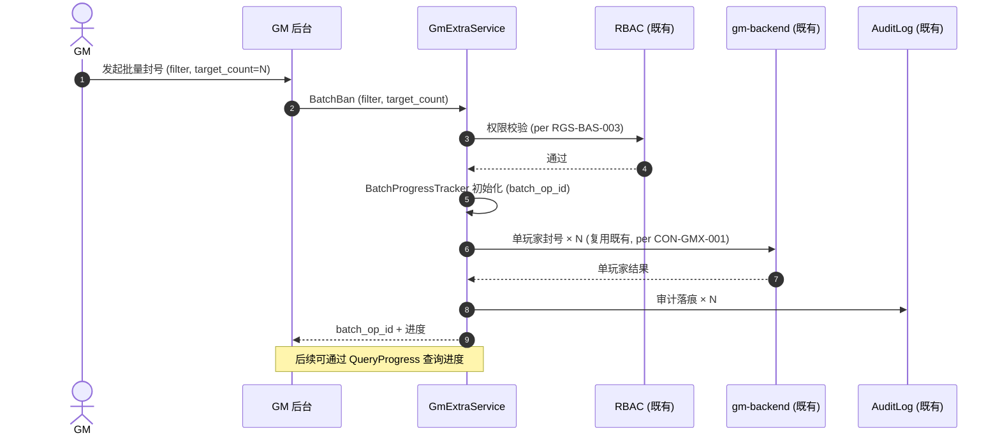
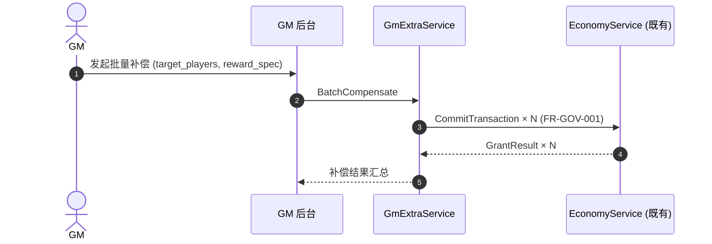
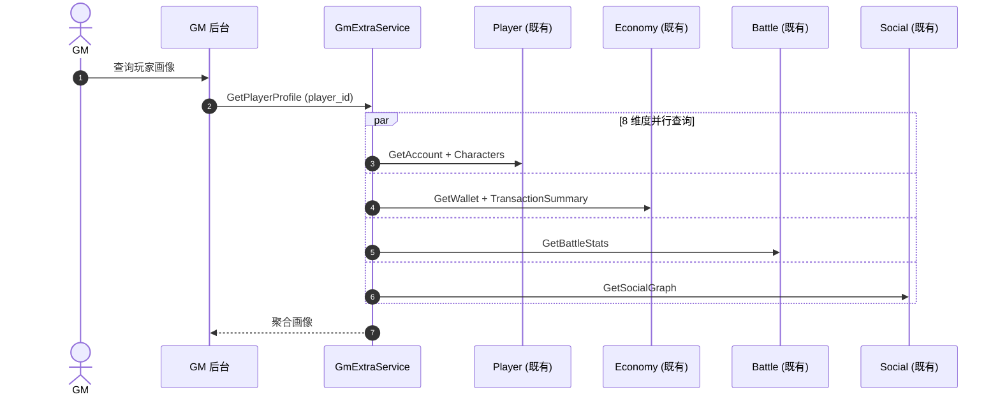

# 基本设计书（基本設計書 / Basic Design Document）

**GM 扩展域（GM-Extra Domain）基本设计 — 批量操作 / 高级查询 / 运营报表 / 审计追溯**

| 项目 | 内容 |
|---|---|
| 文档编号 | RGS-BAS-044 |
| 版本 | 0.1 (草案) |
| 父文档 | RGS-REQ-044 v0.1 GM 扩展域 需求定义书 |
| 制定日 | 2026-09-11 |
| 制定者 | 架构师 (worktree wt-b, ULYS-1 子任务) |
| 关联下游 | RGS-DTL-051 / gm_extra/v1/gm_extra.proto (1 service, 10 RPC) |
| 状态 | 草案, 待评审 |
| 关联 crate | `crates/gm-extra-service/` (gm_extra_db, 416 LOC) |
| ARC | ARC-052 |

---

## 修订历史（改訂履歴 / Revision History）

| 版本 | 修订日 | 修订者 | 审批者 | 修订内容 | 影响范围 |
|---|---|---|---|---|---|
| 0.1 | 2026-09-11 | 架构师 (wt-b agent) | — | 初版制定（per ULYS-1 9/4 MD §2 审计）。本文档为 RGS-REQ-044 的基本设计展开 | 全部 |

## 审批栏（承認欄 / Approval）

| 角色 | 姓名 | 审批日 | 备注 |
|---|---|---|---|
| 制定（起草） | 架构师 (wt-b agent) | 2026-09-11 | — |
| 评审（技术） | | | 批量操作是否严格走 EC 单点；RBAC 是否严格复用 gm-backend 既有 |
| 评审（DBA） | | | gm_extra_db 物理划分 |
| 审批（负责人） | | | 本文档的基准化 |

## 目录

1. 前言
2. 设计目标与约束
3. 架构总览
4. 组件设计
5. 数据流与时序
6. 接口契约
7. 配置驱动的多变体形态（ARC-052 落实）
8. 与既有基础设施的复用边界
9. 本文档的覆盖范围与后续计划

---

# 1. 前言

RGS-REQ-044 给出了 GM 扩展域 1 service × 10 RPC 的业务需求，本文是其逻辑级细化。本文档不重新决定 RGS-REQ-044 已确定的任何结构性选择：不重建单玩家 GM 操作、不绕过 RBAC、不绕过 ARC-026 OLU。

---

# 2. 设计目标与约束

## 2.1 设计目标

| ID | 目标 | 备注 |
|---|---|---|
| OBJ-GMX-001 | 1 个 service 全部覆盖 RGS-REQ-044 §4 的功能需求 | per REQ §4 |
| OBJ-GMX-002 | 单玩家 GM 操作严格复用 gm-backend 既有 | ARC-052 |
| OBJ-GMX-003 | 批量补偿严格走 EC 单点 | per FR-GOV-001 |
| OBJ-GMX-004 | 批量 / 报表 / 审计过滤规则作为 ARC-021 既有插件承载 | per RGS-REQ-009 |

## 2.2 约束

| ID | 类别 | 约束 | 来源 |
|---|---|---|---|
| CON-GMX-001 | 复用 | 单玩家 GM 操作**严格**复用 gm-backend 既有 | ARC-052 |
| CON-GMX-002 | 复用 | RBAC **严格**复用既有 RGS-BAS-003 | per RGS-REQ-007 |
| CON-GMX-003 | 经济 | 批量补偿**必须**走 EC 单点 | FR-GOV-001 |
| CON-GMX-004 | 预算 | 报表生成**必须**经 ARC-026 OLU 预算校验 | per RGS-REQ-013 |
| CON-GMX-005 | 数据库 | 本域落位独立 `gm_extra_db`（仅运营/审计） | ARC-008 |
| CON-GMX-006 | 反例 | 批量操作**不得**为每变体新建 service | ARC-052 |

---

# 3. 架构总览

```
                     ┌─────────────────────────┐
                     │  GM 后台 UI (前端)       │
                     └────────────┬────────────┘
                                  │ gRPC (mTLS)
                                  ▼
        ┌─────────────────────────────────────────────────┐
        │            gm-extra-service (1 Atomic App)       │
        │                                                  │
        │  ┌────────────────┐  ┌─────────────────────────┐ │
        │  │ BatchOpMgr     │  │ AdvancedQueryMgr        │ │
        │  │ - BatchBan     │  │ - PlayerProfile (8 维)  │ │
        │  │ - BatchCompens │  │ - ServerStatus          │ │
        │  │ - BatchUnban   │  │                         │ │
        │  │ - ProgressQuery│  │                         │ │
        │  └────────────────┘  └─────────────────────────┘ │
        │  ┌────────────────┐  ┌─────────────────────────┐ │
        │  │ OpsReportMgr   │  │ AuditTrailMgr           │ │
        │  │ - Generate     │  │ - QueryAuditLog         │ │
        │  │ - Export CSV   │  │ - ExportAuditLog        │ │
        │  └────────────────┘  └─────────────────────────┘ │
        └────────────┬────────────────────────┬─────────────┘
                     │                        │
                     ▼                        ▼
              ┌──────────────┐         ┌──────────────┐
              │ gm_extra_db  │         │ gm-backend / │
              │ (独立 DB)    │         │ EC / OLU     │
              │              │         │ (既有)       │
              └──────────────┘         └──────────────┘
```

---

# 4. 组件设计

## 4.1 BatchOpManager

**职责**：批量 GM 操作（封号 / 补偿 / 解封）。

| 子组件 | 职责 | 关键接口 |
|---|---|---|
| BatchBanHandler | 批量封号（条件筛选 + 批量封禁） | `BatchBan` |
| BatchCompensateHandler | 批量补偿（经 EC 单点） | `BatchCompensate` |
| BatchUnbanHandler | 批量解封 | `BatchUnban` |
| BatchProgressTracker | 进度查询 | `QueryProgress` |
| BatchCallbackHandler | 结果回调 | `HandleCallback` |

## 4.2 AdvancedQueryManager

**职责**：高级查询（玩家画像 + 服务器状态）。

| 子组件 | 职责 | 关键接口 |
|---|---|---|
| PlayerProfileBuilder | 8 维度玩家画像聚合 | `GetPlayerProfile` |
| ServerStatusAggregator | 服务器状态全景 | `GetServerStatus` |

## 4.3 OpsReportManager

**职责**：运营报表（日报 / 周报 / 月报）。

| 子组件 | 职责 | 关键接口 |
|---|---|---|
| ReportGenerator | 报表生成 | `GenerateReport` |
| ReportExporter | CSV / Excel 导出 | `ExportReport` |

## 4.4 AuditTrailManager

**职责**：审计追溯（GM 操作日志的二次查询）。

| 子组件 | 职责 | 关键接口 |
|---|---|---|
| AuditQuery | 时间/操作人/目标类型过滤 | `QueryAuditLog` |
| AuditExporter | 合规要求格式导出 | `ExportAuditLog` |

---

# 5. 数据流与时序

## 5.1 批量封号主流程



## 5.2 批量补偿经 EC 单点



## 5.3 玩家画像 8 维度聚合



---

# 6. 接口契约

## 6.1 Protobuf 接口契约

### 6.1.1 BatchBanRequest

```protobuf
message BatchBanRequest {
  BatchFilter filter = 1;                    // 条件筛选
  uint32 target_count = 2;                  // 目标数量 (≤ max_batch_size)
  string reason = 3;                        // 封号原因
  int64 duration_seconds = 4;               // 时长 (0=永久)
  string request_id = 5;                    // 幂等键
  string operator_id = 6;                   // GM 操作人 (经 RBAC)
}
```

### 6.1.2 BatchProgress

```protobuf
message BatchProgress {
  string batch_op_id = 1;
  uint32 total = 2;
  uint32 succeeded = 3;
  uint32 failed = 4;
  Status status = 5;                        // 0=Pending 1=Running 2=Done 3=Failed
}
```

### 6.1.3 PlayerProfile (8 维度)

```protobuf
message PlayerProfile {
  AccountInfo account = 1;
  repeated CharacterInfo characters = 2;
  WalletInfo wallet = 3;
  TransactionSummary transaction_summary = 4;
  BattleStats battle_stats = 5;
  SocialGraph social_graph = 6;
  InventorySummary inventory = 7;
  BehaviorTimeline behavior_timeline = 8;
}
```

## 6.2 错误码

沿用 `RGS-SPEC-CROSS-001` 既有约定，本域新增：

| ResultCode | 含义 | 触发条件 |
|---|---|---|
| `GMX_BATCH_TOO_LARGE` | 批量超限 | target_count > max_batch_size |
| `GMX_BATCH_IN_PROGRESS` | 批量进行中 | 同 batch_op_id 重复发起 |
| `GMX_RBAC_DENIED` | RBAC 拒绝 | per RGS-REQ-007 §3 |
| `GMX_OLU_EXCEEDED` | OLU 预算超限 | per ARC-026 |
| `GMX_PROFILE_FORBIDDEN` | 玩家画像被禁（隐私过滤） | per NFR-SE-005 |

---

# 7. 配置驱动的多变体形态（ARC-052 落实）

## 7.1 BatchConfig Schema

```yaml
batch_configs:
  - operation_type: BAN
    max_batch_size: 1000
    require_2fa: true
    audit_level: FULL
  - operation_type: COMPENSATE
    max_batch_size: 5000
    require_2fa: true
    audit_level: FULL
  - operation_type: UNBAN
    max_batch_size: 1000
    require_2fa: false
    audit_level: SUMMARY
```

---

# 8. 与既有基础设施的复用边界

| 既有机制 | 本域使用方式 | 不做什么 |
|---|---|---|
| gm-backend 既有 | 单玩家 GM 操作严格复用 | 不自建单玩家操作 |
| RGS-BAS-003 RBAC | 权限校验严格复用 | 不自建 RBAC |
| ARC-008 5 独立 DB → 7 域扩展 | 落位独立 `gm_extra_db` | 不混用其他域 |
| ARC-026 OLU 预算 | 报表生成经 OLU 校验 | 不绕过 |
| ARC-021 插件 | 批量 / 报表 / 审计规则承载 | 不使用沙箱脚本 |

---

# 9. 本文档的覆盖范围与后续计划

本文档覆盖：
- GM 扩展域 1 service 的组件划分、接口契约、核心时序
- ARC-052 复用原则的落实
- 与既有 5 项基础设施的复用边界

本版本明确不覆盖、留待后续：
- Rust trait / SQL DDL — 属 RGS-DTL-051 详细设计职责
- GM 后台 UI 设计 — 属前端范畴
- TBD-GMX-001（单次批量上限）— 留待 PH-2 性能校准

---

## 追溯性

| 需求/设计来源 | 本文档章节 |
|---|---|
| RGS-REQ-044 §1.3 与既有基础设施关系 | §8 |
| RGS-REQ-044 §3 业务需求 | §3, §4 |
| RGS-REQ-044 §4 功能需求 | §4 |
| RGS-REQ-044 §5 NFR | §2.2 约束 |
| RGS-REQ-044 §6 ARC-052 | §7 全文 |
| ARC-052 复用原则 | §7 全文 |
