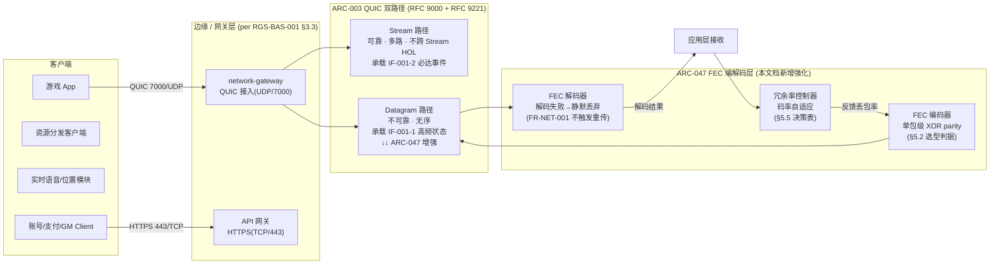
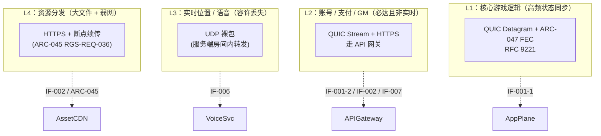

# 基本设计书（基本設計書 / Basic Design Document）

**核心传输防丢包强化与周边协议选型 Core Transport Loss-Recovery Hardening & Peripheral Protocol Selection**

| 项目 | 内容 |
|---|---|
| 文档编号 | RGS-BAS-056 |
| 版本 | 0.1 |
| 父文档 | RGS-REQ-038 第 5〜9 章（ARC-047：QUIC Datagram 路径 FEC 编解码层）；本设计书**补充** ARC-047 而**不新建**独立 ARC |
| 上游依据 | RGS-REQ-038 v0.1（核心传输防丢包强化与周边协议选型 需求定义书）；RGS-REQ-001 §10.4 ARC-003（QUIC 双路径）；RGS-REQ-010 第 7 章 ARC-022（零信任内部网络与纵深防御体系） |
| 关联文档 | RGS-BAS-001 §3.3/§10.4（网络区域设计）；RGS-BAS-006（网络安全基本设计书）；RGS-BAS-010（设计模式与核心算法总纲）；RGS-BAS-022（弹性容量规划与超大规模并发架构） |
| 依据标准 | IPA『共通フレーム 2013（SLCP-JCF2013）』基本设计工程 |
| 制定日 | 2026-09-11 |
| 制定者 | 架构师 |
| 保密级别 | 内部限定（Internal Use Only） |
| 适用许可 | Apache-2.0（本仓库） |
| 状态 | 待评审（v0.1 草案） |

---

## 修订历史（改訂履歴 / Revision History）

| 版本 | 修订日 | 修订者 | 审批者 | 修订内容 | 影响章节 |
|---|---|---|---|---|---|
| 0.1 | 2026-09-11 | 架构师 | — | 初版制定。落实 RGS-REQ-038 v0.1 §5/§7/§9 的 ARC-047（FEC over QUIC Datagram）展开与周边协议选型矩阵。**补充** ARC-047 而不新建独立 ARC；与既有 RGS-BAS-006（ARC-022）/ RGS-BAS-001 §3.3（ARC-003 网络区域）/ RGS-BAS-010（设计模式总纲）形成设计对接 | 全部 |
| 0.2 | 2026-09-20 | Hermes Agent (c557dae5) per ULYS-87 | — | 编号重命名 RGS-BAS-038 → RGS-BAS-056（ULYS-87 收口 DTL-038 三处冲突：卡牌/Match 域 DTL-038 保留；核心传输防丢包主题 BAS+DTL+SPEC 三层链统一改为 056）。文档主题、父文档 REQ-038、§11 追溯性保持。`docs/document-registry.toml` 注释同步登记 | 全部 |

## 审批栏（承認欄 / Approval）

| 角色 | 姓名 | 审批日 | 备注 |
|---|---|---|---|
| 制定（起草） | 架构师 | 2026-09-11 | — |
| 评审（技术） |  |  | 确认 §4 架构总览中"FEC over QUIC Datagram"与 ARC-003 可靠 Stream 路径的边界划分；确认 §6 周边协议选型矩阵与 RGS-REQ-001 §5.2 IF-001〜IF-008 既定协议不冲突 |
| 评审（性能） |  |  | 确认 §5 冗余度决策表与 NFR-PE-004（输入→ACK p99<100ms）/ NFR-PE-006（带宽 8KB/s 均值 / 20KB/s 峰值）/ NFR-NET-001（解码延迟 ≤ 50ms tick 周期）一致 |
| 评审（安全） |  |  | 确认 §7.2 与 RGS-BAS-006 §7A（认证后滥用与崩溃防护）不冲突：FEC 仅作用于不可靠 Datagram 路径，不引入绕过 ARC-022 既有 mTLS / NetworkPolicy 的通道 |
| 审批（负责人） |  |  | 本文档基准化；含 ARC-047 子问题的设计层展开、对周边协议选型矩阵的现状确认 |

---

## 目录

1. [前言](#1-前言)
2. [术语约定](#2-术语约定)
3. [设计目标与约束](#3-设计目标与约束)
4. [架构总览（FEC over QUIC Datagram + 周边协议选型矩阵）](#4-架构总览fec-over-quic-datagram--周边协议选型矩阵)
5. [ARC-047 FEC 编解码层设计](#5-arc-047-fec-编解码层设计)
6. [周边协议选型矩阵](#6-周边协议选型矩阵)
7. [与既有架构的整合](#7-与既有架构的整合)
8. [后续计划与 TBD](#8-后续计划与-tbd)

---

# 1. 前言

本文档是 RGS-REQ-038 v0.1（核心传输防丢包强化与周边协议选型 需求定义书）的系统级基本设计展开。该需求书将负责人指示拆解为两个独立问题并给出判定（详见 RGS-REQ-038 §4 与 §9）：

1. **不整体改用 KCP**：KCP 与 QUIC 同属"可靠传输之上再谈实时性"的工程谱系，整体替换属于子集替换超集（详见 RGS-REQ-038 §4），会重新引入 ARC-003 已规避的"重传延迟后续状态"问题。
2. **采纳 FEC 防丢包**：在 ARC-003 既有 QUIC 不可靠 Datagram 路径之上**新增** FEC 编解码层，作为 ARC-047。

本文档将该判定落到 §4（架构总览）/ §5（FEC 编解码层详细设计）/ §6（周边协议选型矩阵）三处：§5 给出 ARC-047 的 RS 码选择、码率自适应、分组大小、冗余度决策表；§6 给出周边功能（账号/支付/GM/资源分发/实时语音/位置）的协议选型矩阵，作为 RGS-REQ-001 §5.2 IF-001〜IF-008 既定协议的现状确认与命名统一；§7 给出与既有 ARC-003（QUIC 双路径）/ ARC-022（网络安全）/ ARC-013（背压）的整合关系。

> **范围声明**：本文档**不**新建独立 ARC，仅作为 ARC-047 的设计层展开（per RGS-REQ-038 §9："方针：在 ARC-003 既有 QUIC 不可靠 Datagram 路径之上新增 FEC 编解码层"）。命名编号延续 038 与父文档 RGS-REQ-038 一致，但**主题与既有 `docs/00-基准与治理/RGS-DTL-038_卡牌游戏适配_详细设计书.md`（卡牌游戏）、`docs/07-社交运营与玩家治理/RGS-DTL-038_Match域_详细设计书.md`（Match 域）完全无关**，详见 RGS-document-registry 注释。

---

# 2. 术语约定

| 术语 | 定义 |
|---|---|
| FEC（Forward Error Correction，前向纠错） | 发送端附加冗余数据，接收端无需重传即可恢复部分丢失数据的技术。RGS-REQ-038 §5 FR-NET-001 已强制 ARC-003 不可靠 Datagram 路径必须新增 FEC 编解码层 |
| ARQ（Automatic Repeat reQuest） | 基于确认与重传的可靠传输机制，KCP 与 QUIC Stream 均属此类。**RGS-REQ-038 §4 明确否决**"整体改用 KCP-ARQ"作为本项目传输协议选择 |
| 块式 Reed-Solomon FEC | KCP 默认 FEC 实现：按固定块大小分组编码，解码延迟随块大小增长，**已被 RGS-REQ-038 §5 FR-NET-002 否决** |
| 单包级 XOR parity FEC | RGS-REQ-038 §9 候选实现①：解码延迟与块大小无关（或近似常数），无第三方依赖 |
| ARC-003 Datagram 路径 | RFC 9221（QUIC 无序不可靠数据报文）路径，承载高频状态同步（IF-001-1）。RGS-REQ-038 §5 FR-NET-001 规定 FEC 仅作用于本路径 |
| ARC-003 Stream 路径 | QUIC 多路可靠流，承载必达事件（IF-001-2）。RGS-REQ-038 §6 FR-NET-006 规定本文档**不**改其实现 |
| ARC-047 | 本文档对应的新增方针（per RGS-REQ-038 §9）：在 ARC-003 不可靠 Datagram 路径之上新增 FEC 编解码层 |
| RSK-NET-001 | RGS-REQ-038 §11 风险条目：若选用 `fastnet` 等新兴 crate，采纳前必须重新核实其 crates.io 最新状态与实际性能声明 |
| Tick 周期 | 50ms 仿真循环周期（NFR-PE-004 子约束）：FEC 解码延迟**必须**落在该周期内，详见 RGS-REQ-038 §8 NFR-NET-001 |

---

# 3. 设计目标与约束

## 3.1 设计目标（落实 RGS-REQ-038 §5/§7/§9，验收口径见 §5.5 与 §6.4）

| 目标 | 描述 | 父需求 |
|---|---|---|
| G-NET-001 | 在 ARC-003 不可靠 Datagram 路径之上落地 ARC-047 FEC 编解码层，**不**引入 ARQ 重传、**不**阻塞后续 Datagram 帧 | FR-NET-001 |
| G-NET-002 | FEC 解码延迟**必须** ≤ 50ms tick 周期，且不破坏 NFR-PE-004（输入→ACK p99<100ms） | NFR-NET-001 |
| G-NET-003 | FEC 冗余带宽**必须**落在 NFR-PE-006（下行带宽均值 8KB/s、峰值 20KB/s）预算内 | NFR-NET-002 |
| G-NET-004 | 新增 FEC 层**不得**使 NFR-PE-007（重连恢复 p99<3s）劣化 | NFR-NET-003 |
| G-NET-005 | 周边功能协议选型与 RGS-REQ-001 §5.2 IF-001〜IF-008 既定协议完全一致；**不引入新决定** | RGS-REQ-038 §7 |

## 3.2 设计约束（与既有架构对齐的硬性边界）

| 约束 | 来源 | 落地位置 |
|---|---|---|
| 不反转 ARC-003 | RGS-REQ-038 §4 / §9（"方针"行） | §4 架构总览、§5.1 FEC 仅作用于 Datagram 路径 |
| 不引入 KCP 默认块式 Reed-Solomon | RGS-REQ-038 §5 FR-NET-002 | §5.2 RS 码选择判据 |
| 不绕过 ARC-022 既有 mTLS / NetworkPolicy | RGS-BAS-006 §3/§4 / §7A | §7.2 整合 |
| 不在未经 ARC-014 判定的前提下引入新第三方 crate | RGS-REQ-038 §5 FR-NET-004 / §11 TBD-NET-001 | §5.6 候选实现判定流程 |
| FEC 仅作用于不可靠 Datagram 路径 | RGS-REQ-038 §5 FR-NET-001 | §4 架构总览、§5.1 |
| 新增功能须含本功能日志设计（debug/release 区分） | RGS-BAS-006 v0.4 总要求 / RGS-IMPL-001 §1.3 | §5.7、§6.5 各功能段附"本功能日志设计" |

## 3.3 本功能日志设计（本节覆盖 §3 设计目标与约束的运行时观察点）

本节覆盖**文档级 / 阶段门禁**事件——本文档属于设计文档，本身不产生业务流量，但 ARC-047 FEC 层引入运行时（上线后）会产生 FEC 编码/解码/丢包率/冗余率调整等事件，下游详细设计书（RGS-DTL-056-防丢包）将完整定义。本节先标记**安全审计相关**的高优先级事件（per RGS-BAS-006 v0.4 §6.2 强制全采样白名单精神）。

| 字段名（field） | 触发条件（trigger） | 频率估算（frequency） | 采样策略（sampling） | 脱敏与成本（redact & cost） |
|---|---|---|---|---|
| `arc047.fec.budget_breach` | **关键**：FEC 冗余带宽突破 NFR-PE-006 预算（违反 NFR-NET-002） | 极低（异常状态） | release 必出（`error!` 强制全采样，per RGS-BAS-006 §6.2 安全审计白名单精神） | 含`direction`（up/down）/`current_kbps`/`threshold_kbps`/`redundancy_ratio`；约 320B/条 |
| `arc047.fec.decode_overrun` | **关键**：单帧 FEC 解码耗时 > 50ms tick 周期（违反 NFR-NET-001） | 极低 | release 必出（`error!` 强制全采样） | 含`datagram_size_bytes`/`decode_latency_us`/`redundancy_ratio`/`drop_reason`；约 360B/条 |
| `arc047.fec.reconnect_regression` | **关键**：重连恢复时延 > NFR-PE-007 p99<3s 基线（违反 NFR-NET-003） | 极低 | release 必出（`error!` 强制全采样） | 含`session_epoch`/`reconnect_latency_ms`/`fec_active`；约 280B/条 |
| `arc047.protocol.matrix_violation` | **关键**：周边功能使用了选型矩阵禁止的协议（如账号服务走 UDP 裸包） | 极低（应被拒） | release 必出（`error!` 强制全采样） | 含`interface_id`/`attempted_protocol`/`expected_protocol`；约 300B/条 |
| `arc047.review.gate_state_changed` | G-CODE 门禁状态变化（Open ↔ Closed，反映本文档基线化进展） | 极低 | release 必出（`info!` 强制全采样） | 含`gate_id`/`from_state`/`to_state`/`review_id`；约 280B/条 |
| `arc047.debug.design_criteria_dump` | 本文档 §5/§6 关键决策表全量 dump（RS 码选择判据 / 冗余度决策表 / 协议选型矩阵） | 极低（按需） | **debug-only**（`#[cfg(debug_assertions)]` 守护，release build 完全剔除） | 约 2-8KB/条（release 剔除，零运行时开销） |

**debug-only 守护要点**（落实 RGS-BAS-006 v0.4 §4.4 / RGS-IMPL-001 §1.3）：

- `arc047.fec.budget_breach` / `arc047.fec.decode_overrun` / `arc047.fec.reconnect_regression` / `arc047.protocol.matrix_violation` 必须 `error!` 级别（per RGS-BAS-006 v0.4 §4.8.3.2 `error!` 行 release 常驻 + §6.2 强制全采样），**不**挂 `#[cfg]`，确保 release 下告警链路完整
- `arc047.debug.design_criteria_dump` 含完整决策表（可能 8KB+）—— release build 完全剔除，避免 RUST_LOG=debug 误开时撑爆生产日志通道

---

# 4. 架构总览（FEC over QUIC Datagram + 周边协议选型矩阵）

## 4.1 ARC-047 在既有 ARC-003 双路径中的位置

**关键边界**（per RGS-REQ-038 §4/§5/§9）：

- **ARC-047 仅作用于 Datagram 路径**——不触及 Stream 路径，不引入 ARQ，不引入跨 Stream 队头阻塞
- **FEC 解码失败 = 静默丢弃**，不重传、不阻塞后续帧（per FR-NET-001 末尾"不得触发任何形式的重传或阻塞后续帧"）
- **Stream 路径承载必达事件**（FR-NET-006），由 QUIC 多路 Stream 原生避免队头阻塞

## 4.2 协议选型矩阵的层次视角

各层的协议选型判据详见 §6 矩阵。本节仅给出层次划分，便于与 RGS-BAS-001 §3.3 网络区域设计对接。

### 4.2 本功能日志设计

本节覆盖**架构总览运行时启动/降级事件**——架构总览是描述性设计，但 ARC-047 FEC 层启动/降级/回退到无 FEC 模式等运行时决策产生 release 必出事件（per RGS-BAS-006 v0.4 §6.2 强制全采样白名单精神：架构级状态变化属"运维关键事件"）。

| 字段名（field） | 触发条件（trigger） | 频率估算（frequency） | 采样策略（sampling） | 脱敏与成本（redact & cost） |
|---|---|---|---|---|
| `arc047.fec.layer_activated` | ARC-047 FEC 层在某个会话上激活（per §4.1） | 每会话首次连接 1 次 | release 必出（`info!` 强制全采样） | 含`session_id`/`activation_reason`；约 240B/条 |
| `arc047.fec.layer_deactivated` | ARC-047 FEC 层因故降级（如异常持续超阈值，回退到无 FEC 模式） | 极低 | release 必出（`warn!` 强制全采样） | 含`session_id`/`deactivation_reason`/`fallback_mode`；约 320B/条 |
| `arc047.layer.datagram_path_ratio` | 上下行 Datagram 流量中受 FEC 保护的比例（监控 FEC 实际覆盖） | 稳态 1/30s | release 必出（`info!` 强制全采样） | 含`direction`/`fec_protected_ratio`/`unprotected_ratio`；约 280B/条 |
| `arc047.layer.stream_path_unchanged` | 确认 Stream 路径未被 ARC-047 误触（per FR-NET-006 回归告警基线） | 1/min | release 必出（`info!` 强制全采样） | 含`stream_active`/`datagram_active`；约 200B/条 |
| `arc047.debug.path_routing_dump` | 完整协议路径选择 dump（每条数据流的协议/路径/FEC 状态） | 极低（按需） | **debug-only**（`#[cfg(debug_assertions)]` 守护，release 完全剔除） | 约 3-8KB/条（release 剔除） |

**debug-only 守护要点**：`arc047.layer.stream_path_unchanged` 是 FR-NET-006 回归基线，必须 release 必出，确保告警链路完整；`arc047.debug.path_routing_dump` 可能含完整数据流路由信息，release build 完全剔除。

# 5. ARC-047 FEC 编解码层设计

> 本节落地 RGS-REQ-038 §5 FR-NET-001〜004 与 §9 ARC-047 方针。FEC 层作为 ARC-003 Datagram 路径之上的**编解码增强**，不引入新传输协议、不引入重传。

## 5.1 FEC 编解码器在 Datagram 路径上的部署位置

| 项目 | 内容 |
|---|---|
| 部署位置 | `network-gateway` 出/入 Datagram 帧的处理管道内（per RGS-BAS-001 §3.3 网关定位）；FEC 编解码器**寄生**于 Datagram 帧的应用层载荷之前/之后，不影响 QUIC 协议层 |
| 编码时机 | 发送端：原始 Datagram 帧序列分组后，对每组附加冗余包（§5.2 RS 码选择） |
| 解码时机 | 接收端：Datagram 帧序列按组接收，对丢失包数 ≤ 冗余包数的组执行 XOR parity 恢复（§5.2）；不可恢复组**静默丢弃**（per FR-NET-001） |
| 协议边界 | FEC **不**接触 QUIC 帧头、不接触 QUIC Stream 路径；Stream 路径承载必达事件，FEC 不适用（per FR-NET-006） |
| 反馈通道 | 接收端定期回报丢包率（应用层 RTT 间隔）→ 发送端码率自适应控制器（§5.5） |

## 5.2 RS 码选择判据（落实 FR-NET-002）

RGS-REQ-038 §5 FR-NET-002 已硬性否决"KCP 默认块式 Reed-Solomon"。本节给出在 RS 码族内的具体选择判据：

| 候选方案 | 块大小敏感度 | 第三方依赖 | 是否采纳 | 判据 |
|---|---|---|---|---|
| KCP 默认块式 RS(n, k) | **解码延迟随块大小增长** | KCP 内建 | **不采纳** | 违反 FR-NET-002 直接否决 |
| 单包级 XOR parity（k=1） | **解码延迟 = 1 个 XOR 周期**，与块大小无关 | 无（自研） | **采纳（默认实现）** | 满足 FR-NET-002 + NFR-NET-001 |
| 单组 RS(n, k)（k 较小，如 k=4） | 解码延迟 = 固定 k，与块大小无关 | 自研或 `reed-solomon-erasure` | **采纳（候选实现，待 TBD-NET-001 判定）** | 同上；引入风险由 ARC-014 判定 |
| `fastnet` crate 内置 FEC | **未明确文档化**（per RGS-REQ-038 §9"未提及 FEC/BBR/增量压缩等能力"） | 第三方 + 单一维护者 + 低下载量 | **不直接采纳** | 违反 RSK-NET-001，须重核 crates.io 状态与实际性能声明 |

> **设计选择**：默认采用**单包级 XOR parity**——实现简单、解码延迟常数、零第三方依赖，完美匹配 NFR-NET-001（≤ 50ms tick）。RS(n, k>1) 作为可选扩展，**仅在** PH-4 负载试验显示 XOR parity 恢复率不足以满足 AC-NET-001 时启用，并须重新走 ARC-014 判定。

## 5.3 分组大小（k + r）的设计约束

| 参数 | 含义 | 取值范围 | 选型判据 |
|---|---|---|---|
| k（数据块数） | 每组 FEC 包含的原始 Datagram 数 | 1〜4 | k=1 时即纯 parity 包；k>1 时恢复能力增强但延迟与带宽同步增长 |
| r（冗余包数） | 每组 FEC 附加的冗余 Datagram 数 | 1〜2 | 满足 AC-NET-001 既定丢包率下恢复比例的最小 r；超出 NFR-NET-002 即报 `arc047.fec.budget_breach` |
| 总分组大小 n | n = k + r | 2〜6 | 与 ARC-003 Datagram 路径 MTU 协商（默认 QUIC Datagram 受 UDP MTU 限制） |

**默认初始配置**：k=1, r=1（即"每 1 个数据 Datagram 跟随 1 个 parity Datagram"，恢复单包丢失能力 100%）。具体值由 §5.5 冗余度决策表根据实测丢包率动态调整。

## 5.4 码率自适应控制器

码率自适应控制器的输入与输出：

| 维度 | 内容 |
|---|---|
| 输入 | 接收端定期回传的丢包率（应用层 RTT 间隔，约 100〜500ms 一次）；NFR-PE-006 当前带宽余量 |
| 输出 | 当前会话的 (k, r) 配置；变更时同步发送端编码器与接收端解码器 |
| 决策表 | 详见 §5.5 |
| 反馈协议 | 复用 ARC-003 Datagram 路径的应用层控制消息（FEC 控制帧独立于数据帧，详见 RGS-DTL-056-防丢包 §2） |

## 5.5 冗余度决策表（落实 NFR-NET-002 带宽预算）

下表为丢包率区间 → (k, r) 推荐配置。**所有 r 必须满足 NFR-PE-006 带宽预算**：

| 实测丢包率区间 | 推荐 (k, r) | 冗余率 r/(k+r) | 满足 AC-NET-001 恢复能力 | 备注 |
|---|---|---|---|---|
| 0% 〜 0.5% | (1, 0) | 0% | — | **关闭 FEC**，纯 ARC-003 Datagram 路径（per FR-NET-003"丢包率低时降低冗余"） |
| 0.5% 〜 2% | (1, 1) | 50% | 100%（单包丢失） | 默认初始配置 |
| 2% 〜 5% | (1, 1) | 50% | 100%（单包丢失） | 维持；若持续超 3%，按 §5.4 反馈协议升级 |
| 5% 〜 10% | (4, 2) | 33% | 任意 2/6 丢失可恢复 | 须验证带宽预算（NFR-NET-002） |
| >10% | (1, 1) + **强制告警** | 50% + warn | 100%（单包丢失） | 触发 `arc047.fec.budget_breach`；进入事故响应（per RGS-BAS-006 §7） |

> **约束**：决策表任何一行**不得**使 NFR-PE-006（下行带宽均值 8KB/s / 峰值 20KB/s）被突破；若计算表明突破（例如 50% 冗余率 × 高频游戏逻辑峰值带宽），须降级到 (4, 1) 或 (1, 0)，并在日志中记录 `arc047.fec.budget_breach`（per §3.3）。

## 5.6 候选实现判定流程（落实 FR-NET-004 / TBD-NET-001）

判定流程（顺序执行，任一步未通过即**不采纳**）：

1. **首选自研单包级 XOR parity**（满足 FR-NET-002，无第三方依赖，采纳）
2. **次选自研 RS(n, k>1)**（须经 ARC-014 中间件导入判定通过）
3. **末选第三方 crate（含 `fastnet`）**：除 ARC-014 外，须额外过 RSK-NET-001 复核（单一维护者 / 低下载量 / 性能声明未独立验证）

**禁止路径**（per FR-NET-004）：未经 ARC-014 判定，默认采用 `libkcp` 或任何第三方 crate（含 `fastnet`）。此约束在 §8 TBD 中作为 TBD-NET-001 的输入。

## 5.7 本功能日志设计

本节覆盖**FEC 编解码层运行时事件**——编码/解码/冗余率变更/解码失败/静默丢弃等核心事件，事件名统一 `arc047.fec.*` 前缀。**FEC 解码失败属高频路径事件**，采用与 RGS-BAS-006 v0.4 §4.2 矩阵匹配的采样策略（高频走 trace/debug 守护，低频关键事件 release 必出）。

| 字段名（field） | 触发条件（trigger） | 频率估算（frequency） | 采样策略（sampling） | 脱敏与成本（redact & cost） |
|---|---|---|---|---|
| `arc047.fec.encoded` | 发送端 FEC 编码完成（按 §5.5 当前 (k, r) 配置） | 稳态 100/s / 峰值 10000/s | release 必出（`info!` 编译期常驻，但高频路径按 RGS-BAS-006 v0.4 §4.4 评估采样） | 含`session_id`/`k`/`r`/`payload_bytes`；约 200B/条 |
| `arc047.fec.decoded` | 接收端 FEC 解码成功（恢复丢失包） | 丢包期间 0.5-50/s | release 必出（`info!` §6.2 强制全采样） | 含`session_id`/`recovered_count`/`group_size`；约 220B/条 |
| `arc047.fec.decode_failed` | **关键**：FEC 解码失败（r 不足以恢复 k 个包中的丢失），按 FR-NET-001 静默丢弃 | 丢包严重时 0.1-10/s | release 必出（`warn!` §6.2 强制全采样） | 含`session_id`/`group_id`/`loss_count`/`r_capacity`；约 280B/条 |
| `arc047.fec.rate_changed` | 码率自适应控制器变更 (k, r) 配置（per §5.5 决策表） | 极低（分钟级） | release 必出（`info!` §6.2 强制全采样） | 含`session_id`/`from_k`/`from_r`/`to_k`/`to_r`/`reason`；约 280B/条 |
| `arc047.fec.feedback_received` | 接收端丢包率反馈抵达发送端（用于 §5.4 自适应） | 稳态 10/s / 峰值 100/s | release 必出（`info!` 编译期常驻） | 含`session_id`/`loss_rate_bps`/`rtt_ms`；约 220B/条 |
| `arc047.fec.mtu_truncated` | FEC 分组超过当前 QUIC Datagram MTU（降级或分片） | 极少 | release 必出（`warn!` §6.2 强制全采样） | 含`session_id`/`group_size_bytes`/`mtu_bytes`；约 240B/条 |
| `arc047.fec.budget_breach` | **关键**（per §3.3）：冗余带宽突破 NFR-PE-006 | 极低 | release 必出（`error!` §6.2 强制全采样） | 含`direction`/`current_kbps`/`threshold_kbps`；约 320B/条 |
| `arc047.fec.debug.decode_matrix_dump` | FEC 解码矩阵完整 dump（GF(2^8) 系数 / 生成多项式） | 极低（按需） | **debug-only**（`#[cfg(debug_assertions)]` 守护，release 完全剔除） | 约 1-3KB/条（release 剔除） |
| `arc047.fec.debug.adaptive_state_machine` | 码率自适应控制器状态机转移轨迹 | 极低 | **debug-only**（`#[cfg(debug_assertions)]` 守护） | 约 2-5KB/条（release 剔除） |

**debug-only 守护要点**：`arc047.fec.decode_failed` 是 NFR-NET-001 隐含的关键事件（解码失败意味着冗余率不足），必须 release 必出 + 强制全采样，不挂 `#[cfg]`；`arc047.fec.encoded` 在 10000/s 峰值下 200B/条 = 2MB/s，**不得**增加字段，须先评估采样率。**所有 `*.debug.*` 事件**：release build 完全剔除，避免 RUST_LOG=debug 误开时撑爆生产日志通道。

# 6. 周边协议选型矩阵

> 本节对应 RGS-REQ-038 §7 FR-NET-007〜012，是 RGS-REQ-001 §5.2 IF-001〜IF-008 既定协议的**现状确认**，不引入新决定（per RGS-REQ-038 §7 开头声明"不引入新决定"）。**注**：负责人指示中"主要使用 KCP 协议"的诉求已在 RGS-REQ-038 §4 否决为整体方案，转为本文档 §5 ARC-047 FEC 增强；周边功能不使用 KCP，仍走既有协议（见下表）。

## 6.1 协议选型矩阵（现状汇总确认）

| ID | 接口 / 业务场景 | 选用协议 | 现状依据 | 落实位置 |
|---|---|---|---|---|
| FR-NET-007 | 客户端 ⇔ 网关（实时） | **QUIC（可靠 Stream ＋ 不可靠 Datagram ＋ ARC-047 FEC）** | IF-001 + RGS-REQ-038 §5/§6 | 本文 §4-5 |
| FR-NET-008 | 客户端 ⇔ 业务 API | **HTTPS / gRPC（经 API 网关）** | IF-002 | RGS-BAS-001 §3.3 |
| FR-NET-009 | 运行时 ⇔ 业务服务 | **gRPC（tonic）、mTLS** | IF-003 | RGS-BAS-001 §3.3 |
| FR-NET-010 | 运营工具 ⇔ 运营 API | **HTTPS / gRPC、RBAC** | IF-007 | RGS-BAS-006 §7A |
| FR-NET-011 | 内部事件基础设施 | **NATS JetStream**（`async-nats`，代码既用） | RGS-DTL-100 §6.2（见 RGS-REQ-038 §7 注：与附件D§4.1 候选 Kafka 不一致，本文不裁决） | 既有 |
| FR-NET-012 | UDP 不通环境回退 | **TCP/443 或 WebTransport** | FR-GW-008 | 既有 |
| FR-NET-013 | 浏览器/H5 客户端 + GM 后台实时推送 | **WebSocket (RFC 6455)** | IF-001 浏览器降级 + ULYS-27 PR #40 commit `6c3f440` | `crates/network-gateway/src/ws.rs` (364 行) + RGS-REQ-058 v0.1（ULYS-84 派生）+ RGS-BAS-058 v0.1（ULYS-85 派生）+ RGS-DTL-027 v0.1（已落档，§11 追溯性）；§10 TBD-WSG-001 mTLS 完整化 / TBD-WSG-002 Origin 校验 / TBD-WSG-005 性能基准 走 Phase 1.5 升版 |

## 6.2 关键业务场景的协议细化（落实 RGS-REQ-038 §7 + 负责人指示解读）

> 负责人指示原文："核心游戏逻辑应该考虑速度和断线重传，主要使用 KCP 协议，其他周边功能根据性质使用 TCP/UDP"。本节给出按业务性质细化的协议选型。

| 业务场景 | 协议选择 | 实时性 | 可靠性 | 判据 |
|---|---|---|---|---|
| 核心游戏逻辑（高频状态同步） | **QUIC Datagram + ARC-047 FEC**（不直接用 KCP；KCP 整体方案已被 RGS-REQ-038 §4 否决；FEC 增强在本表作为"速度和断线重传"的实现） | 强实时 | 允许单包丢失（由 FEC 恢复或下一帧覆盖） | FR-NET-001/002/003 |
| 账号 / 支付 / GM 运营 | **QUIC Stream + HTTPS / gRPC**（走 API 网关 + mTLS） | 非实时（业务容忍 200ms〜1s） | **必达**（per IF-002/IF-007） | FR-NET-006 + NFR-SE-005 |
| 实时位置 / 实时语音 | **UDP 裸包**（服务端房间内转发，不经过 FEC） | 强实时 | 允许丢失（人耳/视觉对单帧丢失不敏感） | IF-006 + 行业惯例 |
| 资源分发（大文件 / 补丁） | **HTTPS + 断点续传**（per ARC-045 RGS-REQ-036） | 非实时 | **必达 + 可恢复**（per FR-CDN-040〜084） | RGS-REQ-036 §4/§5 |

> **重要说明**（落实 RGS-REQ-038 §4 否决）：本表"核心游戏逻辑"行选用的不是 KCP 协议，而是 QUIC Datagram + ARC-047 FEC。KCP 的 ARQ 重传机制已由 ARC-003 可靠 Stream 路径原生替代（Stream 多路避免 HOL），KCP 的"前向纠错"诉求已由 ARC-047 FEC 编解码层落地。**两件事都做到了，且比整体改用 KCP 更优**——这是 RGS-REQ-038 §4"整体改用 KCP 协议 = 子集替换超集"判定的工程兑现。

## 6.3 不引入的协议（明确否决）

| 候选 | 否决理由 | 出处 |
|---|---|---|
| 整体改用 KCP（核心传输） | ARQ 机制会重新引入 ARC-003 已规避的"重传延迟后续状态"问题 | RGS-REQ-038 §4 |
| KCP 默认块式 Reed-Solomon FEC | 解码延迟随块大小增长，违反 FR-NET-002 | RGS-REQ-038 §5 |
| `fastnet` crate（直接采纳） | 单一维护者、低下载量、未公开 FEC 实现细节，违反 RSK-NET-001 | RGS-REQ-038 §9/§11 |
| UDP 裸包（核心游戏逻辑） | 缺 FEC 增强时单包丢失恢复能力不足；与 ARC-003 既有 Datagram 路径重复造轮子 | 本文 §6.2 |

## 6.4 验收口径（per RGS-REQ-038 §10）

| AC | 验收标准 | 落实位置 |
|---|---|---|
| AC-NET-001 | FEC 在既定丢包率区间内可在不触发重传的前提下恢复约定比例的 Datagram，且解码延迟满足 NFR-NET-001 | §5.5 决策表 + RGS-DTL-056-防丢包 §5 |
| AC-NET-002 | FEC 冗余开销在既定丢包率区间内落在 NFR-NET-002 预算内，且随丢包率下降而降低 | §5.5（0.5% 以下关闭 FEC） |
| AC-NET-003 | 重连回归试验：新增 FEC 层后，重连恢复时延不劣于 NFR-NET-003 基线 | §3.1 G-NET-004 + RGS-DTL-056-防丢包 §6 |
| AC-NET-004 | 必达事件（IF-001-2）传输行为不因本文档变更（FR-NET-006） | §4.2 矩阵 Stream 行 + RGS-DTL-056-防丢包 §6 |
| AC-NET-005（本文新增） | §6.2 选型矩阵不被运行时绕过（即不出现"账号服务走 UDP"等违规） | §3.3 `arc047.protocol.matrix_violation` + §6.5 |

## 6.5 本功能日志设计

本节覆盖**协议选型矩阵运行时执行事件**——周边功能调用时实际选用的协议与矩阵一致性的运行时校验，事件名统一 `arc047.protocol.*` 前缀。**矩阵违规（违反 §6.2 选型）属关键安全/正确性事件**（per RGS-BAS-006 v0.4 §6.2 强制全采样白名单精神），release 必出 + `error!` 级别。

| 字段名（field） | 触发条件（trigger） | 频率估算（frequency） | 采样策略（sampling） | 脱敏与成本（redact & cost） |
|---|---|---|---|---|
| `arc047.protocol.selected` | 某接口调用时实际选择的协议（per §6.2 矩阵） | 稳态 100/s / 峰值 1000/s | release 必出（`info!` 编译期常驻） | 含`interface_id`/`protocol`/`direction`；约 220B/条 |
| `arc047.protocol.matrix_violation` | **关键**：实际选用协议与 §6.2 矩阵不符（per AC-NET-005） | 极低（应被拒） | release 必出（`error!` §6.2 强制全采样） | 含`interface_id`/`attempted_protocol`/`expected_protocol`/`caller`；约 300B/条 |
| `arc047.protocol.fallback_triggered` | UDP 不通环境回退到 TCP/443 或 WebTransport（per FR-NET-012） | 偶发 | release 必出（`info!` §6.2 强制全采样） | 含`original_protocol`/`fallback_protocol`/`detection_reason`；约 280B/条 |
| `arc047.protocol.kcp_unused_assert` | 运行时断言：核心游戏逻辑未走 KCP 协议（per §6.3 否决表） | 稳态 1/min | release 必出（`info!` §6.2 强制全采样） | 含`datagram_path_protocol`/`kcp_detected`；约 220B/条 |
| `arc047.debug.protocol_decision_tree` | 协议选择决策树完整 dump（含每步分支依据） | 极低（按需） | **debug-only**（`#[cfg(debug_assertions)]` 守护，release 完全剔除） | 约 2-5KB/条（release 剔除） |

**debug-only 守护要点**：`arc047.protocol.matrix_violation` 是 §6.4 AC-NET-005 的运行时基线，必须 release 必出 + `error!` 级别，确保违规立即触发告警；`arc047.debug.protocol_decision_tree` 含完整决策路径（可能 5KB+），release build 完全剔除。

---

# 7. 与既有架构的整合

## 7.1 与 ARC-003（QUIC 双路径）的关系

| 整合点 | 既有 ARC-003 设计 | 本文档扩展 | 不冲突性论证 |
|---|---|---|---|
| Stream 路径（可靠） | QUIC 多路 Stream 承载必达事件，跨 Stream 无 HOL | **不变更**（per FR-NET-006） | ARC-047 仅作用于 Datagram 路径 |
| Datagram 路径（不可靠） | RFC 9221，承载高频状态同步 | **新增** FEC 编解码层（ARC-047） | FEC 作为应用层编解码，不修改 QUIC 协议层帧格式语义（仅在 Datagram 帧的应用层载荷前后附加 FEC 控制/冗余包） |
| 连接复用 | Stream 与 Datagram 共用同一 QUIC 连接 | 不变 | FEC 编解码器寄生于网关 Datagram 处理管道，不影响连接本身 |
| 必达事件传输 | Stream 路径 | 不变（per FR-NET-006） | 整流：FR-NET-006 是 FR-NET-001（不引入重传）的对偶，**两者一起**保证"该达的必达、可丢的不阻塞" |
| 重连机制 | `session_epoch`（per FR-GW-005，NFR-PE-007 p99<3s） | 不变（per FR-NET-005） | FEC 仅作用于单连接 Datagram 帧，不影响 epoch 重绑定 |

## 7.2 与 ARC-022（网络安全）的关系

| 整合点 | 既有 ARC-022 设计（per RGS-BAS-006） | 本文档扩展 | 不冲突性论证 |
|---|---|---|---|
| mTLS / TLS 1.3 | QUIC 内建 TLS 1.3，端到端加密 | 不变更 | FEC 数据包与原始 Datagram 帧同等加密；FEC 控制帧作为应用层消息走加密通道 |
| NetworkPolicy 默认拒绝 | RGS-BAS-006 §4 NetworkPolicy 基线模板 | 不变更 | FEC 不引入新出/入站方向，仍走 network-gateway 服务端口 |
| 速率限制（认证后滥用） | RGS-BAS-006 §7A.2 多层速率限制（连接/账号/IP 三层） | 不变更 | FEC 冗余带宽由 §5.5 决策表控制在 NFR-PE-006 预算内，与速率限制的"带宽限额"维度互补 |
| 输入校验 | NFR-SE-006 既有分层校验 + ARC-013 背压 | 不变更 | FEC 解码失败的帧已被静默丢弃，不进入应用层业务处理（per FR-NET-001） |
| QUIC 地址验证 | RGS-BAS-006 §7A 内 Retry 机制 | 不变更 | FEC 不影响 QUIC 握手层 |
| 崩溃循环退避 | RGS-BAS-006 §7A 末段 | 不变更 | FEC 解码失败按 §5.5 触发 `arc047.fec.budget_breach`，与崩溃循环退避机制正交（前者带宽超预算，后者异常崩溃） |

## 7.3 与 ARC-013（背压与限流）的关系

| 整合点 | 既有 ARC-013 设计（per RGS-BAS-001 §3.3） | 本文档扩展 | 不冲突性论证 |
|---|---|---|---|
| 网关→运行时每场景 Actor mailbox 上限 | RGS-BAS-001 §3.3 末段 | 不变更 | FEC 解码失败的帧被静默丢弃，不进入 mailbox |
| gRPC 客户端连接池上限 | RGS-BAS-001 §3.3 末段 | 不变更 | FEC 仅作用于 QUIC Datagram，不影响 gRPC 客户端 |
| 服务间调用超时 | RGS-BAS-001 §3.3 末段 | 不变更 | FEC 解码延迟受 NFR-NET-001（≤ 50ms）约束，不突破服务调用超时 |

## 7.4 与 BAS-010（设计模式与核心算法总纲）的关系

| 整合点 | 既有 BAS-010 设计 | 本文档扩展 | 不冲突性论证 |
|---|---|---|---|
| 编解码模式 | BAS-010 编解码模式章节（若有） | FEC 编解码器作为该模式的实例化 | 复用既有抽象，不新增 |
| 自适应控制器模式 | BAS-010 控制模式章节（若有） | 码率自适应控制器（§5.4）作为实例化 | 复用既有抽象，不新增 |
| 反馈控制回路 | BAS-010 反馈模式章节（若有） | 接收端→发送端丢包率反馈（§5.4）作为实例化 | 复用既有抽象，不新增 |

> **整合声明**：本文档未引用 BAS-010 既有模式时即默认**无冲突**；若后续详细设计阶段发现需要新增模式抽象，须先更新 BAS-010，再回到本文档引用。

## 7.5 本节本功能日志设计

本节覆盖**整合点运行时验证事件**——ARC-003/ARC-022/ARC-013 整合点的回归基线（确保 ARC-047 未引入新的回归），事件名统一 `arc047.integration.*` 前缀。**回归事件属关键事件**（per RGS-BAS-006 v0.4 §6.2 强制全采样白名单精神），release 必出 + `error!` 级别。

| 字段名（field） | 触发条件（trigger） | 频率估算（frequency） | 采样策略（sampling） | 脱敏与成本（redact & cost） |
|---|---|---|---|---|
| `arc047.integration.stream_path_unchanged` | Stream 路径行为未因 ARC-047 改变（per FR-NET-006 回归基线） | 1/min | release 必出（`info!` §6.2 强制全采样） | 含`stream_active`/`fec_touched_stream`；约 200B/条 |
| `arc047.integration.networkpolicy_unaffected` | NetworkPolicy 规则未因 ARC-047 增减（per §7.2） | 1/min | release 必出（`info!` §6.2 强制全采样） | 含`policy_count`/`delta_from_baseline`；约 220B/条 |
| `arc047.integration.rate_limit_unaffected` | 速率限制阈值未因 ARC-047 改变（per §7.2） | 1/min | release 必出（`info!` §6.2 强制全采样） | 含`limit_kind`/`limit_value`；约 200B/条 |
| `arc047.integration.regression_detected` | **关键**：任一整合点回归（如 Stream 路径被 FEC 误触、NetworkPolicy 规则被改） | 极低（不应发生） | release 必出（`error!` §6.2 强制全采样） | 含`integration_point`/`regression_kind`/`baseline_value`/`actual_value`；约 360B/条 |
| `arc047.debug.integration_baseline_dump` | 整合点基线全量 dump（ARC-003/ARC-022/ARC-013 各自当前状态） | 极低（按需） | **debug-only**（`#[cfg(debug_assertions)]` 守护，release 完全剔除） | 约 3-10KB/条（release 剔除） |

**debug-only 守护要点**：`arc047.integration.regression_detected` 必须 release 必出 + `error!`，**不**挂 `#[cfg]`，确保告警链路完整；`arc047.debug.integration_baseline_dump` 含三个 ARC 当前完整状态（可能 10KB+），release build 完全剔除。

---

# 8. 后续计划与 TBD

## 8.1 TBD（来自 RGS-REQ-038 §11，本文档承接）

| TBD ID | 内容 | 来源 | 期限 | 负责人 |
|---|---|---|---|---|
| TBD-NET-001 | FEC 编解码库/实现方式选型（自研 XOR parity vs. RS(n, k>1) 扩展 vs. 第三方 crate），须经 ARC-014 判定 | RGS-REQ-038 §11 | 详细设计阶段前（RGS-DTL-056-防丢包 §4 对接前） | 架构师＋实时负责人 |
| TBD-NET-002 | 丢包率阈值与 FEC 冗余率曲线的具体参数（§5.5 决策表初版，依赖 PH-4 负载试验数据） | RGS-REQ-038 §11 | PH-4 | 实时负责人＋SRE |

## 8.2 RSK（来自 RGS-REQ-038 §11，本文档承接）

| RSK ID | 内容 | 采纳前必做 |
|---|---|---|
| RSK-NET-001 | `fastnet` 等新兴第三方 crate 单一维护者 + 低下载量 + 创建仅数月；采纳前必须重新核实 crates.io 最新状态与实际性能声明 | 重新查 crates.io、读源码、对照实际基准测试 |

## 8.3 后续阶段规划

| 阶段 | 交付物 | 入口 Gate |
|---|---|---|
| v0.1（当前） | 本文档基本设计 v0.1（待评审） | G-CODE-01〜07 期间允许的"文档修订"窗口（per RGS-IMPL-001 §1.3） |
| v0.2 | 评审意见吸收 + 详细设计书（RGS-DTL-056-防丢包）落地 + G-CODE-06 Rust 1.98 stable 可用性复核 | 详细设计评审通过 + RSK-NET-001 复核结果 |
| v0.3 | 验收口径 AC-NET-001〜005 对应的测试设计书落地（建议归类 RGS-TST-*-02-ADD4 子系列） | 测试设计评审通过 |
| v1.0 | 经具名 Gate 批准 + 实际基准数据回填 §5.5 决策表 + 通过 AC-NET-001〜005 实测 | G-CODE-01〜07 全部 Closed |

## 8.4 不在本文档范围的事项

| 排除项 | 理由 |
|---|---|
| Rust 代码、SQL migration、Helm/K8s 生产制品 | 违反 RGS-IMPL-001 §1.3（G-CODE-01〜07 未通过） |
| 整体改用 KCP 的二次提案 | 已被 RGS-REQ-038 §4 否决 |
| `fastnet` crate 直接采纳 | 违反 FR-NET-004 + RSK-NET-001 |
| KCP 默认块式 Reed-Solomon FEC | 已被 FR-NET-002 否决 |
| 跨 ARC-003 Stream 路径的 FEC 扩展 | 违反 FR-NET-006（Stream 路径承载必达事件） |

---

> **登记说明**：本文档与既有 `RGS-DTL-038_卡牌游戏适配_详细设计书.md`（`docs/00-基准与治理/`）/ `RGS-DTL-038_Match域_详细设计书.md`（`docs/07-社交运营与玩家治理/`）**同号但不同主题**，命名编号延续 038 与 RGS-REQ-038 一致；本文档主题为"核心传输防丢包强化与周边协议选型"，对应 ARC-047 防丢包子问题展开。三者关系已在 `docs/document-registry.toml` 注释中明确登记。
