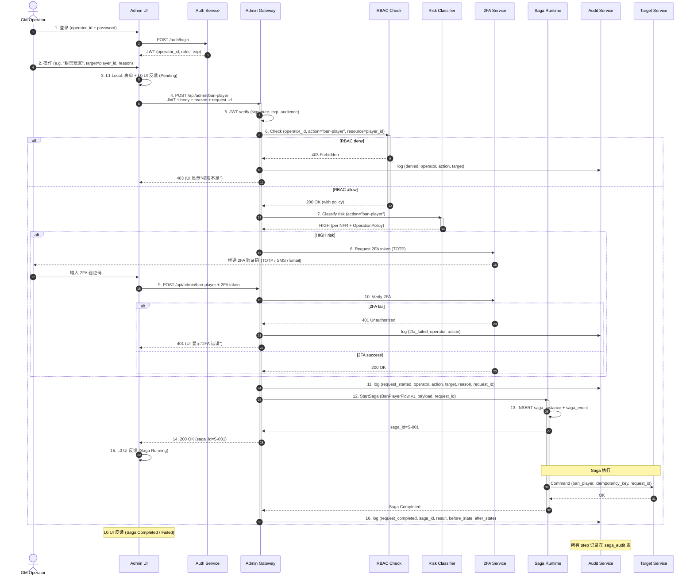

# RGS-SEC-100 GM 审计与 Saga 安全设计

| 项目 | 内容 |
|---|---|
| 文档编号 | RGS-SEC-100 |
| 版本 | 0.1（初版） |
| 制定日 | 2026-08-21 |
| 最终更新日 | 2026-08-21 |
| 制定者 | 架构师（Ulysses 兼，per DEC-008 一人公司） |
| 保密级别 | 内部限定（Internal Use Only） |
| 适用许可 | Apache-2.0（本仓库） |
| 关联文档 | RGS-REQ-100 / RGS-BAS-100 / RGS-DTL-100~102 / RGS-OPS-100 / RGS-GOBS-100 / RGS-SPEC-CROSS-007（RBAC 横向规范） |
| 配套标准 | IPA 共通フレーム 2013 + 150 工程日本 SI 业界标准；V 模型映射：UT ↔ DTL |

---

## 修订历史

| 版本 | 修订日 | 修订者 | 修订内容 |
|---|---|---|---|
| 0.1 | 2026-08-21 | 架构师（Ulysses）| 初版。GM 5 角色 RBAC + 高风险 8 操作 + 完整审计 log schema + mTLS 跨服务 + NetworkPolicy + Secret 加密 + Audit Console + 高风险 2FA + Saga 安全。 |

---

## 0. 文档目的

定义 Saga 系统的**安全 + 审计**：

1. GM RBAC（5 角色 + 资源 + 操作三元组）
2. 高风险操作清单（8 类）
3. 完整审计日志 schema（不可篡改）
4. mTLS 跨服务调用
5. NetworkPolicy 拒绝默认 + 按需 allow
6. Secret 加密（sealed-secrets / external-secrets）
7. Admin Audit Console（GM 自审 + SRE 复审）

---

## 1. Admin Command Flow（含审计）



---

## 2. GM RBAC 5 角色

### 2.1 角色定义

| 角色 | 代码 | 权限范围 | 典型用户 |
|---|---|---|---|
| **Player Support** | `gm.support` | 只读 + 加好友 + 解封禁 | 客服 |
| **Content Moderator** | `gm.moderator` | + 编辑玩家备注 + 处理举报 | 内容审核 |
| **Economy Operator** | `gm.economy` | + 货币补偿（小额）+ 物品补偿 | 运营 |
| **Game Master** | `gm.master` | + 所有玩家操作 + 跨服 + 删号 | 高权限 GM |
| **Server Admin** | `admin.server` | + 服务器运维 + 数据库 + Saga Console | SRE / DBA |

### 2.2 资源所有权

| 资源 | Owner 角色 | 谁能访问 |
|---|---|---|
| player/{id} | gm.master / gm.support (只读) | 按角色 |
| character/{id} | gm.master / gm.moderator | 按角色 |
| inventory/{id} | gm.master / gm.economy | 按角色 |
| economy/{account_id} | gm.master / gm.economy | 按角色 |
| match/{id} | gm.master (只读) | 按角色 |
| guild/{id} | gm.master / gm.moderator | 按角色 |
| mail/{id} | gm.master / gm.support | 按角色 |
| saga/{saga_id} | admin.server (full) / gm.master (只读) | 按角色 |
| server/{server_id} | admin.server | 按角色 |
| audit/{log_id} | admin.server (只读) | 按角色 |

### 2.3 操作 × 资源 × 角色 矩阵

| 操作 / 资源 | support | moderator | economy | master | server admin |
|---|---|---|---|---|---|
| player.view | ✅ | ✅ | ✅ | ✅ | ✅ |
| player.ban | — | — | — | ✅ | ✅ |
| character.view | ✅ | ✅ | ✅ | ✅ | ✅ |
| character.update_nickname | — | ✅ | — | ✅ | ✅ |
| character.delete | — | — | — | ✅ | ✅ |
| inventory.view | — | ✅ | ✅ | ✅ | ✅ |
| inventory.grant_item | — | — | ≤ 1000 G | ✅ | ✅ |
| inventory.bulk_grant | — | — | — | ✅ | ✅ |
| economy.view_balance | — | — | ✅ | ✅ | ✅ |
| economy.grant_currency | — | — | ≤ 10000 G | ✅ | ✅ |
| economy.deduct_currency | — | — | — | ✅ | ✅ |
| mail.send | ✅ | ✅ | ✅ | ✅ | ✅ |
| match.view | ✅ | ✅ | ✅ | ✅ | ✅ |
| match.distribute_reward | — | — | — | ✅ | ✅ |
| guild.view | ✅ | ✅ | ✅ | ✅ | ✅ |
| guild.create | — | — | — | ✅ | ✅ |
| guild.dissolve | — | — | — | ✅ | ✅ |
| server.migrate_player | — | — | — | ✅ | ✅ |
| server.shutdown | — | — | — | — | ✅ |
| server.compensation_pack | — | — | ≤ 10000 G | ✅ | ✅ |
| saga.view | — | — | — | ✅ (只读) | ✅ |
| saga.pause/resume | — | — | — | — | ✅ |
| saga.manual_compensate | — | — | — | — | ✅ |
| saga.cancel | — | — | — | — | ✅ |
| audit.view | — | — | — | — | ✅ |

---

## 3. 高风险操作（8 类）

| 操作 | 风险等级 | 额外要求 |
|---|---|---|
| `player.ban` | **HIGH** | 2FA + reason + before/after state |
| `character.delete` | **CRITICAL** | 2FA + reason + 二次确认 + before/after state |
| `economy.deduct_currency` (>1000 G) | **HIGH** | 2FA + reason + before/after state |
| `economy.grant_currency` (>10000 G) | **HIGH** | 2FA + reason + before/after state |
| `inventory.bulk_grant` (>10 items) | **HIGH** | 2FA + reason |
| `match.distribute_reward` | **MEDIUM** | reason + 玩家列表确认 |
| `server.migrate_player` | **CRITICAL** | 2FA + reason + 二次确认 + 玩家确认 |
| `server.shutdown` | **CRITICAL** | 2FA + reason + 二次确认 + 通知所有 GM |
| `guild.dissolve` | **HIGH** | 2FA + reason + 通知所有成员 |
| `saga.manual_compensate` | **HIGH** | 2FA + reason + before/after state |
| `saga.cancel` | **CRITICAL** | 2FA + reason + 二次确认 |

---

## 4. Audit Log Schema（不可篡改）

```sql
-- cluster_ops_db.audit_log
CREATE TABLE audit_log (
    audit_id BIGSERIAL PRIMARY KEY,
    -- 时间
    created_at TIMESTAMPTZ NOT NULL DEFAULT NOW(),
    -- 操作者
    operator_id VARCHAR(128) NOT NULL,        -- operator who performed action
    operator_role VARCHAR(64) NOT NULL,       -- e.g. "gm.master"
    operator_ip INET,                          -- 客户端 IP
    operator_user_agent TEXT,                  -- 客户端 UA
    -- 操作
    action VARCHAR(128) NOT NULL,             -- e.g. "player.ban"
    resource_type VARCHAR(64) NOT NULL,        -- e.g. "player"
    resource_id VARCHAR(128) NOT NULL,         -- e.g. player_id
    -- 关联
    saga_id UUID,                              -- 关联 saga
    step_id UUID,                              -- 关联 step
    command_id UUID,                           -- 关联 command
    request_id UUID NOT NULL,                  -- 唯一请求 ID
    correlation_id UUID,                       -- 跨服务关联
    -- 输入
    reason TEXT,                               -- GM 操作原因
    payload JSONB,                             -- 完整 payload
    -- 状态
    before_state JSONB,                        -- 操作前状态
    after_state JSONB,                         -- 操作后状态
    -- 2FA / 授权
    two_fa_method VARCHAR(32),                 -- "TOTP" / "SMS" / "Email"
    two_fa_verified BOOLEAN NOT NULL DEFAULT FALSE,
    -- 结果
    status VARCHAR(32) NOT NULL,               -- "success" / "denied" / "2fa_failed" / "rbac_denied" / "saga_failed"
    error_message TEXT,
    -- 追踪
    trace_id CHAR(32),                         -- W3C trace id
    -- 完整性（不可篡改）
    prev_hash CHAR(64),                        -- 上一个 audit log 的 hash (chained)
    current_hash CHAR(64) NOT NULL,            -- 当前 hash = SHA256(prev_hash + current_content)
    -- 不可变：只能 INSERT, 不能 UPDATE / DELETE
    CONSTRAINT audit_log_immutable CHECK (true)
);
CREATE INDEX idx_audit_operator ON audit_log (operator_id, created_at);
CREATE INDEX idx_audit_resource ON audit_log (resource_type, resource_id, created_at);
CREATE INDEX idx_audit_action ON audit_log (action, created_at);
CREATE INDEX idx_audit_saga ON audit_log (saga_id);
CREATE INDEX idx_audit_request ON audit_log (request_id);

-- 不可变触发器：禁止 UPDATE / DELETE
CREATE OR REPLACE FUNCTION audit_log_immutable()
RETURNS TRIGGER AS $$
BEGIN
    RAISE EXCEPTION 'audit_log is immutable (UPDATE/DELETE forbidden)';
END;
$$ LANGUAGE plpgsql;

CREATE TRIGGER audit_log_no_update
BEFORE UPDATE ON audit_log
FOR EACH ROW EXECUTE FUNCTION audit_log_immutable();

CREATE TRIGGER audit_log_no_delete
BEFORE DELETE ON audit_log
FOR EACH ROW EXECUTE FUNCTION audit_log_immutable();
```

**Hash 链**（不可篡改）：

```python
# 写入新 audit log
import hashlib

prev_hash = get_last_audit_hash() or "0" * 64
content = f"{audit_id}|{operator_id}|{action}|{resource_id}|{before_state}|{after_state}|{ts}"
current_hash = hashlib.sha256(f"{prev_hash}|{content}".encode()).hexdigest()

# 验证完整性
def verify_audit_chain():
    logs = get_all_audit_logs_ordered()
    prev = "0" * 64
    for log in logs:
        content = f"{log.audit_id}|{log.operator_id}|..."
        expected = hashlib.sha256(f"{prev}|{content}".encode()).hexdigest()
        if expected != log.current_hash:
            return False, log.audit_id
        prev = log.current_hash
    return True, None
```

---

## 5. mTLS 跨服务调用

```yaml
# 100-mtls.yaml
---
# cert-manager 签发 CA
apiVersion: cert-manager.io/v1
kind: ClusterIssuer
metadata:
  name: rgs-ca
spec:
  ca:
    secretName: rgs-ca-secret
---
# 每个微服务一个 Certificate
apiVersion: cert-manager.io/v1
kind: Certificate
metadata:
  name: saga-runtime-cert
  namespace: rust-game-server
spec:
  secretName: saga-runtime-tls
  issuerRef:
    name: rgs-ca
    kind: ClusterIssuer
  dnsNames:
    - saga-runtime
    - saga-runtime.rust-game-server.svc.cluster.local
  duration: 8760h  # 1 year
  renewBefore: 720h  # 30 days
---
# gRPC Server 启用 mTLS
apiVersion: apps/v1
kind: Deployment
metadata:
  name: saga-runtime
spec:
  template:
    spec:
      containers:
        - name: saga-runtime
          volumeMounts:
            - name: tls
              mountPath: /etc/tls
              readOnly: true
          env:
            - name: TLS_CERT_PATH
              value: /etc/tls/tls.crt
            - name: TLS_KEY_PATH
              value: /etc/tls/tls.key
            - name: TLS_CA_PATH
              value: /etc/tls/ca.crt
      volumes:
        - name: tls
          secret:
            secretName: saga-runtime-tls
```

**gRPC 强制 mTLS**：

```rust
// saga-runtime/src/server.rs
use tonic::transport::{Server, ServerTlsConfig};

Server::builder()
    .tls_config(ServerTlsConfig::new()
        .cert_path("/etc/tls/tls.crt")
        .key_path("/etc/tls/tls.key")
        .ca_path("/etc/tls/ca.crt")
        .client_auth_required(true))  // 强制 client mTLS
    .add_service(SagaServiceServer::new(service))
    .serve(addr)
    .await?;
```

---

## 6. NetworkPolicy（per BR-110 / RGS-OPS-100 §3）

```yaml
# 80-networkpolicy-security.yaml
---
# 默认拒绝所有
apiVersion: networking.k8s.io/v1
kind: NetworkPolicy
metadata:
  name: default-deny-all
  namespace: rust-game-server
spec:
  podSelector: {}
  policyTypes:
    - Ingress
    - Egress
---
# 仅允许有 RBAC + mTLS 的内部 pod 互访
# 已在 RGS-OPS-100 §3 详细定义
```

**Ingress 白名单**：

| 源 | 目标 | 端口 | 用途 |
|---|---|---|---|
| Game Client (Internet) | game-gateway | 50051 (gRPC) + 443 (QUIC) | 玩家连接 |
| Admin UI (Internet) | admin-gateway | 443 (HTTPS) + 50051 (gRPC-Web) | GM 操作 |
| saga-runtime | account / character / inventory / economy / match / guild / mail | 50051 | Saga Step |
| saga-runtime | nats | 4222 | Publish / Subscribe |
| 所有服务 | postgres | 5432 | DB 连接 |
| 所有服务 | otel-collector | 4317 (OTLP gRPC) | Span 推送 |
| Prometheus | 所有 pod | 9090 | Metrics 抓取 |

**Egress 白名单**：

| 源 | 目标 | 端口 | 用途 |
|---|---|---|---|
| 所有 pod | kube-dns | 53 | DNS |
| 所有 pod | postgres | 5432 | DB |
| 所有 pod | nats | 4222 | MQ |
| 所有 pod | otel-collector | 4317 | Telemetry |
| saga-runtime | 各域 service | 50051 | gRPC |

---

## 7. Secret 加密（sealed-secrets）

```yaml
# 90-sealed-secrets.yaml
# 用 Bitnami Sealed Secrets (Apache-2.0) 或 External Secrets Operator (Apache-2.0)
# dev / Minimal profile 可用 Sealed Secrets
# prod 用 External Secrets + HashiCorp Vault (BSD)

# 示例：account-db-secret
apiVersion: bitnami.com/v1alpha1
kind: SealedSecret
metadata:
  name: account-db-secret
  namespace: rust-game-server
spec:
  encryptedData:
    url: AgBy3i4OJSWK+NeTy...  # 加密的 url
    username: AgAiT0vK9...
    password: AgCM6xK5P...
  template:
    metadata:
      name: account-db-secret
      namespace: rust-game-server
    type: Opaque
```

**Secret 轮换策略**：

| Secret 类型 | 轮换周期 | 方式 |
|---|---|---|
| DB password | 90 天 | Sealed Secrets + 滚动重启 |
| JWT signing key | 30 天 | Secret 滚动 + JWT 缓存清理 |
| mTLS cert | 1 年（30 天前自动续）| cert-manager |
| 2FA seed | 1 次 | 首次登录强制设置 |
| API key (外部 webhook) | 90 天 | Sealed Secrets |

---

## 8. Admin Audit Console

### 8.1 列表视图

```
┌──────────────────────────────────────────────────────────────┐
│ Audit Log Query                                              │
├──────────────────────────────────────────────────────────────┤
│ Filters:                                                     │
│   [Operator: ulysses@local ▼] [Action: all ▼]              │
│   [Resource: all ▼] [Date: 2026-08-21 ▼]                    │
│   [Status: all ▼] [Risk: HIGH+ ▼]                           │
│                                                              │
│ Time              Operator      Action       Resource    Status │
│ 12:30:45.123     ulysses       player.ban   player:0190 DENIED │
│ 12:30:50.456     ulysses       player.ban   player:0190 SUCCESS│
│ 12:31:00.789     ulysses       char.delete  char:1771   2FA_FAIL│
└──────────────────────────────────────────────────────────────┘
```

### 8.2 单条详情

```json
{
  "audit_id": 12345,
  "created_at": "2026-08-21T12:30:50.456Z",
  "operator_id": "ulysses@local",
  "operator_role": "gm.master",
  "operator_ip": "192.168.1.100",
  "action": "player.ban",
  "resource_type": "player",
  "resource_id": "player:0190a3b4-...",
  "saga_id": "S-001",
  "request_id": "R-001",
  "reason": "玩家使用外挂工具",
  "before_state": { "banned": false, "sessions": [...] },
  "after_state": { "banned": true, "ban_reason": "外挂" },
  "two_fa_method": "TOTP",
  "two_fa_verified": true,
  "status": "success",
  "trace_id": "4bf92f3577b34da6a3ce929d0e0e4736"
}
```

### 8.3 关键查询

| 查询 | 用途 |
|---|---|
| `GET /api/audit?operator_id=X&start=...&end=...` | 按操作者查 |
| `GET /api/audit?resource_type=player&resource_id=X` | 按资源查（玩家的所有操作历史）|
| `GET /api/audit?action=player.ban&start=...&end=...` | 按操作类型查 |
| `GET /api/audit?risk=HIGH,CRITICAL` | 高风险操作 |
| `GET /api/audit/verify-chain` | 验证 hash 链完整性 |
| `GET /api/audit/export?start=...&end=...` | 导出 CSV / JSON |

---

## 9. Saga 安全（与 GM 操作解耦）

| 风险 | 缓解 |
|---|---|
| Saga Definition 被篡改 | Definition 签名 + 启动时校验（`signature` 字段 + 公钥验证）|
| Saga Instance 被非法改写 | fence_token + Pod 写入校验 |
| Saga Event 注入 | Outbox 写入限制在服务内（不允许外部 INSERT）|
| Saga Audit 被篡改 | Hash 链 + PostgreSQL 触发器（UPDATE/DELETE 禁止）|
| Saga Console 越权 | RBAC + 2FA + 高风险操作二次确认 |
| 跨服务调用被劫持 | mTLS 强制 + NetworkPolicy 限制源 IP |

---

## 10. 关联文档

- **基础**：`RGS-REQ-100` / `RGS-BAS-100` / `RGS-DTL-100~102`
- **同侪**：
  - `RGS-OPS-100` Saga K3s 部署
  - `RGS-GOBS-100` Saga 可观测性
- **横向规范**：`RGS-SPEC-CROSS-007` 5 域 RBAC 角色矩阵
- **现有安全**：现有 RBAC + 审计（per RGS-REV-003 联合评审）

---

## 11. 修订历史

| 版本 | 修订日 | 修订者 | 修订内容 |
|---|---|---|---|
| 0.1 | 2026-08-21 | 架构师（Ulysses）| 初版。Admin Command Flow（Mermaid：登录 → JWT → RBAC → Risk Classify → 2FA → Saga → Audit）+ 5 角色 RBAC（support/moderator/economy/master/server_admin）+ 资源所有权 + 操作 × 资源 × 角色 矩阵 + 11 类高风险操作 + 完整 audit_log schema（不可篡改 + hash 链 + 触发器）+ mTLS 跨服务 + NetworkPolicy + Secret 加密（sealed-secrets）+ Admin Audit Console + Saga 安全。 |
