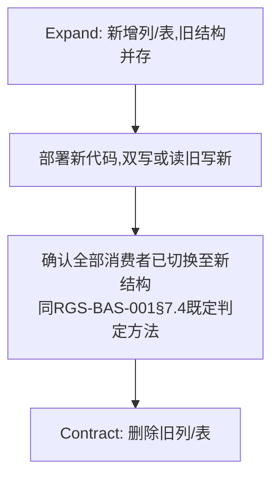
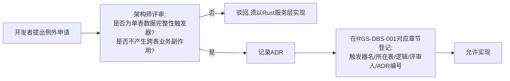

# 基本设计书（基本設計書 / Basic Design Document）

**数据库设计标准与存储过程使用规范 Database Design Standard & Stored Procedure Policy**

| 项目 | 内容 |
|---|---|
| 文档编号 | RGS-BAS-007 |
| 版本 | 0.1 |
| 父文档 | RGS-REQ-011 需求定义书 第7章（ARC-023） |
| 依据标准 | IPA『共通フレーム 2013（SLCP-JCF2013）』基本设计工程 |
| 制定日 | 2026-08-16 |
| 制定者 | 架构师 |
| 保密级别 | 内部限定（Internal Use Only） |

## 修订历史（改訂履歴 / Revision History）

| 版本 | 修订日 | 修订者 | 修订内容 | 影响章节 |
|---|---|---|---|---|
| 0.1 | 2026-08-16 | 架构师 | 初版制定。将RGS-REQ-011 ARC-023展开为命名规范表、索引/分区设计标准、迁移流程设计、备份恢复标准、存储过程例外评审流程 | 全部 |

## 审批栏（承認欄 / Approval）

| 角色 | 姓名 | 审批日 | 备注 |
|---|---|---|---|
| 制定（起草） | 架构师 | 2026-08-16 | — |
| 评审（DBA） | | | 索引/分区标准的可执行性 |
| 审批（负责人） | | | 本文档的基准化 |

---

## 目录

1. [前言](#1-前言)
2. [命名规范](#2-命名规范)
3. [索引设计标准](#3-索引设计标准)
4. [分区设计标准](#4-分区设计标准)
5. [迁移流程设计](#5-迁移流程设计)
6. [备份与恢复设计](#6-备份与恢复设计)
7. [存储过程例外评审流程](#7-存储过程例外评审流程)
8. [连接池标准](#8-连接池标准)
9. [标准化检查清单](#9-标准化检查清单)
10. [追溯性（ARC-023 → 本设计书章节）](#10-追溯性arc-023--本设计书章节)

---

# 1. 前言

本文档是RGS-REQ-011第7章ARC-023的系统级展开，同时是RGS-DBS-001（PH-2制定，各限界上下文物理DDL）的**编写标准**——RGS-DBS-001须在其每个章节标注是否遵循本文档标准，偏离须走ADR（同RGS-REQ-011 NFR-DBS-001）。本文档不给出任何具体限界上下文的DDL，具体DDL留待RGS-DBS-001。

---

# 2. 命名规范

| 对象 | 规则 | 示例 |
|---|---|---|
| 数据库名 | `<限界上下文缩写英文全称>_db` | `player_db`／`economy_db`（复用既有命名，本文档确认为标准） |
| 表名 | `snake_case`复数或领域名词，与RGS-BAS-001§5逻辑ER设计的实体名对应（大写实体名转为小写下划线） | `OPERATION_AUDIT`（逻辑）→ `operation_audit`（物理） |
| 列名 | `snake_case`，与RGS-BAS-004§4.3既定的API/日志字段同名概念保持一致拼写 | `player_id`／`character_id`／`created_at` |
| 索引名 | `idx_<表名>_<列名或用途简写>` | `idx_operation_audit_operator_id` |
| 外键约束名（如有，限同库内） | `fk_<表名>_<引用表名>` | — |
| 迁移文件名 | `<序号>_<动词>_<对象>.sql`，序号保证顺序执行 | `0007_add_column_mail_read_at.sql` |

---

# 3. 索引设计标准

对应FR-DBS-010。

| 步骤 | 内容 |
|---|---|
| 1. 识别查询模式 | 从RGS-BAS-001§6字段级API设计中，提取每个查询类方法（`Get*`/`Query*`）的过滤/排序字段 |
| 2. 匹配索引 | 为高频查询模式建立索引，复合查询优先复合索引（字段顺序依据选择性由高到低），避免为低频查询建索引（写放大与存储成本，同ARC-014"默认替代方案优先，非默认引入"的同类精神） |
| 3. 记录依据 | RGS-DBS-001中每个索引须注明其对应的查询场景（方法名），供后续评审判断该索引是否仍有必要保留 |
| 4. 定期复核 | PH-4负载试验后，依实测慢查询日志复核索引设计，移除未命中的冗余索引 |

---

# 4. 分区设计标准

对应FR-DBS-011。

| 表类别 | 分区策略 | 保留期对应 |
|---|---|---|
| `operation_audit`（`admin_db`） | 按月范围分区（Range Partition on `occurred_at`） | 3年（36个分区滚动保留，超期`DETACH`+归档或`DROP`，遵循NFR-SE-010"仅追加"约束，分区操作**不得**修改历史分区内容，仅整体移除过期分区） |
| `outbox`系列表（各限界上下文） | 按周/月范围分区（依实际发布吞吐量，PH-5明确） | 依既定Outbox处理时效，已发布记录短期归档后清理 |
| 行为日志/分析数据表（PH-6，社交/分析相关） | 按天/周范围分区 | 400天（复用RGS-REQ-001既有保留期表） |
| **幂等去重记录表**（`request_id`已处理记录、`event_id`去重表，各限界上下文） | 按时间范围分区，与`operation_audit`同构 | 保留期取业务上允许的最大重试/重放延迟窗口（如7天，具体值详细设计确定），超期分区整体`DETACH`清理。**理由**：该类表若不分区会随运营时间无限增长，索引膨胀反过来拖慢查重本身的延迟，直接冲突NFR-PE-008（见RGS-BAS-010§4 G-005） |
| 业务主表（`Character`／`Wallet`／`Inventory`等） | **不分区**（数据量与访问模式不构成分区收益，过早分区增加复杂度，同ARC-014"未证明前不引入复杂性"精神） | 不适用 |

---

# 5. 迁移流程设计

对应FR-DBS-020/021/022。

## 5.1 迁移脚本规范

| 规则 | 内容 |
|---|---|
| 幂等性 | 使用`IF NOT EXISTS`/`IF EXISTS`等幂等语法，或迁移工具自带的已执行记录表（防止重复执行报错） |
| 回滚脚本 | 每个迁移脚本**应当**配对一个回滚脚本（`down`脚本），复杂的数据迁移若回滚代价过高，须在RGS-DBS-001中显式声明"不可逆迁移"并经额外评审 |
| CI校验 | 复用RGS-BAS-002§4.2既有CI"migrations校验"阶段：对`migrations/`执行"向前迁移+回滚"演练 |

## 5.2 破坏性变更（Expand-Contract，复用ARC-015）

同一次迁移脚本**不得**同时包含Expand与Contract动作（FR-DBS-022），两者须分属不同迁移版本，中间须有可验证的过渡期。

---

# 6. 备份与恢复设计

对应FR-DBS-030/031，实现层面标准化RGS-REQ-001既有NFR-AV-004/005目标。

| 项目 | 内容 |
|---|---|
| 备份方式 | 复用RGS-BAS-001§7.1既有的PostgreSQL同步复制（RPO=0）+ 周期性物理/逻辑备份（用于误操作恢复等复制无法覆盖的场景） |
| 恢复演练 | 定期（如每季度）在隔离环境执行"从备份恢复"演练，记录实际RTO，与NFR-AV-004既定目标（30分钟）比对 |
| 演练记录归档 | 演练结果记入运维记录（具体归档位置属RGS-OPS-001），本文档仅要求演练**必须**发生且可追溯 |

---

# 7. 存储过程例外评审流程

对应ARC-023"极简约束触发器"的极窄允许边界。

| 判定标准 | 内容 |
|---|---|
| 允许 | 单表内、赋值级操作（如`updated_at = now()`），**不**查询/修改其他表，**不**产生业务副作用（如不触发通知、不改变库存/货币） |
| 不允许 | 任何跨表操作、任何涉及业务规则判断（哪怕只是简单的`IF`条件影响业务字段）、任何调用外部系统（数据库不具备该能力也不应具备） |

**审计**：全部已批准的例外须在RGS-DBS-001中形成一张汇总表，供AC-DBS-004（存储过程审查）核对依据。

---

# 8. 连接池标准

| 项目 | 内容 |
|---|---|
| 独立性 | 每个限界上下文服务的数据库连接池相互独立（复用RGS-BAS-002§5.3网络隔离思路在连接层面的自然结果：物理上无法连接其他上下文数据库，连接池天然按上下文隔离） |
| 上限配置 | 连接池上限须可配置（复用RGS-BAS-001§7.2既有"连接池须设上限，具体数值依PH-4负载试验结果调整"决定），本文档不重新设定具体数值 |
| 监控 | 连接池饱和度纳入RGS-BAS-004§3.1既有通用指标（`rgs_dependency_pool_saturation_ratio`），不新增独立监控机制 |

---

# 9. 标准化检查清单

## 9.1 RGS-DBS-001编写/评审检查清单

- [ ] 全部表/列/索引命名符合§2命名规范，与既有API/日志字段拼写一致
- [ ] 高频查询路径均有对应索引，且逐条标注对应的查询场景（§3）
- [ ] 高写入频率表（审计日志/outbox/行为日志）均采用§4分区标准，分区粒度与保留期对齐
- [ ] 迁移脚本均满足幂等性与回滚脚本要求（§5.1），破坏性变更遵循Expand-Contract分离（§5.2）
- [ ] 备份恢复演练记录存在且RTO达标（§6）
- [ ] 存储过程/触发器审查：除已登记的§7例外，无业务逻辑承载于数据库内部

---

# 10. 追溯性（ARC-023 → 本设计书章节）

| ARC/FR编号 | 决定摘要 | 本文档展开章节 |
|---|---|---|
| ARC-023 | 业务逻辑不入库，存储过程极窄允许边界 | §7 |
| FR-DBS-001〜003 | 命名与结构标准 | §2 |
| FR-DBS-010〜011 | 索引与分区标准 | §3、§4 |
| FR-DBS-020〜022 | 迁移流程标准 | §5 |
| FR-DBS-030〜031 | 备份与恢复标准 | §6 |
| FR-DBS-040〜041 | 存储过程使用边界 | §7 |
| NFR-DBS-001〜004 | 一致性/可用性/性能/可维护性 | §2〜§8全章 |

---

> 本文档所定义的标准为RGS-DBS-001（PH-2）编写的直接依据。具体的物理数据类型、精确的索引DDL语句、逐表分区键选择，留待RGS-DBS-001按本文档标准逐一确定。
