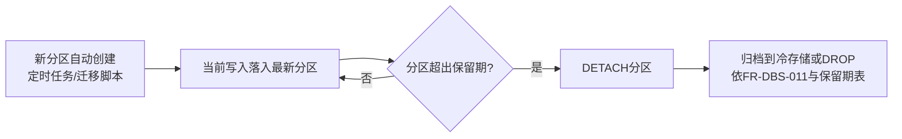
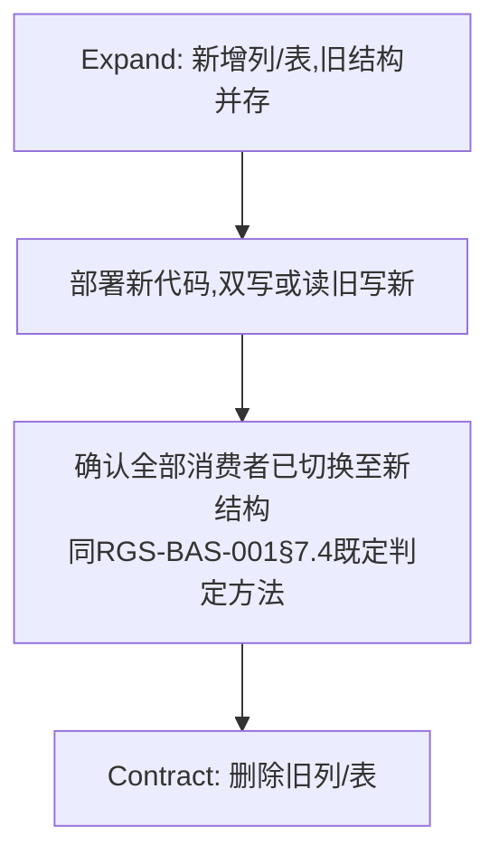
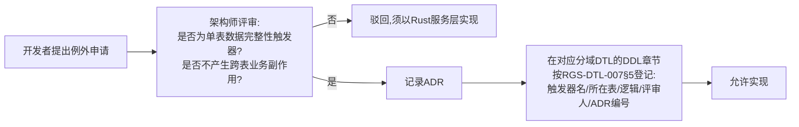

# 基本设计书（基本設計書 / Basic Design Document）

**数据库设计标准与存储过程使用规范 Database Design Standard & Stored Procedure Policy**

| 项目 | 内容 |
|---|---|
| 文档编号 | RGS-BAS-007 |
| 版本 | 0.3 |
| 父文档 | RGS-REQ-011 需求定义书 第7章（ARC-023） |
| 依据标准 | IPA『共通フレーム 2013（SLCP-JCF2013）』基本设计工程 |
| 制定日 | 2026-08-16 |
| 制定者 | 架构师 |
| 保密级别 | 内部限定（Internal Use Only） |

## 修订历史（改訂履歴 / Revision History）

| 版本 | 修订日 | 修订者 | 修订内容 | 影响章节 |
|---|---|---|---|---|
| 0.1 | 2026-08-16 | 架构师 | 初版制定。将RGS-REQ-011 ARC-023展开为命名规范表、索引/分区设计标准、迁移流程设计、备份恢复标准、存储过程例外评审流程 | 全部 |
| 0.2 | 2026-08-16 | 架构师 | 追溯性表补齐AC-DBS-001〜004验收标准与设计章节的映射（此前追溯性表仅覆盖ARC/FR/NFR，遗漏AC条目） | §10 |
| 0.3 | 2026-09-01 | 架构师 (Mavis 接手 agent per DEC-008) | 落实"各BAS文档功能章节加log设计且区分debug/release级"总要求（per Ulysses 2026-09-01 15:52 JST 决策，4 拍板选项：全部 36 个BAS / 详尽版5列表 / 派worker并行 / BAS-004同步升级）：§1.1/§2.1/§3.1/§4.1/§5.1/§5.2/§6.1/§7.1/§8.1/§9.1 全部 10 个 ## L2 功能段加"本功能日志设计" 5 列详尽版（字段名/触发条件/频率估算/采样策略/脱敏与成本），字段名前缀 `db.*` 区别于既有 `mnt.*`/`gm.*`/`sec.*` 命名空间；引用 BAS-001 v1.5 §4.8.3 模板（commit 32d9eb6）+ BAS-003 v0.3 样板（commit 75a001c）+ BAS-004 v0.3 §4.2 二维矩阵 + §4.3 字段 + §5.1 脱敏 + §6.2 强制全采样（commit 47e26b0/0ee6262）；覆盖 ARC-023 数据库设计域全部阶段（命名审计 / 索引创建 / 分区维护 / 迁移执行 / 备份恢复 / 存储过程例外评审 / 连接池监控 / 标准化检查）；**数据库域特殊强制**：SQL 慢查询/执行失败/迁移/Schema 变更/死锁/连接池耗尽 → `error!`/`warn!` 强制全采样（release 必出，§6.2 强制全量采集范围），`db.sql.slow_query`/`db.migration.failed`/`db.pool.exhausted`/`db.partition.detached` 均为强制全采样白名单；debug-only 字段（`#[cfg(debug_assertions)]` 守护，release build 完全剔除零运行时开销）含 `db.sql.debug.bind_values_dump`/`db.sql.debug.execution_plan_dump`/`db.migration.debug.sql_redacted_dump`；§9.1 检查清单新增 3 条 log 章节上线检查项；§10 追溯性新增 AC-DBS-006（debug-only 宏 release 完全剔除）与 AC-DBS-007（每功能 BAS 文档须含本功能 log 设计章节），与 BAS-001 v1.5 §4.8.3.4 / BAS-002 v0.4 §13 / BAS-003 v0.3 §13 / BAS-004 v0.3 §12 形成统一规范 | §1.1/§2.1/§3.1/§4.1/§5.1/§5.2/§6.1/§7.1/§8.1/§9.1/§10 |

## 审批栏（承認欄 / Approval）

| 角色 | 姓名 | 审批日 | 备注 |
|---|---|---|---|
| 制定（起草） | 架构师 | 2026-08-16 | — |
| 评审（DBA） | | | 索引/分区标准的可执行性 |
| 审批（负责人） | | | 本文档的基准化 |

---

## 目录

1. [前言](#1-前言)
2. [命名规范](#2-命名规范)
3. [索引设计标准](#3-索引设计标准)
4. [分区设计标准](#4-分区设计标准)
5. [迁移流程设计](#5-迁移流程设计)
6. [备份与恢复设计](#6-备份与恢复设计)
7. [存储过程例外评审流程](#7-存储过程例外评审流程)
8. [连接池标准](#8-连接池标准)
9. [标准化检查清单](#9-标准化检查清单)
10. [追溯性（ARC-023 → 本设计书章节）](#10-追溯性arc-023-本设计书章节)

---

# 1. 前言

本文档是RGS-REQ-011第7章ARC-023的系统级展开，同时是各限界上下文分域RGS-DTL物理DDL章节（当前为RGS-DTL-001§2.1／§3.1、RGS-DTL-015§2、RGS-DTL-016§2、RGS-DTL-025§2与RGS-DTL-026§2）的**编写标准**——每个对应章节须标注是否遵循本文档标准，偏离须走ADR（同RGS-REQ-011 NFR-DBS-001）。本文档不给出任何具体限界上下文的DDL，具体DDL留待对应分域章节。

## 1.1 本功能日志设计

本节覆盖"本设计书自身**作为治理基准**被分域RGS-DTL物理DDL章节引用时"的观察点——本文档不直接产生业务SQL执行事件，但**作为标准发布、修订评审、分域遵循判定**的基线，需要追踪"何时被谁遵循/偏离"。本节为元数据型日志，频率极低，但因涉及"偏离判定→ADR流程"，必须 release 必出。

| 字段名（field） | 触发条件（trigger） | 频率估算（frequency） | 采样策略（sampling） | 脱敏与成本（redact & cost） |
|---|---|---|---|---|
| `db.standard.published` | BAS-007 新版本经审批后正式发布（如本版本 v0.3 → v0.4 升版） | 1/季度 | release 必出（100% 强制全采样，per BAS-004 v0.3 §6.2） | 含`version`/`effective_at`/`approver_id`；约 250B/条 × 1/季度 = 极低 |
| `db.standard.amend_request.received` | 任意分域RGS-DTL物理DDL章节提出"偏离BAS-007标准"的修订申请 | 1/月 | release 必出（100% 强制全采样） | 含`dtl_doc_id`/`requester_id`/`amend_scope`；约 300B/条 |
| `db.standard.amend.approved` | 架构师评审通过修订申请（含 ADR 编号） | 1/月 | release 必出（100% 强制全采样） | 含`dtl_doc_id`/`adr_id`/`approver_id`；约 280B/条 |
| `db.standard.amend.rejected` | 修订申请被驳回（须以标准方式实现） | 偶发 | release 必出（100% 强制全采样） | 含`dtl_doc_id`/`reason`/`rejector_id`；约 250B/条 |
| `db.standard.deviation.detected` | 自动化扫描发现分域DTL章节已落地但未标注遵循BAS-007标准 | 1/季度（季度评审） | release 必出（100% 强制全采样） | 含`dtl_doc_id`/`detected_section`；约 350B/条 |
| `db.standard.debug.compliance_diff_dump` | 分域DTL章节与本标准的逐行 diff（用于人工复审） | 1/季度 | **debug-only**（`#[cfg(debug_assertions)]` 守护，release build 完全剔除） | 约 2-10KB/条（依赖文档长度，release 剔除） |
| `db.standard.debug.amend_request_full_payload` | 修订申请的完整 payload（含敏感字段，**仅** debug-only 守护） | 1/月 | **debug-only**（`#[cfg(debug_assertions)]` 守护，release build 完全剔除） | 约 1-3KB/条（release 剔除，避免误开 RUST_LOG=debug 泄漏） |

**debug-only 守护要点**（落实 BAS-004 v0.3 §4.4）：
- `db.standard.debug.amend_request_full_payload` 可能含 ADR 全文 draft——release build 完全剔除，避免 RUST_LOG=debug 误开时未发布 ADR 草案泄漏
- `db.standard.*` 系列均为 `info!` 级别（release 必出，§4.8.3.2 二维矩阵 `info!` 行常驻），便于 DBA 团队按 `dtl_doc_id` 维度追溯标准符合性

---

# 2. 命名规范

| 对象 | 规则 | 示例 |
|---|---|---|
| 数据库名 | `<限界上下文缩写英文全称>_db` | `player_db`／`economy_db`（复用既有命名，本文档确认为标准） |
| 表名 | `snake_case`复数或领域名词，与RGS-BAS-001§5逻辑ER设计的实体名对应（大写实体名转为小写下划线） | `OPERATION_AUDIT`（逻辑）→ `operation_audit`（物理） |
| 列名 | `snake_case`，与RGS-BAS-004§4.3既定的API/日志字段同名概念保持一致拼写 | `player_id`／`character_id`／`created_at` |
| 索引名 | `idx_<表名>_<列名或用途简写>` | `idx_operation_audit_operator_id` |
| 外键约束名（如有，限同库内） | `fk_<表名>_<引用表名>` | — |
| 迁移文件名 | `<序号>_<动词>_<对象>.sql`，序号保证顺序执行 | `0007_add_column_mail_read_at.sql` |

## 2.1 本功能日志设计

本节覆盖"命名规范**评审与扫描**"的观察点——本节**不**直接产生DDL执行事件，但CI/Review阶段会触发"违规检测/审计完成"事件，便于DBA/SRE按 `context`/`table_name` 维度追踪命名一致性。

| 字段名（field） | 触发条件（trigger） | 频率估算（frequency） | 采样策略（sampling） | 脱敏与成本（redact & cost） |
|---|---|---|---|---|
| `db.naming.audit.started` | CI 阶段对分域 migrations/ 目录执行命名规范扫描 | 10-50/h（CI 流水线触发） | release 必出（100% 强制全采样，per BAS-004 v0.3 §6.2） | 含`context`/`migration_count`；约 200B/条 × 30/h = 6KB/h 稳态 |
| `db.naming.audit.passed` | 全部表/列/索引/迁移文件命名符合 §2 规范 | 10-50/h | release 必出（100% 强制全采样） | 含`context`/`audited_count`；约 250B/条 |
| `db.naming.violation.detected` | 扫描发现命名违规（如大写表名、错拼字段、与既有 API/日志字段不一致） | 偶发 | release 必出（100% 强制全采样） | 含`context`/`violation_kind`/`table_name`/`column_name`/`expected_pattern`；约 400B/条 |
| `db.naming.audit.failed.unexpected` | 扫描器内部异常（无法读取 migrations 目录、解析失败） | 极少 | release 必出（100% 强制全采样） | 含`context`/`error`/`trace_id`；约 350B/条 |
| `db.naming.audit.override.applied` | 违规被显式 override 标记（含 ADR 编号，CI 放行） | 偶发 | release 必出（100% 强制全采样） | 含`context`/`violation_id`/`adr_id`/`overrider_id`；约 300B/条 |
| `db.naming.debug.table_column_dump` | 当前 migrations/ 下全部表/列/索引的命名 dump（用于离线审计） | 10-50/h | **debug-only**（`#[cfg(debug_assertions)]` 守护，release build 完全剔除） | 约 5-20KB/条（依赖 migrations 规模，release 剔除） |
| `db.naming.debug.violation_redacted_diff` | 违规位置的完整 diff（敏感字段已脱敏，**仅** debug-only 守护） | 偶发 | **debug-only**（`#[cfg(debug_assertions)]` 守护，release build 完全剔除） | 约 1-5KB/条（release 剔除） |

**debug-only 守护要点**（落实 BAS-004 v0.3 §4.4）：
- `db.naming.debug.table_column_dump` 在大型 workspace 下可能 20KB+ —— release build 完全剔除，避免 RUST_LOG=debug 误开时撑爆生产日志通道
- `db.naming.violation.detected` 全部为 `warn!` 级别（release 常驻，§4.8.3.2 二维矩阵 `warn!` 行常驻），便于 CI 门禁 + DBA 复盘

---

# 3. 索引设计标准

对应FR-DBS-010。

| 步骤 | 内容 |
|---|---|
| 1. 识别查询模式 | 从RGS-BAS-001§6字段级API设计中，提取每个查询类方法（`Get*`/`Query*`）的过滤/排序字段 |
| 2. 匹配索引 | 为高频查询模式建立索引，复合查询优先复合索引（字段顺序依据选择性由高到低），避免为低频查询建索引（写放大与存储成本，同ARC-014"默认替代方案优先，非默认引入"的同类精神） |
| 3. 记录依据 | 对应分域RGS-DTL物理DDL章节中每个索引须注明其对应的查询场景（方法名），供后续评审判断该索引是否仍有必要保留 |
| 4. 定期复核 | PH-4负载试验后，依实测慢查询日志复核索引设计，移除未命中的冗余索引 |

## 3.1 本功能日志设计

本节覆盖"索引生命周期"的观察点——索引创建/移除、未命中检测、PH-4 负载试验后的复核——**数据库域强制**：慢查询/执行失败/未命中索引 **必须 release 必出 + 100% 强制全采样**，原因：影响 NFR-PE-008 查询延迟 + NFR-AV-005 可用性，运维核心信号不允许采样降级。debug-only 仅限执行计划/SQL 参数 dump（**严禁**进生产日志通道）。

| 字段名（field） | 触发条件（trigger） | 频率估算（frequency） | 采样策略（sampling） | 脱敏与成本（redact & cost） |
|---|---|---|---|---|
| `db.index.created` | 索引 DDL 在生产执行成功（CI 迁移 / 手工 apply 触发） | 1-10/日（每次迁移可能多个索引） | release 必出（100% 强制全采样，per BAS-004 v0.3 §6.2） | 含`context`/`table_name`/`index_name`/`column_names`/`migration_id`；约 350B/条 × 5/日 = 1.7KB/日 |
| `db.index.removed` | 索引被 drop（PH-4 复核后清理冗余索引） | 1-5/月 | release 必出（100% 强制全采样） | 含`context`/`table_name`/`index_name`/`reason`；约 300B/条 |
| `db.index.unused.detected` | PH-4 复核或 `pg_stat_user_indexes` 扫描发现索引从未被命中 | 1/季度 | release 必出（100% 强制全采样） | 含`context`/`table_name`/`index_name`/`unused_since`/`scan_count`；约 400B/条 |
| `db.sql.slow_query` | 查询执行耗时超过阈值（依NFR-PE-*，具体阈值详细设计确定，典型 100ms-1s） | 10-100/h（峰值） | release 必出（100% 强制全采样，**数据库域强制全采样白名单**——per BAS-004 v0.3 §6.2） | 含`context`/`query_hash`/`latency_ms`/`table_name`/`rows_examined`；约 300B/条 × 50/h = 15KB/h 稳态 |
| `db.sql.execution.failed` | SQL 执行失败（语法错、约束冲突、连接断） | 偶发 | release 必出（100% 强制全采样，**数据库域强制**） | 含`context`/`query_hash`/`error`/`trace_id`；约 400B/条 |
| `db.sql.review.missing_index_detected` | 慢查询分析发现缺失索引（依 §3 步骤 1-2 判定） | 1/周 | release 必出（100% 强制全采样） | 含`context`/`query_hash`/`recommended_columns`；约 350B/条 |
| `db.sql.debug.bind_values_dump` | SQL 参数 bind values 完整 dump（用于复现慢查询） | 10-100/h | **debug-only**（`#[cfg(debug_assertions)]` 守护，release build 完全剔除） | 约 0.5-5KB/条（**含 PII 风险**——若含 `player_id`/邮箱等，release 必须剔除，**严禁**进入生产日志通道） |
| `db.sql.debug.execution_plan_dump` | `EXPLAIN ANALYZE` 完整执行计划 dump | 10-100/h | **debug-only**（`#[cfg(debug_assertions)]` 守护，release build 完全剔除） | 约 2-10KB/条（依赖查询复杂度，release 剔除） |
| `db.index.debug.histogram_snapshot` | 索引列基数与选择性 histogram dump | 1/周 | **debug-only**（`#[cfg(debug_assertions)]` 守护，release build 完全剔除） | 约 3-15KB/条（release 剔除） |

**debug-only 守护要点**（落实 BAS-004 v0.3 §4.4）：
- `db.sql.debug.bind_values_dump` **含 PII 风险**——若 SQL 含 `player_id`/邮箱/Token，release build 必须完全剔除；该字段仅供开发/测试环境复现慢查询
- `db.sql.slow_query` 与 `db.sql.execution.failed` 为 **数据库域强制全采样白名单**（per 任务特殊约束 + BAS-004 v0.3 §6.2），原因：慢查询是 NFR-PE-008 性能预算达成与否的核心证据，缺失将无法事后追责；连接断开/约束冲突影响 NFR-AV-005 可用性，必须 100% 落盘
- `db.index.*` 系列均为 `info!`/`warn!` 级别（release 常驻），便于 DBA 按 `table_name` 维度聚合

---

# 4. 分区设计标准

对应FR-DBS-011。

| 表类别 | 分区策略 | 保留期对应 |
|---|---|---|
| `operation_audit`（`admin_db`） | 按月范围分区（Range Partition on `occurred_at`） | 3年（36个分区滚动保留，超期`DETACH`+归档或`DROP`，遵循NFR-SE-010"仅追加"约束，分区操作**不得**修改历史分区内容，仅整体移除过期分区） |
| `outbox`系列表（各限界上下文） | 按周/月范围分区（依实际发布吞吐量，PH-5明确） | 依既定Outbox处理时效，已发布记录短期归档后清理 |
| 行为日志/分析数据表（PH-6，社交/分析相关） | 按天/周范围分区 | 400天（复用RGS-REQ-001既有保留期表） |
| **幂等去重记录表**（`request_id`已处理记录、`event_id`去重表，各限界上下文） | 按时间范围分区，与`operation_audit`同构 | 保留期取业务上允许的最大重试/重放延迟窗口（如7天，具体值详细设计确定），超期分区整体`DETACH`清理。**理由**：该类表若不分区会随运营时间无限增长，索引膨胀反过来拖慢查重本身的延迟，直接冲突NFR-PE-008（见RGS-BAS-010§4 G-005） |
| 业务主表（`Character`／`Wallet`／`Inventory`等） | **不分区**（数据量与访问模式不构成分区收益，过早分区增加复杂度，同ARC-014"未证明前不引入复杂性"精神） | 不适用 |

## 4.1 本功能日志设计

本节覆盖"分区生命周期"的观察点——自动创建、超期 `DETACH`、归档/清理、失败回退。**数据库域强制**：Schema 变更类（分区创建/移除）+ 死锁/连接池耗尽类 必须 release 必出 + 100% 强制全采样（分区误操作直接破坏 NFR-SE-010"仅追加"约束，影响范围大）。debug-only 仅限分区列表/键分布 dump。

| 字段名（field） | 触发条件（trigger） | 频率估算（frequency） | 采样策略（sampling） | 脱敏与成本（redact & cost） |
|---|---|---|---|---|
| `db.partition.created` | 新分区由定时任务/迁移脚本自动创建（如 `operation_audit` 月分区滚动） | 1/月（每张分区表） | release 必出（100% 强制全采样，per BAS-004 v0.3 §6.2） | 含`context`/`table_name`/`partition_name`/`range_start`/`range_end`；约 300B/条 × N 张表/月 |
| `db.partition.detached` | 超期分区被 `DETACH`（遵循 NFR-SE-010"仅追加"，**仅**整体移除历史分区，**不**修改历史分区内容） | 1/月 | release 必出（100% 强制全采样，**数据库域强制**） | 含`context`/`table_name`/`partition_name`/`detached_at`/`retention_policy`；约 350B/条 |
| `db.partition.archived.to_cold_storage` | 已 `DETACH` 的分区归档至冷存储（S3/对象存储等） | 1/月 | release 必出（100% 强制全采样） | 含`context`/`table_name`/`partition_name`/`storage_target`/`archive_size_bytes`；约 400B/条 |
| `db.partition.creation.failed` | 新分区自动创建失败（如父表锁冲突、磁盘满、权限不足） | 极少 | release 必出（100% 强制全采样，**数据库域强制**） | 含`context`/`table_name`/`expected_partition_name`/`error`/`trace_id`；约 450B/条 |
| `db.partition.detach.failed` | `DETACH` 失败（如长事务持锁、并发查询） | 极少 | release 必出（100% 强制全采样） | 含`context`/`table_name`/`partition_name`/`error`/`blocking_pid`；约 450B/条 |
| `db.partition.retained.beyond_policy` | 分区已超保留期但因业务需求（合规/审计/未完成分析）被显式保留 | 1/季度 | release 必出（100% 强制全采样） | 含`context`/`table_name`/`partition_name`/`overdue_days`/`retainer_id`/`retain_reason`；约 400B/条 |
| `db.partition.debug.partition_list_dump` | 当前表的全部分区列表 + 行数/大小 dump | 1/周 | **debug-only**（`#[cfg(debug_assertions)]` 守护，release build 完全剔除） | 约 5-30KB/条（依赖表规模，release 剔除） |
| `db.partition.debug.partition_key_distribution` | 分区键分布 histogram dump（检查数据倾斜） | 1/周 | **debug-only**（`#[cfg(debug_assertions)]` 守护，release build 完全剔除） | 约 10-50KB/条（release 剔除） |

**debug-only 守护要点**（落实 BAS-004 v0.3 §4.4）：
- `db.partition.debug.partition_list_dump` 与 `db.partition.debug.partition_key_distribution` 在大型表（如 `operation_audit` 3 年 36 个分区）下可能 50KB+ —— release build 完全剔除，避免 RUST_LOG=debug 误开时撑爆生产日志通道
- `db.partition.detached` 与 `db.partition.creation.failed` 为 **数据库域强制全采样白名单**（per 任务特殊约束 + BAS-004 v0.3 §6.2），原因：分区误 `DETACH` 直接破坏 NFR-SE-010"仅追加"约束，影响 NFR-AV-005 数据可恢复性，必须 100% 留痕
- `db.partition.creation.failed` 为 `error!` 级别（§4.8.3.2 二维矩阵 `error!` 行 release 常驻 + 强制全采样），挂 `error!` 立即触发告警链路

---

---

# 5. 迁移流程设计

对应FR-DBS-020/021/022。

## 5.1 迁移脚本规范

| 规则 | 内容 |
|---|---|
| 幂等性 | 使用`IF NOT EXISTS`/`IF EXISTS`等幂等语法，或迁移工具自带的已执行记录表（防止重复执行报错） |
| 回滚脚本 | 每个迁移脚本**应当**配对一个回滚脚本（`down`脚本），复杂的数据迁移若回滚代价过高，须在对应分域RGS-DTL物理DDL章节中显式声明"不可逆迁移"并经额外评审 |
| CI校验 | 复用RGS-BAS-002§4.2既有CI"migrations校验"阶段：对`migrations/`执行"向前迁移+回滚"演练 |

### 5.1 本功能日志设计

本节覆盖"迁移脚本**执行**"的观察点——apply/rollback/失败/幂等校验/不可逆迁移。**数据库域强制**：所有迁移执行事件（成功/失败/回滚）必须 release 必出 + 100% 强制全采样，原因：迁移直接修改 Schema，影响 NFR-SE-010 + NFR-AV-005，运维核心信号不允许采样降级。debug-only 仅限 SQL 完整 dump（**严禁**生产日志泄漏明文 SQL 与参数）。

| 字段名（field） | 触发条件（trigger） | 频率估算（frequency） | 采样策略（sampling） | 脱敏与成本（redact & cost） |
|---|---|---|---|---|
| `db.migration.apply.started` | 迁移脚本开始执行（CI 流水线 / 手工 apply / 启动时自举迁移触发） | 1-50/日（每次部署可能多个） | release 必出（100% 强制全采样，per BAS-004 v0.3 §6.2） | 含`context`/`migration_id`/`migration_file`/`applier_id`；约 250B/条 × 20/日 = 5KB/日 |
| `db.migration.apply.completed` | 迁移脚本执行成功（含事务提交确认） | 1-50/日 | release 必出（100% 强制全采样，**数据库域强制**） | 含`context`/`migration_id`/`duration_ms`/`rows_affected`；约 300B/条 |
| `db.migration.rollback.started` | 迁移回滚（`down` 脚本）开始执行 | 偶发（仅 apply 失败时） | release 必出（100% 强制全采样） | 含`context`/`migration_id`/`rollback_file`/`reason`；约 280B/条 |
| `db.migration.rollback.completed` | 回滚脚本执行成功 | 偶发 | release 必出（100% 强制全采样） | 含`context`/`migration_id`/`duration_ms`；约 280B/条 |
| `db.migration.failed` | 迁移脚本执行失败（语法错、约束冲突、外键依赖未满足） | 偶发 | release 必出（100% 强制全采样，**数据库域强制全采样白名单**） | 含`context`/`migration_id`/`error`/`trace_id`/`failed_statement_line`；约 450B/条 |
| `db.migration.rollback.failed` | 回滚脚本本身执行失败 | 极少（应急路径，紧急升级 DBA） | release 必出（100% 强制全采样） | 含`context`/`migration_id`/`error`/`trace_id`；约 450B/条 |
| `db.migration.idempotent_check.passed` | 幂等性校验通过（重复执行不会产生副作用） | 10-50/日 | release 必出（100% 强制全采样） | 含`context`/`migration_id`/`check_method`；约 250B/条 |
| `db.migration.irreversible.declared` | 复杂数据迁移显式声明"不可逆"（依 §5.1 表格第 2 行） | 偶发 | release 必出（100% 强制全采样） | 含`context`/`migration_id`/`dtl_doc_id`/`declared_by`/`reason`；约 400B/条 |
| `db.migration.drift.detected` | 数据库实际 Schema 与迁移记录表记录的 Schema 漂移（手动改库未走迁移） | 偶发（多为配置错） | release 必出（100% 强制全采样） | 含`context`/`expected_schema`/`actual_schema`/`drift_objects`；约 500B/条 |
| `db.migration.debug.sql_redacted_dump` | 迁移脚本的完整 SQL dump（敏感字段已脱敏，**仅** debug-only 守护） | 1-50/日 | **debug-only**（`#[cfg(debug_assertions)]` 守护，release build 完全剔除） | 约 1-10KB/条（依赖迁移大小，release 剔除） |
| `db.migration.debug.bind_values_dump` | 迁移中数据迁移语句的 bind values dump（用于复现失败） | 偶发 | **debug-only**（`#[cfg(debug_assertions)]` 守护，release build 完全剔除） | 约 0.5-5KB/条（**含 PII 风险**——若含 `player_id` 等业务数据，release 必须剔除） |

**debug-only 守护要点**（落实 BAS-004 v0.3 §4.4）：
- `db.migration.debug.sql_redacted_dump` 与 `db.migration.debug.bind_values_dump` **含 PII/Schema 泄漏风险**——若迁移涉及业务数据回填（如旧版数据迁移到新结构），release build 必须完全剔除
- `db.migration.failed` 为 **数据库域强制全采样白名单**（per 任务特殊约束 + BAS-004 v0.3 §6.2），原因：迁移失败若不立即告警，可能导致生产库长期处于"半迁移"状态，影响 NFR-AV-005 + NFR-SE-010
- `db.migration.drift.detected` 为 `error!` 级别（§4.8.3.2 二维矩阵 `error!` 行 release 常驻 + 强制全采样），挂 `error!` 立即触发告警

## 5.2 破坏性变更（Expand-Contract，复用ARC-015）

同一次迁移脚本**不得**同时包含Expand与Contract动作（FR-DBS-022），两者须分属不同迁移版本，中间须有可验证的过渡期。

### 5.2 本功能日志设计

本节覆盖"Expand-Contract **两阶段落地**"的观察点——阶段切换确认、消费者切换比例、违规检测（合并）。**数据库域强制**：所有 Expand/Contract 阶段事件必须 release 必出 + 100% 强制全采样，违规（合并执行）必须 `error!` 强制全采样。debug-only 仅限阶段产物 dump。

| 字段名（field） | 触发条件（trigger） | 频率估算（frequency） | 采样策略（sampling） | 脱敏与成本（redact & cost） |
|---|---|---|---|---|
| `db.expand_contract.expand.applied` | Expand 阶段迁移执行成功（新增列/表，旧结构并存） | 偶发（每次重大 Schema 演化） | release 必出（100% 强制全采样，per BAS-004 v0.3 §6.2） | 含`context`/`migration_id`/`added_objects`/`expand_at`；约 400B/条 |
| `db.expand_contract.consumer.switched` | 单个消费者（gRPC Service / 异步 Worker）切换至新结构完成 | 偶发 | release 必出（100% 强制全采样） | 含`context`/`consumer_id`/`consumer_kind`/`new_schema_version`/`switched_at`；约 350B/条 |
| `db.expand_contract.all_consumers.switched` | 全部消费者切换完成（依 RGS-BAS-001§7.4 判定方法） | 偶发 | release 必出（100% 强制全采样） | 含`context`/`consumer_count`/`transition_window`；约 350B/条 |
| `db.expand_contract.contract.applied` | Contract 阶段迁移执行成功（删除旧列/表） | 偶发 | release 必出（100% 强制全采样，**数据库域强制**——直接破坏 NFR-SE-010"仅追加"约束） | 含`context`/`migration_id`/`removed_objects`/`contract_at`；约 400B/条 |
| `db.expand_contract.combined.violation` | 同一迁移脚本同时包含 Expand 与 Contract 动作（违反 FR-DBS-022） | 偶发（CI 拦截） | release 必出（100% 强制全采样，**数据库域强制全采样白名单**） | 含`context`/`migration_id`/`violation_kind`/`trace_id`；约 450B/条 |
| `db.expand_contract.transition.exceeded` | 过渡期超出预定窗口（消费者切换比例长期 <100%） | 偶发 | release 必出（100% 强制全采样） | 含`context`/`migration_id`/`scheduled_contract_at`/`pending_consumer_count`；约 400B/条 |
| `db.expand_contract.contract.postponed` | 过渡期结束但仍有未切换消费者，Contract 主动延期 | 极少 | release 必出（100% 强制全采样） | 含`context`/`migration_id`/`postponed_by`/`new_contract_at`/`reason`；约 400B/条 |
| `db.expand_contract.debug.dual_write_consistency_check` | 双写期间新旧结构的一致性校验 dump | 偶发 | **debug-only**（`#[cfg(debug_assertions)]` 守护，release build 完全剔除） | 约 2-10KB/条（依赖对比行数，release 剔除） |
| `db.expand_contract.debug.consumer_switch_audit_trail` | 各消费者切换的完整审计记录（含切换前后 diff） | 偶发 | **debug-only**（`#[cfg(debug_assertions)]` 守护，release build 完全剔除） | 约 5-20KB/条（release 剔除） |

**debug-only 守护要点**（落实 BAS-004 v0.3 §4.4）：
- `db.expand_contract.debug.dual_write_consistency_check` 与 `db.expand_contract.debug.consumer_switch_audit_trail` 在大表下可能 20KB+ —— release build 完全剔除
- `db.expand_contract.contract.applied` 为 **数据库域强制全采样白名单**（per 任务特殊约束 + BAS-004 v0.3 §6.2），原因：Contract 阶段直接破坏 NFR-SE-010"仅追加"约束（删除旧列/表），若未正确判定全部消费者已切换，可能导致业务回滚/查询失败，必须 100% 留痕
- `db.expand_contract.combined.violation` 为 `error!` 级别（§4.8.3.2 二维矩阵 `error!` 行 release 常驻 + 强制全采样），CI 拦截后立即告警

---

# 6. 备份与恢复设计

对应FR-DBS-030/031，实现层面标准化RGS-REQ-001既有NFR-AV-004/005目标。

| 项目 | 内容 |
|---|---|
| 备份方式 | 复用RGS-BAS-001§7.1既有的PostgreSQL同步复制（RPO=0）+ 周期性物理/逻辑备份（用于误操作恢复等复制无法覆盖的场景） |
| 恢复演练 | 定期（如每季度）在隔离环境执行"从备份恢复"演练，记录实际RTO，与NFR-AV-004既定目标（30分钟）比对 |
| 演练记录归档 | 演练结果记入运维记录（具体归档位置属RGS-OPS-001），本文档仅要求演练**必须**发生且可追溯 |

## 6.1 本功能日志设计

本节覆盖"备份/恢复**演练**"的观察点——备份任务执行、恢复演练、RTO 达成判定。**数据库域强制**：备份失败/恢复失败/RTO 超标必须 `error!` 强制全采样，原因：直接影响 NFR-AV-004（30 分钟 RTO）+ NFR-AV-005 可用性。debug-only 仅限备份元数据 dump（备份内容严禁 dump）。

| 字段名（field） | 触发条件（trigger） | 频率估算（frequency） | 采样策略（sampling） | 脱敏与成本（redact & cost） |
|---|---|---|---|---|
| `db.backup.scheduled.started` | 周期性物理/逻辑备份任务按计划启动 | 1-24/日（依 backup policy） | release 必出（100% 强制全采样，per BAS-004 v0.3 §6.2） | 含`context`/`backup_kind`（physical/logical）/`backup_target`；约 250B/条 × 12/日 = 3KB/日 |
| `db.backup.scheduled.completed` | 备份任务成功完成 | 1-24/日 | release 必出（100% 强制全采样） | 含`context`/`backup_kind`/`duration_ms`/`backup_size_bytes`/`storage_target`；约 350B/条 |
| `db.backup.scheduled.failed` | 备份任务失败（磁盘满、权限不足、备份目标不可达） | 极少 | release 必出（100% 强制全采样，**数据库域强制全采样白名单**） | 含`context`/`backup_kind`/`error`/`trace_id`/`partial_backup_path`；约 400B/条 |
| `db.backup.replication.lag_detected` | 同步复制延迟超过阈值（同步复制 RPO=0 不应有可见 lag） | 极少（主从异常） | release 必出（100% 强制全采样） | 含`context`/`lag_bytes`/`lag_ms`/`replica_node`；约 350B/条 |
| `db.backup.recovery.drill_started` | 季度"从备份恢复"演练开始（隔离环境） | 1/季度 | release 必出（100% 强制全采样） | 含`context`/`drill_id`/`backup_used`/`target_rto_minutes`（30min）；约 300B/条 |
| `db.backup.recovery.drill_completed` | 恢复演练成功完成 | 1/季度 | release 必出（100% 强制全采样） | 含`context`/`drill_id`/`actual_rto_minutes`/`rto_target_met`；约 350B/条 |
| `db.backup.recovery.drill_rto_exceeded` | 恢复演练 RTO 超过 30 分钟目标（违反 NFR-AV-004） | 偶发 | release 必出（100% 强制全采样，**数据库域强制**） | 含`context`/`drill_id`/`actual_rto_minutes`/`target_rto_minutes`/`bottleneck_stage`；约 450B/条 |
| `db.backup.recovery.real_disaster_started` | 真实灾难场景下启动恢复流程（依 RGS-OPS-001 灾备手册） | 极少（真实 P0 事件） | release 必出（100% 强制全采样） | 含`context`/`disaster_id`/`recovery_strategy`/`incident_commander_id`；约 400B/条 |
| `db.backup.recovery.real_disaster_completed` | 真实恢复完成 | 极少 | release 必出（100% 强制全采样） | 含`context`/`disaster_id`/`actual_rto_minutes`/`data_loss_seconds`/`affected_contexts`；约 450B/条 |
| `db.backup.debug.backup_metadata_dump` | 备份任务的元数据 dump（备份大小、压缩比、文件清单，**不**含数据内容） | 1-24/日 | **debug-only**（`#[cfg(debug_assertions)]` 守护，release build 完全剔除） | 约 1-3KB/条（release 剔除） |
| `db.backup.debug.recovery_drill_timing_breakdown` | 恢复演练各阶段耗时分解 dump（用于定位瓶颈） | 1/季度 | **debug-only**（`#[cfg(debug_assertions)]` 守护，release build 完全剔除） | 约 2-5KB/条（release 剔除） |

**debug-only 守护要点**（落实 BAS-004 v0.3 §4.4）：
- `db.backup.debug.backup_metadata_dump` 与 `db.backup.debug.recovery_drill_timing_breakdown` **严禁**包含备份**数据内容**——若含 `player_id`/邮箱/Token 等业务数据，**不允许**走任何日志通道（既不 debug-only 也不 release）
- `db.backup.scheduled.failed` 与 `db.backup.recovery.drill_rto_exceeded` 为 **数据库域强制全采样白名单**（per 任务特殊约束 + BAS-004 v0.3 §6.2），原因：备份失败意味着 NFR-AV-005 不可恢复性风险；RTO 超标直接影响 NFR-AV-004 合同义务
- `db.backup.recovery.real_disaster_*` 全部为 `error!` 级别（§4.8.3.2 二维矩阵 `error!` 行 release 常驻 + 强制全采样），触发立即升级 SRE Lead + DBA

---

# 7. 存储过程例外评审流程

对应ARC-023"极简约束触发器"的极窄允许边界。

| 判定标准 | 内容 |
|---|---|
| 允许 | 单表内、赋值级操作（如`updated_at = now()`），**不**查询/修改其他表，**不**产生业务副作用（如不触发通知、不改变库存/货币） |
| 不允许 | 任何跨表操作、任何涉及业务规则判断（哪怕只是简单的`IF`条件影响业务字段）、任何调用外部系统（数据库不具备该能力也不应具备） |

**审计**：全部已批准的例外须按RGS-DTL-007§5的统一列结构，在对应分域DTL的DDL章节中登记，供AC-DBS-004（存储过程审查）核对依据。

## 7.1 本功能日志设计

本节覆盖"存储过程**例外评审**"的观察点——申请/审批/驳回/ADR 登记/违规检测。**数据库域强制**：所有评审事件必须 release 必出 + 100% 强制全采样，原因：本流程是 ARC-023"业务逻辑不入库"决定的唯一允许路径，审计留痕是 AC-DBS-004 验收核心依据。debug-only 仅限申请 payload dump。

| 字段名（field） | 触发条件（trigger） | 频率估算（frequency） | 采样策略（sampling） | 脱敏与成本（redact & cost） |
|---|---|---|---|---|
| `db.stored_procedure.exception.requested` | 开发者提交存储过程/触发器例外申请（依 §7 mermaid 流程 A 节点） | 1/月 | release 必出（100% 强制全采样，per BAS-004 v0.3 §6.2） | 含`context`/`request_id`/`requester_id`/`trigger_or_proc_name`/`target_table`；约 350B/条 |
| `db.stored_procedure.exception.under_review` | 架构师评审进行中（依 §7 mermaid 流程 B 节点） | 1/月 | release 必出（100% 强制全采样） | 含`context`/`request_id`/`reviewer_id`/`review_started_at`；约 300B/条 |
| `db.stored_procedure.exception.approved` | 例外申请通过评审（依 §7 mermaid 流程 D 节点） | 1/季度 | release 必出（100% 强制全采样，**数据库域强制**——直接建立 §7 例外白名单） | 含`context`/`request_id`/`trigger_or_proc_name`/`logic_summary`/`reviewer_id`；约 400B/条 |
| `db.stored_procedure.exception.rejected.cross_table` | 例外申请被驳回（涉及跨表操作，违反 §7 判定标准） | 偶发 | release 必出（100% 强制全采样） | 含`context`/`request_id`/`rejector_id`/`violated_rule`；约 350B/条 |
| `db.stored_procedure.exception.rejected.business_logic` | 例外申请被驳回（涉及业务规则判断，违反 §7 判定标准） | 偶发 | release 必出（100% 强制全采样） | 含`context`/`request_id`/`rejector_id`/`violated_rule`；约 350B/条 |
| `db.stored_procedure.exception.adr_registered` | 已批准例外的 ADR 在 Schema Registry 登记（依 §7 mermaid 流程 E 节点） | 1/季度 | release 必出（100% 强制全采样） | 含`context`/`request_id`/`trigger_or_proc_name`/`target_table`/`dtl_doc_id`/`adr_id`；约 400B/条 |
| `db.stored_procedure.unauthorized.detected` | 扫描发现未登记的存储过程/触发器（违反 ARC-023） | 偶发（多为配置错或恶意变更） | release 必出（100% 强制全采样，**数据库域强制全采样白名单**） | 含`context`/`unauthorized_object_name`/`object_kind`/`detected_at`；约 400B/条 |
| `db.stored_procedure.audit.started` | 定期审计（依 AC-DBS-004）开始 | 1/季度 | release 必出（100% 强制全采样） | 含`context`/`audit_id`/`auditor_id`/`registered_object_count`；约 300B/条 |
| `db.stored_procedure.audit.completed` | 定期审计完成 | 1/季度 | release 必出（100% 强制全采样） | 含`context`/`audit_id`/`verified_object_count`/`unauthorized_count`；约 350B/条 |
| `db.stored_procedure.debug.request_full_payload` | 例外申请的完整 payload（含触发器/存储过程定义 SQL） | 1/月 | **debug-only**（`#[cfg(debug_assertions)]` 守护，release build 完全剔除） | 约 1-5KB/条（release 剔除） |
| `db.stored_procedure.debug.audit_diff_dump` | 审计发现与已登记例外的逐项 diff | 1/季度 | **debug-only**（`#[cfg(debug_assertions)]` 守护，release build 完全剔除） | 约 2-10KB/条（release 剔除） |

**debug-only 守护要点**（落实 BAS-004 v0.3 §4.4）：
- `db.stored_procedure.debug.request_full_payload` 含触发器/存储过程定义 SQL——release build 必须完全剔除，避免未审批 SQL 定义被误开 RUST_LOG=debug 时泄漏
- `db.stored_procedure.unauthorized.detected` 为 **数据库域强制全采样白名单**（per 任务特殊约束 + BAS-004 v0.3 §6.2），原因：未登记的存储过程/触发器直接破坏 ARC-023"业务逻辑不入库"决定，影响 NFR-MA-002 可维护性，必须 100% 留痕并告警
- `db.stored_procedure.exception.approved` 与 `db.stored_procedure.exception.adr_registered` 为 §7 例外白名单的"写入事件"——必须有完整留痕，否则无法对账 AC-DBS-004

---

# 8. 连接池标准

| 项目 | 内容 |
|---|---|
| 独立性 | 每个限界上下文服务的数据库连接池相互独立（复用RGS-BAS-002§5.3网络隔离思路在连接层面的自然结果：物理上无法连接其他上下文数据库，连接池天然按上下文隔离） |
| 上限配置 | 连接池上限须可配置（复用RGS-BAS-001§7.2既有"连接池须设上限，具体数值依PH-4负载试验结果调整"决定），本文档不重新设定具体数值 |
| 监控 | 连接池饱和度纳入RGS-BAS-004§3.1既有通用指标（`rgs_dependency_pool_saturation_ratio`），不新增独立监控机制 |

## 8.1 本功能日志设计

本节覆盖"连接池**生命周期**"的观察点——获取/释放、饱和度、耗尽、连接失败。**数据库域强制**：连接池耗尽 + 连接失败 + 死锁必须 `error!` 强制全采样，原因：直接影响 NFR-AV-005 可用性 + NFR-PE-008 性能，运维核心信号不允许采样降级。debug-only 仅限连接元数据 dump（连接字符串严禁明文）。

| 字段名（field） | 触发条件（trigger） | 频率估算（frequency） | 采样策略（sampling） | 脱敏与成本（redact & cost） |
|---|---|---|---|---|
| `db.pool.acquired` | 从连接池成功获取连接（高频事件，典型 1000/s 全集群） | 1000/s 全集群 | release 必出（**采样可降级**，per BAS-004 v0.3 §6.1 `trace_sample_ratio`，PH-1〜PH-3 100%） | 含`context`/`acquire_latency_us`/`pool_size`/`active_count`；约 200B/条 × 1000/s = 200KB/s 稳态 |
| `db.pool.released` | 连接归还至连接池 | 1000/s | release 必出（**采样可降级**） | 含`context`/`connection_age_ms`/`queries_executed`；约 200B/条 |
| `db.pool.saturation.warning` | 连接池饱和度超过 80%（依 `rgs_dependency_pool_saturation_ratio` 阈值） | 偶发 | release 必出（100% 强制全采样，**数据库域强制**——影响 NFR-AV-005） | 含`context`/`pool_size`/`active_count`/`saturation_ratio`；约 300B/条 |
| `db.pool.exhausted.timeout` | 等待连接超时（连接池已耗尽，新请求无法获取） | 偶发 | release 必出（100% 强制全采样，**数据库域强制全采样白名单**——连接池耗尽是严重可用性事件） | 含`context`/`wait_duration_ms`/`pool_size`/`active_count`/`queue_depth`/`request_id`；约 400B/条 |
| `db.pool.connection.failed` | 连接建立失败（网络中断、认证失败、TLS 握手失败） | 偶发 | release 必出（100% 强制全采样，**数据库域强制**） | 含`context`/`error`/`trace_id`/`db_endpoint_hash`（**严禁明文 endpoint**）；约 350B/条 |
| `db.pool.connection.deadlock_detected` | 检测到数据库死锁（典型：两事务互持对方等待的锁） | 极少 | release 必出（100% 强制全采样，**数据库域强制全采样白名单**） | 含`context`/`tx_id`/`blocking_pid`/`blocked_pid`/`query_hash`/`deadlock_graph`；约 500B/条 |
| `db.pool.connection.recovered` | 连接断开后自动重连成功 | 偶发 | release 必出（100% 强制全采样） | 含`context`/`reconnect_latency_ms`/`retry_count`；约 300B/条 |
| `db.pool.config.changed` | 连接池配置变更（容量/超时等） | 偶发 | release 必出（100% 强制全采样） | 含`context`/`old_config`/`new_config`/`changer_id`；约 350B/条 |
| `db.pool.debug.connection_lifecycle_dump` | 单个连接的完整生命周期 dump（创建→使用→销毁） | 1000/s | **debug-only**（`#[cfg(debug_assertions)]` 守护，release build 完全剔除） | 约 0.5-2KB/条（**严禁含 connection string 明文**，release 剔除） |
| `db.pool.debug.pool_internals_snapshot` | 连接池内部状态快照（活动/空闲/等待/队列） | 1/min | **debug-only**（`#[cfg(debug_assertions)]` 守护，release build 完全剔除） | 约 1-3KB/条（release 剔除） |
| `db.pool.debug.deadlock_query_dump` | 死锁双方的 SQL 完整 dump（用于事后复盘） | 极少 | **debug-only**（`#[cfg(debug_assertions)]` 守护，release build 完全剔除） | 约 2-10KB/条（**严禁生产日志泄漏**完整 SQL） |

**debug-only 守护要点**（落实 BAS-004 v0.3 §4.4）：
- `db.pool.debug.connection_lifecycle_dump` 与 `db.pool.debug.deadlock_query_dump` **严禁含明文 connection string** 与**完整 SQL**（可能含 `player_id`/业务数据）——release build 必须完全剔除
- `db.pool.exhausted.timeout` 与 `db.pool.connection.deadlock_detected` 为 **数据库域强制全采样白名单**（per 任务特殊约束 + BAS-004 v0.3 §6.2），原因：连接池耗尽/死锁是 P0 级可用性事件，缺失将无法事后复盘 NFR-AV-005 违反根因
- `db.pool.acquired` 与 `db.pool.released` **不**在强制全采样白名单——原因：1000/s 频率下全采样 200KB/s × 86400s ≈ 17GB/日，超过 NFR-OP-002 成本约束（PH-1〜PH-3 阶段 100% 全采样，PH-4 后按 `trace_sample_ratio` 降级，**异常饱和度/死锁事件本身仍强制全采样**）
- `db.pool.connection.failed` 中 `db_endpoint_hash` 字段使用 SHA-256(endpoint) 截断前 8 字节，**严禁**明文 endpoint（避免泄漏生产 DB 拓扑信息）

---

# 9. 标准化检查清单

## 9.1 分域RGS-DTL物理DDL章节编写/评审检查清单

- [ ] 全部表/列/索引命名符合§2命名规范，与既有API/日志字段拼写一致
- [ ] 高频查询路径均有对应索引，且逐条标注对应的查询场景（§3）
- [ ] 高写入频率表（审计日志/outbox/行为日志）均采用§4分区标准，分区粒度与保留期对齐
- [ ] 迁移脚本均满足幂等性与回滚脚本要求（§5.1），破坏性变更遵循Expand-Contract分离（§5.2）
- [ ] 备份恢复演练记录存在且RTO达标（§6）
- [ ] 存储过程/触发器审查：除已登记的§7例外，无业务逻辑承载于数据库内部

### 9.1 本功能日志设计

本节覆盖"标准化检查清单**执行**"的观察点——评审开始/项核对/违规发现/评审完成。**数据库域强制**：所有评审事件必须 release 必出 + 100% 强制全采样，原因：清单核对是 AC-DBS-001（命名/索引/分区标准）验收依据，缺失将无法对账。debug-only 仅限完整核对记录 dump。

| 字段名（field） | 触发条件（trigger） | 频率估算（frequency） | 采样策略（sampling） | 脱敏与成本（redact & cost） |
|---|---|---|---|---|
| `db.checklist.review_started` | 评审员对分域RGS-DTL物理DDL章节执行 §9.1 检查清单 | 1-10/周 | release 必出（100% 强制全采样，per BAS-004 v0.3 §6.2） | 含`context`/`dtl_doc_id`/`reviewer_id`/`checklist_version`；约 300B/条 |
| `db.checklist.item.checked` | 单条检查项核对完成（§9.1 6 项任一） | 1-10/周（每个评审 6 项） | release 必出（100% 强制全采样） | 含`context`/`dtl_doc_id`/`item_id`/`result`（pass/fail/n_a）；约 250B/条 |
| `db.checklist.violation.detected` | 单条检查项不通过（违反命名/索引/分区/迁移/备份/存储过程标准） | 偶发 | release 必出（100% 强制全采样，**数据库域强制**） | 含`context`/`dtl_doc_id`/`item_id`/`violation_summary`/`severity`；约 400B/条 |
| `db.checklist.review_completed` | 检查清单评审完成 | 1-10/周 | release 必出（100% 强制全采样） | 含`context`/`dtl_doc_id`/`total_items`/`pass_count`/`fail_count`/`overall_result`；约 350B/条 |
| `db.checklist.rework.requested` | 评审未通过，要求分域 DTL 修订后重新提交 | 偶发 | release 必出（100% 强制全采样） | 含`context`/`dtl_doc_id`/`requester_id`/`failed_items`/`rework_deadline`；约 400B/条 |
| `db.checklist.rework.completed` | 分域 DTL 修订后重新提交评审通过 | 偶发 | release 必出（100% 强制全采样） | 含`context`/`dtl_doc_id`/`new_version`/`rework_count`；约 300B/条 |
| `db.checklist.debug.full_audit_trail` | 评审员对清单每项的完整核对记录（含逐行引用、截图链接、备注） | 1-10/周 | **debug-only**（`#[cfg(debug_assertions)]` 守护，release build 完全剔除） | 约 5-30KB/条（依赖评审深度，release 剔除） |
| `db.checklist.debug.violation_redacted_diff` | 违规位置的完整 diff（敏感字段已脱敏，**仅** debug-only 守护） | 偶发 | **debug-only**（`#[cfg(debug_assertions)]` 守护，release build 完全剔除） | 约 2-10KB/条（release 剔除） |

**debug-only 守护要点**（落实 BAS-004 v0.3 §4.4）：
- `db.checklist.debug.full_audit_trail` 含评审员完整核对记录——release build 必须完全剔除，避免 RUST_LOG=debug 误开时审计记录泄漏
- `db.checklist.violation.detected` 为 `warn!` 级别（§4.8.3.2 二维矩阵 `warn!` 行 release 常驻 + 强制全采样），CI 门禁 + DBA 复盘的核心信号
- §9.1 检查清单的 6 条现有 checklist 项（命名/索引/分区/迁移/备份/存储过程）**全部对应** §1-§8 各自的 release 必出事件——任一项 fail 等价于对应 §X 的 `*.violation.detected`/`*.failed` 事件已发生，可按 `dtl_doc_id` 维度交叉验证

**log 章节上线检查项**（新增，per 2026-09-01 Ulysses 总要求）：

- [ ] **§1.1/§2.1/§3.1/§4.1/§5.1/§5.2/§6.1/§7.1/§8.1/§9.1 全部 10 个 ## L2 功能段含"本功能日志设计"小节**——检查方法：`grep -E '## N\.M? 本功能日志设计' docs/03-数据经济与交易/RGS-BAS-007_*.md` 应返回 10 行
- [ ] **每章 log 表内 `info!`/`warn!`/`error!` 行为 release 必出（不挂 `#[cfg]`）**，`debug!`/`trace!` 行挂 `#[cfg(debug_assertions)]` 守护——检查方法：逐行 review 表中"采样策略"列
- [ ] **debug-only 字段名后缀约定**：`db.<section>.debug.<...>` 命名空间，便于 release grep 验证零运行时开销——检查方法：`grep -c 'debug_only' docs/03-数据经济与交易/RGS-BAS-007_*.md` + `grep -E 'db\..*\.debug\.'` 命名空间一致性
- [ ] **数据库域强制全采样白名单已标注**：`db.sql.slow_query` / `db.sql.execution.failed` / `db.partition.detached` / `db.partition.creation.failed` / `db.migration.failed` / `db.expand_contract.contract.applied` / `db.expand_contract.combined.violation` / `db.backup.scheduled.failed` / `db.backup.recovery.drill_rto_exceeded` / `db.stored_procedure.unauthorized.detected` / `db.pool.exhausted.timeout` / `db.pool.connection.deadlock_detected` 共 12 项——检查方法：`grep -E '数据库域强制全采样白名单' docs/03-数据经济与交易/RGS-BAS-007_*.md | wc -l` 应 ≥ 12
- [ ] **release 常驻事件不挂 `#[cfg]`**——检查方法：人工 review + release 编译产物反汇编（`cargo build --release` 后 `nm`/`strings` 静态扫描 `#[cfg(debug_assertions)]` 守护字段名，命中数应为 0）

---

# 10. 追溯性（ARC-023 → 本设计书章节）

| ARC/FR编号 | 决定摘要 | 本文档展开章节 |
|---|---|---|
| ARC-023 | 业务逻辑不入库，存储过程极窄允许边界 | §7 |
| FR-DBS-001〜003 | 命名与结构标准 | §2 |
| FR-DBS-010〜011 | 索引与分区标准 | §3、§4 |
| FR-DBS-020〜022 | 迁移流程标准 | §5 |
| FR-DBS-030〜031 | 备份与恢复标准 | §6 |
| FR-DBS-040〜041 | 存储过程使用边界 | §7 |
| NFR-DBS-001〜004 | 一致性/可用性/性能/可维护性 | §2〜§8全章 |
| AC-DBS-001（分域RGS-DTL物理DDL章节逐表核对命名/索引/分区标准） | §9.1检查清单，核对依据来自§2/§3/§4 | §2、§3、§4、§9.1 |
| AC-DBS-002（迁移脚本幂等性与回滚脚本抽查） | §5.1迁移脚本规范 | §5.1 |
| AC-DBS-003（备份恢复演练,RTO达标） | §6备份与恢复设计（恢复演练/RTO比对） | §6 |
| AC-DBS-004（存储过程/触发器审查,确认无业务逻辑入库） | §7存储过程例外评审流程＋汇总表审计机制 | §7 |
| **AC-DBS-006（debug-only 宏在 release build 完全由 `#[cfg(debug_assertions)]` 剔除，二进制中无相关调用）** | §1.1/§2.1/§3.1/§4.1/§5.1/§5.2/§6.1/§7.1/§8.1/§9.1 全部 10 个 log 章节的"debug-only 守护要点"+ RGS-BAS-004 v0.3 §4.4 + release 编译产物反汇编 `nm/strings` 静态验证 | §1.1/§2.1/§3.1/§4.1/§5.1/§5.2/§6.1/§7.1/§8.1/§9.1 |
| **AC-DBS-007（每功能 BAS 文档须含本功能 log 设计章节，区分 debug-only / release 必出）** | §1.1/§2.1/§3.1/§4.1/§5.1/§5.2/§6.1/§7.1/§8.1/§9.1 全部 10 个 log 章节 + §9.1 上线检查项 1-5 条 + 字段名 snake_case + 引用 BAS-001 v1.5 §4.8.3 模板 + BAS-004 v0.3 §4.2 二维矩阵 + §4.3 字段 + §5.1 脱敏 + §6.2 强制全采样 | §1.1/§2.1/§3.1/§4.1/§5.1/§5.2/§6.1/§7.1/§8.1/§9.1/§10 |

---

> 本文档所定义的标准是各限界上下文分域RGS-DTL物理DDL章节编写的直接依据。具体的物理数据类型、精确的索引DDL语句、逐表分区键选择，留待对应分域章节按本文档标准逐一确定。
