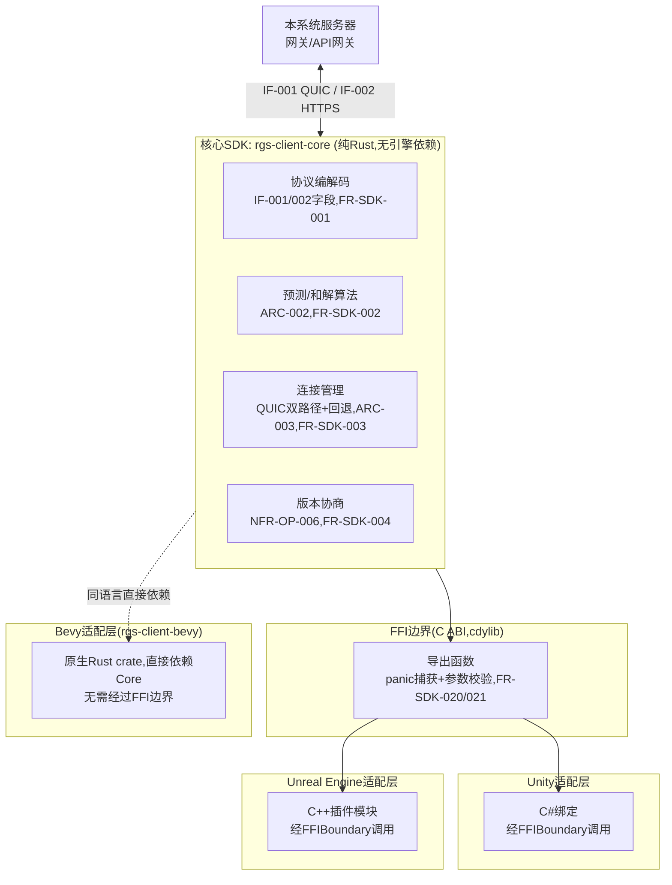
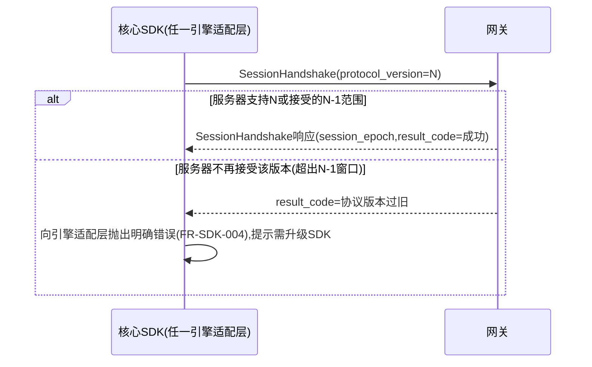

# 基本设计书（基本設計書 / Basic Design Document）

**客户端引擎适配层与SDK Client Engine Adapter & SDK**

| 项目 | 内容 |
|---|---|
| 文档编号 | RGS-BAS-008 |
| 版本 | 0.3 |
| 父文档 | RGS-REQ-012 需求定义书 第7章（ARC-024） |
| 依据标准 | IPA『共通フレーム 2013（SLCP-JCF2013）』基本设计工程 |
| 制定日 | 2026-08-16 |
| 制定者 | 架构师 |
| 保密级别 | 内部限定（Internal Use Only） |

## 修订历史（改訂履歴 / Revision History）

| 版本 | 修订日 | 修订者 | 修订内容 | 影响章节 |
|---|---|---|---|---|
| 0.1 | 2026-08-16 | 架构师 | 初版制定。将RGS-REQ-012 ARC-024展开为核心SDK模块结构、FFI边界设计、Bevy/Unity/UE三引擎适配层接口设计、协议版本协商时序、回归测试基础设施 | 全部 |
| 0.2 | 2026-08-16 | 架构师 | 追溯性表补齐AC-SDK-001〜004验收标准与设计章节的映射（此前追溯性表仅覆盖ARC/FR/NFR，遗漏AC条目） | §11 |
| 0.3 | 2026-08-17 | 架构师 | 补齐NFR-SDK-002（编解码性能<0.05ms p99）的设计缺口：此前追溯性表声明其由§9/§4/§8覆盖，但三处均未实际给出性能相关设计，新增§3.1编解码性能设计（零拷贝/预分配缓冲/基准测试与CI性能门禁），并更新追溯性表 | §3.1、§11 |

## 审批栏（承認欄 / Approval）

| 角色 | 姓名 | 审批日 | 备注 |
|---|---|---|---|
| 制定（起草） | 架构师 | 2026-08-16 | — |
| 评审（技术） | | | 与RGS-BAS-001§6.2既有QUIC消息字段设计的一致性 |
| 评审（客户端团队代表） | | | 三引擎适配层API是否符合各引擎习惯用法 |
| 审批（负责人） | | | 本文档的基准化 |

---

## 目录

1. [前言](#1-前言)
2. [整体架构](#2-整体架构)
3. [核心SDK模块结构](#3-核心sdk模块结构)
4. [FFI边界设计](#4-ffi边界设计)
5. [Bevy适配层设计](#5-bevy适配层设计)
6. [Unity适配层设计](#6-unity适配层设计)
7. [Unreal Engine适配层设计](#7-unreal-engine适配层设计)
8. [协议版本协商时序](#8-协议版本协商时序)
9. [回归测试基础设施](#9-回归测试基础设施)
10. [标准化检查清单](#10-标准化检查清单)
11. [追溯性（ARC-024 → 本设计书章节）](#11-追溯性arc-024-本设计书章节)

---

# 1. 前言

本文档是RGS-REQ-012第7章ARC-024（核心逻辑单一实现，多引擎薄适配层）的系统级展开。本文档遵循RGS-BAS-001既有记述规则，且**不**重新定义IF-001/IF-002的字段本身（见RGS-BAS-001§6.2），仅定义SDK如何实现/暴露这些字段。

---

# 2. 整体架构



**设计要点**：Bevy因与核心SDK同为Rust，**不经过**FFI边界，直接以crate依赖形式集成，是最高保真度、最低开销的适配方式；Unity/UE因语言不同，必须经FFI边界，是ARC-024"信任边界需要额外防护"重点关注的路径（§4）。

---

# 3. 核心SDK模块结构

```
rgs-client-core/
  src/
    codec/            # IF-001/002字段编解码,依据RGS-BAS-001§6.2 + RGS-IFS-001字节格式
      datagram.rs      # PlayerInputMessage/StateDeltaSnapshot/InputAck
      stream.rs         # SessionHandshake/ItemGrantNotice/SceneTransitionCommand/ChatMessage
    prediction/        # ARC-002算法
      input_buffer.rs   # 输入序号管理与本地立即应用
      reconciliation.rs # 基于InputAck的差异检测与重新应用
    transport/          # ARC-003连接管理
      quic.rs            # Datagram/Stream双路径
      fallback.rs         # TCP/WebTransport回退(FR-GW-008)
    version/             # 协议版本协商(FR-SDK-004)
    ffi/                  # C ABI导出层,仅此模块允许unsafe跨边界代码(FR-SDK-020/021)
```

**设计原则**：仅`ffi/`模块允许出现跨语言边界相关的`unsafe`代码，其余模块保持纯安全Rust——这是FR-SDK-020"panic不得穿透边界"要求在代码结构上的落地：`ffi/`模块职责就是把`codec/`/`prediction/`/`transport/`模块可能产生的panic在边界处捕获并转换为错误码。

## 3.1 编解码性能设计（落实NFR-SDK-002）

`codec/`模块的实现**必须**遵循以下约束，以满足单条消息编解码开销<0.05ms（p99）的目标：

| 设计点 | 内容 |
|---|---|
| 零拷贝优先 | `Datagram`（`PlayerInputMessage`/`StateDeltaSnapshot`/`InputAck`）路径**必须**采用零拷贝或最小拷贝的编解码方式（借用`&[u8]`视图而非逐字段分配新`String`/`Vec`），避免高频路径（每tick发送）产生不必要的堆分配 |
| 预分配缓冲 | 连接建立后**应当**为发送/接收路径预分配固定容量的缓冲区并复用，**不得**在每次编解码时重新分配 |
| 与RGS-IFS-001的关系 | 具体的字节打包/量化精度（位打包顺序、定点数精度）由RGS-IFS-001（PH-1制定）给出，本设计仅约束"实现该格式时不得引入的性能反模式"，不重复定义字节格式本身 |
| 基准测试 | 核心SDK仓库**必须**维护编解码基准测试（`cargo bench`或等价工具），覆盖全部IF-001消息类型，纳入CI定期跑分并与NFR-SDK-002阈值比对，回归超阈值时CI**必须**标红（复用RGS-BAS-002§4.2既有CI骨架的"性能门禁"同类思路） |

---

# 4. FFI边界设计

对应FR-SDK-020/021。

## 4.1 导出函数约定

| 约定 | 内容 |
|---|---|
| panic捕获 | 全部导出函数体内部使用`catch_unwind`包裹核心逻辑调用，捕获到panic时返回明确的错误码（如`RGS_ERR_INTERNAL_PANIC`），**不得**让panic跨越FFI边界（Rust panic跨越FFI边界是未定义行为） |
| 参数校验 | 全部指针参数在解引用前校验非空；全部长度/索引参数校验范围，越界返回错误码而非直接触发越界访问 |
| 内存归属 | 明确文档化每个返回指针的归属：由核心SDK分配的内存**必须**通过对应的`rgs_free_*`函数释放，**不得**由调用方（C#/C++侧）直接`free`；调用方传入的内存核心SDK**不得**持有超出调用期的引用 |
| 错误传播 | 统一错误码枚举（非异常/非`panic`），C#/C++侧适配层将错误码转换为各自语言习惯的异常/返回值类型 |

## 4.2 生成方式（待详细设计，TBD-SDK-001）

C头文件与C#/C++绑定代码**倾向于**通过工具（如`cbindgen`生成C头文件，配合额外脚本生成C#/C++侧绑定）自动生成而非手写，减少人工同步核心SDK API变更时的遗漏风险，具体工具链留待详细设计阶段确定。

---

# 5. Bevy适配层设计

对应FR-SDK-010。

| 项目 | 内容 |
|---|---|
| 集成方式 | `rgs-client-bevy`实现Bevy的`Plugin` trait，通过`App::add_plugins(RgsClientPlugin)`一行代码集成 |
| 暴露接口 | `Resource`（如`RgsConnection`持有连接状态）、`Event`（如`SnapshotReceived`/`SessionEstablished`）、内置`System`（如`sync_predicted_transform_system`，将预测结果写入Bevy ECS的`Transform`组件） |
| ECS对齐 | 核心SDK的预测/和解结果以只读数据形式提供，Bevy侧System负责将其映射到具体的ECS组件——保持"核心SDK不感知具体渲染/ECS细节"的边界（FR-SDK-005） |

---

# 6. Unity适配层设计

对应FR-SDK-011。

| 项目 | 内容 |
|---|---|
| 分发形式 | C#包，内含预编译的核心SDK动态库（按平台分发：Windows/macOS/Linux/移动平台）+ C#绑定代码 + 高层封装API |
| API风格 | 异步方法返回`Task`/`UniTask`（依Unity项目常见异步库习惯，详细设计确定），如`await connection.ConnectAsync(address)` |
| 生命周期集成 | 提供`MonoBehaviour`基类或组件（如`RgsClientBehaviour`），封装`Update`循环中轮询核心SDK事件队列并转换为C#事件（`UnityEvent`/`Action`回调） |
| 线程模型 | 核心SDK内部网络I/O运行于独立线程，C#侧回调**必须**被封送（marshal）回Unity主线程再触发，避免跨线程访问Unity API（Unity API非线程安全的既有限制） |

---

# 7. Unreal Engine适配层设计

对应FR-SDK-012。

| 项目 | 内容 |
|---|---|
| 分发形式 | UE插件模块（`.uplugin`），内含预编译核心SDK静态/动态库 + C++绑定代码 |
| API风格 | `UActorComponent`（如`URgsClientComponent`），暴露`UFUNCTION`供Blueprint调用（连接、发送输入）与`UPROPERTY`/委托（`DECLARE_DYNAMIC_MULTICAST_DELEGATE`）供快照更新事件订阅 |
| 生命周期集成 | 组件`TickComponent`中轮询核心SDK事件队列，转换为UE委托广播；`BeginPlay`/`EndPlay`对应连接建立/断开 |
| 线程模型 | 同Unity，核心SDK网络线程与UE游戏线程隔离，回调须经`AsyncTask(ENamedThreads::GameThread, ...)`封送回游戏线程 |

---

# 8. 协议版本协商时序

对应FR-SDK-004，落地NFR-OP-006既有"N-1版本接受"策略在客户端SDK侧的行为。



---

# 9. 回归测试基础设施

对应NFR-SDK-001（三引擎一致性）、AC-SDK-001。

| 项目 | 内容 |
|---|---|
| 网络轨迹录制 | 维护一组标准化的网络条件轨迹文件（延迟分布、丢包序列、乱序模式），存放于核心SDK仓库 |
| 一致性回归测试 | 核心SDK本身（Bevy可直接复用）与Unity/UE适配层各自的CI流水线中，均以同一组轨迹文件驱动测试用例，比对预测/和解的输出结果（位置、序号确认状态等）逐字段一致，纳入RGS-BAS-002§4.2既有CI/CD骨架的"契约测试"同类阶段 |
| 崩溃回归 | 针对FR-SDK-020的边界安全，维护一组"畸形输入"测试集（越界长度、空指针等），验证FFI边界均返回错误码而非崩溃 |

---

# 10. 标准化检查清单

## 10.1 SDK发布检查清单

- [ ] 核心SDK变更（协议字段/算法）已同步反映在三引擎适配层，无任何引擎侧存在独立重复实现（对应ARC-024核心验证项）
- [ ] FFI导出函数的panic捕获与参数校验已通过畸形输入测试集验证（§9）
- [ ] 三引擎一致性回归测试（同网络轨迹）通过，逐字段结果一致
- [ ] 协议版本协商在N-1窗口边界内外均有对应测试用例覆盖
- [ ] 内存归属文档（谁分配谁释放）已随SDK发行说明更新

---

# 11. 追溯性（ARC-024 → 本设计书章节）

| ARC/FR编号 | 决定摘要 | 本文档展开章节 |
|---|---|---|
| ARC-024 | 核心逻辑单一实现，多引擎薄适配层 | §2、§3 |
| FR-SDK-001〜004 | 核心SDK协议/算法/连接/版本协商 | §3、§8 |
| FR-SDK-005 | 核心SDK不依赖引擎API | §3、§5〜§7 |
| FR-SDK-010〜013 | 三引擎适配层 | §5、§6、§7 |
| FR-SDK-020〜021 | FFI边界安全 | §4 |
| NFR-SDK-001〜005 | 一致性/性能/稳定性/版本兼容/接入成本 | §9、§3.1、§4、§8 |
| AC-SDK-001（三引擎同轨迹重放逐字段一致） | §9回归测试基础设施（网络轨迹录制+一致性回归测试） | §9 |
| AC-SDK-002（Unity/UE故障注入,宿主进程不崩溃） | §4.1导出函数约定（panic捕获/参数校验）＋§9崩溃回归测试集 | §4.1、§9 |
| AC-SDK-003（协议版本协商演练,N-1窗口内成功且降级符合预期） | §8协议版本协商时序 | §8 |
| AC-SDK-004（接入成本验证,≤2工作日完成集成） | §5〜§7三引擎适配层API设计（一行代码集成/示例工程/生命周期集成），接入成本目标依赖三者共同达成 | §5、§6、§7 |

---

> 本文档所定义的规范为详细设计与实现阶段的输入基准。FFI绑定生成工具链（TBD-SDK-001）、SDK分发渠道（TBD-SDK-002）的具体方案，留待详细设计阶段确定。
