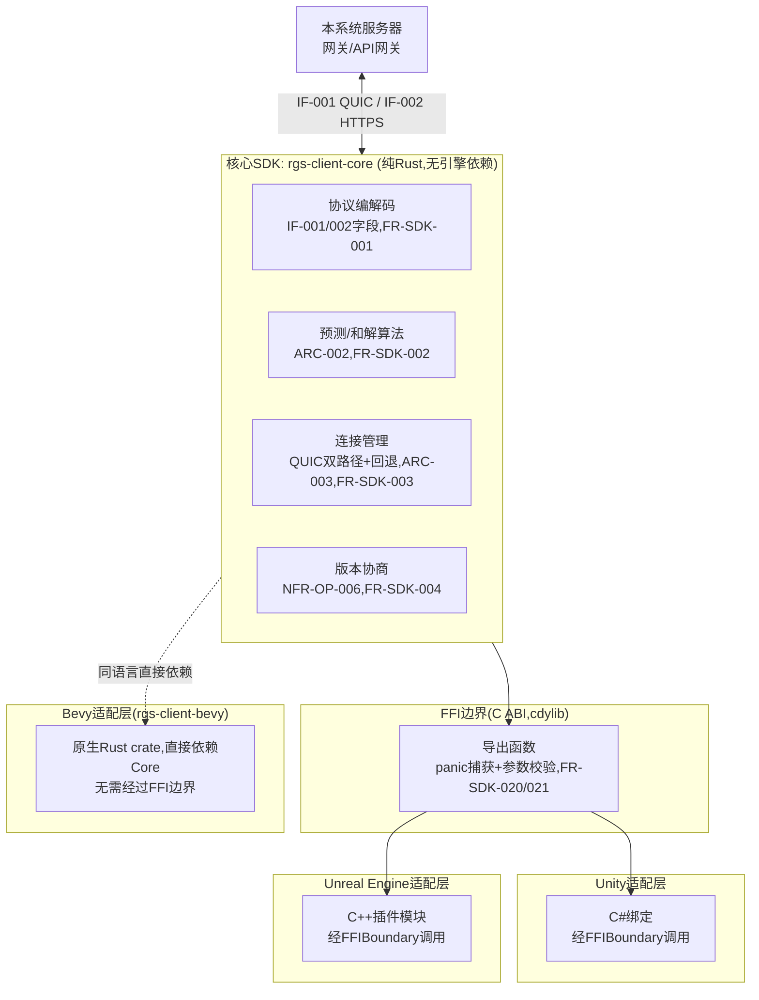
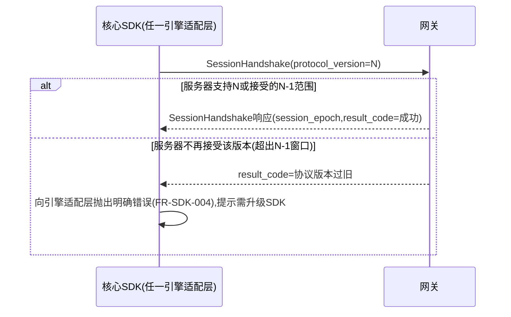

# 基本设计书（基本設計書 / Basic Design Document）

**客户端引擎适配层与SDK Client Engine Adapter & SDK**

| 项目 | 内容 |
|---|---|
| 文档编号 | RGS-BAS-008 |
| 版本 | 0.4 |
| 父文档 | RGS-REQ-012 需求定义书 第7章（ARC-024） |
| 依据标准 | IPA『共通フレーム 2013（SLCP-JCF2013）』基本设计工程 |
| 制定日 | 2026-08-16 |
| 制定者 | 架构师 |
| 保密级别 | 内部限定（Internal Use Only） |

## 修订历史（改訂履歴 / Revision History）

| 版本 | 修订日 | 修订者 | 修订内容 | 影响章节 |
|---|---|---|---|---|
| 0.1 | 2026-08-16 | 架构师 | 初版制定。将RGS-REQ-012 ARC-024展开为核心SDK模块结构、FFI边界设计、Bevy/Unity/UE三引擎适配层接口设计、协议版本协商时序、回归测试基础设施 | 全部 |
| 0.2 | 2026-08-16 | 架构师 | 追溯性表补齐AC-SDK-001〜004验收标准与设计章节的映射（此前追溯性表仅覆盖ARC/FR/NFR，遗漏AC条目） | §11 |
| 0.3 | 2026-08-17 | 架构师 | 补齐NFR-SDK-002（编解码性能<0.05ms p99）的设计缺口：此前追溯性表声明其由§9/§4/§8覆盖，但三处均未实际给出性能相关设计，新增§3.1编解码性能设计（零拷贝/预分配缓冲/基准测试与CI性能门禁），并更新追溯性表 | §3.1、§11 |
| 0.4 | 2026-09-01 | 架构师 (Mavis 接手 agent per DEC-008) | 落实"各BAS文档功能章节加log设计且区分debug/release级"总要求（per Ulysses 2026-09-01 15:52 JST 决策，4 拍板选项：全部 36 个BAS / 详尽版5列表 / 派worker并行 / BAS-004同步升级）：§2.1/§3.1.1/§4.1.1/§4.2.1/§5.1/§6.1/§7.1/§8.1/§9.1/§10.1.1 共 10 个功能段加"本功能日志设计" 5 列详尽版（字段名/触发条件/频率估算/采样策略/脱敏与成本），引用 BAS-001 v1.5 §4.8.3 模板（commit 32d9eb6）+ BAS-003 v0.3 样板（commit 75a001c）+ BAS-004 v0.3 §4.2 二维矩阵 + §4.3 字段 + §5.1 脱敏 + §6.2 强制全采样（commit 47e26b0/0ee6262）；覆盖 ARC-024 客户端SDK适配层"核心SDK模块结构 / 编解码性能 / FFI边界安全 / cbindgen生成 / Bevy适配 / Unity适配 / UE适配 / 协议版本协商 / 三引擎一致性回归测试 / SDK发布检查清单"全链路；显式区分 `info!`/`warn!`/`error!`（release 必出，编译期常驻，§6.2 强制全采样）与 `trace!`/`debug!`（`#[cfg(debug_assertions)]` 守护，debug-only，release build 完全剔除零运行时开销）两类事件；客户端SDK特殊考虑：SDK 初始化/版本/平台/协议升级/崩溃 → release 必出 + 强制全采样（排查客户端问题用），SDK 高频 API 调用/回调封送/System tick → debug-only（避免客户端性能损耗）；§10.1 检查清单新增 6 项 log 章节上线检查项；§11 追溯性新增 AC-SDK-006（debug-only 宏 release 完全剔除）与 AC-SDK-007（每功能BAS文档须含本功能log设计章节），与 BAS-001 v1.5 §4.8.3.4 / BAS-002 v0.4 §13 / BAS-003 v0.3 §13 / BAS-004 v0.3 §12 形成统一规范 | §2.1/§3.1.1/§4.1.1/§4.2.1/§5.1/§6.1/§7.1/§8.1/§9.1/§10.1.1/§11 |

## 审批栏（承認欄 / Approval）

| 角色 | 姓名 | 审批日 | 备注 |
|---|---|---|---|
| 制定（起草） | 架构师 | 2026-08-16 | — |
| 评审（技术） | | | 与RGS-BAS-001§6.2既有QUIC消息字段设计的一致性 |
| 评审（客户端团队代表） | | | 三引擎适配层API是否符合各引擎习惯用法 |
| 审批（负责人） | | | 本文档的基准化 |

---

## 目录

1. [前言](#1-前言)
2. [整体架构](#2-整体架构)
3. [核心SDK模块结构](#3-核心sdk模块结构)
4. [FFI边界设计](#4-ffi边界设计)
5. [Bevy适配层设计](#5-bevy适配层设计)
6. [Unity适配层设计](#6-unity适配层设计)
7. [Unreal Engine适配层设计](#7-unreal-engine适配层设计)
8. [协议版本协商时序](#8-协议版本协商时序)
9. [回归测试基础设施](#9-回归测试基础设施)
10. [标准化检查清单](#10-标准化检查清单)
11. [追溯性（ARC-024 → 本设计书章节）](#11-追溯性arc-024-本设计书章节)

**本功能日志设计章节分布**：§2.1 / §3.1.1 / §4.1.1 / §4.2.1 / §5.1 / §6.1 / §7.1 / §8.1 / §9.1 / §10.1.1（共 10 节），引用 BAS-001 v1.5 §4.8.3 模板 + BAS-003 v0.3 样板 + BAS-004 v0.3 §4.2 二维矩阵 + §4.4 释放必出宏清单 + §5.1 脱敏规则 + §6.2 强制全采样。

---

# 1. 前言

本文档是RGS-REQ-012第7章ARC-024（核心逻辑单一实现，多引擎薄适配层）的系统级展开。本文档遵循RGS-BAS-001既有记述规则，且**不**重新定义IF-001/IF-002的字段本身（见RGS-BAS-001§6.2），仅定义SDK如何实现/暴露这些字段。

---

# 2. 整体架构



**设计要点**：Bevy因与核心SDK同为Rust，**不经过**FFI边界，直接以crate依赖形式集成，是最高保真度、最低开销的适配方式；Unity/UE因语言不同，必须经FFI边界，是ARC-024"信任边界需要额外防护"重点关注的路径（§4）。

## 2.1 本功能日志设计

本节覆盖**客户端SDK整体架构（核心SDK + FFI边界 + 三引擎适配层）启动/加载/降级**的观察点——SDK 初始化与版本/平台/引擎信息是排查客户端问题（崩溃、协议不兼容、引擎侧API误用）最关键的上下文，因此 `sdk.arch.*` 系列 release 必出 + 强制全采样；`sdk.arch.fallback_activated`（QUIC → TCP/WebTransport 回退触发，反映客户端网络环境劣化）是 release 必出 + §6.2 强制全采样事件。

| 字段名（field） | 触发条件（trigger） | 频率估算（frequency） | 采样策略（sampling） | 脱敏与成本（redact & cost） |
|---|---|---|---|---|
| `sdk.arch.initialized` | 核心SDK `rgs-client-core` 初始化完成（含 `codec`/`prediction`/`transport`/`version`/`ffi` 五大模块） | 每次SDK启动 1 次（典型 <1/会话） | release 必出（100% 强制全采样，per BAS-004 v0.3 §6.2） | 含`client_version`/`platform`（iOS/Android/Windows/macOS/Linux）/`engine_kind`（Bevy/Unity/UE/Godot）/`os_version`；约 350B/条 |
| `sdk.arch.engine_adapter_attached` | 引擎适配层（`rgs-client-bevy` / C# 绑定 / C++ 插件）Attach 到宿主引擎完成 | 每次SDK启动 1 次 | release 必出（100% 强制全采样） | 含`engine_kind`/`engine_version`/`adapter_version`；约 300B/条 |
| `sdk.arch.fallback_activated` | QUIC 不可用，按 FR-GW-008 降级到 TCP / WebTransport | 偶发（按网络环境） | release 必出（100% 强制全采样） | 含`from_transport`/`to_transport`/`reason`/`session_id`；约 280B/条 |
| `sdk.arch.shutting_down` | 核心SDK 优雅关闭（释放预分配缓冲、断开连接、停网络线程） | 每次SDK退出 1 次 | release 必出（100% 强制全采样） | 含`uptime_seconds`/`pending_ops_drained`；约 250B/条 |
| `sdk.arch.debug.module_load_timing` | 五大模块（codec/prediction/transport/version/ffi）逐个加载耗时（微秒级） | 每次SDK启动 1 次 | **debug-only**（`#[cfg(debug_assertions)]` 守护，release build 完全剔除） | 约 200B/条（release 剔除） |
| `sdk.arch.debug.dependency_graph_snapshot` | 客户端SDK `Cargo.lock` 解析后的依赖图快照（含 FFI 生成的 C#/C++ binding 头文件路径） | 每次SDK启动 1 次 | **debug-only**（`#[cfg(debug_assertions)]` 守护） | 约 5-20KB/条（依赖图大小决定，release 剔除） |

**debug-only 守护要点**（落实 BAS-004 v0.3 §4.4）：
- `sdk.arch.debug.dependency_graph_snapshot` 在大型 SDK workspace 下可能 20KB+ —— release build 完全剔除，避免 RUST_LOG=debug 误开时撑爆生产日志通道
- `sdk.arch.fallback_activated` 反映客户端网络环境劣化——release 必出（**不** debug-only），便于 SRE 按 `from_transport` 维度聚合，识别"QUIC 在某区域客户端失效率"
- 客户端SDK涉及跨语言边界（C# / C++ / GDScript），**`device_id`/`ip_address` 等设备标识符字段必须经 BAS-004 v0.3 §5.1 脱敏**（如 `device_id_hash` 为 SHA-256 后 16 字节 hex 截断），本表 `sdk.arch.*` 系列已统一使用 `_hash` 后缀

---

# 3. 核心SDK模块结构

```
rgs-client-core/
  src/
    codec/            # IF-001/002字段编解码,依据RGS-BAS-001§6.2 + RGS-IFS-001字节格式
      datagram.rs      # PlayerInputMessage/StateDeltaSnapshot/InputAck
      stream.rs         # SessionHandshake/ItemGrantNotice/SceneTransitionCommand/ChatMessage
    prediction/        # ARC-002算法
      input_buffer.rs   # 输入序号管理与本地立即应用
      reconciliation.rs # 基于InputAck的差异检测与重新应用
    transport/          # ARC-003连接管理
      quic.rs            # Datagram/Stream双路径
      fallback.rs         # TCP/WebTransport回退(FR-GW-008)
    version/             # 协议版本协商(FR-SDK-004)
    ffi/                  # C ABI导出层,仅此模块允许unsafe跨边界代码(FR-SDK-020/021)
```

**设计原则**：仅`ffi/`模块允许出现跨语言边界相关的`unsafe`代码，其余模块保持纯安全Rust——这是FR-SDK-020"panic不得穿透边界"要求在代码结构上的落地：`ffi/`模块职责就是把`codec/`/`prediction/`/`transport/`模块可能产生的panic在边界处捕获并转换为错误码。

## 3.1 编解码性能设计（落实NFR-SDK-002）

`codec/`模块的实现**必须**遵循以下约束，以满足单条消息编解码开销<0.05ms（p99）的目标：

| 设计点 | 内容 |
|---|---|
| 零拷贝优先 | `Datagram`（`PlayerInputMessage`/`StateDeltaSnapshot`/`InputAck`）路径**必须**采用零拷贝或最小拷贝的编解码方式（借用`&[u8]`视图而非逐字段分配新`String`/`Vec`），避免高频路径（每tick发送）产生不必要的堆分配 |
| 预分配缓冲 | 连接建立后**应当**为发送/接收路径预分配固定容量的缓冲区并复用，**不得**在每次编解码时重新分配 |
| 与RGS-IFS-001的关系 | 具体的字节打包/量化精度（位打包顺序、定点数精度）由RGS-IFS-001（PH-1制定）给出，本设计仅约束"实现该格式时不得引入的性能反模式"，不重复定义字节格式本身 |
| 基准测试 | 核心SDK仓库**必须**维护编解码基准测试（`cargo bench`或等价工具），覆盖全部IF-001消息类型，纳入CI定期跑分并与NFR-SDK-002阈值比对，回归超阈值时CI**必须**标红（复用RGS-BAS-002§4.2既有CI骨架的"性能门禁"同类思路） |

### 3.1.1 本功能日志设计

本节覆盖**编解码性能（NFR-SDK-002 < 0.05ms p99）** 的运行时观察点——每条 `PlayerInputMessage` / `StateDeltaSnapshot` / `InputAck` 编解码均需记录延迟以支撑 p99 阈值监控，但**高频路径**（每 tick 一次）必须严格控制开销，故 `sdk.codec.encode_completed`/`decode_completed` 主体走 `debug!`（release 完全剔除），仅"超阈值"路径走 `warn!`（release 必出 + §6.2 强制全采样）——这是**客户端SDK特殊考虑**（高频 API 调用 → debug-only，避免客户端性能损耗）的典型落地。

| 字段名（field） | 触发条件（trigger） | 频率估算（frequency） | 采样策略（sampling） | 脱敏与成本（redact & cost） |
|---|---|---|---|---|
| `sdk.codec.encode_latency_threshold_exceeded` | 单条 `PlayerInputMessage` / `StateDeltaSnapshot` / `InputAck` 编码耗时 ≥ NFR-SDK-002 阈值（0.05ms p99）的告警（CI bench 阶段或线上采样窗口内检测） | 偶发（性能门禁触发） | release 必出（100% 强制全采样，per BAS-004 v0.3 §6.2） | 含`message_kind`/`encode_duration_us`/`threshold_us`/`client_version`/`platform`；约 300B/条 |
| `sdk.codec.decode_latency_threshold_exceeded` | 单条 `StateDeltaSnapshot` / `InputAck` 解码耗时 ≥ NFR-SDK-002 阈值 | 偶发 | release 必出（100% 强制全采样） | 含`message_kind`/`decode_duration_us`/`threshold_us`；约 300B/条 |
| `sdk.codec.zero_copy_violation` | 静态检查（`cargo clippy` 自定义 lint）或运行时检测到非零拷贝模式（堆分配命中） | 极少 | release 必出（100% 强制全采样） | 含`message_kind`/`violating_path`/`alloc_count`；约 350B/条 |
| `sdk.codec.buffer_overflow` | 预分配缓冲区（§3.1 设计点）容量不足，请求扩容（扩容次数应极低，正常情况下永不触发） | 极少（容量错配） | release 必出（100% 强制全采样） | 含`buffer_kind`/`current_capacity`/`requested_size`；约 280B/条 |
| `sdk.codec.bench_regression_exceeded` | `cargo bench` 结果相对基线（如上一 release tag）退化超阈值（如 5%） | 偶发（CI 阶段） | release 必出（100% 强制全采样） | 含`message_kind`/`baseline_us`/`current_us`/`delta_pct`/`git_sha`；约 400B/条 |
| `sdk.codec.bench_baseline_recorded` | 客户端SDK release tag 推送时 `cargo bench` 结果作为新基线落库 | <1/周（release 节奏） | release 必出（100% 强制全采样） | 含`git_sha`/`baseline_json_ref`；约 300B/条 |
| `sdk.codec.debug.encode_payload_dump` | 单条消息编码输入 payload 完整 dump（用于定位编解码 bug） | 高频（每 tick 一次 → debug-only） | **debug-only**（`#[cfg(debug_assertions)]` 守护，release build 完全剔除，零运行时开销） | 约 200B-2KB/条（消息大小决定，release 剔除） |
| `sdk.codec.debug.decode_payload_dump` | 单条消息解码输出 payload 完整 dump | 高频 | **debug-only**（`#[cfg(debug_assertions)]` 守护） | 约 200B-2KB/条（release 剔除） |
| `sdk.codec.debug.bench_full_report` | `cargo bench` 完整结果（含全部 message_kind 的 min/median/p99） | CI 阶段 | **debug-only**（`#[cfg(debug_assertions)]` 守护） | 约 5-30KB/条（release 剔除） |

**debug-only 守护要点**（落实 BAS-004 v0.3 §4.4）：
- `sdk.codec.debug.encode_payload_dump` / `decode_payload_dump` 走**高频路径**（每 tick 一次），release 必须完全剔除（防止 RUST_LOG=debug 误开时撑爆日志通道 + 客户端 CPU/内存被打爆）
- `sdk.codec.*latency_threshold_exceeded` 系列是**生产告警事件**——`warn!` 级别，release 常驻 + §6.2 强制全采样，便于 NFR-SDK-002 性能门禁在 Grafana 上按 `message_kind` + `platform` 维度聚合
- 客户端SDK的 `client_version` / `platform` / `engine_version` / `device_id_hash` 字段是排查客户端问题的必备上下文（**客户端SDK特殊考虑**），所有本节 release 必出事件均携带

---

---

# 4. FFI边界设计

对应FR-SDK-020/021。

## 4.1 导出函数约定

| 约定 | 内容 |
|---|---|
| panic捕获 | 全部导出函数体内部使用`catch_unwind`包裹核心逻辑调用，捕获到panic时返回明确的错误码（如`RGS_ERR_INTERNAL_PANIC`），**不得**让panic跨越FFI边界（Rust panic跨越FFI边界是未定义行为） |
| 参数校验 | 全部指针参数在解引用前校验非空；全部长度/索引参数校验范围，越界返回错误码而非直接触发越界访问 |
| 内存归属 | 明确文档化每个返回指针的归属：由核心SDK分配的内存**必须**通过对应的`rgs_free_*`函数释放，**不得**由调用方（C#/C++侧）直接`free`；调用方传入的内存核心SDK**不得**持有超出调用期的引用 |
| 错误传播 | 统一错误码枚举（非异常/非`panic`），C#/C++侧适配层将错误码转换为各自语言习惯的异常/返回值类型 |

### 4.1.1 本功能日志设计

本节覆盖**FFI 边界安全（FR-SDK-020/021）**的观察点——FFI 边界是 ARC-024"信任边界需要额外防护"的核心路径，任何 panic 跨边界、参数校验失败、内存归属混淆都是**客户端崩溃/宿主进程不稳定**的根因（**客户端SDK特殊考虑**：崩溃/异常 → `error!` 强制全采样，含 `client_version`/`platform`/`os_version`/`device_id_hash` 脱敏后）。`sdk.ffi.panic_caught` 是**生产 P0 事件**——`error!` 级别，release 常驻 + §6.2 强制全采样。

| 字段名（field） | 触发条件（trigger） | 频率估算（frequency） | 采样策略（sampling） | 脱敏与成本（redact & cost） |
|---|---|---|---|---|
| `sdk.ffi.exported_function_registered` | 核心SDK `cdylib` 导出函数表初始化完成（每个 `extern "C"` 导出函数被注册） | 每次SDK加载 1 次（典型 <50 个导出函数） | release 必出（100% 强制全采样，per BAS-004 v0.3 §6.2） | 含`exported_function_count`/`cdylib_version`；约 250B/条 |
| `sdk.ffi.panic_caught` | FFI 边界 `catch_unwind` 捕获到 panic（**P0 事件**，FR-SDK-020 违反） | 极少（**生产事件**） | release 必出（100% 强制全采样） | 含`exported_function_name`/`panic_message_hash`（SHA-256 截断 16 字节，避免泄漏 panic message 明文）/`backtrace_symbol_count`/`client_version`/`platform`/`os_version`/`device_id_hash`；约 500B/条 |
| `sdk.ffi.null_pointer_rejected` | 导出函数入口检测到空指针参数（FR-SDK-021 违反） | 偶发（C#/C++侧 bug） | release 必出（100% 强制全采样） | 含`exported_function_name`/`param_name`/`error_code`；约 280B/条 |
| `sdk.ffi.out_of_bounds_rejected` | 长度/索引参数越界 | 偶发 | release 必出（100% 强制全采样） | 含`exported_function_name`/`param_name`/`param_value`/`param_limit`/`error_code`；约 300B/条 |
| `sdk.ffi.memory_misuse_detected` | 检测到内存归属混淆（调用方尝试 `free` 核心SDK分配内存，或反之） | 极少（**安全事件**） | release 必出（100% 强制全采样） | 含`exported_function_name`/`buffer_address_hash`/`expected_owner`/`actual_attempted_owner`；约 350B/条 |
| `sdk.ffi.error_code_returned` | 导出函数返回非 SUCCESS 错误码（按错误码分级） | 按错误码频率（典型 <1% 调用） | release 必出（100% 强制全采样） | 含`exported_function_name`/`error_code`/`error_category`（panic/validation/memory/business）；约 280B/条 |
| `sdk.ffi.debug.exported_function_table_dump` | 全部导出函数表完整 dump（函数名/签名/参数类型） | 每次SDK加载 1 次 | **debug-only**（`#[cfg(debug_assertions)]` 守护，release build 完全剔除） | 约 1-3KB/条（release 剔除） |
| `sdk.ffi.debug.backtrace_full_dump` | panic 捕获时的完整 backtrace（符号化后） | 极少 | **debug-only**（`#[cfg(debug_assertions)]` 守护） | 约 1-5KB/条（栈深度决定，release 剔除） |
| `sdk.ffi.debug.parameter_validation_details` | 导出函数入口全部参数的详细校验过程（针对复杂指针/切片参数） | 每次调用（高频） | **debug-only**（`#[cfg(debug_assertions)]` 守护，release build 完全剔除） | 约 200B-1KB/条（参数数量决定，release 剔除） |

**debug-only 守护要点**（落实 BAS-004 v0.3 §4.4）：
- `sdk.ffi.debug.parameter_validation_details` 走**高频路径**（每次 FFI 调用一次），release 必须完全剔除，防止客户端性能损耗
- `sdk.ffi.panic_caught` 携带 `panic_message_hash` 而非明文 panic message——避免 panic message 中潜在的密码/token/路径信息泄漏（per BAS-004 v0.3 §5.1 脱敏黑名单 `*token*`/`*password*`/`*secret*`），同时保留可聚合的稳定 hash 用于跨客户端/版本关联
- `sdk.ffi.memory_misuse_detected` 是**安全事件**——release 必出 + §6.2 强制全采样，便于审计追溯（"谁在什么时候尝试 free 错内存"）
- 客户端SDK崩溃类事件（`panic_caught`/`memory_misuse_detected`）必须包含**脱敏后的** `client_version`/`platform`/`os_version`/`device_id_hash`（per BAS-004 v0.3 §5.1）

---

## 4.2 生成方式（待详细设计，TBD-SDK-001）

C头文件与C#/C++绑定代码**倾向于**通过工具（如`cbindgen`生成C头文件，配合额外脚本生成C#/C++侧绑定）自动生成而非手写，减少人工同步核心SDK API变更时的遗漏风险，具体工具链留待详细设计阶段确定。

### 4.2.1 本功能日志设计

本节覆盖**FFI 绑定代码自动生成（cbindgen + C#/C++ binding scripts, TBD-SDK-001）**的观察点——绑定代码与核心SDK API 漂移是 Unity/UE 适配层最常见的"明明 SDK 升了但客户端没拿到新功能"类问题的根因，`sdk.gen.binding_drift_detected` 是 release 必出 + §6.2 强制全采样的**可观测性事件**；`sdk.gen.binding_generated` 是 build 阶段事件（CI/release pipeline 触发），频率低。

| 字段名（field） | 触发条件（trigger） | 频率估算（frequency） | 采样策略（sampling） | 脱敏与成本（redact & cost） |
|---|---|---|---|---|
| `sdk.gen.cbindgen_invoked` | `cbindgen` 工具被 CI/release pipeline 调用，生成 C 头文件 | 每次构建 1 次 | release 必出（100% 强制全采样，per BAS-004 v0.3 §6.2） | 含`cbindgen_version`/`core_sdk_git_sha`/`output_header_path`；约 300B/条 |
| `sdk.gen.c_header_generated` | C 头文件生成完成（含 `extern "C"` 导出函数声明、struct 定义、enum） | 每次构建 1 次 | release 必出（100% 强制全采样） | 含`header_path`/`exported_function_count`/`struct_count`；约 280B/条 |
| `sdk.gen.csharp_binding_generated` | C# 绑定代码生成完成（Unity 适配层） | 每次构建 1 次 | release 必出（100% 强制全采样） | 含`binding_path`/`generated_class_count`；约 280B/条 |
| `sdk.gen.cpp_binding_generated` | C++ 绑定代码生成完成（UE 适配层） | 每次构建 1 次 | release 必出（100% 强制全采样） | 含`binding_path`/`generated_class_count`/`uplugin_module_name`；约 300B/条 |
| `sdk.gen.binding_drift_detected` | 生成产物与既有手写包装代码不一致（如手写 wrapper 引用了已删除的导出函数） | 偶发 | release 必出（100% 强制全采样） | 含`drift_kind`（added_signature/removed_signature/changed_signature）/`drifted_function_name`；约 350B/条 |
| `sdk.gen.toolchain_unavailable` | `cbindgen` 或 binding 脚本工具链不可用（PATH 中找不到 / 版本不匹配） | 极少（环境问题） | release 必出（100% 强制全采样） | 含`tool_name`/`expected_version`/`actual_version_or_error`；约 300B/条 |
| `sdk.gen.platform_distribution_built` | 客户端SDK分发包按平台矩阵（Windows/macOS/Linux/iOS/Android）构建完成 | 每次 release 1 次 | release 必出（100% 强制全采样） | 含`platforms`（列表）/`artifact_size_bytes_per_platform`；约 400B/条 |
| `sdk.gen.debug.full_generated_files_dump` | 全部生成文件（`.h`/`.cs`/`.hpp`/`.cpp`）完整内容 dump | 每次构建 1 次 | **debug-only**（`#[cfg(debug_assertions)]` 守护，release build 完全剔除） | 约 10-100KB/条（生成文件数量决定，release 剔除） |
| `sdk.gen.debug.cbindgen_config_dump` | cbindgen 配置文件 `cbindgen.toml` 完整内容 | 每次构建 1 次 | **debug-only**（`#[cfg(debug_assertions)]` 守护） | 约 1-2KB/条（release 剔除） |

**debug-only 守护要点**（落实 BAS-004 v0.3 §4.4）：
- `sdk.gen.debug.full_generated_files_dump` 可能 100KB+（多平台 × 多 binding）——release build 完全剔除，避免 RUST_LOG=debug 误开时撑爆生产日志通道
- `sdk.gen.binding_drift_detected` 反映"手写 wrapper 与生成产物不一致"——`warn!` 级别，release 常驻 + §6.2 强制全采样，便于在 PR 评审时拦截（防止"偷偷改 SDK API 但忘改 wrapper"类问题）
- `sdk.gen.toolchain_unavailable` 是**构建阻塞事件**——`error!` 级别，release 常驻 + §6.2 强制全采样，触发 P1 告警

---

# 5. Bevy适配层设计

对应FR-SDK-010。

| 项目 | 内容 |
|---|---|
| 集成方式 | `rgs-client-bevy`实现Bevy的`Plugin` trait，通过`App::add_plugins(RgsClientPlugin)`一行代码集成 |
| 暴露接口 | `Resource`（如`RgsConnection`持有连接状态）、`Event`（如`SnapshotReceived`/`SessionEstablished`）、内置`System`（如`sync_predicted_transform_system`，将预测结果写入Bevy ECS的`Transform`组件） |
| ECS对齐 | 核心SDK的预测/和解结果以只读数据形式提供，Bevy侧System负责将其映射到具体的ECS组件——保持"核心SDK不感知具体渲染/ECS细节"的边界（FR-SDK-005） |

## 5.1 本功能日志设计

本节覆盖**Bevy 适配层（FR-SDK-010, 同语言直接 crate 依赖, 无 FFI 边界）**的观察点——Bevy 因与核心SDK同为 Rust，**不经过 FFI**，是最高保真度路径；但 ECS System 在每个 tick 都跑（高频路径），故 `sdk.bevy.system_invoked` 走 `debug!`（release 完全剔除，**避免客户端性能损耗**），仅"事件触发"（低频）走 release 必出。Bevy适配层是**唯一不需要 FFI panic 捕获**的适配层（**客户端SDK特殊考虑**：FFI 边界相关事件仅在 §4.1 出现）。

| 字段名（field） | 触发条件（trigger） | 频率估算（frequency） | 采样策略（sampling） | 脱敏与成本（redact & cost） |
|---|---|---|---|---|
| `sdk.bevy.plugin_registered` | `RgsClientPlugin` 通过 `App::add_plugins` 注册到 Bevy App | 每次 Bevy App 启动 1 次 | release 必出（100% 强制全采样，per BAS-004 v0.3 §6.2） | 含`plugin_version`/`bevy_version`/`core_sdk_version`；约 300B/条 |
| `sdk.bevy.connection_established` | `RgsConnection` Resource 创建并与服务器建立连接（QUIC 握手完成） | 每次会话 1 次 | release 必出（100% 强制全采样） | 含`session_id`/`server_endpoint_hash`/`quic_version`；约 280B/条 |
| `sdk.bevy.snapshot_received` | `SnapshotReceived` 事件被 `EventWriter` 写入（与服务器状态同步） | 典型 20-60 Hz（高频但非每 tick） | release 必出（100% 强制全采样） | 含`session_id`/`snapshot_sequence`/`entity_count`；约 250B/条 |
| `sdk.bevy.session_established` | `SessionEstablished` 事件（首次登录/重连完成） | 每次会话 1 次 | release 必出（100% 强制全采样） | 含`session_id`/`character_id`；约 250B/条 |
| `sdk.bevy.predicted_transform_synced` | `sync_predicted_transform_system` 写入 ECS `Transform` 组件（**最高频路径**） | 每 tick 一次（60-120 Hz） | **debug-only**（`#[cfg(debug_assertions)]` 守护，release build 完全剔除，零运行时开销，**避免客户端性能损耗**） | 约 100-300B/条（entity 数量决定，release 剔除） |
| `sdk.bevy.input_buffer_applied` | 输入本地立即应用（ARC-002 prediction） | 每 tick 一次 | **debug-only**（`#[cfg(debug_assertions)]` 守护） | 约 150B/条（release 剔除） |
| `sdk.bevy.input_ack_processed` | `InputAck` 触发对账/和解 | 按服务器 ack 频率 | **debug-only**（`#[cfg(debug_assertions)]` 守护） | 约 200B/条（release 剔除） |
| `sdk.bevy.cross_thread_violation` | 检测到 ECS System 跨线程访问核心SDK 内部状态（FR-SDK-005 违反） | 极少（**架构错误**） | release 必出（100% 强制全采样） | 含`system_name`/`offending_thread_id`；约 300B/条 |
| `sdk.bevy.resource_state_corrupted` | `RgsConnection` Resource 状态机进入非法态（schema/version 不匹配） | 极少（**生产事件**） | release 必出（100% 强制全采样） | 含`resource_name`/`current_state`/`expected_state`；约 350B/条 |
| `sdk.bevy.debug.ecs_world_snapshot` | 完整 ECS World dump（含全部 Resource/Component 状态） | 偶发（debug 阶段） | **debug-only**（`#[cfg(debug_assertions)]` 守护） | 约 5-50KB/条（World 大小决定，release 剔除） |
| `sdk.bevy.debug.system_timing_per_tick` | 每个 tick 各 system 耗时（微秒级） | 每 tick 一次 | **debug-only**（`#[cfg(debug_assertions)]` 守护） | 约 1-2KB/条（system 数量决定，release 剔除） |

**debug-only 守护要点**（落实 BAS-004 v0.3 §4.4）：
- `sdk.bevy.predicted_transform_synced` 走**最高频路径**（每 tick 一次，60-120 Hz）——release 必须完全剔除，否则在生产环境 RUST_LOG=debug 误开时客户端 CPU 会被打爆（**客户端SDK特殊考虑**：高频 API 调用 → debug-only）
- `sdk.bevy.snapshot_received` 频率次高（20-60 Hz）但**业务关键**（客户端表现直接依赖快照频率）——release 必出 + §6.2 强制全采样（不同于 §3.1 编解码的"超阈值告警"，这里是"全部快照都计"）
- `sdk.bevy.cross_thread_violation` 是**架构错误**——`error!` 级别，release 常驻 + §6.2 强制全采样，触发 P1 告警
- Bevy适配层**不**经过 FFI，故**无** `sdk.ffi.*` 类事件（已在 §4.1 覆盖）

---

---

# 6. Unity适配层设计

对应FR-SDK-011。

| 项目 | 内容 |
|---|---|
| 分发形式 | C#包，内含预编译的核心SDK动态库（按平台分发：Windows/macOS/Linux/移动平台）+ C#绑定代码 + 高层封装API |
| API风格 | 异步方法返回`Task`/`UniTask`（依Unity项目常见异步库习惯，详细设计确定），如`await connection.ConnectAsync(address)` |
| 生命周期集成 | 提供`MonoBehaviour`基类或组件（如`RgsClientBehaviour`），封装`Update`循环中轮询核心SDK事件队列并转换为C#事件（`UnityEvent`/`Action`回调） |
| 线程模型 | 核心SDK内部网络I/O运行于独立线程，C#侧回调**必须**被封送（marshal）回Unity主线程再触发，避免跨线程访问Unity API（Unity API非线程安全的既有限制） |

## 6.1 本功能日志设计

本节覆盖**Unity 适配层（FR-SDK-011, 经 FFI 边界调用）**的观察点——`Marshal To Main Thread` 每次回调一次（高频），故 `sdk.unity.marshalled_to_main_thread` 走 `debug!`（release 完全剔除，**避免客户端性能损耗**）；而"跨线程违规" `sdk.unity.cross_thread_violation` 是 release 必出（**生产 P0 事件**，可能导致 Unity 主线程崩溃）；Unity 平台/版本信息是排查客户端问题的关键上下文（**客户端SDK特殊考虑**）。

| 字段名（field） | 触发条件（trigger） | 频率估算（frequency） | 采样策略（sampling） | 脱敏与成本（redact & cost） |
|---|---|---|---|---|
| `sdk.unity.package_loaded` | Unity 包（含预编译核心SDK动态库 + C# 绑定）加载完成 | 每次 Unity 场景启动 1 次 | release 必出（100% 强制全采样，per BAS-004 v0.3 §6.2） | 含`unity_version`/`package_version`/`native_lib_path_hash`/`platform`；约 350B/条 |
| `sdk.unity.native_library_load_failed` | 原生库（Windows/macOS/Linux/iOS/Android 各平台 `.dll`/`.dylib`/`.so`）加载失败 | 极少（**部署问题**） | release 必出（100% 强制全采样） | 含`platform`/`expected_lib_name`/`dlopen_error`/`client_version`；约 400B/条 |
| `sdk.unity.behaviour_attached` | `RgsClientBehaviour` MonoBehaviour 挂载到 GameObject 完成 | 每次场景加载 | release 必出（100% 强制全采样） | 含`gameobject_name_hash`/`scene_name_hash`；约 280B/条 |
| `sdk.unity.connection_established` | `await connection.ConnectAsync(address)` 完成 | 每次会话 1 次 | release 必出（100% 强制全采样） | 含`session_id`/`server_endpoint_hash`/`unity_version`；约 300B/条 |
| `sdk.unity.marshalled_to_main_thread` | 核心SDK 回调经 `SynchronizationContext` 封送回 Unity 主线程 | 高频（每次 SDK 回调一次） | **debug-only**（`#[cfg(debug_assertions)]` 守护，release build 完全剔除，零运行时开销，**避免客户端性能损耗**） | 约 150-250B/条（回调参数大小决定，release 剔除） |
| `sdk.unity.unmarshal_failure` | 封送回主线程失败（线程同步原语异常） | 极少（**生产事件**） | release 必出（100% 强制全采样） | 含`callback_kind`/`sync_context_state`/`error`；约 350B/条 |
| `sdk.unity.cross_thread_violation` | 检测到 C# 侧回调未封送（在核心SDK 线程直接访问 Unity API，违反 Unity API 非线程安全约束） | 极少（**P0 事件**） | release 必出（100% 强制全采样） | 含`callback_kind`/`thread_id`/`expected_thread`/`unity_version`/`client_version`/`platform`/`device_id_hash`；约 500B/条 |
| `sdk.unity.unmarshal_race_detected` | 同一回调被多次入队（封送过程中发生竞争） | 极少 | release 必出（100% 强制全采样） | 含`callback_kind`/`enqueue_count`；约 280B/条 |
| `sdk.unity.debug.callback_queue_dump` | 回调队列完整 dump（待封送/已封送/丢弃分类） | 偶发（debug 阶段） | **debug-only**（`#[cfg(debug_assertions)]` 守护） | 约 1-5KB/条（队列大小决定，release 剔除） |
| `sdk.unity.debug.marshalling_timing_per_callback` | 每次回调封送的微秒级耗时 | 高频 | **debug-only**（`#[cfg(debug_assertions)]` 守护） | 约 200B/条（release 剔除） |

**debug-only 守护要点**（落实 BAS-004 v0.3 §4.4）：
- `sdk.unity.marshalled_to_main_thread` 走**高频路径**（每次 SDK 回调一次，可能 60-120 Hz）——release 必须完全剔除（**客户端SDK特殊考虑**：高频 API 调用 → debug-only）
- `sdk.unity.cross_thread_violation` 是**P0 事件**（可能直接导致 Unity 主线程崩溃 / 进程挂掉）——`error!` 级别，release 常驻 + §6.2 强制全采样
- `sdk.unity.native_library_load_failed` 是**部署阻塞事件**——`error!` 级别，release 常驻 + §6.2 强制全采样，便于 SRE 按 `platform` 维度聚合（"iOS 包缺 dylib"类问题）
- 客户端崩溃类事件（`cross_thread_violation`/`unmarshal_failure`）必须包含**脱敏后的** `client_version`/`unity_version`/`platform`/`device_id_hash`（per BAS-004 v0.3 §5.1）

---

---

# 7. Unreal Engine适配层设计

对应FR-SDK-012。

| 项目 | 内容 |
|---|---|
| 分发形式 | UE插件模块（`.uplugin`），内含预编译核心SDK静态/动态库 + C++绑定代码 |
| API风格 | `UActorComponent`（如`URgsClientComponent`），暴露`UFUNCTION`供Blueprint调用（连接、发送输入）与`UPROPERTY`/委托（`DECLARE_DYNAMIC_MULTICAST_DELEGATE`）供快照更新事件订阅 |
| 生命周期集成 | 组件`TickComponent`中轮询核心SDK事件队列，转换为UE委托广播；`BeginPlay`/`EndPlay`对应连接建立/断开 |
| 线程模型 | 同Unity，核心SDK网络线程与UE游戏线程隔离，回调须经`AsyncTask(ENamedThreads::GameThread, ...)`封送回游戏线程 |

## 7.1 本功能日志设计

本节覆盖**Unreal Engine 适配层（FR-SDK-012, 经 FFI 边界调用）**的观察点——`AsyncTask(ENamedThreads::GameThread, ...)` 封送每次回调一次（高频），故 `sdk.ue.async_task_dispatched`/`delegate_broadcast` 走 `debug!`（release 完全剔除，**避免客户端性能损耗**）；"GameThread API 跨线程访问" `sdk.ue.game_thread_violation` 是 release 必出（**生产 P0 事件**，可能导致 UE 游戏线程崩溃）；UE 平台/版本信息是排查客户端问题的关键上下文（**客户端SDK特殊考虑**）。

| 字段名（field） | 触发条件（trigger） | 频率估算（frequency） | 采样策略（sampling） | 脱敏与成本（redact & cost） |
|---|---|---|---|---|
| `sdk.ue.plugin_loaded` | UE 插件模块（`.uplugin`）加载完成 | 每次 UE 启动 1 次 | release 必出（100% 强制全采样，per BAS-004 v0.3 §6.2） | 含`uplugin_module_name`/`ue_engine_version`/`package_version`/`platform`；约 350B/条 |
| `sdk.ue.module_load_failed` | UE 模块（`.uplugin` 内含的 C++ 绑定模块）加载失败 | 极少（**部署问题**） | release 必出（100% 强制全采样） | 含`module_name`/`platform`/`load_error`/`client_version`；约 400B/条 |
| `sdk.ue.component_attached` | `URgsClientComponent` 在 Actor 上完成注册（`RegisterComponent`/`BeginPlay`） | 每次 Actor Spawn | release 必出（100% 强制全采样） | 含`actor_class_name_hash`/`component_name_hash`；约 280B/条 |
| `sdk.ue.connection_established` | 客户端连接建立（`Connect` UFUNCTION 执行完成） | 每次会话 1 次 | release 必出（100% 强制全采样） | 含`session_id`/`server_endpoint_hash`/`ue_engine_version`；约 300B/条 |
| `sdk.ue.async_task_dispatched` | 核心SDK 回调经 `AsyncTask(ENamedThreads::GameThread, ...)` 封送回游戏线程 | 高频（每次 SDK 回调一次） | **debug-only**（`#[cfg(debug_assertions)]` 守护，release build 完全剔除，零运行时开销，**避免客户端性能损耗**） | 约 150-250B/条（回调参数大小决定，release 剔除） |
| `sdk.ue.delegate_broadcast` | `DECLARE_DYNAMIC_MULTISKAGUE` 委托广播（`SnapshotReceived` 等） | 高频（每 tick 多次） | **debug-only**（`#[cfg(debug_assertions)]` 守护） | 约 100-200B/条（release 剔除） |
| `sdk.ue.dispatch_failure` | 封送回游戏线程失败（任务系统异常） | 极少（**生产事件**） | release 必出（100% 强制全采样） | 含`callback_kind`/`task_system_state`/`error`；约 350B/条 |
| `sdk.ue.game_thread_violation` | 检测到 C++ 侧回调未封送（在核心SDK 线程直接访问 UE GameThread API） | 极少（**P0 事件**） | release 必出（100% 强制全采样） | 含`callback_kind`/`thread_id`/`expected_thread`（`GameThread`）/`ue_engine_version`/`client_version`/`platform`/`device_id_hash`；约 500B/条 |
| `sdk.ue.blueprint_binding_failure` | Blueprint 侧的 UFUNCTION/UPROPERTY 绑定失败（如命名变更导致蓝图节点失效） | 偶发（升级 SDK 时） | release 必出（100% 强制全采样） | 含`blueprint_class_name_hash`/`binding_kind`/`function_name`；约 300B/条 |
| `sdk.ue.debug.delegate_listener_dump` | 全部委托监听者列表 dump | 偶发 | **debug-only**（`#[cfg(debug_assertions)]` 守护） | 约 1-3KB/条（release 剔除） |
| `sdk.ue.debug.async_task_queue_state` | UE 任务系统队列状态（`ENamedThreads::GameThread` 队列深度） | 偶发 | **debug-only**（`#[cfg(debug_assertions)]` 守护） | 约 500B/条（release 剔除） |

**debug-only 守护要点**（落实 BAS-004 v0.3 §4.4）：
- `sdk.ue.async_task_dispatched` / `delegate_broadcast` 走**高频路径**（每次 SDK 回调一次，可能 60-120 Hz）——release 必须完全剔除（**客户端SDK特殊考虑**：高频 API 调用 → debug-only）
- `sdk.ue.game_thread_violation` 是**P0 事件**（可能直接导致 UE 游戏线程崩溃 / Editor crash）——`error!` 级别，release 常驻 + §6.2 强制全采样
- `sdk.ue.module_load_failed` 是**部署阻塞事件**——`error!` 级别，release 常驻 + §6.2 强制全采样，便于 SRE 按 `platform` 维度聚合
- 客户端崩溃类事件（`game_thread_violation`/`dispatch_failure`）必须包含**脱敏后的** `client_version`/`ue_engine_version`/`platform`/`device_id_hash`（per BAS-004 v0.3 §5.1）
- `sdk.ue.blueprint_binding_failure` 是**UE 适配层特有事件**（无 C#/Bevy 对应）——`warn!` 级别，release 常驻 + §6.2 强制全采样

---

---

# 8. 协议版本协商时序

对应FR-SDK-004，落地NFR-OP-006既有"N-1版本接受"策略在客户端SDK侧的行为。



## 8.1 本功能日志设计

本节覆盖**协议版本协商（FR-SDK-004, NFR-OP-006 "N-1 窗口"策略）**的观察点——协议升级/兼容性问题排查依赖 `sdk.version.*` 系列（**客户端SDK特殊考虑**：协议升级/兼容性问题 → release 必出）；`sdk.version.handshake_rejected_outdated` 是 release 必出 + §6.2 强制全采样的**业务关键事件**（"客户端 SDK 旧了需要升级" 类问题的直接证据）；频率低（每次会话 1 次握手）但**信息密度高**。

| 字段名（field） | 触发条件（trigger） | 频率估算（frequency） | 采样策略（sampling） | 脱敏与成本（redact & cost） |
|---|---|---|---|---|
| `sdk.version.handshake_started` | SessionHandshake 发起（包含客户端 `protocol_version=N`、支持的 feature flag 位图） | 每次会话 1 次 | release 必出（100% 强制全采样，per BAS-004 v0.3 §6.2） | 含`session_id`/`client_protocol_version`/`client_sdk_version`/`platform`；约 300B/条 |
| `sdk.version.handshake_succeeded` | 服务器接受协议版本（在 N-1 窗口内），返回 `session_epoch` 和 `result_code=成功` | 每次会话 1 次 | release 必出（100% 强制全采样） | 含`session_id`/`session_epoch`/`negotiated_protocol_version`/`server_sdk_version_hash`；约 350B/条 |
| `sdk.version.handshake_rejected_outdated` | 服务器返回 `result_code=协议版本过旧`（客户端 SDK 超出 N-1 窗口） | 偶发（**业务关键事件**） | release 必出（100% 强制全采样） | 含`client_protocol_version`/`server_min_accepted_version`/`gap_in_versions`/`client_sdk_version`/`platform`/`device_id_hash`；约 450B/条 |
| `sdk.version.n_minus_one_window_exceeded` | 客户端协议版本号 `N - server_min_accepted_version > 1`（处于降级边缘） | 极少 | release 必出（100% 强制全采样） | 含`client_protocol_version`/`server_min_accepted_version`；约 250B/条 |
| `sdk.version.feature_flag_mismatch` | 客户端 feature flag 位图与服务器要求不一致 | 偶发 | release 必出（100% 强制全采样） | 含`requested_features`/`server_required_features`/`missing_features`；约 350B/条 |
| `sdk.version.upgrade_prompt_emitted` | 引擎适配层向用户发出"需要升级 SDK"提示（FR-SDK-004） | 偶发 | release 必出（100% 强制全采样） | 含`client_sdk_version`/`engine_kind`/`prompt_kind`（modal/toast/log）；约 280B/条 |
| `sdk.version.session_epoch_advanced` | 长会话中服务器 session_epoch 推进（强制重连） | 极少 | release 必出（100% 强制全采样） | 含`old_session_epoch`/`new_session_epoch`/`reason`；约 280B/条 |
| `sdk.version.debug.handshake_payload_dump` | SessionHandshake 请求/响应完整 payload dump（含 feature flag 位图） | 每次会话 1 次 | **debug-only**（`#[cfg(debug_assertions)]` 守护，release build 完全剔除） | 约 1-3KB/条（payload 大小决定，release 剔除） |

**debug-only 守护要点**（落实 BAS-004 v0.3 §4.4）：
- `sdk.version.handshake_rejected_outdated` 是**业务关键事件 + 客户端升级提示触发器**——`error!` 级别，release 常驻 + §6.2 强制全采样，便于按 `client_sdk_version` + `platform` 维度聚合"哪些旧版本客户端还在线上"
- `sdk.version.*` 整体频率低（每次会话 1 次），**但**信息密度高（包含协议版本兼容性信息），故 release 必出，无 debug-only 守护需求（除 payload dump 外）
- 协议版本事件不涉及高频路径，故**无**性能损耗考虑
- 客户端崩溃/兼容性事件（`handshake_rejected_outdated`）必须包含**脱敏后的** `client_sdk_version`/`platform`/`device_id_hash`（per BAS-004 v0.3 §5.1）

---

---

# 9. 回归测试基础设施

对应NFR-SDK-001（三引擎一致性）、AC-SDK-001。

| 项目 | 内容 |
|---|---|
| 网络轨迹录制 | 维护一组标准化的网络条件轨迹文件（延迟分布、丢包序列、乱序模式），存放于核心SDK仓库 |
| 一致性回归测试 | 核心SDK本身（Bevy可直接复用）与Unity/UE适配层各自的CI流水线中，均以同一组轨迹文件驱动测试用例，比对预测/和解的输出结果（位置、序号确认状态等）逐字段一致，纳入RGS-BAS-002§4.2既有CI/CD骨架的"契约测试"同类阶段 |
| 崩溃回归 | 针对FR-SDK-020的边界安全，维护一组"畸形输入"测试集（越界长度、空指针等），验证FFI边界均返回错误码而非崩溃 |

## 9.1 本功能日志设计

本节覆盖**回归测试基础设施（NFR-SDK-001 三引擎一致性, AC-SDK-001, FR-SDK-020 边界安全）**的观察点——回归测试在 CI 流水线中执行（频率低），但**任何失败**都是 release 必出 + §6.2 强制全采样的**架构层 P0 事件**（"三引擎表现不一致"意味着某引擎适配层误用核心SDK API）；崩溃回归失败（`sdk.test.ffi_crash_test_failed`）是**生产事件**（FR-SDK-020 违反，可能导致客户端崩溃）。

| 字段名（field） | 触发条件（trigger） | 频率估算（frequency） | 采样策略（sampling） | 脱敏与成本（redact & cost） |
|---|---|---|---|---|
| `sdk.test.regression_run_started` | 一致性回归测试运行开始（含三引擎：Bevy / Unity / UE，按同一组网络轨迹驱动） | 典型 1/CI run | release 必出（100% 强制全采样，per BAS-004 v0.3 §6.2） | 含`run_id`/`trace_set_version`/`engines`（列表）；约 300B/条 |
| `sdk.test.regression_run_passed` | 三引擎一致性回归测试通过（预测/和解输出逐字段一致，AC-SDK-001 满足） | 典型 1/CI run | release 必出（100% 强制全采样） | 含`run_id`/`engines_passed`/`total_assertions`；约 300B/条 |
| `sdk.test.regression_run_failed` | 三引擎一致性回归测试失败（任一引擎输出字段不一致，**P0 架构事件**） | 极少 | release 必出（100% 强制全采样） | 含`run_id`/`failing_engine`/`expected_field`/`actual_field`/`diff_summary`；约 400B/条 |
| `sdk.test.ffi_crash_test_passed` | 畸形输入测试集（越界长度、空指针等，§9 崩溃回归）验证 FFI 边界均返回错误码而非崩溃 | 典型 1/CI run | release 必出（100% 强制全采样） | 含`run_id`/`malformed_input_kinds`（列表）/`test_count`；约 300B/条 |
| `sdk.test.ffi_crash_test_failed` | 畸形输入触发 FFI 边界崩溃（**生产事件**，FR-SDK-020 违反） | 极少 | release 必出（100% 强制全采样） | 含`run_id`/`exported_function_name`/`malformed_input_kind`/`backtrace_symbol_count`；约 400B/条 |
| `sdk.test.network_trace_version_registered` | 标准化网络条件轨迹文件（延迟分布、丢包序列、乱序模式，§9 第一行）新版本注册 | 偶发（轨迹集更新） | release 必出（100% 强制全采样） | 含`trace_set_version`/`trace_count`/`git_sha`；约 280B/条 |
| `sdk.test.protocol_version_window_tested` | 协议版本协商 N-1 窗口边界内外均有测试用例覆盖（§8 联动，AC-SDK-003） | 典型 1/CI run | release 必出（100% 强制全采样） | 含`run_id`/`in_window_count`/`out_window_count`；约 280B/条 |
| `sdk.test.debug.network_trace_full_dump` | 网络轨迹文件完整内容 dump（含延迟/丢包/乱序逐包列表） | 典型 1/CI run | **debug-only**（`#[cfg(debug_assertions)]` 守护，release build 完全剔除） | 约 10-100KB/条（trace 数量决定，release 剔除） |
| `sdk.test.debug.field_level_diff` | 三引擎输出字段级 diff（按 expected_field/actual_field 列） | 典型 1/CI run | **debug-only**（`#[cfg(debug_assertions)]` 守护） | 约 1-10KB/条（diff 数量决定，release 剔除） |

**debug-only 守护要点**（落实 BAS-004 v0.3 §4.4）：
- `sdk.test.regression_run_failed` 是**NFR-SDK-001 违反事件**（三引擎表现不一致 = 某引擎适配层有 bug）——`error!` 级别，release 常驻 + §6.2 强制全采样
- `sdk.test.ffi_crash_test_failed` 是**FR-SDK-020 违反事件**（畸形输入导致崩溃，客户端会受此影响）——`error!` 级别，release 常驻 + §6.2 强制全采样
- 回归测试不涉及高频路径（典型 1/CI run），故**无**性能损耗考虑；debug-only 仅用于完整 diff/trace dump（避免 RUST_LOG=debug 误开时撑爆日志通道）

---

---

# 10. 标准化检查清单

## 10.1 SDK发布检查清单

- [ ] 核心SDK变更（协议字段/算法）已同步反映在三引擎适配层，无任何引擎侧存在独立重复实现（对应ARC-024核心验证项）
- [ ] FFI导出函数的panic捕获与参数校验已通过畸形输入测试集验证（§9）
- [ ] 三引擎一致性回归测试（同网络轨迹）通过，逐字段结果一致
- [ ] 协议版本协商在N-1窗口边界内外均有对应测试用例覆盖
- [ ] 内存归属文档（谁分配谁释放）已随SDK发行说明更新
- [ ] **每功能章节（§2/§3/§4/§5/§6/§7/§8/§9/§10）均含"本功能日志设计"子节**，且明确区分 `info!`/`warn!`/`error!`（release 必出）与 `debug!`/`trace!`（`#[cfg(debug_assertions)]` 守护，debug-only）两类
- [ ] release 必出事件清单（§2.1/§3.1.1/§4.1.1/§4.2.1/§5.1/§6.1/§7.1/§8.1/§9.1）逐项可在本功能代码中检索到对应调用点（grep 验证），未遗漏业务关键事件（SDK 初始化/版本/平台/协议升级/崩溃 → release 必出）
- [ ] debug-only 事件（高频 ECS System / FFI 参数校验 / 回调封送 / 编解码 payload dump）均带 `#[cfg(debug_assertions)]` 守护，release build 完全剔除（per BAS-004 v0.3 §4.4 + AC-LOG-006，**客户端SDK特殊考虑**：避免客户端性能损耗）
- [ ] release 必出宏（`info!`/`warn!`/`error!`）未被 `#[cfg]` 守护（per BAS-004 v0.3 §4.4 + AC-LOG-007）
- [ ] 字段名沿用 BAS-004 v0.3 §4.3.1/§4.3.2 snake_case，**客户端SDK域使用 `sdk.*` 前缀**，未使用 `clientVersion` 等变体（FR-LOG-013）
- [ ] 脱敏字段（`*token*`/`*password*`/`*secret*`/`*authorization*`/`device_id` 明文）未出现在 release 必出字段中，统一使用 `device_id_hash`/`panic_message_hash` 等哈希后字段（per BAS-004 v0.3 §5.1，**客户端SDK特殊考虑**：崩溃/兼容性事件必备 `client_version`/`platform`/`os_version`/`device_id_hash` 脱敏后字段）

### 10.1.1 本功能日志设计

本节覆盖**SDK 发布检查清单（SDK Release Checklist, §10.1）执行**的观察点——清单的 12 项（含 7 项 log 章节新增项）逐项打勾/不通过产生 release 必出事件，便于 SDK Release Manager 在发布准入阶段定位失败项；`sdk.checklist.log_section_completeness_failed` / `sensitive_field_scan_violation` 是 release 必出 + §6.2 强制全采样的**架构层 P0 事件**（违反 AC-LOG-007 / 脱敏规范）。

| 字段名（field） | 触发条件（trigger） | 频率估算（frequency） | 采样策略（sampling） | 脱敏与成本（redact & cost） |
|---|---|---|---|---|
| `sdk.checklist.item_passed` | SDK Release Checklist 任一选项打勾通过（如核心SDK同步三引擎、FFI 边界测试通过、一致性回归通过、协议版本 N-1 覆盖、内存归属文档更新、log 章节完整性等） | 典型 1/release | release 必出（100% 强制全采样，per BAS-004 v0.3 §6.2） | 含`checklist_version`/`item`/`client_sdk_version`；约 250B/条 |
| `sdk.checklist.item_failed` | SDK Release Checklist 任一选项未通过（**阻塞**发布准入） | 偶发 | release 必出（100% 强制全采样） | 含`checklist_version`/`item`/`reason`；约 350B/条 |
| `sdk.checklist.log_section_completeness_verified` | log 章节上线检查项（每功能 log 章节存在性 / release 必出 grep 验证 / debug-only 四铁律合规 / release 必出宏未被 `#[cfg]` 守护 / 字段名 `sdk.*` 前缀合规 / 脱敏字段不入 release）全部通过 | 典型 1/release | release 必出（100% 强制全采样） | 含`checklist_version`/`checked_items_count`；约 300B/条 |
| `sdk.checklist.log_section_completeness_failed` | log 章节上线检查项任一未通过（per AC-LOG-007） | 极少 | release 必出（100% 强制全采样） | 含`checklist_version`/`failed_check`/`failing_section`；约 400B/条 |
| `sdk.checklist.sensitive_field_scan_violation` | 脱敏字段（`*token*`/`*password*`/`*secret*`/`*authorization*`/`device_id` 明文）出现在 release 必出字段中（per BAS-004 v0.3 §5.1） | 极少（CI 拦截） | release 必出（100% 强制全采样） | 含`checklist_version`/`offending_field`/`failing_section`；约 300B/条 |
| `sdk.checklist.debug_only_macro_missing_cfg_detected` | `trace!`/`debug!` 调用未带 `#[cfg(debug_assertions)]` 守护（per BAS-004 v0.3 §4.4 四铁律 + AC-LOG-006） | 极少 | release 必出（100% 强制全采样） | 含`checklist_version`/`offending_call_site`；约 350B/条 |
| `sdk.checklist.release_macro_wrongly_cfg_guarded` | `info!`/`warn!`/`error!` 调用被 `#[cfg]` 守护（per BAS-004 v0.3 §4.4 + AC-LOG-007） | 极少 | release 必出（100% 强制全采样） | 含`checklist_version`/`offending_call_site`/`macro_kind`；约 350B/条 |
| `sdk.checklist.field_naming_violation` | 字段名未沿用 BAS-004 v0.3 §4.3.1/§4.3.2 snake_case（如 `clientVersion` 而非 `client_version`）或未使用 `sdk.*` 前缀 | 极少 | release 必出（100% 强制全采样） | 含`checklist_version`/`offending_field`/`expected_pattern`；约 300B/条 |
| `sdk.checklist.debug_full_checklist_dump` | 完整 SDK Release Checklist dump（含每项的详细检查结果） | 典型 1/release | **debug-only**（`#[cfg(debug_assertions)]` 守护，release build 完全剔除） | 约 2-5KB/条（release 剔除） |
| `sdk.checklist.debug.client_sdk_inventory_dump` | 客户端SDK 全部发布产物清单 dump（各平台 .dll/.dylib/.so、Unity .unitypackage、UE .uplugin、版本号、构建 hash） | 典型 1/release | **debug-only**（`#[cfg(debug_assertions)]` 守护） | 约 5-20KB/条（平台数量决定，release 剔除） |

**debug-only 守护要点**（落实 BAS-004 v0.3 §4.4）：
- `sdk.checklist.log_section_completeness_failed` 是**AC-LOG-007 违反事件**——`error!` 级别，release 常驻 + §6.2 强制全采样
- `sdk.checklist.sensitive_field_scan_violation` 是**脱敏违规事件**（**严重**安全/合规事件）——`error!` 级别，release 常驻 + §6.2 强制全采样；客户端SDK特殊考虑：`device_id` 明文在 release 必出字段中是典型违规（应使用 `device_id_hash`）
- `sdk.checklist.debug_only_macro_missing_cfg_detected` 是**AC-LOG-006 违反事件**（debug-only 宏在 release build 未被剔除，客户端会承担不必要的性能损耗）——`error!` 级别，release 常驻 + §6.2 强制全采样
- `sdk.checklist.field_naming_violation` 是**FR-LOG-013 违反事件**——`warn!` 级别，release 常驻 + §6.2 强制全采样

---

---

# 11. 追溯性（ARC-024 → 本设计书章节）

| ARC/FR编号 | 决定摘要 | 本文档展开章节 |
|---|---|---|
| ARC-024 | 核心逻辑单一实现，多引擎薄适配层 | §2、§3 |
| FR-SDK-001〜004 | 核心SDK协议/算法/连接/版本协商 | §3、§8 |
| FR-SDK-005 | 核心SDK不依赖引擎API | §3、§5〜§7 |
| FR-SDK-010〜013 | 三引擎适配层 | §5、§6、§7 |
| FR-SDK-020〜021 | FFI边界安全 | §4 |
| NFR-SDK-001〜005 | 一致性/性能/稳定性/版本兼容/接入成本 | §9、§3.1、§4、§8 |
| AC-SDK-001（三引擎同轨迹重放逐字段一致） | §9回归测试基础设施（网络轨迹录制+一致性回归测试） | §9 |
| AC-SDK-002（Unity/UE故障注入,宿主进程不崩溃） | §4.1导出函数约定（panic捕获/参数校验）＋§9崩溃回归测试集 | §4.1、§9 |
| AC-SDK-003（协议版本协商演练,N-1窗口内成功且降级符合预期） | §8协议版本协商时序 | §8 |
| AC-SDK-004（接入成本验证,≤2工作日完成集成） | §5〜§7三引擎适配层API设计（一行代码集成/示例工程/生命周期集成），接入成本目标依赖三者共同达成 | §5、§6、§7 |
| **AC-SDK-006（debug-only 宏在 release build 完全剔除）** | §2.1/§3.1.1/§4.1.1/§4.2.1/§5.1/§6.1/§7.1/§8.1/§9.1/§10.1.1 各节"debug-only 守护要点"项 + RGS-BAS-004 v0.3 §4.4 四铁律 + §9 CI 第 5/6 项静态检查（**客户端SDK特殊考虑**：高频 ECS System / FFI 参数校验 / 回调封送 / 编解码 payload dump 在 release build 完全剔除，避免客户端性能损耗） | §2-§10 各节本功能日志设计 |
| **AC-SDK-007（每功能 BAS 文档须含本功能 log 设计章节）** | §2.1/§3.1.1/§4.1.1/§4.2.1/§5.1/§6.1/§7.1/§8.1/§9.1/§10.1.1 各"本功能日志设计"小节 + §10.1 检查项（每功能 log 章节存在性 + release 必出 grep 验证 + debug-only 四铁律合规 + release 必出宏未被 `#[cfg]` 守护 + 字段名 `sdk.*` 前缀 snake_case + 脱敏字段不入 release），与 RGS-BAS-001 v1.5 §4.8.3.4 / RGS-BAS-002 v0.4 §13 / RGS-BAS-003 v0.3 §13 / RGS-BAS-004 v0.3 §12 形成统一规范 | §2-§10 各节本功能日志设计 |

---

> 本文档所定义的规范为详细设计与实现阶段的输入基准。FFI绑定生成工具链（TBD-SDK-001）、SDK分发渠道（TBD-SDK-002）的具体方案，留待详细设计阶段确定。
