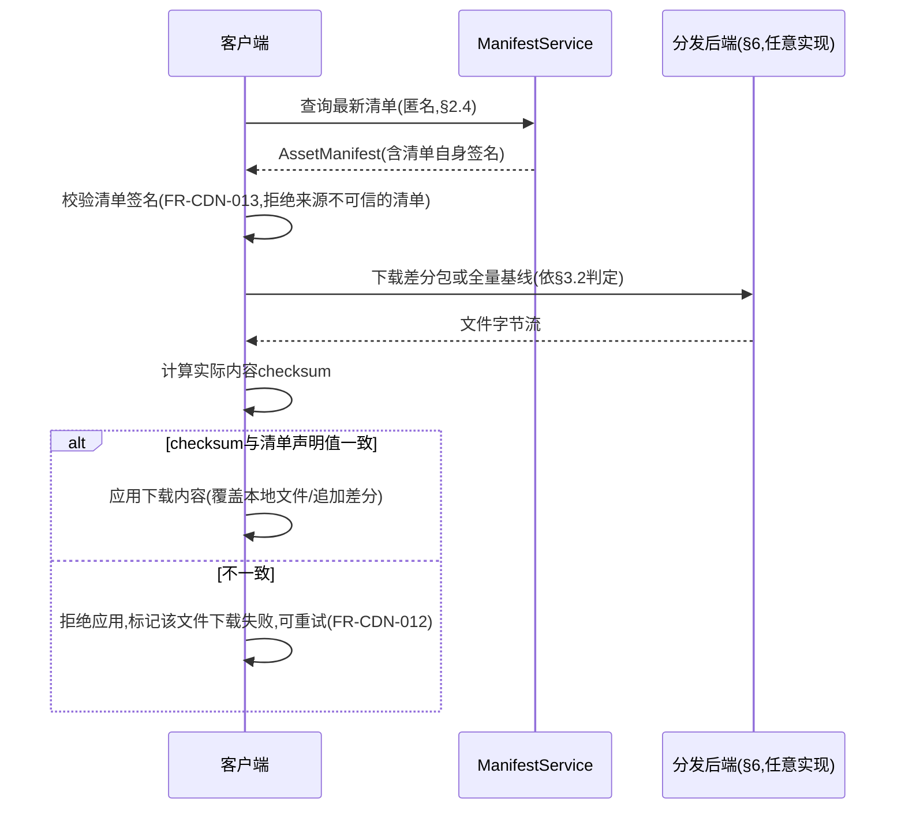
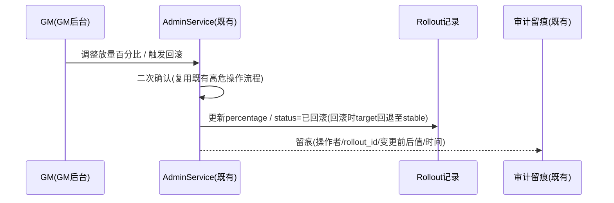
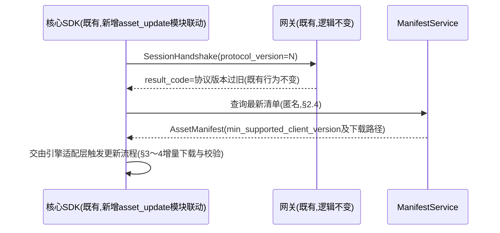

# 基本设计书（基本設計書 / Basic Design Document）

**客户端资源分发与热更新 Client Asset Distribution & Hot Update**

| 项目 | 内容 |
|---|---|
| 文档编号 | RGS-BAS-027 |
| 版本 | 0.2 |
| 父文档 | RGS-REQ-030 需求定义书（ARC-045） |
| 制定日 | 2026-08-17 |
| 最终更新日 | 2026-08-17 |
| 制定者 | 架构师 |
| 保密级别 | 内部限定（Internal Use Only） |
| 适用许可 | Apache-2.0（本仓库） |

---

## 修订历史（改訂履歴 / Revision History）

| 版本 | 修订日 | 修订者 | 审批者 | 修订内容 | 影响需求ID |
|---|---|---|---|---|---|
| 0.1 | 2026-08-17 | 架构师 | — | 初版制定。将RGS-REQ-030 ARC-045展开为清单服务组件设计、增量补丁生成流水线、完整性校验流程、灰度发布机制、可插拔分发后端抽象（默认自托管对象存储＋反向代理/缓存层） | 全部 |
| 0.2 | 2026-08-17 | 架构师 | — | 自我审查发现：§8追溯性表遗漏AC-CDN-001〜006的章节映射，本次补齐 | §8 |

## 审批栏（承認欄 / Approval）

| 角色 | 姓名 | 审批日 | 备注 |
|---|---|---|---|
| 制定（起草） | 架构师 | 2026-08-17 | — |
| 评审（技术） | | | 增量补丁生成是否真正复用RGS-BAS-010既有差分模式，而非另建一套差分体系 |
| 评审（成本/合规） | | | 默认分发后端组件选型是否均为OSI认可许可、不引入付费SaaS依赖 |
| 审批（负责人） | | | 本文档的基准化 |

---

## 目录

1. [前言](#1-前言)
2. [清单服务设计](#2-清单服务设计)
3. [增量补丁生成流水线](#3-增量补丁生成流水线)
4. [完整性校验流程](#4-完整性校验流程)
5. [灰度发布机制](#5-灰度发布机制)
6. [分发后端可插拔抽象](#6-分发后端可插拔抽象)
7. [标准化检查清单](#7-标准化检查清单)
8. [追溯性](#8-追溯性)

---

# 1. 前言

本文档细化RGS-REQ-030定义的ARC-045（分发后端可插拔抽象与自托管默认原则），遵循ARC-018挂载原则——清单服务与灰度控制作为横切能力扩展依附既有Kubernetes/Helm部署骨架（RGS-BAS-002）与既有GM控制平面（ARC-019）运行，**不新建**独立限界上下文、独立控制台或独立数据库集群；仅分发后端的数据面（实际文件存储/传输）根据§6所选实现可独立于业务集群之外运行，这是承载海量下载流量的物理必要性，而非架构上的另起炉灶。

---

# 2. 清单服务设计

## 2.1 组件定位（FR-CDN-001〜004落地）

清单服务（`ManifestService`）是一个**无状态只读查询服务**，与既有原子化App群组同构部署（依附既有Kubernetes/Helm部署骨架，RGS-BAS-002§4），不新建独立数据库——清单数据存储于新增`asset_db`（依ARC-008独立DB边界原则，因资源清单/灰度配置的读写模式与既有业务DB均不同源，符合RGS-BAS-002§5新限界上下文判定标准，视为一次标准挂载而非例外）。

## 2.2 数据模型

`AssetManifest`（对应FR-CDN-001）：

| 字段 | 说明 |
|---|---|
| `manifest_version` | 清单总版本号，单调递增 |
| `release_notes` | 变更说明摘要（FR-CDN-003） |
| `is_forced_update` | 是否强制更新标记（FR-CDN-024落地） |
| `min_supported_client_version` | 最低受支持客户端版本，与RGS-BAS-008§8既有FR-SDK-004协议版本协商的"N-1窗口"判定保持一致引用，**不**在本表重复定义协商逻辑本身 |
| `published_at` | 发布时间 |
| `rollout_id` | 外键，指向所属灰度发布批次（§5，未纳入灰度时为空即视为直接全量） |

`AssetFileEntry`（对应FR-CDN-001，与某个`manifest_version`关联）：

| 字段 | 说明 |
|---|---|
| `file_path` | 资源文件相对路径 |
| `file_version` | 该文件自身的版本号（用于差异计算，FR-CDN-002） |
| `checksum` | 完整性校验值（§4落地） |
| `size_bytes` | 文件字节大小 |
| `delta_available_from` | 若存在增量补丁，记录其适用的源版本列表（§3落地） |

## 2.3 差异计算（FR-CDN-002落地）

客户端携带自身`manifest_version`及各文件`file_version`列表查询，`ManifestService`**仅**做`AssetFileEntry.file_version`逐字段比对（不涉及任何文件内容读取），输出差异文件列表——比对本身是O(n)的纯计算查询，不产生额外I/O放大，天然满足NFR-CDN-001的p99<500ms目标。

## 2.4 匿名访问（FR-CDN-001落地，对应REQ§1.2约束）

`ManifestService`的查询接口**不**接入既有会话鉴权中间件（复用ARC-005权威校验路径的原则是"写路径需要会话"，本接口是纯只读查询且面向未登录客户端，与既有匿名健康检查/版本探测类接口同类），仅接入既有限流保护（复用RGS-BAS-006既定的按IP限流规则，防止清单查询接口被滥用消耗资源），不建立会话上下文。已登录客户端在会话内查询同一接口时**可以**附带既有会话上下文用于审计留痕，但**不要求**必须携带。

---

# 3. 增量补丁生成流水线

## 3.1 复用既有差分模式（FR-CDN-010〜011落地）

增量补丁生成**不**新增差分算法体系，直接复用RGS-BAS-010§3.8"Delta Compression＋Self-Healing Baseline"模式的结构：

| 模式要素（RGS-BAS-010§3.8既定） | 本场景落地 |
|---|---|
| 差分快照 | 新旧两个`file_version`之间的二进制差分包，替代全量文件下载 |
| 自愈基线 | 当差分链路过长（增量成本超过全量下载）或客户端本地文件状态不可信时，回退提供完整基线文件，与既定模式"自愈"语义一致 |

```
补丁生成流水线（发布流程的一环，CI/CD中触发）：
新资源版本入库
  → 对每个变化的AssetFileEntry，与其若干历史版本(如N-1/N-2)计算二进制差分
  → 差分结果大小 vs 全量文件大小比较
      → 差分显著更小: 生成AssetFileEntry.delta_available_from记录,差分包写入分发后端(§6)
      → 差分不显著更小(如资源类型不适合二进制差分,或版本跨度过大): 不生成差分,仅保留全量基线路径
  → 全量基线文件始终保留于分发后端,不因存在差分包而删除(自愈基线,FR-CDN-011强制要求)
```

## 3.2 客户端侧应用逻辑（FR-CDN-011落地）

客户端下载前先判定本地状态：若本地文件的`checksum`（§4）与`AssetFileEntry`记录的**上一版本**声明值一致，则请求对应的差分包；若本地文件缺失、`checksum`不匹配任何已知历史版本，或`delta_available_from`未覆盖当前本地版本，客户端**必须**请求完整基线文件——判定逻辑本身是纯本地比对，不依赖分发后端提供额外接口。

---

# 4. 完整性校验流程

## 4.1 校验时序（FR-CDN-012〜013落地）



## 4.2 清单签名（FR-CDN-013落地）

`AssetManifest`发布时由发布流水线使用非对称密钥对清单内容签名，签名值随清单一并下发；客户端内置公钥用于验签（公钥本身随客户端构建分发，不通过本系统的动态更新链路分发，避免"验签所需的信任根也需要被验签"的循环依赖）。签名算法选型不新增专属密码学组件，复用既有RGS-BAS-003安全设计已采用的签名算法族。

## 4.3 校验不可绕过（NFR-CDN-002落地）

完整性校验逻辑固化于客户端SDK的资源应用路径中（依附RGS-BAS-008既有核心SDK模块结构，新增`asset_update`模块，与`version`协议版本协商模块同级），**不**暴露任何"跳过校验"的配置开关——即使是灰度/紧急发布场景下产出的补丁包，仍须经过同一段校验代码路径，无特殊旁路分支。

---

# 5. 灰度发布机制

## 5.1 确定性分桶（FR-CDN-020〜022落地）

```
灰度判定(客户端查询清单时,ManifestService侧计算):
  bucket = hash(player_id_or_device_id) mod 100
  若 bucket < rollout.当前放量百分比: 返回本次灰度目标manifest_version
  否则: 返回上一稳定manifest_version
```

分桶依据`player_id`（已登录场景）或设备标识（未登录/首次下载场景，因匿名下载无`player_id`可用），哈希函数选型复用既有分片路由已采用的一致性哈希算法（RGS-BAS-022§3.1"复用而非重建"精神），**不**为灰度场景重新选择哈希算法。判定结果对同一标识、同一`rollout_id`是确定性的（同一玩家在同一灰度批次内的桶不会因重复查询而变化），满足FR-CDN-022可复现性要求。

## 5.2 灰度控制入口（FR-CDN-021落地）

`Rollout`（灰度批次记录，`asset_db`内）：

| 字段 | 说明 |
|---|---|
| `rollout_id` | 唯一标识 |
| `target_manifest_version` | 本次灰度目标版本 |
| `stable_manifest_version` | 灰度失败时回滚的目标（即当前稳定版本） |
| `percentage` | 当前放量百分比（0〜100） |
| `status` | 枚举：`灰度中`／`已全量`／`已回滚` |

灰度比例调整/暂停/全量/回滚**全部**通过既有GM控制平面（`AdminService`）操作，复用既有高危操作二次确认与审计留痕流程（RGS-BAS-003§7〜8）：



回滚操作生效延迟目标同NFR-CDN-003，与RGS-BAS-025 NFR-ANT-004同构（既有GM控制平面指令时延已有先例基准，本文档复用而非另定）。

## 5.3 与协议版本协商的衔接（FR-CDN-023〜024落地）

RGS-BAS-008§8既有时序中，`result_code=协议版本过旧`分支**新增**一个客户端侧后续动作（不改变服务端既有协商逻辑本身）：



`is_forced_update=true`的清单，客户端**必须**在完成更新前拒绝进入依赖该协议版本的在线功能（游戏内操作），判定执行点仍是既有FR-SDK-004协商闸门本身——客户端未完成强制更新则协议版本天然低于`min_supported_client_version`，握手继续被拒绝，不需要额外的执行机制。

---

# 6. 分发后端可插拔抽象

## 6.1 接口契约（ARC-045原则3落地）

分发后端抽象接口`DistributionBackend`的最小契约：

| 方法 | 说明 |
|---|---|
| `put(file_path, bytes) -> url` | 发布流水线写入文件（差分包/全量基线），返回可下载URL |
| `get_url(file_path) -> url` | 供清单服务生成客户端下载地址 |
| `exists(file_path) -> bool` | 发布流水线幂等性检查 |

`ManifestService`与增量补丁生成流水线（§2〜3）仅依赖该接口，不感知具体后端实现细节。

## 6.2 默认实现：自托管对象存储＋反向代理/缓存层（ARC-045原则1落地）


- 默认后端由**自托管对象存储**（提供S3兼容API的开源实现，具体软件见REQ§11 TBD-CDN-002）承载全量基线文件与差分包的持久化存储
- 前置**自托管反向代理/缓存层**，对高频访问的资源文件（新版本发布初期大量客户端并发下载同一批文件）提供边缘缓存，减少对象存储的直接读放大，具体软件选型同TBD-CDN-002
- 两者均部署为独立于业务集群的数据面组件（§1既定"仅数据面可独立部署"），控制面（`ManifestService`本身、发布流水线触发）仍依附既有Kubernetes/Helm骨架
- 全部组件须满足CON-001 OSI认可开源许可（同RGS-BAS-006既有Schema Registry选型的许可审查纪律：如Apicurio Registry可选、Confluent Community License不可选的同类判断标准），选型时须交叉核对附件D的OSS许可一览

## 6.3 可选实现：商业CDN（ARC-045原则2落地）

若后续评审认为特定场景需要商业CDN（如跨地域分发的边际成本优势），仅需实现同一`DistributionBackend`接口接入，**不影响**§2〜5任何上层设计。该选型评审比照RGS-REQ-010 TBD-SEC-001的处理方式，不在本文档给出结论，留待专项评审并记录ADR（见REQ§11 RSK-CDN-001）。

## 6.4 容量与可观测性（复用既有能力，不新建）

- 分发后端数据面的容量弹性规划复用RGS-BAS-022既有弹性容量规划原则（见REQ§11 RSK-CDN-002，具体预留策略留待详细设计阶段结合发布高峰期实测数据确定）
- 分发流量、清单查询QPS、完整性校验失败率、灰度批次分桶分布等指标接入既有可观测性体系（复用RGS-BAS-004既定指标/日志/追踪基础设施），**不新建**独立监控栈

---

# 7. 标准化检查清单

## 7.1 上线前检查清单

- [ ] 清单签名验证：客户端拒绝未通过签名校验的清单，验证清单来源不可信场景被正确拦截（AC-CDN-006关联的完整性设计前提）
- [ ] 增量补丁自愈基线路径验证：模拟本地文件状态不可信场景，验证客户端正确回退至全量基线下载而非强行应用增量（FR-CDN-011）
- [ ] 完整性校验不可绕过：代码审查确认客户端资源应用路径中不存在任何跳过checksum校验的配置开关或调试后门（NFR-CDN-002）
- [ ] 灰度分桶确定性验证：同一玩家标识在同一`rollout_id`下重复查询，验证判定结果一致（AC-CDN-004关联前提）
- [ ] 依赖许可审查：`DistributionBackend`默认实现（对象存储/反向代理缓存层软件）均为OSI认可许可，且不存在隐式付费SaaS依赖（AC-CDN-006）

## 7.2 代码评审检查清单

- [ ] `ManifestService`/增量补丁生成流水线代码未直接依赖任何具体分发后端SDK，均通过`DistributionBackend`接口交互
- [ ] 灰度控制的全部写操作（放量调整/回滚）均经由`AdminService`既有高危操作分支，不存在绕过GM控制平面的直接写路径

---

# 8. 追溯性

| 需求ID | 本设计书章节 |
|---|---|
| ARC-045 | 全文 |
| FR-CDN-001〜004 | §2 |
| FR-CDN-010〜013 | §3、§4 |
| FR-CDN-020〜024 | §5 |
| NFR-CDN-001〜005 | §2.3、§4.3、§5.2、§6.2 |
| AC-CDN-001〜002（清单差异查询/增量补丁生效） | §2、§3 |
| AC-CDN-003（篡改内容校验拒绝） | §4 |
| AC-CDN-004（灰度分桶确定性/GM暂停回滚） | §5.1、§5.2 |
| AC-CDN-005（版本过旧引导更新） | §5.3 |
| AC-CDN-006（默认后端不依赖付费SaaS/闭源组件） | §6.1〜6.3 |
