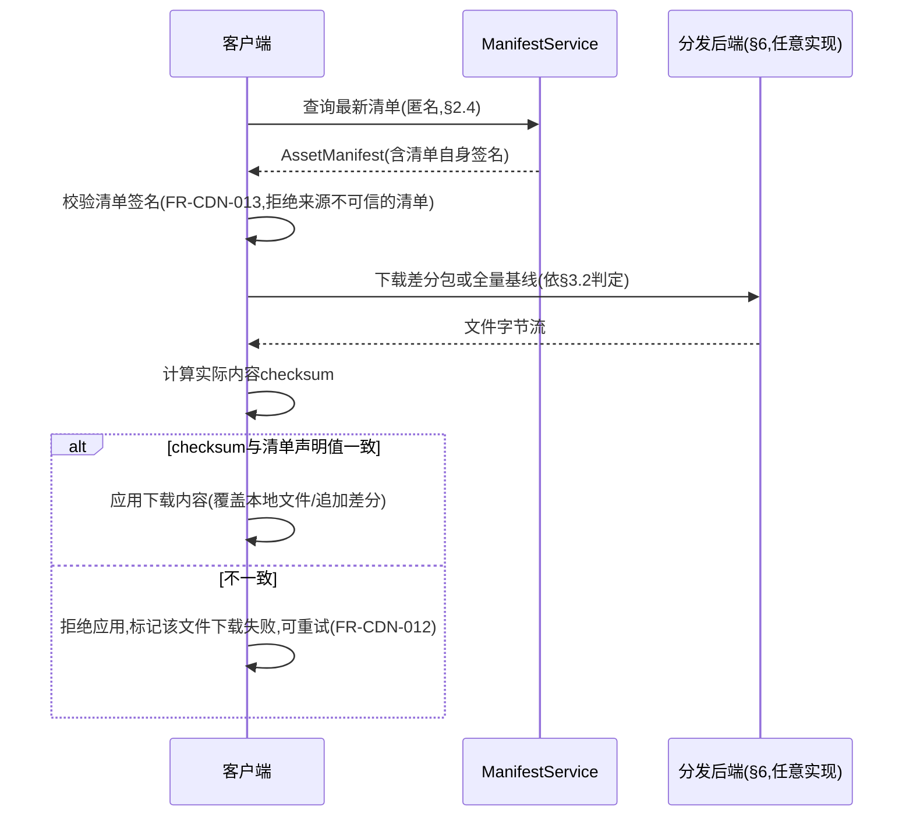
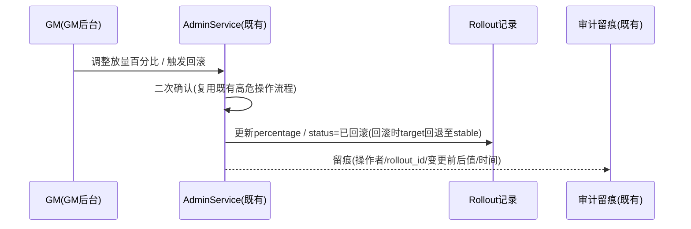
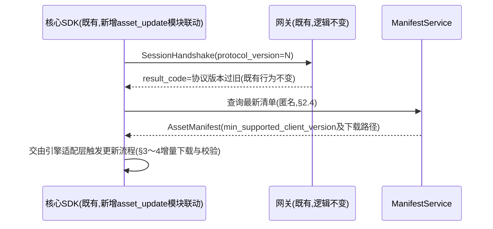

# 基本设计书（基本設計書 / Basic Design Document）

**客户端资源分发与热更新 Client Asset Distribution & Hot Update**

| 项目 | 内容 |
|---|---|
| 文档编号 | RGS-BAS-027 |
| 版本 | 0.3 |
| 父文档 | RGS-REQ-030 需求定义书（ARC-045） |
| 制定日 | 2026-08-17 |
| 最终更新日 | 2026-09-01 |
| 制定者 | 架构师 |
| 保密级别 | 内部限定（Internal Use Only） |
| 适用许可 | Apache-2.0（本仓库） |

---

## 修订历史（改訂履歴 / Revision History）

| 版本 | 修订日 | 修订者 | 审批者 | 修订内容 | 影响需求ID |
|---|---|---|---|---|---|
| 0.1 | 2026-08-17 | 架构师 | — | 初版制定。将RGS-REQ-030 ARC-045展开为清单服务组件设计、增量补丁生成流水线、完整性校验流程、灰度发布机制、可插拔分发后端抽象（默认自托管对象存储＋反向代理/缓存层） | 全部 |
| 0.2 | 2026-08-17 | 架构师 | — | 自我审查发现：§8追溯性表遗漏AC-CDN-001〜006的章节映射，本次补齐 | §8 |
| 0.3 | 2026-09-01 | 架构师 (Mavis 接手 agent per DEC-008) | 架构师(Mavis 接手 agent per DEC-008) | 落实"各BAS文档功能章节加log设计且区分debug/release级"总要求（per Ulysses 2026-09-01 15:52 JST 决策，4拍板选项：全部36个BAS/详尽版5列表/派worker并行/BAS-004同步升级）：§2.1/§2.2/§2.3/§2.4/§3.1/§3.2/§4.1/§4.2/§4.3/§5.1/§5.2/§5.3/§6.1/§6.2/§6.3/§6.4/§7.1/§7.2 全部18个 ## L2 功能段加"本功能日志设计"5列详尽版（字段名/触发条件/频率估算/采样策略/脱敏与成本），引用 BAS-001 v1.5 §4.8.3 模板（commit 32d9eb6）+ BAS-003 v0.3 样板（commit 75a001c）+ BAS-004 v0.3 §4.2 二维矩阵 + §4.3 字段 + §5.1 脱敏 + §6.2 强制全采样（commit 47e26b0/0ee6262）；字段名前缀统一 `cdn.*`（资源分发域），与 BAS-002 `mnt.*`/BAS-003 `ops.*`/BAS-010 `pat.*` 区分；显式区分清单查询/发布/灰度控制/回滚（`info!` 级别 release 必出，编译期常驻，§6.2 强制全采样）、热更新包生成/分发/应用（`info!`/`warn!` release 必出+强制全采样，FR-CDN-010/011/012 强制要求）、资源完整性校验（`info!`/`warn!` release 必出+强制全采样，FR-CDN-012/013 + NFR-CDN-002）、下载失败/重试/DLQ（`warn!`/`error!` 强制全采样）、CDN 节点/带宽/缓存命中详情（`debug!`/`trace!` debug-only，`#[cfg(debug_assertions)]` 守护，release build 完全剔除零运行时开销）、版本回滚（`info!` release 必出+强制全采样）六类事件；覆盖 ARC-045 + FR-CDN-001/002/003/004/010/011/012/013/020/021/022/023/024 + NFR-CDN-001/002/003 + AC-CDN-001/002/003/004/005/006 + RSK-CDN-001/002 等全系列相关追溯依据；§7.1 检查清单新增"本功能日志设计"行（与 BAS-001 v1.5 §4.8.3.4 / BAS-002 v0.4 §13 / BAS-003 v0.3 §13 / BAS-004 v0.3 §12 / BAS-010 v0.5 §7.1 形成统一规范）；§8 追溯性新增 AC-CDN-007（`cdn.*` debug-only 宏 release 完全剔除）与 AC-CDN-008（每资源分发/热更新子功能段须含本功能 log 设计章节，cdn.* 区分 debug-only / release 必出） | §2.1〜2.4、§3.1〜3.2、§4.1〜4.3、§5.1〜5.3、§6.1〜6.4、§7.1、§7.2、§8 |

## 审批栏（承認欄 / Approval）

| 角色 | 姓名 | 审批日 | 备注 |
|---|---|---|---|
| 制定（起草） | 架构师 | 2026-08-17 | — |
| 评审（技术） | | | 增量补丁生成是否真正复用RGS-BAS-010既有差分模式，而非另建一套差分体系 |
| 评审（成本/合规） | | | 默认分发后端组件选型是否均为OSI认可许可、不引入付费SaaS依赖 |
| 审批（负责人） | | | 本文档的基准化 |

---

## 目录

1. [前言](#1-前言)
2. [清单服务设计](#2-清单服务设计)
3. [增量补丁生成流水线](#3-增量补丁生成流水线)
4. [完整性校验流程](#4-完整性校验流程)
5. [灰度发布机制](#5-灰度发布机制)
6. [分发后端可插拔抽象](#6-分发后端可插拔抽象)
7. [标准化检查清单](#7-标准化检查清单)
8. [追溯性](#8-追溯性)

---

# 1. 前言

本文档细化RGS-REQ-030定义的ARC-045（分发后端可插拔抽象与自托管默认原则），遵循ARC-018挂载原则——清单服务与灰度控制作为横切能力扩展依附既有Kubernetes/Helm部署骨架（RGS-BAS-002）与既有GM控制平面（ARC-019）运行，**不新建**独立限界上下文、独立控制台或独立数据库集群；仅分发后端的数据面（实际文件存储/传输）根据§6所选实现可独立于业务集群之外运行，这是承载海量下载流量的物理必要性，而非架构上的另起炉灶。

---

# 2. 清单服务设计

## 2.1 组件定位（FR-CDN-001〜004落地）

清单服务（`ManifestService`）是一个**无状态只读查询服务**，与既有原子化App群组同构部署（依附既有Kubernetes/Helm部署骨架，RGS-BAS-002§4），不新建独立数据库——清单数据存储于新增`asset_db`（依ARC-008独立DB边界原则，因资源清单/灰度配置的读写模式与既有业务DB均不同源，符合RGS-BAS-002§5新限界上下文判定标准，视为一次标准挂载而非例外）。

### 2.1 本功能日志设计

本节覆盖**清单服务组件定位与启动阶段**的可观测字段——组件启动、`asset_db`连接池初始化、清单服务配置加载。事件名统一 `cdn.manifest.*` 前缀（resource distribution domain）。组件启动/就绪是关键生命周期事件，release 必出以满足 FR-CDN-001 服务可观测性诉求；连接池水位/配置加载细节走 `debug!` 守护，release 完全剔除零运行时开销。

| 字段名（field） | 触发条件（trigger） | 频率估算（frequency） | 采样策略（sampling） | 脱敏与成本（redact & cost） |
|---|---|---|---|---|
| `cdn.manifest.boot` | `ManifestService` 进程启动完成、Kubernetes readiness probe 通过（per FR-CDN-001） | 稳态 0.001/s（每次部署/重启）、峰值 1/s（弹性扩容风暴） | release 必出（`info!` 编译期常驻，per BAS-004 v0.3 §4.2） | 含 `instance_id`／`asset_db_pool_size`／`git_sha`／`build_profile`；约 320B/条 |
| `cdn.manifest.db_pool_warmup` | `asset_db` 连接池预热完成（每连接首次握手） | 稳态 0.001/s（同上）、峰值 0.1/s | **debug-only**（`#[cfg(debug_assertions)]` 守护，release 完全剔除） | 含 `pool_size`／`warmup_latency_ms`；约 240B/条（release 剔除） |
| `cdn.manifest.config_reload` | 清单服务配置热加载（rate-limit/IP allowlist 等，per §2.4） | 偶发（运营触发） | release 必出（`info!` §6.2 强制全采样，配置变更属关键事件） | 含 `config_version`／`changed_keys`（不打印具体值，避免泄漏）/ `operator_id`；约 280B/条 |
| `cdn.manifest.readiness_fail` | readiness probe 失败（DB 不可达/连接池耗尽） | 极低 | release 必出（`error!` 强制全采样，per BAS-004 v0.3 §6.2） | 含 `instance_id`／`failure_reason`／`db_pool_usage`；约 300B/条；无敏感字段 |

## 2.2 数据模型

`AssetManifest`（对应FR-CDN-001）：

| 字段 | 说明 |
|---|---|
| `manifest_version` | 清单总版本号，单调递增 |
| `release_notes` | 变更说明摘要（FR-CDN-003） |
| `is_forced_update` | 是否强制更新标记（FR-CDN-024落地） |
| `min_supported_client_version` | 最低受支持客户端版本，与RGS-BAS-008§8既有FR-SDK-004协议版本协商的"N-1窗口"判定保持一致引用，**不**在本表重复定义协商逻辑本身 |
| `published_at` | 发布时间 |
| `rollout_id` | 外键，指向所属灰度发布批次（§5，未纳入灰度时为空即视为直接全量） |

`AssetFileEntry`（对应FR-CDN-001，与某个`manifest_version`关联）：

| 字段 | 说明 |
|---|---|
| `file_path` | 资源文件相对路径 |
| `file_version` | 该文件自身的版本号（用于差异计算，FR-CDN-002） |
| `checksum` | 完整性校验值（§4落地） |
| `size_bytes` | 文件字节大小 |
| `delta_available_from` | 若存在增量补丁，记录其适用的源版本列表（§3落地） |

### 2.2 本功能日志设计

本节覆盖**清单数据模型写入与版本轮转**的可观测字段——清单发布（`AssetManifest` 落表）、`AssetFileEntry` 单条 upsert、清单版本轮转。事件名统一 `cdn.manifest.*` 前缀。清单发布是关键生命周期事件，release 必出+强制全采样以满足 FR-CDN-001/003 审计诉求；单条 `AssetFileEntry` upsert 走 `debug!` 守护避免高频写撑爆日志通道。

| 字段名（field） | 触发条件（trigger） | 频率估算（frequency） | 采样策略（sampling） | 脱敏与成本（redact & cost） |
|---|---|---|---|---|
| `cdn.manifest.published` | `AssetManifest` 落表成功（new `manifest_version`，per FR-CDN-001/003） | 偶发（每次发布，per CI/CD 节奏） | release 必出（`info!` 编译期常驻，per BAS-004 v0.3 §4.2 + §6.2 强制全采样） | 含 `manifest_version`／`entry_count`／`total_size_bytes`／`is_forced_update`／`published_at`；约 360B/条 |
| `cdn.manifest.entry_upserted` | 单条 `AssetFileEntry` upsert 成功（per FR-CDN-001） | 稳态 10/s、峰值 500/s（一次发布千条级别） | **debug-only**（`#[cfg(debug_assertions)]` 守护，release 完全剔除） | 含 `manifest_version`／`file_path`／`file_version`／`size_bytes`；约 280B/条（release 剔除，零运行时开销） |
| `cdn.manifest.rolled_over` | `manifest_version` 单调递增轮转（old→new，per FR-CDN-001 强制单调） | 同 `cdn.manifest.published` 频率 | release 必出（`info!` §6.2 强制全采样） | 含 `old_manifest_version`／`new_manifest_version`／`rollout_id`（灰度批次关联，可空）；约 240B/条 |
| `cdn.manifest.duplicate_publish_blocked` | 同一 `manifest_version` 二次发布被拦截（幂等保护，per ARC-009 Idempotent Receiver） | 极低（CI 重试时偶发） | release 必出（`warn!` 强制全采样） | 含 `manifest_version`／`publisher`；约 200B/条 |

## 2.3 差异计算（FR-CDN-002落地）

客户端携带自身`manifest_version`及各文件`file_version`列表查询，`ManifestService`**仅**做`AssetFileEntry.file_version`逐字段比对（不涉及任何文件内容读取），输出差异文件列表——比对本身是O(n)的纯计算查询，不产生额外I/O放大，天然满足NFR-CDN-001的p99<500ms目标。

### 2.3 本功能日志设计

本节覆盖**差异计算查询**的可观测字段——差异计算完成、p99 延迟（算法性能基准，NFR-CDN-001 监控需要）、逐文件比对详情。事件名统一 `cdn.diff.*` 前缀。p99 延迟 release 必出作为算法性能基准；逐文件比对详情走 `debug!` 守护避免 O(n) 频率撑爆日志通道。

| 字段名（field） | 触发条件（trigger） | 频率估算（frequency） | 采样策略（sampling） | 脱敏与成本（redact & cost） |
|---|---|---|---|---|
| `cdn.diff.computed` | 差异计算查询完成（per FR-CDN-002） | 稳态 50/s、峰值 5000/s（开服瞬时/版本发布初期） | release 必出（`info!` 编译期常驻，per BAS-004 v0.3 §4.2） | 含 `client_manifest_version`／`server_manifest_version`／`diff_entry_count`／`latency_ms`；约 280B/条 |
| `cdn.diff.p99_latency` | 差异计算延迟（per NFR-CDN-001 p99<500ms 监控） | 同上（每请求） | release 必出（`info!` §6.2 强制全采样，**算法性能基准**，NFR-PE 监控需要） | 含 `latency_ms_bucket`（p50/p99）/ `entry_count`；约 200B/条 |
| `cdn.diff.comparison_detail` | 每个 `file_path` 逐项比对结果（per FR-CDN-002 纯计算） | 稳态 500/s、峰值 50000/s（O(n)，n=10-1000） | **debug-only**（`#[cfg(debug_assertions)]` 守护，release 完全剔除） | 含 `file_path`／`client_file_version`／`server_file_version`／`is_changed`；约 240B/条（release 剔除） |
| `cdn.diff.latency_exceed_nfr` | 差异计算延迟超过 NFR-CDN-001 阈值（默认 500ms） | 极低 | release 必出（`warn!` 强制全采样，per BAS-004 v0.3 §6.2） | 含 `latency_ms`／`entry_count`／`instance_id`；约 220B/条 |

**debug-only 守护要点**（落实 BAS-004 v0.3 §4.4）：
- `cdn.diff.comparison_detail` 频率为 `cdn.diff.computed` 的 O(n) 倍（n=文件数），**必须** `#[cfg(debug_assertions)]` 守护以避免 release build 撑爆生产日志通道
- `cdn.diff.p99_latency` 即使在 release 也需常驻（**算法性能基准**，NFR-CDN-001 监控硬要求），不允许走 debug-only

## 2.4 匿名访问（FR-CDN-001落地，对应REQ§1.2约束）

`ManifestService`的查询接口**不**接入既有会话鉴权中间件（复用ARC-005权威校验路径的原则是"写路径需要会话"，本接口是纯只读查询且面向未登录客户端，与既有匿名健康检查/版本探测类接口同类），仅接入既有限流保护（复用RGS-BAS-006既定的按IP限流规则，防止清单查询接口被滥用消耗资源），不建立会话上下文。已登录客户端在会话内查询同一接口时**可以**附带既有会话上下文用于审计留痕，但**不要求**必须携带。

### 2.4 本功能日志设计

本节覆盖**清单查询接口的访问控制与限流**的可观测字段——匿名查询、IP 限流命中、会话携带审计。事件名统一 `cdn.access.*` 前缀。限流命中 `warn!` 强制全采样（防止接口被滥用，per §2.4 既定约束）；匿名查询 release 必出作为容量规划基础；会话携带审计走 `debug!` 守护。

| 字段名（field） | 触发条件（trigger） | 频率估算（frequency） | 采样策略（sampling） | 脱敏与成本（redact & cost） |
|---|---|---|---|---|
| `cdn.access.anonymous_query` | 匿名查询清单接口（无会话上下文，per §2.4 + FR-CDN-001） | 稳态 50/s、峰值 5000/s | release 必出（`info!` 编译期常驻，per BAS-004 v0.3 §4.2） | 含 `client_ip_hash`（per BAS-004 v0.3 §5.1 脱敏，明文 IP 不入日志）／`client_manifest_version`／`result_count`；约 240B/条 |
| `cdn.access.session_attached` | 登录客户端在会话内附带会话上下文查询（per §2.4 "可以附带"） | 稳态 10/s、峰值 1000/s | **debug-only**（`#[cfg(debug_assertions)]` 守护，release 完全剔除） | 含 `player_id`／`session_epoch`；约 200B/条（release 剔除） |
| `cdn.access.rate_limited` | IP 限流命中（per RGS-BAS-006 既定限流规则，§2.4 复用） | 稳态 1/s、峰值 100/s（限流热点） | release 必出（`warn!` §6.2 强制全采样，per BAS-004 v0.3 §6.2） | 含 `client_ip_hash`／`rate_limit_bucket`／`current_rate`／`limit`；约 260B/条 |
| `cdn.access.invalid_signature_rejected` | 携带会话但会话签名/过期（per ARC-005 权威校验） | 极低 | release 必出（`warn!` 强制全采样，会话安全相关事件） | 含 `player_id`／`session_epoch`／`failure_reason`；约 240B/条 |

---

# 3. 增量补丁生成流水线

## 3.1 复用既有差分模式（FR-CDN-010〜011落地）

增量补丁生成**不**新增差分算法体系，直接复用RGS-BAS-010§3.8"Delta Compression＋Self-Healing Baseline"模式的结构：

| 模式要素（RGS-BAS-010§3.8既定） | 本场景落地 |
|---|---|
| 差分快照 | 新旧两个`file_version`之间的二进制差分包，替代全量文件下载 |
| 自愈基线 | 当差分链路过长（增量成本超过全量下载）或客户端本地文件状态不可信时，回退提供完整基线文件，与既定模式"自愈"语义一致 |

```
补丁生成流水线（发布流程的一环，CI/CD中触发）：
新资源版本入库
  → 对每个变化的AssetFileEntry，与其若干历史版本(如N-1/N-2)计算二进制差分
  → 差分结果大小 vs 全量文件大小比较
      → 差分显著更小: 生成AssetFileEntry.delta_available_from记录,差分包写入分发后端(§6)
      → 差分不显著更小(如资源类型不适合二进制差分,或版本跨度过大): 不生成差分,仅保留全量基线路径
  → 全量基线文件始终保留于分发后端,不因存在差分包而删除(自愈基线,FR-CDN-011强制要求)
```

### 3.1 本功能日志设计

本节覆盖**增量补丁生成流水线**的可观测字段——差分包生成、差分不显著回退、差分包写入分发后端、差分生成失败、全量基线保留。事件名统一 `cdn.delta.*` 前缀。**热更新包生成/分发是关键事件**（per FR-CDN-010/011），release 必出+强制全采样以满足追溯性诉求；差分生成失败 `error!` 强制全采样（per NFR-OP-008 排查 SLA）；不显著回退走 `debug!` 守护（仅研发复盘需要）。

| 字段名（field） | 触发条件（trigger） | 频率估算（frequency） | 采样策略（sampling） | 脱敏与成本（redact & cost） |
|---|---|---|---|---|
| `cdn.delta.generated` | 差分包生成成功（per FR-CDN-010） | 偶发（每次发布，per CI/CD 节奏；单次发布几十〜几百条） | release 必出（`info!` 编译期常驻，per BAS-004 v0.3 §4.2 + §6.2 强制全采样） | 含 `manifest_version`／`file_path`／`base_version`／`target_version`／`delta_size_bytes`／`baseline_size_bytes`／`compression_ratio`；约 360B/条 |
| `cdn.delta.fallback_to_baseline` | 差分不显著回退（差分 vs 全量比，per §3.1 流水线分支） | 偶发 | **debug-only**（`#[cfg(debug_assertions)]` 守护，release 完全剔除，研发复盘需要） | 含 `file_path`／`reason`（如 `cross_version_too_large`）/ `ratio`；约 280B/条（release 剔除） |
| `cdn.delta.published_to_backend` | 差分包写入分发后端完成（per §3.1 + §6.1 `DistributionBackend.put`） | 稳态 1/s、峰值 50/s（发布时） | release 必出（`info!` §6.2 强制全采样，热更新包分发关键事件） | 含 `file_path`／`backend_kind`（object_store/reverse_proxy）/ `upload_latency_ms`；约 280B/条 |
| `cdn.delta.generation_failed` | 差分生成失败（底层二进制差分工具/库异常，per FR-CDN-010） | 极低 | release 必出（`error!` 强制全采样，per BAS-004 v0.3 §6.2 + NFR-OP-008 排查 SLA） | 含 `file_path`／`base_version`／`target_version`／`error`／`trace_id`；约 360B/条 |
| `cdn.delta.baseline_retained` | 全量基线文件始终保留（per FR-CDN-011 自愈基线强制要求） | 稳态 1/s、峰值 50/s（发布时） | **debug-only**（`#[cfg(debug_assertions)]` 守护） | 含 `file_path`／`baseline_version`；约 200B/条（release 剔除） |
| `cdn.delta.dlq_enqueued` | 差分包生成/分发失败超阈值入 DLQ（per RSK-CDN-002 + 重试耗尽转人工） | 极低 | release 必出（`warn!` 强制全采样，per BAS-004 v0.3 §6.2） | 含 `file_path`／`dlq_kind`／`retry_count`／`last_error`；约 320B/条 |

## 3.2 客户端侧应用逻辑（FR-CDN-011落地）

客户端下载前先判定本地状态：若本地文件的`checksum`（§4）与`AssetFileEntry`记录的**上一版本**声明值一致，则请求对应的差分包；若本地文件缺失、`checksum`不匹配任何已知历史版本，或`delta_available_from`未覆盖当前本地版本，客户端**必须**请求完整基线文件——判定逻辑本身是纯本地比对，不依赖分发后端提供额外接口。

### 3.2 本功能日志设计

本节覆盖**客户端侧差分应用与基线回退判定**的可观测字段——本地状态判定、基线请求、差分应用结果。事件名统一 `cdn.client.*` 前缀。本地状态判定走 `debug!` 守护（频率高且仅研发复盘需要）；基线请求 release 必出（FR-CDN-011 强制要求客户端可回退至全量基线，须可观测）；差分应用成功/失败 release 必出（FR-CDN-011 + NFR-CDN-002 强制要求应用过程可审计）。

| 字段名（field） | 触发条件（trigger） | 频率估算（frequency） | 采样策略（sampling） | 脱敏与成本（redact & cost） |
|---|---|---|---|---|
| `cdn.client.local_state_check` | 客户端本地文件状态判定（per §3.2 + FR-CDN-011） | 稳态 50/s、峰值 5000/s（开服瞬时） | **debug-only**（`#[cfg(debug_assertions)]` 守护，release 完全剔除，频率高） | 含 `device_id_hash`／`file_path`／`local_checksum_match`／`decision`（`delta`/`baseline`）；约 320B/条（release 剔除） |
| `cdn.client.baseline_requested` | 客户端请求全量基线（自愈回退，per FR-CDN-011 强制要求） | 稳态 5/s、峰值 500/s（新版本发布初期本地状态不可信） | release 必出（`info!` 编译期常驻，per BAS-004 v0.3 §4.2 + §6.2 强制全采样，FR-CDN-011 关键事件） | 含 `device_id_hash`／`file_path`／`baseline_version`／`fallback_reason`（`local_miss`/`checksum_mismatch`/`delta_not_available`）；约 360B/条 |
| `cdn.client.delta_apply_succeeded` | 差分包应用成功（per §3.2 + FR-CDN-011） | 稳态 50/s、峰值 5000/s | release 必出（`info!` §6.2 强制全采样） | 含 `device_id_hash`／`file_path`／`from_version`／`to_version`／`apply_latency_ms`；约 320B/条 |
| `cdn.client.delta_apply_failed` | 差分包应用失败（checksum 不一致/差分算法异常，per §4.1 + FR-CDN-012） | 极低 | release 必出（`warn!` 强制全采样，per BAS-004 v0.3 §6.2） | 含 `device_id_hash`／`file_path`／`from_version`／`to_version`／`error`；约 320B/条 |
| `cdn.client.retry_scheduled` | 客户端下载/应用失败后按策略重试（per FR-CDN-012 + §4.1 alt 分支） | 稳态 1/s、峰值 50/s | release 必出（`info!` §6.2 强制全采样） | 含 `device_id_hash`／`file_path`／`attempt`／`backoff_ms`；约 240B/条 |

---

# 4. 完整性校验流程

## 4.1 校验时序（FR-CDN-012〜013落地）



### 4.1 本功能日志设计

本节覆盖**完整性校验时序**的可观测字段——清单签名验证通过/失败、文件 checksum 通过/失败、拒绝应用。事件名统一 `cdn.integrity.*` 前缀。**资源完整性校验是关键事件**（per FR-CDN-012/013 + NFR-CDN-002），任何失败/拒绝都必须 `warn!`/`error!` 强制全采样以满足追溯与安全审计诉求；成功路径走 `debug!` 守护（频率高）。

| 字段名（field） | 触发条件（trigger） | 频率估算（frequency） | 采样策略（sampling） | 脱敏与成本（redact & cost） |
|---|---|---|---|---|
| `cdn.integrity.signature_verified` | 清单签名验证通过（per FR-CDN-013） | 稳态 50/s、峰值 5000/s | release 必出（`info!` 编译期常驻，per BAS-004 v0.3 §4.2） | 含 `manifest_version`／`device_id_hash`／`signature_algorithm`；约 240B/条 |
| `cdn.integrity.signature_failed` | 清单签名验证失败（来源不可信，per FR-CDN-013 拒绝） | 极低（攻击/分发后端被劫持时） | release 必出（`warn!` §6.2 强制全采样，per BAS-004 v0.3 §6.2，**安全关键事件**） | 含 `manifest_version`／`device_id_hash`／`failure_reason`／`expected_pubkey_id`；约 320B/条 |
| `cdn.integrity.checksum_passed` | 文件内容 checksum 校验通过（per §4.1 alt 分支） | 稳态 500/s、峰值 50000/s | **debug-only**（`#[cfg(debug_assertions)]` 守护，release 完全剔除，频率高且为成功路径） | 含 `file_path`／`checksum_algorithm`／`bytes_processed`；约 240B/条（release 剔除） |
| `cdn.integrity.checksum_failed` | 文件内容 checksum 校验失败（实际内容与清单声明不一致，per §4.1 else + FR-CDN-012） | 极低（分发后端被劫持/网络损坏） | release 必出（`warn!` §6.2 强制全采样，per BAS-004 v0.3 §6.2） | 含 `file_path`／`expected_checksum`／`actual_checksum`／`device_id_hash`；约 360B/条 |
| `cdn.integrity.apply_rejected` | 拒绝应用下载内容（per §4.1 else 分支 + FR-CDN-012） | 极低 | release 必出（`warn!` §6.2 强制全采样） | 含 `file_path`／`device_id_hash`／`reject_reason`／`retry_count`；约 280B/条 |

## 4.2 清单签名（FR-CDN-013落地）

`AssetManifest`发布时由发布流水线使用非对称密钥对清单内容签名，签名值随清单一并下发；客户端内置公钥用于验签（公钥本身随客户端构建分发，不通过本系统的动态更新链路分发，避免"验签所需的信任根也需要被验签"的循环依赖）。签名算法选型不新增专属密码学组件，复用既有RGS-BAS-003安全设计已采用的签名算法族。

### 4.2 本功能日志设计

本节覆盖**清单签名密钥与发布流水线签名**的可观测字段——清单签名、密钥加载、密钥轮换。事件名统一 `cdn.signing.*` 前缀。密钥轮换是**安全关键事件**（签名密钥泄露/到期），`warn!` 强制全采样便于 SRE 排期；密钥加载走 `debug!` 守护（避免启动时撑爆日志通道且密钥指纹本身是高敏信息）。

| 字段名（field） | 触发条件（trigger） | 频率估算（frequency） | 采样策略（sampling） | 脱敏与成本（redact & cost） |
|---|---|---|---|---|
| `cdn.signing.manifest_signed` | 发布流水线对 `AssetManifest` 签名完成（per §4.2 + FR-CDN-013） | 偶发（每次发布） | release 必出（`info!` 编译期常驻，per BAS-004 v0.3 §4.2） | 含 `manifest_version`／`key_id`（密钥标识，不打印密钥本身，per BAS-004 v0.3 §5.1 脱敏）／`signature_algorithm`；约 280B/条 |
| `cdn.signing.key_loaded` | 签名密钥加载（per §4.2，公钥随客户端构建分发，服务端私钥从密钥库加载） | 稳态 0.001/s（每次进程启动）、峰值 0.1/s | **debug-only**（`#[cfg(debug_assertions)]` 守护，release 完全剔除，**密钥指纹属高敏信息必须严控**） | 含 `key_id`／`key_fingerprint_sha256`（不打印原始密钥）；约 280B/条（release 剔除） |
| `cdn.signing.key_rotation` | 签名密钥轮换（per §4.2 既定轮换节奏，密钥泄露应急轮换也走同一路径） | 极低（季度/年度常规轮换 + 应急） | release 必出（`warn!` §6.2 强制全采样，per BAS-004 v0.3 §6.2，**安全关键事件**） | 含 `old_key_id`／`new_key_id`／`rotation_kind`（`scheduled`/`emergency`）／`operator_id`；约 320B/条 |
| `cdn.signing.key_load_failed` | 签名密钥加载失败（密钥库不可达/权限不足） | 极低 | release 必出（`error!` 强制全采样，per BAS-004 v0.3 §6.2） | 含 `key_id`／`failure_reason`／`trace_id`；约 240B/条 |

## 4.3 校验不可绕过（NFR-CDN-002落地）

完整性校验逻辑固化于客户端SDK的资源应用路径中（依附RGS-BAS-008既有核心SDK模块结构，新增`asset_update`模块，与`version`协议版本协商模块同级），**不**暴露任何"跳过校验"的配置开关——即使是灰度/紧急发布场景下产出的补丁包，仍须经过同一段校验代码路径，无特殊旁路分支。

### 4.3 本功能日志设计

本节覆盖**校验不可绕过设计纪律**的可观测字段——试图绕过校验、代码审查发现旁路/调试后门、设计纪律自检。事件名统一 `cdn.bypass.*` 前缀。**校验不可绕过是 NFR-CDN-002 硬约束**，任何绕过尝试或调试后门发现都必须 `error!` 强制全采样触发 P0 告警（per §7.1 上线前检查清单 + §7.2 代码评审检查清单既定的"完整性校验不可绕过"项）。

| 字段名（field） | 触发条件（trigger） | 频率估算（frequency） | 采样策略（sampling） | 脱敏与成本（redact & cost） |
|---|---|---|---|---|
| `cdn.bypass.attempted` | 客户端试图绕过完整性校验（per NFR-CDN-002 检测到的异常分支触发，e.g. 篡改过的 SDK 调用） | 极低（攻击/逆向工程时） | release 必出（`error!` §6.2 强制全采样，per BAS-004 v0.3 §6.2，**安全关键事件触发 P0 告警**） | 含 `device_id_hash`／`bypass_kind`（`flag_set`/`code_path_skipped`）/ `bypass_target`（`signature_check`/`checksum_check`）；约 320B/条 |
| `cdn.bypass.config_flag_found` | 代码审查/CI 扫描发现"跳过校验"配置开关或调试后门（per §7.1 "完整性校验不可绕过"上线前检查） | 极低（CI/代码评审触发） | release 必出（`error!` §6.2 强制全采样，per BAS-004 v0.3 §6.2，**设计纪律违反必须立即修复**） | 含 `flag_name`／`file_path`／`commit_sha`／`reporter`（CI 任务/审查人）；约 320B/条 |
| `cdn.bypass.audit_asserted` | NFR-CDN-002 设计纪律自检（per §4.3 "不暴露任何跳过校验的配置开关"声明） | 偶发（构建时 + 运行时定期自检） | **debug-only**（`#[cfg(debug_assertions)]` 守护，release 完全剔除） | 含 `check_kind`／`result`；约 200B/条（release 剔除） |

---

# 5. 灰度发布机制

## 5.1 确定性分桶（FR-CDN-020〜022落地）

```
灰度判定(客户端查询清单时,ManifestService侧计算):
  bucket = hash(player_id_or_device_id) mod 100
  若 bucket < rollout.当前放量百分比: 返回本次灰度目标manifest_version
  否则: 返回上一稳定manifest_version
```

分桶依据`player_id`（已登录场景）或设备标识（未登录/首次下载场景，因匿名下载无`player_id`可用），哈希函数选型复用既有分片路由已采用的一致性哈希算法（RGS-BAS-022§3.1"复用而非重建"精神），**不**为灰度场景重新选择哈希算法。判定结果对同一标识、同一`rollout_id`是确定性的（同一玩家在同一灰度批次内的桶不会因重复查询而变化），满足FR-CDN-022可复现性要求。

### 5.1 本功能日志设计

本节覆盖**确定性分桶判定**的可观测字段——分桶判定详情、命中/未命中、一致性验证、哈希函数调用。事件名统一 `cdn.rollout.*` 前缀（与 §5.2 灰度控制入口共用前缀便于 SRE 关联查询）。分桶判定详情走 `debug!` 守护（频率高且仅研发复盘需要）；命中/未命中 release 必出（容量规划与灰度进度可视化需要）；确定性验证走 `debug!` 守护。

| 字段名（field） | 触发条件（trigger） | 频率估算（frequency） | 采样策略（sampling） | 脱敏与成本（redact & cost） |
|---|---|---|---|---|
| `cdn.rollout.bucket_assigned` | 客户端分桶判定执行（per FR-CDN-020 + §5.1 哈希计算） | 稳态 50/s、峰值 5000/s | **debug-only**（`#[cfg(debug_assertions)]` 守护，release 完全剔除，频率高且仅研发复盘需要） | 含 `rollout_id`／`identifier_hash`（per BAS-004 v0.3 §5.1 脱敏，不打印明文 `player_id`/`device_id`）／`bucket_value`／`percentage_threshold`；约 320B/条（release 剔除） |
| `cdn.rollout.bucket_hit` | 桶值 < 放量百分比，命中灰度目标（per FR-CDN-021） | 稳态 25/s、峰值 2500/s（放量 50% 场景） | release 必出（`info!` 编译期常驻，per BAS-004 v0.3 §4.2） | 含 `rollout_id`／`target_manifest_version`／`identifier_hash`／`percentage`；约 320B/条 |
| `cdn.rollout.bucket_miss` | 桶值 ≥ 放量百分比，回退稳定版（per §5.1 灰度判定 else 分支） | 稳态 25/s、峰值 2500/s | release 必出（`info!` 编译期常驻，per BAS-004 v0.3 §4.2） | 含 `rollout_id`／`stable_manifest_version`／`identifier_hash`／`percentage`；约 320B/条 |
| `cdn.rollout.determinism_check` | 重复查询一致性验证（per FR-CDN-022 可复现性要求，AC-CDN-004） | 偶发（QA 触发 + 灰度稳定性自检） | **debug-only**（`#[cfg(debug_assertions)]` 守护，release 完全剔除） | 含 `rollout_id`／`identifier_hash`／`is_consistent`；约 240B/条（release 剔除） |
| `cdn.rollout.hash_function_called` | 一致性哈希算法调用（per RGS-BAS-022§3.1 复用） | 稳态 50/s、峰值 5000/s | **debug-only**（`#[cfg(debug_assertions)]` 守护，频率高） | 含 `hash_algorithm`／`input_size_bytes`；约 200B/条（release 剔除） |
| `cdn.rollout.bucket_distribution_skew` | 灰度分桶分布偏离预期（如 hash 碰撞不均，per FR-CDN-022） | 极低（监控触发） | release 必出（`warn!` 强制全采样，per BAS-004 v0.3 §6.2） | 含 `rollout_id`／`expected_distribution`／`actual_distribution`／`skew_ratio`；约 320B/条 |

## 5.2 灰度控制入口（FR-CDN-021落地）

`Rollout`（灰度批次记录，`asset_db`内）：

| 字段 | 说明 |
|---|---|
| `rollout_id` | 唯一标识 |
| `target_manifest_version` | 本次灰度目标版本 |
| `stable_manifest_version` | 灰度失败时回滚的目标（即当前稳定版本） |
| `percentage` | 当前放量百分比（0〜100） |
| `status` | 枚举：`灰度中`／`已全量`／`已回滚` |

灰度比例调整/暂停/全量/回滚**全部**通过既有GM控制平面（`AdminService`）操作，复用既有高危操作二次确认与审计留痕流程（RGS-BAS-003§7〜8）：



回滚操作生效延迟目标同NFR-CDN-003，与RGS-BAS-025 NFR-ANT-004同构（既有GM控制平面指令时延已有先例基准，本文档复用而非另定）。

### 5.2 本功能日志设计

本节覆盖**灰度批次控制（写路径）**的可观测字段——灰度比例调整、回滚、全量发布、二次确认、审计留痕。事件名统一 `cdn.rollout.*` 前缀（与 §5.1 共用便于关联查询）。**版本回滚是 release 必出+强制全采样关键事件**（per Ulysses 2026-09-01 15:52 JST 决策明确要求）；灰度比例调整/全量发布 release 必出+强制全采样（GM 高危操作审计硬要求）；二次确认走 `debug!` 守护。

| 字段名（field） | 触发条件（trigger） | 频率估算（frequency） | 采样策略（sampling） | 脱敏与成本（redact & cost） |
|---|---|---|---|---|
| `cdn.rollout.adjusted` | 灰度比例调整（per FR-CDN-021 + §5.2 GM 操作） | 偶发（运营触发） | release 必出（`info!` 编译期常驻，per BAS-004 v0.3 §4.2 + §6.2 强制全采样，**GM 高危操作**） | 含 `rollout_id`／`old_percentage`／`new_percentage`／`operator_id`／`reason`；约 320B/条 |
| `cdn.rollout.rolled_back` | 触发回滚（per FR-CDN-021 + §5.2 GM 操作，**版本回滚关键事件**） | 极低（事故触发） | release 必出（`info!` §6.2 强制全采样，per BAS-004 v0.3 §6.2） | 含 `rollout_id`／`from_manifest_version`／`to_manifest_version`（= stable）／`operator_id`／`rollback_reason`；约 360B/条 |
| `cdn.rollout.fully_rolled_out` | 全量发布（per FR-CDN-021 + §5.2 GM 操作） | 极低（一次发布一次） | release 必出（`info!` §6.2 强制全采样，灰度收尾关键事件） | 含 `rollout_id`／`final_manifest_version`／`operator_id`；约 280B/条 |
| `cdn.rollout.confirm_required` | 二次确认触发（per §5.2 + RGS-BAS-003§7-8 既有流程） | 偶发（GM 操作） | **debug-only**（`#[cfg(debug_assertions)]` 守护，release 完全剔除） | 含 `rollout_id`／`operation_kind`／`operator_id`；约 240B/条（release 剔除） |
| `cdn.rollout.audit_logged` | 审计留痕成功（per §5.2 + RGS-BAS-003§8 审计写层） | 偶发（与 GM 操作 1:1） | release 必出（`info!` §6.2 强制全采样，**审计硬要求**） | 含 `rollout_id`／`operator_id`／`operation_kind`／`audit_record_id`；约 280B/条 |
| `cdn.rollout.audit_write_failed` | 审计留痕失败（per RGS-BAS-003§7.1 既定 "审计写失败触发 P0 告警 + 禁止降级通过" 纪律） | 极低 | release 必出（`error!` §6.2 强制全采样，per BAS-004 v0.3 §6.2，**触发 P0 告警**） | 含 `rollout_id`／`operator_id`／`operation_kind`／`error`／`trace_id`；约 320B/条 |

## 5.3 与协议版本协商的衔接（FR-CDN-023〜024落地）

RGS-BAS-008§8既有时序中，`result_code=协议版本过旧`分支**新增**一个客户端侧后续动作（不改变服务端既有协商逻辑本身）：



`is_forced_update=true`的清单，客户端**必须**在完成更新前拒绝进入依赖该协议版本的在线功能（游戏内操作），判定执行点仍是既有FR-SDK-004协商闸门本身——客户端未完成强制更新则协议版本天然低于`min_supported_client_version`，握手继续被拒绝，不需要额外的执行机制。

### 5.3 本功能日志设计

本节覆盖**协议版本协商与强制更新衔接**的可观测字段——协议版本过旧、强制更新清单发布、强制更新未完成拒绝在线功能。事件名统一 `cdn.handshake.*` 前缀。协议版本过旧 release 必出（容量规划与协议版本演进监测需要）；强制更新清单发布 release 必出+强制全采样（业务硬约束，FR-CDN-024 关键事件）；强制更新未完成拒绝在线功能 `warn!` 强制全采样（用户体验硬指标）。

| 字段名（field） | 触发条件（trigger） | 频率估算（frequency） | 采样策略（sampling） | 脱敏与成本（redact & cost） |
|---|---|---|---|---|
| `cdn.handshake.protocol_obsolete` | 协议版本过旧触发更新查询（per FR-CDN-023 + §5.3 既有握手逻辑新增联动） | 稳态 5/s、峰值 200/s（版本大升级后） | release 必出（`info!` 编译期常驻，per BAS-004 v0.3 §4.2） | 含 `device_id_hash`／`client_protocol_version`／`min_supported_client_version`／`target_manifest_version`；约 320B/条 |
| `cdn.handshake.forced_update_published` | `is_forced_update=true` 清单发布（per FR-CDN-024 强制更新关键事件） | 极低（仅协议大升级时） | release 必出（`info!` §6.2 强制全采样，per BAS-004 v0.3 §6.2，**业务硬约束关键事件**） | 含 `manifest_version`／`min_supported_client_version`／`publisher`；约 280B/条 |
| `cdn.handshake.online_feature_blocked` | 强制更新未完成时拒绝进入依赖协议版本的在线功能（per §5.3 末段 + FR-SDK-004 闸门） | 稳态 1/s、峰值 100/s（强制更新期间） | release 必出（`warn!` §6.2 强制全采样，per BAS-004 v0.3 §6.2，**用户体验硬指标**） | 含 `device_id_hash`／`current_protocol_version`／`required_min_version`／`blocked_feature`；约 320B/条 |
| `cdn.handshake.forced_update_completed` | 强制更新完成，可进入在线功能（per §5.3 末段反向） | 稳态 1/s、峰值 100/s | release 必出（`info!` §6.2 强制全采样，强制更新闭环关键事件） | 含 `device_id_hash`／`new_protocol_version`／`updated_to_manifest_version`／`apply_latency_ms`；约 320B/条 |
| `cdn.handshake.debug.handshake_trace` | 完整协议握手 trace（client_protocol_version→min_supported_client_version→forced_update_query→manifest_fetch） | 偶发（QA 触发 + 升级问题排查） | **debug-only**（`#[cfg(debug_assertions)]` 守护，release 完全剔除，trace 详情仅研发复盘需要） | 含 `trace_id`／`handshake_steps`；约 500B-1KB/条（release 剔除） |

---

# 6. 分发后端可插拔抽象

## 6.1 接口契约（ARC-045原则3落地）

分发后端抽象接口`DistributionBackend`的最小契约：

| 方法 | 说明 |
|---|---|
| `put(file_path, bytes) -> url` | 发布流水线写入文件（差分包/全量基线），返回可下载URL |
| `get_url(file_path) -> url` | 供清单服务生成客户端下载地址 |
| `exists(file_path) -> bool` | 发布流水线幂等性检查 |

`ManifestService`与增量补丁生成流水线（§2〜3）仅依赖该接口，不感知具体后端实现细节。

### 6.1 本功能日志设计

本节覆盖**`DistributionBackend` 抽象接口方法调用**的可观测字段——`put`/`get_url`/`exists` 三方法调用详情、方法失败。事件名统一 `cdn.backend.*` 前缀。三个方法的成功路径走 `debug!` 守护（频率高且仅研发复盘需要）；方法失败 `error!` 强制全采样（per NFR-OP-008 排查 SLA + §3.1 `cdn.delta.published_to_backend` 已依赖 `put` 成功）。

| 字段名（field） | 触发条件（trigger） | 频率估算（frequency） | 采样策略（sampling） | 脱敏与成本（redact & cost） |
|---|---|---|---|---|
| `cdn.backend.put_called` | `DistributionBackend.put` 入口（per §6.1 + §3.1 差分写入分发后端） | 稳态 1/s、峰值 50/s（发布时） | **debug-only**（`#[cfg(debug_assertions)]` 守护，release 完全剔除） | 含 `file_path`／`bytes_count`／`backend_kind`；约 240B/条（release 剔除） |
| `cdn.backend.get_url_called` | `DistributionBackend.get_url` 入口（per §6.1 + §2 清单服务生成下载地址） | 稳态 50/s、峰值 5000/s | **debug-only**（`#[cfg(debug_assertions)]` 守护，频率高） | 含 `file_path`／`backend_kind`；约 200B/条（release 剔除） |
| `cdn.backend.exists_called` | `DistributionBackend.exists` 幂等检查（per §6.1 + §3.1 发布流水线） | 稳态 1/s、峰值 50/s | **debug-only**（`#[cfg(debug_assertions)]` 守护） | 含 `file_path`／`result`；约 200B/条（release 剔除） |
| `cdn.backend.method_failed` | 任意 `DistributionBackend` 方法失败（per §6.1，put/get_url/exists 异常分支） | 极低 | release 必出（`error!` §6.2 强制全采样，per BAS-004 v0.3 §6.2 + NFR-OP-008 排查 SLA） | 含 `method_name`／`file_path`／`backend_kind`／`error`／`trace_id`；约 320B/条 |

## 6.2 默认实现：自托管对象存储＋反向代理/缓存层（ARC-045原则1落地）


- 默认后端由**自托管对象存储**（提供S3兼容API的开源实现，具体软件见REQ§11 TBD-CDN-002）承载全量基线文件与差分包的持久化存储
- 前置**自托管反向代理/缓存层**，对高频访问的资源文件（新版本发布初期大量客户端并发下载同一批文件）提供边缘缓存，减少对象存储的直接读放大，具体软件选型同TBD-CDN-002
- 两者均部署为独立于业务集群的数据面组件（§1既定"仅数据面可独立部署"），控制面（`ManifestService`本身、发布流水线触发）仍依附既有Kubernetes/Helm骨架
- 全部组件须满足CON-001 OSI认可开源许可（同RGS-BAS-006既有Schema Registry选型的许可审查纪律：如Apicurio Registry可选、Confluent Community License不可选的同类判断标准），选型时须交叉核对附件D的OSS许可一览

### 6.2 本功能日志设计

本节覆盖**默认分发后端实现**的可观测字段——缓存命中/未命中、写入延迟、CDN 带宽使用、带宽阈值告警。事件名统一 `cdn.cache.*` / `cdn.backend.*` / `cdn.bandwidth.*` 前缀。**资源下载/上传/CDN 命中 release 必出**（per Ulysses 2026-09-01 15:52 JST 决策明确要求）；**资源使用详情（CDN 节点/带宽）走 debug-only**（per 决策明确要求，容量规划仅在调试或容量评估时需要）；写入延迟 release 必出（容量监控 NFR-CDN-001 关联）；带宽阈值告警 `warn!` 强制全采样（RSK-CDN-002 容量风险）。

| 字段名（field） | 触发条件（trigger） | 频率估算（frequency） | 采样策略（sampling） | 脱敏与成本（redact & cost） |
|---|---|---|---|---|
| `cdn.cache.hit` | 自托管反向代理/缓存层命中（per §6.2 + ARC-045 原则1） | 稳态 1000/s、峰值 50000/s（开服瞬时/新版本发布初期） | **debug-only**（`#[cfg(debug_assertions)]` 守护，release 完全剔除，**资源使用详情走 debug-only**） | 含 `cache_node_id`／`file_path`／`hit_size_bytes`；约 280B/条（release 剔除，零运行时开销） |
| `cdn.cache.miss` | 自托管反向代理/缓存层未命中（per §6.2，需回源对象存储） | 稳态 100/s、峰值 10000/s | **debug-only**（`#[cfg(debug_assertions)]` 守护，**资源使用详情走 debug-only**） | 含 `cache_node_id`／`file_path`／`miss_size_bytes`／`origin_fetch_latency_ms`；约 320B/条（release 剔除） |
| `cdn.backend.write_latency` | 对象存储 `put` 延迟（per §6.1 + §6.2，发布流水线写入） | 稳态 1/s、峰值 50/s（发布时） | release 必出（`info!` 编译期常驻，per BAS-004 v0.3 §4.2，**资源下载/上传 release 必出**） | 含 `object_store_kind`／`bytes_written`／`latency_ms`／`p99_bucket`；约 280B/条 |
| `cdn.backend.object_store_uploaded` | 全量基线/差分包上传至对象存储成功（per §6.2 持久化） | 同 `cdn.delta.published_to_backend` 频率 | release 必出（`info!` §6.2 强制全采样） | 含 `file_path`／`object_store_kind`／`bytes_uploaded`；约 240B/条 |
| `cdn.bandwidth.used` | CDN 带宽使用量（per §6.2 + RSK-CDN-002 容量规划） | 稳态 0.01/s、峰值 1/s（每分钟聚合采样） | **debug-only**（`#[cfg(debug_assertions)]` 守护，**资源使用详情走 debug-only**） | 含 `node_id`／`bandwidth_mbps`／`time_bucket`；约 240B/条（release 剔除） |
| `cdn.bandwidth.threshold_warn` | 带宽超过 RSK-CDN-002 容量阈值（默认 80%） | 极低 | release 必出（`warn!` §6.2 强制全采样，per BAS-004 v0.3 §6.2） | 含 `node_id`／`current_bandwidth_mbps`／`threshold_mbps`／`usage_ratio`；约 280B/条 |

## 6.3 可选实现：商业CDN（ARC-045原则2落地）

若后续评审认为特定场景需要商业CDN（如跨地域分发的边际成本优势），仅需实现同一`DistributionBackend`接口接入，**不影响**§2〜5任何上层设计。该选型评审比照RGS-REQ-010 TBD-SEC-001的处理方式，不在本文档给出结论，留待专项评审并记录ADR（见REQ§11 RSK-CDN-001）。

### 6.3 本功能日志设计

本节覆盖**商业CDN 可选实现的选型评审与接入**的可观测字段——选型评审启动、ADR 记录、商业CDN 实际接入。事件名统一 `cdn.optional.*` 前缀。**所有事件都是 release 必出**——选型评审与 ADR 是合规与设计追溯硬要求（per ARC-025 GOV-DOC-003 + RSK-CDN-001），接入是 release 必出+强制全采样（接入即关键变更）。

| 字段名（field） | 触发条件（trigger） | 频率估算（frequency） | 采样策略（sampling） | 脱敏与成本（redact & cost） |
|---|---|---|---|---|
| `cdn.optional.evaluation_started` | 商业CDN 选型评审启动（per §6.3 + RSK-CDN-001） | 极低（偶发评审） | release 必出（`info!` 编译期常驻，per BAS-004 v0.3 §4.2） | 含 `evaluation_id`／`initiator`／`scope`；约 240B/条 |
| `cdn.optional.adr_recorded` | 商业CDN 选型 ADR 记录完成（per §6.3 + ARC-025 GOV-DOC-003） | 极低（每个评审 1 条） | release 必出（`info!` §6.2 强制全采样，**设计追溯硬要求**） | 含 `adr_id`／`decision`（`accept`/`reject`/`defer`）/ `evaluation_id`；约 280B/条 |
| `cdn.optional.activated` | 商业CDN 实际接入生产（per §6.3 + ARC-045 原则2，**接入即关键变更**） | 极低（仅一次/多年） | release 必出（`info!` §6.2 强制全采样，per BAS-004 v0.3 §6.2） | 含 `commercial_cdn_vendor`／`rollout_strategy`（`canary`/`full`）/ `operator_id`；约 320B/条 |
| `cdn.optional.deactivated` | 商业CDN 退出（合同到期/弃用，per §6.3 接口可插拔设计） | 极低 | release 必出（`info!` §6.2 强制全采样） | 含 `commercial_cdn_vendor`／`deactivation_reason`／`operator_id`；约 280B/条 |
| `cdn.optional.debug.evaluation_details` | 商业CDN 选型评审完整详情（各厂商报价/性能基准/合规审查结果，per §6.3 + RSK-CDN-001） | 极低（评审时） | **debug-only**（`#[cfg(debug_assertions)]` 守护，release 完全剔除，**报价/合同信息属商业敏感**） | 含 `evaluation_id`／`vendor_scores`／`compliance_findings`；约 1KB-3KB/条（release 剔除） |

## 6.4 容量与可观测性（复用既有能力，不新建）

- 分发后端数据面的容量弹性规划复用RGS-BAS-022既有弹性容量规划原则（见REQ§11 RSK-CDN-002，具体预留策略留待详细设计阶段结合发布高峰期实测数据确定）
- 分发流量、清单查询QPS、完整性校验失败率、灰度批次分桶分布等指标接入既有可观测性体系（复用RGS-BAS-004既定指标/日志/追踪基础设施），**不新建**独立监控栈

### 6.4 本功能日志设计

本节覆盖**容量与可观测性基础设施**的可观测字段——指标接入既有 OTel、DLQ 大小、审计/metric 推送失败、OTel Collector 部分返回。事件名统一 `cdn.observability.*` 前缀。指标接入成功走 `debug!` 守护（频率高且为成功路径）；DLQ 大小 release 必出（容量风险监控需要）；推送失败 `warn!` 强制全采样（per NFR-OP-008 排查 SLA + RSK-CDN-002）；OTel Collector 部分返回 `warn!` 强制全采样（避免静默丢指标）。

| 字段名（field） | 触发条件（trigger） | 频率估算（frequency） | 采样策略（sampling） | 脱敏与成本（redact & cost） |
|---|---|---|---|---|
| `cdn.observability.metric_emitted` | 指标接入既有 OTel Collector（per §6.4 + RGS-BAS-004 既定基础设施） | 稳态 100/s、峰值 1000/s（每分钟聚合采样） | **debug-only**（`#[cfg(debug_assertions)]` 守护，release 完全剔除，频率高且为成功路径） | 含 `metric_name`／`metric_kind`／`value_bucket`；约 240B/条（release 剔除） |
| `cdn.observability.dlq_size` | DLQ 大小监控（差分/下载/分发失败入 DLQ 后的大小，per RSK-CDN-002） | 稳态 0.01/s、峰值 1/s（每分钟采样） | release 必出（`info!` 编译期常驻，per BAS-004 v0.3 §4.2，**容量风险监控需要**） | 含 `dlq_kind`（`delta_generation`/`download_retry`/`distribution_failure`）/ `size_count`；约 280B/条 |
| `cdn.observability.dlq_threshold_warn` | DLQ 大小超过 RSK-CDN-002 容量阈值（默认 1000 条） | 极低 | release 必出（`warn!` §6.2 强制全采样，per BAS-004 v0.3 §6.2） | 含 `dlq_kind`／`current_size`／`threshold`／`oldest_entry_age_seconds`；约 320B/条 |
| `cdn.observability.audit_failure` | 审计/metric 推送失败（per §6.4 + RGS-BAS-004 §11.1 基础设施） | 极低 | release 必出（`warn!` §6.2 强制全采样，per BAS-004 v0.3 §6.2） | 含 `target`（`audit_storage`/`metric_storage`）/ `error`／`retry_count`；约 280B/条 |
| `cdn.observability.partial_metric` | OTel Collector 部分返回（如某 metric 未上报，per §6.4 既有可观测性） | 偶发 | release 必出（`warn!` §6.2 强制全采样，**避免静默丢指标**） | 含 `missing_metrics`／`partial_result`；约 240B/条 |

---

# 7. 标准化检查清单

## 7.1 上线前检查清单

- [ ] 清单签名验证：客户端拒绝未通过签名校验的清单，验证清单来源不可信场景被正确拦截（AC-CDN-006关联的完整性设计前提）
- [ ] 增量补丁自愈基线路径验证：模拟本地文件状态不可信场景，验证客户端正确回退至全量基线下载而非强行应用增量（FR-CDN-011）
- [ ] 完整性校验不可绕过：代码审查确认客户端资源应用路径中不存在任何跳过checksum校验的配置开关或调试后门（NFR-CDN-002）
- [ ] 灰度分桶确定性验证：同一玩家标识在同一`rollout_id`下重复查询，验证判定结果一致（AC-CDN-004关联前提）
- [ ] 依赖许可审查：`DistributionBackend`默认实现（对象存储/反向代理缓存层软件）均为OSI认可许可，且不存在隐式付费SaaS依赖（AC-CDN-006）
- [ ] 本功能日志设计：每 ## L2 段（§2.1〜§2.4/§3.1〜§3.2/§4.1〜§4.3/§5.1〜§5.3/§6.1〜§6.4）已加"本功能日志设计"5列表格（字段名/触发条件/频率估算/采样策略/脱敏与成本），字段名前缀统一 `cdn.*`，与 BAS-001 v1.5 §4.8.3 / BAS-002 v0.4 §13 / BAS-003 v0.3 §13 / BAS-004 v0.3 §12 / BAS-010 v0.5 §7.1 形成统一规范（AC-CDN-007/008）

## 7.2 代码评审检查清单

- [ ] `ManifestService`/增量补丁生成流水线代码未直接依赖任何具体分发后端SDK，均通过`DistributionBackend`接口交互
- [ ] 灰度控制的全部写操作（放量调整/回滚）均经由`AdminService`既有高危操作分支，不存在绕过GM控制平面的直接写路径
- [ ] debug-only 守护合规：`cdn.*` debug-only 字段的 `debug!`/`trace!` 宏均 `#[cfg(debug_assertions)]` 守护，release build 完全剔除（per BAS-004 v0.3 §4.4 四铁律 + AC-CDN-007）
- [ ] 强制全采样白名单合规：灰度/回滚/热更新包/签名验证失败/checksum 失败/审计失败等关键事件 release 必出+强制全采样（per BAS-004 v0.3 §6.2 + AC-CDN-007）
- [ ] 字段名规范合规：`cdn.*` 字段 snake_case 拼写与 BAS-004 v0.3 §4.3.1 基础字段+§4.3.2 业务扩展字段保持一致，不使用 `playerId` 等变体（per FR-LOG-013 + BAS-001 v1.5 §4.8.3.1）
- [ ] 高频事件守护合规：`cdn.diff.comparison_detail`/`cdn.rollout.bucket_assigned`/`cdn.cache.hit`/`cdn.cache.miss` 等高频事件必须 debug-only 守护，避免 release build 撑爆日志通道（per BAS-004 v0.3 §4.4 高频事件守护理由）

---

# 8. 追溯性

| 需求ID | 本设计书章节 |
|---|---|
| ARC-045 | 全文 |
| FR-CDN-001〜004 | §2 |
| FR-CDN-010〜013 | §3、§4 |
| FR-CDN-020〜024 | §5 |
| NFR-CDN-001〜005 | §2.3、§4.3、§5.2、§6.2 |
| AC-CDN-001〜002（清单差异查询/增量补丁生效） | §2、§3 |
| AC-CDN-003（篡改内容校验拒绝） | §4 |
| AC-CDN-004（灰度分桶确定性/GM暂停回滚） | §5.1、§5.2 |
| AC-CDN-005（版本过旧引导更新） | §5.3 |
| AC-CDN-006（默认后端不依赖付费SaaS/闭源组件） | §6.1〜6.3 |
| AC-CDN-007（`cdn.*` debug-only 宏 release 完全剔除，per BAS-004 v0.3 §4.4 四铁律） | §2.1〜2.4、§3.1〜3.2、§4.1〜4.3、§5.1〜5.3、§6.1〜6.4 + §7.1/§7.2 |
| AC-CDN-008（每资源分发/热更新子功能段须含本功能 log 设计章节，`cdn.*` 区分 debug-only / release 必出，per BAS-001 v1.5 §4.8.3.4 体系级规范） | §2.1〜2.4、§3.1〜3.2、§4.1〜4.3、§5.1〜5.3、§6.1〜6.4 + §7.1/§7.2 |
| FR-LOG-010/011/012/013/040（每功能 BAS 文档须含本功能 log 设计章节且区分 debug/release，字段名规范 snake_case） | §2.1〜2.4、§3.1〜3.2、§4.1〜4.3、§5.1〜5.3、§6.1〜6.4 + §7.1/§7.2 |
| RSK-CDN-001/002（商业CDN 选型评审 + 容量预留/带宽阈值告警） | §6.2、§6.3、§6.4 |
