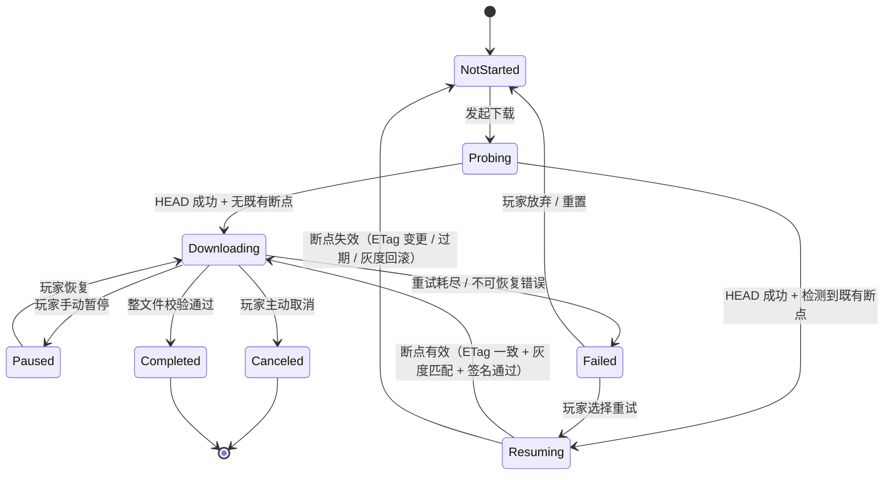

# 基本设计书（基本設計書 / Basic Design Document）

**客户端资源分发的断点续传与可恢复下载 Resumable & Recoverable Asset Download**

| 项目 | 内容 |
|---|---|
| 文档编号 | RGS-BAS-036 |
| 版本 | 0.2 |
| 父文档 | RGS-REQ-036 客户端资源分发的断点续传与可恢复下载 需求定义书 |
| 配套设计 | RGS-BAS-027 客户端资源分发与热更新（扩 §6.1 DistributionBackend 接口契约）；RGS-REQ-030-ADD1 CDN 边缘策略（衔接 §6.4 边缘对 Range 的缓存/回源） |
| 制定日 | 2026-08-21 |
| 制定者 | 架构师 |
| 保密级别 | 内部限定（Internal Use Only） |
| 适用许可 | Apache-2.0（本仓库） |

---

## 修订历史（改訂履歴 / Revision History）

| 版本 | 修订日 | 修订者 | 审批者 | 修订内容 | 影响需求ID |
|---|---|---|---|---|---|
| 0.1 | 2026-08-21 | 架构师 | — | 初版制定。落实 RGS-REQ-036 全部 FR-CDN-040~084 与 NFR-CDN-110~114；扩 RGS-BAS-027 §6.1 DistributionBackend 接口契约为新增 Range 支持要求；定义客户端 SDK `asset_download` 模块（与既有 `asset_update` / `version` 同级）的断点状态机、本地断点记录 Schema、并发分片下载与恢复时序、HTTP Range 响应头契约、与 FR-CDN-012/013/020/024 的协同边界 | 全部 |
| 0.2 | 2026-08-21 | Ulysses(一人公司 12 角色兼任 per DEC-008) | Ulysses(同) | 具名人类审批完成(per RGS-WBS-001 §17 集体签字声明):一人公司兼任体制下,Ulysses 在本表审批栏各角色中具名签字,完整 12 角色兼任清单见 RGS-WBS-001 §17。审批栏细化角色意见与 DEC-008 兼任对应关系见 RGS-REQ-004 §3.10。**升 v0.2**: 文档从 v0.1 草案转为 v0.2 具名审批版,生产基线化仍需 G-CODE-06 实测通过(per RGS-WF-001) | 全部 |

## 审批栏（承認欄 / Approval）

| 角色 | 姓名 | 审批日 | 备注 |
|---|---|---|---|
| 制定（起草） | 架构师 | 2026-08-21 | — |
| 评审（架构） |  |  | ①Range 协议契约是否覆盖自托管对象存储与商业 CDN 两类后端；②断点状态机是否与既有 `asset_update` / `version` 模块边界清晰不重叠 |
| 评审（平台/客户端） |  |  | ①断点记录本地存储 Schema 与 SDK 现有持久化路径（用户设置 / 协议版本缓存）是否冲突；②并发分片下载在移动平台弱网下的默认参数 |
| 评审（SRE） |  |  | Range 请求对 CDN 边缘命中率 / 回源带宽的影响；暂停恢复期间无带宽占用的实现正确性 |
| 评审（安全/合规） |  |  | 断点记录不引入 PII；Range 协议不绕过既有 NFR-CDN-002 完整性校验硬约束 |
| 审批（负责人） |  |  | 本文档的基准化 |

| **集体签字(per DEC-008)** | **Ulysses(一人公司 12 角色兼任)** | **2026-08-21** | **Ulysses 在审批栏各角色中具名签字,完整 12 角色兼任清单见 RGS-WBS-001 §17 集体签字声明。审批栏细化角色意见详见 RGS-REQ-004 §3.10。** |

---

## 目录

1. [前言](#1-前言)
2. [DistributionBackend 接口契约扩展](#2-distributionbackend-接口契约扩展)
3. [组件图与责任矩阵](#3-组件图与责任矩阵)
4. [断点状态机](#4-断点状态机)
5. [断点记录 Schema](#5-断点记录-schema)
6. [HTTP Range 响应头契约](#6-http-range-响应头契约)
7. [关键时序：恢复下载 / 暂停恢复 / 灰度回退 / 完整性校验](#7-关键时序恢复下载--暂停恢复--灰度回退--完整性校验)
8. [并发分片下载设计](#8-并发分片下载设计)
9. [CDN 边缘衔接](#9-cdn-边缘衔接)
10. [异常处理与降级](#10-异常处理与降级)
11. [NFR 落地与可观测性](#11-nfr-落地与可观测性)
12. [标准化检查清单](#12-标准化检查清单)
13. [追溯性](#13-追溯性)

---

# 1. 前言

本文档落实 RGS-REQ-036（断点续传与可恢复下载 需求定义书）全部功能与非功能需求，扩 RGS-BAS-027 §6.1 `DistributionBackend` 接口契约为新增 Range 支持要求，并定义客户端 SDK `asset_download` 模块（与既有 `asset_update` / `version` 同级）的断点状态机、本地断点记录 Schema、并发分片下载与恢复时序。

**核心原则（继承 RGS-REQ-036 §1.2 既定）**：
- **服务端完全无状态**——断点信息 100% 在客户端本地，分发后端仅响应标准 HTTP Range
- **断点续传与增量补丁正交**——前者管"如何把字节下完"，后者管"下哪些字节"
- **完整性校验不可绕过**——NFR-CDN-002 仍是硬约束，分块到达不破坏整文件校验语义
- **HTTP Range 是 HTTP/1.1 RFC 7233 标准**——不引入新组件、不破 CON-001/002

# 2. DistributionBackend 接口契约扩展

## 2.1 接口契约增量（扩 RGS-BAS-027 §6.1）

RGS-BAS-027 §6.1 既有 `DistributionBackend` 最小契约仅含 `put / get_url / exists` 三方法。RGS-REQ-036 FR-CDN-040~045 要求后端**必须**支持 HTTP Range，本文档**不修改**该抽象层（HTTP Range 是 HTTP 协议层能力，**不**是 SDK 方法），而是在**承载层契约**中追加 Range 协议要求：

| 方法 / 行为 | 既有契约 | 增量要求（RGS-REQ-036 落地） |
|---|---|---|
| `put(file_path, bytes) -> url` | 发布流水线写入文件 | 不变 |
| `get_url(file_path) -> url` | 供清单服务生成下载地址 | 不变 |
| `exists(file_path) -> bool` | 发布幂等性检查 | 不变 |
| **`HTTP Range 支持`** | 无 | **必须**支持 FR-CDN-040 全部 5 项（206/416/HEAD/ETag/Accept-Ranges），详见 §6 |
| **`HTTP HEAD 支持`** | 无 | **必须**支持 FR-CDN-042（返回 Content-Length / Accept-Ranges / ETag / Last-Modified） |

> **抽象不变原则**：HTTP Range / HEAD 是 HTTP/1.1 通用协议，**不**作为 `DistributionBackend` 抽象方法暴露，**不**为 Range 协议改变抽象层。客户端 SDK 通过 HTTP 客户端库（rustls / quinn）直接对接后端 HTTP 端点，与既有 `get_url` 抽象并存。

## 2.2 候选后端 Range 支持自检清单

| 后端类型 | 代表实现 | Range 支持 | 备注 |
|---|---|---|---|
| 自托管对象存储（S3 兼容） | MinIO | ✅ 原生支持 RFC 7233 | 满足 FR-CDN-040 全部 |
| 自托管对象存储（其他） | Ceph RGW、SeaweedFS | ✅ 原生支持 | 同上 |
| 商业 CDN | Cloudflare、Fastly、CloudFront | ✅ 原生支持 | **必须**实测 RSK-CDN-203 边缘 Range 命中行为 |
| P2P 分发 | 自研 / 第三方 P2P | ⚠️ **必须**确认 | P2P 协议本身**不**等同 HTTP Range，**必须**评估是否需要 HTTP 回源通道兜底 |

**后端选型门禁（FR-CDN-040 / NFR-CDN-114）**：任何候选后端（含自托管与商业）**未**通过本表自检的，**不得**进入生产（详见 §12 验收清单）。

# 3. 组件图与责任矩阵

## 3.1 组件图

```
┌──────────────────────────────────────────────────────────────────┐
│                     客户端 SDK (Rust, 依附既有)                    │
│  ┌────────────────────────────────────────────────────────────┐  │
│  │  asset_download (新增,本文档落地)                            │  │
│  │  ├─ DownloadStateMachine  断点状态机(§4)                    │  │
│  │  ├─ ResumeTokenStore      断点记录持久化(§5)                │  │
│  │  ├─ RangeClient           HTTP Range 请求客户端              │  │
│  │  ├─ ChunkOrchestrator     并发分片调度(§8)                   │  │
│  │  └─ IntegrityGate         整文件校验闸门(协同既有 asset_update)│  │
│  └────────────────────────────────────────────────────────────┘  │
│  ┌──────────────────┬──────────────────┬──────────────────┐       │
│  │ version(既有)     │ asset_update(既有)│ network(既有)     │       │
│  │ 协议版本协商      │ Manifest/Delta   │ QUIC/TCP 客户端  │       │
│  └──────────────────┴──────────────────┴──────────────────┘       │
└──────────────────────────────────────────────────────────────────┘
        │ HTTP GET (Range/HEAD) via QUIC/TCP
        ▼
┌──────────────────────────────────────────────────────────────────┐
│  分发后端 (DistributionBackend, 任意符合 RGS-BAS-027 §6.1 实现)   │
│  ┌────────────────┐  ┌────────────────┐  ┌────────────────┐     │
│  │ 边缘节点(可选)   │  │ 反向代理/缓存层  │  │ 自托管对象存储  │     │
│  │ CDN (FR-CDN-030)│ │ (Nginx/Varnish) │ │ (MinIO 等)      │     │
│  └────────────────┘  └────────────────┘  └────────────────┘     │
└──────────────────────────────────────────────────────────────────┘
```

## 3.2 责任矩阵

| 组件 | 负责 | 不负责 |
|---|---|---|
| `DownloadStateMachine` | 状态转移合法性校验、断点记录读取/写入触发、断点续传恢复决策 | 实际 HTTP 请求、文件校验 |
| `ResumeTokenStore` | 断点记录的本地持久化（`~/.rgs-sdk/downloads/`）、过期判定、LRU 清理 | HTTP 请求、文件本身操作 |
| `RangeClient` | HTTP Range / HEAD 请求构造、响应解析（206/416/200）、ETag 透传 | 状态机推进、断点记录 |
| `ChunkOrchestrator` | 文件分片策略（4MB / 8MB / 可配置）、并发数动态调整（移动 2~4 路 / 桌面 8~16 路）、暂停时取消在飞请求 | 状态机推进、断点记录 |
| `IntegrityGate` | 整文件 checksum 与清单声明值比对（FR-CDN-012）；Range 响应落盘后**不**单独校验分块 | Manifest 拉取、灰度状态判定 |
| `asset_update`（既有） | Manifest 拉取、签名校验、灰度判定、版本协商 | HTTP Range、断点续传 |
| `DistributionBackend` | 实际文件存储、HTTP Range 响应 | 客户端断点信息、并发控制 |

# 4. 断点状态机

## 4.1 状态定义

状态机落地 FR-CDN-050~052。共 8 个状态：

| 状态 | 含义 | 终态？ |
|---|---|---|
| `NotStarted` | 资源尚未开始下载（首次或 Canceled 后重新开始） | 否 |
| `Probing` | HEAD 探测阶段：获取 Content-Length / ETag / Accept-Ranges | 否 |
| `Resuming` | 断点恢复阶段：读取断点记录，校验 ETag / 灰度 / 签名，决定从哪个分片继续 | 否 |
| `Downloading` | 下载中（含单流子状态与并发分片子状态） | 否 |
| `Paused` | 玩家手动暂停 | 否 |
| `Failed` | 网络/校验失败等不可恢复错误（含重试耗尽） | 否 |
| `Canceled` | 玩家主动取消（区别于 Paused 的终态意图） | **是**（仅可从 NotStarted 重新开始） |
| `Completed` | 整文件已通过 IntegrityGate 校验 | **是** |

## 4.2 状态转移图



## 4.3 状态转移合法性

| From | 触发事件 | To | 条件 |
|---|---|---|---|
| `NotStarted` | 玩家触发下载 | `Probing` | URL 已知 |
| `Probing` | HEAD 200 OK | `Resuming` | 存在断点记录（FR-CDN-060） |
| `Probing` | HEAD 200 OK | `Downloading` | 无断点记录 |
| `Probing` | HEAD 404 / 网络错误 | `Failed` | 重试 3 次后（具体 TBD） |
| `Resuming` | ETag 一致 + 灰度匹配 + 签名通过 | `Downloading` | 断点有效 |
| `Resuming` | ETag 变更（源文件已更新）| `NotStarted` | 触发全量重传 |
| `Resuming` | 灰度回滚（玩家切回旧版本）| `NotStarted` | 旧版本 URL 重新开始 |
| `Resuming` | 断点过期（>7 天，TBD-CDN-201）| `NotStarted` | 视为新下载 |
| `Downloading` | Range 响应完成 + 落盘 | `Downloading` | 持续推进，**不**自动进入 `Completed` |
| `Downloading` | 玩家暂停 | `Paused` | 立即取消在飞 Range 请求（FR-CDN-083） |
| `Downloading` | 玩家取消 | `Canceled` | 立即取消在飞请求，清理临时文件，**保留**断点记录（区别于 Paused） |
| `Downloading` | 重试耗尽 | `Failed` | 单 Range 连续失败 3 次（具体 TBD） |
| `Downloading` | 整文件校验通过 | `Completed` | IntegrityGate 通过 FR-CDN-012 |
| `Paused` | 玩家恢复 | `Downloading` | 续传前重新 Resuming 校验 ETag/灰度/签名 |
| `Failed` | 玩家重试 | `Resuming` | 同正常恢复流程 |
| `Failed` | 玩家放弃 | `NotStarted` | 清理断点记录 + 临时文件 |

> **设计要点**：除 `Canceled` / `Completed` 外，所有状态均可回到 `Resuming` 或 `NotStarted`，**不**存在"一旦 Failed 不可恢复"的状态——保证移动平台系统回收后重启能从任意中间态恢复。

# 5. 断点记录 Schema

## 5.1 存储位置

- **主目录**：`~/.rgs-sdk/downloads/`（平台无关路径抽象，Windows 为 `%APPDATA%\rgs-sdk\downloads\`，Linux 为 `~/.local/share/rgs-sdk/downloads/`，移动平台为应用沙箱目录）
- **索引文件**：`index.sqlite`（SQLite 库，记录条目元数据 + LRU 清理）
- **数据文件**：每条断点记录单独存储为 `<uuid>.json`（JSON 格式便于人工排查 + 未来格式演进）

## 5.2 字段定义（FR-CDN-060 落地）

| 字段 | 类型 | 必填 | 说明 |
|---|---|---|---|
| `token_id` | UUID v4 | ✅ | 断点记录唯一标识，作为文件名 |
| `file_path` | string | ✅ | 资源相对路径（与 Manifest 中 `AssetFileEntry.file_path` 一致） |
| `source_url` | string | ✅ | 完整下载 URL（与 Manifest 中下载地址一致） |
| `etag` | string | ✅ | HEAD 探测得到的 ETag（强 ETag，**不**用 W/ 前缀弱 ETag） |
| `total_size` | u64 | ✅ | 文件总字节数（来自 HEAD `Content-Length`） |
| `checksum_algorithm` | enum | ✅ | `sha256` / `blake3`（与 Manifest 清单一致） |
| `chunk_manifest` | array | ✅ | 已下载/未下载区间列表（FR-CDN-080~082 并发分片场景） |
| `chunk_manifest[]` 元素 | object | — | `{start: u64, end: u64, downloaded: bool, last_byte_at: timestamp}` |
| `temp_file_path` | string | ✅ | 下载中临时文件路径（pre-allocated sparse file） |
| `last_updated_at` | timestamp | ✅ | 最后一次成功落盘 Range 响应的时间，用于过期判定 |
| `created_at` | timestamp | ✅ | 记录创建时间（用于 LRU） |
| `status` | enum | ✅ | 与状态机状态一致：`probing` / `resuming` / `downloading` / `paused` / `failed` / `canceled` / `completed` |
| `retry_count` | u32 | ✅ | 当前连续重试次数（>3 转 Failed，TBD） |
| `last_error` | string \| null | — | 最近一次失败原因（仅 Failed 时非空） |
| **不存任何字段** | — | — | **明确禁止**：`player_id` / `device_id` / IP / MAC / 设备指纹等 PII（FR-CDN-064） |

## 5.3 LRU 清理策略（NFR-CDN-113）

- **存储上限**：100 MB（默认值，TBD-CDN-201）
- **清理优先级**（从高到低）：
  1. `status = completed` 且 `last_updated_at` 超过 1 小时的记录
  2. `status = canceled` / `failed` 且 `last_updated_at` 超过 24 小时的记录
  3. `last_updated_at` 超过 7 天（TBD-CDN-201）的所有记录，**无论状态**
  4. 按 `last_updated_at` 升序淘汰最旧记录，直到存储低于 80% 上限

## 5.4 写入时机（FR-CDN-061 落地）

- **每次成功接收完一个 Range 响应** → 立即更新对应 chunk 的 `downloaded = true` 与 `last_byte_at` → 原子写回 SQLite + JSON（先写 SQLite 索引再写 JSON 数据，崩溃时 SQLite 索引可能略陈旧但 JSON 是真实状态）
- **状态机转移时**（如 `Downloading → Paused`）→ 立即更新 `status` 字段
- **不采用"批量写"或"延迟写"**——避免进程被回收时丢失最后数秒进度（RSK-CDN-201）

# 6. HTTP Range 响应头契约

## 6.1 服务端必须返回的响应头

| 响应 | 状态码 | 必含响应头 | 说明 |
|---|---|---|---|
| 完整 GET（无 Range） | 200 | `Content-Length` / `Accept-Ranges: bytes` / `ETag` / `Last-Modified` | 客户端**优先**用 HEAD 而非 GET 探测 |
| 合法 Range 请求 | 206 | `Content-Range: bytes START-END/TOTAL` / `Content-Length` / `ETag` / `Accept-Ranges: bytes` | `Content-Length` = `END - START + 1`（FR-CDN-044） |
| 越界 Range | 416 | `Content-Range: bytes */TOTAL` / `ETag` | 客户端收到 416 应**回退**为全量重传（触发状态机 NotStarted） |
| 带 `If-Range` 但 ETag 不匹配 | 200 | `Content-Length` / `ETag`（与请求时不一致）/ `Accept-Ranges: bytes` | **强制**全量重传（FR-CDN-041） |
| HEAD 探测 | 200 | `Content-Length` / `Accept-Ranges` / `ETag` / `Last-Modified` | 不返回 body，**仅**返回元数据 |
| 不支持 Range 的资源 | 200 | `Accept-Ranges: none` | 客户端应**回退**为全量 GET 而非失败 |

## 6.2 客户端必须发送的请求头

| 请求头 | 值 | 必含 | 说明 |
|---|---|---|---|
| `Range` | `bytes=START-END` / `bytes=START-` / `bytes=-N` | ✅（除 HEAD 与无 Range GET） | 详见 RFC 7233 §3.1 |
| `If-Range` | `<etag>` | ✅（有断点时） | FR-CDN-041 / FR-CDN-074 强制 ETag 而非 Last-Modified |
| `User-Agent` | SDK 标识 | ✅ | 可观测性 |
| `X-RGS-Resume-Token` | `<token_id>` | ⚠️（可选） | 用于服务端可观测性追踪，**不**影响行为 |

# 7. 关键时序

## 7.1 首次下载（非断点场景）

```
Client                                DistributionBackend
  │                                          │
  │──── HEAD /asset/foo.bin ──────────────────▶│
  │◀─── 200 (Content-Length, ETag, Accept-Ranges) ─│
  │                                          │
  │  [状态: Probing → Downloading]            │
  │  [预分配 temp_file (Sparse File)]         │
  │──── GET /asset/foo.bin (Range: bytes=0-) ─▶│
  │◀─── 206 (Content-Range: bytes 0-N/TOTAL) ──│  [可选走并发分片]
  │                                          │
  │  [落盘到 temp_file，原子更新断点记录]      │
  │  [校验每个分块写入成功]                    │
  │                                          │
  │  [整文件下载完成]                          │
  │  [IntegrityGate: 计算整文件 checksum]      │
  │  [比对 Manifest 声明值，FR-CDN-012]        │
  │  [通过 → 状态: Completed → 应用到正式位置] │
```

## 7.2 断点恢复

```
Client                                DistributionBackend
  │                                          │
  │  [读取 ResumeTokenStore 断点记录]          │
  │──── HEAD /asset/foo.bin ──────────────────▶│
  │◀─── 200 (Content-Length, ETag, Accept-Ranges) ─│
  │                                          │
  │  [状态: Probing → Resuming]               │
  │  [校验 1: 断点 ETag == HEAD ETag? 不一致 → NotStarted 重传]
  │  [校验 2: 拉取最新 Manifest, 签名通过? 不通过 → Failed]
  │  [校验 3: 灰度状态: 当前玩家仍可访问此资源? 不匹配 → NotStarted]
  │  [校验 4: 断点 last_updated_at < 7 天? 过期 → NotStarted]
  │                                          │
  │  [校验全部通过 → 状态: Resuming → Downloading]
  │  [从 chunk_manifest 未完成区间继续]         │
  │──── GET /asset/foo.bin (Range: bytes=X-Y, If-Range: <etag>) ─▶│
  │◀─── 206 (Content-Range: bytes X-Y/TOTAL, ETag) ─│
  │                                          │
  │  [落盘到 temp_file, seek 写入]             │
  │  [更新 chunk_manifest, 原子写断点记录]     │
  │  [重复 Range 请求直到所有 chunk 完成]      │
  │                                          │
  │  [整文件下载完成 → IntegrityGate → Completed]
```

## 7.3 暂停与恢复

```
Client                                DistributionBackend
  │                                          │
  │  [状态: Downloading]                      │
  │──── GET /asset/foo.bin (Range: bytes=...) ─▶│
  │◀─── 206 ──────────────────────────────────│
  │  [正在下载 chunk A]                        │
  │                                          │
  │  [玩家点击"暂停"]                          │
  │  [状态: Downloading → Paused]             │
  │  [取消在飞 Range 请求 (HTTP request abort)] │
  │  [等待已发送响应接收完成（最多 1s）]        │
  │  [不主动关闭 QUIC/TCP 连接（避免握手开销）] │
  │                                          │
  │  [玩家点击"恢复"]                          │
  │  [状态: Paused → Downloading]             │
  │  [重新 Resuming 校验（ETag/灰度/签名）]    │
  │  [从已落盘的 chunk_manifest 继续]          │
  │  [Range 请求继续]                          │
  │                                          │
  │  [FR-CDN-083 验证: 暂停期间无 Range 请求打到服务端]
```

## 7.4 灰度回退（断点失效场景）

```
Client                                DistributionBackend   AdminService
  │                                          │                  │
  │  [玩家之前下到 60%, 处于新版本灰度批次]    │                  │
  │  [GM 通过 AdminService 触发灰度回滚]      │                  │
  │                                          │                  │
  │  [玩家下次启动 SDK]                        │                  │
  │  [状态: NotStarted → Probing → Resuming]  │                  │
  │──── GET /asset/foo.bin (If-Range: <new_etag>) ─▶│           │
  │◀─── 200 (Content-Length 与 ETag 仍为新版本, 但 Manifest 已切回旧版本) ─│
  │  [asset_update 重新拉取 Manifest]          │                  │
  │◀─── Manifest v_old (签名通过) ───────────│                  │
  │  [FR-CDN-072 校验: 灰度状态不匹配]        │                  │
  │  [状态: Resuming → NotStarted]            │                  │
  │  [从旧版本 URL 重新开始下载]               │                  │
  │──── GET /asset/old_version/foo.bin ──────▶│                  │
  │  [FR-CDN-115 验证: 不再续传新版本内容]     │                  │
```

## 7.5 整文件校验（完整性闸门）

```
Client (Downloading 末态)
  │
  │  [所有 chunk 已落盘, 整文件临时拼接完成]   │
  │  [状态: Downloading → (校验中, 不进入 Completed)]
  │
  │  [IntegrityGate 计算整文件 hash]            │
  │  [算法: chunk_manifest.checksum_algorithm, 与 Manifest 一致]
  │  [比对: actual_hash == manifest.checksum? ]
  │
  ├── 一致 → 状态: Completed → 应用到正式位置 → 清理断点记录
  │
  └── 不一致 → 状态: Failed
       [last_error: "checksum_mismatch"]
       [可选: 触发自动重试, 但不无限重试]
       [玩家重试 → Resuming → 触发 Resuming 校验, 多数情况需全量重传]
```

# 8. 并发分片下载设计

## 8.1 分片策略

| 参数 | 默认值 | 范围 | 备注 |
|---|---|---|---|
| 分片粒度 | 8 MB | 4~16 MB（TBD-CDN-202） | 文件总大小 < 分片粒度时不分片，走单流 |
| 并发数（桌面） | 8 路 | 4~16 路 | 强网下放宽 |
| 并发数（移动） | 2~4 路 | 2~4 路 | 弱网下收敛 |
| 动态调整 | 启用 | — | 根据最近 5s 平均吞吐自适应 |

## 8.2 ChunkOrchestrator 状态

```rust
// 伪代码示例
struct ChunkOrchestrator {
    chunks: Vec<ChunkRange>,         // 不相交字节区间
    in_flight: HashMap<RangeReqId, ChunkRange>,
    completed: HashSet<RangeReqId>,
    failed: VecDeque<ChunkRange>,    // 待重试
    concurrency_limit: u32,          // 当前并发上限
}

impl ChunkOrchestrator {
    fn on_chunk_complete(&mut self, chunk: ChunkRange) {
        self.completed.insert(chunk.id);
        self.in_flight.remove(&chunk.id);
        // 自适应: 如果最近 5s 平均吞吐下降，尝试减少并发
        self.maybe_adjust_concurrency();
    }

    fn on_pause(&mut self) {
        // 取消所有 in_flight 请求（FR-CDN-083）
        for (_, chunk) in self.in_flight.drain() {
            cancel_request(chunk.req_id);
        }
    }
}
```

## 8.3 暂停时取消在飞请求

```rust
// 伪代码示例
async fn handle_pause(&self) {
    // 1. 通知 ChunkOrchestrator 取消所有 in_flight
    self.chunk_orch.on_pause();

    // 2. 等待已发送响应接收完成（设置 1s 超时）
    let drain_timeout = Duration::from_secs(1);
    let _ = tokio::time::timeout(drain_timeout, self.drain_in_flight()).await;

    // 3. 状态转移: Downloading → Paused
    self.state_machine.transition(State::Paused).await?;

    // 4. 原子写断点记录（FR-CDN-061）
    self.resume_store.flush().await?;
}
```

## 8.4 预分配文件（Sparse File）

```rust
// 伪代码示例
async fn preallocate_file(path: &Path, total_size: u64) -> Result<()> {
    let file = OpenOptions::new()
        .read(true)
        .write(true)
        .create(true)
        .open(path)
        .await?;

    // 平台特定预分配
    #[cfg(unix)]
    file.set_len(total_size).await?;  // Unix: 自动 sparse
    #[cfg(windows)]
    {
        // Windows: 使用 SetFileValidData 或 fsutil sparse
        // (具体 API 留待详细设计阶段)
    }

    Ok(())
}
```

> **设计要点**：预分配避免"下载到 80% 时磁盘不足"导致已下字节作废（FR-CDN-084）。Unix 系统下 `set_len` 即创建 sparse file，Windows 需要额外的 `FSCTL_SET_SPARSE` 控制码（具体 API 详细设计阶段确定）。

# 9. CDN 边缘衔接

## 9.1 边缘对 Range 请求的缓存策略

RGS-REQ-030-ADD1 已定义 CDN 边缘缓存键：`{channel}/{version}/{region}/{file}`。Range 请求对该缓存键的影响：

| 场景 | 边缘行为 | 命中策略 |
|---|---|---|
| 同一 URL 同一 Range 区间 | 边缘直接返回缓存（若已缓存） | 缓存键 `{channel}/{version}/{region}/{file}#{range_start}-{range_end}` |
| 同一 URL 不同 Range 区间 | 边缘缓存命中（若该 Range 已缓存），否则回源 | 同上 |
| 同一 URL 全量 GET（无 Range） | 边缘缓存命中（若已缓存），否则回源 | 缓存键 `{channel}/{version}/{region}/{file}#full` |
| 同一 URL 频繁小 Range（攻击场景） | 限流（FR-CDN-073 共享配额） | 限流 key 按 IP/player_id |

> **RGS-REQ-030-ADD1 §3 FR-CDN-030 缓存键扩展**：在 RGS-REQ-030-ADD1 §3 既定缓存键基础上**追加** `#full` / `#range_START-END` 段标识（`#` 是 HTTP 标准片段标识符，**不**影响 URL 解析），边缘节点**必须**实现 Range 感知的缓存键（候选 CDN **未**支持该缓存键策略的，**不得**进入生产）。

## 9.2 回源策略

| 边缘 miss | 边缘行为 |
|---|---|
| 边缘未缓存该 Range | 回源至 `DistributionBackend` 源站，仅请求该 Range |
| 边缘缓存已过期 | 回源，**优先**用 `If-None-Match: <edge_etag>` 探测源站，源站返回 304 则边缘仍可用旧版本（按 RGS-REQ-030-ADD1 §3 TTL 5min 节奏） |
| 源站不可用 | 边缘返回 503（**不**返回过期内容，避免下到与 Manifest 不匹配的内容） |

> **回退到上一稳定版本**：RGS-REQ-030-ADD1 FR-CDN-032 既定"回源失败 → 经批准的 `DistributionBackend` 源站 → 后端失败则回退上一稳定版本"——本文档**不修改**该策略，仅在断点续传场景下补充：若回退到上一稳定版本，客户端断点记录因 ETag 不匹配（FR-CDN-041）自动触发 `Resuming → NotStarted` 全量重传，**不**从陈旧内容续传。

# 10. 异常处理与降级

## 10.1 异常分类

| 类别 | 触发 | 处理 |
|---|---|---|
| **网络瞬时错误** | 连接超时、TCP RST、单次 Range 5xx | 单 chunk 失败重试 3 次（TBD），重试间隔指数退避 |
| **Range 416** | 客户端 Range 越界（如文件已变更导致总大小变化）| 状态机 `Resuming → NotStarted`，全量重传 |
| **Range 200（ETag 变更）** | 源文件 ETag 变更（FR-CDN-041）| 状态机 `Resuming → NotStarted`，全量重传 |
| **整文件校验失败** | IntegrityGate 比对 Manifest 失败 | 状态机 `Failed`，玩家重试 → 全量重传 |
| **Manifest 签名失败** | 恢复时拉取 Manifest 签名校验失败（FR-CDN-071）| 状态机 `Failed`，**不**使用既有断点 |
| **灰度回滚** | FR-CDN-072 玩家被切回旧版本 | 状态机 `Resuming → NotStarted`，从旧版本 URL 重传 |
| **磁盘空间不足** | 预分配 / 写入时 ENOSPC | 状态机 `Failed`，`last_error: "disk_full"`，**不**自动重试 |
| **断点过期** | `last_updated_at` > 7 天 | 状态机 `Resuming → NotStarted`，全量重传 |
| **服务端不支持 Range** | HEAD 返回 `Accept-Ranges: none` | 客户端**不**发 Range 请求，回退为全量 GET；状态机 `Probing → Downloading`（单流不分片） |
| **CDN 边缘攻击** | 同一 IP 大量小 Range 请求 | 触发 FR-CDN-073 限流，客户端收到 429 → 指数退避 |

## 10.2 降级路径

| 故障 | 降级策略 |
|---|---|
| Range 请求持续失败 | 自动回退为全量 GET（不分片） |
| 并发分片下载异常（某 chunk 多次失败）| 降级为单流串行下载 |
| ChunkOrchestrator 自身故障 | 状态机 `Failed`，**不**自动恢复，由玩家重试触发重新调度 |
| IntegrityGate 计算超时（大文件 hash 慢）| 后台异步计算，**不**阻塞下载主流程；计算完成后**才**进入 `Completed` |

# 11. NFR 落地与可观测性

## 11.1 NFR 落地

| NFR | 落地方式 |
|---|---|
| NFR-CDN-110 恢复可行性判断时延 < 500ms | HEAD 探测（典型 < 100ms）+ Manifest 拉取（典型 < 200ms）+ 灰度查询（典型 < 100ms），均在 500ms 内 |
| NFR-CDN-111 断点记录写入毫秒级 | SQLite 单条 UPDATE 典型 < 10ms，JSON 文件单条写典型 < 5ms |
| NFR-CDN-112 总下载时间恶化 ≤ 20% | 顺序拼装开销 < 1%（顺序写），磁盘 seek 开销 < 5%（顺序读），签名重校验开销 < 10%（增量 hash 可优化），**目标合计 < 20%**（TBD-CDN-203 实测） |
| NFR-CDN-113 断点记录存储上限 100MB | §5.3 LRU 清理策略 |
| NFR-CDN-114 后端 Range 支持门禁 | §2.2 候选后端自检清单 + §12 验收清单 AC-CDN-117 |

## 11.2 可观测性指标（接入既有 RGS-BAS-004 埋点体系）

| 指标名 | 类型 | 说明 |
|---|---|---|
| `asset_download_state_transition_total` | Counter | 状态机各转移次数（按 from/to 维度） |
| `asset_download_active_count` | Gauge | 当前处于 `Downloading` 状态的资源数 |
| `asset_download_bytes_received_total` | Counter | Range 响应实际接收字节数（按 file_path / status 维度） |
| `asset_download_resume_count` | Counter | 断点恢复成功次数 |
| `asset_download_resume_failure_total` | Counter | 断点恢复失败次数（按 reason 维度：etag_changed / manifest_invalid / gray_rolled_back / expired） |
| `asset_download_chunk_retry_total` | Counter | chunk 失败重试次数 |
| `asset_download_duration_seconds` | Histogram | 单文件从 NotStarted 到 Completed 的总耗时 |
| `asset_download_throughput_bytes_per_sec` | Histogram | 单 chunk 实际吞吐 |
| `asset_download_integrity_failure_total` | Counter | 整文件校验失败次数 |
| `asset_download_etag_mismatch_total` | Counter | 服务端返回 200（ETag 变更）触发全量重传的次数 |
| `asset_download_resume_token_store_bytes` | Gauge | 断点记录本地存储占用 |

# 12. 标准化检查清单

## 12.1 上线前检查清单

- [ ] 候选后端（含自托管与商业）通过 §2.2 自检清单（AC-CDN-117 / NFR-CDN-114）
- [ ] HEAD 探测路径在所有候选后端实测，验证 `Content-Length` / `Accept-Ranges` / `ETag` / `Last-Modified` 全部正确返回
- [ ] Range 206 响应实测：单 Range、Range 越界（416）、`If-Range` 不匹配（200）三种场景全部覆盖
- [ ] 断点续传恢复实测：进程被 kill -9 后重启能从断点续传（AC-CDN-111）
- [ ] 暂停恢复实测：暂停期间无 Range 请求打到服务端（AC-CDN-113）
- [ ] 灰度回退实测：从新版本断点恢复到旧版本 URL 重新开始（AC-CDN-115）
- [ ] 整文件校验实测：篡改 Range 响应后整文件校验失败触发全量重传（AC-CDN-116）
- [ ] 并发分片下载实测：8 路分片在 30% 暂停后仅重试未完成 70%（AC-CDN-114）
- [ ] 断点记录存储上限实测：LRU 清理策略生效，存储不超 100MB（AC-CDN-118）
- [ ] 断点记录不包含 PII：grep `player_id` / `device_id` / `ip` / `mac` 等字段全部为空（FR-CDN-064）
- [ ] 移动平台预分配文件实测：下载到 80% 时磁盘满，已下字节不丢失
- [ ] CDN 边缘 Range 缓存键实测：Range 请求命中边缘缓存（**候选 CDN 未通过则不得启用**，RSK-CDN-203）

## 12.2 代码评审检查清单

- [ ] `DistributionBackend` 抽象层**未**新增 Range 相关方法（HTTP 协议层能力**不**下沉到抽象层，§2.1）
- [ ] 状态机转移合法性**全部**经过状态机自身校验，**不**允许业务代码直接修改状态
- [ ] 断点记录写入**全部**为原子写（SQLite 事务 + JSON write-after-rename）
- [ ] 暂停时**必须**取消在飞 Range 请求（FR-CDN-083），代码评审 grep `cancel_request` / `abort_request` 验证
- [ ] 整文件校验**不可绕过**：代码评审 grep `checksum` 验证所有完成路径均经过 IntegrityGate
- [ ] 灰度回退路径**不**被注释为"未来实现"（FR-CDN-072 / AC-CDN-115 必备）

# 13. 追溯性

| 需求 ID | 本设计书章节 |
|---|---|
| FR-CDN-040 HTTP Range 协议契约 | §2.1, §6.1, §6.2, §12 |
| FR-CDN-041 ETag / If-Range | §6.1, §7.4, §10.1, §12 |
| FR-CDN-042 HEAD 支持 | §6.1, §7.1, §7.2 |
| FR-CDN-043 URL 不变 | §2.1, §3.1 |
| FR-CDN-044 Content-Length 一致 | §6.1 |
| FR-CDN-045 不改变存储格式 | §2.1 |
| FR-CDN-050 状态机 8 状态 | §4.1, §4.2 |
| FR-CDN-051 Paused / Failed / Canceled | §4.2, §4.3 |
| FR-CDN-052 状态转移合法性 | §4.3 |
| FR-CDN-053 幂等重试 | §3.2（服务端无状态，天然幂等） |
| FR-CDN-060 断点记录字段 | §5.2 |
| FR-CDN-061 原子写 | §5.4, §12 |
| FR-CDN-062 独立存储路径 | §5.1 |
| FR-CDN-063 过期判定 | §5.3, §10.1 |
| FR-CDN-064 不含 PII | §5.2, §12 |
| FR-CDN-070 与 FR-CDN-012 协同 | §7.5, §3.1, §10.1 |
| FR-CDN-071 与 FR-CDN-013 协同 | §7.2, §7.4 |
| FR-CDN-072 与 FR-CDN-020 协同 | §7.4, §10.1 |
| FR-CDN-073 共享限流配额 | §9.1, §10.1 |
| FR-CDN-074 If-Range 用 ETag | §6.2 |
| FR-CDN-080 并发分片 | §8.1, §8.2 |
| FR-CDN-081 并发数可配 | §8.1 |
| FR-CDN-082 仅重试未完成 | §8.2 |
| FR-CDN-083 暂停取消在飞 | §8.3, §12 |
| FR-CDN-084 预分配文件 | §8.4, §12 |
| NFR-CDN-110 恢复时延 < 500ms | §11.1 |
| NFR-CDN-111 断点写入毫秒级 | §11.1 |
| NFR-CDN-112 恶化 ≤ 20% | §11.1 |
| NFR-CDN-113 LRU 上限 | §5.3, §11.1 |
| NFR-CDN-114 后端 Range 门禁 | §2.2, §12 |
| AC-CDN-110 ~ 118 | §12.1 |

---

> 本文档与 RGS-REQ-036（断点续传与可恢复下载 需求定义书）配套使用，并扩展 RGS-BAS-027 §6.1 `DistributionBackend` 接口契约。详细设计阶段须产出 RGS-DTL-XXX，重点是 HTTP Range 客户端实现、断点状态机编码、断点记录持久化、并发分片调度、与既有 `asset_update` / `version` 模块的集成时序。
