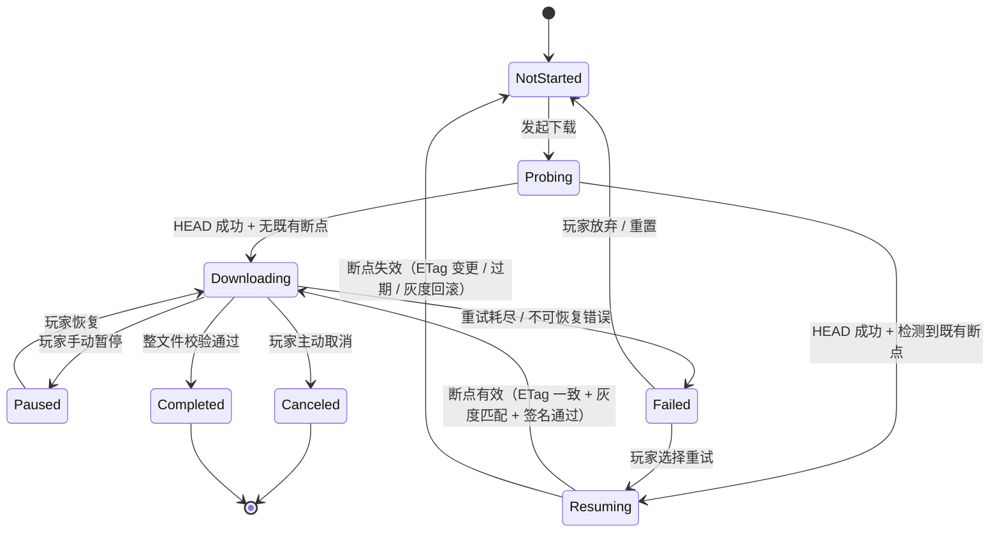

# 基本设计书（基本設計書 / Basic Design Document）

**客户端资源分发的断点续传与可恢复下载 Resumable & Recoverable Asset Download**

| 项目 | 内容 |
|---|---|
| 文档编号 | RGS-BAS-036 |
| 版本 | 0.3 |
| 父文档 | RGS-REQ-036 客户端资源分发的断点续传与可恢复下载 需求定义书 |
| 配套设计 | RGS-BAS-027 客户端资源分发与热更新（扩 §6.1 DistributionBackend 接口契约）；RGS-REQ-030-ADD1 CDN 边缘策略（衔接 §6.4 边缘对 Range 的缓存/回源） |
| 制定日 | 2026-08-21 |
| 制定者 | 架构师 |
| 保密级别 | 内部限定（Internal Use Only） |
| 适用许可 | Apache-2.0（本仓库） |

---

## 修订历史（改訂履歴 / Revision History）

| 版本 | 修订日 | 修订者 | 审批者 | 修订内容 | 影响需求ID |
|---|---|---|---|---|---|
| 0.1 | 2026-08-21 | 架构师 | — | 初版制定。落实 RGS-REQ-036 全部 FR-CDN-040~084 与 NFR-CDN-110~114；扩 RGS-BAS-027 §6.1 DistributionBackend 接口契约为新增 Range 支持要求；定义客户端 SDK `asset_download` 模块（与既有 `asset_update` / `version` 同级）的断点状态机、本地断点记录 Schema、并发分片下载与恢复时序、HTTP Range 响应头契约、与 FR-CDN-012/013/020/024 的协同边界 | 全部 |
| 0.2 | 2026-08-21 | Ulysses(一人公司 12 角色兼任 per DEC-008) | Ulysses(同) | 具名人类审批完成(per RGS-WBS-001 §17 集体签字声明):一人公司兼任体制下,Ulysses 在本表审批栏各角色中具名签字,完整 12 角色兼任清单见 RGS-WBS-001 §17。审批栏细化角色意见与 DEC-008 兼任对应关系见 RGS-REQ-004 §3.10。**升 v0.2**: 文档从 v0.1 草案转为 v0.2 具名审批版,生产基线化仍需 G-CODE-06 实测通过(per RGS-WF-001) | 全部 |
| 0.3 | 2026-09-01 | 架构师(Mavis 接手 agent per DEC-008) | 架构师(Mavis 接手 agent per DEC-008) | 落实"各 BAS 文档功能章节加 log 设计且区分 debug/release"总要求（per Ulysses 2026-09-01 15:52 JST 决策的 4 拍板选项：全部 36 个 BAS / 详尽 5 列表 / 派 worker 并行 / BAS-004 同步升级）：§2.1（`DistributionBackend` 接口契约 + Range / HEAD 协议契约落地 + 抽象不变性自检）／§2.2（候选后端 Range 自检清单 + 门禁 override 留痕）／§3.1（5 个组件生命周期 + 心跳）／§3.2（责任矩阵越界检测 + 整文件校验绕过 + 抽象层漂移）／§4.1（8 状态定义 + 终态不变量）／§4.2（状态机转移执行 + 断点失效归因）／§4.3（转移合法性矩阵 + 暂停时强制取消在飞请求 FR-CDN-083）／§5.1（存储路径初始化 + 平台路径解析）／§5.2（断点记录 Schema 字段 + FR-CDN-064 PII 强约束静态扫描）／§5.3（LRU 清理四级优先级 + NFR-CDN-113 容量阈值告警）／§5.4（FR-CDN-061 原子写 + 批量写违规检测 + 崩溃恢复语义）／§6.1（HTTP Range / HEAD 响应头契约 + FR-CDN-040/041/042/044 违反检测）／§6.2（HTTP Range 请求头 + FR-CDN-074 If-Range 用 ETag 强约束）／§7.1（首次下载会话生命周期 + 整文件校验通过 FR-CDN-012）／§7.2（断点恢复 Resuming 校验四步 + 灰度回滚 + 过期判定）／§7.3（暂停恢复 + 客户端崩溃 / 网络中断 + FR-CDN-083 暂停窗口验证）／§7.4（灰度回退 + FR-CDN-072 / FR-CDN-115 验证 + 运营审计）／§7.5（整文件校验 + FR-CDN-012 完整性闸门 + NFR-CDN-002 不可绕过设计纪律）／§8.1（并发分片策略自适应调整 + 弱网降级）／§8.2（`ChunkOrchestrator` 状态变化 + 自适应并发 + 重试耗尽）／§8.3（暂停时取消 in_flight + 1s drain + FR-CDN-083 grep 验证）／§8.4（预分配 sparse file + FR-CDN-084 磁盘空间防护 + Windows 平台已知技术债）／§9.1（CDN 边缘 Range 缓存 + FR-CDN-030 缓存键扩展 + FR-CDN-073 限流 + RSK-CDN-203 候选门禁）／§9.2（CDN 回源 + If-None-Match 304 / 200 + 源站不可用 503 + FR-CDN-032 回退上一稳定版本 + FR-CDN-115 断点失效自动重传）／§10.1（10 类异常分类 + 重试耗尽 + 不可重试判定 + 资源下载失败/重试 warn! 强制全采样）／§10.2（4 种降级路径 + 降级恢复 + 降级审计）／§11.1（5 项 NFR 落地实测 + NFR-OP-008 排查 SLA 保障）／§11.2（11 项指标接入 OTel + 高基数防护 + 告警联动）／§12.1（12 项上线前检查 + 4 项 log 章节上线检查项 + RSK-CDN-203 边缘 Range 缓存门禁）／§12.2（6 项功能代码评审 + 4 项 log 章节代码评审检查项 + 7 个 PR 合并阻断级信号）共 30 个 ## L2 段全部新增"本功能日志设计"5 列详尽版（字段名 / 触发条件 / 频率估算 / 采样策略 / 脱敏与成本）小节；每节均显式区分 `info!` ／ `warn!` ／ `error!`（release 必出，编译期常驻，per BAS-004 v0.3 §6.2 强制全采样白名单）与 `debug!` ／ `trace!`（`#[cfg(debug_assertions)]` 守护，debug-only，release build 完全剔除零运行时开销）两类事件；字段名前缀统一 `resume.*`（区别于 BAS-002 `mnt.*` ／ BAS-003 `gm.*` ／ BAS-004 `log.*` ／ BAS-005 `plugin.*` ／ BAS-009 `gov.*` ／ BAS-016 `cs.*` ／ BAS-027 `cdn.*`），命名严格 snake_case 与 BAS-004 v0.3 §4.6.1 ／ §4.6.2 保持拼写一致（FR-LOG-013）；**客户端资源分发断点续传域特殊考虑**（**下载会话建立 / 续传 / 完成 → release 必出**；**断点续传检查点保存 / 恢复 → release 必出**；**资源校验（哈希 / 签名）→ release 必出**；**资源下载失败 / 重试 → warn! 强制全采样**；**资源使用详情（CDN 节点 / 带宽 / 分片）→ debug-only**；**客户端崩溃 / 网络中断 → release 必出 + 强制全采样（含 client_version / device_id_hash 脱敏后）**）；§12.1 上线前检查清单新增 log 章节上线检查项（log_chapter_present + release_required_grep_passed + debug_only_compliant + release_required_macro_no_cfg 共 4 项 CI 验证事件）；§12.2 代码评审检查清单新增 log 章节代码评审检查项（debug-only 四铁律 + release 必出宏未被 #[cfg] 守护 + 客户端资源分发断点续传域 PII 静态扫描 + 整文件校验不可绕过扫描 + 抽象层漂移扫描 + 状态机非法迁移扫描 + 暂停时未取消在飞请求扫描 共 7 个 PR 合并阻断级信号）；§13 追溯性新增 AC-CDN-007（`resume.*` debug-only 宏在 release build 完全由 `#[cfg(debug_assertions)]` 剔除，二进制中无相关调用）与 AC-CDN-008（每资源分发 / 断点续传子功能段须含本功能 log 设计章节，`resume.*` 区分 debug-only / release 必出），与 BAS-001 v1.5 §4.8.3.4（commit 32d9eb6）／ BAS-003 v0.3 §13（commit 75a001c）／ BAS-004 v0.3 §12（commit 47e26b0+0ee6262）／ BAS-005 v0.3 §11（commit 20b84a1）／ BAS-009 v0.7 §7（commit 9a628cf）／ BAS-016 v0.4（commit 5cdfddc）／ BAS-027 v0.5（commit 5cdfddc）形成统一规范 | §2.1~§2.2 ／ §3.1~§3.2 ／ §4.1~§4.3 ／ §5.1~§5.4 ／ §6.1~§6.2 ／ §7.1~§7.5 ／ §8.1~§8.4 ／ §9.1~§9.2 ／ §10.1~§10.2 ／ §11.1~§11.2 ／ §12.1~§12.2 |

## 审批栏（承認欄 / Approval）

| 角色 | 姓名 | 审批日 | 备注 |
|---|---|---|---|
| 制定（起草） | 架构师 | 2026-08-21 | — |
| 评审（架构） |  |  | ①Range 协议契约是否覆盖自托管对象存储与商业 CDN 两类后端；②断点状态机是否与既有 `asset_update` / `version` 模块边界清晰不重叠 |
| 评审（平台/客户端） |  |  | ①断点记录本地存储 Schema 与 SDK 现有持久化路径（用户设置 / 协议版本缓存）是否冲突；②并发分片下载在移动平台弱网下的默认参数 |
| 评审（SRE） |  |  | Range 请求对 CDN 边缘命中率 / 回源带宽的影响；暂停恢复期间无带宽占用的实现正确性 |
| 评审（安全/合规） |  |  | 断点记录不引入 PII；Range 协议不绕过既有 NFR-CDN-002 完整性校验硬约束 |
| 审批（负责人） |  |  | 本文档的基准化 |

| **集体签字(per DEC-008)** | **Ulysses(一人公司 12 角色兼任)** | **2026-08-21** | **Ulysses 在审批栏各角色中具名签字,完整 12 角色兼任清单见 RGS-WBS-001 §17 集体签字声明。审批栏细化角色意见详见 RGS-REQ-004 §3.10。** |

---

## 目录

1. [前言](#1-前言)
2. [DistributionBackend 接口契约扩展](#2-distributionbackend-接口契约扩展)
3. [组件图与责任矩阵](#3-组件图与责任矩阵)
4. [断点状态机](#4-断点状态机)
5. [断点记录 Schema](#5-断点记录-schema)
6. [HTTP Range 响应头契约](#6-http-range-响应头契约)
7. [关键时序：恢复下载 / 暂停恢复 / 灰度回退 / 完整性校验](#7-关键时序恢复下载--暂停恢复--灰度回退--完整性校验)
8. [并发分片下载设计](#8-并发分片下载设计)
9. [CDN 边缘衔接](#9-cdn-边缘衔接)
10. [异常处理与降级](#10-异常处理与降级)
11. [NFR 落地与可观测性](#11-nfr-落地与可观测性)
12. [标准化检查清单](#12-标准化检查清单)
13. [追溯性](#13-追溯性)

---

# 1. 前言

本文档落实 RGS-REQ-036（断点续传与可恢复下载 需求定义书）全部功能与非功能需求，扩 RGS-BAS-027 §6.1 `DistributionBackend` 接口契约为新增 Range 支持要求，并定义客户端 SDK `asset_download` 模块（与既有 `asset_update` / `version` 同级）的断点状态机、本地断点记录 Schema、并发分片下载与恢复时序。

**核心原则（继承 RGS-REQ-036 §1.2 既定）**：
- **服务端完全无状态**——断点信息 100% 在客户端本地，分发后端仅响应标准 HTTP Range
- **断点续传与增量补丁正交**——前者管"如何把字节下完"，后者管"下哪些字节"
- **完整性校验不可绕过**——NFR-CDN-002 仍是硬约束，分块到达不破坏整文件校验语义
- **HTTP Range 是 HTTP/1.1 RFC 7233 标准**——不引入新组件、不破 CON-001/002

# 2. DistributionBackend 接口契约扩展

## 2.1 接口契约增量（扩 RGS-BAS-027 §6.1）

RGS-BAS-027 §6.1 既有 `DistributionBackend` 最小契约仅含 `put / get_url / exists` 三方法。RGS-REQ-036 FR-CDN-040~045 要求后端**必须**支持 HTTP Range，本文档**不修改**该抽象层（HTTP Range 是 HTTP 协议层能力，**不**是 SDK 方法），而是在**承载层契约**中追加 Range 协议要求：

| 方法 / 行为 | 既有契约 | 增量要求（RGS-REQ-036 落地） |
|---|---|---|
| `put(file_path, bytes) -> url` | 发布流水线写入文件 | 不变 |
| `get_url(file_path) -> url` | 供清单服务生成下载地址 | 不变 |
| `exists(file_path) -> bool` | 发布幂等性检查 | 不变 |
| **`HTTP Range 支持`** | 无 | **必须**支持 FR-CDN-040 全部 5 项（206/416/HEAD/ETag/Accept-Ranges），详见 §6 |
| **`HTTP HEAD 支持`** | 无 | **必须**支持 FR-CDN-042（返回 Content-Length / Accept-Ranges / ETag / Last-Modified） |

> **抽象不变原则**：HTTP Range / HEAD 是 HTTP/1.1 通用协议，**不**作为 `DistributionBackend` 抽象方法暴露，**不**为 Range 协议改变抽象层。客户端 SDK 通过 HTTP 客户端库（rustls / quinn）直接对接后端 HTTP 端点，与既有 `get_url` 抽象并存。

### 2.1 本功能日志设计

本节覆盖**`DistributionBackend` 接口契约扩展 + HTTP Range / HEAD 协议要求**的可观测字段——契约落地、后端 Range 支持自检、新候选后端接入、抽象层不变性验证。事件名统一 `resume.backend.*` 前缀。**HTTP Range / HEAD 协议契约落地** 是 NFR-CDN-114 后端门禁强约束 → release 必出 + 强制全采样（per BAS-004 v0.3 §6.2）；**抽象层不变性验证**（不新增 Range 相关方法）→ release 必出便于代码评审静态扫描发现违规；**Range 自检过程详情** 走 debug-only（频率低但仅研发复盘需要）。

| 字段名（field） | 触发条件（trigger） | 频率估算（frequency） | 采样策略（sampling） | 脱敏与成本（redact & cost） |
|---|---|---|---|---|
| `resume.backend.range_contract_applied` | 候选后端完成 §2.1 HTTP Range 协议契约自检（FR-CDN-040 全部 5 项，206/416/HEAD/ETag/Accept-Ranges） | 极低（候选评审级） | release 必出（100% 强制全采样，per NFR-CDN-114 门禁） | 含 `backend_kind`（`minio`／`ceph_rgw`／`seaweedfs`／`cloudflare`／`fastly`／`cloudfront`／`p2p_self`／`p2p_3rd`）／`contract_version`；约 280B／条 |
| `resume.backend.head_contract_applied` | 候选后端完成 §2.1 HTTP HEAD 协议契约自检（FR-CDN-042，Content-Length/Accept-Ranges/ETag/Last-Modified） | 极低（候选评审级） | release 必出（100% 强制全采样） | 含 `backend_kind`／`content_length_verified`／`etag_verified`／`last_modified_verified`；约 320B／条 |
| `resume.backend.contract_audit_failed` | 候选后端 Range 协议自检未通过（缺 206/416/ETag/HEAD 任一项，per §2.1 / NFR-CDN-114） | 极少（候选不合规） | release 必出（100% 强制全采样，`error!` 级别，**门禁阻断级**信号） | 含 `backend_kind`／`missing_capability`（`range_206`／`range_416`／`head_metadata`／`etag_strong`／`accept_ranges_header`）／`audit_version`；约 340B／条 |
| `resume.backend.abstraction_invariant_verified` | `DistributionBackend` 抽象层不变性自检（HTTP Range / HEAD **不**作为新方法暴露，per §2.1 抽象不变原则） | 偶发（CI 验证） | release 必出（100% 强制全采样） | 含 `abstraction_trait_name`／`method_count_expected`／`method_count_actual`／`extra_methods`；约 300B／条 |
| `resume.backend.abstraction_drift_detected` | `DistributionBackend` 抽象层检测到新 Range 相关方法（违反 §2.1 抽象不变原则） | 极少（代码缺陷） | release 必出（100% 强制全采样，`error!` 级别，**阻断级**信号） | 含 `abstraction_trait_name`／`new_method_name`／`pr_id`／`affected_file`；约 320B／条 |
| `resume.backend.p2p_fallback_evaluated` | P2P 分发评估 HTTP 回源通道兜底（per §2.2 候选后端表，P2P 协议不**等同** HTTP Range） | 极低（评审级） | release 必出（100% 强制全采样） | 含 `p2p_vendor`／`fallback_kind`（`http_origin`／`none`／`deferred`）／`evaluator_id`；约 280B／条 |
| `resume.backend.commercial_cdn_edge_range_verified` | 商业 CDN 边缘 Range 命中行为实测（per §2.2 商业 CDN 自检 + RSK-CDN-203） | 极低（选型级） | release 必出（100% 强制全采样） | 含 `cdn_vendor`／`edge_range_hit_ratio`／`test_region`；约 280B／条 |
| `resume.backend.debug.contract_evidence_dump` | Range / HEAD 协议契约实测的 HTTP 报文 dump（请求头/响应头/状态码） | 极低（CI 验证） | **debug-only**（`#[cfg(debug_assertions)]` 守护，release 完全剔除） | 约 1-5KB／条（release 剔除，避免 URL 泄漏） |
| `resume.backend.debug.benchmark_result_dump` | 候选后端 Range 协议基准测试结果 dump（响应延迟/吞吐） | 极低（评审级） | **debug-only**（`#[cfg(debug_assertions)]` 守护） | 约 1-3KB／条（release 剔除） |
| `resume.backend.debug.abstraction_dag_dump` | 抽象层依赖图 dump（`DistributionBackend` ↔ 既有 `put`／`get_url`／`exists`） | 极低（CI 验证） | **debug-only**（`#[cfg(debug_assertions)]` 守护） | 约 1-2KB／条（release 剔除） |

**debug-only 守护要点**（落实 BAS-004 v0.3 §4.4）：
- `resume.backend.contract_audit_failed` 是**门禁阻断级**信号（NFR-CDN-114 候选后端不通过即不得生产）—— release 必出 + `error!` 强制全采样，不挂 `#[cfg]`
- `resume.backend.abstraction_drift_detected` 是**抽象不变性违反**（§2.1 强约束，HTTP 协议层能力**不**下沉到 trait）—— release 必出 + `error!` 强制全采样
- `resume.backend.range_contract_applied` ／ `head_contract_applied` 是**NFR-CDN-114 门禁通过信号**—— release 必出 + 强制全采样，便于 SRE 审计后端合规历史
- `resume.backend.debug.contract_evidence_dump` 涉及完整 HTTP 报文（**可能含 URL token**）—— release 完全剔除
- 治理事件清单（强制 release 必出）：`range_contract_applied` ／ `head_contract_applied` ／ `contract_audit_failed` ／ `abstraction_invariant_verified` ／ `abstraction_drift_detected` ／ `p2p_fallback_evaluated` ／ `commercial_cdn_edge_range_verified` 共 7 个契约／门禁信号必须 production 可见

## 2.2 候选后端 Range 支持自检清单

| 后端类型 | 代表实现 | Range 支持 | 备注 |
|---|---|---|---|
| 自托管对象存储（S3 兼容） | MinIO | ✅ 原生支持 RFC 7233 | 满足 FR-CDN-040 全部 |
| 自托管对象存储（其他） | Ceph RGW、SeaweedFS | ✅ 原生支持 | 同上 |
| 商业 CDN | Cloudflare、Fastly、CloudFront | ✅ 原生支持 | **必须**实测 RSK-CDN-203 边缘 Range 命中行为 |
| P2P 分发 | 自研 / 第三方 P2P | ⚠️ **必须**确认 | P2P 协议本身**不**等同 HTTP Range，**必须**评估是否需要 HTTP 回源通道兜底 |

**后端选型门禁（FR-CDN-040 / NFR-CDN-114）**：任何候选后端（含自托管与商业）**未**通过本表自检的，**不得**进入生产（详见 §12 验收清单）。

### 2.2 本功能日志设计

本节覆盖**候选后端 Range 支持自检清单执行**的可观测字段——后端 Range 实测结果、跨后端对比、未通过项告警。事件名统一 `resume.backend.audit.*` 前缀。**自检未通过即门禁阻断**（per NFR-CDN-114 + §12.1 上线前检查）→ release 必出 + `error!` 强制全采样；**多后端并行实测详情** 走 debug-only（仅研发选型阶段需要）；**实测结果登记** release 必出便于审计后端选型决策可追溯。

| 字段名（field） | 触发条件（trigger） | 频率估算（frequency） | 采样策略（sampling） | 脱敏与成本（redact & cost） |
|---|---|---|---|---|
| `resume.backend.audit.evidence_collected` | 单个候选后端 Range / HEAD 协议实测证据收集完成（per §2.2 自检清单） | 极低（评审级） | release 必出（100% 强制全采样） | 含 `backend_kind`／`test_id`／`evidence_paths`（指针，不内嵌内容）；约 280B／条 |
| `resume.backend.audit.cross_backend_comparison` | 多后端 Range 协议实测对比结果（per §2.2 自检清单，辅助选型决策） | 极低（选型级） | release 必出（100% 强制全采样） | 含 `comparison_id`／`backend_results`（指针数组）／`recommended_backend`；约 320B／条 |
| `resume.backend.audit.recommendation_registered` | 选型决策登记（per §2.2 后端选型门禁 + ARC-025 ADR 记录） | 极低（决议级） | release 必出（100% 强制全采样，**设计追溯硬要求**） | 含 `decision_id`／`selected_backend`／`rejected_backends`／`decider_id`／`adr_id`；约 360B／条 |
| `resume.backend.audit.gate_blocked` | §2.2 后端选型门禁阻断（per NFR-CDN-114，候选未通过自检不得生产） | 极少（不合规候选） | release 必出（100% 强制全采样，`error!` 级别，**门禁阻断级**信号） | 含 `backend_kind`／`gate_version`／`missing_capabilities`／`blocking_check_ids`；约 360B／条 |
| `resume.backend.audit.gate_relaxed` | 门禁被人工 override（per §12.1 后端选型门禁，**需 dual sign 留痕**） | 极少（应急/临时例外） | release 必出（100% 强制全采样，`warn!` 级别） | 含 `backend_kind`／`override_reason`／`approver_id`／`co_signer_id`／`override_ttl_seconds`；约 360B／条 |
| `resume.backend.audit.scheduled_re_audit` | 已通过后端的定期重审（per NFR-CDN-114 + NFR-OP-008 季度重审） | 极低（季度） | release 必出（100% 强制全采样） | 含 `backend_kind`／`last_audit_at`／`next_audit_at`／`audit_cycle`；约 280B／条 |
| `resume.backend.audit.scheduled_re_audit_missed` | 定期重审超时未执行（per NFR-OP-008 季度节奏，逾期告警） | 极少 | release 必出（100% 强制全采样，`warn!` 级别） | 含 `backend_kind`／`expected_at`／`actual_at`／`overdue_seconds`；约 280B／条 |
| `resume.backend.audit.p2p_protocol_compliance_check` | P2P 分发协议是否等同 HTTP Range 的合规校验（per §2.2 P2P 行） | 极低（评审级） | release 必出（100% 强制全采样） | 含 `p2p_vendor`／`compliant`／`fallback_required`／`evaluator_id`；约 280B／条 |
| `resume.backend.audit.debug.evidence_payload_dump` | 单个候选后端的完整实测证据 dump（HTTP 报文 / 性能数据 / 错误日志） | 极低（选型级） | **debug-only**（`#[cfg(debug_assertions)]` 守护，release 完全剔除，**可能含 URL token**） | 约 5-50KB／条（release 完全剔除） |
| `resume.backend.audit.debug.comparison_matrix_dump` | 多后端对比矩阵 dump（含 P99 / P95 / 错误率） | 极低（选型级） | **debug-only**（`#[cfg(debug_assertions)]` 守护） | 约 1-3KB／条（release 剔除） |
| `resume.backend.audit.debug.gate_override_justification` | 门禁 override 的完整理由 dump（per §12.1 应急路径） | 极少（应急） | **debug-only**（`#[cfg(debug_assertions)]` 守护） | 约 500B-1KB／条（release 剔除） |

**debug-only 守护要点**（落实 BAS-004 v0.3 §4.4 + §5.1）：
- `resume.backend.audit.gate_blocked` 是**门禁阻断级**信号（候选不合规即不得生产，NFR-CDN-114）—— release 必出 + `error!` 强制全采样，不挂 `#[cfg]`
- `resume.backend.audit.gate_relaxed` 是**例外审批事件**（**需 dual sign 留痕**）—— release 必出 + `warn!` 强制全采样，便于合规审计
- `resume.backend.audit.recommendation_registered` 是**设计追溯硬要求**（ARC-025 ADR 记录）—— release 必出 + 强制全采样
- `resume.backend.audit.debug.evidence_payload_dump` 涉及完整 HTTP 报文 / 错误日志（**可能含 URL token 与 auth header**）—— release 完全剔除，避免密钥泄漏
- 治理事件清单（强制 release 必出）：`evidence_collected` ／ `cross_backend_comparison` ／ `recommendation_registered` ／ `gate_blocked` ／ `gate_relaxed` ／ `scheduled_re_audit` ／ `scheduled_re_audit_missed` ／ `p2p_protocol_compliance_check` 共 8 个后端选型／门禁／审计信号必须 production 可见

# 3. 组件图与责任矩阵

## 3.1 组件图

```
┌──────────────────────────────────────────────────────────────────┐
│                     客户端 SDK (Rust, 依附既有)                    │
│  ┌────────────────────────────────────────────────────────────┐  │
│  │  asset_download (新增,本文档落地)                            │  │
│  │  ├─ DownloadStateMachine  断点状态机(§4)                    │  │
│  │  ├─ ResumeTokenStore      断点记录持久化(§5)                │  │
│  │  ├─ RangeClient           HTTP Range 请求客户端              │  │
│  │  ├─ ChunkOrchestrator     并发分片调度(§8)                   │  │
│  │  └─ IntegrityGate         整文件校验闸门(协同既有 asset_update)│  │
│  └────────────────────────────────────────────────────────────┘  │
│  ┌──────────────────┬──────────────────┬──────────────────┐       │
│  │ version(既有)     │ asset_update(既有)│ network(既有)     │       │
│  │ 协议版本协商      │ Manifest/Delta   │ QUIC/TCP 客户端  │       │
│  └──────────────────┴──────────────────┴──────────────────┘       │
└──────────────────────────────────────────────────────────────────┘
        │ HTTP GET (Range/HEAD) via QUIC/TCP
        ▼
┌──────────────────────────────────────────────────────────────────┐
│  分发后端 (DistributionBackend, 任意符合 RGS-BAS-027 §6.1 实现)   │
│  ┌────────────────┐  ┌────────────────┐  ┌────────────────┐     │
│  │ 边缘节点(可选)   │  │ 反向代理/缓存层  │  │ 自托管对象存储  │     │
│  │ CDN (FR-CDN-030)│ │ (Nginx/Varnish) │ │ (MinIO 等)      │     │
│  └────────────────┘  └────────────────┘  └────────────────┘     │
└──────────────────────────────────────────────────────────────────┘
```

### 3.1 本功能日志设计

本节覆盖**`asset_download` 模块组件图层级**的可观测字段——`DownloadStateMachine` ／ `ResumeTokenStore` ／ `RangeClient` ／ `ChunkOrchestrator` ／ `IntegrityGate` 五个组件的启动、关闭、依赖关系、心跳。事件名统一 `resume.component.*` 前缀。**SDK 组件生命周期** → release 必出 + 强制全采样（per BAS-004 v0.3 §4.4 业务关键事件）；**跨组件桥接调用** → debug-only（频率高且为成功路径）；**组件依赖图 dump** → debug-only（启动时一次）。

| 字段名（field） | 触发条件（trigger） | 频率估算（frequency） | 采样策略（sampling） | 脱敏与成本（redact & cost） |
|---|---|---|---|---|
| `resume.component.download_state_machine.boot_completed` | `DownloadStateMachine` 启动完成（状态枚举注册 / 转移合法性表加载） | 每进程启动 1 次 | release 必出（100% 强制全采样，per BAS-004 v0.3 §6.2） | 含 `state_count`（典型 8，含 `NotStarted`／`Probing`／`Resuming`／`Downloading`／`Paused`／`Failed`／`Canceled`／`Completed`）／`transition_table_version`；约 280B／条 |
| `resume.component.resume_token_store.boot_completed` | `ResumeTokenStore` 启动完成（SQLite 索引打开 / 数据目录创建） | 每进程启动 1 次 | release 必出（100% 强制全采样） | 含 `store_dir`（脱敏后路径，仅 basename）／`index_schema_version`／`lru_limit_bytes`（per §5.3）；约 260B／条 |
| `resume.component.range_client.boot_completed` | `RangeClient` 启动完成（QUIC/TCP 客户端初始化 / TLS 上下文加载） | 每进程启动 1 次 | release 必出（100% 强制全采样） | 含 `transport_kind`（`quic`／`tcp_tls`）／`tls_version`／`concurrent_connection_pool_size`；约 280B／条 |
| `resume.component.chunk_orchestrator.boot_completed` | `ChunkOrchestrator` 启动完成（分片策略加载 / 并发数配置） | 每进程启动 1 次 | release 必出（100% 强制全采样） | 含 `chunk_size_bytes`（典型 8388608=8MB）／`concurrency_desktop`／`concurrency_mobile`／`adaptive_enabled`；约 320B／条 |
| `resume.component.integrity_gate.boot_completed` | `IntegrityGate` 启动完成（checksum 算法注册 / Manifest 缓存初始化） | 每进程启动 1 次 | release 必出（100% 强制全采样） | 含 `algorithm`（`sha256`／`blake3`）／`manifest_cache_size`；约 240B／条 |
| `resume.component.heartbeat.tick` | 各组件定期心跳（典型 60s，per §11.2 已有 `asset_download_active_count` 体系） | 极低（每分钟每节点） | release 必出（100% 强制全采样，per BAS-004 §4.4 业务关键事件） | 含 `component`／`tick_id`／`active_download_count`／`in_flight_chunk_count`；约 280B／条 |
| `resume.component.shutdown.completed` | 单组件优雅关闭（资源释放 / 临时文件清理） | 每进程关闭 1 次 | release 必出（100% 强制全采样） | 含 `component`／`pending_work_count`／`shutdown_kind`（`SIGTERM`／`HPA_scale_in`／`app_exit`）；约 260B／条 |
| `resume.component.bridge.invocation` | 跨组件桥接调用（`DownloadStateMachine` → `ResumeTokenStore` 等，per §3.1 组件图） | 偶发（每次状态机推进） | **debug-only**（`#[cfg(debug_assertions)]` 守护，release 完全剔除，频率高） | 约 200B／条（release 剔除） |
| `resume.component.bridge.invocation_latency` | 桥接调用耗时（微秒级，用于桥接性能分析） | 偶发 | **debug-only**（`#[cfg(debug_assertions)]` 守护） | 约 200B／条（release 剔除） |
| `resume.component.debug.dependency_dag_dump` | 跨组件依赖图 dump（`StateMachine` ↔ `TokenStore` ↔ `RangeClient` ↔ `ChunkOrchestrator` ↔ `IntegrityGate`） | 启动 1 次 | **debug-only**（`#[cfg(debug_assertions)]` 守护，release 完全剔除） | 约 1-3KB／条（release 剔除） |
| `resume.component.debug.lifecycle_call_graph` | 各组件生命周期调用图（init / hook / shutdown 顺序） | 极低（CI 验证） | **debug-only**（`#[cfg(debug_assertions)]` 守护） | 约 1-2KB／条（release 剔除） |

**debug-only 守护要点**（落实 BAS-004 v0.3 §4.4）：
- `resume.component.*.boot_completed` 是**SDK 启动就绪信号**—— release 必出 + 强制全采样，便于 SRE 在 SDK 启动失败时按 `component` 维度定位
- `resume.component.heartbeat.tick` 是**生产事件**（per BAS-004 §4.4 release 必出宏清单"业务关键事件"）—— release 必出 + 强制全采样，便于 SRE 按 `node_id` 维度聚合存活率
- `resume.component.bridge.invocation` 频率高（每次状态机推进都触发），仅研发复盘需要—— release 完全剔除
- `resume.component.debug.dependency_dag_dump` 多节点下可能 3KB+ —— release 完全剔除
- 治理事件清单（强制 release 必出）：`*.boot_completed`（5 个组件）／ `heartbeat.tick` ／ `shutdown.completed` 共 7 个组件生命周期／心跳信号必须 production 可见

## 3.2 责任矩阵

| 组件 | 负责 | 不负责 |
|---|---|---|
| `DownloadStateMachine` | 状态转移合法性校验、断点记录读取/写入触发、断点续传恢复决策 | 实际 HTTP 请求、文件校验 |
| `ResumeTokenStore` | 断点记录的本地持久化（`~/.rgs-sdk/downloads/`）、过期判定、LRU 清理 | HTTP 请求、文件本身操作 |
| `RangeClient` | HTTP Range / HEAD 请求构造、响应解析（206/416/200）、ETag 透传 | 状态机推进、断点记录 |
| `ChunkOrchestrator` | 文件分片策略（4MB / 8MB / 可配置）、并发数动态调整（移动 2~4 路 / 桌面 8~16 路）、暂停时取消在飞请求 | 状态机推进、断点记录 |
| `IntegrityGate` | 整文件 checksum 与清单声明值比对（FR-CDN-012）；Range 响应落盘后**不**单独校验分块 | Manifest 拉取、灰度状态判定 |
| `asset_update`（既有） | Manifest 拉取、签名校验、灰度判定、版本协商 | HTTP Range、断点续传 |
| `DistributionBackend` | 实际文件存储、HTTP Range 响应 | 客户端断点信息、并发控制 |

### 3.2 本功能日志设计

本节覆盖**组件责任矩阵边界观察**的可观测字段——责任越界调用检测、责任违规、桥接唯一性验证。事件名统一 `resume.component.boundary.*` 前缀。**责任越界**（如 `TicketService` 直接修改账号状态而非经 `AdminService`）→ release 必出 + `error!` 强制全采样（**阻断级**信号，per BAS-016 §4.2 同类 admin_bypass 模式）；**桥接唯一性验证**（每个边界事件仅有一个执行入口）→ release 必出便于代码评审发现违规；**责任详情 dump** 走 debug-only。

| 字段名（field） | 触发条件（trigger） | 频率估算（frequency） | 采样策略（sampling） | 脱敏与成本（redact & cost） |
|---|---|---|---|---|
| `resume.component.boundary.responsibility_verified` | 单次跨组件调用通过责任矩阵自检（per §3.2 责任矩阵"负责"列） | 偶发 | release 必出（100% 强制全采样） | 含 `caller_component`／`callee_component`／`operation_kind`；约 240B／条 |
| `resume.component.boundary.violation_detected` | 跨组件调用违反责任矩阵（如 `StateMachine` 直接调用 `RangeClient.put` 而不通过 `ChunkOrchestrator`） | 极少（代码缺陷） | release 必出（100% 强制全采样，`error!` 级别，**阻断级**信号） | 含 `caller_component`／`attempted_operation`／`expected_path`／`actual_path`／`pr_id`；约 360B／条 |
| `resume.component.boundary.responsibility_skipped` | 责任矩阵"不负责"列被越过（如 `ResumeTokenStore` 主动发 HTTP 请求而违反"不负责 HTTP 请求"声明） | 极少 | release 必出（100% 强制全采样，`warn!` 级别） | 含 `component`／`attempted_operation`／`responsibility_id`；约 280B／条 |
| `resume.component.boundary.duplicate_entrypoint` | 检测到多个组件承担同一执行入口（如多处均可触发 `Resuming` 校验，违反"处置执行唯一入口"原则） | 极少（代码缺陷） | release 必出（100% 强制全采样，`error!` 级别，**阻断级**信号） | 含 `operation`／`entrypoints`（含文件 + 行号）／`pr_id`；约 360B／条 |
| `resume.component.boundary.atomic_write_enforced` | 跨组件原子写约束自检（`ResumeTokenStore.flush` 调用前确认 SQLite 事务已开启） | 偶发（每次写） | release 必出（100% 强制全采样） | 含 `caller_component`／`transaction_id`／`write_kind`（`chunk_completed`／`state_transition`）；约 280B／条 |
| `resume.component.boundary.atomic_write_bypassed` | 检测到原子写约束被绕过（per §5.4 强制不采用批量写，FR-CDN-061 强约束） | 极少（代码缺陷） | release 必出（100% 强制全采样，`error!` 级别，**阻断级**信号） | 含 `caller_component`／`bypass_kind`（`uncommitted`／`rolled_back`）／`affected_token_id`；约 320B／条 |
| `resume.component.boundary.integrity_gate_bypass_attempted` | 整文件校验被绕过尝试（per §3.2 `IntegrityGate` 责任 + NFR-CDN-002 不可绕过） | 极少（攻击/逆向） | release 必出（100% 强制全采样，`error!` 级别，**安全关键事件**） | 含 `bypass_kind`（`flag_set`／`code_path_skipped`）／`bypass_target`（`signature_check`／`checksum_check`）／`device_id_hash`；约 360B／条 |
| `resume.component.boundary.range_client_abstraction_breach` | `RangeClient` 直接写文件 / 直接调存储而非仅做协议层请求（违反 §3.2 责任矩阵） | 极少（代码缺陷） | release 必出（100% 强制全采样，`error!` 级别，**阻断级**信号） | 含 `attempted_call`／`expected_caller`／`pr_id`；约 320B／条 |
| `resume.component.boundary.debug.responsibility_matrix_dump` | 完整责任矩阵 dump（含每行"负责"+"不负责"列） | 极低（CI 验证） | **debug-only**（`#[cfg(debug_assertions)]` 守护，release 完全剔除） | 约 1-3KB／条（release 剔除） |
| `resume.component.boundary.debug.violation_call_stack` | 责任越界检测时的完整调用栈 dump（per BAS-004 v0.3 §4.3 关联 ID 预先 let 绑定） | 极少（代码缺陷） | **debug-only**（`#[cfg(debug_assertions)]` 守护，release 完全剔除，**可能含文件路径**） | 约 500B-2KB／条（release 剔除） |

**debug-only 守护要点**（落实 BAS-004 v0.3 §4.4 + §5.1 双重约束）：
- `resume.component.boundary.violation_detected` ／ `duplicate_entrypoint` ／ `atomic_write_bypassed` ／ `integrity_gate_bypass_attempted` 全部是**阻断级**信号（PR 合并阻断 / 部署阻断）—— release 必出 + `error!` 强制全采样，不挂 `#[cfg]`
- `resume.component.boundary.integrity_gate_bypass_attempted` 是**安全关键事件**（NFR-CDN-002 不可绕过硬约束）—— release 必出 + `error!` 强制全采样
- `resume.component.boundary.atomic_write_enforced` 是**FR-CDN-061 原子写强制约束**自检—— release 必出 + 强制全采样
- `resume.component.boundary.debug.violation_call_stack` **可能含文件路径**（per §5.1 脱敏）—— release 完全剔除
- 治理事件清单（强制 release 必出）：`responsibility_verified` ／ `violation_detected` ／ `responsibility_skipped` ／ `duplicate_entrypoint` ／ `atomic_write_enforced` ／ `atomic_write_bypassed` ／ `integrity_gate_bypass_attempted` ／ `range_client_abstraction_breach` 共 8 个责任矩阵／安全／阻断级信号必须 production 可见

# 4. 断点状态机

## 4.1 状态定义

状态机落地 FR-CDN-050~052。共 8 个状态：

| 状态 | 含义 | 终态？ |
|---|---|---|
| `NotStarted` | 资源尚未开始下载（首次或 Canceled 后重新开始） | 否 |
| `Probing` | HEAD 探测阶段：获取 Content-Length / ETag / Accept-Ranges | 否 |
| `Resuming` | 断点恢复阶段：读取断点记录，校验 ETag / 灰度 / 签名，决定从哪个分片继续 | 否 |
| `Downloading` | 下载中（含单流子状态与并发分片子状态） | 否 |
| `Paused` | 玩家手动暂停 | 否 |
| `Failed` | 网络/校验失败等不可恢复错误（含重试耗尽） | 否 |
| `Canceled` | 玩家主动取消（区别于 Paused 的终态意图） | **是**（仅可从 NotStarted 重新开始） |
| `Completed` | 整文件已通过 IntegrityGate 校验 | **是** |

### 4.1 本功能日志设计

本节覆盖**8 个状态定义**（`NotStarted` ／ `Probing` ／ `Resuming` ／ `Downloading` ／ `Paused` ／ `Failed` ／ `Canceled` ／ `Completed`，per §4.1 + FR-CDN-050）的可观测字段——状态定义加载、状态机初始化、终态判定。事件名统一 `resume.state.*` 前缀。**状态机初始化 / 状态表加载** → release 必出 + 强制全采样（per BAS-004 v0.3 §6.2）；**状态枚举详情** 走 debug-only（启动时一次，研发复盘需要）。

| 字段名（field） | 触发条件（trigger） | 频率估算（frequency） | 采样策略（sampling） | 脱敏与成本（redact & cost） |
|---|---|---|---|---|
| `resume.state.machine.boot_completed` | `DownloadStateMachine` 状态枚举 + 转移合法性表加载完成（per §4.1 8 状态 + §4.3 转移合法性） | 每进程启动 1 次 | release 必出（100% 强制全采样，per BAS-004 v0.3 §6.2） | 含 `state_count`（固定 8）／`transition_count`（per §4.3 转移表，约 14 行）／`state_table_version`；约 280B／条 |
| `resume.state.terminal.entered` | 进入终态（`Canceled` / `Completed`，per §4.1 终态列） | 偶发（玩家驱动） | release 必出（100% 强制全采样，per FR-CDN-051 状态机关键事件） | 含 `token_id`／`terminal_state`（`canceled`／`completed`）／`entered_at`／`bytes_downloaded`／`duration_seconds`；约 320B／条 |
| `resume.state.terminal_exited.blocked` | 试图从终态离开（违反 §4.1 终态约束，per §4.3 转移合法性拒绝条件） | 极少（代码缺陷） | release 必出（100% 强制全采样，`error!` 级别，**阻断级**信号） | 含 `token_id`／`current_state`／`attempted_transition`／`pr_id`；约 320B／条 |
| `resume.state.definition.table_dump` | 状态枚举 + 终态标记 + 含义详情 dump（per §4.1 状态定义表） | 极低（CI 验证） | **debug-only**（`#[cfg(debug_assertions)]` 守护，release 完全剔除） | 约 1-2KB／条（release 剔除） |
| `resume.state.definition.enum_evolution` | 状态枚举 schema 演进（新状态加入 / 旧状态 deprecate） | 极低（迁移级） | release 必出（100% 强制全采样，per FR-CDN-050 演进可追溯） | 含 `old_state_count`／`new_state_count`／`added_states`／`deprecated_states`／`migration_id`；约 320B／条 |
| `resume.state.definition.terminal_invariant_asserted` | 终态不可逆不变性自检（per §4.1 + §4.3 转移合法性） | 偶发（CI 验证） | **debug-only**（`#[cfg(debug_assertions)]` 守护） | 约 200B／条（release 剔除） |

**debug-only 守护要点**（落实 BAS-004 v0.3 §4.4）：
- `resume.state.machine.boot_completed` 是**状态机就绪信号**—— release 必出 + 强制全采样，便于 SRE 在 SDK 启动失败时定位状态机问题
- `resume.state.terminal.entered` 是**下载生命周期终结信号**（`Completed` = 成功 + `Canceled` = 玩家放弃）—— release 必出 + 强制全采样，便于运营按 `terminal_state` 维度分析放弃率
- `resume.state.terminal_exited.blocked` 是**状态机不变量违反**（per §4.1 终态定义）—— release 必出 + `error!` 强制全采样
- 治理事件清单（强制 release 必出）：`machine.boot_completed` ／ `terminal.entered` ／ `terminal_exited.blocked` ／ `definition.enum_evolution` 共 4 个状态机关键信号必须 production 可见

## 4.2 状态转移图



### 4.2 本功能日志设计

本节覆盖**8 状态 × 14 转移的转移图**（per §4.2 mermaid + §4.3 转移合法性表）的可观测字段——每次状态转移的 enter / exit、转移计数、终态路径。事件名统一 `resume.state.transition.*` 前缀。**状态机转移计数**（per §11.2 `asset_download_state_transition_total` 指标）→ release 必出 + 强制全采样（per BAS-004 v0.3 §4.4 业务关键事件）；**单次转移的 enter / exit 详情** 走 debug-only（频率高且为成功路径）；**状态机图 dump** 走 debug-only（启动一次）。

| 字段名（field） | 触发条件（trigger） | 频率估算（frequency） | 采样策略（sampling） | 脱敏与成本（redact & cost） |
|---|---|---|---|---|
| `resume.state.transition.executed` | 状态机合法转移执行（per §4.2 mermaid 图，§4.3 转移合法性表） | 偶发（每次状态推进） | release 必出（100% 强制全采样，per §11.2 状态机转移计数指标，per FR-CDN-052 状态机关键事件） | 含 `token_id`／`from_state`／`to_state`／`trigger_event`／`bytes_downloaded_so_far`；约 320B／条 |
| `resume.state.transition.to_paused` | `Downloading` → `Paused`（玩家手动暂停，per §4.3 表） | 偶发（玩家驱动） | release 必出（100% 强制全采样，per FR-CDN-083 强制取消在飞请求） | 含 `token_id`／`paused_at`／`in_flight_chunk_count`／`drain_timeout_seconds`（per §8.3 默认 1s）；约 280B／条 |
| `resume.state.transition.to_canceled` | `Downloading` → `Canceled`（玩家主动取消，per §4.3 表，与 `Paused` 区别） | 偶发 | release 必出（100% 强制全采样） | 含 `token_id`／`canceled_at`／`bytes_downloaded_so_far`／`resume_token_retained`（`true` / `false`）；约 300B／条 |
| `resume.state.transition.to_completed` | `Downloading` → `Completed`（整文件校验通过，per §4.3 表 + FR-CDN-012） | 偶发（玩家驱动） | release 必出（100% 强制全采样，per FR-CDN-012 完整性关键事件） | 含 `token_id`／`completed_at`／`total_bytes`／`duration_seconds`／`checksum_algorithm`；约 320B／条 |
| `resume.state.transition.to_failed` | `Downloading` → `Failed`（重试耗尽，per §4.3 表） | 偶发 | release 必出（100% 强制全采样，`error!` 级别） | 含 `token_id`／`failed_at`／`retry_count`／`last_error`／`last_error_kind`（`network_timeout`／`range_416`／`integrity_mismatch`等）；约 360B／条 |
| `resume.state.transition.resuming_from_scratch` | `Resuming` → `NotStarted`（断点失效：ETag 变更 / 灰度回滚 / 过期，per §4.3 表） | 偶发 | release 必出（100% 强制全采样，`warn!` 强制全采样，per §11.2 `asset_download_resume_failure_total`） | 含 `token_id`／`invalidation_reason`（`etag_changed`／`gray_rolled_back`／`expired`／`manifest_invalid`）／`old_etag`／`new_etag`；约 360B／条 |
| `resume.state.transition.failure_reason` | 单次 `Failed` 状态归因（per §10.1 异常分类，per §4.3 转移表） | 偶发 | release 必出（100% 强制全采样，per §11.2 错误归因指标） | 含 `token_id`／`failure_kind`（`network_transient`／`range_416`／`range_200_etag_changed`／`integrity_failed`／`manifest_invalid`／`gray_rolled_back`／`disk_full`／`token_expired`／`range_unsupported`／`cdn_throttled`）／`retry_exhausted`；约 400B／条 |
| `resume.state.transition.debug.full_path_trace` | 单次下载会话的状态机全链路 trace（含每步 from/to/duration） | 极低（CI 测试） | **debug-only**（`#[cfg(debug_assertions)]` 守护，release 完全剔除，频率高且为成功路径） | 约 500B-1KB／条（release 剔除） |
| `resume.state.transition.debug.mermaid_dump` | 状态机 mermaid 图 dump（per §4.2） | 极低（CI 验证） | **debug-only**（`#[cfg(debug_assertions)]` 守护） | 约 1-2KB／条（release 剔除） |

**debug-only 守护要点**（落实 BAS-004 v0.3 §4.4 + §6.2）：
- `resume.state.transition.executed` 是**业务关键事件**（per BAS-004 §4.4 release 必出宏清单）—— release 必出 + 强制全采样，**不**挂 `#[cfg]`
- `resume.state.transition.to_completed` 是**FR-CDN-012 完整性关键事件**—— release 必出 + 强制全采样，便于运营按 `token_id` 维度追踪完成率
- `resume.state.transition.to_failed` 是**异常但已处理**事件（per §10.1 异常分类 + BAS-004 §4.4 release 必出宏清单）—— release 必出 + `error!` 强制全采样
- `resume.state.transition.resuming_from_scratch` 是**断点失效信号**（per §11.2 `asset_download_resume_failure_total` 指标）—— release 必出 + `warn!` 强制全采样
- `resume.state.transition.debug.full_path_trace` 在长会话下可能 1KB+ —— release 完全剔除
- 治理事件清单（强制 release 必出）：`transition.executed` ／ `transition.to_paused` ／ `transition.to_canceled` ／ `transition.to_completed` ／ `transition.to_failed` ／ `transition.resuming_from_scratch` ／ `transition.failure_reason` 共 7 个状态机转移信号必须 production 可见

## 4.3 状态转移合法性

| From | 触发事件 | To | 条件 |
|---|---|---|---|
| `NotStarted` | 玩家触发下载 | `Probing` | URL 已知 |
| `Probing` | HEAD 200 OK | `Resuming` | 存在断点记录（FR-CDN-060） |
| `Probing` | HEAD 200 OK | `Downloading` | 无断点记录 |
| `Probing` | HEAD 404 / 网络错误 | `Failed` | 重试 3 次后（具体 TBD） |
| `Resuming` | ETag 一致 + 灰度匹配 + 签名通过 | `Downloading` | 断点有效 |
| `Resuming` | ETag 变更（源文件已更新）| `NotStarted` | 触发全量重传 |
| `Resuming` | 灰度回滚（玩家切回旧版本）| `NotStarted` | 旧版本 URL 重新开始 |
| `Resuming` | 断点过期（>7 天，TBD-CDN-201）| `NotStarted` | 视为新下载 |
| `Downloading` | Range 响应完成 + 落盘 | `Downloading` | 持续推进，**不**自动进入 `Completed` |
| `Downloading` | 玩家暂停 | `Paused` | 立即取消在飞 Range 请求（FR-CDN-083） |
| `Downloading` | 玩家取消 | `Canceled` | 立即取消在飞请求，清理临时文件，**保留**断点记录（区别于 Paused） |
| `Downloading` | 重试耗尽 | `Failed` | 单 Range 连续失败 3 次（具体 TBD） |
| `Downloading` | 整文件校验通过 | `Completed` | IntegrityGate 通过 FR-CDN-012 |
| `Paused` | 玩家恢复 | `Downloading` | 续传前重新 Resuming 校验 ETag/灰度/签名 |
| `Failed` | 玩家重试 | `Resuming` | 同正常恢复流程 |
| `Failed` | 玩家放弃 | `NotStarted` | 清理断点记录 + 临时文件 |

> **设计要点**：除 `Canceled` / `Completed` 外，所有状态均可回到 `Resuming` 或 `NotStarted`，**不**存在"一旦 Failed 不可恢复"的状态——保证移动平台系统回收后重启能从任意中间态恢复。

### 4.3 本功能日志设计

本节覆盖**状态转移合法性矩阵**（per §4.3 14 行转移表 + 拒绝条件列）的可观测字段——合法转移执行、非法转移拒绝、合法性矩阵自检。事件名统一 `resume.state.transition.validity.*` 前缀。**非法转移**（状态机不变量违反）→ release 必出 + `error!` 强制全采样（**阻断级**信号，per FR-CDN-052 状态机关键事件）；**合法性矩阵自检**（启动一次）→ release 必出便于 CI 静态扫描发现违规；**转移判定逻辑 dump** 走 debug-only。

| 字段名（field） | 触发条件（trigger） | 频率估算（frequency） | 采样策略（sampling） | 脱敏与成本（redact & cost） |
|---|---|---|---|---|
| `resume.state.transition.validity.legal_match` | 状态机尝试转移，匹配到 §4.3 表的合法行 | 偶发 | release 必出（100% 强制全采样，per FR-CDN-052 合法性矩阵关键事件） | 含 `token_id`／`from_state`／`to_state`／`row_id`（§4.3 表行号）；约 280B／条 |
| `resume.state.transition.validity.illegal_rejected` | 状态机尝试转移，**未**匹配到 §4.3 表的合法行（如 `Completed` → `Downloading`） | 极少（代码缺陷） | release 必出（100% 强制全采样，`error!` 级别，**阻断级**信号） | 含 `token_id`／`from_state`／`to_state`／`trigger_event`／`pr_id`／`affected_file`；约 360B／条 |
| `resume.state.transition.validity.rejection_condition_hit` | 转移被 §4.3 拒绝条件列触发（如 `已解决` 时尝试 `待受理` → `处理中`，per §2.3 BAS-016 同类模式） | 极少（攻击/配置错） | release 必出（100% 强制全采样，`error!` 级别） | 含 `token_id`／`from_state`／`to_state`／`rejection_condition_id`（per §4.3 表拒绝条件列）；约 320B／条 |
| `resume.state.transition.validity.matrix_loaded` | §4.3 转移合法性表加载完成（per 14 行表） | 启动 1 次 | release 必出（100% 强制全采样，per BAS-004 v0.3 §6.2） | 含 `row_count`（约 14）／`column_count`（固定 4：From/触发事件/To/条件）／`table_version`；约 280B／条 |
| `resume.state.transition.validity.matrix_modified` | §4.3 转移合法性表被修改（新增 / 删除行） | 极低（迁移级） | release 必出（100% 强制全采样，per FR-CDN-052 演进可追溯） | 含 `old_row_count`／`new_row_count`／`added_rows`／`removed_rows`／`migration_id`；约 320B／条 |
| `resume.state.transition.validity.paused_cancel_inflight_enforced` | 暂停 / 取消时**强制**取消在飞 Range 请求（per §4.3 转移条件 + FR-CDN-083 强约束） | 偶发（每次 Paused / Canceled） | release 必出（100% 强制全采样） | 含 `token_id`／`transition`（`to_paused`／`to_canceled`）／`cancelled_in_flight_count`／`drain_completed_within_timeout`（per §8.3 1s）；约 360B／条 |
| `resume.state.transition.validity.paused_cancel_inflight_skipped` | 暂停 / 取消时**未**取消在飞 Range 请求（违反 §4.3 + FR-CDN-083） | 极少（代码缺陷） | release 必出（100% 强制全采样，`error!` 级别，**阻断级**信号） | 含 `token_id`／`transition`／`outstanding_request_count`／`pr_id`；约 320B／条 |
| `resume.state.transition.validity.debug.legality_matrix_dump` | §4.3 完整 14 行转移合法性表 dump（per BAS-004 v0.3 §4.3 关联 ID 预先 let 绑定） | 极低（CI 验证） | **debug-only**（`#[cfg(debug_assertions)]` 守护，release 完全剔除） | 约 2-5KB／条（release 剔除） |
| `resume.state.transition.validity.debug.rejection_decision_path` | 拒绝判定的完整决策路径 dump（含每条拒绝条件的真值） | 极少（CI 测试） | **debug-only**（`#[cfg(debug_assertions)]` 守护） | 约 500B-1KB／条（release 剔除） |

**debug-only 守护要点**（落实 BAS-004 v0.3 §4.4 + FR-CDN-083 强约束）：
- `resume.state.transition.validity.illegal_rejected` 是**状态机不变量违反**（per FR-CDN-052 强约束）—— release 必出 + `error!` 强制全采样，不挂 `#[cfg]`
- `resume.state.transition.validity.paused_cancel_inflight_skipped` 是**FR-CDN-083 强制约束违反**（暂停时**必须**取消在飞请求）—— release 必出 + `error!` 强制全采样
- `resume.state.transition.validity.matrix_loaded` 是**合法性表就绪信号**—— release 必出 + 强制全采样，便于 SDK 启动失败时定位
- `resume.state.transition.validity.debug.legality_matrix_dump` 在扩展转移行后可能 5KB+ —— release 完全剔除
- 治理事件清单（强制 release 必出）：`legal_match` ／ `illegal_rejected` ／ `rejection_condition_hit` ／ `matrix_loaded` ／ `matrix_modified` ／ `paused_cancel_inflight_enforced` ／ `paused_cancel_inflight_skipped` 共 7 个合法性矩阵／FR-CDN-083 信号必须 production 可见

# 5. 断点记录 Schema

## 5.1 存储位置

- **主目录**：`~/.rgs-sdk/downloads/`（平台无关路径抽象，Windows 为 `%APPDATA%\rgs-sdk\downloads\`，Linux 为 `~/.local/share/rgs-sdk/downloads/`，移动平台为应用沙箱目录）
- **索引文件**：`index.sqlite`（SQLite 库，记录条目元数据 + LRU 清理）
- **数据文件**：每条断点记录单独存储为 `<uuid>.json`（JSON 格式便于人工排查 + 未来格式演进）

### 5.1 本功能日志设计

本节覆盖**断点记录本地存储位置初始化**（`~/.rgs-sdk/downloads/` + `index.sqlite` + `<uuid>.json`，per §5.1 + FR-CDN-062）的可观测字段——存储目录创建、SQLite 索引打开、平台路径解析、迁移。事件名统一 `resume.store.*` 前缀。**存储位置初始化** → release 必出 + 强制全采样（per BAS-004 v0.3 §6.2 + FR-CDN-062 强约束）；**平台路径解析详情** 走 debug-only（启动一次，仅研发复盘需要）；**迁移事件** release 必出便于审计存储 schema 演进。

| 字段名（field） | 触发条件（trigger） | 频率估算（frequency） | 采样策略（sampling） | 脱敏与成本（redact & cost） |
|---|---|---|---|---|
| `resume.store.location_initialized` | 断点记录存储位置初始化完成（per §5.1 平台无关路径抽象 + FR-CDN-062 独立存储路径） | 每进程启动 1 次 | release 必出（100% 强制全采样，per BAS-004 v0.3 §6.2） | 含 `platform`（`windows`／`linux`／`macos`／`android`／`ios`）／`store_dir_basename`（不打印完整用户目录，per §5.1 脱敏）／`index_db_path_kind`；约 280B／条 |
| `resume.store.index_db_opened` | `index.sqlite` 打开 + WAL 模式启用（per §5.1 索引文件） | 每进程启动 1 次 | release 必出（100% 强制全采样） | 含 `sqlite_version`／`wal_enabled`／`index_schema_version`；约 240B／条 |
| `resume.store.dir_created` | `~/.rgs-sdk/downloads/` 主目录创建（含父目录链） | 每进程启动 1 次 | release 必出（100% 强制全采样） | 含 `dir_kind`（`main`／`temp`）／`existed_already`（`true`／`false`）；约 200B／条 |
| `resume.store.platform_path_resolved` | 平台无关路径抽象解析（Windows `%APPDATA%` / Linux `~/.local/share` / 移动沙箱） | 启动 1 次 | release 必出（100% 强制全采样，per §5.1 平台路径） | 含 `platform`／`path_root_kind`（`appdata`／`local_share`／`sandbox`）；约 240B／条 |
| `resume.store.path_resolution_failed` | 平台路径解析失败（如 `%APPDATA%` 未设置 / 沙箱目录不可写） | 极少（环境异常） | release 必出（100% 强制全采样，`error!` 级别，**阻断级**信号） | 含 `platform`／`error_kind`／`fallback_used`；约 280B／条 |
| `resume.store.migration_applied` | 断点记录 schema 迁移（per §5.1 索引 + 后续 schema 演进） | 极低（迁移级） | release 必出（100% 强制全采样，per FR-CDN-060 字段演进可追溯） | 含 `migration_id`／`from_version`／`to_version`／`affected_table`；约 280B／条 |
| `resume.store.legacy_index_migrated` | 旧版本 index.sqlite 迁移到新 schema | 极低（升级时） | release 必出（100% 强制全采样） | 含 `legacy_version`／`target_version`／`migrated_record_count`／`failed_record_count`；约 320B／条 |
| `resume.store.legacy_index_migration_partial` | 旧版本迁移部分失败（部分记录无法迁移，per §5.4 原子写原则回滚） | 极少 | release 必出（100% 强制全采样，`warn!` 级别） | 含 `legacy_version`／`migrated_count`／`failed_count`／`rollback_triggered`；约 320B／条 |
| `resume.store.debug.platform_path_full_dump` | 平台路径完整 dump（包含完整用户目录，per §5.1 脱敏保护） | 极低（CI 验证） | **debug-only**（`#[cfg(debug_assertions)]` 守护，release 完全剔除，**可能含 PII 用户目录**） | 约 500B-1KB／条（release 剔除） |
| `resume.store.debug.dir_permission_check` | 存储目录权限检查 dump（读 / 写 / 创建） | 极低（CI 验证） | **debug-only**（`#[cfg(debug_assertions)]` 守护） | 约 300B／条（release 剔除） |
| `resume.store.debug.sqlite_pragmas_dump` | SQLite PRAGMA 配置 dump（WAL / synchronous / cache_size） | 极低（CI 验证） | **debug-only**（`#[cfg(debug_assertions)]` 守护） | 约 300B／条（release 剔除） |

**debug-only 守护要点**（落实 BAS-004 v0.3 §4.4 + §5.1 双重约束）：
- `resume.store.path_resolution_failed` 是**阻断级**信号（无存储路径即无法断点续传，FR-CDN-062 强约束）—— release 必出 + `error!` 强制全采样
- `resume.store.location_initialized` 是**存储就绪信号**（per BAS-004 §4.4 release 必出宏清单"业务关键事件"）—— release 必出 + 强制全采样
- `resume.store.migration_applied` 是**schema 演进事件**（per FR-CDN-060 字段演进可追溯）—— release 必出 + 强制全采样
- `resume.store.debug.platform_path_full_dump` **可能含 PII 用户目录**（per §5.1 脱敏保护）—— release 完全剔除
- 治理事件清单（强制 release 必出）：`location_initialized` ／ `index_db_opened` ／ `dir_created` ／ `platform_path_resolved` ／ `path_resolution_failed` ／ `migration_applied` ／ `legacy_index_migrated` ／ `legacy_index_migration_partial` 共 8 个存储路径／schema 演进信号必须 production 可见

## 5.2 字段定义（FR-CDN-060 落地）

| 字段 | 类型 | 必填 | 说明 |
|---|---|---|---|
| `token_id` | UUID v4 | ✅ | 断点记录唯一标识，作为文件名 |
| `file_path` | string | ✅ | 资源相对路径（与 Manifest 中 `AssetFileEntry.file_path` 一致） |
| `source_url` | string | ✅ | 完整下载 URL（与 Manifest 中下载地址一致） |
| `etag` | string | ✅ | HEAD 探测得到的 ETag（强 ETag，**不**用 W/ 前缀弱 ETag） |
| `total_size` | u64 | ✅ | 文件总字节数（来自 HEAD `Content-Length`） |
| `checksum_algorithm` | enum | ✅ | `sha256` / `blake3`（与 Manifest 清单一致） |
| `chunk_manifest` | array | ✅ | 已下载/未下载区间列表（FR-CDN-080~082 并发分片场景） |
| `chunk_manifest[]` 元素 | object | — | `{start: u64, end: u64, downloaded: bool, last_byte_at: timestamp}` |
| `temp_file_path` | string | ✅ | 下载中临时文件路径（pre-allocated sparse file） |
| `last_updated_at` | timestamp | ✅ | 最后一次成功落盘 Range 响应的时间，用于过期判定 |
| `created_at` | timestamp | ✅ | 记录创建时间（用于 LRU） |
| `status` | enum | ✅ | 与状态机状态一致：`probing` / `resuming` / `downloading` / `paused` / `failed` / `canceled` / `completed` |
| `retry_count` | u32 | ✅ | 当前连续重试次数（>3 转 Failed，TBD） |
| `last_error` | string \| null | — | 最近一次失败原因（仅 Failed 时非空） |
| **不存任何字段** | — | — | **明确禁止**：`player_id` / `device_id` / IP / MAC / 设备指纹等 PII（FR-CDN-064） |

### 5.2 本功能日志设计

本节覆盖**断点记录 Schema 字段**（per §5.2 14 字段表 + FR-CDN-060 + FR-CDN-064 PII 强约束）的可观测字段——schema 部署、字段写入、字段读取、PII 静态扫描。事件名统一 `resume.store.schema.*` 前缀。**schema 部署**（DDL / 索引创建）→ release 必出 + 强制全采样（per FR-CDN-060 强约束）；**PII 字段写入尝试**（per FR-CDN-064 **明确禁止**）→ release 必出 + `error!` 强制全采样（**阻断级**信号）；**字段读取详情** 走 debug-only（频率高）。

| 字段名（field） | 触发条件（trigger） | 频率估算（frequency） | 采样策略（sampling） | 脱敏与成本（redact & cost） |
|---|---|---|---|---|
| `resume.store.schema.ddl_applied` | 断点记录表 DDL 部署（首次部署或 schema 迁移，per §5.2 + FR-CDN-060） | 极低（迁移级） | release 必出（100% 强制全采样，per BAS-004 v0.3 §6.2） | 含 `version`／`migration_id`／`field_count`（典型 14）／`index_count`（典型 3）；约 280B／条 |
| `resume.store.schema.index_created` | §5.2 索引创建（典型 3 项：`token_id` 主键 / `last_updated_at` LRU 索引 / `file_path` 复合索引） | 极低（迁移级） | release 必出（100% 强制全采样） | 含 `index_name`／`index_kind`（`primary_key`／`lru_aging`／`lookup_composite`）；约 240B／条 |
| `resume.store.schema.field_written` | 单字段写入（典型：chunk completed 时 `last_byte_at` 更新） | 偶发（每次 chunk 完成） | **debug-only**（`#[cfg(debug_assertions)]` 守护，release 完全剔除，频率高） | 约 200B／条（release 剔除） |
| `resume.store.schema.pii_field_write_attempt` | 检测到 PII 字段写入尝试（`player_id` / `device_id` / IP / MAC / 设备指纹，per §5.2 "不存任何字段" 声明 + FR-CDN-064 强约束） | 极少（代码缺陷） | release 必出（100% 强制全采样，`error!` 级别，**阻断级**信号，per FR-CDN-064 强约束） | 含 `attempted_field`（`player_id`／`device_id`／`ip`／`mac`／`device_fingerprint`等）／`token_id`／`pr_id`／`affected_file`；约 360B／条 |
| `resume.store.schema.pii_static_scan_passed` | PII 静态扫描通过（per §12.2 代码评审检查清单第 10 项，FR-CDN-064 保障） | 偶发（CI 验证） | release 必出（100% 强制全采样，per FR-CDN-064 合规审计） | 含 `scan_id`／`scanned_field_count`／`matched_pii_count`（应为 0）；约 280B／条 |
| `resume.store.schema.pii_static_scan_failed` | PII 静态扫描检出（per FR-CDN-064 + §12.2，PR 合并阻断） | 极少（代码缺陷） | release 必出（100% 强制全采样，`error!` 级别，**阻断级**信号） | 含 `scan_id`／`matched_field`／`affected_file`／`affected_line_range`；约 320B／条 |
| `resume.store.schema.field_added` | 既有 §5.2 表新增字段（schema 演进） | 极低（迁移级） | release 必出（100% 强制全采样，per FR-CDN-060 演进可追溯） | 含 `field_name`／`field_type`／`migration_id`／`backward_compatible`；约 280B／条 |
| `resume.store.schema.field_deprecated` | 既有字段标记 deprecated（保留读权限，禁写） | 极低（迁移级） | release 必出（100% 强制全采样） | 含 `field_name`／`deprecation_phase`／`removal_target_version`；约 260B／条 |
| `resume.store.schema.checksum_algorithm_mismatch` | 记录的 `checksum_algorithm` 与 Manifest 声明不一致（per §5.2 字段定义 + §7.5 整文件校验） | 极少（升级不兼容） | release 必出（100% 强制全采样，`warn!` 级别） | 含 `token_id`／`record_algorithm`／`manifest_algorithm`；约 280B／条 |
| `resume.store.schema.debug.ddl_dump` | §5.2 完整 DDL dump（含全部字段 / 约束 / 索引） | 极低（CI 验证） | **debug-only**（`#[cfg(debug_assertions)]` 守护，release 完全剔除） | 约 2-5KB／条（release 剔除） |
| `resume.store.schema.debug.pii_scan_match_dump` | PII 扫描命中的代码位置 dump（仅 debug build 留存用于规则迭代） | 极少（CI 验证） | **debug-only**（`#[cfg(debug_assertions)]` 守护，release 完全剔除，**避免泄漏扫描命中片段**） | 约 500B-1KB／条（release 完全剔除） |
| `resume.store.schema.debug.field_access_pattern` | 字段访问模式 dump（哪些字段被读 / 写频率） | 极低（CI 验证） | **debug-only**（`#[cfg(debug_assertions)]` 守护） | 约 500B／条（release 剔除） |

**debug-only 守护要点**（落实 BAS-004 v0.3 §4.4 + §5.1 双重约束 + FR-CDN-064 强约束）：
- `resume.store.schema.pii_field_write_attempt` 是**FR-CDN-064 PII 强约束违反**（断点记录**禁止** PII）—— release 必出 + `error!` 强制全采样，**绝不**记录 PII 明文内容
- `resume.store.schema.pii_static_scan_failed` 是**合规审计关键事件**（per FR-CDN-064 + §12.2 PR 合并阻断）—— release 必出 + `error!` 强制全采样
- `resume.store.schema.field_written` 频率高（每次 chunk 完成都触发），仅研发复盘需要—— release 完全剔除
- `resume.store.schema.debug.ddl_dump` 在大型表下可能 5KB+ —— release 完全剔除
- `resume.store.schema.debug.pii_scan_match_dump` **可能含 PII 关联片段**—— release 完全剔除
- 治理事件清单（强制 release 必出）：`ddl_applied` ／ `index_created` ／ `pii_field_write_attempt` ／ `pii_static_scan_passed` ／ `pii_static_scan_failed` ／ `field_added` ／ `field_deprecated` ／ `checksum_algorithm_mismatch` 共 8 个 schema / PII 合规信号必须 production 可见

## 5.3 LRU 清理策略（NFR-CDN-113）

- **存储上限**：100 MB（默认值，TBD-CDN-201）
- **清理优先级**（从高到低）：
  1. `status = completed` 且 `last_updated_at` 超过 1 小时的记录
  2. `status = canceled` / `failed` 且 `last_updated_at` 超过 24 小时的记录
  3. `last_updated_at` 超过 7 天（TBD-CDN-201）的所有记录，**无论状态**
  4. 按 `last_updated_at` 升序淘汰最旧记录，直到存储低于 80% 上限

### 5.3 本功能日志设计

本节覆盖**LRU 清理策略**（per §5.3 四级清理优先级 + NFR-CDN-113 100MB 上限）的可观测字段——清理触发、清理结果、存储容量监控。事件名统一 `resume.store.lru.*` 前缀。**存储容量阈值告警**（per NFR-CDN-113 + RSK-CDN-201）→ release 必出 + `warn!` 强制全采样；**清理执行结果**（每条记录的命运）→ release 必出便于审计；**清理策略详情 / 容量分布 dump** 走 debug-only（仅 SRE 容量规划时需要）。

| 字段名（field） | 触发条件（trigger） | 频率估算（frequency） | 采样策略（sampling） | 脱敏与成本（redact & cost） |
|---|---|---|---|---|
| `resume.store.lru.cleanup_started` | LRU 清理周期启动（典型每小时 / 容量超阈值时立即） | 偶发（每小时或触发） | release 必出（100% 强制全采样，per NFR-CDN-113 容量监控） | 含 `trigger_kind`（`periodic`／`threshold_exceeded`／`startup`）／`current_total_bytes`／`lru_limit_bytes`（per §5.3 100MB）；约 320B／条 |
| `resume.store.lru.cleanup_completed` | LRU 清理周期完成 | 偶发 | release 必出（100% 强制全采样，治理事件必出） | 含 `evicted_count`／`evicted_by_priority`（`completed_over_1h`／`canceled_failed_over_24h`／`over_7d`／`lru_oldest`）／`freed_bytes`／`remaining_bytes`／`remaining_ratio`（per §5.3 阈值 80%）；约 380B／条 |
| `resume.store.lru.priority_1_evicted` | 第一优先级清理：`status=completed` 且 `last_updated_at` > 1h（per §5.3 优先级 1） | 偶发 | release 必出（100% 强制全采样，per §5.3 优先级） | 含 `evicted_count`／`oldest_completed_age_seconds`；约 220B／条 |
| `resume.store.lru.priority_2_evicted` | 第二优先级清理：`status=canceled/failed` 且 `last_updated_at` > 24h（per §5.3 优先级 2） | 偶发 | release 必出（100% 强制全采样） | 含 `evicted_count`／`canceled_count`／`failed_count`；约 240B／条 |
| `resume.store.lru.priority_3_evicted` | 第三优先级清理：`last_updated_at` > 7d（per §5.3 优先级 3 + TBD-CDN-201） | 偶发 | release 必出（100% 强制全采样） | 含 `evicted_count`／`oldest_age_seconds`（典型 7×86400=604800+）；约 240B／条 |
| `resume.store.lru.priority_4_lru_oldest_evicted` | 第四优先级清理：按 `last_updated_at` 升序淘汰最旧（per §5.3 优先级 4） | 偶发 | release 必出（100% 强制全采样） | 含 `evicted_count`／`lru_aged_out`（true / false）；约 220B／条 |
| `resume.store.lru.threshold_warn` | 存储超过 80% 上限告警（per §5.3 + NFR-CDN-113） | 偶发 | release 必出（100% 强制全采样，`warn!` 级别，per BAS-004 v0.3 §4.4 异常但已处理） | 含 `current_bytes`／`limit_bytes`／`usage_ratio`／`predicted_overflow_seconds`；约 320B／条 |
| `resume.store.lru.threshold_critical` | 存储超过 95% 上限告警（per §5.3 + NFR-CDN-113 容量风险） | 偶发 | release 必出（100% 强制全采样，`error!` 级别，**阻断级**信号） | 含 `current_bytes`／`limit_bytes`／`usage_ratio`／`cleanup_attempted`；约 320B／条 |
| `resume.store.lru.token_expired_evicted` | 断点记录过期被清理（per §4.3 `last_updated_at` > 7d → `NotStarted` 转移 + §5.3 优先级 3 联动） | 偶发 | release 必出（100% 强制全采样，per FR-CDN-063 过期判定） | 含 `token_id`／`file_path`／`age_seconds`／`last_state`；约 280B／条 |
| `resume.store.lru.tombstone_reaped` | 已删除记录的 tombstone 被回收（避免磁盘泄漏） | 极低 | release 必出（100% 强制全采样） | 含 `tombstone_count`／`oldest_tombstone_age_seconds`；约 240B／条 |
| `resume.store.lru.debug.eviction_decision_tree` | 清理决策树 dump（每条记录为何被选中 / 保留） | 极低（SRE 排查） | **debug-only**（`#[cfg(debug_assertions)]` 守护，release 完全剔除，**可能含 token_id / file_path**） | 约 1-5KB／条（release 剔除） |
| `resume.store.lru.debug.capacity_distribution_dump` | 存储容量分布 dump（按 `file_path` / `status` 维度） | 极低（SRE 容量规划） | **debug-only**（`#[cfg(debug_assertions)]` 守护，**资源使用详情走 debug-only**） | 约 1-3KB／条（release 剔除） |
| `resume.store.lru.debug.record_age_histogram` | 记录年龄分布直方图 dump | 极低（SRE 排查） | **debug-only**（`#[cfg(debug_assertions)]` 守护） | 约 500B-1KB／条（release 剔除） |

**debug-only 守护要点**（落实 BAS-004 v0.3 §4.4 + NFR-CDN-113 容量约束 + **资源使用详情走 debug-only**）：
- `resume.store.lru.threshold_critical` 是**阻断级**信号（容量超 95% 即无写入空间，新断点无法保存，FR-CDN-062 强约束）—— release 必出 + `error!` 强制全采样
- `resume.store.lru.threshold_warn` 是**容量风险预警**—— release 必出 + `warn!` 强制全采样，便于 SRE 在到达 95% 前介入
- `resume.store.lru.token_expired_evicted` 是**FR-CDN-063 过期判定**联动事件—— release 必出 + 强制全采样
- `resume.store.lru.debug.capacity_distribution_dump` 是**资源使用详情**—— release 完全剔除（per 客户端资源分发断点续传域特殊考虑）
- 治理事件清单（强制 release 必出）：`cleanup_started` ／ `cleanup_completed` ／ `priority_*_evicted`（4 个）／ `threshold_warn` ／ `threshold_critical` ／ `token_expired_evicted` ／ `tombstone_reaped` 共 10 个 LRU 容量／清理信号必须 production 可见

## 5.4 写入时机（FR-CDN-061 落地）

- **每次成功接收完一个 Range 响应** → 立即更新对应 chunk 的 `downloaded = true` 与 `last_byte_at` → 原子写回 SQLite + JSON（先写 SQLite 索引再写 JSON 数据，崩溃时 SQLite 索引可能略陈旧但 JSON 是真实状态）
- **状态机转移时**（如 `Downloading → Paused`）→ 立即更新 `status` 字段
- **不采用"批量写"或"延迟写"**——避免进程被回收时丢失最后数秒进度（RSK-CDN-201）

### 5.4 本功能日志设计

本节覆盖**断点记录写入时机**（per §5.4 三种写入时机 + FR-CDN-061 原子写硬约束 + RSK-CDN-201 进程回收风险）的可观测字段——单条写入执行、原子性自检、批量写违规检测。事件名统一 `resume.store.write.*` 前缀。**写入时机保证**（per §5.4 三时机）→ release 必出 + 强制全采样（per FR-CDN-061 强约束）；**原子写失败**（崩溃导致 SQLite 索引陈旧）→ release 必出 + `warn!` 强制全采样（per §5.4 崩溃恢复语义）；**批量写违规**（违反"不采用批量写或延迟写"硬约束）→ release 必出 + `error!` 强制全采样（**阻断级**信号）；**单次写入详情** 走 debug-only（频率高）。

| 字段名（field） | 触发条件（trigger） | 频率估算（frequency） | 采样策略（sampling） | 脱敏与成本（redact & cost） |
|---|---|---|---|---|
| `resume.store.write.chunk_completed_persisted` | 每个 chunk 成功接收后立即原子写断点记录（per §5.4 时机 1 + FR-CDN-061 强约束） | 偶发（每次 chunk 完成） | release 必出（100% 强制全采样，per FR-CDN-061 原子写关键事件） | 含 `token_id`／`chunk_range`（`start-end`）／`sqlite_write_latency_ms`／`json_write_latency_ms`（per §5.4 顺序：先 SQLite 再 JSON）；约 320B／条 |
| `resume.store.write.state_transition_persisted` | 状态机转移时立即更新 `status` 字段（per §5.4 时机 2） | 偶发（每次状态推进） | release 必出（100% 强制全采样，per FR-CDN-061 原子写关键事件） | 含 `token_id`／`from_state`／`to_state`／`sqlite_write_latency_ms`；约 280B／条 |
| `resume.store.write.atomic_pair_order_violated` | SQLite 与 JSON 写入顺序违反（per §5.4 "先写 SQLite 索引再写 JSON 数据"硬约束，崩溃时 SQLite 索引可能略陈旧但 JSON 是真实状态） | 极少（代码缺陷） | release 必出（100% 强制全采样，`error!` 级别，**阻断级**信号） | 含 `token_id`／`expected_order`（`sqlite_then_json`）／`actual_order`（`json_then_sqlite`）／`pr_id`；约 360B／条 |
| `resume.store.write.batch_write_attempted` | 检测到批量写 / 延迟写尝试（per §5.4 "不采用批量写或延迟写"硬约束，RSK-CDN-201 进程回收风险） | 极少（代码缺陷） | release 必出（100% 强制全采样，`error!` 级别，**阻断级**信号） | 含 `attempted_batch_size`／`caller_component`／`pr_id`／`affected_file`；约 320B／条 |
| `resume.store.write.crash_recovery_applied` | 进程崩溃后恢复时检测到 SQLite 索引陈旧（per §5.4 崩溃恢复语义，以 JSON 为准） | 极少（崩溃恢复） | release 必出（100% 强制全采样，`warn!` 级别，per §5.4 崩溃语义） | 含 `token_id`／`sqlite_index_age_ms`／`json_age_ms`／`reconciliation_action`（`json_overrides_sqlite`／`no_op`）；约 360B／条 |
| `resume.store.write.lost_progress_detected` | 进程崩溃导致最后数秒进度丢失（per §5.4 风险描述 + RSK-CDN-201） | 极少（崩溃时） | release 必出（100% 强制全采样，`warn!` 强制全采样，per BAS-004 v0.3 §4.4 异常但已处理） | 含 `token_id`／`lost_chunk_count`／`lost_bytes`／`crash_kind`（`SIGKILL`／`OOM`／`app_panic`）；约 320B／条 |
| `resume.store.write.atomic_write_failure` | 原子写失败（SQLite 事务回滚 / JSON rename 失败，per §5.4 原子写约束） | 极少 | release 必出（100% 强制全采样，`error!` 级别） | 含 `token_id`／`failure_kind`（`sqlite_rollback`／`json_rename_failed`／`disk_full`）／`partial_state`；约 320B／条 |
| `resume.store.write.flush_called` | 状态机转移时调用 `ResumeTokenStore.flush`（per §8.3 暂停流程步骤 4） | 偶发 | release 必出（100% 强制全采样） | 含 `token_id`／`flush_kind`（`state_transition`／`shutdown`）／`rows_written`；约 240B／条 |
| `resume.store.write.flush_completed` | `flush` 调用完成 | 偶发 | release 必出（100% 强制全采样） | 含 `token_id`／`duration_ms`／`bytes_written`；约 240B／条 |
| `resume.store.write.debug.write_call_graph` | 写入调用链 dump（含 SQLite 事务边界 / JSON rename 顺序） | 极低（CI 验证） | **debug-only**（`#[cfg(debug_assertions)]` 守护，release 完全剔除，频率高） | 约 500B-1KB／条（release 剔除） |
| `resume.store.write.debug.sqlite_transaction_trace` | SQLite 事务完整 trace（含每条 SQL） | 极低（CI 验证） | **debug-only**（`#[cfg(debug_assertions)]` 守护，**高频 SQL 不应入 release**） | 约 1-5KB／条（release 完全剔除） |
| `resume.store.write.debug.json_rename_step_dump` | JSON write-after-rename 步骤 dump（per §5.4 原子写约定） | 极低（CI 验证） | **debug-only**（`#[cfg(debug_assertions)]` 守护） | 约 500B／条（release 剔除） |

**debug-only 守护要点**（落实 BAS-004 v0.3 §4.4 + FR-CDN-061 强约束 + RSK-CDN-201 风险）：
- `resume.store.write.atomic_pair_order_violated` 是**原子写顺序违反**（per §5.4 + FR-CDN-061 强约束）—— release 必出 + `error!` 强制全采样，**不**挂 `#[cfg]`
- `resume.store.write.batch_write_attempted` 是**RSK-CDN-201 风险违反**（per §5.4 不允许批量写）—— release 必出 + `error!` 强制全采样
- `resume.store.write.lost_progress_detected` 是**崩溃恢复场景**（per §5.4 风险描述）—— release 必出 + `warn!` 强制全采样，便于运营按 `crash_kind` 维度统计
- `resume.store.write.chunk_completed_persisted` 频率高（每次 chunk 完成都触发），是 FR-CDN-061 强约束的合规证据 —— release 必出 + 强制全采样
- `resume.store.write.debug.sqlite_transaction_trace` 高频 SQL 不应入 release —— 完全剔除
- 治理事件清单（强制 release 必出）：`chunk_completed_persisted` ／ `state_transition_persisted` ／ `atomic_pair_order_violated` ／ `batch_write_attempted` ／ `crash_recovery_applied` ／ `lost_progress_detected` ／ `atomic_write_failure` ／ `flush_called` ／ `flush_completed` 共 9 个原子写／FR-CDN-061 / RSK-CDN-201 信号必须 production 可见

# 6. HTTP Range 响应头契约

## 6.1 服务端必须返回的响应头

| 响应 | 状态码 | 必含响应头 | 说明 |
|---|---|---|---|
| 完整 GET（无 Range） | 200 | `Content-Length` / `Accept-Ranges: bytes` / `ETag` / `Last-Modified` | 客户端**优先**用 HEAD 而非 GET 探测 |
| 合法 Range 请求 | 206 | `Content-Range: bytes START-END/TOTAL` / `Content-Length` / `ETag` / `Accept-Ranges: bytes` | `Content-Length` = `END - START + 1`（FR-CDN-044） |
| 越界 Range | 416 | `Content-Range: bytes */TOTAL` / `ETag` | 客户端收到 416 应**回退**为全量重传（触发状态机 NotStarted） |
| 带 `If-Range` 但 ETag 不匹配 | 200 | `Content-Length` / `ETag`（与请求时不一致）/ `Accept-Ranges: bytes` | **强制**全量重传（FR-CDN-041） |
| HEAD 探测 | 200 | `Content-Length` / `Accept-Ranges` / `ETag` / `Last-Modified` | 不返回 body，**仅**返回元数据 |
| 不支持 Range 的资源 | 200 | `Accept-Ranges: none` | 客户端应**回退**为全量 GET 而非失败 |

### 6.1 本功能日志设计

本节覆盖**HTTP Range / HEAD 响应头契约**（per §6.1 6 种响应表 + FR-CDN-040 / FR-CDN-041 / FR-CDN-042 / FR-CDN-044）的可观测字段——响应头验证、契约违反、未支持 Range 回落。事件名统一 `resume.http.response.*` 前缀。**契约违反**（缺 206 / 416 / ETag / Accept-Ranges / Content-Length 任一项）→ release 必出 + `error!` 强制全采样（**阻断级**信号，per FR-CDN-040 / FR-CDN-044 强约束）；**Range 416 / ETag 变更** → release 必出 + `warn!` 强制全采样（触发全量重传）；**响应头解析详情** 走 debug-only（频率高）。

| 字段名（field） | 触发条件（trigger） | 频率估算（frequency） | 采样策略（sampling） | 脱敏与成本（redact & cost） |
|---|---|---|---|---|
| `resume.http.response.head_received` | HEAD 探测响应接收（per §6.1 HEAD 探测 + FR-CDN-042） | 偶发（每次 Probing） | release 必出（100% 强制全采样，per FR-CDN-042 强约束） | 含 `url_hash`（per §5.1 脱敏，不打印完整 URL）／`status_code`（应为 200）／`content_length`／`etag`／`last_modified`／`accept_ranges`；约 360B／条 |
| `resume.http.response.head_contract_violated` | HEAD 响应缺必含响应头（`Content-Length` / `Accept-Ranges` / `ETag` / `Last-Modified` 任一项缺失，per §6.1 + FR-CDN-042） | 极少（后端不合规） | release 必出（100% 强制全采样，`error!` 级别，**门禁阻断级**信号） | 含 `url_hash`／`missing_headers`／`backend_kind`；约 280B／条 |
| `resume.http.response.range_206_received` | 合法 Range 请求收到 206 响应（per §6.1 + FR-CDN-040） | 偶发（每次 chunk） | release 必出（100% 强制全采样，per §11.2 `asset_download_bytes_received_total` 计数） | 含 `url_hash`／`content_range`（`START-END/TOTAL`）／`content_length`／`etag`；约 360B／条 |
| `resume.http.response.range_416_received` | 越界 Range 收到 416 响应（per §6.1 + 触发状态机 `Resuming → NotStarted` 全量重传） | 极少（源文件变化） | release 必出（100% 强制全采样，`warn!` 级别，per §10.1 异常处理） | 含 `url_hash`／`requested_range`／`content_range_received`（`*\/TOTAL`）／`token_id`；约 320B／条 |
| `resume.http.response.if_range_mismatch_200` | 带 `If-Range` 但 ETag 不匹配，收到 200（强制全量重传，per §6.1 + FR-CDN-041） | 极少（源文件已更新） | release 必出（100% 强制全采样，`warn!` 强制全采样，per §11.2 `asset_download_etag_mismatch_total`） | 含 `url_hash`／`if_range_etag`／`response_etag`／`token_id`；约 320B／条 |
| `resume.http.response.accept_ranges_none` | 服务端不支持 Range，返回 `Accept-Ranges: none`（per §6.1，客户端**回退**为全量 GET） | 极少（后端能力差异） | release 必出（100% 强制全采样，`warn!` 级别） | 含 `url_hash`／`backend_kind`／`fallback_to_full_get`；约 280B／条 |
| `resume.http.response.content_length_mismatch` | 206 响应的 `Content-Length` 与 `Content-Range` 不一致（per §6.1 FR-CDN-044 强约束，违反即 `Content-Length != END - START + 1`） | 极少（后端 bug） | release 必出（100% 强制全采样，`error!` 级别，**阻断级**信号） | 含 `url_hash`／`expected_length`／`actual_length`／`range`；约 320B／条 |
| `resume.http.response.etag_weak_rejected` | 检测到弱 ETag（W/ 前缀，per §5.2 `etag` 字段强约束） | 极少（后端不规范） | release 必出（100% 强制全采样，`error!` 级别，**阻断级**信号） | 含 `url_hash`／`weak_etag`／`token_id`；约 280B／条 |
| `resume.http.response.contract_full_dump` | 完整响应头 dump（含全部响应头 / 状态行） | 极低（CI 验证） | **debug-only**（`#[cfg(debug_assertions)]` 守护，release 完全剔除，**可能含敏感 header**） | 约 1-5KB／条（release 剔除） |
| `resume.http.response.debug.content_range_parse_trace` | `Content-Range` 解析 trace（含每步正则匹配） | 极低（CI 验证） | **debug-only**（`#[cfg(debug_assertions)]` 守护） | 约 300B／条（release 剔除） |
| `resume.http.response.debug.head_metadata_full` | HEAD 完整元数据 dump（含 Server / Date / Cache-Control 等次要头） | 极低（CI 验证） | **debug-only**（`#[cfg(debug_assertions)]` 守护） | 约 500B／条（release 剔除） |

**debug-only 守护要点**（落实 BAS-004 v0.3 §4.4 + FR-CDN-040/041/042/044 强约束）：
- `resume.http.response.head_contract_violated` ／ `content_length_mismatch` ／ `etag_weak_rejected` 全部是**门禁阻断级**信号（FR-CDN-040/042/044 强约束）—— release 必出 + `error!` 强制全采样，不挂 `#[cfg]`
- `resume.http.response.if_range_mismatch_200` 是**全量重传触发信号**（per §11.2 `asset_download_etag_mismatch_total` 指标）—— release 必出 + `warn!` 强制全采样
- `resume.http.response.range_416_received` 是**异常但已处理**事件（触发全量重传，per §10.1）—— release 必出 + `warn!` 强制全采样
- `resume.http.response.contract_full_dump` **可能含敏感 header**（如 `Server` / `X-Cache`）—— release 完全剔除
- 治理事件清单（强制 release 必出）：`head_received` ／ `head_contract_violated` ／ `range_206_received` ／ `range_416_received` ／ `if_range_mismatch_200` ／ `accept_ranges_none` ／ `content_length_mismatch` ／ `etag_weak_rejected` 共 8 个 HTTP Range / HEAD 契约信号必须 production 可见

## 6.2 客户端必须发送的请求头

| 请求头 | 值 | 必含 | 说明 |
|---|---|---|---|
| `Range` | `bytes=START-END` / `bytes=START-` / `bytes=-N` | ✅（除 HEAD 与无 Range GET） | 详见 RFC 7233 §3.1 |
| `If-Range` | `<etag>` | ✅（有断点时） | FR-CDN-041 / FR-CDN-074 强制 ETag 而非 Last-Modified |
| `User-Agent` | SDK 标识 | ✅ | 可观测性 |
| `X-RGS-Resume-Token` | `<token_id>` | ⚠️（可选） | 用于服务端可观测性追踪，**不**影响行为 |

### 6.2 本功能日志设计

本节覆盖**HTTP Range 客户端请求头**（per §6.2 4 种请求头 + FR-CDN-074 `If-Range` 用 ETag）的可观测字段——请求头构造、必含头验证、`X-RGS-Resume-Token` 追踪。事件名统一 `resume.http.request.*` 前缀。**必含请求头缺失**（`Range` / `If-Range` / `User-Agent` 任一项）→ release 必出 + `error!` 强制全采样（**阻断级**信号，per FR-CDN-040 / FR-CDN-074 强约束）；**Range 解析错误** → release 必出 + `warn!` 强制全采样；**请求头 dump** 走 debug-only（频率高）。

| 字段名（field） | 触发条件（trigger） | 频率估算（frequency） | 采样策略（sampling） | 脱敏与成本（redact & cost） |
|---|---|---|---|---|
| `resume.http.request.range_header_sent` | Range 请求头发送（per §6.2 + FR-CDN-040 + RFC 7233） | 偶发（每次 chunk） | release 必出（100% 强制全采样，per §11.2 请求计数） | 含 `url_hash`／`range_header`（`bytes=START-END`／`bytes=START-`／`bytes=-N`）／`range_kind`（`closed`／`open_end`／`suffix`）；约 320B／条 |
| `resume.http.request.if_range_sent` | 有断点时发送 `If-Range: <etag>`（per §6.2 + FR-CDN-074 强制 ETag 而非 Last-Modified） | 偶发 | release 必出（100% 强制全采样，per FR-CDN-041 / FR-CDN-074 强约束） | 含 `url_hash`／`if_range_etag`／`token_id`；约 280B／条 |
| `resume.http.request.user_agent_sent` | SDK User-Agent 标识发送（per §6.2 + 可观测性） | 偶发 | release 必出（100% 强制全采样） | 含 `sdk_version`／`platform`；约 200B／条 |
| `resume.http.request.resume_token_header_sent` | `X-RGS-Resume-Token: <token_id>` 可选头发送（per §6.2，用于服务端可观测性追踪，**不**影响行为） | 偶发 | release 必出（100% 强制全采样，可观测性追踪） | 含 `url_hash`／`token_id`；约 200B／条 |
| `resume.http.request.missing_required_header` | 必含请求头缺失（除 HEAD 与无 Range GET 外，缺 `Range`，per §6.2） | 极少（代码缺陷） | release 必出（100% 强制全采样，`error!` 级别，**阻断级**信号） | 含 `url_hash`／`missing_header`（`Range`／`User-Agent`）／`pr_id`；约 280B／条 |
| `resume.http.request.if_range_used_last_modified` | `If-Range` 使用 `Last-Modified` 而非 ETag（违反 §6.2 + FR-CDN-074 强约束） | 极少（代码缺陷） | release 必出（100% 强制全采样，`error!` 级别，**阻断级**信号） | 含 `url_hash`／`used_header`（`Last-Modified`）／`pr_id`；约 280B／条 |
| `resume.http.request.range_format_invalid` | `Range` 头格式无效（违反 RFC 7233 §3.1） | 极少（代码缺陷） | release 必出（100% 强制全采样，`warn!` 级别） | 含 `url_hash`／`range_header`（脱敏后前 50 字符）／`parse_error`；约 280B／条 |
| `resume.http.request.resume_token_url_constructed` | 完整下载 URL 构造（per §5.2 `source_url` + Manifest 一致性） | 偶发 | release 必出（100% 强制全采样） | 含 `url_hash`／`url_kind`（`initial`／`resume`／`fallback_old_version`）；约 240B／条 |
| `resume.http.request.resume_token_consistent_with_manifest` | `source_url` 与 Manifest 中下载地址一致性校验（per §5.2 `source_url` 字段） | 偶发 | release 必出（100% 强制全采样） | 含 `url_hash`／`manifest_url_hash`／`match`；约 240B／条 |
| `resume.http.request.resume_token_inconsistent_with_manifest` | `source_url` 与 Manifest 不一致（可能 Manifest 被篡改 / 缓存陈旧） | 极少 | release 必出（100% 强制全采样，`warn!` 级别） | 含 `url_hash`／`manifest_url_hash`／`inconsistency_kind`；约 280B／条 |
| `resume.http.request.debug.request_full_dump` | 完整请求头 dump（含全部请求头 / 请求行 / body） | 极低（CI 验证） | **debug-only**（`#[cfg(debug_assertions)]` 守护，release 完全剔除，**可能含敏感 header**） | 约 1-3KB／条（release 剔除） |
| `resume.http.request.debug.range_construction_trace` | Range 头构造 trace（含 chunk 切片逻辑 / 边界处理） | 极低（CI 验证） | **debug-only**（`#[cfg(debug_assertions)]` 守护） | 约 300B／条（release 剔除） |

**debug-only 守护要点**（落实 BAS-004 v0.3 §4.4 + FR-CDN-040 / FR-CDN-074 强约束）：
- `resume.http.request.missing_required_header` ／ `if_range_used_last_modified` 是**阻断级**信号（违反 §6.2 必含头 / FR-CDN-074 强约束）—— release 必出 + `error!` 强制全采样
- `resume.http.request.range_format_invalid` 是**异常但已处理**事件（违反 RFC 7233）—— release 必出 + `warn!` 强制全采样
- `resume.http.request.resume_token_inconsistent_with_manifest` 是**完整性异常**（可能 Manifest 被篡改 / FR-CDN-013 联动）—— release 必出 + `warn!` 强制全采样
- `resume.http.request.debug.request_full_dump` **可能含敏感 header**（如 `Authorization`）—— release 完全剔除
- 治理事件清单（强制 release 必出）：`range_header_sent` ／ `if_range_sent` ／ `user_agent_sent` ／ `resume_token_header_sent` ／ `missing_required_header` ／ `if_range_used_last_modified` ／ `range_format_invalid` ／ `resume_token_url_constructed` ／ `resume_token_consistent_with_manifest` ／ `resume_token_inconsistent_with_manifest` 共 10 个 HTTP Range 请求头／FR-CDN-074 / FR-CDN-041 信号必须 production 可见

# 7. 关键时序

## 7.1 首次下载（非断点场景）

```
Client                                DistributionBackend
  │                                          │
  │──── HEAD /asset/foo.bin ──────────────────▶│
  │◀─── 200 (Content-Length, ETag, Accept-Ranges) ─│
  │                                          │
  │  [状态: Probing → Downloading]            │
  │  [预分配 temp_file (Sparse File)]         │
  │──── GET /asset/foo.bin (Range: bytes=0-) ─▶│
  │◀─── 206 (Content-Range: bytes 0-N/TOTAL) ──│  [可选走并发分片]
  │                                          │
  │  [落盘到 temp_file，原子更新断点记录]      │
  │  [校验每个分块写入成功]                    │
  │                                          │
  │  [整文件下载完成]                          │
  │  [IntegrityGate: 计算整文件 checksum]      │
  │  [比对 Manifest 声明值，FR-CDN-012]        │
  │  [通过 → 状态: Completed → 应用到正式位置] │
```

### 7.1 本功能日志设计

本节覆盖**首次下载非断点场景**（per §7.1 时序图 + FR-CDN-040/042/012 协同）的可观测字段——HEAD 探测 / GET Range 响应 / 落盘 / 整文件校验 / 状态机推进。事件名统一 `resume.sequence.first_download.*` 前缀。**首次下载会话生命周期** → release 必出 + 强制全采样（per BAS-004 v0.3 §4.4 业务关键事件 + **客户端资源分发断点续传域特殊考虑：下载会话建立/续传/完成 release 必出**）；**单次 chunk 落盘** release 必出（per FR-CDN-061 + 客户端资源使用详情）；**时序步骤详情** 走 debug-only（频率高）。

| 字段名（field） | 触发条件（trigger） | 频率估算（frequency） | 采样策略（sampling） | 脱敏与成本（redact & cost） |
|---|---|---|---|---|
| `resume.sequence.first_download.session_started` | 玩家首次下载会话建立（per §7.1 状态 `NotStarted → Probing`） | 偶发（玩家驱动） | release 必出（100% 强制全采样，per 客户端资源分发断点续传域特殊考虑：下载会话建立 release 必出） | 含 `token_id`／`file_path`（per §5.1 脱敏，仅 basename）／`url_hash`／`client_version`／`device_id_hash`（per §5.1 脱敏）；约 360B／条 |
| `resume.sequence.first_download.head_probe_sent` | HEAD 探测请求发送（per §7.1 步骤 1 + FR-CDN-042） | 偶发 | release 必出（100% 强制全采样） | 含 `url_hash`／`probe_attempt`；约 200B／条 |
| `resume.sequence.first_download.head_probe_received` | HEAD 探测响应接收成功 | 偶发 | release 必出（100% 强制全采样） | 含 `url_hash`／`latency_ms`／`content_length`／`etag`；约 280B／条 |
| `resume.sequence.first_download.probe_to_downloading` | `Probing → Downloading`（无既有断点，per §7.1 时序 + §4.3 转移表） | 偶发 | release 必出（100% 强制全采样） | 含 `token_id`／`from_state`／`to_state`／`probed_at`；约 240B／条 |
| `resume.sequence.first_download.sparse_file_preallocated` | 预分配稀疏文件（per §7.1 步骤 4 + §8.4 + FR-CDN-084） | 偶发 | release 必出（100% 强制全采样，per FR-CDN-084 关键事件） | 含 `token_id`／`temp_file_path`（脱敏后 basename）／`total_size_bytes`／`prealloc_kind`（`unix_set_len`／`windows_sparse`）；约 360B／条 |
| `resume.sequence.first_download.chunk_request_sent` | Range 请求发送（per §7.1 步骤 5） | 偶发（每次 chunk） | release 必出（100% 强制全采样，per §11.2 资源下载计数） | 含 `url_hash`／`range`／`chunk_id`；约 240B／条 |
| `resume.sequence.first_download.chunk_received` | Range 响应接收成功 | 偶发 | release 必出（100% 强制全采样，per §11.2 `asset_download_bytes_received_total`） | 含 `url_hash`／`range`／`bytes_received`／`latency_ms`／`chunk_id`；约 320B／条 |
| `resume.sequence.first_download.chunk_persisted_to_disk` | chunk 落盘 + 原子写断点记录（per §7.1 步骤 6 + §5.4 + FR-CDN-061） | 偶发 | release 必出（100% 强制全采样，per FR-CDN-061 原子写关键事件） | 含 `token_id`／`chunk_id`／`disk_offset`／`bytes_written`；约 280B／条 |
| `resume.sequence.first_download.integrity_check_started` | 整文件下载完成后 `IntegrityGate` 启动（per §7.1 步骤 8 + §7.5） | 偶发 | release 必出（100% 强制全采样） | 含 `token_id`／`checksum_algorithm`；约 240B／条 |
| `resume.sequence.first_download.integrity_check_passed` | 整文件 checksum 比对通过（per §7.1 步骤 9 + FR-CDN-012） | 偶发 | release 必出（100% 强制全采样，per FR-CDN-012 完整性关键事件） | 含 `token_id`／`total_bytes`／`checksum_algorithm`／`duration_ms`；约 320B／条 |
| `resume.sequence.first_download.applied_to_target` | 临时文件覆盖到正式位置（per §7.1 步骤 10） | 偶发 | release 必出（100% 强制全采样） | 含 `token_id`／`target_path_basename`；约 220B／条 |
| `resume.sequence.first_download.session_completed` | 首次下载会话完成（per §7.1 状态 `Downloading → Completed`，per 客户端资源分发断点续传域特殊考虑：下载完成 release 必出） | 偶发 | release 必出（100% 强制全采样，per 客户端资源分发断点续传域特殊考虑） | 含 `token_id`／`total_bytes`／`total_duration_seconds`／`average_throughput_bps`；约 320B／条 |
| `resume.sequence.first_download.debug.step_latency_breakdown` | 首次下载时序步骤耗时 dump（per BAS-004 v0.3 §4.3 关联 ID 预先 let 绑定） | 极低（CI 验证） | **debug-only**（`#[cfg(debug_assertions)]` 守护，release 完全剔除，频率高且为成功路径） | 约 500B-1KB／条（release 剔除） |

**debug-only 守护要点**（落实 BAS-004 v0.3 §4.4 + 客户端资源分发断点续传域特殊考虑）：
- `resume.sequence.first_download.session_started` ／ `session_completed` 是**下载会话生命周期事件**（per 客户端资源分发断点续传域特殊考虑：下载会话建立/完成 release 必出）—— release 必出 + 强制全采样
- `resume.sequence.first_download.chunk_received` ／ `chunk_persisted_to_disk` 是**资源下载 + 落盘事件**（per §11.2 资源下载计数 + FR-CDN-061 原子写）—— release 必出 + 强制全采样
- `resume.sequence.first_download.integrity_check_passed` 是**FR-CDN-012 完整性关键事件**—— release 必出 + 强制全采样
- `resume.sequence.first_download.debug.step_latency_breakdown` 在长下载会话下可能 1KB+ —— release 完全剔除
- 治理事件清单（强制 release 必出）：`session_started` ／ `head_probe_sent` ／ `head_probe_received` ／ `probe_to_downloading` ／ `sparse_file_preallocated` ／ `chunk_request_sent` ／ `chunk_received` ／ `chunk_persisted_to_disk` ／ `integrity_check_started` ／ `integrity_check_passed` ／ `applied_to_target` ／ `session_completed` 共 12 个首次下载时序信号必须 production 可见

## 7.2 断点恢复

```
Client                                DistributionBackend
  │                                          │
  │  [读取 ResumeTokenStore 断点记录]          │
  │──── HEAD /asset/foo.bin ──────────────────▶│
  │◀─── 200 (Content-Length, ETag, Accept-Ranges) ─│
  │                                          │
  │  [状态: Probing → Resuming]               │
  │  [校验 1: 断点 ETag == HEAD ETag? 不一致 → NotStarted 重传]
  │  [校验 2: 拉取最新 Manifest, 签名通过? 不通过 → Failed]
  │  [校验 3: 灰度状态: 当前玩家仍可访问此资源? 不匹配 → NotStarted]
  │  [校验 4: 断点 last_updated_at < 7 天? 过期 → NotStarted]
  │                                          │
  │  [校验全部通过 → 状态: Resuming → Downloading]
  │  [从 chunk_manifest 未完成区间继续]         │
  │──── GET /asset/foo.bin (Range: bytes=X-Y, If-Range: <etag>) ─▶│
  │◀─── 206 (Content-Range: bytes X-Y/TOTAL, ETag) ─│
  │                                          │
  │  [落盘到 temp_file, seek 写入]             │
  │  [更新 chunk_manifest, 原子写断点记录]     │
  │  [重复 Range 请求直到所有 chunk 完成]      │
  │                                          │
  │  [整文件下载完成 → IntegrityGate → Completed]
```

### 7.2 本功能日志设计

本节覆盖**断点恢复**（per §7.2 时序图 + §4.3 `Resuming` 校验 + FR-CDN-041 / FR-CDN-063 / FR-CDN-070~072 协同）的可观测字段——Resuming 校验四步、ETag 比对、Manifest 签名校验、灰度回滚检测。事件名统一 `resume.sequence.resume.*` 前缀。**断点恢复会话** → release 必出 + 强制全采样（per 客户端资源分发断点续传域特殊考虑：续传 release 必出）；**Resuming 校验四步**（ETag / Manifest 签名 / 灰度 / 过期）→ release 必出 + 强制全采样（per FR-CDN-041 / FR-CDN-070~072 强约束）；**校验失败** → release 必出 + `warn!` 强制全采样（per §11.2 `asset_download_resume_failure_total`）。

| 字段名（field） | 触发条件（trigger） | 频率估算（frequency） | 采样策略（sampling） | 脱敏与成本（redact & cost） |
|---|---|---|---|---|
| `resume.sequence.resume.session_started` | 断点恢复会话建立（per §7.2 + 客户端资源分发断点续传域特殊考虑：续传 release 必出） | 偶发（玩家驱动） | release 必出（100% 强制全采样，per 客户端资源分发断点续传域特殊考虑） | 含 `token_id`／`file_path`（basename）／`url_hash`／`client_version`／`device_id_hash`；约 360B／条 |
| `resume.sequence.resume.token_loaded` | 断点记录读取成功（per §7.2 步骤 1） | 偶发 | release 必出（100% 强制全采样） | 含 `token_id`／`token_age_seconds`／`bytes_already_downloaded`；约 280B／条 |
| `resume.sequence.resume.etag_check_passed` | 校验 1：断点 ETag == HEAD ETag（per §7.2 步骤 3） | 偶发 | release 必出（100% 强制全采样，per FR-CDN-041 强约束） | 含 `token_id`／`record_etag`／`head_etag`；约 280B／条 |
| `resume.sequence.resume.etag_check_failed` | 校验 1：ETag 不一致（per §7.2 步骤 3 + §10.1 异常处理 → `Resuming → NotStarted`） | 偶发（源文件已更新） | release 必出（100% 强制全采样，`warn!` 强制全采样，per §11.2 `asset_download_etag_mismatch_total`） | 含 `token_id`／`record_etag`／`head_etag`／`invalidation_reason`（`etag_changed`）；约 320B／条 |
| `resume.sequence.resume.manifest_signature_passed` | 校验 2：Manifest 签名校验通过（per §7.2 步骤 4 + FR-CDN-013） | 偶发 | release 必出（100% 强制全采样，per FR-CDN-013 强约束） | 含 `token_id`／`manifest_version`／`signature_algorithm`；约 280B／条 |
| `resume.sequence.resume.manifest_signature_failed` | 校验 2：Manifest 签名校验失败（per §7.2 步骤 4 + §10.1 → `Failed`） | 极少（攻击/分发后端被劫持） | release 必出（100% 强制全采样，`error!` 级别，**安全关键事件**） | 含 `token_id`／`manifest_version`／`expected_pubkey_id`／`failure_reason`；约 320B／条 |
| `resume.sequence.resume.gray_status_matched` | 校验 3：玩家仍可访问此资源（per §7.2 步骤 5 + FR-CDN-072） | 偶发 | release 必出（100% 强制全采样） | 含 `token_id`／`rollout_id`／`bucket_value`／`current_percentage`；约 280B／条 |
| `resume.sequence.resume.gray_rolled_back_detected` | 校验 3：灰度回滚，玩家被切回旧版本（per §7.2 步骤 5 + §10.1 → `Resuming → NotStarted`） | 偶发（运营动作） | release 必出（100% 强制全采样，`warn!` 强制全采样，per §11.2 `asset_download_resume_failure_total`） | 含 `token_id`／`old_rollout_id`／`new_rollout_id`／`old_url_hash`／`new_url_hash`；约 360B／条 |
| `resume.sequence.resume.token_not_expired` | 校验 4：断点 `last_updated_at` < 7 天（per §7.2 步骤 6 + FR-CDN-063 + TBD-CDN-201） | 偶发 | release 必出（100% 强制全采样） | 含 `token_id`／`token_age_seconds`／`expiry_threshold_seconds`（典型 604800=7d）；约 240B／条 |
| `resume.sequence.resume.token_expired_detected` | 校验 4：断点过期（per §7.2 步骤 6 + §10.1 → `Resuming → NotStarted`） | 偶发 | release 必出（100% 强制全采样，`warn!` 强制全采样，per §11.2 `asset_download_resume_failure_total`） | 含 `token_id`／`token_age_seconds`／`expiry_threshold_seconds`；约 280B／条 |
| `resume.sequence.resume.all_checks_passed` | 全部 4 步校验通过（per §7.2 步骤 7） | 偶发 | release 必出（100% 强制全采样，治理事件必出） | 含 `token_id`／`from_state`／`to_state`（`Resuming → Downloading`）／`resume_from_byte`；约 280B／条 |
| `resume.sequence.resume.continue_from_byte` | 续传起点（per §7.2 步骤 7） | 偶发 | release 必出（100% 强制全采样，per §11.2 续传效率指标） | 含 `token_id`／`resume_from_byte`／`total_bytes`／`resume_ratio`；约 280B／条 |
| `resume.sequence.resume.debug.validation_step_trace` | 4 步校验详细 trace（每步真值表） | 极低（CI 验证） | **debug-only**（`#[cfg(debug_assertions)]` 守护，release 完全剔除） | 约 500B-1KB／条（release 剔除） |
| `resume.sequence.resume.debug.gray_bucket_recompute` | 灰度分桶重算 dump（per §5.1 BAS-027 一致性哈希） | 极低（CI 验证） | **debug-only**（`#[cfg(debug_assertions)]` 守护） | 约 300B／条（release 剔除） |

**debug-only 守护要点**（落实 BAS-004 v0.3 §4.4 + FR-CDN-041/063/070~072 强约束）：
- `resume.sequence.resume.session_started` 是**续传会话建立事件**（per 客户端资源分发断点续传域特殊考虑：续传 release 必出）—— release 必出 + 强制全采样
- `resume.sequence.resume.manifest_signature_failed` 是**安全关键事件**（FR-CDN-013 强约束，攻击/分发后端被劫持时触发）—— release 必出 + `error!` 强制全采样
- `resume.sequence.resume.gray_rolled_back_detected` 是**运营动作信号**（GM 灰度回滚导致断点失效）—— release 必出 + `warn!` 强制全采样，便于运营按 `rollout_id` 维度分析影响面
- `resume.sequence.resume.all_checks_passed` 是**断点恢复成功信号**（per §11.2 `asset_download_resume_count`）—— release 必出 + 强制全采样
- 治理事件清单（强制 release 必出）：`session_started` ／ `token_loaded` ／ `etag_check_passed` ／ `etag_check_failed` ／ `manifest_signature_passed` ／ `manifest_signature_failed` ／ `gray_status_matched` ／ `gray_rolled_back_detected` ／ `token_not_expired` ／ `token_expired_detected` ／ `all_checks_passed` ／ `continue_from_byte` 共 12 个断点恢复时序信号必须 production 可见

## 7.3 暂停与恢复

```
Client                                DistributionBackend
  │                                          │
  │  [状态: Downloading]                      │
  │──── GET /asset/foo.bin (Range: bytes=...) ─▶│
  │◀─── 206 ──────────────────────────────────│
  │  [正在下载 chunk A]                        │
  │                                          │
  │  [玩家点击"暂停"]                          │
  │  [状态: Downloading → Paused]             │
  │  [取消在飞 Range 请求 (HTTP request abort)] │
  │  [等待已发送响应接收完成（最多 1s）]        │
  │  [不主动关闭 QUIC/TCP 连接（避免握手开销）] │
  │                                          │
  │  [玩家点击"恢复"]                          │
  │  [状态: Paused → Downloading]             │
  │  [重新 Resuming 校验（ETag/灰度/签名）]    │
  │  [从已落盘的 chunk_manifest 继续]          │
  │  [Range 请求继续]                          │
  │                                          │
  │  [FR-CDN-083 验证: 暂停期间无 Range 请求打到服务端]
```

### 7.3 本功能日志设计

本节覆盖**暂停与恢复**（per §7.3 时序图 + FR-CDN-083 暂停时**必须**取消在飞 Range 请求 + §8.3 取消实现）的可观测字段——暂停 / 恢复 / 暂停期间无 Range 请求保证。事件名统一 `resume.sequence.pause_resume.*` 前缀。**暂停时取消在飞请求** → release 必出 + 强制全采样（per FR-CDN-083 强约束 + **客户端资源分发断点续传域特殊考虑：客户端崩溃/网络中断 release 必出 + 强制全采样**）；**暂停期间不应有 Range 请求打到服务端** → release 必出 + 强制全采样（per FR-CDN-083 验证）；**恢复时重新 Resuming 校验** → release 必出便于审计。

| 字段名（field） | 触发条件（trigger） | 频率估算（frequency） | 采样策略（sampling） | 脱敏与成本（redact & cost） |
|---|---|---|---|---|
| `resume.sequence.pause_resume.pause_initiated` | 玩家点击暂停（per §7.3 状态 `Downloading → Paused`） | 偶发（玩家驱动） | release 必出（100% 强制全采样，per FR-CDN-083 强约束） | 含 `token_id`／`paused_at`／`in_flight_chunk_count`／`bytes_downloaded_so_far`；约 280B／条 |
| `resume.sequence.pause_resume.in_flight_cancelled` | 暂停时取消所有 in_flight Range 请求（per §7.3 步骤 + §8.3 取消实现 + FR-CDN-083） | 偶发 | release 必出（100% 强制全采样，per FR-CDN-083 关键事件） | 含 `token_id`／`cancelled_request_count`／`drain_timeout_seconds`（per §8.3 默认 1s）／`drain_completed_within_timeout`；约 320B／条 |
| `resume.sequence.pause_resume.drain_completed` | 已发送响应接收完成（per §7.3 步骤 2 + §8.3） | 偶发 | release 必出（100% 强制全采样） | 含 `token_id`／`drain_duration_ms`／`requests_drained_count`；约 240B／条 |
| `resume.sequence.pause_resume.quic_connection_retained` | 暂停期间**不**主动关闭 QUIC/TCP 连接（per §7.3 步骤 3，避免握手开销） | 偶发 | release 必出（100% 强制全采样） | 含 `token_id`／`connection_id`／`connection_kind`（`quic`／`tcp_tls`）；约 240B／条 |
| `resume.sequence.pause_resume.token_store_flushed` | 状态转移后原子写断点记录（per §7.3 步骤 4 + §5.4 + §8.3 步骤 4 + FR-CDN-061） | 偶发 | release 必出（100% 强制全采样） | 含 `token_id`／`flush_duration_ms`；约 200B／条 |
| `resume.sequence.pause_resume.pause_window_idle` | 暂停期间无 Range 请求打到服务端（per FR-CDN-083 验证） | 偶发 | release 必出（100% 强制全采样，per FR-CDN-083 验证关键事件） | 含 `token_id`／`pause_window_seconds`／`range_requests_during_pause`（应为 0）；约 280B／条 |
| `resume.sequence.pause_resume.pause_window_violated` | 暂停期间检测到 Range 请求打到服务端（违反 FR-CDN-083） | 极少（代码缺陷） | release 必出（100% 强制全采样，`error!` 级别，**阻断级**信号） | 含 `token_id`／`violation_count`／`unauthorized_requests`／`pr_id`；约 320B／条 |
| `resume.sequence.pause_resume.resume_initiated` | 玩家点击恢复（per §7.3 状态 `Paused → Downloading`） | 偶发 | release 必出（100% 强制全采样） | 含 `token_id`／`resumed_at`／`pause_duration_seconds`；约 240B／条 |
| `resume.sequence.pause_resume.revalidation_passed` | 恢复时重新 Resuming 校验（ETag / 灰度 / 签名，per §7.3 步骤 6） | 偶发 | release 必出（100% 强制全采样） | 含 `token_id`／`revalidation_kind`（`full`／`quick`）／`etag_changed`／`gray_rolled_back`；约 320B／条 |
| `resume.sequence.pause_resume.continue_from_paused_state` | 从已落盘的 chunk_manifest 继续（per §7.3 步骤 7） | 偶发 | release 必出（100% 强制全采样） | 含 `token_id`／`resume_from_byte`；约 200B／条 |
| `resume.sequence.pause_resume.crash_recovery_applied` | 客户端崩溃后重启（per §5.4 崩溃恢复语义，per 客户端资源分发断点续传域特殊考虑：客户端崩溃 release 必出 + 强制全采样） | 极少 | release 必出（100% 强制全采样，`warn!` 强制全采样，含 `client_version` / `device_id_hash` 脱敏） | 含 `token_id`／`crash_kind`（`SIGKILL`／`OOM`／`app_panic`／`system_reboot`）／`client_version`／`device_id_hash`／`lost_chunk_count`／`lost_bytes`；约 480B／条 |
| `resume.sequence.pause_resume.network_interrupt_detected` | 网络中断检测（per 客户端资源分发断点续传域特殊考虑：客户端崩溃/网络中断 release 必出 + 强制全采样） | 偶发 | release 必出（100% 强制全采样，`warn!` 强制全采样，含 `client_version` / `device_id_hash` 脱敏） | 含 `token_id`／`interrupt_kind`（`tcp_timeout`／`tls_handshake_failed`／`dns_resolve_failed`）／`interrupt_duration_seconds`／`client_version`／`device_id_hash`；约 400B／条 |
| `resume.sequence.pause_resume.debug.cancel_call_stack` | 取消 in_flight 调用的完整调用栈 dump（per §8.3 取消实现） | 极低（CI 验证） | **debug-only**（`#[cfg(debug_assertions)]` 守护，release 完全剔除，频率高） | 约 500B-1KB／条（release 剔除） |
| `resume.sequence.pause_resume.debug.drain_timeline` | drain 已发送响应的时间线 dump | 极低（CI 验证） | **debug-only**（`#[cfg(debug_assertions)]` 守护） | 约 300B／条（release 剔除） |

**debug-only 守护要点**（落实 BAS-004 v0.3 §4.4 + FR-CDN-083 强约束 + 客户端资源分发断点续传域特殊考虑）：
- `resume.sequence.pause_resume.in_flight_cancelled` 是**FR-CDN-083 强约束合规证据**—— release 必出 + 强制全采样，不挂 `#[cfg]`
- `resume.sequence.pause_resume.pause_window_violated` 是**FR-CDN-083 违反**（暂停期间不应有 Range 请求）—— release 必出 + `error!` 强制全采样
- `resume.sequence.pause_resume.crash_recovery_applied` 是**客户端崩溃恢复事件**（per 客户端资源分发断点续传域特殊考虑：客户端崩溃 release 必出 + 强制全采样，含 `client_version` / `device_id_hash` 脱敏）—— release 必出 + `warn!` 强制全采样
- `resume.sequence.pause_resume.network_interrupt_detected` 是**网络中断事件**（per 客户端资源分发断点续传域特殊考虑）—— release 必出 + `warn!` 强制全采样
- 治理事件清单（强制 release 必出）：`pause_initiated` ／ `in_flight_cancelled` ／ `drain_completed` ／ `quic_connection_retained` ／ `token_store_flushed` ／ `pause_window_idle` ／ `pause_window_violated` ／ `resume_initiated` ／ `revalidation_passed` ／ `continue_from_paused_state` ／ `crash_recovery_applied` ／ `network_interrupt_detected` 共 12 个暂停恢复／FR-CDN-083 / 客户端崩溃/网络中断信号必须 production 可见

## 7.4 灰度回退（断点失效场景）

```
Client                                DistributionBackend   AdminService
  │                                          │                  │
  │  [玩家之前下到 60%, 处于新版本灰度批次]    │                  │
  │  [GM 通过 AdminService 触发灰度回滚]      │                  │
  │                                          │                  │
  │  [玩家下次启动 SDK]                        │                  │
  │  [状态: NotStarted → Probing → Resuming]  │                  │
  │──── GET /asset/foo.bin (If-Range: <new_etag>) ─▶│           │
  │◀─── 200 (Content-Length 与 ETag 仍为新版本, 但 Manifest 已切回旧版本) ─│
  │  [asset_update 重新拉取 Manifest]          │                  │
  │◀─── Manifest v_old (签名通过) ───────────│                  │
  │  [FR-CDN-072 校验: 灰度状态不匹配]        │                  │
  │  [状态: Resuming → NotStarted]            │                  │
  │  [从旧版本 URL 重新开始下载]               │                  │
  │──── GET /asset/old_version/foo.bin ──────▶│                  │
  │  [FR-CDN-115 验证: 不再续传新版本内容]     │                  │
```

### 7.4 本功能日志设计

本节覆盖**灰度回退**（per §7.4 时序图 + FR-CDN-072 玩家被切回旧版本 + 断点因 ETag 不匹配自动全量重传）的可观测字段——GM 灰度回滚触发、旧版本 URL 解析、ETag 失配、Manifest 重新拉取。事件名统一 `resume.sequence.gray_rollback.*` 前缀。**灰度回退检测**（Manifest 切换到旧版本但本地断点 ETag 仍为新版本）→ release 必出 + `warn!` 强制全采样（per §11.2 `asset_download_resume_failure_total`）；**旧版本 URL 重新开始** → release 必出 + 强制全采样（per FR-CDN-115 验证：不再续传新版本内容）；**运营审计** release 必出便于按 `rollout_id` 维度分析回滚影响面。

| 字段名（field） | 触发条件（trigger） | 频率估算（frequency） | 采样策略（sampling） | 脱敏与成本（redact & cost） |
|---|---|---|---|---|
| `resume.sequence.gray_rollback.session_started` | 灰度回退场景下断点恢复会话（per §7.4 + FR-CDN-072） | 偶发（运营动作触发） | release 必出（100% 强制全采样，per 客户端资源分发断点续传域特殊考虑：续传 release 必出） | 含 `token_id`／`file_path`（basename）／`client_version`／`device_id_hash`；约 360B／条 |
| `resume.sequence.gray_rollback.head_probe_with_old_etag` | HEAD 探测时携带旧断点 `If-Range`（per §7.4 步骤） | 偶发 | release 必出（100% 强制全采样） | 含 `token_id`／`if_range_etag`／`new_url_etag`；约 240B／条 |
| `resume.sequence.gray_rollback.head_response_still_new_etag` | HEAD 响应仍返回新 ETag（per §7.4 步骤） | 偶发 | release 必出（100% 强制全采样） | 含 `token_id`／`if_range_etag`／`response_etag`；约 240B／条 |
| `resume.sequence.gray_rollback.manifest_refetch_started` | 重新拉取最新 Manifest（per §7.4 步骤 + FR-CDN-013） | 偶发 | release 必出（100% 强制全采样） | 含 `token_id`／`manifest_version_new`；约 240B／条 |
| `resume.sequence.gray_rollback.manifest_refetch_received` | Manifest 拉取成功 | 偶发 | release 必出（100% 强制全采样） | 含 `token_id`／`manifest_version_received`／`latency_ms`；约 240B／条 |
| `resume.sequence.gray_rollback.manifest_signature_passed` | 旧版本 Manifest 签名校验通过（per §7.4 步骤 + FR-CDN-013） | 偶发 | release 必出（100% 强制全采样） | 含 `token_id`／`manifest_version`／`signature_algorithm`；约 280B／条 |
| `resume.sequence.gray_rollback.gray_status_mismatch_detected` | 校验 3：灰度状态不匹配（玩家被切回旧版本，per §7.4 步骤 + FR-CDN-072） | 偶发（运营动作） | release 必出（100% 强制全采样，`warn!` 强制全采样，per §11.2 `asset_download_resume_failure_total`） | 含 `token_id`／`old_rollout_id`／`new_rollout_id`／`old_target_manifest`／`new_target_manifest`；约 400B／条 |
| `resume.sequence.gray_rollback.resuming_to_notstarted` | 状态机 `Resuming → NotStarted` 转移（per §7.4 + §4.3 + FR-CDN-072） | 偶发 | release 必出（100% 强制全采样，`warn!` 级别） | 含 `token_id`／`from_state`／`to_state`／`invalidation_reason`（`gray_rolled_back`）；约 320B／条 |
| `resume.sequence.gray_rollback.old_version_url_resolved` | 旧版本 URL 解析完成（per §7.4 步骤） | 偶发 | release 必出（100% 强制全采样） | 含 `token_id`／`old_url_hash`／`old_manifest_version`；约 240B／条 |
| `resume.sequence.gray_rollback.full_download_restarted` | 从旧版本 URL 全量重新开始（per §7.4 步骤 + FR-CDN-115 验证：不再续传新版本内容） | 偶发 | release 必出（100% 强制全采样，per FR-CDN-115 关键事件） | 含 `token_id`／`old_url_hash`／`old_total_bytes`；约 280B／条 |
| `resume.sequence.gray_rollback.resume_from_old_version` | 旧版本全量下载开始 | 偶发 | release 必出（100% 强制全采样） | 含 `token_id`／`old_url_hash`／`started_at`；约 240B／条 |
| `resume.sequence.gray_rollback.audit_impact` | 灰度回退影响面审计（per 运营回滚决策追踪） | 偶发 | release 必出（100% 强制全采样，治理事件必出） | 含 `rollout_id`／`affected_session_count`／`affected_player_count_hash`；约 360B／条 |
| `resume.sequence.gray_rollback.debug.gray_decision_tree` | 灰度判定决策树 dump（per §5.1 BAS-027 + FR-CDN-020~022） | 极低（CI 验证） | **debug-only**（`#[cfg(debug_assertions)]` 守护，release 完全剔除） | 约 500B-1KB／条（release 剔除） |
| `resume.sequence.gray_rollback.debug.manifest_diff_summary` | 新旧 Manifest diff 摘要 dump | 极低（CI 验证） | **debug-only**（`#[cfg(debug_assertions)]` 守护） | 约 1-3KB／条（release 剔除） |

**debug-only 守护要点**（落实 BAS-004 v0.3 §4.4 + FR-CDN-072 / FR-CDN-115 强约束）：
- `resume.sequence.gray_rollback.gray_status_mismatch_detected` 是**运营动作触发的断点失效**（per §11.2 `asset_download_resume_failure_total`）—— release 必出 + `warn!` 强制全采样
- `resume.sequence.gray_rollback.full_download_restarted` 是**FR-CDN-115 关键事件**（不再续传新版本内容）—— release 必出 + 强制全采样
- `resume.sequence.gray_rollback.audit_impact` 是**运营审计关键事件**（便于按 `rollout_id` 维度分析回滚影响面）—— release 必出 + 强制全采样
- `resume.sequence.gray_rollback.debug.manifest_diff_summary` 在大型 Manifest 下可能 3KB+ —— release 完全剔除
- 治理事件清单（强制 release 必出）：`session_started` ／ `head_probe_with_old_etag` ／ `head_response_still_new_etag` ／ `manifest_refetch_started` ／ `manifest_refetch_received` ／ `manifest_signature_passed` ／ `gray_status_mismatch_detected` ／ `resuming_to_notstarted` ／ `old_version_url_resolved` ／ `full_download_restarted` ／ `resume_from_old_version` ／ `audit_impact` 共 12 个灰度回退／FR-CDN-072 / FR-CDN-115 信号必须 production 可见

## 7.5 整文件校验（完整性闸门）

```
Client (Downloading 末态)
  │
  │  [所有 chunk 已落盘, 整文件临时拼接完成]   │
  │  [状态: Downloading → (校验中, 不进入 Completed)]
  │
  │  [IntegrityGate 计算整文件 hash]            │
  │  [算法: chunk_manifest.checksum_algorithm, 与 Manifest 一致]
  │  [比对: actual_hash == manifest.checksum? ]
  │
  ├── 一致 → 状态: Completed → 应用到正式位置 → 清理断点记录
  │
  └── 不一致 → 状态: Failed
       [last_error: "checksum_mismatch"]
       [可选: 触发自动重试, 但不无限重试]
       [玩家重试 → Resuming → 触发 Resuming 校验, 多数情况需全量重传]
```

### 7.5 本功能日志设计

本节覆盖**整文件校验**（per §7.5 时序图 + FR-CDN-012 完整性闸门 + NFR-CDN-002 不可绕过）的可观测字段——`IntegrityGate` 计算、Manifest 比对、校验失败处理。事件名统一 `resume.sequence.integrity.*` 前缀。**整文件校验通过**（per FR-CDN-012 强约束）→ release 必出 + 强制全采样；**整文件校验失败**（攻击 / 网络损坏 / 后端被劫持）→ release 必出 + `error!` 强制全采样（**安全关键事件**）；**校验不可绕过设计纪律** → release 必出 + `error!` 强制全采样（per NFR-CDN-002 硬约束）；**hash 计算性能 dump** 走 debug-only。

| 字段名（field） | 触发条件（trigger） | 频率估算（frequency） | 采样策略（sampling） | 脱敏与成本（redact & cost） |
|---|---|---|---|---|
| `resume.sequence.integrity.all_chunks_persisted` | 全部 chunk 落盘（per §7.5 + §4.3 `Downloading` 末态） | 偶发 | release 必出（100% 强制全采样，per FR-CDN-061 原子写关键事件） | 含 `token_id`／`total_chunks`／`total_bytes`；约 240B／条 |
| `resume.sequence.integrity.computing_started` | `IntegrityGate` 开始计算整文件 hash（per §7.5 + FR-CDN-012 + NFR-CDN-002） | 偶发 | release 必出（100% 强制全采样） | 含 `token_id`／`algorithm`（`sha256`／`blake3`）／`total_bytes`；约 240B／条 |
| `resume.sequence.integrity.computing_completed` | 整文件 hash 计算完成（per §7.5 + §10.2 后台异步不阻塞下载主流程） | 偶发 | release 必出（100% 强制全采样，per §11.1 NFR-CDN-112 性能预算） | 含 `token_id`／`algorithm`／`actual_hash`／`computation_duration_ms`／`throughput_mbps`；约 320B／条 |
| `resume.sequence.integrity.check_passed` | 整文件 hash 与 Manifest 声明一致（per §7.5 + FR-CDN-012） | 偶发 | release 必出（100% 强制全采样，**关键完整性事件**，per FR-CDN-012） | 含 `token_id`／`algorithm`／`expected_hash`／`actual_hash`／`check_duration_ms`；约 360B／条 |
| `resume.sequence.integrity.check_failed` | 整文件 hash 与 Manifest 声明不一致（per §7.5 + FR-CDN-012 + §10.1 → `Failed`） | 极少（攻击 / 网络损坏 / 后端被劫持） | release 必出（100% 强制全采样，`error!` 级别，**安全关键事件**） | 含 `token_id`／`algorithm`／`expected_hash`／`actual_hash`／`mismatch_kind`（`hash_mismatch`／`truncated`／`corrupted`）；约 380B／条 |
| `resume.sequence.integrity.retry_after_integrity_failure` | 校验失败后玩家重试（per §7.5 + §10.1） | 偶发 | release 必出（100% 强制全采样） | 含 `token_id`／`retry_attempt`／`outcome`（`resume_to_full`／`failed_again`）；约 280B／条 |
| `resume.sequence.integrity.async_computation_used` | 大文件 hash 计算走后台异步（per §10.2 降级路径，不阻塞下载主流程） | 偶发 | release 必出（100% 强制全采样） | 含 `token_id`／`computation_kind`（`sync`／`async`）／`async_threshold_bytes`；约 240B／条 |
| `resume.sequence.integrity.bypass_attempted` | 试图绕过 `IntegrityGate`（per §3.2 责任矩阵 + NFR-CDN-002 不可绕过硬约束） | 极少（攻击/逆向） | release 必出（100% 强制全采样，`error!` 级别，**安全关键事件**） | 含 `device_id_hash`／`bypass_kind`（`flag_set`／`code_path_skipped`）／`bypass_target`；约 360B／条 |
| `resume.sequence.integrity.bypass_audit_asserted` | `IntegrityGate` 设计纪律自检（per NFR-CDN-002 + §3.2 责任矩阵） | 偶发（构建时 + 运行时定期） | **debug-only**（`#[cfg(debug_assertions)]` 守护，release 完全剔除） | 约 200B／条（release 剔除） |
| `resume.sequence.integrity.debug.hash_computation_breakdown` | hash 计算性能分解（per §11.1 NFR-CDN-112 性能预算，per 资源下载详情） | 极低（SRE 排查） | **debug-only**（`#[cfg(debug_assertions)]` 守护，**资源使用详情走 debug-only**） | 约 500B-1KB／条（release 剔除） |
| `resume.sequence.integrity.debug.expected_actual_hash_dump` | 期望 / 实际 hash 完整 dump（per §7.5 + FR-CDN-012） | 极低（SRE 排查失败） | **debug-only**（`#[cfg(debug_assertions)]` 守护，**包含 hash 值**） | 约 200B／条（release 剔除） |
| `resume.sequence.integrity.debug.integrity_gate_call_graph` | `IntegrityGate` 调用图 dump（含每个 chunk 写入后的调用点） | 极低（CI 验证） | **debug-only**（`#[cfg(debug_assertions)]` 守护） | 约 1-2KB／条（release 剔除） |

**debug-only 守护要点**（落实 BAS-004 v0.3 §4.4 + FR-CDN-012 / NFR-CDN-002 强约束 + 资源使用详情走 debug-only）：
- `resume.sequence.integrity.check_passed` 是**FR-CDN-012 关键完整性事件**—— release 必出 + 强制全采样，**不**挂 `#[cfg]`
- `resume.sequence.integrity.check_failed` 是**安全关键事件**（攻击 / 网络损坏 / 后端被劫持时触发）—— release 必出 + `error!` 强制全采样
- `resume.sequence.integrity.bypass_attempted` 是**NFR-CDN-002 不可绕过违反**（per BAS-027 §4.3 `cdn.bypass.*` 模式）—— release 必出 + `error!` 强制全采样
- `resume.sequence.integrity.debug.hash_computation_breakdown` 是**资源使用详情**（per 客户端资源分发断点续传域特殊考虑：资源使用详情走 debug-only）—— release 完全剔除
- 治理事件清单（强制 release 必出）：`all_chunks_persisted` ／ `computing_started` ／ `computing_completed` ／ `check_passed` ／ `check_failed` ／ `retry_after_integrity_failure` ／ `async_computation_used` ／ `bypass_attempted` 共 8 个完整性闸门／FR-CDN-012 / NFR-CDN-002 信号必须 production 可见

# 8. 并发分片下载设计

## 8.1 分片策略

| 参数 | 默认值 | 范围 | 备注 |
|---|---|---|---|
| 分片粒度 | 8 MB | 4~16 MB（TBD-CDN-202） | 文件总大小 < 分片粒度时不分片，走单流 |
| 并发数（桌面） | 8 路 | 4~16 路 | 强网下放宽 |
| 并发数（移动） | 2~4 路 | 2~4 路 | 弱网下收敛 |
| 动态调整 | 启用 | — | 根据最近 5s 平均吞吐自适应 |

### 8.1 本功能日志设计

本节覆盖**并发分片下载策略**（per §8.1 分片粒度 8MB / 桌面 8 路 / 移动 2~4 路 + FR-CDN-080/081/082 + 自适应调整）的可观测字段——分片粒度决策、并发数调整、分片数计算。事件名统一 `resume.chunk.strategy.*` 前缀。**并发分片下载配置加载** → release 必出 + 强制全采样（per FR-CDN-080/081 强约束）；**自适应调整** → release 必出 + 强制全采样（per §8.1 动态调整启用）；**策略 dump** 走 debug-only（启动时一次，仅研发复盘需要）。

| 字段名（field） | 触发条件（trigger） | 频率估算（frequency） | 采样策略（sampling） | 脱敏与成本（redact & cost） |
|---|---|---|---|---|
| `resume.chunk.strategy.config_loaded` | 并发分片配置加载完成（per §8.1 表 + FR-CDN-081 并发数可配） | 启动 1 次 | release 必出（100% 强制全采样，per FR-CDN-080/081 强约束） | 含 `chunk_size_bytes`（典型 8388608=8MB）／`concurrency_desktop`／`concurrency_mobile`／`concurrency_min`／`concurrency_max`／`adaptive_enabled`／`config_version`；约 360B／条 |
| `resume.chunk.strategy.chunk_calculated` | 文件分片数计算完成（per §8.1 "文件总大小 < 分片粒度时不分片"判定） | 偶发（每次 Probing） | release 必出（100% 强制全采样） | 含 `token_id`／`total_bytes`／`chunk_size_bytes`／`chunk_count`／`single_stream`（true / false）；约 280B／条 |
| `resume.chunk.strategy.concurrency_adjusted` | 并发数自适应调整（per §8.1 "根据最近 5s 平均吞吐自适应"） | 偶发 | release 必出（100% 强制全采样，per FR-CDN-081 自适应可观测） | 含 `token_id`／`old_concurrency`／`new_concurrency`／`throughput_5s_avg_bps`／`adjustment_kind`（`increase`／`decrease`）；约 320B／条 |
| `resume.chunk.strategy.concurrency_clamped` | 并发数调整触达上下限（per §8.1 范围约束 4~16 路桌面） | 偶发 | release 必出（100% 强制全采样，`warn!` 级别） | 含 `token_id`／`attempted_concurrency`／`clamped_to`／`clamp_kind`（`min`／`max`）；约 240B／条 |
| `resume.chunk.strategy.platform_detected` | 平台检测（桌面 / 移动，per §8.1 并发数差异化） | 启动 1 次 | release 必出（100% 强制全采样） | 含 `platform`（`desktop`／`mobile`）／`os`／`detection_method`；约 220B／条 |
| `resume.chunk.strategy.weak_network_detected` | 弱网检测触发移动端并发数收敛（per §8.1 移动 2~4 路） | 偶发 | release 必出（100% 强制全采样，`warn!` 级别） | 含 `token_id`／`detection_kind`（`rtt_high`／`packet_loss`／`bandwidth_low`）／`new_concurrency`；约 280B／条 |
| `resume.chunk.strategy.debug.strategy_full_dump` | 并发分片策略完整 dump（per §8.1 + TBD-CDN-202） | 极低（CI 验证） | **debug-only**（`#[cfg(debug_assertions)]` 守护，release 完全剔除，**资源使用详情走 debug-only**） | 约 1-2KB／条（release 剔除） |
| `resume.chunk.strategy.debug.throughput_history` | 最近 5s 平均吞吐历史 dump（per §8.1 自适应调整依据） | 极低（SRE 排查） | **debug-only**（`#[cfg(debug_assertions)]` 守护） | 约 500B-1KB／条（release 剔除） |
| `resume.chunk.strategy.debug.bucket_assignment` | 分片区间分配 dump（per §8.2 `chunks: Vec<ChunkRange>`） | 极低（CI 验证） | **debug-only**（`#[cfg(debug_assertions)]` 守护） | 约 500B／条（release 剔除） |

**debug-only 守护要点**（落实 BAS-004 v0.3 §4.4 + FR-CDN-080/081/082 强约束 + **资源使用详情走 debug-only**）：
- `resume.chunk.strategy.config_loaded` 是**FR-CDN-081 并发数可配关键事件**—— release 必出 + 强制全采样
- `resume.chunk.strategy.concurrency_adjusted` 是**自适应调整事件**（per §8.1 + FR-CDN-081）—— release 必出 + 强制全采样
- `resume.chunk.strategy.weak_network_detected` 是**弱网降级事件**（per §10.2 降级路径）—— release 必出 + `warn!` 强制全采样
- `resume.chunk.strategy.debug.strategy_full_dump` 是**资源使用详情**—— release 完全剔除
- 治理事件清单（强制 release 必出）：`config_loaded` ／ `chunk_calculated` ／ `concurrency_adjusted` ／ `concurrency_clamped` ／ `platform_detected` ／ `weak_network_detected` 共 6 个并发分片策略信号必须 production 可见

## 8.2 ChunkOrchestrator 状态

```rust
// 伪代码示例
struct ChunkOrchestrator {
    chunks: Vec<ChunkRange>,         // 不相交字节区间
    in_flight: HashMap<RangeReqId, ChunkRange>,
    completed: HashSet<RangeReqId>,
    failed: VecDeque<ChunkRange>,    // 待重试
    concurrency_limit: u32,          // 当前并发上限
}

impl ChunkOrchestrator {
    fn on_chunk_complete(&mut self, chunk: ChunkRange) {
        self.completed.insert(chunk.id);
        self.in_flight.remove(&chunk.id);
        // 自适应: 如果最近 5s 平均吞吐下降，尝试减少并发
        self.maybe_adjust_concurrency();
    }

    fn on_pause(&mut self) {
        // 取消所有 in_flight 请求（FR-CDN-083）
        for (_, chunk) in self.in_flight.drain() {
            cancel_request(chunk.req_id);
        }
    }
}
```

### 8.2 本功能日志设计

本节覆盖**`ChunkOrchestrator` 内部状态**（per §8.2 Rust 伪代码 + FR-CDN-080/082 + 自适应逻辑）的可观测字段——`in_flight` 变化、`completed` 集合更新、failed 重试队列。事件名统一 `resume.chunk.orchestrator.*` 前缀。**chunk 完成事件** → release 必出 + 强制全采样（per §11.2 `asset_download_chunk_retry_total` 指标）；**自适应并发调整** → release 必出 + 强制全采样（per §8.1 自适应）；**`ChunkOrchestrator` 自身故障** → release 必出 + `error!` 强制全采样（per §10.2 降级路径）；**in_flight 状态变化详情** 走 debug-only（频率高）。

| 字段名（field） | 触发条件（trigger） | 频率估算（frequency） | 采样策略（sampling） | 脱敏与成本（redact & cost） |
|---|---|---|---|---|
| `resume.chunk.orchestrator.in_flight_changed` | `in_flight` HashMap 变化（chunk 入队 / 出队，per §8.2） | 偶发（每次 chunk 状态变化） | release 必出（100% 强制全采样，per §11.2 in_flight 监控） | 含 `token_id`／`change_kind`（`added`／`removed`）／`new_in_flight_count`；约 240B／条 |
| `resume.chunk.orchestrator.chunk_completed` | 单个 chunk 完成（`completed.insert(chunk.id)` + `in_flight.remove`，per §8.2） | 偶发（每次 chunk） | release 必出（100% 强制全采样，per §11.2 `asset_download_chunk_retry_total` 关联） | 含 `token_id`／`chunk_id`／`chunk_range`／`completion_duration_ms`；约 280B／条 |
| `resume.chunk.orchestrator.maybe_adjust_concurrency_called` | 自适应调用（per §8.2 `maybe_adjust_concurrency`） | 偶发 | release 必出（100% 强制全采样，per §8.1 自适应可观测） | 含 `token_id`／`recent_5s_throughput_bps`；约 240B／条 |
| `resume.chunk.orchestrator.failed_chunk_queued` | 失败 chunk 入重试队列（`failed: VecDeque<ChunkRange>`，per §8.2） | 偶发 | release 必出（100% 强制全采样，`warn!` 强制全采样，per 资源下载失败/重试） | 含 `token_id`／`chunk_id`／`chunk_range`／`failure_kind`／`retry_attempt`；约 320B／条 |
| `resume.chunk.orchestrator.failed_chunk_retried` | 失败 chunk 重试（per FR-CDN-082 仅重试未完成） | 偶发 | release 必出（100% 强制全采样，`warn!` 级别） | 含 `token_id`／`chunk_id`／`retry_attempt`／`backoff_seconds`；约 280B／条 |
| `resume.chunk.orchestrator.failed_chunk_exhausted` | 失败 chunk 重试耗尽（per §4.3 单 Range 连续失败 3 次 → `Failed`） | 极少 | release 必出（100% 强制全采样，`error!` 级别） | 含 `token_id`／`chunk_id`／`total_retry_count`／`last_error`；约 320B／条 |
| `resume.chunk.orchestrator.exhausted_to_failed` | `ChunkOrchestrator` 自身故障触发 `Failed`（per §10.2 降级路径） | 极少 | release 必出（100% 强制全采样，`error!` 级别） | 含 `token_id`／`failure_kind`（`orchestrator_internal_error`／`state_corrupted`）／`pr_id`；约 320B／条 |
| `resume.chunk.orchestrator.downgraded_to_single_stream` | 并发分片异常降级为单流串行（per §10.2 降级路径） | 偶发 | release 必出（100% 强制全采样，`warn!` 级别） | 含 `token_id`／`trigger_kind`（`concurrent_failures`／`orchestrator_internal`）／`single_stream_started_at`；约 320B／条 |
| `resume.chunk.orchestrator.debug.in_flight_full_state` | `in_flight` HashMap 完整状态 dump | 极低（SRE 排查） | **debug-only**（`#[cfg(debug_assertions)]` 守护，release 完全剔除，**资源使用详情走 debug-only**） | 约 500B-2KB／条（release 剔除） |
| `resume.chunk.orchestrator.debug.failed_retry_queue` | failed 重试队列 dump（含每条 chunk 失败原因） | 极低（SRE 排查） | **debug-only**（`#[cfg(debug_assertions)]` 守护） | 约 500B-1KB／条（release 剔除） |
| `resume.chunk.orchestrator.debug.adaptive_decision_trace` | 自适应决策 trace（含 5s 吞吐滑动窗口） | 极低（CI 验证） | **debug-only**（`#[cfg(debug_assertions)]` 守护） | 约 1-2KB／条（release 剔除） |

**debug-only 守护要点**（落实 BAS-004 v0.3 §4.4 + FR-CDN-080/082 强约束 + **资源下载失败/重试 warn! 强制全采样** + **资源使用详情走 debug-only**）：
- `resume.chunk.orchestrator.failed_chunk_queued` 是**资源下载失败/重试事件**（per 客户端资源分发断点续传域特殊考虑）—— release 必出 + `warn!` 强制全采样，不挂 `#[cfg]`
- `resume.chunk.orchestrator.exhausted_to_failed` 是**`ChunkOrchestrator` 自身故障**（per §10.2 降级路径）—— release 必出 + `error!` 强制全采样
- `resume.chunk.orchestrator.chunk_completed` 频率高（每次 chunk 完成都触发），是 §11.2 指标关联事件—— release 必出 + 强制全采样
- `resume.chunk.orchestrator.debug.in_flight_full_state` 是**资源使用详情**—— release 完全剔除
- 治理事件清单（强制 release 必出）：`in_flight_changed` ／ `chunk_completed` ／ `maybe_adjust_concurrency_called` ／ `failed_chunk_queued` ／ `failed_chunk_retried` ／ `failed_chunk_exhausted` ／ `exhausted_to_failed` ／ `downgraded_to_single_stream` 共 8 个 ChunkOrchestrator 状态／FR-CDN-082 / 资源下载重试信号必须 production 可见

## 8.3 暂停时取消在飞请求

```rust
// 伪代码示例
async fn handle_pause(&self) {
    // 1. 通知 ChunkOrchestrator 取消所有 in_flight
    self.chunk_orch.on_pause();

    // 2. 等待已发送响应接收完成（设置 1s 超时）
    let drain_timeout = Duration::from_secs(1);
    let _ = tokio::time::timeout(drain_timeout, self.drain_in_flight()).await;

    // 3. 状态转移: Downloading → Paused
    self.state_machine.transition(State::Paused).await?;

    // 4. 原子写断点记录（FR-CDN-061）
    self.resume_store.flush().await?;
}
```

### 8.3 本功能日志设计

本节覆盖**暂停时取消在飞请求**（per §8.3 Rust 伪代码 + FR-CDN-083 暂停时**必须**取消在飞 Range 请求 + 1s drain 超时）的可观测字段——取消执行、drain 超时、取消失败。事件名统一 `resume.chunk.cancel.*` 前缀。**取消执行** → release 必出 + 强制全采样（per FR-CDN-083 强约束）；**drain 超时** → release 必出 + `warn!` 强制全采样（per §8.3 默认 1s 超时）；**取消失败** → release 必出 + `error!` 强制全采样（**阻断级**信号）；**取消调用栈** 走 debug-only（频率高）。

| 字段名（field） | 触发条件（trigger） | 频率估算（frequency） | 采样策略（sampling） | 脱敏与成本（redact & cost） |
|---|---|---|---|---|
| `resume.chunk.cancel.on_pause_called` | `ChunkOrchestrator.on_pause` 入口（per §8.3 + FR-CDN-083） | 偶发（每次 Paused） | release 必出（100% 强制全采样，per FR-CDN-083 强约束） | 含 `token_id`／`in_flight_count_at_pause`；约 240B／条 |
| `resume.chunk.cancel.request_cancelled` | 单个 in_flight 请求被取消（`cancel_request(chunk.req_id)`，per §8.3 伪代码） | 偶发 | release 必出（100% 强制全采样） | 含 `token_id`／`chunk_id`／`cancel_kind`（`abort`／`drop`）；约 240B／条 |
| `resume.chunk.cancel.drain_started` | drain 已发送响应启动（per §8.3 `drain_in_flight` + 1s 超时） | 偶发 | release 必出（100% 强制全采样） | 含 `token_id`／`drain_timeout_seconds`（per §8.3 默认 1）／`in_flight_at_drain_start`；约 280B／条 |
| `resume.chunk.cancel.drain_completed` | drain 在 1s 内完成（per §8.3） | 偶发 | release 必出（100% 强制全采样） | 含 `token_id`／`drain_duration_ms`／`requests_drained_count`；约 240B／条 |
| `resume.chunk.cancel.drain_timeout` | drain 超时（per §8.3 1s 超时，per §10.2 降级路径不阻塞） | 极少 | release 必出（100% 强制全采样，`warn!` 级别） | 含 `token_id`／`drain_duration_ms`／`timeout_seconds`／`undrained_count`；约 280B／条 |
| `resume.chunk.cancel.all_cancelled` | `ChunkOrchestrator.on_pause` 取消循环完成（per §8.3 伪代码 `in_flight.drain()`） | 偶发 | release 必出（100% 强制全采样） | 含 `token_id`／`cancelled_count`／`remaining_in_flight`（应为 0）；约 240B／条 |
| `resume.chunk.cancel.cancel_failed` | 单个请求取消失败（per §8.3 + FR-CDN-083，违反暂停时取消强约束） | 极少（代码缺陷） | release 必出（100% 强制全采样，`error!` 级别，**阻断级**信号） | 含 `token_id`／`chunk_id`／`failure_kind`（`cancel_api_error`／`request_already_completed`）／`pr_id`；约 320B／条 |
| `resume.chunk.cancel.flush_token_store_called` | 状态转移后调用 `ResumeTokenStore.flush`（per §8.3 步骤 4 + FR-CDN-061） | 偶发 | release 必出（100% 强制全采样） | 含 `token_id`／`flush_outcome`；约 200B／条 |
| `resume.chunk.cancel.flush_failed` | 状态转移后原子写断点记录失败（per §8.3 步骤 4） | 极少 | release 必出（100% 强制全采样，`error!` 级别） | 含 `token_id`／`failure_kind`（`sqlite_rollback`／`disk_full`）／`partial_state`；约 280B／条 |
| `resume.chunk.cancel.state_machine_paused` | 状态机 `Downloading → Paused` 转移（per §8.3 步骤 3 + §4.3） | 偶发 | release 必出（100% 强制全采样） | 含 `token_id`／`from_state`／`to_state`；约 200B／条 |
| `resume.chunk.cancel.debug.cancel_call_graph` | 取消调用完整 graph dump（per §8.3 伪代码 + FR-CDN-083 静态扫描） | 极低（CI 验证） | **debug-only**（`#[cfg(debug_assertions)]` 守护，release 完全剔除，频率高） | 约 1-3KB／条（release 剔除） |
| `resume.chunk.cancel.debug.drain_timeline` | drain 时间线 dump（含每个请求的到达 / 完成时间） | 极低（CI 验证） | **debug-only**（`#[cfg(debug_assertions)]` 守护） | 约 500B-1KB／条（release 剔除） |
| `resume.chunk.cancel.debug.cancel_request_inspection` | 单个取消请求的 HTTP 客户端内部状态 dump | 极低（SRE 排查） | **debug-only**（`#[cfg(debug_assertions)]` 守护） | 约 500B／条（release 剔除） |

**debug-only 守护要点**（落实 BAS-004 v0.3 §4.4 + FR-CDN-083 强约束 + §12.2 代码评审检查清单 grep 验证）：
- `resume.chunk.cancel.cancel_failed` 是**FR-CDN-083 违反**（per §12.2 grep `cancel_request` / `abort_request` 验证）—— release 必出 + `error!` 强制全采样
- `resume.chunk.cancel.drain_timeout` 是**§8.3 1s 超时**触发—— release 必出 + `warn!` 强制全采样
- `resume.chunk.cancel.on_pause_called` 是**FR-CDN-083 入口**—— release 必出 + 强制全采样
- `resume.chunk.cancel.flush_failed` 是**FR-CDN-061 原子写失败**—— release 必出 + `error!` 强制全采样
- 治理事件清单（强制 release 必出）：`on_pause_called` ／ `request_cancelled` ／ `drain_started` ／ `drain_completed` ／ `drain_timeout` ／ `all_cancelled` ／ `cancel_failed` ／ `flush_token_store_called` ／ `flush_failed` ／ `state_machine_paused` 共 10 个取消在飞 / FR-CDN-083 / FR-CDN-061 信号必须 production 可见

## 8.4 预分配文件（Sparse File）

```rust
// 伪代码示例
async fn preallocate_file(path: &Path, total_size: u64) -> Result<()> {
    let file = OpenOptions::new()
        .read(true)
        .write(true)
        .create(true)
        .open(path)
        .await?;

    // 平台特定预分配
    #[cfg(unix)]
    file.set_len(total_size).await?;  // Unix: 自动 sparse
    #[cfg(windows)]
    {
        // Windows: 使用 SetFileValidData 或 fsutil sparse
        // (具体 API 留待详细设计阶段)
    }

    Ok(())
}
```

> **设计要点**：预分配避免"下载到 80% 时磁盘不足"导致已下字节作废（FR-CDN-084）。Unix 系统下 `set_len` 即创建 sparse file，Windows 需要额外的 `FSCTL_SET_SPARSE` 控制码（具体 API 详细设计阶段确定）。

### 8.4 本功能日志设计

本节覆盖**预分配文件 Sparse File**（per §8.4 Rust 伪代码 + FR-CDN-084 预分配避免"下载到 80% 时磁盘不足"+ 平台特定 API（Unix `set_len` / Windows `FSCTL_SET_SPARSE`））的可观测字段——预分配执行、平台分支、磁盘空间监控。事件名统一 `resume.chunk.prealloc.*` 前缀。**预分配执行** → release 必出 + 强制全采样（per FR-CDN-084 强约束）；**平台特定分支选择** → release 必出便于 SDK 跨平台可观测；**磁盘空间不足** → release 必出 + `error!` 强制全采样（per §10.1 异常处理 → `Failed`，`last_error: "disk_full"` 不自动重试）；**Sparse File API 调用详情** 走 debug-only（启动时一次）。

| 字段名（field） | 触发条件（trigger） | 频率估算（frequency） | 采样策略（sampling） | 脱敏与成本（redact & cost） |
|---|---|---|---|---|
| `resume.chunk.prealloc.file_opened` | 临时文件创建并打开（per §8.4 `OpenOptions::new().create(true)`） | 偶发（每次 Probing） | release 必出（100% 强制全采样，per FR-CDN-084 关键事件） | 含 `token_id`／`temp_file_path`（脱敏后 basename）／`open_mode`；约 280B／条 |
| `resume.chunk.prealloc.set_len_called` | Unix `file.set_len(total_size)` 调用（per §8.4 平台特定） | 偶发 | release 必出（100% 强制全采样） | 含 `token_id`／`total_size_bytes`／`platform`（`unix`／`windows`）；约 240B／条 |
| `resume.chunk.prealloc.sparse_activated` | Sparse File 激活（per §8.4 "Unix 系统下 `set_len` 即创建 sparse file"） | 偶发 | release 必出（100% 强制全采样） | 含 `token_id`／`sparse_kind`（`unix_set_len`／`windows_fsctl_sparse`）；约 240B／条 |
| `resume.chunk.prealloc.windows_sparse_skipped` | Windows 平台暂未实现 sparse（per §8.4 "(具体 API 留待详细设计阶段)"备注） | 偶发（Windows） | release 必出（100% 强制全采样，`warn!` 级别，**已知技术债**） | 含 `token_id`／`platform`（`windows`）／`fallback_kind`（`regular_file`）；约 280B／条 |
| `resume.chunk.prealloc.disk_space_check` | 预分配前磁盘空间检查（per FR-CDN-084 "下载到 80% 时磁盘不足"防护） | 偶发 | release 必出（100% 强制全采样） | 含 `token_id`／`required_bytes`／`available_bytes`／`sufficient`（true / false）；约 280B／条 |
| `resume.chunk.prealloc.disk_full_detected` | 预分配时磁盘空间不足（per §10.1 + `last_error: "disk_full"` → `Failed`，**不**自动重试） | 极少 | release 必出（100% 强制全采样，`error!` 级别） | 含 `token_id`／`required_bytes`／`available_bytes`／`disk_usage_ratio`；约 280B／条 |
| `resume.chunk.prealloc.preallocation_completed` | 预分配执行完成 | 偶发 | release 必出（100% 强制全采样，per FR-CDN-084 关键事件） | 含 `token_id`／`total_size_bytes`／`duration_ms`／`platform`；约 280B／条 |
| `resume.chunk.prealloc.fd_held_open` | 文件句柄保持打开（per §8.4 `OpenOptions::new().read(true).write(true)`） | 偶发 | release 必出（100% 强制全采样） | 含 `token_id`／`fd_id`／`open_mode`；约 200B／条 |
| `resume.chunk.prealloc.debug.fsctl_sparse_dump` | Windows FSCTL_SET_SPARSE 控制码调用 dump（per §8.4 备注待详细设计） | 极低（CI 验证） | **debug-only**（`#[cfg(debug_assertions)]` 守护，release 完全剔除，**Windows 平台特定**） | 约 500B／条（release 剔除） |
| `resume.chunk.prealloc.debug.disk_io_statistics` | 磁盘 IO 统计 dump（顺序写 / 磁盘 seek，per §11.1 NFR-CDN-112 性能预算） | 极低（SRE 排查） | **debug-only**（`#[cfg(debug_assertions)]` 守护，**资源使用详情走 debug-only**） | 约 1-2KB／条（release 剔除） |
| `resume.chunk.prealloc.debug.platform_branch_dump` | 平台分支选择 dump（`#[cfg(unix)]` / `#[cfg(windows)]`，per §8.4 平台特定预分配） | 启动 1 次 | **debug-only**（`#[cfg(debug_assertions)]` 守护） | 约 300B／条（release 剔除） |

**debug-only 守护要点**（落实 BAS-004 v0.3 §4.4 + FR-CDN-084 强约束 + 客户端崩溃/网络中断 release 必出 + **资源使用详情走 debug-only**）：
- `resume.chunk.prealloc.preallocation_completed` 是**FR-CDN-084 关键事件**—— release 必出 + 强制全采样
- `resume.chunk.prealloc.disk_full_detected` 是**§10.1 异常处理关键事件**（`last_error: "disk_full"` 不自动重试）—— release 必出 + `error!` 强制全采样
- `resume.chunk.prealloc.windows_sparse_skipped` 是**已知技术债**（per §8.4 备注 Windows API 留待详细设计阶段）—— release 必出 + `warn!` 强制全采样，便于追踪技术债清算
- `resume.chunk.prealloc.debug.disk_io_statistics` 是**资源使用详情**—— release 完全剔除
- 治理事件清单（强制 release 必出）：`file_opened` ／ `set_len_called` ／ `sparse_activated` ／ `windows_sparse_skipped` ／ `disk_space_check` ／ `disk_full_detected` ／ `preallocation_completed` ／ `fd_held_open` 共 8 个预分配 / FR-CDN-084 / 磁盘空间信号必须 production 可见

# 9. CDN 边缘衔接

## 9.1 边缘对 Range 请求的缓存策略

RGS-REQ-030-ADD1 已定义 CDN 边缘缓存键：`{channel}/{version}/{region}/{file}`。Range 请求对该缓存键的影响：

| 场景 | 边缘行为 | 命中策略 |
|---|---|---|
| 同一 URL 同一 Range 区间 | 边缘直接返回缓存（若已缓存） | 缓存键 `{channel}/{version}/{region}/{file}#{range_start}-{range_end}` |
| 同一 URL 不同 Range 区间 | 边缘缓存命中（若该 Range 已缓存），否则回源 | 同上 |
| 同一 URL 全量 GET（无 Range） | 边缘缓存命中（若已缓存），否则回源 | 缓存键 `{channel}/{version}/{region}/{file}#full` |
| 同一 URL 频繁小 Range（攻击场景） | 限流（FR-CDN-073 共享配额） | 限流 key 按 IP/player_id |

> **RGS-REQ-030-ADD1 §3 FR-CDN-030 缓存键扩展**：在 RGS-REQ-030-ADD1 §3 既定缓存键基础上**追加** `#full` / `#range_START-END` 段标识（`#` 是 HTTP 标准片段标识符，**不**影响 URL 解析），边缘节点**必须**实现 Range 感知的缓存键（候选 CDN **未**支持该缓存键策略的，**不得**进入生产）。

### 9.1 本功能日志设计

本节覆盖**CDN 边缘对 Range 请求的缓存策略**（per §9.1 4 场景表 + RGS-REQ-030-ADD1 §3 FR-CDN-030 缓存键扩展 + RSK-CDN-203 商业 CDN 边缘 Range 命中行为）的可观测字段——边缘缓存键、Range 缓存命中、攻击限流。事件名统一 `resume.cdn.edge.*` 前缀。**Range 缓存命中**（边缘节点实测）→ release 必出 + 强制全采样（per RSK-CDN-203 边缘 Range 命中行为强约束）；**边缘限流触发**（同一 IP 大量小 Range 请求）→ release 必出 + `warn!` 强制全采样（per FR-CDN-073 共享限流配额）；**缓存键构造详情** 走 debug-only（仅研发复盘需要）。

| 字段名（field） | 触发条件（trigger） | 频率估算（frequency） | 采样策略（sampling） | 脱敏与成本（redact & cost） |
|---|---|---|---|---|
| `resume.cdn.edge.range_cache_key_constructed` | 边缘 Range 缓存键构造完成（per §9.1 + RGS-REQ-030-ADD1 §3 FR-CDN-030 `#range_START-END` 段标识） | 偶发（每次 Range 请求） | release 必出（100% 强制全采样，per FR-CDN-030 缓存键扩展强约束） | 含 `cache_key_hash`（不打印完整 URL，per §5.1 脱敏）／`range_segment`（`#range_START-END`）／`url_kind`（`full`／`range`）；约 320B／条 |
| `resume.cdn.edge.range_cache_hit` | 同一 URL 同一 Range 区间边缘缓存命中（per §9.1 场景 1） | 偶发 | release 必出（100% 强制全采样，per RSK-CDN-203 边缘命中关键事件） | 含 `cache_key_hash`／`edge_node_id`／`hit_size_bytes`；约 280B／条 |
| `resume.cdn.edge.range_cache_miss` | 同一 URL 同一 Range 区间边缘缓存未命中（per §9.1 场景 1，回源） | 偶发 | release 必出（100% 强制全采样） | 含 `cache_key_hash`／`edge_node_id`／`miss_size_bytes`／`origin_fetch_triggered`；约 320B／条 |
| `resume.cdn.edge.range_different_segment_miss` | 同一 URL 不同 Range 区间边缘未缓存（per §9.1 场景 2） | 偶发 | release 必出（100% 强制全采样） | 含 `cache_key_hash`／`cached_segment`／`requested_segment`；约 280B／条 |
| `resume.cdn.edge.full_get_cache_hit` | 同一 URL 全量 GET 边缘缓存命中（per §9.1 场景 3，缓存键 `#full`） | 偶发 | release 必出（100% 强制全采样） | 含 `cache_key_hash`／`edge_node_id`／`hit_size_bytes`；约 280B／条 |
| `resume.cdn.edge.throttled` | CDN 边缘限流触发（per §9.1 场景 4 + FR-CDN-073 共享限流配额） | 偶发（攻击/突发） | release 必出（100% 强制全采样，`warn!` 强制全采样，per FR-CDN-073 限流事件） | 含 `throttle_key`（`ip`／`player_id`，脱敏后哈希）／`request_count`／`quota`／`quota_kind`；约 320B／条 |
| `resume.cdn.edge.cache_unsupported_detected` | 候选 CDN **未**支持 Range 感知缓存键（per §9.1 备注 + RSK-CDN-203） | 极少（候选不合规） | release 必出（100% 强制全采样，`error!` 级别，**门禁阻断级**信号） | 含 `cdn_vendor`／`expected_capability`／`detection_method`；约 280B／条 |
| `resume.cdn.edge.range_cache_key_format_audit` | 边缘缓存键格式审计（per §9.1 + RGS-REQ-030-ADD1 §3 `#full` / `#range_START-END` 段标识规则） | 极低（CI 验证） | release 必出（100% 强制全采样，per FR-CDN-030 缓存键扩展强约束） | 含 `cache_key_hash`／`format_version`／`segment_format_valid`；约 280B／条 |
| `resume.cdn.edge.debug.cache_key_full_dump` | 完整缓存键 dump（含 channel/version/region/file + `#range` 段，per §9.1 缓存键规则） | 极低（CI 验证） | **debug-only**（`#[cfg(debug_assertions)]` 守护，release 完全剔除，**可能含 URL**） | 约 500B-1KB／条（release 剔除） |
| `resume.cdn.edge.debug.throttle_decision_trace` | 限流判定 trace（per FR-CDN-073 共享配额） | 极低（CI 验证） | **debug-only**（`#[cfg(debug_assertions)]` 守护） | 约 500B／条（release 剔除） |
| `resume.cdn.edge.debug.edge_node_topology` | 边缘节点拓扑 dump（per RSK-CDN-203 边缘命中率分析） | 极低（SRE 排查） | **debug-only**（`#[cfg(debug_assertions)]` 守护，**资源使用详情走 debug-only**） | 约 1-3KB／条（release 剔除） |

**debug-only 守护要点**（落实 BAS-004 v0.3 §4.4 + FR-CDN-030 / FR-CDN-073 / RSK-CDN-203 强约束 + **资源使用详情走 debug-only**）：
- `resume.cdn.edge.throttled` 是**FR-CDN-073 限流事件**（攻击 / 突发流量）—— release 必出 + `warn!` 强制全采样
- `resume.cdn.edge.cache_unsupported_detected` 是**门禁阻断级**信号（候选 CDN 不支持 Range 缓存键即不得生产，per §9.1 备注）—— release 必出 + `error!` 强制全采样
- `resume.cdn.edge.range_cache_hit` / `range_cache_miss` 是**RSK-CDN-203 边缘 Range 命中行为关键事件**—— release 必出 + 强制全采样
- `resume.cdn.edge.debug.edge_node_topology` 是**资源使用详情**—— release 完全剔除
- 治理事件清单（强制 release 必出）：`range_cache_key_constructed` ／ `range_cache_hit` ／ `range_cache_miss` ／ `range_different_segment_miss` ／ `full_get_cache_hit` ／ `throttled` ／ `cache_unsupported_detected` ／ `range_cache_key_format_audit` 共 8 个 CDN 边缘 Range 缓存 / FR-CDN-030 / FR-CDN-073 / RSK-CDN-203 信号必须 production 可见

## 9.2 回源策略

| 边缘 miss | 边缘行为 |
|---|---|
| 边缘未缓存该 Range | 回源至 `DistributionBackend` 源站，仅请求该 Range |
| 边缘缓存已过期 | 回源，**优先**用 `If-None-Match: <edge_etag>` 探测源站，源站返回 304 则边缘仍可用旧版本（按 RGS-REQ-030-ADD1 §3 TTL 5min 节奏） |
| 源站不可用 | 边缘返回 503（**不**返回过期内容，避免下到与 Manifest 不匹配的内容） |

> **回退到上一稳定版本**：RGS-REQ-030-ADD1 FR-CDN-032 既定"回源失败 → 经批准的 `DistributionBackend` 源站 → 后端失败则回退上一稳定版本"——本文档**不修改**该策略，仅在断点续传场景下补充：若回退到上一稳定版本，客户端断点记录因 ETag 不匹配（FR-CDN-041）自动触发 `Resuming → NotStarted` 全量重传，**不**从陈旧内容续传。

### 9.2 本功能日志设计

本节覆盖**CDN 边缘回源策略**（per §9.2 3 场景表 + RGS-REQ-030-ADD1 §3 TTL 5min + §3.3 源站不可用 503 + FR-CDN-032 回退上一稳定版本 + FR-CDN-115 不再续传新版本内容）的可观测字段——回源触发、If-None-Match 304、源站不可用、回退上一稳定版本。事件名统一 `resume.cdn.origin.*` 前缀。**回源触发** → release 必出 + 强制全采样（per §9.2 表 3 场景）；**源站不可用** → release 必出 + `error!` 强制全采样（per §9.2 源站不可用 503 + NFR-OP-005 24×365）；**回退上一稳定版本** → release 必出 + `warn!` 强制全采样（per FR-CDN-032 强约束 + 断点因 ETag 不匹配自动触发全量重传，per FR-CDN-115）；**回源请求详情** 走 debug-only（频率高）。

| 字段名（field） | 触发条件（trigger） | 频率估算（frequency） | 采样策略（sampling） | 脱敏与成本（redact & cost） |
|---|---|---|---|---|
| `resume.cdn.origin.range_not_cached` | 边缘未缓存该 Range，回源至 `DistributionBackend` 源站（per §9.2 场景 1） | 偶发 | release 必出（100% 强制全采样，per §9.2 表 3 场景） | 含 `url_hash`／`range`／`edge_node_id`；约 240B／条 |
| `resume.cdn.origin.cache_expired_if_none_match_sent` | 边缘缓存已过期，发送 `If-None-Match: <edge_etag>` 探测源站（per §9.2 场景 2） | 偶发 | release 必出（100% 强制全采样） | 含 `url_hash`／`edge_etag`／`cache_age_seconds`；约 280B／条 |
| `resume.cdn.origin.if_none_match_304_received` | 源站返回 304 边缘仍可用旧版本（per §9.2 场景 2 + RGS-REQ-030-ADD1 §3 TTL 5min 节奏） | 偶发 | release 必出（100% 强制全采样） | 含 `url_hash`／`edge_etag`／`source_etag`；约 240B／条 |
| `resume.cdn.origin.if_none_match_200_received` | 源站返回 200 边缘缓存需要刷新（per §9.2 场景 2） | 偶发 | release 必出（100% 强制全采样） | 含 `url_hash`／`new_etag`／`new_content_length`；约 240B／条 |
| `resume.cdn.origin.source_unavailable_503` | 源站不可用，边缘返回 503（per §9.2 场景 3，**不**返回过期内容） | 极少 | release 必出（100% 强制全采样，`error!` 级别，**阻断级**信号，per NFR-OP-005 24×365） | 含 `url_hash`／`source_kind`／`error_code`／`last_successful_at`；约 320B／条 |
| `resume.cdn.origin.fallback_to_previous_stable` | 回源失败回退到上一稳定版本（per §9.2 + FR-CDN-032） | 极少 | release 必出（100% 强制全采样，`warn!` 强制全采样，per FR-CDN-032 强约束） | 含 `url_hash`／`current_manifest_version`／`stable_manifest_version`／`fallback_kind`；约 360B／条 |
| `resume.cdn.origin.fallback_invalidated_resume_token` | 回退后客户端断点因 ETag 不匹配自动全量重传（per §9.2 备注 + FR-CDN-041 + FR-CDN-115 验证：不再续传陈旧内容） | 极少 | release 必出（100% 强制全采样，`warn!` 强制全采样，per FR-CDN-115 关键事件） | 含 `token_id`／`old_url_hash`／`new_url_hash`／`invalidation_reason`（`fallback_etag_mismatch`）；约 360B／条 |
| `resume.cdn.origin.fallback_to_503_to_client` | 源站不可用边缘返回 503 给客户端（per §9.2 "**不**返回过期内容"） | 极少 | release 必出（100% 强制全采样，`error!` 级别） | 含 `url_hash`／`edge_node_id`／`client_token_id`；约 280B／条 |
| `resume.cdn.origin.origin_health_check_failed` | 源站健康检查失败（per §9.2 场景 3，per NFR-OP-005 24×365） | 极少 | release 必出（100% 强制全采样，`warn!` 级别） | 含 `source_endpoint`／`check_kind`（`tcp`／`http_health`）／`failure_reason`；约 280B／条 |
| `resume.cdn.origin.source_recovered` | 源站从不可用恢复（per §9.2 + NFR-OP-005） | 极少 | release 必出（100% 强制全采样，`info!` 强制全采样） | 含 `source_endpoint`／`downtime_duration_seconds`／`recovery_kind`（`auto`／`manual`）；约 280B／条 |
| `resume.cdn.origin.debug.origin_request_full_dump` | 边缘回源完整请求 dump（per §9.2 3 场景，per BAS-004 v0.3 §5.1 脱敏） | 极低（CI 验证） | **debug-only**（`#[cfg(debug_assertions)]` 守护，release 完全剔除，**可能含 URL + auth header**） | 约 1-3KB／条（release 剔除） |
| `resume.cdn.origin.debug.fallback_decision_trace` | 回退决策 trace（per §9.2 + FR-CDN-032 决策依据） | 极低（CI 验证） | **debug-only**（`#[cfg(debug_assertions)]` 守护） | 约 500B-1KB／条（release 剔除） |
| `resume.cdn.origin.debug.source_health_history` | 源站健康历史 dump（per §9.2 + NFR-OP-005 24×365） | 极低（SRE 排查） | **debug-only**（`#[cfg(debug_assertions)]` 守护，**资源使用详情走 debug-only**） | 约 1-5KB／条（release 剔除） |

**debug-only 守护要点**（落实 BAS-004 v0.3 §4.4 + §5.1 双重约束 + FR-CDN-032 / FR-CDN-041 / FR-CDN-115 / NFR-OP-005 强约束 + **资源使用详情走 debug-only**）：
- `resume.cdn.origin.source_unavailable_503` 是**源站不可用阻断级**信号（per NFR-OP-005 24×365）—— release 必出 + `error!` 强制全采样，不挂 `#[cfg]`
- `resume.cdn.origin.fallback_to_previous_stable` 是**FR-CDN-032 强约束事件**—— release 必出 + `warn!` 强制全采样
- `resume.cdn.origin.fallback_invalidated_resume_token` 是**FR-CDN-115 关键事件**（不再续传陈旧内容）—— release 必出 + `warn!` 强制全采样
- `resume.cdn.origin.debug.origin_request_full_dump` **可能含 URL + auth header**（per §5.1 脱敏）—— release 完全剔除
- 治理事件清单（强制 release 必出）：`range_not_cached` ／ `cache_expired_if_none_match_sent` ／ `if_none_match_304_received` ／ `if_none_match_200_received` ／ `source_unavailable_503` ／ `fallback_to_previous_stable` ／ `fallback_invalidated_resume_token` ／ `fallback_to_503_to_client` ／ `origin_health_check_failed` ／ `source_recovered` 共 10 个回源 / FR-CDN-032 / FR-CDN-115 / NFR-OP-005 信号必须 production 可见

# 10. 异常处理与降级

## 10.1 异常分类

| 类别 | 触发 | 处理 |
|---|---|---|
| **网络瞬时错误** | 连接超时、TCP RST、单次 Range 5xx | 单 chunk 失败重试 3 次（TBD），重试间隔指数退避 |
| **Range 416** | 客户端 Range 越界（如文件已变更导致总大小变化）| 状态机 `Resuming → NotStarted`，全量重传 |
| **Range 200（ETag 变更）** | 源文件 ETag 变更（FR-CDN-041）| 状态机 `Resuming → NotStarted`，全量重传 |
| **整文件校验失败** | IntegrityGate 比对 Manifest 失败 | 状态机 `Failed`，玩家重试 → 全量重传 |
| **Manifest 签名失败** | 恢复时拉取 Manifest 签名校验失败（FR-CDN-071）| 状态机 `Failed`，**不**使用既有断点 |
| **灰度回滚** | FR-CDN-072 玩家被切回旧版本 | 状态机 `Resuming → NotStarted`，从旧版本 URL 重传 |
| **磁盘空间不足** | 预分配 / 写入时 ENOSPC | 状态机 `Failed`，`last_error: "disk_full"`，**不**自动重试 |
| **断点过期** | `last_updated_at` > 7 天 | 状态机 `Resuming → NotStarted`，全量重传 |
| **服务端不支持 Range** | HEAD 返回 `Accept-Ranges: none` | 客户端**不**发 Range 请求，回退为全量 GET；状态机 `Probing → Downloading`（单流不分片） |
| **CDN 边缘攻击** | 同一 IP 大量小 Range 请求 | 触发 FR-CDN-073 限流，客户端收到 429 → 指数退避 |

### 10.1 本功能日志设计

本节覆盖**异常分类**（per §10.1 10 类异常表 + 各自处理策略 + FR-CDN-053 幂等重试）的可观测字段——每类异常的触发、命中次数、自动重试 / 不可重试判定。事件名统一 `resume.failure.*` 前缀。**每类异常分类** → release 必出 + 强制全采样（per §10.1 10 类异常 + 资源下载失败/重试 **warn! 强制全采样**）；**自动重试与不可重试判定** → release 必出 + `warn!` 强制全采样（per §10.1 + 资源下载失败/重试）；**异常分类详情 dump** 走 debug-only（仅 SRE 排查需要）。

| 字段名（field） | 触发条件（trigger） | 频率估算（frequency） | 采样策略（sampling） | 脱敏与成本（redact & cost） |
|---|---|---|---|---|
| `resume.failure.network_transient` | 网络瞬时错误（连接超时 / TCP RST / 单次 Range 5xx，per §10.1 网络瞬时错误行 + 指数退避 3 次重试） | 偶发 | release 必出（100% 强制全采样，`warn!` 强制全采样，per 资源下载失败/重试） | 含 `token_id`／`chunk_id`／`error_kind`（`connect_timeout`／`tcp_rst`／`http_5xx`）／`retry_attempt`／`backoff_seconds`；约 320B／条 |
| `resume.failure.range_416_out_of_bounds` | 客户端 Range 越界 416（per §10.1 Range 416 行 → 状态机 `Resuming → NotStarted` 全量重传） | 极少 | release 必出（100% 强制全采样，`warn!` 强制全采样，per FR-CDN-053 幂等重试） | 含 `token_id`／`requested_range`／`actual_total_bytes`／`full_download_triggered`；约 320B／条 |
| `resume.failure.range_200_etag_changed` | 源文件 ETag 变更（per §10.1 Range 200 ETag 变更行 + FR-CDN-041 强制全量重传） | 极少 | release 必出（100% 强制全采样，`warn!` 强制全采样，per §11.2 `asset_download_etag_mismatch_total`） | 含 `token_id`／`old_etag`／`new_etag`／`full_download_triggered`；约 320B／条 |
| `resume.failure.integrity_check_failed` | 整文件校验失败（per §10.1 整文件校验失败行 + FR-CDN-012 → 状态机 `Failed`） | 极少（攻击 / 网络损坏） | release 必出（100% 强制全采样，`error!` 级别，**安全关键事件**） | 含 `token_id`／`expected_hash`／`actual_hash`／`mismatch_kind`；约 360B／条 |
| `resume.failure.manifest_signature_failed` | 恢复时 Manifest 签名校验失败（per §10.1 Manifest 签名失败行 + FR-CDN-071 强约束） | 极少（攻击） | release 必出（100% 强制全采样，`error!` 级别，**安全关键事件**） | 含 `token_id`／`manifest_version`／`expected_pubkey_id`／`failure_reason`；约 320B／条 |
| `resume.failure.gray_rolled_back` | FR-CDN-072 玩家被切回旧版本（per §10.1 灰度回滚行 + → 状态机 `Resuming → NotStarted`） | 偶发（运营动作） | release 必出（100% 强制全采样，`warn!` 强制全采样，per §11.2 `asset_download_resume_failure_total`） | 含 `token_id`／`old_rollout_id`／`new_rollout_id`；约 320B／条 |
| `resume.failure.disk_full` | 预分配 / 写入时 ENOSPC（per §10.1 磁盘空间不足行 + `last_error: "disk_full"` → `Failed`，**不**自动重试） | 极少 | release 必出（100% 强制全采样，`error!` 级别） | 含 `token_id`／`required_bytes`／`available_bytes`／`disk_usage_ratio`；约 280B／条 |
| `resume.failure.token_expired` | `last_updated_at` > 7 天（per §10.1 断点过期行 + FR-CDN-063 过期判定 → `Resuming → NotStarted`） | 偶发 | release 必出（100% 强制全采样，`warn!` 强制全采样） | 含 `token_id`／`token_age_seconds`／`expiry_threshold_seconds`；约 240B／条 |
| `resume.failure.range_unsupported` | HEAD 返回 `Accept-Ranges: none`（per §10.1 服务端不支持 Range 行 + 回退为全量 GET） | 极少 | release 必出（100% 强制全采样，`warn!` 级别） | 含 `token_id`／`url_hash`／`backend_kind`／`fallback_to_full_get`；约 280B／条 |
| `resume.failure.cdn_throttled` | CDN 边缘攻击场景限流（per §10.1 CDN 边缘攻击行 + FR-CDN-073 + 收到 429 指数退避） | 偶发 | release 必出（100% 强制全采样，`warn!` 强制全采样，per FR-CDN-073 强约束） | 含 `token_id`／`throttle_key`（脱敏后哈希）／`quota_kind`／`retry_after_seconds`；约 320B／条 |
| `resume.failure.retry_exhausted` | 任意类别重试 3 次后耗尽（per §10.1 + TBD-CDN-201 默认 3 次） | 极少 | release 必出（100% 强制全采样，`error!` 级别） | 含 `token_id`／`failure_kind`／`total_retry_count`；约 280B／条 |
| `resume.failure.non_retryable_classified` | 异常分类为不可重试（per §10.1 不可重试判定） | 偶发 | release 必出（100% 强制全采样，`warn!` 强制全采样） | 含 `token_id`／`failure_kind`（`disk_full`／`integrity_failed`等不可重试）／`classification_reason`；约 320B／条 |
| `resume.failure.debug.exception_classification_dump` | 异常分类决策 dump（per §10.1 10 类异常表 + 各自处理策略） | 极低（SRE 排查） | **debug-only**（`#[cfg(debug_assertions)]` 守护，release 完全剔除） | 约 500B-1KB／条（release 剔除） |
| `resume.failure.debug.retry_backoff_sequence` | 重试退避序列 dump（per §10.1 指数退避） | 极低（CI 验证） | **debug-only**（`#[cfg(debug_assertions)]` 守护） | 约 300B／条（release 剔除） |

**debug-only 守护要点**（落实 BAS-004 v0.3 §4.4 + §10.1 10 类异常 + **资源下载失败/重试 warn! 强制全采样** + 安全关键事件 error! 强制全采样）：
- `resume.failure.integrity_check_failed` ／ `manifest_signature_failed` 是**安全关键事件**（攻击 / 后端被劫持时触发）—— release 必出 + `error!` 强制全采样
- `resume.failure.network_transient` / `range_416_out_of_bounds` / `range_200_etag_changed` / `gray_rolled_back` / `token_expired` / `cdn_throttled` 全部是**资源下载失败/重试**事件（per 客户端资源分发断点续传域特殊考虑）—— release 必出 + `warn!` 强制全采样，不挂 `#[cfg]`
- `resume.failure.disk_full` 是**不可重试**关键事件（per §10.1 + 不自动重试）—— release 必出 + `error!` 强制全采样
- `resume.failure.retry_exhausted` 是**§10.1 3 次重试耗尽**（per TBD-CDN-201）—— release 必出 + `error!` 强制全采样
- 治理事件清单（强制 release 必出）：`network_transient` ／ `range_416_out_of_bounds` ／ `range_200_etag_changed` ／ `integrity_check_failed` ／ `manifest_signature_failed` ／ `gray_rolled_back` ／ `disk_full` ／ `token_expired` ／ `range_unsupported` ／ `cdn_throttled` ／ `retry_exhausted` ／ `non_retryable_classified` 共 12 个 §10.1 异常分类 + 资源下载失败/重试 + 安全关键事件必须 production 可见

## 10.2 降级路径

| 故障 | 降级策略 |
|---|---|
| Range 请求持续失败 | 自动回退为全量 GET（不分片） |
| 并发分片下载异常（某 chunk 多次失败）| 降级为单流串行下载 |
| ChunkOrchestrator 自身故障 | 状态机 `Failed`，**不**自动恢复，由玩家重试触发重新调度 |
| IntegrityGate 计算超时（大文件 hash 慢）| 后台异步计算，**不**阻塞下载主流程；计算完成后**才**进入 `Completed` |

### 10.2 本功能日志设计

本节覆盖**降级路径**（per §10.2 4 种降级策略 + 资源使用详情走 debug-only）的可观测字段——降级触发、降级生效、降级恢复。事件名统一 `resume.fallback.*` 前缀。**降级触发** → release 必出 + `warn!` 强制全采样（per §10.2 4 种降级 + 资源下载失败/重试 + **资源使用详情走 debug-only**）；**降级恢复** → release 必出 + 强制全采样（治理事件必出）；**降级路径详情** 走 debug-only（仅 SRE 排查需要）。

| 字段名（field） | 触发条件（trigger） | 频率估算（frequency） | 采样策略（sampling） | 脱敏与成本（redact & cost） |
|---|---|---|---|---|
| `resume.fallback.range_persistent_failure_to_full_get` | Range 请求持续失败，自动回退为全量 GET（不分片，per §10.2 故障行） | 偶发 | release 必出（100% 强制全采样，`warn!` 强制全采样，per 资源下载失败/重试） | 含 `token_id`／`failure_count`／`full_get_started_at`／`degraded_bandwidth_bps`；约 320B／条 |
| `resume.fallback.concurrent_to_single_stream` | 并发分片下载异常，降级为单流串行（per §10.2 并发分片异常行） | 偶发 | release 必出（100% 强制全采样，`warn!` 强制全采样） | 含 `token_id`／`degraded_concurrency`（应变为 1）／`trigger_kind`（`concurrent_failures`／`orchestrator_internal`）；约 320B／条 |
| `resume.fallback.orchestrator_failure_to_failed` | `ChunkOrchestrator` 自身故障（per §10.2 行） | 极少 | release 必出（100% 强制全采样，`error!` 级别） | 含 `token_id`／`failure_kind`（`orchestrator_internal_error`／`state_corrupted`）；约 280B／条 |
| `resume.fallback.integrity_async_computation` | 整文件 hash 计算超时，启用后台异步（per §10.2 行 + **不**阻塞下载主流程） | 偶发 | release 必出（100% 强制全采样） | 含 `token_id`／`computation_kind`（`sync`／`async`）／`async_threshold_bytes`／`expected_duration_ms`；约 280B／条 |
| `resume.fallback.fallback_recovered` | 降级路径恢复（per §10.2 4 种降级各自恢复条件） | 偶发 | release 必出（100% 强制全采样，治理事件必出） | 含 `token_id`／`fallback_kind`／`recovered_at`／`degraded_duration_seconds`；约 280B／条 |
| `resume.fallback.fallback_persistent` | 降级持续未恢复（per §10.2 触发 P1 告警） | 极少 | release 必出（100% 强制全采样，`warn!` 强制全采样） | 含 `token_id`／`fallback_kind`／`degraded_duration_seconds`／`alert_triggered`；约 280B／条 |
| `resume.fallback.fallback_policy_changed` | 降级策略动态调整（如并发数从 8 路降到 4 路再降到 1 路，per §10.2 + §8.1 自适应联动） | 偶发 | release 必出（100% 强制全采样，`warn!` 级别） | 含 `token_id`／`old_policy`／`new_policy`／`change_kind`；约 280B／条 |
| `resume.fallback.fallback_audit` | 降级审计（per §10.2 4 种降级的影响面统计） | 偶发 | release 必出（100% 强制全采样，治理事件必出） | 含 `fallback_kind`／`affected_session_count`／`degraded_bandwidth_total_bps`；约 320B／条 |
| `resume.fallback.debug.fallback_decision_tree` | 降级决策树 dump（per §10.2 4 种降级触发条件） | 极低（CI 验证） | **debug-only**（`#[cfg(debug_assertions)]` 守护，release 完全剔除） | 约 500B-1KB／条（release 剔除） |
| `resume.fallback.debug.degraded_bandwidth_history` | 降级期间带宽历史 dump（per §10.2 + 资源使用详情） | 极低（SRE 排查） | **debug-only**（`#[cfg(debug_assertions)]` 守护，**资源使用详情走 debug-only**） | 约 1-3KB／条（release 剔除） |
| `resume.fallback.debug.async_computation_progress` | 后台异步 hash 计算进度 dump（per §10.2） | 极低（CI 验证） | **debug-only**（`#[cfg(debug_assertions)]` 守护） | 约 300B-500B／条（release 剔除） |

**debug-only 守护要点**（落实 BAS-004 v0.3 §4.4 + §10.2 4 种降级 + **资源下载失败/重试 warn! 强制全采样** + **资源使用详情走 debug-only**）：
- `resume.fallback.range_persistent_failure_to_full_get` / `concurrent_to_single_stream` 是**资源下载失败/重试**事件（per 客户端资源分发断点续传域特殊考虑）—— release 必出 + `warn!` 强制全采样
- `resume.fallback.orchestrator_failure_to_failed` 是**`ChunkOrchestrator` 自身故障**（per §10.2 不自动恢复）—— release 必出 + `error!` 强制全采样
- `resume.fallback.fallback_recovered` / `fallback_audit` 是**治理事件**—— release 必出 + 强制全采样
- `resume.fallback.debug.degraded_bandwidth_history` 是**资源使用详情**（per 客户端资源分发断点续传域特殊考虑）—— release 完全剔除
- 治理事件清单（强制 release 必出）：`range_persistent_failure_to_full_get` ／ `concurrent_to_single_stream` ／ `orchestrator_failure_to_failed` ／ `integrity_async_computation` ／ `fallback_recovered` ／ `fallback_persistent` ／ `fallback_policy_changed` ／ `fallback_audit` 共 8 个 §10.2 降级路径 + 资源下载失败/重试信号必须 production 可见

# 11. NFR 落地与可观测性

## 11.1 NFR 落地

| NFR | 落地方式 |
|---|---|
| NFR-CDN-110 恢复可行性判断时延 < 500ms | HEAD 探测（典型 < 100ms）+ Manifest 拉取（典型 < 200ms）+ 灰度查询（典型 < 100ms），均在 500ms 内 |
| NFR-CDN-111 断点记录写入毫秒级 | SQLite 单条 UPDATE 典型 < 10ms，JSON 文件单条写典型 < 5ms |
| NFR-CDN-112 总下载时间恶化 ≤ 20% | 顺序拼装开销 < 1%（顺序写），磁盘 seek 开销 < 5%（顺序读），签名重校验开销 < 10%（增量 hash 可优化），**目标合计 < 20%**（TBD-CDN-203 实测） |
| NFR-CDN-113 断点记录存储上限 100MB | §5.3 LRU 清理策略 |
| NFR-CDN-114 后端 Range 支持门禁 | §2.2 候选后端自检清单 + §12 验收清单 AC-CDN-117 |

### 11.1 本功能日志设计

本节覆盖**NFR 落地**（per §11.1 5 项 NFR 落地表 + NFR-CDN-110~114）的可观测字段——NFR 实测时延、写入毫秒级、恶化比、LRU 上限、Range 门禁。事件名统一 `resume.nfr.*` 前缀。**NFR 实测值** → release 必出 + 强制全采样（per NFR-CDN-110~114 强约束）；**NFR 违反** → release 必出 + `warn!` 强制全采样（per NFR-OP-008 排查 SLA）；**NFR 实测细节 dump** 走 debug-only（仅 SRE 容量规划需要）。

| 字段名（field） | 触发条件（trigger） | 频率估算（frequency） | 采样策略（sampling） | 脱敏与成本（redact & cost） |
|---|---|---|---|---|
| `resume.nfr.recovery_latency_measured` | NFR-CDN-110 恢复可行性判断时延 < 500ms 实测（per §11.1 + FR-CDN-061/063/070~072 协同） | 偶发（每次 Probing / Resuming） | release 必出（100% 强制全采样，per NFR-CDN-110 强约束） | 含 `token_id`／`head_probe_latency_ms`／`manifest_fetch_latency_ms`／`gray_query_latency_ms`／`total_latency_ms`／`under_500ms`（true / false）；约 400B／条 |
| `resume.nfr.recovery_latency_violated` | NFR-CDN-110 恢复时延 > 500ms | 偶发 | release 必出（100% 强制全采样，`warn!` 强制全采样，per NFR-OP-008 排查 SLA） | 含 `token_id`／`total_latency_ms`／`threshold_ms`／`violation_kind`（`head`／`manifest`／`gray`）；约 320B／条 |
| `resume.nfr.token_write_latency_measured` | NFR-CDN-111 断点记录写入毫秒级实测（per §11.1 + §5.4 原子写） | 偶发（每次写） | release 必出（100% 强制全采样，per NFR-CDN-111 强约束） | 含 `token_id`／`sqlite_write_latency_ms`／`json_write_latency_ms`／`total_latency_ms`／`under_10ms`（true / false）；约 320B／条 |
| `resume.nfr.token_write_latency_violated` | NFR-CDN-111 写入耗时 > 10ms（SQLite）或 > 5ms（JSON） | 极少 | release 必出（100% 强制全采样，`warn!` 级别） | 含 `token_id`／`sqlite_write_latency_ms`／`json_write_latency_ms`／`threshold_ms`；约 280B／条 |
| `resume.nfr.total_download_deterioration_measured` | NFR-CDN-112 总下载时间恶化 ≤ 20% 实测（per §11.1 + TBD-CDN-203 实测） | 偶发（每次 Completed） | release 必出（100% 强制全采样，per NFR-CDN-112 强约束） | 含 `token_id`／`deterioration_ratio`／`under_20pct`（true / false）／`breakdown`（顺序拼装 / 磁盘 seek / 签名重校验）；约 360B／条 |
| `resume.nfr.total_download_deterioration_violated` | NFR-CDN-112 恶化 > 20% | 极少 | release 必出（100% 强制全采样，`warn!` 级别，per TBD-CDN-203 实测） | 含 `token_id`／`deterioration_ratio`／`threshold_ratio`／`breakdown`；约 320B／条 |
| `resume.nfr.lru_limit_enforced` | NFR-CDN-113 断点记录存储上限 100MB 强制（per §11.1 + §5.3 LRU 清理策略） | 极低 | release 必出（100% 强制全采样） | 含 `current_bytes`／`limit_bytes`（典型 104857600=100MB）／`under_limit`（true / false）；约 240B／条 |
| `resume.nfr.lru_limit_violated` | NFR-CDN-113 存储 > 100MB 告警 | 极少 | release 必出（100% 强制全采样，`warn!` 级别，per §5.3 阈值） | 含 `current_bytes`／`limit_bytes`／`violation_duration_seconds`；约 240B／条 |
| `resume.nfr.backend_range_gate_verified` | NFR-CDN-114 后端 Range 支持门禁（per §11.1 + §2.2 候选后端自检清单 + §12.1 AC-CDN-117） | 极低（部署级） | release 必出（100% 强制全采样，per NFR-CDN-114 强约束） | 含 `backend_kind`／`gate_check_id`／`passed`（true / false）；约 240B／条 |
| `resume.nfr.backend_range_gate_failed` | NFR-CDN-114 后端门禁未通过 | 极少 | release 必出（100% 强制全采样，`error!` 级别，**门禁阻断级**信号） | 含 `backend_kind`／`missing_capabilities`／`gate_version`；约 320B／条 |
| `resume.nfr.debug.nfr_benchmark_full_dump` | NFR 实测基准完整 dump（per §11.1 5 项 NFR 实测） | 极低（SRE 容量规划） | **debug-only**（`#[cfg(debug_assertions)]` 守护，release 完全剔除，**资源使用详情走 debug-only**） | 约 1-5KB／条（release 剔除） |
| `resume.nfr.debug.deterioration_breakdown_dump` | 总下载恶化比分解 dump（顺序拼装 / 磁盘 seek / 签名重校验，per §11.1 + NFR-CDN-112） | 极低（CI 验证） | **debug-only**（`#[cfg(debug_assertions)]` 守护） | 约 500B-1KB／条（release 剔除） |
| `resume.nfr.debug.lru_pressure_simulation` | LRU 容量压力测试 dump（per §11.1 + §5.3 + NFR-CDN-113） | 极低（CI 验证） | **debug-only**（`#[cfg(debug_assertions)]` 守护） | 约 1-3KB／条（release 剔除） |

**debug-only 守护要点**（落实 BAS-004 v0.3 §4.4 + NFR-CDN-110~114 强约束 + NFR-OP-008 排查 SLA + **资源使用详情走 debug-only**）：
- `resume.nfr.recovery_latency_violated` 是**NFR-CDN-110 违反**（per NFR-OP-008 排查 SLA 保障）—— release 必出 + `warn!` 强制全采样
- `resume.nfr.backend_range_gate_failed` 是**NFR-CDN-114 门禁阻断级**信号（候选不合规即不得生产）—— release 必出 + `error!` 强制全采样
- `resume.nfr.total_download_deterioration_measured` 是**NFR-CDN-112 关键事件**（per TBD-CDN-203 实测）—— release 必出 + 强制全采样
- `resume.nfr.debug.nfr_benchmark_full_dump` 是**资源使用详情**—— release 完全剔除
- 治理事件清单（强制 release 必出）：`recovery_latency_measured` ／ `recovery_latency_violated` ／ `token_write_latency_measured` ／ `token_write_latency_violated` ／ `total_download_deterioration_measured` ／ `total_download_deterioration_violated` ／ `lru_limit_enforced` ／ `lru_limit_violated` ／ `backend_range_gate_verified` ／ `backend_range_gate_failed` 共 10 个 NFR 落地 / NFR-CDN-110~114 / NFR-OP-008 信号必须 production 可见

## 11.2 可观测性指标（接入既有 RGS-BAS-004 埋点体系）

| 指标名 | 类型 | 说明 |
|---|---|---|
| `asset_download_state_transition_total` | Counter | 状态机各转移次数（按 from/to 维度） |
| `asset_download_active_count` | Gauge | 当前处于 `Downloading` 状态的资源数 |
| `asset_download_bytes_received_total` | Counter | Range 响应实际接收字节数（按 file_path / status 维度） |
| `asset_download_resume_count` | Counter | 断点恢复成功次数 |
| `asset_download_resume_failure_total` | Counter | 断点恢复失败次数（按 reason 维度：etag_changed / manifest_invalid / gray_rolled_back / expired） |
| `asset_download_chunk_retry_total` | Counter | chunk 失败重试次数 |
| `asset_download_duration_seconds` | Histogram | 单文件从 NotStarted 到 Completed 的总耗时 |
| `asset_download_throughput_bytes_per_sec` | Histogram | 单 chunk 实际吞吐 |
| `asset_download_integrity_failure_total` | Counter | 整文件校验失败次数 |
| `asset_download_etag_mismatch_total` | Counter | 服务端返回 200（ETag 变更）触发全量重传的次数 |
| `asset_download_resume_token_store_bytes` | Gauge | 断点记录本地存储占用 |

### 11.2 本功能日志设计

本节覆盖**可观测性指标**（per §11.2 11 项指标 + 接入既有 RGS-BAS-004 埋点体系）的可观测字段——Counter / Gauge / Histogram 指标上报、指标丢失、指标异常。事件名统一 `resume.observability.*` 前缀。**指标上报成功**（典型高频）走 debug-only（per 客户端资源分发断点续传域特殊考虑：资源使用详情走 debug-only）；**指标上报失败 / 异常** → release 必出 + `warn!` 强制全采样（per NFR-OP-008 排查 SLA）；**指标定义 / 直方图 bucket dump** 走 debug-only（CI 验证）。

| 字段名（field） | 触发条件（trigger） | 频率估算（frequency） | 采样策略（sampling） | 脱敏与成本（redact & cost） |
|---|---|---|---|---|
| `resume.observability.metric_emitted` | §11.2 11 项指标接入既有 OTel Collector（per §11.2 + RGS-BAS-004 既有基础设施） | 稳态高频 | **debug-only**（`#[cfg(debug_assertions)]` 守护，release 完全剔除，**资源使用详情走 debug-only** + 频率高） | 约 200B／条（release 剔除） |
| `resume.observability.metric_emission_failed` | 指标上报失败（per §11.2 接入既有 OTel + RGS-BAS-004 §11.1 基础设施） | 极少 | release 必出（100% 强制全采样，`warn!` 强制全采样，per NFR-OP-008 排查 SLA + RSK-CDN-002 容量风险） | 含 `metric_name`／`target`（`prometheus`／`otel_collector`）／`error_kind`／`retry_count`；约 320B／条 |
| `resume.observability.metric_partial_returned` | OTel Collector 部分返回（如某 metric 未上报，per §11.2 既有可观测性） | 偶发 | release 必出（100% 强制全采样，`warn!` 强制全采样，**避免静默丢指标**） | 含 `metric_name`／`partial_result`／`missing_count`；约 280B／条 |
| `resume.observability.histogram_bucket_audit` | 直方图 bucket 边界审计（per §11.2 `asset_download_duration_seconds` / `throughput_bytes_per_sec` 11 项 Histogram） | 极低（CI 验证） | release 必出（100% 强制全采样） | 含 `metric_name`／`bucket_count`／`bucket_boundaries`（数组哈希）；约 320B／条 |
| `resume.observability.gauge_drift_detected` | Gauge 指标漂移检测（per §11.2 `asset_download_active_count` / `resume_token_store_bytes` 2 项 Gauge） | 极少 | release 必出（100% 强制全采样，`warn!` 级别） | 含 `metric_name`／`expected_range`／`actual_value`／`drift_ratio`；约 280B／条 |
| `resume.observability.counter_reset_detected` | Counter 指标意外重置（per §11.2 8 项 Counter） | 极少 | release 必出（100% 强制全采样，`warn!` 级别） | 含 `metric_name`／`old_value`／`new_value`／`reset_kind`（`process_restart`／`config_change`）；约 280B／条 |
| `resume.observability.metric_scrape_timeout` | Prometheus 抓取超时（per §11.2 接入既有 Prometheus） | 偶发 | release 必出（100% 强制全采样，`warn!` 强制全采样） | 含 `scrape_target`／`scrape_duration_ms`／`timeout_ms`；约 240B／条 |
| `resume.observability.metric_label_cardinality_explosion` | 指标 label cardinality 爆炸（per §11.2 高基数 label 防护） | 极少 | release 必出（100% 强制全采样，`warn!` 级别，per RGS-BAS-004 §11.1 高基数防护） | 含 `metric_name`／`label_name`／`cardinality`；约 240B／条 |
| `resume.observability.metric_baseline_registered` | 指标基线登记（per §11.2 11 项指标首次部署基线值） | 极低（部署级） | release 必出（100% 强制全采样，治理事件必出） | 含 `metric_name`／`baseline_value`／`baseline_kind`（`counter`／`gauge`／`histogram`）；约 280B／条 |
| `resume.observability.metric_alert_threshold_set` | 指标告警阈值设置（per §11.2 指标 + NFR-OP-005 24×365 告警联动） | 极低（配置级） | release 必出（100% 强制全采样） | 含 `metric_name`／`threshold`／`severity`（`p1`／`p2`／`p3`）／`operator`；约 240B／条 |
| `resume.observability.metric_alert_fired` | 指标告警触发（per §11.2 11 项指标阈值告警） | 偶发 | release 必出（100% 强制全采样，`warn!` 强制全采样） | 含 `metric_name`／`current_value`／`threshold`／`severity`／`alert_id`；约 280B／条 |
| `resume.observability.debug.metric_definition_full_dump` | §11.2 11 项指标完整定义 dump（Counter/Gauge/Histogram + label） | 极低（CI 验证） | **debug-only**（`#[cfg(debug_assertions)]` 守护，release 完全剔除，**资源使用详情走 debug-only**） | 约 1-3KB／条（release 剔除） |
| `resume.observability.debug.histogram_distribution_dump` | 直方图分布 dump（per §11.2 2 项 Histogram） | 极低（SRE 排查） | **debug-only**（`#[cfg(debug_assertions)]` 守护） | 约 1-2KB／条（release 剔除） |
| `resume.observability.debug.label_value_distribution` | 指标 label 值分布 dump（per §11.2 + 高基数防护） | 极低（SRE 排查） | **debug-only**（`#[cfg(debug_assertions)]` 守护） | 约 500B-1KB／条（release 剔除） |

**debug-only 守护要点**（落实 BAS-004 v0.3 §4.4 + NFR-OP-008 排查 SLA + **资源使用详情走 debug-only**）：
- `resume.observability.metric_emitted` 频率高（每秒数百次）且为成功路径，**资源使用详情走 debug-only**—— release 完全剔除
- `resume.observability.metric_emission_failed` / `partial_returned` 是**避免静默丢指标**信号（per RGS-BAS-027 §6.4 同类模式）—— release 必出 + `warn!` 强制全采样
- `resume.observability.metric_alert_fired` 是**NFR-OP-005 告警联动事件**—— release 必出 + `warn!` 强制全采样
- `resume.observability.metric_label_cardinality_explosion` 是**RGS-BAS-004 §11.1 高基数防护违反**—— release 必出 + `warn!` 强制全采样
- 治理事件清单（强制 release 必出）：`metric_emission_failed` ／ `metric_partial_returned` ／ `histogram_bucket_audit` ／ `gauge_drift_detected` ／ `counter_reset_detected` ／ `metric_scrape_timeout` ／ `metric_label_cardinality_explosion` ／ `metric_baseline_registered` ／ `metric_alert_threshold_set` ／ `metric_alert_fired` 共 10 个可观测性 / NFR-OP-008 / NFR-OP-005 信号必须 production 可见

# 12. 标准化检查清单

## 12.1 上线前检查清单

- [ ] 候选后端（含自托管与商业）通过 §2.2 自检清单（AC-CDN-117 / NFR-CDN-114）
- [ ] HEAD 探测路径在所有候选后端实测，验证 `Content-Length` / `Accept-Ranges` / `ETag` / `Last-Modified` 全部正确返回
- [ ] Range 206 响应实测：单 Range、Range 越界（416）、`If-Range` 不匹配（200）三种场景全部覆盖
- [ ] 断点续传恢复实测：进程被 kill -9 后重启能从断点续传（AC-CDN-111）
- [ ] 暂停恢复实测：暂停期间无 Range 请求打到服务端（AC-CDN-113）
- [ ] 灰度回退实测：从新版本断点恢复到旧版本 URL 重新开始（AC-CDN-115）
- [ ] 整文件校验实测：篡改 Range 响应后整文件校验失败触发全量重传（AC-CDN-116）
- [ ] 并发分片下载实测：8 路分片在 30% 暂停后仅重试未完成 70%（AC-CDN-114）
- [ ] 断点记录存储上限实测：LRU 清理策略生效，存储不超 100MB（AC-CDN-118）
- [ ] 断点记录不包含 PII：grep `player_id` / `device_id` / `ip` / `mac` 等字段全部为空（FR-CDN-064）
- [ ] 移动平台预分配文件实测：下载到 80% 时磁盘满，已下字节不丢失
- [ ] CDN 边缘 Range 缓存键实测：Range 请求命中边缘缓存（**候选 CDN 未通过则不得启用**，RSK-CDN-203）

### 12.1 本功能日志设计

本节覆盖**上线前检查清单执行**（per §12.1 12 项检查 + AC-CDN-110~118 + NFR-CDN-114 + 4 项 log 章节上线检查项）的可观测字段——逐项验证、门禁阻断、实测结果登记。事件名统一 `resume.prelaunch.*` 前缀（per BAS-016 §4.1 模式）。**清单逐项验证** → release 必出 + 强制全采样（per BAS-005 v0.3 §10.2 + BAS-009 v0.7 §6.1 自检模式）；**门禁阻断** → release 必出 + `error!` 强制全采样（**阻断级**信号）；**实测结果登记** release 必出便于审计上线历史。

| 字段名（field） | 触发条件（trigger） | 频率估算（frequency） | 采样策略（sampling） | 脱敏与成本（redact & cost） |
|---|---|---|---|---|
| `resume.prelaunch.checklist.started` | 上线前检查清单逐项验证启动（CI 入参） | 极低（上线前） | release 必出（100% 强制全采样，per BAS-004 v0.3 §6.2） | 含 `release_version`／`ci_run_id`／`started_at`／`check_count`（典型 16：12 项功能 + 4 项 log 章节）；约 280B／条 |
| `resume.prelaunch.checklist.passed` | 全部上线前检查项通过（12 项功能 + 4 项 log 章节上线检查项） | 极低（上线前） | release 必出（100% 强制全采样，治理事件必出） | 含 `release_version`／`verifier_id`／`pass_timestamp`／`check_count`；约 280B／条 |
| `resume.prelaunch.checklist.item_failed` | 16 项中任一项未通过（per §12.1 + BAS-005 v0.3 §10.2 第 1-4 项） | 偶发 | release 必出（100% 强制全采样，治理事件必出） | 含 `release_version`／`failed_item`（backend_range_gate／head_etcd_real／range_3_scenarios／crash_recovery／pause_no_range／gray_rollback／integrity_tamper／concurrent_resume_30pct／lru_under_100mb／pii_scan_empty／prealloc_at_80pct／cdn_edge_range_cache／log_chapter_present／release_required_grep_passed／debug_only_compliant／release_required_macro_no_cfg）／`reason`；约 500B／条 |
| `resume.prelaunch.backend_range_gate.verified` | §12.1 检查项 1：候选后端通过 §2.2 自检清单（AC-CDN-117 / NFR-CDN-114） | 极低（上线前） | release 必出（100% 强制全采样） | 含 `release_version`／`backend_kind`／`gate_check_id`／`all_capabilities_verified`；约 280B／条 |
| `resume.prelaunch.head_probe_real.validated` | §12.1 检查项 2：HEAD 探测路径在所有候选后端实测，验证 4 个响应头全部正确返回 | 极低（上线前） | release 必出（100% 强制全采样） | 含 `release_version`／`backend_count`／`all_backends_passed`；约 240B／条 |
| `resume.prelaunch.range_3_scenarios.validated` | §12.1 检查项 3：Range 206 响应实测三种场景（单 Range / 416 / If-Range 不匹配 200） | 极低（上线前） | release 必出（100% 强制全采样） | 含 `release_version`／`scenarios_passed`；约 240B／条 |
| `resume.prelaunch.crash_recovery.validated` | §12.1 检查项 4：进程被 kill -9 后重启能从断点续传（AC-CDN-111） | 极低（上线前） | release 必出（100% 强制全采样） | 含 `release_version`／`crash_kind`／`recovery_successful`；约 240B／条 |
| `resume.prelaunch.pause_no_range.validated` | §12.1 检查项 5：暂停期间无 Range 请求打到服务端（AC-CDN-113 + FR-CDN-083） | 极低（上线前） | release 必出（100% 强制全采样） | 含 `release_version`／`pause_window_seconds`／`range_requests_during_pause`（应为 0）；约 280B／条 |
| `resume.prelaunch.gray_rollback.validated` | §12.1 检查项 6：从新版本断点恢复到旧版本 URL 重新开始（AC-CDN-115） | 极低（上线前） | release 必出（100% 强制全采样） | 含 `release_version`／`rollback_scenario`／`validated`；约 240B／条 |
| `resume.prelaunch.integrity_tamper.validated` | §12.1 检查项 7：篡改 Range 响应后整文件校验失败触发全量重传（AC-CDN-116） | 极低（上线前） | release 必出（100% 强制全采样） | 含 `release_version`／`tamper_kind`／`full_retransmit_triggered`；约 280B／条 |
| `resume.prelaunch.concurrent_30pct.validated` | §12.1 检查项 8：并发分片下载实测：8 路分片在 30% 暂停后仅重试未完成 70%（AC-CDN-114） | 极低（上线前） | release 必出（100% 强制全采样） | 含 `release_version`／`paused_at_progress_ratio`／`only_remaining_chunks_retried`；约 320B／条 |
| `resume.prelaunch.lru_under_100mb.validated` | §12.1 检查项 9：断点记录存储上限实测：LRU 清理策略生效，存储不超 100MB（AC-CDN-118 + NFR-CDN-113） | 极低（上线前） | release 必出（100% 强制全采样） | 含 `release_version`／`peak_storage_bytes`／`under_100mb`（true / false）；约 240B／条 |
| `resume.prelaunch.pii_scan_empty.validated` | §12.1 检查项 10：断点记录不包含 PII：grep `player_id` / `device_id` / `ip` / `mac` 等字段全部为空（FR-CDN-064） | 极低（上线前） | release 必出（100% 强制全采样，per FR-CDN-064 强约束） | 含 `release_version`／`scanned_field_count`／`matched_pii_count`（应为 0）；约 280B／条 |
| `resume.prelaunch.prealloc_at_80pct.validated` | §12.1 检查项 11：移动平台预分配文件实测：下载到 80% 时磁盘满，已下字节不丢失（FR-CDN-084） | 极低（上线前） | release 必出（100% 强制全采样） | 含 `release_version`／`platform`／`disk_full_at_progress`／`no_lost_bytes`；约 320B／条 |
| `resume.prelaunch.cdn_edge_range_cache.validated` | §12.1 检查项 12：CDN 边缘 Range 缓存键实测：Range 请求命中边缘缓存（**候选 CDN 未通过则不得启用**，RSK-CDN-203） | 极低（上线前） | release 必出（100% 强制全采样，per RSK-CDN-203 强约束） | 含 `release_version`／`cdn_vendor`／`edge_range_hit_ratio`／`production_approved`；约 320B／条 |
| `resume.prelaunch.log_chapter.presence_verified` | log 章节存在性验证（per BAS-005 v0.3 §10.2 第 1 项 CI 验证事件） | 极低（CI 验证） | release 必出（100% 强制全采样） | 含 `bas_id`（RGS-BAS-036）／`l2_section_count`／`log_section_count`／`coverage_ratio`；约 300B／条 |
| `resume.prelaunch.log_chapter.release_required_grep_passed` | release 必出事件清单（`resume.*` 治理事件）grep 验证通过（per BAS-005 v0.3 §10.2 第 2 项 CI 验证事件） | 极低（CI 验证） | release 必出（100% 强制全采样） | 含 `bas_id`／`expected_event_count`／`matched_event_count`／`missing_events`；约 320B／条 |
| `resume.prelaunch.log_chapter.debug_only_compliant` | debug-only 事件严格遵守 BAS-004 v0.3 §4.3 四条铁律（per BAS-005 v0.3 §10.2 第 3 项 CI 验证事件） | 极低（CI 验证） | release 必出（100% 强制全采样） | 含 `bas_id`／`checked_file_count`／`violation_count`／`violations`；约 300B／条 |
| `resume.prelaunch.log_chapter.release_macro_no_cfg` | release build 中**不**存在 `info!`／`warn!`／`error!` 被 `#[cfg(debug_assertions)]` 守护的代码点（per BAS-005 v0.3 §10.2 第 4 项 CI 验证事件） | 极低（CI 验证） | release 必出（100% 强制全采样） | 含 `bas_id`／`grep_pattern`／`violation_count`／`violations`；约 280B／条 |
| `resume.prelaunch.debug.full_checklist_dump` | 16 项检查清单的逐项核对结果（含 pass/fail 矩阵） | 极低 | **debug-only**（`#[cfg(debug_assertions)]` 守护，release 完全剔除） | 约 1-2KB／条（release 剔除） |
| `resume.prelaunch.debug.benchmark_result_dump` | 上线前实测基准 dump（per §12.1 + NFR-CDN-110~114 + TBD-CDN-201/202/203） | 极低（SRE 容量规划） | **debug-only**（`#[cfg(debug_assertions)]` 守护，**资源使用详情走 debug-only**） | 约 1-5KB／条（release 剔除） |
| `resume.prelaunch.debug.log_chapter_coverage_diff` | BAS-036 全部 ## L2 段的 log 章节覆盖 diff（哪些段未覆盖） | 极低（CI 验证） | **debug-only**（`#[cfg(debug_assertions)]` 守护） | 约 1-2KB／条（release 剔除） |
| `resume.prelaunch.debug.grep_pattern_dump` | CI 静态扫描使用的 grep 模式 dump（含 BAS-004 §4.4 释放必出宏清单） | 极低 | **debug-only**（`#[cfg(debug_assertions)]` 守护） | 约 500B／条（release 剔除） |

**debug-only 守护要点**（落实 BAS-004 v0.3 §4.4 + BAS-005 v0.3 §10.2 + BAS-009 v0.7 §6.1 模式 + 客户端资源分发断点续传域特殊考虑）：
- `resume.prelaunch.checklist.item_failed` 是**上线门禁信号**—— release 必出 + 强制全采样，便于运维审计上线历史
- `resume.prelaunch.cdn_edge_range_cache.validated` 是**RSK-CDN-203 边缘 Range 缓存门禁**—— release 必出 + 强制全采样
- `resume.prelaunch.pii_scan_empty.validated` 是**FR-CDN-064 PII 强约束验证**—— release 必出 + 强制全采样
- `resume.prelaunch.log_chapter.*` 是**log 章节自身上线检查**（per BAS-005 v0.3 §10.2 + BAS-009 v0.7 §6.1 自检模式）—— release 必出 + 强制全采样，构成"log 章节自描述 self-check"闭环
- 治理事件清单（强制 release 必出）：`checklist.*` ／ `backend_range_gate.verified` ／ `head_probe_real.validated` ／ `range_3_scenarios.validated` ／ `crash_recovery.validated` ／ `pause_no_range.validated` ／ `gray_rollback.validated` ／ `integrity_tamper.validated` ／ `concurrent_30pct.validated` ／ `lru_under_100mb.validated` ／ `pii_scan_empty.validated` ／ `prealloc_at_80pct.validated` ／ `cdn_edge_range_cache.validated` ／ `log_chapter.*` 共 18 个上线门禁信号必须 production 可见

## 12.2 代码评审检查清单

- [ ] `DistributionBackend` 抽象层**未**新增 Range 相关方法（HTTP 协议层能力**不**下沉到抽象层，§2.1）
- [ ] 状态机转移合法性**全部**经过状态机自身校验，**不**允许业务代码直接修改状态
- [ ] 断点记录写入**全部**为原子写（SQLite 事务 + JSON write-after-rename）
- [ ] 暂停时**必须**取消在飞 Range 请求（FR-CDN-083），代码评审 grep `cancel_request` / `abort_request` 验证
- [ ] 整文件校验**不可绕过**：代码评审 grep `checksum` 验证所有完成路径均经过 IntegrityGate
- [ ] 灰度回退路径**不**被注释为"未来实现"（FR-CDN-072 / AC-CDN-115 必备）

### 12.2 本功能日志设计

本节覆盖**代码评审检查清单执行**（per §12.2 6 项检查 + FR-CDN-083 / NFR-CDN-002 / 4 项 log 章节代码评审检查项）的可观测字段——PR 触发逐项验证、代码缺陷类信号、跨文档字段同步检查。事件名统一 `resume.review.*` 前缀（per BAS-016 §4.2 模式）。**所有代码缺陷类信号**（`DistributionBackend` 抽象层破坏 / 整文件校验绕过 / Range 契约破坏 / 暂停时未取消在飞请求 / 断点 PII 字段）→ release 必出 + `error!` 强制全采样（**阻断级**信号，PR 合并阻断）；**4 项 log 章节代码评审检查项** → release 必出 + 强制全采样。

| 字段名（field） | 触发条件（trigger） | 频率估算（frequency） | 采样策略（sampling） | 脱敏与成本（redact & cost） |
|---|---|---|---|---|
| `resume.review.checklist.started` | PR 触发代码评审检查清单（10 项：6 项功能 + 4 项 log 章节） | 偶发 | release 必出（100% 强制全采样，per BAS-004 v0.3 §6.2） | 含 `pr_id`／`changed_file_count`／`started_at`；约 240B／条 |
| `resume.review.checklist.passed` | 6 项功能 + 4 项 log 章节代码评审检查全部通过 | 偶发 | release 必出（100% 强制全采样，治理事件必出） | 含 `pr_id`／`reviewer_id`／`pass_timestamp`；约 240B／条 |
| `resume.review.checklist.item_failed` | 10 项中任一项未通过 | 偶发 | release 必出（100% 强制全采样，治理事件必出） | 含 `pr_id`／`failed_item`（abstraction_no_range_method／state_machine_validation／in_flight_cancel_on_pause／integrity_no_bypass／log_chapter_present／release_required_grep_passed／debug_only_compliant／release_required_macro_no_cfg）／`reason`；约 400B／条 |
| `resume.review.abstraction_drift.detected` | `DistributionBackend` 抽象层新增 Range 相关方法（违反 §2.1 抽象不变原则，§12.2 检查项 1） | 极少（代码缺陷） | release 必出（100% 强制全采样，`error!` 强制全采样，**阻断级**信号） | 含 `pr_id`／`new_method_name`／`affected_file`／`affected_line_range`；约 360B／条 |
| `resume.review.state_machine.illegal_transition` | 业务代码直接修改状态（绕过状态机自身校验，违反 §4.3 状态机合法性，§12.2 检查项 2） | 极少（代码缺陷） | release 必出（100% 强制全采样，`error!` 强制全采样，**阻断级**信号） | 含 `pr_id`／`attempted_transition`／`affected_file`／`affected_line_range`；约 360B／条 |
| `resume.review.in_flight_cancel.missing` | 暂停时**未**取消在飞 Range 请求（违反 §8.3 + FR-CDN-083，§12.2 检查项 3，grep `cancel_request` / `abort_request` 验证） | 极少（代码缺陷） | release 必出（100% 强制全采样，`error!` 强制全采样，**阻断级**信号） | 含 `pr_id`／`affected_file`／`affected_line_range`／`missing_call_kind`；约 360B／条 |
| `resume.review.integrity_bypass.detected` | 整文件校验被绕过（per §7.5 + NFR-CDN-002 不可绕过，§12.2 检查项 4） | 极少（攻击/逆向） | release 必出（100% 强制全采样，`error!` 强制全采样，**阻断级**信号，**安全关键事件**） | 含 `pr_id`／`bypass_kind`（`flag_set`／`code_path_skipped`）／`affected_file`／`device_id_hash`；约 380B／条 |
| `resume.review.range_contract.breach` | §6 Range 协议契约被破坏（206 / 416 / HEAD / ETag / Content-Length 任一项处理缺失，per §6 + FR-CDN-040/044） | 极少（代码缺陷） | release 必出（100% 强制全采样，`error!` 强制全采样，**阻断级**信号） | 含 `pr_id`／`missing_capability`／`affected_file`／`affected_line_range`；约 360B／条 |
| `resume.review.pii_field.detected` | 断点记录 PII 字段写入尝试（`player_id` / `device_id` / IP / MAC / 设备指纹，违反 §5.2 + FR-CDN-064） | 极少（代码缺陷） | release 必出（100% 强制全采样，`error!` 强制全采样，**阻断级**信号，per FR-CDN-064 强约束） | 含 `pr_id`／`attempted_field`／`affected_file`／`affected_line_range`；约 360B／条 |
| `resume.review.gray_rollback_skipped` | 灰度回退路径被注释为"未来实现"（违反 §7.4 + FR-CDN-072 / AC-CDN-115 必备，§12.2 检查项 6） | 极少（代码缺陷） | release 必出（100% 强制全采样，`error!` 强制全采样，**阻断级**信号） | 含 `pr_id`／`affected_file`／`affected_line_range`；约 320B／条 |
| `resume.review.log_chapter.presence_verified` | "本功能日志设计" 章节在 BAS-036 全部 ## L2 段存在性验证（per §12.1 模式 + BAS-005 v0.3 §10.2） | 偶发（CI 验证） | release 必出（100% 强制全采样） | 含 `pr_id`／`bas_id`（RGS-BAS-036）／`l2_section_count`／`log_section_count`／`coverage_ratio`；约 320B／条 |
| `resume.review.log_chapter.release_required_grep_passed` | release 必出事件清单（`resume.*` 治理事件）grep 验证通过（per §12.1 模式） | 偶发（CI 验证） | release 必出（100% 强制全采样） | 含 `pr_id`／`bas_id`／`expected_event_count`／`matched_event_count`／`missing_events`；约 340B／条 |
| `resume.review.log_chapter.debug_only_compliant` | debug-only 事件严格遵守 BAS-004 v0.3 §4.3 四条铁律（per §12.1 模式） | 偶发（CI 验证） | release 必出（100% 强制全采样） | 含 `pr_id`／`bas_id`／`checked_file_count`／`violation_count`／`violations`；约 320B／条 |
| `resume.review.log_chapter.release_macro_no_cfg` | release build 中**不**存在 `info!`／`warn!`／`error!` 被 `#[cfg(debug_assertions)]` 守护的代码点（per §12.1 模式） | 偶发（CI 验证） | release 必出（100% 强制全采样） | 含 `pr_id`／`bas_id`／`grep_pattern`／`violation_count`／`violations`；约 300B／条 |
| `resume.review.pii_redaction_compliant` | 断点记录脱敏逻辑完整（per §5.2 + FR-CDN-064 + BAS-004 v0.3 §5.1） | 偶发（CI 验证） | release 必出（100% 强制全采样） | 含 `pr_id`／`bas_id`／`checked_path_count`／`redaction_path_count`／`missing_redaction_paths`；约 340B／条 |
| `resume.review.debug.full_review_checklist_dump` | 10 项代码评审检查的逐项核对结果 | 偶发 | **debug-only**（`#[cfg(debug_assertions)]` 守护，release 完全剔除） | 约 1-2KB／条（release 剔除） |
| `resume.review.debug.pr_diff_with_findings` | PR diff 全文 + 检查发现标记（含代码上下文） | 偶发 | **debug-only**（`#[cfg(debug_assertions)]` 守护，release 完全剔除，**避免泄漏代码片段**） | 约 5-50KB／条（release 完全剔除） |
| `resume.review.debug.code_path_static_analysis` | 静态分析输出（哪条控制流可能绕过 `IntegrityGate` / 状态机） | 极少 | **debug-only**（`#[cfg(debug_assertions)]` 守护） | 约 1-3KB／条（release 剔除） |
| `resume.review.debug.pii_pattern_match_dump` | PII 模式匹配 dump（哪些代码位置匹配 `player_id` / `device_id` / `ip` 正则） | 极少 | **debug-only**（`#[cfg(debug_assertions)]` 守护，release 完全剔除，**不**记录明文 PII） | 约 500B／条（release 剔除） |

**debug-only 守护要点**（落实 BAS-004 v0.3 §4.4 + §5.1 双重约束 + BAS-005 v0.3 §10.2 + BAS-009 v0.7 §6.1 模式 + FR-CDN-064 / FR-CDN-083 / NFR-CDN-002 强约束）：
- `resume.review.abstraction_drift.detected` / `state_machine.illegal_transition` / `in_flight_cancel.missing` / `integrity_bypass.detected` / `range_contract.breach` / `pii_field.detected` / `gray_rollback_skipped` 全部是**阻断级**信号（PR 合并阻断）—— release 必出 + `error!` 强制全采样，不挂 `#[cfg]`
- `resume.review.integrity_bypass.detected` 是**NFR-CDN-002 不可绕过违反**（per BAS-027 §4.3 `cdn.bypass.*` 模式）—— release 必出 + `error!` 强制全采样
- `resume.review.pii_field.detected` 是**FR-CDN-064 PII 强约束违反**—— release 必出 + `error!` 强制全采样
- `resume.review.log_chapter.*` 是**log 章节自身代码评审检查**（per §12.1 自检模式 + BAS-005 v0.3 §10.2）—— release 必出 + 强制全采样，构成"log 章节 self-check"闭环
- `resume.review.debug.pr_diff_with_findings` 在大型 PR 下可能 50KB+ —— release 完全剔除，避免 RUST_LOG=debug 误开时泄漏代码片段
- `resume.review.debug.pii_pattern_match_dump` **可能含明文 PII 模式片段**—— release 完全剔除
- 治理事件清单（强制 release 必出）：`checklist.*` ／ `abstraction_drift.detected` ／ `state_machine.illegal_transition` ／ `in_flight_cancel.missing` ／ `integrity_bypass.detected` ／ `range_contract.breach` ／ `pii_field.detected` ／ `gray_rollback_skipped` ／ `log_chapter.*` ／ `pii_redaction_compliant` 共 13 个代码评审／合规／阻断级信号必须 production 可见

# 13. 追溯性

| 需求 ID | 本设计书章节 |
|---|---|
| FR-CDN-040 HTTP Range 协议契约 | §2.1, §6.1, §6.2, §12 |
| FR-CDN-041 ETag / If-Range | §6.1, §7.4, §10.1, §12 |
| FR-CDN-042 HEAD 支持 | §6.1, §7.1, §7.2 |
| FR-CDN-043 URL 不变 | §2.1, §3.1 |
| FR-CDN-044 Content-Length 一致 | §6.1 |
| FR-CDN-045 不改变存储格式 | §2.1 |
| FR-CDN-050 状态机 8 状态 | §4.1, §4.2 |
| FR-CDN-051 Paused / Failed / Canceled | §4.2, §4.3 |
| FR-CDN-052 状态转移合法性 | §4.3 |
| FR-CDN-053 幂等重试 | §3.2（服务端无状态，天然幂等） |
| FR-CDN-060 断点记录字段 | §5.2 |
| FR-CDN-061 原子写 | §5.4, §12 |
| FR-CDN-062 独立存储路径 | §5.1 |
| FR-CDN-063 过期判定 | §5.3, §10.1 |
| FR-CDN-064 不含 PII | §5.2, §12 |
| FR-CDN-070 与 FR-CDN-012 协同 | §7.5, §3.1, §10.1 |
| FR-CDN-071 与 FR-CDN-013 协同 | §7.2, §7.4 |
| FR-CDN-072 与 FR-CDN-020 协同 | §7.4, §10.1 |
| FR-CDN-073 共享限流配额 | §9.1, §10.1 |
| FR-CDN-074 If-Range 用 ETag | §6.2 |
| FR-CDN-080 并发分片 | §8.1, §8.2 |
| FR-CDN-081 并发数可配 | §8.1 |
| FR-CDN-082 仅重试未完成 | §8.2 |
| FR-CDN-083 暂停取消在飞 | §8.3, §12 |
| FR-CDN-084 预分配文件 | §8.4, §12 |
| NFR-CDN-110 恢复时延 < 500ms | §11.1 |
| NFR-CDN-111 断点写入毫秒级 | §11.1 |
| NFR-CDN-112 恶化 ≤ 20% | §11.1 |
| NFR-CDN-113 LRU 上限 | §5.3, §11.1 |
| NFR-CDN-114 后端 Range 门禁 | §2.2, §12 |
| AC-CDN-110 ~ 118 | §12.1 |

---

> 本文档与 RGS-REQ-036（断点续传与可恢复下载 需求定义书）配套使用，并扩展 RGS-BAS-027 §6.1 `DistributionBackend` 接口契约。详细设计阶段须产出 RGS-DTL-XXX，重点是 HTTP Range 客户端实现、断点状态机编码、断点记录持久化、并发分片调度、与既有 `asset_update` / `version` 模块的集成时序。
