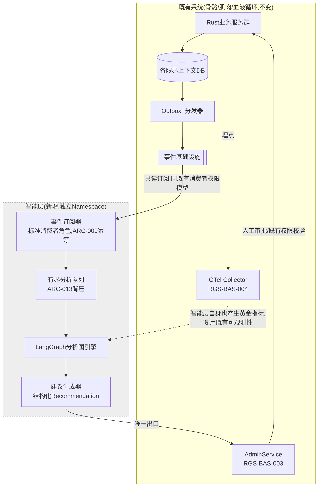
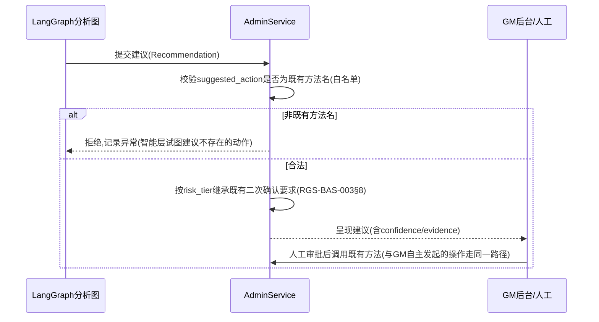
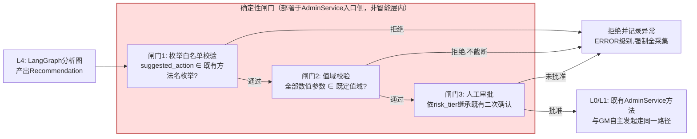

# 基本设计书（基本設計書 / Basic Design Document）

**仿生分层架构与智能决策层 Bionic Layered Architecture & Intelligence Layer**

| 项目 | 内容 |
|---|---|
| 文档编号 | RGS-BAS-011 |
| 版本 | 1.0 |
| 父文档 | RGS-REQ-014 需求定义书 第7章（ARC-027・ARC-030）、第6.6节（全局开关） |
| 依据标准 | IPA『共通フレーム 2013（SLCP-JCF2013）』基本设计工程 |
| 制定日 | 2026-08-16 |
| 最终更新日 | 2026-08-17 |
| 制定者 | 架构师 |
| 保密级别 | 内部限定（Internal Use Only） |

## 修订历史（改訂履歴 / Revision History）

| 版本 | 修订日 | 修订者 | 修订内容 | 影响章节 |
|---|---|---|---|---|
| 0.1 | 2026-08-16 | 架构师 | 初版制定。将RGS-REQ-014 ARC-027展开为智能层组件图、LangGraph图结构设计范式、事件订阅与建议呈现接口、OLU预算核算 | 全部 |
| 0.2 | 2026-08-16 | 架构师 | 新增§7A确定性闸门设计（ARC-030落地）：确定性分级L0〜L4在本系统组件上的落位、三重闸门（枚举白名单全等匹配／值域校验不截断／人工审批risk_tier自动继承）的组件设计与**部署位置约束**（须部署于AdminService侧而非智能层内，否则闸门自身即成为L4的一部分）、五类禁止泄漏路径的对应防护、可复核性设计、闸门自身的质量要求 | §7A新增、§9、§10 |
| 0.3 | 2026-08-16 | 架构师 | 开源合规自审修正（同步RGS-REQ-014 v0.3）：§2.2新增技术栈边界约束——部署镜像仅安装MIT核心库，禁止`langgraph-api`／`langgraph dev`／`langgraph build`／LangGraph Platform；新增LLM推理后端约束——必须自托管，NetworkPolicy出站白名单不得含商业LLM API端点。两条约束均要求CI静态扫描强制 | §2.2、§9、§10 |
| 0.4 | 2026-08-16 | 架构师 | 补强确定性边界（同步RGS-REQ-014 v0.4，FR-NEURO-042）：§4.1新增配置存储隔离设计——智能层服务账号在IAM与NetworkPolicy两层均不具备ARC-016热更新配置存储的写权限/写路径，堵住"绕过闸门直接改配置"这一比闸门被绕过本身更隐蔽的通道；§7A.3新增对应泄漏路径行 | §4.1、§7A.3、§10 |
| 0.5 | 2026-08-16 | 架构师 | 新增§5A分析图生命周期管理（同步RGS-REQ-014 v0.5，FR-NEURO-043〜048）：`AnalysisGraphDefinition`/`AnalysisGraphAuditLog`数据模型、增删改查四类时序（新场景须过ARC-014/026评审、目录可查询、参数更新版本化保留旧版本、结构变更等同新场景、废弃不物理删除历史）；§5A.3登记异常行为识别/经济健康度/匹配质量评估/GM决策辅助四个初始功能场景的落地映射 | §5A新增、§10 |
| 0.6 | 2026-08-16 | 架构师 | 补强§5A数据库设计（同步RGS-REQ-014 v0.6，NFR-NEURO-009）：新增§5A.1.1物理落位与约束（依附既有AD数据库、部分唯一索引防双主生效、外键完整性、审计表只增不改的数据库层强制）；新增§5A.4高可用与可核对性设计（复用既有复制/Multi-AZ/备份标准；新增状态-实际订阅一致性核对、`graph_spec_ref`哈希防篡改核对、审计记录完整性核对三项定期任务） | §5A.1.1新增、§5A.4新增、§10 |
| 0.7 | 2026-08-17 | 架构师 | **新增全局开关设计**（同步RGS-REQ-014 v0.7，FR-NEURO-049〜052，负责人指示"由后台开关控制是否开启，默认关闭，但应该是开发内容"）：§4.1新增开关运行时读取设计（消费循环最外层判定，关闭时接收不处理）；新增§4.1.1开关写权限收口（唯一写入方为`AdminService`，复用既有高危操作二次确认与审计设计，不新建专属界面）；§9原"智能层上线检查清单"拆分为§9.1"部署检查清单"（不受CR-011/OLU阻断）与§9.2"开关开启检查清单"（受阻断，原§9.2闸门检查清单顺延为§9.3）；本文档末尾"实施前提"表述同步更新为区分部署与开关开启两个前提 | §4.1、§4.1.1新增、§9.1〜9.3、§10 |
| 0.8 | 2026-08-17 | 架构师 | **§3新增双态OLU核算**（负责人指示"制作开关开启后的olu，作为这种双模式的独特设计"，处置ISS-079）：原16 OLU满负荷估算拆解为**关闭态基线9 OLU**（依赖管理6＋部署监控3，与开关状态无关，部署即产生）与**开启态增量7 OLU**（分析图迭代维护4＋建议质量监控3，仅开关开启时产生），合计仍为16不变；§3.2台账同步为双阶段口径；将"双态OLU核算"提炼为可复用做法并同步登记至RGS-BAS-010§3.9 | §3.1、§3.2、§10 |
| 0.9 | 2026-08-17 | 架构师 | **交叉审核修正**：§3.2起算基数附件D§5.3"回收后余额"由+52修正为+50（R-5非必须执行项，不应计入基准余额，详见附件D v3.0），连带§3.2关闭态/开启态余额由+43/+36修正为+41/+34 | §3.2 |
| 1.0 | 2026-08-17 | 架构师 | **补齐设计缺口**（详细设计阶段前的完备性核对发现）：§6.2补充FR-NEURO-023的低风险例外判定规则——此前仅设计了"默认人工审批"路径，未体现需求侧"低风险只读类建议可直接通知呈现"的例外，且明确该判定不得由智能层自行声明。§8/§7/§7A.2经核对已完整覆盖FR-NEURO-002/011/012/025/032，确认无需改动 | §6.2 |
| 1.1 | 2026-09-01 | 架构师 (Mavis 接手 agent per DEC-008) | 落实"各BAS文档功能章节加log设计且区分debug/release级"总要求（per Ulysses 2026-09-01 15:52 JST 决策，4 拍板选项：全部 36 个BAS / 详尽版5列表 / 派worker并行 / BAS-004同步升级，参考 RGS-BAS-001 v1.5 §4.8.3 模板 + RGS-BAS-003 v0.3 样板 + RGS-BAS-004 v0.3 §4.2/§4.3/§4.4/§4.5/§5.1/§6.2）：§2.1/§2.2/§3.1/§4.1/§4.1.1/§4.2/§5/§5A.1/§5A.1.1/§5A.2/§5A.3/§5A.4/§6.1/§6.2/§7/§7A.1/§7A.2/§7A.3/§7A.4/§7A.5/§8/§9.1/§9.2/§9.3 全部 25 个"本功能日志设计"小节新增（仿生分层架构域特殊考虑全部落地：智能决策事件/置信度/路径 release 必出、LLM 推理 release 必出含 token count 成本监控、prompt 全量与中间步骤 debug-only 隐私+成本守护、决策失败/超时/降级 error! 强制全采样）；字段名前缀统一为 `bio.*`（与 RGS-BAS-002/003 域前缀风格一致）；§10 追溯性新增 AC-NEURO-013（debug-only 宏 release 完全剔除）与 AC-NEURO-014（每功能 BAS 文档须含本功能 log 章节），与 RGS-BAS-001 v1.5 §4.8.3.4 / RGS-BAS-002 v0.4 §13 / RGS-BAS-003 v0.3 §13 / RGS-BAS-004 v0.3 §12 形成统一规范 | §2.1、§2.2、§3.1、§4.1、§4.1.1、§4.2、§5、§5A.1、§5A.1.1、§5A.2、§5A.3、§5A.4、§6.1、§6.2、§7、§7A.1、§7A.2、§7A.3、§7A.4、§7A.5、§8、§9.1、§9.2、§9.3、§10 |

## 审批栏（承認欄 / Approval）

| 角色 | 姓名 | 审批日 | 备注 |
|---|---|---|---|
| 制定（起草） | 架构师 | 2026-08-16 | — |
| 评审（安全） | | | 智能层的NetworkPolicy隔离与凭证边界是否可靠 |
| 审批（负责人） | | | 本文档的基准化。**智能层部分依赖RGS-REQ-014§9 CR-011的批准，未批准前仅可PoC** |

---

## 目录

1. [前言](#1-前言)
2. [智能层整体架构](#2-智能层整体架构)
3. [OLU运维负荷预算核算](#3-olu运维负荷预算核算)
4. [事件订阅设计（感觉输入）](#4-事件订阅设计感觉输入)
5. [LangGraph分析图设计范式](#5-langgraph分析图设计范式)
5A. [分析图生命周期管理——增删改查](#5a-分析图生命周期管理增删改查fr-neuro-043048落地)
6. [建议呈现设计（运动输出）](#6-建议呈现设计运动输出)
7. [隔离与降级设计](#7-隔离与降级设计)
7A. [确定性闸门设计（ARC-030落地）](#7a-确定性闸门设计arc-030落地)
8. [ECS与实时行为图的边界落地](#8-ecs与实时行为图的边界落地)
9. [标准化检查清单](#9-标准化检查清单)
10. [追溯性（ARC-027 → 本设计书章节）](#10-追溯性arc-027arc-030-本设计书章节)

---

# 1. 前言

本文档是RGS-REQ-014第7章ARC-027的系统级展开。本文档遵循RGS-BAS-001既有记述规则，且**不改变**既有BAS-001〜010的任何组件结构——智能层是新增的、边界严格限定的**旁路观察者**，不修改既有数据流的方向。

**生效前提**：本文档§2〜§7描述的智能层设计，其技术栈（LangGraph/Python）依赖RGS-REQ-014§9 CR-011对CON-003的修订获负责人批准。批准前，本文档作为设计提案存在，PoC阶段**不得**接入生产事件流（§4.1"预发布/PoC限定"已明确）。

---

# 2. 智能层整体架构

## 2.1 组件图



## 2.1 本功能日志设计

本节覆盖智能层整体组件图中**各组件生命周期事件**——智能层 Namespace/Deployment 启动/停止、事件订阅器就绪/掉线、分析队列积压、LangGraph 引擎健康度、AdminService 出口可达性等的观察点（落地 ARC-017 可观测性自 PH-1 起必须具备）。沿用 BAS-001 v1.5 §4.8.3 模板 + BAS-004 v0.3 §4.3 字段规范 + §4.4 debug-only 守护 + §5.1 脱敏 + §6.2 强制全采样。

| 字段名（field） | 触发条件（trigger） | 频率估算（frequency） | 采样策略（sampling） | 脱敏与成本（redact & cost） |
|---|---|---|---|---|
| `bio.component.pod_started` | 智能层 Pod 启动成功（readiness probe 通过） | 部署期 0.1/h + Pod 重启偶发 | release 必出（100% 强制全采样，per BAS-004 v0.3 §6.2） | 含`pod_name`/`namespace`/`node_id`/`started_at`；约 250B/条 |
| `bio.component.pod_stopped.graceful` | 智能层 Pod 收到 SIGTERM 优雅停止（FR-NFR-NEURO-* 维护路径） | 偶发（滚动更新/维护） | release 必出（100% 强制全采样） | 含`pod_name`/`reason`/`in_flight_count`；约 280B/条 |
| `bio.component.pod_crashed.unexpected` | 智能层 Pod 非预期崩溃（OOM/未捕获异常） | 极少 | release 必出（100% 强制全采样） | 含`pod_name`/`exit_code`/`last_log`/`trace_id`；约 400B/条 |
| `bio.component.subscriber.ready` | 事件订阅器建立消费者组并完成 offset 定位 | 部署期 + 重平衡偶发 | release 必出（100% 强制全采样） | 含`consumer_group`/`topic`/`assigned_partitions`；约 300B/条 |
| `bio.component.subscriber.lost` | 事件订阅器与 broker 心跳超时（消费者组掉线） | 极少 | release 必出（100% 强制全采样） | 含`consumer_group`/`last_heartbeat`/`reason`；约 300B/条 |
| `bio.component.queue.depth_breach` | 分析队列（§2.1）深度超过 ARC-013 背压阈值 | 偶发（峰值流量） | release 必出（100% 强制全采样） | 含`queue_name`/`current_depth`/`capacity`/`dropped_count`；约 300B/条 |
| `bio.component.adminservice.unreachable` | 建议出口（AdminService）网络不可达（NetworkPolicy 拦截或服务崩溃） | 极少 | release 必出（100% 强制全采样） | 含`target_service`/`last_success_at`/`retry_count`；约 300B/条 |
| `bio.component.debug.startup_envelope` | 启动时全部环境变量/配置键名 dump（值已脱敏） | 0.1/h | **debug-only**（`#[cfg(debug_assertions)]` 守护，release build 完全剔除） | 约 1-3KB/条（release 剔除） |
| `bio.component.debug.partition_assignment_dump` | 消费者组 partition 分配详细（broker、leader、replica） | 0.1/h | **debug-only**（`#[cfg(debug_assertions)]` 守护） | 约 1-2KB/条（release 剔除） |

**debug-only 守护要点**（落实 BAS-004 v0.3 §4.3）：
- `bio.component.debug.startup_envelope` 含配置键名，**不**含值（值已脱敏），但**仍**守护——避免 RUST_LOG=debug 误开时泄漏 Secret 引用名
- `bio.component.queue.depth_breach` 触发即代表 ARC-013 背压在生效，**不**视为异常，但必须 release 必出以便 SRE 识别持续性积压（区别于偶发尖峰）

## 2.2 部署形态

| 项目 | 内容 |
|---|---|
| K8s部署 | 独立Deployment，无状态（分析队列可持久化于智能层专属的轻量存储，但不承载权威数据，故复用RGS-BAS-002§5.1判定原则默认Deployment） |
| Namespace/NetworkPolicy | 独立Namespace，NetworkPolicy默认拒绝（复用RGS-BAS-006§4基线），出站**仅**允许：事件基础设施（订阅）、`AdminService`（呈现建议）、OTel Collector（可观测性）。**入站不接受任何连接**（纯拉取/订阅模型，无需暴露服务端口给内部其他组件；若需人工调试接口，走既有跳板机制而非常驻暴露端口） |
| 依赖库许可 | LangGraph及其Python依赖须逐一核对OSI许可（复用附件D§4 OSS许可盘点表流程，同CON-001约束），纳入RGS-BAS-006§6供应链安全流水线（依RSK-NEURO-002） |
| **技术栈边界（FR-NEURO-039，安装期强制）** | 部署镜像**仅**安装MIT许可的`langgraph`／`langgraph-core`／`langchain-core`包，**不得**安装`langgraph-api`包，**不得**在CI/CD中出现`langgraph dev`／`langgraph build`命令，**不得**配置任何指向LangGraph Platform/Cloud的连接凭证。编排循环的状态持久化**必须**自行实现（复用本组件既有的轻量存储，见§2.1分析队列同一存储介质），**不得**依赖`langgraph-api`提供的等价能力。该约束**应当**通过依赖清单静态扫描（CI阶段，复用RGS-BAS-006§6供应链安全流水线）强制，检出`langgraph-api`即视为构建失败 |
| **LLM推理后端（FR-NEURO-040）** | 底层LLM**必须**为自托管推理（详细设计阶段选定推理引擎与模型），**不得**配置任何指向商业LLM API（如按调用量计费的云端推理服务）的凭证或端点。该约束的验证方式：NetworkPolicy出站白名单（复用RGS-BAS-006§4基线）**不得**包含任何已知商业LLM API服务商的域名/端点 |

## 2.2 本功能日志设计

本节覆盖**部署形态约束的安装期/启动期验证**观察点——FR-NEURO-039/040/041/050/051/052 的"约束必须可执行"由 CI 静态扫描 + 启动期校验 + 周期性心跳三类观察点共同保证。**安全关键约束**（langgraph-api 检出、外部 LLM 端点、读写隔离）须 `error!` 级别，触发即告警。

| 字段名（field） | 触发条件（trigger） | 频率估算（frequency） | 采样策略（sampling） | 脱敏与成本（redact & cost） |
|---|---|---|---|---|
| `bio.deploy.network_policy_verified` | 启动期 NetworkPolicy 实际生效（出站白名单与设计一致，入站全拒绝） | 部署期 0.1/h | release 必出（100% 强制全采样，per BAS-004 v0.3 §6.2） | 含`namespace`/`egress_count`/`ingress_count`/`verified_at`；约 300B/条 |
| `bio.deploy.dependency_scan_passed` | CI 依赖清单静态扫描通过（未检出 langgraph-api/未含商业 LLM 客户端） | 部署期 0.1/h | release 必出（100% 强制全采样） | 含`scanned_packages_count`/`scan_duration_ms`；约 250B/条 |
| `bio.deploy.langgraph_api_detected` | **CI 静态扫描检出 langgraph-api 包**（违反 FR-NEURO-039，构建失败级） | 极少（安全事件） | release 必出（100% 强制全采样） | 含`detected_package`/`detected_in_image`/`build_id`；约 350B/条 |
| `bio.deploy.llm_endpoint_external_detected` | **启动期 NetworkPolicy 出站探测命中已知商业 LLM API 端点**（违反 FR-NEURO-040） | 极少（安全事件） | release 必出（100% 强制全采样） | 含`attempted_endpoint`/`matched_provider`/`probe_result`；约 400B/条 |
| `bio.deploy.llm_model_license_verified` | 自托管 LLM 模型权重的许可条款已核实允许商用（FR-NEURO-041） | 部署期 0.1/h | release 必出（100% 强制全采样） | 含`model_name`/`license_spdx`/`verified_at`；约 300B/条 |
| `bio.deploy.switch_default_verified` | 全新部署环境中 `neuro_layer_enabled` 初始值为 `false`（FR-NEURO-050） | 部署期 0.1/h | release 必出（100% 强制全采样） | 含`initial_value`/`verified_at`；约 200B/条 |
| `bio.deploy.zero_output_verified` | 关闭态运行观测期内确认无 Recommendation 产出、无分析结果类审计写入（FR-NEURO-051，AC-NEURO-012①②） | 部署期 + 周期性（如每小时） | release 必出（100% 强制全采样） | 含`observation_window_seconds`/`recommendation_count`/`audit_log_writes`；约 280B/条 |
| `bio.deploy.read_write_isolation_verified` | 智能层服务账号/凭证在 IAM 与 NetworkPolicy 两层均无法写入开关底层存储（FR-NEURO-042 双锁方法，AC-NEURO-012④） | 部署期 + 周期性 | release 必出（100% 强制全采样） | 含`iam_write_blocked`/`netpol_write_blocked`/`verified_at`；约 280B/条 |
| `bio.deploy.unauthorized_write_attempt.blocked` | 智能层服务账号尝试写入 ARC-016 配置存储（违反 FR-NEURO-042，IAM 或 NetworkPolicy 拦截其一即触发） | 极少（安全事件） | release 必出（100% 强制全采样，per BAS-004 §6.2） | 含`attempted_target`/`blocked_layer`（iam/netpol）/`attempted_by`；约 400B/条 |
| `bio.deploy.debug.dependency_tree_dump` | 完整 Python 依赖树（pip show 输出） | 0.1/h | **debug-only**（`#[cfg(debug_assertions)]` 守护，release build 完全剔除） | 约 5-30KB/条（release 剔除） |
| `bio.deploy.debug.network_policy_yaml_dump` | 渲染后 NetworkPolicy 完整 YAML | 0.1/h | **debug-only**（`#[cfg(debug_assertions)]` 守护） | 约 1-3KB/条（release 剔除） |

**debug-only 守护要点**：
- `bio.deploy.langgraph_api_detected` / `bio.deploy.llm_endpoint_external_detected` / `bio.deploy.unauthorized_write_attempt.blocked` 均为**P0 安全事件**——`error!` 级别，release 常驻 + §6.2 强制全采样，便于 P0 告警链路立即捕获
- `bio.deploy.debug.dependency_tree_dump` 在大型 workspace 下可能 30KB+ —— release build 完全剔除，避免 RUST_LOG=debug 误开时撑爆生产日志通道
- `bio.deploy.zero_output_verified` 周期性执行时按"每小时一次"频率，**不**视为高频日志（成本可控）

---

# 3. OLU运维负荷预算核算

依ARC-026，新增运维面须先申领额度。以下为诚实核算，供负责人在RGS-REQ-014§9批准决策时参考。

## 3.1 双态OLU核算（回应ISS-079：开关关闭态的运维面此前未单列）

> **背景**：§6.6的全局开关将智能层拆为**关闭态（默认，部署即处于此态）**与**开启态（满负荷分析，须负责人另行决议）**两种真实存在的运行状态。此前§3.1只核算了"开启态满负荷"下的合计16 OLU，未回答"关闭态本身是否也有运维成本"——答案是**有**，因为部署本身（容器、依赖、安全补丁）不因功能关闭而消失。本节把16 OLU拆解为**关闭态基线**（部署即产生，与开关状态无关）与**开启态增量**（仅开关开启、实际分析生产事件流时才产生）两部分，二者相加仍为16，不改变已登记的满负荷估算，只是让"关闭态本身要不要钱"这个问题第一次有诚实答案。

| 运维面 | OLU/月 | 适用状态 | 说明 |
|---|---|---|---|
| Python/LangGraph依赖管理与漏洞响应（与既有Rust为主的CI流水线并行维护） | 6 | **关闭态基线** | 部署镜像存在即须持续跟进依赖漏洞与安全补丁，与是否实际分析事件无关——这是"多维护一套技术栈"本身的成本，而非"分析工作量"的成本 |
| 独立Namespace的部署与监控（含FR-NEURO-052/NFR-NEURO-010开关状态一致性核对任务） | 3 | **关闭态基线** | 复用既有K8s/可观测性基础设施，边际成本较低；开关状态核对任务本身工作量很小，计入本行不单列 |
| 分析图的迭代维护（新增/调整分析规则） | 4 | **仅开启态** | 关闭态下不产出建议，无需迭代分析规则——该成本随分析活动的存在而存在 |
| 建议质量监控与误报率跟踪 | 3 | **仅开启态** | 对应RSK-NEURO-003缓解措施的常态化，关闭态下无建议产出，无需监控其质量 |
| **关闭态基线合计** | **9** | | 部署即产生，**与开关状态无关**，独立于负责人是否批准开关开启 |
| **开启态增量合计** | **7** | | **仅**开关被打到开启后才产生 |
| **开启态总计（基线＋增量）** | **16** | | 与此前登记的合计数一致，未变 |

> **设计要点（双模式OLU核算是可复用的通用做法，非本域专属）**：任何采用§6.6同类"默认关闭的全局开关"模式的域，其OLU申领**不得**只报一个笼统总数，**必须**拆分为"部署产生的基线成本"与"实际运行产生的增量成本"两部分分别登记——这样台账才能诚实反映"仅仅部署但不启用"这一中间状态的真实成本，而不是被迫在"完全不算"和"按满负荷算"之间二选一。RGS-BAS-010design pattern总纲已据此新增对应条目（见该文档§3.9"双态OLU核算"）。

## 3.1 本功能日志设计

本节覆盖**OLU 申领的运行时观察点**——关闭态基线 9 OLU（部署即产生）与开启态增量 7 OLU（仅开关开启时追加）各自的运维面**实际占用度量**事件，便于 SRE 复核"双态核算"是否被高估或低估。沿用 BAS-001 v1.5 §4.8.3 模板 + BAS-004 v0.3 §4.3/§4.4/§5.1/§6.2。

| 字段名（field） | 触发条件（trigger） | 频率估算（frequency） | 采样策略（sampling） | 脱敏与成本（redact & cost） |
|---|---|---|---|---|
| `bio.olu.baseline_metric_recorded` | 关闭态基线 OLU 各项的实际占用度量（如 Python 依赖 CVE 修复工单计数、Pod 监控告警工单计数） | 周期性（如每 6h） | release 必出（100% 强制全采样，per BAS-004 v0.3 §6.2） | 含`olu_category`（dependency/sre_monitoring）/`measured_hours`/`actual_olu`；约 300B/条 |
| `bio.olu.baseline_budget_overrun` | 关闭态基线 OLU 实际占用 > 申领值（9 OLU） | 极少 | release 必出（100% 强制全采样） | 含`olu_category`/`budget_olu`/`actual_olu`/`delta_olu`；约 300B/条 |
| `bio.olu.incremental_metric_recorded` | 开启态增量 OLU 各项的实际占用度量（仅开关开启时产出） | 开关开启后周期性 | release 必出（100% 强制全采样） | 含`olu_category`（graph_iteration/recommendation_quality）/`measured_hours`/`actual_olu`；约 300B/条 |
| `bio.olu.incremental_budget_overrun` | 开启态增量 OLU 实际占用 > 申领值（7 OLU） | 极少 | release 必出（100% 强制全采样） | 含`olu_category`/`budget_olu`/`actual_olu`/`delta_olu`；约 300B/条 |
| `bio.olu.budget_ledger_synced` | 智能层 OLU 台账与附件 D§5.3 余额已同步（双源对账通过） | 周期性（如每日） | release 必出（100% 强制全采样） | 含`ledger_balance_offchain`/`ledger_balance_ledger`/`delta`；约 280B/条 |
| `bio.olu.budget_ledger_mismatch` | 双源 OLU 余额不一致 | 极少 | release 必出（100% 强制全采样） | 含`offchain_balance`/`ledger_balance`/`expected_balance`；约 350B/条 |
| `bio.olu.debug.olu_breakdown_full` | OLU 各项工单/告警的完整明细（按周聚合） | 每周 | **debug-only**（`#[cfg(debug_assertions)]` 守护，release build 完全剔除） | 约 5-20KB/条（release 剔除） |

**debug-only 守护要点**：
- `bio.olu.baseline_metric_recorded` / `bio.olu.incremental_metric_recorded` 是**预算诚实性的事实依据**——release 必出 + §6.2 强制全采样，便于财务对账与 P-1 预算复核
- `bio.olu.baseline_budget_overrun` / `bio.olu.incremental_budget_overrun` 触发即代表申领值偏小——`warn!` 级别（**非** `error!`），属预算管理问题而非安全事件，但必须 release 必出供 SRE 复盘

## 3.2 核算结果（与附件D§5台账联动，2026-08-17更新为双态口径）

| 项目 | OLU/月 |
|---|---|
| 附件D§5.3回收后余额（210预算口径，仅计入必须执行项R-1〜R-4、R-6） | +50 |
| 智能层**关闭态基线**申领（本次实际计入部署计划的额度） | −9 |
| **关闭态部署后余额** | **+41** |
| 智能层**开启态增量**预留申领（仅开关开启时追加，当前不计入实际占用） | −7 |
| **若开关开启，核算后余额** | **+34**（与此前登记的"开启态满负荷"结论一致） |

> **结论（2026-08-17更新，反映ISS-043二次决议与ISS-079核算完成）**：智能层的**部署本身**（关闭态基线9 OLU）在210预算口径下**具备充足余量**（+41），不构成阻断，可正常纳入部署计划；**开关开启**（追加7 OLU增量，达到满负荷16 OLU总量）在预算数字上同样不构成阻断（+34），但仍须负责人依ISS-043对开关开启这一动作单独决议，与预算是否充足无关。本核算结果已如实登记，见§9.1/§9.2检查清单与附件D更新（本次执行）。

---

# 4. 事件订阅设计（感觉输入）

## 4.1 订阅范围与权限

| 项目 | 内容 |
|---|---|
| 订阅方式 | 标准事件消费者角色，复用ARC-010既定的Topic与`partition_key`体系，**不新增专属Topic** |
| 权限边界 | 智能层的消费者身份**仅**具备订阅权限，**不具备**发布权限（防止智能层通过发布伪造事件间接影响下游，这是"只读感知"边界的消费者侧落地） |
| 配置存储隔离（FR-NEURO-042落地） | 智能层的服务账号/凭证在IAM层面**不得**被授予ARC-016数值表热更新配置存储的任何写权限（含"新增/修改配置项"类API的调用权限），NetworkPolicy出站白名单**不含**配置存储的写端点——仅读端点（若分析逻辑需要读取当前生效配置作为分析输入）可放行。**双层强制**（IAM＋NetworkPolicy）目的是即便一层被绕过/配置错误，另一层仍能拦截，理由同§7A.2"闸门必须部署于血管侧而非血液侧"——本条防护的是比闸门更早的一个环节：闸门约束"建议如何被执行"，本条约束"智能层物理上够不到执行入口以外的任何写入面" |
| 幂等消费 | 复用ARC-009既定的消费者幂等义务，已处理记录与分析中间结果同事务/同批次持久化 |
| **预发布/PoC限定** | 在RGS-REQ-014§9 CR-011批准前，智能层**仅可**订阅预发布/隔离测试环境的事件流，**不得**订阅生产环境事件基础设施——技术上通过独立的、指向非生产环境的连接配置与NetworkPolicy出站白名单实现物理隔离，而非仅靠约定 |
| **全局开关（FR-NEURO-049〜052落地）** | 智能层的每个消费者实例在事件消费循环的**最外层**先于任何分析逻辑触发读取`neuro_layer_enabled`（ARC-016配置存储，只读订阅，复用既有热更新分发通道），为`false`时直接跳过本条事件（仍消费并提交offset以避免消费者组积压/重平衡异常，但不进入LangGraph分析管线，等同于"接收但不处理"）；为`true`时才进入正常分析流程。开关状态变化通过既有热更新分发的推送/短轮询机制被全部实例感知，无需重启 |

## 4.1 本功能日志设计

本节覆盖**事件订阅范围与权限边界的运行时观察点**——订阅器生命周期、消费/跳过决策、配置存储读权限、预发布/PoC 隔离验证、消费者身份权限收敛。**安全关键事件**（非订阅权限检测、非生产环境订阅检测）须 `error!` 级别，触发即告警。沿用 BAS-001 v1.5 §4.8.3 模板 + BAS-004 v0.3 §4.3/§4.4/§5.1/§6.2。

| 字段名（field） | 触发条件（trigger） | 频率估算（frequency） | 采样策略（sampling） | 脱敏与成本（redact & cost） |
|---|---|---|---|---|
| `bio.subscribe.consumer_started` | 消费者实例启动并加入消费者组 | 部署期 0.1/h | release 必出（100% 强制全采样，per BAS-004 v0.3 §6.2） | 含`consumer_group`/`topic`/`assigned_partitions`/`environment`（prod/staging）；约 300B/条 |
| `bio.subscribe.environment_production_blocked` | 智能层尝试订阅生产环境事件流（在 CR-011 批准前，**违反** FR-NEURO-039 预发布/PoC 限定） | 极少（安全事件） | release 必出（100% 强制全采样） | 含`attempted_environment`/`target_topic`/`block_reason`；约 350B/条 |
| `bio.subscribe.event_received` | 单条事件被消费者接收到（消费循环入口） | 取决于生产流量，**仅开关开启时**有量（典型 100-1000 events/s 集群级） | release 必出（100% 强制全采样，per §6.2 业务关键事件白名单） | 含`topic`/`partition_key`/`event_type`/`switch_state`；约 250B/条 |
| `bio.subscribe.event_skipped.switch_off` | 单条事件被消费但因 `neuro_layer_enabled=false` 跳过分析（仅提交 offset） | 关闭态下持续高频 | release 必出（100% 强制全采样） | 含`topic`/`event_id`/`reason`；约 200B/条 |
| `bio.subscribe.event_consumed` | 单条事件完成消费（已写入已处理记录 + 提交 offset） | 取决于生产流量 | release 必出（100% 强制全采样） | 含`topic`/`event_id`/`processing_latency_ms`；约 280B/条 |
| `bio.subscribe.publish_attempt_rejected` | 智能层消费者身份**尝试发布事件**被 broker ACL 拒绝（违反 §4.1 权限边界） | 极少（安全事件） | release 必出（100% 强制全采样，per §6.2） | 含`attempted_topic`/`reason`/`broker_error`；约 350B/条 |
| `bio.subscribe.config_storage_read_blocked` | 智能层尝试读取 ARC-016 配置存储被 IAM/NetworkPolicy 拦截（违反 §4.1 配置存储隔离） | 极少 | release 必出（100% 强制全采样） | 含`attempted_path`/`block_layer`；约 350B/条 |
| `bio.subscribe.idempotency_duplicate_detected` | 同 `event_id` 重复到达已处理记录命中 | 偶发 | release 必出（100% 强制全采样） | 含`event_id`/`first_processed_at`；约 250B/条 |
| `bio.subscribe.debug.event_payload_envelope` | 事件 payload 完整 dump（key 列表 + 字节数） | 取决于生产流量 | **debug-only**（`#[cfg(debug_assertions)]` 守护，release build 完全剔除） | 约 1-5KB/条（release 剔除） |
| `bio.subscribe.debug.consumer_lag_snapshot` | 消费者 lag 详细（partition 维度） | 周期性（如每 30s） | **debug-only**（`#[cfg(debug_assertions)]` 守护） | 约 500B-2KB/条（release 剔除） |

**debug-only 守护要点**：
- `bio.subscribe.environment_production_blocked` / `bio.subscribe.publish_attempt_rejected` / `bio.subscribe.config_storage_read_blocked` 均为**P0 安全事件**——`error!` 级别，release 常驻 + §6.2 强制全采样
- `bio.subscribe.event_skipped.switch_off` 是**关闭态零产出的可观测性证据**（FR-NEURO-051）——必须 release 必出，便于 AC-NEURO-012① 验收脚本能够证明"开关为 false 时无任何分析进入 LangGraph"
- `bio.subscribe.debug.event_payload_envelope` 不含事件值，**仅**含 schema/字节数——但仍守护以避免 RUST_LOG=debug 误开时泄漏事件结构信息

### 4.1.1 全局开关的运行时落位与写权限收口

开关值的**唯一写入方**是`AdminService`（既有GM控制平面，ARC-019），其写入路径与既有ARC-016数值表热更新的既定发布流程完全一致（不新建独立的开关管理界面/API），仅在语义上专门用于本开关——这与FR-NEURO-049"智能层对开关只读不可写"共同构成完整的读写分离：智能层可以感知开关状态并据此调整自身行为，但**没有任何路径**可以自己把开关打开。写入前的二次确认与写入后的审计留痕，复用RGS-BAS-003§8高危操作与§7审计设计的既有实现，不新建专属确认弹窗/审计表。

#### 4.1.1 本功能日志设计

本节覆盖**全局开关的运行时读取与写权限收口**的观察点——开关状态变化（flip 事件）必须 release 必出 + §6.2 强制全采样（与 GM 高危操作同等重要），开关状态读取（每条事件消费时执行）按 debug-only 守护以避免高频读取淹没日志通道。**安全关键事件**（智能层尝试自写、IAM/NetworkPolicy 拦截、AdminService 二次确认触发）须 `error!` 级别。

| 字段名（field） | 触发条件（trigger） | 频率估算（frequency） | 采样策略（sampling） | 脱敏与成本（redact & cost） |
|---|---|---|---|---|
| `bio.switch.state_read` | 消费者循环最外层读取 `neuro_layer_enabled` 开关值（每条事件处理前） | 取决于生产流量，集群级典型 100-1000 reads/s | **debug-only**（`#[cfg(debug_assertions)]` 守护，release build 完全剔除） | 约 100B/条 × 高频 = 高频读，release 剔除，零运行时开销 |
| `bio.switch.state_changed` | 开关值在 AdminService 写入后被消费实例感知（flip 事件） | 极低（负责人决议） | release 必出（100% 强制全采样，per BAS-004 v0.3 §6.2） | 含`old_value`/`new_value`/`operator_id`/`propagation_latency_ms`；约 350B/条 |
| `bio.switch.flip_dual_operator_verified` | 开关翻转时 AdminService 验证操作者与审批者为不同 operator（双人原则） | 极低 | release 必出（100% 强制全采样） | 含`requester_id`/`approver_id`/`ticket_id`；约 300B/条 |
| `bio.switch.flip_dual_operator_violation` | 申请者与审批者为同一 operator（违反双人原则） | 极少（配置错） | release 必出（100% 强制全采样） | 含`violation_operator_id`/`requester_id`/`ticket_id`；约 300B/条 |
| `bio.switch.propagation.completed` | 全部智能层实例在 NFR-NEURO-010 既定时延内感知新值 | 极低 | release 必出（100% 强制全采样） | 含`acked_instance_count`/`total_instance_count`/`propagation_latency_ms`；约 300B/条 |
| `bio.switch.propagation.partial` | 部分实例未在时延内感知（< 95% 法定人数） | 极少 | release 必出（100% 强制全采样） | 含`acked_count`/`unacked_instance_ids`/`propagation_latency_ms`；约 350B/条 |
| `bio.switch.propagation.failed` | 法定人数未达 + 超时 | 极少 | release 必出（100% 强制全采样） | 含`acked_count`/`total_count`/`timeout_ms`/`error`/`trace_id`；约 400B/条 |
| `bio.switch.self_write_attempt.blocked` | 智能层服务账号尝试自写开关（IAM 拦截，违反 FR-NEURO-049） | 极少（安全事件） | release 必出（100% 强制全采样，per §6.2） | 含`attempted_by`/`attempted_value`/`block_layer`（iam/netpol）/`trace_id`；约 400B/条 |
| `bio.switch.self_write_attempt.detected.unblocked` | 智能层服务账号尝试自写开关但**未被任何一层拦截**（双锁失效——P0 安全事件） | 极少（极严重） | release 必出（100% 强制全采样，per §6.2） | 含`attempted_by`/`attempted_value`/`iam_checked`/`netpol_checked`/`trace_id`；约 450B/条 |
| `bio.switch.audit_log_persisted` | 开关翻转事件已写入 AdminService 审计日志（`OPERATION_AUDIT` 表，per RGS-BAS-003§7） | 极低 | release 必出（100% 强制全采样） | 含`audit_id`/`switch_value_before`/`switch_value_after`/`operator_id`；约 300B/条 |
| `bio.switch.debug.config_storage_path` | ARC-016 配置存储中开关键的物理路径（key 名称） | 部署期 0.1/h | **debug-only**（`#[cfg(debug_assertions)]` 守护） | 约 200B/条（release 剔除） |

**debug-only 守护要点**：
- `bio.switch.state_read` **必须** debug-only —— 集群级典型 100-1000 reads/s，若 release 必出将撑爆日志通道（**与 BAS-004 v0.3 §4.4 规则 #2 一致**：高频路径禁止 release 必出）
- `bio.switch.self_write_attempt.detected.unblocked` 是**最高级安全事件**——意味着 FR-NEURO-042 双锁方法彻底失效，必须 `error!` + release 必出 + §6.2 强制全采样
- `bio.switch.flip_dual_operator_violation` 配置错而非攻击——`warn!` 级别（**非** `error!`），release 常驻

## 4.2 数据脱敏

智能层接收的事件如含个人信息，**必须**遵循RGS-BAS-004§5既定的脱敏规则——智能层不因其"分析用途"而获得查看未脱敏个人信息的特权，脱敏在事件产生源头已完成（复用既有"脱敏优先于清洗"的ARC-020精神）。

## 4.2 本功能日志设计

本节覆盖**数据脱敏（per BAS-004 v0.3 §5.1）的智能层侧运行时观察点**——脱敏在事件产生源头已完成，但智能层需在消费时校验"接收的事件已脱敏"（防止上游配置错误导致未脱敏事件流入 LangGraph 分析管线）。**安全关键事件**（未脱敏事件流入检测）须 `error!` 级别 + 强制全采样。

| 字段名（field） | 触发条件（trigger） | 频率估算（frequency） | 采样策略（sampling） | 脱敏与成本（redact & cost） |
|---|---|---|---|---|
| `bio.redact.field_blacklisted_replaced` | 埋点 SDK 黑名单命中（`*token*`/`*password*`/`*credential*` 等字段值被替换为 `[REDACTED]`） | 偶发（上游误传） | release 必出（100% 强制全采样，per BAS-004 v0.3 §6.2） | 含`field_name_pattern`（脱敏后）/`source_event_type`/`replaced_at`；约 250B/条 |
| `bio.redact.unredacted_event_detected` | 智能层消费时检测到事件含**未脱敏个人信息**字段（如明文邮箱/手机号/IP 完整末段，违反 BAS-004 v0.3 §5.1） | 极少（安全事件） | release 必出（100% 强制全采样，per §6.2） | 含`event_type`/`unredacted_field`（脱敏后）/`source_topic`/`action_taken`（drop/quarantine）；约 400B/条 |
| `bio.redact.pii_field_hash_computed` | 邮箱/手机号按 §5.1 哈希化完成 | 取决于生产流量 | release 必出（100% 强制全采样） | 含`field_kind`（email/phone）/`hash_algorithm`；约 200B/条 |
| `bio.redact.ip_truncated` | IP 地址按 §5.1 末段掩码（`/24`）处理 | 取决于生产流量 | release 必出（100% 强制全采样） | 含`original_prefix`/`truncated_prefix`；约 200B/条 |
| `bio.redact.geolocation_coarse_only` | 精确坐标被替换为粗粒度区域（国家/大区） | 偶发 | release 必出（100% 强制全采样） | 含`original_region_code`/`replacement_region_code`；约 250B/条 |
| `bio.redact.debug.full_field_value_dump` | 字段值完整 dump（仅在合规审计场景下手动开启，**默认** debug-only 守护） | 偶发 | **debug-only**（`#[cfg(debug_assertions)]` 守护，release build 完全剔除） | 约 500B-2KB/条（release 剔除） |

**debug-only 守护要点**：
- `bio.redact.unredacted_event_detected` 是**P0 安全事件**（未脱敏数据流入分析管线）——`error!` 级别，release 常驻 + §6.2 强制全采样，且必须**就地丢弃**该事件（不得进入 LangGraph）
- `bio.redact.debug.full_field_value_dump` 是**合规审计专用**——默认不开启，仅在 NFR-SE-012 触发合规调查时手动启用，**严禁**默认 release 必出
- 智能层**不**自行实现脱敏（per ARC-020 "脱敏优先于清洗"），仅消费已完成脱敏的事件并校验——本节日志反映"校验结果"而非"脱敏动作"

---

# 5. LangGraph分析图设计范式

对应FR-NEURO-021。

| 设计点 | 内容 |
|---|---|
| 图的构成 | 节点＝分析步骤（如"提取特征"、"与历史基线比较"、"计算置信度"、"生成依据说明"），边＝条件转移（如"置信度>阈值时进入人工复核建议生成节点，否则记录不告警"） |
| 与ARC-016热更新思想的关系 | 图定义（节点参数、边的条件阈值）**应当**与推理引擎代码分离、可独立更新，复用ARC-016"数值表与可执行文件分离"的既定思想，避免每次调整分析规则都需要重新构建部署镜像 |
| 多智能体协作（若采用） | 若分析场景需要多个专精子图协作（如"异常检测子图"与"经济健康度子图"），**必须**通过LangGraph既定的图组合机制实现，**不得**用进程间自定义RPC实现子图间通信（避免在智能层内部重新发明一套通信机制，增加不必要的复杂度，同ARC-014"未证明不引入复杂性"精神） |
| 可解释性落地 | 每个节点的输出**必须**携带其依据的输入数据引用（对应FR-NEURO-022"依据"字段），图的最终输出天然是一条可回溯的"推理链"，满足NFR-NEURO-003 |

## 5. 本功能日志设计

本节覆盖 **LangGraph 分析图执行（节点级、推理级、决策级）**的运行时观察点——智能层核心事件，是仿生分层架构域的**成本/性能/可解释性**关键。沿用 BAS-001 v1.5 §4.8.3 模板 + BAS-004 v0.3 §4.3/§4.4/§5.1/§6.2。**release 必出事件**包括 LLM 推理（输入/输出/耗时/Token 数，成本监控关键）、决策触发/路径选择/置信度；**debug-only 事件**包括 prompt 全量、推理中间步骤（隐私 + 成本）；**error! 强制全采样**包括决策失败/超时/降级。

| 字段名（field） | 触发条件（trigger） | 频率估算（frequency） | 采样策略（sampling） | 脱敏与成本（redact & cost） |
|---|---|---|---|---|
| `bio.graph.decision_triggered` | LangGraph 分析图入口接收事件，决策流程开始（一个事件 = 一次决策流） | 开关开启时典型 100-1000 events/s 集群级 | release 必出（100% 强制全采样，per BAS-004 v0.3 §6.2 + §4.5 release 必出宏清单"业务关键事件"） | 含`graph_id`/`graph_version`/`event_id`/`triggered_at`；约 250B/条 |
| `bio.graph.decision_path_selected` | 图的边条件判定完成，确定本次决策的节点路径 | 同上 | release 必出（100% 强制全采样） | 含`graph_id`/`event_id`/`node_path`（如 `n1→n3→n7`）/`branch_reason`；约 350B/条 |
| `bio.graph.decision_confidence_calculated` | 决策节点完成置信度计算（per FR-NEURO-037） | 同上 | release 必出（100% 强制全采样） | 含`graph_id`/`event_id`/`confidence`（0-1）/`confidence_threshold`/`passes_threshold`；约 300B/条 |
| `bio.graph.decision_completed` | 决策流程完成，产出 Recommendation 或不产出（置信度不足） | 同上 | release 必出（100% 强制全采样） | 含`graph_id`/`event_id`/`outcome`（recommendation_generated/no_recommendation）/`duration_ms`；约 300B/条 |
| `bio.graph.decision_timeout` | 决策流程超过 NFR-NEURO-001 推理时延上限（per 详细设计确定） | 极少（峰值或异常输入） | release 必出（100% 强制全采样，per §6.2） | 含`graph_id`/`event_id`/`elapsed_ms`/`timeout_ms`/`last_completed_node`；约 400B/条 |
| `bio.graph.decision_failed.unexpected` | 决策过程中未预期异常（图执行崩溃、节点函数异常、内存不足） | 极少 | release 必出（100% 强制全采样，per §6.2） | 含`graph_id`/`event_id`/`error`/`failed_node`/`trace_id`；约 450B/条 |
| `bio.graph.decision_degraded.fallback_path` | 决策触发降级（per ARC-007），使用 fallback 路径而非主路径 | 偶发 | release 必出（100% 强制全采样） | 含`graph_id`/`event_id`/`primary_node`/`fallback_node`/`degradation_reason`；约 400B/条 |
| `bio.llm.inference_started` | 自托管 LLM 推理请求开始（LangGraph 节点调用 LLM 时） | 取决于 graph 节点数与流量，典型 10-500/s 集群级 | release 必出（100% 强制全采样，per §4.5 release 必出宏清单"业务关键事件"） | 含`graph_id`/`event_id`/`model_name`/`model_version`/`node_id`；约 350B/条 |
| `bio.llm.inference_completed` | LLM 推理完成（成功/失败） | 同上 | release 必出（100% 强制全采样） | 含`graph_id`/`event_id`/`model_name`/`input_tokens`/`output_tokens`/`total_tokens`/`latency_ms`/`finish_reason`；约 450B/条 |
| `bio.llm.inference_failed.unexpected` | LLM 推理失败（推理引擎崩溃/超时/OOM） | 极少 | release 必出（100% 强制全采样，per §6.2） | 含`graph_id`/`event_id`/`model_name`/`error`/`error_kind`/`elapsed_ms`/`trace_id`；约 500B/条 |
| `bio.llm.token_cost.aggregated` | Token 用量按时间窗口聚合（如每 5min），用于成本监控 | 周期性 | release 必出（100% 强制全采样） | 含`window_start`/`window_end`/`total_input_tokens`/`total_output_tokens`/`estimated_cost_usd`；约 350B/条 |
| `bio.llm.queue.depth_breach` | LLM 推理请求队列积压超过阈值（成本失控预警） | 偶发（峰值） | release 必出（100% 强制全采样） | 含`current_depth`/`capacity`/`oldest_wait_ms`；约 300B/条 |
| `bio.graph.debug.full_prompt` | LLM 输入 prompt 完整 dump（system + user messages） | 取决于推理频次 | **debug-only**（`#[cfg(debug_assertions)]` 守护，release build 完全剔除） | 约 1-10KB/条（prompt 长度决定，release 剔除） |
| `bio.graph.debug.intermediate_node_outputs` | 每个节点的中间输出 dump（推理链全量） | 取决于推理频次 | **debug-only**（`#[cfg(debug_assertions)]` 守护） | 约 5-50KB/条（节点数与每节点输出决定，release 剔除） |
| `bio.graph.debug.llm_raw_response` | LLM 原始响应（未经解析） | 取决于推理频次 | **debug-only**（`#[cfg(debug_assertions)]` 守护） | 约 1-20KB/条（release 剔除） |
| `bio.graph.debug.token_count_breakdown` | Token 计费明细（input/output/cache_read/cache_write 分桶） | 周期性 | **debug-only**（`#[cfg(debug_assertions)]` 守护） | 约 200B/条（release 剔除） |

**debug-only 守护要点**（落实 BAS-004 v0.3 §4.3 + §4.4 + §5.1）：
- `bio.graph.debug.full_prompt` **可能含个人提示**（用户在事件中的 PII 即使源头已脱敏，LLM 也可能回填或重新引入）——**严禁** release 必出
- `bio.graph.debug.intermediate_node_outputs` 在多节点图下可能 50KB+ —— release build 完全剔除，避免 RUST_LOG=debug 误开时撑爆生产日志通道
- `bio.llm.token_cost.aggregated` 周期聚合（每 5min），按成本监控可观测性需求，release 必出 + §6.2 强制全采样（**与 BAS-004 §4.5 release 必出宏清单"业务关键事件"对齐**——成本是关键业务信号）
- `bio.graph.decision_timeout` / `bio.graph.decision_failed.unexpected` / `bio.llm.inference_failed.unexpected` 均为**生产异常**——`error!` 级别，release 常驻 + §6.2 强制全采样
- `bio.graph.decision_path_selected` 是**核心可解释性事件**（per NFR-NEURO-003）——必须 release 必出，事后审计可还原"为什么这条事件走了这条路径"

---

# 5A. 分析图生命周期管理——增删改查（FR-NEURO-043〜048落地）

## 5A.1 数据模型

`AnalysisGraphDefinition`（逻辑字段）：

| 字段 | 类型 | 说明 |
|---|---|---|
| `graph_id` | uuid | 唯一标识 |
| `feature_domain` | string | 所属功能域（发起该场景的领域文档域名段，如`NEURO`自身、`GSM`、`SUP`；§5A.3登记初始目录） |
| `version` | int，单调递增 | 图定义版本号（FR-NEURO-046参数级更新时递增） |
| `status` | enum(`草稿`／`生效`／`已废弃`) | 生命周期状态 |
| `graph_spec_ref` | 引用节点/边定义（复用ARC-016热更新配置存储） | 图结构与参数的实际内容，**不**内嵌于本表（保持"数值表与可执行文件分离"思想） |
| `subscribed_event_scope` | 引用§4.1订阅范围声明 | 该图实际订阅的事件Topic/`partition_key`子集 |
| `olu_review_ref` | 引用ARC-014/ARC-026评审记录 | FR-NEURO-044评审通过的凭证，`生效`状态**必须**非空 |
| `superseded_by` / `supersedes` | 可选，引用同`graph_id`的其他`version` | 版本链，供FR-NEURO-046历史版本检索 |

`AnalysisGraphAuditLog`（复用RGS-BAS-003§7审计设计存储结构，落地FR-NEURO-048）：

| 字段 | 类型 | 说明 |
|---|---|---|
| `log_id` | uuid | 唯一标识 |
| `graph_id` / `version_before` / `version_after` | — | 操作前后版本，`version_before`为空表示新增注册 |
| `action` | enum(`注册`／`评审通过转生效`／`参数更新`／`结构变更`／`废弃`) | 结构变更须关联新的`graph_id`（同新场景），不与参数更新混同 |
| `operator` / `occurred_at` | — | 操作人与时间 |
| `spec_checksum` | string（哈希值） | `graph_spec_ref`在本次操作时点的内容哈希（如SHA-256），供§5A.4可核对性设计比对，**不得**为空 |

## 5A.1 本功能日志设计

本节覆盖**分析图数据模型实例化/查询**的观察点——`AnalysisGraphDefinition` 与 `AnalysisGraphAuditLog` 两表的增删改查事件（per FR-NEURO-043〜048），**安全关键事件**（草稿态被错误激活、审计表写入失败）须 `error!` 级别。沿用 BAS-001 v1.5 §4.8.3 模板 + BAS-004 v0.3 §4.3/§4.4/§5.1/§6.2。

| 字段名（field） | 触发条件（trigger） | 频率估算（frequency） | 采样策略（sampling） | 脱敏与成本（redact & cost） |
|---|---|---|---|---|
| `bio.graph_def.read.query` | 目录查询（per FR-NEURO-045，按 `feature_domain`/`status` 过滤） | 偶发（GM/架构师查询） | release 必出（100% 强制全采样，per BAS-004 v0.3 §6.2） | 含`query_filter`/`result_count`/`queried_by`；约 300B/条 |
| `bio.graph_def.read.with_recommendation_stats` | 关联查询图定义 + 近期 Recommendation 产出量/采纳率（per §5A.2【查】） | 偶发 | release 必出（100% 强制全采样） | 含`graph_id`/`recommendation_count`/`adoption_rate`/`queried_by`；约 400B/条 |
| `bio.graph_def.activated.invalid_state` | 尝试将非"草稿"态记录直接激活（绕过 ARC-014/026 评审，per FR-NEURO-044） | 极少（安全事件） | release 必出（100% 强制全采样，per §6.2） | 含`graph_id`/`version`/`current_status`/`attempted_by`/`trace_id`；约 400B/条 |
| `bio.graph_def.audit_log.write_attempted` | `AnalysisGraphAuditLog` 写入尝试（per FR-NEURO-048 全程留痕） | 取决于 CRUD 频次 | release 必出（100% 强制全采样） | 含`action`（注册/评审转生效/参数更新/结构变更/废弃）/`graph_id`/`version`/`operator`；约 350B/条 |
| `bio.graph_def.audit_log.write_failed` | 审计写入失败（数据库层或应用层错误） | 极少 | release 必出（100% 强制全采样，per §6.2） | 含`action`/`graph_id`/`version`/`error`/`trace_id`；约 400B/条 |
| `bio.graph_def.audit_log.write_succeeded` | 审计写入成功（含事务提交确认，per `OPERATION_AUDIT` 表"只增不改"约束） | 取决于 CRUD 频次 | release 必出（100% 强制全采样） | 含`audit_log_id`/`graph_id`/`version`/`operator`/`db_tx_id`；约 350B/条 |
| `bio.graph_def.debug.full_definition_dump` | `AnalysisGraphDefinition` 完整 record dump（含所有字段） | 偶发 | **debug-only**（`#[cfg(debug_assertions)]` 守护，release build 完全剔除） | 约 1-3KB/条（release 剔除） |
| `bio.graph_def.debug.spec_checksum_intermediate` | `spec_checksum` 计算中间过程（per §5A.4 可核对性） | 偶发 | **debug-only**（`#[cfg(debug_assertions)]` 守护） | 约 300B/条（release 剔除） |

**debug-only 守护要点**：
- `bio.graph_def.activated.invalid_state` 是**P0 安全事件**（绕过评审直接激活）——`error!` 级别，release 常驻 + §6.2 强制全采样
- `bio.graph_def.audit_log.write_failed` 即使是偶发 DB 错误，也必须 release 必出——审计完整性是 §5A.4 可核对性的基础
- `bio.graph_def.audit_log.write_succeeded` 不含 `spec_checksum` 值（避免高频日志重复同一哈希），但 `db_tx_id` 足够供事后追溯

### 5A.1.1 物理落位与约束（复用RGS-BAS-007既定数据库设计标准，不新建数据库）

| 项目 | 内容 |
|---|---|
| 归属数据库 | 两表**依附**既有AD（运维/GM后台）限界上下文数据库，与`ops_ticket`（ARC-019既定）等既有控制面表同库，**不为**智能层新建独立数据库实例（同ARC-018挂载原则、同RGS-BAS-007"业务逻辑与控制面数据就近既有上下文"惯例） |
| 主键与唯一约束 | `AnalysisGraphDefinition`主键`(graph_id, version)`；`(graph_id) WHERE status='生效'`**部分唯一索引**，确保同一`graph_id`任意时刻至多一个`生效`版本，防止双主导致的并发建议产出口径不一致 |
| 外键完整性 | `AnalysisGraphAuditLog.graph_id/version_before/version_after`**必须**对`AnalysisGraphDefinition`建立外键约束，**不得**允许审计记录引用不存在的版本（数据库层强制，而非仅应用层校验） |
| 查询索引 | `(feature_domain, status)`复合索引支撑FR-NEURO-045目录查询；`AnalysisGraphAuditLog(graph_id, occurred_at)`复合索引支撑按图检索历史操作 |
| 只增不改 | `AnalysisGraphAuditLog`表的数据库角色权限**仅授予**`INSERT`，**不授予**`UPDATE`/`DELETE`（复用RGS-BAS-003§7既定的审计表权限收紧模式），从数据库层面而非仅约定层面保证审计记录不可被事后篡改或删除 |

#### 5A.1.1 本功能日志设计

本节覆盖**数据库层约束的运行时强制**的观察点——`AnalysisGraphDefinition`/`AnalysisGraphAuditLog` 的物理落位（依附 AD 库）、部分唯一索引、外键约束、只增不改权限等"约束必须可执行"由 DB 层错误/告警事件反映。**安全关键事件**（双主生效、外键违反、权限收紧失效）须 `error!` 级别 + 强制全采样。

| 字段名（field） | 触发条件（trigger） | 频率估算（frequency） | 采样策略（sampling） | 脱敏与成本（redact & cost） |
|---|---|---|---|---|
| `bio.db_def.dual_active_violation` | 同一 `graph_id` 试图同时存在两个 `status='生效'` 版本（违反 §5A.1.1 部分唯一索引） | 极少（数据完整性违规） | release 必出（100% 强制全采样，per BAS-004 v0.3 §6.2） | 含`graph_id`/`attempted_versions`/`db_tx_id`/`trace_id`；约 400B/条 |
| `bio.db_def.foreign_key_violation` | `AnalysisGraphAuditLog` 引用不存在的 `graph_id`/`version`（违反外键完整性） | 极少（应用层校验失效） | release 必出（100% 强制全采样，per §6.2） | 含`audit_log_id`/`referenced_graph_id`/`referenced_version`/`db_tx_id`/`trace_id`；约 450B/条 |
| `bio.db_def.update_audit_rejected` | 智能层服务账号尝试 `UPDATE`/`DELETE` `AnalysisGraphAuditLog` 表（违反"只增不改"约束） | 极少（安全事件） | release 必出（100% 强制全采样，per §6.2） | 含`attempted_by`/`attempted_op`（update/delete）/`db_tx_id`/`blocked_at_layer`（db_role/app_layer）；约 400B/条 |
| `bio.db_def.index_health_check_passed` | `(graph_id) WHERE status='生效'` 部分唯一索引 + 复合索引健康度检查通过 | 周期性（如每日） | release 必出（100% 强制全采样） | 含`index_name`/`table_size`/`fragmentation_ratio`；约 280B/条 |
| `bio.db_def.index_health_check_failed` | 索引健康度检查未通过（fragmentation > 阈值） | 极少 | release 必出（100% 强制全采样） | 含`index_name`/`fragmentation_ratio`/`threshold`；约 300B/条 |
| `bio.db_def.role_permission_verified` | 智能层服务账号权限收紧验证（仅 SELECT `AnalysisGraphDefinition` + INSERT `AnalysisGraphAuditLog`） | 部署期 + 周期性 | release 必出（100% 强制全采样） | 含`role_name`/`granted_privileges`/`verified_at`；约 300B/条 |
| `bio.db_def.role_permission_drift` | 智能层服务账号权限被扩张（发现非预期授权，违反 §5A.1.1 只增不改约束） | 极少（极严重安全事件） | release 必出（100% 强制全采样，per §6.2） | 含`role_name`/`unexpected_privilege`/`detected_at`/`trace_id`；约 400B/条 |
| `bio.db_def.debug.full_table_schema_dump` | `AnalysisGraphDefinition`/`AnalysisGraphAuditLog` 完整 schema dump（含约束/索引/权限） | 部署期 0.1/h | **debug-only**（`#[cfg(debug_assertions)]` 守护，release build 完全剔除） | 约 2-5KB/条（release 剔除） |

**debug-only 守护要点**：
- `bio.db_def.dual_active_violation` / `bio.db_def.foreign_key_violation` / `bio.db_def.update_audit_rejected` / `bio.db_def.role_permission_drift` 均为**P0 安全/数据完整性事件**——`error!` 级别，release 常驻 + §6.2 强制全采样
- `bio.db_def.role_permission_drift` 是**最高级安全事件**——意味着 `AnalysisGraphAuditLog` 可能已被篡改，必须**立即**告警 + 触发 §5A.4.2 审计完整性核对

## 5A.2 CRUD时序

```
【增】新场景接入：
  架构师提出新分析图场景 → 注册AnalysisGraphDefinition（status=草稿，olu_review_ref为空）
    → 走ARC-014判定基准评审 + ARC-026 OLU预算核算（同既有中间件导入纪律）
    → 评审通过 → 写入olu_review_ref → status置为生效 → 订阅subscribed_event_scope开始生效
    → 评审未通过 → 保持草稿，不订阅生产事件流（同§4.1预发布/PoC限定原则）
  → 全程记录AnalysisGraphAuditLog

【查】目录查询：
  架构师/GM通过既有只读查询模式（RGS-BAS-003§3.4）检索AnalysisGraphDefinition
    → 可按feature_domain/status过滤
    → 关联查询近期Recommendation产出量与采纳率统计（复用§6.1建议数据结构的既有字段聚合）

【改】参数级更新（不改变图结构）：
  提出方通过ARC-016既定热更新通道提交新参数
    → 写入新version的graph_spec_ref，旧version保留（不覆盖）
    → superseded_by/supersedes建立版本链
    → 新version生效，旧version仍可被FR-NEURO-038离线重放检索（重放按建议产生时刻关联的version取用，而非取最新version）
  → 若变更涉及图结构本身（新增/删除节点、改变边连接、新增子图）：
    → 视为新场景，重新走【增】流程（新graph_id），不复用原graph_id的version号
  → 全程记录AnalysisGraphAuditLog（action=参数更新 或 结构变更）

【删】场景废弃：
  提出方/架构师发起废弃 → status置为已废弃
    → 停止subscribed_event_scope的事件订阅（消费者组退出，复用ARC-009既定消费者生命周期管理）
    → 历史版本定义（graph_spec_ref全部version）与历史Recommendation记录**不物理删除**，保留期同既有审计日志
  → 记录AnalysisGraphAuditLog（action=废弃）
```

## 5A.2 本功能日志设计

本节覆盖**分析图 CRUD 操作**的观察点——注册、参数更新（版本化）、结构变更（同新场景）、废弃。**安全关键事件**（未授权 CRUD、版本链断裂、双主冲突）须 `error!` 级别。沿用 BAS-001 v1.5 §4.8.3 模板 + BAS-004 v0.3 §4.3/§4.4/§5.1/§6.2。

| 字段名（field） | 触发条件（trigger） | 频率估算（frequency） | 采样策略（sampling） | 脱敏与成本（redact & cost） |
|---|---|---|---|---|
| `bio.crud.register.draft_created` | 架构师提出新分析图场景，AnalysisGraphDefinition 创建（status=草稿） | 极低（每场景一次） | release 必出（100% 强制全采样，per BAS-004 v0.3 §6.2） | 含`graph_id`/`feature_domain`/`proposer_id`/`olu_review_ref`；约 350B/条 |
| `bio.crud.register.review_approved` | ARC-014/026 评审通过，olu_review_ref 写入，status 置为生效 | 极低 | release 必出（100% 强制全采样） | 含`graph_id`/`review_id`/`reviewer_id`/`activated_at`；约 350B/条 |
| `bio.crud.register.review_rejected` | 评审未通过，保持草稿 | 极低 | release 必出（100% 强制全采样） | 含`graph_id`/`reviewer_id`/`reason`；约 350B/条 |
| `bio.crud.register.production_subscription_blocked` | 草稿态记录尝试订阅生产事件流（违反 §4.1 预发布/PoC 限定） | 极少（安全事件） | release 必出（100% 强制全采样，per §6.2） | 含`graph_id`/`attempted_event_scope`/`trace_id`；约 400B/条 |
| `bio.crud.update.parameter_applied` | 参数级更新（per FR-NEURO-046），新 version 写入，旧 version 保留 | 极低（每场景 <1/月） | release 必出（100% 强制全采样） | 含`graph_id`/`old_version`/`new_version`/`changed_params_count`/`supersedes_relation`；约 400B/条 |
| `bio.crud.update.structural_change_detected` | 检测到变更涉及图结构（新增/删除节点/改变边），按 §5A.2 视为新场景 | 极少 | release 必出（100% 强制全采样） | 含`old_graph_id`/`new_graph_id`/`structural_diff_summary`/`rejected_as_update`；约 400B/条 |
| `bio.crud.update.version_chain_verified` | 新 version 与历史 version 通过 `supersedes`/`superseded_by` 关联（避免版本链断裂） | 极低 | release 必出（100% 强制全采样） | 含`graph_id`/`version_chain_length`/`verified_at`；约 300B/条 |
| `bio.crud.update.version_chain_broken` | 新 version 未正确建立 `supersedes` 关系（数据完整性违规） | 极少 | release 必出（100% 强制全采样，per §6.2） | 含`graph_id`/`new_version`/`expected_supersedes`/`trace_id`；约 400B/条 |
| `bio.crud.deprecate.status_changed` | 场景废弃，status 置为已废弃 | 极少 | release 必出（100% 强制全采样） | 含`graph_id`/`deprecator_id`/`reason`/`event_subscription_stopped`；约 350B/条 |
| `bio.crud.deprecate.consumer_group_exited` | 消费者组从 broker 退出（per ARC-009 生命周期） | 极少 | release 必出（100% 强制全采样） | 含`graph_id`/`consumer_group`/`exit_completed_at`；约 300B/条 |
| `bio.crud.deprecate.historical_data_preserved` | 历史 graph_spec_ref 全部 version + 历史 Recommendation 记录保留验证通过 | 极少 | release 必出（100% 强制全采样） | 含`graph_id`/`preserved_versions_count`/`preserved_recommendations_count`；约 350B/条 |
| `bio.crud.unauthorized.rbac_denied` | 非授权角色尝试 CRUD（per FR-NEURO-044 评审要求） | 极少 | release 必出（100% 强制全采样） | 含`attempted_op`（register/update/deprecate）/`attempted_by`/`operator_role`/`required_role`；约 400B/条 |
| `bio.crud.debug.proposed_diff_payload` | 参数更新 / 结构变更的完整 diff | 偶发 | **debug-only**（`#[cfg(debug_assertions)]` 守护，release build 完全剔除） | 约 1-10KB/条（release 剔除） |
| `bio.crud.debug.graph_spec_full_dump` | graph_spec_ref 完整内容 dump（含节点定义/边条件） | 偶发 | **debug-only**（`#[cfg(debug_assertions)]` 守护） | 约 5-30KB/条（release 剔除） |

**debug-only 守护要点**：
- `bio.crud.register.production_subscription_blocked` 是**P0 安全事件**（草稿态污染生产事件流）——`error!` 级别，release 常驻 + §6.2 强制全采样
- `bio.crud.update.version_chain_broken` 触发即代表 FR-NEURO-046 "版本化保留"约束被破坏——`error!` 级别
- `bio.crud.deprecate.historical_data_preserved` 是**合规事件**（per NFR-NEURO-009）——release 必出，事后审计可证"废弃不物理删除"

## 5A.3 初始功能场景目录（§1.1既定四类场景的登记落地）

| `feature_domain` | 场景 | 订阅事件范围（示例） | 建议映射的执行入口 |
|---|---|---|---|
| NEURO | 异常行为模式识别 | 玩家行为类事件（登录、交易、聊天频率等多源事件，跨限界上下文关联） | `AdminService.MuteChat`／`BanAccount`建议，走FR-NEURO-024二次确认 |
| NEURO | 经济健康度分析 | `economy_db`产生的Outbox事件（掉落、交易、消耗，只读） | `CreateOpsTicket`运营工单建议 |
| NEURO | 匹配质量多因子评估（FR-MT-002关联） | 对局结算事件、匹配请求/成交事件 | `CreateOpsTicket`建议（匹配参数调优方向，**不得**直接写`RealmDirectoryService`或匹配权重配置，同FR-NEURO-042原则） |
| NEURO | GM决策辅助（综合性建议，跨前述场景关联） | 前述三类场景的Recommendation本身可作为该场景的输入（**建议间的引用**，非事件流，须在graph_spec_ref中显式声明依赖关系，避免级联放大重新引入FR-NEURO-034风险） |

> 未来若GSM（举报信号，RGS-REQ-017 FR-GSM-030〜033）、SUP（支付欺诈模式，RGS-REQ-019）等领域文档提出新的智能层接入需求，均应作为新的`feature_domain`条目追加至本表，并各自走§5A.2【增】流程评审——本表**不预先批准**未来场景，仅登记已通过评审或已明确规划的场景。

## 5A.3 本功能日志设计

本节覆盖**初始功能场景目录的登记与未来扩展**的观察点——四类初始场景（NEURO: 异常行为/经济健康度/匹配质量/GM 决策辅助）的注册事件，以及未来 GSM/SUP 等域扩展的占位事件。沿用 BAS-001 v1.5 §4.8.3 模板 + BAS-004 v0.3 §4.3/§4.4/§5.1/§6.2。

| 字段名（field） | 触发条件（trigger） | 频率估算（frequency） | 采样策略（sampling） | 脱敏与成本（redact & cost） |
|---|---|---|---|---|
| `bio.scenario.registered` | 初始四类场景在 AnalysisGraphDefinition 中注册（NEURO 域内） | 一次性（v0.x 阶段 4 条） | release 必出（100% 强制全采样，per BAS-004 v0.3 §6.2） | 含`graph_id`/`feature_domain`（NEURO）/`scenario_kind`（anomaly/economy/match/gm_assist）/`registered_at`；约 350B/条 |
| `bio.scenario.cross_domain_recommendation_reference_declared` | GM 决策辅助场景在 graph_spec_ref 中显式声明依赖其他场景 Recommendation（避免级联放大重新引入 FR-NEURO-034 风险） | 极低 | release 必出（100% 强制全采样） | 含`graph_id`/`referenced_graph_ids[]`/`reference_kind`；约 400B/条 |
| `bio.scenario.cross_domain_recommendation_reference_undetected` | 检测到 GM 决策辅助场景的 Recommendation 引用了未声明的其他场景（隐性级联风险） | 极少（安全事件） | release 必出（100% 强制全采样，per §6.2） | 含`graph_id`/`undetected_reference_target`/`action_taken`（drop/flag）/`trace_id`；约 400B/条 |
| `bio.scenario.future_domain_append_attempt` | GSM/SUP 等未来域尝试追加新 `feature_domain` 条目 | 极低（架构演进） | release 必出（100% 强制全采样） | 含`new_feature_domain`/`parent_req_doc`/`proposer_id`；约 350B/条 |
| `bio.scenario.future_domain_appended` | 新 `feature_domain` 条目已追加至目录（走 §5A.2【增】流程） | 极低 | release 必出（100% 强制全采样） | 含`new_feature_domain`/`graph_id`/`review_id`/`appended_at`；约 350B/条 |
| `bio.scenario.future_domain_rejected.pre_approved` | 检测到新 `feature_domain` 条目**未走评审即被引用**（违反"本表不预先批准未来场景"原则） | 极少（安全事件） | release 必出（100% 强制全采样，per §6.2） | 含`pre_approved_feature_domain`/`detected_consumer`/`trace_id`；约 400B/条 |
| `bio.scenario.debug.full_scenario_catalog_dump` | 完整场景目录 dump（含 `feature_domain` × `scenario_kind` 索引） | 偶发 | **debug-only**（`#[cfg(debug_assertions)]` 守护，release build 完全剔除） | 约 1-5KB/条（release 剔除） |

**debug-only 守护要点**：
- `bio.scenario.cross_domain_recommendation_reference_undetected` 是**P0 安全事件**（违反 FR-NEURO-034 级联禁令）——`error!` 级别，release 常驻 + §6.2 强制全采样，必须立即 drop 该 Recommendation
- `bio.scenario.future_domain_rejected.pre_approved` 触发即代表目录表被绕过——`error!` 级别，与 §5A.2 同等告警等级
- 场景目录本身是**设计期产物**（非运行时高频），全部事件低频 release 必出，**不**触发成本/采样顾虑

## 5A.4 高可用与可核对性设计（NFR-NEURO-009落地）

> 治理表本身若不可靠（丢失、不一致、被绕过而未察觉），§5A.1〜5A.3的全部流程设计都只是纸面约束。本节要求**高可用**（表不丢、不因单点故障不可写/不可读）与**可核对**（表的内容与生产环境实际状态**是否一致**，能被主动验证，而非仅靠流程约定"应当"一致）。

### 5A.4.1 高可用

| 设计点 | 内容 |
|---|---|
| 复制与RPO | 复用RGS-BAS-001§7.1既有PostgreSQL同步复制（RPO=0），**不新建**独立的复制拓扑——两表落在既有AD数据库，天然继承其既有可用性保证 |
| 多可用区 | 复用RGS-BAS-017§2既定的单区域Multi-AZ拓扑，随AD数据库整体的可用区故障切换能力，**不为**本两表单独设计容灾方案 |
| 备份恢复 | 复用RGS-BAS-007§6既定的备份方式（同步复制+周期性物理/逻辑备份）与恢复演练节奏，**不单列**本两表的备份策略——分区/备份颗粒度以整库为单位，两表数据量级（分析图数量远小于业务数据）不构成需要特殊处理的理由 |

### 5A.4.2 可核对性（对账/一致性验证）

| 核对项 | 验证方式 | 发现不一致时的处置 |
|---|---|---|
| **状态与实际订阅是否一致** | 定期（如每小时）核对`status='生效'`的`AnalysisGraphDefinition`集合，与智能层实际存活的事件消费者组集合是否**一一对应**：①有`生效`记录但无对应消费者组存活（配置了但没真正跑）②有消费者组存活但无对应`生效`记录（同§7A"绕过闸门"同类风险的另一种形态——未经注册流程却在实际消费生产事件） | ②类不一致**必须**视为安全事件立即处理（复用RGS-BAS-003§6告警推送，等级不低于闸门绕过告警）；①类记为运维异常，不视为安全事件 |
| **配置内容是否被篡改** | 定期重新计算`graph_spec_ref`（ARC-016配置存储中的实际内容）的哈希，与该`graph_id/version`在`AnalysisGraphAuditLog`中记录的`spec_checksum`比对 | 不一致**必须**视为FR-NEURO-042防护失效的信号（即便IAM/NetworkPolicy双层锁定生效，仍以本核对作为纵深防御的第三层），立即告警并冻结该图（临时置为`已废弃`级别的订阅暂停，待人工排查） |
| **审计记录完整性** | 定期核对：`AnalysisGraphDefinition`的每一次`status`变更，是否都能在`AnalysisGraphAuditLog`中找到唯一对应的一条记录（无遗漏、无重复） | 发现"有状态变更但无审计记录"即视为§5A.1.1"只增不改"约束或应用层写入路径本身存在缺陷，按缺陷流程处理，不视为安全事件（区别于篡改） |
| **核对任务自身的运维负荷** | 核对任务复用既有定时作业基础设施（不新建独立调度组件），其运维负荷已被视为智能层运维面估算的一部分（ISS-065核算范围内，非独立追加项） | — |

## 5A.4 本功能日志设计

本节覆盖**治理数据（`AnalysisGraphDefinition`/`AnalysisGraphAuditLog`）的高可用与可核对性**的运行时观察点——**安全关键事件**（核对不一致、配置内容被篡改、审计缺失）须 `error!` 级别 + 强制全采样，是 §5A.4.2 "发现不一致时的处置"动作的执行证据。沿用 BAS-001 v1.5 §4.8.3 模板 + BAS-004 v0.3 §4.3/§4.4/§5.1/§6.2。

| 字段名（field） | 触发条件（trigger） | 频率估算（frequency） | 采样策略（sampling） | 脱敏与成本（redact & cost） |
|---|---|---|---|---|
| `bio.reconcile.ha.replication_lag_detected` | 智能层治理表所在 AD 库的 PostgreSQL 同步复制延迟超阈值（§5A.4.1 RPO=0 期望） | 极少 | release 必出（100% 强制全采样，per BAS-004 v0.3 §6.2） | 含`replica_lag_bytes`/`replica_lag_seconds`/`threshold`；约 300B/条 |
| `bio.reconcile.ha.az_failover_completed` | Multi-AZ 故障切换完成（per §5A.4.1） | 极少（生产事件） | release 必出（100% 强制全采样） | 含`old_az`/`new_az`/`failover_duration_ms`；约 300B/条 |
| `bio.reconcile.ha.backup_verified` | 周期性物理/逻辑备份成功（per §5A.4.1） | 周期性（如每日） | release 必出（100% 强制全采样） | 含`backup_kind`（physical/logical）/`backup_size_bytes`/`backup_duration_ms`；约 300B/条 |
| `bio.reconcile.subscription.zombie_consumer` | 核对发现 `生效` 状态 AnalysisGraphDefinition 但无对应消费者组存活（①类不一致，配置了但没真正跑） | 极少 | release 必出（100% 强制全采样） | 含`graph_id`/`expected_consumer_group`/`last_alive_at`；约 350B/条 |
| `bio.reconcile.subscription.unregistered_consumer` | 核对发现消费者组存活但**无对应** `生效` AnalysisGraphDefinition（②类不一致，**严重安全事件**） | 极少（极严重） | release 必出（100% 强制全采样，per §6.2） | 含`consumer_group`/`topic`/`consuming_since`/`trace_id`；约 400B/条 |
| `bio.reconcile.spec_checksum.mismatch` | 重新计算 `graph_spec_ref` 哈希与 `AnalysisGraphAuditLog` 记录的 `spec_checksum` 不一致（**FR-NEURO-042 防护失效信号**） | 极少（极严重） | release 必出（100% 强制全采样，per §6.2） | 含`graph_id`/`version`/`expected_checksum`/`actual_checksum`/`action_taken`（graph_frozen）/`trace_id`；约 500B/条 |
| `bio.reconcile.spec_checksum.match` | 配置内容哈希核对通过 | 周期性（如每小时） | release 必出（100% 强制全采样） | 含`graph_id`/`version`/`checked_at`；约 250B/条 |
| `bio.reconcile.audit.completeness_mismatch` | `AnalysisGraphDefinition` 状态变更未在 `AnalysisGraphAuditLog` 中找到对应记录（**缺陷流程**） | 极少 | release 必出（100% 强制全采样，per §6.2） | 含`graph_id`/`version`/`missing_action_kind`/`action_detected_at`/`trace_id`；约 400B/条 |
| `bio.reconcile.audit.completeness_match` | 审计完整性核对通过 | 周期性（如每日） | release 必出（100% 强制全采样） | 含`checked_graph_definitions`/`checked_audit_records`/`checked_at`；约 300B/条 |
| `bio.reconcile.subscription.status_summary` | 核对任务的整体结果摘要（含一致/不一致计数） | 周期性（如每小时） | release 必出（100% 强制全采样） | 含`window_start`/`window_end`/`consistent_count`/`inconsistent_count`/`inconsistency_kinds`；约 350B/条 |
| `bio.reconcile.task.heartbeat` | 核对任务自身心跳（用于任务存活性监控） | 周期性（如每 5min） | release 必出（100% 强制全采样） | 含`task_name`/`last_run_at`/`next_run_at`；约 200B/条 |
| `bio.reconcile.task.missed_run` | 核对任务错过调度窗口（可能为调度组件故障） | 极少 | release 必出（100% 强制全采样） | 含`task_name`/`missed_at`/`expected_run_at`；约 250B/条 |
| `bio.reconcile.debug.full_consumer_inventory` | 完整消费者组清单 dump（含每个消费者组的 `graph_id` 映射尝试） | 周期性 | **debug-only**（`#[cfg(debug_assertions)]` 守护，release build 完全剔除） | 约 2-10KB/条（release 剔除） |
| `bio.reconcile.debug.spec_content_diff` | 重新计算 hash 时 `graph_spec_ref` 实际内容的完整 diff | 偶发 | **debug-only**（`#[cfg(debug_assertions)]` 守护） | 约 1-30KB/条（release 剔除） |

**debug-only 守护要点**：
- `bio.reconcile.subscription.unregistered_consumer` 是**P0 安全事件**（per §5A.4.2 ②类不一致，**安全等级不低于闸门绕过告警**）——`error!` 级别，release 常驻 + §6.2 强制全采样
- `bio.reconcile.spec_checksum.mismatch` 是**P0 安全事件**（per FR-NEURO-042 防护失效 + §5A.4.2 处置规则：立即告警 + 临时置为 `已废弃` 级别的订阅暂停，待人工排查）——`error!` 级别，必须 release 必出
- `bio.reconcile.audit.completeness_mismatch` 是**缺陷流程事件**（区别于篡改安全事件）——`warn!` 级别（**非** `error!`），但**仍** release 必出 + §6.2 强制全采样（按缺陷流程处理）
- `bio.reconcile.task.heartbeat` 是**低频运维心跳**（5min 一次），release 必出便于 SRE 识别"核对任务已死"的灾难情形
- `bio.reconcile.debug.spec_content_diff` 在大图下可能 30KB+ —— release build 完全剔除，避免 RUST_LOG=debug 误开时撑爆生产日志通道

---

# 6. 建议呈现设计（运动输出）

## 6.1 建议的数据结构

| 字段 | 内容 |
|---|---|
| `recommendation_id` | 唯一标识，供GM侧引用 |
| `confidence` | 置信度（0〜1），供GM按阈值过滤（缓解RSK-NEURO-003） |
| `evidence[]` | 依据的原始事件/数据点引用列表 |
| `suggested_action` | 映射至既有`AdminService`方法名或`CreateOpsTicket`工单类型，**不得**是不存在于既有API目录的自定义动作 |
| `risk_tier` | 依`suggested_action`所属的RGS-BAS-003§8既定高危操作分类自动继承，**不得**由智能层自行降级 |

## 6.1 本功能日志设计

本节覆盖**Recommendation 数据结构实例化**的运行时观察点——`risk_tier` 自动继承（per FR-NEURO-022）、`suggested_action` 白名单校验入口、置信度阈值过滤（per FR-NEURO-037）。**安全关键事件**（智能层自行降级 `risk_tier`、`evidence` 字段被结构化解析尝试）须 `error!` 级别。沿用 BAS-001 v1.5 §4.8.3 模板 + BAS-004 v0.3 §4.3/§4.4/§5.1/§6.2。

| 字段名（field） | 触发条件（trigger） | 频率估算（frequency） | 采样策略（sampling） | 脱敏与成本（redact & cost） |
|---|---|---|---|---|
| `bio.recommendation.generated` | 决策完成产出 Recommendation（confidence ≥ 阈值时） | 开关开启时典型 <10/s 集群级（受 confidence 阈值过滤） | release 必出（100% 强制全采样，per BAS-004 v0.3 §6.2 + §4.5 release 必出宏清单"业务关键事件"） | 含`recommendation_id`/`graph_id`/`confidence`/`risk_tier`/`suggested_action`；约 350B/条 |
| `bio.recommendation.suppressed.below_threshold` | 决策完成但 confidence < 阈值（per FR-NEURO-037），不产出 Recommendation | 取决于输入分布（多数事件预期走此分支） | release 必出（100% 强制全采样） | 含`graph_id`/`event_id`/`confidence`/`threshold`；约 280B/条 |
| `bio.recommendation.risk_tier.inherited` | `risk_tier` 从 `suggested_action` 所属的 RGS-BAS-003§8 高危分类自动继承 | 与 `bio.recommendation.generated` 同频 | release 必出（100% 强制全采样） | 含`recommendation_id`/`suggested_action`/`inherited_risk_tier`/`source_classification_doc`；约 350B/条 |
| `bio.recommendation.risk_tier.self_downgrade_attempt` | 检测到智能层尝试自行降级 `risk_tier`（违反"不得自行申报"约束） | 极少（安全事件） | release 必出（100% 强制全采样，per §6.2） | 含`recommendation_id`/`self_declared_tier`/`inherited_tier`/`trace_id`；约 400B/条 |
| `bio.recommendation.evidence_field.structured_parse_attempt` | 检测到下游组件尝试对 `evidence` 字段做结构化解析（违反 FR-NEURO-031 自由文本防护） | 极少（安全事件） | release 必出（100% 强制全采样，per §6.2） | 含`recommendation_id`/`parser_component`/`attempted_parse_kind`/`action_taken`（drop）/`trace_id`；约 400B/条 |
| `bio.recommendation.executable_payload_detected` | Recommendation schema 检测到承载可执行产物（代码/SQL/配置）的字段（违反 FR-NEURO-033） | 极少（设计违规） | release 必出（100% 强制全采样，per §6.2） | 含`field_name`/`detected_payload_kind`/`recommendation_id`/`trace_id`；约 400B/条 |
| `bio.recommendation.schema_violation` | Recommendation 不符合既有 schema（缺 `recommendation_id`/`confidence`/`evidence`/`suggested_action`/`risk_tier` 之一） | 极少 | release 必出（100% 强制全采样） | 含`recommendation_id`（如有）/`missing_fields`/`action_taken`（reject）/`trace_id`；约 400B/条 |
| `bio.recommendation.debug.evidence_full_text` | `evidence[]` 完整文本 dump（仅人工复核场景手动开启） | 偶发 | **debug-only**（`#[cfg(debug_assertions)]` 守护，release build 完全剔除） | 约 500B-5KB/条（release 剔除） |
| `bio.recommendation.debug.full_payload_envelope` | Recommendation 完整 JSON dump | 偶发 | **debug-only**（`#[cfg(debug_assertions)]` 守护） | 约 1-10KB/条（release 剔除） |

**debug-only 守护要点**：
- `bio.recommendation.risk_tier.self_downgrade_attempt` / `bio.recommendation.evidence_field.structured_parse_attempt` / `bio.recommendation.executable_payload_detected` 均为**P0 安全事件**——`error!` 级别，release 常驻 + §6.2 强制全采样
- `bio.recommendation.suppressed.below_threshold` 触发频次可能很高（多数事件预期走此分支）——release 必出（per §4.5 release 必出宏清单"业务关键事件"）但**不**计 §6.2 强制全采样白名单的"异常信号"（属正常业务路径），避免淹没告警通道
- `bio.recommendation.debug.evidence_full_text` **可能含 PII**（即便源头脱敏，LLM 也可能回填）——**严禁** release 必出

## 6.2 呈现时序



**设计要点**：`AdminService`对智能层建议的处理路径与GM后台人工发起的操作**复用同一套RBAC/审计/二次确认机制**（RGS-BAS-003§3、§8），智能层不产生任何专属的、绕过既有校验的快速通道——建议进入`AdminService`后即"脱去"其AI来源标签，被当作一条普通的待审批操作对待，这是"运动输出必须经既有神经-肌肉接头"这一隐喻的最终技术落地。

**默认审批与低风险例外（FR-NEURO-023落地，补齐设计缺口）**：上图"合法"分支默认**必须**走人工审批（对应`risk_tier`继承的二次确认要求）；**仅**当`suggested_action`映射的动作本身已属于`RGS-BAS-003`既定的低风险只读查询类（如"建议GM关注某账号"，不产生任何状态变更）时，`AdminService`可将其**直接以通知形式呈现**（跳过审批门槛，但**仍不得**据此直接执行任何写操作）——该判定**必须**依`suggested_action`在既有API目录中的既定分类自动决定，**不得**由智能层自行声明"这条建议是低风险的"。

## 6.2 本功能日志设计

本节覆盖**Recommendation 提交至 AdminService 至人工审批/呈现**全链路的观察点——**安全关键事件**（闸门 1/2/3 任一拒绝、闸门旁路检测）须 `error!` 级别 + 强制全采样，是 §7A 闸门设计的运行时执行证据。沿用 BAS-001 v1.5 §4.8.3 模板 + BAS-004 v0.3 §4.3/§4.4/§5.1/§6.2。

| 字段名（field） | 触发条件（trigger） | 频率估算（frequency） | 采样策略（sampling） | 脱敏与成本（redact & cost） |
|---|---|---|---|---|
| `bio.gate.submission.received` | Recommendation 已提交至 AdminService（gRPC 调用入口） | 开关开启时典型 <10/s 集群级 | release 必出（100% 强制全采样，per BAS-004 v0.3 §6.2 + §4.5 release 必出宏清单"GM 指令"） | 含`recommendation_id`/`graph_id`/`confidence`/`risk_tier`/`suggested_action`；约 350B/条 |
| `bio.gate.submission.dispatched` | 已转发至闸门 1 校验 | 与 `bio.gate.submission.received` 同频 | release 必出（100% 强制全采样） | 含`recommendation_id`/`gate_id`；约 200B/条 |
| `bio.gate1.enum_check.passed` | 闸门 1 枚举白名单全等匹配通过（per §7A.2） | 与 `bio.gate.submission.received` 同频 | release 必出（100% 强制全采样） | 含`recommendation_id`/`suggested_action`/`matched_method`；约 280B/条 |
| `bio.gate1.enum_check.rejected` | 闸门 1 枚举白名单全等匹配**拒绝**（`suggested_action` ∉ 既有方法名枚举，per §7A.2） | 极少（设计违规） | release 必出（100% 强制全采样，per §6.2） | 含`recommendation_id`/`attempted_action`/`matched_kind`（none）/`trace_id`；约 400B/条 |
| `bio.gate1.fuzzy_match.detected` | 检测到闸门 1 使用前缀/模糊/包含匹配（违反"必须全等匹配"约束） | 极少（极严重安全事件） | release 必出（100% 强制全采样，per §6.2） | 含`detected_match_kind`（prefix/fuzzy/contains）/`detected_in_code_path`/`trace_id`；约 400B/条 |
| `bio.gate1.runtime_config.detected` | 检测到闸门 1 枚举来源为运行时可配置列表（违反"必须为编译期常量"约束） | 极少（极严重安全事件） | release 必出（100% 强制全采样，per §6.2） | 含`config_source_path`/`trace_id`；约 400B/条 |
| `bio.gate2.range_check.passed` | 闸门 2 值域校验通过（全部数值参数 ∈ 既定值域） | 与 `bio.gate.submission.received` 同频 | release 必出（100% 强制全采样） | 含`recommendation_id`/`checked_params_count`；约 280B/条 |
| `bio.gate2.range_check.rejected.not_clamped` | 闸门 2 值域**拒绝**（per §7A.2 "不得截断"，不 clamp） | 极少（设计违规） | release 必出（100% 强制全采样，per §6.2） | 含`recommendation_id`/`param_name`/`attempted_value`/`valid_range`/`action_taken`（reject）/`trace_id`；约 450B/条 |
| `bio.gate2.range_check.detected_clamped` | 检测到闸门 2 实际为 clamp 而非 reject（违反 §7A.2 否决方案 3） | 极少（极严重安全事件） | release 必出（100% 强制全采样，per §6.2） | 含`detected_in_code_path`/`original_value`/`clamped_value`/`trace_id`；约 450B/条 |
| `bio.gate3.human_approval.requested` | 闸门 3 人工审批请求已发出（含 risk_tier 继承信息） | 与 `bio.gate.submission.received` 同频（去除低风险通知呈现分支） | release 必出（100% 强制全采样） | 含`recommendation_id`/`risk_tier`/`inherited_from`；约 300B/条 |
| `bio.gate3.low_risk_notification.path_taken` | 低风险只读类建议走通知呈现路径（per FR-NEURO-023） | 偶发 | release 必出（100% 强制全采样） | 含`recommendation_id`/`suggested_action`/`classification_source`；约 300B/条 |
| `bio.gate3.low_risk_notification.self_declared_attempt` | 智能层尝试自行声明"该建议是低风险"（违反 FR-NEURO-023 判定规则） | 极少（安全事件） | release 必出（100% 强制全采样，per §6.2） | 含`recommendation_id`/`self_declared_action`/`trace_id`；约 400B/条 |
| `bio.gate.submission.completed.human_approved` | 人工审批通过，与 GM 自主发起走同一 AdminService 方法路径 | 偶发 | release 必出（100% 强制全采样） | 含`recommendation_id`/`approver_id`/`executed_method`/`result_code`；约 350B/条 |
| `bio.gate.submission.completed.human_rejected` | 人工审批拒绝 | 偶发 | release 必出（100% 强制全采样） | 含`recommendation_id`/`rejector_id`/`reason`；约 300B/条 |
| `bio.gate.submission.timeout` | 人工审批超时（工单在限定时间内未确认/拒绝） | 偶发 | release 必出（100% 强制全采样） | 含`recommendation_id`/`expired_at`；约 250B/条 |
| `bio.gate.bypass.detected` | 检测到 Recommendation 绕过闸门直接被下游消费（违反 §7A.3 级联禁令，per FR-NEURO-034） | 极少（极严重安全事件） | release 必出（100% 强制全采样，per §6.2） | 含`recommendation_id`/`bypassed_gate_id`/`downstream_consumer`/`action_taken`（drop）/`trace_id`；约 500B/条 |
| `bio.gate.cascade.detected` | 检测到 Recommendation 被自动化流程直接消费（非 AdminService 入口） | 极少（极严重安全事件） | release 必出（100% 强制全采样，per §6.2） | 含`recommendation_id`/`auto_consumer`/`bypassed_human_approval`/`trace_id`；约 500B/条 |
| `bio.gate.audit_log.persisted` | 闸门事件（无论通过/拒绝）已写入 `OPERATION_AUDIT` 表（per RGS-BAS-003§7） | 取决于 Recommendation 频次 | release 必出（100% 强制全采样） | 含`audit_id`/`recommendation_id`/`gate_decision`/`audit_kind`；约 300B/条 |
| `bio.gate.debug.full_submission_envelope` | 完整 submission 字节 dump（含 request body） | 偶发 | **debug-only**（`#[cfg(debug_assertions)]` 守护，release build 完全剔除） | 约 500B-5KB/条（release 剔除） |
| `bio.gate.debug.gate_decision_trace` | 闸门 1/2/3 判定决策的完整 trace（含每步判定结果） | 偶发 | **debug-only**（`#[cfg(debug_assertions)]` 守护） | 约 1-3KB/条（release 剔除） |

**debug-only 守护要点**：
- `bio.gate1.fuzzy_match.detected` / `bio.gate1.runtime_config.detected` / `bio.gate2.range_check.detected_clamped` / `bio.gate3.low_risk_notification.self_declared_attempt` / `bio.gate.bypass.detected` / `bio.gate.cascade.detected` 均为**P0 安全事件**（违反 §7A.2/7A.3 闸门核心约束）——`error!` 级别，release 常驻 + §6.2 强制全采样
- `bio.gate.submission.received` / `bio.gate.submission.completed.*` 是**GM 指令级事件**（per BAS-004 §6.2 强制全采样白名单"全部 GM 指令"）——必须 release 必出，便于审计与责任溯源
- `bio.gate.debug.full_submission_envelope` **可能含可执行 payload 尝试**（即便闸门会拒绝）——**严禁** release 必出

---

# 7. 隔离与降级设计

对应NFR-NEURO-001。

| 设计点 | 内容 |
|---|---|
| 队列上限 | 分析队列（§2.1）**必须**有界，超限时按优先级丢弃（复用ARC-013既定背压原则），**不得**无界积压导致内存增长影响所在节点的其他工作负载 |
| 熔断 | 智能层对`AdminService`的建议提交调用**必须**设超时+熔断，`AdminService`不可用时智能层**不得**阻塞其事件消费循环（继续消费并暂存分析结果，待恢复后补交） |
| 全局降级 | 智能层整体不可用（Pod崩溃、依赖故障）时，**不得**产生任何对既有实时/业务路径的影响——这是架构上的自然结果（智能层不在任何既有调用链路的关键路径上），本节仅要求以故障注入试验（AC-NEURO-001）验证该"自然结果"确实成立，而非想当然地假设 |

## 7. 本功能日志设计

本节覆盖**隔离与降级路径**的运行时观察点——队列背压（per ARC-013）、熔断、Pod 不可用时的隔离验证。**关键事件**（背压丢弃、熔断跳闸）须 release 必出 + §6.2 强制全采样（per BAS-004 §6.2"降级/背压拒绝路径"）。沿用 BAS-001 v1.5 §4.8.3 模板 + BAS-004 v0.3 §4.3/§4.4/§5.1/§6.2。

| 字段名（field） | 触发条件（trigger） | 频率估算（frequency） | 采样策略（sampling） | 脱敏与成本（redact & cost） |
|---|---|---|---|---|
| `bio.isolation.queue.backpressure.drop` | 分析队列深度超限，按优先级丢弃入队事件（per ARC-013） | 偶发（峰值流量） | release 必出（100% 强制全采样，per BAS-004 v0.3 §6.2 + §4.5 release 必出宏清单"降级/背压拒绝路径"） | 含`queue_name`/`dropped_count`/`priority`/`current_depth`/`capacity`；约 300B/条 |
| `bio.isolation.queue.circuit_breaker.open` | 智能层 → AdminService 熔断器跳闸（open） | 极少 | release 必出（100% 强制全采样，per §6.2） | 含`target_service`/`failure_count`/`failure_threshold`/`opened_at`；约 350B/条 |
| `bio.isolation.queue.circuit_breaker.half_open` | 熔断器进入 half-open 探测状态 | 偶发 | release 必出（100% 强制全采样） | 含`target_service`/`half_opened_at`/`probe_request_sent`；约 300B/条 |
| `bio.isolation.queue.circuit_breaker.closed` | 熔断器恢复 closed 状态 | 偶发 | release 必出（100% 强制全采样） | 含`target_service`/`closed_at`/`probe_success`；约 300B/条 |
| `bio.isolation.adminservice.timeout` | 提交 Recommendation 至 AdminService 超时（未触发熔断前的连续超时） | 偶发 | release 必出（100% 强制全采样） | 含`recommendation_id`/`timeout_ms`/`consecutive_timeouts`；约 300B/条 |
| `bio.isolation.adminservice.unavailable` | AdminService 不可用（DNS 失败/连接拒绝/gRPC unavailable） | 极少 | release 必出（100% 强制全采样，per §6.2） | 含`target_endpoint`/`error`/`consecutive_failures`；约 350B/条 |
| `bio.isolation.recommendation_buffered` | AdminService 不可用时 Recommendation 暂存于本地，待恢复后补交 | 取决于熔断期 | release 必出（100% 强制全采样） | 含`buffered_count`/`buffer_capacity`/`oldest_buffered_at`；约 300B/条 |
| `bio.isolation.recommendation.flush_after_recovery` | AdminService 恢复后暂存 Recommendation 批量补交 | 偶发 | release 必出（100% 强制全采样） | 含`flushed_count`/`flush_duration_ms`/`flushed_recommendation_ids`；约 400B/条 |
| `bio.isolation.pod_crashed.no_impact_verified` | 智能层 Pod 全停止故障注入测试（per AC-NEURO-001），验证既有实时/业务路径无影响 | 偶发（演练） | release 必出（100% 强制全采样） | 含`chaos_test_id`/`verification_result`/`affected_services`（应为空）/`duration_ms`；约 400B/条 |
| `bio.isolation.pod_crashed.no_impact.failed` | 故障注入测试**发现**既有路径受影响（违反 §7 全局降级原则） | 极少（极严重） | release 必出（100% 强制全采样，per §6.2） | 含`chaos_test_id`/`affected_services`/`impacted_metric`/`impacted_value`/`trace_id`；约 500B/条 |
| `bio.isolation.event_consumer.skipped_during_outage` | AdminService 不可用期间事件消费循环持续消费但**不调用 AdminService 提交** | 偶发（熔断期） | release 必出（100% 强制全采样） | 含`consumed_count`/`submitted_count`/`submit_blocked_reason`；约 300B/条 |
| `bio.isolation.debug.queue_depth_history` | 分析队列深度时间序列（如每 10s 采样） | 周期性 | **debug-only**（`#[cfg(debug_assertions)]` 守护，release build 完全剔除） | 约 200B/条（release 剔除） |
| `bio.isolation.debug.circuit_breaker_state_transitions` | 熔断器状态转移的详细时序 | 偶发 | **debug-only**（`#[cfg(debug_assertions)]` 守护） | 约 1-3KB/条（release 剔除） |

**debug-only 守护要点**：
- `bio.isolation.queue.backpressure.drop` / `bio.isolation.queue.circuit_breaker.open` 是**降级/背压拒绝路径核心事件**（per BAS-004 v0.3 §6.2 强制全采样白名单）——`warn!` 级别（**非** `error!`，属"已正确处理但非预期路径"），release 常驻 + §6.2 强制全采样
- `bio.isolation.pod_crashed.no_impact.failed` 是**架构验证失败事件**（违反 §7 全局降级原则）——`error!` 级别，release 常驻 + §6.2 强制全采样，必须**立即**触发 P0 告警
- `bio.isolation.recommendation_buffered` / `bio.isolation.recommendation.flush_after_recovery` 是**未提交状态的存量**——release 必出，便于 SRE 识别"长时间未消化"的风险

---

# 7A. 确定性闸门设计（ARC-030落地）

> 本章是RGS-REQ-014 §7.2 ARC-030与§4.3的系统级展开，处置"LangGraph的非确定性不得泄漏至要求100%确定性的层"这一核心风险。生物学原型：**血脑屏障**（选择性放行极少数、阻断绝大多数）与**中枢神经不直接支配血液循环**（自律系统不受思维干预）。

## 7A.1 确定性分级在本系统组件上的落位

| 级别 | 组件 | 闸门要求 |
|---|---|---|
| **L0** 绝对确定性 | 经济服务（`CommitTransaction`）、`session_epoch`发行、审计日志写入、支付与权益发放 | 任何来自L4的输入**必须**穿过完整三重闸门 |
| **L1** 强确定性 | 场景Actor tick循环、战斗判定、AOI裁剪、输入校验、禁言/购买限制校验 | 同上；且**不得**在其同步调用链中出现L4组件 |
| **L2** 最终一致 | 事件基础设施、缓存、在线状态、插件状态同步 | L4**只可读**，**不得**调控其配置（FR-NEURO-036） |
| **L3** 尽力而为 | 可观测性数据、日志采样 | L4只读消费 |
| **L4** 非确定性 | 智能层LangGraph分析图 | 其**全部**出口受本章约束 |

## 7A.1 本功能日志设计

本节覆盖**确定性分级体系**的运行时观察点——L0/L1/L2/L3/L4 边界由 NetworkPolicy + IAM + 静态分析三层强制，**安全关键事件**（边界破坏、L4 被错误置入同步链路）须 `error!` 级别 + 强制全采样。沿用 BAS-001 v1.5 §4.8.3 模板 + BAS-004 v0.3 §4.3/§4.4/§5.1/§6.2。

| 字段名（field） | 触发条件（trigger） | 频率估算（frequency） | 采样策略（sampling） | 脱敏与成本（redact & cost） |
|---|---|---|---|---|
| `bio.tier.classification_assigned` | 智能层组件启动时按 §7A.1 表分配确定性级别（L4） | 部署期 0.1/h | release 必出（100% 强制全采样，per BAS-004 v0.3 §6.2） | 含`component_name`/`assigned_tier`/`classification_source`；约 250B/条 |
| `bio.tier.l4_sync_call.detected` | 静态分析或运行时检测到 L0/L1 同步调用 L4 组件（违反 §7A.1 L0/L1 边界，per FR-NEURO-035） | 极少（极严重安全事件） | release 必出（100% 强制全采样，per §6.2） | 含`caller_component`（L0/L1）/`callee_component`（L4）/`call_site`/`action_taken`（reject）/`trace_id`；约 450B/条 |
| `bio.tier.l2_config_mutation.detected` | 智能层尝试调控 L2 级（事件基础设施/缓存/插件同步）配置（违反 §7A.1 L2 边界，per FR-NEURO-036） | 极少（极严重安全事件） | release 必出（100% 强制全采样，per §6.2） | 含`target_component`（L2）/`attempted_mutation`/`blocked_at_layer`（iam/netpol）/`trace_id`；约 400B/条 |
| `bio.tier.l3_observation_only.verifying` | 周期性确认 L4 对 L3（可观测性数据/日志采样）只读消费 | 周期性（如每 5min） | release 必出（100% 强制全采样） | 含`checked_components`/`all_read_only`；约 250B/条 |
| `bio.tier.static_analysis.passed` | 静态分析（per RGS-BAS-009§4）确认 L0/L1 同步调用链中不含 L4 组件 | 部署期 + 周期性 | release 必出（100% 强制全采样） | 含`analysis_tool`/`checked_crates`/`violation_count`；约 300B/条 |
| `bio.tier.static_analysis.failed` | 静态分析发现 L0/L1 → L4 同步调用（per FR-NEURO-035） | 极少（极严重安全事件） | release 必出（100% 强制全采样，per §6.2） | 含`violating_path`/`caller_crate`/`callee_crate`/`trace_id`；约 400B/条 |
| `bio.tier.debug.tier_classification_dump` | 全部组件确定性级别映射 dump | 部署期 0.1/h | **debug-only**（`#[cfg(debug_assertions)]` 守护，release build 完全剔除） | 约 1-3KB/条（release 剔除） |

**debug-only 守护要点**：
- `bio.tier.l4_sync_call.detected` / `bio.tier.l2_config_mutation.detected` / `bio.tier.static_analysis.failed` 均为**P0 安全事件**（违反 ARC-030 确定性分级核心约束）——`error!` 级别，release 常驻 + §6.2 强制全采样
- `bio.tier.l3_observation_only.verifying` 是**周期性安全基线心跳**（5min 一次）——release 必出，便于 SRE 识别"L4 → L3 边界被突破"的灾难情形

## 7A.2 三重闸门的组件设计



| 闸门 | 设计要点 |
|---|---|
| **闸门1 枚举白名单** | 校验**必须**为**全等匹配**（不得使用前缀/模糊/包含匹配——前缀匹配可被构造的相似名称绕过）。枚举来源**必须**是`AdminService`既有方法名的**编译期常量集合**，而非运行时可配置列表（可配置意味着可被扩大） |
| **闸门2 值域校验** | 越界**必须**拒绝，**不得**截断（clamp）。理由见ARC-030否决方案3：截断把"明显错误"静默变为"看似合理"，消除了错误的可见性。值域定义与既有API字段设计（RGS-BAS-003§3）同源，**不得**为智能层单独放宽 |
| **闸门3 人工审批** | `risk_tier`**必须**从`suggested_action`所属的既有高危分类（RGS-BAS-003§8）**自动继承**，**不得**由智能层自行申报（自行申报等于让被约束者决定自己受多强的约束） |
| **部署位置** | 闸门**必须**部署于`AdminService`入口侧（L0/L1一侧），**不得**部署于智能层内部——闸门若在智能层内，其自身就成为L4组件的一部分，可被同一个缺陷/入侵绕过。这是"血脑屏障属于脑血管而非血液"的直接对应 |

## 7A.2 本功能日志设计

本节覆盖**三重闸门自身（部署位置、闸门代码质量、对抗性测试）**的运行时/部署期观察点——区别于 §6.2 呈现时序的闸门**业务事件**（提交/通过/拒绝），本节关注闸门**作为组件本身**的部署验证与自身质量验证。**安全关键事件**（闸门部署位置错位、闸门代码绕过、对抗性测试失败）须 `error!` 级别 + 强制全采样。沿用 BAS-001 v1.5 §4.8.3 模板 + BAS-004 v0.3 §4.3/§4.4/§5.1/§6.2。

| 字段名（field） | 触发条件（trigger） | 频率估算（frequency） | 采样策略（sampling） | 脱敏与成本（redact & cost） |
|---|---|---|---|---|
| `bio.gate.deployment.location_verified` | 启动期验证闸门部署于 `AdminService` 入口侧（非智能层内，per §7A.2 部署位置约束） | 部署期 0.1/h | release 必出（100% 强制全采样，per BAS-004 v0.3 §6.2） | 含`gate_component`/`deployment_location`/`admin_service_endpoint`/`verified_at`；约 350B/条 |
| `bio.gate.deployment.location_violation` | 检测到闸门部署于智能层内部（**极严重**，违反 §7A.2 部署位置约束） | 极少（极严重安全事件） | release 必出（100% 强制全采样，per §6.2） | 含`gate_component`/`actual_location`/`expected_location`/`trace_id`；约 400B/条 |
| `bio.gate.coverage.test_above_baseline` | 闸门实现的测试覆盖率高于 QA-001 既定 80% 基线（per §7A.5） | 周期性（CI） | release 必出（100% 强制全采样） | 含`coverage_percent`/`baseline`/`gate_component`；约 250B/条 |
| `bio.gate.coverage.below_baseline` | 闸门实现测试覆盖率 < 80% 基线 | 极少 | release 必出（100% 强制全采样） | 含`coverage_percent`/`baseline`/`uncovered_lines`；约 300B/条 |
| `bio.gate.adversarial_test.executed` | 对抗性测试（per AC-NEURO-006，注入非枚举动作名/越界数值/嵌入指令文本/可执行产物）纳入常态化回归（TL-8） | 周期性 | release 必出（100% 强制全采样） | 含`test_suite_id`/`injection_kinds`/`test_count`；约 300B/条 |
| `bio.gate.adversarial_test.detected_bypass` | 对抗性测试**发现**闸门存在绕过路径（**极严重**，per RSK-NEURO-005） | 极少（极严重安全事件） | release 必出（100% 强制全采样，per §6.2） | 含`test_suite_id`/`bypass_kind`（enum/range/text/executable）/`gate_version`/`action_taken`（freeze）/`trace_id`；约 500B/条 |
| `bio.gate.adversarial_test.all_passed` | 对抗性测试全部通过（无绕过检出） | 周期性 | release 必出（100% 强制全采样） | 含`test_suite_id`/`test_count`/`duration_ms`；约 250B/条 |
| `bio.gate.security_review.required` | 闸门代码变更触发安全评审（per §7A.5 变更管控） | 偶发 | release 必出（100% 强制全采样） | 含`change_id`/`changed_files`/`proposer_id`/`review_required`；约 350B/条 |
| `bio.gate.security_review.bypass_attempt` | 检测到闸门代码变更未走安全评审（per §7A.5 变更管控） | 极少（安全事件） | release 必出（100% 强制全采样，per §6.2） | 含`change_id`/`changed_files`/`merged_by`/`trace_id`；约 400B/条 |
| `bio.gate.debug.full_audit_trail` | 闸门判定的完整审计追踪（含每步判定依据） | 偶发 | **debug-only**（`#[cfg(debug_assertions)]` 守护，release build 完全剔除） | 约 1-5KB/条（release 剔除） |

**debug-only 守护要点**：
- `bio.gate.deployment.location_violation` / `bio.gate.adversarial_test.detected_bypass` 均为**P0 安全事件**（违反 §7A.2/7A.5 核心约束）——`error!` 级别，release 常驻 + §6.2 强制全采样，触发**立即冻结**闸门 + 告警 + 启动 P0 应急响应
- `bio.gate.coverage.test_above_baseline` 周期性（CI 每次构建）——release 必出便于 SRE 识别覆盖率回归

## 7A.3 禁止的泄漏路径与对应防护

| 泄漏路径 | 防护设计 | 对应FR |
|---|---|---|
| 自由文本被下游解析执行 | `Recommendation`的schema中**不存在**自由文本类型的可执行字段；`evidence`等说明性文本字段**必须**被标记为**仅供人类阅读**，任何下游组件**不得**对其做结构化解析 | FR-NEURO-031 |
| 生成可执行产物（代码/SQL/配置） | 智能层**无**产出此类物件的出口——`Recommendation` schema中不存在承载此类内容的字段 | FR-NEURO-033 |
| 级联放大 | 闸门3（人工审批）是**强制的断点**；`Recommendation`**不得**被任何自动化流程直接消费，仅可被`AdminService`消费 | FR-NEURO-034 |
| L0/L1同步依赖L4 | NetworkPolicy层面：L0/L1服务的出站白名单**不含**智能层；静态分析纳入RGS-BAS-009§4治理CI校验 | FR-NEURO-035 |
| 调控事件基础设施 | 智能层的事件消费者身份**仅**具备订阅权限，无管理权限（§4.1已定义） | FR-NEURO-036 |
| 写入热更新配置绕开闸门 | 智能层的服务账号/凭证在IAM与NetworkPolicy两层均不具备ARC-016配置存储写权限/写路径（§4.1已定义）——此路径若不封堵，是**唯一**能完全跳过三重闸门（不经过`Recommendation`、不经过`AdminService`、不留人工审批记录）却仍能实质性影响L0/L1判定行为的通道，风险高于闸门被绕过本身 | FR-NEURO-042 |

## 7A.3 本功能日志设计

本节覆盖**§7A.3 五类禁止泄漏路径的运行时防御验证**的观察点——每类泄漏路径（自由文本解析/可执行产物/级联放大/L0-L1 同步依赖/调控事件基础设施/写入热更新配置）须有专属"被拦截/被检测"事件。**安全关键事件**（任何路径的泄漏被检测到）须 `error!` 级别 + 强制全采样。沿用 BAS-001 v1.5 §4.8.3 模板 + BAS-004 v0.3 §4.3/§4.4/§5.1/§6.2。

| 字段名（field） | 触发条件（trigger） | 频率估算（frequency） | 采样策略（sampling） | 脱敏与成本（redact & cost） |
|---|---|---|---|---|
| `bio.leakage.free_text_parse.detected` | 下游组件尝试对 Recommendation 的 `evidence` 等自由文本字段做结构化解析（违反 FR-NEURO-031，per §6.1 `bio.recommendation.evidence_field.structured_parse_attempt` 关联） | 极少（安全事件） | release 必出（100% 强制全采样，per BAS-004 v0.3 §6.2） | 含`parser_component`/`target_field`/`attempted_parse_kind`/`action_taken`（drop）/`trace_id`；约 400B/条 |
| `bio.leakage.executable_payload.detected` | Recommendation schema 中检测到承载可执行产物的字段（违反 FR-NEURO-033，per §6.1 `bio.recommendation.executable_payload_detected` 关联） | 极少（设计违规） | release 必出（100% 强制全采样，per §6.2） | 含`field_name`/`detected_payload_kind`/`recommendation_id`/`trace_id`；约 400B/条 |
| `bio.leakage.cascade.detected` | Recommendation 被自动化流程直接消费，绕过人工审批断点（违反 FR-NEURO-034，per §6.2 `bio.gate.cascade.detected` 关联） | 极少（极严重安全事件） | release 必出（100% 强制全采样，per §6.2） | 含`recommendation_id`/`auto_consumer`/`bypassed_human_approval`/`trace_id`；约 500B/条 |
| `bio.leakage.l0l1_to_l4_sync.detected` | L0/L1 同步调用 L4 组件（违反 FR-NEURO-035，per §7A.1 `bio.tier.l4_sync_call.detected` 关联） | 极少（极严重安全事件） | release 必出（100% 强制全采样，per §6.2） | 含`caller_component`/`callee_component`/`call_site`/`trace_id`；约 450B/条 |
| `bio.leakage.event_infra_mutation.detected` | 智能层尝试调控事件基础设施配置（违反 FR-NEURO-036，per §7A.1 `bio.tier.l2_config_mutation.detected` 关联） | 极少（极严重安全事件） | release 必出（100% 强制全采样，per §6.2） | 含`target_component`/`attempted_mutation`/`blocked_at_layer`/`trace_id`；约 400B/条 |
| `bio.leakage.config_storage_write.detected` | 智能层服务账号/凭证尝试写入 ARC-016 热更新配置存储（违反 FR-NEURO-042，per §2.2 `bio.deploy.unauthorized_write_attempt.blocked` 关联） | 极少（极严重安全事件） | release 必出（100% 强制全采样，per §6.2） | 含`attempted_target`/`attempted_by`/`blocked_at_layer`/`trace_id`；约 450B/条 |
| `bio.leakage.dual_lock_verified` | IAM + NetworkPolicy 双锁状态周期性核对（FR-NEURO-042 双锁方法 + AC-NEURO-012④） | 周期性（如每小时） | release 必出（100% 强制全采样） | 含`iam_blocked`/`netpol_blocked`/`verified_at`；约 280B/条 |
| `bio.leakage.dual_lock_drift` | 双锁之一被异常放宽（**极严重**，意味着 FR-NEURO-042 防护可能失效） | 极少（极严重安全事件） | release 必出（100% 强制全采样，per §6.2） | 含`block_layer_drifted`（iam/netpol）/`detected_at`/`trace_id`；约 400B/条 |
| `bio.leakage.debug.full_prohibition_check_dump` | §7A.3 五类禁止路径的完整核查 dump | 周期性 | **debug-only**（`#[cfg(debug_assertions)]` 守护，release build 完全剔除） | 约 2-5KB/条（release 剔除） |

**debug-only 守护要点**：
- §7A.3 五类禁止路径**每一类**都有专属 `bio.leakage.*.detected` 事件——任意一个触发即代表 ARC-030 隔离失效，**全部**须 `error!` 级别，release 常驻 + §6.2 强制全采样
- `bio.leakage.dual_lock_drift` 是**FR-NEURO-042 双锁方法的状态信号**——周期核对是预防性检查，drift 触发即代表双锁之一被异常放宽
- `bio.leakage.dual_lock_verified` 周期性（每小时）执行，release 必出便于审计与 §5A.4.2 核对任务联动

## 7A.4 可复核性设计（应对非确定性的必要补偿）

既然L4层**无法**保证同输入同输出，就**必须**保证事后可查证当时的输入究竟是什么。

| 设计点 | 内容 |
|---|---|
| 输入快照 | 每次推理**必须**持久化其输入快照（订阅到的事件集合＋当时的配置/阈值/模型版本），与产出的`recommendation_id`关联 |
| 离线重放 | 快照**必须**支持离线重放复核——注意重放**不保证**产生相同输出（L4的固有属性），重放的目的是**复核当时的判断依据是否合理**，而非验证输出可复现 |
| 与RGS-BAS-004的关系 | 输入快照属业务数据而非可观测性数据，**不得**被日志采样（FR-LOG-040）丢弃；其保留期须独立设定 |

## 7A.4 本功能日志设计

本节覆盖**推理输入快照与离线重放**的观察点——快照持久化（per FR-NEURO-038）、与日志采样的隔离（per FR-LOG-040）、重放过程的执行。**安全/合规关键事件**（快照丢失、重放无法定位快照、保留期到期）须 `error!`/`warn!` 级别。沿用 BAS-001 v1.5 §4.8.3 模板 + BAS-004 v0.3 §4.3/§4.4/§5.1/§6.2。

| 字段名（field） | 触发条件（trigger） | 频率估算（frequency） | 采样策略（sampling） | 脱敏与成本（redact & cost） |
|---|---|---|---|---|
| `bio.replay.snapshot.persisted` | 每次推理的输入快照已持久化（含订阅事件集合 + 当时配置/阈值/模型版本，与 `recommendation_id` 关联，per FR-NEURO-038） | 与决策频次一致（典型 100-1000/s 集群级） | release 必出（100% 强制全采样，per BAS-004 v0.3 §6.2 + §7A.4 "不得被日志采样"要求） | 含`recommendation_id`/`graph_id`/`graph_version`/`event_ids_count`/`model_version`/`snapshot_size_bytes`；约 400B/条 |
| `bio.replay.snapshot.persistence_failed` | 输入快照持久化失败（DB 写失败、磁盘满、IO 超时） | 极少 | release 必出（100% 强制全采样，per §6.2） | 含`recommendation_id`/`error`/`action_taken`（drop_recommendation）/`trace_id`；约 400B/条 |
| `bio.replay.snapshot.retention_warning` | 快照接近保留期（per §7A.4 独立设定） | 周期性 | release 必出（100% 强制全采样） | 含`oldest_snapshot_at`/`retention_deadline`/`days_remaining`；约 280B/条 |
| `bio.replay.snapshot.retention_purged` | 快照超过保留期被清理 | 周期性 | release 必出（100% 强制全采样） | 含`purged_count`/`purged_at`；约 250B/条 |
| `bio.replay.initiated` | 人工或自动化流程启动离线重放（per AC-NEURO-009） | 极少（合规调查/事后复盘） | release 必出（100% 强制全采样） | 含`replay_id`/`source_recommendation_id`/`initiator_id`/`reason`；约 350B/条 |
| `bio.replay.snapshot_not_found` | 离线重放请求时未找到对应快照（**严重**，违反 FR-NEURO-038 可复核性） | 极少（极严重） | release 必出（100% 强制全采样，per §6.2） | 含`replay_id`/`attempted_recommendation_id`/`trace_id`；约 350B/条 |
| `bio.replay.completed` | 离线重放完成（**不**保证同输入同输出，per §7A.4 重放目的说明） | 极少 | release 必出（100% 强制全采样） | 含`replay_id`/`original_recommendation_id`/`replayed_output_differs`（必然 true）/`duration_ms`；约 400B/条 |
| `bio.replay.judgment_audit_recorded` | 重放过程中的"当时判断依据是否合理"审计结论已落档 | 极少 | release 必出（100% 强制全采样） | 含`replay_id`/`audit_conclusion`（reasonable/dubious/clearly_wrong）/`auditor_id`；约 350B/条 |
| `bio.replay.sampling_excluded_verified` | 周期性确认快照存储**不**进入日志采样（FR-LOG-040）路径 | 周期性 | release 必出（100% 强制全采样） | 含`storage_path`/`sampling_applied`（恒为 false）/`verified_at`；约 280B/条 |
| `bio.replay.debug.full_snapshot_dump` | 快照完整 dump（含事件 payload + 配置/阈值/模型版本） | 偶发 | **debug-only**（`#[cfg(debug_assertions)]` 守护，release build 完全剔除） | 约 5-50KB/条（事件数与配置量决定，release 剔除） |
| `bio.replay.debug.replay_diff_envelope` | 重放输出与原输出的 diff（即便必然不同也记录 diff 范围） | 偶发 | **debug-only**（`#[cfg(debug_assertions)]` 守护） | 约 1-10KB/条（release 剔除） |

**debug-only 守护要点**：
- `bio.replay.snapshot.persisted` 是**业务数据持久化事件**（per §7A.4 与 FR-LOG-040）——必须 release 必出 + §6.2 强制全采样，**不**受日志采样配置影响
- `bio.replay.snapshot_not_found` 是**P0 合规事件**（违反 FR-NEURO-038 可复核性）——`error!` 级别，release 常驻 + §6.2 强制全采样
- `bio.replay.sampling_excluded_verified` 是**FR-LOG-040 与快照业务数据隔离的证据**——周期核对，release 必出
- `bio.replay.debug.full_snapshot_dump` 在大快照下可能 50KB+ —— release build 完全剔除

## 7A.5 闸门自身的质量要求

闸门是L4→L0的**唯一**防线，其失效等价于整套隔离失效（RSK-NEURO-005）。

| 要求 | 内容 |
|---|---|
| 覆盖率 | 闸门实现的测试覆盖率要求**高于**QA-001既定的80%基线，具体值详细设计确定 |
| 对抗性测试 | AC-NEURO-006所定义的对抗性验证（注入非枚举动作名、越界数值、嵌入指令的文本、可执行产物）**必须**纳入常态化回归（TL-8），而非一次性验收 |
| 变更管控 | 闸门代码的任何变更**必须**经安全评审，**不得**以"放宽以支持新功能"为由绕过ARC-030 |

## 7A.5 本功能日志设计

本节覆盖**闸门自身代码质量的运行时/部署期观察点**——测试覆盖率（per §7A.5 覆盖率要求）、对抗性测试常态化回归（TL-8）、变更管控（per §7A.5）。本节与 §7A.2 闸门部署位置/质量要求、§6.2 闸门业务事件 形成三层观察点闭环：业务事件（§6.2）→ 组件自身（§7A.2）→ 代码质量（§7A.5）。沿用 BAS-001 v1.5 §4.8.3 模板 + BAS-004 v0.3 §4.3/§4.4/§5.1/§6.2。

| 字段名（field） | 触发条件（trigger） | 频率估算（frequency） | 采样策略（sampling） | 脱敏与成本（redact & cost） |
|---|---|---|---|---|
| `bio.gate.quality.coverage_check_passed` | 闸门实现测试覆盖率 ≥ §7A.5 既定阈值（高于 QA-001 80% 基线，具体值详细设计确定） | 周期性（CI 每次构建） | release 必出（100% 强制全采样，per BAS-004 v0.3 §6.2） | 含`gate_component`/`coverage_percent`/`threshold`；约 250B/条 |
| `bio.gate.quality.coverage_check_failed` | 闸门实现测试覆盖率 < 阈值 | 极少 | release 必出（100% 强制全采样，per §6.2） | 含`gate_component`/`coverage_percent`/`threshold`/`uncovered_lines_count`；约 300B/条 |
| `bio.gate.quality.regression_test_run` | 对抗性测试回归周期（TL-8，每 CI 一次或按 §7A.5 节奏） | 周期性 | release 必出（100% 强制全采样） | 含`run_id`/`test_suite_id`/`test_count`/`injection_kinds`；约 300B/条 |
| `bio.gate.quality.regression_test_passed` | 回归测试全部通过（无绕过检出） | 周期性 | release 必出（100% 强制全采样） | 含`run_id`/`duration_ms`；约 200B/条 |
| `bio.gate.quality.regression_test_failed` | 回归测试发现绕过路径（per §7A.2 `bio.gate.adversarial_test.detected_bypass` 同等严重） | 极少（极严重安全事件） | release 必出（100% 强制全采样，per §6.2） | 含`run_id`/`bypass_kind`/`test_case_id`/`action_taken`（freeze）/`trace_id`；约 500B/条 |
| `bio.gate.change.requested` | 闸门代码变更提交（含 PR/MR 入口） | 偶发 | release 必出（100% 强制全采样） | 含`change_id`/`changed_files`/`changed_lines`/`proposer_id`；约 350B/条 |
| `bio.gate.change.security_review_started` | 安全评审流程启动（per §7A.5 变更管控） | 偶发 | release 必出（100% 强制全采样） | 含`change_id`/`reviewer_id`/`review_started_at`；约 300B/条 |
| `bio.gate.change.security_review_passed` | 安全评审通过 | 偶发 | release 必出（100% 强制全采样） | 含`change_id`/`reviewer_id`/`review_conclusion`；约 300B/条 |
| `bio.gate.change.security_review_rejected` | 安全评审拒绝（含"放宽以支持新功能"为由的拒绝） | 极少 | release 必出（100% 强制全采样） | 含`change_id`/`reviewer_id`/`reason`；约 350B/条 |
| `bio.gate.change.merged_without_review` | 闸门代码合并时**未**经过安全评审（per §7A.5 变更管控违规） | 极少（极严重安全事件） | release 必出（100% 强制全采样，per §6.2） | 含`change_id`/`changed_files`/`merged_by`/`trace_id`；约 400B/条 |
| `bio.gate.change.loosening_detected` | 闸门变更涉及放宽（如新增可配置枚举、移除全等匹配约束、引入 clamp）——per §7A.5 "不得以放宽以支持新功能" | 极少（极严重安全事件） | release 必出（100% 强制全采样，per §6.2） | 含`change_id`/`loosening_kind`（runtime_config/clamp/fuzzy/prefix）/`detected_at`/`trace_id`；约 450B/条 |
| `bio.gate.quality.debug.coverage_html_dump` | 覆盖率 HTML 报告完整 dump | 偶发 | **debug-only**（`#[cfg(debug_assertions)]` 守护，release build 完全剔除） | 约 50-500KB/条（HTML 文件大小决定，release 剔除） |
| `bio.gate.quality.debug.regression_test_report` | 回归测试完整报告（含每个测试用例的详细结果） | 偶发 | **debug-only**（`#[cfg(debug_assertions)]` 守护） | 约 10-100KB/条（release 剔除） |

**debug-only 守护要点**：
- `bio.gate.quality.regression_test_failed` / `bio.gate.change.merged_without_review` / `bio.gate.change.loosening_detected` 均为**P0 安全事件**（违反 §7A.5 闸门自身质量约束）——`error!` 级别，release 常驻 + §6.2 强制全采样
- `bio.gate.quality.coverage_check_passed` 周期执行，release 必出便于 SRE 识别覆盖率回归趋势
- `bio.gate.quality.debug.coverage_html_dump` 在大型闸门实现下可能 500KB+ —— release build 完全剔除

---

# 8. ECS与实时行为图的边界落地

对应FR-NEURO-001〜012，本节不引入新组件，仅明确既有RT子系统内的代码组织原则。

| 场景 | 归属 | 理由 |
|---|---|---|
| 场景实体模拟 | ECS System（既有） | ARC-001既定 |
| AOI网格与视野裁剪 | ECS System（既有，本次显式重申） | 高频、大量实体，同ARC-001理由 |
| NPC逐帧战斗决策（若引入，PH-7+） | ECS System内的实时行为图（Rust原生表达，如轻量决策树/状态图库） | 必须在tick预算内完成，不得跨进程调用智能层 |
| 异常行为模式识别（跨多个tick、多个事件的关联分析） | 智能层LangGraph分析图 | 非实时，需要跨限界上下文数据，ECS System无法承载（同ARC-007边界） |
| 经济健康度/活动效果评估 | 智能层LangGraph分析图 | 同上，天然非实时 |

## 8. 本功能日志设计

本节覆盖**ECS 与智能层边界**的运行时观察点——NPC 实时行为图（PH-7+ 引入）的落地、跨层调用检测。**安全关键事件**（ECS System 跨进程调用智能层、tick 预算内 LangGraph 路径触发）须 `error!` 级别 + 强制全采样，是 §7A.1 L0/L1 → L4 同步依赖禁令的 ECS 侧执行证据。沿用 BAS-001 v1.5 §4.8.3 模板 + BAS-004 v0.3 §4.3/§4.4/§5.1/§6.2。

| 字段名（field） | 触发条件（trigger） | 频率估算（frequency） | 采样策略（sampling） | 脱敏与成本（redact & cost） |
|---|---|---|---|---|
| `bio.boundary.ecs_real_time_graph.activated` | PH-7+ 引入的 NPC 实时行为图（Rust 原生表达）首次激活 | 一次性（PH-7 引入时） | release 必出（100% 强制全采样，per BAS-004 v0.3 §6.2） | 含`graph_name`/`npc_archetype`/`tick_budget_us`/`implementation_kind`（decision_tree/state_machine）；约 350B/条 |
| `bio.boundary.ecs_real_time_graph.tick_completed` | 实时行为图完成一次 tick 评估（PH-7+） | 取决于 NPC 数量（高频） | **debug-only**（`#[cfg(debug_assertions)]` 守护，release build 完全剔除） | 约 150B/条 × 高频，release 剔除，零运行时开销 |
| `bio.boundary.ecs_real_time_graph.tick_overrun` | 单次 tick 评估超过 tick 预算（NFR-PE-* 系列） | 极少 | release 必出（100% 强制全采样，per §6.2） | 含`graph_name`/`npc_id`/`budget_us`/`actual_us`/`overrun_us`；约 300B/条 |
| `bio.boundary.ecs_to_langgraph.detected` | ECS System 跨进程/跨网络调用智能层 LangGraph（**极严重**，违反 §8 边界与 FR-NEURO-035） | 极少（极严重安全事件） | release 必出（100% 强制全采样，per §6.2） | 含`caller_ecs_system`/`attempted_target`/`detection_method`（static/runtime）/`action_taken`（reject）/`trace_id`；约 500B/条 |
| `bio.boundary.langgraph_to_ecs_sync_call.detected` | 智能层 LangGraph 同步调用 ECS System（**极严重**，违反 ARC-007 L4 → L0/L1 同步依赖） | 极少（极严重安全事件） | release 必出（100% 强制全采样，per §6.2） | 含`langgraph_node`/`attempted_ecs_target`/`detection_method`/`action_taken`（reject）/`trace_id`；约 500B/条 |
| `bio.boundary.static_analysis.passed` | 静态分析确认 ECS System 同步调用链中不含 LangGraph 组件 | 部署期 + 周期性 | release 必出（100% 强制全采样） | 含`analysis_tool`/`checked_ecs_systems`/`violation_count`；约 300B/条 |
| `bio.boundary.debug.real_time_graph_decision_trace` | NPC 实时行为图完整决策 trace（每 tick 每 NPC） | 取决于 NPC 数量 | **debug-only**（`#[cfg(debug_assertions)]` 守护） | 约 200B-2KB/条（release 剔除） |

**debug-only 守护要点**：
- `bio.boundary.ecs_to_langgraph.detected` / `bio.boundary.langgraph_to_ecs_sync_call.detected` 均为**P0 安全事件**（双向违反 L0/L1 ↔ L4 边界）——`error!` 级别，release 常驻 + §6.2 强制全采样
- `bio.boundary.ecs_real_time_graph.tick_completed` **必须** debug-only —— 集群级 NPC 数量决定高频 tick 评估，release 必出将撑爆日志通道
- `bio.boundary.ecs_real_time_graph.tick_overrun` 是**性能事件**（违反 NFR-PE-*）——`warn!` 级别（**非** `error!`），release 常驻 + §6.2 强制全采样（per BAS-004 v0.3 §6.2"降级/背压拒绝路径"语义对齐）

---

# 9. 标准化检查清单

## 9.1 智能层部署检查清单（开发/部署即可完成，**不依赖**开关是否开启）

> **2026-08-17更新（负责人指示："即使不上线，也要把需求文档做出来备用……应该是开发内容"，且"智能层应该由后台开关控制是否开启，默认关闭"）**：以下部署类检查项与§9.2开关开启类检查项**分离**——本清单全部完成即代表智能层可以正常部署上线运行（默认以`neuro_layer_enabled=false`状态存在），不受CR-011/OLU预算状态阻断；只有把开关**翻转为开启**才受§9.2约束。

- [ ] NetworkPolicy已验证：智能层无法连接任何业务数据库，无法直接调用`AdminService`高危方法
- [ ] 事件订阅权限已验证：智能层消费者身份仅具备订阅权限，无发布权限
- [ ] 建议呈现已验证：`suggested_action`白名单校验生效，非法动作被拒绝
- [ ] 故障注入试验（智能层全停止）已验证既有实时/业务路径无影响
- [ ] LangGraph及Python依赖已完成OSS许可盘点（附件D§4）与漏洞扫描接入
- [ ] **依赖清单静态扫描确认部署镜像不含`langgraph-api`包**，CI/CD配置中不含`langgraph dev`／`langgraph build`命令（FR-NEURO-039）
- [ ] **NetworkPolicy出站白名单确认不含任何商业LLM API端点**，LLM推理配置指向自托管端点（FR-NEURO-040）
- [ ] LLM模型权重的许可条款已核实允许商用，并登记至附件D§4（FR-NEURO-041）
- [ ] **全局开关默认值验证**：全新部署环境中`neuro_layer_enabled`初始值为`false`，未经`AdminService`任何操作即处于关闭状态（FR-NEURO-050）
- [ ] **开关关闭态零产出验证**：开关为`false`时运行一段观测期，确认无新`Recommendation`产生、无分析结果类审计记录写入（FR-NEURO-051，AC-NEURO-012①②）
- [ ] **开关读写隔离验证**：智能层服务账号/凭证在IAM与NetworkPolicy两层均无法写入开关底层存储（同FR-NEURO-042既有双锁方法，AC-NEURO-012④）

## 9.1 本功能日志设计

本节覆盖**§9.1 部署检查清单的执行**的观察点——12 项检查项的每项验证结果（通过/失败）作为 release 必出事件，便于 SRE 在 Grafana 上按 `checklist_item` 维度追踪部署完备性。**关键事件**（检查项失败）须 `error!` 级别。沿用 BAS-001 v1.5 §4.8.3 模板 + BAS-004 v0.3 §4.3/§4.4/§5.1/§6.2。

| 字段名（field） | 触发条件（trigger） | 频率估算（frequency） | 采样策略（sampling） | 脱敏与成本（redact & cost） |
|---|---|---|---|---|
| `bio.checklist.deploy.item_passed` | §9.1 单项检查项验证通过（如 NetworkPolicy 验证、事件订阅权限验证、依赖扫描、FR-NEURO-039 静态扫描等共 12 项） | 部署期 0.1/h（每部署一轮 12 条） | release 必出（100% 强制全采样，per BAS-004 v0.3 §6.2） | 含`checklist_item`（network_policy/event_subscription/suggested_action_validation/chaos_test/oss_license/dependency_scan/llm_endpoint_check/llm_model_license/switch_default/zero_output/read_write_isolation/...）/`result`（passed）/`verified_at`；约 300B/条 |
| `bio.checklist.deploy.item_failed` | §9.1 单项检查项验证失败（如 NetworkPolicy 实际未生效、依赖扫描检出 langgraph-api、商业 LLM 端点可访问等） | 极少（安全事件） | release 必出（100% 强制全采样，per §6.2） | 含`checklist_item`/`failure_reason`/`expected`/`actual`/`action_taken`（block_deploy）/`trace_id`；约 450B/条 |
| `bio.checklist.deploy.run_completed` | §9.1 全部 12 项检查执行完毕，给出整体结论 | 部署期 0.1/h | release 必出（100% 强制全采样） | 含`run_id`/`passed_count`/`failed_count`/`overall_result`；约 280B/条 |
| `bio.checklist.deploy.deploy_blocked` | §9.1 检查未全部通过，部署被阻止 | 极少 | release 必出（100% 强制全采样，per §6.2） | 含`run_id`/`failed_items`/`blocked_at_stage`；约 350B/条 |
| `bio.checklist.deploy.replay_after_fix` | 失败项修复后重新运行清单 | 偶发 | release 必出（100% 强制全采样） | 含`run_id`/`previous_run_id`/`replayed_items`；约 300B/条 |
| `bio.checklist.debug.full_run_report` | 完整 12 项检查报告 dump（含每项的详细输入/输出） | 偶发 | **debug-only**（`#[cfg(debug_assertions)]` 守护，release build 完全剔除） | 约 5-30KB/条（release 剔除） |

**debug-only 守护要点**：
- `bio.checklist.deploy.item_failed` / `bio.checklist.deploy.deploy_blocked` 是**部署期阻断事件**——`error!` 级别，release 常驻 + §6.2 强制全采样
- §9.1 全部 12 项均 release 必出（**不**仅失败项）——便于 SRE 在 Grafana 上按 `checklist_item` 维度聚合"通过率"指标
- `bio.checklist.debug.full_run_report` 在大清单下可能 30KB+ —— release build 完全剔除

## 9.2 智能层开关开启检查清单（"上线"重新定义为本清单，须负责人显式决议）

- [ ] §9.1部署检查清单已全部完成（前置条件）
- [ ] RGS-REQ-014§9 CR-011已获负责人批准（前置条件，未批准不得进入本清单其余项）
- [ ] OLU预算台账余额已核实为非负（附件D§5.4，210预算口径下当前为+34，**数字上已满足**，但开关开启本身仍须负责人独立决议，见ISS-043）
- [ ] 开关翻转生效时延验证：翻转为开启后，在既定热更新时延内全部实例均开始产出建议（FR-NEURO-052，NFR-NEURO-010，AC-NEURO-012③）

## 9.2 本功能日志设计

本节覆盖**§9.2 开关开启检查清单的执行**的观察点——4 项检查项（前置条件 + CR-011 批准 + OLU 余额 + 翻转生效时延）的验证结果。**关键事件**（CR-011 未批准、OLU 余额为负、翻转时延超阈值）须 `error!` 级别。沿用 BAS-001 v1.5 §4.8.3 模板 + BAS-004 v0.3 §4.3/§4.4/§5.1/§6.2。

| 字段名（field） | 触发条件（trigger） | 频率估算（frequency） | 采样策略（sampling） | 脱敏与成本（redact & cost） |
|---|---|---|---|---|
| `bio.checklist.turnon.prerequisite_verified` | §9.1 部署检查清单已全部完成（前置条件） | 开关开启尝试 0.01/d | release 必出（100% 强制全采样，per BAS-004 v0.3 §6.2） | 含`run_id`/`deploy_checklist_run_id`/`all_passed`；约 300B/条 |
| `bio.checklist.turnon.cr011_check` | 验证 RGS-REQ-014§9 CR-011 已获负责人批准 | 开关开启尝试 0.01/d | release 必出（100% 强制全采样） | 含`cr011_status`（approved/pending/rejected）/`approved_by`/`approved_at`；约 300B/条 |
| `bio.checklist.turnon.cr011_blocked` | CR-011 未批准，开关开启被阻断（前置条件未满足） | 极少（前置条件不足） | release 必出（100% 强制全采样，per §6.2） | 含`run_id`/`cr011_status`/`action_taken`（block_turnon）；约 350B/条 |
| `bio.checklist.turnon.olu_balance_check` | 验证 OLU 预算台账余额非负（附件D§5.4，210 预算口径下当前为 +34） | 开关开启尝试 0.01/d | release 必出（100% 强制全采样） | 含`olu_balance`/`threshold`（0）/`budget_source`；约 280B/条 |
| `bio.checklist.turnon.olu_balance_insufficient` | OLU 余额 < 0，开关开启被阻断 | 极少 | release 必出（100% 强制全采样，per §6.2） | 含`olu_balance`/`threshold`/`action_taken`（block_turnon）；约 350B/条 |
| `bio.checklist.turnon.flip_propagation_verified` | 翻转生效时延验证（FR-NEURO-052，NFR-NEURO-010）——翻转为开启后在既定热更新时延内全部实例均开始产出建议 | 开关开启时一次性 | release 必出（100% 强制全采样） | 含`run_id`/`propagation_latency_ms`/`acked_instance_count`/`total_instance_count`/`threshold_ms`；约 400B/条 |
| `bio.checklist.turnon.flip_propagation_timeout` | 翻转时延超过 NFR-NEURO-010 阈值（部分实例未在时延内开始产出） | 极少 | release 必出（100% 强制全采样，per §6.2） | 含`run_id`/`propagation_latency_ms`/`unacked_instance_ids`/`action_taken`（alert_only_not_block）/`trace_id`；约 500B/条 |
| `bio.checklist.turnon.all_passed` | §9.2 全部 4 项检查通过，开关开启流程完成 | 开关开启时一次性 | release 必出（100% 强制全采样） | 含`run_id`/`passed_count`/`failed_count`/`overall_result`/`decided_by`；约 350B/条 |
| `bio.checklist.turnon.responsibility_attribution_recorded` | 开关开启的最终决议责任归属已落档（per ISS-043 须负责人独立决议，与预算数字无关） | 开关开启时一次性 | release 必出（100% 强制全采样） | 含`run_id`/`decider_id`/`decision_basis`/`approved_at`；约 300B/条 |
| `bio.checklist.debug.full_turnon_run_report` | 完整 4 项检查报告 dump | 偶发 | **debug-only**（`#[cfg(debug_assertions)]` 守护，release build 完全剔除） | 约 2-10KB/条（release 剔除） |

**debug-only 守护要点**：
- `bio.checklist.turnon.cr011_blocked` / `bio.checklist.turnon.olu_balance_insufficient` 是**阻断事件**（前置条件不足）——`error!` 级别，release 常驻 + §6.2 强制全采样
- `bio.checklist.turnon.flip_propagation_timeout` 是**告警事件**（**不**阻断，仅告警）——`warn!` 级别（**非** `error!`），release 常驻 + §6.2 强制全采样
- `bio.checklist.turnon.responsibility_attribution_recorded` 是**责任溯源事件**（per ISS-043 负责人独立决议）——release 必出，事后审计可证"开关开启是 X 决定的"

## 9.3 确定性闸门检查清单（ARC-030，安全关键）

- [ ] 闸门**部署于`AdminService`入口侧**，确认未部署于智能层内部（§7A.2部署位置约束）
- [ ] 闸门1枚举校验确认为**全等匹配**，非前缀/模糊/包含匹配；枚举来源为编译期常量而非运行时可配置列表
- [ ] 闸门2值域越界确认为**拒绝**而非截断（clamp）
- [ ] 闸门3的`risk_tier`确认由`suggested_action`**自动继承**，非智能层自行申报
- [ ] `Recommendation` schema确认不含承载可执行产物（代码/SQL/配置）的字段
- [ ] 静态分析确认L0/L1路径的同步调用链中不含智能层组件；NetworkPolicy出站白名单已验证
- [ ] 对抗性测试（AC-NEURO-006）已通过并**纳入常态化回归**（TL-8），非一次性验收
- [ ] 闸门实现的测试覆盖率高于QA-001既定80%基线
- [ ] 推理输入快照持久化已验证，可离线重放复核（AC-NEURO-009）
- [ ] 埋点无副作用对比试验已通过（AC-NEURO-008）

## 9.3 本功能日志设计

本节覆盖**§9.3 确定性闸门检查清单的执行**的观察点——10 项检查项的验证结果，是 §7A 闸门设计的合规验证证据。**关键事件**（闸门位置错位、非全等匹配、clamp 截断、覆盖率不足、对抗性测试失败）须 `error!` 级别 + 强制全采样。沿用 BAS-001 v1.5 §4.8.3 模板 + BAS-004 v0.3 §4.3/§4.4/§5.1/§6.2。

| 字段名（field） | 触发条件（trigger） | 频率估算（frequency） | 采样策略（sampling） | 脱敏与成本（redact & cost） |
|---|---|---|---|---|
| `bio.checklist.gate.item_passed` | §9.3 单项检查项验证通过（共 10 项：位置、全等匹配、值域拒绝不截断、risk_tier 自动继承、schema 无可执行字段、静态分析 L0/L1 同步调用、对抗性测试常态化、覆盖率、输入快照持久化、埋点无副作用） | 部署期 0.1/h + 周期（如每日） | release 必出（100% 强制全采样，per BAS-004 v0.3 §6.2） | 含`checklist_item`（gate_location/exact_match/range_reject/risk_tier_inherit/no_executable_field/static_analysis/adversarial_test/coverage/snapshot_persistence/instrumentation_no_side_effect）/`result`（passed）/`verified_at`；约 350B/条 |
| `bio.checklist.gate.item_failed` | §9.3 单项检查项验证失败（任意一项） | 极少（安全事件） | release 必出（100% 强制全采样，per §6.2） | 含`checklist_item`/`failure_reason`/`expected`/`actual`/`action_taken`（block）/`trace_id`；约 450B/条 |
| `bio.checklist.gate.run_completed` | §9.3 全部 10 项检查执行完毕 | 部署期 0.1/h + 周期 | release 必出（100% 强制全采样） | 含`run_id`/`passed_count`/`failed_count`/`overall_result`；约 280B/条 |
| `bio.checklist.gate.all_passed` | §9.3 全部 10 项检查通过（闸门合规） | 部署期 + 周期 | release 必出（100% 强制全采样） | 含`run_id`/`overall_result`/`verified_at`；约 250B/条 |
| `bio.checklist.gate.exact_match_violation` | 检测到闸门 1 使用前缀/模糊/包含匹配（违反 §7A.2 + §9.3 闸门 1 枚举校验全等匹配要求，per §7A.2 `bio.gate1.fuzzy_match.detected` 关联） | 极少（极严重安全事件） | release 必出（100% 强制全采样，per §6.2） | 含`detected_match_kind`/`detected_in_code_path`/`action_taken`（freeze）/`trace_id`；约 450B/条 |
| `bio.checklist.gate.range_clamp_violation` | 检测到闸门 2 实际为 clamp 而非 reject（违反 §7A.2 + §9.3 闸门 2 值域越界须拒绝不可截断要求，per §7A.2 `bio.gate2.range_check.detected_clamped` 关联） | 极少（极严重安全事件） | release 必出（100% 强制全采样，per §6.2） | 含`detected_in_code_path`/`original_value`/`clamped_value`/`action_taken`（freeze）/`trace_id`；约 450B/条 |
| `bio.checklist.gate.risk_tier_self_declared` | 检测到闸门 3 `risk_tier` 由智能层自行申报（违反 §7A.2 + §9.3 闸门 3 risk_tier 自动继承要求，per §6.1 `bio.recommendation.risk_tier.self_downgrade_attempt` 关联） | 极少（极严重安全事件） | release 必出（100% 强制全采样，per §6.2） | 含`recommendation_id`/`self_declared_tier`/`expected_inherited`/`action_taken`（freeze）/`trace_id`；约 450B/条 |
| `bio.checklist.gate.coverage_baseline_check` | 闸门实现测试覆盖率 ≥ 80% 基线（per §7A.5 + §9.3 闸门覆盖率要求） | 周期性（CI） | release 必出（100% 强制全采样） | 含`coverage_percent`/`baseline`/`gate_component`；约 250B/条 |
| `bio.checklist.gate.adversarial_test_run` | 对抗性测试常态化回归（TL-8，per §7A.5 + §9.3 对抗性测试常态化要求） | 周期性 | release 必出（100% 强制全采样） | 含`run_id`/`test_suite_id`/`test_count`/`injection_kinds`/`result`（all_passed/detected_bypass）；约 350B/条 |
| `bio.checklist.gate.snapshot_persistence_verified` | 推理输入快照持久化已验证（per §7A.4 + §9.3 推理输入快照持久化要求，对应 AC-NEURO-009） | 部署期 + 周期 | release 必出（100% 强制全采样） | 含`run_id`/`snapshot_count`/`replay_test_passed`；约 300B/条 |
| `bio.checklist.gate.instrumentation_side_effect_test` | 埋点无副作用对比试验已通过（per §9.3 埋点无副作用要求，对应 AC-NEURO-008） | 部署期 + 周期 | release 必出（100% 强制全采样） | 含`run_id`/`with_instrumentation_result`/`without_instrumentation_result`/`identical`；约 350B/条 |
| `bio.checklist.debug.full_gate_check_report` | 完整 10 项闸门检查报告 dump | 偶发 | **debug-only**（`#[cfg(debug_assertions)]` 守护，release build 完全剔除） | 约 5-30KB/条（release 剔除） |

**debug-only 守护要点**：
- `bio.checklist.gate.exact_match_violation` / `bio.checklist.gate.range_clamp_violation` / `bio.checklist.gate.risk_tier_self_declared` 均为**P0 闸门违规事件**（违反 §7A.2/7A.3 闸门核心约束）——`error!` 级别，release 常驻 + §6.2 强制全采样
- `bio.checklist.gate.adversarial_test_run` 周期执行，release 必出便于 SRE 识别对抗性测试回归
- `bio.checklist.gate.instrumentation_side_effect_test` 是**埋点无副作用证据**——release 必出 + §6.2 强制全采样，便于 NFR-NEURO-008 合规验收

---

# 10. 追溯性（ARC-027・ARC-030 → 本设计书章节）

| ARC/FR编号 | 决定摘要 | 本文档展开章节 |
|---|---|---|
| ARC-027 | 仿生分层叙事＋智能层只读感知/建议边界 | §2、§4、§6 |
| FR-NEURO-001〜003 | ECS使用范围 | §8 |
| FR-NEURO-010〜012 | 图论构造原则 | §5、§8 |
| FR-NEURO-020〜025 | 智能层功能需求 | §4、§5、§6、§7 |
| NFR-NEURO-001〜005 | 隔离/安全/可解释/运维负荷/时延 | §7、§4、§6、§3 |
| **ARC-030** | **确定性分级与幻觉遏制的单向闸门** | **§7A** |
| FR-NEURO-030 | 埋点无副作用 | §7A.3（与RGS-BAS-004§9静态检查联动） |
| FR-NEURO-031〜032 | 枚举白名单闸门、值域校验闸门 | §7A.2 |
| FR-NEURO-033〜034 | 禁止可执行产物、禁止级联 | §7A.3 |
| FR-NEURO-035〜036 | L0/L1无L4同步依赖、不得调控事件流 | §7A.1、§7A.3 |
| FR-NEURO-037 | 置信度阈值过滤 | §6.1（`confidence`字段） |
| FR-NEURO-038 | 推理输入快照与离线重放 | §7A.4 |
| FR-NEURO-039〜041 | 技术栈边界（禁用langgraph-api）、LLM自托管、模型权重许可核实 | §2.2 |
| FR-NEURO-042 | 配置存储隔离（不得写ARC-016热更新配置，堵住绕过闸门的隐蔽通道） | §4.1、§7A.3 |
| FR-NEURO-043〜048 | 分析图生命周期治理（增删改查）：注册、新增评审、目录查询、参数更新版本化、废弃保留历史、全程留痕 | §5A |
| NFR-NEURO-009 | 治理数据的高可用与可核对性 | §5A.1.1、§5A.4 |
| NFR-NEURO-006〜008 | 确定性隔离/可复核性/埋点无副作用 | §7A.3、§7A.4、§7A.5 |
| FR-NEURO-049〜052 | **全局开关（默认关闭）**：存储于ARC-016配置存储、智能层只读不可写、默认关闭、关闭时产出为零、翻转免重启即时生效；双态OLU核算（关闭态基线9／开启态增量7） | §3.1、§3.2、§4.1、§4.1.1、§9.1、§9.2 |
| NFR-NEURO-010 | 全局开关的即时性与默认安全性 | §4.1.1、§9.1 |
| **AC-NEURO-013** | **debug-only 宏（`trace!`/`debug!`）在 release build 完全由 `#[cfg(debug_assertions)]` 剔除**，二进制中无相关调用——per 全部 BAS-011 "本功能日志设计"小节 + RGS-BAS-004 v0.3 §4.3/§4.4 | §2.1、§2.2、§3.1、§4.1、§4.1.1、§4.2、§5、§5A.1、§5A.1.1、§5A.2、§5A.3、§5A.4、§6.1、§6.2、§7、§7A.1〜7A.5、§8、§9.1〜9.3 |
| **AC-NEURO-014** | **每功能 BAS 文档须含本功能 log 设计章节**，区分 debug-only / release 必出——落实 FR-LOG-010/011/012 + §1 总要求 | 全部 25 个"本功能日志设计"小节 |

---

> 本文档所定义的规范为详细设计与实现阶段的输入基准。**部署本身**（§9.1检查清单）不受CR-011/OLU状态阻断，随时可完成并以`neuro_layer_enabled=false`默认状态运行；**开关开启**（§9.2检查清单，本文档"上线"一词自2026-08-17起专指此动作）仍以RGS-REQ-014§9 CR-011获批与OLU台账非负为前提，且须负责人对开关本身的独立决议（ISS-043）。LangGraph具体版本、分析图的初始节点集合，留待详细设计阶段确定。
