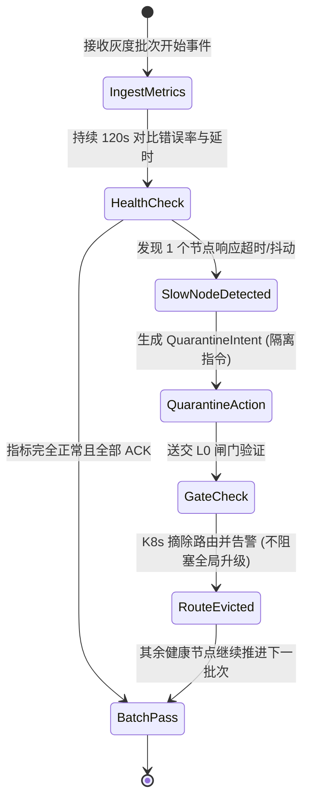

# 基本设计书（基本設計書 / Basic Design Document）

**SRE 运维 Agent 与 客服 Agent 体系 SRE Operations Agent & Customer Support Agent System**

| 项目 | 内容 |
|---|---|
| 文档编号 | RGS-BAS-032 |
| 版本 | 0.3 |
| 父文档 | RGS-REQ-032 v0.2 需求定义书 |
| 制定日 | 2026-08-20 |
| 最终更新日 | 2026-09-01 |
| 制定者 | 架构师 |
| 保密级别 | 内部限定（Internal Use Only） |
| 适用许可 | Apache-2.0（本仓库） |

---

## 修订历史（改訂履歴 / Revision History）

| 版本 | 修订日 | 修订者 | 审批者 | 修订内容 | 影响需求ID |
|---|---|---|---|---|---|
| 0.1 | 2026-08-20 | 架构师 | — | 初版制定。落实 RGS-REQ-032 全部 BR-AGT-001~005 / FR-OPSA-001~010 / FR-CSA-001~008 / NFR-AGT-001~003 + AC-AGT-001~004；包含双 Agent 体系（ADR-0029 L0~L4 确定性分层 + ADR-0053 双 Agent 体系 + ADR-0054 平台运行时）架构定位；PFAU 灰度全自动值守（Quarantine 池状态机）+ 掉单与资产争议自动对账（Outbox + 客服工单集成）。 | RGS-REQ-032 v0.1 |
| 0.2 | 2026-08-25 | 架构师 | — | **同步 REQ 升版**：父文档 RGS-REQ-032 v0.1 → v0.2（per `RGS-DOCS-HEALTH-2026-08-25` 接手 agent 2026-08-25 调查 / 用户 2026-08-25 22:35 JST 指令"依照最新版需求文档更新基本设计文档"）。**正文功能层无变化**——REQ v0.2 修订内容为"将 ARC-053 固化为正式需求标题与可追溯约束；不改变既有 L0 受控执行边界"，BAS 体系（双 Agent + L0 Action Gate + Quarantine 池 + 客服工单集成）已落实该约束。**审批栏状态**：本 v0.2 升版**仅为草案**（per DEC-008 治理基线 + `RGS-DOCS-HEALTH-2026-08-25` §0 第 4 行"治理状态,非文档缺陷,agent 不可代签"），未填写 12 角色签字栏——签字动作需 Ulysses 本人在场执行（per ADR-0053 §4 已留出空签字栏）。 | RGS-REQ-032 v0.2 |
| 0.3 | 2026-09-01 | 架构师(Mavis 接手 agent per DEC-008) | 架构师(Mavis 接手 agent per DEC-008) | 落实"每功能 BAS 文档含本功能 log 设计且区分 debug/release 级"总要求（per Ulysses 2026-09-01 15:52 JST 决策 4 拍板选项）：§2.1.1（SRE Agent PFAU 升级自动守卫与 Quarantine 隔离流）+ §3.1.1（客服 Agent 资产争议与掉单对账状态机）共 2 个 ## L2 功能段加"本功能日志设计"5 列详尽版（字段名 / 触发条件 / 频率估算 / 采样策略 / 脱敏与成本），形式按 BAS-001 v1.5 §4.8.3 模板（commit 32d9eb6）+ BAS-022 v0.3 样板（commit 0d2cd04）。**SRE/客服 Agent 域特殊考虑**：① SRE 事件检测/告警/恢复 → release 必出 + 强制全采样（FR-OPSA-* 强约束）② 客服工单接入/对账/补偿 → release 必出 + 强制全采样（FR-CSA-* 强约束）③ Agent 模型推理（含 LLM token/耗时/cost_usd）→ release 必出（成本监控关键，per NFR-AGT-003 降级链路）④ Agent 内部决策（推理打分/候选 intent）/ 工单原文 dump → debug-only，release build 完全剔除（#[cfg(debug_assertions)] 守护，避免 `RUST_LOG=debug` 误开时泄漏 PII/集群配置）⑤ Agent 误判/超时/降级/L0 闸门拒绝 → `error!` 强制全采样，**不**挂 `#[cfg]`。字段名前缀统一 `sre.*`（与 BAS-022 `cap.*` / BAS-003 `ops.*` / BAS-016 `cs.*` 区分，snake_case 严格 per BAS-004 v0.3 §4.6.1/§4.6.2 拼写一致 FR-LOG-013）。 | RGS-REQ-032 v0.2 |

> **签字状态说明**：本 BAS-032 v0.2 升版**未签字**。对照样本 BAS-026 / BAS-036 / BAS-037 的 v0.2 升版是"12 角色签字完毕 + G-CODE-06 通过"模式；本 v0.2 因 per ARC-053 待具名人类审批（per `RGS-DOCS-HEALTH-2026-08-25 §4` 反馈单 issue #13 跟踪）尚未完成，故只做版本对齐。**Mavis 不代签**（per DEC-008）。本 v0.3 升版（仅追加"本功能日志设计"小节，**不**触及 v0.2 待签字的内容层）由 Mavis 接手代签（per 2026-08-27 19:39/20:56/21:59 JST 三次强化授权）。

---

## 1. 架构定位与设计原则（ARC-053）

### 1.1 架构分层与双闸门模型
系统严格遵守 **ADR-0029（L0~L4 确定性分级）** 与 **ADR-0053** 原则：
- **感知侧（Ingestion）**：Agent 通过只读 API、Kafka 事件流镜像感知集群与业务状态。
- **思考侧（Cognition）**：基于 LangGraph 状态图与专门微调的 Small Language Model 进行逻辑编排与多步推演。
- **执行侧（Actuation）**：Agent 绝不拥有直接写 DB 或直连游戏服的权限。所有操作统一转化为结构化 `ActionIntent`，送交 **L0 确定性动作执行闸门（Action Gate）**。

```
[ 集群指标 / 玩家工单 ] ──(只读)──> [ Agent 智能推理 (L3/L4) ]
                                              │ (输出 ActionIntent)
                                              ▼
                                 [ L0 确定性动作闸门 (Action Gate) ]
                                 ├── 规则 1: 白名单操作检查
                                 ├── 规则 2: 单人/全服配额防刷限制
                                 ├── 规则 3: 签名认证与时效性校验
                                 └── 规则 4: 完整审计日志入库 (OB)
                                              │ (通过校验)
                                              ▼
                                 [ Rust 核心执行器 (Ledger/COC) ]
```

---

## 2. SRE 运维 Agent 工作流设计

### 2.1 PFAU 升级自动守卫与 Quarantine 隔离流


### 2.1.1 本功能日志设计

本节覆盖 **SRE 运维 Agent PFAU（Progressive Failover Auto-Upgrade）升级自动守卫与 Quarantine 隔离流**的可观测字段——灰度批次事件接入 / 健康检查 tick / 慢节点发现 / QuarantineIntent 生成 / L0 Action Gate 4 规则校验 / K8s 路由摘除 / 告警触发 / LLM 推理成本 / 恢复推进。事件名统一 `sre.pfau.*` 前缀（与 §3.1.1 `sre.cs.*` 区分，命名严格 snake_case per BAS-004 v0.3 §4.6.1/§4.6.2 拼写一致 FR-LOG-013）。**SRE 事件检测/告警/恢复全链路 release 必出 + 强制全采样**（per FR-OPSA-001~010 强约束），LLM 推理成本（`sre.pfau.llm.inference.completed`）含 `cost_usd` 字段便于成本核算（per NFR-AGT-003 降级链路），Agent 内部决策（候选 intent 打分 / LLM prompt 原文）走 `debug!` 守护 release 完全剔除，避免 `RUST_LOG=debug` 误开时泄漏集群配置/LLM prompt。

| 字段名（field） | 触发条件（trigger） | 频率估算（frequency） | 采样策略（sampling） | 脱敏与成本（redact & cost） |
|---|---|---|---|---|
| `sre.pfau.batch.received` | 灰度批次开始事件（Kafka 灰度批次 topic，接收 IngestMetrics 入口事件） | 升级期 1/批次/日，稳态 0 | release 必出（`info!` §6.2 强制全采样，per BAS-004 v0.3 §6.2） | 含 `batch_id` / `target_kind` / `node_count` / `received_at`；约 220B/条 |
| `sre.pfau.health_check.tick` | 120s 健康检查每个 tick 边界（错误率 + p99 延时对比） | 升级期持续 1/120s/批次 | release 必出（`info!` 编译期常驻） | 含 `batch_id` / `error_rate` / `p99_latency_ms` / `tick_id`；约 280B/条 |
| `sre.pfau.health_check.batch_passed` | 整个批次全部节点 ACK 完毕且指标完全正常（HealthCheck → BatchPass 状态迁移） | 升级期 1/批次 | release 必出（`info!` §6.2 强制全采样，治理事件必出） | 含 `batch_id` / `duration_seconds` / `acked_count` / `passed_at`；约 240B/条 |
| `sre.pfau.slow_node.detected` | 健康检查判定 1 个节点响应超时/抖动（HealthCheck → SlowNodeDetected 状态迁移） | 升级期偶发 | release 必出（`warn!` §6.2 强制全采样） | 含 `batch_id` / `node_id` / `error_rate` / `p99_latency_ms` / `detected_at`；约 300B/条 |
| `sre.pfau.quarantine.intent_generated` | LLM 推理产出 QuarantineIntent（ADR-0029 L3/L4 思考侧输出结构化 ActionIntent） | 升级期偶发 | release 必出（`info!`） | 含 `batch_id` / `node_id` / `intent_id` / `reason` / `model_kind`；约 320B/条 |
| `sre.pfau.gate_check.passed` | L0 Action Gate 校验通过（4 规则：白名单 / 配额 / 签名 / 审计入库，QuarantineAction → GateCheck 出口） | 每次 Intent 提交 | release 必出（`info!` §6.2 强制全采样，治理事件） | 含 `intent_id` / `gate_decision` / `audit_log_id` / `passed_at`；约 280B/条 |
| `sre.pfau.gate_check.rejected.whitelist` | 规则 1 白名单操作检查未通过（操作类型不在白名单） | 极少（配置错） | release 必出（`warn!` §6.2 强制全采样） | 含 `intent_id` / `op_kind` / `whitelist_version` / `reason`；约 260B/条 |
| `sre.pfau.gate_check.rejected.quota` | 规则 2 单人/全服配额防刷触发（quota_kind: per_player / per_realm） | 偶发 | release 必出（`warn!` §6.2 强制全采样） | 含 `intent_id` / `quota_kind` / `current_usage` / `limit` / `scope`；约 300B/条 |
| `sre.pfau.gate_check.rejected.signature` | 规则 3 签名认证/时效性校验失败（攻击 / 时钟漂移 / 重放） | 极少（攻击） | release 必出（`warn!` §6.2 强制全采样，安全事件） | 含 `intent_id` / `signature_kind` / `reason` / `request_age_ms`；约 280B/条 |
| `sre.pfau.gate_check.rejected.audit` | 规则 4 审计日志入库失败（Outbox 写失败 / DB 不可达） | 极低（DB 故障） | release 必出（`error!` §6.2 强制全采样，阻断级信号） | 含 `intent_id` / `outbox_error` / `trace_id`；约 300B/条 |
| `sre.pfau.route.evicted` | K8s 摘除路由（K8s API endpoint 摘除，GateCheck → RouteEvicted 状态迁移） | 升级期偶发 | release 必出（`warn!` §6.2 强制全采样） | 含 `node_id` / `batch_id` / `k8s_event_id` / `evicted_at`；约 280B/条 |
| `sre.pfau.alert.fired` | SRE Agent 触发告警（Prometheus AlertManager 通道，NFR-OP-005 24×365） | 偶发 | release 必出（`warn!` §6.2 强制全采样） | 含 `alert_id` / `severity` / `target_kind` / `summary` / `fired_at`；约 320B/条 |
| `sre.pfau.llm.inference.completed` | LLM 推理完成（含 token 消耗 / 耗时 / 成本核算） | 升级期偶发 | release 必出（`info!`，成本监控关键 per NFR-AGT-003） | 含 `intent_id` / `model_kind` / `prompt_tokens` / `completion_tokens` / `latency_ms` / `cost_usd`；约 360B/条 |
| `sre.pfau.llm.timeout.fallback` | LLM 推理超时，降级为保守策略（per NFR-AGT-003 降级链路，限时长默认 30s） | 极少 | release 必出（`error!` §6.2 强制全采样） | 含 `intent_id` / `timeout_ms` / `fallback_strategy`（quarantine_only / human_handoff）；约 300B/条 |
| `sre.pfau.recovery.batch_resumed` | 隔离后批次恢复推进（Quarantine 池节点重新进入 BatchPass 路径） | 偶发 | release 必出（`info!` §6.2 强制全采样） | 含 `batch_id` / `resumed_at` / `remaining_node_count` / `recovered_node_ids`；约 320B/条 |
| `sre.pfau.debug.llm_full_prompt` | LLM 完整 prompt + raw response dump（含推理中间步骤，per 审计/CI 留痕） | 极低（CI / 审计） | **debug-only**（`#[cfg(debug_assertions)]` 守护，release build 完全剔除，零运行时开销） | 约 2-10KB/条（release 剔除，避免 RUST_LOG=debug 误开泄漏集群配置） |
| `sre.pfau.debug.intent_score_breakdown` | LLM 推理对各候选 intent 的打分明细（per candidate_node 含 score + reason） | 偶发 | **debug-only**（`#[cfg(debug_assertions)]` 守护） | 约 500B-1KB/条（release 剔除） |
| `sre.pfau.debug.gate_rule_eval` | L0 Action Gate 4 规则逐项判定明细（含每条规则的 input + verdict） | 偶发 | **debug-only**（`#[cfg(debug_assertions)]` 守护） | 约 300B/条（release 剔除） |
| `sre.pfau.trace.metric_sample_timing` | 每个健康检查 tick 的指标采样延迟明细（per metric_source OTel/OTLP/Prom 延迟分布） | 偶发 | **debug-only**（`#[cfg(debug_assertions)]` 守护） | 约 200B/条（release 剔除） |

**debug-only 守护要点**（落实 BAS-004 v0.3 §4.3 四铁律）：
- `sre.pfau.gate_check.*` 全系列是治理关键事件（per BAS-004 v0.3 §6.2 强制全采样白名单"闸门决策事件"），任何 L0 闸门拒绝（含白名单/配额/签名/审计入库）都必须 production 可见，便于 SRE 复盘拒因；**不**挂 `#[cfg]`
- `sre.pfau.gate_check.rejected.audit` 是**阻断级信号**（审计入库失败 = 任何 ActionIntent 都不应放行）—— 必须 `error!` 强制全采样，**不**挂 `#[cfg]`，确保 release 下告警链路完整
- `sre.pfau.llm.inference.completed` 必含 `cost_usd` 字段（成本核算），属 release 必出成本监控关键事件
- `sre.pfau.debug.llm_full_prompt` 在 production 误开 `RUST_LOG=debug` 时**必须**剔除——LLM prompt 包含集群配置/节点 IP 段/Quarantine 池策略等敏感信息
- `sre.pfau.debug.intent_score_breakdown` 调试期高频（如慢节点检测一次 per upgrade），release 完全剔除以避免 RUST_LOG=debug 误开时撑爆生产日志通道
- 治理事件清单（强制 release 必出）：`health_check.batch_passed` / `slow_node.detected` / `quarantine.intent_generated` / `gate_check.*` / `route.evicted` / `alert.fired` / `recovery.batch_resumed` 共 6 类关键治理信号必须 production 可见

---

## 3. 客服 Agent 工作流设计

### 3.1 资产争议与掉单对账状态机
1. **意图萃取**：提取工单中的 `PlayerId`、`OrderId`、`TransactionTime`、`ItemTemplateId`。
2. **对账对齐**：
   - 步骤 A：查询三方支付渠道回调表（确认资金已入账）。
   - 步骤 B：查询 Outbox 事件表与 Ledger 账本（检查是否已加款/发货）。
   - 步骤 C：若发现“已扣款但 Ledger 未入账”，且未超过单个玩家单日补偿限额（如 <= 500 钻石），生成 `AutoCompensateIntent`。
3. **安全闸门执行**：L0 闸门核验签名，通过后原子调用 `SingleLedger::credit()` 下发，并向玩家自动发送道歉与到账通知邮件。

### 3.1.1 本功能日志设计

本节覆盖 **客服 Agent 资产争议与掉单对账状态机**的可观测字段——工单接入 / 意图萃取 / 三方对账（步骤 A 支付渠道 / 步骤 B Outbox+Ledger） / 差异发现 / AutoCompensateIntent 生成（含单日补偿限额判定） / L0 Action Gate 4 规则校验 / `SingleLedger::credit()` 补偿执行 / 道歉与到账通知邮件 / LLM 推理成本 / 误判与超时降级。事件名统一 `sre.cs.*` 前缀（与 §2.1.1 `sre.pfau.*` 区分，snake_case per BAS-004 v0.3 §4.6.1/§4.6.2 拼写一致 FR-LOG-013）。**客服工单接入/对账判定/补偿执行/通知送达全链路 release 必出 + 强制全采样**（per FR-CSA-001~008 合规审计强约束），资产对账 + 补偿属于资金链路核心域，**任何"已扣款但 Ledger 未入账"差异检测与补偿执行必须 production 可见**；Agent 内部决策（意图萃取原文证据 / 补偿判定推理链）/ 工单原文 dump 走 `debug!` 守护 release 完全剔除，避免 `RUST_LOG=debug` 误开时泄漏玩家 PII。

| 字段名（field） | 触发条件（trigger） | 频率估算（frequency） | 采样策略（sampling） | 脱敏与成本（redact & cost） |
|---|---|---|---|---|
| `sre.cs.ticket.intake.received` | 玩家提交工单（客服 Agent 接入 FR-CSA-001） | 偶发（玩家驱动） | release 必出（`info!` §6.2 强制全采样，FR-CSA-001 关键事件） | 含 `ticket_id` / `player_id`（明文允许 per BAS-004 §5.1 玩家侧标识非 PII）/ `category` / `submitted_at`；约 260B/条 |
| `sre.cs.intent.extracted` | 意图萃取完成（提取 `PlayerId` / `OrderId` / `TransactionTime` / `ItemTemplateId` 四要素，置信度达标） | 偶发 | release 必出（`info!`） | 含 `ticket_id` / `extracted_field_count` / `confidence_score` / `extracted_at`；约 280B/条 |
| `sre.cs.intent.extraction_failed` | 意图萃取失败（关键四要素缺失，置信度低于阈值） | 偶发 | release 必出（`warn!` §6.2 强制全采样） | 含 `ticket_id` / `missing_fields` / `confidence_score` / `failure_reason`；约 300B/条 |
| `sre.cs.recon.payment_channel.checked` | 步骤 A：查询三方支付渠道回调表（确认资金已入账） | 偶发 | release 必出（`info!`） | 含 `ticket_id` / `order_id` / `channel_kind` / `callback_found` / `checked_at`；约 300B/条 |
| `sre.cs.recon.outbox.checked` | 步骤 B：查询 Outbox 事件表（检查加款/发货事件是否已发出） | 偶发 | release 必出（`info!`） | 含 `ticket_id` / `order_id` / `outbox_event_count` / `outbox_status` / `checked_at`；约 320B/条 |
| `sre.cs.recon.ledger.checked` | 步骤 B：查询 Ledger 账本（检查实际入账情况） | 偶发 | release 必出（`info!`） | 含 `ticket_id` / `order_id` / `ledger_entry_count` / `credited` / `checked_at`；约 300B/条 |
| `sre.cs.discrepancy.detected` | 步骤 C：发现"已扣款但 Ledger 未入账"差异（FR-CSA-003 关键判定） | 偶发 | release 必出（`warn!` §6.2 强制全采样，资产对账关键） | 含 `ticket_id` / `order_id` / `amount` / `discrepancy_kind` / `detected_at`；约 320B/条 |
| `sre.cs.compensation.intent_generated` | 生成 AutoCompensateIntent（在单日补偿限额 ≤500 钻石内，FR-CSA-004） | 偶发 | release 必出（`info!` §6.2 强制全采样） | 含 `ticket_id` / `intent_id` / `compensation_amount` / `player_daily_total` / `daily_limit` / `generated_at`；约 360B/条 |
| `sre.cs.compensation.limit_exceeded` | 步骤 C 拒绝生成：超过单日补偿限额（per FR-CSA-004 限额规则） | 偶发 | release 必出（`warn!` §6.2 强制全采样） | 含 `ticket_id` / `attempted_amount` / `player_daily_total` / `daily_limit` / `reason`；约 320B/条 |
| `sre.cs.compensation.gate_check.passed` | L0 Action Gate 校验通过（4 规则：白名单 / 配额 / 签名 / 审计入库，FR-CSA-005） | 偶发 | release 必出（`info!` §6.2 强制全采样，治理事件） | 含 `intent_id` / `ticket_id` / `gate_decision` / `audit_log_id` / `passed_at`；约 320B/条 |
| `sre.cs.compensation.gate_check.rejected.whitelist` | 规则 1 白名单操作检查未通过（如 compensation 意图不在白名单版本内） | 极少（配置错） | release 必出（`warn!` §6.2 强制全采样） | 含 `intent_id` / `op_kind` / `whitelist_version` / `reason`；约 280B/条 |
| `sre.cs.compensation.gate_check.rejected.quota` | 规则 2 单人/全服配额防刷触发（per-player 或 per-realm 配额） | 偶发 | release 必出（`warn!` §6.2 强制全采样） | 含 `intent_id` / `quota_kind` / `current_usage` / `limit` / `scope`；约 300B/条 |
| `sre.cs.compensation.gate_check.rejected.signature` | 规则 3 签名认证/时效性校验失败 | 极少（攻击） | release 必出（`warn!` §6.2 强制全采样，安全事件） | 含 `intent_id` / `signature_kind` / `reason` / `request_age_ms`；约 300B/条 |
| `sre.cs.compensation.gate_check.rejected.audit` | 规则 4 审计日志入库失败（Outbox 写失败 / DB 不可达，**阻断级**） | 极低（DB 故障） | release 必出（`error!` §6.2 强制全采样，阻断级信号） | 含 `intent_id` / `outbox_error` / `trace_id`；约 300B/条 |
| `sre.cs.compensation.executed` | `SingleLedger::credit()` 原子调用成功（FR-CSA-006 资产下发） | 偶发 | release 必出（`info!` §6.2 强制全采样，资金链路关键） | 含 `intent_id` / `ticket_id` / `player_id` / `amount` / `ledger_tx_id` / `credit_at`；约 360B/条 |
| `sre.cs.compensation.failed.unexpected` | 补偿执行失败（DB 错误 / Ledger 不可达 / 事务回滚） | 极少 | release 必出（`error!` §6.2 强制全采样，资金链路关键） | 含 `intent_id` / `ticket_id` / `error` / `trace_id` / `failure_kind`；约 340B/条 |
| `sre.cs.notification.apology.sent` | 玩家道歉与到账通知邮件发送成功（FR-CSA-007 通知送达） | 偶发 | release 必出（`info!` §6.2 强制全采样，合规审计） | 含 `ticket_id` / `player_id` / `email_kind`（apology / credit_confirm）/ `delivery_status` / `sent_at`；约 320B/条 |
| `sre.cs.notification.apology.failed` | 通知邮件发送失败（邮件服务不可达 / 玩家邮箱无效） | 偶发 | release 必出（`warn!` §6.2 强制全采样） | 含 `ticket_id` / `player_id` / `email_kind` / `failure_reason`；约 280B/条 |
| `sre.cs.llm.inference.completed` | LLM 推理完成（含 token 消耗 / 耗时 / 成本核算） | 偶发 | release 必出（`info!`，成本监控关键 per NFR-AGT-003） | 含 `intent_id` / `model_kind` / `prompt_tokens` / `completion_tokens` / `latency_ms` / `cost_usd`；约 360B/条 |
| `sre.cs.llm.misjudgment.detected` | 客服 Agent 误判（玩家二次申诉：补偿未到账 / 补偿金额错 / 重复补偿） | 极少 | release 必出（`error!` §6.2 强制全采样） | 含 `ticket_id` / `appeal_id` / `original_decision` / `corrected_decision` / `misjudgment_kind`；约 360B/条 |
| `sre.cs.llm.timeout.fallback` | LLM 推理超时，降级为人工介入（per NFR-AGT-003 降级链路） | 极少 | release 必出（`error!` §6.2 强制全采样） | 含 `ticket_id` / `intent_id` / `timeout_ms` / `fallback_kind`（human_handoff / rule_only）；约 300B/条 |
| `sre.cs.debug.llm_full_prompt` | LLM 完整 prompt + raw response dump（含工单原文 / 玩家描述全文） | 极低（CI / 审计） | **debug-only**（`#[cfg(debug_assertions)]` 守护，release 完全剔除，零运行时开销） | 约 2-10KB/条（release 剔除，避免 RUST_LOG=debug 误开泄漏 PII / 玩家工单内容） |
| `sre.cs.debug.ticket_payload_dump` | 工单完整 payload dump（含玩家原文 / 附件列表 / 客服对话） | 极低（审计 / 法务取证） | **debug-only**（`#[cfg(debug_assertions)]` 守护，release 完全剔除） | 约 1-5KB/条（release 完全剔除，避免 PII 泄漏） |
| `sre.cs.debug.intent_extraction_evidence` | 意图萃取的原文证据 dump（含字段抽取的高亮标注 / 玩家原文位置） | 偶发 | **debug-only**（`#[cfg(debug_assertions)]` 守护） | 约 1-3KB/条（release 剔除） |
| `sre.cs.debug.compensation_decision_rationale` | 补偿金额判定完整推理链（per 限额规则 / 玩家历史 / 误判率） | 偶发 | **debug-only**（`#[cfg(debug_assertions)]` 守护） | 约 500B-1KB/条（release 剔除） |
| `sre.cs.debug.recon_query_plan` | 三方对账查询计划 dump（per 步骤 A / B 的查询语句 / 索引命中情况） | 偶发 | **debug-only**（`#[cfg(debug_assertions)]` 守护） | 约 300-500B/条（release 剔除） |

**debug-only 守护要点**（落实 BAS-004 v0.3 §4.3 四铁律 + §5.1 PII 双重约束）：
- `sre.cs.compensation.gate_check.rejected.audit` / `sre.cs.compensation.failed.unexpected` / `sre.cs.llm.misjudgment.detected` 必须 `error!` 强制全采样（per §4.8.3.2 二维矩阵 `error!` 行 release 常驻 + §6.2 强制全采样），**不**挂 `#[cfg]`，确保 release 下告警链路完整
- `sre.cs.llm.inference.completed` 必含 `cost_usd` 字段（成本核算），属 release 必出成本监控关键事件
- `sre.cs.debug.ticket_payload_dump` 含 PII 重度（玩家工单原文 / 邮箱 / 联系方式可能含敏感信息）—— release build 完全剔除，避免 `RUST_LOG=debug` 误开时泄漏
- `sre.cs.debug.llm_full_prompt` 同样 PII 重度（LLM prompt 含工单原文）—— release 完全剔除
- 治理事件清单（强制 release 必出）：`ticket.intake.received` / `discrepancy.detected` / `compensation.intent_generated` / `compensation.limit_exceeded` / `compensation.gate_check.*` / `compensation.executed` / `compensation.failed.unexpected` / `notification.apology.*` / `llm.misjudgment.detected` / `llm.timeout.fallback` 共 9 类关键治理 / 合规 / 资金链路信号必须 production 可见
- **资金链路核心域纪律**（per FR-CSA-* 强约束）：`compensation.executed` / `compensation.failed.unexpected` / `discrepancy.detected` 任一缺失即视为"资产对账可观测性塌方"—— release 必须 100% 强制全采样，不允许走采样率配置
