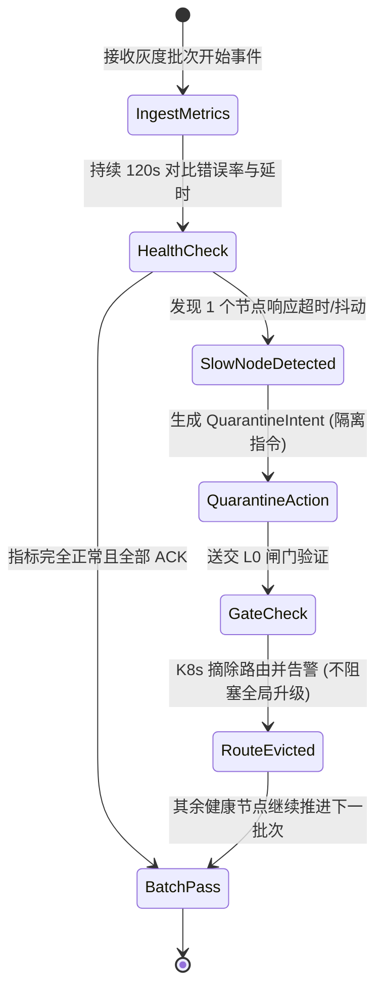

# 基本设计书（基本設計書 / Basic Design Document）

**SRE 运维 Agent 与 客服 Agent 体系 SRE Operations Agent & Customer Support Agent System**

| 项目 | 内容 |
|---|---|
| 文档编号 | RGS-BAS-032 |
| 版本 | 0.1 |
| 父文档 | RGS-REQ-032 需求定义书 |
| 制定日 | 2026-08-20 |
| 最终更新日 | 2026-08-20 |
| 制定者 | 架构师 |
| 保密级别 | 内部限定（Internal Use Only） |
| 适用许可 | Apache-2.0（本仓库） |

---

## 1. 架构定位与设计原则（ARC-053）

### 1.1 架构分层与双闸门模型
系统严格遵守 **ADR-0029（L0~L4 确定性分级）** 与 **ADR-0053** 原则：
- **感知侧（Ingestion）**：Agent 通过只读 API、Kafka 事件流镜像感知集群与业务状态。
- **思考侧（Cognition）**：基于 LangGraph 状态图与专门微调的 Small Language Model 进行逻辑编排与多步推演。
- **执行侧（Actuation）**：Agent 绝不拥有直接写 DB 或直连游戏服的权限。所有操作统一转化为结构化 `ActionIntent`，送交 **L0 确定性动作执行闸门（Action Gate）**。

```
[ 集群指标 / 玩家工单 ] ──(只读)──> [ Agent 智能推理 (L3/L4) ]
                                              │ (输出 ActionIntent)
                                              ▼
                                 [ L0 确定性动作闸门 (Action Gate) ]
                                 ├── 规则 1: 白名单操作检查
                                 ├── 规则 2: 单人/全服配额防刷限制
                                 ├── 规则 3: 签名认证与时效性校验
                                 └── 规则 4: 完整审计日志入库 (OB)
                                              │ (通过校验)
                                              ▼
                                 [ Rust 核心执行器 (Ledger/COC) ]
```

---

## 2. SRE 运维 Agent 工作流设计

### 2.1 PFAU 升级自动守卫与 Quarantine 隔离流


---

## 3. 客服 Agent 工作流设计

### 3.1 资产争议与掉单对账状态机
1. **意图萃取**：提取工单中的 `PlayerId`、`OrderId`、`TransactionTime`、`ItemTemplateId`。
2. **对账对齐**：
   - 步骤 A：查询三方支付渠道回调表（确认资金已入账）。
   - 步骤 B：查询 Outbox 事件表与 Ledger 账本（检查是否已加款/发货）。
   - 步骤 C：若发现“已扣款但 Ledger 未入账”，且未超过单个玩家单日补偿限额（如 <= 500 钻石），生成 `AutoCompensateIntent`。
3. **安全闸门执行**：L0 闸门核验签名，通过后原子调用 `SingleLedger::credit()` 下发，并向玩家自动发送道歉与到账通知邮件。
