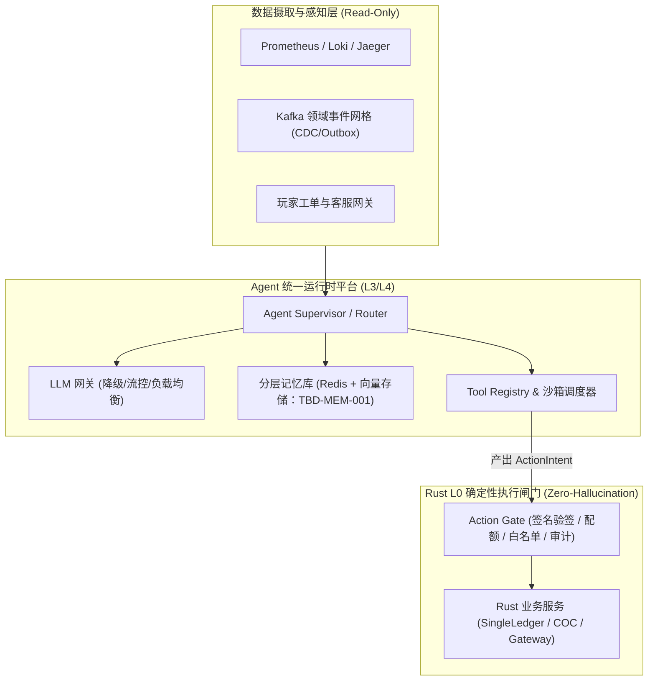

# 基本设计书（基本設計書 / Basic Design Document）

**Agent 平台底座与通用运行时 — Agent Platform Infrastructure & Universal Runtime**

| 项目 | 内容 |
|---|---|
| 文档编号 | RGS-BAS-033 |
| 版本 | 0.2 |
| 父文档 | RGS-REQ-033 v0.2 需求定义书 |
| 制定日 | 2026-08-20 |
| 最终更新日 | 2026-08-25 |
| 制定者 | 架构师 |
| 保密级别 | 内部限定（Internal Use Only） |
| 适用许可 | Apache-2.0（本仓库） |

---

## 修订历史（改訂履歴 / Revision History）

| 版本 | 修订日 | 修订者 | 审批者 | 修订内容 | 影响需求ID |
|---|---|---|---|---|---|
| 0.1 | 2026-08-20 | 架构师 | — | 初版制定。落实 RGS-REQ-033 全部 BR-AGP-001~005 / FR-AGP-001~012 / NFR-AGP-001~003 + AC-AGP-001~004；包含平台层架构（ARC-054 智能体平台统一运行时 + ADR-0029 L0~L4 确定性防幻觉平台基准）；Ingestion Layer（Prometheus/Loki/Jaeger/Kafka 事件只读 API） + Agent Platform（Supervisor/Router + LLM Gateway + Memory Store + Tool Sandbox） + Deterministic Core（Action Gate + Rust 业务核心）。 | RGS-REQ-033 v0.1 |
| 0.2 | 2026-08-25 | 架构师 | — | **同步 REQ 升版**：父文档 RGS-REQ-033 v0.1 → v0.2（per `RGS-DOCS-HEALTH-2026-08-25` 接手 agent 2026-08-25 调查 / 用户 2026-08-25 22:35 JST 指令"依照最新版需求文档更新基本设计文档"）。**正文功能层无变化**——REQ v0.2 修订内容为"将 ARC-054 固化为正式需求标题与可追溯约束；不改变既有受控执行边界"，BAS 平台层架构（Ingestion + Agent Platform + Deterministic Core 三层 + L0 Action Gate）已落实该约束。**审批栏状态**：本 v0.2 升版**仅为草案**（per DEC-008 治理基线 + `RGS-DOCS-HEALTH-2026-08-25` §0 第 4 行"治理状态,非文档缺陷,agent 不可代签"），未填写 12 角色签字栏——签字动作需 Ulysses 本人在场执行（per ADR-0054 §3 已留出空签字栏）。 | RGS-REQ-033 v0.2 |

> **签字状态说明**：本 BAS-033 v0.2 升版**未签字**。ARC-054 待具名人类审批（per `RGS-DOCS-HEALTH-2026-08-25 §4` 反馈单 issue #13 跟踪）尚未完成，故只做版本对齐。**Mavis 不代签**（per DEC-008）。

---

## 1. 平台总体架构设计（ARC-054）

---

## 2. 核心模块与职责划分

1. **Agent Supervisor & Router**：
   - 负责任务分发、意图识别与上下文组装。采用 LangGraph 构建状态转移拓扑。
2. **分层记忆存储系统（Memory Store）**：
   - **短期记忆（Working Memory）**：保存在当前任务执行上下文（Memory Checkpoint）。
   - **长期记忆（Semantic Memory）**：基于 `pgvector` 存储经过语义提取的 Fact Triples，提供混合检索（BM25 + Dense Vector）。
3. **L0 动作闸门（Action Gate）**：
    - 部署在 Rust 服务边界，作为不可穿透的安全单向阀。
4. **向量存储选型状态**：
    - 长期记忆的向量存储尚未选定；`pgvector` 与 `Milvus` 均为候选，登记为 **TBD-MEM-001**。在附件 D 登记、许可/OLU/容量评估及具名人类审批完成前，不得作为已决技术选型或生产依赖。
