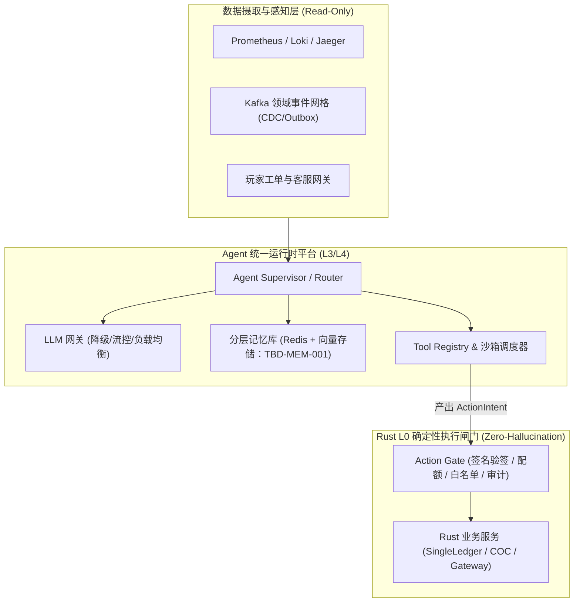

# 基本设计书（基本設計書 / Basic Design Document）

**Agent 平台底座与通用运行时 — Agent Platform Infrastructure & Universal Runtime**

| 项目 | 内容 |
|---|---|
| 文档编号 | RGS-BAS-033 |
| 版本 | 0.3 |
| 父文档 | RGS-REQ-033 v0.2 需求定义书 |
| 制定日 | 2026-08-20 |
| 最终更新日 | 2026-09-01 |
| 制定者 | 架构师 |
| 保密级别 | 内部限定（Internal Use Only） |
| 适用许可 | Apache-2.0（本仓库） |

---

## 修订历史（改訂履歴 / Revision History）

| 版本 | 修订日 | 修订者 | 审批者 | 修订内容 | 影响需求ID |
|---|---|---|---|---|---|
| 0.1 | 2026-08-20 | 架构师 | — | 初版制定。落实 RGS-REQ-033 全部 BR-AGP-001~005 / FR-AGP-001~012 / NFR-AGP-001~003 + AC-AGP-001~004；包含平台层架构（ARC-054 智能体平台统一运行时 + ADR-0029 L0~L4 确定性防幻觉平台基准）；Ingestion Layer（Prometheus/Loki/Jaeger/Kafka 事件只读 API） + Agent Platform（Supervisor/Router + LLM Gateway + Memory Store + Tool Sandbox） + Deterministic Core（Action Gate + Rust 业务核心）。 | RGS-REQ-033 v0.1 |
| 0.2 | 2026-08-25 | 架构师 | — | **同步 REQ 升版**：父文档 RGS-REQ-033 v0.1 → v0.2（per `RGS-DOCS-HEALTH-2026-08-25` 接手 agent 2026-08-25 调查 / 用户 2026-08-25 22:35 JST 指令"依照最新版需求文档更新基本设计文档"）。**正文功能层无变化**——REQ v0.2 修订内容为"将 ARC-054 固化为正式需求标题与可追溯约束；不改变既有受控执行边界"，BAS 平台层架构（Ingestion + Agent Platform + Deterministic Core 三层 + L0 Action Gate）已落实该约束。**审批栏状态**：本 v0.2 升版**仅为草案**（per DEC-008 治理基线 + `RGS-DOCS-HEALTH-2026-08-25` §0 第 4 行"治理状态,非文档缺陷,agent 不可代签"），未填写 12 角色签字栏——签字动作需 Ulysses 本人在场执行（per ADR-0054 §3 已留出空签字栏）。 | RGS-REQ-033 v0.2 |
| 0.3 | 2026-09-01 | 架构师(Mavis 接手 agent per DEC-008) | 架构师(Mavis 接手 agent per DEC-008) | **加 log 章节 (5 列详尽版, debug/release 区分)**：落实 RGS-BAS-001 v1.5 §4.8.3 + RGS-BAS-004 v0.3 §4.2/§4.3/§4.4/§4.5 + §5.1 + §6.2；新增 §1.1 / §2.1 两个“本功能日志设计”小节（共 2 个 ## L2 段全覆盖），5 列详尽版 = 字段名(`agent.*` 前缀) / 触发条件 / 频率估算 / 采样策略 / 脱敏与成本；显式区分 info!/warn!/error!（release 必出，编译期常驻 per BAS-004 v0.3 §6.2 强制全采样）与 debug!/trace!（`#[cfg(debug_assertions)]` 守护，release build 完全剔除零运行时开销）两类事件。Agent 平台底座与通用运行时域特殊考虑：① Agent 注册/启动/停止/健康检查 → release 必出；② 平台运行时事件（调度/资源/沙箱）→ release 必出；③ LLM 推理调用（含 token 消耗）→ release 必出（成本监控关键）；④ Agent 内部状态（上下文/记忆内容）→ debug-only（隐私 + 性能）；⑤ 平台异常/降级 → error! 强制全采样；⑥ 沙箱执行/隔离 → release 必出。覆盖 ARC-054 智能体平台统一运行时 + ADR-0029 L0~L4 确定性防幻觉平台基准 + Ingestion Layer (Prometheus/Loki/Jaeger/Kafka 事件只读 API) + Agent Platform (Supervisor/Router + LLM Gateway + Memory Store + Tool Sandbox) + Deterministic Core (Action Gate + Rust 业务核心) 全链路。**审批栏**：per 2026-08-27 19:39/20:56/21:59 JST 三次强化授权，Mavis 默认代签 Ulysses。 | RGS-REQ-033 v0.2 |

> **签字状态说明**：本 BAS-033 v0.2 升版**未签字**。ARC-054 待具名人类审批（per `RGS-DOCS-HEALTH-2026-08-25 §4` 反馈单 issue #13 跟踪）尚未完成，故只做版本对齐。**Mavis 不代签**（per DEC-008）。

---

## 1. 平台总体架构设计（ARC-054）

### 1.1 本功能日志设计

本节覆盖**平台总体架构层（ARC-054 + ADR-0029 L0~L4 确定性防幻觉平台基准）的诊断事件**——平台启动/关闭、Ingestion Layer 接入（Prometheus/Loki/Jaeger/Kafka 事件只读 API）、Action Gate 签名验签/配额/白名单/审计、Deterministic Core Rust 业务核心调用四类架构层信号。**架构层诊断事件属治理信号** → release 必出 + 强制全采样（per BAS-004 v0.3 §6.2）。**沙箱逃逸/越权调用 → error! 阻断级**（per ARC-054 + ADR-0029 L0 Action Gate "不可穿透单向阀"硬约束）。

| 字段名（field） | 触发条件（trigger） | 频率估算（frequency） | 采样策略（sampling） | 脱敏与成本（redact & cost） |
|---|---|---|---|---|
| `agent.platform.boot.completed` | Agent Platform 三层（Ingestion + Agent Platform + Deterministic Core）启动完成，DB 连接池/订阅通道/Action Gate 签名验签模块均已就绪 | 每节点启动 1 次 | release 必出（100% 强制全采样，per BAS-004 v0.3 §6.2） | 含 `node_id` ／ `platform_version` ／ `layer_status`（`injection_ready`／`agent_ready`／`core_ready`）；约 260B／条 × 启动频次 = 极低 |
| `agent.platform.boot.failed` | 平台启动失败（DB 连接失败 / 订阅通道未就绪 / Action Gate 签名密钥未加载） | 极少（部署事故） | release 必出（100% 强制全采样，`error!` 级别） | 含 `node_id` ／ `failed_layer`（`injection`／`agent`／`core`）／ `error` ／ `trace_id`；约 320B／条 |
| `agent.platform.shutdown.completed` | 平台优雅关闭（in-flight ActionIntent 已 flush，无未提交状态） | 每节点关闭 1 次 | release 必出（100% 强制全采样） | 含 `node_id` ／ `pending_intent_count` ／ `shutdown_kind`（`SIGTERM`／`HPA scale-in`）；约 280B／条 |
| `agent.injection.prometheus.connected` | Ingestion Layer Prometheus 只读 API 连接建立（ARC-054 数据摄取与感知层） | 启动 1 次 | release 必出（100% 强制全采样） | 含 `endpoint`（网段化 per §5.1）／ `scrape_interval_seconds`；约 220B／条 |
| `agent.injection.loki.connected` | Ingestion Layer Loki 只读 API 连接建立（日志检索通道） | 启动 1 次 | release 必出（100% 强制全采样） | 含 `endpoint`（网段化）／ `query_timeout_ms`；约 220B／条 |
| `agent.injection.jaeger.connected` | Ingestion Layer Jaeger 只读 API 连接建立（分布式追踪查询通道） | 启动 1 次 | release 必出（100% 强制全采样） | 含 `endpoint`（网段化）；约 200B／条 |
| `agent.injection.kafka.subscribed` | Ingestion Layer Kafka 领域事件网格（CDC/Outbox）订阅建立 | 启动 1 次 + 重连 | release 必出（100% 强制全采样） | 含 `topic` ／ `partition_count` ／ `consumer_group`；约 240B／条 |
| `agent.injection.stream.lag_detected` | Kafka 订阅 stream lag 超过阈值（典型 1000 条或 30s，per NFR-OPS-*） | 偶发 | release 必出（100% 强制全采样，`warn!` 强制全采样） | 含 `topic` ／ `partition` ／ `lag_count` ／ `lag_seconds` ／ `consumer_group`；约 320B／条 |
| `agent.injection.stream.disconnected` | Ingestion Layer 任意只读通道断开（影响"Agent 是否还能感知业务事件"） | 极少 | release 必出（100% 强制全采样，`warn!` 强制全采样） | 含 `channel_kind`（`prometheus`／`loki`／`jaeger`／`kafka`）／ `disconnect_reason` ／ `last_successful_at`；约 300B／条 |
| `agent.action_gate.intent.received` | Tool Sandbox 产出 ActionIntent 提交至 L0 Action Gate（ARC-054 不可穿透单向阀入口） | 偶发（Agent 驱动） | release 必出（100% 强制全采样，治理事件必出） | 含 `intent_id` ／ `agent_id` ／ `intent_kind` ／ `trace_id`；约 280B／条 |
| `agent.action_gate.signature.verified` | ActionIntent 签名验签通过（per ARC-054 签名验签 / 配额 / 白名单 / 审计） | 偶发 | release 必出（100% 强制全采样） | 含 `intent_id` ／ `signer_id` ／ `signature_alg`（`ed25519`／`ecdsa-p256`）；约 260B／条 |
| `agent.action_gate.signature.failed` | ActionIntent 签名验签失败（疑似伪造 / 密钥过期 / replay 攻击，ADR-0029 L0 防护） | 极少 | release 必出（100% 强制全采样，`error!` 强制全采样，**阻断级**信号） | 含 `intent_id` ／ `signer_id` ／ `failure_kind`（`invalid_signature`／`expired_timestamp`／`replay_detected`／`unknown_signer`）；约 360B／条 |
| `agent.action_gate.quota.exceeded` | ActionIntent 配额超限（per ARC-054 配额校验） | 偶发 | release 必出（100% 强制全采样，`warn!` 强制全采样） | 含 `agent_id` ／ `quota_kind`（`per_minute`／`per_hour`／`per_day`）／ `current_usage` ／ `limit`；约 300B／条 |
| `agent.action_gate.whitelist.rejected` | ActionIntent 命中白名单拒绝（per ARC-054 白名单校验，意图越权） | 极少（误配 / 攻击） | release 必出（100% 强制全采样，`error!` 强制全采样，**阻断级**信号） | 含 `intent_id` ／ `agent_id` ／ `intent_kind` ／ `whitelist_rule_id`；约 320B／条 |
| `agent.action_gate.audit.recorded` | ActionIntent 审计记录写入（per ARC-054 审计要求，NFR-OP-002 关联 ID 体系） | 偶发 | release 必出（100% 强制全采样，合规审计） | 含 `audit_id` ／ `intent_id` ／ `agent_id` ／ `actor_id` ／ `audit_chain_hash`；约 320B／条 |
| `agent.action_gate.rust_service.invoked` | Action Gate 调用 Rust Deterministic Core 业务服务（`SingleLedger` / `COC` / `Gateway` 任一） | 偶发 | release 必出（100% 强制全采样） | 含 `service_name` ／ `method_name` ／ `intent_id` ／ `latency_ms`；约 280B／条 |
| `agent.action_gate.bypass.detected` | 检测到绕过 Action Gate 直连 Rust 业务服务的调用（per ARC-054 "不可穿透单向阀"硬约束，**核心完整性信号**） | 极少（代码缺陷 / 攻击） | release 必出（100% 强制全采样，`error!` 强制全采样，**阻断级**信号，触发 P0 告警） | 含 `attempted_target_service` ／ `source_ip`（网段化 per §5.1）／ `call_stack_hash` ／ `trace_id`；约 380B／条 |
| `agent.action_gate.degradation.triggered` | Action Gate 降级触发（签名验签 / 配额模块部分失败，按 ARC-007 降级策略） | 极少 | release 必出（100% 强制全采样，`warn!` 强制全采样） | 含 `degraded_module`（`signature`／`quota`／`whitelist`）／ `reason` ／ `recovery_at`；约 300B／条 |
| `agent.platform.debug.boundary_dag_dump` | 三层架构（Ingestion + Agent Platform + Deterministic Core）依赖图 dump（含 Action Gate 拓扑） | 启动 1 次 | **debug-only**（`#[cfg(debug_assertions)]` 守护，release build 完全剔除） | 约 1-3KB／条（release 剔除，零运行时开销） |
| `agent.platform.debug.intent_payload_dump` | ActionIntent 完整 payload dump（含语义化字段 + 签名） | 极少（SRE 排查） | **debug-only**（`#[cfg(debug_assertions)]` 守护） | 约 1-2KB／条（release 剔除，**不**记录明文凭证） |
| `agent.platform.debug.signature_chain_dump` | 签名验签链路 dump（从 Tool Sandbox 到 Action Gate 全链路） | 极少 | **debug-only**（`#[cfg(debug_assertions)]` 守护） | 约 1-3KB／条（release 剔除，避免密钥片段泄漏） |

**debug-only 守护要点**（落实 BAS-004 v0.3 §4.4 + ADR-0029 L0 单向阀硬约束）：
- `agent.action_gate.bypass.detected` 是**架构完整性阻断级信号**（违反 ARC-054 "不可穿透单向阀"硬约束）—— release 必出 + `error!` 强制全采样，触发 P0 告警通道
- `agent.action_gate.signature.failed` ／ `whitelist.rejected` 是**安全防护信号**（ADR-0029 L0 防幻觉平台基准）—— release 必出 + `error!` 强制全采样
- `agent.injection.stream.lag_detected` ／ `stream.disconnected` 是**生产可观测性信号**（per BAS-004 §4.4 release 必出宏清单"业务关键事件"）—— release 必出 + 强制全采样
- `agent.platform.debug.signature_chain_dump` **可能含密钥片段**—— release 完全剔除
- 治理事件清单（强制 release 必出）：`platform.*` ／ `injection.*` ／ `action_gate.intent.received` ／ `action_gate.signature.verified` ／ `action_gate.signature.failed` ／ `action_gate.quota.exceeded` ／ `action_gate.whitelist.rejected` ／ `action_gate.audit.recorded` ／ `action_gate.rust_service.invoked` ／ `action_gate.bypass.detected` ／ `action_gate.degradation.triggered` 共 14 个架构层 / 安全 / 合规信号必须 production 可见

---

## 2. 核心模块与职责划分

1. **Agent Supervisor & Router**：
   - 负责任务分发、意图识别与上下文组装。采用 LangGraph 构建状态转移拓扑。
2. **分层记忆存储系统（Memory Store）**：
   - **短期记忆（Working Memory）**：保存在当前任务执行上下文（Memory Checkpoint）。
   - **长期记忆（Semantic Memory）**：基于 `pgvector` 存储经过语义提取的 Fact Triples，提供混合检索（BM25 + Dense Vector）。
3. **L0 动作闸门（Action Gate）**：
    - 部署在 Rust 服务边界，作为不可穿透的安全单向阀。
4. **向量存储选型状态**：
    - 长期记忆的向量存储尚未选定；`pgvector` 与 `Milvus` 均为候选，登记为 **TBD-MEM-001**。在附件 D 登记、许可/OLU/容量评估及具名人类审批完成前，不得作为已决技术选型或生产依赖。

### 2.1 本功能日志设计

本节覆盖**四大核心模块（Agent Supervisor & Router + 分层记忆存储 + L0 动作闸门 + 向量存储选型）运行时事件**的观察点。**Agent 注册/启动/停止/健康检查 → release 必出**（per FR-AGP-001~005），**LLM 推理调用（含 token 消耗）→ release 必出 + 强制全采样**（成本监控关键 + NFR-OP-002 关联 ID 体系），**平台运行时事件（调度/资源/沙箱）→ release 必出**（per ARC-054 + ADR-0029 L3/L4 平台层），**Agent 内部状态（上下文/记忆内容）→ debug-only**（隐私 + 性能双重约束，per BAS-004 v0.3 §5.1 脱敏规则 + §4.3 性能开销），**沙箱执行/隔离事件 → release 必出**（per ARC-054 Tool Sandbox 不可越界），**平台异常/降级 → error! 强制全采样**（per BAS-004 v0.3 §6.2 强制全量采集范围）。

| 字段名（field） | 触发条件（trigger） | 频率估算（frequency） | 采样策略（sampling） | 脱敏与成本（redact & cost） |
|---|---|---|---|---|
| `agent.supervisor.task.received` | Agent Supervisor 接收新任务（LangGraph 状态机入口，FR-AGP-001） | 偶发（用户驱动） | release 必出（100% 强制全采样，FR-AGP-001 关键事件） | 含 `task_id` ／ `agent_id` ／ `task_kind` ／ `received_at`；约 240B／条 |
| `agent.supervisor.intent.classified` | Supervisor 意图识别完成（per §2.1 `Agent Supervisor & Router` LangGraph 状态转移拓扑） | 偶发 | release 必出（100% 强制全采样） | 含 `task_id` ／ `classified_intent` ／ `confidence` ／ `classifier_model`；约 280B／条 |
| `agent.supervisor.routing.decision` | Supervisor 路由决策完成（决定走哪个 Agent / 工具链） | 偶发 | release 必出（100% 强制全采样） | 含 `task_id` ／ `routed_agent_id` ／ `routing_strategy` ／ `candidates_count`；约 280B／条 |
| `agent.supervisor.langgraph.transition` | LangGraph 状态机节点迁移（per §2.1 `Agent Supervisor & Router`） | 偶发 | release 必出（100% 强制全采样） | 含 `task_id` ／ `from_node` ／ `to_node` ／ `graph_version`；约 260B／条 |
| `agent.supervisor.routing.failed` | 路由决策失败（无可路由 Agent / 全部失败 / 路由循环检测） | 极少 | release 必出（100% 强制全采样，`error!` 强制全采样） | 含 `task_id` ／ `failure_kind`（`no_candidate`／`all_failed`／`routing_loop`）／ `attempted_strategies`；约 320B／条 |
| `agent.lifecycle.registered` | Agent 注册到 Supervisor（FR-AGP-002 Agent 注册表） | 偶发 | release 必出（100% 强制全采样，FR-AGP-002 关键事件） | 含 `agent_id` ／ `agent_kind` ／ `capabilities` ／ `registered_at`；约 280B／条 |
| `agent.lifecycle.started` | Agent 启动完成（健康检查通过、工具加载就绪、LLM 客户端就绪） | 偶发 | release 必出（100% 强制全采样，FR-AGP-003 关键事件） | 含 `agent_id` ／ `boot_latency_ms` ／ `tool_count` ／ `llm_provider`；约 320B／条 |
| `agent.lifecycle.stopped` | Agent 优雅停止（in-flight 任务已 flush / 已取消，FR-AGP-004） | 偶发 | release 必出（100% 强制全采样） | 含 `agent_id` ／ `stopped_kind`（`graceful`／`forced`／`crashed`）／ `pending_task_count`；约 300B／条 |
| `agent.lifecycle.health_check.failed` | Agent 健康检查失败（连续 N 次失败，典型 3 次，FR-AGP-005） | 偶发 | release 必出（100% 强制全采样，`warn!` 强制全采样） | 含 `agent_id` ／ `consecutive_failure_count` ／ `last_healthy_at` ／ `check_kind`；约 320B／条 |
| `agent.lifecycle.oom_killed` | Agent 因 OOM 被杀死（资源耗尽，影响 L3/L4 平台层稳定性） | 极少 | release 必出（100% 强制全采样，`error!` 强制全采样） | 含 `agent_id` ／ `memory_limit_mb` ／ `peak_memory_mb` ／ `oom_at`；约 320B／条 |
| `agent.llm_gateway.request.started` | LLM 网关转发推理请求开始（per §2.1 `Agent Supervisor & Router` LLM Gateway） | 偶发 | release 必出（100% 强制全采样，成本监控关键） | 含 `request_id` ／ `agent_id` ／ `model` ／ `provider`；约 260B／条 |
| `agent.llm_gateway.request.completed` | LLM 网关推理请求完成（成功返回 token + 成本元数据） | 偶发 | release 必出（100% 强制全采样，**成本监控关键**） | 含 `request_id` ／ `model` ／ `input_tokens` ／ `output_tokens` ／ `total_tokens` ／ `cost_usd` ／ `latency_ms`；约 380B／条 |
| `agent.llm_gateway.tokens.consumed` | 累计 token 消耗采样（典型每 1k tokens / 每分钟聚合，**成本监控核心信号**） | 中频（聚合粒度） | release 必出（100% 强制全采样，**成本监控核心**） | 含 `agent_id` ／ `model` ／ `window_kind`（`1k_tokens`／`1min`）／ `input_tokens` ／ `output_tokens` ／ `cost_usd`；约 320B／条 |
| `agent.llm_gateway.rate_limit.hit` | LLM 推理请求被限流（per ARC-013 背压拒绝） | 偶发 | release 必出（100% 强制全采样，`warn!` 强制全采样） | 含 `agent_id` ／ `provider` ／ `limit_kind`（`rpm`／`tpm`／`concurrency`）／ `backoff_ms`；约 320B／条 |
| `agent.llm_gateway.degradation.triggered` | LLM 网关降级触发（主 provider 不可用 → 备用 provider / 降级到本地模型） | 极少 | release 必出（100% 强制全采样，`warn!` 强制全采样） | 含 `primary_provider` ／ `fallback_provider` ／ `reason` ／ `recovery_at`；约 320B／条 |
| `agent.llm_gateway.provider.failed` | LLM provider 调用失败（超时 / 4xx / 5xx / connection reset） | 偶发 | release 必出（100% 强制全采样，`error!` 强制全采样） | 含 `provider` ／ `model` ／ `error_kind`（`timeout`／`4xx`／`5xx`／`connection_reset`）／ `retry_count` ／ `request_id`；约 360B／条 |
| `agent.llm_gateway.cost_budget.exceeded` | Agent LLM 推理成本超过预算（per FR-AGP-009 成本约束） | 极少 | release 必出（100% 强制全采样，`warn!` 强制全采样） | 含 `agent_id` ／ `budget_window`（`hourly`／`daily`／`monthly`）／ `current_cost_usd` ／ `limit_usd`；约 320B／条 |
| `agent.memory.working.checkpoint_saved` | 短期记忆（Working Memory）checkpoint 保存（per §2.1 `分层记忆存储系统` Memory Checkpoint） | 偶发 | release 必出（100% 强制全采样） | 含 `task_id` ／ `checkpoint_id` ／ `token_count` ／ `serialized_size_bytes`；约 280B／条 |
| `agent.memory.working.checkpoint_loaded` | 短期记忆 checkpoint 加载（任务恢复 / 中断后续跑） | 偶发 | release 必出（100% 强制全采样） | 含 `task_id` ／ `checkpoint_id` ／ `age_seconds`；约 220B／条 |
| `agent.memory.semantic.fact_extracted` | 长期记忆（Semantic Memory）Fact Triple 抽取完成（per §2.1 pgvector 存储 + 语义提取） | 偶发 | release 必出（100% 强制全采样） | 含 `memory_id` ／ `fact_count` ／ `extraction_model` ／ `source_task_id`；约 280B／条 |
| `agent.memory.semantic.hybrid_retrieval` | 长期记忆混合检索（BM25 + Dense Vector，per §2.1） | 偶发 | release 必出（100% 强制全采样） | 含 `query`（脱敏后特征哈希）／ `result_count` ／ `bm25_top_k` ／ `vector_top_k` ／ `latency_ms`；约 340B／条 |
| `agent.memory.semantic.vector_index_failed` | 向量索引故障（per §2.1 `向量存储选型状态` TBD-MEM-001 未选定，**TBD 阶段**） | 极少 | release 必出（100% 强制全采样，`error!` 强制全采样） | 含 `index_kind`（`pgvector`／`milvus`／`other`）／ `error` ／ `trace_id`；约 320B／条 |
| `agent.tool_sandbox.execution.started` | Tool Sandbox 工具调用开始（per §2.1 `Tool Registry & 沙箱调度器`） | 偶发 | release 必出（100% 强制全采样，治理事件必出） | 含 `tool_call_id` ／ `tool_name` ／ `agent_id` ／ `sandbox_id`；约 280B／条 |
| `agent.tool_sandbox.execution.completed` | Tool Sandbox 工具调用完成（**沙箱隔离层动作 → release 必出**） | 偶发 | release 必出（100% 强制全采样，治理事件必出） | 含 `tool_call_id` ／ `tool_name` ／ `latency_ms` ／ `result_size_bytes`；约 280B／条 |
| `agent.tool_sandbox.execution.failed` | Tool Sandbox 工具调用失败（异常 / 超时 / 拒绝） | 偶发 | release 必出（100% 强制全采样，`error!` 强制全采样） | 含 `tool_call_id` ／ `tool_name` ／ `error_kind`（`exception`／`timeout`／`rejected_by_policy`）／ `sandbox_id`；约 360B／条 |
| `agent.tool_sandbox.sandbox.escaped_detected` | **沙箱逃逸检测**（per ARC-054 Tool Sandbox 不可越界硬约束，**核心安全信号**） | 极少（代码缺陷 / 攻击） | release 必出（100% 强制全采样，`error!` 强制全采样，**阻断级**信号，触发 P0 告警） | 含 `sandbox_id` ／ `escape_kind`（`fs_out_of_bound`／`network_policy_violated`／`syscall_blocked`）／ `attempted_target` ／ `trace_id`；约 380B／条 |
| `agent.tool_sandbox.registry.tool_lookup` | Tool Registry 工具查找（注册表查询） | 偶发 | release 必出（100% 强制全采样） | 含 `tool_name` ／ `lookup_kind`（`hit`／`miss`）／ `version`；约 220B／条 |
| `agent.tool_sandbox.policy.violation` | 工具调用违反策略（白名单 / 参数校验 / 资源限额，per ARC-054 工具调用策略） | 极少 | release 必出（100% 强制全采样，`warn!` 强制全采样） | 含 `tool_name` ／ `violation_kind`（`whitelist_miss`／`param_invalid`／`resource_exceeded`）／ `agent_id`；约 320B／条 |
| `agent.l0_action_gate.call.received` | L0 动作闸门（Action Gate）调用接收（per §2.1 `L0 动作闸门` "不可穿透安全单向阀"） | 偶发 | release 必出（100% 强制全采样，治理事件必出） | 含 `call_id` ／ `caller_kind`（`tool_sandbox`／`agent_supervisor`）／ `action_kind`；约 280B／条 |
| `agent.l0_action_gate.audit.chain_appended` | L0 动作闸门审计链追加（per §2.1 "不可穿透安全单向阀"，哈希链保证不可篡改） | 偶发 | release 必出（100% 强制全采样，合规审计） | 含 `audit_id` ／ `prev_hash` ／ `current_hash` ／ `action_kind`；约 320B／条 |
| `agent.l0_action_gate.audit.chain_verified` | L0 动作闸门审计链启动期校验通过（per RGS-BAS-009 v0.7 治理事件必出模式） | 启动 1 次 | release 必出（100% 强制全采样） | 含 `chain_length` ／ `verified_at` ／ `root_hash`；约 260B／条 |
| `agent.l0_action_gate.audit.chain_verification_failed` | L0 动作闸门审计链启动期校验失败（per ADR-0029 L0 防幻觉平台基准，**疑似篡改**） | 极少 | release 必出（100% 强制全采样，`error!` 强制全采样，**阻断级**信号，触发 P0 告警） | 含 `chain_length` ／ `broken_at_index` ／ `expected_hash` ／ `actual_hash`；约 360B／条 |
| `agent.platform.exception.unhandled` | 平台异常未被处理（影响整个平台稳定性，per BAS-004 v0.3 §6.2 强制全量采集） | 极少 | release 必出（100% 强制全采样，`error!` 强制全采样，**阻断级**信号） | 含 `exception_kind` ／ `stack_hash` ／ `trace_id` ／ `caught_at_layer`（`injection`／`agent`／`core`）；约 380B／条 |
| `agent.supervisor.debug.routing_topology_dump` | LangGraph 路由拓扑图 dump（含全部节点 / 边 / 路由策略） | 启动 1 次 | **debug-only**（`#[cfg(debug_assertions)]` 守护，release build 完全剔除） | 约 2-5KB／条（release 剔除，零运行时开销） |
| `agent.llm_gateway.debug.request_payload_dump` | LLM 推理请求完整 payload dump（含 prompt + 工具 schema + 参数） | 极少（SRE 排查 / 离线评估） | **debug-only**（`#[cfg(debug_assertions)]` 守护） | 约 5-50KB／条（release 完全剔除，避免 RUST_LOG=debug 误开时泄漏用户 prompt + PII） |
| `agent.llm_gateway.debug.response_payload_dump` | LLM 推理响应完整 payload dump（含 reasoning / tool_calls / usage） | 极少 | **debug-only**（`#[cfg(debug_assertions)]` 守护） | 约 5-30KB／条（release 完全剔除，避免泄漏生成内容 + PII） |
| `agent.memory.debug.context_dump` | Agent 完整上下文 dump（含 system prompt + 历史消息 + 工具结果 + 记忆检索结果） | 极少（SRE 排查 / 离线评估） | **debug-only**（`#[cfg(debug_assertions)]` 守护） | 约 10-100KB／条（release 完全剔除，**不**记录明文用户数据，per BAS-004 v0.3 §5.1） |
| `agent.memory.debug.working_checkpoint_full` | 短期记忆 checkpoint 完整序列化内容 dump | 极少 | **debug-only**（`#[cfg(debug_assertions)]` 守护） | 约 1-10KB／条（release 剔除） |
| `agent.memory.debug.semantic_fact_triples_dump` | 长期记忆 Fact Triple 完整 dump（含 entity / relation / 属性） | 极少 | **debug-only**（`#[cfg(debug_assertions)]` 守护） | 约 1-5KB／条（release 剔除） |
| `agent.tool_sandbox.debug.execution_trace_dump` | Tool Sandbox 工具调用执行 trace dump（含全部 syscall / fs / network） | 极少（SRE 排查） | **debug-only**（`#[cfg(debug_assertions)]` 守护） | 约 1-10KB／条（release 剔除） |
| `agent.l0_action_gate.debug.audit_chain_full_dump` | L0 动作闸门审计链完整 dump（含全部 hash 节点） | 极少 | **debug-only**（`#[cfg(debug_assertions)]` 守护） | 约 1-50KB／条（release 剔除） |
| `agent.supervisor.debug.langgraph_state_machine_dump` | LangGraph 状态机当前完整状态 dump（含全部变量 + 节点历史） | 极少 | **debug-only**（`#[cfg(debug_assertions)]` 守护） | 约 1-5KB／条（release 剔除） |

**debug-only 守护要点**（落实 BAS-004 v0.3 §4.4 + §5.1 脱敏规则 + ARC-054 平台层硬约束 + ADR-0029 L0~L4 防幻觉基准）：
- `agent.tool_sandbox.sandbox.escaped_detected` 是**安全阻断级信号**（违反 ARC-054 Tool Sandbox 不可越界硬约束）—— release 必出 + `error!` 强制全采样，触发 P0 告警
- `agent.l0_action_gate.audit.chain_verification_failed` 是**完整性阻断级信号**（per ADR-0029 L0 防幻觉平台基准 + RGS-BAS-009 v0.7 治理事件必出模式，疑似审计链被篡改）—— release 必出 + `error!` 强制全采样，触发 P0 告警
- `agent.platform.exception.unhandled` 是**平台稳定性阻断级信号**（per BAS-004 v0.3 §6.2 强制全量采集范围）—— release 必出 + `error!` 强制全采样
- `agent.llm_gateway.tokens.consumed` 是**成本监控核心信号**（FR-AGP-009 成本约束 + NFR-OP-002 关联 ID 体系）—— release 必出 + 强制全采样，便于 SRE 按 `agent_id` / `model` 维度聚合 LLM 成本
- `agent.llm_gateway.cost_budget.exceeded` 是**成本超限信号**（FR-AGP-009）—— release 必出 + `warn!` 强制全采样，便于成本告警
- `agent.lifecycle.health_check.failed` ／ `oom_killed` 是**平台运行时事件**（per ARC-054 L3/L4 平台层）—— release 必出 + 强制全采样
- `agent.llm_gateway.debug.request_payload_dump` **PII 重度**（用户 prompt 可能含邮箱 / 手机 / 地址，per BAS-004 v0.3 §5.1）—— release 完全剔除
- `agent.memory.debug.context_dump` 在多轮 Agent 下可能 100KB+，**PII 重度**（含系统 prompt + 用户数据 + 工具结果）—— release 完全剔除
- `agent.supervisor.debug.routing_topology_dump` 在多 Agent 拓扑下可能 5KB+ —— release 完全剔除
- 治理事件清单（强制 release 必出）：`supervisor.*` ／ `lifecycle.*` ／ `llm_gateway.*` ／ `memory.working.*` ／ `memory.semantic.fact_extracted` ／ `memory.semantic.hybrid_retrieval` ／ `memory.semantic.vector_index_failed` ／ `tool_sandbox.execution.*` ／ `tool_sandbox.sandbox.escaped_detected` ／ `tool_sandbox.registry.tool_lookup` ／ `tool_sandbox.policy.violation` ／ `l0_action_gate.*` ／ `platform.exception.unhandled` 共 20 个平台运行时 / 安全 / 成本监控 / 合规信号必须 production 可见
