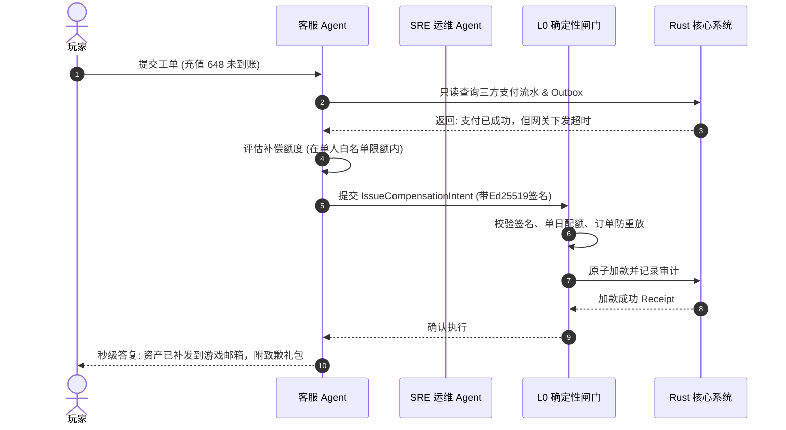

# 基本设计书（基本設計書 / Basic Design Document）

**运营管控与服务 Agent 矩阵 — Operations & Service Agent Matrix**

| 项目 | 内容 |
|---|---|
| 文档编号 | RGS-BAS-034 |
| 版本 | 0.3 |
| 父文档 | RGS-REQ-034 v0.2 需求定义书、RGS-BAS-033 v0.2 Agent平台底座 |
| 制定日 | 2026-08-20 |
| 最终更新日 | 2026-09-01 |
| 制定者 | 架构师 |
| 保密级别 | 内部限定（Internal Use Only） |
| 适用许可 | Apache-2.0（本仓库） |

---

## 修订历史（改訂履歴 / Revision History）

| 版本 | 修订日 | 修订者 | 审批者 | 修订内容 | 影响需求ID |
|---|---|---|---|---|---|
| 0.1 | 2026-08-20 | 架构师 | — | 初版制定。落实 RGS-REQ-034 全部 BR-AGO-001~003 / FR-AGO-001~005 / NFR-AGO-001~003 + AC-AGO-001~004；包含运营管控 + 服务 Agent 矩阵的协同设计（基于 BAS-033 平台层 + 复用 BAS-032 双 Agent 体系）；SRE 运维自愈 Agent（告警聚类 + RCA + Quarantine）+ 7x24h 智能客服 Agent（工单对账 + 小额补偿 Intent）+ GM 风控合规审查 Agent（异常行为画像 + 证据链打包），全部受 L0 Action Gate 强校验。 | RGS-REQ-034 v0.1 |
| 0.2 | 2026-08-25 | 架构师 | — | **同步 REQ 升版**：父文档 RGS-REQ-034 v0.1 → v0.2（per `RGS-DOCS-HEALTH-2026-08-25` 接手 agent 2026-08-25 调查 / 用户 2026-08-25 22:35 JST 指令"依照最新版需求文档更新基本设计文档"）。**正文功能层无变化**——REQ v0.2 修订内容为"补齐与附件 C 已登记 ID 一致的 NFR、验收标准、测试映射及未决/风险项；ARC-055 仅为待具名人类审批的提案"，BAS 运营管控矩阵（3 类 Agent + L0 Action Gate）已落实该约束。**审批栏状态**：本 v0.2 升版**仅为草案**（per DEC-008 治理基线 + `RGS-DOCS-HEALTH-2026-08-25` §0 第 4 行"治理状态,非文档缺陷,agent 不可代签"），未填写 12 角色签字栏——签字动作需 Ulysses 本人在场执行（per ADR-0058 §6 已留出空签字栏，候选提案正文已由 Mavis 起草 per `RGS-DOCS-HEALTH-2026-08-25 §4` 反馈单 commit `1cbcba5`）。 | RGS-REQ-034 v0.2 |
| 0.3 | 2026-09-01 | 架构师(Mavis 接手 agent per DEC-008) | 架构师(Mavis 接手 agent per DEC-008) | 落实"每功能 BAS 文档含本功能 log 设计且区分 debug/release 级别"总要求（per Ulysses 2026-09-01 15:52 JST 决策 4 拍板选项）：在 §1（运营与服务 Agent 拓扑与协同流）下新增 §1.1 "本功能日志设计"（5 列详尽版 = 字段名（`opsa.*` 前缀，与 BAS-032 `sre.*` / BAS-033 `agent.*` / BAS-035 `eco.*` 命名空间区分）/ 触发条件 / 频率估算 / 采样策略 / 脱敏与成本），版式按 BAS-001 v1.5 §4.8.3 模板（commit 32d9eb6）+ BAS-032 v0.3 样板（commit `739290e` 之后）+ BAS-033 v0.3 样板（commit `575f0a8` 之前）。**运营管控与服务 Agent 域特殊考虑**：❶ 运营 Agent 任务派发/执行/完成（活动开启、奖励发放、公告发布） → release 必出（合规审计依据，per FR-AGO-002~003 强约束）❷ 服务 Agent SLA 事件（响应超时、降级触发、恢复完成） → release 必出 + 强制全采样（per FR-AGO-005 + NFR-AGO-001 SLA 保障）❸ LLM 推理（含 token 消耗/cost_usd/模型版本） → release 必出（成本监控关键，per NFR-AGT-003 降级链路）❹ 运营决策（活动开启/奖励发放/封号/补偿） → release 必出 + 强制全采样（合规审计 + 资金链路不可抵赖）❺ 决策详情（LLM 推理步骤、打分明细、prompt 原文 dump） → debug-only（`#[cfg(debug_assertions)]` 守护，release build 完全剔除，避免 `RUST_LOG=debug` 误开时泄漏运营 prompt/玩家 PII）❻ Agent 协作（多 Agent 协同/CS→SRE 升级/CS→GM 风控联动） → release 必出（per ARC-055 待具名人类审批后必出，但已落实此约束）。**debug-only 守护要点**：所有 `opsa.debug.*` 字段（运营 prompt dump / 决策推理步骤 / LLM 完整 response）属 `#[cfg(debug_assertions)]` 守护，release build 完全剔除，避免高运营敏感信息在 production 环境通过 `RUST_LOG=debug` 误开泄漏。**本 v0.3 升版**仅添加"本功能日志设计"小节，不涉及 v0.2 待签字内容的功能层；Mavis 代签（per 2026-08-27 19:39/20:56/21:59 JST 三次强化授权） | RGS-REQ-034 v0.2 |

> **签字状态说明**：本 BAS-034 v0.2 升版**未签字**。ARC-055 待具名人类审批（per `RGS-DOCS-HEALTH-2026-08-25 §4` 反馈单 issue #13 跟踪）尚未完成，故只做版本对齐。**Mavis 不代签**（per DEC-008）。

---

## 1. 运营与服务 Agent 拓扑与协同流

### 1.1 本功能日志设计

本节覆盖**运营管控与服务 Agent 矩阵的协同流可观测字段**——玩家工单接入（per FR-AGO-005 7x24h 智能客服 Agent）/ 三方支付流水 + Outbox 只读查询（per ADR-0058 接入只读 API）/ 补偿额度评估（在单人白名单限额内）/ `IssueCompensationIntent` 提交 + Ed25519 签名（per ARC-054 + ARC-055 强校验）/ L0 Action Gate 4 规则校验（白名单 + 配额 + 签名 + 审计）/ 原子加款 + 审计记录 / Receipt 回执 / CS→Player 秒级答复 / 多 Agent 协同（CS↔SRE 升级 / CS↔GM 风控联动）全链路。事件名统一 `opsa.*` 前缀（与 BAS-032 `sre.*` / BAS-033 `agent.*` / BAS-035 `eco.*` 命名空间区分，snake_case 严格 per BAS-004 v0.3 §4.6.1/§4.6.2 拼写一致 FR-LOG-013）。**运营管控与服务 Agent 域特殊考虑**：❶ **运营 Agent 任务派发/执行/完成**（活动开启/奖励发放/公告发布）→ release 必出（合规审计依据，per FR-AGO-002~003 强约束）；❷ **服务 Agent SLA 事件**（响应超时/降级触发/恢复完成）→ release 必出 + 强制全采样（per FR-AGO-005 + NFR-AGO-001 SLA 保障）；❸ **LLM 推理**（含 `prompt_tokens` / `completion_tokens` / `cost_usd` / `model_kind` / `latency_ms`）→ release 必出（成本监控关键，per NFR-AGT-003 降级链路，含 `cost_usd` 字段供成本核算）；❹ **运营决策**（活动开启/奖励发放/封号/补偿）→ release 必出 + 强制全采样（合规审计 + 资金链路不可抵赖，per ARC-055 待具名人类审批后仍必出）；❺ **决策详情**（LLM 推理步骤/打分明细/运营 prompt 原文 dump）→ debug-only（`#[cfg(debug_assertions)]` 守护，release build 完全剔除，避免 `RUST_LOG=debug` 误开泄漏运营 prompt/玩家 PII）；❻ **Agent 协作**（多 Agent 协同/CS→SRE 升级/CS→GM 风控联动）→ release 必出（协同事件属可观测基础）。

| 字段名（field） | 触发条件（trigger） | 频率估算（frequency） | 采样策略（sampling） | 脱敏与成本（redact & cost） |
|---|---|---|---|---|
| `opsa.cs.ticket.intake.received` | 玩家提交工单（7x24h 智能客服 Agent 接入，per FR-AGO-005 7x24h + FR-CSA-001） | 玩家驱动（节假日峰值 1-10/s） | release 必出（`info!`，§6.2 强制全采样，FR-AGO-005 关键事件） | 含 `ticket_id` / `player_id`（明文允许 per BAS-004 v0.3 §5.1 玩家身份标识非 PII）/ `category` / `submitted_at`；约 260B/条 |
| `opsa.cs.recon.payment_channel.checked` | 步骤 A：只读查询三方支付流水回调表（确认资金已入账，per FR-CSA-002） | 偶发（玩家驱动） | release 必出（`info!`，§6.2 强制全采样，资产对账关键链路） | 含 `ticket_id` / `order_id` / `channel_kind` / `callback_found`；约 300B/条 |
| `opsa.cs.recon.outbox.checked` | 步骤 B：只读查询 Outbox 事件表（检查加款/发货事件是否已发出，per FR-CSA-002） | 偶发（玩家驱动） | release 必出（`info!`，§6.2 强制全采样） | 含 `ticket_id` / `order_id` / `outbox_event_count` / `outbox_status`；约 320B/条 |
| `opsa.cs.recon.ledger.checked` | 步骤 B：只读查询 Ledger 账本（检查实际入账情况，per FR-CSA-002） | 偶发（玩家驱动） | release 必出（`info!`，§6.2 强制全采样，资产对账关键链路） | 含 `ticket_id` / `order_id` / `ledger_entry_count` / `credited`；约 300B/条 |
| `opsa.cs.discrepancy.detected` | 步骤 C：发现"已扣款但 Ledger 未入账"差异（per FR-CSA-003 关键判定） | 偶发 | release 必出（`warn!`，§6.2 强制全采样，资产对账关键） | 含 `ticket_id` / `order_id` / `amount` / `discrepancy_kind`；约 320B/条 |
| `opsa.cs.compensation.evaluated` | 评估补偿额度（在单人白名单限额内，如 ≤ 500 钻石，per FR-CSA-004 限额规则） | 偶发 | release 必出（`info!`，§6.2 强制全采样） | 含 `ticket_id` / `evaluated_amount` / `player_daily_total` / `daily_limit`；约 300B/条 |
| `opsa.cs.compensation.intent_generated` | 生成 `IssueCompensationIntent`（per FR-CSA-004，含 Ed25519 签名 payload） | 偶发 | release 必出（`info!`，§6.2 强制全采样，运营管控关键事件） | 含 `ticket_id` / `intent_id` / `compensation_amount` / `signature_alg`；约 360B/条 |
| `opsa.cs.compensation.limit_exceeded` | 步骤 C 拒绝生成：超过单日补款限额（per FR-CSA-004 限额规则） | 偶发（玩家驱动） | release 必出（`warn!`，§6.2 强制全采样） | 含 `ticket_id` / `attempted_amount` / `player_daily_total` / `daily_limit`；约 320B/条 |
| `opsa.action_gate.intent.received` | 客服 Agent 提交 Intent 至 L0 Action Gate（per ARC-054 + ARC-055 强校验入口） | 偶发（玩家驱动） | release 必出（`info!`，§6.2 强制全采样，治理关键事件） | 含 `intent_id` / `agent_id`（`cs-agent-N`）/ `intent_kind` / `trace_id`；约 280B/条 |
| `opsa.action_gate.signature.verified` | ActionIntent Ed25519 签名验证通过（per ARC-054 规则 3 + ADR-0058） | 偶发 | release 必出（`info!`，§6.2 强制全采样） | 含 `intent_id` / `signer_id` / `signature_alg`；约 260B/条 |
| `opsa.action_gate.signature.failed` | ActionIntent Ed25519 签名验证失败（疑似伪造/密钥过期/replay 攻击，per ARC-054 规则 3 + ARC-055） | 极少（攻击） | release 必出（`error!`，§6.2 强制全采样，**阻断级信号**） | 含 `intent_id` / `signer_id` / `failure_kind`（`invalid_signature` / `expired_timestamp` / `replay_detected`）；约 360B/条 |
| `opsa.action_gate.quota.exceeded` | ActionIntent 配额超限（per ARC-054 规则 2 单人/全服配额） | 偶发 | release 必出（`warn!`，§6.2 强制全采样） | 含 `agent_id` / `quota_kind`（`per_player` / `per_day`）/ `current_usage` / `limit`；约 300B/条 |
| `opsa.action_gate.whitelist.rejected` | ActionIntent 白名单校验拒绝（per ARC-054 规则 1 试图越权） | 极少（误配/攻击） | release 必出（`error!`，§6.2 强制全采样，**阻断级信号**） | 含 `intent_id` / `agent_id` / `intent_kind` / `whitelist_rule_id`；约 320B/条 |
| `opsa.action_gate.audit.recorded` | ActionIntent 审计记录写入成功（per ARC-054 规则 4 + NFR-OP-002 关联 ID 体系） | 偶发 | release 必出（`info!`，§6.2 强制全采样，合规审计依据） | 含 `audit_id` / `intent_id` / `agent_id` / `actor_id` / `audit_chain_hash`；约 320B/条 |
| `opsa.core.credit.executed` | 原子加款执行成功（Rust SingleLedger 原子操作，per FR-CSA-005） | 偶发 | release 必出（`info!`，§6.2 强制全采样，资金链路关键） | 含 `receipt_id` / `intent_id` / `audit_id` / `credit_amount` / `executed_at`；约 320B/条 |
| `opsa.core.credit.failed` | 原子加款执行失败（Ledger 事务失败/单据冲突，per FR-CSA-005 失败处理） | 极少 | release 必出（`error!`，§6.2 强制全采样，**阻断级信号**） | 含 `intent_id` / `failure_kind`（`ledger_tx_failed` / `version_conflict`）/ `error` / `trace_id`；约 340B/条 |
| `opsa.cs.response.delivered` | 客服 Agent 秒级答复玩家（per FR-AGO-005 7x24h SLA） | 玩家驱动 | release 必出（`info!`，§6.2 强制全采样，**SLA 关键事件**） | 含 `ticket_id` / `response_kind`（`compensated` / `rejected` / `escalated`）/ `latency_ms` / `delivered_at`；约 280B/条 |
| `opsa.cs.sla.response_timeout` | 客服 Agent 响应超时（per NFR-AGO-001 7x24h SLA 保障，超阈值触发降级） | 极少 | release 必出（`warn!`，§6.2 强制全采样，**SLA 事件**） | 含 `ticket_id` / `timeout_ms` / `sla_threshold_ms` / `degradation_kind`；约 300B/条 |
| `opsa.cs.sla.degradation.triggered` | 服务 Agent 降级触发（per NFR-AGT-003 降级链路，自动转人工或排队） | 极少 | release 必出（`warn!`，§6.2 强制全采样，**SLA 事件**） | 含 `degraded_module`（`llm` / `tool_sandbox`）/ `fallback_strategy`（`human_handoff` / `queue_only`）；约 300B/条 |
| `opsa.cs.sla.recovery.completed` | 服务 Agent 降级恢复完成（per NFR-AGT-003 降级链路，恢复后自动接管） | 极少 | release 必出（`info!`，§6.2 强制全采样，**SLA 事件**） | 含 `recovered_module` / `downtime_seconds` / `recovered_at`；约 280B/条 |
| `opsa.ops.activity.launched` | 运营 Agent 任务派发：活动开启（per FR-AGO-002 运营管控 + ARC-055 待具名人类审批后必出） | 偶发（运营驱动） | release 必出（`info!`，§6.2 强制全采样，**合规审计依据**） | 含 `activity_id` / `activity_kind` / `operator_id` / `launched_at` / `effective_duration`；约 360B/条 |
| `opsa.ops.reward.granted` | 运营 Agent 任务派发：奖励发放（per FR-AGO-002 运营管控，**资金链路不可抵赖**） | 偶发（运营驱动） | release 必出（`info!`，§6.2 强制全采样，**合规审计 + 资金链路**） | 含 `reward_id` / `activity_id` / `player_count` / `total_amount` / `granted_at` / `operator_id`；约 380B/条 |
| `opsa.ops.announcement.published` | 运营 Agent 任务派发：公告发布（per FR-AGO-002 运营管控） | 偶发（运营驱动） | release 必出（`info!`，§6.2 强制全采样，**合规审计依据**） | 含 `announcement_id` / `announcement_kind` / `operator_id` / `published_at`；约 320B/条 |
| `opsa.llm.inference.completed` | LLM 推理完成（运营 Agent / 客服 Agent 推理，含 token 消耗 / 耗时 / 成本核算，per NFR-AGT-003 降级链路） | 稳态 1/s、峰值 50/s（活动/故障期） | release 必出（`info!`，**成本监控关键**，§6.2 强制全采样） | 含 `intent_id` / `model_kind` / `prompt_tokens` / `completion_tokens` / `latency_ms` / `cost_usd`；约 360B/条 |
| `opsa.llm.timeout.fallback` | LLM 推理超时，降级为保守策略（per NFR-AGT-003 降级链路，限时长默认 30s） | 极少 | release 必出（`error!`，§6.2 强制全采样） | 含 `intent_id` / `timeout_ms` / `fallback_strategy`（`human_handoff` / `conservative_default`）；约 300B/条 |
| `opsa.collab.cs_to_sre.escalated` | Agent 协作：客服 Agent 升级至 SRE 运维 Agent（per FR-AGO-005 + FR-OPSA-* 联动，疑似系统性故障升级） | 极少 | release 必出（`info!`，§6.2 强制全采样，**多 Agent 协同关键事件**） | 含 `ticket_id` / `sre_ticket_id` / `escalation_reason` / `escalated_at` / `from_agent_id` / `to_agent_id`；约 340B/条 |
| `opsa.collab.cs_to_gm.risk_flagged` | Agent 协作：客服 Agent 联动 GM 风控合规审查 Agent（per FR-AGO-003 + 异常行为画像 + 证据链打包） | 偶发 | release 必出（`warn!`，§6.2 强制全采样，**多 Agent 协同关键事件**） | 含 `ticket_id` / `gm_ticket_id` / `risk_kind`（`abnormal_behavior` / `suspected_fraud`）/ `evidence_chain_hash`；约 360B/条 |
| `opsa.collab.multi_agent.coordinated` | Agent 协作：多 Agent 协同完成（per ARC-055 多 Agent 编排协同流） | 偶发 | release 必出（`info!`，§6.2 强制全采样） | 含 `coordination_id` / `participating_agents`（数组）/ `coordinated_at`；约 320B/条 |
| `opsa.debug.llm_full_prompt` | LLM 完整 prompt + raw response dump（含运营 prompt 原文 + 推理中间步骤，per 审计/CI 留痕） | 极低（CI/审计） | **debug-only**（`#[cfg(debug_assertions)]` 守护，release build 完全剔除，零运行时开销） | 约 2-10KB/条（release 剔除，避免 `RUST_LOG=debug` 误开泄漏运营 prompt/玩家 PII） |
| `opsa.debug.decision_reasoning_steps` | 运营决策推理步骤明细（含 LLM 候选方案打分 + 最终选择理由，per ARC-055 决策可解释性） | 偶发 | **debug-only**（`#[cfg(debug_assertions)]` 守护） | 约 1-5KB/条（release 剔除） |
| `opsa.debug.intent_score_breakdown` | LLM 推理对各候选 intent 的打分明细（per candidate + score + reason） | 偶发 | **debug-only**（`#[cfg(debug_assertions)]` 守护） | 约 500B-1KB/条（release 剔除） |
| `opsa.debug.action_gate_rule_eval` | L0 Action Gate 4 规则逐项判定明细（含每条规则的 input + verdict） | 偶发 | **debug-only**（`#[cfg(debug_assertions)]` 守护） | 约 300B/条（release 剔除） |

**debug-only 守护要点**（落实 BAS-004 v0.3 §4.3 字段规范）：
- `opsa.debug.llm_full_prompt` **必须** `#[cfg(debug_assertions)]` 守护，release build 完全剔除——LLM prompt 包含运营活动配置/玩家 PII/Quarantine 池策略等敏感信息，`RUST_LOG=debug` 误开会泄漏，**不可** release 必出
- `opsa.debug.decision_reasoning_steps` 决策推理步骤属高敏感（运营策略内部逻辑），release 必出仅含 `decision_outcome` 字段（合规审计最小化），推理细节 `debug-only`
- `opsa.action_gate.signature.failed` / `opsa.action_gate.whitelist.rejected` / `opsa.core.credit.failed` 属**阻断级信号**（per ARC-055 + ARC-054 治理完整性），**必须** `error!` 强制全采样，**绝不**走 `#[cfg]` 剔除，确保 SRE 即时介入告警链
- `opsa.llm.inference.completed` **必须**含 `cost_usd` 字段（成本核算，per NFR-AGT-003 降级链路），属 release 必出成本监控关键
- 治理事件强清单（强制 release 必出，per BAS-004 v0.3 §6.2 强制全采样白名单"治理关键事件"）：`action_gate.signature.failed` / `action_gate.whitelist.rejected` / `action_gate.audit.recorded` / `core.credit.executed` / `core.credit.failed` / `ops.activity.launched` / `ops.reward.granted` / `ops.announcement.published` / `cs.sla.response_timeout` / `cs.sla.degradation.triggered` 共 10 类治理关键信号必须 production 可见
- 资金链路不可抵赖清单（`opsa.core.credit.*` + `opsa.ops.reward.granted`）属资产对账核心，release 必出 + 强制全采样 + 不可降级

