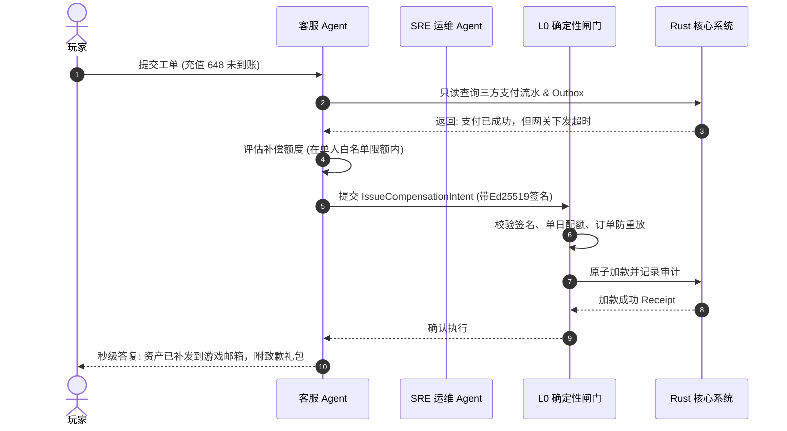

# 基本设计书（基本設計書 / Basic Design Document）

**运营管控与服务 Agent 矩阵 — Operations & Service Agent Matrix**

| 项目 | 内容 |
|---|---|
| 文档编号 | RGS-BAS-034 |
| 版本 | 0.1 |
| 父文档 | RGS-REQ-034 需求定义书、RGS-BAS-033 Agent平台底座 |
| 制定日 | 2026-08-20 |
| 最终更新日 | 2026-08-20 |
| 制定者 | 架构师 |
| 保密级别 | 内部限定（Internal Use Only） |
| 适用许可 | Apache-2.0（本仓库） |

---

## 1. 运营与服务 Agent 拓扑与协同流

