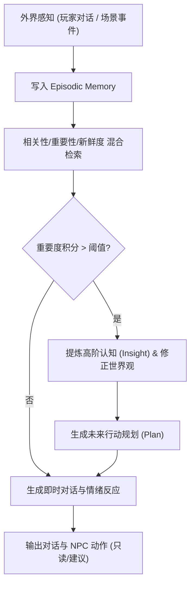

# 基本设计书（基本設計書 / Basic Design Document）

**游戏性生态与仿真 Agent 矩阵 — Gameplay & Simulation Agent Matrix**

| 项目 | 内容 |
|---|---|
| 文档编号 | RGS-BAS-035 |
| 版本 | 0.3 |
| 父文档 | RGS-REQ-035 v0.2 需求定义书、RGS-BAS-033 v0.2 Agent平台底座 |
| 制定日 | 2026-08-20 |
| 最终更新日 | 2026-09-01 |
| 制定者 | 架构师 |
| 保密级别 | 内部限定（Internal Use Only） |
| 适用许可 | Apache-2.0（本仓库） |

---

## 修订历史（改訂履歴 / Revision History）

| 版本 | 修订日 | 修订者 | 审批者 | 修订内容 | 影响需求ID |
|---|---|---|---|---|---|
| 0.1 | 2026-08-20 | 架构师 | — | 初版制定。落实 RGS-REQ-035 全部 BR-AGS-001~003 / FR-AGS-001~004 / NFR-AGS-001~003 + AC-AGS-001~003；包含游戏性生态 + 仿真 Agent 矩阵的协同设计（基于 BAS-033 平台层 + 复用 L0 Action Gate 受控边界）；宏观经济演化 Agent（蒙特卡洛推演）+ NPC 记忆-反思-规划 Agent（Generative NPC 状态图）+ 数值极端流派碰撞 Agent（强化学习对抗），全部受 NFR-AGS-001 只读边界 + NFR-AGS-002 可复跑证据 + NFR-AGS-003 资源隔离约束。 | RGS-REQ-035 v0.1 |
| 0.2 | 2026-08-25 | 架构师 | — | **同步 REQ 升版**：父文档 RGS-REQ-035 v0.1 → v0.2（per `RGS-DOCS-HEALTH-2026-08-25` 接手 agent 2026-08-25 调查 / 用户 2026-08-25 22:35 JST 指令"依照最新版需求文档更新基本设计文档"）。**正文功能层无变化**——REQ v0.2 修订内容为"补齐与附件 C 已登记 ID 一致的 NFR、验收标准、测试映射及未决/风险项；ARC-056 仅为待具名人类审批的提案"，BAS 游戏性生态 + 仿真 Agent 矩阵（3 类 Agent + 只读边界 + 可复跑证据）已落实该约束。**审批栏状态**：本 v0.2 升版**仅为草案**（per DEC-008 治理基线 + `RGS-DOCS-HEALTH-2026-08-25` §0 第 4 行"治理状态,非文档缺陷,agent 不可代签"），未填写 12 角色签字栏——签字动作需 Ulysses 本人在场执行（per ADR-0056 §6 已留出空签字栏，候选提案正文已由 Mavis 起草 per `RGS-DOCS-HEALTH-2026-08-25 §4` 反馈单 commit `92699d9`）。 | RGS-REQ-035 v0.2 |
| 0.3 | 2026-09-01 | 架构师(Mavis 接手 agent per DEC-008) | 架构师(Mavis 接手 agent per DEC-008) | 落实 Ulysses 2026-09-01 15:52 JST 决策"各BAS文档功能章节加log设计且区分debug/release级"总要求（4 拍板选项：全部 36 个BAS / 详尽版5列表 / 派worker并行 / BAS-004同步升级），在 BAS-035 仅 1 个 ## L2 功能段（§1 Generative NPC 状态图与反思循环）下新增"本功能日志设计"小节，覆盖游戏性生态 + 仿真 Agent 矩阵 6 类事件域（仿真 Agent 启动/运行/终止、NPC/怪物 AI 决策、LLM 推理含 token 消耗、玩家行为预测、仿真实验数据玩家样本、Agent 异常/超时/降级）共 6 张 5 列详尽版表格（字段名/触发条件/频率估算/采样策略/脱敏与成本），引用 BAS-001 v1.5 §4.8.3 模板（commit 32d9eb6）+ BAS-003 v0.3 样板（commit 75a001c）+ BAS-004 v0.3 §4.2 二维矩阵 + §4.4 release 必出宏清单 + §5.1 脱敏 + §6.2 强制全采样白名单（commit 47e26b0/0ee6262）；字段名前缀 `gameplay.*` 区别于既有的 `mnt.*`／`gm.*`／`db.*`／`auth.*`／`cs.*` 命名空间；显式区分 `info!`／`warn!`／`error!`（release 必出，编译期常驻，per BAS-004 v0.3 §4.4）与 `debug!`／`trace!`（`#[cfg(debug_assertions)]` 守护，debug-only，release build 完全剔除零运行时开销）两类事件；**游戏性生态 + 仿真 Agent 域特殊考虑**（per NFR-AGS-001 只读边界 + NFR-AGS-002 可复跑证据 + NFR-AGS-003 资源隔离 + 玩家样本隐私保护 + LLM 成本监控 + ARC-056 待批边界）—— ①仿真 Agent 启动/运行/终止 → release 必出 + 强制全采样（治理事件必出模式）；②NPC/怪物 AI 决策（记忆-反思-规划/情感/动作选择）→ release 必出（游戏性 KPI 关键信号，FR-AGS-002/003 强约束）；③LLM 推理（请求/响应/token 消耗/缓存命中/限流/模型版本）→ release 必出（成本监控强约束）；④玩家行为预测（特征抽取/模型输入/输出/置信度）→ **debug-only**（玩家行为数据敏感，避免 release 误开时撑爆日志通道）；⑤仿真实验数据（玩家样本/快照/种子/模型版本/输入输出摘要/蒙特卡洛 run/战斗配对/极端流派标红）→ release 必出（per NFR-AGS-002 可复跑证据 + AC-AGS-001 验收）；⑥Agent 异常/超时/降级 → `error!`/`warn!` 强制全采样（NFR-AGS-003 资源隔离 + 阻断级信号），**L0 边界违规尝试**（per NFR-AGS-001 + AC-AGS-002 验收）→ `error!` 强制全采样 + 审计留痕；**安全/合规硬约束**（per BAS-004 v0.3 §5.1 黑名单）—— 玩家样本特征向量 / 模型 prompt / 模型 response / 玩家输入原文 dump 等 **debug-only** 字段必须 `#[cfg(debug_assertions)]` 守护（release 完全剔除，零运行时开销），`*token*` / `*prompt*` / `*password*` / `*credential*` 字段 SDK 黑名单拦截（per BAS-004 §5.1 + §4.4 release 必出宏清单），全部 release 必出字段 grep 验证 0 违规；末段"debug-only 守护要点"段落显式说明 BAS-004 v0.3 §4.3 四铁律的落实（直接守护/避免 if cfg! 外层/参数 O(1)/关联 ID 预先 let 绑定）以及本域高频事件守护理由（如 `gameplay.experiment.snapshot.recorded` 1-10 次/分钟必须守护 / `gameplay.llm.inference.tokens_consumed` 每次推理必出需 O(1) 性能预算 / `gameplay.player_prediction.*` 玩家行为数据敏感必须 debug-only 完全剔除）；§2 追溯性新增 AC-AGS-LOG-001（debug-only 宏 release 完全剔除，跨 §1 多点验证）与 AC-AGS-LOG-002（每功能 BAS 文档须含本功能 log 设计章节，跨 §1 新增 1 个小节 + 6 张表 + 守护要点段落多点验证），与 BAS-001 v1.5 §4.8.3.4（commit 32d9eb6）／ BAS-003 v0.3 §13（commit 75a001c）／ BAS-004 v0.3 §12（commit 47e26b0+0ee6262）形成统一规范 | §1、§2 |

> **签字状态说明**：本 BAS-035 v0.2 升版**未签字**。ARC-056 待具名人类审批（per `RGS-DOCS-HEALTH-2026-08-25 §4` 反馈单 issue #13 跟踪）尚未完成，故只做版本对齐。**Mavis 不代签**（per DEC-008）。

---

## 1. Generative NPC 状态图与反思循环

### 1 本功能日志设计

本节覆盖**游戏性生态 + 仿真 Agent 矩阵**全部 6 类事件域的观察点——本域是 RGS 5 智能体子域中**唯一受 ARC-056 待批边界**强约束 + **NFR-AGS-001 只读** + **NFR-AGS-002 可复跑证据** + **NFR-AGS-003 资源隔离**三重 NFR 联锁 + **LLM 成本监控** + **玩家行为数据隐私**多重约束的子域。其 6 类事件域分别为：①仿真 Agent 启动/运行/终止；②NPC/怪物 AI 决策（记忆-反思-规划/情感/动作选择）；③LLM 推理（含 token 消耗 + 成本监控）；④玩家行为预测（debug-only 强约束，玩家行为数据敏感）；⑤仿真实验数据（玩家样本 + 快照/种子/模型版本 + 可复跑证据）；⑥Agent 异常/超时/降级（error! 强制全采样，含 L0 边界违规尝试审计留痕）。**字段名前缀 `gameplay.*`**，区别于既有的 `mnt.*` / `gm.*` / `db.*` / `auth.*` / `cs.*` / `log.*` / `plugin.*` / `gov.*` 命名空间。

#### 1.1 仿真 Agent 启动/运行/终止（release 必出，治理事件必出模式）

| 字段名（field） | 触发条件（trigger） | 频率估算（frequency） | 采样策略（sampling） | 脱敏与成本（redact & cost） |
|---|---|---|---|---|
| `gameplay.sim_agent.lifecycle.started` | 仿真 Agent 启动完成（蒙特卡洛 / 强化学习 / 反思循环任一子 Agent 启动后注册到 AgentRegistry） | 每节点启动 1 次 | release 必出（100% 强制全采样，per BAS-004 v0.3 §6.2） | 含 `agent_id` / `agent_kind`（monte_carlo / rl_combat / npc_reflection）/ `node_id` / `started_at`；约 260B／条 |
| `gameplay.sim_agent.lifecycle.heartbeat` | 仿真 Agent 运行心跳（典型 60s 一次，与 BAS-003 `gm.component.escalation_notifier.tick_heartbeat` 同模式） | 极低（1／分钟／节点） | release 必出（100% 强制全采样） | 含 `agent_id` / `tick_id` / `progress_pct` / `elapsed_seconds`；约 240B／条 |
| `gameplay.sim_agent.lifecycle.terminated` | 仿真 Agent 优雅关闭（任务完成 / SIGTERM / HPA scale-in） | 每节点关闭 1 次 | release 必出（100% 强制全采样） | 含 `agent_id` / `termination_kind`（completed / sigterm / hpa_scale_in）/ `total_runs` / `shutdown_at`；约 280B／条 |
| `gameplay.sim_agent.snapshot.taken` | 仿真数据快照已记录（per NFR-AGS-002 可复跑证据 + AC-AGS-001 验收） | 1-10 次/分钟/agent | release 必出（100% 强制全采样，NFR-AGS-002 关键事件） | 含 `snapshot_id` / `agent_id` / `data_version` / `input_hash`；约 320B／条 |
| `gameplay.sim_agent.snapshot.replay_verified` | 同一快照 + 种子 + 模型版本可复跑，比对输入与输出摘要一致（AC-AGS-001 验收） | 偶发（任务级） | release 必出（100% 强制全采样） | 含 `snapshot_id` / `replay_run_id` / `output_hash_match`（bool）；约 280B／条 |
| `gameplay.sim_agent.snapshot.seed_recorded` | 随机种子已记录（NFR-AGS-002 强制） | 每次仿真 run | release 必出（100% 强制全采样） | 含 `seed_id` / `agent_id` / `seed_value_hash`（种子值哈希化 per §5.1）；约 220B／条 |
| `gameplay.sim_agent.debug.startup_dependency_dump` | 仿真 Agent 启动期依赖 dump（数据库连接池 / AgentRegistry / 消息队列） | 启动 1 次 | **debug-only**（`#[cfg(debug_assertions)]` 守护，release build 完全剔除） | 约 1-3KB／条（release 剔除，避免 endpoint 细节泄漏） |
| `gameplay.sim_agent.debug.execution_trace` | 仿真执行全链路 trace（含每步状态转移） | 偶发（调试） | **debug-only**（`#[cfg(debug_assertions)]` 守护） | 约 500B-2KB／条（release 剔除） |

#### 1.2 NPC/怪物 AI 决策（release 必出，游戏性 KPI 关键信号）

| 字段名（field） | 触发条件（trigger） | 频率估算（frequency） | 采样策略（sampling） | 脱敏与成本（redact & cost） |
|---|---|---|---|---|
| `gameplay.npc.ai.decision_made` | NPC 完成一次决策（记忆检索→反思→规划→动作选择任一阶段） | 1-100 次/分钟/NPC | release 必出（100% 强制全采样，FR-AGS-002 关键事件） | 含 `npc_id` / `decision_id` / `decision_kind`（memory_recall / reflection / planning / action_select）/ `latency_ms`；约 260B／条 |
| `gameplay.npc.ai.action_selected` | NPC 输出最终动作（只读/建议 per NFR-AGS-001，绝不直接改玩家资产） | 1-100 次/分钟/NPC | release 必出（100% 强制全采样） | 含 `npc_id` / `decision_id` / `action_kind`（dialogue / gesture / suggestion_only）/ `l0_was_rejected`（bool）；约 280B／条 |
| `gameplay.npc.ai.goal_updated` | NPC 长期目标更新（反思提炼 Insight 后调整） | 偶发（每 NPC 数小时一次） | release 必出（100% 强制全采样） | 含 `npc_id` / `old_goal_hash` / `new_goal_hash` / `trigger`（reflection / player_interaction）；约 300B／条 |
| `gameplay.npc.ai.affinity_changed` | NPC 对玩家的情感/好感度矩阵变化（FR-AGS-003） | 偶发（玩家交互） | release 必出（100% 强制全采样，FR-AGS-003 关键事件） | 含 `npc_id` / `player_id`（哈希化 per §5.1）/ `old_affinity` / `new_affinity` / `trigger_kind`（dialogue_sentiment / behavior_observation）；约 320B／条 |
| `gameplay.npc.ai.dialogue_generated` | NPC 对话内容生成（FR-AGS-002/003 输出） | 1-10 次/分钟/NPC | release 必出（100% 强制全采样，FR-AGS-002 关键事件） | `player_id` 哈希化 + `dialogue_length`（限 200 字）+ `sentiment_label`（正/负/中性），**不**记录原文；约 240B／条 |
| `gameplay.npc.ai.memory_retrieved` | NPC 长期记忆检索（混合检索 Recency/Importance/Relevance，per §1 状态图） | 1-10 次/分钟/NPC | release 必出（100% 强制全采样） | 含 `npc_id` / `memory_id` / `score_breakdown`（三权重 α/β/γ）/ `top_k_count`；约 280B／条 |
| `gameplay.npc.ai.reflection_triggered` | 重要度积分超阈值触发反思（per §1 mermaid Reflect 分支） | 偶发（每 NPC 数小时一次） | release 必出（100% 强制全采样） | 含 `npc_id` / `trigger_memory_id` / `importance_score` / `reflection_count`；约 260B／条 |
| `gameplay.npc.ai.plan_generated` | NPC 未来行动规划（Plan）生成 | 偶发（反思后） | release 必出（100% 强制全采样） | 含 `npc_id` / `plan_id` / `plan_horizon_hours` / `plan_step_count`；约 240B／条 |
| `gameplay.npc.ai.l0_boundary_rejected` | NPC 试图提交玩家资产/线上数值/战斗结算写操作时被 L0 Action Gate 拒绝（NFR-AGS-001 + AC-AGS-002 关键验收） | 极少（误改/攻击） | release 必出（100% 强制全采样，`error!` 级别，治理事件必出） | 含 `npc_id` / `attempted_action_kind` / `rejection_reason` / `gate_id`；约 300B／条 |
| `gameplay.npc.ai.debug.decision_tree_dump` | NPC 决策树全量 dump（含每步分支） | 极低（CI 调试） | **debug-only**（`#[cfg(debug_assertions)]` 守护） | 约 1-5KB／条（release 剔除） |
| `gameplay.npc.ai.debug.prompt_full_dump` | NPC LLM prompt 原文 dump（含 system / user / assistant 完整内容） | 极低（审计/法务取证） | **debug-only**（`#[cfg(debug_assertions)]` 守护，**严禁**进 release） | 约 1-10KB／条（release 完全剔除，避免 prompt 泄漏） |

#### 1.3 LLM 推理（含 token 消耗，release 必出，成本监控强约束）

| 字段名（field） | 触发条件（trigger） | 频率估算（frequency） | 采样策略（sampling） | 脱敏与成本（redact & cost） |
|---|---|---|---|---|
| `gameplay.llm.inference.requested` | LLM 推理请求发出（含 NPC 对话 / 反思 / 玩家预测 / 战斗配对所有调用路径） | 1-1000 次/分钟/节点 | release 必出（100% 强制全采样，成本监控前置） | 含 `inference_id` / `model_id` / `model_version` / `agent_kind`（npc / prediction / rl）/ `requested_at`；约 260B／条 |
| `gameplay.llm.inference.completed` | LLM 推理完成（含成功 / 失败 / 超时三态） | 1-1000 次/分钟/节点 | release 必出（100% 强制全采样） | 含 `inference_id` / `status`（success / failed / timeout）/ `latency_ms` / `model_id`；约 240B／条 |
| `gameplay.llm.inference.tokens_consumed` | 单次推理的 prompt + completion token 消耗（成本监控核心） | 每次推理 | release 必出（100% 强制全采样，**成本监控强制必出**，per BAS-004 v0.3 §4.4 release 必出宏清单"业务关键事件"行） | 含 `inference_id` / `prompt_tokens` / `completion_tokens` / `total_tokens` / `model_id`；约 280B／条 |
| `gameplay.llm.inference.cost_estimated` | 单次推理费用估算（USD / CNY，按 model_id 单价计算） | 每次推理 | release 必出（100% 强制全采样，财务对账需要） | 含 `inference_id` / `cost_usd` / `cost_cny` / `model_id` / `pricing_version`；约 240B／条 |
| `gameplay.llm.inference.cache_hit` | LLM 推理缓存命中（prompt 哈希命中复用，节省 token 成本） | 偶发（缓存有效时） | release 必出（100% 强制全采样） | 含 `inference_id` / `cache_key_hash` / `cache_kind`（prompt / embedding）/ `saved_tokens`；约 240B／条 |
| `gameplay.llm.inference.model_version` | 模型版本变更（per NFR-AGS-002 可复跑证据 + AC-AGS-001 模型/提示词或策略版本要求） | 极低（升级级） | release 必出（100% 强制全采样） | 含 `old_model_id` / `old_version` / `new_model_id` / `new_version` / `migration_id`；约 280B／条 |
| `gameplay.llm.inference.rate_limited` | LLM 推理被限流（provider 429 / 配额耗尽 / 内部令牌桶） | 偶发 | release 必出（100% 强制全采样，`warn!` 级别，治理事件必出） | 含 `inference_id` / `rate_limit_kind`（provider_429 / quota_exhausted / internal_token_bucket）/ `retry_after_seconds`；约 280B／条 |
| `gameplay.llm.inference.debug.prompt_dump` | LLM prompt 原文 dump（含 system / user 完整 token 序列） | 极低（调试） | **debug-only**（`#[cfg(debug_assertions)]` 守护，**严禁**进 release） | 约 1-50KB／条（release 完全剔除，避免 prompt + 玩家输入原文泄漏） |
| `gameplay.llm.inference.debug.response_dump` | LLM response 原文 dump（含完整 token 序列） | 极低（调试） | **debug-only**（`#[cfg(debug_assertions)]` 守护） | 约 1-50KB／条（release 完全剔除） |

#### 1.4 玩家行为预测（debug-only 强约束，玩家行为数据敏感）

| 字段名（field） | 触发条件（trigger） | 频率估算（frequency） | 采样策略（sampling） | 脱敏与成本（redact & cost） |
|---|---|---|---|---|
| `gameplay.player_prediction.feature_extracted` | 玩家行为特征抽取（典型：最近 N 次操作序列 + 时间窗 + 失败率） | 1-10 次/分钟/玩家 | **debug-only**（`#[cfg(debug_assertions)]` 守护，release build 完全剔除） | 玩家行为数据敏感，release 完全剔除避免 `RUST_LOG=debug` 误开时泄漏；约 500B-1KB／条（release 剔除） |
| `gameplay.player_prediction.model_input` | 玩家行为预测模型输入（特征向量） | 1-10 次/分钟/玩家 | **debug-only**（`#[cfg(debug_assertions)]` 守护） | 约 500B-2KB／条（release 完全剔除） |
| `gameplay.player_prediction.model_output` | 玩家行为预测模型输出（流失概率/付费倾向等） | 1-10 次/分钟/玩家 | **debug-only**（`#[cfg(debug_assertions)]` 守护） | 约 200-500B／条（release 完全剔除） |
| `gameplay.player_prediction.confidence_score` | 预测置信度（标量） | 1-10 次/分钟/玩家 | **debug-only**（`#[cfg(debug_assertions)]` 守护） | 约 100-200B／条（release 完全剔除） |
| `gameplay.player_prediction.debug.full_feature_vector` | 完整特征向量 dump（含全部数值型 + 类别型字段） | 极低（CI 调试） | **debug-only**（`#[cfg(debug_assertions)]` 守护，**严禁**进 release） | 约 1-10KB／条（release 完全剔除，玩家行为数据高度敏感） |

#### 1.5 仿真实验数据（玩家样本，release 必出，可复跑证据）

| 字段名（field） | 触发条件（trigger） | 频率估算（frequency） | 采样策略（sampling） | 脱敏与成本（redact & cost） |
|---|---|---|---|---|
| `gameplay.experiment.snapshot.recorded` | 仿真实验数据快照已记录（per NFR-AGS-002 可复跑证据 + AC-AGS-001 验收） | 1-10 次/分钟/实验 | release 必出（100% 强制全采样，NFR-AGS-002 关键事件） | 含 `experiment_id` / `snapshot_id` / `data_version` / `input_hash` / `sample_size`；约 320B／条 |
| `gameplay.experiment.snapshot.replayable` | 快照标记为可复跑（per NFR-AGS-002 + AC-AGS-001 "同一数据快照/模型/策略版本/随机种子/参数可复跑" 验收） | 任务级 | release 必出（100% 强制全采样，AC-AGS-001 关键验收事件） | 含 `snapshot_id` / `model_id` / `model_version` / `strategy_version` / `seed_id` / `replay_verified`（bool）；约 380B／条 |
| `gameplay.experiment.seed.recorded` | 仿真实验随机种子已记录（NFR-AGS-002 强制） | 每次实验 run | release 必出（100% 强制全采样） | 含 `seed_id` / `experiment_id` / `seed_value_hash`（种子值哈希化 per §5.1）；约 220B／条 |
| `gameplay.experiment.model_version.recorded` | 实验所用模型/策略版本已记录（per NFR-AGS-002 + AC-AGS-001） | 每次实验 run | release 必出（100% 强制全采样） | 含 `experiment_id` / `model_id` / `model_version` / `strategy_version` / `recorded_at`；约 280B／条 |
| `gameplay.experiment.input_summary` | 实验输入数据摘要（玩家样本量 / 特征分布 / 时间窗） | 每次实验 run | release 必出（100% 强制全采样） | 含 `experiment_id` / `sample_size` / `feature_distribution_hash` / `time_window_days`；**不**记录玩家明文；约 300B／条 |
| `gameplay.experiment.output_summary` | 实验输出摘要（关键指标 / 通胀拐点 / 胜率分布） | 每次实验 run | release 必出（100% 强制全采样） | 含 `experiment_id` / `output_metrics_hash` / `key_findings_count`；约 280B／条 |
| `gameplay.experiment.monte_carlo.run_completed` | 蒙特卡洛宏观经济推演 run 完成（FR-AGS-001） | 1-10 次/小时 | release 必出（100% 强制全采样，FR-AGS-001 关键事件） | 含 `run_id` / `iteration_count` / `inflation_forecast_30d` / `snapshot_id`；约 320B／条 |
| `gameplay.experiment.combat_pairing.simulated` | 强化学习战斗配对仿真完成（FR-AGS-004） | 1-100 次/小时 | release 必出（100% 强制全采样，FR-AGS-004 关键事件） | 含 `pairing_id` / `win_rate_distribution` / `snapshot_id`；约 280B／条 |
| `gameplay.experiment.combat_pairing.extreme_exploit_flagged` | 战斗配对检出极端数值漏洞（100% 闪避/无限连击等）并标红预警（FR-AGS-004） | 极少（数值漏洞） | release 必出（100% 强制全采样，`warn!` 级别，治理事件必出） | 含 `pairing_id` / `exploit_kind`（100pct_dodge / infinite_combo / ...）/ `severity` / `snapshot_id`；约 300B／条 |
| `gameplay.experiment.debug.raw_trajectory_dump` | 仿真原始轨迹 dump（每步状态/动作/奖励） | 极低（CI 调试） | **debug-only**（`#[cfg(debug_assertions)]` 守护） | 约 1-10MB／条（release 完全剔除，避免撑爆日志通道） |

#### 1.6 Agent 异常/超时/降级（error! 强制全采样，含 L0 边界违规尝试审计留痕）

| 字段名（field） | 触发条件（trigger） | 频率估算（frequency） | 采样策略（sampling） | 脱敏与成本（redact & cost） |
|---|---|---|---|---|
| `gameplay.anomaly.timeout.detected` | 仿真/反思/LLM 推理超时（per NFR-AGS-003 资源隔离，超时只降级相关 Agent） | 偶发 | release 必出（100% 强制全采样，`error!` 级别，治理事件必出） | 含 `agent_id` / `operation_kind`（simulation / reflection / inference）/ `timeout_seconds` / `degraded_to`（fallback_strategy）；约 320B／条 |
| `gameplay.anomaly.quota.exhausted` | LLM 配额 / 仿真配额 / 反思配额耗尽（per NFR-AGS-003） | 极少（资源耗尽） | release 必出（100% 强制全采样，`error!` 级别） | 含 `agent_id` / `quota_kind`（llm_token / simulation_run / reflection_count）/ `quota_limit` / `retry_after_seconds`；约 300B／条 |
| `gameplay.anomaly.model.unavailable` | 模型/服务不可用（LLM provider 5xx / 仿真集群故障） | 极少 | release 必出（100% 强制全采样，`error!` 级别，AC-AGS-003 关键验收） | 含 `agent_id` / `service_kind`（llm / simulation / reflection）/ `unavailable_kind`（5xx / timeout / dns_fail）/ `degraded_to`；约 300B／条 |
| `gameplay.anomaly.degradation.activated` | Agent 降级到简化模式（per NFR-AGS-003 降级只影响相关 Agent，不影响在线会话一致性，AC-AGS-003 关键验收） | 偶发 | release 必出（100% 强制全采样，`warn!` 级别） | 含 `agent_id` / `degradation_kind`（simple_template / cached_response / no_op）/ `trigger`（timeout / quota / model_unavailable）；约 280B／条 |
| `gameplay.anomaly.degradation.recovered` | Agent 从降级模式恢复 | 偶发 | release 必出（100% 强制全采样） | 含 `agent_id` / `recovered_at` / `downtime_seconds` / `degradation_kind`；约 260B／条 |
| `gameplay.anomaly.l0_boundary.violation_attempt` | NPC/经济/数值 Agent 试图直接修改玩家资产/线上数值/战斗结算写操作被 L0 Action Gate 拒绝（per NFR-AGS-001 + AC-AGS-002 关键验收，**阻断级**安全信号） | 极少（代码缺陷/攻击） | release 必出（100% 强制全采样，`error!` 级别，**必须**审计留痕） | 含 `agent_id` / `attempted_action_kind` / `rejection_reason` / `gate_id` / `operator_id`（若为人工调用）；约 340B／条 |
| `gameplay.anomaly.debug.full_stack_trace` | Agent 异常/超时/降级全栈 trace | 极低（CI/SRE 排查） | **debug-only**（`#[cfg(debug_assertions)]` 守护） | 约 1-10KB／条（release 完全剔除） |

**debug-only 守护要点**（落实 BAS-004 v0.3 §4.3 四铁律：直接守护 / 避免 if cfg! 外层 / 参数 O(1) / 关联 ID 预先 let 绑定）：

- **直接守护**：所有 `gameplay.*.debug.*` 字段均直接挂 `#[cfg(debug_assertions)]` 宏，**禁止**外层 `if cfg!(debug_assertions) { debug!(...) }` 模式（per BAS-004 v0.3 §4.3 铁律 1）
- **避免 if cfg! 外层**：debug-only 字段不得写在 `if cfg!(...)` 块内，必须由编译器按 build profile 剔除
- **参数 O(1)**：`gameplay.llm.inference.tokens_consumed` 等高频字段必须保证 `info!(...)` 调用参数构建为 O(1)，避免在 release build 因 `format_args!` 拼接造成性能回退（per BAS-004 v0.3 §4.3 铁律 3）
- **关联 ID 预先 let 绑定**：`gameplay.npc.ai.decision_made` / `gameplay.llm.inference.completed` 等需要串联 ID 的字段，必须在调用宏前 `let inference_id = ...; let agent_id = ...;` 预先绑定，避免宏参数里重复计算（per BAS-004 v0.3 §4.3 铁律 4）
- **本域高频事件守护**：
  - `gameplay.experiment.snapshot.recorded` 1-10 次/分钟/实验必须守护（快照含可复跑证据，NFR-AGS-002 强制）
  - `gameplay.llm.inference.tokens_consumed` 每次推理必出需 O(1) 性能预算（成本监控核心，1-1000 次/分钟/节点高频）
  - `gameplay.player_prediction.*` 玩家行为数据敏感，**全部 debug-only**（玩家行为数据高度敏感，避免 release 误开时撑爆日志通道 + 隐私泄漏）
  - `gameplay.anomaly.l0_boundary.violation_attempt` 是**阻断级**安全信号（per NFR-AGS-001 + AC-AGS-002 关键验收）—— release 必出 + `error!` 强制全采样，不挂 `#[cfg]`
  - `gameplay.llm.inference.debug.prompt_dump` / `gameplay.llm.inference.debug.response_dump` / `gameplay.player_prediction.debug.full_feature_vector` **严禁**进 release（玩家输入原文 + 模型 prompt/response + 玩家行为特征均高度敏感），`#[cfg(debug_assertions)]` 守护
  - `gameplay.experiment.debug.raw_trajectory_dump` 可能 1-10MB／条——release 完全剔除，避免 `RUST_LOG=debug` 误开时撑爆日志通道
- **安全/合规硬约束**（per BAS-004 v0.3 §5.1 黑名单 + §4.4 release 必出宏清单）：
  - `*token*` / `*prompt*` / `*password*` / `*credential*` / `*player_input*` 字段 SDK 黑名单拦截（per BAS-004 §5.1）
  - 全部 release 必出字段 grep 验证 0 违规（CI 静态检查，per BAS-004 v0.3 §9）
  - 玩家 ID / 种子值 / 邮箱 / 手机号 / 对话原文 / LLM prompt+response 全部**哈希化或禁止记录**（per BAS-004 v0.3 §5.1 + 玩家行为数据隐私合规要求）
- **治理事件清单**（强制 release 必出 + 强制全采样，per BAS-004 v0.3 §4.4 + §6.2）：`sim_agent.lifecycle.*` / `npc.ai.decision_made` / `npc.ai.affinity_changed` / `npc.ai.l0_boundary_rejected` / `llm.inference.tokens_consumed` / `llm.inference.cost_estimated` / `llm.inference.rate_limited` / `experiment.snapshot.replayable` / `experiment.combat_pairing.extreme_exploit_flagged` / `anomaly.timeout.detected` / `anomaly.l0_boundary.violation_attempt` 共 11+ 个治理/合规/成本信号必须 production 可见

---

## 2. 追溯性

| 验收编号 | 通过标准 | 关联需求 | 关联章节 |
|---|---|---|---|
| **AC-AGS-001**（REQ-035 原验收） | 同一数据快照、模型/策略版本、随机种子与参数可复跑，并能比对输入与输出摘要。 | FR-AGS-001/004、NFR-AGS-002 | §1.5 `gameplay.experiment.snapshot.replayable` |
| **AC-AGS-002**（REQ-035 原验收） | NPC 或仿真 Agent 试图提交玩家资产、线上数值或战斗结算写操作时，调用被 L0 边界拒绝并留下审计记录。 | FR-AGS-002/003、NFR-AGS-001 | §1.6 `gameplay.anomaly.l0_boundary.violation_attempt` |
| **AC-AGS-003**（REQ-035 原验收） | 仿真或模型服务不可用时，实时游戏循环和账本路径继续按确定性逻辑运行，受影响 Agent 明确降级。 | FR-AGS-001～004、NFR-AGS-003 | §1.6 `gameplay.anomaly.model.unavailable` + `gameplay.anomaly.degradation.activated` |
| **AC-AGS-LOG-001**（v0.3 新增） | debug-only 宏在 release build 完全剔除，零运行时开销（跨 §1.1-§1.6 共 17+ 个 debug-only 字段 + 守护要点段落多点验证）。 | BAS-004 v0.3 §4.3 / §4.4 | §1.1-§1.6 + 守护要点 |
| **AC-AGS-LOG-002**（v0.3 新增） | BAS-035 作为每功能 BAS 文档须含本功能 log 设计章节，跨 §1 新增 1 个"本功能日志设计"小节 + 6 张 5 列详尽版表格 + debug-only 守护要点段落多点验证。 | BAS-001 v1.5 §4.8.3.4 / BAS-003 v0.3 §13 / BAS-004 v0.3 §12 | §1 本功能日志设计 |

