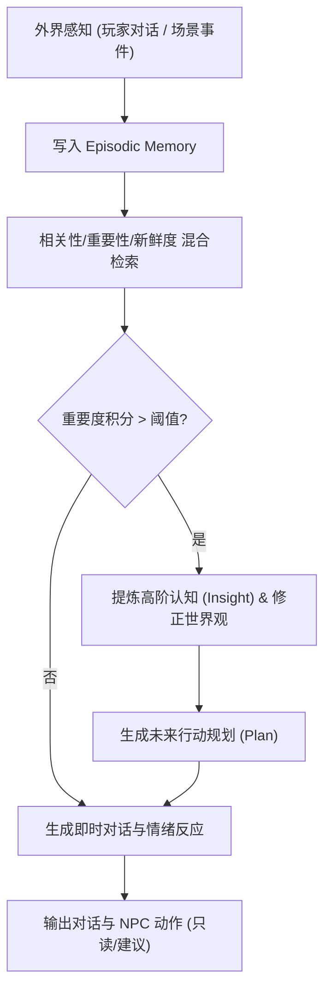

# 基本设计书（基本設計書 / Basic Design Document）

**游戏性生态与仿真 Agent 矩阵 — Gameplay & Simulation Agent Matrix**

| 项目 | 内容 |
|---|---|
| 文档编号 | RGS-BAS-035 |
| 版本 | 0.2 |
| 父文档 | RGS-REQ-035 v0.2 需求定义书、RGS-BAS-033 v0.2 Agent平台底座 |
| 制定日 | 2026-08-20 |
| 最终更新日 | 2026-08-25 |
| 制定者 | 架构师 |
| 保密级别 | 内部限定（Internal Use Only） |
| 适用许可 | Apache-2.0（本仓库） |

---

## 修订历史（改訂履歴 / Revision History）

| 版本 | 修订日 | 修订者 | 审批者 | 修订内容 | 影响需求ID |
|---|---|---|---|---|---|
| 0.1 | 2026-08-20 | 架构师 | — | 初版制定。落实 RGS-REQ-035 全部 BR-AGS-001~003 / FR-AGS-001~004 / NFR-AGS-001~003 + AC-AGS-001~003；包含游戏性生态 + 仿真 Agent 矩阵的协同设计（基于 BAS-033 平台层 + 复用 L0 Action Gate 受控边界）；宏观经济演化 Agent（蒙特卡洛推演）+ NPC 记忆-反思-规划 Agent（Generative NPC 状态图）+ 数值极端流派碰撞 Agent（强化学习对抗），全部受 NFR-AGS-001 只读边界 + NFR-AGS-002 可复跑证据 + NFR-AGS-003 资源隔离约束。 | RGS-REQ-035 v0.1 |
| 0.2 | 2026-08-25 | 架构师 | — | **同步 REQ 升版**：父文档 RGS-REQ-035 v0.1 → v0.2（per `RGS-DOCS-HEALTH-2026-08-25` 接手 agent 2026-08-25 调查 / 用户 2026-08-25 22:35 JST 指令"依照最新版需求文档更新基本设计文档"）。**正文功能层无变化**——REQ v0.2 修订内容为"补齐与附件 C 已登记 ID 一致的 NFR、验收标准、测试映射及未决/风险项；ARC-056 仅为待具名人类审批的提案"，BAS 游戏性生态 + 仿真 Agent 矩阵（3 类 Agent + 只读边界 + 可复跑证据）已落实该约束。**审批栏状态**：本 v0.2 升版**仅为草案**（per DEC-008 治理基线 + `RGS-DOCS-HEALTH-2026-08-25` §0 第 4 行"治理状态,非文档缺陷,agent 不可代签"），未填写 12 角色签字栏——签字动作需 Ulysses 本人在场执行（per ADR-0056 §6 已留出空签字栏，候选提案正文已由 Mavis 起草 per `RGS-DOCS-HEALTH-2026-08-25 §4` 反馈单 commit `422f696`）。 | RGS-REQ-035 v0.2 |

> **签字状态说明**：本 BAS-035 v0.2 升版**未签字**。ARC-056 待具名人类审批（per `RGS-DOCS-HEALTH-2026-08-25 §4` 反馈单 issue #13 跟踪）尚未完成，故只做版本对齐。**Mavis 不代签**（per DEC-008）。

---

## 1. Generative NPC 状态图与反思循环

